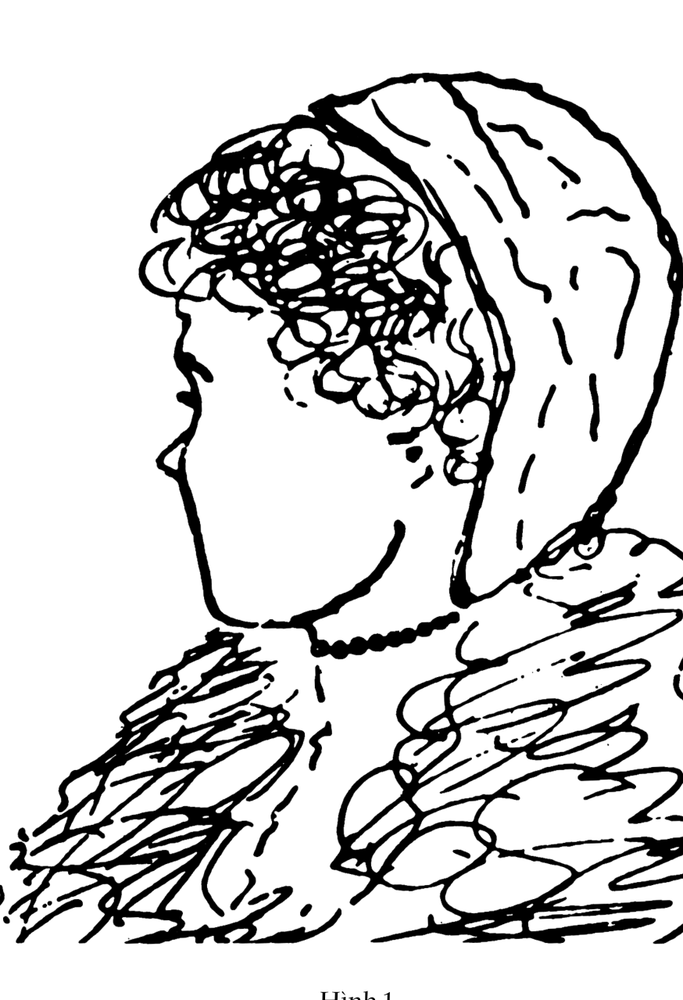
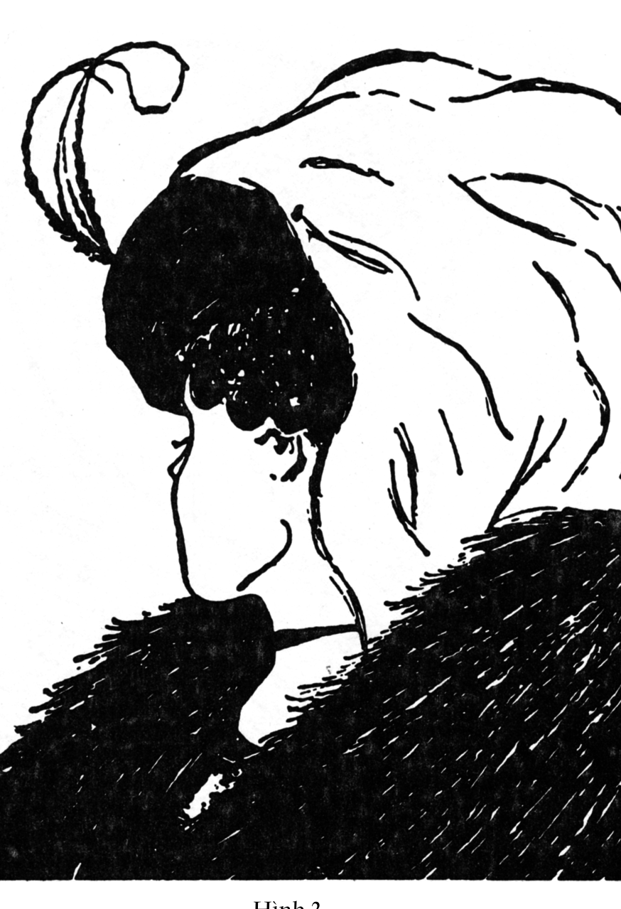
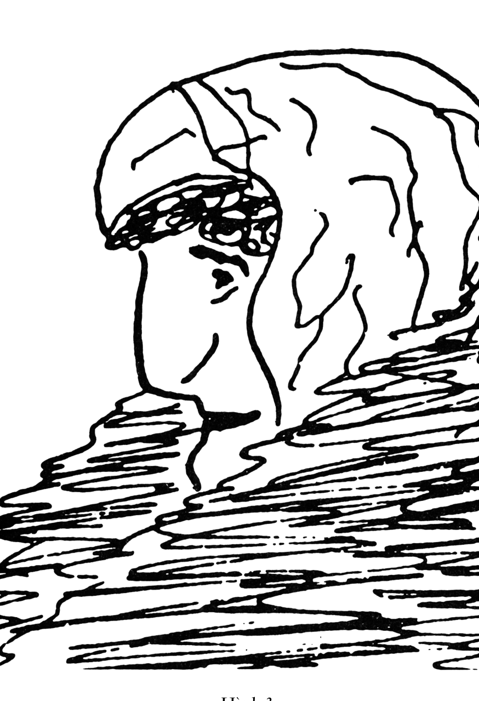
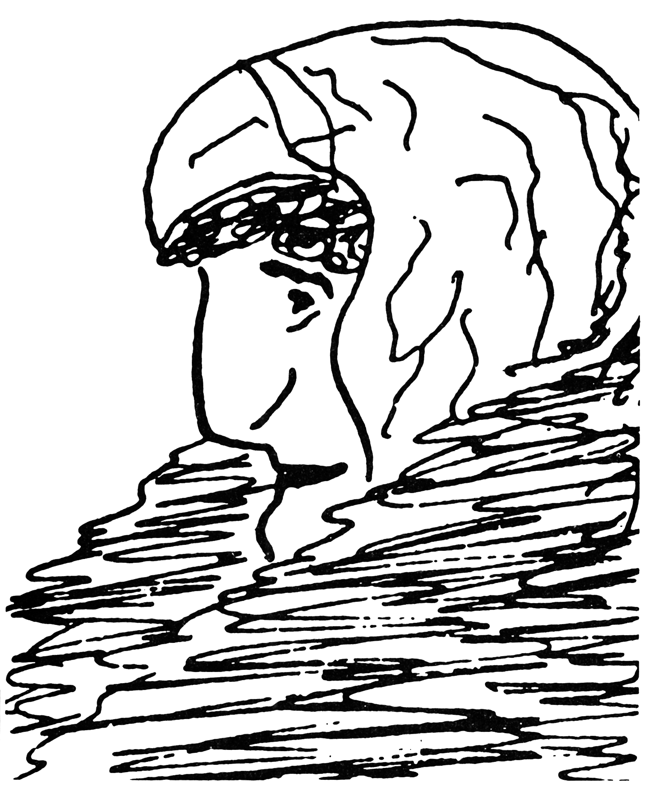
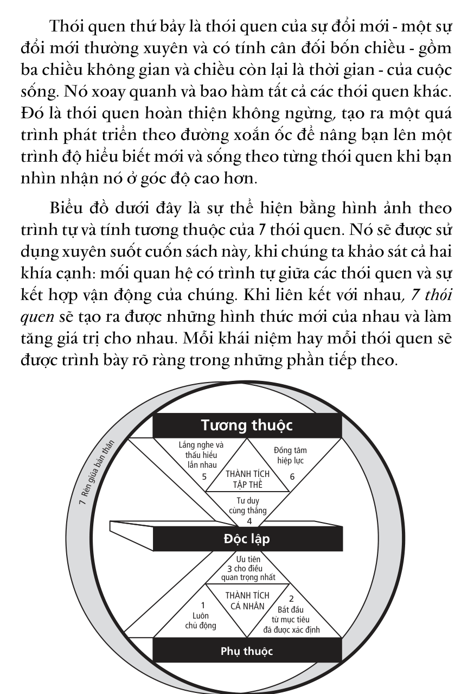

# CHƯƠNG 1: NHỮNG KHÁI NIỆM TỔNG QUAN

## CÁNH CỬA CỦA SỰ THAY ĐỔI

> “Không ai có thể thuyết phục người khác thay đổi. Mỗi cánh cửa của sự thay đổi vốn chỉ có thể mở được từ bên trong bản thân mỗi người. Dù bằng lý lẽ hay sự lôi kéo tình cảm, bạn cũng không thể mở cánh cửa đó của người khác.”
>
> — *Marilyn Ferguson*

## Những thách thức của kỷ nguyên mới

### SỢ HÃI VÀ TỰ TI

Rất nhiều người sống trong thời đại ngày nay luôn mang tâm trạng lo âu, sợ hãi. Họ lo lắng về tương lai: sợ bị mất việc làm, sợ không còn khả năng chu cấp cho gia đình … Chính thái độ tự ti này đã đưa họ đến một lối sống an phận và dựa dẫm vào người khác, cả trong công việc và trong gia đình. Như vậy, theo nền văn hóa của chúng ta, tính tự lập càng được xem là giải pháp phổ biến cho vấn đề này. “Tôi sống vì tôi. Tôi làm tốt công việc của tôi, và tôi có quyền tận hưởng những thú vui của cuộc sống”. Tính tự lập mang một ý nghĩa vô cùng quan trọng, thậm chí còn mang tính sống còn. Tuy nhiên, chúng ta đang sống trong một thực tại tương thuộc và để đạt được những thành quả quan trọng, ngoài khả năng hiện có, bản thân mỗi người phải biết sống hợp tác và hỗ trợ lẫn nhau.

### ƯỚC MUỐN VÀ THAM VỌNG SỞ HỮU

“Tôi muốn có tiền. Tôi muốn có một ngôi nhà thật đẹp, một chiếc ôtô sang trọng, một trung tâm giải trí lớn nhất và hiện đại nhất. Tôi muốn có tất cả và tôi xứng đáng được hưởng thụ mọi thứ”. Mặc dù ước muốn của con người là vô hạn và tham vọng được sở hữu luôn sẵn sàng; mặc dù trong thời đại “thẻ tín dụng” ngày nay, người ta có thể dễ dàng “mua trước trả sau”; mặc dù ai cũng cố gắng làm việc chăm chỉ… nhưng cuối cùng, chúng ta cũng phải đối diện với một thực tế chua xót là sức mua không theo kịp sức sản xuất; thành quả đạt được vẫn không thể đủ so với nhu cầu. Với tốc độ thay đổi nhanh chóng và cạnh tranh không ngừng do toàn cầu hóa trong lĩnh vực thị trường và khoa học kỹ thuật, chúng ta không những phải được đào tạo, mà còn phải liên tục tự đào tạo và tự làm mới bản thân. Chúng ta phải phát triển trí tuệ và trau dồi kỹ năng để tránh bị đào thải. Nhu cầu tạo ra của cải là nhu cầu trước mắt, nhưng để thành công, cần phải phát triển bền vững lâu dài. Bạn hoàn toàn có khả năng đạt được các chỉ tiêu hàng quý, nhưng điều quan trọng là liệu bạn đã đầu tư đúng hướng để có được sự bền vững và thành công kéo dài đến 5 hay 10 năm sau hay không? Thế mà thông thường, mọi người chỉ chú trọng đến kết quả trước mắt. Tuy nhiên, nguyên tắc tất yếu dẫn đến những thành tựu trong tương lai - trái ngược với lối suy nghĩ trên - chính là tạo sự cân bằng giữa việc thỏa mãn các yêu cầu trước mắt với việc đầu tư vào các khả năng tiềm ẩn. Điều này cũng đúng khi áp dụng cho các vấn đề khác của con người như sức khỏe, bản thân, gia đình và các nhu cầu xã hội.

### TRỐN TRÁNH TRÁCH NHIỆM

Mỗi khi có chuyện gì không hay xảy ra, người ta thường đi tìm những lý do khách quan đến từ hoàn cảnh bên ngoài mà “quên” xem xét lại chính mình. Xã hội ngày nay đầy rẫy những kẻ luôn cho mình là nạn nhân như thế, họ luôn tìm cách đổ lỗi: “Giá như sếp tôi không phải là một gã ngốc và nghiêm khắc như thế… Giá như tôi không sinh ra trong một gia đình nghèo khó như thế… Giá như tôi được sống ở một nơi tốt hơn… Giá như tôi không thừa hưởng cái tính nóng nảy đó của cha tôi… Giá như các con tôi không bướng bỉnh như thế… Giá như nền kinh tế của chúng ta không xuống dốc như thế này… Giá như các nhân viên của tôi không lười biếng và thiếu nhiệt huyết trong công việc như vậy… Giá như vợ tôi thông cảm với tôi hơn…”. Những mệnh đề đó dần dần trở thành cách nói quen thuộc ở một vài người. Họ xem những khó khăn và thách thức xảy ra với mình là do người khác gây nên. Cũng có thể khi nghĩ như thế, tạm thời họ cảm thấy nhẹ nhõm, nhưng về lâu dài sẽ trói buộc họ vào những rắc rối không thể nào tháo gỡ được.

Hãy cho tôi biết một người dám nhận trách nhiệm về những việc làm của mình hoặc có đủ dũng khí để vượt qua thử thách, tôi sẽ cho bạn thấy sức mạnh phi thường trong tinh thần người ấy.

### TUYỆT VỌNG

Người thường xuyên đổ lỗi cho hoàn cảnh là người luôn hoài nghi và mãi sống trong vô vọng. Những ai mang tư tưởng mình là nạn nhân của hoàn cảnh và dễ đầu hàng trước khó khăn sẽ nhanh chóng đánh mất niềm tin vào cuộc sống, đánh mất động lực vươn lên và cam chịu sống trong bế tắc. “Tôi chỉ là một quân cờ, một con rối dưới sự điều khiển của người khác, một kẻ thấp cổ bé họng chẳng thể làm gì được!”. Thậm chí nhiều người thông minh, có học thức cũng suy nghĩ như vậy và chính suy nghĩ đó đã biến họ thành người nhu nhược, thiếu nhiệt tình.

Theo lối suy nghĩ lạc hậu thông thường, giải pháp cho vấn đề này là chỉ cần hạ thấp mọi tham vọng, ước muốn của bạn xuống mức thấp nhất – đến nỗi không còn ai, không còn điều gì có thể làm bạn thất vọng nữa. Tuy nhiên, theo nguyên tắc tích cực chống lại giải pháp trên, bạn cần phải khẳng định rằng: “Tôi chính là động lực sáng tạo của cuộc đời mình”.

### MẤT CÂN BẰNG TRONG CUỘC SỐNG

Cuộc sống thời công nghệ thông tin đang ngày càng phức tạp, căng thẳng và khắc nghiệt. Chúng ta luôn cố gắng tận dụng tốt quỹ thời gian của mình, nỗ lực làm việc và đương nhiên cũng gặt hái nhiều thành công nhờ vào những thành tựu công nghệ hiện đại. Thế thì tại sao chúng ta lại luôn luôn thấy mình rối mù vì những chuyện lặt vặt về sức khỏe, cuộc sống gia đình, phẩm chất đạo đức, và nhiều điều khác làm ảnh hưởng đến cuộc sống? Sự thật, nguyên nhân không phải do công việc – vốn là động lực để duy trì cuộc sống, hay do sự biến động phức tạp của xã hội hiện tại, mà do lối suy nghĩ phổ biến trong nền văn hóa hiện đại như: “Hãy đến công sở sớm hơn, ở lại lâu hơn, làm việc tốt hơn và hy sinh nhiều hơn”. Chính lối suy nghĩ này đã lấy đi sự cân bằng trong cuộc sống và sự thanh thản trong mỗi tâm hồn. Chỉ những ai có một ý thức rõ ràng về khát vọng và quyết tâm theo đuổi nó bằng tất cả sức lực, tâm huyết mới có thể tự tạo ra cho mình một cuộc sống cân bằng, thanh thản.

### TÍNH VỊ KỶ

Trong nền văn hóa chúng ta, nếu muốn đạt được một điều gì đó thì bạn phải “đi tìm và đạt cho bằng được điều tốt nhất”. Và cũng theo nền văn hóa ấy, cuộc sống là một trò chơi, một cuộc chạy đua, một cuộc cạnh tranh, và bạn phải thắng trong các cuộc đọ sức đó. Những người bạn cùng lớp, các đồng nghiệp, thậm chí cả những thành viên trong gia đình đều có thể trở thành đối thủ của nhau – nếu họ thắng càng nhiều thì phần còn lại dành cho bạn càng ít. Tất nhiên, chúng ta vẫn luôn thể hiện sự vui mừng trước những thắng lợi của kẻ khác – như một người rộng lượng. Tuy vậy, rất nhiều người trong chúng ta vẫn ngấm ngầm ghen tỵ khi người khác thành công. Trong lịch sử đã có nhiều thành tựu vĩ đại đạt được nhờ vào sức lực và tâm huyết của một người làm việc độc lập, nhưng trong thời đại ngày nay, những cơ hội thành công lớn và những thành tựu vô giá chỉ dành cho những ai thấu hiểu được nghệ thuật “hợp tác”. Song, cho dù có ở thời đại nào đi nữa thì sự vĩ đại chân chính cũng chỉ có thể đạt được nhờ vào một tâm hồn rộng mở, làm việc quên mình, tôn trọng lẫn nhau và vì lợi ích chung.

### NIỀM KHAO KHÁT ĐƯỢC LẮNG NGHE

Bất kỳ ai trong chúng ta cũng mong muốn những ý kiến của mình được người khác lắng nghe, thấu hiểu, được đánh giá cao và tạo nên ảnh hưởng. Chìa khóa để gây ảnh hưởng nằm ở khả năng giao tiếp – trình bày quan điểm một cách rõ ràng, đủ sức thuyết phục người khác. Nhưng bạn có nhận ra rằng trong khi người khác đang nói chuyện với bạn, thay vì chú tâm lắng nghe để hiểu rõ ý kiến của họ, bạn lại tập trung vào việc chuẩn bị để đưa ra ý kiến của mình không? Việc gây được ảnh hưởng chỉ thực sự bắt đầu khi người khác nhận thấy rằng họ đã làm cho bạn tập trung chú ý, thấy được ở bạn sự chia sẻ, lắng nghe một cách chăm chú, chân thành và cởi mở. Thế nhưng, do cảm xúc dễ bị tác động nên hầu hết mọi người đều không đủ kiên nhẫn để lắng nghe và hiểu rõ ý kiến người khác trước khi đưa ra ý kiến của mình. Nền văn hóa của chúng ta kêu gọi, thậm chí đòi hỏi phải thấu hiểu và gây ảnh hưởng. Tuy nhiên, theo nguyên tắc gây ảnh hưởng, để thấu hiểu nhau thì trước hết, phải chú ý lắng nghe.

### XUNG ĐỘT VÀ KHÁC BIỆT

Con người cùng chia sẻ nhiều điểm chung nhưng đồng thời cũng có nhiều nét khác biệt. Người ta suy nghĩ không giống nhau, quan niệm về các giá trị khác nhau, có các động cơ và mục đích khác nhau. Những điểm khác biệt này đương nhiên sẽ dẫn đến xung đột. Để giải quyết những xung đột ấy, người ta thường sử dụng những cách thức nhằm “thu lợi ích về mình càng nhiều càng tốt”. Mặc dù có nhiều kết quả tốt đạt được bằng nghệ thuật đàm phán, khi mà hai bên tranh chấp đều tỏ ra nhượng bộ để đi đến thỏa thuận chung, nhưng thật ra, không bên nào hoàn toàn hài lòng với kết quả đạt được. Vậy tại sao không tìm ra điểm chung nhất từ những khác biệt nêu trên? Vậy tại sao lại không áp dụng nguyên tắc hợp tác sáng tạo để tìm ra các giải pháp tốt hơn cả dự tính ban đầu của cả hai bên?

### BẾ TẮC CỦA BẢN THÂN

Bản chất của con người được thể hiện ở bốn yếu tố: thể xác (body), trí tuệ (mind), tâm hồn (heart) và tinh thần (spirit). Hãy so sánh những khác biệt và kết quả theo hai cách tiếp cận khác nhau dưới đây:

| Yếu tố | Xu hướng chung | Nguyên tắc |
| :--- | :--- | :--- |
| **Thể xác** | Duy trì lối sống. Nếu bị bệnh thì đi khám và chữa bệnh. | Phòng ngừa bệnh tật và các vấn đề sức khỏe bằng cách điều chỉnh lối sống phù hợp với các quy tắc bảo vệ sức khỏe đã được thừa nhận. |
| **Trí tuệ** | Xem ti-vi để giải trí. | Đào sâu kiến thức, không ngừng học hỏi. |
| **Tâm hồn** | Sử dụng các mối quan hệ với người khác nhằm trục lợi cá nhân. | Lắng nghe, tôn trọng và giúp đỡ người khác sẽ đem lại sự hài lòng và cảm giác hạnh phúc. |
| **Tinh thần** | Khuất phục chủ nghĩa thế tục và chủ nghĩa hoài nghi đang ngày càng phát triển. | Nhận ra rằng nguồn gốc của nhu cầu tìm hiểu về ý nghĩa và những điều tốt đẹp trong cuộc sống nằm ngay trong các nguyên tắc. |

---

## Đâu là giải pháp?

Trước khi chúng ta bắt tay vào nghiên cứu ***7 Thói Quen Để Thành Đạt,*** tôi muốn gợi ý hai sự biến đổi ***mô thức*** có thể làm gia tăng hiệu quả khi bạn sử dụng cuốn sách này.

Trước hết, tôi đề nghị các bạn không nên “xem” tập tài liệu này như một cuốn sách chỉ việc đọc xong rồi cất lên kệ sách, vì nó có thể trở thành một người đồng hành với bạn trong quá trình thay đổi và phát triển. Nội dung trong cuốn sách này được sắp xếp theo trình tự tăng dần mức độ sâu sắc, và ở cuối mỗi phần đều có những gợi ý áp dụng để bạn có thể nghiên cứu và tập trung vào từng thói quen cụ thể của riêng mình. Khi đã hiểu sâu và vận dụng tốt, bạn có thể quay trở lại các nguyên tắc trong từng thói quen để nghiên cứu sâu hơn về kiến thức, kỹ năng và khát vọng của bản thân.

Thứ hai, tôi muốn gợi ý rằng bạn nên thay đổi mô thức của việc tham gia vào tập tài liệu này, nghĩa là chuyển từ vai trò của người học sang vai trò của người dạy. Bạn cũng nên áp dụng quan điểm “bắt đầu từ bên trong” – thay đổi nhận thức của chính mình – và cùng chia sẻ hay thảo luận với một người nào đó những điều bạn học được trong vòng 48 giờ sau đó.

Ví dụ, nếu bạn biết trước rằng sẽ dạy cho ai đó về nguyên tắc cân bằng P/PC (sản phẩm/năng lực sản xuất) trong vòng 48 giờ, thì điều này có làm cho việc đọc của bạn khác đi không? Hãy cố gắng làm điều này ngay khi bạn đọc phần cuối của cuốn sách. Hãy đọc nó với suy nghĩ bạn cần có đủ thông tin và hiểu biết thấu đáo để giảng giải cho vợ/ chồng hay con cái, đồng sự, nhân viên của mình thông suốt một vấn đề nào đó ngay hôm nay hoặc ngày mai.

Tôi bảo đảm rằng nếu tiếp cận tài liệu này theo cách trên, bạn sẽ không chỉ nhớ lâu hơn những gì đã đọc mà tầm nhìn của bạn cũng sẽ được mở rộng, sự hiểu biết của bạn sẽ sâu sắc hơn và hiệu quả áp dụng những điều đã học sẽ tăng lên rõ rệt.

Ngoài ra, khi chia sẻ một cách cởi mở và chân thực điều đã học được với người khác, bạn sẽ ngạc nhiên nhận ra rằng những thành kiến hoặc nhận thức tiêu cực mà người khác có thể có về bạn hầu như biến mất. Những người được bạn chia sẻ sẽ nhìn thấy ở bạn một con người đang thay đổi, trưởng thành hơn và họ sẽ hỗ trợ bạn hết lòng để đưa ***7 Thói quen*** hòa nhập vào cuộc sống của bạn.

---

## Chúng ta có thể kỳ vọng điều gì?

Nếu bạn quyết định mở “cánh cửa của sự thay đổi” để thực sự hiểu và sống theo các nguyên tắc được trình bày trong ***7 Thói quen*** thì tôi có thể yên tâm bảo đảm với bạn rằng nhiều điều tích cực sẽ đến với bạn.

Trước tiên, sự trưởng thành của bạn sẽ diễn ra, tuy chậm rãi theo chu trình của nó nhưng tác dụng thay đổi lại trở nên rất mạnh mẽ và toàn diện. Hệ quả cuối cùng của việc mở “cánh cửa của sự thay đổi” đối với ***3 thói quen*** đầu tiên - các thói quen của thành tích cá nhân - sẽ làm tăng sự tự tin một cách đáng kể. Bạn sẽ hiểu bản thân hơn với những ý nghĩa sâu xa về bản chất, giá trị và năng lực cống hiến của mình. Khi sống theo các ***mô thức*** thì ý thức về cá tính, tính tự chủ và sự tự định hướng trong bạn sẽ ngấm sâu vào bên trong, giữ cho tinh thần bạn được bình yên, bình yên trong sự phấn chấn. Bạn sẽ nhận diện bản thân mình từ bên trong thay vì thông qua ý kiến của người khác hay bằng cách so sánh với những người khác. “Sai” hay “Đúng” sẽ không ảnh hưởng gì lớn đến những gì bạn đã tìm thấy.

Một khi không còn quan tâm nhiều về những điều người khác nghĩ về mình, bạn sẽ quan tâm nhiều hơn về những điều người khác nghĩ về bản thân họ và về thế giới của họ, kể cả mối quan hệ của họ với bạn. Bạn sẽ không còn xây dựng cuộc sống tình cảm của mình dựa trên sự yếu kém của người khác. Bạn sẽ cảm thấy dễ dàng hơn và sẵn sàng hơn đối với sự thay đổi, bởi vì có cái gì đó - nằm sâu bên trong bạn - về cơ bản không hề đổi thay.

Khi tự mình đón nhận ***3 thói quen*** tiếp theo - các thói quen về thành tích tập thể, bạn sẽ khám phá và giải phóng cả ý muốn lẫn nguồn lực để hàn gắn và xây dựng lại các mối quan hệ quan trọng đã bị xói mòn, hay sắp bị phá vỡ. Còn các mối quan hệ tốt đẹp chắc chắn sẽ được cải thiện, trở nên sâu sắc, vững chắc hơn, sáng tạo và lý thú hơn.

Thói quen thứ bảy, nếu tiếp thu một cách sâu sắc, sẽ đem lại sức sống mới cho ***6 thói quen*** đầu tiên, sẽ làm cho bạn thực sự trở thành một người độc lập và có được hiệu quả tốt đẹp trong các mối quan hệ hỗ tương. Qua đó, bạn cũng có thể tự hoàn thiện bản thân mình.

Dù hoàn cảnh hiện tại của bạn thế nào đi nữa, tôi vẫn tin rằng bạn không phải là một người thủ cựu với các thói quen cũ kỹ của mình. Bạn có thể thay đổi chúng bằng những khuôn mẫu mới, những thói quen mới của sự thành đạt, hạnh phúc và các mối quan hệ dựa trên sự tin cậy lẫn nhau.

Với sự quan tâm thật sự, tôi mong rằng sau khi nghiên cứu các thói quen này, bạn sẽ mở được cánh cửa của sự thay đổi để trưởng thành hơn. Rõ ràng, mọi sự thay đổi đều khó có thể thực hiện được ngay, nhưng tôi bảo đảm với các bạn rằng bạn sẽ cảm thấy có lợi và được nhận về những phần thưởng xứng đáng. Hãy kiên nhẫn với chính mình vì không có sự đầu tư nào lớn hơn thế.

> “Chúng ta thường không quý những gì có được một cách dễ dàng. Chỉ có sự cao quý mới làm cho mọi thứ trở nên có giá trị.”  
> — *Thomas Paine*

# MÔ THỨC VÀ NGUYÊN TẮC

> “Không có sự xuất sắc thật sự nào tồn tại trên đời mà tách biệt với cách sống đúng đắn.”  
> — *David Starr Jordan*

# Bắt đầu từ bên trong

Trong hơn 25 năm làm việc, tôi đã gặp và tiếp xúc với nhiều người rất thành đạt. Họ là doanh nhân, giảng viên đại học, bạn bè và cả người thân trong gia đình tôi. Tuy thành đạt như vậy nhưng bên trong họ vẫn luôn bừng cháy khao khát được mãn nguyện và bình yên nơi tâm hồn cũng như có được mối quan hệ tốt đẹp với những người xung quanh.

Có lẽ vấn đề họ chia sẻ với tôi cũng giống như những trăn trở của các bạn:

> Tôi đã đạt được các mục tiêu và gặt hái những thành công vượt bậc trong nghề nghiệp của mình, nhưng lại chẳng còn chút thời gian nào dành cho vợ con, cũng như để hiểu được bản thân và nhận ra đâu là điều quan trọng nhất đối với cuộc đời mình. Nhiều lần tôi tự hỏi: mọi thứ có đáng để tôi đánh đổi như vậy không?

> Tôi lại bắt đầu một chế độ ăn kiêng mới - lần thứ năm trong năm nay. Tôi biết mình thừa cân, và tôi muốn thay đổi. Tôi đọc tất cả các thông tin mới về ăn kiêng. Tôi đặt ra các mục tiêu, tự khích lệ chính mình bằng một thái độ sống tích cực và tự nhủ sẽ thực hiện thành công. Nhưng rồi tôi cũng không làm được tới nơi tới chốn; sau vài tuần thực hiện, tôi đã bỏ cuộc. Dường như tôi cũng không thể giữ nỗi một lời hứa với chính mình.

> Tôi tham dự hết khóa đào tạo này đến khóa huấn luyện khác về quản trị hiệu quả. Tôi cố đối xử tốt và tạo mối quan hệ thân

***tình với nhân viên của mình, kỳ vọng vào năng lực của họ nhưng tôi không thấy ai trung thành với mình cả. Tôi nghĩ nếu tôi bị ốm nằm nhà một ngày, họ sẽ tha hồ mà tán gẫu với nhau suốt buổi. Tại sao tôi không thể rèn luyện họ biết làm việc một cách tự giác và có tinh thần trách nhiệm - hay tìm được người có những đức tính đó?***

> Cậu quý tử nhà tôi vừa quậy phá lại vừa nghiện ngập. Dù tôi đã cố hết cách nhưng vẫn không cải tạo được nó. Tôi phải làm gì bây giờ?

> Có quá nhiều việc phải làm nhưng thời gian không bao giờ đủ cả. Tôi cảm thấy áp lực đè nặng và bức bối suốt ngày, suốt tuần. Tôi dự các hội thảo về quản trị thời gian hiệu quả và đã thử áp dụng nửa tá phương pháp hoạch định thời gian khác nhau, nhưng vẫn không cảm thấy mình đang sống một cuộc sống hạnh phúc, hữu ích và yên bình như mong muốn.

> Tôi muốn dạy các con tôi giá trị của lao động, nhưng mỗi khi nhờ chúng làm việc gì, tôi đều phải theo dõi và chịu đựng những lời kêu ca phàn nàn cho tới khi chúng làm xong việc. Nếu tôi tự làm chắc hẳn sẽ dễ dàng hơn nhiều. Tại sao bọn trẻ không thể vui vẻ và tự giác làm việc?

> Tôi bận, rất bận, nhưng thỉnh thoảng tôi lại tự hỏi liệu những gì mình đang làm về lâu dài có tạo ra sự khác biệt nào không. Tôi rất muốn nghĩ rằng cuộc đời mình có một ý nghĩa nào đó, rằng dù thế nào đi chăng nữa, mọi thứ sẽ khác đi vì sự có mặt của tôi.

> Khi thấy bạn bè và người thân đạt được một số thành công trong cuộc sống hoặc được thừa nhận trong xã hội, tôi mỉm cười và chúc mừng họ với cả tấm lòng. Nhưng trong thâm tâm, tôi lại ganh tị với họ. Tại sao tôi lại có những phức cảm như vậy?

> Tôi là người có cá tính mạnh. Tôi biết rằng tôi có thể kiểm soát được kết quả trong hầu hết các tình huống giao tiếp. Tôi có thể tác động người khác thuận theo ý mình. Tôi suy ngẫm từng tình huống và thực sự thấy rằng những ý kiến mình nêu lên thường là những ý kiến hay nhất để mọi người nghe theo. Nhưng tôi vẫn không cảm thấy thoải mái và luôn tự hỏi không biết mọi người nghĩ gì về mình và các ý tưởng của mình.

> Cuộc hôn nhân của tôi trở nên nhạt nhẽo. Chúng tôi không mâu thuẫn hay lục đục gì với nhau cả, nhưng không còn yêu nhau nữa. Dù đã nhờ đến Trung tâm tư vấn hôn nhân gia đình và thực hiện một số cách, chúng tôi vẫn không thể nhóm lên ngọn lửa nồng ấm mà cả hai từng có.

Những vấn đề nêu trên đều phức tạp và rối rắm nên không thể dùng những biện pháp cố định, nhanh chóng để giải quyết.

Vài năm trước, vợ chồng tôi cũng rơi vào một hoàn cảnh tương tự. Cậu con trai của chúng tôi học rất kém, thậm chí nó không thể hiểu câu hỏi trong bài kiểm tra. Trong giao tiếp hàng ngày, thằng bé quá nhút nhát và thường tỏ ra bối rối trước cả những người gần gũi nhất với mình. Trong hoạt động thể thao, nó rất ốm yếu, vụng về, không biết cách phối hợp đồng đội. Ví dụ, khi chơi bóng chày, bóng chưa được ném mà nó đã vung gậy lên đỡ. Vì thế bọn trẻ thường cười nhạo nó.

Hai vợ chồng tôi ra sức tìm cách giúp con trai vì theo quan điểm của chúng tôi, nếu “thành công” là một yếu tố quan trọng trong cuộc sống, thì nó cũng vô cùng quan trọng đối với vai trò làm cha mẹ của chúng tôi. Do vậy, chúng tôi cố gắng dùng thái độ và hành vi của mình tác động đến con và ra sức áp dụng các liệu pháp tâm lý tích

cực cổ vũ tinh thần thằng bé: “Nào cố lên con! Bố mẹ biết con có thể làm được mà! Cầm gậy cao hơn một chút, mắt nhìn thẳng vào bóng. Đừng vụt gậy cho tới khi con thấy quả bóng bay tới gần trước mặt”. Và nếu thằng bé có một chút tiến bộ, chúng tôi động viên ngay: “Tốt lắm. Cứ chơi như thế nhé!”.

Khi bọn trẻ xung quanh cười nhạo nó, chúng tôi la rầy chúng: “Hãy để nó yên. Nó mới tập chơi mà.” Lúc đó, cậu nhóc nhà tôi chỉ biết khóc và khăng khăng bảo rằng nó không thể nào chơi tốt được, rằng nó chưa bao giờ thích chơi bóng chày cả.

Những gì chúng tôi cố gắng làm cho con dường như chẳng có tác dụng gì đáng kể, và điều này khiến cho chúng tôi thật sự lo lắng. Chúng tôi có thể thấy được những việc này ảnh hưởng đến lòng tự trọng của nó. Dù chúng tôi luôn động viên, hỗ trợ và tỏ vẻ lạc quan nhưng vẫn liên tiếp thất bại. Cuối cùng, chúng tôi đành bỏ cuộc và cố gắng nhìn nhận vấn đề theo một góc độ khác.

Vào thời điểm đó, tôi cũng đang tham gia giảng dạy các khóa học về phát triển kỹ năng lãnh đạo cho nhiều công ty khác nhau khắp nước Mỹ. Tôi thiết kế những khóa học (mỗi khóa cách nhau 2 tháng) về giao tiếp và nhận thức cho các học viên trong chương trình “Phát Triển Lãnh Đạo” của IBM.

Trong khi nghiên cứu và chuẩn bị những bài thuyết trình, tôi đặc biệt quan tâm tìm hiểu sự hình thành của nhận thức, ảnh hưởng của nhận thức đến cách nhìn nhận một vấn đề; từ đó, tìm hiểu xem cách nhìn nhận vấn đề chi phối hành vi như thế nào. Điều này dẫn dắt tôi đến việc nghiên cứu lý thuyết kỳ vọng - hay còn gọi là “Hiệu ứng

Pygmalion”(*) cũng như tìm cách lý giải câu hỏi: Sự tự nhận thức của chúng ta được khắc sâu như thế nào? Câu trả lời đã giúp tôi mở ra một nhận thức mới mẻ: Chiếc lăng kính mà chúng ta sử dụng để ngắm nhìn thế giới xung quanh sẽ định hướng cách chúng ta diễn dịch về thế giới.

Từ các khái niệm tôi đang giảng dạy cho IBM, vợ chồng tôi liên hệ trực tiếp đến trường hợp con trai mình. Chúng tôi bắt đầu nhận ra rằng cách chúng tôi trợ giúp con không hài hòa với nhận thức thật sự của chúng tôi về thằng bé. Theo nhận thức của chúng tôi, về cơ bản, nó là một đứa trẻ thiểu năng và có phần “tụt hậu” so với những đứa trẻ khác. Do đó, mọi cố gắng của chúng tôi đã không mang lại kết quả gì. Dù cho những hành động và lời nói của vợ chồng tôi đều mang tính khích lệ, động viên, nhưng thực chất, thông điệp mà chúng tôi truyền cho con lại là: “Con không thể làm được. Con cần phải được giúp đỡ”.

Vì vậy, nếu muốn thay đổi tình hình, trước tiên chúng ta phải thay đổi bản thân; và để thay đổi bản thân một cách có hiệu quả, chúng ta phải bắt đầu từ việc thay đổi nhận thức của mình.

### 1. ĐẠO ĐỨC NHÂN CÁCH VÀ ĐẠO ĐỨC TÍNH CÁCH

Bên cạnh việc nghiên cứu về nhận thức, tôi còn bị cuốn hút vào một công trình nghiên cứu chuyên sâu các tài liệu về ***thành công*** kể từ năm 1776 *(**)* đến nay. Tôi đã đọc và rà soát

(*) Hiệu ứng Pygmalion là một quá trình tạo ra ở người khác những mong đợi,

mà thật ra đó là kết quả của một tri giác ít hay nhiều rõ ràng về đối tượng của mình - Theo “Những khái niệm cơ bản của Tâm lý học xã hội”; Huyền Giang dịch, NXB Hà Nội, 1998.

(**) 04/07/1776: ngày thành lập Hợp chủng quốc Hoa Kỳ, gồm 13 bang đầu tiên.

hàng trăm cuốn sách, hàng ngàn bài báo và tiểu luận trong các lĩnh vực như: ***tự lực, tự hoàn thiện bản thân, tâm lý học phổ thông…*** Tôi có trong tay một bộ sưu tập tư liệu mà hầu hết mọi người đều cho rằng nó chứa đựng chiếc chìa khóa dẫn tới thành công.

Từ những trải nghiệm của chính mình và chứng kiến trải nghiệm của rất nhiều người khác, tôi tìm ra được những phương pháp vừa khoa học và thực tiễn, vừa mang tính chân lý về quá trình mưu cầu sự thành công của con người.

Trong 150 năm đầu tiên từ sau ngày thành lập Hợp chủng quốc Hoa Kỳ, hầu hết các sách nói về thành công đều tập trung khai thác quan điểm ***Đạo đức tính cách***(Character Ethic) - bao gồm sự chính trực, đức khiêm tốn, lòng trung thành, sự mực thước, lòng can đảm, sự công bằng, sự cần cù, tính giản dị, lòng thật thà cùng bộ***Quy tắc vàng về ứng xử xã hội*** (Golden Rule) - được xem là nền tảng của thành công. Tự truyện của Benjamin Franklin *(*)* là một đại diện tiêu biểu cho trào lưu này. Về cơ bản, đó là câu chuyện về một người cố gắng kết hợp các nguyên tắc sống và những thói quen cố hữu với tính cách của mình.

Theo quan điểm ***Đạo đức tính cách*** , có một số nguyên tắc sống cơ bản. Để sống thật sự hạnh phúc và thành công, con người phải biết gắn những nguyên tắc này vào tính cách riêng của mình.

Sau Thế chiến thứ nhất, quan điểm chủ đạo về thành công chuyển từ ***Đạo đức tính cách***sang***Đạo đức nhân cách*** (Personality Ethic). Lúc bấy giờ, mọi người cho rằng thành

(*) Benjamin Franklin (1706 - 1790) là một trong những nhà lập quốc của nước Mỹ. Ông là một nhà báo, nhà khoa học, nhà phát minh, nhà hoạt động xã hội,

nhà ngoại giao nổi tiếng thế kỷ XVIII.

công chủ yếu là do nhân cách, hình ảnh xã hội, thái độ và hành vi, các kỹ năng và bí quyết giúp quá trình giao tiếp giữa con người với nhau được thông suốt hơn. Quan điểm này gồm hai xu hướng: một là các quy tắc ứng xử cá nhân và xã hội, hai là thái độ sống tích cực (PMA – Positive Mental Attitude). Một vài nội dung của triết lý này được diễn dịch thành những câu châm ngôn tuyên truyền rất có giá trị, chẳng hạn như: “Thái độ quyết định tầm nhìn”, “Một nụ cười là mười người bạn”, “Những gì con người nhận thức được và tin, họ sẽ làm được”… Trong đó cũng có cả việc hướng dẫn sử dụng các tiểu xảo để lấy lòng người, hay giả vờ quan tâm đến những thú vui của người khác để được phần mình, hoặc sử dụng “sức mạnh ánh mắt” để chinh phục hay dọa dẫm người khác.

Một số sách theo quan điểm ***Đạo đức nhân cách***cũng thừa nhận***tính cách***là một trong những yếu tố của thành công, nhưng lại hạ thấp vai trò nền tảng hay tính xúc tác của nó đối với thành công Do đó, trong những cuốn sách này,***Đạo đức tính cách*** dường như trở thành những lời nói suông và các tác giả chỉ nhấn mạnh các kỹ xảo gây ảnh hưởng cá nhân, âm mưu quyền lực, kỹ năng giao tiếp và thái độ tích cực.

Sau khi suy nghĩ sâu hơn về sự khác nhau giữa các quan điểm ***Đạo đức nhân cách***và***Đạo đức tính cách*** , vợ chồng tôi đã nhận ra sai lầm khi cố gắng tách những lợi ích về mặt xã hội ra khỏi hành vi tích cực của con trai. Chúng tôi nghĩ rằng thằng bé không đủ khả năng để tự làm bất cứ một điều gì. Chúng tôi đã đặt hình ảnh bản thân và vai trò làm cha mẹ cao hơn lợi ích của thằng bé. Chúng tôi chỉ chú ý đến cách nhìn nhận và cách xử lý vấn đề của mình mà không quan tâm đến hạnh phúc của con. Điều này không mang lại sự

thay đổi tích cực nào cho thằng bé mà còn có tác động ngược đến nhân cách của nó.

Khi Sandra và tôi nói chuyện với nhau, chúng tôi mới đau khổ nhận ra rằng chúng tôi bị ảnh hưởng mạnh mẽ bởi tính cách, động cơ và nhận thức chủ quan về con mình. Chúng tôi biết rằng các động cơ so sánh mang tính xã hội không phù hợp với những giá trị riêng của chúng tôi. Điều này dẫn đến việc chúng tôi yêu thương con không đúng cách và càng làm cho thằng bé cảm thấy mình vô dụng. Do đó, chúng tôi quyết định tập trung hết sức vào chính mình, vào những động cơ và nhận thức của mình về thằng bé. Thay vì tìm cách thay đổi con trai, chúng tôi đứng ra xa, quan sát và cảm nhận diện mạo, cá tính, những nét riêng và giá trị của bản thân nó.

Bằng những nhận thức đó cũng như qua việc luyện tập lòng tin, chúng tôi bắt đầu nhìn con theo cách khác. Chúng tôi nhận ra rất nhiều tiềm năng có thể được khuyến khích phát triển song hành cùng với quá trình trưởng thành của con. Chúng tôi quyết định bớt quan tâm và không cản đường thằng bé nữa mà để tự nó bộc lộ nhân cách. Chúng tôi nhận ra thiên chức của các bậc cha mẹ là để khẳng định, chia sẻ và đánh giá khả năng của con mình. Chúng tôi cũng xem xét lại các động cơ của mình một cách có ý thức hơn, đồng thời, nuôi dưỡng sức mạnh tinh thần để cảm nhận các giá trị của con mà không bị những hành vi “không thể chấp nhận được” của thằng bé chi phối.

Khi từ bỏ nhận thức cũ, chúng tôi đã có nhiều thay đổi: không so sánh con với những đứa trẻ cùng trang lứa khác, không phán xét theo những khuôn mẫu, không đặt vào con kỳ vọng hay mong muốn của chúng tôi, và không tìm cách thúc ép con phải làm theo những mô thức này nọ.

Chúng tôi để thằng bé tự quyết định mọi hành vi, ứng xử của mình. Bước đầu, chúng tôi nhận thấy rằng con mình về cơ bản cũng có đầy đủ tư chất để có thể đương đầu với cuộc sống. Do đó, chúng tôi không còn tìm cách che chở, tránh cho thằng bé khỏi bị trêu chọc như trước kia nữa. Chúng tôi thấy rằng thỉnh thoảng nó cũng có vài biểu hiện thu mình, và chúng tôi chấp nhận mà không cần phải phản ứng lại. Chúng tôi ngầm cho con biết rằng: “Cha mẹ không cần phải che chở con. Con có thể tự mình vượt qua được”.

Ngày tháng trôi qua, thằng bé dần dần cảm thấy tự tin hơn. Nó bắt đầu có những hành động tự khẳng định mình, thể hiện qua sự tiến bộ về các mặt học hành, quan hệ xã hội và hoạt động thể thao. Vài năm sau, nó được bầu làm thủ lĩnh của nhiều tổ chức học sinh, trở thành vận động viên cấp quốc gia, đem về nhà đủ các loại bằng khen. Con trai chúng tôi đã tự phát triển nhân cách, và gây được cảm tình với mọi người.

Vợ chồng tôi tin rằng những thành tích “rất ấn tượng về mặt xã hội” của con trai chính là biểu hiện của cảm giác muốn tìm hiểu bản thân mình, hơn là chỉ để nhận được phần thưởng của xã hội. Đó là một kinh nghiệm đáng quý và là một bài học có tính giáo dục cao, không những cho chúng tôi mà còn cho nhiều bậc phụ huynh khác. Nó giúp chúng tôi nhận thức được sự khác biệt quan trọng giữa ***Đạo đức nhân cách***và***Đạo đức tính cách*** .

Có một câu trong thánh ca diễn tả rất đúng nhận thức này: “Hãy chú ý lắng nghe lời của trái tim mình vì mọi vấn đề trên đời đều nảy sinh từ đó”.

### 2. CHÍNH YẾU VÀ THỨ YẾU

Nhờ kinh nghiệm từ trường hợp con trai mình, kết hợp với các nghiên cứu về khả năng nhận thức và đọc các sách viết về thành công, tôi tích lũy được nhiều bài học thú vị và bất ngờ về con đường đi đến thành công. Tôi bất chợt nhận ra ảnh hưởng mạnh mẽ của quan điểm ***Đạo đức nhân cách***và hiểu rõ sự khác biệt tinh tế giữa những gì trước kia tôi cho là đúng – những giá trị tôi được dạy dỗ từ tấm bé và đã ăn sâu vào tiềm thức – với những triết lý hiện hữu hàng ngày trong cuộc sống. Khi làm việc với nhiều người, tôi hiểu sâu hơn lý do tại sao quan điểm của tôi lại mâu thuẫn với suy nghĩ chung của họ. Đó là vì những quy tắc trong thuyết***Đạo đức nhân cách***đã ăn sâu vào tiềm thức của nhiều thế hệ, ảnh hưởng đến việc giáo dục của các bậc phụ huynh đối với quá trình trưởng thành của con em họ. Thêm nữa, khi sử dụng triệt để năng lực của nhân loại để xây dựng nền tảng cho những thế hệ trước đây, cha ông chúng ta đã quá tập trung vào hình thức ngôi nhà của mình mà thiếu quan tâm đến phần móng, chúng ta quen thu hoạch những cái có sẵn mà quên đi sự cần thiết của việc gieo hạt. Tôi không có ý nói rằng các nội dung của***Đạo đức nhân cách***như sự phát triển nhân cách, rèn luyện kỹ năng giao tiếp, giáo dục các phương cách gây ảnh hưởng, tư duy tích cực… là không hiệu quả. Bởi vì, trên thực tế đôi khi***Đạo đức nhân cách*** cũng cần thiết cho sự thành công, nhưng đó chỉ là yếu tố phụ mà thôi.

Nếu chúng ta cố ý sử dụng các phương cách gây ảnh hưởng buộc người khác làm điều mình muốn, để khuyến khích họ làm việc tốt hơn, hay để họ yêu thích chúng ta, trong khi bản thân chúng ta còn nhiều khiếm khuyết, nhất là tính giả dối, thì rút cục chúng ta cũng không thể thành công. Tính giả dối sẽ dẫn đến sự thiếu tin cậy. Do đó, mọi

việc chúng ta làm, thậm chí cả việc tạo dựng mối quan hệ tốt với người khác cũng sẽ được coi là giả tạo. Dù cho ý định của chúng ta có tốt đến đâu đi nữa nhưng một khi nó chỉ được thiết lập dựa trên sự lừa dối, không trung thực và thiếu tin cậy thì sẽ không thể tạo dựng nền tảng thành công vững bền. Bạn thử nghĩ xem mọi chuyện sẽ như thế nào nếu bạn quên gieo trồng vào mùa xuân, rong chơi suốt mùa hè và ra sức làm vào mùa thu để kịp thu hoạch trước mùa đông? Đồng ruộng, cũng như tất cả mọi quy trình khác, đều có quy luật của nó: Chỉ có công sức thật sự mới có thể mang lại kết quả như mong đợi. Để gặt hái kết quả, chúng ta phải bắt đầu từ việc gieo hạt!

Nguyên tắc trên đúng với cả hành vi của con người lẫn các mối quan hệ giữa con người với nhau. Chẳng hạn ở trường học, mọi học sinh đều có thể vượt qua các kỳ thi nếu nghiêm túc thực hiện các quy chế học tập và thi cử. Trong hầu hết các mối quan hệ thoáng qua giữa con người với nhau, người ta thường sử dụng các quy tắc của ***Đạo đức nhân cách*** để được việc cho mình hoặc để gây ấn tượng với đối phương nhờ sự duyên dáng và khéo léo. Nhưng cách này không thể xây dựng được mối quan hệ lâu dài. Nếu không có sự trung thực và sức mạnh tính cách cơ bản thì những thách thức trong cuộc sống sẽ làm bộc lộ những động cơ ẩn giấu bên trong và khi đó, thất bại sẽ thay thế cho những thắng lợi nhất thời.

Nhiều người chỉ đạt được những thành tích thứ yếu – được xã hội nhìn nhận năng lực - nhưng lại thiếu cái chính yếu, tức những phẩm chất tích cực cơ bản. Sớm muộn gì con người thực của họ cũng sẽ bộc lộ qua các mối quan hệ lâu dài, bất kể với đối tác kinh doanh, vợ chồng, bạn bè, hay với con cái. Theo Emerson, ***“Tính cách của bạn lấn át cả***

***những lời bạn nói”*** . Do đó, tính cách là công cụ giao tiếp hiệu quả nhất.

Tuy nhiên, nếu một người có bản chất tốt, tính cách tốt, thói quen tốt nhưng thiếu kỹ năng giao tiếp thì chắc chắn sẽ ảnh hưởng đến các mối quan hệ. Nhưng những ảnh hưởng này chỉ là thứ yếu.

Tóm lại, tính cách bên trong có sức thuyết phục hơn nhiều so với hành động và lời nói. Một khi biết rõ tính cách tốt đẹp của ai đó thì mặc nhiên chúng ta hoàn toàn tin tưởng ở họ, và làm việc rất thành công với họ bất kể họ có khả năng giao tiếp khéo léo hay không.

Điều này quả đúng như lời của William George Jordan: ***“Thiện và ác có một sức mạnh kỳ lạ ẩn bên trong mỗi con người; đó là sự tác động thầm lặng, vô thức và vô hình đối với cuộc đời họ. Đó chính là sự phản ánh bản chất thật của một con người, chứ không phải là sự giả tạo của họ”.***

### 3. ẢNH HƯỞNG CỦA MÔ THỨC

Cuốn sách ***7 Thói Quen Để Thành Đạt***chứa đựng những nguyên tắc cơ bản, những thói quen chủ yếu góp phần xây dựng một cuộc sống tích cực cho mỗi người. Để hiểu rõ***7 thói quen***này, trước hết, chúng ta cần phải hiểu***mô thức***của bản thân và cách thay đổi***mô thức*** đó.

Hai khái niệm ***Đạo đức tính cách***và***Đạo đức nhân cách***nêu trên là ví dụ về mô thức xã hội. Thuật ngữ***mô thức***(paradigm) có xuất xứ từ tiếng Hy Lạp. Đây là một thuật ngữ khoa học, ngày nay thường được dùng với nghĩa là***mô hình, lý thuyết, nhận thức, giả thuyết***hay***khung tham chiếu***. Nói một cách dễ hiểu hơn,***mô thức*** là cách chúng ta “nhìn” thế giới – không phải bằng trực giác mà bằng nhận thức, sự

hiểu biết và theo cách lý giải của riêng chúng ta.

Cách đơn giản nhất để hiểu được khái niệm ***mô thức*** là xem nó như một tấm bản đồ. Chúng ta đều biết bản đồ không phải là lãnh thổ, nó đơn giản chỉ là sự sao chụp và giải thích một số khía cạnh nhất định nào đó của lãnh thổ. Đó cũng chính là ý nghĩa của mô thức.

Giả sử bạn muốn đi đến một địa điểm cụ thể tại thành phố Chicago và bạn phải sử dụng tấm bản đồ đường phố Chicago. Thế nhưng, giả sử như người ta đưa cho bạn tấm bản đồ sai. Do lỗi in ấn, tấm bản đồ thành phố Chicago thực ra là bản đồ thành phố Detroit chẳng hạn, bạn có hình dung ra sự bực bội, sự bất lực của mình trong việc cố tìm ra điểm cần đến như thế nào không?

Với tấm bản đồ Detroit trong tay, bạn bắt đầu sử dụng ***hành vi***của mình - nỗ lực tìm kiếm điểm cần đến ở thành phố Chicago. Nhưng cố gắng đó chỉ đưa bạn đến sai chỗ nhanh hơn mà thôi. Rồi bạn sử dụng đến*** thái độ – suy nghĩ tích cực hơn - nhưng vẫn không đến được đúng nơi cần đến. Song, bạn vẫn giữ được thái độ tích cực và cảm thấy vui vẻ, bất luận bạn đang ở đâu.

Tuy nhiên, vấn đề ở đây lại chẳng liên quan gì đến hành vi hay thái độ của bạn. Bạn đang bị lạc đường: nguyên do là bạn sử dụng tấm bản đồ sai. Nếu có trong tay tấm bản đồ đúng của thành phố Chicago thì ***hành vi***nỗ lực tìm kiếm của bạn lại trở nên đáng trân trọng. Và khi gặp phải những trở ngại trên đường đi thì***thái độ***tích cực của bạn sẽ có ý nghĩa. Nhưng, chúng ta chưa vội xét đến những giả định đó. Điều trước tiên và quan trọng nhất là bạn phải có trong tay một tấm bản đồ chính xác, nghĩa là bạn cần phải xây dựng một***mô thức*** đúng đắn trước khi bắt tay vào hành động.

Trong tâm trí mỗi chúng ta đều có vô số những “tấm bản đồ” tương tự như thế. Có thể chia chúng thành hai loại chủ yếu: bản đồ thực tại và bản đồ giá trị. Chúng ta thường lý giải mọi việc thông qua hai tấm bản đồ này nhưng ít khi nhận ra sự hiện diện cũng như ít nghi ngờ về độ chính xác của chúng. Hầu như chúng ta có thói quen nhìn nhận chủ quan rằng thế nào mọi việc cũng tiến triển theo đúng những gì mình nhìn thấy; đó cũng chính là nguồn gốc của ***thái độ và***hành vi*** cũng như cách thức chúng ta suy nghĩ và hành động.

Để làm rõ hơn về vấn đề này, chúng ta hãy tham gia một thí nghiệm về tự nhận thức và cảm giác qua ***hình 1***(trang 44),***hình 2***(trang 47) và***hình 3***(trang 72). Đầu tiên, chúng ta sẽ dành vài giây quan sát***hình 1***, sau đó nhìn***hình 2***và mô tả tỉ mỉ những gì đã được nhìn thấy ở***hình 2*** qua một số câu hỏi gợi ý như: Bạn thử đoán người phụ nữ này bao nhiêu tuổi? Diện mạo thế nào? Có đeo trang sức gì không? Và người phụ nữ này có vai trò gì trong xã hội?

Có thể bạn sẽ mô tả người phụ nữ ở bức tranh thứ hai là vào khoảng 25 tuổi, trông rất dễ thương, có phần thời thượng với cái mũi xinh xinh và một dáng vẻ đoan trang. Nếu bạn độc thân, có thể bạn rất thích mời cô ấy đi chơi. Nếu bạn kinh doanh trong ngành thời trang, có lẽ bạn muốn thuê cô ấy làm người mẫu.

Nhưng nếu tôi nói rằng bạn hoàn toàn sai thì sao? Nếu tôi nói đây là bức tranh vẽ một người phụ nữ 60 hay 70 tuổi, có nét mặt buồn bã với cái mũi to, và bà ta đang cần người dẫn qua đường thì sao?

Ai đúng? Hãy xem lại hình vẽ lần nữa. Bạn có nhìn ra một bà lão không? Nếu chưa, bạn hãy cố lần nữa. Bạn có

nhìn thấy cái mũi to của bà ấy? Bạn có thấy chiếc khăn trùm đầu của bà?

Nếu chúng ta trực tiếp nói chuyện với nhau, chúng ta có thể cùng mô tả, thảo luận, trao đổi về những gì chúng ta nhìn thấy trong bức tranh ấy. Nhưng chúng ta không thể làm được điều đó, vì vậy bạn hãy lật đến ***hình 3***(trang 72) và quan sát thật kỹ bức vẽ này, rồi trở lại nhìn***hình 2*** một lần nữa. Bạn đã nhận ra bà lão trong bức vẽ này chưa?

Lần đầu tiên tôi được thực hiện bài tập thử nghiệm này là tại Khoa Kinh doanh của trường Đại học Harvard cách đây nhiều năm. Vị giáo sư dạy chúng tôi lúc ấy đã dùng phương pháp này để chứng minh một cách rõ ràng và thuyết phục rằng hai người có thể có hai cái nhìn khác nhau về cùng một sự vật, và cả hai đều đúng. Đây không phải là vấn đề lô-gíc, mà là vấn đề tâm lý học.

Ông đem vào lớp học một tập các bản vẽ lớn vẽ cô gái trẻ như bạn nhìn thấy ở ***hình 1***(trang 44) và vẽ bà lão như***hình 3***(trang 72). Ông chia lớp học làm hai nhóm, nhóm 1 nhận hình vẽ cô gái trẻ, nhóm 2 nhận hình vẽ bà lão, và yêu cầu chúng tôi xem kỹ bức vẽ nhận được trong vòng mười giây, sau đó, úp xuống bàn. Đoạn, ông chiếu lên màn ảnh***hình 2*** (trang 47), và yêu cầu cả lớp mô tả những gì họ nhìn thấy trên hình vẽ đó. Và kết quả là hầu hết những người ở nhóm 1 đều cho rằng đã nhìn thấy hình ảnh một cô gái trên hình chiếu, còn nhóm 2 thì nhìn thấy một bà lão trên màn ảnh. Tiếp đến, vị giáo sư yêu cầu đại diện hai nhóm mô tả những gì đã nhìn thấy và một cuộc tranh luận khá gây cấn đã diễn ra. Một bên nói rằng: “Cô ấy không quá 20 hay 22 tuổi, xinh xắn và đáng yêu”, còn một bên thì khăng khăng: “Bà ấy phải hơn 70, có lẽ 80 tuổi, già nua và xấu xí.”.

### Hình 1

Để chứng minh cho quan điểm của nhóm mình, một sinh viên thuộc nhóm 1 bước đến trước màn ảnh và chỉ vào đường vẽ: “Đây là chuỗi hạt của cô gái”. Các sinh viên nhóm 2 nhao nhao phản đối: “Không phải, đó là cái miệng của bà cụ”… Tuy nhiên, cũng có một vài sinh viên cố gắng nhìn bức tranh theo một khung tham chiếu khác, họ nhận ra hình người phụ nữ trên màn ảnh là sự lồng ghép khéo léo của hình cô gái và hình bà lão. Bằng sự trao đổi bình tĩnh, tôn trọng lẫn nhau và phân tích sâu vào các chi tiết, họ giúp cho từng người trong lớp nhìn ra và thừa nhận quan điểm của những người có cái nhìn khác với mình.

Phép thử về nhận thức này giúp chúng ta hiểu được sự quen thuộc có ảnh hưởng mạnh mẽ như thế nào đến nhận thức và mô thức của chúng ta. Nếu như sự quen thuộc chỉ trong thời gian 10 giây còn có ảnh hưởng đến cách chúng ta nhìn sự vật như vậy, thì thử hỏi sự quen thuộc cả đời sẽ có sức ảnh hưởng mạnh mẽ đến nhường nào?

Trong cuộc sống, chúng ta thường bị ảnh hưởng bởi gia đình, trường học, nhà thờ, môi trường làm việc, bạn bè, cộng sự, và các mô thức xã hội hiện hành (ví dụ: mô thức ***Đạo đức nhân cách***) một cách vô thức. Tất cả những điều đó hình thành trong chúng ta một khung tham chiếu, một mô thức, và một tấm bản đồ nhận thức riêng. Nó cũng cho thấy mô thức là nguồn gốc của thái độ và hành vi. Chúng ta không thể hành động trung thực bên ngoài khuôn khổ của mô thức. Chúng ta không thể duy trì được sự nhất quán nếu những gì ta nói và làm khác với điều ta nhận thấy. Nếu như bạn nằm trong số những người nhìn ra người phụ nữ trong bức tranh ghép là một cô gái trẻ thì chắc rằng bạn sẽ không hề nghĩ đến việc giúp đỡ cô ấy băng qua đường vì***thái độ***lẫn***hành vi***của bạn phải phù hợp với***cách nhìn*** của bạn đối với “cô gái trẻ” này.

Thí nghiệm trên chỉ rõ điểm sai sót cơ bản của các quy tắc trong ***Đạo đức nhân cách***. Việc cố gắng thay đổi***thái độ và***hành vi ***bên ngoài sẽ không có mấy hiệu quả nếu chúng ta không xem xét lại các***mô thức cơ bản***hình thành***thái độ và***hành vi*** của chúng ta.

Đồng thời, nó cũng cho thấy các mô thức có ảnh hưởng mạnh mẽ như thế nào đến cách thức chúng ta đối xử với người khác. Như một thói quen, chúng ta thường quan sát và suy nghĩ về sự vật theo quan điểm riêng của mình, và chúng ta cũng phải thừa nhận rằng người khác cũng có cái nhìn theo quan điểm riêng của họ. Như vậy, việc đánh giá một sự việc, sự vật là tùy thuộc vào góc nhìn của mỗi người.

Mặt khác, ai trong chúng ta cũng có xu hướng nghĩ rằng mình nhìn nhận sự vật một cách khách quan, đúng như bản chất vốn có của chúng, nhưng quả thật không phải vậy. Chúng ta nhìn sự vật theo những quy ước do chính chúng ta đặt ra và mô tả chúng theo suy nghĩ, nhận định, mô thức riêng của mình. Vì thế, khi gặp sự phản bác, hay không đồng tình từ phía người khác, ngay lập tức chúng ta cho rằng họ sai. Tuy nhiên, phép thử về nhận thức trên cũng cho thấy những người chân thành, tâm trí sáng suốt luôn nhìn nhận sự vật theo nhiều cách khác nhau qua lăng kính kinh nghiệm của riêng mình.

Điều này không có nghĩa là chân lý hay sự thật không tồn tại. Trong phép thử nói trên, khi hai người thuộc hai nhóm cùng nhìn bức vẽ thứ ba, họ đều nhận ra một sự thật đồng nhất thể hiện qua từng đường nét, các mảng màu đen, trắng của bức tranh, nhưng mỗi người lại diễn giải về hình vẽ dựa theo ***cái nhìn*** ban đầu của họ.

### Hình 2

Tóm lại, khi chúng ta càng hiểu rõ các mô thức cơ bản, các “bản đồ”, hay các giả thuyết do mình đặt ra, cùng với mức độ ảnh hưởng của kinh nghiệm, thì chúng ta càng có trách nhiệm nhiều hơn đối với những mô thức đó - xem xét, kiểm nghiệm, đối chiếu thực tế, lắng nghe và tiếp thu ý kiến người khác. Bằng cách đó, chúng ta mới có ***cái nhìn*** tổng quan và khách quan hơn về các vấn đề đang diễn ra.

### 4. THAY ĐỔI MÔ THỨC

Có lẽ điều quan trọng nhất rút ra từ phép thử về nhận thức nêu trên là phạm vi thay đổi mô thức, có thể tạm gọi là ***kinh nghiệm “À há!”***(“Aha!” experience) - khi ai đó nhìn nhận sự việc bằng một cái nhìn khác, mới mẻ và sáng tạo hơn. Nó giống như một luồng sáng bất ngờ lóe lên trong bóng tối nên những ai càng bị ràng buộc suy nghĩ vào nhận thức ban đầu thì***kinh nghiệm “À há”*** càng có tác dụng mạnh mẽ.

Thuật ngữ ***sự biến đổi mô thức***(Paradigm shift) do Thomas Kuhn giới thiệu trong cuốn sách***Cấu trúc của cuộc cách mạng khoa học kỹ thuật*** (The Structure of Scientific Revolutions), đánh dấu một bước ngoặt lớn trong lĩnh vực khoa học kỹ thuật. Kuhn đã chỉ ra rằng, hầu hết những đột phá có ý nghĩa trong lĩnh vực khoa học trước hết là do sự phá vỡ các tập tục truyền thống lạc hậu, lối tư duy sáo mòn và những mô thức cũ kỹ. Nhờ sự biến đổi đó mà hàng loạt các phát minh, sáng chế ra đời và có giá trị cho đến ngày nay.

Theo nhà thiên văn học vĩ đại của Ai Cập, Ptolemy, thì trái đất là trung tâm của vũ trụ. Nhưng Copernicus *(*)* đã gây chấn động trong giới khoa học lúc bấy giờ, và bất chấp sự phản đối của giáo hội, khi đưa ra một mô thức mới: mặt

trời mới là trung tâm của vũ trụ. Mô thức này hoàn toàn trái ngược với mô thức trước kia. Và ngay lập tức, mọi thứ đều có cách giải thích khác đi.

Mô hình vật lý của Newton là nền tảng của nền khoa học kỹ thuật hiện đại nhưng nó chưa hoàn hảo. Sau này, mô thức về thuyết tương đối của Einstein mới thực sự là một cuộc cách mạng của thế giới khoa học vì có giá trị tiên đoán và giải thích khoa học cao hơn.

Trước khi lý thuyết vi trùng học được nghiên cứu, tỷ lệ tử vong ở sản phụ và trẻ sơ sinh rất cao nhưng không ai giải thích được nguyên nhân. Trong các cuộc đụng độ quân sự, số binh sĩ chết do các vết thương nhẹ và bệnh tật nhiều hơn số chết vì trọng thương nơi tiền tuyến. Nhưng ngay sau khi lý thuyết vi trùng học ra đời, một mô thức, một nhận thức hoàn toàn mới, tiến bộ hơn, đã xuất hiên và giúp ngành y gặt hái được những thành quả quan trọng.

Ngày nay, nhiều quốc gia phát triển nhờ có sự thay đổi mô thức. Quan niệm truyền thống về nhà nước qua nhiều thế kỷ đã có nhiều thay đổi tiến bộ, từ nền quân chủ, quyền lực tuyệt đối nằm trong tay vua chúa, chuyển sang nền dân chủ lập hiến - nhà nước của dân, do dân và vì dân. Bước ngoặt này giải phóng đáng kể nguồn lực và trí tuệ con người, tạo ra các chuẩn mực khác nhau của cuộc sống, của tự do và dân chủ, của ảnh hưởng và hy vọng trong lịch sử thế giới.

(*) Nicolaus Copernicus (1473 - 1543) sinh tại Ba Lan. Ông là một nhà thiên văn học, toán học, vật lý học, luật học, kinh tế học, ngoại giao, và là một chiến binh lỗi lạc thời Phục Hưng. Học thuyết Thái dương hệ (mặt trời là trung tâm) của ông là một phát minh gây sửng sốt giới khoa học thời đó và làm giáo hội nổi

giận vì học thuyết này đã làm đảo lộn mọi giáo lý của họ về vũ trụ (rằng trái đất

là trung tâm).

Tuy nhiên, không phải tất cả mọi sự thay đổi mô thức đều có xu hướng tích cực. Chẳng hạn như sự thay đổi từ ***Đạo đức tính cách***sang***Đạo đức nhân cách*** đã khiến chúng ta đi chệch ra khỏi con đường dẫn đến thành công và hạnh phúc. Nhưng dù sự thay đổi mô thức diễn ra theo hướng tích cực hay tiêu cực, đúng hay sai, nhanh hay chậm, chúng vẫn có nguồn gốc từ thái độ và hành vi, từ mối quan hệ của chúng ta với người khác và làm cho chúng ta thay đổi nhận thức.

Tôi nhớ một câu chuyện nhỏ về sự thay đổi mô thức xảy ra trên một chuyến xe điện ngầm vào một buổi sáng chủ nhật. Lúc đó, mọi hành khách đang ngồi im lặng – người đọc báo, người trầm ngâm suy nghĩ, một vài người khác thì tranh thủ chợp mắt - trong bầu không khí thật yên tĩnh. Rồi một người đàn ông cùng các con bước lên, ngay lập tức, sự tĩnh lặng bị phá vỡ.

Người đàn ông nọ ngồi xuống cạnh tôi, nhắm mắt lại như không có chuyện gì xảy ra. Trong khi đó, bọn trẻ tiếp tục kêu gào, ném các đồ vật vào nhau và thậm chí còn giật tờ báo của một hành khách. Cảnh tượng thật khó chịu. Tuy vậy, người đàn ông ngồi cạnh tôi vẫn không có phản ứng gì.

Tôi và mọi người trên xe đều cảm thấy bực bội, không thể hiểu nổi tại sao người đàn ông này lại không có hành động gì ngăn chặn sự quậy phá của đám trẻ. Cuối cùng, khi sự kiên nhẫn và chịu đựng đã vượt quá giới hạn, tôi quay sang nói với ông ấy: “Thưa ông, các con ông đang làm phiền rất nhiều người ở đây. Ông có thể làm ơn bảo chúng giữ trật tự được không?”.

Người đàn ông ngước mắt nhìn lên như thể trấn tĩnh lại và nói nhẹ nhàng: “Ồ phải rồi, ông nói đúng. Tôi phải bảo chúng im lặng mới phải. Chúng tôi vừa ở bệnh viện ra,

nơi mẹ chúng vừa mất cách đây vài tiếng đồng hồ. Tôi thì như người mất hồn, và chắc bọn chúng cũng không còn biết gì nữa”.

Bạn có thể hình dung lúc đó tôi cảm thấy thế nào không? Mô thức của tôi về sự việc đó nhanh chóng thay đổi. Tôi nhìn sự việc khác đi và vì vậy, tôi cũng thay đổi suy nghĩ, cảm xúc và hành vi của mình. Sự bực tức biến mất. Một tình cảm thương xót và đồng cảm tuôn trào. “Xin lỗi! Tôi xin thành thật chia buồn! Liệu tôi có thể giúp gì ông không?”, tôi chân thành nói.

Nhiều người cũng trải qua những thay đổi mô thức tương tự trong tư tưởng khi họ gặp khó khăn hoặc khi đảm nhận vai trò mới trong gia đình hoặc trong công việc.

Chúng ta có thể bỏ ra hàng tuần, hàng tháng, thậm chí hàng năm để rèn luyện ***Đạo đức nhân cách*** nhằm mục đích thay đổi thái độ và hành vi của mình nhưng chúng ta lại không tìm cách tiếp cận bản chất của sự thay đổi, vốn xảy ra tự nhiên khi chúng ta thay đổi cách nhìn sự việc. Điều này chứng tỏ nếu muốn tạo ra những thay đổi nhỏ trong cuộc sống, chúng ta nên tập trung chú ý đến thái độ, hành vi của mình. Nhưng nếu muốn có sự thay đổi lớn, có ý nghĩa và mang tính đột phá, chúng ta cần phải xem xét lại những mô thức cơ bản do mình tạo ra.

Theo lời của Thoreau: “Một ngàn nhát búa bổ vào cành lá không bằng một nhát vào gốc rễ”. Chúng ta chỉ có thể đạt được thành tựu lớn lao trong cuộc sống nếu chú tâm vào thay đổi những mô thức cơ bản – cội rễ của thái độ và hành vi.

### 5. NHẬN THỨC VÀ TÍNH CÁCH

Không phải tất cả các quá trình thay đổi mô thức đều diễn ra ngay tức khắc như sự thay đổi nhận thức nhanh chóng của tôi trên chuyến xe điện ngầm mà tôi đã kể, ngược lại, sự thay đổi mô thức có khi là một quá trình diễn ra chậm chạp, đầy khó khăn và cần phải được cân nhắc kỹ lưỡng như trong trường hợp của vợ chồng tôi đối với con mình.

Nhận thức ban đầu của chúng tôi về con xuất phát từ ảnh hưởng của nhiều năm tiếp thu và rèn luyện ***Đạo đức nhân cách*** . Đó là một mô thức đã ăn sâu vào quan niệm của các bậc cha mẹ về thành công trong việc giáo dục con cái cũng như về thước đo thành công của con cái: họ muốn bao bọc con cái, không hoàn toàn tin vào khả năng thực sự của chúng và cho rằng chúng nên tuân theo mọi quyết định của mình. Tuy nhiên, chỉ khi chúng ta thay đổi những mô thức cơ bản, thay đổi nhận thức thì chúng ta mới có thể tạo ra những thay đổi mang tính đột phá cho bản thân và hoàn cảnh của mình.

Vì vậy, để thay đổi ***nhận thức***về con, chúng tôi bắt đầu thay đổi mô thức cơ bản - thay đổi chính***tính cách*** của chúng tôi. Và một mô thức mới ra đời trong quá trình này.

Mô thức không tách rời khỏi tính cách. Trong bản thân của một con người, ***tính cách***và***nhận thức***có mối quan hệ hỗ tương:***tính cách***quyết định***nhận thức***và***nhận thức***có liên quan mật thiết đến***tính cách***. Chúng ta không thể thay đổi***nhận thức***mà không thay đổi***tính cách*** và ngược lại.

Ngay cả trường hợp thay đổi mô thức có vẻ tức thời của tôi vào buổi sáng hôm đó trên xe điện ngầm, thì việc thay đổi ấy cũng là hệ quả và bị giới hạn bởi tính cách cơ bản của tôi.

Có thể không phải ai cũng cư xử giống tôi trên chuyến xe điện ngầm hôm ấy. Tôi tin chắc rằng một vài người cuối cùng rồi cũng hiểu ra được hoàn cảnh của cha con người đàn ông nọ, nhưng cùng lắm họ chỉ cảm thấy thương xót chút ít mà thôi. Lại có những người nhạy cảm hơn, nhanh chóng nhận ra bản chất của vấn đề, đến chia sẻ và giúp đỡ người đàn ông nọ trước cả tôi.

Qua các lập luận trên, chúng ta càng thấy được sức mạnh của các mô thức, vì chúng tạo ra một lăng kính giúp chúng ta quan sát thế giới theo cách riêng của mỗi người. Sức mạnh của sự thay đổi mô thức chính là sức mạnh chủ yếu tạo ra sự thay đổi mang tính đột phá, dù đó là sự thay đổi nhanh chóng hay là một quá trình diễn ra từ từ và thận trọng.

### 6. LẤY NGUYÊN TẮC LÀM TRUNG TÂM

> Đạo đức tính cách hình thành dựa trên khái niệm cơ bản về những nguyên tắc chi phối tính hiệu quả của con người. Đó là các quy luật tự nhiên tồn tại, bất biến và không cần tranh cãi trong bản chất con người, cũng giống như định luật vạn vật hấp dẫn chẳng hạn.

Người ta tìm thấy ý tưởng về sự tồn tại và ảnh hưởng của các nguyên tắc này trong một câu chuyện về sự thay đổi mô thức của Frank Koch đăng trên tạp chí ***Proceedings*** của Học viện Hải quân.

Hai chiếc tàu chiến được điều động đến hỗ trợ một cuộc tập trận dài ngày trên biển trong điều kiện thời tiết xấu. Tôi phục vụ trên chiếc tàu chỉ huy và được giao nhiệm vụ đứng gác trên boong khi màn đêm buông xuống. Tầm nhìn hạn chế vì sương mù bao phủ nên vị thuyền trưởng

cũng ở lại trên boong tàu để theo dõi mọi hoạt động.

Không lâu sau khi trời tối, hoa tiêu mạn phải báo cáo: “Có đốm sáng bên phải mũi tàu”.

“Đốm sáng càng gần hay xa dần so với tàu chúng ta?”, thuyền trưởng hỏi lại.

“Thưa thuyền trưởng, càng gần!”, hoa tiêu trả lời và điều này có nghĩa tàu của chúng tôi có nguy cơ va vào một con tàu nào đó.

Vị thuyền trưởng ra lệnh cho tín hiệu viên: “Phát tín hiệu cho con tàu đó: cả hai tàu đang chạy hướng thẳng vào nhau, yêu cầu họ đổi hướng 20 độ”.

Tín hiệu ngay lập tức được truyền đi, và chúng tôi nhanh chóng nhận được tín hiệu trả lời của chiếc tàu kia: “Yêu cầu tàu các ông đổi hướng 20 độ”.

Thuyền trưởng ra lệnh: “Truyền tín hiệu: Tôi là thuyền trưởng, tôi yêu cầu tàu các anh đổi hướng 20 độ”.

Bên kia trả lời: “Tôi là binh nhì, tôi đề nghị các ông phải đổi hướng 20 độ!”.

Đến lúc này thì vị thuyền trưởng nổi cáu, ông hét lên: “Truyền tín hiệu: Chúng tôi là tàu chiến. Các anh phải đổi hướng 20 độ ngay lập tức!”.

Đèn tín hiệu bên kia nhấp nháy: “Tôi là hải đăng”.

Thế là chúng tôi buộc phải đổi hướng.

Sự thay đổi mô thức của vị thuyền trưởng, và cả của chúng ta khi đọc bài tường thuật này, khiến chúng ta xem xét tình huống theo một quan điểm hoàn toàn khác. Chúng ta có thể thấy rằng thực tại đã bị thay thế bởi nhận

thức hạn chế của ông ấy – một thực tại quan trọng đối với chúng ta trong việc hiểu cuộc sống hàng ngày cũng như đối với vị thuyền trưởng trong nhiệm vụ điều khiển con tàu giữa sương mù.

Các nguyên tắc cũng giống như ngọn hải đăng. Chúng là những quy luật tự nhiên phải được con người tuân thủ. Cũng như Cecil B. de Mille nhận xét về các nguyên tắc trong bộ phim nổi tiếng của ông, ***“Mười điều răn của Chúa”*** (The Ten Commandments), rằng: “Chúng ta phải tuân theo các quy luật đã được đặt ra, nếu chống lại những quy luật ấy, có nghĩa chúng ta đang chống lại chính mình”.

Trong khi mỗi người có thể nhìn vào cuộc sống của bản thân, vào các mối quan hệ qua lại dưới lăng kính của mô thức hay “bản đồ” - vốn hình thành từ kinh nghiệm hay sự quen thuộc - thì những “tấm bản đồ” này lại không phải là “lãnh thổ” mà chỉ là những “thực tại chủ quan” diễn tả “lãnh thổ” mà thôi.

“Thực tại khách quan” hay “lãnh thổ” bao gồm các nguyên tắc, quy luật tự nhiên chi phối sự phát triển và hạnh phúc của con người. Điều này có nghĩa các quy luật này đã hòa quyện vào cấu trúc của mọi xã hội văn minh trong suốt chiều dài lịch sử và là nguồn gốc của mọi gia đình và thể chế xã hội. Độ chính xác của “tấm bản đồ” miêu tả “lãnh thổ” không ảnh hưởng gì đến sự tồn tại của “lãnh thổ”.

Như vậy, sự tồn tại của các nguyên tắc, các quy luật tự nhiên nêu trên đã trở nên rõ ràng đối với bất cứ ai có suy nghĩ sâu sắc và biết xem xét các chu kỳ lịch sử của xã hội. Những nguyên tắc, quy luật này thỉnh thoảng lại xuất hiện trong đời sống. Tùy theo mức độ nhận thức và thích nghi

của con người, chúng đưa họ phát triển theo hướng tồn tại và ổn định, hoặc đẩy họ đến chỗ tan rã và diệt vong.

Những nguyên tắc tôi đang nói đến tuyệt nhiên không phải là những điều khó hiểu, bí hiểm, hay mang màu sắc của một tôn giáo đặc biệt nào đó, mà là những điều hiển nhiên đối với mọi tôn giáo, trong các triết lý xã hội và các hệ thống đạo đức đã có từ lâu đời. Những nguyên lý hay quy luật tự nhiên này gần như là một phần trong điều kiện sống của con người, của ý thức và lương tâm con người. Chúng gần như tồn tại trong mỗi cá nhân, không phụ thuộc vào điều kiện xã hội và ý muốn chủ quan của con người, cho dù chúng có thể bị vùi dập hay làm cho tê liệt bởi những điều kiện bất lợi hay sự phản kháng nào đó.

Ví dụ, khi tôi nói về nguyên tắc ***công bằng*** thì sẽ nảy sinh ra khái niệm công bằng và công lý. Dường như trẻ con cũng có một ý thức bẩm sinh về sự công bằng, cho dù được rèn luyện trong điều kiện ngược lại. Tuy có một sự khác biệt rất lớn giữa định nghĩa và việc thực hiện công bằng, nhưng nhận thức về sự công bằng lại là một nhận thức chung.

Nguyên tắc ***trung thực***và***lương thiện*** tạo cơ sở cho sự tin cậy - điều cốt yếu cho sự hợp tác, phát triển bền vững trong bản thân của một con người và trong các mối quan hệ của con người với nhau.

Một nguyên tắc nữa là ***nhân quyền*** . Khái niệm cơ bản trong Tuyên ngôn độc lập của Hoa Kỳ đã nêu rõ giá trị của nguyên tắc này: “Chúng tôi khẳng định một chân lý hiển nhiên rằng: mọi người sinh ra đều bình đẳng, rằng tạo hóa đã ban cho họ những quyền tất yếu và bất khả xâm phạm, trong đó có quyền sống, quyền được tự do và mưu cầu hạnh phúc”.

Ngoài ra còn có một số nguyên tắc khác như: ***phụng sự,***hoặc ý tưởng muốn cống hiến, nguyên tắc***chất lượng***hay***hoàn hảo*** .

Nguyên tắc ***tiềm năng***cho rằng chúng ta là phôi thai có thể lớn lên, phát triển, tạo ra ngày càng nhiều nguồn lực. Gắn liền với nguyên tắc***tiềm năng***là nguyên tắc***phát triển***– tức là quá trình giải phóng tiềm năng và phát triển tài năng. Quá trình này cũng cần đến các nguyên tắc như***kiên trì, bồi dưỡng***và***khuyến khích*** .

> Nguyên tắc không phải là thực hành, vì thực hành là một hoạt động đặc trưng, một hành động cụ thể. Thực hành có thể thành công trong trường hợp này nhưng chưa chắc đã thành công trong trường hợp khác, như việc cha mẹ không nhất thiết phải nuôi đứa con thứ hai giống như cách nuôi đứa con đầu lòng.

Nếu thực hành là việc làm cụ thể trong từng hoàn cảnh thì nguyên tắc lại là chân lý cơ bản, sâu sắc và có tính phổ biến, có thể áp dụng cho từng cá nhân, gia đình, tổ chức... Khi chân lý thâm nhập vào các thói quen, chúng sẽ giúp con người tạo ra khả năng thực hành, xử lý hiệu quả các vấn đề khác nhau trong cuộc sống.

> Nguyên tắc không phải là giá trị. Ví dụ: Một băng cướp có thể chia nhau các giá trị (vật cướp được) nhưng chúng đã phạm vào các nguyên tắc cơ bản (vi phạm pháp luật). Nguyên tắc là lãnh thổ, còn giá trị là bản đồ. Khi chúng ta xem trọng các nguyên tắc đúng,– tức hiểu biết sự vật đúng với bản chất vốn có của nó – thì chúng ta sẽ tìm ra chân lý.

> Nguyên tắc định hướng cách ứng xử của con người. Chúng có giá trị lâu dài, bền vững và là những vấn đề cơ bản, hiển nhiên. Chúng ta có thể nhanh chóng hiểu được

tính hiển nhiên của nguyên tắc nếu xem xét sự vô lý khi cố gắng đạt được thành công bằng cách làm ngược lại các nguyên tắc này. Thật vô lý nếu chúng ta coi sự bất công, lừa đảo, hèn hạ, vô dụng, tầm thường, hay suy đồi là nền tảng vững chắc cho thành công và hạnh phúc lâu dài. Mặc dù người ta có thể tranh cãi với nhau về cách định nghĩa, cách thể hiện và thực hiện các nguyên tắc này, nhưng chúng luôn tồn tại trong nhận thức của họ.

Các “bản đồ” hay mô thức của chúng ta càng gắn kết chặt chẽ với các nguyên tắc, quy luật này bao nhiêu thì chúng càng chính xác và có hiệu quả bấy nhiêu. Những “bản đồ” chính xác sẽ có ảnh hưởng lâu dài đến sự thành đạt của cá nhân và duy trì các mối quan hệ bền vững hơn nhiều so với nỗ lực thay đổi thái độ và hành vi của chúng ta.

### 7. NGUYÊN TẮC THAY ĐỔI VÀ PHÁT TRIỂN

Sở dĩ thuyết ***Đạo đức nhân cách*** có sức lôi cuốn mạnh mẽ là do nhiều người cho rằng nó hướng dẫn cách đạt được những thành tựu trong cuộc sống như giàu có, thành đạt và có mối quan hệ khăng khít với những người xung quanh một cách nhanh chóng, dễ dàng mà không cần phải trải qua quá trình phấn đấu hay trưởng thành theo quy luật tự nhiên.

Tuy nhiên, đó là một lý thuyết không thực tế, ảo tưởng và lừa dối. Dùng kỹ xảo và những biện pháp vội vàng để đạt được thành công cũng chẳng khác gì tìm nhà người quen ở thành phố Chicago mà lại dùng tấm bản đồ của thành phố Detroit.

Theo Erich Fromm, một nhà phản biện sắc sảo về nguyên nhân và kết quả của lý thuyết ***Đạo đức nhân cách*** thì:

Hôm nay, chúng tôi gặp một người có hành vi giống như một người máy, anh ta không biết và không hiểu mình là ai. Con người duy nhất mà anh ta biết đến chính là con người mà anh ta muốn được người khác nhìn nhận, đó là con người với những lời ba hoa sáo rỗng thay thế cho những lời chân thành, nụ cười giả tạo thay thế cho tiếng cười trung thực, và điệu bộ thất vọng thay thế cho nỗi đau thực sự. Có thể diễn tả con người này qua hai câu sau: Một là, anh ta có những khiếm khuyết không thể sửa được về cá tính và bản tính tự nhiên. Hai là, anh ta cũng chẳng khác gì hàng triệu người khác quanh ta.

Cuộc đời con người luôn phát triển theo một trình tự nhất định. Một đứa trẻ biết lật, ngồi, bò, đi trước khi biết chạy. Nhưng mỗi bước phát triển ấy đều quan trọng và phải diễn tiến theo trình tự thời gian, không thể bỏ qua một bước nào cả. Điều này cũng đúng với mọi giai đoạn của cuộc sống, mọi cá nhân, gia đình và tổ chức cũng như trong mọi lĩnh vực.

Chúng ta dễ dàng biết và chấp nhận chân lý hay nguyên tắc về ***quá trình*** của các sự vật trong thế giới vật chất, nhưng để hiểu được nó trong lĩnh vực tình cảm, trong mối quan hệ giữa con người với con người và thậm chí, trong tính cách cá nhân là điều không đơn giản. Ngay cả khi chúng ta đã hiểu được nó, thì việc chấp nhận và chung sống với nó lại còn khó khăn hơn nữa. Do vậy, đôi khi chúng ta muốn tìm một con đường tắt, với hy vọng có thể bỏ qua một số bước quan trọng nhằm tiết kiệm thời gian và công sức mà vẫn gặt hái được kết quả mong muốn.

Điều gì sẽ xảy ra khi chúng ta cố đi tắt, bỏ qua một số giai đoạn của quá trình tăng trưởng và phát triển tự nhiên?

Nếu bạn chỉ là một người chơi quần vợt hạng trung bình mà lại quyết định chơi ở hạng cao hơn nhằm gây ấn tượng tốt hơn, kết quả sẽ là gì? Liệu tinh thần lạc quan có đủ để bạn đánh bại một tay vợt chuyên nghiệp hay không? Bạn bè của bạn sẽ nghĩ gì nếu bạn nói với họ rằng bạn có thể biểu diễn tại nhà hát lớn, trong khi bạn chỉ mới học chơi dương cầm? Câu trả lời quá rõ ràng. Đơn giản là không thể nào đi ngược các quy luật tự nhiên, và việc cố tình đi đường tắt chỉ dẫn đến những kết quả đáng thất vọng và làm bạn thêm nản lòng.

Trên một chiếc thang 10 bậc, tôi đang ở bậc 2 và muốn chuyển lên bậc 5, việc đầu tiên tôi phải làm là bước lên bậc thang thứ ba đã. Ngạn ngữ có câu: “Hành trình vạn dặm bắt đầu từ bước chân đầu tiên” và chúng ta chỉ có một cách an toàn nhất là bước đi từng bước một mà thôi.

Nếu bạn không cho thầy giáo biết trình độ của bạn đang ở mức nào – bằng cách đặt câu hỏi hay thú nhận sức học tập của mình – bạn sẽ không thể nào học khá hơn hay tiến bộ hơn. Bạn không thể che giấu mãi yếu kém của mình, vì trước sau gì cũng bị phát hiện. Cho nên, thừa nhận nó chính là bước đầu tiên để học hỏi. Thoreau từng nói rằng: “Trong quá trình phát triển, làm sao có thể che giấu những yếu kém của mình khi chúng ta luôn phải sử dụng kiến thức trong mọi lúc?”.

Tôi nhớ có lần hai cô gái trẻ, con của một người bạn, đến gặp tôi trong nước mắt giàn giụa, phàn nàn về sự hà khắc và thiếu thông cảm của cha mình. Hai cô không dám mở miệng nói với cha mẹ mình trong khi hai cô lại đang rất cần tình yêu, sự thông cảm và lời khuyên của họ.

Tôi nói chuyện với người cha và nhận thấy ông ta rất

hiểu vấn đề đang xảy ra. Nhưng trong khi ông ta thừa nhận mình nóng tính thì lại chối bỏ trách nhiệm về việc này và không chịu thừa nhận là mức độ phát triển cảm xúc của ông còn thấp. Tính tự ái không cho phép ông ta có bước đi đầu tiên dẫn đến sự thay đổi.

Để có được mối quan hệ tốt đẹp với vợ, chồng, con cái, bạn bè hay các đồng sự, chúng ta phải học cách lắng nghe. Để lắng nghe, chúng ta cần đến các mức độ cảm xúc khác nhau như: kiên trì, cởi mở và tỏ ý thông cảm. Đây là những phẩm chất bậc cao của tính cách. Sẽ dễ dàng hơn nhiều khi người ta hành động ở mức độ cảm xúc thấp và đưa ra lời khuyên ở mức độ cao.

Mức độ tiến bộ của một người trong các lĩnh vực như chơi tennis hay dương cầm là điều rất dễ nhận thấy, vì quá trình đó không thể có sự giả tạo. Nhưng mức độ phát triển tính cách và cảm xúc thì không dễ nhận ra. Chúng ta có thể “đóng kịch” với người lạ, với đồng sự, hay với ai đó trong một khoảng thời gian ngắn, hoặc thậm chí cũng có thể tự lừa dối bản thân. Nhưng theo tôi, trong thâm tâm, chúng ta biết rõ con người thật của mình và cũng sẽ bị những người thường xuyên tiếp xúc, làm việc với chúng ta phát hiện ra.

Việc cố gắng đi đường tắt trong quá trình phát triển tự nhiên thường dẫn đến một số hậu quả trong thế giới kinh doanh. Nhiều nhà quản lý doanh nghiệp tìm cách “mua” một thứ văn hóa mới về cải tiến năng suất lao động, chất lượng, tinh thần làm việc và cách phục vụ khách hàng bằng các bài diễn văn hùng hồn, luyện tập cách cười, và những sự can thiệp bên ngoài khác, hoặc qua việc sáp nhập, mua lại, hay thâu tóm công ty. Thế nhưng, họ lại xem nhẹ bầu không khí thiếu tin cậy phát sinh từ những hoạt động đó.

Khi thất bại, họ lại tìm kiếm các phương pháp khác trong ***Đạo đức nhân cách*** mà họ tin rằng sẽ mang lại thành công. Tuy nhiên, họ luôn xem nhẹ và vi phạm các nguyên tắc và quy trình tự nhiên, vốn là cơ sở để xây dựng một nền văn hóa có độ tin cậy cao.

Nhiều năm trước, bản thân tôi cũng từng vi phạm nguyên tắc này trong lần sinh nhật lần thứ ba của con gái tôi.

Hôm đó, tôi về nhà và nhìn thấy con bé đang đứng trong góc phòng khách, ngang ngạnh giữ chặt các gói quà tặng, không cho những đứa trẻ khác cùng chơi. Điều đầu tiên tôi để ý là có nhiều phụ huynh trong phòng đang chứng kiến hành động ích kỷ của con mình. Tôi cảm thấy mất mặt với các phụ huynh khác và tôi biết họ đang mong đợi điều gì ở tôi.

Không khí trong phòng thật sự căng thẳng. Những đứa trẻ khác chạy quanh con tôi, đòi được chơi các tặng phẩm, còn con bé thì cương quyết không chịu. Tôi thầm nghĩ: “Chắc chắn mình phải dạy cho con bé biết chia sẻ. Giá trị sự chia sẻ là một trong những điều cơ bản nhất mà mình coi trọng”. Do đó, đầu tiên tôi thử đưa ra một yêu cầu thật nhẹ nhàng: “Con gái cưng của bố, cho các bạn chơi chung đồ chơi các bạn tặng con nhé?”.

“Không!”, con bé trả lời thẳng thừng. Tiếp theo, tôi chuyển sang cách khuyên nó kèm theo một ít lý luận: “Này con, nếu con chia đồ chơi với các bạn, lần sau khi con đến nhà bạn, các bạn cũng sẽ chia đồ chơi với con”.

Một lần nữa, con bé lặp lại câu trả lời cũ.

Tôi trở nên hơi lúng túng, vì rõ ràng con bé không hề nghe tôi. Cách thứ ba, tôi đưa ra một điều kiện để “hối lộ”

nó: “Con à, nếu con chia sẻ đồ chơi với bạn, bố sẽ có một món quà thật đặc biệt dành cho con. Bố sẽ tặng con kẹo cao su”.

“Con không thích kẹo cao su!”, con bé thét lên.

Đến nước này thì tôi nổi cáu thật sự. Tôi dùng đến biện pháp uy hiếp và đe dọa nó: “Nếu con không chịu cho các bạn chơi cùng, bố sẽ phạt con một trận”.

“Con không sợ!”, con bé gào to, “Tất cả quà tặng là của con. Con không muốn chia cho ai cả!”.

Cuối cùng, tôi phải dùng đến sức mạnh. Tôi giật lấy vài món đồ chơi trên tay con bé và đưa cho bọn trẻ: “Đây, các cháu chơi đi!”.

Có thể cô con gái nhỏ của tôi cần có kinh nghiệm sở hữu đồ vật trước khi nó có thể cho người khác mượn. (Trong thực tế, nếu chúng ta không sở hữu một vật nào đó thì liệu chúng ta có thật sự cho người khác mượn hay không?). Con bé cần tôi với tư cách là một người cha có độ chín chắn cao hơn về cảm xúc để dạy cho nó điều này.

Nhưng lúc đó, tôi coi trọng ý nghĩ của các bậc phụ huynh đang đứng xung quanh về cách xử sự của tôi hơn sự trưởng thành và phát triển của con cũng như hơn mối quan hệ giữa hai cha con tôi. Đơn giản là tôi cho rằng mình làm như vậy là đúng và hành động của con bé là sai. Con bé phải chia đồ chơi cho các bạn.

Có lẽ theo thang đo của riêng tôi, tôi đang ở mức độ cảm xúc thấp vì tôi không thể ***cho con lòng kiên nhẫn***hay***sự thông cảm***. Do đó, tôi đã kỳ vọng con gái mình ở mức cao hơn - đó là nó sẽ cho các bạn đồ chơi. Để cố gắng bù đắp những yếu kém của bản thân, tôi đã***“mượn”*** sức mạnh từ uy

quyền của một người cha để ép buộc con làm theo ý mình.

Nhưng vay mượn sức mạnh lại là minh chứng của sự yếu kém, bởi nó gia tăng tính phụ thuộc vào các yếu tố bên ngoài, buộc người khác phải nhượng bộ, làm cạn kiệt sự phát triển của lý trí độc lập, sự trưởng thành và tính kỷ luật của cả bản thân và người xung quanh. Và cuối cùng nó sẽ tạo ra sự yếu kém trong mối quan hệ, sự sợ hãi thay thế cho sự hợp tác, và cả hai bên sẽ trở nên tùy tiện và thủ thế với nhau.

Và điều gì sẽ xảy ra khi sức mạnh bị vay mượn – sức mạnh vật chất, địa vị, uy quyền, sự tín nhiệm, biểu tượng, hình dáng bề ngoài, thành tích quá khứ… – thay đổi hay không được duy trì nữa?

Nếu tôi chín chắn hơn, tôi đã dựa vào sức mạnh nội tại của mình – sự hiểu biết của bản thân về sự chia sẻ, về sự trưởng thành, tình yêu thương và sự chăm sóc – và cho phép đứa con gái bé nhỏ của mình được tự do lựa chọn có muốn chia sẻ hay không.

Có thể sau khi cố gắng lý giải với con bé, tôi nên chuyển sự chú ý của mấy đứa trẻ vào các trò chơi lý thú khác nhằm trút bỏ mọi sức ép tâm lý khỏi con bé. Một khi trẻ con có được cảm giác sở hữu thực sự, chúng sẽ tự nguyện chia sẻ đồ chơi cho nhau mà không một chút đắn đo.

Từ đó, tôi nghiệm ra rằng có những lúc trẻ con cần được dạy bảo nhưng có những lúc cũng nên để chúng tự suy xét. Khi mối quan hệ của chúng ta với bọn trẻ trở nên căng thẳng trong một bầu không khí đầy xúc cảm thì việc cố dạy bảo chúng thường bị xem như là một sự trừng trị hay phản bác. Nhưng nếu chúng ta kéo đứa trẻ ra một góc kín đáo, kiên nhẫn lắng nghe và nói chuyện với nó thì có lẽ

sẽ mang lại kết quả tốt hơn. Trong câu chuyện kể trên, tôi đã không đủ chín chắn về mặt tình cảm, thiếu sự nhẫn nại và kiềm chế để có thể làm được điều đó.

Có lẽ ý thức sở hữu nên được dạy dỗ trước ý thức chia sẻ. Trong quan hệ hôn nhân và gia đình, nhiều người đã cho đi một cách máy móc hay từ chối chia sẻ vì họ chưa bao giờ trải qua kinh nghiệm được làm chủ bản thân hay hiểu đúng về giá trị bản thân. Để giúp con em chúng ta trưởng thành, chúng ta cần phải đủ kiên nhẫn giảng dạy chúng ý thức sở hữu và giá trị của việc chia sẻ. Ngoài ra, bản thân chúng ta cũng phải làm gương cho chúng.

### 8. NHÌN NHẬN VẤN ĐỀ

Người ta thường bị cuốn hút vào những chuyện tốt đẹp của các cá nhân, gia đình và tổ chức sống dựa trên những nguyên tắc vững chắc. Họ ngưỡng mộ những cá nhân có sức mạnh, chín chắn, những gia đình biết đùm bọc, đoàn kết, những tổ chức có nền văn hóa đồng tâm hiệp lực. Và thường thì họ muốn biết ngay mô thức cơ bản của những cá nhân, tập thể, tổ chức đó bằng các câu hỏi như: “Làm thế nào anh thực hiện được điều đó? Hãy cho tôi biết phương pháp của anh?”, cũng có nghĩa là: “Hãy hướng dẫn tôi cách giải quyết vấn đề nhanh nhất của anh để tôi có thể giải quyết những vướng mắc tôi đang gặp phải”.

Họ cố gắng học tập và áp dụng những kỹ năng này. Trong một thời gian ngắn, chúng dường như có hiệu quả. Tuy nhiên, điều đó chẳng khác nào việc sử dụng thuốc aspirin hoặc cao dán để chữa những cơn đau thắt tức thời mà không thể nào triệt tiêu được căn bệnh kinh niên để rồi cuối cùng các triệu chứng cấp tính mới sẽ xuất hiện. Vì vậy,

càng tập trung vào những vấn đề và cơn đau cấp tính bao nhiêu thì chúng càng góp phần làm cho căn bệnh kinh niên thêm trầm trọng bấy nhiêu.

Điều này có nghĩa là có vấn đề trong cách nhìn nhận vấn đề của chúng ta.

Chúng ta hãy xem lại lần nữa một số điểm cần lưu ý đã được nêu ra ở chương này và tác động của tư duy ***Đạo đức nhân cách*** .

> “Tôi tham dự hết khóa đào tạo này đến khóa huấn luyện khác về quản trị hiệu quả. Tôi cố đối xử tốt và tạo mối quan hệ thân tình với nhân viên của mình, kỳ vọng vào năng lực của họ nhưng tôi không thấy ai trung thành với mình cả. Tôi nghĩ nếu tôi bị ốm nằm nhà một ngày, họ sẽ tha hồ mà tán gẫu với nhau suốt buổi. Tại sao tôi không thể rèn luyện họ biết làm việc một cách tự giác và có tinh thần trách nhiệm - hay tìm được người có những đức tính đó?”

Thuyết ***Đạo đức nhân cách*** dạy rằng tôi có thể áp dụng một số hành động quyết liệt hơn như chấn chỉnh lại công việc hay siết chặt kỷ luật - những việc có thể làm cho các nhân viên của tôi trở nên nề nếp hơn và hài lòng với những gì họ đang có. Hoặc tôi có thể tìm kiếm các chương trình huấn luyện xây dựng động cơ làm việc để giúp nhân viên có trách nhiệm hơn, thậm chí có thể sa thải nhân viên cũ và tuyển nhân viên mới có khả năng làm việc tốt hơn.

Nhưng, với những nhân viên thiếu trung thành này thì liệu họ có hiểu những điều tôi làm là vì quyền lợi của họ hay không? Họ có cảm thấy tôi đang đối xử với họ như với những cỗ máy không? Có phải tôi đánh giá họ như thế là hoàn toàn đúng? Cũng có thể chính cách nhìn nhận của tôi đối với nhân viên lại có vấn đề.

> “Có quá nhiều việc phải làm nhưng thời gian không bao giờ đủ cả. Tôi cảm thấy áp lực đè nặng và bức bối suốt ngày, suốt tuần. Tôi dự các hội thảo về quản trị thời gian hiệu quả và đã thử áp dụng nửa tá phương pháp hoạch định thời gian khác nhau, nhưng vẫn không cảm thấy mình đang sống một cuộc sống hạnh phúc, hữu ích và yên bình như mong muốn.”

Thuyết ***Đạo đức nhân cách*** nhắc tôi phải chuẩn bị sẵn điều gì đó đến từ bên ngoài - một trợ lý hoạch định chiến lược kinh doanh mới hay một cuộc hội thảo chẳng hạn - có thể giúp tôi giải tỏa các áp lực này một cách hiệu quả hơn.

Nhưng liệu những ***hiệu suất*** đó có phải là câu trả lời không? Liệu làm được nhiều việc hơn trong khoảng thời gian ngắn hơn có đem lại những thay đổi thật sự không, hay chỉ càng đẩy tôi đến việc phản ứng lại những con người, những tình huống có vẻ như đang kiểm soát cuộc sống của tôi?

Phải chăng có điều gì khác tôi cần phải xem xét thấu đáo hơn, căn bản hơn – chẳng hạn như một mô thức nào đó trong tôi có ảnh hưởng đến cách tôi nhìn nhận thời gian, cuộc sống và bản chất của chính mình?

> “Cuộc hôn nhân của tôi trở nên nhạt nhẽo. Chúng tôi không mâu thuẫn hay lục đục gì với nhau cả, nhưng không còn yêu nhau nữa. Dù đã nhờ đến Trung tâm tư vấn hôn nhân gia đình và thực hiện một số cách, chúng tôi vẫn không thể nhóm lên ngọn lửa nồng ấm mà cả hai từng có.”

Thuyết ***Đạo đức nhân cách*** mách bảo tôi rằng chắc phải có vài cuốn sách hay vài cuộc thảo luận mới giúp tôi bộc bạch những tâm sự để vợ tôi có thể hiểu tôi hơn. Nhưng cũng có khả năng chúng không giúp được gì, và chỉ khi yêu người khác thì tôi mới có được tình cảm mình đang tìm kiếm.

Nhưng liệu vợ tôi có phải là nguyên nhân thật sự của vấn đề không? Liệu có phải tôi đang chăm chăm vào các nhược điểm của vợ mình và biến cuộc sống gia đình thành ra khổ sở như thế này?

Liệu tôi có đang đặt ra một mô thức cơ bản nào đó về vợ mình, về cuộc hôn nhân, về một tình yêu thực sự để rồi cuộc sống gia đình mình bị nó chi phối quá nhiều?

Bạn có nhận ra mô thức ***Đạo đức nhân cách*** có ảnh hưởng quan trọng như thế nào đến cách chúng ta nhìn nhận và giải quyết vấn đề không?

Dù có nhận ra hay không thì cũng có nhiều người ảo tưởng về những hứa hẹn sáo rỗng của thuyết ***Đạo đức nhân cách***. Tôi từng đi đến nhiều nơi, làm việc với nhiều tổ chức, gặp gỡ nhiều người và phát hiện ra rằng, các nhà quản lý có tầm nhìn chiến lược lâu dài thường chán các diễn giả chỉ biết tác động tâm lý và khích lệ người khác bằng những câu chuyện vô vị mang tính giải trí. Điều họ cần là giá trị thực chất bên trong – một***quá trình*** – hơn là liều thuốc aspirin hay cao dán. Mong muốn chủ yếu của họ là giải quyết các vấn đề nan giải và tập trung vào các nguyên tắc có thể đem lại hiệu quả lâu dài.

### 9. NÂNG CAO TRÌNH ĐỘ TƯ DUY

Theo Albert Einstein, “Chúng ta không thể giải quyết được vấn đề quan trọng mà chúng ta đương đầu bằng trình độ tư duy giống như khi chúng ta gây ra những vấn đề đó”.

Thật vậy, khi quan sát sự vật xung quanh và xem xét lại chính bản thân mình, chúng ta sẽ nhận ra rằng những vấn đề nảy sinh khi sống và cư xử theo quan điểm ***Đạo đức nhân cách*** là những vấn đề cơ bản, có chiều sâu và không thể

được giải quyết ở mức độ tư duy hời hợt như khi chúng mới phát sinh. Chúng ta cần có một trình độ tư duy mới sâu sắc hơn – một mô thức dựa trên các nguyên tắc miêu tả chính xác phạm trù con người và các mối quan hệ qua lại có hiệu quả – để giải quyết chúng.

Trình độ tư duy mới chính là vấn đề mà cuốn sách ***7 Thói Quen Để Thành Đạt*** đề cập đến. Đây là quan điểm “bắt đầu từ bên trong” - lấy nguyên tắc làm trung tâm và lấy tính cách con người làm nền tảng - nhằm mang lại sự thành đạt của cá nhân và sự thành công trong mối quan hệ giữa các cá nhân với nhau. Quan điểm “bắt đầu từ bên trong” chú trọng ý thức bắt đầu từ bản ngã và quan trọng hơn, bắt đầu từ phần cốt lõi của bản ngã: những mô thức, tính cách và động cơ của con người.

Quan điểm này cho rằng nếu muốn có một cuộc hôn nhân hạnh phúc, bạn hãy là người tạo ra các mặt tích cực và biết bỏ qua những chuyện không vui. Nếu muốn con mình ngoan ngoãn hơn, đáng yêu hơn, bạn hãy là bậc cha mẹ hiểu và thông cảm với chúng, kiên định hơn và yêu quý chúng hơn. Nếu muốn có được quyền tự chủ hơn trong công việc thì bạn hãy là một nhân viên có trách nhiệm hơn, biết giúp đỡ đồng nghiệp và cống hiến nhiều hơn. Nếu muốn được người khác tin cậy, bạn hãy là người đáng tin cậy. Nếu muốn có được cái thứ yếu là tài năng được thừa nhận, thì trước hết, bạn hãy tập trung vào cái chính yếu - tính cách của bạn.

Quan điểm “bắt đầu từ bên trong” cho rằng nên đặt ***Thành tích cá nhân***lên trên***Thành tích tập thể*** , rằng hứa và nên giữ lời hứa với chính mình trước khi hứa và giữ lời hứa với người khác. Theo quan điểm này, sẽ là vô ích nếu chúng ta muốn có nhân cách trước khi có tính cách, muốn cải

thiện các mối quan hệ trước khi hoàn thiện bản thân.

“Bắt đầu từ bên trong” là một quá trình đổi mới liên tục dựa trên các quy luật tự nhiên chi phối sự trưởng thành và tiến bộ của con người. Nó phát triển theo đường xoắn ốc, nâng cao cách sống độc lập, có trách nhiệm và phụ thuộc lẫn nhau có hiệu quả.

Tôi có cơ hội làm việc với nhiều người khác nhau - có người rất tuyệt vời, có người rất tài năng, có người mong muốn sự thành đạt và hạnh phúc, có người đang đi tìm hạnh phúc, có người đang khiến người khác đau khổ - nhưng tôi chưa bao giờ thấy có giải pháp nào, có niềm hạnh phúc, sự thành công nào tồn tại lâu dài dựa trên quan điểm “bắt đầu từ bên ngoài”.

Quan điểm “bắt đầu từ bên ngoài” thường mang lại những kết quả tiêu cực trong thái độ và cách cư xử của nhiều người. Họ thường cảm thấy mình là người không có hạnh phúc, là nạn nhân và bất lực; họ chỉ tập trung vào nhược điểm của người khác và luôn cho rằng hoàn cảnh khó khăn, tình trạng trì trệ mà mình phải chịu đựng thuộc về trách nhiệm của ai đó. Chúng ta có thể nhìn thấy rõ nhất ở những cặp vợ chồng không có hạnh phúc, đó là vì cả hai không biết chấp nhận nhau, người này muốn người kia phải thay đổi, người này kể tội người kia, người kia tìm cách sửa đổi tính nết của người này… Đó là một mối quan hệ thiếu tin cậy lẫn nhau.

Các thành viên trong gia đình chúng tôi đã từng sống ở ba địa điểm “nóng bỏng” nhất trên trái đất - Nam Phi, Israel, và Ireland - và tôi tin rằng nguồn gốc của các vấn đề đang diễn ra ở ba nơi khác nhau này chính là sự thống trị của mô thức xã hội “bắt đầu từ bên ngoài”. Các bên liên quan đều

tin rằng “vấn đề” nằm ở “bên ngoài” và nếu “họ” (tức phía bên kia) chịu “sửa đổi” theo khuôn phép hay đột nhiên “bị loại” khỏi cộng đồng thì “vấn đề” sẽ được giải quyết.

Quan điểm “bắt đầu từ bên trong” là sự thay đổi mô thức quan trọng đối với hầu hết mọi người, phần lớn là do ảnh hưởng mạnh mẽ từ mô thức xã hội hiện hành của ***Đạo đức nhân cách*** .

Nhưng theo kinh nghiệm của riêng tôi – rút ra từ những chuyện cá nhân cũng như khi làm việc với hàng ngàn người khác – và bằng sự nghiên cứu sâu sắc về những cá nhân và hình thái xã hội đã thành công trong lịch sử, tôi tin rằng nhiều nguyên tắc thể hiện trong ***7 Thói quen*** này đã từng ăn sâu trong mỗi con người chúng ta, trong lương tâm và ý thức xã hội của chúng ta. Để nhận ra và phát triển chúng, để áp dụng chúng vào việc giải quyết các mối quan tâm sâu sắc nhất của loài người, chúng ta cần phải tư duy khác đi, phải chuyển những mô thức cũ thành những mô thức mới, sâu sắc hơn - mô thức “bắt đầu từ bên trong”.

> Chúng ta không được dừng cuộc thám hiểm, vì mục đích của chúng ta là đi đến nơi chúng ta đã xuất phát để khám phá nó một lần nữa. (T.S. Eliot)

### Hình 3

# TỔNG QUAN VỀ “7 THÓI QUEN”

> “Mỗi người thể hiện mình qua những việc thường làm.

> Thế nên, sự xuất sắc của một con người không phải là ở hành động, mà là thói quen.”

- Aristotle

Về cơ bản, tính cách của chúng ta là một bộ phận của thói quen. Ngạn ngữ có câu: “Gieo suy nghĩ, gặt hành động; gieo hành động, gặt thói quen; gieo thói quen, gặt tính cách; gieo tính cách, gặt số phận”.

Có thể nói, thói quen là khuôn mẫu nhất quán, đôi khi vô thức, thể hiện tính cách của chúng ta một cách thường xuyên, hàng ngày và quyết định tính hiệu quả hay không hiệu quả trong mọi hoạt động, tạo nên sức mạnh bên trong của chúng ta. Horace Mann, một nhà sư phạm vĩ đại từng nói: “Thói quen cũng giống như dây thừng. Hàng ngày chúng ta bện từng sợi nhỏ và bện càng nhiều thì sợi dây thừng càng khó đứt”. Bản thân tôi không đồng ý với phần cuối của câu nói này. Tôi cho rằng nó có thể bị đứt, cũng như thói quen là thứ có thể học và cũng có thể từ bỏ, nhưng việc đó đòi hỏi phải có một quá trình và một quyết tâm cao.

Những ai từng theo dõi hành trình đổ bộ của con người từ tàu Apollo 11 lên mặt trăng rồi trở về trái đất chắc hẳn đều sững sờ trước sự kiện lịch sử này. Họ sẽ thốt lên “Thật là phi thường!” hay “Không thể tin được!”. Thế nhưng, những ngôn từ đó vẫn chưa đủ để diễn tả những giây phút đáng ghi nhớ đó. Để có được thành công vĩ đại ấy, các nhà du hành vũ trụ đã phải vượt qua sức hút cực lớn của trái đất. Năng lượng bỏ ra trong vài phút đầu tiên khi con tàu rời khỏi bệ phóng và trong những dặm đầu tiên của cuộc hành trình còn nhiều hơn tổng số năng lượng được dùng trong nhiều ngày sau đó để thực hiện cuộc hành trình dài nửa triệu dặm.

Thói quen cũng vậy, nó có sức hút rất lớn - lớn hơn nhiều so với những gì chúng ta có thể nhận thấy. Một chút ý chí hay một vài thay đổi trong cuộc sống chưa đủ để xóa bỏ những thói quen đã ăn sâu vào bản thân như: sự thiếu quyết tâm, thiếu kiên nhẫn, tính kiêu ngạo và ích kỷ. Mọi sự “cất cánh” đều cần một nỗ lực phi thường. Chỉ cần vượt qua được sức hút của thói quen, sự tự do của chúng ta sẽ được đẩy lên một tầm cao mới.

Cũng như các nguồn năng lượng tự nhiên khác, sức hút của trọng lực có thể có lợi hoặc có hại. Lực hút của trọng lực có thể cản trở con người đến với vũ trụ đầy bí ẩn nhưng cũng chính nó lại có khả năng liên kết thế giới này thành một thể thống nhất, và giữ trái đất nằm đúng quỹ đạo, tạo ra một trật tự nhất định trong vũ trụ. Thói quen cũng vậy. Đó là một lực hút rất lớn, nếu biết sử dụng một cách hiệu quả, chúng ta có thể dùng nó để tạo sự gắn kết và trật tự cần thiết nhằm mang lại thành công trong cuộc sống của chúng ta.

### 1. “THÓI QUEN” LÀ GÌ?

Trong phạm vi cuốn sách này, chúng ta xem thói quen là giao điểm của ***tri thức, kỹ năng***và***khát vọng***. Trong đó,***tri thức***là một mô thức lý thuyết, tức***làm gì***và***tại sao***;***kỹ năng***là***làm như thế nào***; còn***khát vọng***là***động cơ***, là***ý muốn hành động*** . Muốn tạo một thói quen trong cuộc sống, chúng ta cần phải có cả ba yếu tố này.

Quan hệ của chúng ta với các đồng nghiệp, vợ/chồng, con cái không mấy tốt đẹp có thể là vì chúng ta có thói quen áp đặt ý kiến của mình mà không bao giờ thực sự lắng nghe họ. Nhưng dù ***biết***cần phải lắng nghe người khác đi nữa, có***kỹ năng***lắng nghe đi nữa thì tôi cũng cần có***mong muốn***giao tiếp thực sự, nếu không, tôi cũng không thể rèn luyện được thói quen này. Vì vậy, để xây dựng được một thói quen cần phải có cả ba yếu tố:***tri thức - kỹ năng - khát vọng.***

Sự thay đổi của hiện tượng/bản chất là một quá trình đi lên. Bản chất làm thay đổi hiện tượng, và ngược lại, hiện tượng cũng có thể làm thay đổi bản chất. Chúng ta phát triển theo một đường xoắn ốc. Nhờ có ***tri thức, kỹ năng***và***khát vọng*** , chúng ta có thể phá bỏ được những mô thức cũ - vốn là chỗ dựa giả tạo trong nhiều năm qua - để đạt được các bước tiến mới của bản thân và trong mối quan hệ với người khác.

Đôi khi, sự thay đổi là một quá trình đầy gian truân, nhưng nó được thúc đẩy bởi một mục đích cao cả hơn, bởi mong muốn hy sinh cái hiện tại để đạt được thành tựu lớn trong tương lai và nó mang lại hạnh phúc - mục tiêu để chúng ta tồn tại. Hạnh phúc có thể được định nghĩa là kết quả của khát vọng và khả năng hy sinh hiện tại cho những điều tốt đẹp trong tương lai.

### 2. TÍNH LIÊN TỤC CỦA QUÁ TRÌNH TRƯỞNG THÀNH

> Bảy thói quen không phải là một tập hợp các công thức tâm lý rời rạc, chắp vá mà đó là phương pháp tiếp cận tịnh tiến, liên tục và được kết hợp chặt chẽ nhiều mặt trong việc nâng cao tính hiệu quả của từng cá nhân, của các mối quan hệ. Kết hợp hài hòa với những quy luật phát triển tự nhiên, 7 thói quen giúp chúng ta liên tục tiến lên trong các bước của quá trình trưởng thành, từ phụ thuộc sang độc lập rồi đến tương hỗ.

Khi bắt đầu cuộc sống, mỗi chúng ta đều là một đứa trẻ sơ sinh, hoàn toàn phụ thuộc vào cha mẹ (hoặc người đỡ đầu). Được dạy dỗ, nuôi dưỡng và nâng đỡ, theo năm tháng, chúng ta trở nên cứng cáp hơn, độc lập hơn - về thể chất, tinh thần và cả về tài chính - cho đến khi chúng ta có thể tự chăm sóc bản thân mình và trở thành một con người tự chủ, tự lực.

Càng trưởng thành, chúng ta càng nhận thức được rằng mọi sự vật trên đời đều tác động qua lại lẫn nhau, rằng có một hệ sinh thái chi phối cả tự nhiên và xã hội. Chúng ta phát hiện ra rằng việc nâng mình lên một tầm cao mới phụ thuộc rất nhiều vào mối quan hệ với những người xung quanh - nghĩa là cuộc sống của con người luôn có sự tương hỗ.

Nhìn tổng thể, sự phát triển của con người từ thời thơ ấu đến khi trưởng thành là phù hợp với quy luật tự nhiên. Tuy nhiên, có nhiều chiều hướng phát triển. Chẳng hạn, sự trưởng thành về thể chất không nhất thiết đi liền với trưởng thành về tình cảm hay trí tuệ. Mặt khác, một người chậm phát triển về thể chất không hẳn là kém trưởng thành về mặt trí tuệ hay tình cảm.

Trên con đường phát triển liên tục của sự trưởng thành, ***phụ thuộc***là mô thức***thuộc về người khác***- anh chăm sóc tôi, anh đến hoặc không đến với tôi, tôi trách anh về hậu quả xảy ra… Còn***độc lập***mới chính là mô thức***của tôi*** - tôi có thể làm việc này, tôi chịu trách nhiệm, tôi biết tự lực, tôi có quyền lựa chọn…

Nhưng, ***tương thuộc***là mô thức***thuộc về chúng ta*** - chúng ta có thể cùng làm việc, chúng ta có thể hợp tác với nhau, chúng ta có thể kết hợp tài năng và năng lực lại để cùng làm những việc lớn hơn.

> Người phụ thuộc dựa vào người khác để đạt điều mình muốn. Người độc lập luôn có được cái mình muốn bằng chính nỗ lực của bản thân. Còn Người tương thuộc thì biết kết hợp nỗ lực của mình với những nỗ lực của người khác để đạt thành công lớn nhất.

Nếu bị phụ thuộc về thể chất, chẳng hạn bị bại liệt hay tật nguyền, tôi sẽ phải cần đến sự giúp đỡ của người khác. Nếu bị phụ thuộc về tình cảm, tôi sẽ cần đến nhận xét của người khác để cảm thấy mình có giá trị và an tâm. Nếu là người phụ thuộc về trí tuệ, tôi sẽ phải nhờ người khác suy nghĩ hộ mọi vấn đề trong cuộc sống.

Ngược lại, nếu là một người độc lập, về mặt thể chất, tôi có thể tự mình làm lấy mọi việc; về trí tuệ, tôi có thể tự suy nghĩ, tư duy một cách sáng tạo, có óc phân tích và sắp xếp cũng như trình bày ý kiến của mình một cách dễ hiểu; về tình cảm, tôi sẽ tự làm chủ bản thân, cảm nhận được chính mình và sẽ không bị chi phối bởi câu hỏi tôi có được người khác yêu mến hay đối xử tốt không.

Có thể dễ dàng nhận thấy rằng người có tính độc lập tỏ ra chín chắn hơn nhiều so với người có tính phụ thuộc.

Rèn luyện được tính độc lập là một thành công lớn nhưng đó không phải là tất cả.

Hiện nay, tính độc lập đang là mô thức được xã hội đề cao. Hầu hết sách, báo viết về cách sống đều sùng bái tính độc lập - như thể giao tiếp, làm việc nhóm, hay hợp tác đều kém giá trị hơn. Họ xem tính độc lập như mục tiêu tối thượng mà mọi cá nhân và xã hội cần hướng tới. Nhưng thực chất, việc nhấn mạnh tính độc lập phần nhiều xuất phát từ phản ứng trước sự phụ thuộc, như một cách chống đối việc kiểm soát, chi phối và khống chế của người khác đối với chúng ta.

Nhiều người hiểu không thấu đáo về khái niệm tương thuộc, thường liên tưởng, thậm chí đồng nhất nó với sự phụ thuộc. Vì vậy, chúng ta thấy có những người nhân danh độc lập, giải phóng con người, nhưng thực chất là vì ích kỷ cá nhân, tư lợi mà ly hôn, bỏ rơi con cái và lảng tránh mọi trách nhiệm xã hội.

Phản ứng ở những người có tham vọng thoát khỏi sự gò bó - để “tự khẳng định mình” và “làm những việc mình muốn” - thường bộc lộ nhiều sự phụ thuộc cơ bản. Trong khi cố gắng đạt được mục tiêu, họ lại bộc lộ nhiều điểm yếu: để những sự kiện nằm ngoài khả năng kiểm soát của bản thân chi phối.

Tất nhiên, chúng ta cần phải thay đổi hoàn cảnh. Thế nhưng, ***phụ thuộc*** lại là một vấn đề thuộc về quá trình trưởng thành của từng cá nhân mà ít liên quan đến hoàn cảnh. Ngay cả trong hoàn cảnh thuận lợi hơn thì sự phụ thuộc vẫn thường được duy trì. Tuy nhiên, nó có thể được giải phóng bằng sự độc lập thật sự trong tính cách chúng ta, khiến cho chúng ta có thêm sức mạnh để chủ động

hành động hơn là bị động đối phó. Đó là một mục tiêu tốt đẹp nhưng không phải là mục tiêu tối thượng của một cuộc sống thành đạt.

Tư duy độc lập đơn thuần không thể phù hợp với thực tại có tính tương thuộc. Những người có tính độc lập mà không đủ trưởng thành để suy nghĩ và hành động một cách tương thuộc thì họ chỉ có thể là những cá nhân tốt, chứ không thể là những nhà lãnh đạo hay đồng đội tốt. Vì họ không xuất thân từ mô thức của sự tương thuộc cần thiết cho sự thành công trong các mối quan hệ hôn nhân, gia đình, tổ chức.

Về bản chất, cuộc sống có tính ***tương thuộc*** cao nên việc tìm cách đạt được hiệu quả tối đa bằng tính độc lập thì chẳng khác nào tìm cách chơi quần vợt bằng chiếc gậy đánh gôn - nghĩa là phương pháp không thích hợp với thực tiễn.

Tính ***tương thuộc*** là một khái niệm chín chắn và tiến bộ hơn nhiều so với tính độc lập. Nếu tương thuộc về thể chất, dù là người tự lực và có khả năng, chúng ta cũng sẽ liên kết sức mạnh để có được kết quả tốt hơn trong công việc. Nếu tương thuộc về tình cảm, dù nhận ra ý nghĩa của bản thân, chúng ta cũng cần chia sẻ tình cảm với người khác. Nếu tương thuộc về trí tuệ, chúng ta sẽ biết kết hợp những ý tưởng tuyệt vời nhất của người khác với những ý tưởng của riêng mình.

Do đó, nếu có tính tương thuộc, chúng ta sẽ có cơ hội để chia sẻ bản thân mình với người khác một cách sâu sắc và có ý nghĩa, sẽ tiếp cận được các nguồn lực và tiềm năng lớn lao của những người xung quanh.

Chỉ có những người sống ***độc lập*** mới rèn luyện được

tính ***tương thuộc***. Người***phụ thuộc***thường không có được những mối quan hệ tương thuộc vì họ không thể liên kết với người khác trong khi chưa đủ khả năng làm chủ bản thân. Đó cũng là lý do vì sao các thói quen 1, 2, 3 trong các chương tiếp theo lại xoay quanh vấn đề làm chủ bản thân. Nhờ các thói quen này, người ta có thể chuyển từ***phụ thuộc***sang***độc lập***trước khi có thể có được tính***tương thuộc***. Chúng là những***thành tích cá nhân***- cốt lõi của sự phát triển tính cách - và***thành tích cá nhân***sẽ dẫn đến***thành tích tập thê*** í. Cũng như gieo hạt rồi mới thu hoạch được, bạn không thể đảo ngược quá trình này. Đó là một quá trình “bắt đầu từ bên trong”.

Khi thật sự độc lập, bạn sẽ có nền tảng vững chắc cho tính tương thuộc, có một tính cách cơ bản giúp bạn đạt được những “thành tích tập thể” theo định hướng nhân cách khi làm việc nhóm, hợp tác, giao tiếp xã hội… được nêu trong các thói quen 4, 5, 6.

Nhưng điều này không có nghĩa là bạn phải rèn luyện các thói quen 1, 2, 3 một cách hoàn hảo trước khi tập luyện các thói quen 4, 5, 6. Nắm được sự liên tục của các thói quen sẽ giúp bạn làm chủ được sự phát triển của mình một cách hữu hiệu. Bạn có thể luyện tập cùng một lúc cả 6 thói quen.

Là một phần của thế giới tương thuộc, hàng ngày, chúng ta vẫn giao tiếp với thế giới đó. Tuy nhiên, các vấn đề nổi cộm ở đó có thể dễ dàng làm lu mờ những thói quen hình thành nên tính cách. Hiểu được tác động của bản thân đến các mối quan hệ có tính tương thuộc giúp bạn tập trung nỗ lực theo đúng trình tự và phù hợp với các quy luật phát triển tự nhiên.

## Thói quen thứ bảy là thói quen của sự đổi mới - một sự đổi mới thường xuyên và có tính cân đối bốn chiều - gồm ba chiều không gian và chiều còn lại là thời gian - của cuộc sống. Nó xoay quanh và bao hàm tất cả các thói quen khác. Đó là thói quen hoàn thiện không ngừng, tạo ra một quá trình phát triển theo đường xoắn ốc để nâng bạn lên một trình độ hiểu biết mới và sống theo từng thói quen khi bạn nhìn nhận nó ở góc độ cao hơn.

Biểu đồ dưới đây là sự thể hiện bằng hình ảnh theo trình tự và tính tương thuộc của 7 thói quen. Nó sẽ được sử dụng xuyên suốt cuốn sách này, khi chúng ta khảo sát cả hai khía cạnh: mối quan hệ có trình tự giữa các thói quen và sự kết hợp vận động của chúng. Khi liên kết với nhau, ***7 thói quen*** sẽ tạo ra được những hình thức mới của nhau và làm tăng giá trị cho nhau. Mỗi khái niệm hay mỗi thói quen sẽ được trình bày rõ ràng trong những phần tiếp theo.

### 3. ĐỊNH NGHĨA VỀ TÍNH HIỆU QUẢ

> Bảy thói quen chúng ta sẽ đề cập trong cuốn sách này là những thói quen của sự thành đạt, bởi vì chúng được xây dựng dựa trên các nguyên tắc, mang lại cho chúng ta những lợi ích tối đa và lâu dài. Chúng trở thành nền tảng của tính cách con người, tạo nên một trung tâm cung cấp những “tấm bản đồ” chính xác. Đồng thời, những thói quen này là cơ sở để mỗi cá nhân có thể tự giải quyết các vấn đề của mình một cách hiệu quả, tận dụng tối đa các cơ hội, không ngừng học tập cũng như kết hợp được các nguyên tắc khác trong quá trình phát triển của mình.

> Bảy Thói quen để thành đạt cũng được xây dựng dựa trên mô thức của tính hiệu quả, phù hợp với một quy luật tự nhiên, một nguyên tắc tôi gọi là sự cân bằng P/PC. Để dễ dàng hiểu được nguyên tắc này, chúng ta có thể liên hệ với câu chuyện ngụ ngôn Ngỗng đẻ trứng vàng của Aesop.

Một bác nông dân nghèo một hôm phát hiện một quả trứng bằng vàng lấp lánh trong ổ con ngỗng của mình. Lúc đầu, ông nghĩ ai đó muốn chơi khăm ông. Nhưng khi nhặt lấy quả trứng định ném đi, ông đã kịp nghĩ lại.

Quả trứng đúng là bằng vàng thật! Người nông dân không thể tin nổi vào vận may lớn đang đến với mình. Cứ mỗi ngày trôi qua, ngay sau khi thức dậy, ông lại chạy bổ đến ổ ngỗng và thu được một quả trứng vàng. Chẳng mấy chốc, bác nông dân trở nên giàu có.

Tuy nhiên, càng giàu thì lòng tham của ông càng lớn, ông không còn đủ kiên nhẫn để chờ từng ngày trôi qua nữa. Ông quyết định giết chết con ngỗng để lấy tất cả số trứng trong bụng nó. Nhưng khi ông mổ bụng con ngỗng ra thì bên trong trống rỗng, tuyệt nhiên không có quả trứng

vàng nào. Và, điều tồi tệ hơn nữa là từ đó về sau ông không còn lấy được quả trứng vàng nào nữa vì đã giết chết con ngỗng rồi.

Ẩn đằng sau câu chuyện ngụ ngôn này là một quy luật tự nhiên, một nguyên tắc - một định nghĩa cơ bản về tính hiệu quả. Nhiều người nhìn hiệu quả từ mô thức “quả trứng vàng”: ***Càng sản xuất, càng thu lợi nhuận thì hiệu quả đạt được càng cao.***

Câu chuyện ngụ ngôn trên cho thấy ***tính hiệu qua***ã phụ thuộc vào hai yếu tố:***sản phẩm***(các quả trứng vàng) và***phương tiện/năng lực*** (con ngỗng) để sản xuất ra sản phẩm đó.

Nếu bạn chọn kiểu sống chỉ chú trọng vào “những quả trứng vàng” mà bỏ qua “con ngỗng”, bạn sẽ sớm mất đi phương tiện sản xuất ra các quả trứng vàng Mặt khác nếu bạn chỉ chăm sóc con ngỗng mà không có mục đích đạt được các quả trứng vàng, bạn sẽ sớm không còn gì để nuôi sống bản thân hay con ngỗng.

Tính hiệu quả nằm trong sự cân bằng tôi gọi là ***sự cân bằng P/PC***. P là***sản phẩm***(Production), mà ở đây là “những quả trứng vàng”. Còn PC là chữ viết tắt của***năng lực sản xuất*** (Production Capability), tức “con ngỗng” – năng lực tạo ra “những quả trứng vàng”.

### 4. BA LOẠI TÀI SẢN

Về cơ bản, có ba loại tài sản: tài sản vật chất, tài sản tài chính và tài sản con người. Chúng ta cùng lần lượt xét từng loại một.

Cách đây vài năm, tôi mua một tài sản vật chất - đó là một chiếc máy cắt cỏ. Tôi sử dụng thường xuyên chiếc máy

này mà chẳng hề bảo dưỡng gì cả. Thế nên, sau hai vụ mùa, nó bắt đầu hỏng hóc. Trong lần sửa chữa đầu tiên, động cơ chỉ còn một nửa công suất ban đầu. Như vậy, về cơ bản, chiếc máy không còn dùng được nữa.

Tôi nhận ra rằng, giá như chịu đầu tư vào PC ( ***năng lực sản xuất***) - tức chăm sóc và bảo dưỡng chiếc máy, thì tôi có thể được hưởng P (***sản phẩm*** ) của nó - một sân cỏ đẹp. Vì không sớm nhận ra điều đó nên hậu quả là tôi phải bỏ ra nhiều thời gian và tiền bạc hơn để mua một chiếc máy cắt cỏ mới. Rõ ràng đây là một việc không hiệu quả.

Vì theo đuổi các lợi ích hay kết quả trước mắt, chúng ta thường hủy hoại những tài sản vật chất có giá trị như một chiếc xe hơi, một cái máy vi tính, máy giặt, thậm chí cả cơ thể và môi trường sống của chúng ta. Giữ cân bằng giữa P và PC sẽ tạo ra sự khác biệt lớn trong việc sử dụng có hiệu quả các tài sản vật chất.

Sự cân bằng P và PC cũng tác động mạnh mẽ đến việc sử dụng có hiệu quả các tài sản tài chính. Chúng ta thường lẫn lộn giữa vốn gốc và lãi ở mức nào? Có bao giờ bạn sử dụng thâm vào vốn gốc của mình để tăng mức sống? Trong kinh doanh, nếu chúng ta giảm vốn gốc thì thường kéo theo khả năng giảm lợi nhuận, tức là giảm thu nhập, và nguồn vốn sẽ ngày càng cạn dần cho đến khi không còn đủ để cung cấp cho các nhu cầu cơ bản nữa.

Loại tài sản tài chính quan trọng nhất chính là khả năng tạo ra thu nhập của mỗi chúng ta. Nếu không đầu tư liên tục vào việc tăng PC, khả năng lựa chọn của chúng ta sẽ bị giới hạn rất nhiều. Chúng ta sẽ bị trói buộc vào hoàn cảnh, sợ phải nghe ý kiến của mọi người từ cấp trên đến đồng nghiệp và cấp dưới, sợ bị phụ thuộc về kinh tế và rơi

vào thế bị động. Và đây cũng là một việc không hiệu quả.

Trong lĩnh vực con người, sự cân bằng P và PC còn quan trọng hơn nữa vì con người là chủ thể kiểm soát tài sản vật chất và tài sản tài chính. Ví dụ, nếu hai người kết hôn với nhau chỉ vì “những quả trứng vàng” – vì lợi ích – mà không quan tâm đến việc xây đắp mối quan hệ tình cảm thì họ thường trở nên thiếu nhạy cảm và thiếu suy nghĩ, bỏ qua những cử chỉ quan tâm, chăm sóc tuy nhỏ nhưng rất quan trọng đối với mối quan hệ sâu sắc. Họ trở thành đối thủ của nhau, kiểm soát nhau, chỉ quan tâm đến nhu cầu của riêng mình, để biện bạch cho mình và “bới lông tìm vết” sai lầm của người kia. Tình yêu, sự dịu dàng và thanh thoát tàn lụi dần. “Con ngỗng vàng” bị bệnh ngày càng nặng hơn.

Còn mối quan hệ cha mẹ với con cái thì sao? Khi còn nhỏ, bọn trẻ hoàn toàn phụ thuộc vào người lớn và chúng rất dễ bị tổn thương. Người lớn dễ lơ là nhiệm vụ PC - tức dạy dỗ, trao đổi, trò chuyện và lắng nghe con cái. Các bậc phụ huynh thường cho rằng họ được quyền làm những điều họ muốn. Một số người thường xuyên quát mắng, áp đặt con cái; số khác lại quá nuông chiều, sẵn sàng đáp ứng mọi đòi hỏi, dù vô lý, của chúng. Trong cả hai trường hợp đó, bọn trẻ sẽ lớn lên mà không hề ý thức được về các chuẩn mực hay sự kỳ vọng, không có quyết tâm, kỷ luật và trách nhiệm với mọi người, với chính cuộc đời của chúng.

Dù bằng cách nào đi nữa – độc đoán hay dễ dãi – người ta đã mang trong mình tâm lý “quả trứng vàng”. Hoặc là làm theo ý mình muốn hoặc là theo cách mình được ưa thích. Nhưng trong khi đó cái gì sẽ xảy ra cho “con ngỗng”? Nếu đứa bé lang thang ngoài đường vài năm thì tinh thần trách nhiệm, ý thức tự giác, niềm tin vào năng lực của mình

để có sự lựa chọn đúng hay đạt được những mục tiêu quan trọng sẽ như thế nào? Và còn mối quan hệ của cậu bé với cha mẹ thì sao? Khi bước sang một bước ngoặt mới, đó là tuổi thiếu niên, thì sẽ nảy sinh vấn đề về nhân dạng. Liệu cậu bé có cho rằng cha mẹ sẽ lắng nghe mình mà không phán xét, rằng cha mẹ sẽ thực sự quan tâm đến mình như một con người, rằng cha mẹ là người đáng tin cậy trước bất cứ điều gì xảy ra? Liệu mối quan hệ có đủ mạnh để cha mẹ trao đổi, trò chuyện và tạo ảnh hưởng với cậu?

Giả sử bạn muốn con mình tự tay dọn dẹp sạch sẽ căn phòng của nó. Khi đó, căn phòng sạch sẽ là P (sản phẩm hoặc “quả trứng vàng”) và đứa con chính là PC (năng lực làm ra sản phẩm hoặc “con ngỗng”). Khi P và PC cân bằng nhau, nghĩa là con bạn dọn dẹp căn phòng một cách vui vẻ mà không cần bạn phải nhắc nhở thì nó là tài sản có giá trị (tức là một con ngỗng có thể đẻ ra những quả trứng vàng). Nhưng nếu mô thức của bạn tập trung vào P (sản phẩm) - một căn phòng ngăn nắp, có thể bạn sẽ la rầy và bắt buộc con bạn phải làm việc đó. Điều này có nghĩa là để đạt được mong muốn của mình là quả trứng vàng, bạn đã xem nhẹ, thậm chí làm hao tổn sức khỏe và năng lực (PC) của con ngỗng.

Tôi muốn chia sẻ một kinh nghiệm PC thú vị của tôi với con gái mình.

Tôi muốn nói chuyện riêng với con gái mình nên đã lên kế hoạch cho cuộc gặp. Tôi cứ đinh ninh rằng sẽ không gặp trở ngại gì.

Do đó, khi gặp con, tôi bảo: “Hôm nay là buổi tối bố dành cho con. Con thích đi đâu nào?”.

“Ồ, bố, sao bố trịnh trọng thế?”, con gái tôi tỏ vẻ ngạc nhiên.

“Thật đấy, bố nói nghiêm túc mà!”

“Vâng ạ… Nhưng…”, con bé ấp úng, “Điều con muốn làm… chắc bố không thích đâu”.

“Vậy sao?”, tôi nói sốt sắng, “Tối nay, bố sẽ làm mọi thứ con muốn”.

“Con muốn đi xem phim ***Chiến tranh giữa các vì sao***”, con bé trả lời, “Nhưng con biết bố không thích. Lần trước đi xem, bố cứ ngủ suốt. Bố không thích phim giả tưởng… Nhưng thôi, mình không đi cũng được bố ạ!”.

“Ồ, không, nếu con thích, bố con mình sẽ cùng đi.”

“Bố đừng bận tâm. Đâu phải lúc nào bố con mình cũng có thời gian với nhau thế này đâu”, con bé ngừng một lúc rồi nói tiếp, “Nhưng bố có biết tại sao bố không thích phim đó không? Vì bố không hiểu được triết lý của Chiến binh Jedi”.

“Con nói sao?”

“Bố còn nhớ những gì bố thường giảng dạy không? Đó chính là những gì Chiến binh Jedi được huấn luyện.”

“Thật thế sao? Vậy thì bố con mình phải đi xem ***Chiến tranh giữa các vì sao*** mới được!”

Thế là chúng tôi đến rạp chiếu phim. Con bé ngồi cạnh tôi và truyền cho tôi mô thức đó. Tôi trở thành học trò của nó. Điều đó thật kỳ diệu. Tôi bắt đầu nhận ra một mô thức mới mà toàn bộ triết lý cơ bản và sự luyện tập của Chiến binh Jedi được thể hiện trong những hoàn cảnh khác nhau.

Kinh nghiệm này không phải là kinh nghiệm về P được vạch sẵn. Đó là kết quả bất ngờ của việc đầu tư vào

PC. Đó là sự gắn bó và rất đáng hài lòng. Nhưng chúng tôi cũng được hưởng cả những quả trứng vàng nữa, khi mà con ngỗng – chất lượng của mối quan hệ – được nuôi dưỡng tốt.

### 5. NGUYÊN TẮC PC TRONG TỔ CHỨC

Một trong những khía cạnh có giá trị lớn lao của bất kỳ một nguyên tắc đúng đắn nào là nó hợp lý và có thể áp dụng được trong mọi hoàn cảnh. Trong cuốn sách này, tôi muốn chia sẻ với các bạn một số cách áp dụng các nguyên tắc trong một tổ chức, gia đình hay bản thân bạn.

Khi không tôn trọng sự cân bằng P/PC trong việc sử dụng các tài sản vật chất của một tổ chức, người ta sẽ làm giảm đi hiệu quả hoạt động của tổ chức đó và thường để lại cho người khác hậu quả - “những con ngỗng” đang giãy chết.

Ví dụ, một người phụ trách tài sản vật chất là một chiếc máy sản xuất. Do đang háo hức gây ấn tượng với cấp trên nên anh ta đã cho chiếc máy làm việc với công suất tối đa, cả ngày lẫn đêm - không cho máy nghỉ hay bảo dưỡng. Sau một thời gian ngắn, sản lượng tăng lên đáng kể, chi phí sản xuất giảm, và lợi nhuận tăng vọt, đồng thời anh ta được thăng chức. Đúng là “những quả trứng vàng”!

Nhưng nếu bạn là người kế nhiệm của anh ta. Bạn sẽ thừa hưởng một “con ngỗng” ốm yếu, kiệt sức – một cái máy đã đến lúc bị gỉ sét và bắt đầu hỏng hóc. Bạn phải đầu tư nhiều chi phí và thời gian cho việc bảo trì, bảo dưỡng. Sản lượng không đáp ứng yêu cầu, chi phí tăng vọt, lợi nhuận giảm xuống đột ngột. Vậy ai là người bị lên án vì đã gây tổn thất những quả trứng vàng này? Chính là bạn.

Người tiền nhiệm của bạn mới thật sự là người gây tổn thất cho tài sản, nhưng hệ thống kế toán chỉ báo cáo đơn vị sản lượng, chi phí và lợi nhuận mà thôi.

Sự cân bằng P/PC cũng đặc biệt quan trọng khi áp dụng vào tài sản con người trong một tổ chức - cả nhân viên lẫn khách hàng.

Tôi biết có một hiệu ăn phục vụ món xúp trai tuyệt hảo và luôn chật cứng người vào mỗi buổi trưa. Nhưng vì một lý do cá nhân, người chủ đã bán lại cửa hàng cho người khác. Người chủ mới chú trọng vào “những quả trứng vàng”: ông ta quyết định pha thêm nước vào món xúp. Trong tháng đầu tiên, chi phí giảm xuống và doanh thu không đổi nên lợi nhuận tăng lên. Nhưng tháng tiếp theo, khách hàng bắt đầu vắng đi. Sự tin cậy không còn và doanh số gần như bằng không. Người chủ mới cố gắng một cách tuyệt vọng để khôi phục lại uy tín nhưng vô phương cứu chữa. Nguyên do là vì ông ấy đã xem thường khách hàng, đánh mất lòng tin và sự trung thành của họ. Ông ấy không còn “con ngỗng” để sản sinh ra “những quả trứng vàng” nữa.

Có nhiều tổ chức rất quan tâm đến khách hàng nhưng lại hoàn toàn xem nhẹ những nhân viên làm việc trực tiếp với khách hàng. Nguyên tắc PC là ***luôn luôn cư xử với các nhân viên của bạn như cách bạn muốn họ cư xử với những khách hàng thân thiết nhất.***

Người ta có thể mua được “cánh tay” của người khác, nhưng không thể mua được trái tim. Trái tim chính là nơi chứa đựng sự nhiệt tình và lòng trung thành. Người ta có thể mua “đôi vai” của người khác, nhưng không thể mua được khối óc của họ. Nơi đó ẩn chứa sức sáng tạo, trí thông minh và tài tháo vát. Nhiệm vụ PC trong trường hợp này là

cư xử với nhân viên như những người tình nguyện, cũng như bạn cư xử với khách hàng như những người tình nguyện. Họ sẽ tình nguyện dâng hiến cả con tim và khối óc cho bạn cũng như cho công việc mà họ đang đảm trách.

Lần nọ, khi chúng tôi đang họp nhóm thì có người đưa ra vấn đề: “Các anh sẽ làm gì để trị những nhân viên lười biếng và kém năng lực?”. Một người đáp: “Cho họ hình phạt đích đáng!”. Và nhiều người khác cũng đồng tình với lối quản lý theo quan điểm “chấn chỉnh - tống khứ” này. Cuộc tranh luận bắt đầu và trở nên sôi nổi.

Nhưng một người khác trong nhóm lại đặt câu hỏi: “Thế ai là người đi tuyển những của nợ đó?”.

“Họ không phải là của nợ!”, một người phản đối.

“Được rồi, thế tại sao anh không làm như vậy với các khách hàng của anh? Ví dụ anh có thể nói ‘Nghe này, nếu ông không mua thì mời ông đi khỏi đây cho.’”

“Dù sao cũng không được làm thế với khách hàng!”

“Thế tại sao anh lại làm như vậy với nhân viên của mình?”

“Vì họ là người làm thuê cho tôi.”

“Thế à? Thế nhân viên của anh có tận tụy làm việc cho anh không? Tốc độ thay người ở công ty anh như thế nào?”

“Anh đùa à? Thời buổi này làm sao tìm được người tốt? Tốc độ thay thế nhân viên phải nói là quá lớn, rồi vắng mặt và nghỉ không phép, tôi buộc phải cho tăng ca vào ban đêm. Tôi thấy họ chẳng màng gì tới công việc cả.”

Việc chú trọng vào “những quả trứng vàng” ở những

người có quan điểm “chấn chỉnh và tống khứ” như trên hoàn toàn không đủ để khai thác nguồn năng lượng to lớn trong mỗi trái tim và khối óc của nhân viên. Lợi nhuận trước mắt là quan trọng nhưng không phải là tất cả.

Tính ***hiệu quả*** nằm trong sự cân bằng. Nếu quá tập trung vào P thì sẽ làm tổn hại sức khỏe, làm hư hỏng máy móc, làm cạn kiệt vốn liếng và phá vỡ các mối quan hệ. Nếu quá tập trung vào PC thì cũng giống như một người chạy ba hay bốn giờ mỗi ngày, rồi khoác lác về việc kéo dài thêm tuổi thọ 10 năm, mà quên rằng ngần ấy thời gian cũng chỉ dùng để chạy.

Giữ được sự cân bằng P/PC – sự cân bằng giữa “quả trứng vàng” (sản lượng) với sức khỏe và năng lực của “con ngỗng” (năng lực sản xuất) – thường là một việc khó. Nhưng đó thực chất là điều cốt lõi của tính hiệu quả. Nó cân bằng lợi ích trước mắt và lợi ích lâu dài, cân bằng giữa việc lấy điểm và đóng học phí khi đi học, cân bằng giữa ý muốn có một căn phòng sạch sẽ và việc xây dựng mối quan hệ với đứa trẻ để nó làm công việc đó một cách vui vẻ, tự nguyện, không cần người khác chỉ bảo.

Có một nguyên tắc luôn hiện diện trong cuộc sống của mỗi chúng ta: nếu gắng sức làm việc để có được nhiều “quả trứng vàng” thì sẽ chuốc lấy sự ốm đau và kiệt sức. Ngược lại, nếu làm việc một cách khoa học, chúng ta sẽ có một cơ thể khỏe mạnh, một giấc ngủ ngon – nguồn năng lượng cho một ngày làm việc mới.

Bạn có thể nhìn thấy sự tồn tại của nguyên tắc này khi cố áp đặt suy nghĩ của mình cho người khác và cảm thấy sự trống rỗng trong mối quan hệ; hay khi bạn thực sự bỏ thời gian để đầu tư vào mối quan hệ để rồi tìm thấy ý muốn và

khả năng làm việc cùng nhau, hay quan hệ giao tiếp có một bước tiến đột phá.

Sự cân bằng P/PC chính là cốt lõi của tính hiệu quả. Nó có giá trị trong mọi lĩnh vực của cuộc sống. Chúng ta có thể làm theo nó hoặc chống lại nó, nhưng nó vẫn cứ tồn tại. Nó là một ngọn hải đăng. Nó là định nghĩa, là mô thức của sự thành đạt, và là cơ sở hình thành ***7 Thói quen*** được trình bày trong cuốn sách này.
