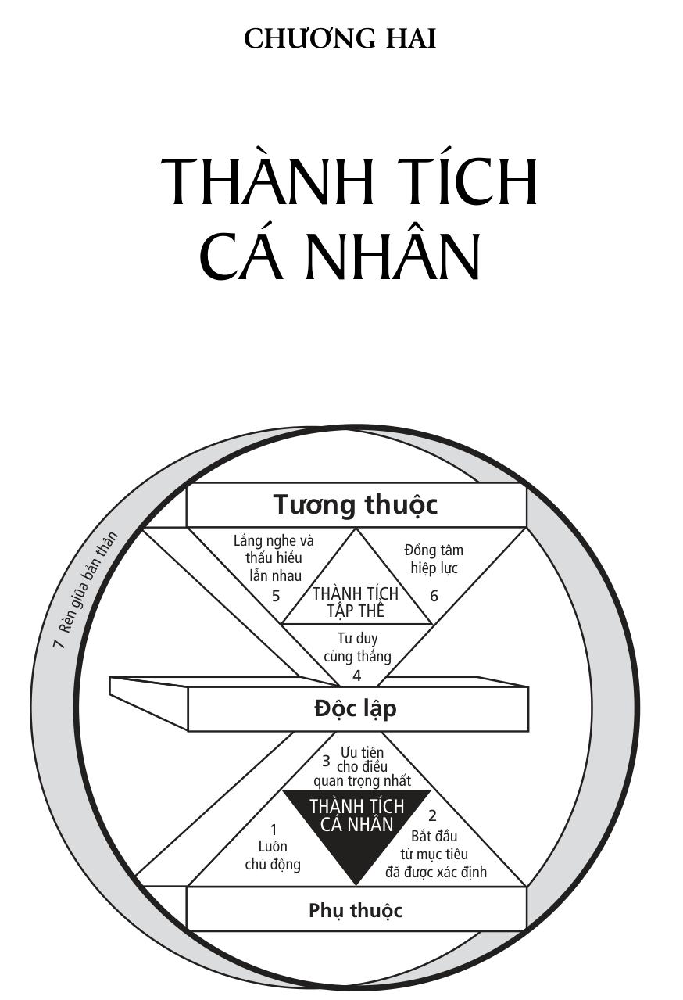
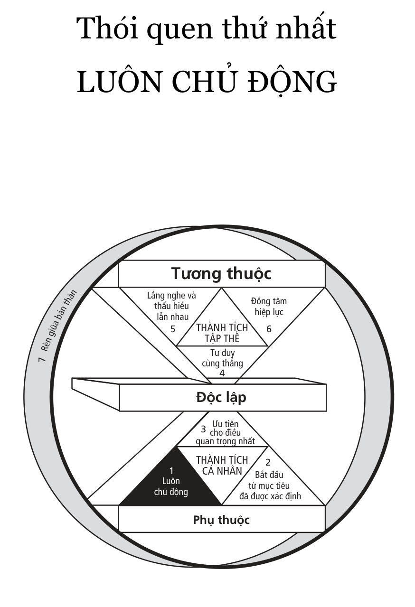
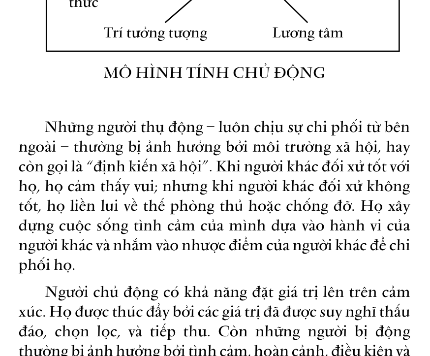
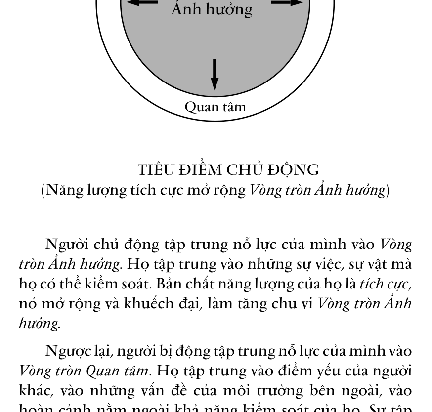
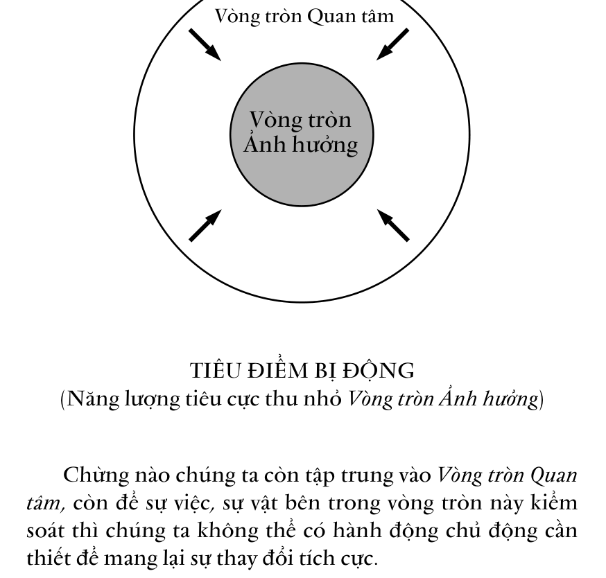
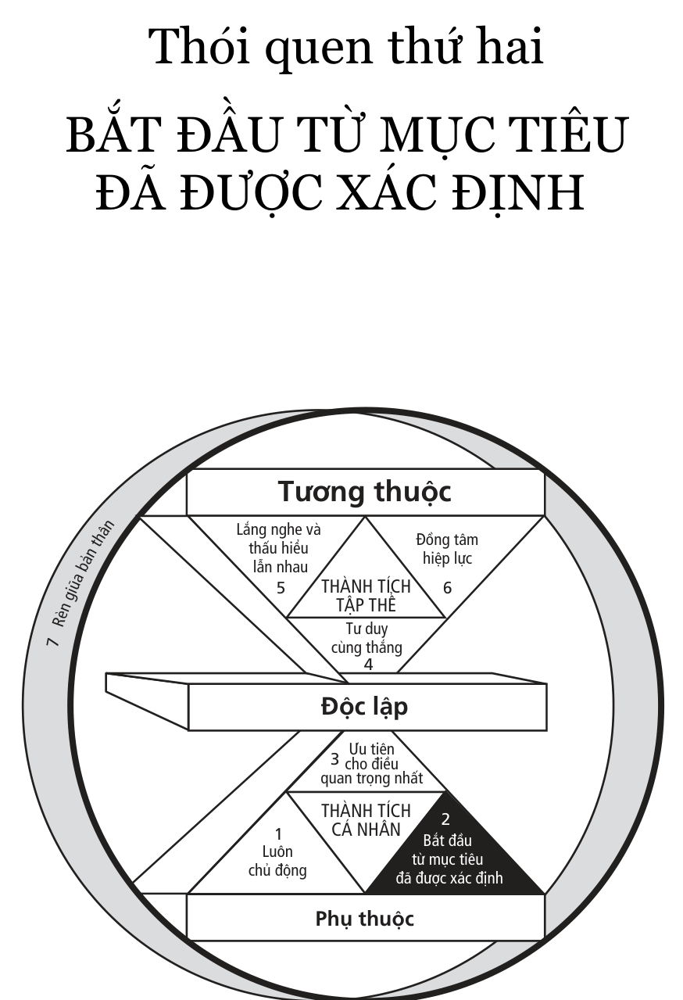
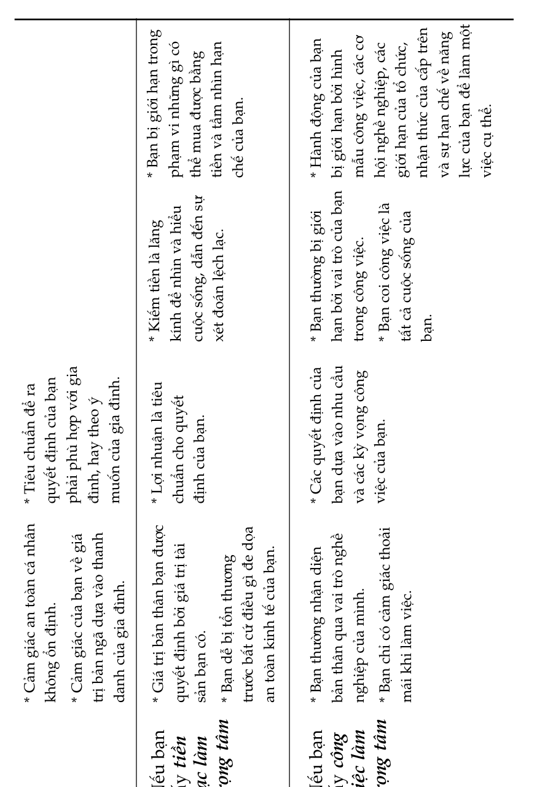
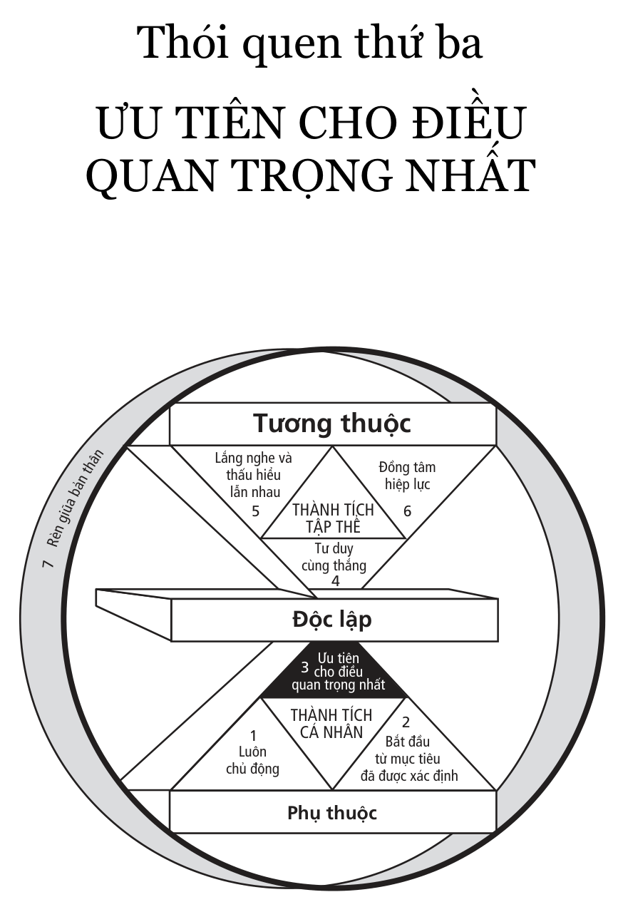
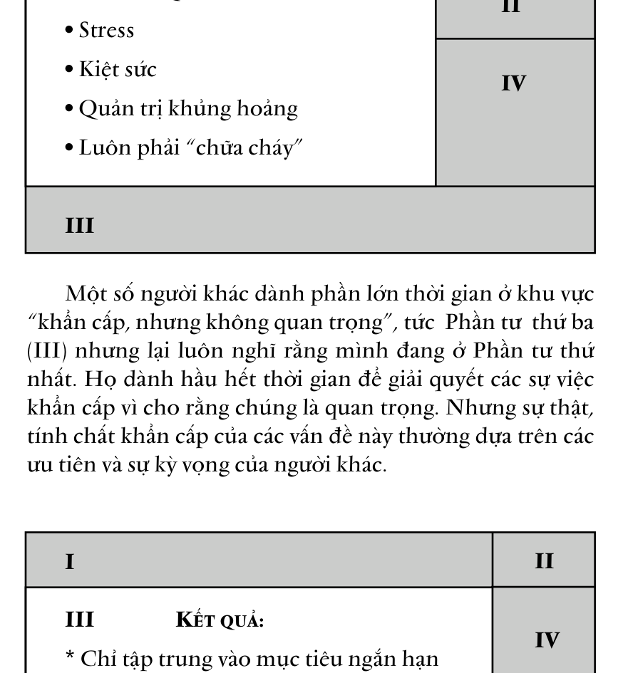
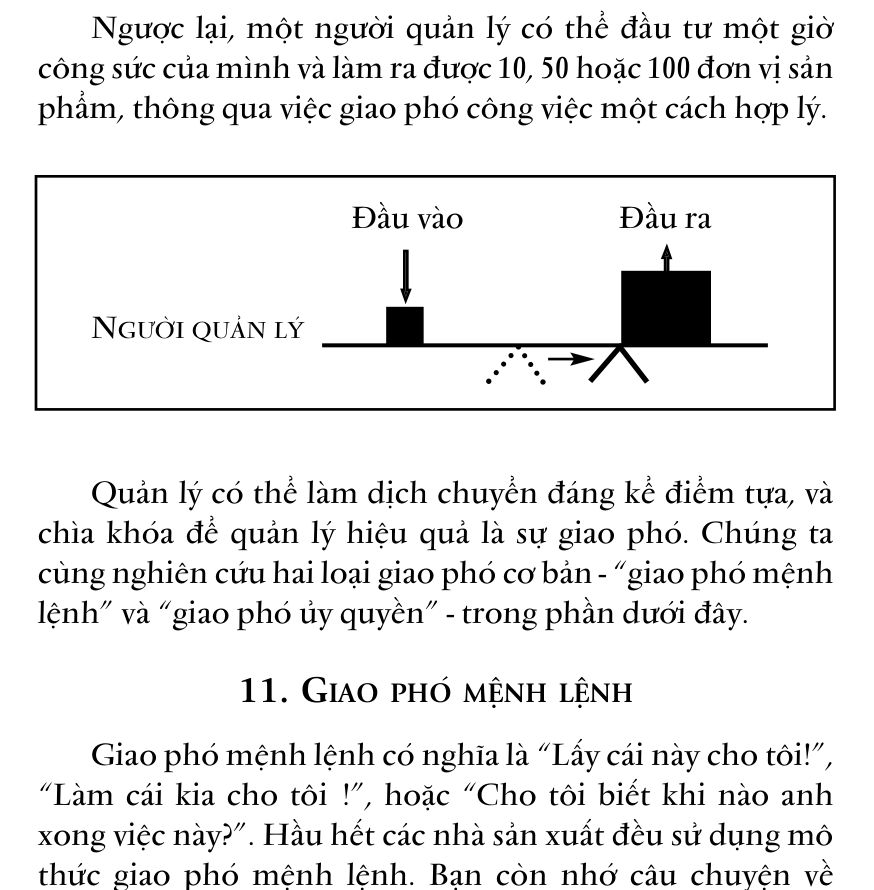

# CHƯƠNG HAI

# Thói quen thứ nhất - LUÔN CHỦ ĐỘNG

# Các nguyên tắc về

# tầm nhìn cá nhân

> “Không một sự thật nào đáng khích lệ hơn là

> khả năng của con người trong việc nâng cao cuộc sống của mình bằng sự nỗ lực có ý thức.”

- Henry David Thoreau

Khi đọc cuốn sách này, bạn hãy cố gắng thoát ra khỏi con người của bạn, cố gắng đưa ý thức vượt lên và soi rọi bản thân bằng chính đôi mắt của tâm hồn mình, và đọc. Liệu bạn có thể nhìn bản thân bằng ánh mắt của một người khác không?

Bây giờ, bạn hãy suy nghĩ về tâm trạng của mình. Bạn có thể nhận diện được nó không? Bạn cảm thấy thế nào? Bạn có thể mô tả tâm trạng hiện tại của mình không?

Tiếp theo, bạn hãy dành một phút để nghĩ xem trí óc của mình làm việc như thế nào? Liệu nó có nhanh nhạy và tỉnh táo không? Bạn có cảm thấy đang bị giằng co giữa việc luyện tập khả năng tư duy và việc đánh giá ý nghĩa của hoạt động trí tuệ này không?

Khả năng làm được điều nêu trên chỉ đặc biệt có ở con người, chúng ta có thể gọi đó là “sự tự nhận thức” - khả năng tự suy nghĩ trong toàn bộ quá trình tư duy của bản

thân. Đó là nguyên nhân vì sao con người chiếm lĩnh được mọi thứ trên thế giới và có những bước tiến không ngừng từ thế hệ này sang thế hệ khác. Và đó cũng là lý do tại sao chúng ta có thể đánh giá và học tập được kinh nghiệm của người khác, cũng như tạo ra hoặc từ bỏ những thói quen của mình.

Chúng ta không phải là điều mà chúng ta cảm thấy. Chúng ta không phải là tâm trạng chúng ta đang mang. Chúng ta cũng không phải là cái mà chúng ta nhận thức. Chúng ta có khả năng tư duy về cảm xúc, tâm trạng, và ý nghĩ, có khả năng tự nhận thức, và chính điều này đã tách chúng ta ra khỏi con người mình và ra khỏi thế giới động vật để xem xét cách chúng ta nhìn nhận về bản thân mình. Đó là mô thức bản ngã – mô thức quan trọng nhất, cơ bản nhất của sự thành đạt. Nó có ảnh hưởng không chỉ đến thái độ và hành vi của chúng ta mà còn đến cách chúng ta nhìn nhận người khác. Nó là “tấm bản đồ” chi phối bản chất cơ bản của con người.

Thật vậy, chỉ khi quan tâm đến cách nhìn nhận bản thân (và cách chúng ta nhìn người khác) thì chúng ta mới có thể hiểu được cách nhìn và cảm nhận của người khác về họ và thế giới của họ. Nếu không, chúng ta sẽ có thành kiến đối với hành vi của họ và xem hành vi của chúng ta là khách quan.

Điều này sẽ làm hạn chế đáng kể tiềm lực của bản thân và khả năng giao tiếp với người khác. Nhưng nhờ khả năng đặc biệt của con người là sự tự nhận thức nên chúng ta có thể xem xét mô thức của mình để xác định xem chúng là thực tại - dựa trên cơ sở những nguyên tắc - hay chúng phụ thuộc vào điều kiện và hoàn cảnh.

### 1. L ĂNG KÍNH XÃ HỘI

Nếu chúng ta nhìn bản thân thông qua lăng kính xã hội - theo mô thức xã hội đương thời hay theo các ý kiến, nhận thức và mô thức của những người xung quanh - thì chúng ta chẳng khác nào hình ảnh phản chiếu trong phòng cười tại các lễ hội.

“Bạn chẳng bao giờ đúng giờ cả!”

“Tại sao con không bao giờ ngăn nắp được nhỉ?”

“Bạn phải là một nghệ sĩ mới xứng!”

“Tôi không tin là anh đã thắng!”

“Điều này thật đơn giản. Tại sao anh/chị lại không hiểu?”

Thế đấy! Những hình ảnh về chúng ta thu được từ xung quanh thường rời rạc và không cân đối. Chúng thường là những lời nhận xét theo kiểu phỏng đoán về những gì đang diễn ra, xoay quanh những mối quan tâm và sự hời hợt trong cách nhìn của người đưa ra thông tin hơn là phản ánh chính xác sự thật.

Sự phản ánh của mô thức xã hội đương thời cho thấy bản chất con người được quyết định phần lớn bởi điều kiện và hoàn cảnh sống. Thừa nhận vai trò quyết định của điều kiện sống và cho rằng mình không thể nào kiểm soát được sức ảnh hưởng của nó là một quan điểm, một “tấm bản đồ” hoàn toàn khác.

Thực ra có ba loại “bản đồ” xã hội - ba học thuyết về ***chủ nghĩa tất định*** - được thừa nhận rộng rãi, độc lập hoặc kết hợp, để giải thích bản chất con người. Đó là:

> Thuyết Quy định Di truyền cho rằng bản chất con người

được di truyền từ tổ tiên. Đó là lý do vì sao bạn có phẩm chất, tính cách như thế này mà không phải thế khác. Hay nói cách khác, tính cách của ông bà bạn hiện diện trong nhiễm sắc thể (ADN) của bạn. Thêm vào đó, bạn thuộc nhóm dân tộc nào thì bản chất của bạn thuộc về bản chất của dân tộc đó.

> Thuyết Quy định Tâm ly á về cơ bản cho rằng bản chất của bạn là do cha mẹ bạn tạo ra. Những gì bạn được dưỡng dục từ thời thơ ấu sẽ đặt nền móng cho những khuynh hướng cá nhân và cá tính của bạn. Chẳng hạn, bạn ngại ngùng khi đứng trước đám đông, đó là vì cách cha mẹ bạn đã dạy dỗ bạn; hay khi làm sai điều gì, bạn cảm thấy mình có lỗi khủng khiếp, đó là vì bạn “nhớ lại” những tổn thương do hình phạt mà bạn đã trải qua…

> Thuyết Quy định Môi trường cho rằng sở dĩ bạn trở thành con người như thế này là do sự tác động của “ngoại cảnh” - sếp của bạn, vợ/chồng bạn, bè bạn, hoặc do hoàn cảnh kinh tế của cá nhân và gia đình bạn, và cả các chính sách quốc gia. Ai đó hoặc điều gì đó phải chịu trách nhiệm về bản chất con người bạn chứ không phải là bạn.

Cả ba “tấm bản đồ” nêu trên đều dựa vào lý thuyết phản xạ có điều kiện của Pavlov (trong thí nghiệm với các con chó). Ý tưởng cơ bản ở đây là chúng ta được tạo điều kiện để phản ứng lại một tác nhân kích thích nào đó bằng một cách đặc biệt nào đó.

Những “bản đồ” của các thuyết tất định này mô tả

Phản ứng Kích thích

“biên giới lãnh thổ” một cách đúng đắn về mặt chức năng và chính xác đến mức nào? Những tấm gương này phản chiếu bản chất con người ra sao? Liệu chúng có trở thành những lời tiên đoán tự thực hiện không? Liệu chúng có dựa trên các nguyên tắc mà chúng ta có thể vận dụng vào chính bản thân mình?

### 2. G IỮA NHÂN TỐ KÍCH THÍCH VÀ PHẢN ỨNG LÀ GÌ?

Để trả lời các câu hỏi nêu trên, tôi muốn chia sẻ với các bạn câu chuyện có tính chất xúc tác của Viktor Frankl.

Frankl, một nhà tất định học người Do Thái theo trường phái tâm lý học Freud, cho rằng bất cứ điều gì xảy ra với bạn khi còn trẻ sẽ định hình cá tính và nhân cách của bạn, sẽ chi phối cơ bản toàn bộ cuộc đời bạn. Những giới hạn và các thông số của cuộc đời bạn đã được xác lập và có thể nói, bạn không thể nào thay đổi được.

Frankl cũng là một nhà tâm thần học. Ông từng bị giam trong các trại tập trung của Đức quốc xã, nơi ông phải chứng kiến những hành động ghê tởm của bọn phát xít. Cha mẹ, em trai và vợ của ông đều chết trong trại tập trung. Cả gia đình chỉ còn lại cô em gái và ông. Bản thân ông đã phải chịu đựng nhiều cực hình và ông không biết mình bị sẽ bị đưa vào lò hỏa thiêu hay may mắn nằm trong số những người “được sống” để làm công việc khiêng xác hoặc xúc tro những người xấu số.

Một ngày nọ, khi đang trần truồng một mình trong phòng giam nhỏ, ông bắt đầu nhận thức ra điều mà sau này ông gọi là “sự lựa chọn cuối cùng trong các quyền tự do của con người” - sự lựa chọn mà bọn cai ngục quốc xã không bao giờ cướp đi được.

Frankl cho rằng, bọn chúng có thể kiểm soát hoàn toàn môi trường sống của ông, có thể làm bất cứ điều gì chúng muốn trên thân thể ông, nhưng là một con người biết tự nhận thức, ông có thể nhìn hoàn cảnh của mình từ góc độ của một người quan sát bên ngoài. Tự ông có thể quyết định tất cả những chuyện đang xảy ra có ảnh hưởng đến bản thân ông hay không và nếu có thì nó ảnh hưởng ở mức độ nào. Giữa những điều đã xảy ra với ông (nhân tố kích thích) và phản ứng của ông đối với chúng là sự tự do hay quyền lựa chọn phản ứng.

Bằng kinh nghiệm sống, Frankl hình dung về mình trong các hoàn cảnh khác nhau. Chẳng hạn ông sẽ lên lớp giảng bài cho sinh viên sau khi ra khỏi trại tập trung. Ông sẽ giảng những bài học mà mình đã đúc kết được trong suốt quãng thời gian bị tù đày.

Thông qua sự rèn luyện trí óc, tình cảm và tinh thần như vậy, chủ yếu bằng trí nhớ và sự tưởng tượng, ông đã luyện tập để có được sự tự do cho chính mình. Có thể bọn cai ngục đang rảo bước qua lại ngoài xà lim kia có nhiều tự do về thân thể và nhiều sự lựa chọn hơn ông, nhưng ông lại có được sự tự do về tinh thần và sức mạnh bên trong để thực hiện những lựa chọn cho tương lai của mình. Ông trở thành nguồn cảm hứng cho những người xung quanh, thậm chí một số cai ngục cũng ngưỡng mộ ông. Ông giúp người khác tìm ra ý nghĩa cuộc sống trong nỗi đau bị hành hạ do hoàn cảnh tù đày.

Frankl đã sử dụng khả năng thiên phú của con người về sự tự nhận thức để khám phá ra một nguyên tắc cơ bản trong bản chất con người: ***Giữa kích thích***và***phản ứng***là***quyền tự do lựa chọn phản ứng của con người*** .

Trong sự tự do lựa chọn là những khả năng thiên phú mà chỉ con người mới có. Ngoài sự ***tự nhận thức***, chúng ta còn có***trí tưởng tượng***- khả năng sáng tạo ngoài thực tiễn. Chúng ta còn có***ý thức***- sự hiểu biết sâu sắc về cái đúng cái sai, về các nguyên tắc chi phối hành vi, và về mức độ phù hợp của suy nghĩ và hành động của chúng ta đối với các nguyên tắc đó. Chúng ta cũng còn có***ý chí độc lập*** - là khả năng hành động dựa trên cơ sở của sự tự nhận thức mà không chịu ảnh hưởng của các yếu tố khác.

Ngay cả những động vật thông minh nhất cũng không có được những khả năng thiên phú này. Nói theo ngôn ngữ máy tính thì chúng được “lập trình” bằng bản năng và/hoặc bằng sự luyện tập. Chúng có thể được luyện tập để có trách nhiệm, nhưng không thể luyện tập để chịu trách nhiệm về việc huấn luyện đó. Nói cách khác, chúng không thể điều khiển, không thể thay đổi được việc chương trình hóa và thậm chí cũng không biết được điều đó.

Nhưng với con người thì khác. Nhờ có những khả năng thiên phú, chúng ta có thể viết ra các chương trình mới cho mình một cách hoàn toàn khác với các bản năng và sự luyện tập của mình. Đó là lý do vì sao khả năng của động vật tương đối hạn chế, còn khả năng của con người là vô tận. Nhưng nếu sống như các con vật, chỉ dựa vào bản năng, hoàn cảnh và các điều kiện sống, thì khả năng của chúng ta cũng sẽ bị hạn chế.

Mô thức của ***chủ nghĩa tất định*** xuất phát từ việc nghiên cứu các loại động vật (chuột, khỉ, bồ câu, chó…) và những người bị chứng rối loạn thần kinh hay mắc bệnh tâm thần. Trong khi những nghiên cứu này có thể đáp ứng một số tiêu chí nhất định của một vài nhà nghiên cứu do nó có thể đo lường và dự đoán được, thì lịch sử loài người và sự tự

nhận thức của chúng ta giúp chúng ta nhận ra “tấm bản đồ” này chẳng mô tả một khu vực lãnh thổ nào cả.

Những khả năng đặc biệt chỉ có ở con người ấy nâng chúng ta vượt ra khỏi thế giới động vật. Sự luyện tập và phát triển những khả năng thiên phú giúp chúng ta có thêm sức mạnh để hoàn thiện các tiềm năng của mình. Nằm ở vị trí giữa sự kích thích và phản ứng là sức mạnh lớn nhất của chúng ta: ***quyền tự do lựa chọn.***

### 3. Đ ỊNH NGHĨA “ TÍNH CHỦ ĐỘNG ”

Để khám phá nguyên tắc cơ bản về bản chất con người, Frankl đã mô tả một “bản đồ” bản thân chính xác. Từ đó, ông bắt đầu phát triển thói quen đầu tiên và cơ bản nhất của một con người thành đạt trong mọi hoàn cảnh, đó là thói quen ***luôn ở thế chủ động*** .

Thuật ngữ ***tính chủ động***trở nên khá phổ biến trong ngành quản trị học, nhưng không dễ tìm thấy trong mọi cuốn từ điển. Không chỉ có nghĩa đơn thuần là***sự chủ động*** , tính chủ động còn mang ý nghĩa về tư cách con người, về trách nhiệm với cuộc đời. Hành vi là kết quả của những quyết định đưa ra, không chịu ảnh hưởng bởi hoàn cảnh nên chúng ta cần chủ động và có trách nhiệm làm cho mọi việc trở nên hiệu quả. Ngược lại, nếu cuộc sống của chúng ta phụ thuộc vào điều kiện và hoàn cảnh thì lỗi thuộc về chúng ta, vì chúng ta để cho những sự việc khách quan điều khiển một cách có ý thức.

Khi đưa ra sự lựa chọn, người ta dễ bị môi trường vật chất quanh mình tác động ngược trở lại. Nếu thuận lợi, họ sẽ cảm thấy dễ chịu, kết quả công việc tốt, và ngược lại. Những người luôn ở thế chủ động có thể tạo ra sự cân bằng

cho mình. Đối với họ, dù điều kiện khách quan suôn sẻ hay trở ngại thì tâm trạng và công việc của họ cũng vẫn tiến triển. Vì họ được thúc đẩy bởi giá trị của bản thân. Nếu giá trị đó quyết định chất lượng của công việc thì bất kỳ hoàn cảnh nào cũng không thể gây ảnh hưởng đến điều đó.

#### MÔ HÌNH TÍNH CHỦ ĐỘNG

Những người thụ động – luôn chịu sự chi phối từ bên ngoài – thường bị ảnh hưởng bởi môi trường xã hội, hay còn gọi là “định kiến xã hội”. Khi người khác đối xử tốt với họ, họ cảm thấy vui; nhưng khi người khác đối xử không tốt, họ liền lui về thế phòng thủ hoặc chống đỡ. Họ xây dựng cuộc sống tình cảm của mình dựa vào hành vi của người khác và nhắm vào nhược điểm của người khác để chi phối họ.

Người chủ động có khả năng đặt giá trị lên trên cảm xúc. Họ được thúc đẩy bởi các giá trị đã được suy nghĩ thấu đáo, chọn lọc, và tiếp thu. Còn những người bị động thường bị ảnh hưởng bởi tình cảm, hoàn cảnh, điều kiện và

Phản ứng **Quyền tự do**

### lựa chọn

Tự nhận

thức

Ý chí độc lập

Trí tưởng tượng Lương tâm

Kích thích

môi trường sống. Tuy nhiên, người chủ động vẫn bị tác động bởi những kích thích bên ngoài, bất kể về mặt vật chất, xã hội hay tâm lý. Nhưng phản ứng của họ, dù có ý thức hay vô thức, luôn luôn là sự lựa chọn hay phản ứng dựa trên cơ sở giá trị.

Theo Eleanor Roosevelt, “Không ai có thể làm tổn thương bạn nếu bạn không đồng ý”. Còn Gandhi nói: “Họ không thể lấy đi sự tự trọng của chúng ta nếu chúng ta không cho họ cái quyền đó”. Chính sự tự nguyện cho phép hay đồng tình của chúng ta khiến chúng ta đau khổ hơn nhiều so với bản thân sự việc xảy ra.

Tôi thừa nhận rằng đây là điều khó chấp nhận về mặt tình cảm, đặc biệt nếu chúng ta cứ kể lể về nỗi bất hạnh của mình hết ngày này sang ngày khác, đổ lỗi cho hoàn cảnh hay hành vi của người khác. Nhưng không ai có thể nói “Tôi có sự lựa chọn khác” cho đến khi họ thừa nhận một cách sâu sắc và thành thật rằng: “Số phận của tôi ngày hôm nay chính là do sự lựa chọn của tôi ngày hôm qua”.

Có một lần tại Sacramento, khi tôi đang nói chuyện về đề tài tính chủ động thì một người phụ nữ trong số cử tọa đứng lên phát biểu một cách rất kích động. Mọi người quay sang nhìn, cô ấy như sực tỉnh, lúng túng và vội ngồi xuống. Nhưng hình như cô không thể kiềm chế được cảm xúc và tiếp tục bàn luận với những người ngồi xung quanh.

Tôi cảm thấy nóng lòng muốn giờ nghỉ đến nhanh để tìm hiểu xem điều gì đã xảy ra với cô. Giờ giải lao, tôi bước xuống và hỏi cô có muốn chia sẻ điều gì không. Và cô đồng ý kể cho tôi nghe câu chuyện của mình.

“Ông không thể hiểu chuyện gì đã xảy ra với tôi đâu! Tôi là một y tá. Tôi đang chăm sóc một người bệnh bất hạnh

và vô ơn nhất từ trước đến nay. Bất cứ điều gì tôi làm, anh ta cũng không cho là đủ. Anh ta không bao giờ biết cảm ơn, cũng không cần biết tôi đang làm nhiệm vụ của mình. Anh ta luôn kêu ca, phàn nàn và luôn kiếm chuyện với tôi. Người đàn ông này làm cho cuộc sống của tôi đảo lộn, tôi thường mang về nhà nỗi bực dọc của công việc. Các y tá khác cũng có tâm trạng tương tự. Chúng tôi gần như ai cũng muốn rũ bỏ “cục nợ” đó sớm chừng nào hay chừng ấy.

Thế mà ông vừa nói rằng không điều gì có thể xúc phạm được tôi, làm tôi đau khổ nếu không có sự đồng ý của tôi, trừ phi chính tôi đã lựa chọn cho mình sự bất hạnh đó. Vâng, nhưng tôi không còn cách nào khác.

Tôi đã suy nghĩ rất nhiều về điều này và bắt đầu tự hỏi, liệu mình có quyền lựa chọn phản ứng cho mình hay không. Cuối cùng, tôi cũng nhận ra rằng tôi có quyền đó. Hạnh phúc hay bất hạnh đều xuất phát từ sự lựa chọn của chúng ta. Tôi đã thay đổi suy nghĩ và cảm thấy như mình vừa thoát khỏi nhà tù San Quentin. Tôi muốn kêu to lên cho cả thế giới biết rằng: Tôi đã được tự do! Tôi đã thoát khỏi nhà tù! Tôi sẽ không còn để bản thân mình bị chi phối bởi cách cư xử của người khác.”

Không phải do bản thân sự việc xảy ra, mà là do cách phản ứng của chúng ta trước sự việc đó làm chúng ta đau khổ. Tất nhiên, có những sự việc xảy ra không những làm chúng ta đau khổ về thể xác, tổn thất về kinh tế mà còn tổn thương cả về tinh thần, nhưng tính cách, bản chất của chúng ta không việc gì phải chịu đau khổ. Những kinh nghiệm khó khăn nhất mà chúng ta trải qua lại trở thành lò tôi luyện tính cách, phát triển sức mạnh bên trong, đem lại cho chúng ta quyền tự do để xử lý các tình huống khó khăn trong tương lai và thúc đẩy những người khác làm

theo mình. Frankl là một trong số những người làm được điều đó.

Chúng ta từng biết những người gặp hoàn cảnh không may như mắc bệnh nan y, bị khiếm khuyết về thể xác, hoặc quá nghèo khó nhưng vẫn giữ được một ý chí đáng khâm phục… Và những phẩm giá cao quý đó của họ đã truyền cho chúng ta nguồn cảm hứng mạnh mẽ. Không gì gây ấn tượng mạnh mẽ và thuyết phục bằng những câu chuyện có thật về những con người dù phải chịu số phận và hoàn cảnh bất hạnh, nhưng vẫn vươn lên bằng ý chí cao nhất.

Sandra và tôi có một khoảng thời gian đáng nhớ hơn 4 năm khi cùng chia sẻ với nỗi bất hạnh của một người bạn thân, Carol. Cô ấy mắc bệnh ung thư đã di căn. Khi bệnh tình của Carol chuyển sang giai đoạn cuối, Sandra đã dành thời gian chăm sóc người bạn tại giường bệnh, động viên và giúp cô ấy viết tiểu sử cá nhân.

Carol cố gắng giảm thiểu việc dùng thuốc giảm đau để có thể kéo dài sự minh mẫn và duy trì tinh thần ổn định. Cô tranh thủ thời gian để viết những bức thư đặc biệt dành cho những đứa con của mình, thì thầm vào máy ghi âm hoặc nói với Sandra để Sandra ghi chép lại. Carol quả thực là một con người luôn chủ động, dũng cảm và quan tâm đến người khác. Cô là nguồn cảm hứng thực sự cho chúng tôi và nhiều người xung quanh.

Tôi không thể nào quên được ánh mắt của Carol một ngày trước khi cô mất và cảm nhận nỗi đau sâu thẳm của một con người có sức mạnh nội tâm vô cùng to lớn. Tôi có thể nhận ra trong đôi mắt ấy một cuộc đời đầy tính cách, sự cống hiến, hy sinh cũng như tình yêu, sự quan tâm và cảm kích dành cho những người thân yêu.

Trong những cuộc nói chuyện sau đó, tôi thường hỏi nhiều người rằng: “Có ai đã từng chứng kiến một người có một thái độ sống tuyệt vời cho đến giây phút cuối cùng không? Một phần tư số người tham dự trả lời rằng có. Tôi hỏi trong số họ có bao nhiêu người cảm thấy có sự thay đổi ở chính mình, dù là tạm thời, nhờ nguồn cảm hứng từ hành động dũng cảm của con người đó cũng như cảm nhận được sự trắc ẩn sâu sắc để có những hành động cao đẹp. Tất cả họ đều trả lời “có”.

Viktor Frankl cho rằng trong cuộc sống có ba giá trị trung tâm. Đó là ***giá trị kinh nghiệm***- giá trị đến từ bên ngoài,***giá trị sáng tạo***- giá trị do chúng ta tạo ra, và***giá trị thái độ,*** tức giá trị từ phản ứng của chúng ta trước những hoàn cảnh khó khăn, chẳng hạn như ở phút cuối đời.

Kinh nghiệm của tôi về con người cho thấy quan điểm của Frankl là đúng - tức giá trị cao nhất trong ba giá trị này là ***giá trị thái độ, xét về ý nghĩa mô thức hay khuôn mẫu nhận thức. Nói cách khác, điều quan trọng nhất là cách chúng ta***phản ứng*** như thế nào đối với những gì chúng ta trải nghiệm.

Những hoàn cảnh khó khăn thường tạo ra các thay đổi về mô thức, tạo ra những khung tham chiếu hoàn toàn mới mẻ. Dựa vào đó, người ta nhìn thế giới, bản thân và những người khác, cũng như tìm hiểu xem cuộc sống xung quanh đòi hỏi những gì ở họ. Tầm nhìn của họ phản ảnh ***giá trị thái độ, là giá trị nâng cao và tạo nguồn cảm hứng cho tất cả mọi người.

### 4. N ẮM THẾ CHỦ ĐỘNG

Bản chất cơ bản của con người là chủ động hành động

chứ không phải bị động đối phó. Cũng như chúng ta có quyền lựa chọn phản ứng phù hợp với hoàn cảnh và có được sức mạnh để tạo ra các hoàn cảnh.

Nắm thế chủ động không có nghĩa là tự đề cao chính mình, xúc phạm người khác hay tỏ ra hung hăng thô bạo mà là nhận thấy trách nhiệm của mình để làm cho sự việc xảy ra.

Trong nhiều năm, tôi đã tư vấn cho những người muốn tìm công việc tốt hơn là họ phải tỏ ra chủ động hơn, chẳng hạn như, làm các bài trắc nghiệm về mức độ quan tâm và năng lực, nghiên cứu về ngành nghề, thậm chí về những vấn đề cụ thể của tổ chức mà họ xin việc đang gặp phải. Và sau đó, tôi hướng dẫn họ làm một bản tự giới thiệu thật thuyết phục trong đó nêu rõ những năng lực của họ sẽ giúp giải quyết các vấn đề của tổ chức này như thế nào. Bản tự giới thiệu đó được gọi là “tiếp thị các giải pháp” và là một mô thức then chốt để đạt được thành công trong kinh doanh.

Cách làm trên thường mang lại hiệu quả. Có thể nói đây là một cách tiếp cận ảnh hưởng mạnh mẽ đến các cơ hội tìm việc làm, hay sự tiến thân. Nhưng nhiều người đã không có những bước đi cần thiết, đó là chủ động tạo ra các tình huống. Họ gặp một vài vấn đề như:

“Tôi không biết làm các bài trắc nghiệm về mức độ quan tâm và năng lực ở đâu.”

“Làm sao tôi có thể nghiên cứu các vấn đề chuyên môn của tổ chức này được? Chẳng ai giúp tôi cả.”

“Tôi không biết phải viết điều gì trong bản tự giới thiệu để có thể gây ấn tượng tốt với nhà tuyển dụng.”

Rất nhiều người chỉ ngồi chờ việc tự đến, hay chờ ai đó quan tâm giúp đỡ họ. Còn những người chủ động luôn kiếm được việc làm tốt. Họ đưa ra các giải pháp để giải quyết vấn đề, chứ không phải chỉ nêu ra vấn đề. Những người nắm thế chủ động làm bất cứ việc gì cần thiết, phù hợp với các nguyên tắc đúng đắn để hoàn thành công việc.

Mỗi khi bọn trẻ nhà tôi, dù là đứa bé nhất, có thái độ vô trách nhiệm, chỉ ngồi chờ ai đó đến làm giúp, chúng tôi liền bảo: “Hãy dùng R và I của mình đi!” *(*)*

Rèn luyện tinh thần trách nhiệm không phải là hạ thấp phẩm giá mà là khẳng định phẩm giá. Tính chủ động là một phần của bản chất con người, bằng cách tôn trọng bản chất chủ động của người khác, chúng ta sẽ đem lại cho họ ít nhất một hình ảnh phản chiếu rõ ràng không bị nhiễu từ chiếc gương xã hội.

Tất nhiên, điều đó còn tùy thuộc mức độ trưởng thành của mỗi người. Chúng ta không thể kỳ vọng sự hợp tác sáng tạo ở mức độ cao từ những người quá lệ thuộc về mặt tình cảm. Nhưng ít ra, chúng ta vẫn có thể khẳng định bản chất cơ bản của họ và tạo ra một bầu không khí dễ chịu để họ có thể nắm bắt các cơ hội và tự giải quyết vấn đề.

### 5. C HỦ ĐỘNG HÀNH ĐỘNG HAY BỊ ĐỘNG ĐỐI PHÓ?

Sự khác nhau giữa người chủ động và bị động cũng giống như sự khác nhau giữa ngày và đêm. Tôi không nói đến sự khác nhau ở mức độ 25 đến 50% của tính hiệu quả, mà là từ 5.000% trở lên, đặc biệt nếu những người chủ động là người thông minh, hiểu biết và nhạy cảm trong giao tiếp.

(*) R là chữ viết tắt của Resourcefulness - có nghĩa là sự tháo vát; I là chữ viết

tắt của Initiative - nghĩa là sự chủ động.

Cần chủ động để có thể tạo ra sự cân bằng P/PC của sự thành đạt trong cuộc sống và xây dựng ***7 Thói quen*** . Khi nghiên cứu 6 thói quen đầu tiên, bạn sẽ thấy mỗi thói quen đều phụ thuộc vào sức mạnh của tính chủ động ở bạn. Mỗi thói quen đều đặt ra trách nhiệm để bạn hành động. Nếu chỉ ngồi chờ, bạn sẽ luôn rơi vào thế bị động đối phó. Khi đó, sự phát triển và cơ hội sẽ đến với người khác, ở chỗ khác.

Có một lần, tôi tham dự cuộc gặp mặt hàng quý của những người làm việc trong ngành xây dựng dân dụng, đến từ 20 tổ chức khác nhau. Vì đang trong thời kỳ suy thoái kinh tế nên ngành này chịu tác động rất nặng nề, và những người tham dự đều mang một tâm trạng đầy chán nản.

Trong ngày đầu, chủ đề thảo luận của chúng tôi là: “Điều gì đang xảy ra với chúng ta? Động lực kinh doanh nằm ở đâu?”. Rất nhiều chuyện xảy ra do sức ép của môi trường kinh tế. Nạn thất nghiệp lan tràn, nhiều người trong số những người tham dự cuộc họp cũng đang phải sa thải nhân viên, thậm chí là cả bạn bè, người thân của mình để duy trì sự sống còn của doanh nghiệp. Vào cuối ngày thứ nhất, mọi người rất bi quan.

Ngày thứ hai, chúng tôi nêu ra câu hỏi: “Điều gì sẽ xảy ra trong tương lai?”. Chúng tôi nghiên cứu các xu hướng của tình hình kinh tế và giả định rằng những điều này sẽ tạo nên tương lai của họ. Vào cuối ngày thứ hai, tâm trạng chung còn bi đát hơn. Sự việc thường hết sức tồi tệ trước khi khá hơn lên, và mọi người đều biết điều đó.

Do vậy, ngày thứ ba, chúng tôi quyết định chuyển sang những câu hỏi mang tính chủ động: “Phản ứng của chúng ta là gì? Chúng ta sẽ làm gì? Chúng ta sẽ chủ động hành

động trong tình huống này như thế nào?”. Buổi sáng, chúng tôi thảo luận về cách quản lý và cắt giảm chi phí. Buổi chiều, chúng tôi bàn đến cách làm tăng thị phần. Chúng tôi tập trung vào những vấn đề thực tế và dễ thực hiện nhất. Cuộc họp đi đến kết thúc trong sự phấn chấn, niềm hy vọng và một thế chủ động mới.

Vào cuối ngày thứ ba, chúng tôi tổng kết hội nghị bằng câu trả lời cho câu hỏi “Tình hình kinh doanh ra sao?”. Câu trả lời này có ba phần.

> Phần 1: Hiện tại, tình hình đối với chúng tôi là không tốt, các xu hướng có vẻ tồi tệ hơn trước khi có thể lạc quan.

> Phần 2: Tuy nhiên, những biện pháp chúng tôi đang bàn thảo là rất tốt, giúp quản lý tốt hơn, giảm các chi phí, tăng được thị phần.

> Phần 3: Vì thế, tình hình kinh doanh sẽ tốt hơn.

Đứng trước vấn đề này, một người bị động sẽ nói gì? “Ồ, sao vậy, hãy đối mặt với thực tế đi. Những suy nghĩ tích cực và cách tự động viên tinh thần của anh cũng chỉ đến thế thôi. Trước sau gì cũng phải đối mặt với hiện thực.”

Đó chính là sự khác biệt giữa tư duy chủ động và tư duy bị động. Chúng tôi đối mặt với thực tế đấy chứ. Chúng tôi đã đối mặt với thực tế về tình hình hiện nay và vạch kế hoạch cho tương lai. Chúng tôi có sức mạnh để lựa chọn phản ứng tích cực đối với những hoàn cảnh, tình huống đã được tiên liệu, chứ không nghĩ rằng những gì đang xảy ra trong môi trường kinh doanh sẽ quyết định số phận của chúng tôi.

Các doanh nghiệp, các cộng đồng dân cư, tổ chức, gia đình và từng cá nhân đều có thể luôn ở thế chủ động. Cần biết kết hợp sự sáng tạo và năng nổ của những cá nhân có

tinh thần chủ động để tạo ra một nền văn hóa thực sự có tính chủ động trong tổ chức. Không nên phó mặc cho hoàn cảnh! Mọi người cần chủ động hành động để đạt được những giá trị và mục đích chung.

### 6. L ẮNG NGHE CHÍNH MÌNH

Thái độ và hành vi bắt nguồn từ những mô thức, nên qua quá trình tự nhận thức, mỗi người sẽ tự tìm thấy “tấm bản đồ” của bản thân. Ví dụ, ngôn từ của một người có thể là thước đo chính xác về mức độ chủ động của người đó.

Ngôn ngữ của những người luôn bị động là thoái thác và trốn tránh trách nhiệm:“Tôi là thế đó. Tôi chẳng thể làm gì khác hơn.” ( ***Không phải tôi mà là người khác quyết định*** ).

“Anh ta làm tôi muốn phát điên!” ***(Tôi không chịu trách nhiệm. Cuộc sống tình cảm của tôi bị chi phối bởi những sự việc nằm ngoài tầm kiểm soát của tôi)*** .

“Tôi không thể làm được điều đó đâu. Tôi không có thời gian.” ***(Có gì đó bên ngoài –ví dụ như thời gian hạn hẹp – đang chi phối tôi).***

“Tôi phải làm việc đó”. ***(Hoàn cảnh hay người khác buộc tôi phải làm. Tôi không được tự do lựa chọn hành động).***

Những ngôn từ đó bắt nguồn từ một mô thức cơ bản của ***thuyết tất định***và bao trùm nó là sự thoái thác trách nhiệm.***Tôi không chịu trách nhiệm, tôi không thể lựa chọn phản ứng của mình.***

Có lần, một sinh viên hỏi tôi: “Thầy có thể cho phép em nghỉ học được không? Em phải đi đánh quần vợt”.

“Em ***bị buộc phải***đi, hay là***tự em chọn*** ?”, tôi hỏi.

“Em thực sự ***phải*** đi”, cậu ta giải thích.

“Điều gì sẽ xảy ra nếu em không đi?”

“Họ sẽ đuổi em khỏi đội.”

“Em có chấp nhận hậu quả đó không?”

“Không ạ.”

“Nói cách khác, em ***chọn*** đi đánh quần vợt vì em muốn mình vẫn nằm trong danh sách đội. Thế còn chuyện gì sẽ xảy ra nếu em vắng tiết học này?”

“Em không biết.”

### Ngôn từ bị động

- Tôi không thể làm được gì nữa.

- Tôi là như thế đó.

- Anh ta làm tôi phát điên.

- Họ không cho phép điều đó.

- Tôi phải làm điều đó.

- Tôi không thể…

- Tôi buộc phải…

- Giá như…

### Ngôn từ chủ động

- Hãy tìm cách khác xem sao.

- Tôi có thể chọn cách khác.

- Tôi biết kiềm chế cảm xúc của mình.

- Tôi có thể trình bày vấn đề thật

thuyết phục.

- Tôi sẽ lựa chọn một phản ứng thích

hợp.

- Tôi chọn…

- Tôi thích…

- Tôi sẽ làm…

“Hãy suy nghĩ kỹ đi. Hậu quả tất yếu của việc không lên lớp là gì?”

“Thầy sẽ đuổi học em, có phải vậy không?”

“Đó là một hậu quả có tính xã hội, là hậu quả giả tạo. Nếu em không tham gia vào đội quần vợt, em sẽ không chơi. Đó là điều tất nhiên. Nhưng nếu em không lên lớp thì hậu quả tất yếu sẽ là gì?”

“Em đoán là em sẽ mất đi một số kiến thức.”

“Đúng thế. Vậy em phải cân nhắc hậu quả này với hậu quả khác để có ***sự lựa chọn***. Tôi biết rằng, nếu là tôi, tôi cũng sẽ đi đánh quần vợt. Nhưng đừng bao giờ nói rằng em buộc***phải*** làm cái gì cả.”

“Vậy ***lựa chọn*** của em sẽ là đi đánh quần vợt”, cậu ta bẽn lẽn trả lời.

“Và bỏ buổi học này?”, tôi nói kháy cậu ta.

Một vấn đề nghiêm trọng khác liên quan đến ngôn từ bị động là nó mang tính tiên đoán tự hoàn thành. Những người thụ động cảm thấy mình là nạn nhân và không kiểm soát được tình hình, không thấy mình có trách nhiệm về cuộc sống hay số phận của bản thân. Họ đổ lỗi cho các nguyên nhân bên ngoài, cho người khác, cho hoàn cảnh, thậm chí cả trăng sao trên trời cũng phải chịu trách nhiệm về tình cảnh họ gặp phải.

Tại một cuộc hội thảo, khi tôi đang nói về khái niệm tính chủ động, một người đàn ông bước đến và nói: “Này Stephen, tôi thích những điều anh đang nói. Nhưng mỗi người mỗi cảnh, chẳng ai giống ai. Hãy nhìn vào cuộc hôn nhân của tôi. Tôi thực sự lo lắng. Vợ chồng tôi không còn tình cảm với nhau như trước nữa. Tôi nghĩ rằng tôi không

còn yêu cô ấy nữa và cô ấy cũng không yêu tôi. Vậy tôi phải làm gì đây?”.

“Anh chị không còn tình cảm với nhau thật ư?”, tôi hỏi.

“Đúng vậy”, anh ta khẳng định, “Và chúng tôi có ba đứa con. Tôi rất lo cho chúng. Theo anh nên giải quyết sao?”

“Hãy yêu cô ấy”, tôi trả lời.

“Tôi nói rồi, tình yêu không còn nữa.”

“Hãy cứ yêu.”

“Tôi không hiểu anh nói gì. Tình yêu thật sự không còn nữa.”

“Vậy thì càng phải yêu cô ấy. Nếu như tình cảm không còn thì đó là lý do xác đáng để.yêu.”

“Nhưng làm sao anh có thể yêu một người khi anh không còn tình cảm?”

“Ông bạn ơi, yêu là một động từ. Còn tình yêu – cảm xúc – là kết quả của động từ đó. Vậy hãy chủ động hành động đi, hãy yêu thương cô ấy, chăm sóc, hy sinh vì cô ấy. Còn nữa, hãy lắng nghe cô ấy, thông cảm và động viên cô ấy. Liệu anh có muốn làm điều đó không?”

Yêu là một động từ, nhưng người bị động luôn coi đó là cảm xúc và họ bị cảm xúc chi phối. Hollywood thường có những kịch bản phim làm chúng ta tin rằng chúng ta không phải chịu trách nhiệm, rằng chúng ta là sản phẩm của những cảm xúc của mình. Các kịch bản của Hollywood không mô tả đúng thực tại. Nếu như cảm xúc có thể kiểm soát hành động của chúng ta, thì đó là vì chúng ta đã từ bỏ trách nhiệm của mình và chấp nhận để nó chi phối.

Những người chủ động luôn biết cách khiến cho “yêu thương” trở thành một động từ. Tình yêu là điều gì đó thôi thúc bạn hành động: hy sinh, cho đi cái tôi của mình, giống như người mẹ cho một đứa bé chào đời. Nếu bạn muốn nghiên cứu tình yêu, hãy nhìn vào những tấm gương hy sinh vì người khác, kể cả trường hợp người đó đã xúc phạm hay không đáp lại tình yêu của họ. Nếu là một bậc cha mẹ, bạn hãy nhìn vào tình yêu mình dành cho con cái. Tình yêu là một giá trị được thể hiện thông qua các hành động yêu thương. Người chủ động luôn để cho cảm xúc phục tùng các giá trị, Tình yêu là cảm xúc có thể lấy lại được

### 7. V ÒNG TRÒN Q UAN TÂM VÀ V ÒNG TRÒN Ả NH HƯỞNG

Một cách tuyệt vời khác để tự nhận thức bản thân tốt hơn về khả năng luôn chủ động là quan sát xem chúng ta tập trung thời gian và sức lực của mình vào đâu.

Mặc dù phạm vi quan tâm của con người là rất rộng – từ sức khỏe, con cái, công việc, đến cả tình hình nợ nước ngoài của quốc gia, chiến tranh hạt nhân,… - nhưng chúng ta có thể tách những điều mình quan tâm ra khỏi những cái vốn không có liên quan gì đặc biệt đến chúng ta, cả về phương diện lý trí lẫn tình cảm, bằng cách tạo ra một ***Vòng tròn Quan tâm*** như hình trang bên.

Không quan tâm

Khi quan sát các sự vật nằm trong Vòng tròn Quan tâm, chúng ta thấy rõ là có những mối quan tâm nằm trong và ngoài khả năng kiểm soát của chúng ta. Những gì có thể kiểm soát được, chúng ta sẽ gom vào một vòng tròn nhỏ hơn gọi là ***Vòng tròn Ảnh hưởng.***

Vòng tròn Ảnh hưởng

Vòng tròn Quan tâm

Vòng tròn Quan tâm

Bằng cách xác định vòng tròn nào thu hút hầu hết thời gian và sức lực của bạn, bạn sẽ biết được mức độ chủ động của mình.

TIÊU ĐIỂM CHỦ ĐỘNG (Năng lượng tích cực mở rộng ***Vòng tròn Ảnh hưởng*** )

Người chủ động tập trung nỗ lực của mình vào ***Vòng tròn Ảnh hưởng***. Họ tập trung vào những sự việc, sự vật mà họ có thể kiểm soát. Bản chất năng lượng của họ là***tích cực***, nó mở rộng và khuếch đại, làm tăng chu vi***Vòng tròn Ảnh hưởng.***

Ngược lại, người bị động tập trung nỗ lực của mình vào ***Vòng tròn Quan tâm*** . Họ tập trung vào điểm yếu của người khác, vào những vấn đề của môi trường bên ngoài, vào hoàn cảnh nằm ngoài khả năng kiểm soát của họ. Sự tập

Vòng tròn Ảnh hưởng

Vòng tròn

Quan tâm

trung này dẫn đến các thái độ đổ lỗi, lên án và thói quen dùng ngôn từ bị động... Vô tình, họ tự biến mình thành nạn nhân. Sự tập trung này làm tăng năng lượng ***tiêu cực***, cộng với việc bỏ mặc những điều họ có thể làm được, khiến cho***Vòng tròn Ảnh hưởng*** bị thu nhỏ lại.

TIÊU ĐIỂM BỊ ĐỘNG (Năng lượng tiêu cực thu nhỏ ***Vòng tròn Ảnh hưởng*** )

Chừng nào chúng ta còn tập trung vào ***Vòng tròn Quan tâm*** , còn để sự việc, sự vật bên trong vòng tròn này kiểm soát thì chúng ta không thể có hành động chủ động cần thiết để mang lại sự thay đổi tích cực.

Chuyện về cậu con trai của tôi gặp phải nhiều vấn đề nghiêm trọng ở trường như đã kể trên là một ví dụ. Chúng tôi chỉ chú ý đến ***Vòng tròn Quan tâm*** của mình gồm những

Vòng tròn Ảnh hưởng

Vòng tròn Quan tâm

điểm yếu của thằng bé và cách cư xử của người khác đối với nó. Và chúng tôi chẳng làm được gì, ngoại trừ việc làm tăng thêm cảm giác hụt hẫng, bất lực và phụ thuộc của nó. Chỉ khi chuyển sang ***Vòng tròn Ảnh hưởng*** , tức tập trung vào các mô thức của chính mình, chúng tôi mới bắt đầu tạo ra được năng lượng tích cực làm thay đổi bản thân chúng tôi và cuối cùng tác động đến con trai mình. Thay vì chỉ lo lắng về những điều kiện ngoại cảnh, chúng tôi đã chủ động tác động ngược lại ngoại cảnh.

Do địa vị, sự giàu có, vai trò, hay do mối quan hệ xã hội của một người nên trong một vài tình huống ***Vòng tròn Ảnh hưởng***của họ lớn hơn***Vòng tròn Quan tâm.***

Đó là sự phản ảnh của cái nhìn thiển cận về mặt tình cảm ***tự thân*** – thể hiện một lối sống ích kỷ.

Vòng tròn Ảnh hưởng

Vòng tròn Quan tâm

Dù có thể phải có sự ưu tiên trong việc sử dụng ảnh hưởng của mình, người chủ động vẫn có ***Vòng tròn Quan tâm***lớn ít nhất bằng***Vòng tròn Ảnh hưởng*** và chấp nhận trách nhiệm sử dụng ảnh hưởng của mình một cách có hiệu quả.

### 8. K IỂM SOÁT TRỰC TIẾP, KIỂM SOÁT GIÁN TIẾP VÀ

#### **NGOÀI TẦM KIỂM SOÁT**

Những vấn đề chúng ta thường đối mặt trong cuộc sống có thể thuộc một trong ba loại sau: ***kiểm soát trực tiếp***(những vấn đề liên quan đến hành vi của chính chúng ta);***kiểm soát gián tiếp***(những vấn đề liên quan đến hành vi của người khác) hay***ngoài tầm kiểm soát***(những vấn đề chúng ta không thể tác động được). Quan điểm chủ động xác định bước đầu tiên là giải quyết cả ba loại vấn đề bên trong***Vòng tròn Ảnh hưởng*** hiện tại của chúng ta.

Những vấn đề về ***kiểm soát trực tiếp***sẽ được giải quyết bằng cách rèn luyện các thói quen. chúng nằm trong***Vòng tròn Ảnh hưởng***và là***Thành tích Cá nhân*** của Thói quen 1, 2 và 3.

Những vấn đề về ***kiểm soát gián tiếp***sẽ được giải quyết bằng cách thay đổi các phương pháp gây ảnh hưởng và là***Thành tích Tập thê*** í của Thói quen 4, 5 và 6. Bản thân tôi đã nhận diện hơn 30 phương pháp khác nhau gây ảnh hưởng đến con người như: thấu hiểu thay vì đối đầu, làm gương thay vì thuyết phục. Những người chỉ có ba hoặc bốn phương pháp trong tay thường bắt đầu bằng lý lẽ và nếu không thành công, họ sẽ hoặc bỏ chạy, hoặc đương đầu. Thật dễ chịu biết bao nếu chấp nhận ý nghĩ rằng tôi có thể học được các phương pháp mới gây ảnh hưởng đến người

khác thay vì không ngừng lặp lại các phương pháp cũ rích, kém hiệu quả để “sửa đổi” người khác.

Các vấn đề ***ngoài tầm kiểm soát*** có trách nhiệm thay đổi những đường nét quan trọng trên gương mặt của chúng ta – nở nụ cười, hay chấp nhận một cách chân thật và nhẹ nhàng những vấn đề này và học cách chung sống với nó, mặc dù chúng ta không thích chúng. Bằng cách này, chúng ta không để cho chúng chi phối mình. Chúng ta chia sẻ tinh thần ẩn chứa trong lời cầu nguyện sau: “Chúa hãy ban cho con lòng can đảm để thay đổi những điều có thể và cần phải thay đổi, ban cho con sự thanh thản để chấp nhận những điều không thể thay đổi được, và trí khôn để phân biệt được sự khác biệt đó”.

Bất kể vấn đề là ***kiểm soát trực tiếp, kiểm soát gián tiếp***hay***ngoài tầm kiểm soát,***chúng ta vẫn có trong tay bước đầu tiên để xử lý. Thay đổi thói quen, thay đổi phương pháp gây ảnh hưởng và thay đổi cách thức nhìn nhận những vấn đề***ngoài tầm kiểm soát***đều nằm trong***Vòng tròn Ảnh hưởng*** của chúng ta.

### 9. M Ở RỘNG V ÒNG TRÒN Ả NH HƯỞNG

Điều đáng khích lệ là trong khi lựa chọn phản ứng đối với tác động bên ngoài, chúng ta cũng gây ảnh hưởng mạnh mẽ đến hoàn cảnh của mình, giống như khi thay đổi một phần công thức hóa học, kết quả của cuộc thí nghiệm cũng thay đổi.

Tôi từng làm việc trong nhiều năm cho một công ty do một người rất năng động lãnh đạo. Ông ấy là người thông minh, sáng tạo, có năng lực và có tầm nhìn chiến lược – ai cũng thấy điều đó. Nhưng ông ấy có cách quản lý rất độc

đoán. Ông ấy xem nhân viên như những kẻ làm công, không có tư duy và giao tiếp với họ bằng một giọng điệu rất kẻ cả.

Hậu quả tất yếu là hầu hết cán bộ quản lý đều xa lánh ông ấy. Họ thường tụ tập ở hành lang để phàn nàn về sếp và trao đổi những câu chuyện có vẻ rất thời sự và cụ thể, cứ như đang tìm cách giải quyết tình hình vậy. Các cuộc thảo luận bao giờ cũng như kéo dài vô tận, tuy nhiên, những người trong cuộc thì lại xem như mình không có trách nhiệm gì; tất cả là do sự yếu kém của vị lãnh đạo.

“Các bạn không thể hình dung nổi chuyện gì xảy ra lần đó đâu”, một người nói, “Bữa đó, ông ấy đến phòng chúng tôi. Tôi đã chuẩn bị mọi thứ sẵn sàng. Nhưng ông ấy đến và phán một cái lệnh từ trên trời xuống. Mọi thứ tôi mất hàng tháng trời chuẩn bị coi như công cốc. Tôi không biết liệu tôi còn có thể tiếp tục làm việc cho ông ấy nữa không. Còn bao lâu nữa ông ấy nghỉ hưu nhỉ?”.

“Ông ấy mới 59”, một người khác trả lời, “Liệu anh có thể chịu đựng thêm sáu năm nữa không?”.

“Tôi không biết. Dù sao thì ông ấy cũng không phải là loại người chịu về hưu dễ dàng đâu!”

Nhưng trong số họ, có một người có tinh thần chủ động. Anh ấy được thúc đẩy bởi các giá trị chứ không phải bởi tình cảm. Anh ấy là người chủ động đưa ra hành động bằng phán đoán, cảm thông và nghiên cứu tình hình. Thay vì chỉ trích các điểm yếu của vị lãnh đạo, anh ấy tìm cách bù đắp. Nếu điểm yếu của ông ta là ở phong cách, anh ấy tìm cách làm cho các nhược điểm đó trở thành thứ yếu. Anh tập trung vào những điểm mạnh của ông chủ tịch – tầm nhìn, sự thông minh, tính sáng tạo. Anh ấy hiểu rõ tầm quan

trọng của ông chủ tịch đối với sự phát triển của công ty và cố gắng thông cảm với những mối quan tâm của ông ấy. Do đó khi cung cấp thông tin, anh ấy cũng đưa ra những kiến nghị dựa trên các phân tích đó. Rõ ràng, người đàn ông này đã biết tập trung vào ***Vòng tròn Ảnh hưởng*** của mình.

Vào một ngày, khi tôi ngồi cùng ông chủ tịch với tư cách là một cố vấn, ông ấy nói:

“Này Stephen, tôi không thể tin được những việc mà người này đã làm. Anh ấy không chỉ đáp ứng những gì tôi yêu cầu mà còn cung cấp thêm thông tin bổ sung cần thiết và đúng lúc. Anh ấy còn đưa cho tôi bảng phân tích về những điều tôi quan tâm nhất, và một bản kiến nghị nữa. Những kiến nghị này phù hợp với bảng phân tích, và bảng phân tích phù hợp với số liệu. Anh ấy thật tuyệt vời! Thật là nhẹ người khi có được một người giúp lo lắng phần việc kinh doanh”.

Tại cuộc họp tiếp theo, tất cả các nhân viên quản lý khác vẫn bị lãnh đạo đối xử như cũ: “Anh làm cho tôi việc này...”, “Nhiệm vụ của anh là phải...”, chỉ trừ một người. Đối với người này, ông chủ tịch hỏi: “Ý anh thế nào?”. Vậy là ***Vòng tròn Ảnh hưởng*** của anh ấy đã tăng lên. Sự kiện này nhanh chóng trở thành “tâm điểm” trong công ty. Hàng ngũ những cán bộ quản lý có tinh thần tiêu cực quay sang “nã đạn” tới tấp vào con người tích cực này.

Bản chất của người bị động là thoái thác trách nhiệm. Thật dễ khi nói “Tôi không chịu trách nhiệm”. Phản ứng của những người này thường là tham gia vào một môi trường tiêu cực, cấu kết, đặc biệt nếu như nhiều năm qua họ đã tìm cách thoái thác trách nhiệm bằng cách vin vào sự yếu kém của người khác.

Còn người nhân viên tích cực này thì luôn có thái độ chủ động với các đồng nghiệp khác. Từng bước một, ***Vòng tròn Ảnh hưởng***của anh ấy đối với họ ngày một lớn. Nó tiếp tục được mở rộng đến mức cuối cùng, bất kỳ ai khi đưa ra ý kiến hay đề nghị gì cũng đếu muốn tham khảo anh ta, kể cả ông chủ tịch. Nhưng ông chủ tịch không cảm thấy đó là mối đe dọa vì người này sẽ bổ sung cho ông rất nhiều sức mạnh. Chính sự lựa chọn phản ứng trước hoàn cảnh, sự tập trung vào***Vòng tròn Ảnh hưởng*** mà anh ấy tạo ra được sự khác biệt.

Một số người giải nghĩa thuật ngữ “luôn chủ động” là chơi trội, hung hăng, và vô tâm, nhưng điều đó hoàn toàn không đúng. Người chủ động là những người khôn ngoan, được thúc đẩy bởi giá trị, họ hiểu hiện thực và biết điều nào là cần thiết.

Hãy nhìn vào Mahatma Gandhi *(*)* . Trong khi bị chỉ trích ở Quốc hội vì không chịu tham gia vào Hội lên án Đế quốc Anh, Gandhi lặng lẽ trở về quê nhà. Tại đây, ông từng bước mở rộng ***Vòng tròn Ảnh hưởng***của mình đối với những người nông dân. Sự ủng hộ và tin tưởng của họ vào ông ngày càng tăng. Mặc dù không có một địa vị chính trị nào, nhưng bằng lòng nhân ái, dũng cảm và tinh thần bất khuất đầy thuyết phục, cuối cùng, ông đã buộc nước Anh phải rút lui. Gandhi đã phá tan sự đô hộ chính trị đè nặng lên hơn 300 triệu dân Ấn bằng sức mạnh tối đa từ***Vòng tròn Ảnh hưởng*** của mình.

(*) M. Gandhi: Nhà lãnh đạo kiệt xuất và đầu tiên của phong trào giành độc lập

cho các nước thuộc địa trên thế giới mà không cần đến bạo lực. Ông đã tạo ra một khái niệm gọi là “giữ vững niềm tin”. Bất chấp chiến tranh và bạo lực trong thế kỷ 20, Gandhi đã dạy cho loài người về giá trị của lòng tin, phi bạo lực và

hòa bình.

### 10. “C Ó ” VÀ “L À ”

Có một cách để xác định xem mối quan tâm của chúng ta nằm trong vòng tròn nào là phân biệt giữa cái “có” và cái “là”. ***Vòng tròn Quan tâm*** chứa đầy những cái “có”:

“Tôi sẽ rất hạnh phúc khi có được một ngôi nhà và trả hết nợ ngân hàng…”

“Giá như tôi có một ông sếp không độc tài như vậy…”

“Giá như tôi có một ông chồng biết kiên nhẫn hơn...”

“Giá như tôi có những đứa con ngoan ngoãn hơn...”

“Giá như tôi có được một tấm bằng đại học...”

“Giá như tôi có nhiều thời gian hơn cho bản thân...”

Còn ***Vòng tròn Ảnh hưởng*** thì chứa đầy những cái “là”. Tôi sẽ là người kiên nhẫn hơn, là người khôn ngoan, là người đáng yêu. Đó là sự tập trung vào tính cách.

Với những người bị động, suy nghĩ của họ luôn luôn hướng về những cái ở “bên ngoài”. Chính suy nghĩ đó có vấn đề. Họ để cho cái nằm “bên ngoài” chi phối. Họ suy nghĩ theo mô thức ***“bắt đầu từ bên ngoài”*** . Theo họ, cần phải thay đổi những cái ở ngoài trước khi thay đổi bản thân.

Còn quan điểm chủ động là thay đổi ***“bắt đầu từ bên trong”*** . Bằng cách thay đổi như thế, chúng ta mới có thể gây ảnh hưởng tích cực đến cái bên ngoài.

Một trong những câu chuyện tôi thích nhất là câu chuyện trong kinh cựu ước, một phần của nền tảng Do Thái giáo. Đó là câu chuyện của Joseph, người đã bị những người anh em của mình bán làm nô lệ tại Ai Cập khi mới 17 tuổi. Bạn có thể hình dung ông ấy sẽ dễ dàng buông xuôi

đến thế nào. Ông sẽ không ngừng than trách cuộc đời lam lũ làm tôi tớ cho Potiphar, hoặc buộc tội những kẻ bạc ác đã đẩy ông vào bước đường khốn cùng. Nhưng Joseph là một người luôn chủ động. Ông tập trung vào chữ ***là*** . Và chỉ trong một thời gian ngắn, ông trở thành người quản gia cho nhà Potiphar. Ông ấy quản lý mọi thứ mà Potiphar có vì ông rất được tin cậy.

Thế rồi đến một ngày, Joseph bị bắt trong một tình huống phức tạp và đã bị cầm tù oan trong 13 năm. Nhưng một lần nữa, ông lại thể hiện bản lĩnh của một người luôn chủ động. Ông tập trung vào ***Vòng tròn Ảnh hưởng***- vòng tròn chứa cái***la***â, thay vì cái***co*** á. Không lâu sau đó, ông trở thành người cai quản nhà tù và cuối cùng cai quản cả nước Ai Cập, chỉ đứng sau Hoàng đế (Pharaoh).

Tôi hiểu rằng ý tưởng này là một sự thay đổi mô thức triệt để đối với nhiều người. Thật dễ khi đổ lỗi cho người khác, cho điều kiện hay hoàn cảnh về tình trạng bế tắc của mình. Nhưng chúng ta có trách nhiệm – có thể chủ động kiểm soát cuộc sống của chúng ta và tác động trở lại hoàn cảnh một cách mạnh mẽ bằng cách tập trung vào chữ ***la*** â, vào chính bản thân mình.

Nếu cuộc sống hôn nhân của tôi gặp trục trặc thì sẽ ích lợi gì khi tôi không ngừng kể tội vợ mình? Khi thừa nhận rằng mình không có trách nhiệm trong chuyện này, tôi đã tự biến mình thành một nạn nhân và dấn mình vào một tình huống tiêu cực. Tôi cũng đánh mất cả khả năng gây ảnh hưởng đến cô ấy. Thái độ rầy la, lên án gay gắt của tôi chỉ càng khiến cho cô ấy cảm thấy mình đúng. Sự chỉ trích của tôi còn tồi tệ hơn những gì mà tôi muốn làm để uốn nắn vợ mình. Khả năng gây ảnh hưởng tích cực đến hoàn cảnh của tôi dần dần bị mất đi.

Nếu thực sự muốn cải thiện tình hình, tôi phải tập trung vào cái tôi có thể kiểm soát được – đó là bản thân tôi. Tôi cần chấm dứt việc tìm cách chấn chỉnh vợ mình và tập trung khắc phục nhược điểm của chính mình. Chỉ bằng cách trở thành một người chồng tốt, biết yêu thương và ủng hộ vô điều kiện đối với vợ mình, tôi mới có thể làm cho cô ấy cảm thấy sức mạnh của tính chủ động và sẽ đáp lại tương tự. Nhưng dù kết quả có thế nào, cách tích cực nhất mà tôi có thể tác động vào hoàn cảnh của mình là tập trung vào bản thân, vào mô thức của mình.

Có nhiều cách để điều chỉnh bản thân trong ***Vòng tròn Ảnh hưởng***–***la***â một người biết lắng nghe nhiều hơn,***là***một người bạn đời đáng yêu hơn,***là***một sinh viên tốt hơn,***là*** một nhân viên tận tụy và dễ hợp tác hơn. Đôi khi, điều có tính chủ động nhất mà chúng ta có thể làm là cảm thấy hạnh phúc hoặc nở một nụ cười chân thành.

Hạnh phúc hay bất hạnh nằm ở sự lựa chọn của chúng ta. Đừng để những thứ “bên ngoài” như thời tiết, tình hình chính trị, sự khủng hoảng tài chính quốc gia… nằm trong ***Vòng tròn Ảnh hưởng*** của chúng ta. Hãy luôn chủ động! Chúng ta có thể mang sức mạnh tích cực đó bên mình, bất kỳ lúc nào, ở đâu. Chúng ta vẫn có thể hạnh phúc và chấp nhận những thứ hiện thời chúng ta chưa kiểm soát được để tập trung nỗ lực vào những thứ mà chúng ta có thể kiểm soát.

### 11. P HÍA BÊN KIA CỦA THẤT BẠI

Trước khi chuyển mục tiêu cuộc sống vào ***Vòng tròn Ảnh hưởng***, chúng ta cần xem xét sâu hơn hai nội dung nằm trong***Vòng tròn Quan tâm*** : sai lầm và hệ quả.

Chúng ta có quyền tự do lựa chọn hành động, chứ không được tự do lựa chọn hệ quả của những hành động đó. Hệ quả bị chi phối bởi các quy luật tự nhiên, nó nằm bên ngoài ***Vòng tròn Quan tâm*** . Chúng ta có thể quyết định bước vào giữa đường ray, đối mặt với một con tàu đang lao tới, nhưng chúng ta không thể quyết định điều gì sẽ xảy ra sau khi con tàu đâm vào mình.

Chúng ta có thể quyết định là người thiếu trung thực trong giao kèo làm ăn và hậu quả xã hội của quyết định đó có thể khác nhau, tùy thuộc hành vi gian dối của chúng ta có bị phát hiện hay không. Thế nhưng, hệ quả tự nhiên đối với bản chất của chúng ta là một kết quả cố định.

Hành vi của chúng ta bị chi phối bởi các nguyên tắc. Chung sống hài hòa với các nguyên tắc sẽ đem lại hệ quả tích cực; vi phạm nguyên tắc sẽ đem lại hệ quả tiêu cực. Chúng ta tự do lựa chọn phản ứng trong mọi hoàn cảnh, nhưng khi làm thế, chúng ta cũng lựa chọn luôn hậu quả kèm theo, như câu ngạn ngữ: “Khi chúng ta cầm lấy một đầu gậy thì đầu kia cũng được nâng lên”.

Chắc chắn trong cuộc đời mỗi người, không ít lần chúng ta cầm một chiếc gậy lên rồi mới phát hiện ra rằng đó không phải là chiếc gậy tốt. Sự lựa chọn của chúng ta đã đưa đến những hậu quả xấu hơn, so với khi chúng ta không lựa chọn. Nếu có cơ hội lựa chọn lại một lần nữa, chắc chắn chúng ta sẽ làm khác đi. Chúng ta gọi những sự lựa chọn đó là sai lầm, và đó là điều đáng để chúng ta suy ngẫm.

Đối với những ai đang phải sống trong nỗi ân hận, thì bài tập cần thiết cho tính luôn chủ động là phải nhận thức được rằng: những sai lầm quá khứ cũng nằm trong ***Vòng tròn Quan tâm*** . Chúng ta không thể làm lại từ đầu, cũng

không thể xóa bỏ hay kiểm soát được hệ quả của sai lầm đã xảy ra.

Quan điểm của người luôn chủ động đối với sai lầm là thừa nhận ngay sai lầm đó để sửa chữa và rút ra bài học. Điều này thực sự biến sai lầm thành thành công, như T. J. Watson, người sáng lập công ty IBM, đã nói: “Thắng lợi nằm ở phía bên kia của thất bại”.

Nhưng nếu không thừa nhận, không sửa chữa sai lầm cũng như không rút ra bài học kinh nghiệm thì đó lại là một sai lầm khác. Nó thường đưa người ta vào con đường tự lừa dối mình, tự ru ngủ mình, và thường gắn với sự duy lý (sự lừa dối duy lý) đối với bản thân và người khác. Sai lầm thứ hai này che đậy, làm tăng tác hại và ảnh hưởng của sai lầm thứ nhất, gây tổn thất lớn hơn cho bản thân. Không phải sai lầm của người khác, hay thậm chí không phải sai lầm của bản thân mà chính là phản ứng của chúng ta đối với những sai lầm đó gây tác hại lớn cho chúng ta. Rượt đuổi theo con rắn độc đã cắn mình chỉ càng làm cho chất độc lan tỏa khắp cơ thể. Tốt hơn hết, chúng ta hãy tìm ngay biện pháp để lấy chất độc ra khỏi cơ thể.

Phản ứng của chúng ta đối với bất kỳ sai lầm nào cũng đều có ảnh hưởng đến chất lượng của những sự việc sau đó. Điều quan trọng là thừa nhận và sửa chữa ngay các sai lầm để chúng không còn ảnh hưởng đến ta và giúp ta trở nên mạnh mẽ hơn.

### 12. C AM KẾT VÀ GIỮ LỜI

Ngay tại trung tâm của ***Vòng tròn Ảnh hưởng*** là khả năng cam kết và giữ lời của chúng ta. Những cam kết đối với bản thân, những người xung quanh và sự nhất quán thực hiện

các cam kết đó là bản chất, là điều cốt lõi cho sự trưởng thành và là sự thể hiện rõ nhất của tính chủ động. Thông qua khả năng thiên phú của con người, cùng với sự tự nhận thức và lương tâm, chúng ta ý thức được những điểm yếu, những mặt cần hoàn thiện, những khía cạnh thuộc về trí tuệ có thể phát triển hơn, các thói quen cần được thay đổi hay loại bỏ. Sau đó, khi thừa nhận và sử dụng ***trí tưởng tượng***và***ý chí độc lập*** của mình để hành động dựa trên nhận thức đó – đưa ra những lời hứa, đặt ra các mục tiêu, và trung thực với chúng – chúng ta sẽ xây dựng được sức mạnh của tính cách để có thể làm được bất kỳ điều gì tích cực trong cuộc sống.

Chính từ nhận thức này, chúng ta sẽ thấy có hai phương pháp để làm chủ cuộc sống. Một là, ***đưa ra lời hứa***và giữ lời hứa. Hai là,***đặt ra một mục tiêu*** và phấn đấu để đạt được mục tiêu đó. Khi chúng ta đưa ra và giữ lời thực hiện các cam kết, dù nhỏ, chúng ta sẽ xác lập được sự trung thực bên trong, cho ta ý thức về sự tự chủ và lòng can đảm cũng như sức mạnh để nhận lấy nhiều trách nhiệm hơn trong cuộc sống. Bằng cách đó, dần dần, danh dự sẽ trở nên quan trọng hơn tâm trạng của bản thân.

Khả năng đưa ra và thực hiện các cam kết đối với bản thân là yếu tố cốt lõi nhất của quá trình xây dựng các thói quen cơ bản cho sự thành đạt. Kiến thức, kỹ năng, và khát vọng đều nằm trong tầm kiểm soát của chúng ta. Chúng ta có thể tác động vào một trong ba nội dung trên, hoặc cả ba, để làm tăng tính cân bằng giữa chúng. Khi sự giao thoa giữa chúng ngày một nhiều hơn, chúng ta sẽ càng lĩnh hội sâu sắc hơn các nguyên tắc - là cơ sở cho các thói quen - và tạo ra sức mạnh tính cách giúp chúng ta hướng tới sự thành đạt một cách thật cân bằng.

### 13. T ÍNH CHỦ ĐỘNG: CUỘC TRẮC NGHIỆM 30 NGÀY

Chúng ta không cần phải kinh qua những ngày đen tối trong các trại tập trung chết chóc như Frankl để nhận thức và phát triển tính chủ động của mình. Từ các sự kiện xảy ra hàng ngày, chúng ta cũng có thể phát triển khả năng này để xử lý những sức ép bất thường trong cuộc sống, ví dụ cách xử lý tình huống kẹt xe, cách phản ứng đối với một khách hàng đang cáu kỉnh hay một đứa con bướng bỉnh… Đó là cách chúng ta nhìn nhận một sự việc để biết đâu là vấn đề mình cần tập trung giải quyết.

Tôi muốn bạn thử nghiệm nguyên tắc chủ động này trong vòng 30 ngày. Bạn chỉ cần áp dụng và quan sát kết quả. Trong vòng một tháng, bạn hãy tập trung vào ***Vòng tròn Ảnh hưởng*** của mình. Bạn chỉ cần đưa ra những cam kết nho nhỏ và thực hiện chúng. Hãy là người hướng dẫn chứ không là người phán xét. Hãy làm gương chứ đừng chỉ trích. Hãy đưa ra giải pháp, chứ không làm vấn đề trở nên nghiêm trọng hơn.

Hãy thử nghiệm các nguyên tắc trên trong cuộc sống hôn nhân, trong gia đình và trong công việc của bạn. Đừng bàn cãi về những điểm yếu của người khác. Đừng biện hộ cho lỗi lầm của mình. Khi mắc sai lầm, bạn nên thừa nhận, sửa chữa và rút ra bài học kinh nghiệm ngay lập tức. Đừng để mình sa vào thói quen lên án và trách móc người khác. Hãy tập trung vào những gì bạn có khả năng kiểm soát. Hãy tập trung vào chính mình và luôn là chính mình.

Hãy nhìn vào nhược điểm của người khác bằng ánh mắt thông cảm chứ không lên án. Vấn đề không phải ở chỗ họ không làm hay không nên làm một việc gì đó, mà chính là ở sự lựa chọn phản ứng của bạn trước tình huống xảy ra

và điều bạn nên làm. Nếu bạn bắt đầu suy nghĩ rằng vấn đề “nằm ở bên ngoài” thì hãy dừng lại. Suy nghĩ đó chính là “vấn đề” của bạn.

Nếu ta thể hiện quyền tự do lựa chọn của mình thường xuyên thì cái quyền ấy càng được mở rộng. Những ai không làm như vậy sẽ nhận thấy tự do của họ đang dần bị xói mòn cho đến khi mất hẳn. Họ buộc phải đóng những vai diễn theo “kịch bản” của cha mẹ, của cộng sự và của xã hội.

Có trách nhiệm tức là có khả năng phản ứng đúng đắn trước mọi điều kiện và hoàn cảnh. Đây là điều thiết yếu đối với sự thành đạt, hạnh phúc của bất kỳ ai. Điều cuối cùng tôi muốn nói là mỗi chúng ta đều cần phải làm chủ được cuộc sống của riêng mình, trong mọi hoàn cảnh, mọi điều kiện.

### C ÁC GỢI Ý THỰC HÀNH:

### 1. Hãy lắng nghe lời ăn tiếng nói của mình và những người xung quanh trong một ngày xem có bao nhiêu lần bạn hoặc người khác sử dụng những ngôn từ bị động như “Giá như...”, “Tôi không thể...” hay “Tôi buộc phải...”.

### 2. Tiên liệu một tình huống bạn có thể sẽ gặp phải trong tương lai gần mà theo kinh nghiệm cá nhân, bạn có thể sẽ hành động một cách bị động. Hãy điểm lại tình huống đó trong phạm vi ***Vòng tròn Ảnh hưởng*** của bạn. Bạn sẽ chủ động phản ứng như thế nào?

Hãy dành thời gian ôn lại các kinh nghiệm đã qua và hình dung phản ứng của bạn trước một tình huống giả định nào đó. Hãy ghi nhớ những gì đã xảy ra giữa quá trình kích thích và phản ứng. Hãy đặt ra cam kết với bản thân và thực hành quyền tự do lựa chọn thái độ hoặc phản ứng của mình.

### 3. Hãy chọn ra một rắc rối tại nơi bạn làm việc hay trong cuộc sống đang làm bạn khó chịu. Cố gắng xác định xem đó là vấn đề bạn có thể kiểm soát trực tiếp, gián tiếp, hay ngoài tầm kiểm soát. Hãy định dạng bước giải quyết vấn đề thứ nhất trong ***Vòng tròn Ảnh hưởng*** và thực hiện nó.

### 4. Hãy thử trắc nghiệm trong 30 ngày về khả năng chủ động của bạn. Chú ý ghi nhận sự thay đổi trong ***Vòng tròn Ảnh hưởng*** của bạn.

# Thói quen thứ hai - BẮT ĐẦU TỪ MỤC TIÊU

# Các nguyên tắc lãnh đạo bản thân

> “Những gì lùi lại phía sau,

> những gì còn ở phía trước đều chẳng là gì so với cái nằm bên trong

> chính bản thân mỗi người.”

- Oliver Wendell Holmes

Bây giờ, bạn hãy tìm một chỗ yên tĩnh và tập trung vào những trang tiếp theo để thực sự mở ra ***cánh cửa của sự thay đổi*** bên trong tâm hồn mình.

Bằng trí tưởng tượng, hãy hình dung bạn đang dự đám tang một người thân. Hình dung bạn lái xe đến nhà tang lễ hay nhà thờ, rồi đưa xe vào bãi đỗ, xuống xe. Khi bạn bước vào bên trong tòa nhà, bạn để ý thấy các vòng hoa, và nghe tiếng nhạc cầu hồn thâm trầm. Bạn nhận ra những gương mặt quen thuộc, bạn bè và gia đình… Bạn cảm nhận được sự chia sẻ, cảm thông từ những người hiện diện xung quanh bạn.

Khi tiến lên và nhìn vào quan tài, bạn thình lình đối mặt với chính mình. Đây sẽ là lễ tang của chính bạn sau vài chục năm nữa. Tất cả những người này đến đây để viếng bạn, để bày tỏ tình cảm yêu thương và sự cảm kích về sự cống hiến của bạn.

Khi ngồi vào băng ghế chờ buổi lễ bắt đầu, bạn đọc tờ chương trình trong tay. Sẽ có bốn người đọc điếu văn. Đầu tiên là một người trong gia đình bạn. Người thứ hai là một người bạn – anh ta hiểu rất rõ về bạn. Người thứ ba là một đồng nghiệp của bạn. Và người thứ tư là một vị linh mục - đại diện cộng đồng nơi bạn sinh sống. Bạn muốn những người đọc điếu văn này nói gì về con người và cuộc đời bạn?

Bạn muốn họ mô tả bạn là một người chồng/vợ, một người cha/mẹ, một đứa con, một người bạn, hay một đồng nghiệp như thế nào?

Bạn muốn họ thấy được tính cách gì ở con người bạn? Hay bạn muốn họ ghi nhớ sự cống hiến hoặc thành tích nào đó của bạn? Hãy nhìn những người xung quanh bạn và tự hỏi bạn đã làm được gì để trở thành một tấm gương sáng trong lòng họ?

Trước khi đọc tiếp, hãy dành vài phút để ghi chép cảm tưởng của bạn. Việc này sẽ giúp bạn hiểu rõ hơn Thói quen thứ hai.

### 1. “B ẮT ĐẦU TỪ MỤC TIÊU ĐÃ ĐƯỢC XÁC ĐỊNH ”

#### **CÓ NGHĨA LÀ GÌ?**

Nếu tham gia một cách nghiêm túc vào thí nghiệm trên, sẽ có những khoảnh khắc bạn chạm đến những giá trị cơ bản, sâu xa trong tâm hồn mình. Bạn sẽ có cuộc tiếp xúc ngắn với hệ thống hướng dẫn nội tâm ngay tại trung tâm ***Vòng tròn Ảnh hưởng*** của bạn.

Hãy ngẫm nghĩ những lời sau đây của Joseph Addison:

“Khi nhìn vào bia mộ của những con người vĩ đại, mọi cảm giác ghen tỵ trong tôi biến mất. Khi đọc văn bia ghi lại

những lời hay ý đẹp, mọi dục vọng tầm thường trong tôi tiêu tan. Khi chứng kiến nỗi đau buồn khôn xiết của những bậc cha mẹ bên nấm mồ, tôi quặn lòng thương cảm. Khi đứng trước nấm mồ của cha mẹ, tôi nghĩ đến hư danh của những kẻ mà chúng ta buộc phải tuân lệnh: các bậc vua chúa. Họ nằm bên cạnh những kẻ đã hạ bệ họ – những kẻ kình địch lại sát vai nhau khi lìa đời. Trước những anh hùng hào kiệt đã phân chia thế giới bằng các cuộc tranh chấp đổ máu, tôi suy ngẫm trong đau buồn và ngạc nhiên trước toan tính nhỏ nhặt của loài người. Khi đọc những ngày tháng ghi trên bia mộ, trong đó có một số người vừa chết vào ngày hôm qua, và một số đã chết cách đây 600 năm, tôi nghĩ đến cái ngày trọng đại khi tất cả chúng ta đều là những người đương thời, và cùng nhau hiện diện…”

Mặc dù Thói quen thứ hai áp dụng trong nhiều hoàn cảnh và cung bậc cuộc sống khác nhau, nhưng ứng dụng cơ bản nhất của nó là ***bắt đầu ngay từ ngày hôm nay bằng những mục tiêu đã được xác định*** . Lấy hình tượng, hình ảnh hay mô thức cuối đời bạn làm khung tham chiếu hay chuẩn mực để xem xét mọi thứ khác. Mỗi chặng đường đời – hành vi của bạn ngày hôm nay, trong tương lai, tuần sau, tháng sau – sẽ được xem xét trong bối cảnh tổng thể bao gồm những điều có ý nghĩa nhất đối với bạn. Bằng cách ghi nhớ những mục tiêu đó, bạn mới có thể tin chắc vào những gì bạn làm, vào một ngày cụ thể nào đó, sẽ không vi phạm các chuẩn mực mà mình đã xác định là quan trọng nhất. Và mỗi một ngày bạn sống sẽ góp phần tích cực cho mục tiêu mà bạn đã xác định trong suốt cuộc đời mình.

> Bắt đầu từ mục tiêu đã được xác định có nghĩa là xuất phát bằng một sự hiểu biết rõ ràng về đích đến của bạn. Điều đó có nghĩa là bạn biết nơi mình muốn đến, do đó bạn sẽ hiểu

rõ hiện tại mình đang ở đâu để luôn đi đúng hướng.

Con người thật dễ sa vào những chiếc bẫy của đời thường, của cuộc mưu sinh hàng ngày. Họ lao vào làm việc ngày một nhiều hơn nhằm leo lên bậc cao nhất của chiếc thang danh vọng, để rồi phát hiện ra rằng chiếc thang bắc nhầm bức tường. Mọi người đều bận rộn, thậm chí rất bận rộn với cuộc sống nhưng sự bận rộn đó nhiều khi không mang lại hiệu quả. Cuối cùng, họ phát hiện ra rằng họ đã giành được những thắng lợi rỗng tuếch. Thành công đạt được bằng cái giá của những thứ còn quý giá hơn chính sự thành công. Những con người thuộc mọi tầng lớp xã hội - bác sĩ, viện sĩ, diễn viên, chính trị, doanh nhân, vận động viên, thợ ống nước… - thường phấn đấu để có được thu nhập nhiều hơn, địa vị xã hội cao hơn, hay trình độ chuyên môn tốt hơn. Nhưng rồi họ lại phát hiện ra rằng động cơ thúc đẩy họ đạt được mục tiêu đã che khuất những gì thực sự có ý nghĩa với họ.

Cuộc sống của chúng ta sẽ khác đi nếu chúng ta nhận thức được điều gì thực sự quan trọng và giữ những hình ảnh đó trong tâm trí. Chúng ta sẽ làm chủ được bản thân và làm những điều có ý nghĩa nhất. Chúng ta có thể rất bận rộn, làm việc rất tốt nhưng chỉ có hiệu quả khi chúng ta bắt đầu bằng một mục tiêu rõ ràng.

Nếu cân nhắc kỹ những điều bạn muốn nghe người khác đánh giá về mình, bạn sẽ tìm ra định nghĩa của sự thành công. Định nghĩa đó có thể rất khác với định nghĩa bạn đang nghĩ trong đầu, có thể không phải là tiền tài, địa vị, danh tiếng hay bất cứ thứ gì mà bạn phấn đấu để đạt cho bằng được.

Khi bắt đầu một cách có mục đích, bạn sẽ có một viễn

cảnh khác biệt. Một người đã hỏi một người khác khi người bạn chung của họ mất đi: “Anh ấy có để lại gì nhiều không?”. Người kia đáp: “Anh ấy để lại tất cả”.

### 2. M ỌI SỰ VẬT ĐỀU ĐƯỢC SÁNG TẠO HAI LẦN

Thói quen ***bắt đầu từ mục tiêu đã được xác định***được dựa trên nguyên lý***mọi sự vật đều được sáng tạo hai lần*** . Sáng tạo lần thứ nhất là sáng tạo tinh thần, và sáng tạo lần thứ hai là sáng tạo vật chất.

Hãy lấy việc xây một ngôi nhà làm ví dụ. Bạn đã sáng tạo nó bằng hình ảnh trong đầu đến từng chi tiết trước khi hạ búa đóng chiếc đinh đầu tiên lên công trình. Bạn cố gắng hình dung một cách rõ ràng kiểu dáng ngôi nhà. Nếu muốn có một ngôi nhà mà cả gia đình có thể sum họp, bạn vạch ra kế hoạch xây một căn phòng nơi mọi người có thể quây quần vui vẻ bên nhau. Hoặc muốn tạo không gian mở cho phòng chơi của bọn trẻ, bạn sẽ mở một cánh cửa lùa… Bạn dự định điều đó bằng ý tưởng cho đến khi có được một bức tranh rõ ràng về ngôi nhà bạn muốn.

Rồi bạn thể hiện ý tưởng đó trên bản vẽ và lên kế hoạch thi công. Tất cả điều này được thực hiện trước khi việc động thổ bắt đầu. Nếu không làm như vậy thì ở lần sáng tạo thứ hai, tức là sự sáng tạo vật chất, bạn sẽ phải có nhiều thay đổi tốn kém, có thể khiến chi phí tăng gấp đôi.

Quy tắc của thợ mộc là “hai lần đo, một lần cắt”, nghĩa là bạn phải suy nghĩ kỹ mọi thứ trước khi hành động. Bạn phải chắc chắn rằng bản thiết kế, tức sự sáng tạo đầu tiên, phải thực sự đúng với cái bạn muốn có, sau đó mới sử dụng đến gạch và vữa. Nghĩa là bạn bắt đầu công việc bằng một mục đích đã xác định rõ ràng.

Hãy xem một ví dụ khác trong lĩnh vực kinh doanh. Nếu muốn thành công, bạn phải xác định rõ ràng mục tiêu kinh doanh của mình. Bạn cần cân nhắc kỹ lưỡng về sản phẩm hay dịch vụ mà bạn muốn đưa vào thị trường, rồi tổ chức các hoạt động có liên quan như tài chính, nghiên cứu và phát triển, sản xuất, tiếp thị, nhân sự, cơ sở vật chất v.v. Kế hoạch, mục tiêu ban đầu thường quyết định sự thành công hay thất bại của một doanh nghiệp. Phần lớn các thất bại trong kinh doanh đều khởi phát từ sự sáng tạo đầu tiên: thiếu vốn, đánh giá sai thị trường hay không có một kế hoạch kinh doanh khả thi.

Làm cha làm mẹ cũng vậy, nếu muốn nuôi dạy con cái thành người có trách nhiệm, có kỷ luật và tự giác, bạn phải bám sát mục đích đó khi tiếp xúc hàng ngày với con cái. Bạn không được xâm phạm tính tự giác hay lòng tự trọng của chúng.

Người ta thường sử dụng nguyên tắc sáng tạo hai lần trong nhiều lĩnh vực và ở nhiều mức độ khác nhau của cuộc sống. Trước khi thực hiện một cuộc hành trình, bạn cần xác định trước đích đến và vạch ra một lộ trình tốt nhất. Trước khi trồng cây trong vườn, bạn đã có kế hoạch trước trong đầu, có thể trên giấy. Bạn viết bài diễn văn ra giấy trước khi đọc. Bạn hình dung trước cảnh bài trí khuôn viên ngôi nhà trước khi trang trí nó, bạn thiết kế mẫu thời trang của mình trước khi cắt may.

Do đó, tùy mức độ hiểu rõ nguyên tắc sáng tạo hai lần và nhận trách nhiệm cho cả hai lần sáng tạo mà chúng ta hành động và mở rộng ***Vòng tròn Ảnh hưởng*** của mình.

### 3. D Ự KIẾN HAY MẶC NHIÊN

Theo nguyên tắc, tất cả mọi sự vật đều được sáng tạo hai lần, nhưng không phải mọi sáng tạo đầu tiên đều dựa trên dự kiến. Trong cuộc sống cá nhân, nếu không phát triển sự tự nhận thức của mình và có trách nhiệm đối với những sáng tạo đầu tiên, thì chúng ta sẽ phó mặc cho người khác và hoàn cảnh khách quan nằm ngoài ***Vòng tròn Ảnh hưởng*** định hình phần lớn cuộc sống của mình. Chúng ta sống một cách bị động theo các kịch bản áp đặt từ bên ngoài như gia đình, cộng sự, kế hoạch của người khác và các sức ép của hoàn cảnh.

Tất cả những điều đó là do người khác hoặc ngoại cảnh chứ không phải là do các nguyên tắc mang lại. Chúng phát sinh từ tâm lý dễ bị tổn thương của chúng ta, từ sự lệ thuộc quá nhiều vào người khác, từ nhu cầu được thừa nhận, yêu thương, từ cảm giác về tầm quan trọng và giá trị hay một cảm giác nào đó mà chúng ta lưu tâm.

Dù chúng ta có nhận thức hay kiểm soát được hay không thì vẫn có sự sáng tạo lần thứ nhất cho mỗi cuộc đời của chúng ta. Tự chúng ta sáng tạo lần thứ hai để trở thành một con người tích cực, hoặc là sản phẩm sáng tạo lần thứ hai của người khác, của hoàn cảnh hay của thói quen quá khứ.

Những khả năng đặc biệt của con người cùng trí tưởng tượng và lương tâm cho phép chúng ta xem xét những sáng tạo đầu tiên và giúp chúng ta chịu trách nhiệm viết tiếp kịch bản của đời mình. Nói cách khác, thói quen thứ nhất nói rằng “Bạn là người sáng tạo”, còn Thói quen thứ hai là sự sáng tạo đầu tiên.

### 4. L ÃNH ĐẠO VÀ QUẢN LÝ – HAI SỰ SÁNG TẠO

## Thói quen thứ hai dựa vào các nguyên tắc về lãnh đạo bản thân, tức ***lãnh đạo***là sáng tạo thứ nhất.***Lãnh đạo***không phải là***quản lý. Quản lý*** là sáng tạo lần thứ hai. Đây là nội dung chúng ta sẽ thảo luận ở phần Thói quen thứ ba.

> Quản lý là sự tập trung vào những vấn đề cụ thể: “Làm cách nào tôi có thể hoàn thành công việc đó?”. Lãnh đạo là sự tập trung vào cái mấu chốt, quan trọng: “Điều tôi muốn đạt được là gì?”. Theo lời Peter Drucker và của Warren Bennis, “Quản lý là làm đúng các công việc, còn lãnh đạo là làm những việc đúng”. Quản lý là hiệu năng của việc leo các nấc thang đến thành công; còn lãnh đạo là xác định xem cái thang đó có được bắc đúng bức tường hay không.

Bạn có thể hiểu một cách nhanh chóng sự khác nhau giữa hai khái niệm này qua ví dụ sau.

Hãy tưởng tượng một nhóm thợ dùng dao rựa để phát quang đường rừng. Họ chỉ là những người thợ, những người giải quyết vấn đề. Những người quản lý theo sau họ, mài sắc các dao rựa, viết ra các hướng dẫn và thiết lập các chính sách, thực hiện các chương trình huấn luyện cơ bắp, đưa vào áp dụng các công nghệ mới, lên thời gian biểu làm việc và tính toán lương bổng cho những người thợ. Còn người lãnh đạo là người leo lên ngọn một cái cây cao nhất, quan sát toàn bộ và thét lên: “Nhầm cánh rừng rồi!”.

Nhưng phản ứng thường thấy của những người thợ vừa giỏi tay nghề vừa chăm chỉ và các nhà quản lý mẫn cán là gì? “Ông im đi cho! Chúng tôi đang làm được rất nhiều việc đây này!”.

Chúng ta thường chú tâm vào các chi tiết mà quên đi

cái tổng thể, vì thế chúng ta thường bị chệch hướng. Sự thay đổi rất nhanh chóng của môi trường sống làm cho ***lãnh đạo hiệu qua*** ã trở nên quan trọng hơn bao giờ hết – cả trong cuộc sống độc lập hay tương thuộc.

Chúng ta ngày càng cần có một tầm nhìn và một chiếc la bàn chứ không phải chỉ một tấm bản đồ chỉ đường. Chúng ta thường không biết địa hình phía trước là gì, cần vượt qua chướng ngại nào; phần lớn mọi việc phụ thuộc vào sự phán đoán của chúng ta ở từng thời điểm cụ thể. Nhưng chiếc la bàn nội tâm không phải luôn chỉ đúng hướng.

Sự thành đạt – thậm chí cả sự sinh tồn – không chỉ phụ thuộc đơn thuần vào nỗ lực của chúng ta, mà còn ở chỗ nỗ lực đó đúng hướng hay không. Sự thay đổi muôn hình vạn trạng trong hầu hết các lĩnh vực sản xuất và nghề nghiệp đòi hỏi ***lãnh đạo***phải được xem là yếu tố quan trọng hàng đầu và***quản lý*** đứng hàng thứ hai.

Trong kinh doanh, thị trường thay đổi nhanh đến mức nhiều sản phẩm và dịch vụ rất thành công chỉ vài năm trước thì nay đã trở nên lạc hậu. Người lãnh đạo chủ động phải luôn theo dõi sự thay đổi của môi trường kinh doanh, đặc biệt là thói quen và động cơ của khách hàng, để đưa ra những nguồn lực cần thiết giúp cho doanh nghiệp đi đúng hướng.

Những thay đổi như nới lỏng quản lý của nhà nước trong ngành hàng không, tăng chi phí chăm sóc sức khỏe, và nâng cao chất lượng xe ô-tô nhập khẩu đều có tác động đáng kể đến môi trường kinh doanh. Nếu các doanh nghiệp không theo dõi môi trường kinh doanh, kể cả các nhóm nhân viên của mình, và sáng suốt lãnh đạo thì không một kỹ năng quản trị nào có thể cứu doanh nghiệp đó khỏi sụp đổ.

Quản lý hiệu quả mà không lãnh đạo đúng hướng thì cũng giống như “siết chặt các ghế ngồi trên boong tàu Titanic”. Không có sự thành công nào trong quản lý có thể bù đắp được những sai lầm trong lãnh đạo. Thế nhưng, lãnh đạo không phải là công việc dễ dàng, bởi chúng ta thường bị vướng vào mô thức quản lý.

Tại buổi họp cuối cùng trong chương trình ***Phát triển quản lý*** kéo dài một năm tại Seattle, chủ tịch một công ty dầu khí đến gặp tôi và nói: “Này Stephen, khi ông nêu ra sự khác nhau giữa lãnh đạo và quản lý, tôi đã xem lại vai trò chủ tịch công ty của tôi và nhận ra rằng tôi chưa bao giờ lãnh đạo cả. Tôi chỉ lao vào làm công tác quản lý, bị chôn vùi trong hàng đống công việc sự vụ hàng ngày. Do đó, tôi đã quyết định giao cho người khác làm việc đó. Tôi thật sự muốn thực hiện vai trò lãnh đạo, dẫn dắt công ty của mình.

Nhưng đó không phải là một việc dễ dàng. Tôi đã phải trải qua cảm giác hụt hẫng khó chịu của sự rút lui này. Tôi không đụng đến những công văn khẩn cấp đang chất đầy trên bàn, cũng không giải quyết hàng tá công việc không tên khác… Tất cả đã có cấp dưới của tôi chịu trách nhiệm. Tôi bắt đầu vật lộn với những vấn đề về phương hướng, về xây dựng nền văn hóa công ty, phân tích sâu thị trường và nắm bắt các thời cơ mới. Những người khác cũng cảm thấy hụt hẫng vì phong cách làm việc thay đổi. Họ không còn được tiếp cận tôi dễ dàng như trước, trong khi vẫn muốn gặp tôi bất kỳ lúc nào để xin ý kiến, nhờ giúp giải quyết những vấn đề hàng ngày.

Nhưng tôi đã thật sự thay đổi. Tôi tin rằng việc mình cần phải làm là lãnh đạo. Và tôi đã làm được. Đến hôm nay, toàn bộ công việc kinh doanh của chúng tôi đã khác hẳn. Chúng tôi thích nghi hơn với môi trường mới của công ty.

Doanh thu tăng gấp đôi và lợi nhuận tăng gấp bốn lần. Tôi đã thực hiện được vai trò lãnh đạo.”

Tôi tin rằng các bậc cha mẹ cũng thường bị vướng vào mô thức quản lý. Họ chỉ chú trọng đến việc giám sát, hiệu quả và kỷ cương thay vì mục đích và tình cảm gia đình.

Tương tự, trong cuộc sống riêng của chúng ta lại càng thiếu sự lãnh đạo. Chúng ta lao vào quản lý bản thân sao cho có hiệu quả, đặt ra và phấn đấu để đạt được các mục tiêu trong khi chưa xác định rõ những giá trị của mình.

### 5. T RỞ THÀNH NGƯỜI SÁNG TẠO ĐẦU TIÊN

#### **CỦA CHÍNH MÌNH**

Như chúng ta nhận thấy ở phần trước, tính chủ động được dựa trên cơ sở ***tự nhận thức***– một khả năng đặc biệt của con người. Hai khả năng thiên phú nữa giúp chúng ta mở rộng tính chủ động và thực hiện vai trò lãnh đạo cá nhân trong cuộc sống là***trí tưởng tượng***và***lương tâm*** .

Nhờ có trí tưởng tượng, chúng ta có thể hình dung được những tiềm năng của bản thân. Nhờ có lương tâm, chúng ta có thể tiếp cận các quy luật phổ biến hay các nguyên tắc, bằng chính tài năng riêng của mình và của người khác. Với những nguyên tắc chỉ đạo bản thân, chúng ta có thể khai thác bản thân một cách hiệu quả. Kết hợp với sự tự nhận thức, những khả năng này sẽ giúp chúng ta đủ sức viết lấy “kịch bản” cho chính mình.

Do chúng ta đã sống với nhiều “kịch bản” từ bên ngoài, nên quá trình viết “kịch bản” cho chính mình trở thành một quá trình “viết lại kịch bản”, hay thay đổi một số mô thức cơ bản mà chúng ta đã có. Khi nhận ra những “kịch

bản” không hiệu quả, những mô thức không đúng hay không hoàn hảo trong con người mình, chúng ta có thể chủ động bắt tay vào viết lại những kịch bản đó.

Theo tôi, một trong những câu chuyện hấp dẫn nhất của quá trình viết lại “kịch bản” nằm trong cuốn tự truyện của Anwar Sadat - Tổng thống quá cố của Ai Cập. Sadat đã từng được nuôi dưỡng, dạy dỗ và hun đúc lòng căm thù Israel. Ông từng tuyên bố trên đài truyền hình quốc gia rằng: “Tôi sẽ không bao giờ bắt tay với một người Israel khi nào họ còn chiếm dù chỉ một tấc đất của người Ai Cập. Không bao giờ! Không bao giờ!”. Và những đám đông dân chúng trong cả nước đã từng hô vang “Không bao giờ! Không bao giờ!”. Ông đã tập hợp được sức mạnh và ý chí thống nhất của cả nước vào “kịch bản” đó của mình.

“Kịch bản” này rất độc lập và mang tính dân tộc cực đoan, nó kích động tinh thần dân chúng một cách sâu sắc. Nhưng nó cũng rất điên rồ và Sadat biết rõ điều đó.

Do đó, ông đã viết lại “kịch bản” cho mình, miêu tả lại quá trình ông đã học được khi còn là một thanh niên bị giam cầm tại xà lim 54, một xà lim biệt lập của nhà tù trung tâm Cairo, do dính líu vào một âm mưu chống lại vua Farouk. Ông đã học được cách bứt ra khỏi tâm trí của mình để nhìn lại “kịch bản” một cách khôn ngoan hơn. Ông học cách làm cho tâm trí của mình trống rỗng, bằng một quá trình thiền định sâu sắc để tập trung vào các “kịch bản” của bản thân.

Ông kể lại rằng ông đã gần như không còn muốn rời xà lim nhà tù nữa, vì tại đó ông đã nhận ra thành công thực sự là thành công của bản ngã. Đó không phải là sự giàu có mà là có được sự tự chủ và chiến thắng chính bản thân mình.

Trong thời kỳ cầm quyền của Nasser, có thời gian Sadat bị giáng chức. Mọi người nghĩ rằng ông sẽ mất tinh thần, nhưng không phải như vậy. Họ muốn áp đặt “kịch bản” của họ lên ông mà không biết rằng ông chỉ đang chờ đợi thời cơ.

Và khi thời cơ đến, tức khi trở thành tổng thống Ai Cập và đối mặt với những thực tại chính trị, ông đã “viết lại kịch bản” của bản thân đối với Israel. Ông đã đến thăm Quốc hội Israel (Knesset) tại Jerusalem và mở ra một trong những phong trào hòa bình chưa từng có trong lịch sử thế giới, một sáng kiến táo bạo dẫn đến Hiệp ước Camp David giữa Ai Cập và Israel.

Sadat đã biết dùng sự ***tự nhận thức, trí tưởng tượng***và***lương tâm***của mình để lãnh đạo bản thân, làm thay đổi một mô thức cốt lõi và cách nhìn về hoàn cảnh. Ông đã tác động vào trọng tâm***Vòng tròn Ảnh hưởng***của mình để thay đổi mô thức đó - một thay đổi làm ảnh hưởng đến hàng triệu con người trong***Vòng tròn Quan tâm*** lớn hơn.

Trong quá trình phát triển sự tự nhận thức, nhiều người trong chúng ta phát hiện ra những “kịch bản” kém hiệu quả, những thói quen đã được ăn sâu và hoàn toàn không nên có và không phù hợp với những điều chúng ta thực sự quý trọng trong cuộc sống. Thói quen thứ hai nói rằng chúng ta không cần phải chung sống với những “kịch bản” đó. Chúng ta có quyền sử dụng trí tưởng tượng và óc sáng tạo của mình để viết lại những “kịch bản” mới hiệu quả hơn, phù hợp hơn với những giá trị sâu sắc nhất và những nguyên tắc đúng đắn, mang lại ý nghĩa thật sự.

Nếu là một người có phản ứng quá mức trong việc dạy dỗ con cái thì mỗi khi chúng bắt đầu làm điều gì đó sai trái,

tôi sẽ không kiềm chế được cơn giận dữ. Tôi không tập trung vào sự trưởng thành lâu dài hay cảm thông mà vào hành vi nhất thời. Tôi đang cố gắng để chiến thắng trong một trận đấu, chứ không phải cả cuộc chiến.

Khi đó, tôi sử dụng uy quyền của mình, la hét, nạt nộ, đe dọa và trừng phạt các con tôi. Và tôi chiến thắng. Tôi đứng đó, trong vinh quang, giữa mối quan hệ cha con bị đổ vỡ khi chúng bên ngoài tỏ ra khuất phục nhưng trong lòng thì chống lại. Chúng cố gắng kìm nén những cảm xúc mà về sau sẽ bùng phát một cách tệ hại hơn.

Giờ đây, nếu tôi là người ngồi dự lễ tang như đã tưởng tượng ở phần đầu, và một trong những đứa con tôi chuẩn bị lên tiếng. Tôi muốn nghe nó nói về tôi như về một người cha đã dạy dỗ, rèn luyện ý thức kỷ luật cho anh em chúng với lòng yêu thương vô bờ, chứ không phải bằng những trận đòn và lời la mắng. Tôi muốn con tim và khối óc của con tôi tràn đầy những kỷ niệm sâu sắc, những khoảng thời gian đầy ý nghĩa mà chúng tôi có với nhau. Tôi muốn con tôi nhớ đến tôi như một người cha đáng kính, người chia sẻ cả niềm vui lẫn nỗi buồn cho tới lúc nó trưởng thành. Tôi muốn con tôi nhớ lại những lúc nó đến với tôi để tâm sự những khó khăn và ưu tư mà nó gặp phải. Tôi muốn nó hiểu rằng dù không phải là người hoàn hảo nhưng tôi đã cố gắng hết sức để làm bất cứ điều gì có thể cho các con. Và có lẽ hơn bất cứ người nào khác trên cõi đời này, tôi là người yêu thương chúng nhất.

Lý do mà tôi muốn có được những điều trên là vì sâu thẳm trong tâm hồn, tôi yêu quý con tôi và xem trọng vai trò làm cha của mình.

Nhưng không phải lúc nào tôi cũng nhìn thấy những

giá trị đó. Tôi bị sa lầy trong “một đống vụn vặt”. Những gì quý giá nhất lại bị chôn vùi dưới tầng tầng lớp lớp của những bức bối, thúc ép hàng ngày. Tôi trở nên luôn bị động, và cách cư xử với các con lại mâu thuẫn với tình cảm tôi thật sự dành cho chúng.

Vì tôi là một con người biết tự nhận thức, vì tôi có trí tưởng tượng và lương tâm, nên tôi có thể kiểm tra những giá trị sâu sắc nhất của mình. Tôi có thể nhận thấy “kịch bản” tôi đang sống không phù hợp với những giá trị đó, rằng cuộc đời tôi không phải là “sản phẩm” của “bản thiết kế” của riêng tôi. Nhưng tôi có thể thay đổi và sống theo trí tưởng tượng của mình thay vì dựa vào trí nhớ. Tôi có thể gắn bản thân vào những tiềm năng vô hạn thay vì vào quá khứ hữu hạn. Tôi có thể trở thành người sáng tạo đầu tiên của chính mình.

> Bắt đầu từ mục tiêu đã được xác định có nghĩa là thực hiện các vai trò khác nhau trong cuộc đời với những giá trị và phương hướng rõ ràng. Mỗi chúng ta đều phải có trách nhiệm đối với sự sáng tạo đầu tiên của chính mình, phải viết lại “kịch bản” cho bản thân để tạo mô thức hành vi và thái độ phù hợp với những giá trị sâu sắc cũng như những nguyên tắc đúng đắn.

Điều đó có nghĩa là tôi phải bắt đầu cuộc sống hàng ngày bằng những giá trị đó để khi đối diện với những thăng trầm, thách thức cuộc đời, tôi có thể hành xử bằng nhân phẩm của mình mà không cần phải hành động theo cảm tính hoặc bị hoàn cảnh tác động. Tôi có thể thực sự trở thành người luôn chủ động và sống theo các giá trị tốt đẹp, vì những giá trị đó rất rõ ràng đối với tôi.

### 6. T UYÊN NGÔN SỨ MỆNH CÁ NHÂN

Cách hiệu quả nhất để ***bắt đầu từ mục tiêu đã được xác định*** mà tôi từng biết là thiết lập một bản tuyên ngôn sứ mệnh cá nhân hay một triết lý, một niềm tin. Tuyên bố đó thể hiện rõ bạn muốn trở thành người thế nào (tính cách), sẽ làm gì (cống hiến, thành tích), lấy giá trị và nguyên tắc nào làm nền tảng.

Vì mỗi người là một cá thể, nên tuyên ngôn sứ mệnh cá nhân sẽ phản ánh tính chất đơn nhất này, cả về nội dung và hình thức. Một người bạn của tôi, Rolfe Kerr, đã xác lập sứ mệnh của mình như sau:

“Trước hết, phải thành công trong cuộc sống gia đình.

Tìm kiếm và sống xứng đáng với sự hỗ trợ tuyệt vời từ những người xung quanh.

Luôn sống lương thiện.

Luôn nhớ đến những người có công giúp đỡ mình.

Lắng nghe cả hai phía trước khi phán quyết.

Sẵn lòng nhận lời khuyên của người khác.

Bênh vực những người vắng mặt.

Chân thành nhưng quyết đoán.

Mỗi năm thành thạo một việc mới.

Có kế hoạch công việc ngày mai ngay từ hôm nay.

Không ngồi yên chờ đợi.

Luôn duy trì một thái độ tích cực.

Luôn có óc hài hước.

Trật tự ngăn nắp trong sinh hoạt cá nhân và công việc.

Đừng sợ mắc sai lầm – chỉ sợ thiếu óc sáng tạo, thiếu tinh thần xây dựng và sửa chữa sai lầm.

Luôn tạo điều kiện cho cấp dưới thành công.

Nghe nhiều hơn nói.

Dồn hết khả năng và nỗ lực vào công việc hiện thời, không bận tâm về công việc sắp tới hay sự thăng quan tiến chức.”

Còn đây là bản tuyên ngôn sứ mệnh của một phụ nữ đang cố gắng cân bằng giữa cuộc sống gia đình và sự nghiệp:

“Tôi sẽ cố gắng tạo sự cân bằng giữa nghề nghiệp và gia đình một cách tốt nhất, vì cả hai điều này đều quan trọng đối với tôi.

Ngôi nhà của tôi sẽ là nơi mà tôi, gia đình, bạn bè và những ai tới thăm có thể tìm thấy niềm vui, sự thoải mái, bình yên và hạnh phúc. Mặc dù vậy, tôi vẫn sẽ cố gắng tạo một môi trường sống sạch sẽ, ngăn nắp và tiện nghi. Tôi sẽ vận dụng sự hiểu biết của mình để chọn lựa cách thức ăn uống, đọc sách, giải trí, làm các việc nội trợ khác. Tôi đặc biệt quan tâm đến việc dạy con cái biết yêu thương, cùng học tập tiến bộ.

Tôi coi trọng các giá trị, quyền tự do và các nghĩa vụ trong xã hội của chúng ta. Tôi sẽ là một công dân có trách nhiệm, nhiệt tình tham gia vào các hoạt động chính trị để tiếng nói và lá phiếu của mình góp phần xây dựng cộng đồng.

Tôi sẽ là một người biết khởi động, chủ động thực hiện các mục tiêu của đời mình. Tôi sẽ chủ động trước các hoàn cảnh và cơ hội, chứ không bị động đối phó.

Tôi sẽ luôn giữ mình, tránh xa các thói nghiện ngập và hư hỏng. Tôi sẽ phát triển các thói quen giúp mình thoát khỏi những khuôn mẫu lạc hậu và hạn hẹp để mở rộng khả năng cũng như lựa chọn của mình.

Tôi sẽ là chủ nhân chứ không phải là nô lệ của đồng tiền. Tôi sẽ luôn tìm cách độc lập về tài chính. Những gì tôi muốn tùy thuộc vào nhu cầu và khả năng tài chính của tôi. Trừ khoản vay dài hạn mua nhà và xe ô-tô, tôi sẽ không vay nợ để mua bất kỳ thứ gì khác. Tôi sẽ làm nhiều, tiêu xài ít và thường xuyên dùng số tiền dư để tiết kiệm hoặc đầu tư.

Ngoài ra, tôi sẽ dùng tiền và tài năng mình làm cho cuộc sống của người khác vui vẻ hơn, bằng sự phục vụ và đóng góp từ thiện của mình.”

Bạn có thể xem bản tuyên ngôn sứ mệnh cá nhân là một “bản hiến pháp” của cá nhân bạn. Và, như mọi bản hiến pháp trên thế giới, về cơ bản, “hiến pháp” của bạn là không thay đổi. Như Hiến pháp Hoa Kỳ chẳng hạn, trong hơn 200 năm qua, nó chỉ có 26 bổ sung, sửa đổi, trong đó bản gốc chỉ sửa đổi đúng 10 điểm.

Hiến pháp Hoa Kỳ là tiêu chuẩn để đánh giá bất kỳ bộ luật nào của nước Mỹ. Đây là văn bản mà tổng thống Mỹ nhận trách nhiệm bảo vệ và ủng hộ khi tuyên thệ nhậm chức, đây là cơ sở pháp lý cho việc nhập quốc tịch Hoa Kỳ của người dân. Đây là nền tảng và trung tâm giúp dân chúng vượt qua những biến động lớn như cuộc nội chiến Mỹ, chiến tranh Việt Nam, vụ bê bối Watergate. Đây là các chuẩn mực thể hiện bằng văn bản – những chuẩn mực then chốt dùng để đánh giá và điều hành mọi thứ khác. Những nguyên tắc này đem lại cho bản Hiến pháp một sức mạnh

vô tận, ngay cả trong trường hợp có những sự mơ hồ và thay đổi trong xã hội, như Thomas Jefferson đã nói: “Nền an ninh đặc biệt của chúng ta nằm ở bản Hiến pháp này”.

Tương tự như vậy, bản tuyên ngôn sứ mệnh cá nhân dựa trên những nguyên tắc đúng đắn, trở thành một chuẩn mực cho mỗi người. Nó trở thành bản hiến pháp của cá nhân, làm cơ sở cho việc đưa ra những quyết định lớn, là phương hướng cho cả cuộc đời bạn, là cơ sở cho những quyết định hàng ngày bạn đưa ra, mà không phụ thuộc vào hoàn cảnh sống hay những xúc cảm. Nó cũng đem lại cho mỗi cá nhân nguồn sức mạnh lớn lao giữa những biến cố của cuộc đời.

Con người không thể chung sống với sự thay đổi nếu trong họ không có một hạt nhân vững chắc và bất biến theo thời gian. Chìa khóa dẫn tới khả năng tạo ra thay đổi là một nhận thức trước sau như một rằng ***bạn là ai, bạn muốn làm gì, và bạn coi trọng điều gì.***

Có bản tuyên ngôn sứ mệnh, chúng ta có thể cùng bay bổng với những thay đổi. Chúng ta không còn quan tâm đến định kiến hay thành kiến. Chúng ta không cần phải tìm hiểu, rập khuôn, phân loại mọi thứ và mọi người để hòa hợp với thực tại.

Môi trường sống của chúng ta cũng đang thay đổi với một nhịp điệu không ngừng gia tăng. Sự thay đổi chóng mặt đó làm kiệt sức nhiều người, khiến họ không đủ sức đương đầu với cuộc sống. Họ trở nên bị động và thường đầu hàng, với hy vọng theo thời gian, rồi những điều tốt đẹp cũng sẽ đến…

Nhưng không phải ai cũng vậy. Trong các trại tập trung của bọn Đức quốc xã, Viktor Frankl đã học được nguyên

tắc luôn chủ động và tầm quan trọng của việc xác định mục đích, ý nghĩa cuộc sống. Ông đã phát triển khái niệm “Liệu pháp biểu tượng” thành một triết lý và đưa ra giảng dạy. Điều cốt lõi của triết lý này là: nhiều chứng bệnh về tinh thần và cảm xúc thật ra là do tâm trạng bị đè nén, trống rỗng, cảm thấy cuộc đời vô nghĩa… của con người. “Liệu pháp biểu tượng” xóa bỏ cảm giác tiêu cực đó bằng cách giúp cho từng cá nhân tìm thấy ý nghĩa đơn nhất và sứ mệnh của bản thân trong cuộc sống.

Một khi nhận thức được sứ mệnh của mình, bạn sẽ có được nền tảng của tính chủ động. Bạn sẽ có được tầm nhìn về những giá trị dẫn dắt cuộc đời bạn. Bạn sẽ có phương hướng cơ bản để từ đó đặt ra các mục tiêu ngắn hạn và dài hạn. Bạn sẽ có được sức mạnh của “bản hiến pháp” cá nhân được viết ra dựa trên các nguyên tắc đúng đắn, dùng làm căn cứ để đánh giá một cách hữu hiệu mọi quyết định về việc sử dụng tốt nhất thời gian, sức lực và tài năng của bạn.

### 7. T RUNG TÂM CỦA V ÒNG TRÒN Ả NH HƯỞNG

Để có thể viết được một bản tuyên ngôn sứ mệnh, chúng ta phải bắt đầu ngay tại trung tâm ***Vòng tròn Ảnh hưởng*** của mình. Trung tâm này bao gồm những mô thức cơ bản nhất - những lăng kính - mà qua đó chúng ta có thể nhìn ra thế giới.

Chính tại trung tâm này, chúng ta xử lý tầm nhìn và những giá trị của mình, sử dụng khả năng tự nhận thức để xem xét các “bản đồ” chỉ dẫn. Và nếu có được các nguyên tắc đúng đắn, chúng ta sẽ biết chắc các “bản đồ” chỉ đúng đường, biết chắc các mô thức của mình được dựa trên các nguyên tắc và cơ sở hiện thực. Chính tại đây, chúng ta sử

dụng lương tâm làm la bàn để chỉ ra tài năng riêng biệt và phạm vi có thể cống hiến của mình, sử dụng trí tưởng tượng để hình dung đích đến. Tất cả những điều đó nhằm mang lại cho chúng ta những cơ sở của một bản hiến pháp cá nhân. Cũng chính tại đây, những nỗ lực tập trung của chúng ta sẽ đạt được kết quả lớn nhất. Khi tập trung vào trung tâm của ***Vòng tròn Ảnh hưởng*** , chúng ta sẽ mở rộng nó. Đây là việc tạo ra PC (năng lực sản xuất) có sức mạnh và ảnh hưởng to lớn đến sự thành đạt ở mọi mặt trong cuộc sống chúng ta.

Bất cứ cái gì nằm tại trung tâm của cuộc sống sẽ là nguồn gốc cho ***sự an toàn, định hướng, khôn ngoan***và***năng lực*** của chúng ta.

> An toàn biểu hiện ý thức của bạn về giá trị, cá tính, nền tảng tình cảm, lòng tự trọng và các thế mạnh của bạn.

> Định hướng là nguồn gốc các phương hướng trong cuộc sống của bạn. Bản đồ dẫn đường, tức khung tham chiếu nội tâm của bạn – là cái chỉ cho bạn điều gì đang xảy ra – bao gồm các nguyên tắc, các tiêu chuẩn ngầm chi phối những quyết định và hành động của bạn.

> Khôn ngoan là tầm nhìn tương lai và nhận thức về sự cân bằng, sự am hiểu của bạn đối với cách áp dụng các nguyên tắc khác nhau trong cuộc sống và sự liên hệ giữa chúng. Nó bao gồm khả năng phán đoán, suy xét và hiểu biết. Đó là một chỉnh thể tổng hợp của suy nghĩ hay kinh nghiệm - một tổng thể độc nhất và trọn vẹn.

> Năng lực là khả năng hành động, là tiềm lực để hoàn thành một công việc nào đó. Đây là khả năng cơ bản để thực hiện việc lựa chọn và đưa ra các quyết định. Nó cũng bao gồm khả năng vượt qua những thói quen cố hữu để

hình thành những thói quen ở mức cao hơn, có hiệu quả hơn.

Bốn yếu tố này – an toàn, định hướng, khôn ngoan và năng lực – phụ thuộc lẫn nhau. Rõ ràng, ***an toàn***và***định hướng***sẽ đem lại***khôn ngoan***thật sự, là chất xúc tác để giải phóng***năng lực*** . Khi cả bốn nhân tố này cùng có mặt, kết hợp hài hòa và bổ sung cho nhau, chúng sẽ tạo nên sức mạnh to lớn có thể sản sinh ra một nhân cách cao quý, một tính cách cân bằng và một con người toàn vẹn.

Các yếu tố hỗ trợ này cũng gắn kết với mọi khía cạnh khác của cuộc sống và không chỉ xuất hiện một lần. Mức độ phát triển từng yếu tố được thể hiện trên một chuỗi liên tục, giống như các bước liên tục của sự trưởng thành được mô tả ở phần trên. Ở đầu dưới của chuỗi, bốn nhân tố này đều yếu, nghĩa là về cơ bản, bạn phụ thuộc vào hoàn cảnh,

Trung tâm

An toàn

Năng lực

Khôn ngoan Định hướng

vào người khác, vào những thứ bạn không kiểm soát một cách trực tiếp. Ở đầu trên của chuỗi, bạn kiểm soát được tình hình; khi đó, bạn có sức mạnh độc lập và nền tảng cho các mối quan hệ đa dạng, tương thuộc lẫn nhau.

> An toàn của bạn nằm đâu đó trên chuỗi liên tục giữa cực không an toàn nằm ở một đầu, nơi cuộc sống của bạn chịu sự chi phối bởi các xung lực hay thay đổi, và đầu kia, nơi bạn ý thức được giá trị bản chất và sự an toàn cá nhân. Định hướng của bạn dao động trên chuỗi liên tục, từ những nguồn lực dao động bên ngoài cho đến sự điều khiển nội tại vững vàng. Khôn ngoan của bạn nằm đâu đó giữa một tấm bản đồ hoàn toàn sai lệch, nơi mọi thứ bị bóp méo và không ăn khớp nhau hoặc có thể giữa một tấm bản đồ chính xác, hoàn hảo về cuộc sống, nơi mọi thành phần và nguyên tắc liên hệ với nhau một cách hợp lý. Năng lực của bạn nằm giữa một cực là sự bất động – một con rối cho người khác giật dây – và cực kia là sự chủ động, nghĩa là sức mạnh hành động theo những giá trị của chính bạn.

Vị trí của những yếu tố này trên một chuỗi liên tục biểu hiện sự hòa nhập, hài hòa, cân bằng. Ảnh hưởng tích cực của chúng đối với mọi mặt cuộc sống của chúng ta là vô cùng cần thiết – là chức năng trọng tâm, là mô thức thiết yếu, cốt lõi ở mỗi người.

### 8. C ÁC TRỌNG TÂM TRONG CUỘC SỐNG

Mỗi người đều có một trọng tâm trong cuộc sống dù rằng chúng ta thường không nhận ra điều đó. Hãy khảo sát tóm tắt các trọng tâm khác nhau hay các mô thức cốt lõi trong chúng ta để hiểu rõ ảnh hưởng của chúng đến bốn nhân tố cơ bản – an toàn, định hướng, khôn ngoan và năng lực – nêu trên.

### Trọng tâm phối ngẫu. Quan hệ hôn nhân có thể là mối quan hệ thân mật, mãn nguyện, lâu dài và có ảnh hưởng nhất đối với con người. Nó giúp các mối quan hệ khác phát triển. Do vậy, việc một người nào đó tập trung chú ý vào vợ hay chồng mình là điều rất tự nhiên và đúng đắn.

Tuy nhiên, kinh nghiệm và quan sát thực tế cuộc sống lại cho chúng ta một bức tranh hoàn toàn khác. Sau nhiều năm tham gia xử lý một số cuộc hôn nhân gặp rắc rối, tôi nhận ra những sợi chỉ xuyên suốt dệt nên hầu hết các mối quan hệ hôn nhân đó là sự lệ thuộc mạnh mẽ về mặt tình cảm. Chúng ta sẽ dễ bị tổn thương bởi tâm trạng, tình cảm, hành vi và cách cư xử của người bạn đời, bởi các điều kiện bên ngoài tác động đến quan hệ vợ chồng, ví dụ một đứa con mới chào đời, tác động của gia đình bên vợ/chồng, những khó khăn tài chính, sự thành công về mặt xã hội của một trong hai người v.v.

Khi trách nhiệm tăng lên và sự căng thẳng xuất hiện trong quan hệ hôn nhân, chúng ta có xu hướng quay trở lại các “kịch bản” đã được trang bị trong giai đoạn trưởng thành. Và người bạn đời của chúng ta cũng thế. Thông thường, kịch bản của hai bên không giống nhau, vì vậy xuất hiện cách xử lý khác nhau về các vấn đề như tài chính, nuôi dạy con cái, tình cảm vợ chồng… Khi những vấn đề này kết hợp với sự lệ thuộc tình cảm trong hôn nhân thì mối quan hệ lấy phối ngẫu làm trọng tâm sẽ bộc lộ mọi điểm yếu của nó.

Khi chúng ta lệ thuộc vào người chúng ta đang có xung đột thì nhu cầu và xung đột luôn hòa lẫn vào nhau. Kết quả thường thấy là hành động yêu – ghét thái quá, đối đầu hay trốn chạy, rút lui hay gây hấn, cay đắng, đố kỵ, hoặc ngấm ngầm đua tranh. Khi những trạng thái tiêu cực này xảy ra,

chúng ta càng lún sâu vào các thói quen cũ nhằm biện minh cho hành vi của mình và trả đũa người vợ hoặc chồng.

Rõ ràng, khi bị tổn thương nặng nề, chúng ta cảm thấy cần phải phòng thủ để tránh đau đớn lần nữa. Vì vậy, chúng ta thường dùng những ngôn từ mỉa mai, châm chọc và chỉ trích để che đậy sự yếu đuối bên trong con người mình. Cả vợ và chồng đều có ý chờ bên kia nhân nhượng tình cảm trước, để rồi nhận lấy sự thất vọng và càng cảm thấy oán trách đối phương.

Mối quan hệ như vậy chỉ chứa đựng ***an toàn***hão huyền.***Định hướng***lúc này chỉ dựa vào cảm xúc nhất thời. Còn***khôn ngoan***và***năng lực*** bị chìm lấp trong mối quan hệ tương tác tiêu cực và đối nghịch.

### Trọng tâm gia đình. Một trọng tâm tự nhiên, đúng đắn và đáng chú ý khác thường thấy là gia đình. Đây là lĩnh vực được tập trung và đầu tư nhiều, tạo ra những cơ hội lớn cho các mối quan hệ sâu sắc, cho sự yêu thương, chia sẻ, và nhiều nhân tố khác để làm cuộc sống có ý nghĩa. Nhưng vì là một trọng tâm, nên bản thân nó cũng lại có khả năng phá hoại chính các yếu tố cần thiết bảo đảm cho sự thành công trong cuộc sống gia đình.

Những người lấy gia đình làm trọng tâm của cuộc sống có nhận thức về sự an toàn hay giá trị của bản thân xuất phát từ truyền thống, nền tảng giáo dục hay danh dự của gia đình. Do vậy, họ dễ bị tổn thương trước mọi sự thay đổi về truyền thống hay văn hóa, hoặc bất kỳ tác động nào làm phương hại đến gia đình họ.

Những bậc cha mẹ lấy gia đình làm trọng tâm thường không có được sự tự do về tình cảm để chăm sóc con cái ở mức cao nhất. Nếu họ quan niệm sự an toàn của họ xuất

phát từ gia đình thì nhu cầu sống hòa hợp với con cái có thể làm lu mờ tầm quan trọng của việc đầu tư lâu dài vào sự trưởng thành và phát triển của chúng. Họ chỉ có thể tập trung vào uốn nắn các hành vi nhất thời. Bất cứ hành vi nào họ cho là không thích hợp đều bị coi là mối đe dọa cho sự an toàn của gia đình họ. Do vậy, họ trở nên thất vọng, dễ dàng chịu sự chi phối bởi những cảm xúc nhất thời hoặc những vấn đề trước mắt, hơn là chú ý đến sự trưởng thành và phát triển lâu dài của con cái. Họ có thể phản ứng thái quá và trừng phạt con cái do nóng nảy hoặc yêu thương chúng một cách có điều kiện, khiến cho chúng bị lệ thuộc về tình cảm, trở nên ngang ngạnh và quậy phá.

### Trọng tâm tiền bạc. Một trọng tâm khác, hợp lý và rất phổ biến trong cuộc sống của nhiều người, là việc kiếm tiền. Trong bảng thứ tự ưu tiên hay chuỗi liên tục các nhu cầu, thì sự an toàn về vật chất và tài chính luôn đứng hàng đầu. Các nhu cầu khác thậm chí còn không được kể đến cho đến khi nhu cầu cơ bản được thỏa mãn, chí ít là ở mức tối thiểu.

Hầu hết mọi người đều phải đối mặt với sự âu lo về mặt tài chính. Nhiều tác động của xã hội có thể gây ảnh hưởng và đe dọa đến tình hình tài chính, tuy không phải lúc nào chúng ta cũng thể hiện sự lo lắng này ra bên ngoài.

Có rất nhiều lý do chính đáng để kiếm tiền, chẳng hạn như nhu cầu tích lũy, chăm sóc gia đình. Tuy rất quan trọng, nhưng nếu chỉ tập trung vào việc kiếm tiền, coi đó là trọng tâm của cuộc sống thì bản thân nó sẽ đem lại tác hại.

Hãy xem lại lần nữa bốn nhân tố cần thiết cho cuộc sống: ***an toàn, định hướng, khôn ngoan***và***năng lực***. Giả sử tôi tìm thấy***an toàn*** của mình chủ yếu từ công việc làm ăn, hay

từ thu nhập hoặc lợi nhuận. Do có nhiều nhân tố ảnh hưởng đến các nền tảng kinh tế này, nên tôi sẽ bận tâm và lo lắng, đề phòng và bảo vệ bất cứ điều gì có thể gây tổn hại cho chúng. Khi nhận thức về giá trị cá nhân của tôi xuất phát từ tiền bạc, tôi sẽ dễ bị tổn thương bởi những tác động bên ngoài. Nhưng công việc và tiền bạc tự thân nó không đem lại ***khôn ngoan, định hướng***mà chỉ đem lại***năng lực***và***an toàn***ở mức độ hạn chế. Hạn chế của***trọng tâm tiền bạc*** chính là nó thường đem lại sự khủng hoảng trong cuộc sống của chính bạn hay người thân của bạn.

Những người lấy tiền bạc làm trọng tâm cuộc sống thường gạt gia đình hay các ưu tiên khác sang một bên. Họ cho rằng mọi người sẽ thông cảm vì nhu cầu kinh tế phải là trước hết. Tôi còn nhớ một câu chuyện mà tôi có dịp chứng kiến như sau. Một ông bố sắp sửa dẫn các con đi xem xiếc như đã hứa thì nhận được điện thoại từ công ty. Đó là cuộc gọi của cấp trên bảo ông đến ngay công ty giải quyết công việc, nhưng ông đã từ chối. Khi bà vợ nói rằng ông nên đi làm thì hơn, ông trả lời: “Công việc rồi sẽ lại đến, nhưng tuổi thơ của các con thì không”. Từ đó, trong tâm trí, các con ông không bao giờ quên được những cử chỉ quan tâm, tuy nhỏ, nhưng là bằng chứng xác thực của tình yêu mà bố luôn dành cho chúng.

### Trọng tâm công việc. Những người lấy công việc làm trọng tâm trong cuộc sống có thể trở thành những kẻ “tham công tiếc việc”. Họ hy sinh cả sức khỏe, các mối quan hệ và nhiều mặt quan trọng khác của cuộc sống. Đặc tính cơ bản của họ được quyết định bởi tính chất công việc: “Tôi là bác sĩ”, “Tôi là nhà văn”, “Tôi là nghệ sĩ”…

Vì nhận thức về giá trị của họ chỉ gói gọn trong công việc, nên cảm giác ***an toàn*** trong họ dễ bị tổn thương bởi những gì

ngăn cản họ tiếp tục công việc. ***Định hướng***cuộc sống của họ luôn phụ thuộc vào nhu cầu công việc.***Khôn ngoan***và***năng lực*** cũng sẽ bị giới hạn trong phạm vi công việc. Do đó, họ luôn tỏ ra kém nhạy bén trong các lĩnh vực khác của cuộc sống như mối quan hệ gia đình, ứng xử xã hội…

### Trọng tâm tài sản. Động lực sống của nhiều người khác lại là quyền sở hữu của cải vật chất - không chỉ đối với tài sản hữu hình như nhà lầu, xe hơi, thuyền buồm và đồ trang sức, mà còn cả những tài sản vô hình như danh tiếng, sự vinh quang và địa vị xã hội. Đa số chúng ta đều nhận thức được qua kinh nghiệm sống của mình về sự khiếm khuyết của trọng tâm này, đơn giản bởi vì chúng chịu ảnh hưởng của rất nhiều yếu tố và có thể mất đi nhanh chóng.

Nếu cảm giác về sự an toàn của tôi dựa vào danh tiếng hay số của cải vật chất có được thì cuộc sống của tôi luôn trong tình trạng bị đe dọa và lo âu. Tôi thường xuyên lo sợ tài sản của mình bị trộm hoặc mất giá. Nếu gặp ai có địa vị cao hơn, giàu có hay nổi tiếng hơn, tôi sẽ cảm thấy tự ti. Còn nếu gặp ai hèn mọn hơn, thấp kém hơn về tiền tài, địa vị, tôi sẽ cảm thấy kiêu hãnh. Nhận thức của tôi về giá trị bản thân luôn luôn biến động. Tôi không có được cảm giác yên ổn hay một bản ngã ổn định. Tôi sẽ không ngừng tìm cách giữ gìn, bảo vệ tài sản, cổ phiếu, địa vị và tiếng tăm của mình. Chúng ta từng nghe kể hoặc chứng kiến nhiều người tự kết liễu cuộc đời vì bị sạt nghiệp hay danh tiếng chính trị bị hoen ố.

### Trọng tâm hưởng lạc thú. Một trọng tâm khác thường thấy, có quan hệ chặt chẽ với trọng tâm tài sản là trọng tâm hưởng lạc thú. Chúng ta đang sống trong một thế giới mà sự khoái lạc luôn luôn tồn tại và được khuyến khích. Truyền hình và phim ảnh luôn đáp ứng nhu cầu của con

người ở khía cạnh này, luôn khắc họa một cách sinh động những thú vui mà người khác có hoặc có thể tận hưởng trong cuộc sống một cách dễ dàng và “đầy thú vị”. Nhưng trong khi hào quang lấp lánh của lối sống hưởng thụ được khắc họa một cách quá mức thì kết quả tự nhiên của nó – tức tác động của nó đến nội tâm con người, đến tính hiệu quả, đến các mối quan hệ – lại ít khi được nhận diện một cách chính xác.

Sự giải trí vô hại ở mức vừa phải có thể làm thư giãn thể chất và tâm hồn, giúp nuôi dưỡng mối quan hệ gia đình và các mối quan hệ khác. Nhưng bản thân thú vui không đem lại sự thỏa mãn sâu sắc và lâu dài hay một cảm giác toại nguyện. Người lấy thú vui làm trọng tâm cuộc sống sẽ rất chóng chán sau khi được thỏa mãn, và họ không ngừng đòi hỏi nhiều hơn, cao hơn. Rơi vào trạng thái này, người ta gần như trở thành một người ích kỷ, vô độ, họ giải thích mọi thứ trong cuộc đời qua những vui thú mình được tận hưởng.

Những kỳ nghỉ dài lê thê, ném tiền vào sòng bạc, nhảy nhót thâu đêm tại các vũ trường, hay đơn giản như xem quá nhiều phim ảnh… – nghĩa là dùng quá nhiều thời gian cho những thú vui vô bổ – sẽ làm hoang phí cuộc đời chúng ta, khiến cho năng lực bị tê liệt, trí tuệ ngừng phát triển, đầu óc và tinh thần bị mê muội và tâm hồn chai sạn. ***An toàn, định hướng, khôn ngoan***và***năng lực*** lúc bấy giờ sẽ nằm tận đáy của chuỗi phát triển.

Malcolm Muggeridge *(*)* viết trong cuốn ***Lời chứng của thế kỷ 20*** như sau:

(*) Malcolm Muggeridge (1903 - 1990): Nhà văn châm biếm, nhà báo nổi tiếng

của nước Anh.

“Ngày nay, mỗi khi nhìn lại cuộc đời mình, tôi giật mình nhận ra rằng những điều trước đây tôi cho là có ý nghĩa nhất, có sức hấp dẫn nhất thì nay lại trở nên phù phiếm và vô nghĩa tột độ! Đó là tham vọng thành công bằng mọi giá; là sự hãnh diện vì được mọi người biết đến và ca ngợi; là những vui thú vật chất từ việc kiếm nhiều tiền, chinh phục được nhiều cô gái đẹp, có những chuyến chu du khắp thế giới như quỷ Satan. Tất cả giải thích và giúp tôi hiểu được thế nào là sự phù du giả tạo của thế giới này.

Hồi tưởng lại, tất cả những trò tự mãn này xem ra chỉ là một sự huyền hoặc, cái mà Pascal gọi là “lướt trên cõi tục”.

### Trọng tâm bạn/thù. Những người trẻ tuổi thường có xu hướng lấy bạn bè làm trọng tâm cuộc sống của mình. Đối với họ, việc gia nhập vào một nhóm bạn đồng trang lứa là một việc vô cùng quan trọng. Tấm gương xã hội bị méo mó và luôn thay đổi trở thành nguồn lực cho bốn nhân tố chi phối cuộc sống, dẫn đến sự phụ thuộc nhiều hơn vào sự biến đổi của tâm trạng, tình cảm, thái độ và hành vi của người khác.

Việc lấy bạn bè làm trọng tâm cuộc sống cũng có thể chỉ tập trung vào một vài người, nó có một số đặc điểm giống trường hợp trọng tâm phối ngẫu. Xu hướng lấy bạn bè làm trọng tâm có thể là nguyên nhân gây ra sự lệ thuộc tình cảm vào một cá nhân, sự phát triển của nhu cầu/xung đột theo đường xoắn ốc và mối quan hệ tương tác tiêu cực.

Ngược lại, cũng có số ít người lấy đối thủ làm trọng tâm cuộc sống, đặc biệt khi họ có sự tương tác thường xuyên với đối thủ. Tuy ít ai làm điều này một cách có ý thức, nhưng không phải là không phổ biến. Khi ai đó cảm thấy mình bị đối xử bất công bởi người có ảnh hưởng lớn về tình cảm hay

về mặt xã hội, thì anh ta sẽ rất dễ dàng chú tâm vào sự bất công và coi người kia là “trọng tâm” cuộc sống của mình. Thay vì sống một cách luôn chủ động cho cuộc đời mình, người lấy đối thủ làm trọng tâm phản ứng lại một cách thụ động tùy vào hành vi và thái độ của đối thủ.

Tôi có một anh bạn giảng dạy tại một trường đại học. Anh ta đã trở nên quẫn trí vì sự yếu kém của một người quản lý - người có mối quan hệ rất xấu với anh ta. Anh ta đã để suy nghĩ của mình về người này chi phối đến mức trở thành nỗi ám ảnh. Điều này ảnh hưởng đến cả quan hệ của anh với gia đình, với nhà trường và các đồng nghiệp. Cuối cùng, anh đi đến quyết định sẽ rời bỏ trường đại học đó để tìm công việc khác.

“Liệu anh có thực sự muốn tiếp tục ở lại trường, nếu không có người đó không?”, tôi hỏi.

“Vâng, đúng vậy”, anh ta trả lời, “Vì chừng nào còn có mặt hắn ta ở đây, cuộc đời tôi còn bị gián đoạn, bị làm cho đảo lộn. Tôi phải đi thôi”.

“Tại sao anh lại lấy người này làm trọng tâm của cuộc đời anh?”, tôi hỏi lại.

Anh ta giật mình vì câu hỏi này. Nhưng rồi anh phủ nhận nó. Và tôi chỉ cho anh ta thấy rằng anh đang để cho một cá nhân cùng với sự yếu kém của họ làm méo mó toàn bộ “tấm bản đồ” cuộc đời mình, phá hoại niềm tin, và cả mối quan hệ với người thân.

Cuối cùng, anh ta thừa nhận rằng con người đó đã có ảnh hưởng đến anh, nhưng phủ nhận việc tự anh đưa ra sự lựa chọn này. Anh ta đổ trách nhiệm cho người quản lý nọ và tuyên bố bản thân anh không có trách nhiệm gì trong việc này.

Chúng tôi tiếp tục trao đổi. Dần dần, anh ta cũng nhận thấy rằng quả thật anh cũng có một phần trách nhiệm, nhưng vì anh đã xử lý trách nhiệm này không tốt, nên trở thành người vô trách nhiệm.

Nhiều người ly hôn cũng bị rơi vào tình trạng tương tự. Họ không thoát ra được tâm trạng oán giận, cay đắng và trách móc người vợ/chồng đã ly dị. Trong nhận thức tiêu cực, về mặt tâm lý, họ vẫn còn là vợ chồng, thế nên người này mới cần đến những nhược điểm của người kia để biện hộ, bào chữa cho mình.

Nhiều đứa trẻ vị thành niên sống trầm lặng hay phóng túng với sự căm ghét cha mẹ chúng. Chúng lên án cha mẹ về những hành động lạm dụng, bỏ rơi hay thiên vị trong quá khứ, và chúng chọn thái độ căm ghét làm trọng tâm cuộc sống của mình khi lớn lên. Chúng sống một cách bị động theo “kịch bản” được hình thành từ thái độ đó.

Người lấy bạn hoặc thù làm trọng tâm cuộc sống sẽ không có được ***an toàn***và thanh thản trong tâm hồn. Cảm giác về giá trị bản thân dễ thay đổi. Họ thường bị chi phối bởi tâm trạng, xúc cảm hay hành vi của người khác.***Định hướng***ở những người này phụ thuộc vào nhận thức và phản ứng của người khác, còn***khôn ngoan***bị hạn chế bởi lăng kính xã hội, bởi nỗi ám ảnh về đối thủ. Những người này không có***năng lực*** và phần lớn bị người khác điều khiển.

### Trọng tâm tôn giáo. Tôi tin rằng hầu hết những ai thực sự gắn bó với bất cứ một tôn giáo nào đó cũng sẽ nhận ra việc đi lễ tại nhà thờ/chùa chiền không đồng nghĩa với đức tin của cá nhân. Một số người quá bận rộn với các hoạt động thờ cúng và công việc của giáo hội đến nỗi trở nên vô

cảm đối với những nhu cầu bức thiết của những người xung quanh họ, đi ngược lại chính những lời giáo huấn mà họ đã tuyên xưng một cách sâu sắc. Trong khi lại có những người không thường xuyên đi lễ, thậm chí chưa bao giờ đi, nhưng thái độ và hành vi của họ lại thể hiện sự tập trung một cách chân thực vào các nguyên tắc đạo đức cơ bản của tôn giáo.

Nhờ tham gia từ rất sớm vào các hoạt động giáo hội và các nhóm phục vụ cộng đồng có tổ chức, tôi khám phá ra rằng việc đi lễ không nhất thiết có nghĩa là sống theo các nguyên tắc được nêu ra trong các buổi giảng đạo. Người ta một mặt rất năng động trong hoạt động tôn giáo, nhưng mặt khác lại có thể không làm theo giáo lý hay kinh thánh.

Trong cuộc sống, việc lấy tôn giáo làm trọng tâm, tạo ấn tượng hay giữ thể diện có thể trở thành mối quan tâm bao trùm, dẫn đến thói đạo đức giả, làm băng hoại phẩm giá cá nhân và các giá trị chân thực khác.

> Định hướng xuất phát từ lương tri xã hội, và người lấy tôn giáo làm trọng tâm thường tùy tiện gán cho người khác các nhãn hiệu giả tạo như là “tích cực” “tiêu cực”, “tự do”, “chính thống” hay “bảo thủ”.

Vì tôn giáo là tổ chức chính thức bao gồm các chính sách, chương trình và cộng đồng tín đồ nên tự nó không thể đem lại cho người ta sự an toàn sâu sắc và vĩnh viễn hay một ý thức về giá trị nội tại. Sống theo các nguyên tắc được giáo huấn, người ta có thể làm được điều đó, nhưng chỉ bản thân tôn giáo thôi thì không thể. Nhà thờ cũng không thể cho người ta một cảm giác thường xuyên được ***định hướng*** .

Những người lấy tôn giáo làm trọng tâm thường có xu hướng sống biệt lập, suy nghĩ và hành động của họ cũng có nét khác biệt so với người không theo tôn giáo. Thiếu vắng

tính tổng thể, tính thống nhất hay hoàn thiện là một mối đe dọa đối với ***sự an toàn*** , tạo ra nhu cầu giả tạo và sự tự mãn.

Việc coi tôn giáo là mục đích chứ không phải là phương tiện làm xói mòn ***sự khôn ngoan***và cảm giác cân bằng của con người. Mặc dù tôn giáo dạy con người về nguồn gốc của***năng lực***, nhưng bản thân tôn giáo không phải là***năng lực*** . Tôn giáo chỉ là một phương tiện đưa sức mạnh tinh thần đến với con người.

### Trọng tâm hướng về bản thân. Có lẽ trọng tâm phổ biến nhất ngày nay là trọng tâm hướng về bản thân mà hình thức dễ thấy nhất là sự ích kỷ. Người lấy bản thân làm trọng không hề quan tâm đến những người xung quanh.

Đối với trọng tâm hướng về bản thân thì ***an toàn, định hướng, khôn ngoan***và***năng lực*** rất ít khi hiện diện. Cũng như biển Chết ở Israel, nó chỉ nhận vào mà không bao giờ cho đi. Vì thế, nó trở nên cạn kiệt.

Mặt khác, nếu quan tâm đến sự phát triển của bản ngã theo quan điểm cao cả hơn, đó là hoàn thiện năng lực cá nhân để phục vụ, xây dựng và đóng góp một cách có ý nghĩa thì sẽ làm tăng đáng kể bốn nhân tố chi phối cuộc sống.

Trên đây là một số trọng tâm phổ biến mà con người thường sử dụng để tiếp cận cuộc sống. Bạn có thể dễ dàng nhìn thấy trọng tâm cuộc sống của người khác nhưng khó nhận ra trọng tâm của mình. Bạn có thể biết ai đó xem việc kiếm tiền là quan trọng hơn mọi thứ khác trên đời hoặc dùng hết sức để biện minh cho mình trong một mối quan hệ đang trở nên tồi tệ. Nhưng nếu chịu khó quan sát, đôi khi bạn sẽ nhìn xa hơn để nhận ra trọng tâm nào đã tạo ra hành vi đó.

### 9. N HẬN DIỆN TRỌNG TÂM CỦA BẠN

Vậy bạn đang đứng ở đâu? Trọng tâm cuộc sống của bạn là gì? Đôi khi, điều này không dễ nhìn thấy.

Có thể cách tốt nhất để nhận diện trọng tâm của bạn là xem xét kỹ các nhân tố chi phối cuộc sống của bạn. Nếu có thể nhận diện ra một hay nhiều trường hợp mô tả dưới đây, bạn có thể lần theo dấu vết để tìm ra trọng tâm phát sinh ra nó, loại trọng tâm có thể đang làm hạn chế khả năng thành đạt của bạn.

Thông thường, trọng tâm cuộc sống của một người là sự kết hợp cùng một lúc các trọng tâm lại với nhau. Hầu hết cuộc sống của mọi người chịu sự chi phối của nhiều sự tác động. Tùy thuộc vào điều kiện bên ngoài hay từ bên trong, một trọng tâm cụ thể nào đó có thể được kích hoạt cho đến khi các nhu cầu cơ bản được thỏa mãn. Sau đó, một trọng tâm khác trở thành lực lượng chi phối.

Nếu chuyển đổi từ trọng tâm này sang trọng tâm khác, kết quả tương đối mà bạn thu được cũng giống như khi chơi trò tàu lượn, có lúc bạn lên đến đỉnh cao nhưng cũng có lúc lại xuống thấp. Bạn cố tìm cách bù đắp điểm yếu này bằng cách vay mượn ***năng lực***từ nơi khác. Ở đây không có một***định hướng***nhất quán nào, không có một***sự khôn ngoan***bền vững, một***năng lực***ổn định hay một ý thức nào về***an toàn***và giá trị nội tại cá nhân. Điều lý tưởng là tạo ra một trọng tâm rõ ràng để bạn có thể đạt được***an toàn, định hướng, khôn ngoan***và***năng lực*** ở mức độ cao nhằm giúp luôn chủ động cũng như kết hợp hài hòa mọi mặt cuộc sống.

**Trọng tâm**

Nếu bạn

lấy ***hôn***

***nhân làm***

***trọng tâm***

Nếu bạn

lấy ***gia***

***đình làm***

***trọng tâm***

**An toàn**

* Cảm giác an toàn của bạn phụ thuộc vào cách cư xử

của vợ/chồng bạn.

* Bạn dễ bị tổn thương bởi tâm trạng và tình cảm của

vợ/chồng bạn.

* Thất vọng sâu sắc dẫn đến từ bỏ hay xung đột khi

vợ/chồng bạn không tán

thành hay không đáp ứng

mong đợi của bạn.

* Bất cứ điều gì có thể đụng chạm đến mối quan hệ đều

được coi như mối đe dọa.

* An toàn của bạn dựa trên cơ sở sự chấp nhận của gia

đình và việc đáp ứng kỳ

vọng của gia đình.

**Định hướng**

* Hướng đi của bạn xuất phát từ nhu cầu

và ý muốn của vợ hay

chồng bạn.

* “Kịch bản” về gia đình là cơ sở để điều

chỉnh thái độ và hành

vi của bạn.

**Khôn ngoan**

* Góc nhìn cuộc sống của bạn bao quanh

những điều có ảnh

hưởng tích cực hoặc

tiêu cực đến vợ/chồng

hoặc mối quan hệ của

bạn.

* Bạn lý giải tất cả mọi mặt của cuộc sống

dưới góc độ gia đình

bạn, tạo ra sự hiểu biết

phiến diện và cảm xúc

cực đoan.

**Năng lực**

Năng lực hành động

của bạn bị hạn chế bởi

nhược điểm của

vợ/chồng và của bạn.

* Hành động của bạn bị hạn chế bởi các

khuôn mẫu và truyền

thống gia đình.

Nếu bạn

lấy ***tiền***

***bạc làm***

***trọng tâm***

Nếu bạn

lấy ***công***

***việc làm***

***trọng tâm***

* Cảm giác an toàn cá nhân không ổn định.

* Cảm giác của bạn về giá trị bản ngã dựa vào thanh

danh của gia đình.

* Giá trị bản thân bạn được quyết định bởi giá trị tài

sản bạn có.

* Bạn dễ bị tổn thương trước bất cứ điều gì đe dọa

an toàn kinh tế của bạn.

* Bạn thường nhận diện bản thân qua vai trò nghề

nghiệp của mình.

* Bạn chỉ có cảm giác thoải mái khi làm việc.

* Tiêu chuẩn để ra quyết định của bạn

phải phù hợp với gia

đình, hay theo ý

muốn của gia đình.

* Lợi nhuận là tiêu chuẩn cho quyết

định của bạn.

* Các quyết định của bạn dựa vào nhu cầu

và các kỳ vọng công

việc của bạn.

* Kiếm tiền là lăng kính để nhìn và hiểu

cuộc sống, dẫn đến sự

xét đoán lệch lạc.

* Bạn thường bị giới hạn bởi vai trò của bạn

trong công việc.

* Bạn coi công việc là tất cả cuộc sống của

bạn.

* Bạn bị giới hạn trong phạm vi những gì có

thể mua được bằng

tiền và tầm nhìn hạn

chế của bạn.

* Hành động của bạn bị giới hạn bởi hình

mẫu công việc, các cơ

hội nghề nghiệp, các

giới hạn của tổ chức,

nhận thức của cấp trên

và sự hạn chế về năng

lực của bạn để làm một

việc cụ thể.

Nếu bạn

lấy ***tài sản***

***làm trọng***

***tâm***

Nếu bạn

lấy ***thú vui***

***làm trọng***

***tâm***

Nếu bạn

lấy ***bạn bè***

***làm trọng***

***tâm***

Nếu bạn

lấy ***đối thủ***

***làm trọng***

***tâm***

* Sự an toàn của bạn dựa vào danh vọng, địa vị xã hội hay

việc sở hữu tài sản hữu hình.

* Bạn thường so sánh cái mình có với người khác.

* Bạn chỉ cảm thấy an tâm khi thỏa mãn mọi thú vui.

* Sự an toàn của bạn ngắn ngủi, như được gây mê và

phụ thuộc vào môi trường

sống.

* Sự an toàn của bạn phụ thuộc vào tấm gương xã hội.

* Bạn là người rất hay bị lệ thuộc vào ý kiến của người

khác.

* Sự an toàn của bạn dễ bị lung lay tùy thuộc vào động

thái của đối thủ của bạn.

* Các quyết định của bạn dựa vào những gì

có thể bảo vệ, làm gia

tăng của cải của bạn.

* Quyết định của bạn là dựa vào những gì

gây thích thú nhất cho

bạn.

* Tiêu chuẩn cho quyết định của bạn là “Họ sẽ

nghĩ gì?”.

* Bạn dễ bị lúng túng.

* Hành động của bạn phụ thuộc vào hành

động của đối thủ nhằm

* Bạn nhìn thế giới qua việc so sánh các mối

tương quan kinh tế và

xã hội.

* Bạn nhìn thế giới thông qua những gì

mà bạn quan tâm.

* Bạn nhìn thế giới qua lăng kính xã hội.

* Sự phán xét của bạn bị hạn hẹp và méo mó.

* Năng lực của bạn nằm trong giới hạn mà

bạn có thể mua bán

hay vị thế xã hội mà

bạn có thể đạt được.

* Sức mạnh của bạn hầu như bị bỏ qua.

* Năng lực bị giới hạn trong phạm vi quan hệ

xã hội.

* Hành động của bạn dễ thay đổi như ý kiến

của bạn.

* Có thể tích tụ một ít năng lượng từ cơn giận

dữ, ghen ghét, tức tối

Nếu bạn

lấy ***tôn***

***giáo làm***

***trọng tâm***

Nếu bạn

lấy ***bản***

***thân làm***

***trọng tâm***

* Bạn luôn băn khoăn đối thủ đang có âm mưu gì.

* Bạn tự thanh minh và chấp nhận bất kỳ ý kiến nào đi

ngược lại với lợi ích của đối

thủ.

* Sự an toàn của bạn dựa vào hoạt động giáo hội và niềm

tin tôn giáo.

* Bạn tìm thấy sự an toàn thông qua việc thờ cúng, tiếp

thu giáo lý và các hoạt động

tôn giáo khác.

* Sự an toàn của bạn luôn thay đổi và biến động.

tạo thế phòng thủ cho

mình.

* Quyết định của bạn dựa vào những gì

chống lại đối thủ.

* Bạn chịu sự chi phối bởi cách đánh giá của

người khác đối với

hành động của bạn

theo lời giáo huấn.

* Tiêu chuẩn phán xét của bạn luôn gắn liền

với nhu cầu của

mình: “Nếu tôi cảm

thấy tốt...”, “Điều tôi

muốn là...”, “Điều tôi

cần là...”, “Tôi được

gì trong đó?”.

* Bạn luôn luôn phòng thủ, quá bị

động và luôn bị ám

ảnh bởi những kẻ đối

nghịch với mình.

* Bạn nhìn thế giới thông qua con mắt

của các tín đồ.

* Bạn nhìn thế giới thông qua mức độ

ảnh hưởng của các

quyết định, sự kiện,

hay hoàn cảnh... đối

với bản thân mình.

và hận thù. Đây là

nguồn năng lượng tiêu

cực dùng để phá hoại

chứ không có ích cho

việc tạo dựng.

* Năng lực của bạn bị phụ thuộc vào vị trí

hay vai trò của bạn

trong giáo hội.

* Năng lực hành động của bạn bị giới hạn bởi

nguồn lực của bạn,

không có sự hỗ trợ từ

bên ngoài.

### 10. T RỌNG TÂM HƯỚNG VỀ NGUYÊN TẮC

Bằng cách ***hướng cuộc sống vào các nguyên tắc đúng đắn*** , chúng ta sẽ tạo ra một nền tảng vững chắc cho sự phát triển bốn yếu tố hỗ trợ cuộc sống của mình.

> Sự an toàn của chúng ta xuất phát từ việc hiểu rằng những nguyên tắc đúng đắn sẽ không bao giờ thay đổi. Các nguyên tắc không phản ứng với bất kỳ tác động nào bên ngoài. Chúng không bao giờ trở nên bất thường và khó kiểm soát. Chúng không bao giờ rình rập để làm hại chúng ta. Chúng không phụ thuộc vào hành vi của người khác, vào môi trường hay các trào lưu thời thượng. Nhưng chúng cũng không chỉ cho chúng ta những con đường tắt hay các giải pháp tạm bợ. Hãy nhớ rằng các nguyên tắc đúng đắn không bao giờ chết. Chúng không xuất hiện hôm nay rồi biến mất vào ngày mai. Chúng không thể bị phá hủy bởi bất cứ một thảm họa hay biến cố nào.

Có thể thấy các nguyên tắc là những chân lý cơ bản và sâu xa, những sự thật hiển nhiên tồn tại bao đời, những mẫu số chung của mọi thứ. Chúng là những sợi chỉ bện chặt vào nhau bằng sự chính xác, sự nhất quán, vẻ đẹp và sức mạnh xuyên suốt cuộc sống.

Trong một số hoàn cảnh và ở một số người, các nguyên tắc đôi khi bị bỏ qua. Mặc dù vậy, chúng ta vẫn có thể tin rằng chúng có sức mạnh hơn cả con người hay hoàn cảnh. Hàng ngàn năm lịch sử loài người đã từng chứng kiến điều đó. Quan trọng hơn nữa là chúng ta có thể làm cho nó phát huy tác dụng trong cuộc sống.

Tất nhiên, chúng ta không thể biết hết mọi việc. Kiến thức và sự hiểu biết của chúng ta về những nguyên tắc đúng đắn bị giới hạn bởi chính sự thiếu hiểu biết về bản

chất thật sự của con người và thế giới xung quanh, bởi hàng đống những triết lý và lý thuyết trái với các nguyên tắc đúng đắn. Những ý tưởng sai trái này có thể được chấp nhận theo từng thời điểm, nhưng chúng sẽ không tồn tại lâu dài vì được xây dựng từ các nền tảng sai lầm.

Chúng ta bị giới hạn, nhưng chúng ta có thể đẩy lùi các giới hạn đó. Sự hiểu biết và trưởng thành giúp chúng ta tìm ra các nguyên tắc đúng đắn với niềm tin rằng càng học nhiều, càng đặt tiêu cự của lăng kính chính xác thì qua đó, chúng ta càng nhìn nhận thế giới một cách rõ ràng hơn. Các nguyên tắc không thay đổi, chỉ có sự hiểu biết của chúng ta về chúng là thay đổi.

> Khôn ngoan và định hướng lấy nguyên tắc làm trọng tâm xuất phát từ những “bản đồ” đúng đắn, từ bản chất của sự vật trong hiện tại, quá khứ và/hoặc tương lai. Các “bản đồ” chính xác sẽ giúp chúng ta nhìn thấy rõ đích đến của mình và biết làm thế nào để đến đó. Chúng ta có thể dựa trên các số liệu chính xác để ra quyết định nhằm giúp cho việc thực hiện được dễ dàng và có ý nghĩa.

> Năng lực cá nhân được tạo ra khi sống theo nguyên tắc là sức mạnh của một người biết tự nhận thức, có tri thức và luôn chủ động, không bị hạn chế bởi thái độ, hành vi của người khác hay bởi tác động của hoàn cảnh và môi trường.

Hạn chế duy nhất có tính thực tế đối với ***năng lực*** là hệ quả tự nhiên của bản thân các nguyên tắc. Chúng ta tự do lựa chọn hành động dựa trên sự hiểu biết về các nguyên tắc đúng đắn, nhưng chúng ta không được tự do lựa chọn hệ quả của các hành động đó. Hãy nhớ rằng, “khi bạn nhấc một đầu của chiếc gậy lên thì bạn cũng nhấc luôn cả đầu bên kia”.

Các nguyên tắc đều gắn liền với hệ quả tự nhiên. Khi sống phù hợp với chúng, chúng ta sẽ thu được những hệ quả tích cực; nếu xem thường chúng, chúng ta sẽ nhận lấy hậu quả. Nhưng vì các nguyên tắc này áp dụng cho mọi người, dù họ có nhận thấy hay không, nên sự hạn chế này mang tính phổ quát. Và, càng biết nhiều các nguyên tắc đúng đắn, chúng ta càng có nhiều lựa chọn để hành động một cách khôn ngoan.

Bằng cách tập trung vào các nguyên tắc vĩnh cửu và bất biến, chúng ta sẽ tạo ra mô thức cơ bản cho một cuộc sống tích cực. Đây là trọng tâm mở ra triển vọng cho mọi trọng tâm khác.

Hãy nhớ rằng mô thức của bạn là nguồn gốc hình thành thái độ và hành vi của bạn. Mô thức cũng giống như một cặp kính, nó ảnh hưởng đến cách bạn nhìn nhận mọi thứ trong cuộc sống của mình. Những điều trong cuộc sống, khi nhìn bằng mô thức các nguyên tắc đúng đắn, sẽ rất khác biệt với khi nhìn bằng các mô thức trọng tâm khác.

Để nhanh chóng hiểu được sự khác biệt do trọng tâm tạo nên, chúng ta hãy xem xét một vấn đề cụ thể bằng các trọng tâm khác nhau. Bạn hãy lần lượt nhìn qua từng lăng kính một để cảm nhận phản ứng từ mỗi trọng tâm khác nhau ra sao ở ví dụ sau:

Giả sử tối nay bạn rủ vợ đi xem hòa nhạc. Bạn đã mua vé và cô ấy rất háo hức. Lúc này là 4 giờ chiều.

Đột nhiên, sếp gọi bạn vào phòng và nói ông ấy muốn bạn chuẩn bị ngay tài liệu cho một cuộc họp quan trọng sẽ diễn ra vào 9 giờ sáng hôm sau.

> Nếu bạn xem trọng gia đình, trọng tâm của bạn sẽ là vợ mình. Bạn có thể nói với sếp rằng bạn không thể ở lại làm

việc và bạn cùng vợ đi xem hòa nhạc vì đã lên kế hoạch. Bạn cũng có thể cảm thấy cần ở lại làm việc để tránh các rắc rối về sau trong quan hệ với sếp, nhưng bạn sẽ làm như thế một cách miễn cưỡng. Nếu ở lại làm việc, bạn cảm thấy rất lo lắng về phản ứng của vợ và tìm cách biện hộ cho quyết định của mình để tránh làm vợ thất vọng và giận dỗi.

> Nếu bạn xem trọng tiền bạc, suy nghĩ chính của bạn sẽ là thu nhập làm thêm giờ hay hệ quả của việc làm thêm giờ đối với khả năng tăng lương, thăng chức sau này. Bạn sẽ gọi điện thoại cho vợ bảo rằng bạn phải ở lại làm việc ngoài giờ và nghĩ rằng cô ấy sẽ thông cảm vì vấn đề tài chánh phải đặt lên hàng đầu.

> Nếu xem trọng công việc, bạn có thể suy nghĩ về cơ hội. Bạn có thể học được nhiều hơn qua công việc. Bạn có thể “lấy điểm” với sếp và qua đó củng cố sự nghiệp của mình. Bạn có thể tự khen mình đã sáng suốt làm thêm ngoài giờ, một bằng chứng cho thấy bạn là nhân viên rất nhiệt tình và vợ bạn sẽ tự hào về bạn.

> Nếu xem trọng tài sản, bạn có thể nghĩ đến những thứ có thể mua được nhờ thu nhập làm việc thêm giờ. Hoặc bạn có thể cho rằng uy tín của bạn tại công ty – cũng là một thứ tài sản – sẽ tăng lên nếu bạn ở lại làm thêm giờ. Ngày mai, mọi người sẽ được biết bạn là một nhân viên đáng quý, dám hy sinh và tận tụy trong công việc như thế nào.

> Nếu lấy thú vui làm trọng, bạn có thể từ chối đề nghị của sếp và đi xem hòa nhạc, mặc dù vợ bạn có thể muốn bạn ở lại công sở để làm thêm ngoài giờ. Bạn nghĩ rằng mình xứng đáng được hưởng một buổi tối thoải mái.

> Nếu xem bạn bè là trọng, bạn sẽ cân nhắc có nên mời bạn bè cùng đi xem hòa nhạc với vợ chồng bạn hay không.

Hoặc bạn quan sát xem bạn bè, đồng nghiệp của bạn có cùng bạn ở lại làm ngoài giờ hay không.

> Nếu lấy đối thủ làm trọng, bạn có thể đồng ý ở lại làm việc muộn vì bạn biết điều này sẽ làm tăng lợi thế cho bạn, giúp bạn “qua mặt” đối thủ. Trong khi “hắn” đi chơi, thì “mình” cố gắng làm việc cật lực, cả công việc của “mình” lẫn của “hắn”. Bạn quyết hy sinh thú vui riêng vì cơ hội được chứng tỏ năng lực của mình trước sếp, đồng thời “hạ bệ” đối thủ.

> Nếu xem tôn giáo là trọng, quyết định của bạn có thể bị ảnh hưởng bởi ý nghĩ rằng làm một “tín đồ gương mẫu” thì bạn cần phải xử lý sao cho đúng mực trong tình huống này.

> Nếu bạn xem bản thân mình là trọng, bạn sẽ tập trung vào việc gì có lợi nhất cho bạn: ghi điểm với sếp hay dành cho vợ một buổi tối lãng mạn? Mối quan tâm chính của bạn là các phương án khác nhau sẽ có ảnh hưởng như thế nào đến lợi ích cá nhân.

Khi sử dụng nhiều cách khác nhau để xem xét một vấn đề, trong sự tương tác hàng ngày với những người xung quanh, bạn có ngạc nhiên khi gặp phải vấn đề về cách nhìn “cô gái/bà lão” hay không? Bạn có nhìn thấy các trọng tâm này ảnh hưởng như thế nào đến các động cơ, quyết định hàng ngày, đến hành động (hay phản ứng), đến lý giải của bạn về các sự kiện đó hay không? Đó là lý do vì sao sự hiểu biết về trọng tâm trở nên rất quan trọng. Và nếu trọng tâm đó không làm cho bạn trở thành một người luôn chủ động, bạn cần phải thay đổi mô thức để chuyển sang trọng tâm khác có thể giúp bạn thực hiện được điều này.

Là người lấy nguyên tắc làm trọng tâm, bạn luôn cố

gắng tách mình ra khỏi những cảm xúc do hoàn cảnh và các nhân tố khác mang lại để đánh giá các phương án khác nhau trong cuộc sống. Hãy nhìn nhận mọi việc trong tổng thể – nhu cầu làm việc, nhu cầu tình cảm gia đình, các nhu cầu khác cũng như các hệ quả đến từ những quyết định khác nhau – để đưa ra giải pháp tốt nhất.

Việc bạn chọn đi xem hòa nhạc hay ở lại làm thêm ngoài giờ chỉ là một phần rất nhỏ của một quyết định có hiệu quả. Có thể bạn có lựa chọn giống nhau với các trọng tâm khác nhau, nhưng sẽ có nhiều khác biệt đáng kể khi bạn xuất phát từ mô thức lấy nguyên tắc làm trọng tâm.

**Nguyên tắc**

Gia đình Tiền bạc

Công việc

Tài sản

Thú vui

Bạn bè Đối thủ

Tôn giáo

Bản thân

Vợ chồng

**Trọng tâm**

Nếu bạn

lấy ***nguyên***

***tắc làm***

***trọng tâm***

**An toàn**

* Sự an toàn của bạn dựa vào các nguyên tắc đúng

đắn, không thay đổi, bất

kể điều kiện hay hoàn

cảnh bên ngoài.

* Bạn biết rằng các nguyên tắc đúng đắn có

thể được trải nghiệm

nhiều lần trong cuộc

sống của bạn.

* Là thước đo về sự hoàn thiện bản thân, các

nguyên tắc đúng đắn

hoạt động với sự chính

xác, nhất quán, vẻ đẹp và

sức mạnh.

* Các nguyên tắc đúng đắn giúp bạn hiểu được

sự phát triển của bản

**Định hướng**

* Các nguyên tắc giúp bạn định hướng đâu

là đích đến và cách

thức để đi đến đó.

* Bạn sử dụng số liệu chính xác để đưa ra

quyết định khả thi và

có ý nghĩa.

* Bạn đứng tách riêng khỏi thực trạng cuộc

sống, tình cảm và

hoàn cảnh, nhìn vào

tổng thể cân bằng.

Quyết định và hành

động của bạn phản

ảnh sự cân nhắc và

hậu quả cả ngắn lẫn

dài hạn.

**Khôn ngoan**

* Sự suy xét của bạn bao gồm những kết

quả lâu dài, phản ánh

sự cân bằng, khôn

ngoan và chắc chắn.

* Bạn nhìn sự vật khác đi, suy nghĩ và

hành động khác với

phần lớn những

người bị động.

* Bạn nhìn thế giới thông qua mô thức cơ

bản – mô thức này

làm cho cuộc sống có

hiệu quả trong tương

lai.

* Bạn nhìn thế giới qua những đóng góp

của mình cho cuộc

**Năng lực**

* Năng lực của bạn chỉ bị hạn chế bởi sự

hiểu biết và tuân theo

quy luật tự nhiên, các

nguyên tắc đúng đắn

cũng như các hậu

quả tự nhiên của

chính các nguyên tắc.

* Bạn trở thành một cá nhân biết tự nhận

thức, có kiến thức,

luôn chủ động, hầu

như không bị hạn chế

bởi thái độ, hành vi,

hành động của người

khác.

* Khả năng hành động vượt xa các

nguồn lực của bạn và

thân, cho bạn niềm tin để

học nhiều hơn, nhờ đó có

thêm kiến thức và hiểu biết.

* Nguồn lực an toàn sẽ là một nền tảng cố định, bất

biến để bạn xem thay đổi

như là một cuộc phiêu lưu

và cơ hội lý thú để được

cống hiến.

* Trong mọi hoàn cảnh, bạn chủ động chọn giải

pháp tốt nhất, đặt các

quyết định dựa trên

lương tâm được các

nguyên tắc định

hướng.

sống và cho những

người xung quanh.

* Bạn có lối sống luôn chủ động, theo đuổi

việc phục vụ và giúp

đỡ người khác.

* Bạn lý giải mọi kinh nghiệm trong cuộc

sống dưới góc độ các

cơ hội để học tập và

đóng góp.

khuyến khích cách

sống phụ thuộc lẫn

nhau ở mức cao.

* Quyết định và hành động của bạn không bị

thúc đẩy bởi sự hạn

chế hiện thời về tài

chính hay hoàn cảnh.

Bạn được tự do trong

mối quan hệ tương

thuộc.

Trước hết, bạn hành động không phải do tác động của người khác hay do hoàn cảnh. Bạn chủ động trong việc lựa chọn giải pháp bạn cho là tốt nhất. Bạn đưa ra quyết định của mình một cách có ý thức và có hiểu biết.

Thứ hai, bạn biết quyết định của mình đưa ra là hiệu quả nhất vì nó được dựa trên các nguyên tắc với những kết quả lâu dài có thể dự đoán được.

Thứ ba, điều bạn lựa chọn sẽ đóng góp cho những giá trị tối ưu trong cuộc đời bạn. Quyết định “ở lại làm thêm giờ để có lợi thế hơn người khác tại công ty” mang một ý nghĩa hoàn toàn khác so với mục đích muốn đóng góp cho sự vững mạnh của công ty hay biểu hiện sự tôn trọng sếp của bạn. Kinh nghiệm bạn có được khi thực hiện các quyết định của mình sẽ đem lại chất lượng và ý nghĩa cho cả cuộc sống của bạn.

Thứ tư, bạn có thể giao tiếp với vợ và sếp của bạn trong mạng lưới vững chắc các mối quan hệ tương thuộc mà bạn đã tạo ra. Vì là người độc lập, nên bạn có thể có được các quan hệ này một cách hiệu quả. Nếu nắm chức vụ cao trong công ty, bạn có thể giao việc chuẩn bị tài liệu cho cấp dưới đáng tin cậy của mình, trong khi vẫn có thể đi xem hòa nhạc cùng vợ. Phần việc quan trọng còn lại, bạn có thể đến công ty thật sớm vào sáng hôm sau để giải quyết nốt.

Cuối cùng, bạn cảm thấy dễ chịu về quyết định của mình. Bất cứ việc gì bạn quyết định thực hiện, bạn đều tập trung hết sức để hoàn thành một cách vui vẻ, thoải mái nhất.

Là người lấy nguyên tắc làm trọng tâm, bạn sẽ có một cái nhìn khác về mọi việc. Và vì thế, bạn sẽ hành động khác. Khi đạt được sự ***an toàn, định hướng, khôn ngoan***và***năng lực***

ở mức độ bền vững và ổn định, bạn sẽ có được nền tảng cho một cuộc sống luôn chủ động và thành đạt.

### 11. T HIẾT LẬP VÀ VẬN DỤNG

#### **BẢN TUYÊN NGÔN SỨ MỆNH CÁ NHÂN**

Khi đi sâu vào bên trong con người mình, hiểu và điều chỉnh các mô thức cơ bản cho phù hợp với các nguyên tắc, chúng ta sẽ tạo ra được một trọng tâm hiệu quả, mạnh mẽ và một thấu kính để nhìn thế giới xung quanh. Sau đó, ta mới điều chỉnh tiêu cự của nó để liên hệ với thế giới một cách hữu hiệu nhất.

Frankl nói rằng chúng ta ***phát hiện***chứ không phải***phát minh*** ra sứ mệnh cuộc đời của mình. Tôi rất thích cách dùng từ của ông. Tôi nghĩ mỗi chúng ta đều có một chiếc máy theo dõi đặt bên trong, hoặc tri giác, hoặc nhận thức - những thứ giúp chúng ta nhận biết tính đơn nhất và khả năng đóng góp của từng cá nhân. Theo lời Frankl: “Mỗi cá nhân đều có một sự nghiệp hay sứ mệnh riêng biệt trong đời và không thể thay đổi vì họ chỉ sống được một lần. Vì vậy, mỗi người có một nhiệm vụ riêng và những cơ hội riêng để thực hiện nó”.

Chúng ta cần lưu ý tầm quan trọng đặc biệt của tính luôn chủ động và việc tập trung vào ***Vòng tròn Ảnh hưởng***của chúng ta. Đi tìm vài ý nghĩa trừu tượng đối với cuộc sống bên trong***Vòng tròn Quan tâm***chính là hành vi từ bỏ trách nhiệm luôn chủ động, phó mặc việc***sáng tạo lần thứ nhất*** của mình cho hoàn cảnh hay người khác.

Ý nghĩa cuộc sống xuất phát từ nội tâm, theo lời Frankl: “Xét cho cùng, người ta không nên hỏi ý nghĩa cuộc sống của mình là gì mà nên hiểu chính bản thân mình

phải là người trả lời câu hỏi đó. Nói cách khác, mỗi người đều bị cuộc sống chất vấn, và anh ta chỉ có thể trả lời bằng cuộc sống của mình, bằng việc có trách nhiệm với nó”.

Trách nhiệm cá nhân hay tính luôn chủ động đóng vai trò quan trọng trong ***sự sáng tạo lần thứ nhất*** . Trở lại phép ẩn dụ về máy vi tính, thói quen thứ nhất cho rằng “Bạn là người lập trình”, còn theo thói quen thứ hai, “Bạn hãy viết ra chương trình”. Bạn sẽ không thực sự đầu tư vào việc “viết chương trình” nếu bạn chưa nhận thấy trách nhiệm của mình là “người lập trình”.

Là người chủ động, chúng ta có thể quyết định trở thành loại người nào và làm gì trong cuộc sống của mình. Chúng ta có thể viết ra một bản tuyên ngôn sứ mệnh cá nhân, một bản “hiến pháp” cá nhân.

Bản tuyên ngôn sứ mệnh không phải là thứ bạn có thể viết được ngay. Nó đòi hỏi sự suy ngẫm, phân tích, cân nhắc kỹ lưỡng và thường được viết đi viết lại nhiều lần để có được sự hoàn chỉnh. Có thể bạn phải mất nhiều tuần lễ hay thậm chí nhiều tháng để có thể có được bản tuyên ngôn vừa ý. Dù như vậy, bạn vẫn muốn thường xuyên xem lại và bổ sung, sửa đổi hàng năm, do nảy sinh những ý tưởng mới hoặc do hoàn cảnh thay đổi.

Nhưng về cơ bản, tuyên ngôn sứ mệnh của bạn được ví như một bản “hiến pháp” thể hiện nhất quán tầm nhìn và các giá trị của bạn. Nó sẽ trở thành tiêu chuẩn để bạn đối chiếu, đánh giá mọi khía cạnh cuộc sống.

Tôi thường xem đi xem lại bản tuyên ngôn của mình và chỉ mới hoàn tất nó trong thời gian gần đây. Mỗi khi ngồi một mình trên bãi biển hay trong những lúc dừng chân sau một chặng đường dài, tôi lại lấy ra cuốn sổ tay và ghi chú

những điều đã làm được hay chưa làm được. Có khi phải mất vài tiếng đồng hồ mới xong việc đó, nhưng nó mang lại cho tôi cảm giác sáng tỏ, có tổ chức và có trách nhiệm, một cảm giác hân hoan và tự do.

Tôi nhận ra quá trình làm công việc này cũng quan trọng như kết quả của nó. Lập ra hay sửa chữa, bổ sung bản tuyên ngôn sứ mệnh sẽ làm bạn thay đổi bởi vì nó buộc bạn phải suy nghĩ về các ưu tiên của mình một cách thấu đáo, thận trọng và gắn liền hành động với niềm tin của bạn. Khi bạn làm được điều đó, người khác sẽ nhận thấy bạn không còn bị động trước bất cứ điều gì xảy đến. Bạn sẽ ý thức được sứ mệnh cần thực hiện và sẽ rất tự hào về điều đó.

### 12. V ẬN DỤNG TƯ DUY Ở TẦM CAO MỚI

Khả năng tự nhận thức giúp chúng ta đánh giá tư duy của chính mình. Điều này đặc biệt có ích trong việc xây dựng tuyên ngôn sứ mệnh cá nhân, cho phép chúng ta thực hiện Thói quen thứ hai – trí tưởng tượng và nhận thức, hai chức năng chủ yếu của bán cầu não phải. Hiểu được cách khai thác khả năng não phải sẽ làm tăng đáng kể khả năng ***sáng tạo lần thứ nhất*** của chúng ta.

Rất nhiều công trình nghiên cứu lớn đã được tiến hành trong nhiều thập kỷ qua về tính ưu thế của não bộ. Kết quả nghiên cứu cho thấy mỗi bán cầu não có xu hướng chuyên môn hóa và có ưu thế về một số chức năng khác nhau, xử lý các loại thông tin khác nhau, giải quyết các loại vấn đề khác nhau.

Về cơ bản, bán cầu não trái có ưu thế về lô-gíc/ngôn từ, còn bán cầu não phải có ưu thế về trực giác và sáng tạo. Bán cầu trái xử lý lời nói, bán cầu phải xử lý hình ảnh; bán cầu trái

xử lý bộ phận và chi tiết, bán cầu phải xử lý tổng thể và các mối quan hệ giữa các chi tiết. Bán cầu trái xử lý phân tích, nghĩa là chia nhỏ thông tin; bán cầu phải xử lý tổng hợp, nghĩa là tập hợp dữ liệu lại với nhau. Bán cầu trái xử lý tư duy theo tuần tự; bán cầu phải xử lý tư duy đồng thời và kết hợp. Bán cầu trái gắn với thời gian, bán cầu phải tự do về thời gian.

Mặc dù con người sử dụng cả hai bên não bộ, nhưng ở từng người bán cầu não bên này thường có xu hướng chiếm ưu thế hơn bên kia. Thật lý tưởng nếu chúng ta có thể khai thác và phát triển khả năng kết hợp cả hai bán cầu não cùng một lúc để có thể cảm nhận được tình huống xảy ra và chọn phương pháp thích hợp để xử lý. Thế nhưng, người ta lại có xu hướng rút vào “vùng an toàn” của bán cầu não chiếm ưu thế của mình và xử lý mọi tình huống theo bán cầu não này.

Theo lời Abraham Maslow *(*)* : “Ai hay dùng búa thường nghĩ mọi thứ đều là đinh”. Lại thêm một yếu tố khác nữa có ảnh hưởng đến các nhận thức khác nhau về hình ảnh “cô gái/bà lão”. Đó là sự tùy thuộc vào việc bán cầu não nào chiếm ưu thế hơn ở từng người.

Chúng ta sống trong một thế giới mà bán cầu não trái chiếm phần lớn ưu thế. Lời nói, sự cân đo và logic chiếm vị trí thống lĩnh, còn khía cạnh sáng tạo, nghệ thuật, trực giác, cảm tính ở hàng thứ yếu. Nhiều người cảm thấy khó khăn hơn khi muốn khai thác tiềm năng não phải của mình.

(*) Abraham Maslow (1908 - 1970): Nhà tâm lý học người Mỹ, tác giả về lý thuyết

của con người, bao gồm 5 cấp độ được xếp từ thấp đến cao. Lý thuyết này được vận dụng trên nguyên tắc: một nhu cầu đã tương đối được thỏa mãn thì nó không còn là xung động mạnh để thôi thúc nữa, khi đó, con người sẽ bị chi phối

bởi nhu cầu khác cao hơn.

Phải thừa nhận rằng cách lý giải trên đây là quá đơn giản, và chắc chắn các công trình nghiên cứu trong thời gian tới sẽ cho chúng ta nhiều hiểu biết hơn về hoạt động của não. Nhưng vấn đề chính ở đây là chúng ta có khả năng thực hiện nhiều quá trình tư duy khác nhau, nhưng chỉ chưa khai thác hết tiềm năng của mình mà thôi. Khi khám phá được những khả năng khác nhau của não bộ, chúng ta có thể sử dụng trí tuệ của mình một cách có ý thức để đáp ứng các nhu cầu cụ thể hiệu quả hơn.

### 13. H AI PHƯƠNG PHÁP KHAI THÁC TIỀM NĂNG

#### **CỦA BÁN CẦU NÃO PHẢI**

Nếu chúng ta sử dụng lý thuyết ưu thế của não bộ làm căn cứ, thì điều rõ ràng là chất lượng của ***sự sáng tạo lần thứ nhất*** của chúng ta sẽ chịu ảnh hưởng rất lớn bởi khả năng khai thác não phải. Càng sử dụng được nhiều khả năng của nó, chúng ta càng có thể tưởng tượng, tổng hợp, chuyển hóa thời gian và hoàn cảnh cũng như phác thảo một bức tranh toàn cảnh về những điều chúng ta mong muốn trong cuộc sống của mình.

### Mở rộng viễn cảnh cuộc sống

Đôi khi, chúng ta bị bứt ra khỏi môi trường, cấu trúc tư duy của bán cầu não trái và chuyển sang phải bởi một trải nghiệm bất ngờ. Cái chết của người thân, căn bệnh hiểm nghèo, khánh kiệt tài chính, hoặc tai ương nghịch cảnh có thể làm chúng ta bừng tỉnh, nhìn vào cuộc đời của mình, và tự hỏi bản thân những câu hỏi hóc búa: “Điều gì mới thực sự quan trọng nhất? Tại sao tôi phải làm điều tôi đang làm?”.

Nhưng nếu là người luôn chủ động, bạn sẽ không cần phải trông chờ vào hoàn cảnh hay sự giúp đỡ của người

khác mới có thể mở rộng các viễn cảnh cuộc sống. Bạn có thể tự làm điều này một cách có ý thức.

Có một số phương pháp thực hiện nó. Chẳng hạn, dựa vào sức mạnh của trí tưởng tượng, bạn có thể tưởng tượng ra đám tang của chính bạn, như chúng ta đã làm ở phần đầu của chương này, hay viết ra bài điếu văn cho chính mình. Hãy viết thật lòng và thật chi tiết.

Bạn có thể tưởng tượng lễ kỷ niệm lần thứ 25 và 50 ngày cưới của bạn. Hãy để vợ hoặc chồng bạn cùng tưởng tượng với bạn. Cố gắng rút ra bản chất của mối quan hệ gia đình mà bạn đã xây dựng trong suốt 25 hay 50 năm đó.

Bạn có thể tưởng tượng viễn cảnh bạn nghỉ hưu. Bạn muốn có thành tích gì, cống hiến gì trong sự nghiệp của mình? Bạn có kế hoạch gì sau khi nghỉ hưu?

Bạn muốn bắt đầu một nghề thứ hai? Hãy mở rộng tâm trí mình. Hãy tưởng tượng ra những chi tiết phong phú nhất. Hãy sử dụng càng nhiều giác quan càng tốt.

Tôi đã từng thử nghiệm những bài tập tưởng tượng tương tự với các lớp học của tôi tại trường đại học. “Giả dụ rằng các em chỉ còn sống hết học kỳ này thôi”, tôi nói với sinh viên, “và trong học kỳ này mỗi em phải trở thành một sinh viên tốt của trường. Hãy tưởng tượng xem các em nên làm những gì, nên sống như thế nào”.

Lập tức mọi thứ được đặt vào một viễn cảnh khác hẳn. Những giá trị trước đây không nhận thấy nay bỗng xuất hiện rõ nét.

Tôi cũng yêu cầu từng sinh viên sống với viễn cảnh của mình trong vòng một tuần và ghi nhật ký những trải nghiệm của mình. Kết quả rất đáng khích lệ. Các em bắt

đầu viết thư cho cha mẹ để bày tỏ tình cảm, rằng chúng yêu quý họ như thế nào. Những sinh viên đang bất hòa với anh chị em, hay bạn bè thì cố gắng hàn gắn lại.

Một đề tài trung tâm, xuyên suốt mọi hoạt động của giới trẻ và được ưu tiên hàng đầu – đó là tình yêu. Với nhận thức rằng chỉ còn sống một thời gian ngắn nữa, những hành động và lời nói thiếu suy nghĩ, những lên án, đổ lỗi hay xúc phạm người khác đối với các em nay trở thành vô nghĩa. Những nguyên tắc và giá trị của cuộc sống giờ trở nên rõ ràng hơn bao giờ hết.

Có một số phương pháp sử dụng trí tưởng tượng để tiếp cận với những giá trị. Và mọi phương pháp tôi từng sử dụng đều có hiệu quả như nhau. Khi người ta thực hiện quyết tâm tìm ra điều gì là quan trọng nhất đối với cuộc sống, trở thành con người như thế nào và muốn làm gì, thì họ sẽ trở nên rất cung kính. Họ bắt đầu có tư duy ở tầm cao hơn hiện tại và cả tương lai.

### Hình dung và quyết tâm thực hiện

Lãnh đạo bản thân không phải là một trải nghiệm đơn lẻ, cũng không phải là sự bắt đầu và kết thúc bằng việc viết ra tuyên ngôn sứ mệnh cá nhân. Đúng hơn, đó là một quá trình liên tục nhằm duy trì tầm nhìn và những giá trị để điều chỉnh nhịp sống sao cho phù hợp với những gì bạn cho là quan trọng nhất. Và trong nỗ lực đó, sức mạnh của bán cầu não phải có thể sẽ có ích cho bạn, khi bạn muốn gắn kết tuyên ngôn sứ mệnh cá nhân của mình vào cuộc sống. Đó là một ứng dụng khác của thói quen ***bắt đầu từ mục tiêu đã được xác định*** .

Chúng ta hãy quay trở lại ví dụ đã đề cập trước đây. Giả sử tôi là người cha biết yêu thương con cái và tôi cho đó là

một trong những giá trị cơ bản trong bản tuyên ngôn sứ mệnh của mình. Và, giả sử trong cuộc sống hàng ngày, tôi thường có những hành động thái quá.

Tôi có thể sử dụng khả năng hình dung của bán cầu não phải để viết ra một bản quyết tâm giúp bản thân trở nên phù hợp với những giá trị sâu sắc hơn của mình trong cuộc sống hàng ngày.

Một bản quyết tâm đúng gồm năm thuộc tính cơ bản: ***cá nhân, tích cực, ở thì hiện tại, có thể hình dung được***và***thuộc về tình cảm.***Như vậy, tôi có thể viết đại loại như sau: “Điều đáng hài lòng***(tình cảm)***là tôi***(cá nhân)***đang phản ứng***(thì hiện tại)***bằng sự khôn ngoan, tình yêu thương, tính kiên định và tự chủ***(tích cực)*** mỗi khi con cái có hành vi sai lệch”.

Sau đó tôi có thể hình dung ra nó. Tôi có thể dành vài phút mỗi ngày để hoàn toàn thư giãn cả tâm hồn lẫn thể xác của mình, suy nghĩ về các tình huống khi con cái tôi có hành vi không đúng, mường tượng ra chúng một cách cụ thể. Tôi có thể cảm nhận mặt ghế tôi ngồi, sàn nhà dưới chân mình, chiếc áo tôi đang mặc. Tôi có thể hình dung chiếc áo con gái tôi mặc, nét mặt của nó. Các chi tiết tôi hình dung càng rõ ràng, sinh động bao nhiêu, tôi sẽ càng cảm nhận sự trải nghiệm của mình sâu sắc hơn bấy nhiêu, và càng ít có cảm giác là người đứng ngoài quan sát bấy nhiêu.

Tôi có thể hình dung viễn cảnh con gái tôi có một hành động cụ thể nào đó mà thông thường, điều này làm tim tôi đập thình thịch và nổi cơn thịnh nộ. Nhưng thay vì phản ứng như thường lệ, tôi lại có được sự tự chủ như đã nêu trong bản quyết tâm trên. Tôi có thể viết thành chương trình, thành “kịch bản” phù hợp với những giá trị và tuyên

ngôn sứ mệnh của mình.

Nếu tôi thực hiện như vậy ngày này qua ngày khác, hành vi của tôi sẽ thay đổi. Thay vì sống theo các “kịch bản” do cha mẹ viết ra, hoặc do xã hội hay môi trường đem lại, tôi sẽ sống theo “kịch bản” do chính tôi viết ra, xuất phát từ hệ thống các giá trị mà mình lựa chọn.

Tôi đã giúp đỡ và động viên con trai mình, Sean, sử dụng quá trình xây dựng bản quyết tâm này trong suốt sự nghiệp chơi bóng bầu dục của nó. Chúng tôi hướng dẫn nó thực hiện điều này khi nó còn chơi ở vị trí trung vệ tại trường trung học, cho đến khi tự nó xây dựng bản quyết tâm đầu tiên của mình.

Chúng tôi cố gắng làm cho cu cậu có trạng thái tâm lý thoải mái nhất bằng kỹ thuật thở sâu và thư giãn các cơ bắp. Rồi tôi giúp cu cậu hình dung viễn cảnh bản thân đang trong một tình huống rất gay go như có một cú lao bóng chớp nhoáng vào thẳng mình. Nó sẽ phải phán đoán tình huống và phản ứng lại cú tấn công đó. Nó sẽ phải hình dung việc ra hiệu cho đồng đội sau khi phán đoán hướng phòng ngự. Nó phải hình dung cú đón bóng, rồi cú nhận bóng thứ hai, thứ ba. Nó sẽ phải hình dung ra các phương án mà thông thường nó không thực hiện.

Có lần, nó tâm sự với tôi rằng nó luôn cảm thấy bị quá căng thẳng. Khi chúng tôi nói chuyện với nhau, tôi mới nhận ra nguyên nhân sâu xa là do nó đang tự kỷ ám thị quá mức về tình trạng căng thẳng đó. Do vậy, tôi hướng dẫn nó tập trung vào các biện pháp thư giãn những lúc bị sức ép. Chúng tôi phát hiện ra bản chất của sự hình dung là rất quan trọng. Nếu hình dung chệch đối tượng, bạn sẽ hành động sai.

Tiến sĩ Charles Garfield đã thực hiện cuộc nghiên cứu sâu rộng về những người đạt thành tích đỉnh cao, cả trong thể thao và kinh doanh. Trong công trình nghiên cứu Chương trình của NASA, Charles Garfield đã bị lôi cuốn bởi những thành tích đỉnh cao của các nhà du hành vũ trụ. Họ luyện tập mọi thứ trên mặt đất, lặp đi lặp lại không biết bao nhiêu lần các động tác mô phỏng trong môi trường giả định, trước khi bay lên không gian vũ trụ.

Một trong những kết quả nghiên cứu chính của ông là việc phát hiện ra rằng hầu hết các vận động viên đẳng cấp thế giới và các nhà hoạt động chuyên nghiệp hàng đầu khác đều là những người có óc hình dung rất tốt. Họ nhìn thấy; họ cảm thấy; họ trải nghiệm trước khi thực sự hành động. Họ thường bắt đầu bằng cách đặt ra đích đến trong tâm trí.

Về phần mình, bạn cũng có thể thực hiện điều này trong mọi lĩnh vực của cuộc sống. Trước một cuộc biểu diễn, một buổi thuyết trình bán hàng, một cuộc đối đầu khó khăn, bạn hãy hình dung viễn cảnh của nó một cách rõ ràng, sinh động, thường xuyên và lặp đi lặp lại. Đồng thời, cũng nên cố gắng tạo ra một “vùng bình yên” trong tâm hồn để khi bước vào tình huống thật, bạn sẽ không thấy bỡ ngỡ và sợ hãi.

Bán cầu não phải, vốn chi phối tính sáng tạo và óc hình dung, là tài sản quan trọng nhất của bạn, không chỉ đối với việc lập tuyên ngôn sứ mệnh cá nhân mà còn đối với việc áp dụng nó vào thực tế cuộc sống.

Một số công trình gần đây trong lĩnh vực này có thể kể đến như ***Lập trình hóa tiềm thức, Lập trình hóa ngôn ngữ não bộ, Các hình thức thư giãn mới***và***Các phương pháp độc thoại.***

Tất cả các vấn đề này đều có liên quan đến việc giải thích, chi tiết hóa và tập hợp các nguyên tắc khác nhau của ***quá trình sáng tạo lần thứ nhất.***

Trong quá trình lãnh đạo bản thân một cách có hiệu quả, các phương pháp ***hình dung***và***quyết tâm thực hiện***xuất hiện một cách tự nhiên từ nền tảng***tư duy có mục đích***và các***nguyên tắc*** đã trở thành trọng tâm trong cuộc sống của mỗi cá nhân. Những kỹ thuật này rất có tác dụng trong việc viết lại “kịch bản” và tái lập trình, trong việc lập ra các bản quyết tâm đó. Tôi tin rằng những nguyên tắc chính của mọi xã hội, mọi thời đại, mọi nền văn minh, mọi tôn giáo cũng như phương thức ứng dụng vào thực tế cuộc sống đều giống nhau, dù được che đậy dưới nhiều lớp vỏ ngôn từ khác nhau – đạo đức, kinh thánh, thiền định, hiệp ước… – và nhiều hình thức khác nhau khi vận dụng trí tưởng tượng và nhận thức.

Nhưng nếu các phương pháp này trở thành một phần của Đạo đức Nhân cách, tách khỏi cơ sở của tính cách và các nguyên tắc, thì chúng có thể được sử dụng không đúng hoặc bị lạm dụng để phục vụ cho các trọng tâm khác, đặc biệt là ***trọng tâm bản ngã*** - lợi ích cá nhân.

> Hình dung va â quyết tâm thực hiện là các hình thức của lập trình hóa. Chúng ta cần tránh không để mình rơi vào việc lập trình không phù hợp với trọng tâm, hay lập trình dựa vào các trọng tâm tiền bạc, trọng tâm bản ngã hoặc các trọng tâm không dựa trên những nguyên tắc đúng đắn.

Trí tưởng tượng có thể được sử dụng để đạt được lợi ích thoáng qua. Nhưng tôi tin rằng, muốn sử dụng khả năng này ở cấp độ cao hơn, chúng ta cần phải hòa hợp nó với lương tâm để bứt ra khỏi cái tôi của mình và xây dựng

một cuộc sống nhằm cống hiến cho xã hội. Cuộc sống này dựa trên mục đích duy nhất và các nguyên tắc chi phối thực tại mang tính tương thuộc.

### 14. N HẬN DIỆN VAI TRÒ VÀ MỤC TIÊU

Trong khi bạn cố gắng mường tượng ra các hình ảnh, cảm xúc, hình tượng từ bán cầu não phải qua những lời lẽ trong tuyên ngôn sứ mệnh cá nhân thì bán cầu não trái cũng góp phần quan trọng trong việc chi phối tính lô- gíc/ngôn từ. Cũng giống như việc tập thở sâu giúp kết hợp hài hòa thể xác và tâm hồn, viết lách là một loại hoạt động kết hợp cơ bắp, thần kinh, tâm lý giúp nối liền ý thức với tiềm thức, gạn đục khơi trong tư duy và tách tổng thể ra thành các bộ phận.

Mỗi người có nhiệm vụ, vai trò khác nhau trong cuộc sống, tùy theo năng lực và lĩnh vực hoạt động khác nhau trong từng phạm vi trách nhiệm. Chẳng hạn, những vai trò khác nhau của tôi là một cá nhân, một người chồng, người cha, người thầy, một tín đồ công giáo, một doanh nhân. Và mỗi vai trò này đều có tầm quan trọng như nhau đối với tôi.

Một trong những vấn đề cản trở quá trình đi lên của chúng ta trong cuộc sống là chúng ta không có được tầm nhìn khái quát, tổng thể. Chúng ta mất ý thức về sự cân bằng, về một hệ sinh thái tự nhiên cần thiết để sống có hiệu quả. Chúng ta có thể bị công việc cuốn đi mà không quan tâm đến sức khỏe của mình. Viện cớ tập trung cho sự nghiệp, chúng ta còn có thể bỏ rơi các mối quan hệ quý giá.

Bạn có thể có được bản tuyên ngôn sứ mệnh cân bằng hơn, dễ thực hiện hơn nếu chia nhỏ nó thành các lĩnh vực, trong đó, bạn nêu cụ thể vai trò và các mục tiêu muốn đạt

được trong từng lĩnh vực. Hãy nhìn vào vai trò nghề nghiệp của bạn - một nhân viên bán hàng, một trưởng phòng hay một chuyên gia phát triển chiến lược kinh doanh. Những giá trị nào sẽ là phương hướng chủ đạo của bạn? Tiếp theo, hãy suy nghĩ về vai trò trong cuộc sống riêng của bạn – người chồng/vợ, người cha/mẹ, người láng giềng hay bạn bè. Bạn có vai trò thế nào trong các mối quan hệ đó? Đâu là điều quan trọng đối với bạn? Cuối cùng, hãy nghĩ về vai trò của bạn trong cộng đồng – các lĩnh vực chính trị, dịch vụ công cộng, các tổ chức tình nguyện…

Một nhà quản lý đã sử dụng ý tưởng về việc xác định vai trò và mục tiêu để xây dựng bản tuyên ngôn sứ mệnh như sau:

**Sứ mệnh của tôi là sống trung thực và đem lại những điều tốt đẹp cho cuộc sống của nhiều người khác.**

Để hoàn thành được sứ mệnh này, tôi sẽ:

**- Tham gia các hoạt động từ thiện:** Đi tìm và yêu thương một hoặc nhiều người – bất kể hoàn cảnh họ như thế nào.

**- Hy sinh:** Dành thời gian, tài năng và nguồn lực để thực hiện sứ mệnh của mình.

**- Truyền cảm hứng:** Giảng giải bằng cách đưa dẫn chứng rằng tất cả chúng ta đều là những đứa con của Đấng thiêng liêng, đều có thể chiến thắng được mọi trở ngại.

**- Ảnh hưởng tốt đến người khác:** Hành động của tôi sẽ đem lại điều tốt đẹp cho cuộc sống của nhiều người khác.

Để thực hiện được sứ mệnh trên, những vai trò sau đây sẽ được tôi ưu tiên:

**- Người chồng:** Vợ tôi là người quan trọng nhất trong cuộc đời của tôi. Chúng tôi sẽ cùng nhau đóng góp cho kết quả của sự hòa hợp, công việc, từ thiện và tiết kiệm.

**- Người cha:** Tôi sẽ giúp đỡ con cái ngày càng sống vui vẻ hơn.

**- Con trai /Anh em trai:** Tôi luôn sẵn sàng để giúp đỡ và yêu thương.

**- Tín đồ công giáo:** Chúa có thể tin ở tôi rằng tôi sẽ giữ lời thề của mình và sẽ phụng sự những người con khác của Chúa.

**- Hạt nhân của sự thay đổi:** Tôi sẽ là chất xúc tác cho sự phát triển, nâng cao hiệu quả của tổ chức.

**- Học giả:** Mỗi ngày, tôi sẽ học thêm những điều mới.

Viết bản tuyên ngôn sứ mệnh của mình thông qua các vai trò quan trọng trong cuộc sống sẽ đem đến cho bạn sự cân bằng và hài hòa. Nó giúp bạn nắm giữ từng vai trò một cách rõ ràng. Bạn còn có thể thường xuyên kiểm điểm lại các vai trò của mình để bảo đảm rằng không bị thu hút quá mức vào một vai trò nào mà quên đi những vai trò quan trọng khác.

Sau khi nhận diện các vai trò khác nhau trong cuộc sống, bạn có thể nghĩ về các mục tiêu dài hạn mà bạn muốn hoàn thành cho từng vai trò của mình. Lúc này, chúng ta lại cần đến bán cầu não phải để có được trí tưởng tượng, sự sáng tạo, nhận thức và nguồn cảm hứng. Nếu những mục tiêu này mở rộng tuyên ngôn sứ mệnh cá nhân dựa trên các nguyên tắc đúng đắn, chúng sẽ rất khác với các mục tiêu mà nhiều người thường đặt ra. Chúng sẽ phù hợp với các mô thức, các quy luật tự nhiên, cho bạn sức mạnh lớn hơn

để thực hiện chúng. Đó không phải là những mục tiêu của người khác mà chính là của bạn. Chúng phản ánh những giá trị sâu sắc nhất, trí tuệ riêng và nhận thức về sứ mệnh của bạn. Chúng xuất phát từ các vai trò trong cuộc sống mà bạn đã lựa chọn.

Một mục tiêu hữu hiệu chủ yếu tập trung vào kết quả hơn là hoạt động. Nó sẽ chỉ cho bạn đâu là đích đến, và trong quá trình đó, giúp bạn xác định mình đang đứng ở đâu. Nó cho bạn thông tin quan trọng về cách đi đến đích cũng như thời gian bao lâu. Nó thống nhất những nỗ lực và nguồn lực của bạn, đem lại ý nghĩa và mục đích cho hành động của bạn. Và cuối cùng, nó có thể biến thành thói quen hàng ngày để bạn trở thành người luôn chủ động, biết chịu trách nhiệm về cuộc đời mình, biết nỗ lực để hoàn thành tuyên ngôn sứ mệnh cá nhân của mình.

Các vai trò và mục tiêu sẽ cho bạn cấu trúc và phương hướng để bắt đầu xây dựng tuyên ngôn sứ mệnh cá nhân. Chỉ cần nhận diện được các lĩnh vực khác nhau trong cuộc sống của bạn và hai hoặc ba kết quả quan trọng cần phải đạt được trong mỗi lĩnh vực để tiến lên là bạn có thể có một viễn cảnh tổng thể cho cuộc sống và một nhận thức về phương hướng của bản thân.

Khi chuyển sang Thói quen thứ ba, chúng ta sẽ đi sâu hơn vào các mục tiêu ngắn hạn. Việc quan trọng lúc này là nhận diện các vai trò và mục tiêu dài hạn vì nó có liên quan mật thiết đến tuyên ngôn sứ mệnh cá nhân của bạn.

### 15. T UYÊN NGÔN SỨ MỆNH GIA ĐÌNH

Vì Thói quen thứ hai được xây dựng theo các nguyên tắc nên phạm vi ứng dụng của nó rất rộng. Ngoài đối tượng là cá nhân thì gia đình, các nhóm, các tổ chức xã hội cũng sẽ hoạt động hiệu quả hơn nếu họ biết bắt đầu bằng một mục tiêu rõ ràng.

Nhiều gia đình thực hiện nếp sống dựa trên cơ sở các giai đoạn khó khăn, các giải pháp tạm thời và sự thỏa mãn trước mắt mà không phải trên các nguyên tắc đúng đắn. Các dấu hiệu bất ổn xuất hiện mỗi khi sự căng thẳng và sức ép tăng lên, khiến người ta trở nên hoài nghi, chỉ trích, bắt đầu la hét và có những hành động thái quá, hoặc rơi vào trạng thái trầm uất. Trẻ con được nuôi dưỡng trong một môi trường như thế, về sau thường nghĩ cách duy nhất để giải quyết mâu thuẫn là phản kháng hoặc thoái lui.

Nền tảng của mọi gia đình là những gì bất biến và luôn tồn tại, đó là tầm nhìn và những giá trị được chia sẻ. Bằng cách viết ra tuyên ngôn sứ mệnh gia đình, bạn sẽ thể hiện được những nền tảng vững chắc đó.

Tuyên ngôn sứ mệnh này sẽ trở thành bản “hiến pháp” của gia đình bạn. Nó là chuẩn mực, tiêu chí, thước đo để đánh giá và quyết định mọi vấn đề trong gia đình. Nó tạo ra tính liên tục và thống nhất cũng như định hướng tương lai cho gia đình. Khi các giá trị cá nhân hài hòa với các giá trị gia đình thì mỗi thành viên trong gia đình sẽ cùng nhau hành động vì những mục đích chung mà họ đã nhận thức sâu sắc.

Viết và hoàn chỉnh tuyên ngôn sứ mệnh là cách chủ yếu để cải thiện cuộc sống gia đình. Cùng nhau tạo nên một tuyên ngôn sứ mệnh gia đình chính là xây dựng năng lực

PC để thực hiện nó. Bằng cách tiếp nhận ý kiến từ các thành viên trong gia đình, soạn thảo, tiếp thu thông tin phản hồi, sửa đổi, bổ sung… bản tuyên ngôn, gia đình bạn sẽ có dịp trao đổi, bàn bạc về những vấn đề thực sự quan trọng.

Một tuyên ngôn sứ mệnh đúng đắn nhất là kết quả từ sự đóng góp của mọi thành viên trong gia đình trên tinh thần tôn trọng lẫn nhau, có chính kiến riêng, cùng nhau hợp tác để tạo ra một cái chung lớn nhất - mà một thành viên khi đứng riêng lẻ không thể làm được. Thỉnh thoảng, bạn nên xem xét lại bản tuyên ngôn sứ mệnh gia đình để mở rộng viễn cảnh, điều chỉnh trọng tâm hay phương hướng, sửa đổi, bổ sung hoặc đưa vào những mục tiêu mới. Những việc làm này sẽ giúp các thành viên trong gia đình luôn thống nhất với nhau về những giá trị và mục đích chung.

Tuyên ngôn sứ mệnh sẽ trở thành khuôn khổ cho tư duy, cho việc cai quản gia đình. Vào những thời điểm khó khăn, nó sẽ nhắc nhở các thành viên về những điều quan trọng nhất, cho họ phương hướng để giải quyết vấn đề và đưa ra quyết định dựa trên các nguyên tắc đúng đắn.

Bạn nên treo bản tuyên ngôn sứ mệnh gia đình lên tường, trong phòng chung của gia đình để mọi người có thể nhìn thấy và tự giám sát mình hàng ngày.

Khi mọi thành viên đọc những lời nói về tình yêu thương, về sự độc lập có trách nhiệm, hợp tác, giúp đỡ, đáp ứng nhu cầu, phát triển tài năng, quan tâm và phụng sự người khác, thì họ sẽ tìm thấy một số chuẩn mực để hành động một cách có ý nghĩa nhất. Khi đặt ra kế hoạch và mục tiêu hoạt động của gia đình, ý nghĩ đầu tiên của chúng ta thường là: “Dưới ánh sáng của các nguyên tắc này, chúng tôi sẽ phấn đấu cho những mục đích gì? Chương trình

hành động của chúng tôi ra sao để thực hiện mục tiêu và thể hiện các giá trị này?”.

Chúng ta sẽ thường xuyên nhìn lại bản tuyên ngôn và xác định lại mục tiêu cùng những việc cần làm ít nhất hai lần trong năm, để phản ánh thực trạng, cải thiện tình hình và củng cố nó. Điều đó sẽ làm đổi mới chúng ta, giúp ta cam kết lại điều đã hứa và vững tin vào mục tiêu đang phấn đấu.

### 16. T UYÊN NGÔN SỨ MỆNH TỔ CHỨC

Các tuyên ngôn về sứ mệnh cũng rất quan trọng đối với các tổ chức. Một trong những công việc chính của tôi với các tổ chức là giúp họ xây dựng các tuyên ngôn sứ mệnh một cách hiệu quả. Để làm được điều đó, không chỉ riêng các nhà hoạch định chiến lược mà mọi người trong tổ chức phải tham gia thật sự. Một lần nữa, phương pháp xây dựng bản tuyên ngôn cũng quan trọng như chính nội dung của nó, là chìa khóa để ứng dụng nó vào thực tiễn.

Mỗi lần đến công ty IBM để quan sát quy trình huấn luyện, tôi luôn cảm thấy rất phấn khích. Thỉnh thoảng, tôi thấy lãnh đạo công ty xuống gặp nhân viên và truyền đạt ba điều trọng yếu của IBM: phẩm cách của mỗi nhân viên, sự xuất sắc trong công việc và sự hoàn hảo trong phục vụ khách hàng.

Ba điều này đại diện cho ***Niềm tin IBM*** . Mọi thứ khác có thể thay đổi, nhưng ba nhân tố này thì không. Giống như sự thẩm thấu, hệ thống niềm tin này lan tỏa vào mọi ngóc ngách trong tổ chức của họ, tạo nên nền tảng vững chắc cho các giá trị chung cũng như sự an toàn cho mọi nhân viên.

Lần nọ, tôi tham gia huấn luyện một nhóm khoảng 20

người cho công ty IBM tại New York. Có một người trong nhóm bị bệnh. Anh ấy gọi điện báo cho vợ mình ở California. Cô ấy rất lo ngại vì bệnh của anh ấy cần được điều trị đặc biệt. Những người phụ trách lớp học của IBM dự tính đưa anh ấy đến một bệnh viện tốt có các bác sĩ chuyên khoa giỏi. Nhưng qua điện thoại, họ thấy vợ anh ấy không yên tâm: cô ấy thực sự muốn đưa chồng mình về nhà để bác sĩ riêng chữa trị.

Thế là họ quyết định đưa anh ấy về nhà. Vì sợ tốn nhiều thời gian nếu chờ chuyến bay theo lịch, họ quyết định dùng máy bay trực thăng chở anh ấy đến sân bay và thuê hẳn một chiếc máy bay chỉ để đưa anh ấy về California.

Tôi không rõ toàn bộ chi phí cho sự việc trên là bao nhiêu; có lẽ phải đến vài ngàn đô-la. Đó là bằng chứng thuyết phục nhất về sự quý trọng nhân viên của IBM. Đối với những người có mặt trong khóa học thì đây là chính sách bình thường biểu thị niềm tin của IBM đối với nhân viên và họ không ngạc nhiên về việc đó. Nhưng riêng tôi cảm thấy rất ấn tượng.

Lần khác, tôi phụ trách một lớp huấn luyện cho 175 nhà quản trị của các trung tâm thương mại tại một khách sạn cao cấp. Tôi thực sự bất ngờ với chất lượng phục vụ của khách sạn này. Chất lượng của họ không nằm ở vẻ hào nhoáng thường thấy, mà từ bên trong, ở mọi cấp bậc, không cần đến bất kỳ hình thức kiểm tra, giám sát nào.

Tôi nhận phòng hơi muộn. Tôi hỏi nhân viên tiếp tân rằng nhà hàng còn mở cửa không và họ có thể phục vụ thức ăn tại phòng không. Anh ấy trả lời: “Không, thưa ông Covey, nhưng nếu ông muốn, tôi sẽ đi lấy bánh mì sandwich và rau trộn hay bất cứ món gì ông cần mà trong

bếp chúng tôi còn”. Thái độ của anh ấy thể hiện sự quan tâm thật sự đến việc ăn ở và sự thoải mái của tôi.

“Ông có muốn đi xem phòng họp ngay bây giờ không?”, anh ấy tiếp tục hỏi, “Ông có đủ mọi thứ ông cần chưa? Ông có cần tôi giúp gì nữa không? Tôi luôn có mặt và sẵn sàng phục vụ ông!”.

Tôi không thấy có ai để mắt giám sát anh ấy cả. Người nhân viên này thực sự chân thành.

Ngày hôm sau, vào giữa buổi thuyết trình, tôi phát hiện ra là tôi đã không chuẩn bị sẵn bút dạ quang. Đến giờ giải lao, tôi ra hành lang và gặp một nhân viên đang phục vụ một phòng họp khác. “Tôi có chút rắc rối”, tôi nói, “Tôi đang giảng trong phòng họp kia và chỉ có vài phút nghỉ giải lao. Tôi rất cần một vài cây bút dạ quang, anh có thể giúp tôi không?”.

Anh ấy quay lại, lướt nhanh bảng tên trên ngực áo tôi và nói: “Thưa ông Covey, tôi sẽ lo việc này cho ông ngay”.

Anh ấy không nói “Xin lỗi, tôi không thể giúp ông được vì đang bận việc của mình” hay “Được rồi, ông thử hỏi tại bàn tiếp tân xem sao” mà rất sẵn lòng giúp đỡ. Rõ ràng, anh ấy rất vui khi làm việc đó.

Một lát sau, tôi đứng trong một góc tiền sảnh ngắm nhìn một vài tác phẩm nghệ thuật. Một nhân viên khách sạn bước đến và nói: “Thưa ông Covey, ông có muốn xem cuốn sách giới thiệu các tác phẩm nghệ thuật trưng bày trong khách sạn này không?”. Sao mà đoán trúng ý tôi thế. Đúng là “tất cả vì khách hàng”.

Sau đó, tôi quan sát thấy một nhân viên đứng trên một chiếc thang đang lau cửa sổ phòng tiền sảnh. Từ trên cao,

anh ấy trông thấy một người phụ nữ đang bước đi rất khó khăn ngoài sân với cây gậy trong tay. Bà ấy chưa đến nỗi té ngã và xung quanh còn có vài người khác. Nhưng anh ấy vẫn leo xuống, chạy ra sân và giúp bà ấy đi vào tiền sảnh rồi mới trở lại làm nốt công việc của mình.

Tôi muốn tìm hiểu bằng cách nào mà khách sạn này có thể xây dựng thành công nét văn hóa trong đó các nhân viên nhận thức sâu sắc về giá trị phục vụ khách hàng như vậy. Tôi đã phỏng vấn các nhân viên phục vụ phòng, hầu bàn, vận chuyển hành lý và phát hiện ra rằng thái độ phục vụ này đã được thấm nhuần vào khối óc, con tim và trở thành một thói quen của mọi nhân viên làm việc tại đây.

Tôi bước qua cửa sau khách sạn để vào nhà bếp. Tại đây tôi nhìn thấy khẩu hiệu nói về giá trị trọng tâm “Phục vụ từng khách hàng vô điều kiện”. Cuối cùng, tôi đến gặp người quản lý khách sạn và nói: “Công việc của tôi là giúp các tổ chức xây dựng tinh thần đồng đội và văn hóa phục vụ. Nhưng tôi thực sự bất ngờ với những gì các bạn làm được tại đây”.

“Ông có muốn biết chìa khóa thực sự là gì không?”, người quản lý hỏi lại và đưa ra một tuyên ngôn sứ mệnh của hệ thống khách sạn này.

Sau khi đọc xong, tôi thừa nhận: “Đây quả là một tuyên ngôn đầy ấn tượng. Nhưng tôi biết có nhiều công ty cũng có những tuyên ngôn sứ mệnh rất ấn tượng”.

“Thế ông có muốn xem bản tuyên ngôn sứ mệnh riêng của chúng tôi không?”, anh ấy lại hỏi.

“Một bản tuyên ngôn cho riêng khách sạn này thôi à?”

“Đúng vậy!”

“Nghĩa là khác với tuyên ngôn của hệ thống khách sạn này?”

“Đúng thế. Nó phù hợp với tuyên ngôn đó, nhưng tuyên ngôn này gắn liền với thực tế, môi trường và thời gian của chúng tôi”, anh ấy đưa cho tôi một tờ giấy khác.

“Thế ai lập ra bản tuyên ngôn sứ mệnh này?”, tôi hỏi.

“Tất cả mọi người”

“Tất cả mọi người? Có đúng là tất cả mọi người?”

“Đúng thế!”

“Kể cả nhân viên phục vụ phòng?”

“Đúng vậy!”

“Nhân viên hầu bàn?”

“Vâng!”

“Nhân viên văn phòng?”

“Đúng. Ông có muốn xem tuyên ngôn sứ mệnh của nhóm nhân viên tiếp tân phục vụ ông tối qua không?”. Và anh ấy rút ra một bản tuyên ngôn sứ mệnh mà họ đã viết, gắn kết với những bản tuyên ngôn sứ mệnh khác. Tất cả mọi người, ở mọi cấp bậc, đều tham gia vào việc này.

Tuyên ngôn sứ mệnh của khách sạn đó có thể ví như cái trục của bánh xe lớn. Từ đó sinh ra các tuyên ngôn riêng của từng nhóm nhân viên cụ thể. Nó được dùng làm tiêu chuẩn để ra quyết định. Nó chỉ rõ họ đại diện cho những gì, họ liên hệ với khách hàng như thế nào, liên hệ với nhau ra sao. Nó có ảnh hưởng đến phong cách của các nhà quản lý và lãnh đạo, đến các chính sách của công ty: lương bổng, tuyển dụng người mới, đào tạo và phát triển nhân viên…

Tất cả mọi mặt của tổ chức đó, về cơ bản được tập trung vào cái trục gọi là ***tuyên ngôn sứ mệnh của tổ chức.***

Sau này, tôi có dịp đến khách sạn khác trong cùng hệ thống khách sạn này. Yêu cầu đầu tiên của tôi là được xem bản tuyên ngôn sứ mệnh. Tôi được hiểu thêm về câu khẩu hiệu ***“Phục vụ từng khách hàng vô điều kiện”.***

Trong thời gian ba ngày, tôi quan sát mọi tình huống cần đến sự phục vụ và nhận thấy chất lượng phục vụ ở đây rất ấn tượng và hoàn hảo. Việc phục vụ luôn được cá nhân hóa, nghĩa là phục vụ đến từng người. Chẳng hạn, tại khu vực bể bơi, tôi hỏi nhân viên hồ bơi chỗ nào có vòi nước uống, anh ấy dẫn tôi đến tận nơi.

Nhưng điều gây ấn tượng nhất đối với tôi là nhìn thấy một nhân viên dám tự mình nhận lỗi với cấp trên. Chúng tôi gọi món ăn phục vụ tại phòng và được cho biết thời điểm món ăn sẽ được chuyển đến. Trên đường đi, người phục vụ làm đổ nước sô-cô-la nóng, và phải mất vài phút để thay đồ uống, khăn lót. Do đó, họ chuyển món ăn lên phòng chậm mất 15 phút so với thời gian đã thông báo. Chúng tôi không có ý gì phàn nàn. Nhưng sáng hôm sau, người quản lý đã gọi điện thoại đến xin lỗi chúng tôi và mời chúng tôi bữa ăn sáng tự chọn hoặc được phục vụ miễn phí tại phòng như một cách để bù đắp sự chậm trễ đã gây ra.

Người ta sẽ nói thế nào về văn hóa của một tổ chức khi một nhân viên tự nhận lỗi của mình, cái lỗi chỉ mình anh ấy biết, với cấp trên để khách hàng, tức người thuê phòng, được chăm sóc tốt hơn?

Như đã nói, tôi biết nhiều công ty có bản tuyên ngôn sứ mệnh rất ấn tượng, nhưng có một sự khác biệt thực sự giữa tính hiệu quả của một bản tuyên ngôn do mọi người

trong tổ chức cùng tham gia viết và bản tuyên bố chỉ do vài lãnh đạo chóp bu viết.

Một trong những vấn đề cơ bản trong các tổ chức, kể cả trong gia đình, là người ta không bận tâm đối với những quyết định do người khác đưa ra. Đơn giản là họ không tin những quyết định đó.

Rất nhiều lần khi làm việc với các tổ chức, tôi gặp những người có mục tiêu hoàn toàn khác với mục tiêu của tổ chức. Tôi cũng thường thấy các chính sách khen thưởng hoàn toàn không ăn khớp với các hệ thống giá trị được nêu ra.

Mỗi khi bắt đầu làm việc với một công ty, tôi đều hỏi họ: “Có bao nhiêu người ở đây biết là các ông có bản tuyên ngôn sứ mệnh này? Có bao nhiêu người trong số các ông biết nội dung của nó nói gì? Có bao nhiêu người trong số các ông tham gia xây dựng bản tuyên ngôn này? Bao nhiêu người thực sự chấp nhận và sử dụng nó làm khung tham chiếu cho mình để đưa ra các quyết định?”.

Không tham gia, sẽ không có cam kết. Hãy đánh dấu và gạch dưới những chữ này: ***Không tham gia, nghĩa là sẽ không có cam kết thực hiện”.***

Còn đối với giai đoạn ban đầu, khi một người mới vào tổ chức, hay khi đứa con trong gia đình còn nhỏ, bạn có thể vạch ra cho họ thấy mục tiêu, và họ sẽ dễ dàng chấp nhận, đặc biệt nếu có mối quan hệ, định hướng và huấn luyện tốt.

Nhưng khi người ta trưởng thành hơn và cuộc sống có ý nghĩa riêng tư nhiều hơn, họ sẽ muốn được thật sự tham gia. Nếu không được tham gia, họ sẽ không chấp nhận mục tiêu do người khác áp đặt. Khi đó, bạn sẽ gặp vấn đề

lớn về động cơ mà bạn không thể giải quyết ở trình độ tư duy như khi xây dựng mục tiêu.

Đó là lý do vì sao việc xây dựng bản tuyên ngôn sứ mệnh của tổ chức đòi hỏi phải có thời gian, sự kiên trì, kỹ năng, sự đồng cảm và sự tham gia của nhiều người. Một lần nữa, đây không phải là việc có thể hoàn thành ngay. Nó đòi hỏi thời gian, các nguyên tắc đúng đắn, sự chân thành, dũng cảm và trung thực để liên kết các hệ thống, cấu trúc, phong cách quản lý với tầm nhìn và các giá trị được mọi người trong tổ chức chia sẻ. Tuy nhiên, do dựa trên các nguyên tắc đúng đắn, việc xây dựng bản tuyên ngôn này sẽ thành công.

Bản tuyên ngôn sứ mệnh của tổ chức – một bản tuyên ngôn thực sự phản ánh tầm nhìn cũng như các giá trị được mọi người trong tổ chức thừa nhận và chia sẻ – sẽ tạo ra sự thống nhất và cam kết thực hiện rất mạnh mẽ, sẽ tạo ra trong tâm trí mọi người một khung tham chiếu, một bộ tiêu chí hay định hướng nhằm tự kiểm soát bản thân. Họ không cần người khác chỉ đạo, kiểm tra, phê bình vì đã biến những gì là trọng yếu của tổ chức thành thói quen của mình.

### G ỢI Ý ÁP DỤNG:

### 1. Dành chút thời gian để ghi lại cảm tưởng của bạn trong một lễ tang tưởng tượng như ở phần đầu chương này. Bạn có thể dựa vào bảng dưới đây để sắp xếp ý tưởng của mình.

**Lĩnh vực hoạt động Tính cách Cống hiến Thành tích**

Gia đình

Bạn bè

Công việc

Phục vụ cộng đồng, v.v.

### 2. Dành vài phút và viết ra vai trò của mình theo cách nhìn mới của bạn. Bạn có hài lòng với hình ảnh cuộc sống của mình không?

### 3. Sắp xếp thời gian để tiến hành viết bản tuyên ngôn sứ mệnh cá nhân.

### 4. Bắt đầu sưu tầm các ghi chép và các ý tưởng bạn có thể dùng để làm tư liệu cho bản tuyên ngôn sứ mệnh cá nhân của mình.

### 5. Nhận diện một viễn cảnh bạn sẽ gặp phải trong tương lai gần và áp dụng ***nguyên tắc sáng tạo tinh thần*** . Viết ra kết quả bạn mong muốn và những bước dẫn đến các kết quả đó.

### 6. Chia sẻ Thói quen thứ hai với gia đình hay cộng sự và gợi ý bạn sẽ cùng họ bắt đầu quá trình xây dựng bản tuyên ngôn sứ mệnh của gia đình hoặc của nhóm.

# Thói quen thứ ba - ƯU TIÊN CHO ĐIỀU

# Các nguyên tắc quản lý

# bản thân

> “Đừng bao giờ để cái quan trọng nhất bị cái

> tầm thường nhất chi phối.”

- Goethe

Bạn hãy dành chút thời gian để trả lời hai câu hỏi sau đây. Các câu trả lời sẽ rất cần thiết để bạn bắt đầu xây dựng Thói quen thứ ba.

### Câu hỏi 1:

Điều gì bạn có thể làm một cách thường xuyên (hiện nay bạn chưa thực hiện) để đem lại ý nghĩa tích cực cho cuộc sống riêng của bạn?

### Câu hỏi 2:

Điều gì trong cuộc đời hoạt động kinh doanh hay nghề nghiệp của bạn có thể đem lại những kết quả tích cực tương tự?

Chúng ta sẽ quay trở lại các câu trả lời ở phần sau. Trước hết, hãy xem xét Thói quen thứ ba.

## Thói quen thứ ba là kết quả cá nhân, là việc thật sự hoàn thành các Thói quen 1 và 2.

## Thói quen thứ nhất cho rằng “Bạn là người sáng tạo mọi thứ và chịu trách nhiệm đối với mọi hành vi của mình”. Nó dựa vào bốn khả năng thiên phú của con người là trí tưởng tượng, lương tâm, ý chí độc lập, và đặc biệt là khả năng tự nhận thức. Nó cho bạn sức mạnh để có thể nói: “Tôi không thích cái “kịch bản” kém hiệu quả hiện thời của mình. Tôi muốn thay đổi!”.

## Thói quen thứ hai là ***sự sáng tạo lần thứ nhất***về mặt tinh thần. Nó dựa vào***trí tưởng tượng***– khả năng nhìn xa trông rộng, khả năng nhìn thấy những điều mà mắt thường không thể nhìn thấy được trong hiện tại - và***lương tâm*** , tức khả năng phát hiện ra tính đơn nhất của con người về mặt tinh thần, luân lý và các chuẩn mực đạo đức mà chúng ta có thể hoàn thiện một cách tốt nhất. Đó là sự tiếp xúc sâu sắc với các mô thức, giá trị cơ bản và tầm nhìn về tương lai của chúng ta.

Còn Thói quen thứ ba là ***sự sáng tạo lần thứ hai,***nhưng lần này là sự sáng tạo về mặt vật chất. Đó là sự hoàn chỉnh, hiện thực hóa và bộc lộ tự nhiên các Thói quen 1 và 2. Đó là bài tập về***ý chí độc lập*** , được thực hành hàng ngày, hàng giờ để trở thành một người sống có trọng tâm.

Các Thói quen 1 và 2 vô cùng thiết yếu và là tiền đề cho Thói quen thứ ba. Bạn không thể trở thành người sống có trọng tâm nếu ngay từ đầu không biết đến, không phát triển được bản tính luôn chủ động của bản thân, cũng như không nhận diện ra các mô thức của mình và không biết cách thay đổi chúng cho phù hợp với các nguyên tắc. Bạn không thể trở thành người sống có trọng tâm nếu không có tầm nhìn và không tập trung vào sự cống hiến mà cuộc sống đòi hỏi ở riêng bạn.

Nhưng nếu có nền tảng đó, bạn có thể trở thành người sống có trọng tâm theo Thói quen thứ ba – nghĩa là bạn biết tự quản lý bản thân một cách hiệu quả.

Bạn đừng quên rằng quản lý khác với lãnh đạo. Lãnh đạo về cơ bản là hoạt động có công suất cao của bán cầu não phải. Nó thiên về nghệ thuật và lấy triết lý làm cơ sở. Bạn cần phải tự nêu ra những câu hỏi xoáy vào tận cùng mọi ngóc ngách của cuộc sống khi giải quyết các vấn đề về lãnh đạo bản thân.

Nhưng mỗi khi đề cập hay giải quyết các vấn đề đó, bạn sẽ phải quản lý bản thân một cách hiệu quả để tạo ra một cuộc sống phù hợp với các câu trả lời của mình. Khả năng quản lý tốt sẽ chẳng có ý nghĩa gì nếu ngay từ đầu bạn không chọn đúng “cánh rừng” để khai khẩn. Khả năng quản lý tốt sẽ quyết định chất lượng và cả sự tồn tại của ***sự sáng tạo lần thứ hai***. Quản lý là sự tự quản có hiệu quả dựa vào bán cầu não trái, có tính chất chia nhỏ, phân tích, phân đoạn, áp dụng cụ thể và bị giới hạn về thời gian. Phương châm của tôi về tính hiệu quả cá nhân là:***Quản lý bằng bán cầu não trái; lãnh đạo bằng bán cầu não phải.***

### 1. S ỨC MẠNH CỦA Ý CHÍ ĐỘC LẬP

Bên cạnh khả năng tự nhận thức, trí tưởng tượng và lương tâm thì khả năng thiên phú thứ tư của con người là ý chí độc lập. Đây là yếu tố thực sự dẫn đến việc quản lý có hiệu quả, là khả năng đưa ra các quyết định hay lựa chọn, và hành động theo các quyết định đó. Ý chí độc lập giúp con người chủ động hành động hơn là bị động đối phó, thực hiện một cách có kế hoạch những gì đã hoạch định dựa vào ba khả năng còn lại.

Ý chí con người thật đáng kinh ngạc. Những tên tuổi như Helen Keller *(*) *, Lance Armstrong* (**)* đã cho chúng ta bằng chứng sống động về giá trị và sức mạnh của ý chí.

Khi xem xét khả năng thiên phú này trong bối cảnh tự quản lý hiệu quả, chúng ta nhận ra rằng nó thường không phải là sự nỗ lực kỳ diệu, hữu hình, chỉ xuất hiện một lần trong đời, hoặc do sự cố gắng của bản thân để đem lại thành công vĩnh viễn. Sức mạnh ý chí chỉ có thể đến khi con người biết cách sử dụng khả năng thiên phú to lớn này trong các quyết định hàng ngày của họ.

Mức độ phát triển ý chí độc lập trong cuộc sống hàng ngày được đo bằng tính trung thực của chúng ta. Trung thực là một giá trị quan trọng đối với bản thân mỗi người. Đó là khả năng đưa ra và gìn giữ các cam kết đối với chính mình, để “lời nói đi đôi với việc làm”. Đó là sự tự trọng, một nền tảng của Đạo đức tính cách, và là cốt lõi của việc phát triển tính chủ động.

Quản lý hiệu quả tức là ***ưu tiên cho điều quan trọng nhất***. Trong khi***lãnh đạo***quyết định***điều gì là quan trọng nhất,***thì***quản ly***á sẽ đưa những điều quan trọng nhất này lên hàng***ưu tiên số một***để thực hiện hàng ngày hàng giờ. Quản lý đi liền với***kỷ luật*** trong quá trình tiến hành công việc.

Thuật ngữ ***Kỷ luật***(discipline) có nguồn gốc từ***môn đệ***

(*) Tên đầy đủ của bà là Helen Adams Keller (1880 - 1968): Một nữ tác giả người

Mỹ nổi tiếng thế giới và là một giảng viên “đặc biệt” - bà bị mất hoàn toàn thị lực và thính lực từ lúc 2 tuổi. Năm 1964, bà được Tổng thống Lyndon Johnson trao tặng Huân chương Tự do - tấm huân chương cao quý nhất của nhà nước

Hoa Kỳ dành cho công dân có những cống hiến xuất sắc cho tổ quốc.

(**) Tay đua xe đạp cự phách người Mỹ, từng mắc bệnh và sau đó chiến thắng bệnh ung thư, người lập kỷ lục thế giới 7 lần liên tiếp vô địch Tour de France từ

1999 - 2005.

(disciple) – chẳng hạn như môn đệ của một triết lý, môn đệ của tập hợp một số nguyên tắc, giá trị, một mục đích quan trọng nhất, một mục tiêu cao cả hay môn đệ của một người đại diện cho mục tiêu đó.

Nói cách khác, nếu bạn là người quản lý bản thân hiệu quả thì tính kỷ luật của bạn xuất phát từ bên trong con người bạn; nó là sản phẩm của ý chí độc lập và bạn là môn đệ trung thành với các giá trị sâu sắc của chính mình. Bạn sẽ có được ý chí cũng như tính trung thực để đặt những giá trị đó lên trên cảm xúc, động lực và trạng thái tinh thần của mình.

Một trong những tiểu luận được tôi ưa thích nhất là “Mẫu số chung của sự thành đạt” của tác giả E. M. Gray. Ông đã dành cả cuộc đời của mình nghiên cứu quá trình phấn đấu của những người thành đạt và phát hiện ra rằng mẫu số chung đó không phải là sự làm việc chăm chỉ, sự may mắn hay các mối quan hệ khôn khéo, mặc dù tất cả những yếu tố đó đều quan trọng. Vượt trội hơn tất cả các yếu tố khác chính là cốt lõi của Thói quen thứ ba: ***ưu tiên cho điều quan trọng nhất.***

E. M. Gray nhận xét: “Người thành công có thói quen làm những điều người thất bại không thích làm. Có thể họ cũng không thích, nhưng sự không thích đó phải phục tùng sức mạnh mục đích của họ”.

Sự phục tùng đó đòi hỏi phải có một mục đích, một sứ mệnh, một thói quen như Thói quen thứ hai. Một lời khẳng định “có” mạnh mẽ từ bên trong sẽ tạo ra sức mạnh để nói “không” đối với những thứ khác. Nó cũng đòi hỏi phải có ý chí độc lập, khả năng để làm một điều gì đó khi bạn không muốn làm; khả năng này phụ thuộc vào các giá trị của bạn, hơn là bị tác động từ bên ngoài vào một thời

điểm nào đó. Đó mới chính là sức mạnh để hành động bằng tính trung thực đối với sự sáng tạo có tính chủ động lần thứ nhất của bạn.

### 2. B ỐN THẾ HỆ QUẢN TRỊ THỜI GIAN

Trong Thói quen thứ ba, chúng ta sẽ đề cập đến nhiều vấn đề được nêu ra trong lĩnh vực quản trị cuộc sống và thời gian. Là một người nhiều năm nghiên cứu lĩnh vực lý thú này, tôi tin rằng cốt lõi của tư duy đúng đắn nhất trong quản trị thời gian có thể tóm gọn bằng một cụm từ: ***Tổ chức và thực hiện nhiệm vụ theo các thứ tự ưu tiên.*** Cụm từ này thể hiện sự tiến hóa của ba thế hệ lý thuyết quản trị thời gian. Làm cách nào để sử dụng hiệu quả nhất các lý thuyết đó là tiêu điểm của rất nhiều tài liệu và công trình nghiên cứu từ trước tới nay.

Trong lĩnh vực quản trị thời gian, mỗi thế hệ lý thuyết được xây dựng trên cơ sở cái tồn tại trước nó – đưa chúng ta lên một mức cao hơn trong việc kiểm soát cuộc sống của mình.

Đặc trưng của thế hệ quản trị thời gian thứ nhất là các mảnh giấy ghi chú hay các bảng liệt kê công việc. Đó là sự cố gắng ghi nhận các nhu cầu đặt ra đối với việc sử dụng thời gian và sức lực hiện có.

Đặc trưng của thế hệ thứ hai là các loại lịch công tác và sổ ghi chép các cuộc hẹn, thể hiện sự cố gắng để nhìn xa hơn, để lập kế hoạch cho các sự kiện và hoạt động trong tương lai.

Thế hệ thứ ba phản ánh lĩnh vực quản trị thời gian như hiện nay. Nó đưa thêm vào các thế hệ trước tầm quan trọng của việc xác định các thứ tự ưu tiên, làm sáng tỏ các giá trị, và so sánh giá trị tương đối của mọi hoạt động dựa trên mối quan hệ giữa chúng đối với các giá trị đó. Ngoài

ra, nó còn tập trung vào việc xác định các mục tiêu cụ thể ngắn, trung và dài hạn để sử dụng và phân bố hài hòa thời gian với sức lực sao cho phù hợp với các giá trị đặt ra. Nó cũng bao gồm cả khái niệm lập kế hoạch hàng ngày, lập kế hoạch chi tiết để hoàn thành các mục tiêu, các hoạt động được xác định là có giá trị nhất.

Trong khi thế hệ thứ ba về quản trị thời gian có những đóng góp quan trọng thì người ta lại bắt đầu nhận ra rằng việc lập kế hoạch “một cách có hiệu quả” và việc kiểm soát thời gian lại thường phản tác dụng. Sự tập trung vào tính hiệu quả đã tạo ra những kỳ vọng mâu thuẫn với các cơ hội nhằm phát triển các mối quan hệ đa dạng, đáp ứng nhu cầu con người và tận hưởng những giây phút thoải mái.

Từ thực tế đó, nhiều người không còn mặn mà với các phương pháp quản trị thời gian và các bản kế hoạch vì chúng khiến họ trở nên gò bó, bị hạn chế. Do đó, họ “hắt cả con cá cùng với nước bẩn trong chậu ra sân” để quay trở lại các phương pháp quản trị thời gian của thế hệ thứ nhất và thứ hai nhằm mục đích duy trì các mối quan hệ, sự thoải mái và chất lượng cuộc sống.

Nhưng một thế hệ mới, thế hệ thứ tư, rất khác biệt, đang xuất hiện. Nó thừa nhận rằng “quản trị thời gian” là một tên gọi sai – thách thức ở đây không phải là quản trị thời gian, mà là quản lý bản thân. Có được ***hài lòng***là do***kỳ vọng***và***thực hiện***. Và kỳ vọng (cũng như hài lòng) nằm trong***Vòng tròn Ảnh hưởng*** của chúng ta.

Thay vì tập trung vào sự việc và thời gian, các kỳ vọng của thế hệ thứ tư tập trung vào việc bảo tồn, nâng cao các mối quan hệ và vào thành tích - nói ngắn gọn là tập trung vào mục tiêu duy trì sự cân bằng P/PC.

### 3. G ÓC P HẦN TƯ THỨ HAI

Về cơ bản, chúng ta sử dụng thời gian theo một trong bốn cách, được trình bày trong từng ***phần tư*** dưới đây.

Một hành động có thể được xác định bằng một trong hai yếu tố: ***khẩn cấp***và***quan trọng***.***Khẩn cấp*** có nghĩa là đòi hỏi sự chú ý ngay lập tức. Những việc khẩn cấp luôn làm chúng ta bị động. Một tiếng chuông điện thoại reo là việc khẩn cấp. Phần lớn chúng ta đều không thể chịu được ý nghĩ rằng cứ để chuông điện thoại reo liên tục mà không nhấc máy.

Bạn có thể bỏ ra hàng giờ để chuẩn bị tài liệu, đóng bộ và đi đến văn phòng của một người nào đó để thảo luận một vấn đề rất quan trọng, nhưng nếu chuông điện thoại reo trong khi bạn đang ở đó, thường thì nó sẽ được ưu tiên hơn so với cuộc thảo luận với bạn.

Nếu bạn phải gọi điện thoại cho ai đó, thì hiếm có ai lại trả lời rằng: “Làm ơn giữ máy chờ tôi 15 phút, tôi sẽ quay lại ngay”. Nhưng chính người đó rất có thể sẽ để bạn ngồi chờ tại phòng khách trong thời gian ít ra là lâu như thế, trong khi họ nói chuyện điện thoại với một người khác.

Những vấn đề khẩn cấp thường dễ nhận thấy. Chúng thúc ép chúng ta, đòi ta phải có phản ứng ngay. Và chúng thường là những vấn đề quen thuộc, dễ dàng, thú vị và cũng có khi chẳng quan trọng gì cả!

### MA TRẬN QUẢN TRỊ THỜI GIAN

Những vấn đề quan trọng thật ra lại có liên quan đến kết quả công việc. Nếu điều gì đó là quan trọng, nó sẽ có ích cho sứ mệnh, các giá trị và mục tiêu hàng đầu của bạn.

Chúng ta thường phản ứng nhanh đối với các vấn đề khẩn cấp, còn các vấn đề quan trọng nhưng không khẩn cấp thường phải có bước khởi động và đòi hỏi sự chủ động nhiều hơn. Chúng ta phải hành động để nắm bắt cơ hội, để làm cho các sự việc xuất hiện. Nếu không thực hành Thói quen thứ hai, không có ý tưởng rõ ràng điều gì là quan

### Khẩn cấp

### I C ÁC HOẠT ĐỘNG: Khủng hoảng Các vấn đề cấp bách Các dự án đến thời hạn

### III C ÁC HOẠT ĐỘNG: Những việc đột xuất, các cuộc điện thoại Một số thư từ, báo cáo Một số cuộc họp Những vấn đề tương đối bức xúc Các hoạt động quần chúng

### Không khẩn cấp

### II C ÁC HOẠT ĐỘNG: Dự phòng các hoạt động PC Xây dựng quan hệ Nhận diện các cơ hội mới Lập kế hoạch, giải trí

### IV C ÁC HOẠT ĐỘNG: Các việc vặt nhưng bận rộn Một số thư từ Một số cuộc điện thoại Những việc lãng phí thời gian Những hoạt động vui chơi giải trí

### Quan trọng Không quan trọng

trọng và đâu là kết quả mong muốn, chúng ta sẽ dễ dàng bị lệch hướng sang giải quyết các vấn đề khẩn cấp.

Hãy nhìn một lúc vào bốn ***phần tư*** trong ma trận quản trị thời gian. Phần tư thứ nhất (I) vừa khẩn cấp vừa quan trọng. Nó đề cập đến những việc quan trọng cần phải xử lý ngay. Chúng ta thường gọi các hoạt động trong Phần tư thứ nhất là “các vấn đề khủng hoảng”. Tất cả chúng ta đều có các hoạt động thuộc Phần tư thứ nhất trong cuộc sống. Nhưng Phần tư này lại liên quan đến nhiều người. Đó là những nhà quản lý chuyên xử lý khủng hoảng, những người chuyên xử lý các vấn đề phát sinh, hay những nhân viên chuyên giải quyết các vấn đề gấp rút phải hoàn thành đúng thời hạn.

Bạn tập trung vào Phần tư thứ nhất càng lâu bao nhiêu thì nó càng lớn lên bấy nhiêu cho đến khi chiếm lĩnh cả con người bạn. Như cơn sóng khi lướt ván, khủng hoảng bất ngờ ập đến, quật ngã và vùi lấp bạn. Bạn cố chống đỡ nhưng rồi một cơn sóng khác lại xô tới và nhấn bạn chìm xuống.

Một số người thực sự bị các vấn đề rắc rối hàng ngày quật ngã. Lối thoát duy nhất họ có được là lẩn tránh vào các hoạt động không quan trọng và cũng không khẩn cấp nằm ở Phần tư thứ tư (IV). Do vậy, khi bạn nhìn vào ma trận tổng thể của họ, thì 90% thời gian là ở trong Phần tư thứ nhất và gần 10% thời gian còn lại cho các hoạt động ở Phần tư thứ tư, chỉ còn vài sự chú ý không đáng kể dành cho Phần tư thứ hai và thứ ba. Đó là lối sống của những người quản trị cuộc đời mình bằng cách tập trung vào khủng hoảng.

### I. K ẾT QUẢ:

• Stress

• Kiệt sức

• Quản trị khủng hoảng

• Luôn phải “chữa cháy”

### III

Một số người khác dành phần lớn thời gian ở khu vực “khẩn cấp, nhưng không quan trọng”, tức Phần tư thứ ba (III) nhưng lại luôn nghĩ rằng mình đang ở Phần tư thứ nhất. Họ dành hầu hết thời gian để giải quyết các sự việc khẩn cấp vì cho rằng chúng là quan trọng. Nhưng sự thật, tính chất khẩn cấp của các vấn đề này thường dựa trên các ưu tiên và sự kỳ vọng của người khác.

### I

### III K ẾT QUẢ:

* Chỉ tập trung vào mục tiêu ngắn hạn

* Xử lý khủng hoảng

* Tính cách háo danh

* Xem nhẹ mục tiêu và kế hoạch lâu dài

* Tự cho mình là nạn nhân, mất kiểm soát

* Các mối quan hệ nông cạn hoặc tan vỡ

### II

### IV

### II

### IV

Những ai sử dụng hầu hết thời gian ở Phần tư thứ ba và thứ tư về cơ bản là những người sống vô trách nhiệm.

### I II

### III IV

### K ẾT QUẢ:

• Hoàn toàn vô trách nhiệm

• Bị đuổi việc

• Phụ thuộc vào người khác hoặc phụ thuộc vào tổ chức về những điều cơ bản

Người thành đạt sẽ đứng ngoài Phần tư thứ ba và thứ tư vì dù khẩn cấp hay không, chúng đều không quan trọng. Họ cũng sẽ thu hẹp tối đa phạm vi Phần tư thứ nhất bằng cách dành nhiều thời gian hơn cho Phần tư thứ hai.

Phần tư thứ hai là trung tâm của việc quản lý hiệu quả bản thân. Nó đề cập đến những việc không khẩn cấp, nhưng quan trọng. Nó đề cập đến các công việc như xây dựng các mối quan hệ, viết bản tuyên ngôn sứ mệnh cá nhân, lập kế hoạch dài hạn, các biện pháp ngăn ngừa, công tác chuẩn bị – tất cả những việc chúng ta biết là cần thiết, nhưng hầu như ít khi thực hiện vì chúng không cấp bách.

### I II

### K ẾT QUẢ:

• Tầm nhìn, tiền đồ

• Sự cân bằng

• Kỷ luật

• Chủ động

• Ít khủng hoảng

Peter Drucker giải thích rằng những người thành đạt không phải là những người chú tâm vào vấn đề khó khăn trước mắt mà chú tâm vào cơ hội. Họ nuôi cơ hội nhưng bỏ đói các vấn đề. Họ tư duy từ xa. Họ cũng có những khủng hoảng thực sự ở Phần tư thứ nhất và những việc khẩn cấp đòi hỏi giải quyết ngay, nhưng tương đối ít. Họ giữ cho P và PC cân bằng bằng cách tập trung vào các hoạt động quan trọng nhưng không khẩn cấp, những hoạt động xây dựng năng lực ở mức độ cao nằm ở Phần tư thứ hai.

Với các ma trận quản trị thời gian như trên, bây giờ, bạn hãy dành chút thời gian để trả lời các câu hỏi ở phần đầu chương này, xem Phần tư nào thích hợp với chúng? Chúng có thực sự quan trọng không? Chúng có thực sự khẩn cấp không?

Tôi đoán là chúng có thể phù hợp với Phần tư thứ hai. Chúng rõ ràng là quan trọng, thực sự quan trọng, nhưng không phải là khẩn cấp. Và vì không khẩn cấp, nên bạn có thể không làm chúng ngay lập tức.

Điều gì bạn có thể làm – mà hiện thời chưa làm – trong cuộc sống riêng và trong hoạt động nghề nghiệp của bạn? Nếu bạn làm điều đó thường xuyên, liệu nó có đem lại sự thay đổi lớn trong cuộc sống của bạn? Rõ ràng, các hoạt động trong Phần tư thứ hai đáp ứng được yêu cầu của cả hai câu hỏi. Sự thành đạt của chúng ta sẽ thăng hoa khi chúng ta tiến hành các hoạt động đó.

Tôi cũng đã đặt câu hỏi tương tự cho một nhóm nhà quản lý của các trung tâm thương mại: “Nếu các bạn phải làm một điều trong công việc chuyên môn của mình mà các bạn biết rằng nó mang lại hiệu quả to lớn, thì đó là gì?”. Câu trả lời đồng nhất của họ là xây dựng các mối quan hệ tốt đẹp với những người thuê mặt bằng, những người chủ của các gian hàng nằm trong trung tâm thương mại, nghĩa là một hoạt động thuộc Phần tư thứ hai.

Chúng tôi tiến hành phân tích thời gian họ dành cho các hoạt động đó và nhận thấy rằng nó chỉ chiếm không đến 5%. Họ có những lý do chính đáng – các vấn đề cần giải quyết ngay, hết vấn đề này lại đến vấn đề khác, nào là làm báo cáo, nào là dự họp, trả lời thư từ, liên lạc điện thoại, những việc đột xuất khác. Bấy nhiêu cũng đủ thấy Phần tư thứ nhất đã rút cạn kiệt thời gian và sức lực của họ.

Họ dành rất ít thời gian cho những người quản lý cửa hàng, và nếu có thì thời gian đó dành cho những việc phung phí sức lực của họ. Lý do duy nhất họ đến thăm khách hàng là để củng cố hợp đồng, thu tiền, thảo luận về quảng cáo, chỉnh đốn các vi phạm quy chế trung tâm…

Trong khi đó, những khách hàng của họ - các chủ cửa hàng - đang phải vật lộn từng ngày để tồn tại. Họ gặp phải các vấn đề về nhân công, chi phí hoạt động, tiền lưu kho, và

hàng loạt vấn đề khác. Phần lớn họ chưa được đào tạo về quản trị. Một số người rất khá về buôn bán, nhưng vẫn cần được giúp đỡ thêm. Những người thuê mặt bằng thậm chí còn không muốn gặp các chủ sở hữu trung tâm thương mại: những người này chỉ làm vấn đề phải giải quyết trầm trọng thêm.

Do vậy, những người quản lý trung tâm thương mại quyết định phải chủ động. Họ xác định mục đích, giá trị và những ưu tiên của mình. Để phù hợp với các ưu tiên đó, họ quyết định dành 1/3 thời gian cho việc xây dựng các mối quan hệ với những người thuê mặt bằng.

Trong thời gian khoảng một năm rưỡi làm việc với tổ chức đó, tôi nhận thấy mức tăng trưởng của họ lên đến 20%, nghĩa là tăng gấp bốn lần so với trước đó. Hơn nữa, họ đã thay đổi vai trò của mình. Họ trở thành những người biết lắng nghe, những nhà huấn luyện, tư vấn cho những người thuê mặt bằng. Mối quan hệ giữa hai bên đầy năng lượng tích cực.

Kết quả đạt được thật bất ngờ. Bằng việc tập trung vào các mối quan hệ và kết quả thay vì vào thời gian và phương pháp, số lượng người thuê mặt bằng ngày một tăng. Các nhà quản lý càng thấy hài lòng hơn với tiềm năng và doanh thu mang lại từ các hợp đồng. Họ không còn đóng vai trò những người giám sát mà trở thành những người biết giúp đỡ và đầy tinh thần trách nhiệm.

Bất kể là sinh viên đại học, công nhân, thợ xây, nhà thiết kế thời trang hay giám đốc công ty, chỉ cần bạn biết khai thác tính luôn chủ động để thực hiện các công việc nằm ở Phần tư thứ hai thì bạn cũng sẽ thu được những kết quả tốt đẹp tương tự. Khủng hoảng và các vấn đề khác sẽ

được thu nhỏ lại đến mức có thể xử lý được vì bạn luôn tiên liệu được tình hình, tập trung vào gốc rễ của vấn đề, dự phòng các kế hoạch nhằm kiểm soát tình hình. Trong thuật ngữ chuyên môn của quản trị thời gian, điều này được gọi là ***Nguyên lý Pareto*** (thường gọi là nguyên lý 80/20) – 80% kết quả thu được từ 20% hoạt động quan trọng.

### 4. Đ IỀU KIỆN CẦN CÓ ĐỂ NÓI “ KHÔNG ”

Thoạt đầu, dường như bạn chỉ có thể lấy thời gian từ Phần tư thứ ba và thứ tư để dồn vào Phần tư thứ hai. Bạn không thể làm ngơ với các hoạt động khẩn cấp và quan trọng ở Phần tư thứ nhất, mặc dù chúng sẽ bị hạn chế khi bạn dành nhiều thời gian cho các công việc dự phòng và chuẩn bị ở Phần tư thứ hai.

Bạn phải là người luôn chủ động thì mới có thể tiến hành công việc ở Phần tư thứ hai vì Phần tư thứ nhất và thứ ba luôn làm bạn bị động. Để có thể nói “có” cho những ưu tiên quan trọng trong Phần tư thứ hai, bạn phải nói “không” với các hoạt động khác, mà đôi khi là những việc khẩn cấp.

Một thời gian trước đây, vợ tôi được mời làm chủ tịch một ủy ban phục vụ cộng đồng. Cô ấy đang dồn hết sức lực cho một số việc thực sự quan trọng khác nên không muốn nhận thêm trách nhiệm này. Nhưng vì cảm thấy bị sức ép nên cuối cùng cô ấy phải nhận.

Sau đó, cô ấy mời một người bạn thân cùng tham gia vào ủy ban này. Cô bạn lắng nghe một lúc lâu rồi nói: “Sandra ạ, có vẻ như đây là một công việc tuyệt vời, một việc rất đáng làm. Mình cảm thấy vinh dự khi được bạn tín nhiệm. Nhưng vì nhiều lý do, mình không thể tham gia

được. Nhưng mình muốn bạn biết là mình rất cảm ơn về lời mời của bạn”.

Sandra đã sẵn sàng cho mọi thứ trừ một lời từ chối khéo. Cô ấy nói với tôi: “Ước gì em cũng đã nói như vậy”.

Tôi không có ý nói rằng bạn không nên tham gia vào các dự án phục vụ cộng đồng. Đó là những việc quan trọng. Nhưng bạn phải tập trung trước hết cho những ưu tiên cao nhất của mình và phải dũng cảm – một cách khéo léo, nhẹ nhàng, không hối tiếc – để nói “không” đối với những thứ khác. Để có thể làm được điều đó, trong lòng bạn phải có một quyết tâm “có” mạnh mẽ hơn. Hãy nhớ rằng kẻ thù của “tốt nhất” thường là “tốt”.

Hãy tâm niệm rằng bạn phải luôn sẵn sàng từ chối một cái gì đó. Nếu đó không phải là việc cấp bách trong cuộc sống của bạn thì cũng là việc cơ bản, quan trọng. Ngay cả khi việc cấp bách là “tốt” đi nữa thì nó cũng có thể làm cho bạn rời xa việc “tốt nhất”, khiến bạn không thực hiện được sự cống hiến tốt nhất của mình.

Khi còn là giám đốc Quan hệ công chúng tại một trường đại học lớn, tôi có thuê một người thư ký có tài, luôn chủ động và sáng tạo. Một hôm, sau khi anh ấy đến nhận việc được một vài tháng, tôi vào văn phòng của anh và yêu cầu anh làm một số việc khẩn cấp.

Anh nói: “Stephen, tôi sẽ làm bất cứ điều gì ông muốn nhưng mong ông thông cảm cho hoàn cảnh của tôi”.

Thế rồi anh ấy dẫn tôi đến chiếc bảng gắn trên tường, trên đó, anh ấy đã liệt kê hơn hai chục dự án đang thực hiện cùng với các chỉ tiêu và thời hạn hoàn thành. Anh ấy rất có kỷ luật, và đó chính là lý do vì sao tôi đến gặp anh ấy

trước tiên. Có một câu ngạn ngữ nói rằng: “Nếu bạn muốn được việc, hãy giao nó cho người nhiều việc”.

Sau đó, anh nói: “Stephen, để hoàn thành việc ông muốn, tôi phải mất một vài ngày. Vậy trong số các dự án này, ông muốn cho hoãn lại hay hủy bỏ cái nào để tôi có thể đáp ứng được yêu cầu của ông?”.

Tôi chẳng muốn mình phải có trách nhiệm về việc đó. Tôi không muốn thọc gậy vào bánh xe một người xuất sắc nhất trong đội ngũ nhân viên chỉ vì tôi gặp phải tình huống khẩn cấp nhưng không quan trọng. Thế là tôi đi tìm một nhân viên khác.

Hàng ngày, chúng ta nói “có” hay “không” với nhiều thứ công việc, thường là nhiều lần trong ngày. Nếu trọng tâm của chúng ta hướng vào các nguyên tắc đúng đắn, tập trung vào tuyên ngôn sứ mệnh cá nhân của mình, chúng ta sẽ có đủ khôn ngoan để đưa ra phán xét đúng đắn.

Khi làm việc với nhiều nhóm khác nhau, tôi thường nói với họ rằng thực chất của việc quản trị thời gian và quản lý cuộc sống hiệu quả là tổ chức và thực hiện các ưu tiên đã được cân đối. Rồi tôi đặt câu hỏi: “Nếu các bạn buộc phải mắc lỗi về một trong ba mặt sau thì bạn sẽ chọn cái nào? Thứ nhất, không có khả năng để ***ưu tiên***cho cái gì; thứ hai, không có khả năng hay mong muốn để***tổ chức***công việc xoay quanh các ưu tiên; thứ ba, thiếu***kỷ luật*** để thực hiện các ưu tiên cho công việc của mình và tổ chức”.

Hầu hết mọi người trả lời rằng lỗi chủ yếu của họ là thiếu ***kỷ luật*** . Suy nghĩ sâu hơn, tôi cho rằng không phải như vậy. Vấn đề chính là những ưu tiên đó chưa ăn sâu vào tâm trí của họ. Họ chưa thực sự lĩnh hội được Thói quen thứ hai.

Nhiều người công nhận giá trị của các hoạt động trong Phần tư thứ hai đối với cuộc sống của họ, bất luận họ có nhận ra chúng hay không. Họ cố gắng dành ưu tiên cho những hoạt động đó và gắn kết chúng vào cuộc sống của mình chỉ bằng kỷ luật tự giác của bản thân. Nhưng nếu không sống có trọng tâm và một bản tuyên ngôn sứ mệnh cá nhân, họ sẽ không có nền tảng cần thiết để duy trì được nỗ lực của mình. Họ mới chỉ chạm đến cành lá - thái độ và hành vi xuất phát từ kỷ luật, mà chưa nghĩ đến gốc rễ – những mô thức cơ bản để hình thành các thái độ và hành vi tự nhiên của họ.

Tiêu điểm của Phần tư thứ hai là một mô thức lấy nguyên tắc làm trọng tâm. Nếu trọng tâm của bạn hướng về vợ chồng, tiền bạc, bạn bè, thú vui hay bất kỳ yếu tố bên ngoài nào khác, bạn sẽ bị ném trở lại vào Phần tư thứ nhất và thứ ba để rồi phản ứng với các lực bên ngoài tác động vào cuộc sống của bạn. Thậm chí, nếu lấy trọng tâm là bản thân thì cuối cùng, bạn cũng sẽ rơi vào Phần tư thứ nhất và thứ ba. Chỉ riêng ý chí độc lập thôi thì không đủ để bạn duy trì kỷ luật nhằm thực hiện trọng tâm cuộc sống của bạn.

Có một câu châm ngôn của ngành kiến trúc: ***hình dáng theo sau chức năng.*** Tương tự như vậy, quản lý theo sau lãnh đạo. Cách bạn sử dụng thời gian là kết quả của cách bạn nhìn nhận thời gian và các ưu tiên của mình. Nếu các ưu tiên đó xuất phát từ trọng tâm hướng về nguyên tắc và sứ mệnh cá nhân của bạn, nếu chúng đã ăn sâu vào con tim và khối óc bạn, thì bạn sẽ coi Phần tư thứ hai là nơi tất yếu để đầu tư toàn bộ thời gian.

Gần như không thể nói “không” với các hoạt động trong Phần tư thứ ba hay thứ tư, nếu như bạn không có được một quyết tâm “có” lớn hơn đang bừng cháy trong

lòng. Chỉ khi nào có được sự tự nhận thức để rà soát lại chương trình của bản thân, cũng như trí tưởng tượng và nhận thức để tạo ra một chương trình mới, đơn nhất, lấy nguyên tắc làm trọng tâm, thì khi đó, bạn mới có được sức mạnh của ý chí độc lập để nói “không” với những điều không quan trọng.

### 5. T Ổ CHỨC VÀ THỰC HIỆN P HẦN TƯ THỨ HAI

Nếu các hoạt động trong Phần tư thứ hai là trọng tâm của việc quản lý bản thân của người thành đạt – “những công việc cần ưu tiên thực hiện nhất” – thì chúng ta nên tổ chức và thực hiện chúng như thế nào?

Thế hệ quản trị thời gian thứ nhất thậm chí không nhận ra khái niệm ưu tiên. Các ghi chú và bảng liệt kê công việc chỉ giúp kiểm tra, đối chiếu công việc đã làm mà không nêu ra thứ tự ưu tiên của chúng. Hơn nữa, chúng cũng không nêu ra mối liên hệ giữa công việc ghi trong danh mục với các giá trị và mục tiêu tối thượng trong cuộc sống của chúng ta. Chúng ta chỉ đơn thuần phản ứng lại bất cứ điều gì thâm nhập vào nhận thức và có vẻ buộc chúng ta phải hành động.

Rất nhiều người quản lý bản thân thông qua mô thức của thế hệ thứ nhất này. Đó là một quá trình ít bị phản kháng nhất. Không trăn trở, không căng thẳng, họ lấy việc “nước chảy, bèo trôi” làm một điều dễ chịu. Những kỷ luật và kế hoạch do bên ngoài áp đặt làm cho họ có cảm giác họ không hề chịu trách nhiệm gì về các kết quả.

Nhưng theo định nghĩa ở đây, những nhà quản lý ở thế hệ thứ nhất không phải là những người thành đạt. Họ làm ra rất ít sản phẩm, tác phong làm việc của họ không đóng

góp gì đáng kể cho việc xây dựng năng lực sản xuất. Bị sức ép từ các nguồn lực bên ngoài, họ thường bị coi là không đáng tin cậy và thiếu trách nhiệm. Họ cũng ít ý thức về tính tự chủ và tự trọng.

Các nhà quản lý thuộc thế hệ thứ hai có vai trò kiểm soát nhiều hơn một chút. Họ lập kế hoạch, lịch trình từ trước và nhìn chung được xem là có tinh thần trách nhiệm hơn vì luôn “có mặt” khi cần.

Tuy nhiên, các hoạt động do thế hệ này lập kế hoạch vẫn không có sự ưu tiên hay mối liên hệ với các giá trị và mục tiêu sâu xa hơn. Họ chỉ có một ít thành tích đáng kể và thiên về việc lập lịch trình công tác hơn.

Các nhà quản lý thuộc thế hệ thứ ba có một bước tiến quan trọng. Họ làm rõ các giá trị và đặt ra các mục tiêu, lập kế hoạch hàng ngày cũng như chọn thứ tự ưu tiên cho các hoạt động của mình.

Như đã nói, cách quản trị thời gian thuộc thế hệ thứ ba chiếm ưu thế hơn cả so với hầu hết các lý thuyết về quản trị thời gian còn lại. Tuy nhiên, thế hệ quản trị thời gian thứ ba cũng có một số hạn chế lớn. Thứ nhất, nó hạn chế tầm nhìn. Việc lập kế hoạch hàng ngày thường bỏ sót nhiều thứ quan trọng chỉ có thể nhìn thấy trong bối cảnh lớn hơn. Ngay cả cụm từ “lập kế hoạch hàng ngày” cũng nói lên sự tập trung vào những việc khẩn cấp, phải “làm ngay”. Khi thế hệ thứ ba đặt ra vấn đề ***ưu tiên***thì cũng có nghĩa là nó chỉ giúp***xác lập thứ tư***å chứ không phải là***tầm quan trọng*** của các hoạt động. Nghĩa là nó không đặt hoạt động trong khuôn khổ các nguyên tắc, sứ mệnh cá nhân, vai trò và mục tiêu. Quan điểm lập kế hoạch hàng ngày dựa trên giá trị của thế hệ quản trị thứ ba về cơ bản ưu tiên cho các vấn đề và

khủng hoảng hiện tại thuộc Phần tư thứ nhất và thứ ba.

Hơn nữa, thế hệ quản lý thứ ba không nói gì về việc quản lý các vai trò một cách cân đối. Nó thiếu tính hiện thực, tạo ra xu hướng quá tải trong công việc hàng ngày, gây tâm lý khó chịu và đôi lúc buông xuôi, muốn vứt bỏ luôn cả kế hoạch để trốn về Phần tư thứ tư. Và một khi tiêu điểm của thế hệ này là tính hiệu quả thì nó có xu hướng gây căng thẳng cho các mối quan hệ hơn là xây dựng chúng.

Trong khi cả ba thế hệ lý thuyết quản trị thời gian đều công nhận giá trị của một số loại công cụ quản lý, thì không có lý thuyết nào tạo ra công cụ giúp cho con người sống có trọng tâm, nghĩa là sống theo Phần tư thứ hai. Các ghi chú và bảng danh sách “những việc cần làm ngay” của thế hệ thứ nhất không mang lại điều gì khác ngoài việc giúp lưu giữ những việc cần thực hiện để chúng ta không quên. Các cuốn sổ ghi các cuộc hẹn, lịch làm việc cũng chỉ là nơi ghi lại những cam kết tương lai, để chúng ta biết sẽ có mặt ở đâu và vào lúc nào như đã định trước.

Ngay cả thế hệ quản trị thứ ba, với một đội ngũ hùng hậu các nhà lập kế hoạch và vô số tài liệu tham khảo, cũng chủ yếu tập trung vào việc chọn ưu tiên và lập kế hoạch cho các hoạt động thuộc các Phần tư thứ nhất và thứ ba mà thôi. Mặc dù nhiều chuyên gia đào tạo và tư vấn thừa nhận giá trị của các hoạt động thuộc Phần tư thứ hai, những công cụ lập kế hoạch hiện có của thế hệ thứ ba cũng không giúp được gì cho việc tổ chức và thực hiện những hoạt động này.

Do mỗi thế hệ quản trị thời gian đều được xây dựng trên cơ sở các thế hệ trước đó, nên các điểm mạnh và một số công cụ của ba thế hệ trước có thể được dùng làm

nguyên liệu cơ bản cho thế hệ thứ tư. Nhưng cần phải có thêm một khía cạnh, mô thức và cách thực hiện mới để giúp chúng ta đi vào Phần tư thứ hai – lấy nguyên tắc làm trọng tâm và quản lý bản thân – nhằm thực hiện những công việc quan trọng nhất.

### 6. C ÔNG CỤ DÙNG CHO P HẦN TƯ THỨ HAI

Mục tiêu quản lý Phần tư thứ hai là ***quản lý cuộc sống một cách hiệu quả*** – xuất phát từ các nguyên tắc đúng đắn, từ hiểu biết về sứ mệnh cá nhân, tập trung vào những hoạt động vừa quan trọng vừa khẩn cấp, và trong khuôn khổ duy trì sự cân bằng giữa việc tăng sản lượng và tăng năng lực sản xuất của chúng ta.

Phải thừa nhận rằng, đây là một mục tiêu mơ hồ đối với những ai bị sa lầy vào hàng đống những công việc vụn vặn của các Phần tư thứ ba và thứ tư; nhưng việc nỗ lực để thực hiện được mục tiêu này sẽ ảnh hưởng mạnh mẽ đến sự thành đạt của cá nhân.

Người tổ chức các hoạt động thuộc Phần tư thứ hai cần phải đáp ứng sáu tiêu chí quan trọng sau:

### Tính chặt chẽ: Cần phải có sự hài hòa, thống nhất và gắn kết giữa tầm nhìn và sứ mệnh, giữa vai trò và mục tiêu, giữa các ưu tiên và kế hoạch, giữa ý muốn và kỷ luật.

Trong kế hoạch của bạn, cần phải dành chỗ cho tuyên ngôn sứ mệnh cá nhân để bạn có thể thường xuyên tham khảo. Cũng cần phải có chỗ cho các vai trò, mục tiêu - cả ngắn và dài hạn - của bạn.

### Tính cân bằng: Công cụ phải giúp bạn cân bằng cuộc sống của mình, nhận diện được các vai trò khác nhau và đặt

chúng trước mặt để bạn không bỏ qua một yếu tố quan trọng nào: sức khỏe, gia đình, chuẩn bị cho nghề nghiệp hay phát triển bản thân.

Nhiều người nghĩ rằng thành công ở lĩnh vực này có thể bù đắp cho thất bại ở lĩnh vực khác của cuộc sống. Có thật như vậy không? Có thể điều này đúng trong một khoảng thời gian hay trong một lĩnh vực nhất định. Nhưng liệu thành công trong nghề nghiệp của bạn có thể bù đắp cho một cuộc hôn nhân tan vỡ, cho sức khỏe bị suy sụp, hay cho sự khiếm khuyết về tính cách cá nhân? Sự thành đạt chân chính đòi hỏi phải có sự cân bằng, và công cụ của bạn cần phải giúp bạn tạo ra và duy trì sự cân bằng này.

### Tập trung vào Phần tư thứ hai: Bạn cần có một công cụ để khuyến khích, động viên và thực sự giúp bạn sử dụng thời gian cần thiết cho các hoạt động trong Phần tư thứ hai, để bạn ngăn ngừa hơn là ưu tiên giải quyết các vấn đề khủng hoảng. Theo tôi, cách tốt nhất để làm điều này là tổ chức cuộc sống của bạn trên cơ sở lịch tuần. Cũng có thể điều chỉnh và chọn ưu tiên trên cơ sở hàng ngày, nhưng tổ chức công việc trên cơ sở hàng tuần mang lại sự cân bằng và tầm nhìn xa hơn. Dường như có sự công nhận “mặc nhiên” rằng tuần là một đơn vị thời gian đơn lẻ và hoàn chỉnh. Hoạt động kinh doanh, giáo dục, tôn giáo và nhiều lĩnh vực khác trong xã hội đều lấy tuần làm khuôn khổ thời gian để xoay vòng công việc, trong đó, ấn định một số ngày nhất định cho công việc và các ngày khác cho nghỉ ngơi.

Trong suy nghĩ của hầu hết chúng ta, chu kỳ ngắn của thời gian là ***một tuần***. Thế nhưng, các công cụ lập kế hoạch của thế hệ thứ ba lại tập trung vào***từng ngày*** . Cách thực hiện này có thể giúp bạn chọn ưu tiên cho các hoạt động của mình, nhưng về cơ bản, nó chỉ giúp bạn giải quyết các khủng

hoảng và việc lặt vặt. Điều quan trọng không phải là ưu tiên cho những gì có trong lịch công tác, mà là sắp xếp lịch theo các ưu tiên của bạn. Và điều này chỉ có thể làm được một cách tốt nhất trong khuôn khổ thời gian một tuần.

### Khía cạnh “con người”: Bạn cũng cần có công cụ khi làm việc với con người chứ không chỉ với lịch công tác. Trong khi có thể dựa vào tính hiệu quả của việc sử dụng thời gian, người lấy nguyên tắc làm trọng tâm suy nghĩ dưới góc độ tính hiệu quả trong việc xử lý mối quan hệ với con người. Cuộc sống lấy nguyên tắc làm trọng tâm với các hoạt động ở Phần tư thứ hai đôi khi đòi hỏi chúng ta phải xem mối quan hệ với con người quan trọng hơn lịch công tác. Công cụ của bạn cần phải phản ánh giá trị này - tạo điều kiện cho việc thực hiện chứ không phải để hối tiếc khi không tuân thủ theo lịch công tác.

### Tính linh hoạt: Công cụ lập kế hoạch phải là một đầy tớ, chứ không phải ông chủ, vì nó có nhiệm vụ phục vụ bạn. Nó phải được tạo ra theo phong cách, nhu cầu và cách thức riêng của bạn.

### Tính gọn nhẹ: Công cụ của bạn cần phải gọn nhẹ để có thể luôn mang theo bên mình. Bạn có thể cần xem lại bản tuyên ngôn sứ mệnh cá nhân trong khi đang ngồi trên xe buýt. Bạn có thể cần so sánh giá trị của một cơ hội mới với công việc mà bạn đã có kế hoạch sẵn. Nếu công cụ lập kế hoạch của bạn gọn nhẹ, bạn sẽ mang nó theo người để luôn luôn có ngay các số liệu quan trọng khi cần đến.

Vì các hoạt động trong Phần tư thứ hai là tâm điểm của việc quản lý bản thân hiệu quả, nên bạn cần có một công cụ để thâm nhập vào đó. Nghiên cứu của tôi về khái niệm ***thế hệ***quản trị thời gian***thứ tư*** đã cho ra đời một công cụ được

thiết kế chi tiết theo các tiêu chuẩn nêu trên. Nhưng chúng ta vẫn không quên rằng, nhiều công cụ tốt của thế hệ thứ ba vẫn có thể dễ dàng được điều chỉnh lại cho thích hợp. Bởi năng lực của các nguyên tắc đúng đắn là hết sức mạnh mẽ và linh hoạt nên việc thực hành hay áp dụng ***thế hệ quản trị thời gian thứ tư*** có thể có chút thay đổi tùy theo từng người.

### 7. T RỞ THÀNH NGƯỜI TỰ QUẢN P HẦN TƯ THỨ HAI

Mặc dù mục đích chính của tôi trong quyển sách này là giảng giải các nguyên tắc, chứ không phải hướng dẫn thực hành về sự thành đạt nhưng tôi tin rằng bạn có thể hiểu rõ hơn các nguyên tắc và sức mạnh của ***thế hệ quản trị thời gian thứ tư,*** nếu bạn thực sự trải nghiệm việc tổ chức công việc hàng tuần trên cơ sở Phần tư thứ hai, lấy nguyên tắc làm trọng tâm.

Việc tổ chức công việc thuộc Phần tư thứ hai gồm bốn hoạt động chủ yếu:

### Nhận diện các vai trò: Trước tiên, bạn hãy viết ra các vai trò chủ yếu của mình. Nếu chưa thực sự suy nghĩ nghiêm túc về các vai trò của mình trong cuộc sống, bạn có thể viết những gì vừa mới nảy ra trong đầu bạn. Bạn có vai trò là một cá nhân. Bạn có thể liệt kê ra một hay nhiều vai trò trong gia đình – người chồng/vợ, cha/mẹ, con trai/con gái, một thành viên trong một gia đình lớn hơn có ông bà, cô, chú, bác và anh em họ. Bạn cũng có thể liệt kê một vài vai trò trong công việc, chỉ ra các lĩnh vực khác nhau mà bạn muốn đầu tư thời gian và sức lực một cách đều đặn.

Bạn không cần băn khoăn về việc xác định vai trò suốt đời bạn – chỉ cần xem xét và viết ra những việc bạn sẽ làm trong vòng bảy ngày tới.

Dưới đây là hai ví dụ về cách thức tiến hành liệt kê để nhận diện các vai trò của mình:

### Lựa chọn mục tiêu: Bước tiếp theo là suy nghĩ đến một hoặc hai kết quả quan trọng của từng vai trò mà bạn nhận thấy có thể hoàn thành trong vòng một tuần. Những điều này sẽ được ghi nhận như các mục tiêu.

Ít nhất một số mục tiêu này sẽ phản ảnh các hoạt động nằm ở Phần tư thứ hai. Hoàn hảo nhất là khi những mục tiêu trước mắt của bạn có thể gắn với các mục tiêu dài hạn và kết hợp với tuyên ngôn sứ mệnh cá nhân. Nhưng dù chưa viết tuyên ngôn sứ mệnh, bạn vẫn ý thức được những điều quan trọng khi xem xét từng vai trò và một hoặc hai mục tiêu cho từng vai trò đó.

Sau đây là minh họa về cách lựa chọn mục tiêu của một người có các vai trò như ở ví dụ 1 bên trên:

### Ví dụ 1:

### 1. Cá nhân

### 2. Vợ chồng/cha mẹ

### 3. Trưởng phòng phát triển sản phẩm

### 4. Trưởng phòng nghiên cứu

### 5. Trưởng phòng nhân sự

### 6. Trưởng phòng hành chính

### 7. Chủ tịch United Way

### Ví dụ 2:

### 1. Phát triển cá nhân

### 2. Vợ/chồng

### 3. Cha/mẹ

### 4. Nhân viên giao dịch bất động sản

### 5. Phục vụ cộng đồng

### 6. Thành viên HĐQT Symphony

Phát triển cá nhân

- Dự thảo tuyên bố sứ mệnh

- Đăng ký hội thảo

- Thăm Frank tại bệnh viện

Trưởng phòng phát triển nhân sự

- Kiểm điểm lại trách nhiệm cùng với Janie

- Đi thăm Samuels

Trưởng phòng hành chính

- Báo cáo cuối tháng

- Báo cáo tổng kết lương bổng

Chủ tịch United Way

- Chuẩn bị chương trình nghị sự

- PR - đi thăm Conklin

- Bắt đầu kế hoạch của năm sau

Vợ chồng/Cha mẹ

- Mua vé xem hòa nhạc

- Dự án khoa học của Tim

- Xe đạp của Sarah

Trưởng phòng nghiên cứu

- Nghiên cứu kết quả thử nghiệm cuối cùng

- Xử lý vấn đề liên kết

- Giao lưu với Ken và Peter

Trưởng phòng phát triển sản phẩm

- Trắc nghiệm thông số thị trường

- Phỏng vấn tuyển nhân viên

- Nghiên cứu điều tra khách hàng

### Lập lịch công tác hàng tuần: Bây giờ, bạn có thể nhìn vào kế hoạch tuần tới với những mục tiêu trong đầu và thời gian để thực hiện chúng. Chẳng hạn, nếu mục tiêu của bạn là viết bản thảo đầu tiên cho tuyên ngôn sứ mệnh cá nhân, bạn có thể dành ra hai giờ của ngày chủ nhật để làm điều này. Cuối tuần thường là thời gian lý tưởng để lập kế hoạch cho các hoạt động nâng cao tinh thần, bao gồm cả việc lập thời gian biểu cho tuần kế tiếp. Đó là thời gian thích hợp để tĩnh dưỡng, để tìm nguồn cảm hứng, để nhìn vào cuộc sống của mình dưới ánh sáng của các nguyên tắc và giá trị.

Nếu đặt mục tiêu có sức khỏe tốt bằng cách tập thể dục, bạn cần dành mỗi ngày một giờ, 3 – 4 ngày/tuần hay mọi ngày trong tuần, để thực hiện. Có một số mục tiêu mà bạn chỉ có thể thực hiện vào những giờ làm việc trong ngày, hoặc vào thứ bảy, khi bạn ở nhà. Vậy, bạn đã nhận thấy ưu điểm của việc tổ chức công việc hàng tuần so với hàng ngày chưa?

Sau khi nhận diện các vai trò và đặt ra các mục tiêu, bạn có thể chuyển mỗi mục tiêu thành công việc của từng ngày cụ thể trong tuần, dưới dạng ưu tiên, hoặc tốt hơn là một cuộc hẹn cụ thể. Bạn cũng có thể rà soát lại các cuộc hẹn trong lịch năm hoặc lịch tháng mà bạn có thể đã ghi từ trước và đánh giá tầm quan trọng của chúng bằng cách đối chiếu với mục tiêu của bạn. Sau đó, bạn sắp xếp các cuộc hẹn mà mình quyết định đưa vào lịch trình, hoặc điều chỉnh lại thời gian, hoặc hủy bỏ.

Ngoài việc giúp bạn dành ưu tiên cho công việc quan trọng nhất, việc tổ chức công việc hàng tuần cho các hoạt động thuộc Phần tư thứ hai còn đem lại cho bạn sự tự do và linh hoạt để xử lý các sự kiện ngoài dự kiến và có thời gian thư giãn mà vẫn yên tâm rằng bạn đã chủ động tổ chức

tốt tuần lễ làm việc của mình nhằm thực hiện các mục tiêu chủ yếu trong mọi mặt của cuộc sống.

### Điều chỉnh kế hoạch hàng ngày: Kế hoạch hàng ngày giúp bạn điều chỉnh một cách thích hợp việc lựa chọn các hoạt động ưu tiên cũng như thể hiện phản ứng của bạn trước các sự kiện, các mối quan hệ, các vấn đề khủng hoảng bất ngờ.

Việc dành ra vài phút mỗi sáng để xem lại lịch trình làm việc sẽ giúp bạn hiện thực hóa các quyết định đã đưa ra cũng như các yếu tố ngoài dự kiến có thể xuất hiện. Ở góc nhìn bao quát, bạn sẽ thấy được các vai trò và mục tiêu của mình có được ưu tiên một cách tự nhiên, xuất phát từ ý thức cân bằng bên trong bạn hay không.

Bạn có thể vẫn cho rằng cách xếp hạng A, B, C hay 1, 2, 3 của thế hệ thứ ba cũng cần thiết cho các hoạt động hàng ngày. Nhưng sẽ là sự phân chia giả tạo khi nói rằng hoạt động này, hoạt động kia là quan trọng hay không quan trọng. Rõ ràng chúng là một chuỗi liên tục, và trong số các hoạt động quan trọng, lại có cái quan trọng hơn. Trong khuôn khổ tổ chức kế hoạch hàng tuần thì cách sắp xếp thứ tự ưu tiên của thế hệ quản trị thời gian thứ ba sẽ đem lại trật tự cho trọng tâm công việc hàng ngày.

Những cố gắng xác định ưu tiên cho các hoạt động trước khi bạn biết chúng có quan hệ như thế nào với tuyên ngôn sứ mệnh cá nhân của mình và có ăn khớp với sự cân bằng trong cuộc sống của bản thân hay không là một việc không hiệu quả lắm. Bạn cũng có thể lựa chọn và hoàn thành các hoạt động ưu tiên mà đôi khi bạn không muốn hoặc không cần làm.

Bạn có nhận thấy sự khác nhau giữa việc lập kế hoạch ***hàng tuần***với vai trò người quản lý các hoạt động trong Phần tư thứ hai, lấy nguyên tắc làm trọng tâm, và việc lập kế hoạch***hàng ngày*** với vai trò của một cá nhân không lấy nguyên tắc làm trung tâm không? Bạn có cảm thấy việc tập trung vào các hoạt động trong Phần tư thứ hai tạo ra sự khác biệt lớn cho mức độ thành công hiện nay của bạn không?

Bằng những trải nghiệm cuộc sống về sức mạnh của việc tổ chức các hoạt động trong Phần tư thứ hai, lấy nguyên tắc làm trung tâm, và chứng kiến tác động sâu sắc của nó trong việc chuyển biến cuộc đời hàng trăm người, tôi tin rằng nó sẽ tạo ra sự khác biệt – một sự khác biệt tích cực lớn lao – cho bạn. Một khi các mục tiêu hàng tuần được gắn với khuôn khổ rộng lớn của các nguyên tắc đúng đắn, với tuyên ngôn sứ mệnh cá nhân, thì nó sẽ càng làm tăng sự thành đạt.

Tuyên ngôn

sứ mệnh Vai trò Mục tiêu

#### **TỔ CHỨC CÔNG VIỆC DÀI HẠN**

#### **TỔ CHỨC CÔNG VIỆC HÀNG TUẦN**

Vai trò Mục tiêu Kế hoạch Lịch trình Phân công công tác

Phát triển  cá nhân

- Dự thảo tuyên bố sứ mệnh  - Đăng ký hội thảo - Thăm Frank tại bệnh viện

Vợ chồng/  Cha mẹ

- Mua vé xem hòa nhạc  - Dự án khoa học của Tim - Xe đạp của Sarah

Trưởng phòng  nghiên cứu

- Nghiên cứu kết quả  thử nghiệm cuối cùng - Xử lý vấn đề liên kết - Giao lưu với Ken và Peter

Trưởng phòng  hành chính

- Báo cáo cuối tháng  - Báo cáo tổng kết  lương bổng

Chủ tịch  United Way

- Chuẩn bị chương trình  nghị sự - PR - đi thăm Conklin - Bắt đầu kế hoạch  của năm sau

Trưởng phòng  phát triển  nhân sự

- Kiểm điểm lại trách nhiệm  cùng với Janie - Đi thăm Samuels

Trưởng phòng  sản phẩm mới

- Trắc nghiệm thông số  thị trường - Phỏng vấn tuyển nhân viên - Nghiên cứu điều tra  khách hàng

LỊCH LÀM VIỆC TUẦN **Tuần lễ**

Những ưu  tiên trong tuần Những ưu tiên trong ngày

**Chủ nhật Thứ hai**

Vai trò  Mục tiêu

Thể chất 

Trí tuệ

Tinh thần

Xã hội/Tình cảm

#### RÈN GIŨA BẢN THÂN

Các cuộc hẹn/Các cam kết

Báo cáo tổng 

kết lương bổng

16

Thời gian  riêng tư

Tuyên bố sứ mệnh

1

1 2 3

4 5 6

7 8

9

10 11 12

13

14

15

16

17 18

19

Phỏng vấn  tuyển trợ lý

8

Thăm Frank  tại bệnh viện

3

Xe đạp  của Sarah

Buổi tối Buổi tối

6

8 

9

10

11

12

1

2

3

4

5

6

7

8

8

9

10

11

12

1

2

3

4

5

6

7

8

Những ưu tiên trong ngày

Các cuộc hẹn/Các cam kết

Thử nghiệm  thông số  thị trường

7 Xử lý vấn đề  liên kết 11 Nghiên cứu  kết quả thử  nghiệm cuối cùng

10

Đi thăm  Conklin 18

Kiểm điểm  lại trách nhiệm 

cùng với Janie

13 Báo cáo  cuối tháng 15

# Chương trình  nghị sự của

United Way

17

Bắt đầu kế  hoạch năm sau

9

Dự án khoa  học của Tim 5

Nghiên cứu  điều ttra KH 9

Lớp học  quản lý

nhà của Karla

4

Giao lưu với 

Ken và Peter

12 Đi thăm Samuels 14 Đăng ký hội thảo 2

Buổi tối Buổi tối Buổi tối Buổi tối Buổi tối

8 

9

10

11

12

1

2

3

4

5

6

7

8

8

9

10

11

12

1

2

3

4

5

6

7

8

8

9

10

11

12

1

2

3

4

5

6

7

8

8

9

10

11

12

1

2

3

4

5

6

7

8

8

9

10

11

12

1

2

3

4

5

6

7

8

**Thứ ba Thứ tư Thứ năm Thứ sáu Thứ bảy**

### 8. T HỰC HIỆN LỊCH CÔNG TÁC CỦA BẠN

Quay trở lại phép ẩn dụ về máy vi tính, theo Thói quen thứ nhất, “Bạn là người lập trình” và Thói quen thứ hai, “Hãy viết chương trình!” thì Thói quen thứ ba sẽ khuyên bạn “Thực hiện chương trình”. Hãy thực hiện lịch công tác mà bạn đã lập ra, trước hết bằng ý chí độc lập, tính tự giác, lòng trung thực và sự cam kết của mình, không phải đối với các mục tiêu, kế hoạch ngắn hạn hay sự thôi thúc nhất thời mà là đối với các nguyên tắc đúng đắn, những giá trị sâu sắc - vốn đem lại ý nghĩa cho các mục tiêu, kế hoạch của chúng ta.

Khi bạn thực hiện lịch công tác hàng tuần, nhất định sẽ có lúc sự kiên định của bạn gặp phải thử thách. Sự phản ứng tức thì đối với các ưu tiên khẩn cấp nhưng không quan trọng trong Phần tư thứ ba hay việc dễ dàng trốn tránh vào Phần tư thứ tư sẽ đe dọa khả năng thực hiện các hoạt động quan trọng trong Phần tư thứ hai. Lúc này, việc lấy nguyên tắc làm trọng tâm, sự tự nhận thức và lương tâm của bạn sẽ mang đến cho bạn sự an toàn, định hướng và khôn ngoan để sử dụng ý chí độc lập và duy trì lập trường kiên định đối với công việc thực sự quan trọng.

Không phải lúc nào bạn cũng biết trước điều gì là thực sự quan trọng, dù đã tổ chức tỉ mỉ tuần làm việc của mình. Vì là người lấy nguyên tắc làm trọng tâm, sẽ có lúc bạn nhận thấy rằng cần phải xếp những giá trị cao hơn lên trên lịch công tác hàng tuần. Và vì là người lấy nguyên tắc làm trọng tâm nên bạn có thể làm điều đó với sự thanh thản trong lòng.

Con trai tôi rất quan tâm đến việc lập kế hoạch công việc và tính toán hiệu quả. Nó có một lịch trình công việc

rất khít khao, phân bổ thời gian cho các hoạt động đến từng phút, trong đó bao gồm: mua vài cuốn sách, rửa xe, cả việc “cắt đứt” với cô bạn gái Carol, cùng nhiều thứ khác.

Mọi thứ đều diễn ra theo kế hoạch cho tới phần về Carol. Hai đứa đã hẹn hò thường xuyên với nhau một thời gian khá lâu, và cuối cùng, con trai tôi đi đến kết luận là không nên tiếp tục mối quan hệ nữa. Do trung thành với tính hiệu quả của lịch trình, nó lên kế hoạch dành ra 15 phút để gọi điện thoại nói chuyện với Carol. Nhưng việc này làm cho con bé rất đau buồn. Vì vậy, hơn một tiếng rưỡi, cu cậu vẫn không thể nào dứt ra được cuộc nói chuyện căng thẳng với con bé. Ngay cả một cuộc gặp nhau vẫn chưa đủ. Tình hình trở nên căng thẳng cho cả hai đứa.

Qua đó, có thể thấy rằng chúng ta không thể áp dụng một cách đơn giản, máy móc tính hiệu quả trong việc giải quyết các mối quan hệ giữa con người với nhau. Tôi đã cố gắng để trở nên “có hiệu quả” trong quan hệ với những người đối lập với mình, nhưng thất bại. Tôi đã cố gắng dành ra 10 phút trong “quỹ thời gian quý báu” của mình giải quyết mâu thuẫn với một nhân viên, để rồi phát hiện ra rằng điều này chỉ càng làm vấn đề rối thêm mà thôi.

Nhưng nếu khắc sâu Thói quen thứ hai vào tâm trí, bạn sẽ có được những giá trị cao quý hơn làm động lực thúc đẩy. Bạn có thể đặt các giá trị lên trên kế hoạch của mình. Bạn có thể điều chỉnh kế hoạch cho phù hợp hoặc linh động hơn. Bạn sẽ không cảm thấy thất bại khi không thực hiện được kế hoạch hay khi buộc phải thay đổi nó.

### 9. Ư U ĐIỂM VƯỢT TRỘI CỦA THẾ HỆ QUẢN TRỊ

#### **THỜI GIAN THỨ TƯ**

Một trong những lý do người ta chống lại việc sử dụng các công cụ quản lý của thế hệ thứ ba là vì chúng làm mất đi sự tự do, thoải mái, khiến họ trở nên cứng nhắc và thiếu linh hoạt. Nó làm họ phụ thuộc vào các kế hoạch bởi vì mô thức tính hiệu quả của thế hệ quản trị thứ ba không phù hợp với nguyên tắc ***con người quan trọng hơn công việc.***

Công cụ của thế hệ thứ tư thừa nhận nguyên tắc này. Nó cũng thừa nhận rằng điều đầu tiên bạn cần xem xét dưới góc độ của tính hiệu quả chính là bản thân bạn. Nó khuyến khích bạn dành thời gian cho các hoạt động nằm trong Phần tư thứ hai, để hiểu và lấy nguyên tắc làm trọng tâm trong cuộc sống của mình, để biểu thị rõ ràng các mục đích và giá trị mà bạn cần trong việc định hướng cho các quyết định hàng ngày của bạn. Nó giúp bạn tạo ra sự cân bằng trong cuộc sống, vượt lên các giới hạn của kế hoạch hàng ngày để tổ chức và lập lịch công tác hàng tuần. Nó giúp bạn dùng sự tự nhận thức và lương tâm của mình để duy trì sự kiên định đối với các nguyên tắc cũng như mục đích mà bạn xác định là quan trọng nhất. Thay vì sử dụng một “bản đồ” dẫn đường, bạn sử dụng một chiếc “la bàn”.

Thế hệ tự quản trị bản thân thứ tư tiến bộ hơn thế hệ thứ ba ở năm khía cạnh quan trọng.

> Thứ nhất, nó lấy nguyên tắc làm trọng tâm. Nó không chỉ đề cao Phần tư thứ hai mà còn tạo ra mô thức trung tâm cho bạn sức mạnh để xem xét thời gian của mình trong khuôn khổ những điều thực sự quan trọng và hữu ích.

> Thứ hai, nó được dẫn dắt bởi lương tâm. Nó cho bạn cơ

hội để tổ chức cuộc sống một cách tốt nhất theo khả năng, phù hợp với các giá trị sâu sắc nhất của mình. Đồng thời, nó cũng cho bạn sự tự do để yên tâm đặt các giá trị quan trọng hơn lên trên kế hoạch của mình.

> Thứ ba, nó xác định rõ sứ mệnh duy nhất của bạn, bao gồm các giá trị và mục tiêu lâu dài. Điều đó sẽ cho bạn phương hướng và mục đích hành động hàng ngày.

> Thứ tư, nó giúp bạn cân bằng cuộc sống bằng cách nhận diện các vai trò, đặt ra các mục tiêu và lập kế hoạch cho các hoạt động của từng vai trò mỗi tuần.

> Thứ năm, nó cho bạn một phạm vi hoạt động lớn hơn thông qua việc tổ chức công việc hàng tuần, cùng với sự điều chỉnh hàng ngày nếu cần, ở tầm cao hơn. Nó giúp bạn gắn bó với các giá trị sâu sắc nhất thông qua việc xem xét các vai trò then chốt của bạn.

Sợi chỉ xuyên suốt cả năm ưu điểm này là: ***tập trung chủ yếu vào các mối quan hệ và kết quả, sau đó mới tập trung vào vấn đề thời gian.***

### 10. G IAO PHÓ CÔNG VIỆC: G IA TĂNG P VÀ PC

Chúng ta hoàn thành mọi công việc thông qua sự giao phó – cho thời gian hoặc cho người khác. Nếu giao phó cho thời gian, chúng ta nghĩ đến hiệu suất. Nếu giao phó cho người khác, chúng ta nghĩ đến hiệu quả.

Nhiều người từ chối giao phó công việc cho người khác bởi vì họ cảm thấy không yên tâm. Nhưng giao phó công việc một cách hiệu quả cho người khác là một hành động có tính chất đòn bẩy mạnh mẽ nhất.

Việc chuyển giao trách nhiệm cho những người có kỹ

năng và được đào tạo khiến bạn có điều kiện dành thời gian, sức lực cho các hoạt động khác hữu ích hơn. Giao phó giúp cá nhân lẫn tổ chức phát triển. J.C. Penney – người sáng lập tập đoàn bán lẻ nổi tiếng ***J.C. Penney*** - sinh thời từng nói rằng quyết định sáng suốt nhất của ông là “ủy quyền” sau khi nhận ra rằng mình không còn có thể tự làm điều đó được nữa. Quyết định đó đã đem lại sự phát triển và tăng trưởng của hàng trăm cửa hàng và hàng ngàn con người.

Vì sự giao phó cần phải có người khác, nên đó là một chiến thắng chung của tập thể – sẽ được trình bày trong Thói quen thứ tư. Ở đây, chúng ta tập trung vào các nguyên tắc quản lý bản thân, và khả năng giao phó công việc cho người khác – điểm khác nhau chủ yếu giữa vai trò của người quản lý và người sản xuất độc lập – nên tôi tiếp cận vấn đề giao phó từ góc độ kỹ năng quản lý cá nhân của bạn.

Một nhà sản xuất làm bất cứ điều gì cần thiết để đạt được các kết quả mong muốn, tức để có được những “quả trứng vàng”. Một người nội trợ, một kiến trúc sư hay một thư ký đánh máy đều có thể được gọi chung là nhà sản xuất.

Nhưng khi một người đứng ra làm việc với nhiều người, với các hệ thống sản xuất thì người đó trở thành một người quản lý – trong mối quan hệ tương thuộc. Một kiến trúc sư đứng đầu một nhóm các kiến trúc sư khác là một người quản lý. Một thư ký giám sát các nhân viên văn phòng là người quản lý văn phòng. Người nội trợ giao phó việc rửa chén bát cho đứa con cũng là một người quản lý.

Một nhà sản xuất có thể đầu tư một giờ công sức của mình và sản xuất ra một đơn vị sản phẩm, với giả thiết không có sự hao hụt về hiệu năng.

Đầu vào Đầu ra

#### N HÀ SẢN XUẤT

_

Ngược lại, một người quản lý có thể đầu tư một giờ công sức của mình và làm ra được 10, 50 hoặc 100 đơn vị sản phẩm, thông qua việc giao phó công việc một cách hợp lý.

Đầu vào Đầu ra

#### N GƯỜI QUẢN LÝ

Quản lý có thể làm dịch chuyển đáng kể điểm tựa, và chìa khóa để quản lý hiệu quả là sự giao phó. Chúng ta cùng nghiên cứu hai loại giao phó cơ bản - “giao phó mệnh lệnh” và “giao phó ủy quyền” - trong phần dưới đây.

### 11. G IAO PHÓ MỆNH LỆNH

Giao phó mệnh lệnh có nghĩa là “Lấy cái này cho tôi!”, “Làm cái kia cho tôi!”, hoặc “Cho tôi biết khi nào anh xong việc này?”. Hầu hết các nhà sản xuất đều sử dụng mô thức giao phó mệnh lệnh. Bạn còn nhớ câu chuyện về những công nhân cầm dao rựa phát quang trong rừng không? Họ là những người sản xuất. Họ xắn tay áo lên và thực hiện công việc của mình. Dù có được giao nhiệm vụ

giám sát hay quản lý đi nữa, họ vẫn suy nghĩ như một nhà sản xuất. Họ không biết cách giao phó để người khác cam kết đạt được kết quả. Nhưng vì tập trung vào phương pháp nên họ chịu trách nhiệm về kết quả.

Tôi đã thực hiện việc giao phó mệnh lệnh trong một lần cùng gia đình đi chơi lướt ván. Con trai tôi, là một tay lướt ván xuất sắc, đang lướt trên mặt nước nhờ chiếc xuồng máy tôi lái kéo đi. Tôi đưa chiếc máy ảnh cho Sandra và bảo cô ấy chụp vài kiểu ảnh.

Lúc đầu, tôi nói với cô ấy cần phải lựa chọn để chụp vì số phim còn lại không nhiều. Rồi tôi nhận ra rằng cô ấy không thạo chụp ảnh. Tôi bảo cần phải chờ cho đến khi mặt trời lên chính giữa mũi thuyền và khi thằng bé nhảy lên làn nước hay lượn vòng.

Nhưng càng lúc, tôi càng thấy không an tâm. Tôi e rằng nếu mình không chỉ dẫn cho cô ấy từng động tác trong từng giây thì sẽ hỏng hết việc. Cuối cùng tôi nói: “Này, Sandra, khi nào anh hô “Bấm!” thì em nhấn nút nhé!”. Vài phút sau tôi hô “Bấm đi! Bấm đi!” nhưng ngay lập tức lại kêu lên “Đừng bấm! Đừng bấm”…

Đó đúng là kiểu giao phó mệnh lệnh, là phương pháp kiểm soát từng động tác một. Rất nhiều người luôn luôn có kiểu giao phó công việc như vậy. Nhưng cách làm đó có thực sự khiến người khác hoàn thành tốt công việc hay không? Bạn có thể giám sát hay quản lý được bao nhiêu người khi bạn luôn chăm chăm can thiệp vào từng động tác của họ?

Có một phương pháp tốt hơn, hiệu quả hơn dựa trên mô thức đề cao sự tự nhận thức, trí tưởng tượng, lương tâm và ý chí của người khác. Đó là Giao phó ủy quyền.

### 12. G IAO PHÓ ỦY QUYỀN

Giao phó ủy quyền dựa trên ***kết quả công việc*** thay vì phương pháp làm việc. Nó cho người khác quyền lựa chọn phương pháp và để họ tự chịu trách nhiệm về kết quả. Phương pháp này có thể mất nhiều thời gian lúc ban đầu, nhưng đó là sự đầu tư thời gian cần thiết. Bạn có thể dịch chuyển điểm tựa nhiều hơn, và có thể tăng đòn bẩy thông qua việc giao phó ủy quyền.

Giao phó ủy quyền cần có sự hiểu biết lẫn nhau một cách rõ ràng và cam kết thực hiện theo yêu cầu của năm yếu tố sau đây:

### Kết quả mong muốn. Tạo ra sự hiểu biết rõ ràng về những việc cần hoàn thành, tập trung vào việc gì chứ không phải bằng cách nào; tập trung vào kết quả chứ không phải phương pháp. Bạn phải tốn nhiều thời gian và có lòng kiên trì. Bạn hãy hình dung ra các kết quả mong muốn. Bạn hãy cho người được giao phó hình dung và hiểu rõ các chỉ dẫn về chất lượng kết quả công việc, thời gian cần phải hoàn thành công việc.

### Định hướng. Xác định các thông số mà người được giao phó cần thực hiện. Các thông số này càng ít càng tốt, để tránh biến thành kiểu giao phó mệnh lệnh, nhưng cần phải có cả các hạn chế cần thiết. Bạn không nên để người được giao phó tùy tiện quyết định thời gian hoàn thành mục tiêu, vì điều đó sẽ giết chết khả năng chủ động và đưa người ta trở lại tâm lý của người bị sai vặt, giống như: “Hãy cho tôi biết anh cần tôi làm gì, tôi sẽ làm cái đó”. Bạn cần chân thành và cởi mở nói cho người được giao phó biết những vấn đề có thể dẫn đến thất bại nhưng không nên nói với họ cần phải làm gì. Hãy để họ học hỏi từ những sai lầm

của mình và của người khác. Hãy để họ có trách nhiệm về kết quả công việc và được làm bất cứ điều gì cần thiết trong phạm vi được ủy quyền.

### Các nguồn lực. Nhận diện các nguồn lực, bao gồm nhân lực, tài chính, trình độ kỹ thuật hay tổ chức để người được giao phó có thể sử dụng nhằm đạt được các kết quả mong muốn.

### Xác định trách nhiệm. Đặt ra các chuẩn mực để đánh giá kết quả hoạt động và xác định thời gian tiến hành việc báo cáo, đánh giá.

### Các hệ quả. Chỉ rõ điều gì sẽ xảy ra, cả tốt lẫn xấu theo kết quả đánh giá. Điều này bao gồm cả các phần thưởng vật chất, tinh thần, các công việc khác nhau và các hệ quả tự nhiên gắn liền với sứ mệnh chung của tổ chức.

Vài năm trước tôi có một kinh nghiệm thú vị trong việc giao phó công việc cho một cậu con trai của tôi. Chúng tôi đang tiến hành cuộc họp gia đình, và trên tường có treo bản tuyên ngôn sứ mệnh gia đình để bảo đảm rằng kế hoạch đưa ra phải phù hợp với những giá trị của chúng tôi. Tất cả thành viên trong gia đình đều có mặt.

Tôi dựng một chiếc bảng đen lớn và chúng tôi viết ra các mục tiêu – những điều then chốt chúng tôi sẽ thực hiện – và những công việc xuất phát từ các mục tiêu đó. Thế rồi tôi yêu cầu mọi người tự nguyện thực hiện công việc.

“Ai muốn đóng tiền thế chấp?”. Tôi hỏi và nhận thấy chỉ có mình tôi giơ tay.

“Ai muốn trả tiền bảo hiểm? Tiền ăn? Xe ôtô?”, và hình như chỉ có tôi là người độc nhất trong các việc này.

“Ai muốn nhận việc chăm sóc em bé mới sinh?”. Nhiều

người tỏ ra quan tâm, nhưng chỉ có vợ tôi là người đáp ứng tiêu chuẩn nhất để làm việc này.

Khi chúng tôi lần theo từng mục trên bảng liệt kê công việc, thì chẳng mấy chốc thấy thời gian làm việc trong tuần của cha và mẹ là trên 60 giờ. Với mô thức đó, một số công việc khác được đặt trong một viễn cảnh thích hợp hơn.

Cậu con trai 7 tuổi của tôi, Stephen xung phong chăm sóc sân cỏ. Trước khi tôi thực sự giao công việc cho nó, tôi bắt đầu quá trình huấn luyện tỉ mỉ. Tôi muốn nó hình dung rõ trong đầu một cái sân được chăm sóc cẩn thận phải như thế nào, nên tôi dẫn cu cậu sang nhà bên cạnh.

“Nhìn đi con”, tôi nói. “Con có thấy sân cỏ nhà cạnh mình xanh và sạch không? Đó là điều chúng ta muốn: xanh và sạch. Giờ thì quay lại nhìn vào sân nhà mình. Con có thấy các màu pha trộn không? Đó không phải là màu xanh. Chúng ta cần có sân cỏ xanh và sạch. Bây giờ làm thế nào cho nó xanh thì tùy con. Con được tự do làm cách nào là tùy con, trừ việc sơn nó thôi. Nhưng bố cho con biết bố sẽ làm thế nào nếu bố tự làm.”

“Vậy bố sẽ làm thế nào?”

“Bố sẽ thường xuyên tưới nước cho nó bằng vòi phun nước. Nhưng con có thể dùng xô để tưới, cái nào cũng được. Chỉ cốt sao cho cỏ mọc xanh tốt là được. Rõ không?”

“Rõ ạ!”

“Bây giờ nói về sạch, con nhé. Sạch có nghĩa là không dính các thứ bẩn – không có giấy lộn, dây nhợ, xương xẩu, que củi, hay bất cứ cái gì làm bẩn sân. Bố sẽ nói cho con biết chúng ta nên làm gì. Chúng ta hãy làm sạch một nửa cái sân ngay bây giờ và xem chúng khác nhau như thế nào”. Thế là

chúng tôi đi lấy hai túi đựng giấy lộn và nhặt rác hết một nửa sân. “Bây giờ con nhìn nửa sân này và nửa sân kia. Con có thấy khác nhau không? Đây gọi là sạch, con biết rồi chứ.”

“Khoan đã bố”, cu cậu kêu lên. “Con nhìn thấy một số giấy lộn ở đằng sau bụi cây kia kìa!”

“Tốt. Bố không để ý. Mắt con tinh đấy.”

“Bây giờ trước khi con quyết định có nhận công việc này hay không, bố muốn nói cho con thêm vài điều nữa. Bởi vì khi con nhận làm rồi, bố sẽ không làm cho con nữa. Đó là công việc của con. Đây gọi là sự ủy quyền. Sự ủy quyền có nghĩa là “giao việc với sự tin cậy”. Bố tin con hoàn thành được công việc này. Bây giờ ai sẽ là chỉ huy của con?”

“Bố chứ còn ai?”

“Không, không phải bố. Con là chỉ huy. Con chỉ huy bản thân con. Con có muốn lúc nào bố mẹ cũng can thiệp vào công việc của con không?”

“Không ạ.”

“Bố mẹ cũng không muốn như vậy. Đôi khi điều đó làm chúng ta khó chịu, phải không con? Vậy thì con là chỉ huy của chính mình. Bây giờ, con đoán ai là người giúp đỡ con.”

“Ai ạ?”

“Bố. Con chỉ huy bố.”

“Con ấy à?”

“Đúng vậy. Nhưng thời gian của bố rất có hạn. Đôi khi bố lại đi vắng. Nhưng lúc nào bố có mặt, con cần bố giúp gì thì cứ nói. Bố sẽ làm những gì con muốn.”

“Đồng ý.”

“Giờ thì con đoán ai sẽ đánh giá con?”

“Ai hở bố?”

“Con tự đánh giá lấy.”

“Con ấy à?”

“Đúng vậy. Mỗi tuần 2 lần, hai bố con mình sẽ đi vòng quanh sân, và con sẽ chỉ cho bố xem con đã làm như thế nào. Và con tự đánh giá ra sao?”

“Xanh và sạch!”

“Đúng!”

Tôi huấn luyện cu cậu bằng những lời nói đó trong hai tuần trước khi tôi cảm thấy nó sẵn sàng với công việc. Cuối cùng thì ngày trọng đại đã đến.

“Đây có phải là giao kèo không con?”

“Đúng là giao kèo.”

“Công việc là gì?”

“Xanh và sạch.”

“Xanh là thế nào?”

Cu cậu nhìn vào sân nhà của chúng tôi, nay bắt đầu trông khá hơn. Rồi chỉ sang sân nhà bên cạnh “Đó là màu xanh của cỏ”.

“Thế còn sạch là gì?”

“Không có rác rưởi.”

“Ai là chỉ huy?”

“Con.”

“Ai là người phụ giúp?”

“Bố, khi nào bố rỗi…”

“Ai là người đánh giá?”

“Con. Hai lần một tuần hai bố con sẽ đi vòng quanh và con sẽ chỉ cho bố thấy tình hình thế nào.”

“Và chúng ta muốn có điều gì?”

“Xanh và sạch.”

Vào lúc đó, tôi không nói gì đến việc thưởng công. Nhưng tôi sẽ không ngần ngại có phần thưởng cho một việc ủy quyền như vậy.

Mất hai tuần lễ với mục tiêu “xanh và sạch”, tôi nghĩ cu cậu đã sẵn sàng…

Hôm đó là ngày thứ bảy. Cu cậu không làm gì cả. Chủ nhật… cũng không làm gì. Thứ hai… vẫn không làm gì. Khi tôi lái xe ra khỏi nhà để đi làm vào ngày thứ ba, tôi nhìn thấy sân cỏ vàng ố và trơ trụi trong ánh nắng tháng bảy đang lên cao. “Chắc nó sẽ làm vào ngày hôm nay!”. Tôi tự nhủ rồi tự lý giải: Chúng tôi mới thỏa thuận vào ngày thứ bảy, ngày chủ nhật nó còn dành thời gian cho nhiều việc khác. Nhưng còn ngày thứ hai? Và hôm nay là ngày thứ ba… Chắc chắn cu cậu phải làm hôm nay. Đây là thời gian nghỉ hè. Nó còn làm gì khác nữa chứ?

Cả ngày hôm đó, tôi nóng lòng trở về nhà để xem điều gì đã xảy ra. Khi về đến trước sân, tôi nhìn thấy cảnh tượng y như lúc sáng. Còn cậu con trai của tôi thì đang chơi ở công viên phía bên kia con đường.

Đây là điều không thể chấp nhận được. Tôi cảm thấy thất vọng và vỡ mộng về hành động của con trai sau hai tuần được tôi huấn luyện, và tôi cũng đã nghe những lời

hứa hẹn của nó. Chúng tôi đã bỏ nhiều công sức, tiền bạc và rất tự hào với cái sân cỏ, vậy mà giờ nó đang trở nên khô héo trong khi cỏ trong sân nhà láng giềng đã được cắt tỉa trông rất đẹp…

Tôi đã sẵn sàng quay trở lại kiểu giao phó mệnh lệnh. ***Này, hãy lại đây và đi nhặt rác ngay bây giờ, nếu không thì liệu hồn!*** Tôi nghĩ tôi có thể có được “quả trứng vàng” theo cách đó. Nhưng còn “con ngỗng” thì sao? Điều gì đã xảy ra đối với sự cam kết trong lòng của con trai tôi?

Tôi cố nở nụ cười giả tạo và gọi với sang bên kia đường, “Này, con trai, công việc thế nào?”.

“Tốt, bố ạ”, cu cậu trả lời.

> “Sân cỏ thế nào rồi?”. Khi nói ra câu này, tôi biết mình đã phá vỡ thỏa thuận. Đây không phải là cách chúng tôi thỏa thuận về trách nhiệm. Đó không phải là điều đã thỏa thuận.

Tôi cắn môi và chờ sau bữa cơm tối. Rồi tôi nói, “Con ạ, chúng ta hãy làm như đã thỏa thuận. Chúng ta hãy cùng nhau đi vòng quanh sân và con chỉ cho bố công việc được ủy quyền của con như thế nào?”.

Khi chúng tôi bắt đầu ra khỏi cửa, cằm cu cậu run lên, nước mắt tuôn trào. Đến khi chúng tôi đến giữa sân thì con trai tôi đã khóc thút thít.

“Nó khó quá, bố ạ!”

> Cái gì khó? Tôi nghĩ thầm. Con có làm cái gì đâu! Nhưng tôi biết đúng là khó thật – tự quản lý bản thân, tự giám sát. Do đó tôi nói: “Con cần bố giúp gì nào?”.

“Liệu bố có giúp không?”. Cu cậu khụt khịt.

“Thỏa thuận của chúng ta thế nào?”

“Bố nói sẽ giúp con khi nào bố rảnh.”

“Bố rảnh mà.”

Thế là cu cậu chạy vào nhà và trở ra với hai chiếc túi, đưa tôi một chiếc. “Bố giúp con nhặt cái đống đó được không?”, nó chỉ vào đống rác từ bữa ăn ngoài trời hôm thứ bảy. “Nó làm con muốn nôn!”.

Và tôi đã làm. Tôi làm đúng cái điều con trai tôi yêu cầu. Và đó cũng chính là lúc nó ký vào thỏa thuận trong lòng mình. Công việc dọn sân bây giờ mới chính là của nó, đã được ủy quyền.

Cu cậu chỉ nhờ tôi giúp thêm 2 hoặc 3 lần nữa trong suốt mùa hè. Nó tự chăm sóc sân nhà, giữ cho sân ngày càng xanh và sạch, thậm chí hơn cả khi tôi làm. Cu cậu còn nhắc nhở các anh chị của mình đừng vứt vung vãi các giấy gói kẹo cao su ra sân cỏ.

Sự tin cậy là hình thức cao nhất của động cơ thúc đẩy con người. Nó làm xuất hiện những khả năng tốt nhất trong mỗi người, nhưng cũng đòi hỏi phải có thời gian, lòng kiên trì và cần phải huấn luyện, phát triển con người để tương xứng với mức độ tin cậy.

Tôi tin rằng nếu việc giao phó ủy quyền được thực hiện đúng đắn thì cả hai bên sẽ có lợi, sẽ làm được nhiều việc hơn với thời gian ít hơn. Điều này đòi hỏi một năng lực quản lý tốt chứ không chỉ là sản xuất hiệu quả. Vấn đề chính ở đây nằm ở tính hiệu quả chứ không phải ở các kết quả.

Chắc chắn bạn có thể dọn phòng sạch hơn, nhanh hơn so với con bạn, nhưng mục đích là bạn muốn con bạn tự làm lấy việc đó. Điều đó đòi hỏi thời gian huấn luyện và

phát triển khả năng của con bạn, nhưng lại tiết kiệm cho bạn nhiều thời gian về sau. Việc này đặt ra một mô thức hoàn toàn mới về sự ủy quyền và thực sự làm thay đổi bản chất của mối quan hệ. Người quản lý trở thành người chủ của chính mình, chịu sự chi phối của lương tâm bao gồm các cam kết để đạt được những kết quả mong muốn. Nhưng đồng thời, nó cũng giải phóng năng lực sáng tạo để bạn có thể làm bất kỳ điều gì cần thiết, phù hợp với các nguyên tắc đúng đắn, để đạt được kết quả đó.

Các nguyên tắc liên quan đến việc giao phó ủy quyền là đúng đắn và có thể được áp dụng cho bất cứ ai, trong bất cứ hoàn cảnh nào. Đối với người chưa trưởng thành, bạn sẽ nêu ra ít kỳ vọng nhưng lại phải có nhiều chỉ dẫn hơn. Cần tiến hành kiểm tra trách nhiệm thường xuyên và công nhận ngay kết quả đạt được. Đối với người đã trưởng thành, bạn đặt ra những kỳ vọng có nhiều thách thức hơn, ít phải định hướng và ít kiểm tra trách nhiệm hơn.

Sự ủy quyền đúng đắn có thể là dấu hiệu tốt nhất của quản lý hiệu quả, đơn giản là vì nó là điều rất cơ bản cho cả sự phát triển của cá nhân và tổ chức.

### 13. M Ô THỨC VỀ P HẦN TƯ THỨ HAI

Chìa khóa để quản lý hiệu quả bản thân, hay quản lý người khác thông qua ủy quyền, không phải là kỹ thuật hoặc công cụ nào khác, cũng không phải đến từ bên ngoài. Đó là nhân tố nội tại – nằm trong mô thức Phần tư thứ hai. Nó sẽ giúp bạn có khả năng nhìn qua lăng kính quan trọng chứ không phải là khẩn cấp.

Khi bạn có được mô thức Phần tư thứ hai, nó sẽ làm tăng khả năng tổ chức và thực hiện công việc hàng tuần

xoay quanh những ưu tiên quan trọng nhất, cũng như làm tăng khả năng ứng biến của bạn. Bạn sẽ không còn bị phụ thuộc vào ai hay việc gì khác trong việc quản lý hiệu quả cuộc sống của mình.

Đáng chú ý là những người có 7 Thói quen đều là những người thuộc về Phần tư thứ hai. Quan tâm đến những điều quan trọng cơ bản và thực hiện nó một cách đều đặn sẽ làm cho cuộc sống của bạn có nhiều biến chuyển lớn lao theo chiều hướng tích cực.

### G ỢI Ý ÁP DỤNG:

### 1. Nhận diện một vài hoạt động thuộc Phần tư thứ hai mà bạn đã bỏ qua trong cuộc sống của mình. Hãy viết ra và cam kết thực hiện.

### 2. Vẽ một ma trận quản trị thời gian và cố gắng dự tính phần trăm thời gian bạn dành cho từng Phần tư. Trong ba ngày đầu thực hiện, bạn hãy ghi lại thời gian cụ thể và rồi cho biết dự tính của bạn chính xác đến đâu? Bạn có thỏa mãn với cách sử dụng thời gian của mình không? Bạn cần thay đổi những điểm nào?

### 3. Lập một danh mục các trách nhiệm bạn có thể ủy quyền và những người bạn có thể giao việc, hay huấn luyện để có thể ủy quyền. Xác định xem cần phải có điều kiện gì để bắt đầu quá trình ủy quyền hay huấn luyện.

### 4. Tổ chức công việc cho tuần tới. Bắt đầu bằng cách viết ra vai trò và mục tiêu hàng tuần của bạn, sau đó biến thành kế hoạch hành động cụ thể. Vào cuối tuần, đánh giá lại kế hoạch đã được hoàn thành. Nó có tác động như thế nào trong việc thâm nhập những giá trị sâu sắc vào cuộc sống hàng ngày của bạn? Đánh giá mức độ trung thành của bạn đối với các giá trị và mục đích.

### 5. Tự cam kết tổ chức công việc trên cơ sở hàng tuần và bố trí thời gian để thực hiện.

### 6. Ứng dụng công cụ lập kế hoạch của Thế hệ thứ tư.
