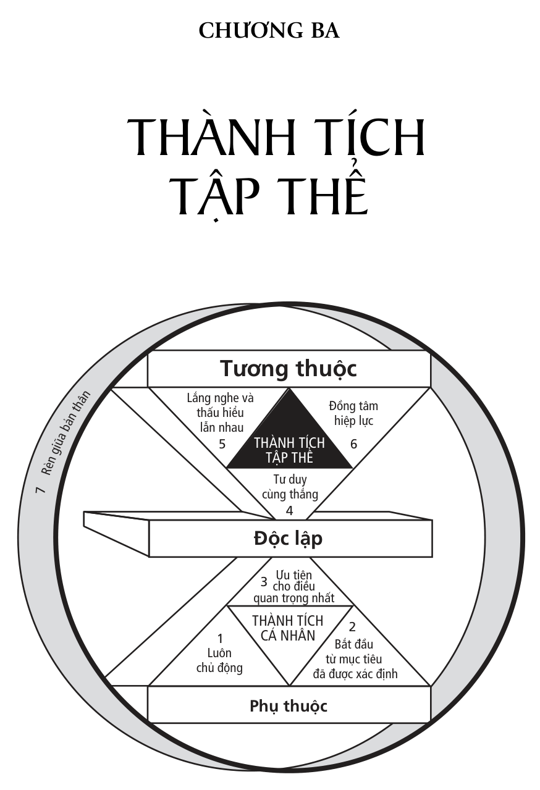
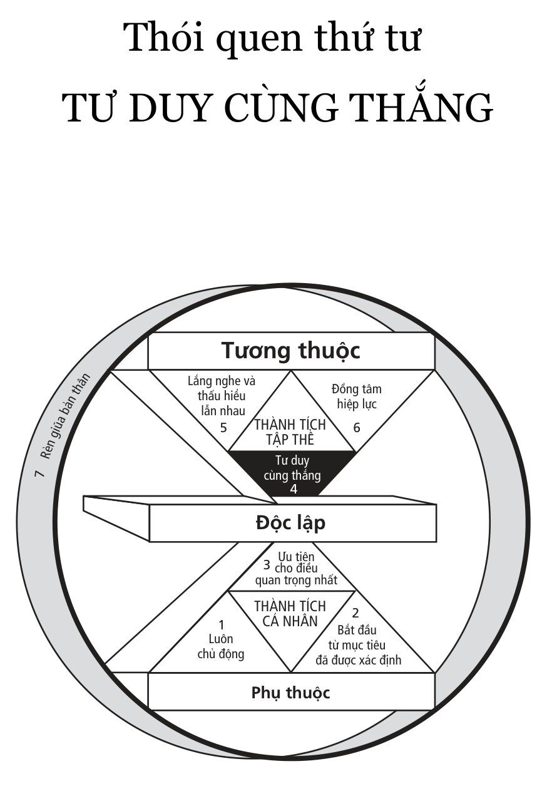
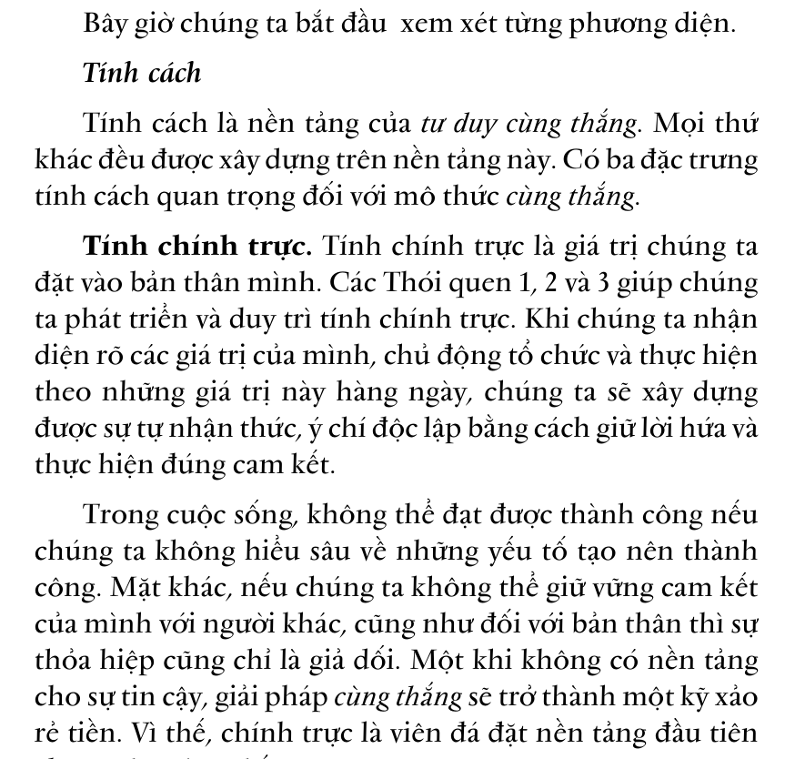
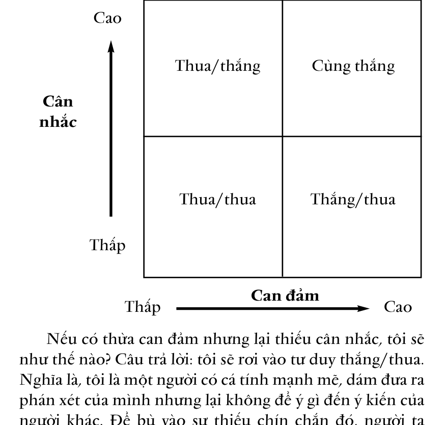
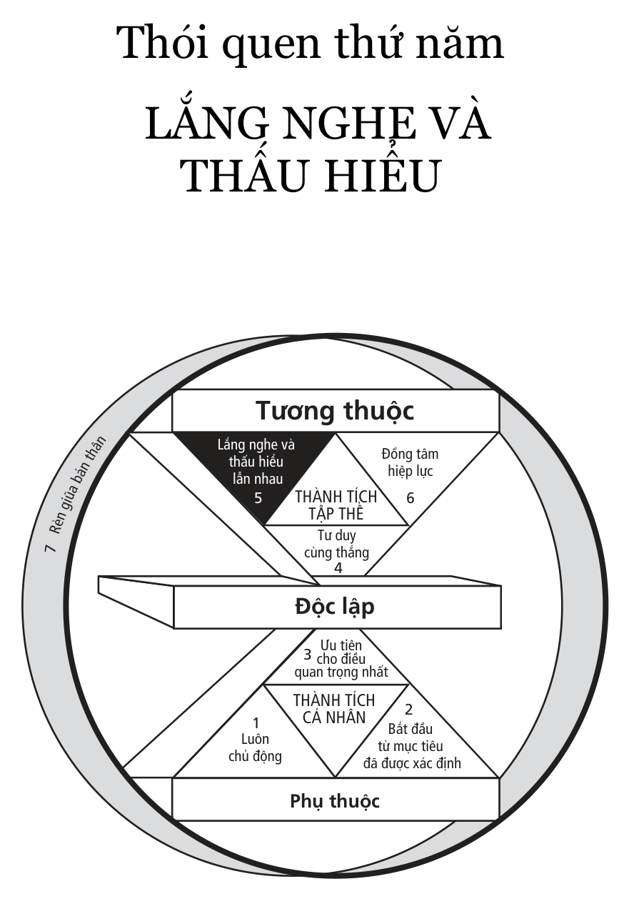
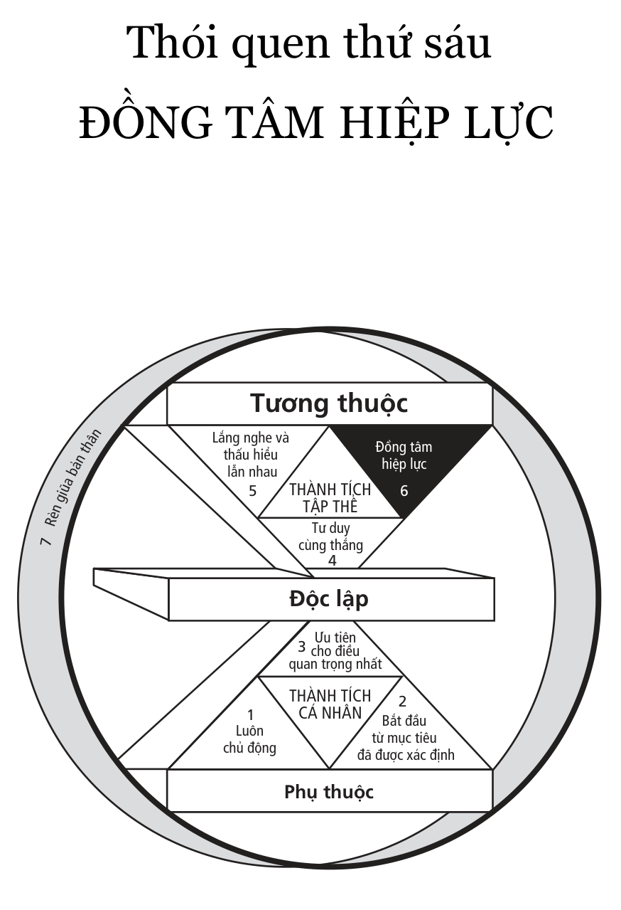
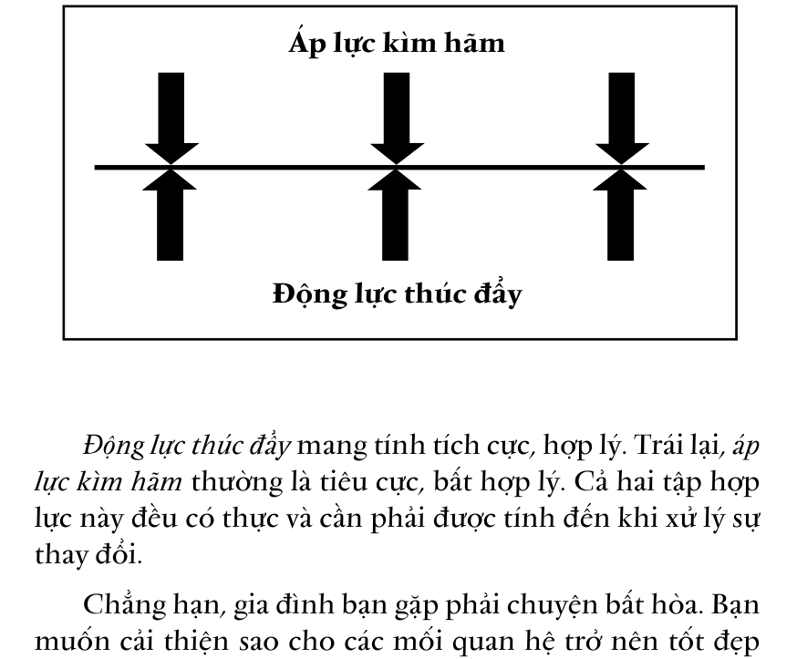

# CHƯƠNG BA - THÀNH TÍCH

# Những mô thức của sự

# tương thuộc

> “Không có tình bạn nếu không có lòng tin, không có lòng tin nếu không có sự trung thực.”

- Samuel Johnson

Trước khi chuyển sang phần nói về ***Thành tích tập thể,***chúng ta cần nhớ lại rằng sự tương thuộc hiệu quả chỉ có thể được xây dựng trên cơ sở độc lập thực sự;***Thành tích cá nhân***luôn đi trước***Thành tích tập thể.***

Khi nhìn lại và khảo sát địa hình để xác định xem đang ở đâu trong mối liên hệ với nơi sẽ tới, chúng ta thấy rõ rằng: không thể đến được nơi đang đứng mà không đi theo con đường đã đi. Không có con đường tắt nào cũng như không còn cách nào khác. Không có cách nào để nhảy dù vào địa hình chúng ta đang có mặt vì nó đã bị che phủ bởi thất bại của một số người. Họ đã cố gắng nhảy vào xây dựng các mối quan hệ hữu hiệu mà không có sự chín chắn, sức mạnh của tính cách để duy trì các mối quan hệ đó.

Nhưng bạn không nên làm như vậy. Bạn cần phải có một con đường hẳn hoi. Bạn không thể thành công với người khác nếu chưa trả giá cho sự thành công đối với bản thân mình.

Vài năm trước, tôi dự một cuộc hội thảo ở vùng duyên hải bang Oregon. Một người đàn ông đến bên tôi và nói: “Ông có biết không, Stephen, tôi thực sự không thấy thích thú lắm với cuộc hội thảo này…”.

“Ông hãy nhìn mọi người ở đây”, ông ấy tiếp tục, “Và hãy ngắm bờ biển xinh đẹp cùng tất cả những gì đang diễn ra mà xem. Quá thú vị phải không? Vậy mà tất cả những gì tôi có thể làm là ngồi đây và lo lắng không biết phải trả lời ra sao trước những lời tra hỏi qua điện thoại của vợ tôi”.

Trong khi tôi còn đang băn khoăn không hiểu chuyện gì đã xảy ra với người đàn ông này thì ông ta tiếp tục: “Mỗi khi tôi đi xa là cô ấy gọi điện như thể cảnh sát hỏi cung vậy. Nào là “Anh ăn sáng ở đâu? Ăn với ai? Anh có dự họp cả buổi sáng không? Khi nào thì nghỉ trưa? Anh đã nghỉ trưa ở đâu? Buổi tối anh đi đâu? Chơi gì? Em nghe có tiếng phụ nữ, anh đang đi cùng ai vậy?...” Và điều cô ấy thực sự muốn biết, nhưng không bao giờ muốn nói ra, là cô ấy có thể hỏi ai để xác minh những gì tôi đã nói với cô ấy. Cô ấy làm tình làm tội tôi đủ mọi thứ mỗi khi tôi đi xa. Tôi thực sự không còn hứng thú gì nữa”.

Ông ta có vẻ rất khổ sở. Chúng tôi nói chuyện một lúc và ông ấy đưa ra một câu bình luận rất đáng chú ý: “Tôi đoán là cô ấy biết rõ nên hỏi cái gì?”. Ông ấy ngập ngừng, hơi lúng túng: “Cũng chính từ một cuộc hội thảo như thế này, tôi đã gặp cô ấy. Lúc đó, tôi đã có vợ”.

Tôi suy nghĩ về ý tứ của câu nói đó rồi hỏi: “Hình như anh là người thích sử dụng các giải pháp nhanh?”.

“Ý ông muốn nói gì?”, ông ấy hỏi.

“À, đại loại là anh muốn có thể dùng cái tuốc-nơ-vít để

mở hộp sọ vợ anh ra rồi lên dây thần kinh điều chỉnh lại thái độ của cô ấy một cách nhanh chóng, có phải vậy không?”

“Tất nhiên rồi, tôi muốn cô ấy thay đổi”, ông ta giải thích, “Tôi không cho rằng cô ấy đúng khi cứ tra hỏi tôi như vậy”.

“Ông bạn ạ”, tôi nói, “Chỉ nói suông thì ông không thể nào thoát ra khỏi vấn đề mà ông tự dấn thân vào”.

Ở đây, chúng ta đang phải đối mặt với vấn đề thay đổi mô thức rất triệt để, rất cơ bản. Bạn có thể làm trơn tru các mối giao tiếp xã hội bằng những kỹ thuật và kỹ năng riêng, nhưng trong quá trình đó, bạn có thể bỏ mất nền tảng tính cách quan trọng. Bạn không thể có thành tích hão. Đây là một nguyên tắc theo trình tự: ***Thành tích cá nhân đi trước Thành tích tập thể*** . Sự tự chủ và ý thức tự giác là nền tảng của các mối quan hệ tốt đẹp với người khác.

Một số người nói rằng bạn phải yêu quý bản thân mình trước khi bạn có thể yêu quý người khác. Tôi nghĩ rằng ý tưởng đó có lý, nhưng nếu bạn không biết rõ bản thân, nếu bạn không làm chủ được bản thân thì sẽ rất khó yêu quý chính mình, trừ một số trường hợp, nhưng chỉ mang tính nhất thời, hời hợt.

Lòng tự trọng chỉ có khi bạn kiểm soát được bản thân, khi bạn độc lập thực sự. Đó chính là tiêu điểm của các Thói quen 1, 2 và 3. Độc lập là một thành quả. Tương thuộc là một lựa chọn mà chỉ những người có tính độc lập mới có. Nếu không thực sự rèn luyện tính độc lập thì mọi cố gắng phát triển kỹ năng xây dựng mối quan hệ với con người của chúng ta cũng chỉ là vô ích. Chúng ta có thể cố làm điều đó, thậm chí còn đạt được chút ít thành công trong điều kiện thuận lợi, nhưng khi gặp khó khăn – chắc chắn sẽ có –

chúng ta sẽ không có cơ sở để tiếp tục duy trì mối quan hệ.

Yếu tố quan trọng nhất chúng ta đưa vào các mối quan hệ không phải là lời nói hay hành động mà chính là con người chúng ta. Nếu những lời nói và hành động xuất phát từ các kỹ năng giao tiếp (Đạo đức nhân cách) chứ không phải từ bản chất chúng ta (Đạo đức tính cách) thì những người khác sẽ nhận thấy ngay sự giả tạo đó. Chúng ta sẽ không thể tạo ra và duy trì được nền tảng cần thiết để có mối quan hệ tương thuộc hiệu quả.

Những kỹ thuật và kỹ năng thực sự tạo ra sự khác biệt trong giao tiếp xuất phát gần như rất tự nhiên từ một tính cách độc lập. Do đó, nơi bắt đầu xây dựng mọi mối quan hệ là ở bên trong con người chúng ta, bên trong ***Vòng tròn Ảnh hưởng*** và tính cách chúng ta. Khi chúng ta trở nên độc lập, tức luôn chủ động, lấy các nguyên tắc đúng đắn làm trọng tâm, lấy giá trị làm động lực thúc đẩy, có khả năng tổ chức, thực hiện các ưu tiên trong cuộc sống một cách trung thực, thì chúng ta có thể lựa chọn để sống tương thuộc. Nghĩa là chúng ta có khả năng xây dựng các mối quan hệ phong phú, lâu bền và hữu ích với những người xung quanh.

Nhìn về phía trước, chúng ta thấy mình đang bước vào một không gian hoàn toàn mới mẻ. Sự tương thuộc mở ra một thế giới của những khả năng hợp tác sâu sắc, đa dạng và đầy ý nghĩa; một thế giới trong đó năng suất lao động không ngừng tăng lên; một thế giới cho sự cống hiến, đóng góp, học tập và trưởng thành của chúng ta. Nhưng cũng chính nơi đó, chúng ta cảm thấy đau khổ nhiều nhất, thất vọng ê chề nhất và trở ngại khắc nghiệt nhất trên con đường mưu cầu hạnh phúc và thành công. Và chúng ta biết rõ những bất lợi đó vì chúng có tính chất cấp tính.

Ngược lại, với những bất lợi có tính kinh niên, chúng ta trở nên quen thuộc với nó và biết cách chung sống cùng nó. Chúng ta thường sống hết năm này sang năm khác với sự bất lợi do thiếu tầm nhìn, thiếu sự lãnh đạo hay quản lý trong cuộc sống cá nhân. Chúng ta cảm thấy bực bội và khó chịu một cách mơ hồ, và thỉnh thoảng lại tìm cách để giảm thiểu, chí ít là trong giây lát.

Nhưng khi gặp rắc rối trong quan hệ giao tiếp với người khác, chúng ta trở nên rất cảnh giác với những bất lợi cấp tính – chúng thường rất căng thẳng và ta muốn tống khứ chúng ngay lập tức. Đó chính là lúc ta tìm cách điều trị các triệu chứng đó bằng giải pháp cấp tốc, bằng các kỹ thuật của ***Đạo đức nhân cách*** . Chúng ta không hiểu rằng triệu chứng cấp tính là sự bùng phát của căn bệnh mãn tính vốn còn trầm trọng hơn. Và nếu không chấm dứt việc điều trị triệu chứng để tiến hành chữa trị tận gốc căn bệnh thì những nỗ lực của chúng ta chỉ thêm phản tác dụng.

Trở lại vấn đề đang bàn luận – sự giao tiếp hiệu quả với người khác – chúng ta hãy quay trở lại định nghĩa trước đây về thành đạt. Chúng ta nói thành đạt là sự cân bằng P/PC, đó là một khái niệm cơ bản rút ra từ câu chuyện về con ngỗng và những quả trứng vàng.

Trong một tình huống có sự tương thuộc, “những quả trứng vàng” là kết quả của một sự hợp lực tuyệt vời, được tạo ra do giao tiếp cởi mở và tương tác tích cực với những người xung quanh. Để có được “những quả trứng vàng” đó một cách đều đặn, chúng ta phải chăm sóc “con ngỗng”. Chúng ta cần phải tạo ra và quan tâm đến các mối quan hệ biến những kết quả mong muốn trở thành hiện thực.

Do đó, trước khi đi vào các Thói quen 4, 5 và 6, tôi

muốn giới thiệu một phép ẩn dụ - mà tôi nghĩ là rất thực tế trong việc mô tả các mối quan hệ và định nghĩa sự cân bằng P/PC - trong một thực tại tương thuộc.

### 1. T ÀI KHOẢN TÌNH CẢM

Chúng ta đều biết tài khoản ngân hàng là gì. Chúng ta gửi tiền vào tài khoản đó và lập một khoản dự trữ mà chúng ta có thể rút ra khi cần. Tài khoản tình cảm là một phép ẩn dụ mô tả mức độ tin cậy được xây dựng trong một mối quan hệ. Đó là cảm giác an toàn của bạn đối với người khác. Nếu tôi ký gửi vào tài khoản tình cảm của bạn bằng sự nhã nhặn, tốt bụng, chân thành và giữ các cam kết với bạn, thì tôi đã thiết lập được một khoản dự trữ. Sự tin cậy của bạn dành cho tôi sẽ cao hơn, và khi cần, tôi có thể nhờ đến sự tin cậy đó.

Chẳng hạn, tôi gây ra một sai lầm nào đó với bạn, khiến bạn bị tổn thương, thì khoản dự trữ tình cảm có được từ sự tin cậy sẽ bù đắp cho sai lầm đó. Có thể thái độ và cách cư xử của tôi không được khéo léo nhưng bạn vẫn hiểu được thông điệp tôi muốn chuyển tải. Bạn sẽ không bắt bẻ hay “vạch lá tìm sâu”. Tài khoản lòng tin được tích lũy càng nhiều thì sự giao tiếp diễn ra càng dễ dàng, nhanh chóng và hiệu quả.

Nhưng nếu tôi thường xuyên cư xử không phải với bạn, thiếu tôn trọng hay có hành động xem thường bạn, thậm chí phản bội lòng tin, đe dọa, hay trở thành gánh nặng cho bạn, thì cuối cùng, tài khoản tình cảm của tôi sẽ bị thấu chi (chi quá số dư trên tài khoản). Lòng tin sẽ giảm nghiêm trọng. Khi đó, liệu tôi còn có chút hy vọng nào vào lòng khoan dung của bạn nữa không?

Chắc chắn là không. Lúc đó, tôi sẽ như đang đi trên một bãi mìn. Tôi phải rất thận trọng mỗi khi định nói bất cứ điều gì. Tôi phải cân nhắc từng câu chữ. Tôi như sống trong một môi trường căng thẳng, đầy cảnh giác. Tôi phải biết cách tự bảo vệ bằng những thủ đoạn. Những điều này xuất hiện đầy rẫy trong các tổ chức, trong nhóm làm việc, và cả trong cuộc sống hôn nhân.

Nếu tài khoản lòng tin không được bổ sung thường xuyên thì mối quan hệ ban đầu dù tốt đẹp đến đâu cũng sẽ bị xói mòn. Trong hôn nhân, mối quan hệ vợ chồng hạnh phúc, đồng cảm, phong phú và tự nguyện sẽ nhanh chóng biến thành một sự thỏa hiệp. Hai người tuy sống chung nhà nhưng mỗi người một “cõi”, họ cắn răng chịu đựng nhau và không can thiệp vào cuộc sống của người kia. Mối quan hệ có thể trở nên tồi tệ đến mức dẫn đến các cuộc đấu khẩu căng thẳng. Quan hệ đó có thể kết thúc bằng một cuộc chiến tranh lạnh tại nhà, và cũng có thể bằng một cuộc chiến công khai tại tòa, nơi người ta không ngớt kể ra vô số tội lỗi của người từng “đầu ấp tay gối” với mình.

Đáng buồn là điều này lại xảy ra đối với mối quan hệ thân mật, phong phú, hạnh phúc và có tính xây dựng nhất có thể có giữa hai con người trên trái đất: quan hệ hôn nhân. Ngọn hải đăng P/PC vẫn còn đó; việc lao đầu vào nó hay lấy nó làm ánh sáng chỉ đường là tùy thuộc sự lựa chọn của mỗi chúng ta.

Những mối quan hệ lâu dài như quan hệ hôn nhân đòi hỏi sự ký gửi tài khoản tình cảm không ngừng. Trong các mối quan hệ thường xuyên với người khác cũng vậy. Do những kỳ vọng không ngừng tăng lên nên những khoản tình cảm đã ký gửi vào tài khoản từ trước sẽ dần dần mai một.

Thỉnh thoảng, trong quan hệ giao tiếp hàng ngày của bạn, những khoản tình cảm lại tự động được rút ra khỏi tài khoản mà bạn không biết. Điều này đặc biệt đúng đối với các trẻ vị thành niên trong gia đình. Giả sử bạn thường xuyên giao tiếp với con mình theo kiểu như: “Dọn phòng cho sạch đi!”, “Cài khuy áo vào!”, “Tắt đài đi!”, “Đừng quên đổ rác nhé!”… thì không bao lâu, các khoản tình cảm rút ra sẽ vượt quá các khoản tình cảm gửi vào.

Giả sử cậu con trai của bạn đã đến lúc cần có những quyết định quan trọng ảnh hưởng đến cả cuộc đời. Nhưng do mức độ tin cậy lẫn nhau rất thấp và quá trình giao tiếp bị khép kín, thiếu thân mật, cậu ta không muốn hoặc không dám nhờ đến lời khuyên của bạn. Trong trường hợp tài khoản tình cảm của bạn đã bị thấu chi, có lẽ con trai bạn sẽ tự mình đưa ra các quyết định một cách nông cạn, trong khi bạn có đủ khôn ngoan và hiểu biết để giúp đỡ con mình. Điều này có thể dẫn đến nhiều hậu quả tiêu cực lâu dài.

Bạn cần có một sự cân bằng tích cực để xử lý những vấn đề tế nhị này. Nhưng bạn phải làm gì?

Điều gì sẽ xảy ra nếu bạn bắt đầu có thêm “khoản gửi” vào ***tài khoản tình cảm*** của mối quan hệ này? Khi có những cơ hội để biểu thị tình yêu và sự quan tâm với con bạn - hãy tận dụng chúng! Khoản tình cảm gửi vào quan trọng nhất mà bạn có thể tạo ra là lắng nghe mà không phán xét hay thuyết giáo. Bạn chỉ lắng nghe và cố gắng thấu hiểu. Hãy làm cho con trai bạn cảm thấy được bạn quan tâm, được bạn nhìn nhận như một người lớn.

Lúc đầu, có thể thằng bé chưa phản ứng ngay, thậm chí còn nghi ngờ: “Không biết bố muốn gì đây? Lần này, mẹ lại định răn đe mình cái gì nữa?”. Khi những khoản tình cảm

được rót liên tục vào tài khoản một cách chân thành, nó sẽ làm cho số dư tài khoản tăng lên. Và khoản thấu chi, nếu có, sẽ được rút nhỏ lại.

Cần nhớ rằng giải pháp “chữa cháy” cấp tốc trong trường hợp này chỉ là ảo tưởng. Xây dựng và khôi phục lại các mối quan hệ đòi hỏi phải có thời gian. Nếu bạn trở nên thiếu kiên nhẫn trước thái độ như bất cần, hoặc bất hiếu của con trai, bạn có thể sẽ bị rút đi một khoản lớn trong tài khoản tình cảm, và mọi nỗ lực của bạn coi như hỏng. “Bố mẹ đã làm tất cả vì con, hy sinh cho con, thế mà con lại tỏ ra bất hiếu như vậy sao? Bố mẹ đã cố gắng đối xử tốt với con, thế mà con cư xử như vậy à. Thật không tin nổi.”

Khó mà giữ được kiên nhẫn. Vì vậy, chúng ta cần phải có bản lĩnh để luôn chủ động, tập trung vào ***Vòng tròn Ảnh hưởng,*** nuôi dưỡng những điều đang phát triển mà không phải “nhổ hoa xem rễ”. Nhưng quả thật ở đây không có chỗ cho giải pháp cấp tốc hay đốt cháy giai đoạn. Việc xây dựng và khôi phục các mối quan hệ đòi hỏi phải đầu tư lâu dài về thời gian và công sức.

### 2. S ÁU KHOẢN KÝ GỬI CHỦ YẾU

Tôi xin mạn phép đưa ra sáu khoản ký gửi để xây dựng một tài khoản tình cảm, cụ thể như sau.

### Hiểu rõ từng cá nhân

Thực sự hiểu rõ người khác có lẽ là khoản ký gửi quan trọng nhất trong tài khoản tình cảm của bạn, nó là chìa khóa quyết định các “khoản gửi” khác. Bạn sẽ không thể hiểu được điều gì tạo ra khoản ký gửi cho một người đến khi bạn hiểu rõ người đó. Một cuộc dạo chơi để hàn huyên, đi ăn kem cùng nhau, cùng nhau làm một công việc… có

thể là khoản ký gửi vào tài khoản tình cảm của bạn, nhưng người khác thì không nghĩ như vậy. Thậm chí, những điều đó còn bị coi là một “khoản chi” trên ***tài khoản tình cảm*** của một số người, nếu nó không có quan hệ gì đến lợi ích hay nhu cầu của họ.

Sứ mệnh của người này có thể chỉ là chuyện vặt đối với người khác. Để ký gửi tài khoản tình cảm vào người khác, điều bạn thực hiện phải quan trọng với cả hai bên. Chúng ta thử cùng xem xét ví dụ sau. Khi bạn đang làm việc, đứa con trai sáu tuổi của bạn chạy tới hỏi một câu, mà với nó là vấn đề quan trọng, trong khi với bạn thì rất vụn vặt. Trong trường hợp này, việc ký gửi và nhận tài khoản tình cảm không được thực hiện với cả hai bên. Bạn cần phải có Thói quen thứ hai để công nhận giá trị của người khác và Thói quen thứ ba để lập kế hoạch ưu tiên cho vấn đề của người đó. Bằng cách chấp nhận giá trị mà con bạn đặt ra, bạn thể hiện được sự chia sẻ của mình và điều đó sẽ tạo ra một khoản tình cảm lớn ký gửi vào tài khoản.

Một người bạn của tôi có cậu con trai rất mê bóng chày, nhưng anh ấy lại chẳng quan tâm gì đến môn thế thao đó cả. Nhưng rồi, một mùa hè nọ, anh ấy đã dẫn con trai đi xem tất cả các trận đấu bóng chày của các đội nổi tiếng. Chuyến đi kéo dài hơn sáu tuần lễ và tiêu tốn khá nhiều tiền, nhưng nó đã trở thành một trải nghiệm gắn bó sâu sắc mối quan hệ cha con của họ.

Khi trở về, có người hỏi anh bạn tôi: “Anh thích bóng chày đến thế sao?”.

“Không”, anh ấy trả lời, “nhưng tôi rất yêu quý con trai tôi”.

Một người bạn khác của tôi lại có mối quan hệ cha con

không mấy tốt đẹp với cậu con trai vị thành niên của mình. Toàn bộ cuộc sống của vị giáo sư này gắn liền với sự nghiệp nghiên cứu, và ông ấy cảm thấy cậu con trai của mình đang hoang phí cuộc đời khi chỉ biết lao động chân tay thay vì lao động trí óc. Do vậy, ông ấy hầu như lúc nào cũng gây cản trở cho con mình. Đến một ngày, ông ta nhận ra sai lầm của mình và rất hối hận. Ông cố gắng tạo ra nhiều khoản ký gửi vào tài khoản tình cảm của con mình nhưng không có kết quả. Với cậu con trai, tất cả những biểu hiện đó của cha đều là hình thức mới của sự bác bỏ, so sánh và phán xét. Cả hai nhanh chóng bị cạn tài khoản tình cảm. Mối quan hệ cha con trở nên tồi tệ hơn, và nó đã làm tan vỡ trái tim người cha.

Một hôm, tôi chia sẻ với ông về nguyên tắc làm thế nào để những điều quan trọng của người khác cũng trở nên quan trọng đối với mình và ngược lại. Ông ấy tiếp thu sâu sắc ý kiến của tôi. Sau đó, ông đề nghị cậu con trai cùng làm một mô hình Vạn Lý Trường Thành trong khu vườn nhà họ, hơn một năm rưỡi dự án của họ mới hoàn thành.

Và trong một năm rưỡi đó, quá trình làm việc cùng cha đã giúp cậu con trai dần dần nuôi dưỡng ý chí phát huy sức sáng tạo, khả năng tính toán – tức phát triển trí tuệ. Nhưng lợi ích thật sự mà cha con họ có được chính là nguồn sức mạnh và niềm hạnh phúc đến từ sự tin cậy lẫn nhau.

Chúng ta thường có xu hướng xem những gì mình có cũng là những thứ mà người khác muốn có và cần có. Chúng ta hay áp đặt người khác phải hành động theo ý muốn của mình. Chúng ta lý giải rằng tài khoản tình cảm có được là do nhu cầu và ý muốn của chúng ta. Nếu mọi nỗ lực của bản thân không được đón nhận thì chúng ta thường coi đó là sự từ chối và sẵn sàng bỏ bê những gì đã cố gắng xây dựng.

Nguyên tắc vàng cho rằng: “Hãy cư xử với người khác theo cách bạn muốn họ cư xử với mình” – nghĩa là hãy làm cho người khác những điều mà bạn muốn họ làm cho mình. Tuy nhiên, nguyên tắc trên còn có một ý nghĩa khác, sâu sắc hơn: hãy hiểu rõ người khác như bạn muốn họ hiểu rõ bạn, và đối xử với họ thông qua sự hiểu biết đó.

### Quan tâm đến những điều nhỏ nhất

Trong mối quan hệ giữa con người với nhau, những điều có vẻ như nhỏ nhặt lại là những cái lớn. Những cử chỉ, cách thể hiện, ứng xử dù rất nhỏ đối với người này lại ảnh hưởng rất lớn đến tài khoản tình cảm của họ trong lòng người khác. Chỉ cần một ánh nhìn thiếu thiện cảm, một sự quan tâm không đúng mực, một lời nói vô tình… cũng rút đi một “khoản chi” rất lớn trong “tài khoản” ấy.

Tôi nhớ lại một kỳ nghỉ với hai đứa con trai nhiều năm trước đây. Sau khi cùng nhau trải qua một ngày vui chơi dã ngoại, đi xem thể dục dụng cụ, các trận đấu vật, ăn hot-dog, chúng tôi rủ nhau đi xem phim. Giữa buổi chiếu phim, Sean, lúc đó mới bốn tuổi, lăn ra ngủ trên ghế. Anh trai của nó, Stephen, sáu tuổi, còn thức và cùng tôi xem hết bộ phim. Khi xem xong, tôi ẵm Sean ra xe ô-tô và đặt nó vào ghế sau. Buổi tối hôm đó trời rất lạnh nên tôi cởi áo khoác ra choàng lên người thằng bé.

Khi về đến nhà, tôi vội vàng bế Sean vào phòng ngủ. Sau khi Stephen thay đồ ngủ và đánh răng, tôi nằm cạnh nó để nói chuyện về chuyến đi chơi.

“Chuyến đi chơi thế nào Stephen?”

“Dạ, tốt”, thằng bé trả lời.

“Con có thích không?”

“Dạ, có.”

“Con thích gì nhất?”

“Con không biết. Chắc là đấu vật.”

Có vẻ như thằng bé không muốn nói gì thêm. Tôi băn khoăn không hiểu tại sao Stephen lại không cởi mở hơn. Bình thường, nó rất sôi nổi mỗi khi đi chơi về. Nhưng lần này, nó im lặng suốt quãng đường về. Tôi hơi thất vọng, và cảm thấy có gì đó không ổn.

Stephen nằm quay mặt vô tường. Tôi ngạc nhiên không rõ vì sao. Nhổm người lên, tôi thấy nước mắt đang trào ra ở khóe mắt thằng bé.

“Có việc gì không ổn vậy con?”

Nó quay mặt lại, nước mắt chảy ràn rụa, mếu máo: “Bố, nếu con bị lạnh, bố có cởi áo khoác cho con không?”.

Trong toàn bộ sự kiện diễn ra vào buổi tối đặc biệt đó, điều quan trọng nhất đối với Stephen lại là cử chỉ chăm sóc nhỏ nhặt – một biểu thị yêu thương nhất thời – của tôi dành cho Sean, em trai nó.

Sự kiện đó là một bài học sâu sắc đối với bản thân tôi cho đến tận bây giờ. Con người ta vốn rất mềm yếu và dễ tủi thân, dù có được che đậy bằng vẻ bề ngoài cứng rắn và nhẫn tâm nhất. Có thể tuổi tác và kinh nghiệm sống tạo ra nhiều sự khác biệt, nhưng tựu trung, trong sâu thẳm tâm hồn mỗi người vẫn ẩn chứa những tình cảm mềm yếu.

### Giữ cam kết

Giữ lời hứa hay làm đúng cam kết là ký gửi một khoản lớn vào tài khoản tình cảm của bạn, ngược lại sẽ bị mất đi một khoản lớn. Tài khoản tình cảm của bạn vơi hay đầy

đều do cách cư xử của chính bạn. Và trong thực tế, không có “khoản chi” nào lớn hơn “khoản chi” không thực hiện lời hứa quan trọng đối với một người. Một lần bạn thất hứa, người ta sẽ khó tin bạn ở những lần tiếp theo. Người ta thường xây dựng niềm hy vọng từ những lời hứa, đặc biệt là khi chúng có liên quan đến sinh kế của họ.

Là bậc làm cha làm mẹ, tôi luôn cố gắng không bao giờ đưa ra lời hứa không có tính khả thi. Với những cân nhắc rất thận trọng, tôi cố gắng tính toán hết mọi khả năng bất ngờ có thể khiến tôi không giữ được lời hứa của mình.

Tất nhiên, những điều bất ngờ vẫn cứ xảy ra và tôi vẫn cố thực hiện, hoặc giải thích tình hình một cách cặn kẽ với những người có liên quan và mong được họ thông cảm. Đối với con cái, nếu rèn luyện được thói quen luôn giữ đúng lời hứa, bạn sẽ bắc được chiếc cầu lòng tin nối liền sự thông hiểu giữa bạn và bọn trẻ. Khi con bạn muốn làm một điều gì đó trái ý bạn, bạn có thể nói cho chúng biết hậu quả của việc làm đó thông qua kinh nghiệm bạn có, chẳng hạn như: “Con à, nếu con làm điều đó, bố tin rằng hậu quả sẽ là...”. Một khi con bạn đã có lòng tin nơi bạn, vào lời hứa của bạn, nó sẽ nghe theo lời bạn khuyên dạy.

### Làm rõ các kỳ vọng

Hãy thử tưởng tượng những khó khăn bạn có thể gặp phải nếu bạn và sếp có những nhận định khác nhau về việc ai là người có trách nhiệm xây dựng bản mô tả chi tiết công việc của bạn.

“Khi nào tôi có được bản mô tả chi tiết công việc của tôi?”, bạn có thể hỏi.

“Tôi đang chờ anh đưa cho tôi bản đề xuất để chúng ta thảo luận”. Sếp của bạn trả lời.

“Tôi nghĩ rằng việc xác định công việc cụ thể tôi phải làm là do anh đặt ra.”

“Đó không phải là việc của tôi. Anh không nhớ sao? Ngay từ đầu, tôi đã nói rằng làm việc thế nào phần lớn là do anh quyết định.”

“Tôi cứ nghĩ rằng ý anh nói chất lượng công việc là do tôi. Nhưng tôi thực sự không biết công việc của tôi là gì.”

Sự không rõ ràng của kỳ vọng đối với các mục tiêu cần thực hiện sẽ có hại đến quan hệ giao tiếp và sự tin cậy.

“Tôi đã làm đúng những gì anh yêu cầu và đây là bản báo cáo.”

“Tôi không cần bản báo cáo. Mục tiêu là giải quyết được vấn đề – không phải là để phân tích và báo cáo lại những điều đó.”

“Tôi tưởng rằng mục tiêu là nêu ra cách giải quyết vấn đề để chúng ta có thể giao cho người khác thực hiện.”

Có biết bao nhiêu lần chúng ta đã nghe thấy những cuộc đối thoại như thế này?

“Anh đã nói…”

“Không, anh sai rồi. Tôi đã nói thế này…”

“Anh không nói như vậy, anh chưa bao giờ nói rằng tôi phải …”

“Ồ, không phải vậy, tôi đã nói rõ ràng…”

“Anh chưa bao giờ nhắc đến…”

“Nhưng đó là thỏa thuận của chúng ta…”

Hầu hết vướng mắc phát sinh trong các mối quan hệ

đều do xung đột hay những kỳ vọng mơ hồ xung quanh vai trò và mục tiêu. Dù nguyên nhân có xuất phát từ thái độ và cách cư xử của bên nào thì chúng ta vẫn có thể tin chắc rằng kỳ vọng mơ hồ sẽ dẫn đến hiểu lầm, thất vọng và mất lòng tin.

Nhiều kỳ vọng có tính chất tiềm ẩn. Dù không được nêu ra hay tuyên bố một cách rõ ràng dứt khoát nhưng người ta vẫn cứ đưa chúng vào những hoàn cảnh cụ thể. Chẳng hạn, trong hôn nhân, cả chồng lẫn vợ đều có những kỳ vọng tiềm ẩn về vai trò của mình. Mặc dù những kỳ vọng này chưa bao giờ được thảo luận, hay thậm chí đôi khi còn không được bản thân họ công nhận, nhưng nếu thực hiện, họ vẫn có thể tạo ra một khoản ký gửi lớn vào tài khoản tình cảm của mối quan hệ, ngược lại, họ sẽ bị mất đi một khoản lớn.

Đó là lý do vì sao việc đặt ngay lên bàn tất cả các kỳ vọng mỗi khi bạn rơi vào một tình huống mới trở nên rất quan trọng, vì mọi người sẽ bắt đầu phán xét lẫn nhau thông qua những kỳ vọng đó. Nếu họ cảm thấy những kỳ vọng cơ bản của họ bị vi phạm, thì khoản dự trữ lòng tin sẽ không còn. Chúng ta vẫn thường tạo ra nhiều hoàn cảnh tiêu cực nhưng lại cứ nghĩ đơn giản rằng những kỳ vọng của mình là hiển nhiên, rằng chúng sẽ được người khác hiểu rõ và chia sẻ.

Việc làm rõ các kỳ vọng ngay từ đầu chính là tạo ra một khoản ký gửi lớn. Điều này đòi hỏi sự đầu tư trước hết về thời gian và sức lực nhưng sẽ tiết kiệm được về sau. Khi các kỳ vọng không rõ ràng và không được chia sẻ, người ta sẽ trở nên khó xử về mặt tình cảm. Những hiểu lầm đơn giản có nguy cơ trở nên phức tạp, có thể dẫn đến những xung đột cá nhân, khiến mối quan hệ dễ bị phá vỡ.

Làm rõ các kỳ vọng đòi hỏi phải có sự thành thật. Mọi sự sẽ thuận tiện hơn nếu người ta hành động như thể những khác biệt không hề tồn tại và cùng nỗ lực giải quyết, nhằm đi đến những kỳ vọng chung mà các bên đều hài lòng.

### Thể hiện sự chính trực của bản thân

Sự chính trực tạo ra lòng tin và là cơ sở tạo ra các khoản ký gửi vào tài khoản tình cảm. Nếu thiếu trung thực, người ta có thể làm hại hầu như mọi nỗ lực tạo ra các tài khoản tin cậy cao. Người ta có thể cố gắng để hiểu, nhớ những việc nhỏ nhặt, giữ lời hứa của mình, làm rõ và thực hiện các kỳ vọng, nhưng vẫn không xây dựng được nguồn dự trữ cho lòng tin bằng sự giả dối.

Sự chính trực không chỉ bao hàm tính trung thực mà còn hơn thế nữa. ***Trung thực***là nói sự thật, là giữ cho lời nói của mình phù hợp với sự thật. Còn***chính trực*** là làm cho sự thật phù hợp với lời nói của mình - đi đôi với hành động. Nói cách khác, đó là việc giữ lời hứa và thực hiện các kỳ vọng. Điều này đòi hỏi một tính cách kết hợp, nhất quán, trước hết đối với bản ngã, và cũng là đối với cuộc sống của một người.

Một trong những cách quan trọng nhất để thực hiện sự chính trực là ***trung thành với những người không có mặt.*** Bằng cách đó, chúng ta sẽ xây dựng được lòng tin của người có mặt.

Giả sử bạn và tôi nói chuyện riêng với nhau, và đề tài câu chuyện là chỉ trích cấp trên của cả hai, một điều mà không ai dám làm nếu sếp có mặt. Nhưng điều gì sẽ xảy ra nếu bạn và tôi không còn chơi với nhau nữa? Bạn sẽ nghĩ rằng tôi sẽ tiết lộ những điểm yếu của bạn với người khác,

giống như tôi và bạn đã làm sau lưng sếp của mình. Bạn đã biết rõ bản chất của tôi. Tôi sẽ nói tốt trước mặt bạn nhưng sẽ nói xấu sau lưng bạn. Bạn đã thấy tôi làm điều đó rồi.

Đó là bản chất của sự giả dối. Liệu cái đó có tạo ra khoản dự trữ lòng tin trong tài khoản quan hệ giữa bạn và tôi không? Mặt khác, giả sử bạn bắt đầu chỉ trích cấp trên của chúng ta, tôi nói với bạn là tôi đồng ý cơ bản về một số nhược điểm của sếp, và sau đó đề nghị cả hai trực tiếp gặp sếp để trình bày vấn đề một cách thẳng thắn, nhằm tìm cách khắc phục. Như vậy, dù cho sau này tôi và bạn không còn thân thiết với nhau, bạn cũng vẫn giữ được lòng tin đối với tôi.

Ví dụ khác, giả sử để có mối quan hệ tốt với bạn, tôi cố gắng lấy lòng bạn bằng cách nói cho bạn biết những bí mật của người khác. “Tôi thực sự không muốn nói ra điều này”, tôi có thể nói như vậy, “nhưng vì anh là bạn của tôi, là người tôi tin cậy…”. Thế nhưng, liệu sự phản bội của tôi đối với người khác có làm tăng được tài khoản lòng tin giữa tôi và bạn không? Hay bạn sẽ càng e ngại rằng tôi có thể tiết lộ với người khác những bí mật mà bạn đã chia sẻ với tôi?

Sự giả dối như vậy có vẻ sẽ khiến gia tăng tình cảm trên tài khoản giữa bạn và người khác, nhưng thực ra, tài khoản của bạn sẽ bị giảm đáng kể vì sự thiếu trung thực của bản thân. Bạn có thể lấy được “quả trứng vàng” từ sự hài lòng nhất thời bằng cách hạ thấp người khác hoặc chia sẻ thông tin bí mật, nhưng kỳ thực là bạn đang bóp chết “con ngỗng”, bạn đang làm suy yếu mối quan hệ vốn đem lại sự hài lòng lâu dài giữa họ và bạn.

Nói một cách đơn giản, sự chính trực trong một thực tại tương thuộc là bạn nên cư xử với mọi người bằng một

quy tắc ứng xử như nhau. Nếu làm được điều đó, bạn sẽ được tin cậy. Đối đầu đòi hỏi một sự can đảm cao độ nên nhiều người muốn chọn con đường ít đối chọi nhất, bằng cách xem thường và chỉ trích, phản bội lòng tin, hay tham gia vào chuyện “ngồi lê mách lẻo” sau lưng người khác. Thực chất, người ta chỉ tin cậy và tôn trọng bạn nếu bạn trung thực. Có thể lúc đầu họ không hoan nghênh sự đối đầu thẳng thắn của bạn, nhưng không vì thế mà bạn không thẳng thắn. Người ta nói rằng được tin cậy lâu dài khó hơn được yêu quý. Riêng tôi, tôi tin rằng được tin cậy cũng đồng thời là được yêu quý.

Joshua, con trai tôi, khi còn bé thường hỏi tôi câu hỏi về tự vấn lương tâm. Mỗi khi tôi có hành động quá đáng hay ít ra là bực bội, hoặc không tử tế với ai đó, thằng bé tự thấy bị tổn thương. Và vì quan hệ cha con giữa hai chúng tôi rất thân mật nên nó nhìn thẳng vào mắt tôi và hỏi: “Bố, bố có yêu con không?”. Có lẽ nó nghĩ rằng nếu tôi đang phá vỡ nguyên tắc cơ bản của cuộc sống đối với ai đó, thì quan hệ tình cảm của hai cha con cũng bị phá vỡ.

Với tư cách là một nhà giáo, cũng là một người cha, tôi đã phát hiện ra rằng chìa khóa cho 99 (đa số) chính là thiểu số 1 còn lại – đặc biệt khi số 1 đại diện cho lòng kiên nhẫn và tâm trạng vui vẻ của đa số. Cách bạn cư xử đối với một người như thế nào sẽ thể hiện cách bạn đối xử với 99 người còn lại, bởi vì mọi người xét cho cùng cũng là một người.

Sự chính trực còn có nghĩa là tránh mọi giao tiếp có tính chất bịp bợm, xảo trá, hay sử dụng những phương sách đê hèn. “Nói dối là sự giao tiếp với ý đồ lừa dối” - dù giao tiếp bằng lời nói hay hành động, nếu là người trung thực, chúng ta sẽ không bao giờ có ý định lừa dối ai.

### Thành thật nhận lỗi khi phạm sai lầm

Khi rút khỏi tài khoản tình cảm một khoản nào đó, chúng ta cần xin lỗi – xin lỗi một cách chân thành. Những lời chân thành sẽ là những khoản tình cảm lớn gửi vào tài khoản của bạn.

“Tôi đã sai.”

“Quả thật tôi đã không tử tế với anh/chị.”

“Tôi đã thiếu tôn trọng anh.”

“Tôi đã không xem anh ra gì, tôi thực sự xin lỗi.”

“Tôi đã làm anh bẽ mặt trước người khác và tôi không có lý do gì để làm điều đó. Mặc dù chỉ muốn nói ra ý kiến của mình, nhưng lẽ ra tôi không nên làm như vậy. Tôi thành thật xin lỗi.”

Phải có bản lĩnh mạnh mẽ, bạn mới có thể nhanh chóng đưa ra lời xin lỗi xuất phát từ tấm lòng hơn là từ sự ân hận. Một cá nhân cần phải làm chủ bản thân, cần có một ý thức an toàn sâu sắc về những nguyên tắc cơ bản và giá trị để có được sự nhận lỗi chân thành.

Những người có ít sự an toàn nội tâm thì không thể làm được điều đó. Nó làm cho họ rất dễ bị tổn thương. Họ cảm thấy nhận lỗi sẽ khiến họ trở nên mềm yếu và kém cỏi, họ sợ rằng người khác sẽ lợi dụng sự yếu kém đó. Sự an toàn của họ xuất phát từ ý kiến của người khác, và họ lo ngại người khác có thể nghĩ không hay về họ. Ngoài ra, họ thường cảm thấy mình có lý khi hành động. Họ lý giải sai lầm của bản thân, nhân danh sai lầm của người khác, và nếu họ có xin lỗi đi nữa thì cũng chỉ là hình thức mà thôi.

Tục ngữ phương Đông có câu: “Nếu phải cúi đầu, hãy

cúi thật thấp”. Còn giáo lý Công giáo dạy rằng: “Thiếu nợ một xu cũng phải trả”. Để có được một khoản ký gửi vào tài khoản tình cảm, sự nhận lỗi phải chân thành, và nó phải được người nhận lời xin lỗi tin là chân thành.

Một buổi chiều trong phòng làm việc tại nhà, tôi ngồi viết, không phải về đề tài nào khác mà về sự kiên nhẫn. Tôi nghe thấy tiếng ồn ào của bọn trẻ chạy lên chạy xuống ngoài phòng lớn. Tình hình đó cứ kéo dài mãi, và tôi cảm thấy không thể kiên nhẫn hơn nữa.

Bất thình lình, David, con trai tôi, đập cửa phòng tắm thình thịch và gào to:

“Cho em vào! Cho em vào!”

Tôi lao ra khỏi phòng và quát lên:

“David, con có biết là con đang làm phiền bố đến mức nào không? Con có biết bố cần yên tĩnh để làm việc không? Giờ thì đi vào phòng con và ở đó cho đến khi con biết lỗi của mình!”

Thế là nó đi ra, buồn bã khép cửa lại.

Khi quay về chỗ ngồi, tôi mới nhận ra vấn đề. Mấy đứa trẻ đã chơi trò tranh bóng ở hành lang và một đứa bị khuỷu tay va vào cằm. Nó đang nằm dưới sàn nhà và cằm đang chảy máu. Vậy là David muốn vào phòng tắm để lấy khăn lau cho em nhưng Maria, chị gái nó đang tắm nên không chịu mở cửa.

Khi nhận ra rằng mình đã hành động quá đáng, tôi lập tức đến xin lỗi David. Khi tôi mở cửa ra, câu đầu tiên nó nói với tôi là: “Con sẽ không tha thứ cho bố đâu”.

“Tại sao?”, tôi hỏi, “Thực lòng, bố không biết con đang

giúp em. Tại sao con lại không tha thứ cho bố?”.

“Bởi vì bố cũng làm giống như vậy tuần trước”, nó trả lời. Nói cách khác, nó muốn nói: “Bố à, bố đã thấu chi rồi, và bố không thể dùng lời nói để tháo gỡ mọi chuyện”.

Sự nhận lỗi chân thành tạo ra một khoản ký gửi vào tài khoản tình cảm, còn sự nhận lỗi lặp đi lặp lại sẽ được hiểu là thiếu chân thành và trở thành “khoản chi”. Và chất lượng của mối quan hệ sẽ phản ánh điều đó.

Gây ra lỗi lầm là một chuyện, nhưng không chịu thừa nhận lỗi lầm đó lại là một chuyện hoàn toàn khác. Người ta dễ tha thứ những lỗi lầm do trí năng gây ra - những lỗi lầm do suy xét sai. Nhưng người ta không dễ tha thứ cho lỗi lầm thuộc về tâm hồn - những ý định xấu, những động cơ tồi, sự thanh minh do tự phụ nhằm bào chữa cho lỗi lầm đã gây ra.

### 3. N HỮNG QUY LUẬT CỦA TÌNH YÊU VÀ CUỘC SỐNG

Khi tạo ra những khoản ký gửi bằng tình yêu vô điều kiện, sống theo các quy luật của tình yêu, chúng ta sẽ khuyến khích người khác sống theo các quy luật cơ bản của cuộc sống. Nói cách khác, khi thực sự yêu người khác một cách vô điều kiện, không có sự kiểm soát, chúng ta sẽ giúp họ cảm thấy được bảo vệ và an toàn, những giá trị cơ bản, phẩm giá của họ được công nhận và khẳng định. Điều đó cũng có nghĩa là quá trình phát triển tự nhiên của họ được khuyến khích. Chúng ta giúp họ dễ dàng hơn trong việc sống theo các quy luật của cuộc sống như sự hợp tác, cống hiến, tự giác, chính trực. Chúng ta cũng tạo điều kiện cho họ khám phá và sống một cách tốt nhất, cao quý nhất theo các quy luật đó. Chúng ta sẽ để họ được tự do hành động

theo sự tự nhận thức về tính cấp bách, chứ không phải theo các điều kiện và giới hạn của chúng ta. Điều này không có nghĩa là chúng ta sẽ trở nên dễ dãi hay mềm yếu. Nếu trở nên như thế thì đó là một “khoản chi” cực lớn. Chúng ta cần khuyên bảo, bênh vực, đưa ra các giới hạn và cả các hậu quả nhưng vẫn thể hiện tình yêu thương với họ.

Khi vi phạm các quy luật cơ bản của tình yêu – tức gắn sự kiểm soát và điều kiện vào tình yêu, chúng ta đã gián tiếp thúc đẩy người khác cũng vi phạm như vậy. Chúng ta sẽ đặt họ vào vị trí bị động đối phó, buộc họ cảm thấy phải chứng tỏ cho được “Tôi cũng là con người, tôi độc lập, tôi không phụ thuộc vào ai cả”. Nhưng trong thực tế, họ không phải là người có tính độc lập, mà là người chống lại tính độc lập, một hình thức phụ thuộc khác, nằm ở vị trí thấp nhất trong chuỗi liên tục của sự trưởng thành. Họ sẽ trở nên bị động đối phó, gần như lấy đối thủ làm trọng tâm cuộc sống. Họ quan tâm nhiều hơn đến việc bảo vệ “các quyền lợi” của mình, tạo ra các cơ sở cho cá nhân mình hơn là lắng nghe một cách chủ động và chân thật đối với những mệnh lệnh bên trong bản thân.

Sự nổi loạn cũng là một mắt xích của con tim, chứ không phải của trí tuệ, và chìa khóa giải quyết vấn đề này là tạo ra các “khoản gửi vào” liên tục bằng tình yêu vô điều kiện.

Tôi có một người bạn đang là trưởng khoa của một trường đại học có uy tín. Anh ấy đã có kế hoạch dành dụm trong nhiều năm để cho con trai mình có cơ hội theo học tại đó, nhưng khi thời điểm đến thì cậu con trai lại từ chối không chịu ghi danh.

Điều này làm ông vô cùng lo ngại. Ông cố chuyện trò

thuyết phục, cố lắng nghe để hiểu con mình, với hy vọng cậu ta sẽ thay đổi ý kiến. Nhưng thông điệp ngầm được đưa ra ở đây là một thứ tình yêu có điều kiện. Cậu con trai cảm thấy người cha coi trọng ước muốn của chính ông ấy hơn là giá trị của cậu - như một cá nhân và một người con. Do vậy, cậu ta chống lại bằng sự tự khẳng định bản thân và cương quyết bảo vệ lập trường của mình.

Sau một cuộc tự vấn lương tâm căng thẳng, ông hiểu rằng con trai mình sẽ không bao giờ chịu đi theo con đường mà ông đã dọn lối. Nhưng ông vẫn sẽ yêu quý con mình, cho dù đó là một việc cực kỳ khó khăn, bởi tấm bằng đại học đã in sâu vào tâm trí ông như một chuẩn mực giá trị, bởi bao nhiêu công sức chuẩn bị của ông coi như trôi sông trôi biển.

Người bạn của tôi đã phải trải qua một quá trình “viết lại kịch bản” cho đứa con một cách vất vả. Ông phải đấu tranh tư tưởng để thực sự hiểu được đâu mới là bản chất của tình yêu vô điều kiện mà một người cha cần dành cho con mình. Tình yêu đó không phải để lôi kéo đứa con, hay cố “thức tỉnh” nó đi theo ông, mà đó là kết quả của suy nghĩ chín chắn cũng như cách cư xử đúng đắn của ông đối với con trai mình.

Một thời gian ngắn sau đó, một điều thú vị xảy ra. Cậu con trai thay đổi ý định, cậu tự nhận thấy bản thân cần phải có thêm vốn liếng về học thức. Thế rồi cậu ta nộp đơn nhập học tại trường đại học, sau đó mới nói cho cha biết. Ông bạn tôi chấp nhận quyết định của con trai mình. Bạn tôi cảm thấy hạnh phúc, nhưng cũng thấy điều đó là bình thường sau khi ông ta đã thực sự ý thức được tình yêu thương con vô điều kiện của mình.

Dag Hammarskjold, cựu Tổng Thư ký Liên hiệp quốc, từng đưa ra một tuyên bố rất sâu sắc và toàn diện: “Hy sinh cả bản thân cho một người cần mình còn cao quý hơn lao động cật lực để cứu một đám đông nhàn rỗi”.

Thật vậy! Quả là vô ích khi chúng ta dành 10 hay 12 giờ mỗi ngày trong nhiều tuần lễ để phục vụ cho các dự án “ở đâu đó”, trong khi không có được mối quan hệ sâu sắc, đầy ý nghĩa với vợ/chồng và các con của mình, với những đồng nghiệp gần gũi nhất của mình. Một khi mối quan hệ với người thân bị đổ vỡ, chúng ta phải mất rất nhiều công sức và thời gian để xây dựng lại, nhiều hơn cả những gì phải bỏ ra để hoàn thành một dự án nghiên cứu hay công trình khoa học phục vụ cộng đồng.

Trong suốt 25 năm làm cố vấn cho các tổ chức, tôi rất tâm đắc câu nói trên của Dag Hammarskjold. Nhiều vấn đề xảy ra trong các tổ chức xuất phát từ những khó khăn trong mối quan hệ ở cấp rất cao – giữa hai đối tác trong một công ty chuyên ngành, giữa chủ sở hữu và tổng giám đốc công ty, giữa tổng giám đốc và phó tổng giám đốc. Để đương đầu và giải quyết các vấn đề này, những người trong cuộc phải có nhiều phẩm chất cao thượng, phải hiểu được rằng trước hết, cần phải giữ vững được sự đồng tâm hiệp lực trong nội bộ, sau đó mới có thể làm tốt công việc bên ngoài, mang lại lợi ích cho xã hội.

Sự mất đoàn kết trong tổ chức chủ yếu xuất phát từ sự khác biệt trong phong cách quản lý của những người chủ chốt. Chúng ta phải giải quyết được các mâu thuẫn cá nhân trước khi có thể đối mặt với nhiều vấn đề sâu hơn. Hãy đặt tất cả vấn đề lên bàn để giải quyết từng cái một, với tinh thần tôn trọng lẫn nhau. Sẽ không mấy khó khăn để xây dựng được một nhóm làm việc hỗ trợ lẫn nhau, có tình

cảm gắn bó và điều này sẽ gia tăng năng lực của mọi người khi làm việc chung với nhau.

Xây dựng tinh thần đoàn kết rất cần thiết cho sự thành công trong hoạt động kinh doanh hay trong hôn nhân. Điều này đòi hỏi bản lĩnh cá nhân và lòng dũng cảm của các bên tham gia mối quan hệ. Không một kỹ năng quản trị nào có thể bù đắp được sự thiếu hụt của tính cao quý trong tính cách cá nhân khi xây dựng các mối quan hệ.

### 4. V ẤN ĐỀ CỦA P LÀ CƠ HỘI CỦA PC

Những quy luật trên của tình yêu và cuộc sống cũng đã dạy cho tôi bài học về một mô thức mạnh mẽ khác đối với tính tương thuộc. Nó đề cập đến cách chúng ta nhìn nhận vấn đề. Tôi đã mất nhiều tháng tìm cách lảng tránh một đồng nghiệp của mình, coi anh ta là nguồn gốc của mọi bực bội, chướng ngại. Nhưng khi nỗ lực cư xử rộng lượng hơn, tôi đã có cơ hội để thiết lập lại mối quan hệ thân tình với anh ấy. Chúng tôi lại có được sức mạnh để cùng nhau làm thành một nhóm vững mạnh, bổ sung cho nhau những thiếu sót.

Tôi cho rằng trong một tình huống có tính tương thuộc, mỗi vấn đề của P (sản phẩm) lại là cơ hội cho PC (năng lực sản xuất) – một cơ hội để xây dựng các tài khoản tình cảm, có ảnh hưởng rất lớn đến sản phẩm tương thuộc.

Khi các bậc cha mẹ nhìn nhận lỗi lầm của con cái như những cơ hội để xây dựng mối quan hệ, thay vì coi đó là nguyên cớ để trừng phạt, thì việc này sẽ làm thay đổi hoàn toàn bản chất quan hệ cha mẹ – con cái. Khi đó cha mẹ sẽ mong muốn hiểu rõ và giúp đỡ con cái mình hơn. Thay vì quát lên: “Thôi, đừng gây thêm chuyện nữa!”, các bậc phụ

huynh sẽ tự nhủ: “Đây là cơ hội để mình có thể gần gũi với con hơn, cần phải tìm cách giúp nó”. Do vậy, mối quan hệ qua lại này sẽ thay đổi từ hình thức đến bản chất và được gắn kết vững chắc bằng tình yêu và lòng tin. Con cái bạn sẽ cởi mở hơn khi cảm nhận được những giá trị mà cha mẹ dành cho chúng - xem chúng như một cá nhân độc lập.

Mô thức này cũng có tác động mạnh trong lĩnh vực kinh doanh. Một hệ thống các trung tâm thương mại hoạt động theo mô thức này đã tạo được sự trung thành rất lớn từ phía khách hàng đối với dịch vụ của mình. Bất cứ lúc nào khách hàng gặp khó khăn, dù rất nhỏ, thì mọi nhân viên ngay lập tức xem đấy là cơ hội để xây dựng mối quan hệ với khách hàng. Họ đáp ứng yêu cầu của khách hàng với thái độ niềm nở, với lòng nhiệt tình giải quyết rốt ráo vấn đề. Họ đối xử với khách hàng bằng sự kính trọng và tử tế, dành cho khách hàng sự phục vụ hết sức chu đáo, khiến khách hàng không nghĩ đến việc sẽ chuyển sang dịch vụ khác.

Bằng cách xem sự cân bằng P/PC là một yếu tố cần thiết cho một thực tại hiệu quả có tính tương thuộc, chúng ta có thể biến vấn nạn thành cơ hội, tức dùng P để gia tăng PC.

Có được mô thức về ***tài khoản tình cảm***trong tâm trí, chúng ta đã sẵn sàng bước vào Thói quen xây dựng***Thành tích tập thể*** . Khi thực hiện điều này, chúng ta sẽ hiểu rõ cần kết hợp các thói quen với nhau như thế nào để tạo ra được mối quan hệ tương thuộc hiệu quả. Chúng ta cũng sẽ thấy được mình đã bị chi phối mạnh mẽ như thế nào bởi một “kịch bản” khác về khuôn mẫu suy nghĩ và hành vi của chúng ta.

Ngoài ra, chúng ta còn nhận thấy, ở mức độ sâu sắc

hơn, rằng quan hệ tương thuộc hiệu quả chỉ có thể đạt được khi những người tham gia thực sự độc lập. ***Thành tích tập thể***không thể có được bằng các kỹ thuật “đàm phán thỏa hiệp” hay “tư duy chỉ bằng lắng nghe”. Thậm chí “giải quyết vấn đề một cách sáng tạo” cũng không mang lại kết quả.***Thành tích tập thể*** không thể có được khi chỉ tập trung vào nhân cách mà bỏ qua nền tảng tính cách căn bản.

# Thói quen thứ tư - TƯ DUY CÙNG THẮNG

# Các nguyên tắc lãnh đạo

> “Chúng ta đã thuộc nằm lòng “nguyên tắc vàng”; giờ đã đến lúc đưa nó vào cuộc sống.”

- Edwin Markham

Một lần, tôi được mời làm việc với một công ty nọ, vị chủ tịch ở đây đang hết sức lo lắng về việc bất hợp tác giữa các nhân viên trong công ty.

“Vấn đề chính của chúng tôi, Stephen ạ, đó là họ rất ích kỷ”, ông ấy nói. “Họ không chịu hợp tác với nhau. Nếu họ hợp tác với nhau thì chúng tôi có thể sản xuất nhiều hơn. Liệu anh có thể giúp chúng tôi xây dựng chương trình đẩy mạnh sự hợp tác trong nhân viên không?”.

“Thế vấn đề của các ông là do con người hay là do mô thức?”, tôi hỏi.

“Tôi nghĩ rằng tốt nhất là anh hãy tự tìm hiểu lấy”, ông ấy trả lời.

Và tôi đã tìm hiểu. Tôi phát hiện ra rằng đúng là ở đây có tình trạng thiếu thiện chí hợp tác, tư tưởng chống đối lãnh đạo, và thủ thế trong giao tiếp giữa các nhân viên. Tôi cũng nhận thấy các ***tài khoản tình cảm*** bị thấu chi, tạo ra một nền văn hóa thiếu tin cậy lẫn nhau.

Vài ngày sau, tôi gặp lại vị chủ tịch.

“Chúng ta hãy nhìn sâu hơn”, tôi gợi ý, “Tại sao nhân

viên của ông không chịu hợp tác với nhau? Họ được gì từ việc bất hợp tác này?”.

“Họ chẳng được gì cả”, ông ấy khẳng định, “Họ sẽ được lợi hơn rất nhiều nếu hợp tác với nhau”.

“Thật vậy ư?”, tôi hỏi. Phía sau tấm rèm của ông chủ tịch là bảng sơ đồ treo trên tường. Trên bảng sơ đồ vẽ hình nhiều con ngựa đua đang trên đường chạy. Gắn vào đầu mỗi con ngựa là gương mặt của từng quản đốc của ông ấy. Cuối đường đua là một bức tranh áp phích du lịch Bermuda, một bức tranh lý tưởng với bầu trời xanh rờn, những đám mây lơ lửng và một cặp tình nhân trông rất lãng mạn đang dắt tay nhau đi trên bãi cát trắng mịn.

Cứ mỗi tuần một lần, ông chủ tịch gọi tất cả nhân viên quản lý đến phòng làm việc của mình và nói về vấn đề hợp tác. “Chúng ta hãy làm việc cùng nhau. Tất cả chúng ta sẽ thu được nhiều hơn nếu hợp tác với nhau”. Nói rồi ông kéo tấm rèm để họ nhìn vào bảng sơ đồ. “Nào, giờ tôi hỏi vị nào muốn là người thắng cuộc để đi du lịch Bermuda?”.

Đó là cách của ông ấy. Làm như vậy chẳng khác nào nói rằng “cuộc sa thải sẽ tiếp tục cho đến khi tinh thần làm việc được cải thiện”. Ông ấy cần sự hợp tác trong công ty. Ông ấy muốn nhân viên của mình chung sức làm việc, chia sẻ ý tưởng và cùng nhau hưởng lợi từ nỗ lực hợp tác đó. Nhưng ông lại đặt họ vào thế cạnh tranh với nhau. Thành công của người này đồng nghĩa với thất bại của người khác.

Cũng như nhiều vấn đề khác giữa con người với nhau trong kinh doanh, trong gia đình và các mối quan hệ khác, vấn đề của công ty này là kết quả của một mô thức sai lầm. Ông chủ tịch đang cố lấy được kết quả của sự hợp tác từ mô thức cạnh tranh. Và khi không thu được kết quả, ông ấy

muốn có ngay một biện pháp, một chương trình, một liều thuốc đặc trị cấp tốc để khiến các nhân viên chịu hợp tác với nhau.

Chúng ta không thể thay đổi được chất lượng của trái trên cành nếu không thay đổi ngay từ dưới gốc rễ. Trong trường hợp của vị chủ tịch công ty nọ, ông ta cần chuyển sang tập trung vào việc hoàn thiện cá nhân và tổ chức theo một cách hoàn toàn khác bằng cách phát triển hệ thống thông tin và thưởng phạt trên cơ sở tăng cường các giá trị của sự hợp tác.

Thời điểm bước từ vị trí độc lập sang tương thuộc, dù với cương vị gì đi nữa, thì bạn đã nhận vai trò lãnh đạo – một vị trí có ảnh hưởng đến người khác. Và thói quen của sự thành công trong lãnh đạo giữa con người với con người là ***tư duy cùng thắng.***

### 1. S ÁU MÔ THỨC CỦA MỐI QUAN HỆ TƯƠNG TÁC

#### **GIỮA CON NGƯỜI**

> Tư duy cùng thắng không phải là phương pháp mà là một triết lý về mối quan hệ tương tác giữa con người với con người. Thực ra, đây là một trong sáu mô thức của mối quan hệ tương tác. Sáu mô thức bao gồm:

- Cùng thắng;

- Thắng/thua;

- Thua/thắng;

- Thua/thua;

- Chỉ có thắng;

- Thắng/ thắng hoặc “không giao kèo”.

### Cùng thắng

> Tư duy cùng thắng là một khuôn khổ của suy nghĩ, khối óc và con tim nhằm tìm kiếm lợi ích chung trong mọi sự tương tác giữa con người với nhau. Cùng thắng có nghĩa là mọi thỏa thuận hay giải pháp đều có lợi, cùng thỏa mãn cho đôi bên. Với giải pháp cùng thắng, tất cả các bên đều cảm thấy hài lòng về quyết định và cam kết cùng thực hiện kế hoạch. Tư duy cùng thắng xem cuộc sống là một diễn đàn của sự hợp tác, chứ không phải cạnh tranh. Đa số người ta thường tư duy theo kiểu lưỡng phân đối lập: mạnh hoặc yếu, cứng rắn hoặc mềm dẻo, thắng hoặc thua. Lối tư duy này có khiếm khuyết rất cơ bản - nó được dựa trên sức mạnh và ưu thế hơn là nguyên tắc. Còn tư duy cùng thắng được dựa trên mô thức cho rằng cơ hội cho tất cả mọi người là ngang nhau, rằng sự thành công của người này không phải do sự trả giá hay thất bại của người khác.

> Tư duy cùng thắng là niềm tin vào một giải pháp thứ ba. Đó không phải là cách của anh hay cách của tôi; mà đó là một cách khác tốt hơn, có lợi hơn cho cả hai.

### Thắng/thua

Một mô thức khác trong quan hệ tương tác của con người là mô thức thắng/thua. Đó là mô thức mà vị chủ tịch kể trên đã sử dụng. Mô thức này nói rằng: “Nếu tôi thắng, nghĩa là anh đã thua”.

Trong phong cách lãnh đạo, tư duy thắng/thua là một quan điểm độc đoán chuyên quyền. “Làm theo ý của tôi, chứ không phải ý anh”. Những người có tư duy thắng/thua có khuynh hướng sử dụng chức vụ, quyền lực, sự tín nhiệm, quyền sở hữu… của mình để đạt được mong muốn.

Đa số chúng ta đã được tôi rèn tư duy thắng/thua ngay từ khi ra đời, bởi lực đẩy mạnh nhất, trước nhất và quan trọng nhất: gia đình. Khi so sánh con mình với một đứa trẻ khác, chúng ta đã vô tình đặt nó vào lối tư duy thắng/thua; khiến cho con cái cảm nhận sự thông cảm hay tình yêu thương của cha mẹ chúng tăng lên hay giảm xuống là dựa trên cơ sở so sánh đó. Nếu tình yêu thương được xác lập kèm theo các điều kiện hay sự trao đổi thì sẽ dẫn đến một cái nhìn sai lầm rằng trên đời này chẳng gì tự thân nó có giá trị hay đáng yêu. Một khi giá trị của con người nằm ở bên ngoài bản thân họ và chỉ để so sánh với người khác hay với sự kỳ vọng nào đó thì hậu quả tệ hại sẽ xảy ra, nhất là đối với con trẻ – chúng rất dễ bị tổn thương.

Và điều gì sẽ xảy ra đối với một khối óc, trái tim còn non dại, rất dễ bị tổn thương, phụ thuộc chủ yếu vào sự giúp đỡ và khẳng định tình cảm của các bậc cha mẹ, trước một tình yêu thương có điều kiện? Tâm hồn đứa trẻ sẽ bị đúc sẵn, định hình và lập trình theo tư duy thắng/thua.

“Nếu ngoan ngoãn hơn anh của em, thì cha mẹ sẽ yêu em hơn.”

“Cha mẹ không yêu em bằng chị em.”

Ngoài ảnh hưởng của tình thương trong gia đình, các bạn cùng trang lứa cũng tác động không ít đến việc định hình tâm lý của trẻ. Chúng thường chấp nhận hay hắt hủi bạn mình trên cơ sở những kỳ vọng và chuẩn mực của chúng; điều này làm tăng thêm sự định hình tâm lý thắng/thua ở một đứa trẻ.

Một lý thuyết khác còn khẳng định rằng việc chúng ta có “A” là bởi vì ai đó đã có “C”. Nó lý giải giá trị của một cá nhân bằng cách so sánh cá nhân đó với người khác; không

có sự công nhận nào dành cho giá trị nội tại, mọi người đều được xác định theo những giá trị bên ngoài.

“Ồ, tôi rất mừng được gặp anh tại cuộc họp phụ huynh. Anh nên tự hào về con gái mình, Caroline. Con bé nằm trong tốp 10 học sinh giỏi nhất lớp.”

“Vâng, tôi rất vui.”

“Nhưng con trai anh, Johnny lại đang có vấn đề. Cậu ta nằm trong số 25% học sinh kém nhất.”

“Thật thế ư? Tệ quá! Chúng tôi phải làm sao bây giờ?”

Thông tin so sánh kiểu này không nói lên được nỗ lực ngang bằng của hai đối tượng là Johnny và Caroline, việc đánh giá xếp hạng con người hầu như không dựa trên cơ sở đối chiếu với tiềm năng hay mức độ khai thác khả năng hiện có của họ, mà chỉ dựa vào việc so sánh bản thân họ với người khác. Các thang bậc xếp hạng là những con dấu chứng thực giá trị xã hội bên ngoài giúp người ta có thể mở cánh cửa đến với các cơ hội. Sự cạnh tranh, chứ không phải hợp tác, đang nằm trong cốt lõi của quá trình giáo dục đào tạo, còn sự hợp tác lại bị xem là liên quan đến lừa dối.

Trong thể thao, các vận động viên cũng đã vô tình tạo ra một mô thức không mấy tốt đẹp. Họ tin rằng thể thao thật sự là một trò chơi lớn, một trò chơi thắng/thua, được và mất. Và trong thi đấu thể thao, “chiến thắng” đồng nghĩa với việc “đánh bại” kẻ khác.

Một tác nhân khác là luật lệ. Chúng ta đang sống trong một xã hội đầy rẫy kiện tụng, tranh chấp. Điều đầu tiên mà nhiều người nghĩ đến khi gặp rắc rối là đi kiện ai đó, đưa họ ra tòa. Đó là điển hình của kiểu tư duy luôn phòng thủ, không có chỗ cho sự hợp tác.

Bất cứ xã hội nào cũng cần phải có luật lệ để duy trì sự tồn tại và phát triển, nhưng luật lệ không tạo ra được sự hợp tác, mà thường có xu hướng dẫn đến thỏa hiệp. Luật lệ được hình thành dựa trên một khái niệm có tính đối kháng. Thời gian gần đây, các luật sư và các trường luật được khuyến khích tập trung vào đàm phán hòa bình, các kỹ thuật “cùng thắng” và áp dụng tòa án lương tâm. Đó có thể chưa phải là giải pháp cuối cùng, nhưng nó cũng phản ánh mối quan tâm ngày càng tăng đối với vấn đề này.

Thực tế vẫn có chỗ cho tư duy thắng/thua trong các tình huống thực sự có tính cạnh tranh và mức độ tin cậy thấp, nhưng phần lớn cuộc sống không phải là cuộc cạnh tranh. Chúng ta sống không phải để hàng ngày cạnh tranh với vợ/chồng mình, với con cái, với đồng nghiệp, với những người láng giềng, với bạn bè. “Ai là người chiến thắng trong hôn nhân?”. Quả thật là một câu hỏi ngớ ngẩn!

Cuộc sống của chúng ta là một thực tại có tính tương thuộc, các kết quả mong muốn đều có được từ sự hợp tác giữa bạn và người khác, và tâm lý thắng/thua rõ ràng không phù hợp với quá trình này.

### Thua/thắng

Một số người được lập trình để tư duy theo cách khác – thua/thắng.

“Tôi chịu thua, anh thắng.” “Tiếp tục đi. Hãy làm theo cách của anh.” “Cứ làm nhục tôi đi. Mọi người vẫn làm thế mà.” “Tôi là kẻ thua cuộc. Tôi luôn luôn là kẻ thua cuộc!” “Tôi là một người đem lại hòa bình. Tôi sẽ làm mọi việc để giữ hòa khí.”

Tư duy thua/thắng còn tệ hơn tư duy thắng/thua vì không có chuẩn mực nào cả - không đòi hỏi, không kỳ vọng, không tầm nhìn. Những người có tư duy thua/thắng thường là người muốn nhanh chóng làm hài lòng hoặc xoa dịu người khác. Họ tìm kiếm sức mạnh bằng sự dễ dãi hoặc chấp nhận. Họ ít có can đảm để bộc lộ tình cảm cũng như phán xét của chính mình và dễ dàng sợ hãi trước cái tôi mạnh mẽ của người khác.

Trong đàm phán, tư duy thua/thắng được coi là sự đầu hàng, chịu thua hay từ bỏ. Trong phong cách lãnh đạo, đó là tính dễ dãi, hay nuông chiều. Tư duy thua/thắng cổ xúy cho lối sống “ba phải”, dù “những người ba phải là kẻ đến đích sau cùng”.

Những người có tư duy thắng/thua rất thích những người có tư duy thua/thắng vì đó là “đất sống” của họ. Họ thích sự nhu nhược của những người này – vì họ có thể lợi dụng để phục vụ lợi ích cho mình. Sự nhu nhược của những kẻ đó là phần thưởng cho sức mạnh của họ.

Nhưng vấn đề là ở chỗ những người có tư duy thua/thắng phải chôn vùi rất nhiều cảm xúc. Những tình cảm được kìm nén đó không bao giờ chết, chúng chỉ tạm thời bị chôn sống và sẽ sống lại một cách tệ hại hơn về sau. Những căn bệnh căng thẳng thần kinh, đặc biệt là những bệnh về đường hô hấp, thần kinh và tim mạch thường là do phẫn uất, thất vọng, vỡ mộng, bị ức chế bởi tâm lý thua/thắng. Sự phẫn nộ hay tức giận thái quá, những phản ứng quá mức trước sự khiêu khích nhỏ nhặt và luôn hoài nghi là những biểu hiện khác của sự ức chế tình cảm, ảnh hưởng xấu đến lòng tự trọng và mối quan hệ với người khác.

Cả hai tư duy thắng/thua và thua/thắng đều là những

trạng thái yếu kém, dựa trên cảm giác bất an của bản thân. Tạm thời, tư duy thắng/thua đem lại nhiều kết quả vì nó huy động được sức mạnh và tài năng đáng kể của những người ở cấp cao. Còn tư duy thua/thắng là một mớ hỗn loạn và yếu kém ngay khi mới hình thành. Nhiều nhà lãnh đạo, cán bộ quản lý và các bậc cha mẹ dao động như quả lắc đồng hồ từ tư duy thắng/thua sang tư duy thua/thắng. Khi không thể chịu được sự rối loạn, mất phương hướng, không còn kỳ vọng và tính kỷ luật nữa thì họ quay sang tư duy thắng/thua. Đến khi mặc cảm tội lỗi làm mất đi quyết tâm, họ lại quay trở lại tư duy thua/thắng. Và rồi, một lần nữa, sự tức giận và thất vọng đẩy họ trở lại tư duy thắng/thua. Lúc này, họ chỉ chờ cơ hội và điều kiện để phục thù.

### Thua/thua

Khi hai người có tư duy thắng/thua gặp nhau, tức là khi hai cá nhân có tính cách kiên quyết, bướng bỉnh và ích kỷ giao tiếp với nhau thì kết cục sẽ là tư duy thua/thua. Cả hai sẽ đều là kẻ thua cuộc. Cả hai sẽ trở nên hận thù và muốn “giải quyết” với nhau một cách mù quáng, bất chấp thực tế rằng trả thù là con dao hai lưỡi.

Tôi đã được chứng kiến một cuộc ly dị mà tòa án phán quyết người chồng phải chia cho vợ phân nửa tài sản. Tuân thủ quyết định của tòa án, anh ấy bán chiếc xe ô-tô trị giá hơn 10.000 đô-la với giá 50 đô-la và chia 25 đô-la cho người vợ (lúc này đã ly dị). Đến nước này thì người vợ phản đối. Sau đó, thư ký tòa đã tiến hành kiểm tra sự việc và phát hiện ra rằng người chồng đã bán mọi tài sản khác theo cùng một cách như vậy.

Một số người tập trung vào việc lấy đối thủ làm trọng

tâm cuộc sống, đến mức hoàn toàn bị ám ảnh bởi hành vi của người đó. Họ “mù quáng” trước mọi thứ, trừ mong muốn làm cho đối thủ bị tổn thương, mất mát, dù rằng điều đó đồng nghĩa với sự mất mát của chính mình. Tư duy thua/thua là triết lý của sự xung đột và đối kháng, một thứ triết lý của chiến tranh.

Tư duy thua/thua cũng là triết lý của người bị phụ thuộc hoàn toàn vào người khác mà không tìm được lối thoát cho riêng mình. Đó là những người bất hạnh. Nếu thua cuộc, họ sẽ thực hành theo phương châm “không ăn được thì phá cho hôi”, buộc đối thủ cũng phải nếm trải đau khổ, cay đắng như mình.

### Chỉ có thắng

Một lựa chọn khác thường gặp là “chỉ có thắng”. Những người tư duy “chỉ có thắng” không nhất thiết muốn người khác phải thua. Thắng thua đối với họ không phải là vấn đề. Điều quan trọng là họ có được cái họ muốn. Khi việc thi đua hay cạnh tranh không có ý nghĩa, thì chiến thắng có thể là cách phổ biến nhất trong cuộc sống hàng ngày. Một người mang tâm lý “chỉ có thắng” suy nghĩ theo hướng bằng mọi cách bảo đảm được mục đích của mình. Họ không quan tâm người khác thắng, thua ra sao, cũng không tìm cách trả đũa người khác.

### Phương án nào có hiệu quả nhất?

Trong năm phương án đã nêu – cùng thắng, thắng/thua, thua/thắng, thua/thua, và chỉ có thắng – phương án nào hiệu quả nhất? Câu trả lời là: “Còn tùy”. Nếu đội bạn thắng trong một trận đá bóng, có nghĩa là đội khác thua. Nếu là một doanh nhân, có thể bạn muốn cạnh tranh với đối thủ trong một tình huống thắng/thua để

thúc đẩy lợi nhuận. Tuy nhiên, đó không phải là một cuộc đua nhằm loại trừ nhau. Nếu là lãnh đạo của một tổ chức, bạn cũng không nên chọn kiểu tư duy thắng/thua để cản trở sự hợp tác giữa các cá nhân hoặc giữa các nhóm người nhằm đạt được thành công tối đa.

Nếu đánh giá cao mối quan hệ và cho rằng vấn đề thắng/thua không thực sự quan trọng, bạn có thể chọn kiểu tư duy thua/thắng, trong một số tình huống nhất định, để khẳng định vị trí của người khác một cách chân thành. “Điều tôi muốn không quan trọng bằng mối quan hệ của tôi với anh. Do đó, chúng ta hãy làm theo cách của anh”. Bạn cũng có thể chọn tư duy thua/thắng nếu cảm thấy tốn quá nhiều thời gian và sức lực để giành chiến thắng, trong khi chiến thắng ấy làm tổn hại những giá trị khác cao quý hơn.

Có những tình huống mà bạn chỉ muốn một điều duy nhất là chiến thắng, bạn không quan tâm gì đến mối quan hệ với người khác nữa. Chẳng hạn, trong trường hợp tính mạng con bạn đang gặp nguy hiểm, có thể bạn chẳng quan tâm đến ai cả, vì việc cứu sống con bạn là điều quan trọng trên hết.

Do đó, sự lựa chọn tốt nhất tùy thuộc vào thực tiễn. Vấn đề là làm thế nào để nhận ra thực tiễn một cách chính xác và định hình tư duy phù hợp với từng hoàn cảnh, từng tình huống.

> Tuy nhiên, trong thực tế cuộc sống, đa số các tình huống đều có mối quan hệ tương thuộc, do đó, tư duy cùng thắng, tức các bên cùng có lợi, là phương án phù hợp nhất trong số năm phương án trên.

Tư duy thắng/thua không phải là một phương án lâu

dài, bởi vì dù tôi có thắng trong cuộc đối đầu với bạn, thì mối quan hệ của chúng ta ít nhiều cũng bị ảnh hưởng. Ví dụ, nếu tôi là nhà cung cấp sản phẩm cho công ty của bạn, và tôi thắng bạn về một số điều khoản trong hợp đồng, thì trong thời điểm đó, tôi có thể giành được cái tôi muốn. Nhưng liệu bạn có muốn tiếp tục hợp tác với tôi nữa không? Chiến thắng nhất thời của tôi thực sự sẽ biến thành thất bại lâu dài nếu như bạn không tiếp tục làm ăn với tôi nữa. Xét về lâu dài, phương án thắng/thua trong mối quan hệ tương thuộc sẽ trở thành phương án thua/thua.

Xét cho cùng, nếu không cùng thắng, thì cả hai sẽ cùng thua. Đó là lý do vì sao ***tư duy cùng thắng*** là kiểu tư duy duy nhất có ý nghĩa tích cực trong thực tại tương thuộc.

Có lần, tôi làm việc với một khách hàng là chủ tịch một hệ thống cửa hàng bán lẻ lớn. Ông nói với tôi: “Stephen này, kiểu ***tư duy cùng thắng*** này nghe thì hay, nhưng có vẻ lý tưởng quá. Thương trường thực tế rất khắc nghiệt, chứ không đơn giản đâu. Đâu đâu cũng thấy tư duy thắng/thua, và nếu chúng ta không theo luật chơi đó, chúng ta chẳng làm được gì cả”.

“Được rồi,” tôi nói, “Ông cứ thử áp dụng luật thắng/thua với khách hàng của ông đi. Xem thực tế sẽ như thế nào?”.

“Ồ, không”, ông ấy trả lời.

“Tại sao không?”

“Tôi sẽ mất khách hàng.”

“Thế thì chọn phương án thua/thắng vậy – bán rẻ hàng hóa.”

“Không. Không có lãi thì làm sao duy trì được cửa hàng!”

Sau khi cân nhắc đủ mọi phương án, cuối cùng, chúng tôi nhận thấy chỉ có phương án ***cùng thắng*** là giải pháp tối ưu nhất. Tuy nhiên, ông ấy phân bày:

“Tôi đồng ý là nó đúng với khách hàng, nhưng lại không đúng đối với các nhà cung cấp.”

“Nhưng bản thân ông cũng là khách hàng của nhà cung cấp, tại sao ông lại không đồng tình với nguyên tắc này?”

“Ồ, gần đây chúng tôi có thương lượng lại hợp đồng thuê với các nhà quản lý siêu thị”, ông ấy nói, “Chúng tôi đi vào thương lượng theo chủ trương cùng thắng. Chúng tôi cởi mở, có tình có lý, ôn hòa. Nhưng họ lại coi đó là biểu hiện của sự nhượng bộ và tỏ ra lấn lướt chúng tôi.”

“Vậy tại sao anh không áp dụng phương án thua/thắng?”, tôi hỏi.

“Chúng tôi không làm như thế. Chúng tôi theo phương án ***cùng thắng.*** ”

“Anh nói rằng họ đã lấn lướt anh?”

“Đúng vậy.”

“Nói cách khác là anh thua.”

“Đúng vậy.”

“Và họ thắng.”

“Đúng thế!”

“Vậy anh gọi đó là gì?”

Khi nhận ra rằng cái mà ông vẫn nghĩ là ***cùng thắng***thực ra là***thua/thắng*** , ông đã bị sốc.

Nếu người đàn ông này có ***tư duy cùng thắng***thực sự thì ông ấy đã kiên nhẫn hơn, biết lắng nghe ý kiến của ban quản lý siêu thị hơn và trình bày quan điểm một cách mạnh dạn hơn. Ông ấy nên tiếp tục tinh thần***cùng thắng*** cho đến khi đạt được giải pháp làm hài lòng cả hai bên. Đó mới là phương án đồng tâm hiệp lực – điều mà có thể cả hai bên không ai nghĩ tới.

### Cùng thắng hoặc không giao kèo

Nếu cả hai bên đều không đạt được thỏa thuận cùng có lợi thì họ vẫn có thể đi đến giải pháp ***cùng thắng***hoặc***không giao kèo*** .

Không giao kèo có nghĩa là nếu không tìm được giải pháp thỏa đáng cho cả hai bên, chúng ta sẽ thừa nhận các điểm bất đồng của nhau. Không có giao kèo gì cả. Không có sự kỳ vọng nào được đặt ra, không có thỏa thuận nào được thiết lập. Tôi không hợp tác với bạn hoặc chúng ta không làm việc cùng nhau nữa bởi những giá trị và mục tiêu của chúng ta rõ ràng là đối lập nhau. Vì vậy, chúng ta nên nhận diện sự đối lập ngay từ đầu để tránh bị thất vọng.

Khi chọn giải pháp không giao kèo, bạn sẽ cảm thấy tự do hơn, cởi mở hơn vì không phải tìm cách điều khiển, đối phó với người khác, hay thúc đẩy kế hoạch để có được cái mình muốn. Bạn sẽ có thời gian tìm hiểu sâu hơn những vấn đề cốt lõi của tình hình và tìm ra phương hướng giải quyết. Với chủ trương này, bạn có thể giải thích: “Tôi chỉ muốn giải pháp cả hai cùng thắng, vì nếu anh không đồng ý với những cam kết thì có nghĩa là anh đang phải chịu thiệt, như vậy, mối quan hệ giữa chúng ta sẽ chẳng được lâu dài. Nếu không thể đạt được giải pháp đó, chúng ta không nên có bất cứ giao kèo nào”.

Sau một thời gian học được khái niệm ***cùng thắng***hoặc***không giao kèo,*** chủ tịch của một công ty nhỏ về phần mềm máy tính đến chia sẻ với tôi kinh nghiệm sau.

“Chúng tôi đã xây dựng được phần mềm mới và đã bán cho một ngân hàng theo hợp đồng 5 năm. Vị chủ tịch của ngân hàng rất phấn khởi, nhưng các nhân viên cấp dưới thì không ủng hộ quyết định của ông.

Khoảng một tháng sau, ngân hàng đó thay đổi chủ tịch. Ông chủ tịch mới đến gặp tôi và nói: ‘Tôi hài lòng về phần mềm đó, nhưng tôi đang có một đống việc đang chờ giải quyết, còn những người khác thì không tán thành việc này. Tôi thực sự cảm thấy tôi chưa thể thúc ép họ cũng như có bất cứ quyết định nào vào lúc này được”.

Công ty tôi đang gặp nhiều khó khăn về tài chính. Tôi biết tôi có quyền sử dụng pháp lý để hợp đồng này được thực hiện. Nhưng tôi bị thuyết phục bởi giá trị của nguyên tắc ***cùng thắng.*** Do đó, tôi nói với ông ấy: “Chúng ta đã có hợp đồng. Ngân hàng của ông đã xem xét và chấp nhận sản phẩm và dịch vụ của chúng tôi. Nhưng chúng tôi hiểu rằng các ông không hài lòng về nó. Vì thế, chúng tôi sẽ chấm dứt hợp đồng, trả lại tiền đặt cọc, và nếu sau này, các ông thực sự cần một phần mềm thì hãy đến với chúng tôi”.

Tôi đã bỏ đi một hợp đồng trị giá 84.000 USD. Nó gần như một thất thoát tài chính quá nặng nề. Nhưng tôi cảm thấy, xét về lâu dài, những hợp đồng khác sẽ quay lại cùng với lợi tức cao hơn.

Ba tháng sau, ông chủ tịch ngân hàng đó gọi điện cho tôi: “Chúng tôi đang thay đổi hệ thống xử lý dữ liệu, chúng tôi muốn hợp tác với công ty ông”. Và ông ấy đã ký một hợp đồng mới trị giá 240.000 USD với chúng tôi.”

Trong một thực tại tương thuộc, bất kỳ giải pháp nào kém hơn giải pháp cùng thắng chỉ là hạ sách và sẽ có tác động đến mối quan hệ lâu dài. Cái giá phải trả cho tác động đó cần phải được xem xét kỹ lưỡng. Nếu không thể đạt được giải pháp cùng thắng thực sự, thì bạn nên chọn giải pháp không giao kèo. ***Cùng thắng***hoặc***không giao kèo*** không những đem lại sự tự do lớn trong kinh doanh mà còn cả trong quan hệ tình cảm gia đình. Nếu các thành viên trong gia đình không muốn xem video, thì đơn giản là họ nên quyết định làm chuyện khác, – nghĩa là chọn phương án “không giao kèo”.

Tôi có một cô bạn là ca sĩ, vào mỗi cuối tuần, gia đình cô ấy thường đi hát chung với nhau. Trước đây, khi các con còn nhỏ, cô ấy luôn là người chuẩn bị phần nhạc, trang phục biểu diễn, đệm đàn piano và chỉ đạo biểu diễn. Khi những đứa con lớn lên, thị hiếu âm nhạc của chúng thay đổi và chúng muốn có tiếng nói riêng về cách biểu diễn cũng như trang phục. Chúng không muốn nghe theo sự chỉ đạo của mẹ nữa.

Vì có nhiều kinh nghiệm biểu diễn và nắm bắt kịp thời nhu cầu khán giả nên cô ấy không đồng tình với đề xuất của các con. Nhưng cô ấy cũng nhận thấy sự cần thiết phải xem bọn trẻ như những thành viên trưởng thành và có quyền đưa ra quyết định.

Do đó, cô ấy chọn giải pháp ***cùng thắng***hoặc***không giao kèo.***Cô ấy nói với chúng rằng cần có một thỏa thuận mà mọi người đều hài lòng. Hoặc nếu không chúng sẽ chọn cách khác để thể hiện tài năng. Kết quả là mọi người cảm thấy thoải mái đưa ra ý kiến nhằm xác lập thỏa thuận***cùng thắng,*** với nhận thức rằng dù họ có đạt được thỏa thuận hay không thì điều đó cũng không có gì ràng buộc về tình cảm.

Cách tiếp cận ***cùng thắng***hoặc***không giao kèo***là phương pháp thiết thực nhất ở***giai đoạn đầu*** của các mối quan hệ kinh doanh. Một khi quan hệ đã phát triển thì giải pháp không giao kèo không còn là giải pháp khả thi, vì nó có thể gây ra nhiều rắc rối nghiêm trọng, đặc biệt đối với các doanh nghiệp gia đình hay các doanh nghiệp có sự khởi đầu dựa trên cơ sở tình bạn.

Đôi khi, vì cả nể nhau, nhiều người phải đi từ thỏa hiệp này đến thỏa hiệp khác, tuy ngoài mặt luôn tỏ ra tôn trọng nguyên tắc ***cùng thắng***nhưng trong đầu chỉ nghĩ đến việc thắng/thua hay thua/thắng. Điều này sẽ làm cho doanh nghiệp tàn lụi dần và đi đến thất bại, hoặc phải sang nhượng cho nhà quản lý chuyên nghiệp hơn. Và vấn đề sẽ trở nên nghiêm trọng khi đối thủ cạnh tranh của họ hoạt động theo nguyên tắc***cùng thắng*** và đồng tâm hiệp lực.

Kinh nghiệm cho thấy sẽ tốt hơn cho doanh nghiệp gia đình hay doanh nghiệp bạn bè nếu họ áp dụng phương pháp không giao kèo để giải quyết vướng mắc, cũng như nên xác lập trước một quy tắc mua/bán để doanh nghiệp có thể phát triển thịnh vượng mà không làm tổn hại đến hòa khí giữa các thành viên.

Tuy nhiên, cũng có một số mối quan hệ không thể sử dụng giải pháp không giao kèo. Tôi sẽ không thể nào từ bỏ con tôi hay vợ tôi để chọn giải pháp không giao kèo. Tôi có thể đi vào đàm phán với các con hoặc với vợ mình về một giải pháp ***cùng thắng***. Nếu vẫn không thành công, sẽ tốt hơn khi tôi chọn giải pháp thỏa hiệp lúc cần thiết – một hình thức thấp của***tư duy cùng thắng*** .

### 2. N ĂM PHƯƠNG DIỆN CỦA TƯ DUY CÙNG THẮNG

> Tư duy cùng thắng là thói quen lãnh đạo giữa người và người, bao hàm sự vận dụng một trong các khả năng thiên phú đặc biệt của con người trong mối quan hệ như tự nhận thức, trí tưởng tượng, lương tâm và ý chí độc lập. Nó còn bao hàm cả sự học hỏi lẫn nhau, ảnh hưởng qua lại và nguyên tắc các bên cùng có lợi. Và cần phải rất can đảm cũng như cân nhắc kỹ lưỡng để tạo ra những lợi ích chung, đặc biệt khi chúng ta tương tác với những người có tư duy thắng/thua cố hữu.

Đó là lý do vì sao thói quen thứ tư gồm có các nguyên tắc lãnh đạo giữa người và người. Sự lãnh đạo này đòi hỏi tầm nhìn, bước khởi đầu chủ động, an toàn, định hướng, khôn ngoan và năng lực – những yếu tố bắt nguồn từ mô thức lãnh đạo cá nhân lấy nguyên tắc làm trọng tâm.

Nguyên tắc ***cùng thắng***là nguyên tắc cơ bản đưa đến thành công trong mọi tương tác của con người. Nó bao gồm năm mặt tương thuộc trong cuộc sống, bắt đầu là***tính cách,***sau đó là***các mối quan hệ***để hình thành***các thỏa thuận.***Nó được nuôi dưỡng trong một môi trường mà***cấu trúc***và***quy tắc***được xây dựng trên cơ sở***tư duy cùng thắng***. Và nó liên quan đến***quy trình;***chúng ta không thể đạt mục đích***cùng thắng*** bằng lối tư duy thắng/thua hay thua/thắng.

Sơ đồ dưới đây cho thấy mối quan hệ của 5 phương diện này với nhau.

Bây giờ chúng ta bắt đầu xem xét từng phương diện.

### Tính cách

Tính cách là nền tảng của ***tư duy cùng thắng***. Mọi thứ khác đều được xây dựng trên nền tảng này. Có ba đặc trưng tính cách quan trọng đối với mô thức***cùng thắng*** .

### Tính chính trực. Tính chính trực là giá trị chúng ta đặt vào bản thân mình. Các Thói quen 1, 2 và 3 giúp chúng ta phát triển và duy trì tính chính trực. Khi chúng ta nhận diện rõ các giá trị của mình, chủ động tổ chức và thực hiện theo những giá trị này hàng ngày, chúng ta sẽ xây dựng được sự tự nhận thức, ý chí độc lập bằng cách giữ lời hứa và thực hiện đúng cam kết.

Trong cuộc sống, không thể đạt được thành công nếu chúng ta không hiểu sâu về những yếu tố tạo nên thành công. Mặt khác, nếu chúng ta không thể giữ vững cam kết của mình với người khác, cũng như đối với bản thân thì sự thỏa hiệp cũng chỉ là giả dối. Một khi không có nền tảng cho sự tin cậy, giải pháp ***cùng thắng***sẽ trở thành một kỹ xảo rẻ tiền. Vì thế, chính trực là viên đá đặt nền tảng đầu tiên cho***tư duy cùng thắng*** .

“Cùng thắng”

### Tính cách

“Cùng thắng” **Các mối quan hệ**

“Cùng thắng” **Các thỏa**

### thuận

### Các quy tắc hỗ trơ å (4) và Các quy trình (5)

### 1 2 3

### Sự chín chắn. Chín chắn là sự cân bằng giữa lòng dũng cảm và sự cân nhắc. Theo giáo sư Hrand Saxenian, người dạy môn Kiểm soát tại Khoa Kinh doanh Đại học Harvard, thì sự chín chắn về mặt tình cảm là “khả năng thể hiện tình cảm và phán xét bản thân cân bằng với sự quan tâm đến ý nghĩ và cảm giác của người khác”. Định nghĩa đó được nêu trong luận án tiến sĩ, được chính ông phát triển trong lĩnh vực nghiên cứu lịch sử và nghiên cứu điền dã. Sau đó ông đã viết một bài báo về công trình nghiên cứu gốc dưới dạng hoàn thiện với những lập luận hỗ trợ và gợi ý áp dụng đăng trên tạp chí Harvard Business Review (số tháng 1-2 năm 1958). Cách sử dụng thuật ngữ “ chín chắn ” của Hrand có hơi khác so với cách sử dụng của nó trong cuốn sách này. Ở đây, khái niệm chín chắn chủ yếu tập trung vào quá trình trưởng thành và phát triển, từ giai đoạn phụ thuộc sang độc lập rồi đến tương thuộc.

Nếu xem xét các bài trắc nghiệm tâm lý nhằm tuyển dụng, thăng chức và đào tạo nhân viên, bạn sẽ thấy rằng chúng được thiết kế để đánh giá mức độ chín chắn của họ. Dù có được gọi là sự cân bằng giữa sức mạnh bản ngã và cảm thông, giữa tự tin và tự trọng, giữa sự quan tâm đối với con người hay đối với công việc thì điều được tìm kiếm ở đây là ***sự cân bằng giữa can đảm và cân nhắc.***

Sự cân bằng này đã ăn sâu vào học thuyết tương tác giữa người và người trong quản lý và lãnh đạo. Nó cũng là nội dung của sự cân bằng P/PC. Trong khi ***can đảm***nhắm vào việc lấy được “quả trứng vàng” thì***cân nhắc*** quan tâm đến phúc lợi lâu dài sản sinh từ “con ngỗng”. Do đó, nhiệm vụ cơ bản của lãnh đạo là nâng cao mức sống và chất lượng sống cho mọi thành viên trong tổ chức.

Nhiều người thường suy nghĩ theo kiểu: “Được cái này

thì mất cái kia”. Nhưng ***tư duy cùng thắng***thì có lợi cho cả đôi bên. Để có thói quen***tư duy cùng thắng***, bạn phải là một người vừa mềm mỏng vừa can đảm, vừa cảm thông vừa tự tin, và không chỉ là một người chu đáo, nhạy cảm mà còn phải gan dạ. Nói tóm lại, để tìm kiếm được sự cân bằng giữa can đảm và cân nhắc, bạn phải là một người chín chắn thật sự. Chín chắn chính là cốt lõi của***tư duy cùng thắng*** .

Nếu có thừa can đảm nhưng lại thiếu cân nhắc, tôi sẽ như thế nào? Câu trả lời: tôi sẽ rơi vào tư duy thắng/thua. Nghĩa là, tôi là một người có cá tính mạnh mẽ, dám đưa ra phán xét của mình nhưng lại không để ý gì đến ý kiến của người khác. Để bù vào sự thiếu chín chắn đó, người ta thường dùng đến địa vị, quyền lực và các ưu thế khác.

Thua/thắng

Cao

Cao

Thấp

Thấp

### Cân nhắc

### Can đảm

Cùng thắng

Thua/thua Thắng/thua

Nếu có ý thức cân nhắc cao nhưng lại thiếu một chút can đảm, tôi sẽ mang tư duy thua/thắng. Tôi xem sự phán xét và ý muốn của bạn lớn đến mức không dám bày tỏ và thực hiện ý muốn của mình.

Đối với ***tư duy cùng thắng***, sự***can đảm***và***cân nhắc*** đều quan trọng như nhau. Chính sự cân bằng của hai nhân tố này là dấu hiệu chín chắn thực sự. Nếu có được nó, chúng ta có thể lắng nghe, thấu hiểu, và có thừa can đảm để đối đầu với mọi thách thức.

### Sự rộng lượng. Tính cách thứ ba rất quan trọng cho tư duy cùng thắng là sự rộng lượng. Đây là mô thức cho rằng ai cũng có phần của người nấy.

Trong cuộc sống, người rộng lượng không nhiều. Đa số chúng ta thường nghĩ đến cái tôi hẹp hòi của bản thân. Chúng ta cho rằng cuộc sống chỉ là một chiếc bánh duy nhất, nếu ai đó lấy được phần nhiều thì mình chỉ còn phần ít. Sự hẹp hòi chính là do tầm nhìn hạn chế.

Những người hẹp hòi sẽ gặp nhiều khó khăn trong việc chia sẻ sự thành công và uy tín, quyền lực hay lợi ích – ngay cả với những người đã giúp họ tạo ra những thành quả đó. Họ không vui khi thấy người khác thành công – thậm chí ngay cả những thành viên trong gia đình hay bạn bè, đồng sự thân thiết. Họ cảm thấy bị mất phần khi người khác đạt được thắng lợi nào đó. Ngoài mặt họ thể hiện niềm vui trước thành công của người khác nhưng trong thâm tâm, họ cảm thấy ghen tức. Ý thức về giá trị của họ xuất phát từ sự hơn thua. Với những con người đó, thành công của người khác đồng nghĩa với thất bại của bản thân họ.

Người hẹp hòi thường ngấm ngầm mong người khác gặp điều không may. Họ luôn luôn so sánh, ganh đua. Họ

bỏ công sức để sở hữu nhiều của cải hay nắm nhiều quyền lực nhằm gia tăng giá trị của mình. Họ muốn người khác phải làm theo cách của họ. Họ muốn điều khiển người khác, muốn người khác trở nên yếu kém hơn họ.

Người có đầu óc hẹp hòi rất khó trở thành thành viên của một tập thể tương thuộc. Họ xem sự khác biệt là dấu hiệu không phục tùng và thiếu trung thành.

Ngược lại, sự rộng lượng xuất phát từ một ý thức sâu sắc về giá trị và danh dự cá nhân. Đó là mô thức cho rằng mọi thứ trong cuộc sống đều có đủ cho mọi người. Nó dẫn đến việc chia sẻ uy tín, lợi nhuận, ra quyết định, và công nhận. Nó mở ra nhiều khả năng, lựa chọn, giải pháp và sáng tạo.

Người rộng lượng luôn vui vẻ, hài lòng và mãn nguyện. Họ sống theo các nguyên tắc của thói quen 1, 2 và 3. Họ thể hiện khả năng lãnh đạo sắc bén, tính chủ động cũng như biết tận dụng năng lực của người khác. Sự rộng lượng thừa nhận những khả năng không giới hạn về trưởng thành và phát triển trong các mối quan hệ tương tác tích cực, tạo ra giải pháp ***cùng thắng.***

> Thành tích tập thể là sự thành công của quan hệ tương tác tích cực, đem lại lợi ích chung cho tất cả mọi người. Thành tích tập thể đạt được khi mọi người trong tổ chức cùng nhau làm việc, giao tiếp với nhau nhằm đạt kết quả cao nhất. Thành tích tập thể là kết quả tự nhiên của mô thức về sự rộng lượng.

Một tính cách giàu lòng chính trực, chín chắn và rộng lượng sẽ tạo ra quan hệ tương tác đích thực giữa người và người mà không kỹ xảo nào có thể thay thế được.

Những người có tư duy thắng/thua muốn xây dựng ***tư duy cùng thắng***nên tiếp cận và tạo mối quan hệ mật thiết với những người có***tư duy cùng thắng***, bởi họ thường ít có cơ hội nhìn thấy và trải nghiệm***tư duy cùng thắng.***Do đó, tôi khuyên các bạn nên đọc sách, như cuốn tự truyện hấp dẫn “Tìm kiếm nhân dạng” của Anwar Sadat, và xem phim, như “Chiến xa bão lửa”, hay xem kịch, như “Những người khốn khổ”. Nó sẽ giúp bạn tiếp cận với những tấm gương sống theo***tư duy cùng thắng*** .

Nên nhớ rằng, chỉ khi nào tìm thấy được giá trị nội tại ngay trong con người mình – những giá trị vượt ra khỏi các kịch bản định sẵn – thì chúng ta mới có thể đạt đến giá trị đích thực của ***tư duy cùng thắng*** cũng như các nguyên tắc đúng đắn khác trong cuộc sống.

### Các mối quan hệ

Từ nền tảng của tính cách, chúng ta sẽ xây dựng và duy trì được các mối quan hệ theo ***tư duy cùng thắng***. Sự tin cậy lẫn nhau và tài khoản tình cảm là cốt lõi của***tư duy cùng thắng.***Không có sự tin cậy thì điều chúng ta có thể làm được suy cho cùng chỉ là thỏa hiệp; không có sự tin cậy, chúng ta sẽ không cởi mở, học hỏi và giao tiếp lẫn nhau, chúng ta không sáng tạo thực sự. Nhưng nếu***tài khoản tình cảm*** của chúng ta có số dư ở mức cao, thì độ tin cậy không còn là vấn đề. Các “khoản gửi” trong tài khoản đủ làm cho bạn và tôi tôn trọng lẫn nhau. Chúng ta tập trung vào giải quyết vấn đề, chứ không bận tâm về nhân cách hay lập trường của nhau nữa.

Vì tin cậy lẫn nhau, nên chúng ta sẽ cởi mở hơn và dám đặt các “con bài” của mình lên bàn. Mặc dù có những điểm khác nhau, nhưng tôi hiểu rằng bạn sẽ lắng nghe tôi trên cơ

sở tôn trọng lẫn nhau, và ngược lại. Cả hai cùng quyết tâm tìm hiểu, cam kết giữ vững lợi ích của nhau trong quá trình hợp tác.

Mối quan hệ theo phương thức ***cùng thắng,***với mức độ tin cậy cao là bàn đạp lý tưởng cho***đồng tâm hiệp lực*** (Thói quen thứ sáu). Mối quan hệ đó không hề làm cho các vấn đề kém đi tính hiện thực hay kém phần quan trọng, hoặc loại bỏ sự khác biệt về cách nhìn. Ngược lại, nó giúp triệt tiêu năng lượng tiêu cực vốn thường tập trung vào những khác biệt về nhân cách và địa vị. Đồng thời, nó tạo ra nguồn năng lương tích cực có trọng tâm là phối hợp năng lực của cả hai bên để tạo nên sức mạnh sáng tạo và liên kết, giúp hiểu biết thấu đáo các vấn đề và giải quyết chúng sao cho cả hai cùng có lợi.

Nhưng điều gì sẽ xảy ra nếu bạn buộc phải thỏa thuận với một người, mà người này chưa bao giờ biết đến ***tư duy cùng thắng*** và chỉ nghĩ đến triết lý thắng/thua hay một triết lý nào khác?

Đương đầu với tư duy thắng/thua là một thách thức thật sự của ***tư duy cùng thắng.***Thực tế cho thấy không phải lúc nào***tư duy cùng thắng*** cũng đúng trong mọi tình huống, tùy vào vấn đề và sự khác biệt cơ bản cần phải được giải quyết. Nhưng sẽ dễ dàng hơn nếu cả hai bên đều hiểu được điều đó và quyết tâm thực hiện.

Khi bạn gặp phải đối tác có mô thức thắng/thua, mối quan hệ với người đó vẫn là chìa khóa chính yếu. Bạn cần tập trung vào ***Vòng tròn Ảnh hưởng***của mình, đưa “khoản gửi” vào***tài khoản tình cảm*** thông qua sự lịch thiệp chân thành, tôn trọng và đánh giá cao đối tác. Bạn phải dành thời gian lâu hơn cho giao tiếp, biết lắng nghe nhiều hơn,

kỹ hơn. Bạn phải thể hiện mình bằng sự nhiệt tình để đối tác hiểu rằng bạn thực sự mong muốn xây dựng mối quan hệ với họ trên nền tảng ***cùng thắng***. Quá trình đó chính là một khoản lớn gửi vào***tài khoản tình cảm*** trong mối quan hệ giữa bạn và đối tác.

Tính cách của bạn càng chân thật, mức độ chủ động càng cao, nhiệt tình hướng đến giải pháp ***cùng thắng*** càng nhiều thì ảnh hưởng của bạn đến người khác càng mạnh. Đây là một thách thức thực sự đối với mô thức lãnh đạo giữa người và người. Nó chuyển từ mô thức Lãnh đạo dựa trên các mối quan hệ sang mô thức Lãnh đạo làm thay đổi các mối quan hệ.

Vì nguyên tắc ***cùng thắng***tỏ ra hiệu quả trong mọi tình huống nên bạn có thể đề nghị đối tác lấy đó làm tiêu chuẩn cho việc hợp tác giữa hai bên. Tuy nhiên, chỉ một số ít người có tư duy thắng/thua có thể tiếp cận và chuyển sang***tư duy cùng thắng***. Do vậy, bạn cần nhớ rằng phương án “không giao kèo” luôn luôn là giải pháp phòng bị. Hoặc đôi khi, bạn cũng phải chọn giải pháp***thỏa hiệp.***

Điều quan trọng cần lưu ý là không phải lúc nào bạn cũng chọn phương pháp ***cùng thắng,***ngay cả khi số dư***tài khoản tình cảm*** của bạn đang ở mức cao. Chẳng hạn, nếu bạn và tôi cùng làm việc với nhau, bạn đến gặp tôi và nói: “Stephen, tôi biết anh không thích quyết định này. Và tôi không có thời gian để giải thích với anh. Có thể anh sẽ nghĩ đây là quyết định sai lầm, nhưng liệu anh có thể ủng hộ tôi không?”.

Nếu như bạn có ***tài khoản tình cảm***tích cực đối với tôi, tất nhiên tôi sẽ ủng hộ bạn. Rất có thể trong việc này, bạn đã hoàn toàn đúng. Nhưng nếu***tài khoản tình cảm*** cạn kiệt,

và nếu tôi là người bị động đối phó, tôi sẽ không thực sự ủng hộ. Trước mặt bạn, tôi có thể đồng tình, nhưng sau lưng bạn, tôi lại không thực sự nhiệt tình. Tôi sẽ không đầu tư sức lực cần thiết để giúp bạn thành công.

Nếu tôi là người bảo thủ, độc đoán, tôi sẽ chống lại quyết định của bạn, và làm mọi cách để lôi kéo người khác cùng chống lại bạn. Hoặc nếu có ác ý, tôi có thể chỉ làm chính xác những gì bạn yêu cầu, mà không chịu trách nhiệm gì về kết quả công việc.

Một thỏa thuận bằng văn bản sẽ chẳng có ý nghĩa gì nếu nó không được dựa trên cơ sở tính cách và mối quan hệ để duy trì theo đúng tinh thần của thỏa thuận đó. Do đó, chúng ta cần tiếp cận nguyên tắc ***cùng thắng*** từ mong muốn đầu tư vào các mối quan hệ để làm cho chúng trở nên khả thi.

### Thỏa thuận

Sau khi thiết lập mối quan hệ, người ta sẽ đưa ra các thỏa thuận dựa trên nguyên tắc ***cùng thắng*** . Đôi khi, những thỏa thuận này được gọi là các thỏa thuận về hiệu quả làm việc hay hợp tác. Nó chuyển đổi mô thức tương tác từ chiều dọc sang chiều ngang, từ việc giám sát lẫn nhau sang tự giám sát, từ đối thủ sang đối tác nhằm mang đến thành công cho tất cả các bên.

Những thỏa thuận ***cùng thắng***bao trùm một phạm vi rộng của***sự tương tác có tính tương thuộc*** . Chúng ta đã thảo luận một ứng dụng quan trọng khi nói về sự ủy quyền trong câu chuyện “Sạch và xanh” ở Thói quen 3. Năm yếu tố mà chúng ta liệt kê ở đó là cơ sở của các thỏa thuận giữa người sử dụng lao động và người lao động, giữa những người làm việc độc lập và một nhóm người hợp tác với

nhau nhằm đạt được mục đích chung. Những thỏa thuận này sẽ tạo ra một phương thức hiệu quả để xác định và đáp ứng những kỳ vọng của các bên tham gia trong một nỗ lực chung có tính tương thuộc lẫn nhau.

Trong thỏa thuận ***cùng thắng*** , năm nhân tố sau đây cần được thể hiện một cách rõ ràng:

> Kết quả mong muốn: Xác định những việc cần làm và thời hạn hoàn thành.

> Chỉ dẫn: Chỉ rõ các thông số (về nguyên tắc, chính sách, v.v.) để đạt được kết quả theo những thông số đó.

> Nguồn lực: Xác định nhân lực, vật lực, tài lực và sự hỗ trợ kỹ thuật hoặc tổ chức để đạt được kết quả.

> Kế hoạch: Đặt ra các tiêu chuẩn và thời gian nhằm đánh giá kết quả công việc.

> Tổng kết, đánh giá: Xác định tính chất công việc - tốt hay xấu, tự nhiên và logic hay không. Xác định tình hình trong và sau mỗi công đoạn.

Năm nhân tố nói trên sẽ giúp các thỏa thuận ***cùng thắng*** tồn tại. Sự hiểu biết lẫn nhau và thỏa thuận rõ ràng ngay từ đầu về các lĩnh vực trên sẽ tạo ra một chuẩn mực để đo lường mức độ thành công của mỗi người.

Sự giám sát chuyên quyền theo lối cũ chính là mô thức ***thắng/thua.***Nó cũng là hậu quả của***tài khoản tình cảm*** đã bị thấu chi. Nếu không có sự tin cậy hay một tầm nhìn chung về các kết quả mong muốn, chúng ta sẽ có xu hướng giám sát, kiểm tra lẫn nhau. Vì thiếu lòng tin nên chúng ta luôn có cảm giác cần phải kiểm soát người khác.

Nhưng nếu sự tin cậy quá cao thì phương pháp của

bạn là gì? Cứ để cho đối tác tự chủ. Khi bạn đã đạt được thỏa thuận cùng thắng ngay từ đầu, đối tác của bạn sẽ biết được kết quả mong muốn. Vai trò của bạn lúc đó chỉ là giúp đỡ và tiếp nhận các báo cáo về việc thực hiện trách nhiệm của họ.

Khi con người được tự mình phán xét bản thân thì lòng kiêu hãnh của họ sẽ được nâng cao hơn, và trách nhiệm của họ theo đó cũng tăng lên. Trong mối quan hệ có độ tin cậy cao, tự phán xét sẽ chính xác hơn nhiều vì chúng ta thường tự nhận biết thực hư của sự việc đang diễn tiến rõ hơn so với các quan sát hay đo lường từ bên ngoài.

### Rèn luyện phương pháp quản trị tư duy cùng thắng

Nhiều năm trước đây, tôi tham gia trực tiếp vào một dự án tư vấn cho một ngân hàng lớn có hàng chục chi nhánh. Họ yêu cầu chúng tôi đánh giá và cải tiến chương trình đào tạo quản lý của họ với ngân sách hàng năm là 750.000 đô-la. Chương trình này bao gồm việc lựa chọn các sinh viên mới tốt nghiệp và bố trí họ thực hành 12 loại công việc, mỗi loại hai tuần tại các phòng ban của ngân hàng trong thời gian sáu tháng. Sau khi kết thúc đợt thực tập, những sinh viên xuất sắc sẽ được bố trí làm trợ lý cho các trưởng chi nhánh ngân hàng.

Nhiệm vụ của chúng tôi là đánh giá kết quả đào tạo qua sáu tháng thực tập. Khi bắt tay vào làm, chúng tôi phát hiện ra rằng phần khó khăn nhất của nhiệm vụ này là có được kết quả rõ ràng. Chúng tôi hỏi các cán bộ quản lý cấp cao của ngân hàng: “Những thực tập sinh đó phải có được những kỹ năng gì sau khi kết thúc chương trình này?”. Và câu trả lời chúng tôi nhận được rất mơ hồ, lại có vẻ mâu thuẫn. Chương trình đào tạo đề cập đến các phương pháp,

chứ không phải kết quả; do vậy chúng tôi đề nghị họ thiết lập một chương trình đào tạo thí điểm dựa trên cơ sở ***cùng thắng,*** bao gồm việc nhận diện các mục tiêu cụ thể và các tiêu chí chứng minh cho sự hoàn thành nhiệm vụ của họ. Chúng tôi cũng yêu cầu phía ngân hàng xác định các chỉ dẫn, các nguồn lực, trách nhiệm và hậu quả có thể xảy ra. Trong trường hợp này, kết quả ban đầu sẽ là cơ sở để những sinh viên đạt yêu cầu có thể được bổ nhiệm làm trợ lý cho trưởng chi nhánh, một vị trí mà họ có thể vừa làm vừa học và được tăng lương.

Chúng tôi đã yêu cầu ban quản lý ngân hàng phải xác định rõ các mục tiêu: “Họ phải nắm được những kỹ năng gì về kế toán, tiếp thị, cho vay bất động sản?”. Họ đưa ra hơn 100 mục tiêu, dựa vào đó chúng tôi đã đơn giản hóa và hoàn chỉnh cho đến khi giảm xuống còn 39 mục tiêu, với các tiêu chí cụ thể gắn với từng mục tiêu đó.

Các thực tập sinh rất hăng hái trước cơ hội được làm việc và tăng lương nên họ cố gắng đáp ứng các tiêu chí trong thời gian sớm nhất. Một chiến thắng lớn đang chờ họ, và cũng có một chiến thắng lớn hơn dành cho ngân hàng vì họ sẽ có được trong tay một đội ngũ trợ lý được đào tạo bài bản cho tương lai.

Do đó, chúng tôi đã giải thích cho các thực tập sinh về sự khác nhau giữa kiến thức do bản thân người học chủ động trang bị cho mình và kiến thức do hệ thống áp đặt. Chúng tôi chỉ nói điều cơ bản: “Đây là các mục tiêu và tiêu chí. Đây là các nguồn lực, bao gồm việc học tập lẫn nhau. Các bạn hãy làm đi. Khi nào đáp ứng được các tiêu chí đó, các bạn sẽ được bổ nhiệm làm trợ lý của trưởng chi nhánh”.

Họ đã hoàn thành công việc trong ba tuần rưỡi. Sự thay đổi mô thức đào tạo đã dẫn đến động cơ làm việc và sự sáng tạo vượt bậc.

Như mọi thay đổi mô thức khác, phương pháp trên của chúng tôi cũng gặp phải sự chống đối. Hầu hết cán bộ quản lý cấp cao của ngân hàng đều không tin vào kết quả này. Họ cho rằng: “Những thực tập sinh này chưa có kinh nghiệm. Họ chưa qua thử thách cần thiết để có được sự phán đoán cần cho công việc trợ lý của các trưởng chi nhánh”.

Chúng tôi đã đáp lại như sau: “Được rồi. Chúng ta hãy đặt thêm các mục tiêu và gắn các tiêu chí kèm theo. Nhưng chúng ta cứ giữ mô thức người học chủ động tự trang bị kiến thức”. Chúng tôi đưa ra thêm tám mục tiêu khác, với các tiêu chí rất khắt khe để các nhà lãnh đạo ngân hàng yên tâm rằng những nhân viên này đã được chuẩn bị chu đáo để đảm nhận vai trò trợ lý và tiếp tục vừa làm vừa học. Sau khi tham gia vào một số cuộc họp xây dựng tiêu chí, nhiều cán bộ quản lý nhận xét rằng nếu các thực tập sinh này có thể đáp ứng được các tiêu chí khắt khe như vậy thì có thể sẽ đáp ứng được yêu cầu.

Thế là các thực tập sinh lại lao vào công việc một cách hăng hái đến mức khó tin. Họ đến gặp cán bộ quản lý tại các phòng ban và nói: “Thưa ông, tôi là thành viên của chương trình thí điểm mới gọi là kiến thức do người học tự trang bị, và tôi hiểu rằng ông đã tham gia vào việc xây dựng các mục tiêu và tiêu chí đó”, “Tôi phải đáp ứng sáu tiêu chí làm việc tại phòng này. Tôi đã đạt được 3 nhờ các kỹ năng có được khi học đại học; tôi đã đạt được tiêu chí thứ tư nhờ nghiên cứu tài liệu; tôi học được tiêu chí thứ năm từ Tom. Tôi chỉ còn thiếu một tiêu chí cần vượt qua, tôi mong ông

hoặc ai đó trong phòng này có thể dành vài giờ để hướng dẫn tôi...”. Và như vậy, họ chỉ mất nửa ngày thực tập tại một phòng ban, thay vì hai tuần.

Những thực tập sinh này hợp tác chặt chẽ với nhau, và họ đã hoàn thành các mục tiêu bổ sung chỉ trong vòng một tuần rưỡi. Chương trình đào tạo sáu tháng được rút xuống còn năm tuần, và kết quả thu được cao hơn trước một cách đáng kể.

Tôi luôn luôn ngạc nhiên trước các kết quả thu được. Cách tư duy này cũng đem lại hiệu quả tương tự trong mọi lĩnh vực tổ chức cuộc sống, nếu chúng ta có can đảm thử nghiệm các mô thức của mình và tập trung vào mục tiêu ***cùng thắng.***

### Các thỏa thuận công việc theo nguyên tắc cùng thắng

Tạo ra các thỏa thuận về kết quả công việc theo nguyên tắc ***cùng thắng***đòi hỏi sự thay đổi các mô thức cơ bản. Tiêu điểm là kết quả, không phải là phương pháp. Đa số chúng ta thường có xu hướng kiểm soát các phương pháp. Chúng ta sử dụng***phương pháp giao phó mệnh lệnh***như đã thảo luận ở Thói quen thứ ba, phương pháp mà tôi sử dụng khi yêu cầu Sandra chụp ảnh con trai chúng tôi lướt ván trên mặt nước. Nhưng các thỏa thuận theo nguyên tắc***cùng thắng***có tiêu điểm là***kết quả,*** giúp giải phóng tiềm năng to lớn của cá nhân và tạo ra sự hiệp lực lớn hơn, đồng thời trong quá trình đó xây dựng PC (năng lực sản xuất) thay vì chỉ tập trung vào P (sản phẩm).

Theo ***tư duy cùng thắng,*** việc xác định trách nhiệm là do mỗi người tự đánh giá bản thân mình bằng cách đối chiếu với các tiêu chí đã được xây dựng ngay từ đầu. Nếu bạn và đối tác đã cùng nhau xác lập các tiêu chí thì mỗi bên sẽ phải

có nghĩa vụ thực hiện chúng. Với thỏa thuận ủy quyền theo ***tư duy cùng thắng,*** một đứa trẻ bảy tuổi cũng có thể tự biết mình phải làm gì để được thưởng.

Những kinh nghiệm quý báu nhất trong quá trình giảng dạy đại học của tôi là chia sẻ hiểu biết về mục tiêu theo ***tư duy cùng thắng*** ngay từ đầu với sinh viên. “Đây là mục tiêu mà chúng ta sẽ cùng nhau hoàn thành sau khi kết thúc môn học này và là những yêu cầu cơ bản để đánh giá xếp hạng A, B, C. Mục tiêu của tôi là giúp tất cả các em đạt được hạng A. Bây giờ, các em hãy suy nghĩ về những điều chúng ta đã thảo luận và phân tích để tự mình đưa ra mục tiêu riêng. Sau đó, chúng ta sẽ họp lại và thỏa thuận xem ai muốn đạt hạng nào và kế hoạch của từng người nhằm đạt được mục tiêu đó”, tôi thường nói với sinh viên của mình như vậy.

Nhà triết gia và tư vấn về quản trị Peter Drucker khuyên chúng ta sử dụng “thư gửi nhà quản lý” để nắm được nội dung cơ bản của thỏa thuận về kết quả công việc cần hoàn thành giữa người quản lý và các nhân viên của mình. Sau khi thảo luận kỹ lưỡng về kỳ vọng, chỉ dẫn và nguồn lực để bảo đảm những điều này phù hợp với các mục tiêu của tổ chức, các nhân viên sẽ viết thư gửi người quản lý, trong đó tóm tắt nội dung đã thảo luận và nêu ra thời gian khi nào họp lại để kiểm điểm việc thực hiện và bàn kế hoạch tiếp theo.

Việc xây dựng thỏa thuận về kết quả công việc cần hoàn thành theo ***tư duy cùng thắng*** là hoạt động trung tâm của quản lý. Khi đã có thỏa thuận, các nhân viên có thể quản lý bản thân mình trong khuôn khổ thỏa thuận đó; người quản lý chỉ đóng vai trò như một chiếc xe dẫn đường trong cuộc đua, có nhiệm vụ sắp xếp cho cuộc đua

sẵn sàng rồi rút khỏi đường đua và cuối cùng là làm sạch những vết dầu loang.

Khi trở thành người hỗ trợ số một cho cấp dưới, người quản lý có thể tăng cường đáng kể phạm vi kiểm soát của mình; những cách biệt hành chính và địa vị đều bị loại bỏ. Thay vì chỉ giám sát được vài người, người quản lý có thể giám sát được vài chục người hoặc nhiều hơn thế nữa.

Trong các thỏa thuận về kết quả công việc theo ***tư duy cùng thắng,*** các hệ quả là tự nhiên và lô-gíc, chứ không phải là phần thưởng hay hình phạt do người quản lý áp đặt.

Về cơ bản, có bốn loại hệ quả (khen thưởng và trừng phạt) mà người quản lý hay các bậc cha mẹ có thể kiểm soát – hệ quả về ***tài chính, tinh thần, cơ hội***và***trách nhiệm. Các hệ quả về tài chính***bao gồm các khoản thu nhập, quyền lựa chọn mua cổ phiếu, các khoản trợ cấp, hoặc các hình thức chế tài.***Các hệ quả về tinh thần (hay tâm lý)***bao gồm được công nhận, chấp thuận, tôn trọng, khen ngợi, hoặc ngược lại. Nếu người được khen thưởng không quá lệ thuộc vào tài chính thì phần thưởng tinh thần thường tạo ra động lực tốt hơn.***Cơ hội***bao gồm việc đào tạo, phát triển nghề nghiệp, bổng lộc và các lợi ích khác.***Trách nhiệm***liên quan đến phạm vi trách nhiệm và quyền hạn, một trong hai điều này đều có thể tăng hoặc giảm. Các thỏa thuận theo nguyên tắc***cùng thắng*** chỉ rõ hệ quả thuộc một hay nhiều lĩnh vực trên và những người liên quan đều biết rõ điều này ngay từ đầu.

Bên cạnh đó, một điều quan trọng khác cần nhận diện là các hệ quả tất yếu đối với tổ chức. Chẳng hạn, điều gì sẽ xảy ra nếu tôi đi làm trễ, nếu tôi không chịu hợp tác với người khác, nếu tôi không xây dựng được một thỏa thuận

***cùng thắng*** với các thuộc cấp của mình, nếu tôi không làm cho họ chịu trách nhiệm về những kết quả mong muốn, hoặc nếu tôi không tạo điều kiện cho họ vững vàng hơn về chuyên môn và phát triển nghề nghiệp?

Khi con gái tôi bước sang tuổi 18, chúng tôi xác lập một thỏa thuận ***cùng thắng***về việc sử dụng chiếc xe ô-tô của gia đình. Chúng tôi thỏa thuận với nhau rằng con gái tôi sẽ phải chấp hành luật giao thông, phải luôn bảo dưỡng và thường xuyên rửa xe sạch sẽ. Rằng nó chỉ được dùng xe cho những việc thực sự cần thiết, và lái xe cho bố mẹ khi có yêu cầu. Chúng tôi cũng thỏa thuận với nhau rằng con bé sẽ phải cố hết sức đảm nhận công việc một cách vui vẻ mà không cần phải nhắc nhở. Đó là những mục tiêu***cùng thắng*** của chúng tôi.

Chúng tôi cũng thỏa thuận trách nhiệm vật chất – tôi mua xe, đổ xăng và đóng tiền bảo hiểm. Con gái tôi sẽ gặp tôi hàng tuần, thường vào chiều chủ nhật để kiểm điểm xem nó đã hoàn thành công việc ra sao. Nếu nó thực hiện đúng trách nhiệm thì sẽ được tiếp tục sử dụng xe. Bằng không, nó sẽ không được lái xe cho đến khi thực hiện đúng các cam kết đã định.

Thỏa thuận ***cùng thắng***này xác lập những kỳ vọng rõ ràng ngay từ đầu cho cả hai bên. Đó là thắng lợi đối với con bé – được sử dụng xe – và cũng là thắng lợi đối với Sandra và tôi – không phải lo bảo dưỡng hay vệ sinh xe. Và chúng tôi đã xây dựng được tinh thần tự chịu trách nhiệm, nghĩa là tôi không cần phải thường xuyên giám sát hay quản lý con gái. Thay vào đó, tính trung thực, lương tâm, khả năng tự phán xét của con bé và***tài khoản tình cảm*** giữa chúng tôi sẽ quản lý nó hiệu quả. Chúng tôi không hề tỏ ra căng thẳng hay cố gắng giám sát con gái từng bước để thưởng

phạt theo kết quả công việc của nó. Nhờ đã có một thỏa thuận theo kiểu ***cùng thắng*** , nên tất cả chúng tôi đều cảm thấy thoải mái.

Tuy nhiên, các thỏa thuận ***cùng thắng***cũng rất linh hoạt. Để có thể phát huy tác dụng, cần phải có sự chính trực của cá nhân và mối quan hệ tin cậy lẫn nhau. Thỏa thuận***cùng thắng*** là sản phẩm của mô thức, tính cách và các mối quan hệ tương thuộc; nó định nghĩa và định hướng cho sự tương tác đó.

### 3. C ÁC HỆ THỐNG HỖ TRỢ

Thỏa thuận ***cùng thắng***chỉ có thể tồn tại trong một tổ chức khi toàn bộ hệ thống đều tuân theo nó. Nếu bạn nói rằng mình ủng hộ giải pháp***cùng thắng*** nhưng lại khen thưởng cho giải pháp thắng/thua, bạn sẽ có trong tay một chương trình thất bại ngay từ trong trứng nước.

Nhìn chung, khi thưởng cho ai cái gì, bạn sẽ nhận được điều tương tự. Nếu muốn có được các mục tiêu và phản ảnh các giá trị của mình vào ***tuyên ngôn sứ mệnh cá nhân*** , bạn cần phải gắn hệ thống khen thưởng vào các mục tiêu và giá trị này. Nếu không, bạn sẽ không làm được như bạn nói. Bạn sẽ rơi vào tình huống của người quản lý mà tôi đã đề cập ở phần đầu, ông ta kêu gọi sự hợp tác nhưng lại phát động cạnh tranh bằng một cuộc thi đua giữa các nhân viên.

Tôi đã từng làm việc trong nhiều năm cho một công ty mỹ phẩm lớn tại miền Tây. Trải nghiệm đầu tiên của tôi với tổ chức này là một hội nghị trao giải thưởng hàng năm cho hơn 800 đại lý bán hàng. Đây là cuộc họp nhằm động viên tinh thần các đại lý.

Trong số 800 người tham dự, có khoảng 40 đại lý được nhận các giải thưởng do đạt được thành tích như “Doanh số cao nhất”, “Khối lượng sản phẩm bán ra nhiều nhất”, “Nhận được hoa hồng nhiều nhất” và “Trưng bày sản phẩm thu hút nhất”. Buổi trao giải diễn ra trong bầu không khí cuồng nhiệt với tiếng hoan hô, vỗ tay dậy trời. Không còn nghi ngờ gì về việc 40 đại lý này là những người chiến thắng; nhưng người ta cũng nhận ra rằng 760 đại lý còn lại là những kẻ thua cuộc.

Ngay lập tức chúng tôi bắt tay vào công việc gắn hệ thống thưởng phạt và cơ cấu của tổ chức với mô thức ***cùng thắng.*** Chúng tôi quan tâm chọn lựa hệ thống sao cho có thể hấp dẫn mọi thành viên. Chúng tôi khuyến khích họ hợp tác và chung sức cùng nhau đạt được kết quả mong muốn.

Tại cuộc họp tổng kết khen thưởng năm sau, hơn 1.000 đại lý bán hàng tham dự, và khoảng 800 đại lý trong số đó được khen thưởng. Nếu so sánh thành tích thì chỉ một vài cá nhân là những người chiến thắng thực sự, nhưng chương trình này tập trung trước hết vào những người/ nhóm người đạt được thành tích so với mục tiêu tự họ lập ra. Giờ đây, sự quan tâm và lòng nhiệt tình đã xuất hiện vì mọi người cùng chia sẻ niềm vui của nhau, các nhóm đại lý bán hàng có thể cùng nhau chia sẻ giải thưởng, là một chuyến nghỉ mát cho cả văn phòng họ.

Một điều đáng lưu ý là hầu hết 800 đại lý được thưởng năm đó đều đạt được thành tích cá nhân ngang bằng với thành tích của 40 đại lý được thưởng năm trước. Tinh thần ***cùng thắng*** đã làm tăng đáng kể số lượng “quả trứng vàng”, và đồng thời chăm sóc chu đáo “con ngỗng”, giải phóng năng lượng và tiềm năng lớn lao của mỗi đại lý. Thành

công của sự đồng tâm hiệp lực đã làm mọi người tham gia ngạc nhiên.

Sự cạnh tranh thường len lỏi vào từng cá nhân, tập thể và trên khắp thương trường, nhất là những nơi thiếu vắng mối quan hệ tương thuộc, thiếu hợp tác. Tinh thần ***cùng thắng*** không thể tồn tại trong môi trường cạnh tranh và ganh đua.

Để giải pháp ***cùng thắng***đem lại kết quả tích cực, tất cả các hệ thống của công ty đều phải hỗ trợ nó. Các hệ thống như: đào tạo, lập kế hoạch, giao tiếp, báo cáo, ngân sách, hệ thống thông tin, lương bổng đều phải dựa trên cơ sở nguyên tắc***cùng thắng.***

Tôi cũng đã tư vấn cho một công ty khác muốn huấn luyện nhân viên của mình trong lĩnh vực giao tiếp – kỹ năng bán hàng. Chủ tịch công ty nói với tôi: “Anh hãy vào bất kỳ cửa hàng nào anh muốn và xem cách họ đối xử với anh. Các nhân viên của tôi dường như chỉ biết ngồi chờ khách đến mua hàng. Họ không biết cách giao tiếp, tạo sự thân thiện, gần gũi với khách hàng, không biết gì về sản phẩm, lại không có kiến thức, kỹ năng bán hàng cần thiết để tạo sự liên kết giữa sản phẩm và nhu cầu”.

Và tôi đã đến nhiều cửa hàng, tình hình đúng như ông ấy nói. Nhưng tôi muốn biết một vấn đề khác: Nguyên nhân của thái độ này là do đâu?

Vài ngày sau, tôi gặp lại vị chủ tịch.

“Chúng ta thử xem xét lại từ đầu”, ông ta nói, “Chúng tôi cũng có những bộ phận quản lý công việc. Chúng tôi bảo các nhân viên rằng họ nên dành 2/3 năng lực vào việc bán hàng và chỉ 1/3 cho quản lý. Tất cả đều không làm được

như vậy. Thế nên, tôi muốn anh huấn luyện thêm cho các nhân viên bán hàng”.

Như vậy, thực tế là ông ấy đã biết vấn đề ở đây là gì.

Sau hai ngày tìm hiểu, chúng tôi đã phát hiện ra thực chất của vấn đề: đó chính là do hệ thống khen thưởng. Những người quản lý cửa hàng đã “giành lấy việc bán hàng”. Họ đứng sau bàn thu tiền và dồn tất cả những công việc vất vả như kiểm kho hàng, xếp hàng vào kho, dọn dẹp… cho các nhân viên bán hàng. Đó là lý do tại sao các trưởng cửa hàng luôn có doanh số bán cao nhất.

Vì vậy, tôi đề nghị thay đổi hệ thống lương bổng và vấn đề được giải quyết nhanh chóng. Chúng tôi lập ra một hệ thống, theo đó những người quản lý cửa hàng chỉ có thu nhập khi các nhân viên của họ có thu nhập. Chúng tôi đã cho nhu cầu và mục tiêu của những người quản lý trùng khớp với nhu cầu và mục tiêu của các nhân viên bán hàng. Và khi đó, nhu cầu huấn luyện về kỹ năng giao tiếp khách hàng đối với các nhân viên bán hàng trở nên không cần thiết nữa. Chìa khóa ở đây là xây dựng một hệ thống khen thưởng theo nguyên tắc ***cùng thắng.***

Thông thường, vấn đề nằm ở sự sai lệch hệ thống, chứ không phải ở con người. Nếu bạn đưa những người tốt vào một hệ thống tồi, bạn sẽ thu được kết quả tồi. Khi thực sự muốn ***cùng thắng,*** họ có thể thiết lập các hệ thống để tạo ra và củng cố điều đó. Họ có thể chuyển các tình huống cạnh tranh không lành mạnh sang tình huống hợp tác và tác động đến tính hiệu quả của nó bằng cách xây dựng P và PC.

Trong kinh doanh, cán bộ quản lý có thể liên kết các hệ thống để tạo ra các nhóm làm việc có năng suất cao, cạnh tranh với các tiêu chuẩn bên ngoài. Trong giáo dục, giáo

viên có thể xác lập hệ thống thang điểm dựa trên thành tích của một cá nhân, theo tiêu chuẩn đã được thỏa thuận, và khuyến khích học sinh hợp tác để giúp nhau học tập tốt. Trong cuộc sống gia đình, cha mẹ nên chuyển tâm điểm từ cạnh tranh sang hợp tác với nhau. Cha mẹ có thể đặt ra các thỏa thuận ***cùng thắng*** về trách nhiệm đối với gia đình để không còn xảy ra sự tỵ nạnh lẫn nhau giữa con cái.

Có lần, một anh bạn nói với tôi thằng bé nhà anh không chịu nhận lỗi dậy muộn vì cho rằng “Tại mẹ không đánh thức con dậy sớm”. Những lời nói này của thằng bé làm anh chú ý hơn về những vấn đề phát sinh trong gia đình, khi trách nhiệm không được xây dựng trên nguyên tắc ***cùng thắng.***

Nguyên tắc ***cùng thắng***đặt trách nhiệm lên từng cá nhân trong việc hoàn thành các kết quả cụ thể với sự định hướng rõ ràng và những nguồn lực sẵn có. Nó làm cho mỗi cá nhân có trách nhiệm thực hiện công việc của mình và tự giác đánh giá kết quả đạt được. Hệ thống***cùng thắng*** sẽ tạo ra môi trường hỗ trợ lẫn nhau, củng cố các thỏa thuận trong công việc đối với nhóm người, tập thể hay gia đình.

### 4. C ÁC QUÁ TRÌNH

Không có cách gì đạt được mục đích ***cùng thắng***nếu dùng các biện pháp thắng/thua hay thua/thắng. Bạn không thể nói “Anh phải tư duy***cùng thắng***dù anh có thích nó hay không.” Vậy, vấn đề là bạn làm thế nào để đi đến giải pháp***cùng thắng.***

Roger Fisher và William Ury, hai giáo sư luật ở Đại học Harvard, đã có một công trình nổi tiếng, trong đó đưa ra hai cách tiếp cận đối chọi nhau trong thương lượng: một là

tiếp cận “theo nguyên tắc” và hai là tiếp cận “theo lập trường”. Mặc dù trong công trình nghiên cứu này, khái niệm ***cùng thắng***chưa được dùng tới, nhưng tinh thần và triết lý xuyên suốt cuốn sách rất phù hợp với quan điểm***cùng thắng.***

Hai ông cho rằng thực chất của đàm phán “theo nguyên tắc” là tách con người ra khỏi vấn đề, tập trung vào các lợi ích chứ không vào các lập trường, sáng tạo ra các phương án đem lại lợi ích chung, và kiên trì với các tiêu chí khách quan.

Khi làm việc với nhiều người và tổ chức để tìm ra các giải pháp ***cùng thắng,*** tôi yêu cầu họ tham gia vào một quá trình gồm bốn bước sau:

- Nhìn vấn đề từ cách nhìn của người khác. Cố gắng để hiểu rõ nhu cầu và các mối quan tâm của đối tác.

- Nhận diện những vấn đề then chốt và các mối quan tâm (không phải lập trường) của các bên liên quan.

- Xác định những kết quả có thể đạt được sau khi hoàn thành dự án.

- Nhận diện những phương án mới có thể đáp ứng được kết quả mong muốn.

Các Thói quen 5 và 6 sẽ đề cập trực tiếp đến hai nhân tố của quá trình này, và chúng ta sẽ đi sâu vào vấn đề đó ở hai chương tiếp theo.

Bản chất của quá trình ***cùng thắng***liên hệ qua lại rất chặt chẽ với***tư duy cùng thắng.***Bạn chỉ có thể đạt được giải pháp***cùng thắng***bằng các quá trình***cùng thắng*** – mục đích và phương tiện ở đây là như nhau.

Quá trình ***cùng thắng*** không phải là một liệu pháp về nhân cách. Nó hoàn toàn là một mô thức về sự tương tác giữa con người với nhau. Nó được sinh ra từ tính chính trực, sự chín chắn và rộng lượng. Nó được phát triển từ các mối quan hệ có độ tin cậy cao. Nó thể hiện các thỏa thuận rõ ràng và đặc biệt hiệu quả trong các hệ thống hỗ trợ.

### G ỢI Ý ÁP DỤNG:

### 1. Hãy tưởng tượng bạn đang cố gắng tạo lập một cuộc đàm phán tốt đẹp, trong đó, lòng can đảm và sự cân nhắc được cân bằng.

### 2. Liệt kê danh sách các trở ngại ngăn cản bạn có được mô thức ***cùng thắng***. Xác định xem có thể làm được gì bên trong***Vòng tròn Ảnh hưởng*** của bạn để loại bỏ những trở ngại đó.

### 3. Lựa chọn một mối quan hệ cụ thể mà bạn muốn xây dựng theo thỏa thuận ***cùng thắng***, cố gắng đặt mình vào vị trí của người khác. Từ góc độ cá nhân, bạn hãy liệt kê ra những kết quả nào là “chiến thắng” đối với bạn. Tiếp cận đối tác và trao đổi với họ cho đến khi bạn đạt đến thỏa thuận và giải pháp***cùng thắng*** .

### 4. Nhận diện ba mối quan hệ then chốt trong cuộc sống của bạn. Nêu ra một số dấu hiệu mà bạn cảm thấy đó là số dư trong ***tài khoản tình cảm*** của mỗi mối quan hệ; viết ra một số biện pháp cụ thể nhằm tạo được “khoản gửi vào” cho mỗi “tài khoản” đó.

### 5. Xem xét “kịch bản” của chính bạn. Nó có thuộc loại thắng/thua hay không? Nó ảnh hưởng thế nào đến sự tương tác giữa bạn với người khác? Bạn có thể xác định được đâu là nguồn gốc chính của “kịch bản” đó? Xác định xem “kịch bản” đó có còn phù hợp với thực tại cuộc sống của bạn hay không?

### 6. Tìm hiểu một người đã áp dụng thành công tư duy ***cùng thắng*** trong hoàn cảnh khó khăn. Hãy học tập kinh nghiệm từ tấm gương này.

# Thói quen thứ năm - LẮNG NGHE VÀ

# Các nguyên tắc giao tiếp trên cơ sở thấu hiểu lẫn nhau

> “Con tim có những lý lẽ riêng

> mà lý trí không hiểu được.”

- Pascal

Giả sử bạn thấy khó chịu ở mắt và quyết định đến gặp bác sĩ nhãn khoa để khám.

Sau khi nghe bạn kể các triệu chứng, ông ấy lấy chiếc kính mình đang đeo đưa cho bạn.

“Anh hãy đeo vào đi”, ông ấy nói, “Tôi đã đeo nó 10 năm nay rồi, nó thực sự giúp tôi rất nhiều. Tôi còn một chiếc nữa ở nhà, anh cứ cầm lấy chiếc này mà dùng”.

Bạn đeo kính vào, nhưng nó chỉ làm cho tình hình tồi tệ thêm.

“Ôi, kinh khủng quá!”, bạn kêu lên, “Tôi chẳng thấy gì cả”.

“Thế à, sao vậy?”, ông ấy hỏi, “Tôi đeo rất tốt mà. Thử lại lần nữa xem nào”.

“Thì tôi đang cố đây”, bạn nói, “nhưng cái gì cũng chỉ thấy mờ mờ thôi”.

“Hãy cố suy nghĩ tích cực xem nào!”

“Nhưng tôi chẳng thấy gì cả”, bạn kêu lên đầy vẻ sốt ruột.

“Này ông bạn, anh thật không biết điều!”, ông bác sĩ quở trách, “Tôi đã cố gắng giúp anh, anh chẳng cám ơn thì thôi…”.

Liệu sau này, bạn có quay lại gặp viên bác sĩ nhãn khoa đó khi cần khám mắt nữa không? Chắc chắn là không, tôi tin hẳn là như vậy. Bạn không thể tin vào một bác sĩ chẳng cần khám bệnh mà cứ kê toa vung vít như thế.

Nhưng thử hỏi chúng ta có thường chẩn đoán bệnh trước khi kê đơn trong quan hệ giao tiếp hay không?

“Con ơi, hôm nay con làm sao thế?”

“Ồ, con không biết. Mẹ có thể cho con là đứa ngốc.”

“Tất nhiên mẹ không nghĩ như vậy. Con cứ nói cho mẹ nghe. Không ai thương con bằng mẹ cả. Chuyện gì làm cho con buồn nào?”

“Không, chẳng có gì cả.”

“Nói đi, nói mẹ nghe xem nào!”

“Nhưng… Thôi được, con nói thật với mẹ nhé, con chẳng thích đến trường nữa đâu.”

“Cái gì?”, bạn kêu lên như không thể tin vào tai mình, “Con không thích đến trường nghĩa là sao? Học hành là nền tảng cho tương lai, con cần phải biết điều đó chứ. Nếu siêng năng như chị con, con sẽ học giỏi hơn nữa đấy, và rồi con sẽ thích đến trường thôi. Mẹ biết là con có khả năng, chỉ có điều con không chịu rèn luyện. Hãy cố lên. Cần phải có thái độ tích cực con ạ”.

[ ***Im lặng*** ]

“Nào, bây giờ trở lại vấn đề của con. Nói cho mẹ biết tại sao con buồn?”

Chúng ta thường có xu hướng nóng vội trong những tình huống như vậy, muốn đưa ra lời khuyên ngay lập tức để giải quyết vấn đề. Khi không dành thời gian để “chẩn đoán”, bạn không thể hiểu được vấn đề thực sự là gì.

Tóm lại, một nguyên tắc quan trọng trong lĩnh vực quan hệ giao tiếp giữa người với người là: ***trước hết, hãy lắng nghe và thấu hiểu.*** Nguyên tắc này là chìa khóa để có được cuộc giao tiếp hiệu quả.

### 1. T ÍNH CÁCH VÀ GIAO TIẾP

Giao tiếp là kỹ năng quan trọng nhất trong cuộc sống, bao gồm bốn hình thức cơ bản: nghe – nói – đọc – viết. Hầu hết thời gian của chúng ta được sử dụng để giao tiếp, trừ lúc ngủ. Nhưng bạn hãy để ý điều này: Bạn bỏ ra nhiều năm để học nói, và nhiều thời gian hơn nữa để học đọc và viết. Thế còn lắng nghe thì sao? Bạn đã học hay được đào tạo những gì để biết lắng nghe, để bạn có thể thực sự thấu hiểu người khác từ khung tham chiếu của riêng người đó?

Rất ít người được rèn luyện để biết lắng nghe. Và nếu có thì phần lớn việc huấn luyện này nặng về phương pháp của ***Đạo đức Nhân cách,*** không dựa trên cơ sở tính cách và mối quan hệ - những yếu tố có ý nghĩa vô cùng quan trọng trong việc thấu hiểu người khác.

Nếu muốn giao tiếp một cách hiệu quả, muốn gây ảnh hưởng đối với một người thì điều đầu tiên là bạn cần phải hiểu người đó. Bạn không thể thành công nếu chỉ dựa vào kỹ thuật giao tiếp; vì khi phát hiện ra điều này, người ta sẽ nghĩ bạn giả dối hoặc đóng kịch và sẽ thắc mắc

tại sao bạn lại làm như vậy, động cơ của bạn là gì… Cuối cùng, họ sẽ cảm thấy rằng bạn không đáng tin cậy để có thể cởi mở với bạn.

Chìa khóa thực sự để gây ảnh hưởng với người khác chính là con người thật của bạn, là hành động thực sự của bạn. Tính cách bộc lộ tự nhiên con người thật của bạn – chứ không phải dựa vào lời người khác nói về bạn, hay phụ thuộc vào ý muốn của bạn. Đó là căn cứ để mọi người nhìn nhận bạn.

Tính cách của bạn không ngừng bộc lộ, không ngừng giao lưu với bên ngoài. Dựa vào đó, mọi người sẽ có hoặc không có lòng tin đối với bạn cũng như đối với những nỗ lực của bạn trong mối quan hệ giao tiếp.

Nếu bạn có tính cách thất thường, khi tử tế, lúc cay độc và trên hết, nếu biểu hiện của bạn trong cuộc sống riêng khác hẳn với khi bạn ở trước mặt mọi người, thì bạn sẽ rất khó làm cho người khác mở lòng ra với bạn. Họ không cảm thấy đủ tin tưởng để bày tỏ ý kiến, kinh nghiệm hay tình cảm chân thật của mình.

Chẳng hạn với tôi, nếu bạn không hiểu hoàn cảnh và tình cảm riêng của tôi, thì làm thế nào bạn có thể khuyên bảo hay giúp đỡ tôi? Dù tôi biết là tôi đang cần lời khuyên của bạn, và điều bạn nói ra có thể là tốt đẹp, nhưng nó sẽ chẳng có tác dụng gì với tôi cả. Bạn có thể nói rằng bạn quan tâm đến tôi và đánh giá cao tôi - tôi rất muốn tin điều đó. Nhưng làm sao bạn có thể đánh giá cao tôi khi bạn thậm chí còn chưa hiểu tôi? Tất cả những gì tôi có chỉ là lời nói của bạn, mà chỉ nói suông thôi thì làm sao tin được?

Vì vậy, muốn có được thói quen giao tiếp hiệu quả, bạn không thể chỉ đơn thuần dựa vào kỹ thuật giao tiếp; hãy xây

dựng cho mình kỹ năng ***lắng nghe và thấu hiểu***dựa trên cơ sở***tính cách***, dẫn đến sự cởi mở và tin cậy. Bạn cũng cần mở các***tài khoản tình cảm*** để tạo sự thông hiểu giữa những tâm hồn.

### 2. L ẮNG NGHE VÀ THẤU HIỂU

Đa số chúng ta lắng nghe không phải để thấu hiểu người khác, mà để đối đáp. Người ta thường thông qua mô thức của mình để gạn lọc những điều họ nghe và có thói quen “suy bụng ta ra bụng người” để phán xét cuộc sống của người khác.

“Ồ, tôi rất hiểu tình cảm của anh!”

“Tôi đã từng trải qua những điều giống hệt như thế. Để tôi nói kinh nghiệm bản thân cho anh/chị nghe nhé.”

Họ không ngừng dùng trải nghiệm của mình chiếu lên hành vi của người khác. Họ dùng cặp kính của mình đeo vào mắt người đang giao tiếp với họ.

Một ông bố nọ có lần tâm sự với tôi: “Tôi không thể hiểu được thằng nhóc nhà tôi. Nó chẳng chịu nghe tôi gì cả”.

“Hãy để tôi nhắc lại điều anh vừa nói nhé”, tôi trả lời, “Anh không hiểu được con trai anh vì nó không chịu nghe anh?”.

“Đúng vậy”, anh ấy trả lời.

“Tôi xin nhắc lại, anh không hiểu được con trai anh vì nó không chịu nghe anh?”

“Đúng, tôi nói thế”, anh ấy trả lời có vẻ bực bội.

“Tôi nghĩ rằng muốn hiểu ai, trước hết anh cần phải lắng nghe người đó”, tôi góp ý.

“À”, anh ấy dường như bắt đầu nhận ra vấn đề. Dừng lại ngẫm nghĩ một lúc, anh nói: “À, đúng vậy! Nhưng tôi hiểu nó chứ. Tôi hiểu nó đang phải trải qua những gì. Bản thân tôi cũng từng như vậy. Điều tôi không hiểu là tại sao nó không chịu nghe lời tôi”.

Thế đấy! Rõ ràng người đàn ông này chẳng hiểu chút gì về những điều đang thực sự diễn ra trong đầu con mình. Anh ấy chỉ nhìn vào bản thân mình và nghĩ rằng mình có thể nhìn thấy cả thế giới. Trường hợp này cũng đúng với nhiều người trong chúng ta. Trong tâm trí mỗi người đều đầy ắp những điều tự cho là đúng. Khi các cuộc đối thoại đều biến thành độc thoại, chúng ta sẽ không bao giờ thực sự hiểu được điều gì đang diễn ra trong đầu người khác.

Chúng ta thường “lắng nghe” người khác nói với một trong bốn thái độ sau:

> - Làm ngơ - thái độ này khó có thể gọi là lắng nghe.

> - Giả vờ lắng nghe - chúng ta có thể buông những lời cảm thán như: “Vâng”, “À há”, “Hay đấy!” xen vào câu chuyện của người khác nhưng thực ra là không hề chú tâm đến nó.

> - Lắng nghe có chọn lọc - tức chỉ nghe một phần của cuộc đối thoại.

> - Chăm chú lắng nghe - tức tập trung toàn bộ vào những lời người khác đang nói.

Tuy nhiên, rất ít người trong chúng ta biết cách lắng nghe với thái độ thứ năm - mức độ cao nhất của sự lắng nghe - đó là ***lắng nghe và thấu hiểu*** .

> Lắng nghe và thấu hiểu không phải là một xảo thuật để lấy lòng người khác, cũng không phải là kiểu lắng nghe “có suy nghĩ ”. Lắng nghe “có suy nghĩ” nghĩa là bạn lắng nghe

với ý định để đối đáp, để kiểm soát, để điều khiển người khác. Còn ***lắng nghe và thấu hiểu*** là một mô thức hoàn toàn khác, đó là lắng nghe với mục đích trước hết để thực sự hiểu được người khác.

> Lắng nghe và thấu hiểu là đi vào bên trong khung tham chiếu của người khác. Bạn nhìn sự việc thông qua họ, nhìn thế giới theo cách của họ, hiểu mô thức của họ, cảm nghĩ của họ.

> Thấu hiểu khác với thông cảm. Thông cảm là một hình thức tán thành, xét đoán, có thể hiện tình cảm và phản ứng. Người ta thường lạm dụng sự thông cảm và tạo ra cảm giác bị phụ thuộc. Bản chất của lắng nghe thấu hiểu không phải ở chỗ bạn đồng ý với người khác, mà là hiểu đầy đủ, sâu sắc về người đó, cả tình cảm cũng như suy nghĩ của họ.

> Lắng nghe thấu hiểu không chỉ dừng lại ở sự ghi nhận, suy tư hay hiểu rõ những gì được nghe. Theo tính toán của các chuyên gia về giao tiếp, trong thực tế, chỉ có 10% giao tiếp của chúng ta được thể hiện thông qua lời nói, 30% được thể hiện qua âm thanh và 60% qua ngôn ngữ cử chỉ, điệu bộ. Khi lắng nghe thấu hiểu, bạn không chỉ nghe bằng tai, mà quan trọng hơn, bạn còn nghe bằng mắt và cả con tim. Bạn lắng nghe để cảm nhận, để giải nghĩa, để hiểu được hành vi của người khác. Bạn huy động cả bán cầu não phải và trái làm việc. Bạn nhận thức, trực cảm và cảm nhận.

> Lắng nghe thấu hiểu có sức mạnh lớn lao vì nó đem lại những dữ liệu chính xác để bạn sử dụng. Thay vì dựa vào kinh nghiệm chủ quan của mình để nhìn nhận, lý giải những suy nghĩ, tình cảm, động cơ và hành vi của người khác, bạn sẽ dựa vào thực tế khách quan. Và quan trọng

hơn nữa là hành động ***lắng nghe thấu hiểu*** của bạn phải được đối tác thừa nhận. Nếu không, dù bạn có cố gắng đến đâu để tạo ra “khoản gửi”, nó cũng sẽ biến thành những “khoản chi”. Đối tác còn có thể xem những cố gắng của bạn chỉ là thủ đoạn lôi kéo, nhằm phục vụ cho mục đích riêng, hoặc để gây sức ép, vì bạn không hiểu được điều quan trọng đối với họ là gì.

> Lắng nghe thấu hiểu tự thân nó là một “khoản gửi” rất lớn vào tài khoản tình cảm. Nó có tác dụng biến chuyển tinh thần theo hướng tích cực vì mang đến cho con người một “bầu không khí tâm lý”.

Giả sử lúc này bạn đang ngồi trong phòng thì không khí đột nhiên bị hút hết, lúc đó bạn có còn quan tâm đọc cuốn sách này không? Chắc chắn là không, kể cả mọi thứ khác, trừ không khí để thở. Sự sống còn sẽ là động cơ duy nhất của bạn.

Nhưng vì lúc này bạn có không khí, nó không còn là động cơ thúc đẩy bạn nữa. Một trong những nhận thức sâu sắc nhất về động cơ thúc đẩy con người là: Những nhu cầu đã được thỏa mãn thì không còn là động cơ thúc đẩy nữa. Chỉ có nhu cầu chưa được thỏa mãn mới là động cơ thúc đẩy mà thôi. Sau nhu cầu sống còn về thể xác, thì nhu cầu lớn nhất của con người là sự sống còn về tâm lý – nhu cầu được hiểu, khẳng định, công nhận và đánh giá cao.

Khi ***lắng nghe để thấu hiểu người khác,*** bạn sẽ cho người đó một bầu không khí tâm lý trong lành. Rồi sau đó, bạn mới có thể tập trung vào việc gây ảnh hưởng hoặc giải quyết vấn đề tồn tại. Bầu không khí giao tiếp thân mật và chân thành có tác động rất lớn đến sự thành công trong mọi lĩnh vực của cuộc sống.

Một lần, tôi giảng giải khái niệm này tại cuộc hội thảo ở Chicago, và yêu cầu các học viên thực hành ngay cách ***lắng nghe thấu hiểu.***

Vài hôm sau, một học viên đứng tuổi đến gặp tôi. Anh ấy bắt đầu câu chuyện của mình:

Để tôi kể ông nghe chuyện gì đã xảy ra hôm qua. Tôi đang cố để ký kết một hợp đồng lớn về bất động sản ở Chicago. Tôi đã gặp gỡ những người chịu trách nhiệm chính cùng các luật sư và văn phòng môi giới bất động sản.

Tình hình có vẻ như tôi sẽ để tuột mất hợp đồng này, hợp đồng mà tôi đã mất hơn 6 tháng để đeo đuổi. Nói đúng ra là có bao nhiêu trứng thì tôi đã bỏ hết vào cái rổ này. Tất cả. Do đó tôi đã hoảng sợ. Tôi cố làm mọi thứ có thể cứu vãn tình hình, dốc hết sức lực, dùng tất cả kinh nghiệm làm ăn của mình. Cách cuối cùng là nói “Liệu chúng ta có thể lùi lại quyết định này thêm một thời gian ngắn nữa không?”. Nhưng sức cản là rất lớn và họ tỏ ra ngán ngẩm vì việc này đã kéo dài quá lâu, rõ ràng là họ muốn kết thúc.

Thế rồi tôi tự nhủ, tại sao không vận dụng điều đã được học ở hội thảo này để xoay chuyển tình thế nhỉ? ***Trước hết, hãy lắng nghe và thấu hiểu.***

Thế là tôi nói với đối tác: “Để xem tôi có thực sự hiểu đúng lập trường và mối quan tâm của các ông đối với đề nghị của tôi không. Khi các ông cảm thấy tôi hiểu đúng, chúng ta sẽ thử coi đề xuất của tôi có thích hợp hay không?”.

Tôi đã thực sự đặt mình vào vị trí của họ. Tôi cố nói lên nhu cầu và sự quan tâm của họ đối với các vấn đề xung quanh bản hợp đồng. Và họ bắt đầu cởi mở hơn.

Tôi càng cảm nhận và thể hiện điều họ quan tâm bao nhiêu thì họ càng trở nên cởi mở bấy nhiêu.

Cuối cùng, người đứng đầu nhóm đàm phán phía đối tác đưa ra quyết định: “Chúng tôi đồng ý ký hợp đồng với anh”.

Thành công bất ngờ ngoài sức tưởng tượng ấy đã khiến tôi vô cùng ngạc nhiên; cho đến sáng nay tôi vẫn chưa hết ngạc nhiên.

Rõ ràng, người học viên này đã đưa được một “khoản gửi” khổng lồ vào ***tài khoản tình cảm*** nhờ tạo ra bầu không khí giao tiếp thân mật, chân thành với phía đối tác.

Cố gắng thấu hiểu người khác trước, tức “chẩn đoán” trước khi “kê toa” là một việc khó khăn, nhưng sẽ có được kết quả tốt đẹp hơn là đưa ngay cho người ấy cặp kính chỉ phù hợp với bản thân mình trong nhiều năm qua.

Lắng nghe nhưng không thấu hiểu sẽ làm kiệt quệ cả P (sản phẩm) lẫn PC (năng lực sản xuất). Bạn không thể đạt được mức sản lượng tối đa nếu không hiểu chính xác về năng lực sản xuất – tức tiềm năng và quy trình tạo ra thành phẩm. Và bạn không thể có được PC tương thuộc nếu đối tác không cảm thấy bạn thực sự hiểu rõ nhu cầu của họ.

> Lắng nghe thấu hiểu cũng có rủi ro nên những người trong mối quan hệ phải cảm thấy an toàn thì mới có thể lắng nghe thấu hiểu sâu sắc. Vì phải cởi mở tấm lòng để chịu ảnh hưởng của người khác nên bạn rất dễ bị tổn thương. Đây là một nghịch lý, xét theo nghĩa nào đó, vì để gây được ảnh hưởng đối với người khác bạn phải chịu ảnh hưởng của họ trước.

Đó là lý do tại sao các Thói quen 1, 2 và 3 trở nên rất cơ bản. Một khi đã xác định “bắt đầu” mọi thứ “từ bên trong”,

bạn sẽ có khả năng xử lý những tình huống dễ gây tổn thương bằng sức mạnh nội tâm và sự thanh thản.

### 3. “C HẨN BỆNH ” TRƯỚC KHI “ KÊ TOA ”

Mặc dù có thể gặp rủi ro và khó khăn, nhưng ***thấu hiểu người khác trước*** – “chẩn bệnh” trước khi “kê toa” – là một nguyên tắc đúng đắn được thể hiện ở mọi lĩnh vực cuộc sống. Nó là điều cốt yếu đối với chúng ta vì một lý do đơn giản: Bạn không thể tin tưởng vào đơn thuốc của bác sĩ, nếu không tin tưởng vào sự chẩn đoán của ông ấy.

Vào hôm diễn ra trận đấu bóng gay cấn tại sân bóng địa phương, cô con gái Jenny của chúng tôi lên cơn sốt. Con bé liên tục ói và tiêu chảy. Bác sĩ trực trạm y tế hôm đó đã đi xem trận đấu.

Sandra gọi cho bác sĩ – ông ấy đang ở tại sân vận động – đúng vào thời điểm cao trào của trận đấu. Có thể dễ dàng nhận thấy vẻ khó chịu của ông. “Vâng, tôi đây. Có gì không?”, ông ấy hét toáng vào điện thoại.

“Thưa bác sĩ, tôi là bà Covey, chúng tôi đang rất lo cho Jenny con gái tôi. Nó đang sốt cao.”

“Tình trạng thế nào?”, ông ấy hỏi.

Sau khi Sandra mô tả các triệu chứng, ông ấy nói: “Được rồi. Tôi sẽ cho dược sĩ của mình mang thuốc tới cho bà”.

Sau khi cúp máy, Sandra cảm thấy do vội quá nên cô ấy đã không thực sự nói hết tình trạng của con bé cho ông bác sĩ biết. Tuy nhiên, những điều đã nói thì cũng tạm đủ.

“Em có nghĩ là bác sĩ biết Jenny là trẻ sơ sinh không?”, tôi hỏi vợ.

“Em nghĩ là ông ấy biết”, Sandra trả lời.

“Nhưng ông ấy không phải là bác sĩ riêng của mình. Và chưa bao giờ chữa bệnh cho con bé cả.”

Sandra im lặng.

“Chúng ta làm gì bây giờ?”, cuối cùng vợ tôi lên tiếng.

“Em gọi lại đi”, tôi trả lời.

“Nhưng... Hay là... anh gọi đi!”, Sandra rụt rè đề nghị.

Thế là tôi gọi.

“Thưa bác sĩ”, tôi nói, “Khi ông kê đơn thuốc vừa rồi, ông có biết là bé Jenny của chúng tôi chỉ mới bảy tháng tuổi không?”.

“Không!”, ông ấy kêu lên, “Tôi không biết. May mà anh gọi lại. Tôi sẽ gọi điện đổi đơn thuốc ngay bây giờ.”

Nếu không tin vào chẩn đoán, bạn sẽ không tin vào đơn thuốc.

Nguyên tắc này cũng đúng trong bán hàng. Một người bán hàng giỏi trước hết phải hiểu rõ được nhu cầu, sự quan tâm, hoàn cảnh của khách hàng. Người bán hàng nghiệp dư chỉ bán các sản phẩm, còn người bán hàng chuyên nghiệp sẽ bán các giải pháp đáp ứng nhu cầu. Đó là hai cách tiếp cận hoàn toàn khác nhau. Người bán hàng chuyên nghiệp biết cách “chẩn đoán”, biết cách làm thế nào để hiểu được khách hàng, để gắn các nhu cầu của khách hàng với sản phẩm và dịch vụ của mình. Và anh ta có đủ trung thực để nói rằng “Rất tiếc, thưa ngài, sản phẩm/ dịch vụ của chúng tôi không phù hợp với nhu cầu của quý ngài” nếu sự thật đúng như vậy.

“Chẩn đoán” trước khi “kê toa” cũng rất quan trọng

trong lĩnh vực luật pháp. Một luật sư chuyên nghiệp trước hết sẽ đi thu thập các sự kiện thực tế để hiểu đúng tình hình, nắm rõ sự thật trước khi chuẩn bị cho một vụ kiện. Một luật sư giỏi thậm chí còn viết ra lời bào chữa dự kiến của luật sư đối phương để rồi có phương án bào chữa cho thân chủ của mình.

Trong lĩnh vực sản xuất, bạn có thể tưởng tượng nổi một nhà sản xuất nào đó nói rằng “Nghiên cứu khảo sát nhu cầu khách hàng là không quan trọng. Chúng ta cứ việc sản xuất sản phẩm”? Như thế có nghĩa là nhà sản xuất này chẳng cần đếm xỉa đến việc phải tìm hiểu thói quen hay động cơ mua sắm của khách hàng. Điều này chắc chắn sẽ khiến doanh nghiệp lâm vào tình trạng thua lỗ.

Một kỹ sư giỏi sẽ hiểu rõ các loại lực tác dụng, ứng suất chịu lực trước khi thiết kế chiếc cầu. Một giáo viên giỏi sẽ đánh giá lớp học trước khi dạy. Một sinh viên giỏi sẽ hiểu rõ lý thuyết trước khi ứng dụng. Cha mẹ mẫu mực phải hiểu con cái trước khi đánh giá hay răn dạy chúng. Chìa khóa để phán xét chính là sự am hiểu tường tận. Nếu cứ đưa ra phán xét trước thì không bao giờ chúng ta có thể hiểu được đầy đủ sự việc.

> Cố gắng thấu hiểu người khác trước là một nguyên tắc đúng đắn đã được minh chứng trong mọi lĩnh vực của cuộc sống. Nó là một nguyên tắc phổ biến, là mẫu số chung, và có sức mạnh lớn nhất trong mối quan hệ giữa người với người.

### 4. B ỐN KIỂU PHẢN ỨNG PHẢN XẠ

Do thường lắng nghe người khác một cách chủ quan nên chúng ta sẽ có xu hướng phản ứng lại như một phản

xạ, theo bốn kiểu sau:

> - Đánh giá – đồng ý hoặc không đồng ý.

> - Thăm dò – đặt câu hỏi xuất phát từ khung tham chiếu của chính chúng ta.

> - Khuyên bảo – đưa ra lời khuyên dựa vào kinh nghiệm của mình.

> - Lý giải – tìm cách lý giải động cơ và hành vi của người khác theo kiểu “suy bụng ta ra bụng người”.

Những phản ứng trên đến với chúng ta một cách tự nhiên. Chúng ta đã bị “định hình” bởi những mô hình trên. Thế nhưng, liệu chúng ta có biết chúng tác động ra sao đến khả năng thấu hiểu người khác của chúng ta không?

Tôi đang cố gắng để gần gũi hơn với con trai của mình. Song, liệu nó có cảm thấy thoái mái để có thể bày tỏ một cách cởi mở với tôi, nếu tôi cứ phán xét bất cứ điều gì nó nói ra mà không cần nghe lời giải thích? Liệu tôi có đem lại cho nó một bầu không khí thân mật, chân thành? Và nó sẽ nghĩ như thế nào khi tôi cứ chăm chăm thăm dò nó? Thăm dò thật ra là một hình thức kiểm soát, xâm phạm đời tư của người khác. Nó cũng mang tính chất lô-gíc, nhưng khác với lô-gíc của cảm xúc và tình cảm. Không ngừng thăm dò là một trong những nguyên nhân chủ yếu làm cho cha mẹ không gần gũi được với con cái.

“Tình hình ra sao con trai?”

“Dạ, bình thường.”

“Gần đây có chuyện gì xảy ra với con không?”

“Không ạ.”

“Ở trường có gì vui không?”

“Không có gì nhiều, bố.”

“Con định làm gì vào cuối tuần này?”

“Con cũng chưa biết nữa.”

Bạn không thể nào kéo con bạn dứt ra khỏi cuộc nói chuyện điện thoại với bạn bè nó, nhưng tất cả những lời nó dành cho bạn chỉ là những câu trả lời nhát gừng như vậy!

Có bao giờ bạn thử tìm hiểu xem tại sao con bạn lại như vậy? Mỗi khi nó bắt đầu bày tỏ vướng mắc thì bạn lập tức sử dụng những từ ngữ “đao to búa lớn”để khuyên dạy:

“Thế đấy! Bố đã bảo con rồi mà con đâu có nghe!”. Đó là lý do để con bạn ngày một xa cách với bạn.

Tôi đã truyền đạt kinh nghiệm ***trước hết, hãy cố gắng lắng nghe và thấu hiểu***cho rất nhiều người. Họ đã bắt đầu chịu nhìn lại phản ứng thường gặp của mình trong giao tiếp với người khác và học cách***lắng nghe thấu hiểu.***Đối với một số người,***trước hết, hãy cố gắng lắng nghe và thấu hiểu***đã trở thành một thói quen thú vị, có thể áp dụng nhanh nhất trong số***7 Thói quen*** trong quyển sách này.

Chúng ta hãy xem xét một cuộc giao tiếp điển hình giữa một người cha và đứa con trai vị thành niên, chú ý xem xét những lời nói của người cha dưới góc độ ***bốn phản ứng*** mà chúng ta đã đề cập ở trên.

“Bố ơi, con thấy thế là đủ rồi. Học hành chẳng có gì là quan trọng cả!”

“Sao vậy con?” ***[Thăm dò]***

“Nó chẳng thiết thực chút nào. Con chẳng học được cái gì có ích cả.”

“Ừ… nhưng con chưa nhận thấy lợi ích của nó đâu. Hồi

bằng tuổi con, bố cũng nghĩ như vậy. Bố đã từng nghĩ học hành thật phí thời gian. Nhưng sau này, bố nhận ra chính việc học là nền tảng cho cả cuộc đời bố. Hãy cố lên con. Hãy dành thời gian cho nó.” ***[Khuyên bảo]***

“Con đã mất 10 năm cho việc học rồi! Con hỏi bố ‘x + y’ thì có ích gì cho con khi con làm thợ sửa chữa ô-tô?”

“Thợ sửa ô-tô? Con không đùa đấy chứ?” ***[Đánh giá]***

“Không, con nói thật đấy. Bố cứ nhìn Joe mà xem. Anh ấy bỏ học và bây giờ đang làm nghề sửa chữa ô-tô. Và anh ấy kiếm được rất nhiều tiền. Đó mới là thực tế.”

“Tạm thời thì có vẻ như vậy. Nhưng vài năm sau, Joe sẽ thấy tiếc rẻ: ‘Giá mà mình được tiếp tục đi học’. Con không cần phải làm một anh thợ sửa chữa ô-tô. Con cần có học thức để chuẩn bị cho một nghề nghiệp tương lai tốt đẹp hơn.” ***[Khuyên bảo]***

“Con chẳng biết. Còn thấy Joe có một khởi đầu rất tốt.”

“Này con trai, con đã thực sự cố gắng hết sức chưa?” ***[Thăm dò, đánh giá]***

“Con đã học trung học được 2 năm rồi. Đúng là con đã cố gắng, nhưng con chỉ thấy lãng phí thời gian thôi.”

“Trường con học là một trường rất uy tín, con có biết không. Hãy xứng đáng với nó.” ***[Khuyên bảo, đánh giá]***

“Các bạn con cũng nghĩ như con.”

“Con có biết bố mẹ đã hy sinh đến thế nào để con được như hôm nay không? Con không thể bỏ học nửa chừng như vậy được.” ***[Đánh giá]***

“Con biết bố mẹ đã hy sinh vì con. Nhưng con chỉ thấy nó không đáng.”

“Này, giá như con dành nhiều thời gian hơn để làm bài tập và bớt xem ti-vi…” ***[Khuyên bảo, đánh giá]***

“Bố ạ, con thấy vô ích. Nhưng thôi! Con không muốn nói về chuyện này nữa.”

Rõ ràng, người cha rất có thiện ý; rõ ràng là ông ấy muốn giúp đỡ con mình. Nhưng liệu ông ấy đã thực sự hiểu được cậu bé?

Chúng ta hãy xem xét kỹ hơn người con – không chỉ lời nói, mà cả suy nghĩ và tình cảm, được biểu thị trong ngoặc móc dưới đây, và tác động có thể có của các phản ứng từ kinh nghiệm của người cha.

“Bố ơi, con thấy như vậy là đủ rồi! Trường học chẳng có gì là quan trọng cả!” ***[Mình muốn nói chuyện với bố, muốn được bố quan tâm]***

“Sao vậy con?” ***[Bố có quan tâm, rất tốt!]***

“Nó chẳng thiết thực chút nào, con chẳng học được cái gì có ích cả.” ***[Mình có vấn đề ở trường, và cảm thấy rất tồi tệ]***

“Ừ, con chưa nhận thấy lợi ích của nó đâu. Hồi bố bằng tuổi con, bố cũng nghĩ như vậy.” ***[Ồ không! Bố lại bắt đầu kể lể, mình chẳng muốn nghe chút nào. Mình chẳng bận tâm việc bố đã phải lê bước hàng cây số qua lớp tuyết dày để đến trường ra sao. Mình muốn đi thẳng vào vấn đề]***

“Bố đã từng nghĩ học hành thật là phí thời gian. Nhưng sau này bố nhận ra chính việc học là nền tảng cho cả cuộc đời bố. Hãy cố lên con. Hãy dành thời gian cho nó.” ***[Thời gian chẳng thể giải quyết được vấn đề của mình. Ước gì mình có thể nói cho bố hiểu. Ước gì mình có thể nói toạc ra]***

“Con đã mất 10 năm cho việc học rồi! Con hỏi bố ‘x +

y’ thì có ích gì khi con làm thợ sửa chữa ô-tô?”

“Thợ sửa chữa ô-tô? Con không đùa đấy chứ?” ***[Bố sẽ không còn thương mình nếu mình làm thợ sửa chữa ô-tô. Bố sẽ không thương mình nếu mình không học xong. Mình phải nói rõ ra mới được]***

“Không, con nói thật đấy. Bố cứ nhìn Joe mà xem. Anh ấy bỏ học và bây giờ đang làm nghề sửa ô-tô và kiếm được rất nhiều tiền. Đó mới là thực tế”.

“Tạm thời thì trông có vẻ như vậy. Nhưng vài năm sau, Joe sẽ thấy tiếc rẻ: ‘Giá mà mình được tiếp tục đi học…’ [ ***Trời ơi, đây là bài học lần thứ 16 về giá trị của giáo dục]***“Con không cần phải làm một anh thợ sửa chữa ô-tô.***[Tại sao bố biết? Bố có thực sự hiểu con muốn gì không?]*** Con cần có học thức để chuẩn bị cho một nghề nghiệp tương lai tốt đẹp hơn.”

“Con chẳng biết. Joe đã có một sự khởi đầu rất tốt”. ***[Anh ấy không thất bại. Anh ấy không cần học nhiều nhưng anh ấy có thất bại gì đâu?]***

“Này con trai, con đã thực sự cố gắng hết sức chưa?” ***[Chúng ta đang nói quanh co bố à. Nếu bố chịu khó lắng nghe, con sẽ nói cho bố biết một điều quan trọng]***

“Con đã học trung học được hai năm rồi. Đúng là con đã cố gắng, nhưng con chỉ thấy lãng phí thời gian thôi.”

“Trường con học là một trường rất có uy tín, con có biết không. Hãy xứng đáng với nó”. ***[Ồ, buồn cười nhỉ! Bây giờ thì bố lại nói về sự tín nhiệm. Ước gì mình có thể nói về điều mình muốn nói]***

“Các bạn của con cũng nghĩ như con”. ***[Mình cũng có lập trường của mình chứ. Mình có phải là đứa con nít đâu]***

“Con có biết bố mẹ đã hy sinh như thế nào để con được như hôm nay không?” ***[À, bố lại bắt đầu kể tội mình đây. Có thể mình là con nít thật. Trường học mới là vĩ đại, và mình vẫn là một thằng con nít ăn chưa no lo chưa tới]*** “Con không thể bỏ học nữa chừng khi đã học đến đây.”

“Con biết là bố mẹ đã hy sinh vì con. Nhưng con chỉ thấy nó không đáng.” ***[Bố chẳng hiểu gì con cả]***

“Này, giá như con dành nhiều thời gian hơn để làm bài tập và bớt xem ti-vi...” ***[Đó không phải là vấn đề, bố ạ! Đó không phải là vấn đề thật mà! Mình sẽ không thể nào nói cho bố biết được. Mình đã quá ngu ngốc khi nói chuyện này với bố]***

“Bố ạ, con thấy vô ích thôi. Nhưng thôi, con không muốn nói về chuyện này nữa.”

Bạn có nhận thấy chúng ta bị hạn chế đến thế nào khi cố gắng hiểu người khác chỉ bằng lời nói, đặc biệt khi chúng ta nhìn vấn đề của người đó qua lăng kính của mình? Bạn có thấy cái cách “suy bụng ta ra bụng người” của bạn hạn chế ra sao đối với người đang thực sự cần chúng ta hiểu vấn đề của họ.

Bạn sẽ không bao giờ có thể thực sự bước vào nội tâm người khác để nhìn thấy thế giới của họ, cho đến khi bạn có được mong muốn chân thành, sức mạnh tính cách cá nhân, ***tài khoản tình cảm***tích cực cũng như kỹ năng***lắng nghe thấu hiểu.***

Các kỹ năng, phần nổi của sự ***lắng nghe thấu hiểu,*** có bốn giai đoạn phát triển như sau.

### Giai đoạn đầu tiên và kém hiệu quả nhất: “nhắc lại nguyên văn”. Kỹ năng này được rèn luyện khi bạn lắng nghe có suy nghĩ. Vì không dựa trên cơ sở tính cách và mối quan

hệ nên kỹ năng này dễ dẫn đến việc làm cho đối phương mất hứng. Tuy nhiên, đây là giai đoạn đầu của kỹ năng lắng nghe và ít ra, nó cũng làm cho bạn hiểu người khác nói gì.

> Nhắc lại nguyên văn không có gì khó. Bạn chỉ cần lắng nghe người khác và nhắc lại, thậm chí, chẳng cần dùng đến lý trí.

“Bố, con thấy thế là đủ rồi. Học hành chẳng có gì là quan trọng cả!”

“Con cho là đủ rồi sao. Con nghĩ trường học chẳng có gì quan trọng ư?”

Về cơ bản, bạn chỉ nhắc lại nội dung đã được người khác nói ra. Bạn chưa đánh giá, thăm dò, khuyên bảo hay lý giải. Nhưng chí ít, bạn cũng đã thể hiện sự quan tâm đối với lời người khác nói ra. Nhưng để hiểu rõ, bạn không phải chỉ dừng ở đó.

### Giai đoạn thứ hai: “lặp lại nội dung theo kiểu suy diễn”. Hiệu quả có tăng lên nhưng vẫn bị hạn chế trong phạm vi giao tiếp bằng lời.

“Bố, con thấy thế là đủ rồi. Học hành chẳng có gì là quan trọng cả!”

“Con không muốn học nữa à?”

Lần này, bạn đã nói lại ý của con bạn bằng lời của bạn, nghĩa là bạn có suy nghĩ về điều con nói, chủ yếu bằng bán cầu não trái - thiên về lý luận, lô-gíc.

### Giai đoạn thứ ba: “bày tỏ cảm xúc”.

“Bố, con thấy thế là đủ rồi. Học hành chẳng có gì là quan trọng cả!”

“Con cảm thấy chán à?”

Giờ thì bạn chú ý đến điều con bạn nói trên cơ sở cảm xúc của cậu bé.

### Giai đoạn thứ tư, bao gồm cả giai đoạn thứ hai và thứ ba: “cố gắng tìm hiểu bản chất vấn đề”.

“Bố, con thấy thế là đủ rồi. Học hành chẳng có gì là quan trọng cả!”

“Con thực sự thấy chán học à?”

“Chán” thuộc về cảm xúc; “học” thuộc về nội dung. Bạn đang sử dụng cả hai bán cầu não để hiểu hai mặt của vấn đề con bạn đưa ra.

Bây giờ, hãy xem xét đến những gì xảy ra khi bạn dùng kỹ năng thứ tư. Khi bạn cố gắng thấu hiểu, khi bạn lặp lại nội dung và bày tỏ cảm xúc, bạn đã tạo nên một bầu không khí giao tiếp thuận lợi. Bạn giúp con bạn trải nghiệm suy nghĩ và tình cảm của chính nó. Khi nó đã thực sự tin cậy vào mong muốn ***lắng nghe và thấu hiểu*** của bạn thì hàng rào ngăn cách giữa những gì đang diễn ra trong nội tâm nó và những điều nó giãi bày biến mất. Nó sẽ mở lòng để tâm sự được tuôn trào. Khi đó, con bạn sẽ không còn suy nghĩ và cảm nhận một đằng nhưng nói ra một nẻo. Nó bắt đầu đặt niềm tin vào bạn bằng tất cả những tình cảm và suy nghĩ thầm kín nhất.

“Bố, con thấy thế là đủ rồi. Học hành chẳng có gì là quan trọng cả!” ***[Mình muốn nói chuyện với bố, muốn được bố quan tâm]***

“Con thực sự thấy chán học à?” ***[Đúng rồi, đúng là con nghĩ như vậy đấy]***

“Con tin là thế. Nó chẳng thiết thực chút nào. Con chẳng học được điều gì có ích cả.”

“Con cho rằng học hành chẳng có ích gì cho con?” ***[Để mình nghĩ lại đã – mình có định nói như vậy không nhỉ?]***

“Vâng, đúng vậy. Con chẳng học được gì có ích cho con cả. Ý con muốn nói là, bố nhìn anh Joe mà xem. Anh ấy bỏ học và đang làm nghề sửa chữa ô-tô. Anh ấy kiếm được nhiều tiền. Đấy mới là thiết thực.”

“Con cho rằng Joe đã thực sự nghĩ đúng? Đúng là về mặt nào đó, cậu ta có thể đúng. Giờ thì cậu ấy kiếm được rất nhiều tiền. Nhưng chỉ vài năm nữa, bố dám cược rằng cậu ta sẽ tự trách mình.”

“Bố cho rằng anh Joe sẽ nghĩ là anh ấy đã quyết định sai?”

“Cậu ta sẽ phải như vậy. Cứ nhìn vào việc cậu ta bỏ học. Ý bố muốn nói là nếu con không có học thức thì con sẽ chẳng làm nên công trạng gì trên đời này được.”

“Học hành thực sự quan trọng vậy sao?”

“Ồ, đúng vậy! Ý bố là, nếu con không thể tốt nghiệp trung học, con sẽ không tìm được việc làm và cũng không thể vào đại học. Vậy con sẽ làm gì? Con phải học xong trung học trước đã. Nó rất quan trọng cho tương lai của con.”

“Hẳn nhiên rồi. Nhưng... bố biết gì không? Con lo quá. Bố này, bố đừng nói vụ này với mẹ nhé?”

“Con không muốn cho mẹ biết sao?”.

“Không hẳn thế! Thôi thì bố cứ cho mẹ biết cũng được. Đằng nào rồi mẹ cũng phát hiện ra. Con vừa làm kiểm tra môn đọc sáng nay, và bố biết không, các thầy cô nói trình độ đọc của con chỉ ngang với học sinh lớp 4. Lớp 4! Trong khi con đang học trung học cơ đấy!”

Bạn thấy sự thấu hiểu đã tạo ra khác biệt thế nào rồi

đấy! Tất cả những lời khuyên dù có thiện chí đến đâu chăng nữa cũng sẽ chẳng có mấy giá trị, nếu chúng không nhắm đúng vấn đề đang thực sự cần được giải quyết. Và chúng ta sẽ chẳng bao giờ biết được thực chất vấn đề của người khác, nếu cứ bám chặt vào kinh nghiệm, vào mô thức của bản thân. Chúng ta sẽ không thay đổi được gì nếu không thể từ bỏ cái kính đang đeo để nhìn thế giới dưới góc nhìn của người khác.

“Con sẽ bị đánh trượt, bố ạ. Con nghĩ là nếu con thi trượt, thì thà bỏ học còn hơn. Nhưng con không muốn bỏ học.”

“Con đang ở thế giằng co khá căng đấy. Đúng là tiến thoái lưỡng nan thật!”

“Bố nghĩ con nên làm gì?”

Bạn hãy cố gắng hiểu rõ con bạn trước khi chuyển bại thành thắng. Thay vì chỉ giao tiếp bề ngoài, nhằm mục đích duy nhất là giải quyết vụ việc, người cha đã tạo ra tình huống để chuyển biến tình hình, không chỉ đối với cậu bé mà còn đối với mối quan hệ giữa họ. Nhờ gạt bỏ kinh nghiệm của mình sang một bên, và thực sự cố gắng để thấu hiểu, ông ấy có một “khoản gửi” vào ***tài khoản tình cảm.*** Điều đó tạo thêm sức mạnh cho cậu con trai để cậu có thể giãi bày tâm sự, mở ra cánh cửa tâm hồn hết lớp này đến lớp khác, cho đến khi hé lộ những điều thầm kín nhất - thực chất của vấn đề.

Giờ thì hai cha con đang ở cùng một phía, cùng trên một chiến tuyến để nhìn thẳng vào sự thật, thay vì ở hai phía đối mặt nhau. Cậu con trai đang tiếp thu kinh nghiệm của cha và xin lời khuyên bảo.

Dù người cha có thể tiến hành khuyên bảo ngay, nhưng ông ấy vẫn cần phải tế nhị đối với phản ứng của con mình. Chừng nào phản ứng của cậu bé bộc lộ tính lô-gíc thì chừng đó, người cha mới đặt câu hỏi và cho lời khuyên. Nhưng khi thấy phản ứng của con nặng về cảm xúc thì người cha cần lập tức quay lại lắng nghe thấu hiểu.

“Được rồi, bố thấy có vài điều có thể con quan tâm.”

“Cụ thể là gì, bố?”

“Chẳng hạn, nhờ một sự trợ giúp đặc biệt nào đó để con cải thiện trình độ đọc. Con có thể tham dự một chương trình luyện đọc ngắn hạn ở một lớp học ban đêm chẳng hạn.”

“Con có hỏi rồi. Ở đó có chương trình dạy mỗi tuần hai buổi tối và cả ngày thứ bảy. Nhưng như thế thì mất nhiều thời giờ quá!”

Cảm thấy trong câu trả lời của con vẫn còn lẫn chút cảm xúc, người cha quay lại để ***lắng nghe thấu hiểu.***

“Ừ, cũng hơi tốn thời gian đấy!”

“Ngoài ra, bố ạ, con đã nói với mấy em học lớp 5 là con sẽ phụ đạo cho chúng.”

“Con đừng làm chúng thất vọng nhé!”

“Nhưng con muốn nói với bố điều này. Nếu con thấy lớp luyện đọc đó có thể giúp được con, con sẽ tham dự ngay. Con sẽ nhờ bạn khác phụ đạo cho mấy em lớp 5.”

“Vậy con rất cần được giúp đỡ, nhưng con đang băn khoăn không biết lớp học đó có đem lại kết quả không chứ gì?”

“Bố có nghĩ là có không bố?”

Cậu con trai lần nữa trở nên cởi mở và lô-gíc hơn. Cậu đang mở lại cuốn cẩm nang kinh nghiệm của người cha. Lúc này, người cha có thêm cơ hội để gây ảnh hưởng và làm chuyển biến tình hình.

Trong một vài trường hợp, sự chuyển biến không đòi hỏi phải có tác động từ nhân tố bên ngoài. Thường thì khi người ta thực sự có được cơ hội để giãi bày, tự họ sẽ tháo gỡ dần những rối rắm của mình và trong quá trình đó sẽ tìm ra giải pháp phù hợp.

Có lúc, họ cũng cần có thêm sự góp ý và giúp đỡ. Điều then chốt là người đó cần được ***lắng nghe và thấu hiểu*** một cách chân thành, để rồi họ sẽ tự tiếp cận với vấn đề và giải pháp theo từng bước, từng thời điểm thích hợp.

Khi một người đang bị tổn thương tình cảm, nếu bạn thực sự lắng nghe và muốn thấu hiểu, bạn sẽ ngạc nhiên nhận ra rằng người ấy rất nhanh chóng bộc lộ nỗi lòng. Họ muốn được dốc bầu tâm sự. Trẻ con cũng vậy, chúng rất muốn được tâm sự với cha mẹ, hơn cả với bạn cùng lứa, nếu chúng cảm nhận được tình yêu thương vô điều kiện từ cha mẹ.

Nếu thực sự cố gắng để hiểu người khác, không giả dối và không thủ đoạn, bạn sẽ rất ngạc nhiên trước những điều mới mẻ mà sự thông cảm chân thành đem lại. Thấu hiểu chính là phương pháp giao tiếp tối ưu, vượt trội nhất.

Tôi đã từng rèn luyện các kỹ năng ***lắng nghe thấu hiểu*** , bởi kỹ năng là một phần quan trọng của bất cứ thói quen nào. Nhưng cho phép tôi nhắc lại rằng, các kỹ năng sẽ không hiệu quả nếu chúng không xuất phát từ ý muốn chân thành là để thấu hiểu. Trong thực tế, khi giao tiếp với một người có quan hệ gần gũi với bạn, bạn nên nói thật với người đó những điều bạn nghĩ.

Còn nếu thiếu chân thành thì tốt hơn là bạn đừng làm gì cả. Điều đó chỉ có hại cho bạn về sau, khi đối phương phát hiện ra sự thật rằng bạn không hề quan tâm, không muốn chia sẻ, họ sẽ có cảm giác bị lừa dối, bị làm trò cười và bị tổn thương. Kỹ thuật giao tiếp chỉ là phần nổi của hình thức, nó cần phải xuất phát từ nền tảng vững chắc của tính cách bên trong con người bạn.

Cũng có người phản đối, cho rằng phương pháp ***lắng nghe thấu hiểu*** mất rất nhiều thời gian. Vâng, có thể lúc đầu bạn phải bỏ ra ít nhiều thời gian, nhưng sẽ tiết kiệm được rất nhiều về sau. Nếu là một bác sĩ và muốn kê đơn thuốc để trị đúng bệnh, điều cần thiết trước tiên là bạn nên chẩn đoán chính xác căn bệnh. Bạn không thể nói rằng: “Tôi đang rất vội. Tôi không có thời gian để chẩn đoán. Cứ uống thuốc đó đi”.

Lần nọ, tôi đang ngồi viết trong căn phòng ở bãi biển phía bắc Oahu, Hawaii thì một cơn gió lùa tới. Trước đó, tôi đã mở cả hai cửa sổ để giữ cho căn phòng thoáng mát. Trên chiếc bàn lớn, tôi để rất nhiều bản thảo, hết chương này đến chương khác.

Vì thế, cơn gió đã thổi bay tứ tung các tập giấy của tôi. Tôi cuống cuồng chạy đi gom nhặt giấy tờ, sợ rằng các trang viết không còn theo thứ tự nữa. Cuối cùng, tôi nhận ra mọi chuyện sẽ tốt hơn nhiều khi chỉ cần dành ra vài giây để đóng lại cửa sổ.

> Lắng nghe thấu hiểu đòi hỏi phải có thời gian, nhưng không mất nhiều bằng thời gian bỏ ra để khắc phục và sửa chữa những sai lầm. Thật khó để chung sống với những vấn đề chưa được nói ra và giải quyết, cũng như với những hậu quả tai hại mà bầu không khí giao tiếp căng thẳng, tù túng gây ra.

Một người sáng suốt biết ***lắng nghe thấu hiểu*** sẽ đọc được ý nghĩ của người khác một cách nhanh chóng. Khi biểu lộ sự chấp nhận, thông cảm của mình, anh ta sẽ khiến người khác cảm thấy yên tâm để mở các cánh cửa tâm hồn.

Bất cứ ai cũng muốn được người khác thấu hiểu. Và chỉ khi hiểu được người khác, chúng ta mới có thể khiến họ đồng ý và chấp nhận ý kiến, quan điểm của mình.

### 5. H IỂU VÀ NHẬN THỨC

Khi biết lắng nghe người khác, bạn sẽ thấy có sự khác biệt lớn trong nhận thức của bạn. Bạn cũng sẽ nhận thấy tác động của những khác biệt này khi người ta nỗ lực làm việc với nhau trong những tình huống có tính tương thuộc. Trường hợp sự khác nhau về cách nhìn đối với “cô gái” và “bà lão” mà tôi nêu ra ở phần đầu cuốn sách này là một điển hình; bạn nhìn thấy hình ảnh một cô gái trẻ, còn tôi lại nhìn thấy hình ảnh một bà lão. Và có thể cả hai đều đúng.

Bạn có thể nhìn thế giới qua lăng kính lấy gia đình làm tâm điểm, còn tôi lại lấy kinh tế làm tâm điểm. Bạn có thể đã được định hình với tâm lý rộng lượng, còn tôi với tâm lý hẹp hòi. Bạn có thể tiếp cận vấn đề từ mô thức của bán cầu não phải, thiên về hình ảnh, trực giác và trừu tượng, còn tôi từ mô thức của bán cầu não trái, thiên về trình tự, phân tích và diễn đạt.

Những nhận thức của chúng ta có thể rất khác nhau. Tuy nhiên, cả hai vẫn luôn giữ những mô thức riêng của mình và xem đó là “chân lý”. Chúng ta có thể mặc sức chất vấn tính cách, năng lực trí tuệ của bất cứ ai không nhìn ra được “chân lý” như chúng ta.

Giờ đây, với tất cả sự khác biệt đó, chúng ta đang cố

gắng để cùng sống hoặc làm việc với nhau – trong hôn nhân, trong công việc, trong một dự án phục vụ cộng đồng – để sử dụng và quản lý các nguồn lực cũng như để đạt được kết quả cao. Vậy chúng ta phải làm thế nào và làm gì để vượt qua giới hạn của nhận thức cá nhân nhằm giao tiếp có chiều sâu, để hợp tác xử lý các vấn đề và đưa ra giải pháp ***cùng thắng?***

Câu trả lời là Thói quen thứ năm. Đây là bước đầu tiên trong quá trình đi đến giải pháp ***cùng thắng.***Ngay cả khi đối phương không phải là người có mô thức***cùng thắng***, chúng ta cũng phải***cố gắng để hiểu họ trước*** . Một lãnh đạo công ty từng áp dụng thành công nguyên tắc này chia sẻ kinh nghiệm với tôi như sau.

Năm ngoái, công ty chúng tôi có một hợp đồng với một ngân hàng quốc gia lớn. Ngân hàng này cử một đoàn gồm tám người đến đàm phán với chúng tôi. Công ty tôi quyết định chọn giải pháp ***cùng thắng*** hoặc “không giao kèo”. Chúng tôi đã gần như bị áp đảo bởi những đòi hỏi của ngân hàng lớn này.

Ông chủ tịch công ty chúng tôi nói: “Chúng tôi muốn các ông thảo trước bản hợp đồng để chúng tôi nắm rõ yêu cầu và mối quan tâm của các ông. Trên cơ sở đó, chúng tôi sẽ đáp lại bằng yêu cầu và mối quan tâm của chúng tôi. Sau đó, chúng ta cùng trao đổi với nhau về lợi ích”.

Các thành viên của đoàn đàm phán bên kia bị bất ngờ. Họ sửng sốt vì không ngờ chúng tôi cho họ quyền soạn thảo trước bản hợp đồng. Họ muốn có ba ngày để chuẩn bị hợp đồng.

Khi họ đưa bản hợp đồng ra, chủ tịch công ty chúng tôi nói: “Bây giờ thử xem chúng tôi có hiểu rõ điều các ông

muốn hay không?”. Thế rồi ông ấy đọc bản hợp đồng, trao đổi ý kiến cho đến khi bên kia thấy rõ ông ấy đã hiểu những gì là quan trọng đối với họ.

Sau đó, ông ấy mới chuyển sang giải thích những mối quan tâm của công ty mình, và họ đã lắng nghe một cách chăm chú. Từ không khí ban đầu đầy khoảng cách, thiếu tin cậy, thậm chí còn đối nghịch, nay đã chuyển sang bầu không khí thân thiện, thuận lợi cho mục tiêu ***cùng thắng.***

Vào cuối buổi đàm phán, các thành viên của đoàn đàm phán bên kia nói: “Chúng tôi muốn làm ăn với các ông. Chúng tôi muốn ký hợp đồng này. Hãy cho chúng tôi biết giá cả bao nhiêu, chúng tôi sẽ ký”.

> Trước tiên, hãy cố gắng lắng nghe và thấu hiểu người khác, rồi sau đó người ta sẽ hiểu mình. Biết cách làm người khác hiểu mình là một nửa của Thói quen thứ năm, rất quan trọng để đạt được giải pháp cùng thắng, nhất là trong các tình huống có mối quan hệ tương thuộc.

Thời Hy Lạp cổ đại, có một triết lý hùng hồn được thể hiện bằng ba từ ngữ đặt theo thứ tự: ***Ethos***(đạo đức),***Pathos***(tình cảm) và***Logos*** (lý lẽ). Tôi cho rằng ba từ này bao hàm nội dung cơ bản của việc làm thế nào để hiểu được người khác và trình bày mọi vấn đề một cách hiệu quả.

> Ethos (đạo đức) là sự tín nhiệm mà bạn có, là niềm tin của người khác về phẩm chất và năng lực của bạn. Đó là sự tin cậy mà bạn lan truyền ra xung quanh, là tài khoản tình cảm của bạn.

> Pathos (tình cảm) thuộc về cảm xúc; trong giao tiếp, bạn cần tạo sự hài hòa với người khác về mặt tình cảm.

> Logos (lý lẽ) là lô-gíc, là khía cạnh lý trí của quan hệ giao tiếp.

Bạn hãy chú ý về thứ tự xuất hiện của các từ ngữ này. Ba khái niệm này tương đương với tính cách, các mối quan hệ, và lô-gíc trình bày vấn đề của bạn. Điều này thể hiện một sự biến đổi lớn về mô thức. Hầu hết mọi người khi trình bày vấn đề thường đi thẳng vào lô-gíc – tức vào bán cầu não trái, nơi điều khiển tư duy. Họ cố gắng thuyết phục người khác về tính đúng đắn của ***lý lẽ***mà không xét đến***đạo đức***và***tình cảm*** ngay từ đầu.

Một người quen của tôi rất bất mãn với sếp vì phong cách lãnh đạo kém hiệu quả của ông ta.

“Công ty đang làm ăn thua lỗ, vậy mà ông ta chẳng hề có một động thái nào cả”, anh ấy nói, “Tôi đã nói chuyện với ông ấy về điều này, ông ấy cũng thừa nhận, nhưng lại không làm gì cả”.

“Tại sao anh không thuyết phục cho có hiệu quả hơn?”, tôi hỏi.

“Tôi đã làm rồi”, anh ấy trả lời.

“Thế anh định nghĩa ‘hiệu quả’ là gì? Khi người bán hàng không bán được sản phẩm, có phải lỗi là ở người mua hàng? Hiệu quả có nghĩa là đem lại kết quả, là sự cân bằng P/PC. Vậy anh đã thực sự tạo ra được thay đổi chưa? Anh đã xây dựng được mối quan hệ chưa? Kết quả anh thu được là gì?”

“Tôi nói cho anh biết, ông ấy sẽ chẳng làm gì hết. Ông ấy không chịu nghe đâu.”

“Thế thì anh phải có cách thuyết phục hiệu quả. Anh phải hiểu được ông ấy nghĩ gì. Anh cần phải trình bày ý kiến của mình một cách đơn giản và rõ ràng, phải đưa ra phương án tốt hơn so với phương án của chính ông ấy.

Những điều đó đòi hỏi anh phải có sự chuẩn bị kỹ càng, anh có sẵn sàng làm không?”

“Thôi, cớ gì tôi phải nhọc công đến thế!”

“Nói cách khác, anh muốn sếp anh thay đổi phong cách lãnh đạo, còn anh lại không muốn thay đổi phương pháp thuyết phục của mình?”

“Nhưng tôi chỉ muốn thỏa hiệp một cách thẳng thắn.”

“Được rồi, nếu thế thì anh hãy chuẩn bị cách trình bày vấn đề một cách có hiệu quả đi. Điều đó nằm trong ***Vòng tròn Ảnh hưởng*** của anh đấy.”

Cuối cùng, anh ấy vẫn không muốn làm vì đầu tư vào việc đó xem ra mất quá nhiều công sức.

Tuy nhiên, một người quen khác của tôi, một giáo sư đại học, lại sẵn sàng trả giá cho hành động của mình. Một hôm, ông ấy đến gặp tôi và bảo: “Stephen này, tôi không thể nào xin được kinh phí cho đề tài nghiên cứu của mình vì nó không nằm trong mối quan tâm của hội đồng xét duyệt.”

Sau khi thảo luận sơ bộ vấn đề, tôi gợi ý ông ấy nên tiếp tục thuyết phục, áp dụng các nguyên tắc đạo đức, tình cảm và lý lẽ.

“Hãy cho họ thấy ông hiểu rất rõ ý muốn của họ. Sau đó, ông giải thích tỉ mỉ lý lẽ đằng sau yêu cầu của ông”, tôi nói.

“Được rồi, tôi sẽ thử”, ông ấy đáp.

Vào hôm họp hội đồng xét duyệt, ông ấy đứng lên nói: “Trước tiên, tôi xin được trình bày để xem tôi có hiểu rõ các mục tiêu và mối quan tâm của các ông đối với kiến nghị của tôi hay không…”

Rồi ông ấy trình bày chậm rãi từng bước. Khi ông kết

thúc bài thuyết trình, như nhận ra sự am hiểu và trân trọng của ông đối với quan điểm của họ, vị chủ tịch hội đồng kết luận: “Chúng tôi đồng ý cấp kinh phí cho ông”.

Khi bạn có thể trình bày ý kiến của mình một cách rõ ràng, cụ thể, dễ hiểu, và điều quan trọng nhất là phù hợp với bối cảnh – tức phù hợp với mô thức và sự quan tâm của đối phương – bạn sẽ gia tăng đáng kể mức độ tin cậy của họ đối với các ý tưởng của mình.

Bạn đừng mải mê đưa ra những lời diễn thuyết khoa trương sáo rỗng. Bạn phải thật sự am hiểu vấn đề. Điều bạn thuyết trình thậm chí còn khác với điều lúc đầu bạn nghĩ, bởi vì bạn cũng học hỏi thêm nhiều điều trong quá trình cố gắng hiểu được người khác.

## Thói quen thứ năm giúp bạn nâng cao độ chính xác, sự trung thực trong quá trình thuyết phục, trình bày ý tưởng của bạn. Đồng thời, giúp bạn tính toán và cân nhắc mọi chọn lựa để xác định đâu là giải pháp có lợi cho cả đôi bên.

### 6. T IẾP CẬN TỪNG BƯỚC MỘT

## Thói quen thứ năm có ảnh hưởng rất mạnh mẽ đến mỗi chúng ta vì nó nằm ngay trung tâm của ***Vòng tròn Ảnh hưởng***, khác với các nhân tố khác nằm trong Vòng tròn Quan tâm như sự bất đồng ý kiến, các hoàn cảnh và hành vi của người khác… Vì thế, khi tập trung vào***Vòng tròn Ảnh hưởng,***bạn sẽ thực sự hiểu được người khác. Bạn sẽ có thông tin chính xác để hiểu được cốt lõi của vấn đề, xây dựng được các***tài khoản tình cảm*** vững mạnh, đem lại cho người khác một bầu không khí chân thành, tích cực để có thể cùng làm việc với họ một cách thuận lợi. Đó là cách tiếp cận “bắt đầu từ bên trong”.

Hãy quan sát những gì đang diễn ra trong ***Vòng tròn Ảnh hưởng***của bạn. Vì bạn đã thực sự lắng nghe, nên bạn có thể gây được ảnh hưởng đến người khác; chiếc chìa khóa để giao tiếp thành công đang nằm trong tay bạn.***Vòng tròn Ảnh hưởng***sẽ bắt đầu mở rộng và khả năng gây ảnh hưởng đến các sự vật, sự việc trong***Vòng tròn Quan tâm*** sẽ tăng lên.

Càng hiểu rõ người khác bao nhiêu, bạn càng đánh giá cao họ bấy nhiêu và cảm thấy tôn trọng họ nhiều hơn. Chạm được vào tâm hồn người khác là một bước tiến quan trọng để bạn có thể xây dựng được mối quan hệ lâu dài.

## Thói quen thứ năm là thói quen bạn có thể thực hành ngay từ lúc này. Mỗi khi giao tiếp với người khác, bạn nên lột bỏ lăng kính chủ quan của mình và thực sự cố gắng hiểu họ. Ngay cả khi người đó không muốn chia sẻ những vấn đề riêng tư, bạn cũng nên thấu hiểu. Bạn có thể cảm nhận tấm lòng của họ, nỗi đau của họ và chọn cách phản ứng phù hợp, chẳng hạn như nói với họ: “Hôm nay trông em có vẻ không vui”. Họ có thể im lặng, nhưng không sao, vì bạn đã bày tỏ sự quan tâm và tôn trọng đối với họ, thấu hiểu hành vi của họ. Bạn cần sáng suốt, nhạy cảm và tỉnh táo, biết thoát ra khỏi lăng kính chủ quan của mình khi cần thiết.

Nếu là người luôn chủ động, bạn có thể tạo ra các cơ hội để thực hiện công việc dự phòng, đừng chờ khi “nước đến chân” mới chịu tìm cách lắng nghe, thấu hiểu người khác.

Hãy dành thời gian cho con cái của bạn ngay từ bây giờ. Hãy lắng nghe chúng và cố hiểu chúng. Hãy nhìn cuộc sống của chúng ở nhà, tại trường học, những thách thức và những vấn đề chúng đang gặp phải theo cách nhìn của chúng. Hãy xây dựng một ***tài khoản tình cảm.*** Hãy cho chúng bầu không khí trong lành.

Hãy thường xuyên cùng vợ hoặc chồng bạn ra ngoài chơi. Đi ăn tối hoặc làm gì đó mà cả hai cùng thích. Hãy lắng nghe lẫn nhau và hiểu nhau. Nhìn cuộc sống qua cách nhìn của mỗi người.

Thời gian hàng ngày tôi dành cho Sandra là điều tôi không đánh đổi với bất cứ điều gì. Cùng với việc lắng nghe, thấu hiểu nhau, chúng tôi thường dành thời gian thực hành kỹ năng lắng nghe, thấu hiểu để giúp chúng tôi trong giao tiếp với con cái.

Chúng tôi thường chia sẻ những nhận thức khác nhau về một tình huống cụ thể, và chúng tôi đóng vai để xử lý các vấn đề trong gia đình sao cho có hiệu quả.

Tôi có thể đóng vai đứa con đang đòi cha mẹ nuông chiều, còn Sandra thì đóng vai của mình. Chúng tôi đổi vai và cố gắng hình dung ra các tình huống thực tế để luyện tập đưa ra ý kiến thống nhất khi nêu gương và dạy dỗ các nguyên tắc đúng đắn cho con mình. Một số bài tập đóng vai bổ ích là lặp lại những chuyện khó khăn hay tình huống căng thẳng đã qua, trong đó một trong hai chúng tôi là người có lỗi.

Thời gian đầu tư vào việc thấu hiểu những người khác sẽ đem lại lợi ích lớn lao trong giao tiếp. Sự giao tiếp cởi mở có thể giúp tiêu diệt những mầm mống rắc rối. Ngoài ra, có một nguồn dự trữ lớn trong ***tài khoản tình cảm*** sẽ giúp bạn xử lý tốt các vấn đề nảy sinh.

Trong công việc, bạn nên dành thời gian để ***lắng nghe và thấu hiểu*** các nhân viên của mình. Bạn cũng nên thiết lập một hệ thống lưu trữ thông tin để có thể nhận được những phản hồi trung thực, chính xác ở mọi cấp bậc: từ khách hàng đến nhà cung cấp, từ người quản lý đến các nhân

viên. Cần coi yếu tố con người là quan trọng bậc nhất. Bạn sẽ tiết kiệm được rất nhiều thời gian, sức lực và tiền bạc khi biết cách khai thác nguồn nhân lực của công ty. Khi bạn lắng nghe, bạn sẽ học được nhiều điều hay. Và bạn cũng sẽ đem lại bầu không khí chân thành, tích cực cho nhân viên cấp dưới và cho cả chính bạn. Khi đó, bạn sẽ thấy nhân viên của mình làm việc với hiệu suất vượt xa tám tiếng mỗi ngày.

> Trước tiên, hãy cố gắng lắng nghe và thấu hiểu, ngay cả khi có vấn đề cấp bách xảy ra. Trước khi đưa ra ý kiến của mình, bạn hãy cố gắng thấu hiểu người khác trước. Đây là một thói quen khiến cho giao tiếp tương thuộc đạt hiệu quả cao.

Một khi đã thực sự hiểu nhau một cách sâu sắc, chúng ta sẽ mở ra cánh cửa đến với các giải pháp sáng tạo và các phương án theo cách thứ ba – ***cùng thắng***. Những khác biệt giữa chúng ta sẽ không còn là rào cản của sự giao tiếp và tiến bộ nữa. Thay vào đó, chúng trở thành bàn đạp để chúng ta***đồng tâm hiệp lực với nhau.***

### G ỢI Ý THỰC HÀNH:

### 1. Hãy chọn một mối quan hệ mà bạn cảm thấy ***tài khoản tình cảm*** đang bị thâm hụt. Cố gắng hiểu và viết ra tình hình dưới góc nhìn của người đó. Trong lần giao tiếp sau, bạn hãy lắng nghe họ để hiểu rõ, so sánh với những điều đã viết ra. Giả định của bạn đúng đến mức độ nào? Bạn có thực sự hiểu cách nhìn của người đó không?

### 2. Chia sẻ khái niệm về sự thấu hiểu với những người thân thiết.

### 3. Khi có cơ hội quan sát những người khác nói chuyện với nhau, bạn hãy thử bịt tai lại trong vài phút. Bạn nhận ra những người này đang giao lưu với nhau – không thông qua ngôn ngữ - như thế nào?

### 4. Nếu bạn phát hiện ra mình đã sử dụng không phù hợp phản ứng có tính phản xạ – thăm dò, đánh giá, khuyên bảo hay lý giải – hãy cố gắng chuyển tình thế này thành một “khoản gửi” vào ***tài khoản tình cảm*** bằng sự thừa nhận và xin lỗi.

### 5. Nếu đang phải chuẩn bị thuyết phục ai đó, bạn hãy phác thảo bài thuyết trình của mình dựa trên cơ sở sự thấu hiểu. Cố gắng làm cho người khác hiểu rằng quan điểm của bạn xuất phát từ khung tham chiếu của họ.

# Thói quen thứ sáu - ĐỒNG TÂM HIỆP LỰC

# Các nguyên tắc hợp tác sáng tạo

> “Tôi lấy niềm tin của thánh thần dẫn đường cho tôi:

> trong những vấn đề cốt yếu - là sự đoàn kết; trong những mặt quan trọng của cuộc sống - là sự đa dạng;

> và trong tất cả mọi thứ - là sự rộng lượng.”

- Trích diễn văn nhậm chức của Tổng thống George Bush

Khi Winston Churchill được bổ nhiệm làm Tổng tư lệnh quân đội Anh để chuẩn bị cho cuộc chiến tranh chống phát-xít, ông nói rằng ông đã dành cả cuộc đời mình cho giây phút này. Theo một nghĩa tương tự, sự chuẩn bị là quá trình thực hành tất cả các thói quen khác để có được thói quen ***đồng tâm hiệp lực.***

> Đồng tâm hiệp lực là hoạt động cao nhất trong cuộc sống, là sự tập hợp và vận dụng cùng lúc tất cả các thói quen từ 1 đến 5, là sự huy động bốn khả năng thiên phú của con người. Nó tập trung vào động lực của tư duy cùng thắng và các kỹ năng giao tiếp thấu hiểu gay go nhất mà chúng ta gặp phải trong cuộc sống. Qua đó, chúng ta có thể vận dụng tất cả mọi thói quen có được để tạo nên thành quả tốt nhất.

> Đồng tâm hiệp lực là điều cốt yếu của mô thức lãnh đạo lấy nguyên tắc làm trọng tâm. Nó là chất xúc tác, liên kết và giải phóng những sức mạnh to lớn bên trong mỗi con người. Tất cả các thói quen chúng ta đã có là sự chuẩn bị để tạo ra điều kỳ diệu của đồng tâm hiệp lực.

Vậy, ***đồng tâm hiệp lực***là gì? Nói một cách đơn giản, đó là***tổng thể thống nhất bao giờ cũng mạnh hơn từng phần cộng lại.*** Nó không chỉ là một bộ phận cấu thành mà còn là chất xúc tác mạnh nhất, là sự tập trung cao nhất và là một thể thống nhất chặt chẽ tuyệt đối.

Nó cũng rất thú vị, là vì không ai biết trước kết quả sẽ thế nào. Bạn không thể biết trước những nguy hiểm hay thách thức mới nào đang đón chờ phía trước. Vì vậy, để có được tinh thần ***đồng tâm hiệp lực,*** mỗi cá nhân phải có sự an toàn nội tâm mạnh mẽ, phải dũng cảm rời bỏ “vỏ ốc” của mình để đương đầu với những thách thức. Mỗi người sẽ tự mở ra những khả năng mới của chính họ.

> Đồng tâm hiệp lực có mặt khắp nơi trong tự nhiên. Nếu bạn trồng hai cây xanh gần nhau thì rễ của chúng sẽ quyện vào nhau. Cả hai sẽ cùng phát triển tốt hơn so với khi trồng tách ra. Nếu bạn ghép hai miếng gỗ vào nhau, nó sẽ chịu được trọng lực lớn hơn so với từng miếng gỗ. Tổng thể thống nhất bao giờ cũng mạnh hơn từng phần cộng lại. Một cộng một khi đó sẽ bằng ba hoặc lớn hơn.

Vấn đề thách thức ở đây là làm thế nào để áp dụng các nguyên tắc hợp tác sáng tạo mà chúng ta học được từ thiên nhiên vào trong các tương tác của con người?

Cuộc sống gia đình chính là một cơ hội để vận dụng nguyên tắc ***đồng tâm hiệp lực.*** Việc người đàn ông và người phụ nữ sống với nhau, sinh ra những đứa con là biểu hiện

đơn giản nhất của ***đồng tâm hiệp lực.***Bản chất của sự***đồng tâm hiệp lực*** là đề cao sự khác biệt – tôn trọng sự khác biệt, phát huy các thế mạnh và bù đắp nhược điểm của nhau.

Chúng ta nhìn thấy rất rõ sự khác biệt về thể chất giữa nam và nữ, giữa vợ và chồng. Nhưng còn sự khác biệt về xã hội, tâm lý và tình cảm thì sao? Liệu những khác biệt này có thể trở thành nguồn lực tạo ra những lối sống mới, hấp dẫn hơn? Liệu chúng có tạo ra một môi trường mới làm hoàn thiện bản thân, nuôi dưỡng sự tự khẳng định cho mỗi cá nhân, tạo ra các cơ hội độc lập và sau đó dần dần chuyển sang tương thuộc? ***Đồng tâm hiệp lực*** tạo ra một “kịch bản” mới cho thế hệ sau – một thế hệ hướng nhiều đến phục vụ và cống hiến, bớt đi dựa dẫm, kình địch, ích kỷ; một thế hệ cởi mở hơn, đáng tin cậy hơn, rộng lượng hơn; một thế hệ biết coi trọng tình yêu, biết quan tâm đến người khác cũng như bớt chỉ trích người khác.

### 1. S Ự GIAO TIẾP ĐỒNG TÂM HIỆP LỰC

Khi giao tiếp với tinh thần ***đồng tâm hiệp lực,***bạn sẽ mở cửa con tim, khối óc và hành vi của mình cho những khả năng và lựa chọn mới. Điều đó có vẻ như là bạn gạt sang một bên Thói quen thứ hai –***bắt đầu từ mục tiêu đã được xác định.***Tuy nhiên, trên thực tế, bạn đang hoàn thiện thói quen đó. Bạn không biết chắc khi giao tiếp***đồng tâm hiệp lực,*** mọi việc sẽ diễn ra như thế nào, hay kết cục sẽ ra sao, nhưng bạn nhất định sẽ cảm nhận được sự hứng thú, an toàn với một chút phiêu lưu, và quan trọng hơn, đó là một kết cục tốt đẹp.

Bạn bắt đầu bằng niềm tin rằng các bên giao tiếp sẽ sáng suốt hơn, tạo đà để tiếp tục học hỏi lẫn nhau nhiều hơn và trưởng thành hơn.

Rất nhiều người chưa thực sự trải nghiệm ***đồng tâm hiệp lực***dù ở mức độ khiêm tốn nhất. Họ được đào tạo và định hình giao tiếp theo lối***chống đỡ***hay***phòng thu*** ã, hoặc được dạy dỗ rằng con người không thể sống chỉ bằng lòng tin. Do vậy, họ không bao giờ thực sự mở lòng tiếp nhận Thói quen thứ sáu và các nguyên tắc liên quan.

Đó là một bi kịch, một sự lãng phí, bởi con người có quá nhiều tiềm năng không được khai thác, sử dụng đến. Tệ hơn, một số người chỉ biết sống mòn bên cạnh những tiềm năng đang bị họ bỏ phí. Họ trải nghiệm rất ít về ***đồng tâm hiệp lực*** trong cuộc sống.

Những người như thế chỉ lưu giữ một số kinh nghiệm bất ngờ, đột xuất, chẳng hạn khi họ tham gia vào một đội thể thao nào đó. Tinh thần đồng đội trong các trận đấu không hề được họ vận dụng vào các mối quan hệ trong cuộc sống thường nhật. Một số người khác chỉ có thể hợp tác hiệu quả khi rơi vào tình huống khẩn cấp, khi họ tạm gạt bỏ cái tôi và tự ái cá nhân nhằm cứu mạng của một ai đó, hoặc để tìm ra giải pháp cho một cuộc khủng hoảng.

Đối với nhiều người, những sự kiện như vậy hiếm khi xảy ra. Nhưng sự thật không phải như vậy, chúng có thể diễn ra thường xuyên trong cuộc sống hàng ngày. Để có thể đối đầu với chúng, mỗi cá nhân cần có sự an toàn nội tâm, cởi mở và một tinh thần dám mạo hiểm. Hầu hết những nỗ lực sáng tạo đều mang tính chất không dự đoán được. Nếu chúng ta không kiên trì hoặc không lấy nguyên tắc và giá trị nội tâm làm chỗ dựa tinh thần thì sẽ nhanh chóng nản lòng. Chỉ trừ những người đã có quá nhiều kinh nghiệm sống, còn đa số phải vượt qua thử thách mới có được thành công.

### 2. Đ ỒNG TÂM HIỆP LỰC TRONG NHÓM

Là một người có nhiều năm đứng trên bục giảng, tôi tin rằng giới trẻ ngày nay đang chịu nhiều sức ép và mất phương hướng khi gia nhập vào cộng đồng.

Đôi lúc, cả thầy giáo lẫn sinh viên đều không biết chắc về những gì sắp sửa xảy ra. Đầu tiên, chúng tôi còn có được một bầu không khí chan hòa cho phép sinh viên thực sự cởi mở, học hỏi và lắng nghe ý kiến của nhau. Nhưng rồi, hễ có một hiện tượng bất thường nào xảy đến là y như rằng bầu không khí trong lớp trở nên đầy kích động.

Theo thói quen ***Đồng tâm hiệp lực,*** tôi và tập thể sinh viên cần phải từ bỏ “kịch bản” cũ và viết ra “kịch bản” mới.

Tôi không bao giờ quên kỷ niệm sâu sắc ở một lớp đại học, nơi tôi dạy về ***Triết lý và Phong cách Lãnh đạo*** . Chúng tôi đã bắt đầu học kỳ được 3 tuần. Khi thuyết trình, một sinh viên đã liên hệ với những trải nghiệm rất xúc động và sâu sắc của bản thân. Một không khí thông cảm và tôn trọng bao trùm lớp học – tôn trọng và đánh giá cao trước sự dũng cảm của một cá nhân.

Tinh thần đó trở thành động lực mạnh mẽ cho nỗ lực ***đồng tâm hiệp lực*** và sáng tạo. Các sinh viên bắt đầu chia sẻ những trải nghiệm và suy nghĩ của mình, kể cả những điều họ còn băn khoăn; chúng tôi đã thành công trong việc cùng nhau dựng nên một “kịch bản” học tập hoàn toàn mới.

Chúng tôi quyết định dẹp qua một bên chương trình học cũ, cả sách giáo khoa và thời gian biểu để xác định các mục tiêu mới cũng như các dự án và nhiệm vụ mới. Chúng tôi rất háo hức chờ mong những giờ học tới – giữa bầu không khí hoàn toàn mới mẻ, hiệu quả và đầy sáng tạo. Ai

cũng muốn chia sẻ ý tưởng với người khác. Nhiều nhiệm vụ được thay đổi, nhiều dự án mới được thực hiện, nhiều nhóm làm việc được thành lập. Các sinh viên học tập tích cực hơn nhiều so với lối học cũ, động cơ thúc đẩy cũng hoàn toàn khác trước.

Từ trải nghiệm này, một nền văn hóa ***đồng tâm hiệp lực*** độc đáo xuất hiện và không ngừng lan tỏa. Thế rồi, khi gần kết thúc khóa học, chúng tôi quyết định viết một tập san ghi lại những kinh nghiệm rút ra từ mô thức học tập mới.

Cho đến hôm nay, khi gặp lại nhau trong những cuộc họp mặt cựu sinh viên, thầy trò chúng tôi vẫn nhớ như in chuyện cũ và cùng nhau ôn lại những điều tuyệt vời đã xảy ra.

Một điều rất lý thú mà tôi rút ra được là: chỉ với niềm tin cậy lẫn nhau, trong một thời gian ngắn, người ta cũng có thể tạo dựng được sự ***đồng tâm hiệp lực.*** Có được điều đó là nhờ vào sự trưởng thành của từng cá nhân, từ kinh nghiệm tích lũy, những sáng tạo mới lạ và hấp dẫn, từ những trải nghiệm thật sự có ý nghĩa.

Nhưng một điều đáng buồn là rất nhiều người dễ dàng bị tổn thương bởi những thất bại ban đầu. Họ tự biện minh để chống lại và cách ly bản thân khỏi sự đồng tâm hiệp lực. Điều đó cũng giống như việc nhà quản trị lập ra các quy tắc và luật lệ dựa trên hành vi của một vài phần tử xấu trong một tổ chức. Bằng cách đó, họ đã hạn chế quyền tự do, tinh thần đồng tâm hiệp lực và khả năng sáng tạo của nhiều người khác - và đôi khi cả đối tác kinh doanh của họ.

Nhớ lại những trải nghiệm khi còn làm công việc tư vấn và đào tạo quản lý, tôi có thể nói rằng những thành tích nổi bật nhất hầu như luôn là kết quả của đồng tâm hiệp

lực, xuất phát từ lòng dũng cảm. Từ đó, mọi người sẽ tin cậy nhau hơn, cởi mở và chân thành hơn; quá trình giao tiếp đồng tâm hiệp lực cũng trở nên sáng tạo hơn, làm nảy sinh những ý tưởng sâu sắc mà trong kế hoạch ban đầu không ai nghĩ tới.

Bạn càng đáng tin cậy và chân thành bao nhiêu thì càng có nhiều người tìm đến với bạn. Điều đó càng khiến nhiều người khác nữa tin tưởng bạn hơn, và sự thấu hiểu sáng tạo, tầm suy nghĩ mới, sự học hỏi lẫn nhau cứ thế không ngừng được nhân lên.

Chỉ khi đó, mọi người mới bắt đầu tương tác với nhau một cách dễ dàng, nhanh chóng thấu hiểu nhau. Những viễn cảnh mới, mô thức mới được mở rộng để đưa ra các phương án, lựa chọn tối ưu. Đôi khi, cũng có những ý tưởng mới ban đầu còn chưa thực tế lắm, nhưng cuối cùng chúng thường đưa đến kết quả thiết thực và hữu ích.

### 3. Đ ỒNG TÂM HIỆP LỰC TRONG KINH DOANH

Tôi có một kinh nghiệm rất thú vị khi cùng các đồng sự xây dựng một tuyên ngôn sứ mệnh cho công ty. Lúc đầu, việc thảo luận diễn ra trong bầu không khí nghiêm trang, dè dặt. Nhưng khi chúng tôi bắt đầu bàn về các phương án, các khả năng và cơ hội phía trước thì nhiều người tỏ ra cởi mở hơn, mạnh dạn hơn, thẳng thắn bày tỏ những suy nghĩ của mình. Cuộc họp bàn về tuyên ngôn sứ mệnh dần biến thành một hội thảo tự do với những ý tưởng tự phát, trong sự tôn trọng và hiểu biết lẫn nhau.

Kết thúc cuộc họp, chúng tôi có được tuyên ngôn sứ mệnh của công ty như sau: “Sứ mệnh của chúng tôi là tạo sức mạnh cho mọi người và mọi tổ chức, để nâng cao đáng

kể khả năng thực hiện nhiệm vụ, nhằm đạt được những mục đích xứng đáng, thông qua sự hiểu biết và thực hành mô thức ***lãnh đạo lấy nguyên tắc làm trọng tâm.”***

Khi được mời tham gia một hội nghị hoạch định kế hoạch năm cho một công ty bảo hiểm lớn, tôi lại một lần nữa được trải nghiệm sự đồng tâm hiệp lực. Những hội nghị như thế trước đây thường chỉ là những cuộc trao đổi chung chung, mang tính chiếu lệ, thỉnh thoảng lại biến thành những cuộc chiến thắng/thua giữa các cá nhân vô cùng nhàm chán.

Khi tôi nói với ban tổ chức hội nghị về sức mạnh của ***đồng tâm hiệp lực,*** họ rất tâm đắc và đồng ý thay đổi cách thức tổ chức cuộc họp. Họ yêu cầu các thành viên viết ra những vấn đề họ bức xúc, theo quan điểm riêng của họ, vào những tờ giấy trắng và không cần đề tên để nộp cho ban tổ chức trước cuộc họp. Năm nay, mọi người sẽ đến hội nghị để lắng nghe chứ không phải để phát biểu, để sáng tạo và đồng tâm hiệp lực với nhau chứ không phải để công kích hay biện hộ.

Chúng tôi dành nửa ngày đầu tiên của hội nghị để nói về các nguyên tắc và thực hành kỹ năng của các Thói quen 4, 5 và 6. Thời gian còn lại dành cho mọi người thể hiện sự ***đồng tâm hiệp lực*** sáng tạo.

Thật không thể tin nổi năng lực sáng tạo được giải phóng như thế nào! Sự hứng thú đã thay thế cho sự nhàm chán. Mọi người trở nên hết sức cởi mở với nhau, họ đưa ra nhiều ý tưởng mới, giải pháp mới ở mức độ nhận thức cao hơn. Hội nghị kết thúc trong bầu không khí thật sự hiểu biết lẫn nhau và về các thách thức trọng tâm của công ty. Các kiến nghị ghi ra giấy trước cuộc họp bỗng trở nên lạc

hậu. Những quan điểm khác biệt đã được coi trọng và tỏ ra vượt trội. Một tầm nhìn mới bắt đầu hình thành trong tất cả mọi người.

### 4. Đ ỒNG TÂM HIỆP LỰC VÀ VẤN ĐỀ GIAO TIẾP

> Đồng tâm hiệp lực rất thú vị. Sáng tạo cũng rất hấp dẫn. Kết quả tích cực mà sự cởi mở, chân thành trong giao tiếp có thể đem lại thật phi thường. Những lợi ích và tiến bộ thu được là chuyện đáng để chúng ta chấp nhận thử thách, rủi ro.

Sau Chiến tranh Thế giới thứ hai, chính phủ Hoa Kỳ bổ nhiệm David Lilienthal đứng đầu Ủy ban Năng lượng Nguyên tử mới. Bên cạnh những thành viên mới, Lilienthal kêu gọi nhóm chuyên gia trước đây của mình cùng tham gia tổ chức này.

Lilienthal đã dành nhiều tuần lễ để xây dựng một ***tài khoản tình cảm*** giữa mọi thành viên trong tổ chức. Ông để những người này gặp gỡ, làm quen với nhau, cùng trao đổi những mục tiêu, những khó khăn phía trước. Ông tạo điều kiện để họ có được sự tương tác, gắn bó trong công việc.

Kết quả là nhóm người này trở nên gắn bó nhau chặt chẽ, tôn trọng lẫn nhau, phát huy sáng tạo và luôn thể hiện sự đồng tâm hiệp lực. Khi có bất đồng, thay vì đối đầu và chống đỡ, họ cố gắng để hiểu nhau. Thái độ ứng xử của họ là: “Nếu một người thông minh, có năng lực và có trách nhiệm như anh không đồng ý với tôi, thì chắc chắn phải có lý do, nhưng tôi chưa hiểu, vậy tôi phải tìm hiểu cho rõ ngọn ngành. Tôi cần phải nhìn sự việc bằng cái nhìn của anh để xem xét lại vấn đề”. Thế là một lối văn hóa ứng xử mới đã xuất hiện, do mọi người không cần phải chống đỡ khi tương tác.

Sơ đồ dưới đây minh họa sự tin cậy có quan hệ chặt chẽ như thế nào đến các cấp độ giao tiếp khác nhau.

### CÁC CẤP ĐỘ GIAO TIẾP

### SỰ HỢP TÁC

Mức độ giao tiếp thấp nhất xuất phát từ các tình huống tin cậy thấp mà đặc trưng là sự chống đỡ hay phòng ngự. Chúng ta có thể gặp điều này trong các điều luật - những căn cứ pháp lý, các điều kiện và điều khoản, các phương án thoái lui trong trường hợp xảy ra bất ổn. Vì chỉ dẫn đến quan hệ thắng/thua hay thua/thua và không có sự cân bằng P/PC, sự giao tiếp không có hiệu quả và tạo ra thêm các lý do để tiếp tục phòng ngự, chống đỡ.

Cấp độ giao tiếp ở giữa là sự giao tiếp tôn trọng lẫn nhau giữa những con người khá chín chắn. Họ tôn trọng nhau, và vì muốn tránh khả năng đối đầu nên họ giao tiếp một cách lịch sự. Tuy nhiên, khó mà tìm thấy sự thấu hiểu lẫn nhau ở mức độ giao tiếp này. Họ có thể hiểu nhau trên phương diện lý trí, nhưng không thực sự hiểu về các mô

Đồng tâm hiệp lực (Cùng thắng)

Tôn trọng lẫn nhau (Thỏa hiệp)

Chống đỡ (Thắng/thua hay Thua/thắng)

Thấp

Thấp

Cao

Cao

### TIN CẬY

thức của nhau và không cởi mở đối với những cơ hội mới.

Giao tiếp tôn trọng lẫn nhau có tác dụng trong các tình huống độc lập và thậm chí trong các tình huống có tính tương thuộc, nhưng các cơ hội sáng tạo sẽ không được mở ra. Trong các tình huống độc lập, sự thỏa hiệp là lập trường thường thấy, có nghĩa là 1 + 1 = 1 tức cả hai bên đều phải nhượng bộ. Sự giao tiếp ở đây không có tính chất chống đỡ hay phòng thủ, tức giận hay khống chế; đó là sự giao tiếp trung thực, chân thành và tôn trọng lẫn nhau. Nhưng đó không phải là giao tiếp sáng tạo hay đồng tâm hiệp lực mà chỉ là một hình thức thấp của quan hệ ***cùng thắng.***

Đồng tâm hiệp lực có nghĩa là 1 cộng 1 có thể bằng 8, 16 hay thậm chí hơn nữa. Ở mức độ tin cậy cao, nó đem lại những giải pháp tốt đẹp hơn mọi giải pháp được đưa ra ban đầu, và các bên đều biết rõ điều đó. Hơn thế nữa, họ sẽ có được tinh thần dám nghĩ dám làm một cách chân chính. Trong một số trường hợp, đồng tâm hiệp lực không khả thi và giải pháp “không giao kèo” cũng không thể thực hiện. Tuy nhiên, tinh thần luôn cố gắng một cách chân thành cũng có thể dẫn đến một thỏa hiệp hữu hiệu.

### 5. T ÌM KIẾM MỘT PHƯƠNG ÁN THỨ BA

Để hiểu rõ hơn ảnh hưởng của các cấp độ giao tiếp đến tính hiệu quả của mối quan hệ tương thuộc, hãy hình dung một kịch bản sau đây.

Vào dịp nghỉ hè, người chồng muốn đưa cả gia đình đi nghỉ tại một vùng quê ven hồ để cắm trại và câu cá. Với anh ấy, đây là sự kiện quan trọng được chuẩn bị cả năm trời. Bọn trẻ cũng đang rất háo hức với chuyến đi này.

Tuy nhiên, người vợ lại muốn tranh thủ kỳ nghỉ này để

1 2

đi thăm mẹ. Bà ngoại của bọn trẻ đang ốm và ở cách họ khoảng 400 km. Cô ấy ít có dịp đi thăm mẹ nên chuyến đi này rất quan trọng với cô.

Hai sự lựa chọn khác biệt này có thể là mầm mống cho những bất hòa tiếp theo.

“Kế hoạch đã đâu vào đấy cả. Các con đều rất trông mong đến kỳ nghỉ này. Chúng ta đi cắm trại thôi”, người chồng nói.

“Nhưng em muốn được ở cạnh mẹ lúc này. Mẹ đang ốm và chúng ta không biết mẹ còn sống được bao lâu nữa”, vợ anh trả lời, “Đây là cơ hội duy nhất trong năm để cả nhà đi thăm mẹ”.

“Nhưng còn bọn trẻ, chúng sẽ ủ rũ suốt cả tuần lễ ở nhà ngoại và sẽ làm mọi người phiền toái. Vả lại, mẹ đâu có bệnh nặng đến mức như vậy. Và bà còn có chị gái em, chị ấy ở cách đó chưa đến một dặm mà!”

“Em cũng là con. Em muốn ở bên mẹ.”

“Em có thể gọi điện thoại hàng ngày vào buổi tối. Và chúng ta cũng có kế hoạch đi thăm bà vào Giáng sinh này. Em nhớ chứ?”

“Việc đó còn hơn năm tháng nữa. Chưa biết bà có còn sống đến lúc đó hay không. Ngoài ra, mẹ đang muốn có em, mẹ cần có em bên cạnh.”

“Bà đang được chăm sóc tốt. Bọn trẻ và anh cũng cần có em nữa.”

“Mẹ em quan trọng hơn là đi cắm trại.”

“Chồng và các con của em cũng quan trọng không kém mẹ em.”

Cuộc tranh cãi tưởng như không có hồi kết. Nhưng cuối cùng, họ cũng tìm ra một giải pháp: người chồng dẫn các con đi cắm trại và câu cá, còn người vợ về thăm mẹ, mặc dù ít nhiều cả hai đều cảm thấy có lỗi và mất vui.

Với lựa chọn khác, người chồng có thể chiều ý vợ, nhưng sẽ rất miễn cưỡng. Và dù hữu ý hay vô tình, anh cũng có thể vin vào đó để minh chứng cho lời tiên đoán của mình là kỳ nghỉ này rốt cuộc chẳng vui vẻ gì cả.

Người vợ cũng có thể chiều theo ý chồng, nhưng cô ấy cũng cảm thấy bị ép buộc. Nếu như mẹ cô ấy bị bệnh nặng thực sự hoặc qua đời trong lúc họ đi cắm trại thì người chồng sẽ phải ân hận và cô sẽ không bao giờ tha thứ cho anh ấy.

Vấn đề ở đây là cái nhìn của hai vợ chồng rất khác nhau. Sự khác biệt đó có thể là nguyên nhân làm rạn nứt mối quan hệ vợ chồng. Nhưng nếu cả hai biết khai thác các thói quen của sự tương thuộc một cách có hiệu quả, họ sẽ có cách xử lý vấn đề theo một mô thức hoàn toàn khác. Trong trường hợp này, sự gắn bó giữa họ sẽ ở mức cao hơn.

Vì có một ***tài khoản tình cảm***ở mức cao nên hai vợ chồng sẽ có được sự tin cậy và sự giao tiếp cởi mở trong quan hệ hôn nhân. Vì có***tư duy cùng thắng***nên họ sẽ tin vào giải pháp thứ ba - giải pháp các bên cùng có lợi - ưu việt hơn hẳn mọi giải pháp mà mỗi bên đưa ra ban đầu. Vì biết***lắng nghe thấu hiểu*** nên họ sẽ tạo ra được bên trong bản thân một bức tranh toàn diện về những giá trị và mối quan tâm chung cần phải được tính đến khi đưa ra quyết định.

Sự kết hợp các thành phần này – ***tài khoản tình cảm***ở mức độ cao,***tư duy cùng thắng***và tinh thần***lắng nghe thấu hiểu*** – sẽ tạo ra môi trường lý tưởng cho sự đồng tâm hiệp lực.

Phật giáo gọi đây là “giải pháp trung dung”. Nhưng ở đây, nó có ý nghĩa mang tầm cao hơn sự thỏa hiệp. Để tìm kiếm “giải pháp trung dung”, người chồng và người vợ trong câu chuyện trên cần nhận thức rằng tình yêu, mối quan hệ của họ là một phần của sự đồng tâm hiệp lực.

Khi nói chuyện với nhau, người chồng sẽ thật sự cảm nhận và chia sẻ nguyện vọng của vợ. Anh ấy sẽ hiểu rằng vợ mình muốn san sẻ gánh nặng với người chị trong việc chăm sóc mẹ. Anh ấy sẽ hiểu đúng là điều đó quan trọng hơn việc đi cắm trại.

Và người vợ cũng sẽ hiểu rõ hơn mong muốn của chồng: anh ấy muốn gia đình sum họp và tạo không khí thoải mái cho bọn trẻ vui chơi. Cô ấy sẽ nhận ra sự chuẩn bị công phu của chồng cho kỳ nghỉ và cảm nhận được tầm quan trọng của việc tạo ra những kỷ niệm tốt đẹp giữa họ.

Do vậy, họ sẽ không còn mâu thuẫn nhau trong cách giải quyết vấn đề nữa. Họ sẽ cùng nhau tìm ra giải pháp thứ ba, đáp ứng các nguyện vọng của cả hai bên.

“Có thể chúng ta thu xếp dịp khác trong tháng này để em về thăm mẹ”, người chồng gợi ý, “Anh sẽ lo việc nhà vào ngày nghỉ cuối tuần và thu xếp để em có thể đi. Anh hiểu, em cần có thời gian cho chuyến đi này.”

Hoặc:

“Chúng ta có thể tìm địa điểm cắm trại và câu cá gần chỗ mẹ em. Địa điểm đó có thể không được đẹp lắm, nhưng bọn trẻ vẫn có thể vui chơi ngoài trời. Chúng ta có thể mời các anh em họ, các dì các cậu của chúng tham gia. Như thế lại càng vui.”

Họ đồng tâm hiệp lực với nhau, trao đổi và thấu hiểu

nhau cho đến khi tìm ra một giải pháp chung. Đó là giải pháp giúp xây dựng P và PC. Thay vì giao tiếp giải quyết vụ việc, nó biến thành giao tiếp tạo sự chuyển biến, trong đó cả hai đều nhận được cái mình muốn, đồng thời vun đắp được mối quan hệ hôn nhân.

### 6. Đ ỒNG TÂM HIỆP LỰC TIÊU CỰC

Tìm kiếm giải pháp thứ ba có thể tạo nên biến chuyển lớn về mô thức tâm lý lưỡng phân. Hãy nhìn vào sự khác biệt ở kết quả!

Năng lượng tiêu cực được sử dụng như thế nào khi người ta tìm cách giải quyết vấn đề hay đưa ra quyết định trong một thực tế có tính tương thuộc? Bao nhiêu thời gian bị tiêu tốn cho việc kể tội người khác, cho thái độ kình địch, cho các xung đột giữa các cá nhân? Điều này chẳng khác gì tay lên ga, chân lại đạp thắng trong khi lái xe trên đường.

Trong nhiều trường hợp cần thắng lại, nhiều người lại nhấn ga hết cỡ thay vì nhả ga. Họ tìm cách tăng thêm sức ép, tăng thêm tính thuyết phục để củng cố lập trường của mình. Tuy nhiên, vấn đề là ở chỗ những người ***phụ thuộc***lại luôn cố giành phần thắng trong các thực tế tương thuộc. Hoặc họ dựa vào sức mạnh quyền lực để đi đến giải pháp thắng/thua, hoặc tỏ ra “dĩ hòa vi quý” để đi đến giải pháp thua/thắng. Họ có thể nói về kỹ năng***cùng thắng***, nhưng không thực sự muốn lắng nghe ai cả; họ chỉ muốn khống chế người khác. Cho nên, trong môi trường như vậy,***đồng tâm hiệp lực*** không thể sinh sôi nẩy nở.

Những người có tâm trạng bất an thường suy nghĩ rằng thực tiễn cần phải được sửa đổi để phù hợp với mô thức của

họ. Họ rất muốn người khác làm theo họ, suy nghĩ như họ. Nhưng họ không nhận thức được rằng sức mạnh của mối quan hệ chính là ở chỗ có được quan điểm của người khác.

> Giống nhau không có nghĩa là nhất thể; đồng dạng không có nghĩa là thống nhất. Thống nhất hay nhất thê í bổ sung lẫn nhau, nhưng không giống nhau. Giống nhau thì không có sự sáng tạo và rất nhàm chán. Điều cốt lõi của đồng tâm hiệp lực là luôn quý trọng sự khác biệt.

Chìa khóa cho sự chung sức là ***đồng tâm hiệp lực***với tâm điểm là các nguyên tắc của ba thói quen đầu tiên. Các nguyên tắc này tạo ra sự an toàn nội tâm đủ để chúng ta dám cởi mở lòng mình và sẵn sàng chấp nhận tổn thương. Nhờ lĩnh hội những nguyên tắc này, chúng ta sẽ có được tâm lý rộng lượng của***tư duy cùng thắng*** và nhận thức rõ thói quen thứ năm.

Một trong những kết quả thực tiễn của tư duy ***lấy nguyên tắc làm trọng tâm*** là nó làm cho chúng ta hội nhập hoàn toàn. Những người đã được định hình sâu sắc bằng tư duy lô-gíc, bằng lời nói, những ai có bán cầu não trái hoạt động mạnh hơn sẽ nhận thấy tư duy đó không thích hợp để giải quyết những vấn đề đòi hỏi phải hết sức sáng tạo. Khi nhận ra, họ bắt đầu xây dựng một “kịch bản” mới ở bán cầu não phải.

Khi khai thác cả bán cầu não phải vốn thiên về trực giác, sáng tạo và trừu tượng cùng bán cầu não trái thiên về phân tích, lô-gíc và ngôn ngữ, toàn bộ não bộ chúng ta sẽ phát huy tối đa sức mạnh. Nói cách khác, ***đồng tâm hiệp lực*** về tâm lý sẽ xuất hiện trong tâm trí chúng ta. Và yếu tố này tỏ ra thích hợp nhất với thực tế cuộc sống, bởi vì cuộc sống không chỉ có lô-gíc mà còn có tình cảm.

Hôm nọ, tôi có buổi thuyết trình tại hội thảo của một công ty ở Orlando, Florida với đề tài “Quản lý từ bên trái, lãnh đạo từ bên phải”. Cuối buổi, vị chủ tịch công ty đến gặp tôi và nói: “Stephen này, điều anh nói rất hay, nhưng tôi thấy nội dung đó có thể áp dụng vào cuộc hôn nhân của tôi hơn là vào công việc kinh doanh. Vợ chồng tôi đang gặp phải vướng mắc trong cách đối xử với nhau. Liệu ông có thể cùng đi ăn cơm trưa với chúng tôi chỉ để quan sát chúng tôi nói chuyện với nhau, sau đó cho tôi một lời khuyên hay không?”.

“Tôi rất sẵn lòng”, tôi trả lời.

Sau khi ngồi vào bàn, chúng tôi trao đổi với nhau vài câu xã giao. Sau đó, vị chủ tịch quay sang vợ mình và nói:

“Em này, anh mời Stephen cùng ăn trưa với vợ chồng mình để anh ấy xem có thể giúp cải thiện mối quan hệ của vợ chồng mình hay không. Anh biết em muốn anh phải là người chồng nhạy cảm hơn, chu đáo hơn. Liệu em có thể cho biết cụ thể anh cần phải làm gì?” ***[Bán cầu não trái của ông ấy cần có các sự kiện, con số, chi tiết, và từng bộ phận cụ thể]***

“Như em đã nói với anh trước đây, chẳng có gì đặc biệt đâu. Đó chỉ là… cảm giác chung chung của em mà thôi.” ***[Bán cầu não phải của bà ấy đang nghĩ về cảm giác, về các dạng thức, về cái toàn thể và về mối quan hệ giữa các bộ phận]***

“Điều đó có nghĩa là gì? Em muốn anh phải làm gì? Em cứ nói cụ thể anh mới biết phải làm thế nào chứ.”

“Chỉ là cảm giác của em thôi.” ***[Bán cầu não phải của bà ấy đang liên hệ đến những hình ảnh và cảm xúc]*** “Em chỉ cảm thấy cuộc hôn nhân của chúng ta không quan trọng đối với anh như anh từng nói với em.”

“Được rồi, thế anh phải làm gì để nó trở nên quan trọng hơn? Hãy cho anh cái gì đó chi tiết, cụ thể hơn để anh thực hiện.”

“Điều đó khó nói bằng lời được.”

Đến lúc đó, anh ấy đảo mắt nhìn sang tôi như muốn nói “Stephen này, anh có chịu nổi cái kiểu mù mờ của cô ấy không?”.

“Em này”, ông ấy nói với vợ, “Đó là vấn đề của em. Và đó cũng là vấn đề của mẹ em. Thực ra, đó là vấn đề của tất cả phụ nữ mà anh biết”.

Rồi ông bắt đầu chất vấn bà ấy như đang lấy khẩu cung.

“Có phải em đang sống trong căn nhà mà em mơ ước?”

“Không phải chuyện đó”, bà ấy thở dài, “Không phải chuyện đó đâu!”.

“Anh biết. Nhưng vì em không chịu nói ra cụ thể là cái gì, anh cho rằng cách tốt nhất là dùng phép loại suy. Em có được sống ở nơi em hằng ao ước không?”

“Em cho rằng như vậy.”

“Em ạ, Stephen đang ngồi đây chỉ vài phút để giúp chúng ta. Em chỉ cần trả lời nhanh ‘có’ hoặc ‘không’. Em có được sống nơi em muốn không?”

“Có.”

“Được rồi. Coi như xong câu hỏi đó. Em có được đầy đủ các thứ tiện nghi em muốn không?”

“Có.”

“Tốt. Em có được làm những gì em muốn không?”

Điệp khúc đó tiếp tục diễn ra một lúc nữa, và tôi cảm

thấy mình chẳng giúp được gì. Vì thế, tôi nói xen vào: “Có phải đây là chuyện thường diễn ra trong quan hệ của hai người không?”.

“Ngày nào cũng vậy. Cuộc sống hôn nhân của chúng tôi dường như chỉ có bấy nhiêu”, bà vợ thở dài nói.

Tôi nhìn cả hai vợ chồng, và một ý nghĩ thoáng qua rằng đây là hai người bị chi phối bởi hai bán cầu não khác nhau.

“Ông bà có con không?”, tôi hỏi.

“Chúng tôi có hai đứa.”

“Thế ư?”, tôi hỏi lại, vờ như không tin nổi, “Làm sao ông bà có thể có con được với nhau?”.

“Anh nói thế nghĩa là gì?”

“Hai người phải hòa hợp lắm mới làm nên điều kỳ diệu đó!”, tôi nói. “Một cộng một thường bằng hai. Nhưng ông bà đã lấy một cộng một thành ra bốn. Đó chính là sự đồng tâm hiệp lực. Tổng thể thống nhất lớn hơn tổng của từng phần”.

Ngừng một lát, tôi thốt lên: “Vấn đề ở đây là cần phải coi trọng sự khác biệt của nhau, ông bà ạ”.

### 7. C OI TRỌNG SỰ KHÁC BIỆT

Coi trọng sự khác biệt là bản chất của ***đồng tâm hiệp lực*** – đó là sự khác biệt về mặt trí tuệ, tình cảm, tâm lý giữa những con người khác nhau. Và chìa khóa để coi trọng sự khác biệt là phải nhận thức được rằng, ai cũng đều có cái nhìn riêng về thế giới, thực tại khách quan, theo quan điểm riêng của họ, không phải như nó vốn có.

Nếu tôi tưởng rằng thế giới trong mắt mình là như nó vốn sẵn có thì tôi cần coi trọng sự khác biệt để làm gì? Tại sao tôi lại phải bận tâm với những người có quan điểm khác tôi – tức “lầm lẫn”? Mô thức của tôi lúc đó sẽ là: những người khác đều bị vướng vào cái vụn vặt, chỉ có tôi mới nhìn thấy bức tranh toàn cảnh – vì tôi có tầm nhìn cao hơn. Nhưng thật ra, tôi đã bị giới hạn trong mô thức cố định của mình.

Và nếu đó là mô thức của tôi, tôi sẽ không bao giờ bị tác động bởi tư duy ***tương thuộc.***

Người thành đạt cần có sự khiêm nhường và biết tôn trọng người khác để nhận ra những giới hạn nhận thức của mình, và để đánh giá cao những nguồn lực phong phú thông qua sự tương tác với tập thể. Người đó coi trọng sự khác biệt bởi vì nó làm tăng thêm kiến thức, hiểu biết của họ đối với thực tế. Nếu chỉ dựa vào trải nghiệm của bản thân, chúng ta sẽ luôn luôn bị thiếu thông tin.

Liệu có lô-gíc không khi hai người bất đồng ý kiến nhưng cả hai đều đúng? Điều đó là không lô-gíc, nhưng đúng về mặt tâm lý, và có thực. Bạn nhìn thấy hình ảnh một cô gái trẻ, còn tôi nhìn thấy hình ảnh một bà lão. Chúng ta cùng nhìn vào một hình vẽ, và cả hai đều đúng. Chúng ta cùng nhìn vào những đường nét màu đen, những mảng khối màu trắng nhưng lại giải thích chúng theo các cách khác nhau, bởi chúng ta đã bị định hình để giải thích một cách khác nhau.

Nếu không coi trọng sự khác biệt về nhận thức, nếu không coi trọng lẫn nhau và thừa nhận rằng cả hai đều đúng, rằng các mặt cuộc sống không phải lúc nào cũng mang tính quy luật, rằng luôn luôn có thể có giải pháp thứ

ba, chúng ta sẽ không bao giờ vượt ra khỏi được giới hạn của sự định hình đó.

Do đó, khi tôi biết được sự khác nhau trong nhận thức của chúng ta, tôi sẽ nói: “Được rồi! Bạn nhìn nó khác với tôi! Bạn hãy giúp tôi thấy cái mà bạn thấy”.

Nếu hai người có cùng ý kiến thì việc bàn luận là không cần thiết. Sẽ không có ích gì cho tôi khi giao tiếp với một người cũng nhìn thấy hình ảnh một bà lão như tôi. Tôi chẳng muốn nói chuyện, trao đổi với ai đó luôn đồng ý với tôi; tôi muốn trao đổi với bạn vì bạn nhìn sự việc khác với tôi. Tôi coi trọng sự khác biệt đó.

Bằng cách đó, tôi không chỉ tăng cường được nhận thức của mình; tôi còn khẳng định được cho bạn. Tôi đem đến cho bạn một bầu không khí tâm lý ôn hòa. Tôi tạo ra môi trường đồng tâm hiệp lực.

Tầm quan trọng của việc coi trọng sự khác biệt có thể được rút ra từ câu chuyện ngụ ngôn hiện đại có tên ***Trường học dành cho động vật*** của nhà giáo dục học, Tiến sĩ R. H. Reeves.

Một hôm, các con vật quyết định thành lập một trường học. Chúng áp dụng giáo trình giảng dạy chung bao gồm các môn chạy, leo, bơi và bay. Con vật nào cũng phải học tất cả các môn.

Vịt bơi tốt (trên thực tế nó còn giỏi hơn cả giáo viên dạy bơi) và bay cũng khá, nhưng lại rất kém ở môn chạy. Vì thế, cậu ta phải bỏ môn bơi để tập trung luyện chạy. Việc này kéo dài cho đến khi màng chân vịt bị mòn vẹt, và cậu ta chỉ đạt điểm trung bình môn bơi lội.

Thỏ ngay từ đầu đứng hạng nhất về môn chạy, nhưng

lại bị mất tinh thần vì đã phải cố gắng quá nhiều ở môn bơi lội.

Sóc thì xuất sắc về leo trèo cho đến khi thất bại ở kỳ thi bay. Thầy giáo bắt cậu ta phải nhảy từ đất lên ngọn cây, thay vì nhảy từ ngọn cây xuống. Cậu ta bị chuột rút do cố gắng quá sức và nhận được điểm trung bình môn leo trèo và điểm kém ở môn chạy.

Đại bàng là một đứa hư hỏng, phải chịu kỷ luật nghiêm ngặt. Trong việc lên đến được ngọn cây theo yêu cầu của thầy giáo, cậu ta tỏ ra vượt trội hẳn các con vật khác, nhưng lại khăng khăng áp dụng theo cách riêng của mình nên vẫn bị thầy giáo phạt và cho điểm kém.

Cuối năm, một con rồng hình thù quái dị, bơi khá nhanh, bay khá giỏi, biết chạy và biết cả leo trèo đã đạt điểm cao nhất. Nó được chọn để Ban giám hiệu tuyên dương toàn trường.

Riêng chó không chịu đến trường vì biết rằng nhà trường không đưa môn đào hang vào chương trình học. Chúng gởi lũ chó con đến học nghề nơi các con chồn và chuột chũi.

### 8. P HÂN TÍCH TRƯỜNG LỰC

Trong một tình huống có tính ***tương thuộc,*** sự đồng tâm hiệp lực có sức mạnh đặc biệt trong việc xử lý các lực tiêu cực chống lại sự tăng trưởng và thay đổi.

Nhà xã hội học Kurt Lewin đã phát triển mô hình “Phân tích trường lực”, trong đó, ông mô tả tình trạng thăng bằng giữa động lực thúc đẩy theo hướng từ dưới lên và áp lực kìm hãm theo hướng từ trên xuống.

### Áp lực kìm hãm

### Động lực thúc đẩy

> Động lực thúc đẩy mang tính tích cực, hợp lý. Trái lại, áp lực kìm hãm thường là tiêu cực, bất hợp lý. Cả hai tập hợp lực này đều có thực và cần phải được tính đến khi xử lý sự thay đổi.

Chẳng hạn, gia đình bạn gặp phải chuyện bất hòa. Bạn muốn cải thiện sao cho các mối quan hệ trở nên tốt đẹp hơn. Có thể bạn muốn tạo ra một bầu không khí tích cực hơn, tôn trọng, cởi mở và tin tưởng nhau hơn giữa các thành viên trong gia đình. ***Động lực thúc đẩy*** sẽ giúp bạn thực hiện điều đó.

Nhưng động lực của bạn bị ngăn cản bởi các ***áp lực kìm hãm*** – những khuôn mẫu khác nhau do cha mẹ áp đặt, những thói quen đã được định hình của một vài thành viên trong gia đình, công việc hoặc những đòi hỏi khác về thời gian và sức lực của bạn.

Tăng ***động lực thúc đẩy***có thể đem lại một số kết quả tạm thời. Nhưng khi các***áp lực kìm hãm*** vẫn còn thì việc tăng lực đẩy sẽ rất khó khăn. Cũng giống như việc đẩy vào

một chiếc lò xo; bạn đẩy càng mạnh thì càng khó đẩy hơn, cho đến một lúc nào đó, lực của chiếc lò xo sẽ hất tung bạn trở lại.

Nhưng khi bạn đồng tâm hiệp lực, bạn sẽ sử dụng động cơ của Thói quen thứ tư, kỹ năng của Thói quen thứ năm và sự tương tác của Thói quen thứ sáu để xử lý trực tiếp các ***áp lực kìm hãm*** . Bạn rã chúng, nới lỏng chúng, và tạo ra những phát kiến mới biến chúng thành lực đẩy. Bạn sẽ kéo theo nhiều người khác tham gia xử lý vấn đề, làm cho họ cảm thấy đó cũng chính là vấn đề của họ.

Nhờ đó, những mục tiêu mới, những mục tiêu được mọi người chia sẻ sẽ được xác lập và công việc của bạn, của cả tập thể sẽ được nâng lên theo những cách không ai có thể hình dung trước được. Cảm hứng nảy sinh trong quá trình chuyển động đó sẽ tạo ra một nền văn hóa mới. Những người tham gia sẽ được tiếp thêm sức mạnh bởi tư duy mới mẻ nhờ vào các phương án và cơ hội mới.

Tôi đã nhiều lần tham gia vào các cuộc đàm phán giữa những người đang bất hòa với nhau và thuê các luật sư để bảo vệ lập trường của mình. Tất cả hành động đó chỉ làm cho các vấn đề trầm trọng thêm, bởi vì mối quan hệ giao tiếp giữa họ sẽ trở nên xấu đi khi thông qua con đường pháp lý. Mức độ tin cậy xuống thấp đến nỗi các bên cảm thấy họ không còn giải pháp nào khác ngoài đưa vấn đề ra tòa.

“Các ông có còn quan tâm tìm giải pháp cùng thắng không?”, tôi hỏi.

Câu trả lời thường là có, nhưng phần lớn người ta không nghĩ rằng điều này có thể xảy ra.

“Nếu tôi có thể làm cho bên kia cũng đồng ý, liệu ông có muốn bắt đầu quá trình giao tiếp thực sự với nhau không?”

Kết quả của hầu hết các trường hợp thật đáng kinh ngạc. Những vấn đề tranh cãi về pháp lý và tâm lý trong nhiều tháng bỗng chốc được giải quyết chỉ trong vài giờ hoặc vài ngày. Hầu hết giải pháp đạt được không phải là giải pháp thỏa hiệp của tòa; đó là giải pháp chung sức, tốt hơn giải pháp mà mỗi bên đưa ra lúc ban đầu. Và trong hầu hết các trường hợp, các mối quan hệ được duy trì, dù lúc đầu có vẻ như mức độ tin cậy xuống rất thấp và sự rạn nứt trong mối quan hệ lớn đến mức khó có thể hàn gắn được.

Lần nọ, người quản lý của một nhà sản xuất đến gặp tôi. Ông ta đang bị một khách hàng lâu năm kiện vì sản phẩm mua về không đạt yêu cầu chất lượng. Cả hai bên đều cảm thấy có lý khi bảo vệ lập trường đúng đắn của mình và cho rằng bên kia hoàn toàn sai trái, không đáng tin cậy.

Khi họ bắt đầu thực hành Thói quen thứ năm – ***Lắng nghe và thấu hiểu,*** thì có hai điều trở nên rõ ràng. Thứ nhất, những vấn đề giao tiếp ban đầu đã dẫn đến sự hiểu lầm và sau đó càng trầm trọng thêm do cả hai bên cùng lên án lẫn nhau. Thứ hai, lúc đầu cả hai đều có thiện chí và đều không muốn mất thêm chi phí ra tòa, nhưng rồi họ đã không tìm ra một giải pháp chung nào khác.

Một khi hai gút mắc trên được xác định rõ ràng và tinh thần của các Thói quen thứ 4, 5 và 6 được áp dụng thì tranh chấp nhanh chóng được giải quyết, mối quan hệ của hai bên tiếp tục phát triển.

Lần khác, tôi nhận được một cú điện thoại cầu cứu lúc sáng sớm của một nhà đầu tư địa ốc.

Ngân hàng muốn tịch thu tài sản vì ông ấy không tuân thủ lịch hoàn trả vốn và lãi. Ông ấy muốn có vốn bổ sung để đẩy nhanh dự án bán đất; sau đó, sẽ trả nợ ngân hàng. Nhưng ngân hàng đã từ chối cấp thêm vốn bổ sung cho đến khi họ thu hồi được nợ. Đây là một bài toán nan giải theo kiểu “con gà và quả trứng, thứ nào có trước”.

Dự án của nhà đầu tư địa ốc trở nên sống dở chết dở. Đường sá bắt đầu bị cỏ dại tấn công; các khách hàng đã đặt tiền cọc lăm le phản đối khi nhìn thấy giá trị tài sản của họ bị sụt giá. Chính quyền thành phố cũng rất thất vọng trước một dự án chậm tiến độ. Cả ngân hàng và nhà đầu tư đã tiêu tốn hàng chục ngàn đô-la cho chi phí kiện cáo, nhưng vụ kiện vẫn chưa được tòa thụ lý qua nhiều tháng.

Trong tuyệt vọng, nhà đầu tư miễn cưỡng đồng ý thử làm theo các nguyên tắc của Thói quen thứ 4, 5 và 6. Ông ấy sắp xếp một cuộc họp với các viên chức ngân hàng, những người còn miễn cưỡng hơn cả ông.

Cuộc họp bắt đầu lúc 8 giờ sáng. Sự căng thẳng và thiếu tin cậy lẫn nhau lộ rõ. Các viên chức ngân hàng không nói gì cả; họ chỉ lắng nghe.

Trong thời gian một tiếng rưỡi đầu tiên, tôi thuyết trình về các Thói quen 4, 5 và 6. Đến 9 giờ 30 phút, tôi bước đến chiếc bảng đen và viết ra các mối quan tâm của ngân hàng dựa trên cơ sở sự hiểu biết trước đó của chúng tôi. Các viên chức ngân hàng vẫn không nói gì, nhưng khi chúng tôi xoáy vào ***tư duy cùng thắng*** và cố gắng để thấu hiểu họ thì họ bắt đầu cởi mở hơn.

Khi các viên chức ngân hàng tỏ ra đã hiểu vấn đề hơn, không khí cuộc họp thay đổi, và cảm giác nhiệt tình đối với triển vọng giải quyết tranh chấp trong ôn hòa trở nên rõ

ràng. Họ càng lúc càng nêu ra nhiều câu hỏi, kể cả các câu hỏi mang tính cá nhân.

Đến 11 giờ, các viên chức ngân hàng vẫn tin là mình đúng nhưng họ đã cảm thấy hiểu vấn đề, không còn chống đối và hách dịch nữa. Vào lúc đó, họ đủ cởi mở để lắng nghe mối quan tâm của nhà đầu tư. Điều này dẫn đến sự hiểu biết lẫn nhau sâu sắc hơn. Và việc giao tiếp trên tinh thần ***cùng thắng*** như thế cuối cùng đã ngăn chặn được những tranh chấp lớn hơn có thể xảy ra.

Đến 12 giờ, nhà đầu tư và các viên chức của ngân hàng rời cuộc họp mang theo bản kế hoạch để cùng nhau trình cho Hiệp hội các chủ sở hữu bất động sản thành phố. Mặc dù vẫn còn một số diễn biến phức tạp kéo theo, nhưng cuộc đấu tại tòa đã không diễn ra và dự án tiếp tục được thực hiện cho đến ngày nghiệm thu thành công.

Tôi không có ý nói rằng người ta không nên dùng đến biện pháp pháp lý để giải quyết mâu thuẫn. Trong một số trường hợp nhất định, vẫn phải áp dụng luật pháp, nhưng hãy xem đó là biện pháp cuối cùng, không phải đầu tiên. Nếu người ta dùng nó quá sớm, ngay cả với ý nghĩa ngăn ngừa thì đôi khi, nỗi lo sợ và mô thức pháp lý sẽ tạo ra quá trình suy nghĩ và hành động không thể đồng tâm hiệp lực với nhau được.

### 9. B ẢN CHẤT CỦA TỰ NHIÊN LÀ ĐỒNG TÂM HIỆP LỰC

Sinh thái là từ mô tả một cách cơ bản về ***chủ nghĩa đồng tâm hiệp lực***trong tự nhiên – tất cả mọi sự vật, hiện tượng đều có mối liên hệ với nhau. Đó là mối quan hệ trong đó sức mạnh sáng tạo được phát huy tối đa, cũng như sức mạnh thực sự trong***7 Thói quen*** nằm trong mối quan hệ lẫn

nhau, không phải là thói quen của riêng từng người.

Mối quan hệ mật thiết giữa các bộ phận cũng là một sức mạnh của văn hóa đồng tâm hiệp lực. Nếu mọi người tham gia một cách tích cực, chân thành và kiên định trong việc phân tích và giải quyết vấn đề thì sự sáng tạo và cam kết của họ đối với những gì họ tạo ra càng được phát huy nhiều hơn. Tôi tin rằng đây chính là bản chất của sức mạnh trong triết lý kinh doanh của người Nhật, một triết lý đã làm thay đổi cả thị trường thế giới.

> Đồng tâm hiệp lực luôn đem lại kết quả tốt hơn, đó là một nguyên tắc đúng đắn. Nó là kết quả trọn vẹn của tất cả các thói quen đã nói ở các chương trước. Nó đem lại sự thành đạt trong một thực tại tương thuộc – làm việc tập thể, xây dựng tập thể, phát triển sự đoàn kết và sáng tạo với những người khác.

Mặc dù không thể kiểm soát được các mô thức của người khác trong tương tác có tính tương thuộc, cũng như bản thân quá trình đồng tâm hiệp lực, nhưng ngay trong ***Vòng tròn Ảnh hưởng***của bạn cũng có rất nhiều sức mạnh***đồng tâm hiệp lực.*** Bạn có thể liên kết cả hai chiều của năng lực tự nhiên, một chiều là phân tích và một chiều là sáng tạo. Bạn có thể coi trọng sự khác biệt giữa chúng và vận dụng sự khác biệt này làm hạt nhân cho sự sáng tạo.

Bạn có thể ***đồng tâm hiệp lực*** ngay trong chính mình ở môi trường có sự đối đầu. Bạn không nên xúc phạm người khác và cố gắng tránh các năng lượng tiêu cực; bạn có thể tập trung nhìn nhận mặt tốt của người khác và sử dụng điều đó để cải thiện quan niệm, mở rộng tầm nhìn của mình.

Bạn có thể rèn luyện sự dũng cảm trong các tình huống có tính ***tương thuộc*** bằng sự cởi mở, bộc lộ ý nghĩ, tình cảm

và kinh nghiệm của mình theo cách có thể khuyến khích người khác noi theo.

Bạn có thể coi trọng sự khác biệt ở người khác. Khi có ai đó bất đồng ý kiến với bạn, bạn có thể nói “Được rồi! Anh nhìn vấn đề khác với tôi”. Không nhất thiết phải đồng ý với họ mà trước hết, bạn chỉ cần khẳng định điều họ muốn, rồi tìm hiểu vấn đề của họ sau.

Trong trường hợp bạn chỉ nhìn thấy có hai giải pháp, một của bạn và một của người khác kém hiệu quả hơn, bạn có thể nhìn vào giải pháp thứ ba. Hầu như luôn luôn có giải pháp thứ ba trong mọi trường hợp và nếu biết vận dụng triết lý ***cùng thắng*** cũng như thực sự cố gắng để thấu hiểu người khác, bạn sẽ tìm ra giải pháp tốt hơn cho các bên liên quan.

### G ỢI Ý ÁP DỤNG:

### 1. Hãy nghĩ về một hoàn cảnh mà ai đó có cách nhìn nhận sự vật khác với bạn. Xem xét để vận dụng sự khác biệt đó làm bàn đạp đưa đến giải pháp thứ ba. Có thể hỏi ý kiến người đó về vấn đề bạn đang gặp phải. Cần coi trọng những ý kiến khác biệt mà bạn sẽ nghe.

### 2. Lập danh sách những người làm bạn khó chịu. Họ có thể đại diện cho những ý kiến khác biệt để dẫn đến sự đồng tâm hiệp lực nếu như bạn có được sự an toàn nội tại lớn hơn và biết coi trọng sự khác biệt.

### 3. Nhận diện một vài tình huống mà bạn muốn thực hiện đồng tâm hiệp lực cùng với nhóm làm việc của mình. Cần có điều kiện gì để hỗ trợ cho sự đồng tâm hiệp lực? Bạn sẽ làm gì để tạo ra những điều kiện đó?

### 4. Khi bạn bất đồng ý kiến hay đối đầu với ai đó, hãy cố gắng hiểu các mối quan tâm đằng sau lập trường của họ. Hãy xử lý những mối quan tâm đó một cách sáng tạo trên tinh thần các bên cùng có lợi.
