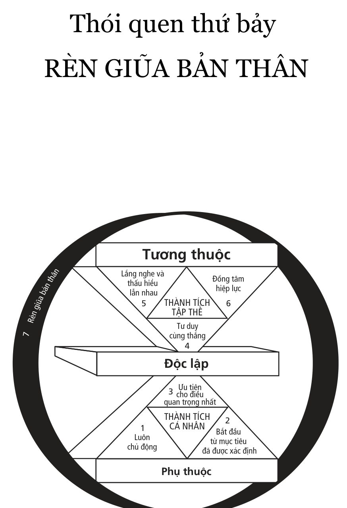

# CHƯƠNG BỐN

## ĐỔI MỚI

# Thói quen thứ bảy - RÈN GIŨA BẢN THÂN

# Các nguyên tắc tự đổi mới hợp lý

> “Đôi khi nghĩ về những hệ quả lớn từ những

> chuyện nhỏ, tôi chợt nhận ra rằng,

> chẳng có gì là nhỏ cả.”

- Bruce Barton

Hãy hình dung trong tâm trí tình huống sau.

Bạn gặp ai đó đang miệt mài cưa một cái cây trong rừng, bạn hỏi:

“Anh đang làm gì đó?”

“Anh không nhìn thấy à?”, người nọ có vẻ bực mình, “Tôi đang đốn cây”.

“Anh trông mệt lắm rồi đấy! Anh cưa được bao lâu rồi?”

“Hơn năm tiếng rồi”, anh ta đáp, “Tôi kiệt sức mất thôi. Đây quả là một công việc nặng nhọc”.

“Vậy tại sao anh không nghỉ một lát và mài sắc lại lưỡi cưa”, bạn hỏi, “Tôi tin rằng anh sẽ cưa nhanh hơn rất nhiều”.

“Tôi không có thời gian để mài cưa”, người đàn ông trả lời, “Tôi quá bận cưa cây rồi!”.

## Thói quen thứ bảy là dành thời gian để mài giũa bản thân. Nó nằm xung quanh các thói quen khác trong mô thức ***7 Thói quen,*** giúp cho các thói quen khác được vận dụng vào thực tế cuộc sống.

### 1. BỐN KHÍA CẠNH CỦA TỰ ĐỔI MỚI

## Thói quen thứ bảy là PC (năng lực sản xuất) của cá nhân. Nó bảo tồn và tăng cường tài sản lớn nhất của bạn – con người bạn. Nó đổi mới bốn mặt của con người bạn – ***thể chất, tinh thần, trí tuệ***và***quan hệ xã hội/tình cảm*** .

### THỂ CHẤT

Luyện tập, dinh dưỡng,

kiểm soát stress

### QUAN HỆ XÃ HỘI/

### TINH CẢM

Phục vụ, thấu hiểu, đồng tâm hiệp lực, an

toàn nội tại

### TINH THẦN

Làm rõ giá trị và

cam kết, nghiên

cứu, thiền định

### TRÍ TUỆ

Đọc, hình dung, lập kế hoạch, viết

Mặc dù cách dùng từ khác nhau, nhưng hầu hết các triết lý của cuộc sống đều đề cập công khai hoặc ẩn dụ bốn mặt trên. Nhà triết học Herb Shepherd mô tả một cuộc sống cân bằng lành mạnh gồm bốn giá trị: viễn cảnh (tinh thần), tự chủ (trí tuệ), liên kết (xã hội) và bền vững (thể chất). Một lý thuyết khác về động cơ cho rằng một tổ chức đúng đắn bao gồm bốn mặt (hay bốn động cơ): kinh tế (thể chất), cách cư xử với con người (xã hội), cách phát triển, sử dụng con người (trí tuệ) và sự đóng góp của tổ chức (tinh thần).

> Rèn giũa bản thân về cơ bản phải thể hiện được cả bốn động cơ này, có nghĩa là rèn luyện cả bốn mặt của con người một cách thường xuyên, nhất quán và hợp lý.

Để làm được điều này, chúng ta phải là người luôn chủ động. Dành thời gian để ***rèn giũa bản thân*** là hoạt động thuộc Phần tư thứ hai, mang tính chủ động, trái ngược với hoạt động thuộc Phần tư thứ nhất, do tính chất khẩn cấp của nó nên chúng ta bị động và luôn phải chịu sức ép từ nó.

Cần phải thúc đẩy PC cá nhân cho đến khi nó trở thành bản chất thứ hai, một thói quen lành mạnh. Vì nó nằm ở giữa ***Vòng tròn Ảnh hưởng*** của chúng ta, nên chỉ có chúng ta, chứ không phải ai khác, mới có thể điều khiển được.

Đây là đầu tư lớn nhất chúng ta có thể thực hiện trong đời – đầu tư vào chính mình, đầu tư vào công cụ duy nhất chúng ta có được để đương đầu với cuộc sống và cống hiến cho cuộc sống. Chúng ta là công cụ để thực hiện mục đích của mình, và để thành đạt, chúng ta cần nhận thức được tầm quan trọng của việc thường xuyên ***rèn giũa bản thân*** ở cả bốn mặt sau đây.

### Thể chất

Rèn luyện thể chất nghĩa là luôn quan tâm chăm sóc cơ thể mình – ăn uống đầy đủ dinh dưỡng, nghỉ ngơi, thư giãn và luyện tập sức khỏe thường xuyên.

Luyện tập là một trong các hoạt động thuộc Phần tư thứ hai, là những hoạt động có sức bật lớn mà đa số chúng ta không làm thường xuyên bởi vì nó không phải là việc cấp bách. Và vì chúng ta không làm, nên sớm muộn gì, chúng ta cũng sẽ rơi vào Phần tư thứ nhất - đối phó với vấn đề sức khỏe và khủng hoảng xảy ra - như một hậu quả tất yếu của sự thiếu chăm sóc bản thân.

Đa số chúng ta nghĩ rằng mình không có đủ thời gian để rèn luyện sức khỏe. Thật là một mô thức méo mó! Chúng ta có thời gian, nhưng chúng ta không muốn làm! Sáu giờ một tuần hay tối thiểu 30 phút một ngày, lượng thời gian đó không thể nói là quá nhiều, nếu xét đến lợi ích nó mang lại cho 160 giờ còn lại trong tuần.

Rèn luyện thể chất cũng không đòi hỏi bạn phải có dụng cụ tập luyện đặc biệt nào. Còn nếu có điều kiện, bạn cũng có thể đến câu lạc bộ hay các phòng thể dục thẩm mỹ để dùng các thiết bị ở đó, hoặc chơi các môn thể thao đòi hỏi kỹ năng như quần vợt, bóng rổ. Nhưng để ***rèn giũa bản thân*** thì điều đó không cần thiết lắm.

Một chương trình rèn luyện sức khỏe tốt là chương trình bạn có thể thực hiện ở nhà, và rèn luyện cho cơ thể bạn ba phẩm chất: sức chịu đựng, sự dẻo dai và sức mạnh.

> Sức chịu đựng có được từ các bài tập thể dục tay chân, làm tăng hiệu quả hoạt động của hệ tim mạch. Mặc dù tim được cấu tạo bởi các cơ, nhưng chúng ta không thể luyện

tập nó một cách trực tiếp, mà chỉ có thể luyện tập thông qua các nhóm cơ bắp lớn khác, đặc biệt là cơ bắp chân. Đó là lý do vì sao các môn luyện tập như đi bộ nhanh, chạy, đạp xe, bơi lội, trượt tuyết đường dài, chạy tại chỗ… là rất bổ ích.

Bạn được coi là có sức khỏe nếu có thể làm tăng nhịp tim lên ít nhất 100 lần/một phút và giữ ở mức đó trong vòng 30 phút.

> Sự dẻo dai có được nhờ luyện tập co giãn. Hầu hết chúng ta đều được khuyên nên khởi động trước và thư giãn sau khi tập thể dục. Khởi động trước khi tập giúp thả lỏng cơ bắp và làm nóng cơ thể để chuẩn bị cho các bài tập nặng hơn. Thư giãn sau khi tập giúp làm tan axít lactic, nhờ đó bạn không cảm thấy đau và cứng người.

> Sức mạnh có được nhờ luyện tập sức bền của cơ bắp, như các môn thể dục dụng cụ, hít đất, xà đơn xà kép, các bài tập đứng lên ngồi xuống và tập tạ. Tùy theo hoàn cảnh mà bạn tập trung vào việc luyện tập đến đâu. Nếu bạn lao động chân tay thì việc tăng sức mạnh sẽ giúp cải thiện những kỹ năng trong công việc của bạn. Nếu công việc của bạn về cơ bản là ngồi bàn giấy thì chỉ cần tăng thêm chút ít sự rắn chắc của cơ thể qua thể dục dụng cụ hay các bài tập co giãn là đủ.

Bản chất của sự tăng cường thể chất là ***rèn giũa bản thân,*** rèn luyện thân thể thường xuyên để có thể duy trì và nâng cao hiệu suất làm việc, thích nghi và hưởng thụ.

Cũng cần phải có sự hiểu biết trong việc xây dựng chương trình luyện tập. Mọi người thường có xu hướng tập luyện quá sức, đặc biệt là những người không rèn luyện thường xuyên. Điều đó có thể gây ra đau đớn, thương tích

không cần thiết và thậm chí thương tật vĩnh viễn. Tốt hơn cả là nên bắt đầu chậm rãi. Mọi chương trình luyện tập đều cần phải tuân theo các kết quả nghiên cứu mới nhất, các chỉ dẫn của huấn luyện viên và theo sự tự nhận thức của bản thân.

Nếu bạn chưa bao giờ luyện tập, cơ thể của bạn sẽ chiều theo thói quen được nghỉ ngơi thoải mái. Tuy nhiên, bạn hãy luôn chủ động và cố gắng luyện tập, dù lúc đầu có thể phải miễn cưỡng. Dù trời có mưa vào đúng buổi sáng bạn có kế hoạch tập chạy bộ thì bạn vẫn cứ tập. Trời mưa ư, càng tốt! Bạn sẽ rèn luyện cả thể chất lẫn ý chí.

Bạn đang thực hiện những hoạt động thuộc Phần tư thứ hai, vốn đem lại những kết quả phi thường về lâu dài. Dần dần từng bước, bạn nâng cao khả năng của cơ thể để làm những việc khó hơn. Khi đó, bạn sẽ cảm thấy những hoạt động bình thường trở nên dễ dàng và dễ chịu hơn. Bạn sẽ có nhiều năng lượng hơn vào buổi chiều và cảm giác “quá mệt mỏi” trước đây sẽ được thay thế bằng sức mạnh tráng kiện để làm những việc bạn muốn.

Có thể lợi ích lớn nhất bạn có được từ việc rèn luyện thân thể là tăng cường thói quen luôn chủ động. Việc hành động dựa vào sức mạnh thể chất thay vì phản ứng lại mọi ***áp lực kìm hãm*** sẽ có tác động sâu sắc đến mô thức, lòng tự trọng, sự tự tin và phẩm chất của bản thân bạn.

### Tinh thần

“Rèn giũa” tinh thần mang lại sự định hướng cho cuộc sống của bạn. Điều này có quan hệ chặt chẽ với Thói quen thứ hai.

Tinh thần là cốt lõi, là trung tâm, là sự cam kết của bạn

đối với hệ thống giá trị của mình. Đây là lĩnh vực rất riêng tư nhưng cực kỳ quan trọng của cuộc sống. Nó sẽ huy động các nguồn lực để tạo nguồn cảm hứng, nâng cao tâm hồn và gắn bạn với những chân lý muôn thuở của nhân loại. Mỗi người thực hiện điều này rất khác nhau.

Tôi “rèn giũa” tinh thần hàng ngày qua sự suy ngẫm kinh thánh, vì nó đại diện cho hệ thống giá trị của tôi. Khi tôi đọc và suy ngẫm, tôi cảm thấy mình được đổi mới, được tiếp thêm sức mạnh, tập trung và củng cố quyết tâm để cống hiến.

Đắm chìm vào tác phẩm văn học hay âm nhạc cũng có thể làm đổi mới tinh thần cho một số người. Có người lại tìm thấy sự đổi mới tinh thần của mình thông qua sự giao tiếp với thiên nhiên; thiên nhiên ban ơn cho những ai đắm mình vào nó. Khi bạn rời khỏi thành phố ồn ào và nhốn nháo để đắm mình vào khung cảnh hài hòa và êm ái của một vùng quê, bạn sẽ thấy tâm hồn mình như được thanh lọc.

Arthur Gordon từng chia sẻ với chúng ta câu chuyện thú vị về sự đổi mới tinh thần của chính ông. Trong câu chuyện nhỏ có nhan đề “Nước triều dâng”, ông kể về một thời kỳ nhàm chán và đơn điệu trong cuộc đời mình, không có sự nhiệt tình, không còn nỗ lực sáng tác. Ông cảm thấy cuộc đời vô nghĩa. Cuối cùng, ông quyết định nhờ một bác sĩ y khoa giúp đỡ.

Bác sĩ bảo ông dành cả ngày hôm sau đến một nơi mà ông có nhiều kỷ niệm nhất khi còn nhỏ. Ông có thể mang theo đồ ăn nhưng đừng nói chuyện với ai, cũng không được đọc, viết hay nghe đài. Tiếp theo, bác sĩ viết cho ông bốn đơn thuốc và bảo ông mở từng cái ra xem lúc 9 giờ sáng, 12 giờ trưa, 3 giờ chiều và 6 giờ tối.

Thế là sáng hôm sau, Gordon đi ra bãi biển. Khi mở đơn thuốc thứ nhất ra đọc, trên đó ghi “Hãy lắng nghe cẩn thận”, ông nghĩ là bác sĩ mất trí. Nhưng vì đã đồng ý làm theo chỉ dẫn của bác sĩ nên ông cố kiên nhẫn ngồi lắng nghe. Ông nghe thấy tiếng sóng biển vỗ rầm rì, tiếng chim chóc gọi nhau ríu rít… Ông bắt đầu suy nghĩ về những bài học mà biển đã dạy khi ông còn nhỏ – sự kiên trì, tôn trọng và sự nhận thức về tính tương thuộc giữa các sinh vật. Ông tiếp tục lắng nghe trong sự im lặng, và cảm thấy sự thanh thản trong tâm hồn tăng lên. Đến trưa, ông mở tờ giấy thứ hai ra và đọc thấy dòng chữ “Cố gắng quay trở lại”. “Quay trở lại cái gì mới được chứ?”, ông thắc mắc. Có thể là thời thơ ấu, có thể là những kỷ niệm, có thể là quãng thời gian hạnh phúc đã qua. Ông nghĩ về quá khứ của mình, về những khoảnh khắc của niềm vui. Ông cố gắng hồi tưởng… Và trong khi nhớ lại như vậy, ông cảm thấy lòng mình ấm áp hẳn lên.

Đến ba giờ chiều, ông mở tờ giấy thứ ba ra đọc. Đơn thuốc này dường như có chút gì đó khó thực hiện hơn những cái trước: “Hãy kiểm tra lại các động cơ”. Ông bắt đầu nghĩ về những điều ông muốn – thành công, công nhận, an toàn – và biện minh cho tất cả điều đó. Thế rồi, ông chợt phát hiện ra rằng những động cơ đó không được tích cực cho lắm và có thể đó là câu trả lời cho tình trạng bế tắc hiện nay của ông. Ông xem xét các động cơ của mình sâu hơn. Ông suy nghĩ về niềm hạnh phúc đã qua. Và cuối cùng, ông đã tìm ra câu trả lời.

Ông viết: “Tôi đột nhiên nhận ra một sự thật rằng, động cơ lệch lạc sẽ chỉ kéo theo những điều sai trái. Không có gì khác nhau, dù bạn là người đưa thư, thợ cắt tóc, nhân viên bán bảo hiểm, người nội trợ, hay bất cứ ngành nghề gì.

Bạn sẽ là người làm tốt công việc của mình, miễn bạn cảm thấy đang phục vụ cộng đồng. Nhưng nếu bạn chỉ quan tâm chăm lo cho bản thân thì bạn sẽ làm việc kém đi. Đó là một quy luật không thể lay chuyển được”.

Đến sáu giờ tối, với đơn thuốc cuối cùng, ông không mất nhiều thời gian để hoàn thành. Trên mảnh giấy có dòng chữ “Hãy viết những ưu phiền lên cát”. Thả mảnh giấy bay đi, ông cúi xuống nhặt một mảnh vỏ sò và viết tất cả những nỗi ưu phiền của mình lên mặt cát. Sau đó ông quay bước đi mà không nhìn lại, biết rằng sau lưng mình, thủy triều đã sắp lên…

Nhà cải cách vĩ đại Martin Luther King từng nói: “Tôi có nhiều việc phải làm hôm nay, nhưng tôi vẫn cần phải có một giờ để quỳ gối cầu nguyện”. Đối với ông, cầu nguyện không phải là một nghĩa vụ máy móc mà là sức mạnh để giải phóng và nhân lên nguồn năng lượng trong cơ thể.

Có người hỏi một sư phụ Thiền tông: “Làm thế nào mà ngài luôn giữ được sự thanh thản và bình an như vậy?”. Ông trả lời: “Tôi không bao giờ rời khỏi nơi thiền định của mình”. Ông ấy thực hành thiền định mọi nơi, mọi lúc, luôn mang theo mình những giờ phút bình an cả trong tâm trí và con tim.

Khi dành thời gian để suy tư về những trọng tâm của cuộc sống, về ý nghĩa cuộc sống, chúng ta sẽ cảm thấy tinh thần mình tươi trẻ hơn. Đó là lý do vì sao tôi tin rằng ***tuyên ngôn sứ mệnh cá nhân*** lại thật sự quan trọng. Nếu hiểu được sâu sắc trọng tâm và mục đích cuộc sống của mình, chúng ta có thể thường xuyên rà soát lại và tận tâm với những giá trị đó.

Nhà lãnh đạo tôn giáo David O. McKay nói rằng:

“Cuộc chiến lớn nhất của cuộc sống là cuộc đấu tranh hàng ngày diễn ra bên trong các khoảng lặng tâm hồn chúng ta”. Nếu chiến thắng trong các cuộc đấu tranh đó, nếu giải quyết được cuộc xung đột nội tâm, bạn sẽ tìm thấy cảm giác bình an. Và bạn sẽ nhận thấy quá trình hướng đến sự hợp tác, thúc đẩy cho lợi ích và sự tốt đẹp của người khác, vui mừng vì thành công của người khác – ***những thành tích tập thể –*** sẽ diễn ra một cách tự nhiên.

### Trí tuệ

Trí tuệ của chúng ta phát triển đến mức nào đa phần phụ thuộc vào việc học tập. Nhưng ngay sau khi ra trường, rất nhiều người trong chúng ta để kiến thức của mình teo tóp lại. Chúng ta không còn giữ được thói quen đọc sách, không còn tìm hiểu, tiếp thu tri thức mới ngoài lĩnh vực hoạt động của mình. Thay vào đó, chúng ta dành thời gian để tận hưởng các thú vui, chẳng hạn như xem TV.

Kết quả khảo sát cho thấy tại hầu hết các gia đình, thời gian mở TV là từ 35 đến 45 giờ một tuần. Thời gian đó bằng thời gian làm việc hàng tuần của nhiều người, nhiều hơn thời gian dành cho việc học. Điều đó cho thấy ảnh hưởng xã hội rất lớn của TV. Chúng ta cũng bị chi phối bởi mọi giá trị được truyền đạt thông qua truyền hình. Điều đó có thể có ảnh hưởng đến chúng ta một cách tinh tế và khó nhận thấy. Xem truyền hình một cách khôn ngoan đòi hỏi phải biết tự quản lý bản thân hiệu quả theo Thói quen thứ ba, giúp bạn phân biệt và lựa chọn các chương trình thông tin, truyền cảm hứng và giải trí có lợi nhất và phù hợp với mục đích và giá trị của bạn.

Trong gia đình tôi, chúng tôi hạn chế thời gian xem TV khoảng 7 giờ một tuần, trung bình mỗi ngày khoảng một

giờ. Chúng tôi họp gia đình, thảo luận và xem xét các số liệu về tác động của TV đến cuộc sống gia đình. Qua thảo luận, chúng tôi nhận ra rằng nhiều người trở nên ghiền các chương trình phim truyền hình nhiều tập ủy mị hay một loại chương trình đặc biệt nào đó.

Tôi phải cám ơn các phát minh mới trong lĩnh vực giải trí đã làm phong phú đời sống tinh thần, đóng góp vào mục đích và ý nghĩa của cuộc sống chúng ta. Nhưng nhiều chương trình giải trí chỉ làm mất thời gian, ảnh hưởng xấu đến sức khỏe, nhận thức thẩm mỹ của chúng ta nếu chúng ta quá phụ thuộc vào nó. Chúng ta cần rèn luyện Thói quen thứ ba và quản lý bản thân hiệu quả để sử dụng được tối đa mọi nguồn lực nhằm nâng cao chất lượng cuộc sống của mình.

Học tập, học tập không ngừng, không ngừng “rèn giũa” và mở rộng tri thức, chính là phương pháp tự đổi mới tinh thần hiệu nghiệm. Đôi khi, việc này đòi hỏi một chương trình học tập có hệ thống; nhưng thường là không cần. Những ai luôn chủ động có thể tìm ra rất nhiều cách khác nhau để tự học.

Rèn luyện phương pháp tách rời chương trình học của chính mình và xem xét nó là một điều cực kỳ có giá trị. Theo tôi, đó chính là nội dung cốt yếu của phương pháp học tập tự do, tức khả năng xem xét các câu hỏi, mục đích và các mô thức trong quá trình đối chiếu với thực tế khách quan. Đào tạo một cách rập khuôn, máy móc sẽ thu hẹp và đóng kín tư duy, làm cho những giả thiết được đưa ra trong quá trình học không bao giờ được xem xét, mổ xẻ thấu đáo.

Không có cách nào tăng cường và mở rộng sự hiểu biết của mình tốt hơn việc tạo thói quen thường xuyên đọc

sách. Đây là một hoạt động khác nằm trong Phần tư thứ hai. Qua đó, bạn có thể tiếp cận với những tư tưởng lớn trên thế giới qua các thời đại. Tôi khuyên các bạn nên bắt đầu bằng mục tiêu đọc một cuốn sách một tháng, sau đó một cuốn hai tuần, rồi một cuốn một tuần.

Những cuốn sách có giá trị sẽ giúp chúng ta mở rộng nhận thức về văn hóa, đổi mới tinh thần cũng như thanh lọc tâm hồn. Đặc biệt, nếu thực hành Thói quen thứ năm, nghĩa là không dùng cái nhìn chủ quan của mình để phán xét vội vàng, chúng ta có thể hiểu một cách thấu đáo nội dung, ý nghĩa mà tác giả muốn chuyển tải dưới lớp ngôn từ.

Viết cũng là một phương pháp hiệu quả để “rèn giũa” trí tuệ. Duy trì việc ghi chép hàng ngày những suy nghĩ, những trải nghiệm, những ý tưởng và những điều đã học sẽ giúp cho tâm trí minh mẫn, chính xác và nhạy bén. Việc viết nhật ký hay viết thư cũng có ảnh hưởng đến khả năng tư duy rõ ràng và sự hiểu biết thấu đáo.

Tổ chức và lập kế hoạch công việc là một hình thức khác của “rèn giũa” trí tuệ, có liên quan đến các Thói quen 2 và 3. Nó bắt đầu với “mục tiêu đã được xác định” và nỗ lực tổ chức thực hiện để đạt được mục tiêu đó. Nó luyện tập khả năng hình dung và tưởng tượng của bạn, giúp bạn nhìn thấy mục đích cuối cùng ngay từ đầu để mường tượng toàn bộ cuộc hành trình, chí ít về nguyên tắc, chứ không phải chỉ là những bước đi.

> Rèn giũa bản thân ở cả ba mặt – thể chất, tinh thần và trí tuệ – là sự rèn luyện thuộc về thành tích cá nhân hàng ngày. Điều đó sẽ cải thiện được rất nhiều chất lượng, tính hiệu quả của các hoạt động, kể cả giấc ngủ sâu và yên bình của bạn. Nó sẽ tạo ra một sức mạnh lâu dài về thể chất, tinh

thần và trí tuệ giúp bạn vượt qua mọi khó khăn, thách thức trong cuộc sống.

Một ngày nào đó trong tương lai, bạn sẽ phải vật lộn cưỡng lại sức cám dỗ mạnh mẽ, hay run rẩy trước nỗi đau ghê gớm của cuộc đời. Nhưng cuộc đấu tranh thực sự là ở đây, ngay lúc này… Bây giờ chính là lúc bạn quyết định, khi sự đau khổ tột cùng hay cám dỗ đó đến, bạn sẽ là kẻ thất bại nhục nhã hay là kẻ chiến thắng vinh quang. Tính cách chỉ có được bằng quá trình rèn luyện liên tục lâu dài và ổn định.

Phillips Brooks

### Quan hệ xã hội/tình cảm

Trong khi các mặt thể chất, tinh thần và trí tuệ có liên hệ chặt chẽ với các Thói quen 1, 2 và 3 – tập trung vào các nguyên tắc về tầm nhìn, sự lãnh đạo và quản trị bản thân – thì khía cạnh quan hệ xã hội/tình cảm lại tập trung vào các Thói quen 4, 5 và 6, tức các nguyên tắc lãnh đạo bản thân, giao tiếp thấu hiểu và hợp tác sáng tạo.

Khía cạnh xã hội và tình cảm trong cuộc sống của chúng ta hòa quyện nhau vì cuộc sống tình cảm được phát triển và thể hiện chủ yếu trong các mối quan hệ của chúng ta đối với người khác.

Tự đổi mới quan hệ xã hội/tình cảm không đòi hỏi nhiều thời gian như đổi mới các mặt khác. Chúng ta có thể thực hiện nó trong sự tương tác hàng ngày với người khác, nhưng vẫn cần phải rèn luyện. Chúng ta có thể phải miễn cưỡng vì chưa đạt được các kỹ năng cần thiết cho các Thói quen 4, 5, 6 để có được sự tương tác một cách tự nhiên.

Giả sử bạn là một người rất quan trọng trong cuộc sống của tôi – có thể là sếp tôi, cấp dưới, đồng sự, bạn bè, láng giềng, vợ/chồng, con cái hay một thành viên trong gia đình tôi – nhưng giữa chúng ta lại có cách nhìn khác nhau; chúng ta nhìn sự vật qua các lăng kính khác nhau.

Do đó, tôi thấy cần phải thực hành Thói quen thứ tư. Tôi đến gặp bạn và nói: “Tôi thấy rằng chúng ta đang tiếp cận vấn đề một cách khác nhau. Tại sao chúng ta không trao đổi cho đến khi tìm ra một đáp án chung mà cả hai đều hài lòng. Bạn có đồng ý như vậy không?”. Hầu hết mọi người sẽ trả lời “Có”.

Sau đó, tôi chuyển sang Thói quen thứ năm: “Để tôi lắng nghe bạn trước”. Thay vì nghe để đối phó, tôi lắng nghe để thấu hiểu một cách sâu sắc, để nhận ra đâu là mô thức của bạn. Cho đến khi có thể giải thích được quan điểm của bạn như chính bạn, tôi mới tập trung vào trình bày quan điểm của tôi để bạn hiểu rõ hơn.

Dựa vào cam kết tìm ra giải pháp mà cả hai bên đều hài lòng và sự hiểu biết sâu sắc quan điểm của nhau, bạn và tôi sẽ chuyển sang Thói quen thứ sáu. Chúng ta cùng nhau tìm ra ***giải pháp thứ ba*** - mà cả hai đều công nhận là tốt hơn giải pháp của mỗi bên lúc đầu - nhằm giải quyết sự khác biệt giữa chúng ta.

Sự thành công của Thói quen 4, 5 và 6 không phụ thuộc vào trí tuệ, mà là tình cảm. Điều này nằm ở nhận thức về sự an toàn của chúng ta.

Nếu cảm giác an toàn xuất phát từ các nguồn lực bên trong, chúng ta sẽ có sức mạnh để thực hành các thói quen thuộc phạm trù ***thành tích cá nhân*** . Sự an toàn nội tại có được từ đâu? Nó không nảy sinh từ việc người khác nghĩ về

bạn như thế nào, hay cư xử với bạn ra sao. Nó không xuất phát từ kịch bản mà ai đó trao cho bạn. Nó cũng không phát sinh từ hoàn cảnh hay lập trường của bạn. Nó bắt nguồn từ bên trong, từ những mô thức chính xác và các nguyên tắc đúng đắn nằm sâu trong khối óc và con tim của chúng ta. Nó nảy sinh từ lối sống trung thực, trong đó những thói quen hàng ngày phản ảnh những giá trị sâu sắc nhất của chúng ta.

Tôi tin rằng sống với chính bản thân mình là nguồn gốc cơ bản nhất của giá trị cá nhân. Tôi không đồng ý với những ai cho rằng bạn có thể nỗ lực để có được sự bình an trong tâm hồn. Sự bình an trong tâm hồn chỉ có được khi cuộc sống của bạn phù hợp với các nguyên tắc và giá trị đích thực. Không có con đường nào khác để đạt được sự bình an đó.

Sự an toàn nội tại cũng hình thành từ kết quả của một cuộc sống tương thuộc hiệu quả. Sự an toàn này có được nhờ nhận thức rõ ràng về giải pháp cùng thắng. Cuộc sống không phải lúc nào cũng là “có” hoặc “không”, hầu như luôn có các giải pháp thứ ba cho mọi vấn đề. Bạn cũng có thể an toàn khi hiểu rằng bạn có thể bước ra khỏi khung tham chiếu của mình mà không đánh mất chính mình, rằng bạn có thể hiểu được người khác một cách thật sự và sâu sắc. Sự an toàn cũng phát sinh khi bạn tương tác một cách đúng đắn, sáng tạo, biết hợp tác với người khác và trải nghiệm những thói quen có tính tương thuộc.

Cũng có sự an toàn nội tại phát sinh từ việc phục vụ, giúp đỡ người khác một cách có ý nghĩa. Và điều đáng quan tâm là bạn đem lại điều tốt đẹp cho cuộc sống của người khác. Động cơ là những hành động có ích chứ không phải là để được người khác công nhận.

Viktor Frankl nhấn mạnh nhu cầu sống có ý nghĩa và mục đích. Đó là những điều vượt ra ngoài bản thân cuộc sống và kích thích những nguồn năng lượng tốt nhất trong con người của chúng ta. Cố tiến sĩ Hans Selye đã viết trong công trình nghiên cứu đồ sộ của mình về stress rằng: một cuộc sống lành mạnh, hạnh phúc và trường thọ là kết quả của sự cống hiến, sự đóng góp vào việc tạo nguồn cảm hứng cho cá nhân, đem lại những điều tốt đẹp cho cuộc sống của những người khác.

Còn theo George Bernard Shaw,

Niềm vui đích thực trong cuộc sống là khi sống vì một mục đích cao cả, khi trở thành một phần của tự nhiên, chứ không phải là một cơ thể bệnh tật bé nhỏ ích kỷ, luôn than vãn rằng cái thế giới này không đáng để cho ta sống hạnh phúc. Tôi ý thức rằng cuộc sống của tôi thuộc về toàn thể cộng đồng, và chừng nào tôi còn sống thì tôi rất vinh hạnh được cống hiến hết mình. Vì những người khổ hơn, tôi sẵn sàng làm việc nhiều hơn. Chính bản thân cuộc sống làm cho tôi vui sướng. Đối với tôi cuộc sống không phải là cây nến chóng tàn mà là một ngọn đuốc tuyệt diệu tôi đang giơ cao và tôi muốn cho nó bừng sáng chói lọi nhất trước khi trao lại cho các thế hệ tương lai.

N. Eldon Tanner từng nói: “Phụng sự là cái giá chúng ta phải trả cho diễm phúc được sống trên đời này”. Có rất nhiều cách để chúng ta phục vụ. Dù bạn có đang làm việc cho một tổ chức cộng đồng nào hay không thì cũng đừng để thời gian trôi qua một cách uổng phí. Hãy không ngừng phục vụ người khác, chí ít cũng bằng cách gửi vào tài khoản tình cảm một tình yêu thương vô điều kiện.

### 2. ẢNH HƯỞNG CỦA BẠN ĐỐI VỚI NGƯỜI KHÁC

Hầu hết chúng ta là đối tượng của tấm gương xã hội, được định hình bởi những ý kiến, nhận thức, mô thức của những người xung quanh. Là những người nhận thức được tính tương thuộc, bạn và tôi xuất phát từ một mô thức thừa nhận rằng: mỗi chúng ta là một phần của tấm gương xã hội đó.

Chúng ta có thể phản chiếu lại người khác bằng một tầm nhìn rõ ràng, không bị méo mó. Chúng ta có thể khẳng định bản chất luôn chủ động của họ và cư xử với họ như những người có trách nhiệm. Chúng ta có thể giúp định hình họ thành những cá nhân lấy nguyên tắc làm trọng tâm, biết lấy giá trị làm điểm tựa. Và với sự rộng lượng, chúng ta nhận thấy rằng phản chiếu hình ảnh tích cực của người khác không hề làm mất đi giá trị bản thân. Ngược lại, nó còn làm tăng giá trị của chúng ta, bởi vì nó làm tăng các cơ hội tương tác có hiệu quả với những người có tính luôn chủ động khác.

Có thể bạn biết vở nhạc kịch ***Man of La Mancha*** *(*)* . Đó là một câu chuyện đẹp về một hiệp sĩ thời trung cổ với một cô gái – cô gái điếm – ông gặp trên đường phố. Cô ấy bị đẩy vào lối sống này bởi tất cả những người mà cô đã gặp trong cuộc đời.

Thế nhưng chàng hiệp sĩ lãng tử này lại nhìn thấy cái mà người khác không thấy ở cô, một cái gì đó thật đẹp đẽ và đáng yêu. Chàng đã đặt tên mới cho cô là Dulcinea, một cái tên mới gắn với mô thức mới.

(*) Vở kịch truyền hình nổi tiếng những năm 1964 - 1965 của đạo diễn Dale

Wasserman, trích từ tiểu thuyết ***Don Quixote*** của nhà văn Miguel de Cervantes.

Lúc đầu, cô gái cực lực bác bỏ mọi ý nghĩ và tình cảm của chàng hiệp sĩ vì những “kịch bản” cũ trong cô còn quá mạnh. Cô gạt bỏ chàng như một kẻ hoang tưởng. Nhưng chàng vẫn kiên định. Chàng không ngừng tạo ra khoản gửi vào ***tài khoản tình cảm*** bằng một tình yêu vô điều kiện, và dần dần, chàng đã thâm nhập được vào “kịch bản” cũ của cô gái. Chàng đi sâu vào bản chất thật sự của con người cô và cô bắt đầu đáp lại. Dần dần từng bước, cô gái bắt đầu thay đổi lối sống.

Về sau, khi cô gái muốn quay trở lại mô thức cũ của mình, chàng hiệp sĩ đang lúc lâm chung đã gọi cô gái đến bên giường bệnh và hát cho cô nghe bài “Giấc mơ không có thực”. Nhìn vào mắt cô, chàng thì thầm: “Đừng bao giờ quên điều này, em là Dulcinea!”.

Một trong những câu chuyện khác minh chứng cho việc mô thức biến đổi xuất phát từ cái nhìn của người khác là câu chuyện nói về một chiếc máy vi tính ở Anh. Nó đã vô tình bị lập trình sai. Dựa theo các tiêu chuẩn đánh giá, nó mặc định cho những em học sinh “giỏi” là “kém” và ngược lại. Tiêu chuẩn đó nghiễm nhiên biến thành mô thức của các thầy giáo về học sinh của mình vào đầu năm học.

Sau năm tháng rưỡi, ban giám hiệu phát hiện ra sai sót. Họ quyết định âm thầm kiểm tra lại trình độ của các em học sinh lần nữa. Và kết quả thật kinh ngạc. Những đứa trẻ “giỏi” thì có điểm số khá thấp. Chúng bị xem là bướng bỉnh và khó bảo. Những mô thức của giáo viên đã trở thành một lời tiên tri.

Còn điểm số của những em học sinh “kém” lại có tiến bộ vượt bậc. Các giáo viên đã cư xử với chúng như là những học sinh thông minh; niềm hy vọng, lạc quan, sự kỳ

vọng và hứng thú của họ đã tác động tích cực đến những em này.

Goethe *(*)* từng nói rằng: “Chúng ta đối xử với một người như thế nào thì anh ta sẽ trở thành con người như thế ấy”. Chúng ta sẽ phản ánh cho người khác điều gì về bản thân họ? Và sự phản ánh đó có ảnh hưởng như thế nào đến cuộc sống của họ? Chúng ta có nhiều thứ để có thể đầu tư vào ***tài khoản tình cảm*** của người khác. Càng nhìn thấy tiềm năng trong người khác bao nhiêu, chúng ta càng có thể phát huy trí tưởng tượng và sức sáng tạo trong mình bấy nhiêu. Chúng ta có thể giúp đỡ họ trở thành những con người độc lập, có khả năng xây dựng mối quan hệ tương thuộc với người khác.

### 3. CÂN BẰNG TRONG ĐỔI MỚI

Quá trình tự đổi mới phải bao gồm đổi mới cân bằng cả bốn mặt của con người chúng ta: ***thể chất, tinh thần, trí tuệ***và***quan hệ xã hội/tình cảm.*** Mặt nào cũng quan trọng ngang nhau, nhưng chúng chỉ có hiệu quả tối ưu khi chúng ta xử lý cả bốn mặt này một cách thông minh và cân đối; xem nhẹ mặt nào cũng đều có tác động tiêu cực đến các mặt còn lại.

Tôi nhận thấy rằng điều này đúng trong các tổ chức cũng như trong đời sống cá nhân. Trong một tổ chức, khía cạnh thể chất được thể hiện dưới dạng các thông số kinh tế. Khía cạnh trí tuệ hay tâm lý được thể hiện dưới dạng công nhận, phát triển và sử dụng nhân tài. Các khía cạnh quan hệ xã hội/tình cảm thể hiện ở các mối quan hệ giữa con người, ở cách cư xử đối với nhân viên. Còn khía cạnh

(*) Johann Wolfgang von Goethe (1749 - 1832): đại thi hào người Đức.

tinh thần thể hiện qua việc tìm kiếm ý nghĩa, mục đích, hay sự đóng góp và uy tín của tổ chức trong xã hội.

Khi một tổ chức xem nhẹ một hay nhiều khía cạnh trên thì nó sẽ chịu tác động tiêu cực. Những năng lượng sáng tạo có thể tạo ra đồng tâm hiệp lực tích cực và to lớn lại được sử dụng vào việc chống lại nó và trở thành các lực kìm hãm sự phát triển và năng suất lao động.

Tôi đã thấy những tổ chức mà mục tiêu duy nhất là kinh tế – kiếm tiền. Họ thường không công bố rõ mục đích này, có nơi còn ngụy tạo bằng một mục đích “nhân văn” khác. Khi phát hiện ra điều này, tôi đồng thời cũng nhận thấy ở đó có rất nhiều sự đồng tâm hiệp lực tiêu cực, tạo ra một môi trường văn hóa bất lợi, gây ra những hiện tượng xấu như chống đối lẫn nhau giữa các bộ phận. Mọi quan hệ giao tiếp ở đó đều mang tính thủ đoạn và phòng thủ. Tổ chức không thể phát triển nếu không thu được lợi nhuận. Thế nhưng, lợi nhuận lại không phải là lý do duy nhất cho sự tồn tại của một tổ chức.

Ở thái cực khác, tôi lại thấy có những tổ chức hầu như chỉ tập trung vào khía cạnh xã hội/tình cảm. Theo một nghĩa nào đó thì những tổ chức này dường như không cần đến các tiêu chuẩn kinh tế cho hệ thống giá trị của mình. Họ không có thước đo hay công cụ đo lường sự thành đạt, và do đó, họ đánh mất tính hiệu quả, sau đó là tính cạnh tranh trên thị trường.

Tôi cũng gặp nhiều tổ chức xây dựng được cùng lúc ba mặt sau: tiêu chuẩn cung cấp dịch vụ tốt, tiêu chuẩn kinh tế tốt, quan hệ với nhân viên và khách hàng tốt, nhưng lại không thực sự quyết tâm nhận diện, phát triển, sử dụng và công nhận những người tài năng. Nếu không có một lực lượng nhân viên

xuất sắc thì tổ chức đó sẽ nhanh chóng đi đến sự chuyên quyền, tạo ra thứ văn hóa chống đối có tính tập thể và phải luôn đối đầu với tốc độ thay thế nhân viên quá nhanh…

Nói tóm lại, sự thành đạt của tổ chức cũng như của cá nhân đòi hỏi phải phát triển và tự đổi mới cả bốn mặt một cách đúng đắn và cân bằng. Bỏ qua mặt nào cũng sẽ tạo ra ***áp lực kìm hãm*** chống lại sự thành công và phát triển.

### 4. ĐỒNG TÂM HIỆP LỰC TRONG ĐỔI MỚI

Đổi mới một cách cân bằng là sự đồng tâm hiệp lực tối ưu. Quá trình “rèn giũa” từng mặt của ***tự đổi mới*** sẽ tác động tích cực đến các mặt còn lại, bởi chúng liên hệ mật thiết lẫn nhau. Sức khỏe thể chất có ảnh hưởng đến khả năng trí tuệ; sức mạnh tinh thần có ảnh hưởng đến quan hệ xã hội/tình cảm. Khi cải thiện một mặt, bạn cũng sẽ tăng cường được khả năng của mình ở các mặt khác.

> 7 Thói quen để thành đạt tạo ra sự đồng tâm hiệp lực tối ưu giữa các mặt này. Sự đổi mới từng mặt sẽ đem lại cho bạn ít nhất một trong 7 Thói quen. Và việc cải thiện một thói quen cũng sẽ làm tăng khả năng có được những thói quen còn lại.

Càng phát huy ***tính luôn chủ động***(Thói quen 1), bạn càng***lãnh đạo bản thân***(Thói quen 2) và***quản lý bản thân***(Thói quen 3) hiệu quả trong cuộc sống của mình. Càng***quản lý bản thân***(Thói quen 3) hiệu quả thì bạn càng có nhiều***hoạt động tự đổi mới***thuộc Phần tư thứ hai (Thói quen 7). Càng cố gắng***lắng nghe và thấu hiểu lẫn nhau***(Thói quen 5), bạn càng dễ đi đến giải pháp***cùng thắng*** (Thói quen 4 và 6).

Càng cải thiện được bất cứ thói quen nào dẫn đến tính

***độc lập***(các Thói quen 1, 2, và 3) thì bạn càng thu được nhiều kết quả trong các tình huống có tính***tương thuộc***(các Thói quen 4, 5 và 6). Và***rèn giũa bản thân*** (Thói quen 7) là quá trình tự đổi mới tất cả các thói quen đó.

Khi tự đổi mới về mặt thể chất, bạn sẽ củng cố tầm nhìn cá nhân, mô thức tự nhận thức và ý chí độc lập của bạn. Bạn hoàn toàn được tự do hành động, chủ động lựa chọn phản ứng của mình trước mọi hoàn cảnh chứ không phải bị động đối phó. Đây có thể là lợi ích lớn nhất của sự rèn luyện thể chất. Mỗi một thắng lợi bản thân hàng ngày sẽ là “khoản gửi” vào tài khoản an toàn nội tại cá nhân của bạn.

Khi tự đổi mới tinh thần, bạn sẽ củng cố được việc ***lãnh đạo bản thân*** (Thói quen 2). Bạn sẽ tăng cường được khả năng hòa nhập cộng đồng thay vì chỉ hiểu những mô thức và giá trị của riêng mình. Bạn sẽ xác định sứ mệnh của mình trong cuộc sống và định hình bản thân trong sự hài hòa với các nguyên tắc đúng đắn. Cuộc sống cá nhân phong phú do bạn tạo ra nhờ tự đổi mới tinh thần sẽ là những “khoản gửi” to lớn vào tài khoản an toàn cá nhân của bạn.

Khi tự đổi mới trí tuệ, bạn sẽ củng cố khả năng ***quản lý bản thân*** (Thói quen 3). Khi lập kế hoạch, bạn buộc ý chí phải thừa nhận những hoạt động thuộc Phần tư thứ hai, những mục tiêu, ưu tiên, và các hoạt động khác nhằm phát huy tối đa việc sử dụng thời gian và sức lực của bạn. Bạn sẽ tổ chức và thực hiện những hoạt động này xoay quanh các ưu tiên của mình. Khi trau dồi tri thức, bạn sẽ gia tăng cho mình vốn kiến thức cũng như khả năng lựa chọn. Sự đảm bảo về kinh tế của bạn không nằm ở công việc bạn đang làm; nó nằm ở năng lực của bạn – suy nghĩ, học hỏi, sáng tạo và thích ứng. Đó chính là sự độc lập về tài chính đích thực. Đó không phải là sở hữu của cải; mà là có sức mạnh

để làm ra của cải. Đó là nội lực của bạn.

> Thành tích cá nhân hàng ngày là chìa khóa để phát triển 7 Thói quen và điều này hoàn toàn nằm trong Vòng tròn Ảnh hưởng của bạn. Đó là tiêu điểm thời gian của Phần tư thứ hai cần thiết để đưa những thói quen này hòa nhập vào cuộc sống của bạn - lấy nguyên tắc làm trọng tâm.

Đó cũng là nền tảng cho ***thành tích tập thể,***là nguồn gốc của sự an toàn nội tại, là cơ sở để bạn***rèn giũa bản thân***về mặt quan hệ xã hội/tình cảm. Nó cho bạn sức mạnh cá nhân để tập trung vào***Vòng tròn Ảnh hưởng***trong các tình huống tương thuộc, để nhìn vào người khác thông qua sự rộng lượng, để coi trọng những khác biệt và vui mừng trước thành công của họ. Nó cho bạn nền tảng để đi đến sự hiểu biết chân thành và giải pháp***cùng thắng*** nhằm rèn luyện các Thói quen 4, 5 và 6 trong các thực tại có tính tương thuộc.

### 5. SỰ PHÁT TRIỂN THEO ĐƯỜNG XOẮN ỐC

Đổi mới là nguyên tắc, là quá trình cho ta sức mạnh để tiến lên và thay đổi theo đường xoắn ốc. Để có được sự tiến bộ không ngừng, chúng ta cần phải xem xét một khía cạnh khác của sự đổi mới khi nó được áp dụng cho khả năng thiên phú độc đáo của con người, để định hình cho chuyển động đi lên: ***lương tâm*** của chúng ta.

> Lương tâm là khả năng thiên phú có thể cảm nhận được sự đồng nhất hay khác biệt giữa chúng ta với những nguyên tắc đúng đắn và nâng chúng ta lên ngang tầm với nó – khi nó được hình thành.

Nếu việc rèn luyện thần kinh và cơ bắp rất quan trọng đối với một vận động viên điền kinh, việc rèn luyện trí tuệ là cần thiết đối với học giả, thì việc rèn luyện ***lương tâm*** cũng

quan trọng và cần thiết không kém đối với những cá nhân thực sự tự chủ và thành đạt. Tuy nhiên, học tập và rèn luyện lương tâm đòi hỏi một sự tập trung cao hơn, kỷ luật chặt chẽ hơn và một cuộc sống trung thực hơn. Nó đòi hỏi phải thường xuyên tạo nguồn cảm hứng, tư tưởng tốt đẹp và trên hết, đòi hỏi phải có một tính cách hài hòa với tiếng nói bên trong mỗi người.

Cũng như việc ăn nhiều quà vặt và thiếu luyện tập có hại cho phong độ của vận động viên điền kinh, những thứ văn hóa phẩm thấp hèn, thô tục, hay khiêu dâm có thể nuôi dưỡng mầm mống đen tối trong tâm hồn, làm tê liệt sự nhạy cảm tinh tế của chúng ta và lấy lương tâm xã hội “Liệu tôi có bị phát hiện không?” thay thế cho lương tâm tự nhiên cao quý “Cái gì đúng, cái gì sai?”.

Theo lời của Dag Hammarskjold,

Bạn không thể đóng vai con vật trong người mình mà không biến thành con vật thực thụ, không thể đùa bỡn với sự dối trá mà không giả mạo chân lý, không thể chơi đùa với kẻ ác mà không bị mất đi sự tinh tế của tâm hồn. Ai muốn giữ cho vườn hoa của mình sạch đẹp thì chớ có gieo trồng cỏ dại.

Mỗi khi chúng ta tự ý thức được, chúng ta phải chọn ra những mục đích và nguyên tắc để sống theo; nếu không thì khoảng trống rỗng trong tâm hồn sẽ bị cái khác lấp đầy, và chúng ta sẽ mất đi sự tự ý thức của mình và sẽ giống như những con vật thấp hèn, chỉ biết sống để tồn tại và sinh sản. Những người nào chỉ biết sống như vậy thì không phải là ***sống***; họ chỉ***tồn tại*** mà thôi. Họ là những người bị động đối phó, không có ý thức về những khả năng thiên phú đặc biệt tiềm ẩn trong con người mình.

Và để khai thác được nó thì không có con đường tắt. Quy luật của sự gieo trồng chi phối ở đây: chúng ta ***gieo gì thì gặt nấy*** – không hơn, không kém. Quy luật của công lý cũng là bất biến, chúng ta gắn kết bản thân mình càng gần với các nguyên tắc đúng đắn bao nhiêu, thì chúng ta càng phán đoán tốt hơn bấy nhiêu về thế giới xung quanh và những mô thức – những “tấm bản đồ” của chúng ta sẽ càng chính xác hơn bấy nhiêu.

Tôi tin rằng khi trưởng thành và phát triển theo đường xoắn ốc, chúng ta phải thể hiện sự chăm chỉ trong quá trình tự đổi mới bằng cách rèn luyện và tuân thủ theo ***lương tâm***của chúng ta.***Lương tâm*** không ngừng được rèn luyện sẽ là động lực đưa chúng ta đi theo con đường của sự tự do, an toàn, khôn ngoan và sức mạnh của bản thân.

Phát triển theo đường xoắn ốc đòi hỏi chúng ta phải học tập, cam kết và thực hiện cam kết trên các bình diện ngày càng cao. Sẽ là tự lừa dối mình nếu chúng ta nghĩ rằng chỉ dừng lại ở một mức độ nhất định nào đó là đủ. Để tiến bộ, chúng ta phải không ngừng học tập, cam kết và làm việc, cứ luân phiên và liên tục như thế.

Cam kết

Cam kết

Cam kết

Cam kết

Làm việc

Làm việc

Làm việc

Làm việc

Học tập

Học tập

Học tập

Học tập PHÁT TRIỂN THEO ĐƯỜNG XOẮN ỐC

### GỢI Ý ÁP DỤNG:

### 1. Lập một danh sách các hoạt động có thể giúp bạn giữ cho mình luôn khỏe mạnh, phù hợp với lối sống của bạn và mang đến cho bạn niềm vui lâu dài.

### 2. Chọn ra một hoạt động và biến nó thành mục tiêu phải làm trong tuần. Đến cuối tuần, đánh giá kết quả thực hiện. Nếu không đạt được mục tiêu, bạn nên xem xét có phải là do bạn đã hy sinh nó cho một giá trị nào khác quan trọng hơn?

### 3. Lập một danh sách tương tự cho các hoạt động ***tự đổi mới***về tinh thần và trí tuệ của bạn. Trong lĩnh vực quan hệ xã hội/tình cảm, liệt kê các mối quan hệ bạn muốn cải thiện hay những tình huống cụ thể mà trong đó***thành tích tập thể*** sẽ đem lại kết quả tốt hơn. Chọn ra một mục trong mỗi lĩnh vực làm mục tiêu cần thực hiện trong tuần. Hãy thực hiện mục tiêu đó và đánh giá kết quả.

### 4. Tự cam kết viết ra chi tiết các hoạt động ***rèn giũa bản thân*** hàng tuần, đánh giá kết quả thực hiện và kết quả thu được.

# Trở lại nguyên tắc “bắt đầu từ bên trong”

> “Khi những điều chúng ta kiên trì thực hiện

> trở nên dễ dàng hơn thì đó không phải là do bản chất

> của công việc đã thay đổi, mà là do khả năng làm việc của chúng ta

> đã được nâng lên.”

Emerson

Tôi muốn chia sẻ với bạn một câu chuyện riêng, chứa đựng nội dung cốt yếu của cuốn sách này. Tôi hy vọng từ câu chuyện này, bạn sẽ liên hệ với những nguyên tắc chủ yếu trong cuộc sống.

Nhiều năm trước đây, kết hợp một chuyến công tác, tôi đưa gia đình đi nghỉ tại Laie, vùng duyên hải phía bắc Oahu, Hawaii trong thời gian một năm. Khi ổn định xong chỗ ăn ở, chúng tôi đã tạo ra một lịch trình sống và làm việc không chỉ hiệu quả mà còn rất thoải mái.

Mỗi ngày, sau cuộc chạy bộ trên bãi biển buổi sáng sớm, chúng tôi đưa hai con đến trường. Sau đó, tôi đi đến văn phòng làm việc của mình, nằm gần một cánh đồng mía. Đây là một nơi làm việc rất yên tĩnh, đẹp và thanh bình – không có điện thoại, không họp hành, không có các cuộc gặp gỡ bận rộn.

Một hôm, khi đang lục tìm giữa các dãy sách của thư viện trường, tôi chú ý đến một cuốn sách. Khi mở ra xem, tôi bắt gặp một đoạn văn, tôi đọc đi đọc lại đoạn văn đó. Nội dung chính của nó nói rằng có một khoảng trống hay kẽ hở giữa kích thích và phản ứng, và việc chúng ta sử dụng khoảng trống đó như thế nào sẽ quyết định đến sự trưởng thành và hạnh phúc của chúng ta. Đoạn văn đã ảnh hưởng mạnh mẽ đến cả cuộc đời tôi về sau.

Khó có thể mô tả ảnh hưởng của ý tưởng đó đến tư tưởng của tôi. Và mặc dù tôi đã được dạy về triết lý của thuyết tất luận nhưng ý tưởng “một kẽ hở giữa kích thích và phản ứng” đã tác động đến tôi gần như không thể tin nổi. Nó giống như một cuộc cách mạng chín muồi, chọn đúng thời cơ.

Tôi suy ngẫm về nó rất nhiều, và nó bắt đầu tác động rất mạnh đến mô thức về cuộc sống của tôi. Tôi biến thành người quan sát các hành động của chính mình. Tôi bắt đầu đứng vào khoảng trống đó và nhìn vào các kích thích ở bên ngoài. Tôi say sưa với cảm giác tự do trong nội tâm để lựa chọn phản ứng của mình – thậm chí tác động lại hoặc đảo ngược nó.

Từ kết quả của ý tưởng “cách mạng” này, Sandra và tôi bắt đầu thực hành sự giao tiếp theo chiều sâu. Hàng ngày, tôi đến đón cô ấy trước 12 giờ trưa bằng một chiếc Honda cũ màu đỏ. Sau đó, chúng tôi đèo thêm hai đứa con học mẫu giáo chạy qua cánh đồng mía về nhà. Chúng tôi chạy chậm trong khoảng một giờ chỉ để nói chuyện.

Cứ thế, trong suốt một năm trời, chúng tôi dành ra một giờ mỗi ngày để trao đổi những tâm tư nguyện vọng của nhau.

Thời gian đầu, chúng tôi nói về tất cả các đề tài – con người, tư tưởng, các sự kiện, con cái, công việc viết sách của tôi, những câu chuyện gia đình, kế hoạch cho tương lai, v.v. Nhưng dần dần, sự trao đổi của chúng tôi đi vào chiều sâu. Chúng tôi bắt đầu trò chuyện ngày càng nhiều hơn về thế giới nội tâm của mình – về những tâm sự và những điều còn băn khoăn. Khi đắm mình vào những cuộc trao đổi như vậy, chúng tôi cũng quan sát quá trình giao tiếp lẫn nhau và quan sát bản thân mình trong quá trình đó.

Chúng tôi bắt đầu sử dụng “khoảng trống giữa kích thích và phản ứng” theo những cách mới và lý thú. Chúng tôi bắt đầu một cuộc thám hiểm đi vào thế giới nội tâm và phát hiện thấy chúng còn hấp dẫn và thu hút hơn nhiều so với những khám phá và nhận thức về thế giới đã biết bên ngoài.

Nhưng quá trình đó cũng không hề “ngọt ngào và nhẹ nhàng” chút nào. Thỉnh thoảng, những cuộc tranh cãi lại nổ ra. Chúng tôi cũng có những sự trải nghiệm đau xót, ngỡ ngàng – giúp chúng tôi tự bộc lộ nhưng cũng khiến chúng tôi dễ bị tổn thương. Tuy nhiên, chúng tôi nhận ra là mình còn muốn đi sâu vào đó trong nhiều năm nữa. Khi đi vào những vấn đề có chiều sâu hơn và nhạy cảm, thì đến khi thoát ra, chúng tôi cảm thấy nhiều vấn đề đã được giải quyết.

Chúng tôi giúp đỡ, động viên và thấu hiểu lẫn nhau, nhờ đó tạo điều kiện và giúp nhau khám phá nội tâm. Dần dần chúng tôi đi đến thống nhất các quy tắc cơ bản.

Quy tắc thứ nhất là ***“không thăm dò”*** . Ngay cả khi đi vào những vấn đề dễ bị tổn thương trong nội tâm, chúng tôi cũng không chất vấn lẫn nhau mà chỉ để thấu hiểu. Chúng

tôi tôn trọng lẫn nhau, để mỗi người có thể tự thổ lộ vào thời điểm thích hợp.

Quy tắc thứ hai là khi việc thổ lộ làm người khác tổn thương thì chúng ta nên dừng lại và để ngỏ vấn đề, cho đến khi người đó lấy lại sự cân bằng tâm lý thì sẽ tiếp tục. Sự giao tiếp khó khăn nhất nhưng cũng có kết quả nhất khi những vấn đề dễ bị tổn thương của Sandra và tôi gặp nhau. Khi đó, do sự tham gia chủ quan của mình, chúng tôi phát hiện ra rằng “khoảng trống giữa kích thích và phản ứng” không còn nữa. Mặc dù những cảm giác khó chịu có xuất hiện, nhưng vì đã chuẩn bị tinh thần nên chúng tôi có thể xử lý được chúng và tiếp tục sự giao tiếp cho đến khi giải quyết được vấn đề.

Chúng tôi đã hái được nhiều “trái ngọt” trong những ngày tháng đó. Khi rời khỏi Hawaii, chúng tôi quyết định vẫn tiếp tục thực hành giao tiếp như vậy. Nhiều năm sau, chúng tôi vẫn thường xuyên chở nhau đi trên xe máy chỉ để nói chuyện với nhau. Chúng tôi cảm thấy chìa khóa để duy trì tình yêu là luôn tâm sự với nhau, đặc biệt về vấn đề tình cảm. Điều đó giúp chúng tôi thực sự tìm về tổ ấm của mình, nơi cả tôi và Sandra đều tìm thấy niềm hạnh phúc, sự an toàn và các giá trị mà nó đại diện.

### 1. CUỘC SỐNG LIÊN THẾ HỆ

Những điều Sandra và tôi phát hiện ra vào cái năm tuyệt vời đó, tức biết tận dụng “khoảng trống giữa kích thích và phản ứng”, đồng thời luyện tập bốn khả năng thiên phú của con người, đã giúp chúng tôi có sức mạnh “bắt đầu từ bên trong”.

Chúng tôi cũng thử cách tiếp cận từ ngoài vào trong.

Chúng tôi yêu thương nhau, và cố gắng giải quyết mâu thuẫn, sự khác biệt bằng cách kiềm chế thái độ, hành vi của mình. Thế nhưng, như căn bệnh mãn tính, những vướng mắc vẫn cứ tồn tại.

Với cách tiếp cận “bắt đầu từ bên trong”, chúng tôi đã có thể có được sự tin cậy và cởi mở, giải quyết được những khác biệt bất ổn một cách có chiều sâu và lâu dài. Những “trái ngọt” – mối quan hệ ***cùng thắng***phong phú, sự hiểu nhau sâu sắc và đồng tâm hiệp lực tuyệt vời – đã chín muồi do chúng tôi biết xem xét lại các chương trình của mình, định hình, sắp xếp lại cuộc sống sao cho có thể dành nhiều thời gian cho các hoạt động quan trọng thuộc Phần tư thứ hai:***giao tiếp với nhau theo chiều sâu.***

Ngoài ra, chúng tôi có thể nhìn một cách sâu sắc hơn về ảnh hưởng của các bậc cha mẹ, cũng như quan sát cuộc sống của các con mình, đang chịu ảnh hưởng và được định hình bởi chính chúng tôi, theo những cách mà chúng tôi thậm chí chưa nhận ra. Hiểu được sức mạnh của sự định hình trong cuộc sống, chúng tôi mong muốn làm bất cứ điều gì có thể để truyền đến cho các thế hệ con cháu tương lai những nguyên tắc đúng đắn.

Trong cuốn sách này, tôi đặc biệt nhấn mạnh những khuôn mẫu mà qua đó chúng tôi được định hình, cũng như mong muốn thay đổi khi nhận ra chúng không còn phù hợp. Sự tự nhận thức giúp chúng ta đề cao những khuôn mẫu đó và biết ơn những người đi trước đã dạy dỗ chúng ta bằng những nguyên tắc đúng đắn.

Một gia đình có nhiều thế hệ gồm cha mẹ, con cái, ông bà, chú bác, anh em họ hàng cùng sống với nhau sẽ tạo nên sức mạnh siêu việt, sẽ là động lực mạnh mẽ giúp từng

thành viên nhận ra mình là ai, từ đâu đến và đại diện cho cái gì. Đối với con cái, sẽ rất tốt cho chúng nếu chúng có thể định hình bản thân trong cái chung của dòng họ. Giả sử một lúc nào đó, con bạn gặp phải khó khăn mà không thể dựa vào bạn thì nó có thể nhờ cậy cô, dì, chú, bác của nó, những người có thể trở thành cha hoặc mẹ đỡ đầu của chúng trong một thời điểm nhất định.

Một gia đình tam, tứ đại đồng đường là nền móng cho các mối quan hệ tương thuộc, có hiệu quả, hứa hẹn và đáng hài lòng nhất. Và rất nhiều người coi trọng mối quan hệ đó. Mỗi chúng ta đều có nguồn cội và khả năng tìm về cội nguồn của mình. Động cơ cao nhất và mạnh nhất để làm điều đó không phải chỉ cho riêng chúng ta mà cho cả hậu duệ của chúng ta, hậu duệ của cả loài người, như có ai đó từng nhận xét: “Chỉ có hai di sản bền vững mà chúng ta có thể để lại cho con cháu, đó là ***cội nguồn***và***đôi cánh***”.

### 2. CON NGƯỜI GIAO THỜI

Tôi tin rằng truyền lại cho con cháu và thế hệ sau “đôi cánh” có nghĩa là đem lại cho chúng sức mạnh để tự do vượt qua mọi khuôn mẫu tiêu cực. Chúng trở thành cái mà người bạn và cộng sự của tôi, tiến sĩ Terry Warner, gọi là con người “giao thời”. Thay vì truyền lại những khuôn mẫu đó cho thế hệ sau, chúng ta có thể thay đổi nó cùng với việc xây dựng mối quan hệ trong quá trình đó.

Nếu như từ bé đã được dưỡng nuôi trong một môi trường không mấy tốt đẹp, bạn sẽ có xu hướng sống theo khuôn mẫu đó. Nhưng vì là người luôn chủ động, bạn có thể viết lại “kịch bản” của mình. Bạn có thể lựa chọn con đường đúng đắn, tích cực hơn.

Bạn có thể viết điều đó vào bản ***tuyên ngôn sứ mệnh cá nhân***của mình và ghi sâu vào tâm trí. Bạn có thể tưởng tượng ra viễn cảnh bạn sống hài hòa theo tuyên ngôn sứ mệnh của mình với***thành tích cá nhân*** mỗi ngày. Bạn có thể có những bước đi để hàn gắn tình yêu thương và tha thứ lỗi lầm của cha mẹ mình, nếu họ vẫn còn sống. Bạn sẽ xây dựng mối quan hệ tích cực với họ bằng cách cố gắng lắng nghe và thấu hiểu họ.

Làm như vậy, bạn sẽ là người giao thời – liên kết giữa quá khứ và tương lai. Và sự thay đổi của bạn có thể ảnh hưởng đến cuộc sống của nhiều người thuộc các thế hệ sau.

Một trong những người giao thời nổi tiếng của thế kỷ XX, Anwar Sadat *(*)* đã để lại cho chúng ta nguồn di sản to lớn của ông. Đó là sự hiểu biết sâu sắc về bản chất của sự thay đổi. Trong khi những người khác tìm cách giải quyết tình hình căng thẳng bằng các giải pháp “chặt cành mé nhánh”, Sadat đã tập trung vào gốc rễ. Nhờ đó, ông đã làm thay đổi con đường lịch sử cho hàng triệu người.

Ông đã ghi lại trong hồi ký của mình như sau:

“Chính vào lúc đó, tôi đã tập trung, một cách vô thức, vào sức mạnh nội tâm mà tôi đã rèn luyện được khi bị giam ở xà lim số 54 nhà tù trung tâm Cairô – một sức mạnh, có thể gọi là sự thông minh hay năng lực, cho sự thay đổi. Tôi nhận thấy mình đương đầu với một tình hình rất phức tạp, và không thể hy vọng thay đổi được nó cho đến khi tôi trang bị được cho mình năng lực tâm lý và trí tuệ cần thiết.

(*) Anwar Sadat (1918 - 1981): Tổng thống Ai Cập, một nhà chính trị - quân sự - ngoại giao lỗi lạc, người chia sẻ giải Nobel Hòa bình 1978 với Thủ tướng Israel Menachem Begin (1913 - 1992) vì những nỗ lực hàn gắn mối quan hệ đổ vỡ giữa

thế giới Ả Rập - Do Thái từ sau Cuộc chiến tranh 6 ngày (5 - 10/06/1967).

Sự suy tư của tôi về cuộc sống và bản tính con người ở một nơi tách biệt đã dạy tôi rằng: ai không thể thay đổi được nếp nghĩ của mình thì người đó sẽ không bao giờ có thể thay đổi được thực tại và do đó, sẽ không bao giờ tiến bộ.”

Sự thay đổi thực sự xuất phát từ bên trong. Nó không xuất phát từ việc sửa đổi thái độ hay hành vi bằng một số phương pháp “chữa cháy” của ***Đạo đức Nhân cách*** . Nó xuất phát từ việc giải quyết tận gốc rễ – nếp nghĩ của chúng ta - những mô thức cơ bản, cốt yếu, là cái xác định tính cách và tạo ra lăng kính quan sát thế giới của chúng ta.

Đạt được sự thống nhất – sự đơn nhất – với bản thân mình, với những người thân, với bạn bè và đồng nghiệp là kết quả cao nhất, tốt nhất và ngọt ngào nhất của ***7 Thói quen.*** Có thể bất kỳ ai trong chúng ta cũng đã từng nếm trái ngọt của sự thống nhất và mùi cay đắng, cô đơn của sự chia rẽ. Thế nên, chúng ta phải thấy được sự thống nhất đó quý giá và dễ tan vỡ đến nhường nào.

Hiển nhiên, xây dựng một tính cách có đầy đủ phẩm chất và sống một cuộc sống có tình yêu, cống hiến để tạo ra sự thống nhất như thế không phải là điều dễ dàng. Nhưng điều đó không có nghĩa là không thể làm được, nếu chúng ta biết sống theo những nguyên tắc đúng đắn và từ bỏ các thói quen xấu.

Đôi khi chúng ta gây ra một số sai lầm và cảm thấy khó xử. Nhưng nếu chúng ta bắt đầu bằng việc xác lập từng ***thành tích cá nhân*** nho nhỏ hàng ngày và tiến hành thay đổi “bắt đầu từ bên trong” thì chắc chắn sẽ có kết quả. Khi gieo hạt và kiên trì nhổ cỏ dại, chăm sóc cho cây, chúng ta sẽ cảm nhận được sự kỳ diệu khi nhìn thấy cây lớn nhanh và sớm cho trái ngọt.

Bằng sự tập trung vào những nguyên tắc đúng đắn, tạo cân bằng giữa công việc và tăng cường khả năng làm việc, chúng ta sẽ có sức mạnh để xây dựng một cuộc sống thành đạt, có ích và yên bình, không những cho bản thân mà cho cả hậu duệ của chúng ta nữa.

### 3. MỘT GHI CHÚ CỦA TÁC GIẢ

Trước khi kết thúc cuốn sách này, tôi muốn chia sẻ niềm tin cá nhân của mình về những điều tôi cho là ***cội nguồn của những nguyên tắc đúng đắn.*** Tôi tin rằng những nguyên tắc đúng đắn là những quy luật tự nhiên, và cũng là lương tâm của chúng ta. Tôi tin rằng khi sống theo lương tâm của mình, người ta sẽ trưởng thành để hoàn thành sứ mệnh của mình. Tôi tin rằng có những phần trong bản ngã con người mà ngay cả luật pháp và giáo dục cũng không thể vươn tới được, nó đòi hỏi quyền năng của tâm linh. Tôi tin rằng, là con người, chúng ta không ai hoàn hảo cả. Tùy theo mức độ, chúng ta liên kết bản thân với các nguyên tắc đúng đắn, làm cho những khả năng thiên phú cao quý được phóng thích vào bên trong bản ngã, giúp chúng ta cải thiện những khiếm khuyết của mình.

Cá nhân tôi cũng phải đấu tranh với nhiều điều tôi đã chia sẻ trong cuốn sách này, đó là cuộc đấu tranh rất đáng giá và mỹ mãn. Nó đem lại cho tôi ý nghĩa của cuộc sống, giúp tôi sống để yêu, để cống hiến và để cố gắng nhiều hơn nữa.

Một lần nữa, T. S. Eliot đã diễn đạt rất hay sự khám phá và niềm tin của cá nhân tôi:

> “Chúng ta phải không ngừng khám phá. Và đích đến của cuộc khám phá đó chính là nơi chúng ta đã bắt đầu, nhưng nó mới mẻ như thể chúng ta mới được biết đến lần đầu tiên trong đời”.
