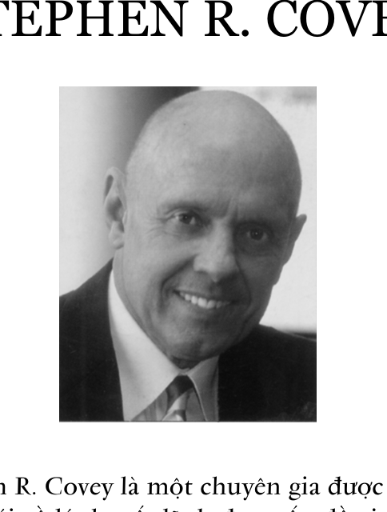

### THAY LỜI KẾT

# Một cuốn sách có thể thay đổi cuộc đời bạn

Dưới đây là tổng hợp một số câu hỏi của báo chí và độc giả trên khắp thế giới về tác phẩm “7 Thói quen để thành đạt” và tác giả Stephen R. Covey. Chúng tôi xin lược trích và giới thiệu đến các bạn:

### Hỏi: Thưa ông Stephen R. Covey, cuốn “7 Thói Quen Để Thành Đạt” đã được xuất bản từ năm 1989. Vậy, với những trải nghiệm của ông từ đó đến nay, ông có ý định thay đổi, hay thêm bớt gì trong nội dung không?

Sự thật tôi sẽ không thay đổi điều gì trong cuốn sách này cả. Tôi đã phân tích sâu hơn và vận dụng rộng rãi hơn những điều đề cập trong cuốn sách bằng một số cuốn sách khác đã được phát hành sau đó.

Ví dụ, hơn 250.000 người cho biết Thói quen thứ ba, ***ưu tiên cho điều quan trọng nhất,*** là thói quen bị xem nhẹ nhất. Do vậy, cuốn sách “Ưu tiên cho điều quan trọng nhất” đã được phát hành vào năm 1996. Nó đi sâu vào việc nghiên cứu, phân tích các Thói quen 2 và 3, đồng thời, bổ sung thêm nội dung và minh họa cho tất cả các thói quen khác.

Tôi cũng được hàng chục ngàn người cho biết: bằng cách lĩnh hội ***7 Thói quen,*** họ đã thấm nhuần và vận dụng hiệu quả ý tưởng biến bản thân trở thành nguồn lực sáng tạo cuộc sống của chính mình. Điều đó cho thấy sức mạnh

chuyển biến của các nguyên tắc đối với mọi đối tượng, dù là cá nhân, gia đình hay tổ chức, và không hề bị giới hạn bởi hoàn cảnh, kinh nghiệm sống của cá nhân hay vị thế của tổ chức.

### Hỏi: Bản thân ông đã học được gì về “7 Thói quen” từ khi cuốn sách được phát hành?

Tôi đã học và củng cố được rất nhiều điều. Tôi xin nêu tóm tắt ra đây 10 bài học.

> 1- Tầm quan trọng của việc am tường sự khác nhau giữa nguyên tắc và giá trị. Nguyên tắc là quy luật tự nhiên nằm bên ngoài chúng ta và chi phối mọi hệ quả từ hành động của chúng ta. Còn giá trị nằm bên trong, có tính chủ quan và đại diện cho những gì chúng ta cảm nhận, là thế mạnh lớn nhất trong việc điều khiển các hành vi của chúng ta. Chúng ta cần xem trọng cả nguyên tắc và giá trị để vừa có được kết quả mong muốn hiện tại vừa có được kết quả tốt hơn trong tương lai, tức điều tôi gọi là sự thành đạt. Mỗi người đều có các giá trị của riêng mình. Giá trị chi phối hành vi con người, còn nguyên tắc chi phối hệ quả của những hành vi đó. Các nguyên tắc không phụ thuộc vào ý chí, chúng hoạt động bất kể nhận thức của chúng ta về chúng như thế nào, bất kể chúng ta có chấp nhận, tin tưởng và tuân theo chúng hay không. Tôi tin rằng sự khiêm tốn là người mẹ của mọi đức hạnh. Sự khiêm tốn cho chúng ta biết không phải chúng ta chi phối hệ quả mà nguyên tắc sẽ làm điều đó. Do đó, chúng ta phải tuân theo nguyên tắc. Trong khi đó, sự ngạo mạn lại nói rằng chúng ta chi phối hệ quả và vì giá trị chi phối hành vi của chúng ta, nên chúng ta chỉ việc sống theo cách của mình. Chúng ta có thể làm như vậy, nhưng hệ quả của hành vi xuất phát từ nguyên tắc chứ không phải từ giá trị. Do vậy, chúng ta phải

coi trọng các nguyên tắc tự nhiên trong mọi mặt cuộc sống.

> 2- Bản chất phổ quát (universal nature) của các nguyên tắc được thể hiện trong cuốn sách này. Những minh họa và các thực tiễn có thể muôn hình và phong phú về chi tiết văn hóa, nhưng nguyên tắc thì giống nhau. Tôi đã phát hiện thấy những nguyên tắc chứa trong 7 Thói quen có mặt ở tất cả sáu tôn giáo chính trên thế giới và đã thực sự rút ra những lời trích dẫn từ giáo lý của các tôn giáo đó trong quá trình giảng dạy về các nền văn hóa. Tôi đã làm điều này ở Trung Đông, Ấn Độ, châu Á, Úc và Nam Thái Bình Dương, Nam Mỹ, châu Âu, Bắc Mỹ, châu Phi, những người Mỹ bản xứ, và các dân tộc bản địa khác. Tất cả chúng ta, đàn ông cũng như phụ nữ, đều gặp phải những vấn đề giống nhau, đều có những nhu cầu giống nhau và phản ánh vào bên trong nội tâm mình những nguyên tắc mà tôi vừa nêu trên đây.

Đó là nhận thức bên trong mỗi con người về nguyên tắc của sự công bằng hay nguyên tắc cùng thắng. Đó là nhận thức về tính đạo đức của nguyên tắc tinh thần trách nhiệm, nguyên tắc sống có mục đích, trung thực, tôn trọng lẫn nhau, hợp tác, giao tiếp, và tự đổi mới. Đó là những nguyên tắc phổ quát. Nhưng thực tế là không phải như vậy. Mỗi nền văn hóa giải thích các nguyên tắc phổ quát theo những cách thức riêng.

> 3- Tôi đã nhận thấy hệ quả của 7 Thói quen đối với tổ chức, mặc dù về kỹ thuật mà nói, một tổ chức không thể có thói quen. Nền văn hóa của một tổ chức chứa đựng những chuẩn mực, nội quy hay các quy tắc xã hội, những thứ đại diện cho các thói quen. Một tổ chức được xác lập những hệ thống, các quy trình và thủ tục. Những điều này đại diện cho các thói quen. Xét cho cùng, mọi hành vi đều mang

dấu ấn cá nhân mặc dù nó thường là một bộ phận của hành vi tập thể dưới dạng các quyết định quản lý về cơ cấu và các hệ thống, các quy trình và thông lệ. Chúng tôi đã làm việc với hàng ngàn tổ chức hoạt động trong các ngành nghề khác nhau và nhận thấy rằng họ cũng có các nguyên tắc cơ bản giống như trong việc ứng dụng 7 Thói quen và định nghĩa về sự thành đạt.

> 4- Bạn có thể dạy cả 7 Thói quen, bắt đầu bằng bất cứ thói quen nào trong số đó, vì nó chắc chắn sẽ dẫn đến sáu thói quen còn lại. Nó như một bức ảnh toàn ký (hologram) trong đó cái toàn thể có trong cái bộ phận và cái bộ phận có trong cái toàn thể.

> 5- Mặc dù 7 Thói quen đại diện cho cách tiếp cận từ trong ra ngoài (inside-out), nhưng nó lại có kết quả tốt nhất khi bạn bắt đầu bằng thách thức từ bên ngoài và sau đó tiếp cận từ trong – ra ngoài. Nói cách khác, nếu bạn gặp phải một thách thức về quan hệ, chẳng hạn sự giao tiếp, và sự tin cậy lẫn nhau bị phá vỡ, thì điều này cho thấy cần có cách tiếp cận từ trong ra ngoài để Thành tích cá nhân có thể dẫn tới Thành tích tập thể nhằm mục đích đối phó với thách thức đó. Đó là lý do vì sao tôi thường dạy các Thói quen 4, 5 và 6 trước khi dạy các Thói quen 1, 2 và 3.

6- ***Sự tương thuộc khó gấp 10 lần sự độc lập***. Nó đòi hỏi sự độc lập về trí tuệ và tình cảm nhiều hơn để có tư duy cùng thắng khi người khác có tư duy thắng/thua, để cố gắng hiểu người trước khi được người khác thông hiểu, và để tìm ra giải pháp thứ ba tốt hơn. Nói cách khác, để làm việc với người khác thành công bằng con đường hợp tác sáng tạo thì bạn phải có tính độc lập, sự an toàn nội tâm và sự tự chủ rất cao. Nếu không, cái mà chúng ta gọi là sự tương thuộc lại biến thành sự chống phụ thuộc (counter-

dependency) nơi người ta chống đối nhau để khẳng định tính độc lập của mỗi bên, hoặc là sự đồng phụ thuộc (codependency) nơi người này cần đến sự yếu kém của người khác để thỏa mãn nhu cầu của mình và để biện minh cho sự yếu kém của mình.

> 7- Bạn có thể tóm tắt ba thói quen đầu tiên bằng một cụm từ đơn giản “hứa và giữ lời hứa” và bạn cũng có thể tóm tắt ba thói quen sau bằng cụm từ sau “khuyến khích người khác cùng tham gia và cùng nhau tìm ra giải pháp tối ưu”.

> 8- Bảy thói quen đại diện cho một thứ ngôn ngữ mới, mặc dù số từ ngữ và thuật ngữ của nó đếm chỉ hơn mười đầu ngón tay. Loại ngôn ngữ mới này trở thành một mật mã, một kiểu tốc ký để nói về rất nhiều chuyện. Khi bạn nói với ai đó “cái đó là khoản gửi vào tài khoản hay rút ra?” “Đó là bị động đối phó hay chủ động?” “Đó là sự đồng tâm hiệp lực hay là sự thỏa hiệp?” “Đó là cùng thắng hay thắng/thua hay thua/thắng?” “Đó là ưu tiên cho cái quan trọng nhất hay cho cái kém quan trọng hơn?” “Điều đó bắt đầu bằng phương tiện hay mục đích?” Tôi đã nhìn thấy cả những nền văn hóa được chuyển đổi bởi sự hiểu rõ và cam kết đối với những nguyên tắc và các khái niệm được biểu thị bằng những từ ngữ quy ước đặc biệt này.

> 9- Sự chính trực là một giá trị cao hơn sự trung thành. Hay nói đúng hơn, chính trực là hình thức cao nhất của sự trung thành. Sự chính trực có nghĩa là hòa nhập vào các nguyên tắc hay lấy nguyên tắc làm trọng tâm, chứ không phải lấy con người, tổ chức hay thậm chí gia đình làm trọng tâm. Bạn sẽ thấy rằng gốc rễ của mọi vấn đề mà người ta gặp phải là “cái đó có được nhiều người thừa nhận hay có đúng không?” Khi chúng ta ưu tiên cho việc trung thành với một người hay một nhóm người hơn là làm một việc

mà chúng ta cho là đúng, chúng ta sẽ mất đi sự chính trực. Chúng ta có thể tạm thời có được sự thừa nhận của nhiều người hay xây dựng được sự trung thành, nhưng về sau, việc mất đi sự chính trực sẽ làm hại ngay cả mối quan hệ đó. Điều đó chẳng khác gì nói xấu sau lưng người khác. Người mà bạn tạm thời kết thân được nhờ nói xấu sau lưng người khác sẽ hiểu rằng bạn cũng có thể nói xấu họ khi có những sức ép khác, hay trong một hoàn cảnh khác. Xét về một khía cạnh nào đó, thì ba thói quen đầu tiên đại diện cho sự chính trực và ba thói quen sau đại diện cho sự trung thành; nhưng chúng hoàn toàn gắn bó với nhau và sự chính trực sẽ tạo ra sự trung thành. Nếu bạn định đảo ngược thứ tự và chọn sự trung thành trước, bạn sẽ trì hoãn và đánh mất sự chính trực. Được người khác tin cậy tốt hơn được người khác ưa thích. Rút cục, chỉ có sự tin cậy và tôn trọng mới sinh ra tình yêu.

> 10- Sống theo 7 Thói quen là cuộc phấn đấu không ngừng đối với bất cứ ai. Ai cũng có lúc dao động khi thực hiện một thói quen nào đó trong số 7 Thói quen, hoặc thậm chí đồng thời tất cả 7 Thói quen. Điều này đơn giản và dễ hiểu nhưng rất khó thực hiện một cách thường xuyên. Chúng là lẽ thường trong cuộc sống nhưng trên thực tế không phải lẽ thường nào cũng luôn luôn dễ thực hiện.

### Hỏi: Thói quen nào bản thân ông phải cố gắng nhiều nhất mới có được?

## Thói quen thứ năm. Khi tôi thực sự mệt mỏi và cả quyết rằng mình đúng thì tôi không còn muốn lắng nghe nữa, hoặc thậm chí tôi còn giả vờ lắng nghe nữa. Nhìn chung tôi cảm thấy mình có lỗi khi lắng nghe với ý định đối đáp chứ không phải để hiểu người khác. Trên thực tế, tôi rèn luyện hàng ngày với tất cả 7 Thói quen. Tôi chưa chinh

phục được thói quen nào cả. Tôi coi nó như các nguyên tắc của cuộc sống mà chúng ta không bao giờ thực sự làm chủ được, càng đến gần sự làm chủ nó bao nhiêu, chúng ta càng cảm thấy con đường còn phải đi càng xa bấy nhiêu. Nó cũng giống như việc càng biết nhiều, bạn càng cảm thấy mình chưa biết gì cả.

Đó là lý do vì sao tôi thường cho điểm sinh viên đại học 50% theo chất lượng của câu hỏi của họ và 50% ở chất lượng của câu trả lời. Trình độ kiến thức của họ sẽ được biểu lộ tốt hơn theo cách đó.

Tương tự, 7 Thói quen cũng được biểu thị bằng đường xoắn ốc đi lên.

Thói quen 1 ở mức độ cao rất khác với Thói quen 1 ở mức độ thấp hơn. Sự luôn chủ động ở mức độ đầu tiên có thể chỉ là sự nhận biết về khoảng trống giữa kích thích và phản ứng. Ở mức độ cao hơn nó có thể bao gồm cả sự lựa chọn như không quay trở lại hay là trả đũa. Mức cao hơn nữa là phản hồi. Mức tiếp theo là tha thứ. Và mức tiếp theo nữa là không còn bực bội về việc đó nữa.

#### ĐƯỜNG XOẮN ỐC ĐI LÊN

1

2

3

4

5

6

7

1

2

3

4

5

6

7

### Hỏi: Ông là Phó chủ tịch Công ty FranklinCovey. Thế Công ty FranklinCovey có áp dụng 7 Thói quen vào công việc hàng ngày không?

Chúng tôi không ngừng sống và làm theo những điều mình truyền đạt cho người khác, đó là những giá trị cơ bản nhất của chúng tôi. Nhưng chúng tôi chưa làm được một cách hoàn hảo. Cũng giống như mọi doanh nghiệp khác, chúng tôi bị thách thức bởi sự thay đổi của thị trường và sự liên kết giữa văn hóa của Trung tâm Covey và Franklin Quest trước kia. Cuộc sáp nhập diễn ra vào mùa hè năm 1997.

Sự thành công lâu dài của chúng tôi đòi hỏi phải có thời gian, sự kiên trì và bền bỉ áp dụng các nguyên tắc. Chụp ảnh nhanh không thể có được hình ảnh chính xác.

Máy bay thường bị chệch hướng phần lớn thời gian khi bay, nhưng luôn được điều chỉnh trở lại đúng đường và cuối cùng bay đến đích. Điều đó cũng đúng với tất cả chúng ta, dù là cá nhân, gia đình hay tổ chức. Điều then chốt là phải luôn luôn có “Mục đích” trong đầu và sự cam kết được chia sẻ để không ngừng có sự phản hồi và điều chỉnh cho đúng con đường đi.

### Hỏi: Tại sao lại là 7 Thói quen? Mà không phải là 6 hay 8 hay 10 hay 15? Phải chăng số 7 ở đây có ý nghĩa gì thiêng liêng?

Chẳng có gì thiêng liêng đối với con số 7 cả, đơn giản chỉ vì có 3 thói quen thuộc phạm trù Thành tích cá nhân (tự do lựa chọn, lựa chọn, hành động) đi trước 3 thói quen thuộc phạm trù Thành tích tập thể (tôn trọng, thấu hiểu, sáng tạo) và sau đó thêm một cái nữa là đổi mới. Tất cả các thói quen đó thành ra là con số 7.

Khi được hỏi về câu này, tôi luôn luôn trả lời rằng nếu có đặc tính khác mà bạn muốn cho nó trở thành thói quen, thì bạn chỉ cần đưa nó vào Thói quen thứ hai như một trong những giá trị mà bạn đang cố gắng để sống theo nó. Nói cách khác, nếu bạn muốn “luôn đúng giờ” thành một thói quen, thì đó sẽ là một trong những giá trị của Thói quen thứ hai. Thói quen thứ hai nói về những sự lựa chọn hay giá trị đó là gì và Thói quen thứ ba nói về việc sống theo những giá trị đó. Do vậy mà chúng rất cơ bản, có tính chất chung nhất và quan hệ mật thiết với nhau.

Sự thật là khi viết Lời kết cho lần xuất bản mới nhất quyển sách này, tôi vừa hoàn thành cuốn sách mới: ***“Thói quen thứ 8: Từ thành đạt đến vĩ đại”*** (The 8th Habit: From Effectiveness to Greatness). Một số người cho rằng gọi nó là Thói quen thứ 8 có vẻ như đã đi lệch khỏi ý kiến trả lời chuẩn mực của tôi. Nhưng như các bạn thấy ở chương Mở đầu của cuốn sách mới, thế giới đã thay đổi sâu sắc từ khi cuốn sách “7 Thói Quen Để Thành Đạt” xuất bản năm 1989. Những thách thức và tính chất phức tạp mà chúng ta gặp phải trong cuộc sống riêng, trong các mối quan hệ, trong nghề nghiệp chuyên môn, và trong các tổ chức là rất khác về mức độ so với trước. Trong thực tế, nhiều người lấy mốc năm 1989 – năm chứng kiến sự sụp đổ của bức tường Berlin – như sự bắt đầu của ***Thời đại Tin học,*** sự ra đời của một thực tại mới, một đại dương mênh mông những thay đổi với những ý nghĩa không thể tin nổi… một thời đại thực sự mới mẻ.

Sự thành đạt của cá nhân và tổ chức như trước không còn đủ cho thế giới ngày nay – đó là cái giá phải trả để bước vào một sân chơi mới. Nhưng để tồn tại, thịnh vượng, sáng tạo, hoàn thiện và dẫn đầu trong một thực tại mới mẻ này,

chúng ta phải xây dựng và vượt xa hơn sự thành đạt. Lời kêu gọi và đòi hỏi của thời đại mới là sự thoải mái. Đó là sự lạc quan nồng nhiệt, sự cống hiến đầy ý nghĩa và sự vĩ đại. Những điều này thuộc một mặt bằng, một bình diện cao hơn. Nó cũng là sự thành công nhưng khác về tính chất chứ không phải mức độ. Để có thể đạt đến một trình độ cao hơn của trí tuệ và động cơ của con người – cái mà chúng ta gọi là tiếng nói – đòi hỏi phải có một nếp nghĩ mới, kỹ năng mới, công cụ mới… một Thói quen mới.

Do vậy Thói quen thứ tám không nói về việc cộng thêm một thói quen nữa vào 7 Thói quen đã biết mà là nói về việc nhận ra và khai thác sức mạnh của một chiều thứ ba (a third dimension) vào 7 Thói quen để đáp ứng thách thức trọng tâm của Kỷ nguyên Lao động Tri thức.

### Hỏi: Danh tiếng của ông ảnh hưởng đến ông như thế nào?

Nó có ảnh hưởng đến tôi trong nhiều mặt. Từ góc độ cá nhân, thì đó là sự đề cao. Từ góc độ sư phạm, đó là sự khiêm tốn, nhưng tôi cần phải nhấn mạnh rằng tôi không phải là tác giả của bất kỳ nguyên tắc nào ở đây và tuyệt đối không xứng đáng với mọi sự công nhận nào như vậy. Tôi nói như vậy bởi tôi coi bản thân mình cũng như tất cả các bạn – là một người đi tìm chân lý, sự hiểu biết. Tôi không phải là một nhà thông thái, tôi không thích người ta gọi tôi là nhà thông thái. Tôi không muốn có môn đệ. Tôi chỉ cố gắng quảng bá sự tuân theo những nguyên tắc đã có sẵn trong tâm hồn của con người, những nguyên tắc nói rằng người ta cần sống thực với lương tâm của mình.

### Hỏi: Nếu được làm lại lần nữa, ông có làm khác đi với tư cách là một doanh nhân?

Tôi sẽ lựa chọn, tuyển dụng nhân sự một cách có chiến lược và luôn chủ động. Khi bạn đang bị chôn vùi vào hàng ngàn công việc khẩn cấp và bận rộn, bạn rất dễ đưa những người tỏ ra có sẵn giải pháp trong tay vào những vị trí then chốt. Xu hướng thường thấy là khi đi sâu vào quá trình và tính cách con người, nhiều người không có “sự quan tâm đầy đủ” đến vấn đề đó, hay không xây dựng các tiêu chuẩn cần phải đáp ứng cho từng cương vị cụ thể. Tôi tin rằng khi việc tuyển dụng và lựa chọn được thực hiện một cách có chiến lược, tức là có tư duy lâu dài và luôn chủ động, không phải dựa vào sức ép nhất thời, sẽ đem lại lợi ích to lớn về sau. Có ai đó từng nói rằng “Điều chúng ta đang mong muốn nhất chính là điều chúng ta dễ tin nhất”. Bạn thực sự cần phải nhìn sâu vào cả tính cách lẫn năng lực, vì cuối cùng, thì những sự khiếm khuyết dù ở mặt nào cũng sẽ bộc lộ ra. Và nên nhớ rằng, đào tạo và bồi dưỡng là quan trọng,

nhưng việc tuyển dụng và lựa chọn còn quan trọng hơn.

### Hỏi: Nếu được làm lại lần nữa, ông có làm khác đi với tư cách là người cha?

Với tư cách là một người cha, tôi sẽ dành nhiều thời gian hơn để xây dựng những thỏa thuận cùng thắng nhẹ nhàng, thoải mái với từng đứa con của mình ở các giai đoạn khác nhau trong cuộc đời chúng. Do công việc kinh doanh và thường xuyên đi công tác, tôi thường chiều chuộng con mình và chọn giải pháp thua/thắng quá nhiều, thay vì dành thời gian và công sức xây dựng mối quan hệ thông qua sự thỏa thuận cùng thắng thường xuyên hơn.

### Hỏi: Công nghệ mới sẽ làm thay đổi việc kinh doanh như thế nào trong tương lai?

Tôi đồng ý với tuyên bố của Stan Davis rằng “Khi cơ sở hạ tầng thay đổi, mọi thứ sẽ rung chuyển”, và tôi nghĩ cơ sở hạ tầng kỹ thuật là trung tâm của mọi thứ. Nó sẽ làm tăng tốc độ của mọi xu thế, cả tốt lẫn xấu. Tôi cho rằng vì lý do này mà yếu tố con người trở nên càng quan trọng hơn. Công nghệ cao mà không có nguồn nhân lực tương xứng sẽ chẳng mang lại kết quả gì, và công nghệ càng có ảnh hưởng bao nhiêu, thì yếu tố con người - ở việc kiểm soát công nghệ đó, càng quan trọng bấy nhiêu, đặc biệt trong việc phát triển sự cam kết về mặt văn hóa đối với các tiêu chuẩn sử dụng công nghệ đó.

### Hỏi: Ông có ngạc nhiên hay sửng sốt trước tính phổ biến của 7 Thói quen (ở các nước khác nhau/các nền văn hóa khác nhau/tuổi tác và giới tính khác nhau)?

Vừa có vừa không. Có bởi vì tôi không ngờ là nó trở thành hiện tượng trên thế giới và có rất ít từ ngữ mang tính

chất thuần Mỹ. Và không, bởi vì cuốn sách đã qua thử thách trong hơn 25 năm qua, kết quả trước hết của nó được dựa trên các nguyên tắc không phải do tôi phát minh ra và cũng không phải công lao của tôi.

### Hỏi: Ông sẽ giảng dạy 7 Thói quen cho các em nhỏ như thế nào?

Tôi nghĩ rằng tôi sẽ tuân theo ba quy tắc cơ bản của Albert Schweitzer trong việc dạy dỗ trẻ con: Thứ nhất làm gương; thứ hai làm gương; thứ ba làm gương. Nhưng tôi sẽ không đi xa đến mức đó. Tôi muốn nói rằng, thứ nhất là làm gương; thứ hai, xây dựng mối quan hệ có sự quan tâm và khuyến khích; và thứ ba, dạy một số ý tưởng cơ bản trên cơ sở các thói quen theo ngôn ngữ của trẻ em – giúp chúng có được sự hiểu biết cơ bản và từ vựng của 7 Thói quen, chỉ dẫn chúng cách làm thế nào để có được những sự trải nghiệm của chính mình thông qua các nguyên tắc; để chúng xác định những nguyên tắc và thói quen cụ thể nào đang được thể hiện trong cuộc sống của chúng.

### Hỏi: Sếp tôi (vợ/chồng, con cái, bạn bè v.v.) thực sự cần có 7 Thói quen? Theo ông, tôi phải làm thế nào để họ đọc cuốn sách này?

Người ta không cần quan tâm bạn biết những gì cho đến khi họ biết bạn quan tâm đến họ. Hãy xây dựng mối quan hệ tin cậy và cởi mở dựa trên cơ sở một biểu hiện của tính cách đáng tin cậy và sau đó chia sẻ với họ rằng 7 Thói quen đã giúp bạn như thế nào. Đơn giản là bạn cho họ thấy 7 Thói quen qua hành động của bạn. Đến lúc thích hợp, bạn có thể mời họ tham gia vào một chương trình huấn luyện hay gửi tặng cuốn sách làm quà hay phổ biến cho họ một số ý tưởng cơ bản khi hoàn cảnh cho phép.

### Hỏi: Ông có thể nói chút ít về kinh nghiệm bản thân và điều gì làm ông viết ra cuốn sách này?

Mọi người ngầm hiểu rằng tôi sẽ nối nghiệp cha tôi là sẽ tham gia vào hoạt động kinh doanh của gia đình. Tuy nhiên, tôi lại thấy mình thích dạy học và huấn luyện các nhà quản lý hơn là làm kinh doanh. Tôi trở nên quan tâm sâu sắc và tập trung vào khía cạnh con người của tổ chức khi tôi làm việc tại Khoa Kinh doanh Đại học Harvard. Sau đó, tôi dạy các môn kinh doanh, tư vấn, cố vấn và huấn luyện nhiều năm tại trường Brigham Young University, tôi chú ý đến việc xây dựng các Chương trình phát triển nhân sự liên kết giữa lãnh đạo và quản lý dựa vào tập hợp các nguyên tắc có tuần tự và cân bằng. Những điều này cuối cùng dẫn đến 7 Thói quen và khi áp dụng vào tổ chức nó phát triển trở thành khái niệm lãnh đạo lấy nguyên tắc làm trọng tâm. Tôi quyết định rời khỏi trường đại học và tập trung thời gian vào việc huấn luyện các nhà quản lý từ nhiều tổ chức khác nhau. Sau một năm thực hiện theo chương trình đào tạo đã được chuẩn bị kỹ thì xuất hiện cơ hội kinh doanh cho phép chúng tôi đưa chương trình này ra khắp thế giới.

### Hỏi: Ông nghĩ sao về việc có người cho rằng họ biết công thức đích thực của thành công?

Tôi muốn nói hai điều. Thứ nhất, nếu điều họ nói được dựa trên các nguyên tắc hay các quy luật tự nhiên, thì tôi muốn học hỏi họ và khen ngợi họ. Thứ hai, tôi muốn nói có thể chúng ta đang dùng những từ ngữ khác nhau để diễn tả các nguyên tắc cơ bản hay quy luật tự nhiên giống nhau.

# Về tác giả STEPHEN R. COVEY

Stephen R. Covey là một chuyên gia được kính trọng trên thế giới về lý thuyết lãnh đạo, vấn đề gia đình, một nhà giáo, nhà tư vấn về quản lý và là một tác giả đã cống hiến cả đời mình để giảng dạy phương pháp sống và lãnh đạo lấy nguyên tắc làm trọng tâm, nhằm xây dựng cuộc sống gia đình và tổ chức thành đạt. Ông tốt nghiệp thạc sĩ quản trị kinh doanh Đại học Harvard và tiến sĩ Đại học Brigham Young - nơi ông làm giáo sư môn hành vi học của tổ chức và quản trị kinh doanh, đồng thời là giám đốc quan hệ công chúng của trường và trợ lý hiệu trưởng. Ngoài ra, ông còn nhận được 7 bằng tiến sĩ danh dự của các trường đại học danh tiếng khác.

Tiến sĩ Covey là tác giả của nhiều cuốn sách, bao gồm cuốn sách bán chạy nhất thế giới ***“7 Thói Quen Để Thành Đạt”*** - tác phẩm được tôn vinh là có ảnh hưởng nhất của thế

kỷ 20 và là một trong 10 cuốn sách về quản trị có ảnh hưởng nhất từ trước đến nay với 15 triệu bản bằng 38 thứ tiếng đã được bán ra trên thế giới. Những cuốn sách nổi tiếng khác của ông bao gồm: ***Thói quen thứ tám; Ưu tiên cho cái quan trọng nhất; Lãnh đạo lấy nguyên tắc làm trọng tâm*** va ***â 7 Thói quen của những gia đình thành đạt.***

Ông có 9 người con và 43 người cháu. Ông được trao Giải thưởng Người Cha Đáng Kính của nước Mỹ - giải thưởng mà ông cho rằng có ý nghĩa nhất trong cuộc đời mình. Các giải thưởng khác của ông bao gồm Thomas More College Medallion về sự cống hiến cho nhân loại, Diễn Giả Xuất Sắc Nhất, Giải thưởng Công dân của Hòa Bình, Giải thưởng Quốc tế Nhà Doanh nghiệp của năm 1994 và Giải thưởng Doanh nhân Quốc gia vì Những Thành tựu Trọn đời của Hoa Kỳ. Tiến sĩ Covey được tạp chí ***Time*** công nhận là một trong 25 người Mỹ có ảnh hưởng nhất thế kỷ 20.

Tiến sĩ Covey là sáng lập viên và là Phó chủ tịch Công ty FranklinCovey, một công ty cung cấp dịch vụ hàng đầu trên thế giới có văn phòng tại 123 nước. Họ chia sẻ tầm nhìn, tính kỷ luật và nhiệt tình của Tiến sĩ Covey để có nguồn cảm hứng, nâng cao, và cung cấp phương tiện cho các cá nhân và tổ chức có nhu cầu trên toàn thế giới để thay đổi và trưởng thành trên con đường công danh và sự nghiệp.

FranklinCovey (tên niêm yết trên thị trường chứng khoán New York *(*)* là FC) là công ty hàng đầu trên thế giới về đào tạo, nâng cao hiệu quả làm việc, các công cụ nâng cao năng suất lao động và các dự án đánh giá cho các tổ chức, tập thể và cá nhân. Khách hàng của FranklinCovey

(*) NYSE - New York Stock Exchange.

chiếm 90% các công ty trong danh sách ***Fortune 100***, hơn 75% trong ***Fortune 500***, hàng ngàn các doanh nghiệp nhỏ và vừa, cũng như nhiều tổ chức của chính phủ và các tổ chức giáo dục. Các tổ chức và cá nhân tiếp cận với các sản phẩm của FranklinCovey và dịch vụ thông qua các lớp huấn luyện của công ty, qua các nhân viên cung cấp dịch vụ có giấy phép, tư vấn trực tiếp một đối một, các cuộc hội thảo chuyên đề, các catalogue, cùng với hơn 140 cửa hàng bán lẻ và qua trang web ***www.franklincovey.com***

FranklinCovey có hơn 2.000 cộng tác viên cung cấp các dịch vụ chuyên nghiệp, các sản phẩm và tư liệu bằng 28 ngôn ngữ, tại 39 văn phòng và ở 95 nước trên thế giới.

# GIÁ TRỊ CỦA “7 THÓI QUEN ĐỂ THÀNH ĐẠT”

> “7 Thói quen là những chiếc chìa khóa để thành công trong mọi hoàn cảnh. Đây là một quyển sách rất có giá trị.”

> - Adward Anh Brennanm Chủ tịch kiêm CEO Sears, Roebuck & Co

> “Tôi đọc 7 thói quen để thành đạt và thu được rất nhiều lợi ích… Đây là cuốn sách sâu sắc nhất và mang tính khai sáng nhất mà tôi từng đọc.”

> - Norman Vincent Peale, tác giả The Power of Positive Thinking

> “Khi Stephen Covey cất tiếng nói, mọi cấp lãnh đạo đều lắng nghe.”

> - Dun’s Business Month

> “Tôi chưa từng biết một người thầy nào hay cố vấn tinh thần nào trong lĩnh vực nâng cao thành tích cá nhân có thể khơi nguồn cho nhiều phản ứng tích cực như thế… Quyển sách này thể hiện một triết lý sống đẹp đẽ của Stephen Covey. Tôi nghĩ bất cứ ai đọc nó cũng sẽ nhanh chóng hiểu được tác dụng mạnh mẽ mà tôi và nhiều người khác đã từng thụ đắc.”

> - John Pepper, Chủ tịch Tập đoàn Procter & Gamble

> “Stephen Covey là một Socrates của Mỹ, người dẫn dắt chúng ta đi tìm những sự vĩnh cửu - các giá trị, gia đình, các mối quan hệ và giao tiếp xã hội.”

> - Brian Tracy, tác giả Psychology of Achievement

> “Sách của Stephen R. Covey khuyến khích chúng ta xây dựng sức mạnh, niềm tin và mang lại nguồn cảm hứng. Nội dung và phương pháp trình bày những bí quyết này tạo thành một nền tảng vững chắc cho sự giao tiếp hiệu quả. Là một nhà giáo dục, tôi tin rằng quyển sách này chắc chắn sẽ giành được một chỗ đứng trang trọng trên kệ sách của mọi gia đình.”

> - William Rolfe Kerr, Ủy viên Hội đồng Giáo dục Đại học bang Utah, Mỹ

> “Trong quyển 7 thói quen để thành đạt, Covey mang đến cho chúng ta một cơ hội, chứ không phải một chỉ dẫn. Cơ hội đó là khám phá chính mình và ảnh hưởng của bản thân đối với người khác cũng như thực hành điều đó bằng cách vận dụng những ý tưởng sâu sắc của ông. Đây là một quyển sách tuyệt vời có thể làm thay đổi cuộc sống của bạn.”

> - Tom Peters, tác giả In Search of Excellence

> “Chiến thắng là một thói quen. Thất bại cũng thế. Hai mươi lăm năm kinh nghiệm, suy tưởng và nghiên cứu đã thuyết phục Covey rằng 7 thói quen tạo ra sự khác biệt trong hạnh phúc, sức khỏe, thành công từ những người thất bại hay những người phải hy sinh ý nghĩa cuộc sống và hạnh phúc của mình vì sự thành công hiểu theo nghĩa hẹp.”

> - Ron Zemke, đồng tác giả The Service Edge và cuốn Service America

> “Stephen R. Covey là một con người tuyệt diệu. Ông viết một cách sâu sắc và đầy quan tâm đến con người. Sự cân bằng của một thư viện sống về thành công sẽ được nhận ra trong tập sách này. Những bí quyết Covey đề cập trong 7 thói quen để thành đạt đã thực sự mang đến cho tôi một sự khác biệt trong cuộc sống.”

> - Tiến sĩ Ken Blanchard, tác giả quyển The One-Minute Manager

#### MỤC LỤC

- ***Lời giới thiệu:*** 5
- ***Lời tác giả:*** 9

#### CHƯƠNG MỘT NHỮNG KHÁI NIỆM TỔNG QUAN 13

### CÁNH CỬA CỦA SỰ THAY ĐỔI 15

### Những thách thức của kỷ nguyên mới 17 Sợ hãi và Tự ti 17 Ước muốn và Tham vọng sở hữu 17 Trốn tránh trách nhiệm 18 Tuyệt vọng 19 Mất cân bằng trong cuộc sống 20 Tính vị kỷ 20 Niềm khao khát được lắng nghe 21 Xung đột và khác biệt 22 Bế tắc của bản thân 22

### Đâu là giải pháp? 23

### Chúng ta có thể kỳ vọng điều gì? 25

### MÔ THỨC VÀ NGUYÊN TẮC 27

### Bắt đầu từ bên trong 29 1. Đạo đức nhân cách và Đạo đức tính cách 33 2. Chính yếu và thứ yếu 38

### 3. Ảnh hưởng của mô thức 40 4. Thay đổi mô thức 48 5. Nhận thức và tính cách 52 6. Lấy nguyên tắc làm trung tâm 53 7. Nguyên tắc thay đổi và phát triển 58 8. Nhìn nhận vấn đề 65 9. Nâng cao trình độ tư duy 68

### Tổng quan về “7 thói quen” 73 1. “Thói quen” là gì? 75 2. Tính liên tục của quá trình trưởng thành 77 3. Định nghĩa về tính hiệu quả 83 4. Ba loại tài sản 84 5. Nguyên tắc PC trong tổ chức 89

#### CHƯƠNG HAI THÀNH TÍCH CÁ NHÂN 95

## Thói quen thứ nhất: LUÔN CHỦ ĐỘNG 97

### Các nguyên tắc về tầm nhìn cá nhân 99 1. Lăng kính xã hội 101 2. Giữa nhân tố kích thích và phản ứng là gì? 103 3. Định nghĩa “tính chủ động” 106 4. Nắm thế chủ động 111 5. Chủ động hành động hay bị động đối phó? 113 6. Lắng nghe chính mình 116 7. Vòng tròn Quan tâm và Vòng tròn Ảnh hưởng 120 8. Kiểm soát trực tiếp, kiểm soát gián tiếp và ngoài tầm kiểm soát 125

### 9. Mở rộng Vòng tròn Ảnh hưởng 126 10. “Có” và “Là” 130 11. Phía bên kia của thất bại 132 12. Cam kết và giữ lời 134 13. Tính chủ động: cuộc trắc nghiệm 30 ngày 136

## Thói quen thứ hai: BẮT ĐẦU TỪ MỤC TIÊU ĐÃ ĐƯỢC XÁC ĐỊNH 139

### Các nguyên tắc lãnh đạo bản thân 141 1. “Bắt đầu từ mục tiêu đã được xác định” có nghĩa là gì? 142 2. Mọi sự vật đều được sáng tạo hai lần 145 3. Dự kiến hay mặc nhiên 147 4. Lãnh đạo và quản lý – hai sự sáng tạo 148 5. Trở thành người sáng tạo đầu tiên của chính mình 151 6. Tuyên ngôn sứ mệnh cá nhân 156 7. Trung tâm của Vòng tròn Ảnh hưởng 160 8. Các trọng tâm trong cuộc sống 163 9. Nhận diện trọng tâm của bạn 175 10. Trọng tâm hướng về nguyên tắc 180 11. Thiết lập và vận dụng bản tuyên ngôn sứ mệnh cá nhân 189 12. Vận dụng tư duy ở tầm cao mới 191 13. Hai phương pháp khai thác tiềm năng của bán cầu não phải 193 14. Nhận diện vai trò và mục tiêu 200 15. Tuyên ngôn sứ mệnh gia đình 204 16. Tuyên ngôn sứ mệnh tổ chức 206

## Thói quen thứ ba: ƯU TIÊN CHO ĐIỀU QUAN TRỌNG NHẤT 215

### Các nguyên tắc quản lý bản thân 217 1. Sức mạnh của ý chí độc lập 219 2. Bốn thế hệ quản trị thời gian 222 3. Góc Phần tư thứ hai 224 4. Điều kiện cần có để nói “không” 232 5. Tổ chức và thực hiện Phần tư thứ hai 236 6. Công cụ dùng cho Phần tư thứ hai 239 7. Trở thành người tự quản Phần tư thứ hai 242 8. Thực hiện lịch công tác của bạn 250 9. Ưu điểm vượt trội của thế hệ quản trị thời gian thứ tư 252 10. Giao phó công việc: Gia tăng P và PC 253 11. Giao phó mệnh lệnh 255 12. Giao phó ủy quyền 257 13. Mô thức về Phần tư thứ hai 265

#### CHƯƠNG BA THÀNH TÍCH TẬP THỂ 269

### Những mô thức của sự tương thuộc 271 1. Tài khoản tình cảm 276 2. Sáu khoản ký gửi chủ yếu 279 3. Những quy luật của tình yêu và cuộc sống 292 4. Vấn đề của P là cơ hội của PC 296

## Thói quen thứ tư: TƯ DUY CÙNG THẮNG 299 Các nguyên tắc lãnh đạo 301 1. Sáu mô thức của mối quan hệ tương tác giữa con người 303 2. Năm phương diện của tư duy cùng thắng 318 3. Các hệ thống hỗ trợ 336 4. Các quá trình 340

## Thói quen thứ năm: LẮNG NGHE VÀ THẤU HIỂU 345

### Các nguyên tắc giao tiếp trên cơ sở thấu hiểu lẫn nhau 347 1. Tính cách và giao tiếp 349 2. Lắng nghe và thấu hiểu 351 3. “Chẩn bệnh” trước khi “kê toa” 357 4. Bốn kiểu phản ứng phản xạ 359 5. Hiểu và nhận thức 373 6. Tiếp cận từng bước một 378

## Thói quen thứ sáu: ĐỒNG TÂM HIỆP LỰC 383

### Các nguyên tắc hợp tác sáng tạo 385 1. Sự giao tiếp đồng tâm hiệp lực 387 2. Đồng tâm hiệp lực trong nhóm 389 3. Đồng tâm hiệp lực trong kinh doanh 391 4. Đồng tâm hiệp lực và vấn đề giao tiếp 393 5. Tìm kiếm một phương án thứ ba 395 6. Đồng tâm hiệp lực tiêu cực 399 7. Coi trọng sự khác biệt 403 8. Phân tích trường lực 406 9. Bản chất của tự nhiên là đồng tâm hiệp lực 411

#### CHƯƠNG BỐN ĐỔI MỚI 415

## Thói quen thứ bảy: RÈN GIŨA BẢN THÂN 417

### Các nguyên tắc tự đổi mới hợp lý 419 1. Bốn khía cạnh của tự đổi mới 420 2. Ảnh hưởng của bạn đối với người khác 435 3. Cân bằng trong đổi mới 437 4. Đồng tâm hiệp lực trong đổi mới 439 5. Sự phát triển theo đường xoắn ốc 441

### Trở lại nguyên tắc “bắt đầu từ bên trong” 445 1. Cuộc sống liên thế hệ 448 2. Con người giao thời 450 3. Một ghi chú của tác giả 453

### Thay lời kết MỘT CUỐN SÁCH CÓ THỂ THAY ĐỔI CUỘC ĐỜI BẠN 455

### Về tác giả STEPHEN R. COVEY 469 GIÁ TRỊ CỦA “7 THÓI QUEN ĐỂ THÀNH ĐẠT” 472

***Chịu trách nhiệm xuất bản:*** Tiến sĩ QUÁCH THU NGUYỆT

- ***Biên tập:*** Thành Nam
- ***Trình bày:*** First News
- ***Sửa bản in:*** Thanh Bình

- ***Thực hiện:*** First News – Trí Việt

#### **NHÀ XUẤT BẢN TRẺ**

161 Lý Chính Thắng - Quận 3, TP. Hồ Chí Minh ĐT: 9316211 - Fax: 8437450

In lần thứ 1. Số lượng 2.000 cuốn, khổ 14 x 20,5 cm tại Công ty Văn Hóa Phương Nam (160/13 Đội Cung, Q.11, TP. HCM). Giấy ĐKKHXB số 33-2007/CXB/676-203/Tre - QĐXB số 698B/QĐ-Tre cấp ngày 18/10/2007. In xong và nộp lưu chiểu quý IV/2007.
