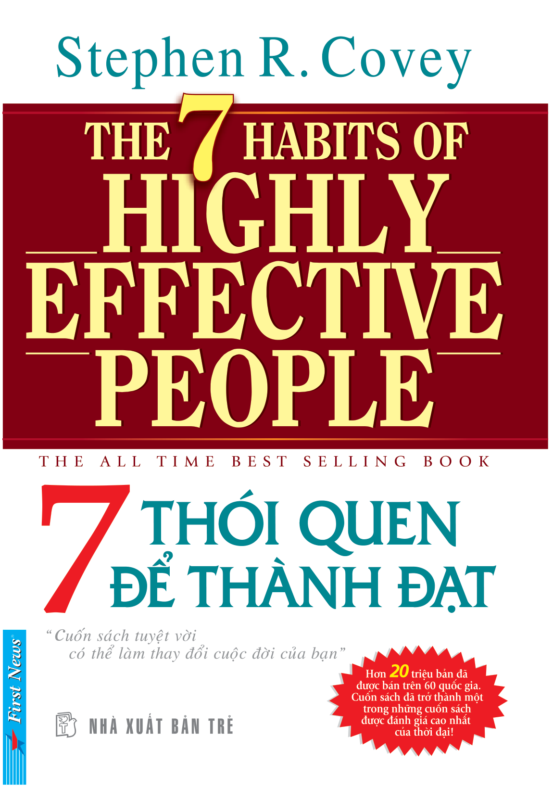

# 7 THÓI QUEN ĐỂ THÀNH ĐẠT (The 7 Habits of Highly Effective People)

**Tác giả:** Stephen R. Covey  
**Biên dịch:** Vũ Tiến Phúc - Ban Biên Dịch First News  
**Hiệu đính:** Tổ Hợp Giáo Dục PACE  
**Nhà xuất bản:** Nhà Xuất Bản Trẻ & First News  

---

## Mục lục

1. [Lời giới thiệu & Lời tác giả](00_loi_gioi_thieu_va_loi_tac_gia.md)
   - Lời giới thiệu (First News & PACE)
   - Lời tác giả (Stephen R. Covey)

2. [Chương 1: Những khái niệm tổng quan](01_chuong_1_nhung_khai_niem_tong_quan.md)
   - Cánh cửa của sự thay đổi
   - Những thách thức của kỷ nguyên mới
   - Mô thức và nguyên tắc (Bắt đầu từ bên trong)
   - Tổng quan về "7 Thói quen"

3. [Chương 2: Thành tích cá nhân](02_chuong_2_thanh_tich_ca_nhan.md)
   - **Thói quen thứ nhất:** Luôn chủ động (*Be Proactive*)
   - **Thói quen thứ hai:** Bắt đầu từ mục tiêu đã được xác định (*Begin with the End in Mind*)
   - **Thói quen thứ ba:** Ưu tiên cho điều quan trọng nhất (*Put First Things First*)

4. [Chương 3: Thành tích tập thể](03_chuong_3_thanh_tich_tap_the.md)
   - Những mô thức của sự tương thuộc
   - **Thói quen thứ tư:** Tư duy cùng thắng (*Think Win/Win*)
   - **Thói quen thứ năm:** Lắng nghe và thấu hiểu (*Seek First to Understand, Then to Be Understood*)
   - **Thói quen thứ sáu:** Đồng tâm hiệp lực (*Synergize*)

5. [Chương 4: Đổi mới](04_chuong_4_doi_moi.md)
   - **Thói quen thứ bảy:** Rèn giũa bản thân (*Sharpen the Saw*)
   - Trở lại nguyên tắc "Bắt đầu từ bên trong"

6. [Thay lời kết & Phụ lục](05_thay_loi_ket_va_phu_luc.md)
   - Thay lời kết: Một cuốn sách có thể thay đổi cuộc đời bạn
   - Về tác giả Stephen R. Covey
   - Giá trị của "7 Thói quen để thành đạt"
   - Mục lục sách chi tiết
