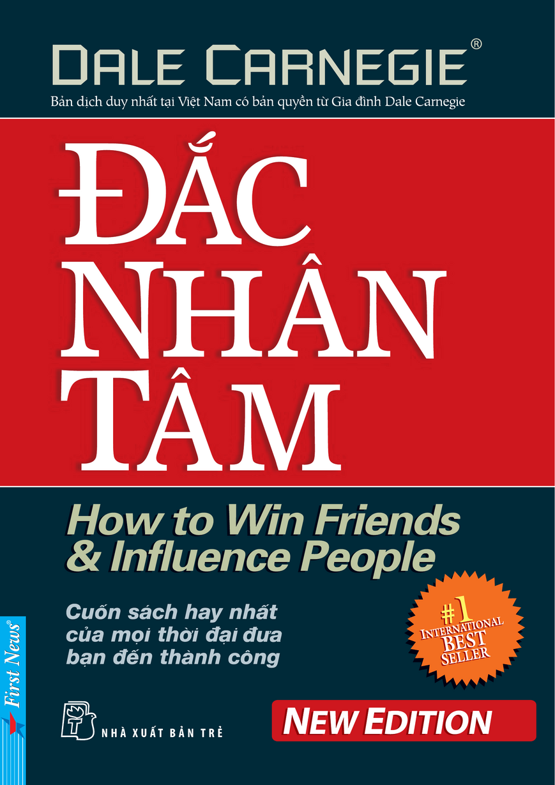
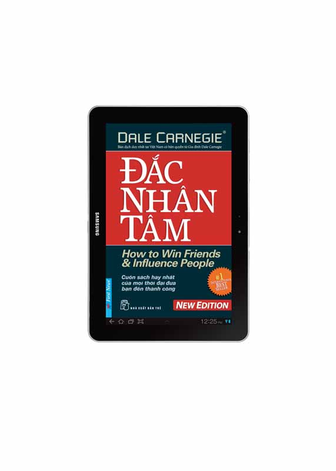
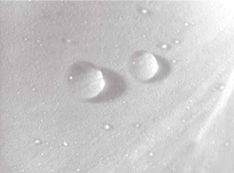

# ĐẮC NHÂN TÂM
### HOW TO WIN FRIENDS AND INFLUENCE PEOPLE
Tác giả: Dale Carnegie

---

## THÔNG TIN TÀI TRỢ & BẢN QUYỀN

Công Ty Samsung Trân trọng gửi đến bạn cuốn sách này.

Phiên bản ebook này được thực hiện theo bản quyền xuất bản và phát hành ấn bản tiếng Việt của công ty First News - Trí Việt với sự tài trợ độc quyền của công ty TNHH Samsung Electronics Việt Nam. Tác phẩm này không được chuyển dạng sang bất kỳ hình thức nào hay sử dụng cho bất kỳ mục đích thương mại nào.

---

## LỜI ĐỀ TẶNG

> *Xin gửi tặng người bạn thân yêu nhất của tôi*  
> *- Homer Croy - người không cần đọc quyển sách này.*

Cố vấn xuất bản:  
DOROTHY CARNEGIE

Trợ lý xuất bản:  
TIẾN SĨ TRIẾT HỌC ARTHUR R. PELL

Những người thực hiện:  
NGUYỄN VĂN PHƯỚC - DƯƠNG NGỌC HÂN  
NGUYỄN CÔNG VINH - VƯƠNG BẢO LONG  
NGUYỄN TRỊNH KHÁNH LINH - PHẠM PHÚ NGỌC TRAI

---

## BẢN QUYỀN XUẤT BẢN

Revised & Updated Edition by Dale Carnegie & Dorothy Carnegie  
Copyright © 1936 by Dale Carnegie  
Copyright renewed © 1964 by Dale Carnegie and Dorothy Carnegie.  
Revised edition © 1983 by Donna Dale Carnegie and Dorothy Carnegie.  
ALL RIGHTS RESERVED.

Vietnamese Edition copyright © 2008 by First News – Tri Viet.  
Published by arrangement with original publisher, Simon & Schuster, Inc. USA.

Công ty First News – Trí Việt giữ bản quyền xuất bản và phát hành ấn bản tiếng Việt trên toàn thế giới theo hợp đồng chuyển giao bản quyền với Simon & Schuster, Inc., Hoa Kỳ và gia đình Dale Carnegie.

Bất cứ sự sao chép nào không được sự đồng ý của First News và Simon & Schuster đều là bất hợp pháp và vi phạm Luật Xuất bản Việt Nam, Luật Bản quyền Quốc tế và Công ước Bảo hộ Bản quyền Sở hữu Trí tuệ Berne.

CÔNG TY VĂN HÓA SÁNG TẠO TRÍ VIỆT – FIRST NEWS  
11H Nguyễn Thị Minh Khai, Quận 1, TP. HCM  
Tel: (84.8) 8227979 – 8227980 – 8233859 – 8233860  
Fax: (84.8) 8224560; Email: triviet@firstnews.com.vn  
Website: www.firstnews.com.vn

---

Chịu trách nhiệm xuất bản: Tiến sĩ QUÁCH THU NGUYỆT  
Biên tập: Nam An  
Bìa & Trình bày: Nguyễn Hùng  
Sửa bản in: Nam An  
Thực hiện: First News – Trí Việt  
NHÀ XUẤT BẢN TRẺ  
161B Lý Chính Thắng - Q.3 - TP. HCM  
ĐT: 9316211 - Fax: 8437450
