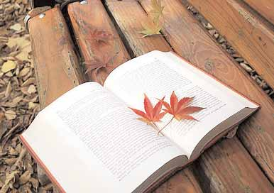

# LỜI TÁC GIẢ DALE CARNEGIE: “ĐẮC NHÂN TÂM” RA ĐỜI NHƯ THẾ NÀO?

## LỜI TÁC GIẢ DALE CARNEGIE

“ĐẮC NHÂN TÂM” RA ĐỜI NHƯ THẾ NÀO?

Trong 35 năm đầu thế kỷ hai mươi, các nhà xuất bản ở Mỹ đã in trên 200.000 đầu sách khác nhau. Hầu hết chúng đều nhàm chán và thất bại về doanh thu. Giám đốc một trong những nhà xuất bản lớn nhất trên thế giới cho tôi biết rằng dù nhà xuất bản của ông đã có bảy mươi lăm năm kinh nghiệm song vẫn thất bại 7 trên 8 đầu sách đã in trong năm.

Như vậy, tại sao tôi vẫn quyết tâm viết cuốn sách này và sau khi hoàn tất, tôi còn tâm đắc đọc đi đọc lại rất nhiều lần?

Từ năm 1912, tôi giảng dạy nghệ thuật kinh doanh ở New York. Ban đầu, với kinh nghiệm thực tế, tôi dạy học viên cách diễn thuyết trước công chúng. Sau đó, tôi nhận thấy các học viên cần được hướng dẫn cách diễn đạt hiệu quả, đặc biệt là nghệ thuật ứng xử với con người, trong kinh doanh cũng như giao tiếp xã hội hàng ngày. Tôi nghĩ rằng, chính bản thân tôi cũng cần tự nhìn lại mình. Suy nghiệm về thời gian đã qua, tôi tự nhận thấy bản thân đã có rất nhiều lần xử sự thiếu tế nhị. Nếu cách đây 20 năm mà được đọc một quyển sách dạy cách ứng xử tốt thì có lẽ tôi đã khác đi rất nhiều.

Cư xử sao cho đẹp lòng người nhưng không thiệt phần mình là cả một nghệ thuật. Điều đó đòi hỏi sự nhạy cảm, tinh tế trong giao tiếp hàng ngày, đặc biệt là trong quan hệ kinh doanh. Điều này đúng với tất cả mọi người thuộc mọi tầng lớp, giai cấp trong xã hội.

Theo một nghiên cứu được tiến hành dưới sự bảo trợ của Viện Carnegie thì ngay cả trong lĩnh vực kỹ thuật công nghệ, thành công về tài chính của một người thường chỉ có 15% là do khả năng chuyên môn, 85% còn lại tùy thuộc vào nhân cách, sự khéo léo, tế nhị trong giao tiếp và khả năng quản lý, lãnh đạo.

Trên 1.500 kỹ sư đã đến với các lớp học do tôi giảng dạy tại Câu lạc bộ các kỹ sư Philadelphia và Viện Kỹ thuật điện Hoa Kỳ. Lý do họ đến với lớp học này là vì họ nhận ra rằng những người được trả lương cao nhất trong ngành cơ khí không phải là những người thông thạo nhất về máy móc mà chính là những người có trình độ kỹ thuật kết hợp với khả năng giao tiếp thông minh và tinh tế, có khả năng lãnh đạo, biết khơi dậy lòng nhiệt tình và biết động viên mọi người một cách tốt nhất. Rockefeller cũng từng nói rằng: *“Nếu có thể mua được khả năng đối nhân xử thế thì tôi sẵn sàng dốc hết hầu bao của mình vì đây chính là điều quan trọng hơn bất cứ điều gì khác trên đời”.*

Cách đây khá lâu, trường Đại học Chicago và các trường của Hội Công giáo Mỹ đã tiến hành một cuộc thăm dò trong hai năm với 156 câu hỏi để tìm hiểu xem những người trưởng thành muốn học hỏi điều gì nhiều nhất. Trong danh sách đó có những câu như: Công việc và nghề nghiệp của bạn là gì? Mối quan tâm của bạn là gì? Thời giờ rảnh bạn làm gì? Thu nhập của bạn ra sao? Những sở thích, ước mơ của bạn? Những vấn đề khó khăn của bạn trong cuộc sống? Ngoài công việc, học tập, bạn quan tâm đến điều gì nhất?...

Kết quả cuộc thăm dò cho thấy mọi người quan tâm nhiều nhất đến sức khỏe, tiếp theo đó là cách ứng xử sao cho họ được người khác quý trọng, tin tưởng và nghe theo.

Với mong muốn huấn luyện, đào tạo những học viên ở Meriden một khóa học về nghệ thuật giao tiếp ứng xử, những giảng viên đã cố gắng tìm kiếm một vài quyển sách để có thể làm tài liệu giảng dạy nhưng thật ngạc nhiên là không hề có một quyển sách nào được viết về đề tài này cả.

Không thể tìm ở đâu ra một cuốn sách để làm giáo trình, thế là tôi bắt tay vào viết một quyển sách như vậy. Trước khi viết, tôi đã bỏ nhiều thời gian để lục tìm và tham khảo rất kỹ những vấn đề mình đang quan tâm trên các sách báo, tạp chí, những câu chuyện và hồ sơ ghi chép các vụ kiện tụng trong gia đình và xã hội, các tác phẩm kinh điển của những triết gia và những nhà tâm lý học nổi tiếng trên thế giới...

Thậm chí tôi còn thuê cả một nhà nghiên cứu chuyên nghiệp dành ra hơn một năm rưỡi trời để tìm đọc tất cả những gì có trong các thư viện mà tôi đã bỏ sót, đào bới trong những bài học về tâm lý, rà soát hàng trăm bài báo, tìm kiếm không biết bao nhiêu là tiểu sử với nỗ lực tìm hiểu cách mà các nhà lãnh đạo kiệt xuất của mọi thời đại đã đối xử với những người xung quanh họ như thế nào.

Bên cạnh đó, chúng tôi cũng đọc về gương thành công của nhiều nhân vật xuất chúng như Julius Caesar(1), Thomas Edison(2) ... Tôi còn nhớ, chỉ riêng Theodore Roosevelt, chúng tôi đã tìm đọc đến hơn 100 bài tư liệu về cuộc đời ông.

Cá nhân tôi đã trực tiếp phỏng vấn rất nhiều người thành công, trong đó có những nhân vật nổi tiếng thế giới thuộc nhiều lĩnh vực: nhà phát minh vĩ đại Marconi, Edison… nhà lãnh đạo chính trị xuất chúng như Franklin D. Roosevelt, James Farley, nhà kinh doanh tài năng Owen D. Young, ngôi sao màn bạc Clark Gable, Mary Pickford, nhà thám hiểm Martin Johnson... để cố tìm ra những bí quyết thành công mà họ đã ứng dụng trong cách đối nhân xử thế.

Từ tất cả những tài liệu thu thập được, tôi đã chuẩn bị một bài viết ngắn có tên là *“Đắc nhân tâm – Nghệ thuật đối nhân xử thế và thu phục lòng người”*. Bài viết này chỉ “ngắn” ở giai đoạn đầu nhưng không lâu sau đó được phát triển thành một bài giảng kéo dài trong vòng một tiếng rưỡi đồng hồ.

Khi kết thúc bài giảng, tôi đề nghị các học viên thể nghiệm những kinh nghiệm, những nguyên tắc mà họ đã học vào trong công việc và cuộc sống của họ và khi quay trở lại lớp trong buổi học sau, mỗi học viên sẽ trình bày những trải nghiệm và kết quả mà họ đạt được. Tôi đã thật sự bất ngờ, thú vị và đồng cảm với những câu chuyện xúc động và những điều bổ ích mà các học viên kể lại.

Đây không phải là một quyển sách bình thường nằm lặng yên trên giá. Nó trưởng thành theo thời gian như sự phát triển của một đứa trẻ. Nó “lớn lên và phát triển” vượt ra khỏi những kinh nghiệm của hàng triệu người qua các thời đại đầy biến động của rất nhiều nền văn hóa khác nhau.

Lúc khởi đầu cách đây nhiều năm, chúng tôi đã in những nguyên tắc ứng xử đó trên một tấm thẻ bằng kích cỡ tấm bưu thiếp. Một năm sau, chúng tôi phải in trên một bưu thiếp lớn hơn, sau đó là một tờ giấy khổ lớn… Dần dần những nguyên tắc đó cứ tăng lên và được in thành một loạt những quyển sổ tay nhỏ. Sau 15 năm nghiên cứu và trải nghiệm, quyển sách này chính thức được hoàn thiện và ra đời.

Những điều được trình bày trong quyển sách này không chỉ đơn thuần là những lý thuyết hay những lý luận cảm tính, chủ quan. Những kinh nghiệm này thật sự có một phép lạ và từng làm thay đổi cuộc đời của rất nhiều người đã ứng dụng nó.

Trong lớp học của tôi có một vị giám đốc quản lý 314 nhân viên. Trước đây, ông thường xuyên ép buộc, chỉ trích và trách mắng nhân viên của mình. Hầu như chẳng bao giờ ông có được thái độ dịu dàng, những lời động viên, khuyến khích nhân viên. Nhưng ngay sau khi nghiên cứu những nguyên tắc được đề cập trong quyển sách, ông đã thay đổi hoàn toàn triết lý sống của mình. Mọi nhân viên trong công ty ông như được thổi một luồng sinh khí mới, làm việc với một sự trung thành cao độ, lòng nhiệt tình hăng hái và một tinh thần đồng đội mạnh mẽ – điều mà trước đây chưa hề có. Điều tuyệt vời nhất là ông đã biến 314 con người mà ông từng xem như những kẻ chống đối trở thành 314 người bạn thật sự của mình. Ông tự hào kể lại: *“Trước đây mỗi lần đến công ty, tôi chẳng hề được ai chào đón. Các nhân viên thường nhìn về phía khác khi thấy tôi đến gần. Nhưng bây giờ tất cả thực sự đều là bạn tôi, ngay cả người bảo vệ gác cổng cũng chào tôi một cách rất thân mật”.*

Người quản lý này đã đạt được nhiều thành công hơn, nhiều niềm vui hơn – và quan trọng hơn cả là ông đã tìm thấy được hạnh phúc trong công việc và cuộc sống.

Cũng nhờ ứng dụng hiệu quả những nguyên tắc trong quyển sách mà rất nhiều nhân viên kinh doanh đã tăng đáng kể doanh số của mình. Nhiều người phát triển thêm được những khách hàng mới – những khách hàng mà trước đó họ hoàn toàn vô vọng trong việc xây dựng mối quan hệ. Các lãnh đạo cấp cao thì được thăng chức, tăng lương. Những buổi học về nghệ thuật ứng xử không những đã thay đổi được nhiều người bảo thủ, có định kiến hay chống đối, những người thiếu hòa đồng thoát khỏi nguy cơ bị sa thải mà còn giúp họ nhận được lòng tin và được giao phó những trọng trách cao hơn. Những cách ứng xử này không những giúp hàn gắn lại những rạn nứt trong các mối quan hệ xã hội, công việc mà còn tạo nên những tình cảm tốt đẹp, làm thăng hoa hạnh phúc gia đình.

Hầu hết các học viên đều rất kinh ngạc về những kết quả tựa như phép màu mà họ đã đạt được. Nhiều học viên đã điện thoại đến nhà tôi cả vào ngày chủ nhật vì không thể chờ đến 48 tiếng đồng hồ nữa để chia sẻ những trải nghiệm mà họ vừa khám phá được.

Một học viên quá xúc động trước một bài tham luận đến mức ngồi lại thảo luận với các học viên khác đến tận 3 giờ sáng mới ra về. Anh ta quá phấn khích và hồi hộp trước những nhìn nhận về lỗi lầm của bản thân và trước những cảm nhận cuộc sống có thêm nhiều ý nghĩa, thế giới đầy những điều mới mẻ, đầy những cảm hứng đang chờ đợi mình đến nỗi anh thao thức, không thể ngủ được trong nhiều đêm liền.

Giáo sư nổi tiếng William James của trường Đại học Harvard nói rằng: *“So với tất cả những gì chúng ta đã hành xử, chúng ta chỉ mới “tỉnh ngộ” có nửa phần mà thôi. Chúng ta mới chỉ sử dụng một phần nhỏ những khả năng thể chất và tinh thần vốn có. Con người thường dễ thỏa hiệp, bằng lòng với chính mình và sống trong các giới hạn tự đặt ra mà chúng cách rất xa so với khả năng thật sự của mình. Rất nhiều khả năng lớn lao đã không được dùng đến!”* Và, mục đích duy nhất của quyển sách này là giúp các bạn phát hiện, phát triển và tận dụng những tiềm năng đang còn ngủ yên, chưa được khai thác trong chính con người bạn! Theo tiến sĩ John G. Hibben, nguyên Hiệu trưởng Đại học Princeton: *“Thước đo sự giáo dục của một con người chính là khả năng ứng xử của anh ta trước những tình huống của cuộc sống”.*

Nếu như bạn đọc xong ba chương đầu của quyển sách mà vẫn chưa cảm thấy mình tiếp nhận được những kiến thức và kinh nghiệm tốt hơn để ứng dụng vào những tình huống thực tế cuộc sống của bạn thì tôi xem đó là một thất bại hoàn toàn. Và, như vậy, quyển sách này không còn cần thiết cho bạn nữa. Bởi vì “mục đích tối thượng của giáo dục”, như Herbert Spencer nói, “không phải là kiến thức - mà là hành động”.

Và - đây chính là một quyển sách của hành động!

DALE CARNEGIE1936

---

### Chú thích

- (1) Julius Caesar (100 – 44 Tr.CN): Hoàng đế La Mã cổ đại.(2) Thomas Edison (1847 – 1931): Nhà phát minh vĩ đại người Mỹ.
