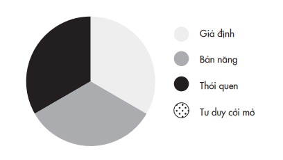

# Mở Đầu

---

Sau một chuyến bay dằn xóc, mười lăm người đàn ông nhảy xuống từ máy bay trên bầu trời Montana. Nhưng họ không phải là những vận động viên nhảy dù. Họ là đội lính cứu hỏa trên không: những người tinh nhuệ phụ trách vùng hoang địa này đến để dập tắt một vụ cháy rừng bùng lên do sét đánh vào hôm trước. Họ không biết rằng chỉ trong vòng vài phút tới, họ sẽ phải chạy đua với số phận.

Đội lính cứu hỏa đáp xuống gần đỉnh Mann Gulch vào cuối buổi chiều tháng Tám nắng như thiêu của năm 1949. Vì đám cháy đã lan ra khắp khe núi, họ phải tiến theo triền dốc hướng về phía bờ sông Missouri. Kế hoạch của đội là đào một hào đất bao quanh đám cháy để cô lập và chuyển hướng nó về nơi không có nhiều thứ có thể bắt lửa.

Sau khi di chuyển được khoảng 400 mét, đội trưởng Wagner Dodge phát hiện đám cháy đã bùng lên khắp thung lũng và đang tiến thẳng về phía họ. Ngọn lửa đã vươn cao hơn mười mét. Chẳng bao lâu, đám cháy sẽ lan với tốc độ đủ đến thiêu rụi mọi thứ trong phạm vi chiều dài hai sân vận động chỉ với một phút đồng hồ.

Năm giờ bốn mươi lăm phút chiều. Tình hình cho thấy việc đào hào bao quanh đám cháy đã không còn là một giải pháp đáng cân nhắc. Nhận ra đó là lúc phải chuyển từ trạng thái chiến sang chạy, Dodge ngay lập tức chỉ đạo toàn đội chạy ngược trở lên triền dốc. Đội lính cứu hỏa giờ đây phải dồn hết sức lực để leo lên dốc núi dựng đứng, băng qua đám cỏ cao ngang đầu gối mọc trên địa thế gập ghềnh. Trong tám phút, họ đi được gần 500 mét, chỉ còn cách đỉnh núi chưa đầy 200 mét nữa.

Trong tình huống đích đến an toàn đã ở ngay trước mặt nhưng ngọn lửa đang đuổi sát theo sau, Dodge đã có một hành động khiến cả đội bàng hoàng. Thay vì cố chạy thoát thân trước khi lửa bắt kịp, anh dừng lại và khum người xuống. Anh rút ra một hộp diêm, quẹt hết các que diêm và ném chúng vào đám cỏ trước mặt. “Chúng tôi nghĩ anh ấy hẳn là mất trí rồi”, một thành viên sống sót của đội sau này nhớ lại. “Ngọn lửa sắp táp vào lưng chúng tôi rồi, đội trưởng điên hay sao mà gây thêm một đám cháy khác như thế?”. Anh ta còn nghĩ bụng: Gã Dodge khốn kiếp này muốn thiêu sống tôi đây mà. Tất nhiên là chẳng một ai trong đội nghe theo Dodge khi anh ra sức hò hét, vẫy tay gọi mọi người đến chỗ anh: “Nhanh lên! Theo lối này này!”.

Điều mà các thành viên đội cứu hỏa trên không không nhận ra là Dodge đã vạch ra một chiến lược sinh tồn: anh đã tạo ra một lối thoát hiểm bằng lửa. Bằng cách đốt cháy trụi đám cỏ trước mặt, anh đã dọn sạch nguồn bắt lửa của đám cháy phía sau. Kế đến, Dodge thấm ướt chiếc khăn tay bằng nước từ bình nước cá nhân, dùng chiếc khăn ướt che miệng, rồi anh nằm úp mặt xuống ở chỗ đất đã cháy rụi cỏ trong mười lăm phút tiếp theo. Khi lửa từ đám cháy rừng đuổi tới nơi và cháy phừng phực phía trên đầu Dodge, anh vẫn không bị ngợp nhờ sát mặt đất có đủ ô-xy.

Bi kịch là mười hai thành viên đội cứu hỏa trên không đã tử nạn. Người ta tìm thấy chiếc đồng hồ bỏ túi của một trong các nạn nhân, kim đồng hồ chỉ năm giờ năm mươi sáu phút chiều trước khi nó bị nung chảy.

Vì sao chỉ có ba người lính cứu hỏa sống sót? Thể lực có thể là một yếu tố quyết định, vì hai thành viên sống sót đã chạy nhanh hơn lửa, kịp leo đến đỉnh đồi nên thoát chết. Nhưng trong trường hợp của Dodge thì chính sự tráng kiện của trí óc đã cứu sống anh.

---

Khi nói đến những điều kiện để có một trí óc minh mẫn, người ta thường nghĩ ngay đến trí thông minh. Càng thông minh, bạn càng giải quyết được các vấn đề phức tạp hơn – và thời gian bạn giải quyết cũng nhanh hơn. Trí thông minh vốn được nhìn nhận như là khả năng tư duy và học hỏi. Nhưng trong một thế giới đầy biến động, con người cần có một bộ kỹ năng nhận thức khác quan trọng hơn nhiều: đó là khả năng tái tư duy¹ và quên đi những điều đã học.

> **Chú thích:**¹ “Tái tư duy” về một điều gì đó (tiếng Anh: rethink hay think again) có nghĩa là suy nghĩ lại, cân nhắc hay nhìn nhận lại một quan điểm, niềm tin hay định kiến của bản thân, trong một số trường hợp cũng có thể hiểu là thử suy nghĩ khác đi hay ra khỏi lối mòn suy nghĩ. Nhằm giúp bạn đọc dễ nắm bắt những nội dung tác giả muốn truyền đạt, chúng tôi thống nhất dịch là “tái tư duy”. (Các ghi chú chân trang trong sách là của tác giả (TG), người dịch (ND), hoặc biên tập viên.)

Thử hình dung bạn vừa làm xong một bài kiểm tra trắc nghiệm, và bạn bắt đầu đắn đo về một trong các đáp án của mình. Bạn vẫn còn thời gian – vậy bạn sẽ giữ nguyên câu trả lời theo trực giác ban đầu hay thay đổi lựa chọn?

Khoảng ba phần tư sinh viên khi được hỏi tin rằng thay đổi lựa chọn ban đầu thường khiến họ bị điểm thấp hơn. Kaplan, một công ty luyện thi hàng đầu, từng cảnh báo sinh viên “hãy cân nhắc thật kỹ trước khi quyết định thay đổi một đáp án đã chọn. Kinh nghiệm cho thấy nhiều sinh viên chọn đổi câu trả lời đều đổi thành câu trả lời sai”.

Mặc dù hết sức tôn trọng những đúc kết từ kinh nghiệm, tôi vẫn tin vào chứng cứ rõ ràng hơn. Một nhóm ba nhà tâm lý học đã tiến hành phân tích một cách toàn diện kết quả của ba mươi ba nghiên cứu và khám phá ra rằng: trong mọi trường hợp, đa số các lần thay đổi đáp án đều dẫn đến câu trả lời đúng. Hiện tượng này được gọi là ảo tưởng về trực giác ban đầu.

Trong một buổi thực nghiệm, các nhà tâm lý học đã đếm số câu trả lời được sửa lại dựa trên vết tẩy trong bài kiểm tra của hơn 1.500 sinh viên ở bang Illinois (Hoa Kỳ). Chỉ một phần tư số đáp án thay đổi là từ đúng sang sai, trong khi một nửa số lựa chọn thay đổi là từ sai sang đúng. Bản thân tôi cũng chứng kiến điều này trong suốt những năm đi dạy: các bài kiểm tra cuối kỳ của sinh viên trong lớp tôi rất ít vết tẩy xóa để sửa đáp án, nhưng những sinh viên xem xét lại câu trả lời thay vì giữ nguyên lựa chọn ban đầu rốt cuộc lại đạt điểm cao hơn.

Tất nhiên, có thể câu trả lời sau chưa chắc chính xác hơn câu trả lời đầu, nó chỉ chính xác hơn bởi vì sinh viên rất ngại sửa đổi, nên một khi quyết định thay đổi câu trả lời thì thường là vì họ đã chắc chắn. Nhưng những nghiên cứu gần đây đã đưa ra một cách lý giải khác: mấu chốt cải thiện điểm số không nằm ở việc thay đổi câu trả lời mà nằm ở việc bạn cân nhắc liệu mình có nên xem lại và thay đổi suy nghĩ không.

Chúng ta không chỉ lưỡng lự trong việc xem lại bài làm của mình. Chỉ riêng ý tưởng phải suy nghĩ lại đã khiến chúng ta ngại ngần. Trong một thực nghiệm khác, hàng trăm sinh viên đại học được chọn tham gia ngẫu nhiên để tìm hiểu về ảo tưởng trực giác ban đầu. Trước tiên, một diễn giả truyền đạt cho họ giá trị của việc thay đổi suy nghĩ và đưa ra lời khuyên trong trường hợp nào thì làm như vậy là hợp lý. Nhưng trong hai bài kiểm tra mà họ làm sau đó, phần lớn các sinh viên vẫn không cân nhắc lại câu trả lời của mình.

Một phần lý do nằm ở sự lười biếng trong tư duy. Một số nhà tâm lý học chỉ ra rằng con người là những “kẻ hà tiện” tư duy: chúng ta thường chọn sự nhàn hạ của việc giữ nguyên những nhận thức cũ thay vì vật lộn với những cái mới. Tuy nhiên, còn có những lý do mạnh mẽ hơn tiềm ẩn sau sự kháng cự của chúng ta với việc suy nghĩ lại. Việc chất vấn lại bản thân khiến chúng ta cảm thấy thế giới trở nên bất định. Nó đòi hỏi chúng ta phải thừa nhận rằng nhiều điều chúng ta vẫn tin là đúng có thể đã thay đổi, rằng những gì từng đúng trước đây giờ có thể đã trở thành sai. Việc cân nhắc lại những điều mình tin tưởng sâu sắc có thể đe dọa căn tính của chúng ta, như thể ta có thể đánh mất một phần con người mình.

Tái tư duy không phải luôn là một trận chiến với mọi khía cạnh của cuộc sống. Nói đến của cải, chúng ta luôn sẵn lòng cập nhật cái mới với tất cả sự hồ hởi. Chúng ta hào hứng làm mới cả tủ quần áo khi chúng không còn hợp mốt và hăng hái tân trang toàn bộ đồ nhà bếp khi thấy chúng lỗi thời. Nhưng với những vấn đề liên quan đến hiểu biết, quan điểm hay suy nghĩ, chúng ta khư khư giữ lấy lập trường của mình. Các nhà tâm lý gọi hiện tượng này là mắc kẹt và đóng băng². Chúng ta ưa thích sự thoải mái của niềm tin chắc chắn hơn sự khó chịu của hoài nghi, và chúng ta để mặc những niềm tin của mình trở nên già cỗi. Chúng ta chế nhạo những người hiện vẫn dùng Windows 95, trong khi chính ta vẫn trung thành với những quan điểm được định hình cùng năm hệ điều hành đó ra đời. Chúng ta chọn nghe những quan điểm mình muốn nghe, thay vì những ý tưởng bắt chúng ta phải động não. ² Tiếng Anh: seizing and freezing, tạm dịch: mắc kẹt và đóng băng, là khái niệm được đưa ra bởi hai nhà tâm lý học Kruglanski, A. W., & Webster, D. M. vào năm 1996 để chỉ sự đóng lại hay sự khó lay chuyển về mặt nhận thức, do định kiến, niềm tin sẵn có hoặc xu hướng chung của xã hội, nên tâm trí từ chối tiếp nhận những tri thức khác biệt với niềm tin ban đầu.

Có thể bạn đã từng nghe về thí nghiệm “con ếch luộc”: Nếu bạn thả một con ếch vào một nồi nước đang sôi, nó sẽ lập tức nhảy ra khỏi nồi. Nhưng nếu bạn thả nó vào một nồi nước âm ấm, rồi từ từ tăng dần nhiệt độ lên, con ếch sẽ chết. Con ếch chết vì nó thiếu khả năng nhìn nhận lại tình huống, và không nhận ra được mối nguy cho tới khi quá muộn.

Gần đây, tôi đã thực hiện một nghiên cứu về câu chuyện nổi tiếng này và kết quả thật bất ngờ: thực tế không đúng như vậy.

Khi bị ném vào một nồi nước đang sôi, con ếch sẽ bị phỏng nặng và nó có thể nhảy được ra khỏi nồi nhưng cũng có thể không. Thực tế, con ếch có cơ hội thoát chết cao hơn nếu nước trong nồi nóng lên từ từ, vì nó sẽ nhảy ra ngoài ngay khi nước trong nồi nóng đến mức nó không chịu được nữa.

Vậy hóa ra, đối tượng không có khả năng nhận định lại tình hình không phải là con ếch, mà chính là chúng ta. Một khi đã nghe câu chuyện và chấp nhận nó là đúng, chúng ta hiếm khi chất vấn độ tin cậy của nó.

---

Khi đám cháy rừng ở mann gulch đuổi sát nút, những người lính cứu hỏa buộc phải đưa ra quyết định. Trong thế giới lý tưởng, họ sẽ có đủ thời gian để dừng lại, phân tích tình hình, và cân nhắc các lựa chọn. Nhưng với ngọn lửa đang cháy bùng dữ dội sau lưng chỉ còn cách đó chưa đầy 100 mét, việc ngừng lại suy nghĩ là không thể. “Trong biển lửa không có thời gian và bóng râm để người chỉ huy và các thành viên trong đội ngồi xuống đối thoại suông về biến cố”. Norman Maclean, một học giả và là cựu lính cứu hỏa, đã bình luận như thế trong cuốn biên khảo đoạt giải của ông về thảm kịch trên, cuốn Young Men and Fire (tạm dịch: Những người lính trẻ và đám cháy rừng). “Nếu Socrates³ là đội trưởng đội lính cứu hỏa trong thảm họa cháy rừng Mann Gulch, ông ấy và cả đội chắc hẳn đã bị biến thành tro trong lúc ngồi lại cân nhắc xem phải làm gì.”

>**Chú thích:**³ Triết gia người Hy Lạp cổ đại.

Dodge không thoát chết nhờ suy nghĩ chậm rãi, thấu đáo. Ông sống sót nhờ khả năng nhận định lại tình huống nhanh hơn người khác. Mười hai đồng đội của ông đã trả giá quá đắt bởi vì họ không hiểu được cách xử lý của Dodge. Họ cũng không suy xét lại các giả định của mình kịp lúc.

Trong tình huống căng thẳng cực độ, con người thường quay về cơ chế phản ứng tự động, theo những gì đã ăn sâu trong đầu. Đó là sự thích nghi để tiến hóa – miễn là bạn vẫn ở trong cùng một điều kiện môi trường mà những phản ứng đó từng hiệu quả. Là lính cứu hỏa, phản xạ đã ăn sâu trong trí bạn là tìm mọi cách để dập lửa chứ không phải châm thêm một ngọn lửa khác. Nếu bạn ở trong tình huống phải thoát khỏi đám cháy để giữ mạng, cách phản ứng bạn đã học là chạy càng xa càng tốt khỏi đám cháy chứ không phải chạy về phía nó. Trong các tình huống thông thường, những bản năng kia có thể sẽ cứu sống bạn. Dodge sống sót trong thảm kịch Mann Gulch bởi vì ông đã nhanh chóng gạt bỏ cả hai kiểu phản xạ trên.

Dodge chưa từng được ai dạy cách đốt lửa để mở đường thoát. Ông thậm chí cũng chưa từng nghe đến khái niệm này trước đó; nó thuần túy là sự ứng biến của ông. Sau này, hai thành viên sống sót đã làm chứng trước tòa, khẳng định rằng không có bất cứ kỹ thuật nào tương tự việc tạo đám lửa để mở đường thoát từng được dạy trong chương trình huấn luyện lính cứu hỏa. Nhiều chuyên gia dành cả đời nghiên cứu các nạn cháy rừng cũng không biết rằng có thể thoát chết bằng cách đốt lửa để tạo một khoảng không an toàn xuyên qua lửa.

Khi tôi chia sẻ với mọi người về câu chuyện thoát hiểm của Dodge, mọi người đều kinh ngạc về khả năng ứng biến của Dodge trong tình huống đầy áp lực. “Thật tài tình!”, họ nói. Sự ngạc nhiên, thán phục nhanh chóng trở thành nỗi ngậm ngùi khi họ kết luận rằng những khoảnh khắc xuất thần ấy hoàn toàn ngoài khả năng của người thường. “Đến những bài toán lớp bốn của con mình còn khiến tôi phải loay hoay”. Song, hầu hết những hành vi tái tư duy đều không đòi hỏi bất cứ kỹ năng hay tố chất đặc biệt nào cả.

Trở lại vụ cháy rừng Mann Gulch, vài phút trước khi tình huống trở nên nguy kịch, những người lính cứu hỏa còn bỏ lỡ một cơ hội tái tư duy khác – mà cơ hội đó lại ở ngay trong tầm tay. Trước khi Dodge bắt đầu ném các que diêm ra bãi cỏ, ông đã chỉ đạo cả đội vứt bỏ lại các thiết bị nặng mà họ mang theo. Họ đã trải qua tám phút dồn hết sức để leo lên triền dốc trong khi vẫn mang vác những dụng cụ chữa cháy như búa, cưa, xẻng và cả túi hành trang nặng hơn chín ký lô.

Nếu bạn đang phải chạy hết sức để giữ mạng mình, dường như việc hiển nhiên bạn cần làm đầu tiên là phải bỏ lại mọi thứ khiến bạn chậm lại. Tuy nhiên với lính cứu hỏa, các trang bị này là những vật bất ly thân để làm nhiệm vụ. Luôn mang bên mình và bảo quản đồ nghề cẩn thận là điều họ đã thuộc nằm lòng qua chương trình huấn luyện và qua kinh nghiệm làm việc. Vì vậy, chỉ tới khi Dodge ra lệnh thì hầu hết các đội viên mới vứt bỏ trang bị của họ, nhưng ngay cả khi đó, vẫn có một người cầm theo cái xẻng cho đến khi một đồng đội giằng nó ra khỏi tay anh ta. Nếu đội lính cứu hỏa bỏ lại các trang bị sớm hơn, biết đâu họ đã thoát nạn?

Chúng ta chẳng bao giờ biết chắc điều đó, nhưng Mann Gulch không phải là trường hợp cá biệt. Chỉ tính riêng từ năm 1990 đến năm 1995 đã có tổng cộng hai mươi ba lính cứu hỏa trên không tử nạn khi cố hết sức chạy lên dốc núi để thoát khỏi đám cháy, trong khi nếu bỏ lại những trang bị trên người họ có thể đã thoát chết. Vào năm 1994, tại khu vực núi Storm King ở bang Colorado, gió lớn đã khiến lửa bùng cháy khắp khe núi. Mười bốn lính cứu hỏa trên không, trong đó có bốn người là nữ, đã thiệt mạng khi cố hết sức chạy ngược dốc trên một vách núi đá gập ghềnh để thoát khỏi đám cháy đuổi sát phía sau, dù họ chỉ còn cách nơi an toàn chưa đầy bảy mươi mét.

Sau đó, các nhà điều tra đã tính toán rằng nếu không mang theo trang bị và ba lô, đội lính cứu hỏa có thể đã di chuyển nhanh hơn từ mười lăm đến hai mươi phần trăm. “Hầu hết đã có thể sống sót nếu họ đơn giản là bỏ lại đồ nghề và chạy thoát thân”, một chuyên gia đã nhận định như thế. Báo cáo của Cục Kiểm lâm Hoa Kỳ cũng đồng tình: “Nếu những người lính cứu hỏa bỏ hết trang bị và hành lý, họ đã có thể đến được đỉnh đồi an toàn trước khi ngọn lửa bắt kịp”.

Có thể giả định rằng ban đầu đội lính cứu hỏa chạy theo quán tính và không ý thức được mình vẫn đang mang vác vô số đồ nghề và hành lý. “Khi còn cách đỉnh đồi chưa đầy 300 mét”, một người sống sót sau thảm họa cháy rừng tường thuật lại, “tôi chợt nhận ra mình vẫn còn đeo cái cưa trên vai!”. Ngay cả sau khi sáng suốt quyết định bỏ lại cái cưa máy nặng hơn mười một ký lô, người này vẫn lãng phí một khoảng thời gian quý báu: “Tôi vô thức nhìn quanh xem có chỗ nào có thể bỏ lại chiếc cưa mà nó không bắt lửa không… Tôi nhớ lúc ấy mình đã nghĩ: ‘Không thể tin nổi mình đang bỏ lại cái cưa của mình’”. Một trong số nạn nhân khi được tìm thấy vẫn còn nguyên ba lô trên người và tay vẫn còn nắm chặt quai của chiếc cưa máy. Tại sao có quá nhiều lính cứu hỏa khư khư giữ lấy đồ nghề của mình, ngay cả khi việc vứt bỏ chúng có thể cứu mạng họ?

Nếu bạn là lính cứu hỏa, việc vứt bỏ đồ nghề không chỉ đòi hỏi bạn phải xóa bỏ thói quen và phớt lờ bản năng. Vứt bỏ đồ nghề có nghĩa là thừa nhận thất bại và đánh rơi một phần những thứ làm nên con người bạn. Điều này có nghĩa là bạn phải suy nghĩ lại mục tiêu của mình trong công việc, cũng như vai trò của bạn trong cuộc sống. “Không ai có thể dùng tay không để chữa cháy, họ chiến đấu bằng trang bị, đó là những thứ làm nên người lính cứu hỏa”, nhà tâm lý học tổ chức Karl Weick đã lý giải như vậy. “Các trang bị đó chính là lý do lực lượng lính cứu hỏa được triển khai ngay từ đầu… Việc vứt bỏ những đồ nghề đó kích hoạt một dạng ‘khủng hoảng hiện sinh’. Không có những công cụ đó, tôi là ai chứ?”.

Cháy rừng là sự kiện tương đối hiếm. Hầu hết sự sống của chúng ta không phụ thuộc và một quyết định tích tắc buộc ta phải xem những công cụ mang theo bên mình là thứ gây nguy hiểm, còn một đám cháy lại là lối thoát an toàn. Thế nhưng, những tình huống buộc chúng ta phải tái tư duy các giả định của mình lại phổ biến một cách đáng ngạc nhiên – thậm chí có thể phổ biến với tất cả mọi người.

Tất cả chúng ta đều phạm cùng kiểu sai lầm như những người lính cứu hỏa, chỉ là hậu quả không quá đỗi nghiêm trọng như thế và cũng vì vậy mà chúng ta phớt lờ chúng. Lối tư duy thường ngày đã trở thành những thói quen trì kéo chúng ta và chẳng ai buồn thắc mắc về những lối mòn tư duy đó cho tới khi quá muộn. Chúng ta tin mình vẫn an toàn mặc dù thắng xe kêu cọt kẹt, cho tới khi xe mất thắng trên xa lộ. Chúng ta mong giá thị trường chứng khoán vẫn tiếp tục tăng, kể cả khi giới phân tích đã cảnh báo bong bóng bất động sản sắp vỡ. Bạn vẫn tin cuộc hôn nhân sẽ bền vững dù người bạn đời đang ngày một xa cách. Bạn tự trấn an rằng công việc của mình vẫn được đảm bảo, ngay cả khi vài đồng nghiệp của bạn đã bị sa thải.

Quyển sách này bàn về giá trị của tái tư duy. Nó bàn về việc áp dụng kiểu tư duy linh hoạt đã cứu sống Wagner Dodge. Và nó còn kế thừa và nối tiếp điều mà Dodge chưa làm được: khuyến khích tinh thần tư duy linh hoạt này ở những người khác.

Có thể bạn không mang một cái rìu, cái xẻng bên mình, nhưng bạn có những công cụ về nhận thức mà bạn vẫn sử dụng đều đặn. Đó có thể là những điều bạn biết, giả định, phỏng đoán, hay những quan điểm cá nhân mà bạn khư khư giữ lấy. Một vài trong số đó còn chẳng liên quan đến công việc của bạn, – chúng liên quan đến ý thức về bản ngã của bạn.

### NHỮNG TRANG BỊ MÀ CHÚNG TA GIỮ KHƯ KHƯ

Thử xét đến một nhóm sinh viên cùng nhau xây dựng cái được gọi là mạng xã hội trực tuyến đầu tiên của trường Harvard. Trước khi vào đại học, họ đã kết nối được hơn một phần tám sinh viên năm nhất vào một “nhóm ảo” (“e-group”). Nhưng khi nhập học tại Cambridge, họ dẹp bỏ ý tưởng và “đóng cửa” mạng xã hội nói trên. Năm năm sau, Mark Zuckerberg sáng lập Facebook tại chính khuôn viên đại học mà nhóm sinh viên kia từng xây dựng mạng xã hội của mình.

Thỉnh thoảng, những sinh viên từng tham gia tạo ra mạng xã hội đầu tiên kia lại cảm thấy nhói lòng vì nuối tiếc. Tôi biết rõ việc này, vì tôi chính là một trong những người đồng sáng lập nhóm ấy.

Tôi cần nói rõ chỗ này: tôi đã chưa từng có được tầm nhìn về những gì Facebook sẽ trở thành. Dù vậy, tôi và bạn bè đã nhận ra một cách muộn màng rằng chúng tôi đã bỏ lỡ hàng loạt cơ hội tái tư duy về tiềm năng của nền tảng mà mình tạo ra. Suy nghĩ ban đầu của chúng tôi là dùng nhóm ảo này chỉ để kết giao với những người bạn mới cho cá nhân mình mà thôi. Chúng tôi đã không cân nhắc khả năng nó cũng có thể thu hút sinh viên các trường khác hay thế giới bên ngoài nhà trường. Thói quen đã thành cố hữu của chúng tôi là dùng công cụ trực tuyến chỉ để liên lạc với những người ở xa; nên khi vào đại học ở cùng một học khu, chỉ cách nhau vài bước chân, chúng tôi tin rằng nhóm ảo chẳng còn cần thiết nữa. Mặc dù một trong các thành viên nhóm theo ngành khoa học máy tính và một thành viên khác cũng đã khởi nghiệp thành công trong lĩnh vực công nghệ, nhưng chúng tôi vẫn có giả định sai lầm rằng mạng xã hội trực tuyến chỉ là trò vui nhất thời chứ không phải là một phần khổng lồ của tương lai internet. Vì không biết lập trình, tôi không có những công cụ để xây dựng nền tảng nào đó phức tạp hơn. Hơn nữa, thành lập công ty cũng không phải là một phần trong căn tính của tôi: khi ấy tôi nhận diện mình là một sinh viên năm nhất, không phải một nhà khởi nghiệp tiềm năng.

Kể từ đó, tái tư duy trở thành phần cốt lõi trong nhận thức về bản ngã của tôi. Là một nhà tâm lý học nhưng tôi không đi theo trường phái của Freud⁴, văn phòng tôi không có chiếc trường kỷ nào và tôi cũng không hành nghề trị liệu. Với tư cách một nhà tâm lý học tổ chức tại Đại học Wharton, tôi đã dành mười lăm năm qua cho việc nghiên cứu và giảng dạy phương pháp quản trị dựa trên chứng cứ⁵. Là người khởi nghiệp trong lĩnh vực kinh doanh dữ liệu và ý tưởng, tôi thường được mời làm cố vấn cho các tổ chức như Google, Pixar, NBA và Gates Foundation, giúp họ rà soát lại cách thiết kế công việc sao cho hiệu quả, cách thức xây dựng đội ngũ sáng tạo và định hình văn hóa hợp tác. Công việc của tôi là tái tư duy về cách chúng ta làm việc, lãnh đạo, và tổ chức cuộc sống – và hướng dẫn những người khác làm được điều tương tự.

>**Chú thích:**⁴ Sigmund Freud (1856 _ 1939): bác sĩ thần kinh và nhà tâm lý học người Áo, người đặt nền móng và phát triển học thuyết phân tâm học. (ND)

⁵ Quản trị dựa trên chứng cứ hay bằng chứng (viết tắt: EBMgt) là thuật ngữ bắt nguồn từ khái niệm “y học dựa trên chứng cứ” của David Sackett vào năm 1996. Sau đó, khái niệm này cũng được áp dụng trong quản lý để đề cập đến việc đưa ra quyết định nói chung, bằng cách dựa trên những chứng cứ rõ ràng và xác thực từ nhiều nguồn khác nhau.

Tôi cho rằng đây là thời điểm sống còn để áp dụng tái tư duy. Khi đại dịch corona bùng nổ, nhiều nhà lãnh đạo trên thế giới đã quá chậm trễ trong việc tái tư duy những niềm tin cố chấp của mình. Đầu tiên, họ tin rằng virus này sẽ không lây lan đến đất nước của họ; kế đến, họ cho rằng nó chẳng nguy hiểm hơn cúm mùa; và rồi họ tin rằng chỉ những người có triệu chứng rõ rệt mới có thể lan truyền vi rút. Cái giá phải trả là hai năm sau khi đại dịch bùng phát, con số tử vong trên thế giới vẫn chưa có dấu hiệu dừng lại.

Trong suốt thời gian qua, tính mềm dẻo của tâm trí chúng ta đã được đặt vào thử thách. Chúng ta bị buộc phải chất vấn những giả định mà lâu nay ta vẫn coi là hiển nhiên, rằng chúng ta chẳng cần lo lắng về an toàn khi đi đến bệnh viện, ăn ở nhà hàng và ôm người thân. Rằng các trận đấu thể thao luôn diễn ra và chúng ta lúc nào cũng có thể xem trực tiếp trên truyền hình; rằng hầu hết chúng ta chẳng bao giờ phải làm việc từ xa và con cái thì phải học tại nhà. Rằng chúng ta có thể mua giấy vệ sinh và nước rửa tay bất cứ khi nào cần đến.

Giữa đại dịch, liên tiếp những vụ liên quan đến hành vi bạo lực của cảnh sát đã khiến nhiều người phải xem xét lại quan điểm của mình về tình trạng bất công do phân biệt chủng tộc và vai trò của họ trong cuộc đấu tranh chống lại tình trạng này. Những cái chết vô lý của ba công dân da đen – George Floyd, Breonna Taylor và Ahmaud Arbery – đã khiến hàng triệu người da trắng sực tỉnh, rằng cũng như bất bình đẳng giới không chỉ là vấn đề của phụ nữ, kỳ thị chủng tộc không phải là vấn đề của riêng người da màu. Với những làn sóng biểu tình nổi lên ở khắp đất nước Hoa Kỳ, trên mọi mặt trận chính trị, chỉ trong vòng hai tuần, sự ủng hộ dành cho phong trào Black Lives Matter đã dâng cao tương đương mức mà phong trào này đạt được trong hai năm trước đó cộng lại. Rất nhiều người trước đây luôn không muốn hoặc không thể thừa nhận sự thật, giờ cũng nhanh chóng nhìn thấy thực tế phũ phàng rằng có cả một ý thức hệ kỳ thị chủng tộc vẫn đang tồn tại rộng khắp trên đất nước này. Nhiều người khác đã im lặng quá lâu, nay cảm thấy bản thân có trách nhiệm phải đấu tranh với nạn phân biệt chủng tộc và định kiến xã hội.

Bất chấp những điều tồi tệ cùng trải qua, chúng ta vẫn sống trong một thời kỳ phân hóa và chia rẽ ở mức độ ngày càng tăng. Đối với một số cá nhân, chỉ đơn giản nhắc đến việc quỳ gối trong lúc hát quốc ca⁶ thôi cũng đủ để đặt dấu chấm hết cho một tình bạn. Nhiều cuộc hôn nhân kết thúc chỉ vì một lá phiếu bầu cử. Những tư tưởng “hóa vôi” đang xé nát nền văn hóa Mỹ. Ngay cả văn bản pháp luật quan trọng nhất của chúng ta là Hiến pháp Mỹ vẫn cho phép sửa đổi. Sẽ ra sao nếu chúng ta nhạy bén hơn trong việc sửa đổi “hiến pháp tư duy” của chính mình?

>**Chú thích:** ⁶ Phong trào quỳ gối khi hát quốc ca của một số vận động viên Mỹ từ năm 2016 đến nay để phản đối nạn kỳ thị chủng tộc và cách hành xử bạo lực của cảnh sát. (ND)

Mục đích của quyển sách này là khám phá làm thế nào để việc tái tư duy có thể xảy ra. Tôi đã tìm kiếm những bằng chứng thuyết phục nhất và một số người giỏi tái tư duy nhất trên thế giới. Phần đầu tiên của quyển sách tập trung giúp bạn mở mang tâm trí của chính mình. Bạn sẽ khám phá được vì sao một doanh nhân có tư tưởng cấp tiến lại mắc kẹt trong quá khứ; tại sao một ứng viên công chức ít cơ hội đi đến bước xem hội chứng kẻ mạo danh là một lợi thế; một nhà khoa học từng đoạt giải Nobel cảm thấy vui khi phát hiện mình sai như thế nào; những chuyên gia dự đoán tài ba nhất thế giới vẫn cân nhắc việc thay đổi tầm nhìn của họ ra sao; và một nhà làm phim từng đoạt giải Oscar vẫn tiếp tục sáng tạo ra những màn đánh đấm tuyệt hay như thế nào.

Phần thứ hai đề cập đến những cách thức chúng ta có thể áp dụng để khuyến khích người khác tái tư duy. Bạn sẽ biết được cách mà một nhà vô địch hùng biện thế giới thắng một cuộc tranh luận và một nhạc sĩ da đen làm thế nào để thuyết phục những người da trắng theo chủ nghĩa thượng đẳng buông bỏ sự thù ghét. Bạn sẽ khám phá cách mà một hình thức lắng nghe đặc biệt đã giúp một bác sĩ khai thông tư tưởng của phụ huynh về vấn đề vắc-xin và giúp một nhà lập pháp thuyết phục thành công lãnh đạo phiến quân Uganda đồng ý ngồi vào bàn đàm phán hòa bình. Và nếu bạn là cổ động viên ruột của đội bóng chày Yankees, để xem liệu tôi có thể thuyết phục bạn chuyển sang ủng hộ đội Red Sox không nhé.

Phần thứ ba nói về việc làm thế nào chúng ta có thể tạo ra những cộng đồng học tập suốt đời. Trong đời sống xã hội, một phòng thí nghiệm chuyên nghiên cứu về các cuộc đối thoại khó khăn sẽ làm sáng tỏ cách thức giao tiếp hiệu quả về những vấn đề khó tìm được tiếng nói chung như nạo phá thai và biến đổi khí hậu. Với môi trường học đường, bạn khám phá cách các chuyên gia giáo dục dạy trẻ em tái tư duy thông qua việc biến lớp học thành một nơi giống như viện bảo tàng, làm quen với những dự án như “làm thợ mộc” hay viết lại sách giáo khoa. Ở phương diện công việc, bạn sẽ khám phá cách xây dựng văn hóa học tập cùng nữ phi hành gia gốc Tây Ban Nha đầu tiên, người đã giúp NASA ngăn ngừa các sự cố sau thảm họa tàu con thoi Columbia. Tôi kết lại phần này bằng suy ngẫm về tầm quan trọng của việc xem xét lại những kế hoạch mà chúng ta đã đề ra, cho dù đó là bản kế hoạch chu đáo nhất.

Đó là bài học mà những người lính cứu hỏa đã phải học bằng một cái giá quá đắt. Trong lúc vô cùng nguy cấp đó, việc Wagner Dodge đã đột nhiên sáng suốt vứt bỏ các món đồ trang bị nặng nề và tạo chỗ trú an toàn ngay trong đám lửa do chính ông tạo ra đã làm nên sự khác biệt giữa sự sống và cái chết. Nhưng nếu không phải vì một thất bại có tính hệ thống hơn, sâu sắc hơn, thì thậm chí còn chẳng cần đến sáng kiến xuất thần này của Dodge. Bi kịch lớn nhất của sự kiện Mann Gulch chính là mười hai người lính cứu hỏa trên không kia đã thiệt mạng vì một đám cháy mà lẽ ra họ chẳng cần phải chiến đấu ngay từ đầu.

Từ đầu những năm 1880, các nhà khoa học đã bắt đầu nhấn mạnh vai trò quan trọng của những đám cháy rừng đối với chu kỳ sống của rừng. Lửa loại bỏ các vật chất chết, tạo chất dinh dưỡng cho đất đai và dọn lối cho ánh nắng mặt trời. Nếu mọi trận cháy rừng đều được ngặn chặn, các khu rừng sẽ thành ra quá rậm rạp. Những bụi rậm, lá rụng và cành khô tích tụ lâu ngày sẽ trở thành nguồn nhiên liệu đốt cho những đám cháy lớn hơn bùng phát.

Tuy nhiên mãi đến tận năm 1978 Cục Kiểm lâm Hoa Kỳ mới bãi bỏ quy định mọi đám cháy được phát hiện đều phải được dập tắt chậm nhất trước mười giờ sáng ngày hôm sau. Vụ cháy rừng Mann Gulch xảy ra ở khu vực hoang vu, không có nguy cơ thiệt hại về người. Tuy nhiên, những người lính cứu hỏa trên không vẫn được điều động chỉ vì không một ai trong cộng đồng, tổ chức, hay bản thân họ dành thời gian chất vấn quy định không để các đám cháy rừng diễn ra tự nhiên.

Quyển sách này là lời kêu gọi loại bỏ những kiến thức và quan điểm không còn hữu ích với bạn và hướng đến việc giúp bạn xây dựng nhận thức về bản thân với tư duy linh hoạt thay vì tính cứng nhắc. Nếu bạn có thể làm chủ nghệ thuật tái tư duy, tôi dám chắc bạn sẽ thành công hơn trong công việc và hạnh phúc hơn trong cuộc sống. Tái tư duy có thể giúp bạn nảy ra những giải pháp mới cho các vấn đề cũ, đồng thời cải tạo lại các giải pháp cũ để áp dụng cho những vấn đề mới. Đây là hành trình để bạn học hỏi nhiều hơn từ những người xung quanh và sống với ít tiếc nuối hơn. Dấu hiệu cho thấy sự trưởng thành về trí tuệ là bạn biết đâu là thời điểm nên từ bỏ vài công cụ quý báu nhất của mình – và cả những phần đáng quý nhất trong căn tính của bạn.

## PHẦN I
