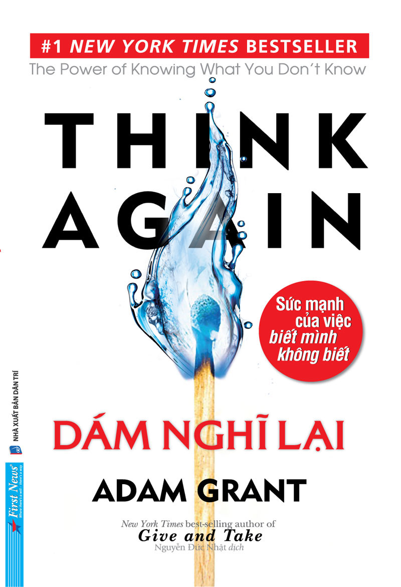

# DÁM NGHĨ LẠI
## Sức mạnh của việc biết mình không biết

---

# MỤC LỤC

- [Mở Đầu](00_Mo_Dau.md)
- **PHẦN I: TÁI TƯ DUY CÁ NHÂN **- [Chương 1: Nhà truyền giáo, công tố viên, chính trị gia và nhà khoa học bước vào tâm trí bạn](01_Chuong_01_Nha_Truyen_Giao_Cong_To_Vien_Chinh_Tri_Gia_Va_Nha_Khoa_Hoc.md)
 - [Chương 2: Thánh phán và kẻ mạo danh](02_Chuong_02_Thanh_Phan_Va_Ke_Mao_Danh.md)
 - [Chương 3: Niềm vui khi sai](03_Chuong_03_Niem_Vui_Khi_Sai.md)
 - [Chương 4: Đấu trường lành mạnh](04_Chuong_04_Dau_Truong_Lanh_Manh.md)
- **PHẦN II: TÁI TƯ DUY LIÊN CÁ NHÂN **- [Chương 5: Khiêu vũ cùng đối thủ](05_Chuong_05_Khieu_Vu_Cung_Doi_Thu.md)
 - [Chương 6: Ác cảm che mờ lý trí](06_Chuong_06_Ac_Cam_Che_Mo_Ly_Tri.md)
 - [Chương 7: Người tâm tình về vắc-xin và điều tra viên nhã nhặn](07_Chuong_07_Nguoi_Tam_Tinh_Ve_Vac-xin_Va_Dieu_Tra_Vien_Nha_Nhan.md)
- **PHẦN III: TÁI TƯ DUY TẬP THỂ **- [Chương 8: Những cuộc đối thoại gay cấn](08_Chuong_08_Nhung_Cuoc_Doi_Thoai_Gay_Can.md)
 - [Chương 9: Viết lại sách giáo khoa](09_Chuong_09_Viet_Lai_Sach_Giao_Khoa.md)
 - [Chương 10: Đây không phải cách chúng ta vẫn làm trước giờ](10_Chuong_10_Day_Khong_Phai_Cach_Chung_Ta_Van_Lam_Truoc_Gio.md)
- **PHẦN IV: KẾT LUẬN **- [Chương 11: Thoát khỏi tầm nhìn đường hầm](11_Chuong_11_Thoat_Khoi_Tam_Nhin_Duong_Ham.md)
- [Phần Kết: Những hành động tạo ảnh hưởng](12_Phan_Ket_Nhung_Hanh_Dong_Tao_Anh_Huong.md)
- [Lời Cảm Ơn](13_Loi_Cam_On.md)

---

# THÔNG TIN XUẤT BẢN

- **Original title:***THINK AGAIN - The Power of Knowing What You Don’t Know***- **Written by:**Adam Grant
- **Copyright:**© 2021 by Adam Grant
- **Vietnamese edition:**© 2022 by First News - Tri Viet Publishing Co., Ltd
- Published by arrangement with Adam Grant c/o Inkwell Management LLC
- All rights reserved.** Tác phẩm: **DÁM NGHĨ LẠI – Sức mạnh của việc biết mình không biết** Tác giả: **Adam Grant** Công ty First News – Trí Việt **giữ bản quyền xuất bản và phát hành ấn bản tiếng Việt trên toàn thế giới theo hợp đồng chuyển giao bản quyền với Adam Grant thông qua Inkwell Management LLC, Hoa Kỳ.

Bất cứ sự sao chép nào không được sự đồng ý của First News đều là bất hợp pháp và vi phạm Luật Xuất bản Việt Nam, Luật Bản quyền Quốc tế và Công ước Bảo hộ Bản quyền Sở hữu Trí tuệ Berne.** Biên tập viên First News: **Thoại Uyên – Cẩm Xuân 

Quý độc giả có nhu cầu liên hệ, vui lòng gửi email về: 
- Bản thảo và bản quyền: `rights@firstnews.com.vn` 
- Phát hành: `triviet@firstnews.com.vn` 

### CÔNG TY VĂN HÓA SÁNG TẠO TRÍ VIỆT – FIRST NEWS
- **Địa chỉ:** 11H Nguyễn Thị Minh Khai, P. Bến Nghé, Quận 1, TP. HCM
- Ngôi Nhà Hạt Giống Tâm Hồn, Đường Sách Nguyễn Văn Bình, Quận 1, TP. HCM
- **Tel:** (84.28) 38227979 – 38227980
- **Website:** www.firstnews.com.vn | www.hatgiongtamhon.vn
- **Facebook:**  facebook.com/firstnewsbooks | facebook.com/hatgiongtamhon
