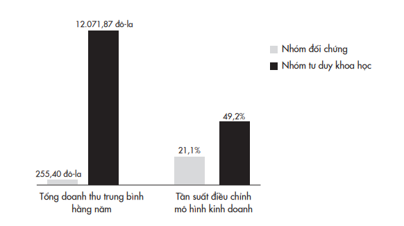
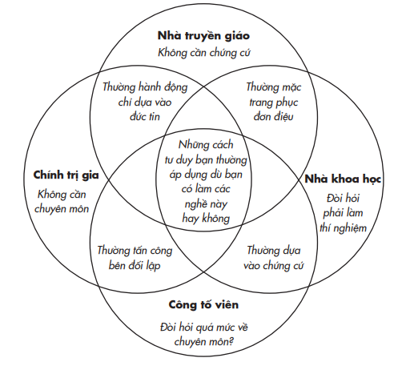
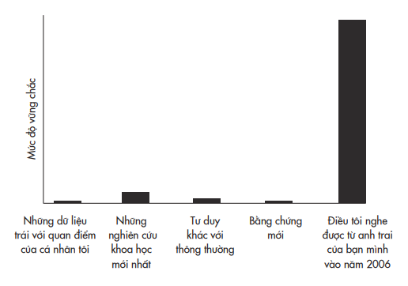
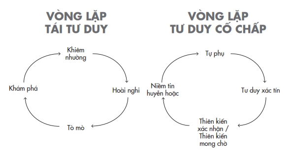
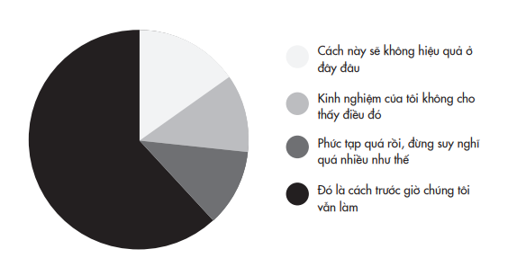

# PHẦN I: TÁI TƯ DUY CÁ NHÂN
*Cập nhật quan điểm của bản thân *---

# Chương 1: Nhà Truyền Giáo, Công Tố Viên, Chính Trị Gia Và Nhà Khoa Học Bước Vào Tâm Trí Bạn

---

Tái Tư Duy Cá Nhân* Cập nhật quan điểm của bản thân *Chương 1

## Nhà truyền giáo, công tố viên, chính trị gia và nhà khoa học bước vào tâm trí bạn

---

Không thể có sự tiến bộ nếu không có sự thay đổi;và những ai không thể thay đổi tư duy của mình sẽ không thay đổi được bất cứ thứ gì.

>* – George Bernard Shaw*

Có thể bạn không nhận ra cái tên này, nhưng Mike Lazaridis là người đã từng tạo ra ảnh hưởng rõ ràng đến cuộc sống của bạn. Ngay từ nhỏ, Mike đã là một thần đồng trong lĩnh vực điện tử. Vừa lên bốn cậu bé Mike đã tự ráp được một chiếc máy nghe nhạc chỉ từ các mảnh ghép Lego và dây cao su. Trong những năm Mike học trung học, mỗi khi thầy cô giáo nào có tivi bị hỏng ở nhà, họ đều nhờ Mike đến sửa giúp. Thời gian rảnh rỗi, ông lắp ráp máy tính hoặc thiết kế hệ thống chuông đèn tốt hơn cho các đội tuyển tham gia thi vấn đáp ở trường, nhờ đó mà ông kiếm đủ tiền để trang trải chi phí năm đầu đại học. Chỉ còn vài tháng trước khi tốt nghiệp và nhận bằng kỹ sư điện tử, Mike đã làm điều mà khá nhiều doanh nhân nổi tiếng vào thời của ông thường làm: bỏ ngang chương trình đại học. Đó là thời điểm người con trai của gia đình nhập cư này ghi dấu ấn của mình lên thế giới.

Thành công đầu tiên đến với Mike khi ông đăng ký bằng sáng chế thiết bị đọc mã vạch được dùng cho các bộ phim. Sáng chế này nhanh chóng được các nhà làm phim Hollywood sử dụng và giúp ông thắng giải Emmy và cả giải Oscar cho hạng mục phát kiến công nghệ. Thế nhưng thành tựu này chỉ là chuyện cỏn con khi so với phát kiến kế tiếp của Mike, đưa doanh nghiệp của ông trở thành công ty phát triển nhanh nhất toàn cầu. Thiết bị đầu bảng (flagship)⁷
của Mike khi vừa ra mắt đã nhanh chóng thu hút một lượng tín đồ đông đảo, với những khách hàng trung thành phủ khắp mọi giới từ Bill Gates cho tới Christina Aguilera. “Nó thật sự đã làm thay đổi cuộc sống của tôi”, Oprah Winfrey bày tỏ. “Tôi không thể sống thiếu nó.” Khi Tổng thống Obama đến Nhà Trắng để nhậm chức, ông từ chối giao thiết bị này của ông cho Cơ quan Mật vụ.

> **Chú thích:**⁷ Sản phẩm flagship của một hãng công nghệ, điện tử (điện thoại, laptop, tivi, máy giặt,...) chính là sản phẩm “đầu bảng”, tốt nhất của hãng, được trang bị các tính năng cùng phần cứng hiện đại bậc nhất.

Mike Lazaridis xây dựng ý tưởng cho BlackBerry là một thiết bị liên lạc không dây được dùng để gửi và nhận e-mail. Vào mùa hè năm 2009, nó chiếm gần phân nửa thị phần điện thoại thông minh ở Hoa Kỳ. Đến năm 2014, thị phần của nó tụt dốc chỉ còn dưới một phần trăm.

Khi một công ty lao xuống dốc không phanh như vậy, chúng ta chẳng thể nào quy kết sự sa sút của nó cho một nguyên nhân duy nhất, nên chúng ta thường khoác lên sự sa sút đó một nhân tính: BlackBerry đã không thể thích ứng với xu thế hiện nay. Nhưng thích ứng với môi trường luôn biến động không phải điều một công ty có thể làm _ nó là điều con người phải làm thông qua vô số những quyết định hằng ngày của họ. Trong vai trò người đồng sáng lập, chủ tịch và đồng giám đốc điều hành, Mike nắm toàn bộ quyền quyết định về kỹ thuật và sản phẩm đối với BlackBerry. Mặc dù khả năng tư duy của Mike đã kích hoạt cuộc cách mạng cho điện thoại thông minh, nhưng sự chật vật của ông với việc tái tư duy rốt cuộc lại đặt dấu chấm hết cho công ty ông thành lập và gần như xóa sổ chính phát minh của mình. Sai lầm của Mike bắt đầu từ đâu?

Hầu hết chúng ta đều tự hào về kiến thức và năng lực chuyên môn của mình, cũng như luôn kiên định với niềm tin và quan điểm của bản thân. Điều này vốn dĩ phù hợp trong một thế giới ổn định, nơi mà chúng ta gặt hái thành quả nhờ tin vào những ý tưởng của mình. Vấn đề ở chỗ chúng ta đang sống trong một thế giới thay đổi chóng mặt, buộc chúng ta phải dành nhiều thời gian cho việc tái tư duy tương đương với việc tư duy.

Tái tư duy, hay nghĩ lại, là một bộ kỹ năng và cũng là một lối tư duy. Chúng ta vốn đã sẵn nhiều công cụ tâm trí cần thiết. Điều chúng ta cần làm là nhớ để lôi chúng ra khỏi kho chứa và đánh bóng chúng.

## SUY NGHĨ LẠI

Nhờ có những tiến bộ về khả năng tiếp cận thông tin và công nghệ, tri thức nhân loại không chỉ tăng lên mà còn tăng theo cấp số nhân. Trong năm 2011, lượng thông tin bạn tiêu thụ mỗi ngày nhiều gấp năm lần so với cách đây một phần tư thế kỷ. Vào năm 1950, phải mất năm mươi năm lượng kiến thức y học trên thế giới mới tăng gấp đôi. Đến năm 1980, lượng kiến thức y học đã tăng gấp đôi sau mỗi bảy năm và tới thời điểm năm 2010, khoảng thời gian này thậm chí chỉ còn phân nửa. Tốc độ thay đổi ngày một tăng đồng nghĩa với việc chúng ta, hơn bao giờ hết, cần luôn ở trong tâm thế sẵn sàng chất vấn lại những niềm tin của bản thân.

Đây không phải là một nhiệm vụ dễ dàng. Khi chúng ta gắn bó với niềm tin của mình, chúng càng có xu hướng trở nên cực đoan và bảo thủ hơn. Tôi vẫn khổ sở với việc chấp nhận rằng Sao Diêm Vương không phải là một hành tinh. Trong giáo dục, mỗi khi một bí mật lịch sử được sáng tỏ hay có một phát minh đột phá trong khoa học, phải mất nhiều năm sau đó để chương trình học được cập nhật và sách giáo khoa được hiệu chỉnh. Các nhà nghiên cứu gần đây đã phát hiện ra rằng chúng ta cần phải suy xét lại những giả định từ trước đến nay vẫn được thế giới chấp nhận, về những chủ đề như gốc gác của nữ hoàng Cleopatra (cha bà là người Hy Lạp chứ không phải Ai Cập, còn danh tính mẹ của bà thì vẫn là ẩn số); hình dáng của khủng long (các nhà cổ sinh vật học hiện nay tin rằng một số loài khủng long ăn thịt có lông vũ nhiều màu sặc sỡ trên lưng); và yếu tố nào tạo ra thị giác (những người khiếm thị thực tế đã tự rèn luyện để có khả năng “nhìn thấy” – các sóng âm có thể kích hoạt phần vỏ não thị giác và tái dựng những hình ảnh trong trí nhớ, tương tự như khả năng định vị bằng tiếng vang giúp loài dơi di chuyển trong bóng đêm). Các đĩa nhạc xưa, xe cổ và đồng hồ cổ có thể là những món đồ sưu tập đáng giá, trong khi những thông tin lỗi thời lại là những mảng vôi hóa của tâm trí mà chúng ta tốt nhất nên bỏ đi.

Chúng ta thường rất nhanh nhạy nhận ra khi nào thì người khác nên nghĩ lại. Chẳng hạn chúng ta nghi ngờ ý kiến của bác sĩ chuyên khoa nên thường hỏi thêm một bác sĩ khác sau khi nhận kết quả chẩn đoán. Không may là đối với hiểu biết và quan điểm của chính mình, chúng ta lại thường nghe theo linh cảm thay vì tìm ra điều xác thực. Trong đời sống hằng ngày, chúng ta phải tự mình “chẩn đoán” rất nhiều thứ, từ việc chọn sử dụng dịch vụ của ai cho đến việc chọn người bạn đời. Chúng ta cần phát triển thói quen tự suy xét lại quyết định của chính mình.

Thử hình dung bạn có một người quen làm nghề tư vấn tài chính, và anh ấy khuyên bạn đầu tư vào một quỹ hưu trí nằm ngoài danh sách các quỹ phúc lợi mà công ty bạn đề xuất cho nhân viên. Một người bạn khác của bạn khá am hiểu về lĩnh vực đầu tư lại bảo rằng quỹ này rất rủi ro. Bạn sẽ làm gì?

Khi nhà tâm lý học Stephen Greenspan gặp phải tình huống này, ông đã quyết định cân nhắc nặng nhẹ giữa lời cảnh báo của người bạn đa nghi và những thông tin mà ông có thể tìm thấy. Chị của ông đã đầu tư vào quỹ này từ nhiều năm, và bà khá hài lòng với kết quả đạt được. Một số bạn bè của bà cũng vậy. Mặc dù lãi suất không phải là quá “khủng”, nhưng luôn duy trì đều đặn hai con số. Người bạn chuyên viên tư vấn tài chính nói trên cũng đầu tư tiền của chính mình vào quỹ, cho thấy anh ta thật sự tin tưởng quỹ này. Với những dữ kiện này trong tay, Greenspan quyết định dấn thân. Ông đầu tư một khoản khá đậm vào quỹ này, gần một phần ba khoản tiết kiệm mà ông dành dụm để nghỉ hưu. Chỉ ít lâu sau, ông nhận ra danh mục đầu tư của mình đã tăng đến hai mươi lăm phần trăm.

Và rồi ông mất sạch toàn bộ chỉ sau một đêm khi quỹ bị sụp đổ. Đó là mô hình lừa đảo Ponzi do Bernie Madoff điều hành⁸.

>**Chú thích:**⁸ Mô hình lừa đảo Ponzi là một hình thức lừa đảo thông qua việc thu hút các nhà đầu tư và dùng tiền từ những nhà đầu tư mới để trả lợi nhuận cho các nhà đầu tư trước đó. Mô hình này khiến nạn nhân tin rằng lợi nhuận đến từ việc bán sản phẩm hoặc các phương tiện khác mà không biết rằng các nhà đầu tư khác là nguồn tiền. Bernie Madoff đã dùng mô hình này để thực hiện vụ gian lận tài chính lớn nhất lịch sử phố Wall. Vụ việc bị phanh phui vào cuối năm 2008.

Cách nay hai thập niên, đồng nghiệp của tôi là Phil Tetlock đã khám phá ra một điều thú vị và độc đáo. Khi chúng ta suy nghĩ và nói ra suy nghĩ của mình, ta thường rơi vào lối tư duy của ba vai trò khác nhau: nhà truyền giáo, công tố viên và chính trị gia. Ở mỗi vai trò, chúng ta khoác lên một cốt cách riêng và sử dụng một bộ công cụ đặc trưng đi kèm. Chúng ta đóng vai trò nhà truyền giáo khi những niềm tin thiêng liêng của mình bị đe dọa: chúng ta thuyết giảng để bảo vệ và cổ xúy lý tưởng của mình. Chúng ta nhập vai công tố viên khi nhận ra kẽ hở trong lập luận của người khác: chúng ta vận dụng mọi lý lẽ nhằm chứng minh rằng họ sai để giành phần thắng. Chúng ta chuyển sang chế độ tư duy nhà chính trị khi tìm cách lôi kéo thật nhiều người nghe: chúng ta tuyên truyền và vận động hành lang để giành lấy sự ủng hộ của cử tri. Rủi ro có thể xảy ra là chúng ta sẽ trở nên quá mê muội với việc rao giảng rằng chúng ta đúng, lên án người khác sai và lôi kéo sự ủng hộ của mọi người đến nỗi không màng đến việc suy xét lại quan điểm của chính mình.

Khi Stephen Greenspan và chị của ông chọn đầu tư vào quỹ của Bernie Madoff, họ không dựa vào chỉ một trong ba bộ công cụ (tức một trong ba vai trò) nói trên. Cả ba chế độ tư duy này đã cùng nhau góp phần đưa đến quyết định không may trong đời họ. Khi người chị nói về khoản lợi nhuận mà bà và những người bạn của bà kiếm được, bà ấy đang đóng vai trò nhà truyền giáo ca tụng về lợi ích của quỹ. Vẻ xác tín của bà khiến Greenspan kết án người bạn cảnh báo mình là đã “hoài nghi mà không cần suy xét”. Greenspan mang tâm thế của nhà chính trị khi ông để bản thân bị cuốn theo ham muốn được ai đó đồng tình, và đây chính là nguyên nhân khiến ông gật đầu đồng ý - “ai đó” ở đây chính là người tư vấn tài chính, người bạn lâu năm của gia đình mà ông quý mến và muốn làm vừa lòng.

Bất kỳ ai trong chúng ta cũng có thể rơi vào những cái bẫy nói trên. Greenspan nói rằng lẽ ra ông phải sáng suốt hơn, bởi vì nghịch lý thay, ông tình cờ lại là một chuyên gia nghiên cứu về tâm lý nhẹ dạ. Khi ông quyết định sẽ đầu tư vào quỹ nói trên cũng là lúc ông sắp hoàn thành quyển sách lý giải vì sao chúng ta dễ bị lừa. Nhìn lại, ông nghĩ giá như mình đã dùng một bộ công cụ khác với ba công cụ nói trên để suy xét trước khi quyết định. Lẽ ra ông đã có thể phân tích cách thức vận hành của quỹ đầu tư kia một cách có hệ thống hơn thay vì đơn thuần tin vào con số lợi nhuận được trưng ra. Ông đã có thể tìm đến những chuyên gia đáng tin cậy để lắng nghe thêm nhiều ý kiến khác nhau. Ông cũng đã có thể thử nghiệm bằng cách đầu tư một khoản nhỏ và theo dõi một thời gian trước khi đánh cược một số tiền quá lớn từ khoản tiết kiệm nghỉ hưu của mình.

Làm được điều đó nghĩa là ông đã đặt mình kiểu tư duy của nhà khoa học.

## NHÌN BẰNG MỘT LĂNG KÍNH KHÁC

Nếu bạn theo nghiệp khoa học thì tái tư duy là yếu tố cơ bản của nghề. Bạn được trả lương để liên tục nhận biết về những giới hạn hiểu biết của mình. Bạn được kỳ vọng phải luôn hoài nghi về điều đã biết, say mê tìm hiểu điều chưa biết và làm mới góc nhìn của bản thân dựa trên các dữ liệu mới. Chỉ trong một thế kỷ vừa qua, việc ứng dụng những nguyên lý khoa học đã mang lại những tiến bộ đáng kinh ngạc. Các nhà sinh học tìm ra chất kháng sinh. Các nhà khoa học nghiên cứu tên lửa đã đưa con người lên mặt trăng. Các nhà khoa học máy tính đã xây dựng thế giới internet.

Nhưng “nhà khoa học” không đơn thuần là một chức danh nghề nghiệp. Nó là một khung tâm thức, một phương pháp tư duy khác với lối tư duy của người làm công việc thuyết giảng, luận tội người khác hay vận động chính trị. Chúng ta chuyển sang phương pháp tư duy của nhà khoa học khi tìm kiếm sự thật: chúng ta tiến hành các thí nghiệm để kiểm chứng một giả thuyết và khám phá tri thức. Các công cụ khoa học không độc quyền dành cho những người mặc áo choàng trắng làm việc với các ống nghiệm, và để vận dụng được các công cụ này, bạn không nhất thiết phải bỏ hàng năm trời cặm cụi với kính hiển vi và đĩa cấy tế bào. Các giả thuyết không chỉ tồn tại trong phòng thí nghiệm mà có mặt trong mọi khía cạnh của cuộc sống. Những thử nghiệm có thể cung cấp dữ liệu cho chúng ta đưa ra các quyết định hằng ngày. Nhận ra điều này khiến tôi tự hỏi: liệu có cách nào huấn luyện cho mọi người ở các lĩnh vực khác tư duy như những nhà khoa học không, và nếu chúng ta làm được như vậy, họ có thể đưa ra quyết định sáng suốt hơn không?

Một nhóm bốn nhà nghiên cứu châu Âu gần đây đã quyết định tìm hiểu điều này. Họ mạnh dạn tiến hành thử nghiệm trên hơn một trăm doanh nhân khởi nghiệp người Ý ở các lĩnh vực công nghệ, bán lẻ, nội thất, thực phẩm, chăm sóc sức khỏe, giải trí và cơ khí chế tạo. Vì đa số doanh nghiệp của những người này vẫn chưa tạo ra được doanh thu, họ là nhóm đối tượng lý tưởng để kiểm tra việc dạy tư duy khoa học ảnh hưởng như thế nào đến lợi nhuận cuối cùng.

Các nhà khởi nghiệp được mời đến Milan để tham dự chương trình tập huấn về khởi nghiệp. Qua khóa học bốn tháng, họ được học cách lập chiến lược kinh doanh, phỏng vấn khách hàng, lên ý tưởng sản phẩm khả dụng tối thiểu⁹, và sau cùng là tạo ra nguyên mẫu. Điều các đối tượng này không hề biết là họ được ngẫu nhiên xếp vào nhóm “tư duy khoa học” hoặc nhóm đối chứng. Nội dung huấn luyện cho cả hai nhóm giống nhau, chỉ khác là một trong hai nhóm được khuyến khích nhìn việc khởi nghiệp qua lăng kính của một nhà khoa học. Từ góc nhìn đó, họ xem chiến lược kinh doanh là một lý thuyết, các giả thuyết được đưa ra dựa trên kết quả phỏng vấn khách hàng, còn sản phẩm khả dụng tối thiểu và nguyên mẫu chính là các thí nghiệm để kiểm định các giả thuyết. Nhiệm vụ của họ là thực hiện nghiêm ngặt việc đo lường kết quả và đưa ra quyết định dựa trên kết quả cho thấy giả thuyết đúng hay sai.

>**Chú thích:**⁹ Sản phẩm khả dụng tối thiểu là phiên bản sản phẩm với đủ các tính năng tối thiểu để những khách hàng ban đầu có thể sử dụng được, sau đó họ đưa ra phản hồi để giúp cho việc phát triển sản phẩm trong tương lai.

Trong một năm sau đó, các công ty khởi nghiệp trong nhóm đối chứng tạo ra doanh thu trung bình không tới 300 đô-la. Còn các doanh nghiệp thuộc nhóm tư duy khoa học đạt doanh thu trung bình 12.000 đô-la. Họ tạo được doanh thu nhanh hơn gấp đôi và cũng thu hút khách hàng sớm hơn. Tại sao ư? Những người khởi nghiệp thuộc nhóm đối chứng có xu hướng trung thành với chiến lược và sản phẩm ban đầu họ nghĩ ra. Họ dễ dàng rao giảng về “sự đúng đắn” của các quyết định mình đã đưa ra trước đó, lên án những thiếu sót khi ai đó đề nghị giải pháp thay thế, và họ sẵn sàng vận động chính trị cho chính mình bằng cách tìm đến những chuyên gia có uy tín ủng hộ hướng đi hiện tại của họ. Nhóm khởi nghiệp được dạy lối tư duy của nhà khoa học thì trái lại – họ chuyển hướng thường xuyên gấp hai bình thường. Khi kết quả kiểm tra cho thấy giả thuyết của họ không đúng, họ biết đây là lúc cần tái tư duy để tìm ra mô hình kinh doanh phù hợp.

### HIỆU QUẢ CỦA TƯ DUY KHOA HỌC ĐỐI VỚI SỰ THÀNH CÔNG TRONG KHỞI NGHIỆP

Điều đáng ngạc nhiên về những kết quả này chính là chúng ta thường ngưỡng mộ các doanh nhân khởi nghiệp thành công hay những nhà lãnh đạo nổi tiếng vì tầm nhìn xa rộng và lập trường không lay chuyển của họ. Họ được xem là chuẩn mực của sự tự tin: quyết đoán và chắc chắn. Thế nhưng bằng chứng lại cho thấy khi các nhà doanh nghiệp cạnh tranh về giá sản phẩm trên thương trường, chiến lược tốt nhất thật ra lại là chậm rãi và không chắc chắn. Giống như những nhà khoa học đầy cẩn trọng, họ không vội vàng và đủ linh hoạt để thay đổi suy nghĩ của mình. Tôi đang bắt đầu nghĩ rằng tính quyết đoán đã được đề cao quá mức… nhưng tôi bảo lưu quyền thay đổi suy nghĩ của mình.

Bạn không nhất thiết phải là một nhà khoa học chuyên nghiệp thì mới có khả năng tư duy như một nhà khoa học. Tương tự, không có gì đảm bảo rằng một nhà khoa học chuyên nghiệp luôn sử dụng những công cụ tư duy mà họ được đào tạo. Các nhà khoa học có thể dần chuyển biến thành nhà truyền giáo khi họ trình bày những lý thuyết mà họ thuộc nằm lòng như thể thánh kinh và xem những ý kiến phản biện đã được cân nhắc kỹ lưỡng như sự báng bổ. Họ chuyển sang tư duy kiểu chính trị gia khi cho phép quan điểm của mình bị ảnh hưởng tính đại chúng hơn là tính xác thực. Họ chuyển sang kiểu tư duy của công tố viên khi quyết tâm vạch trần và hạ bệ thay vì mang tâm thế sẵn sàng khám phá. Sau khi đảo lộn cả nền vật lý bằng thuyết tương đối, Einstein lại là người phản đối cuộc cách mạng lượng tử: “Như để trừng phạt tôi vì đã có tư tưởng khinh miệt thẩm quyền, định mệnh đã biến chính tôi trở thành thẩm quyền”. Đôi khi ngay cả những khoa học gia lỗi lạc cũng cần học hỏi để tư duy giống một nhà khoa học hơn.

Nhiều thập niên trước khi trở thành người đi tiên phong trong lĩnh vực điện thoại thông minh, Mike Lazaridis đã được xem là một thiên tài khoa học. Khi còn học ở trường trung học cơ sở, ông đã được đăng lên báo địa phương vì chế tạo được tấm pin mặt trời ở hội chợ khoa học và thắng giải thưởng dành cho người đã đọc tất cả sách khoa học ở thư viện công. Nếu có dịp được xem quyển kỷ yếu năm lớp tám của Mike, bạn nhìn thấy ảnh của Mike được vẽ theo kiểu hoạt họa, trông giống một nhà bác học điên với các tia chớp quanh đầu.

Khi tạo ra điện thoại BlackBerry, Mike đã tư duy như một nhà khoa học. Các thiết bị không dây nhận thư điện tử hiện hành đều trang bị bút cảm ứng quá chậm hoặc bàn phím quá nhỏ. Mọi người phải trải qua các bước rườm rà là chuyển tiếp e-mail công việc vào hộp thư trong thiết bị di động của mình rồi lại khổ sở chờ thư tải xong. Ông bắt đầu nảy ra các giả thuyết và giao cho đội ngũ kỹ sư của công ty kiểm chứng những ý tưởng này. Điều gì sẽ xảy ra nếu mọi người có thể cầm thiết bị di động trên tay và chỉ cần dùng hai ngón cái để nhập nội dung thay vì gõ bằng nhiều ngón? Sẽ ra sao nếu mỗi người chỉ cần một hộp thư duy nhất đồng bộ mọi thông tin giữa tất cả các thiết bị? Nếu các tin nhắn có thể được lưu lại trên một máy chủ và chỉ xuất hiện ở thiết bị sau khi được giải mã thì sao?

Khi các công ty khác tìm cách theo gót BlackBerry thì Mike đã rã linh kiện các sản phẩm điện thoại thông minh của đối thủ và nghiên cứu chúng. Không một cái nào đủ gây ấn tượng với ông cho đến mùa hè năm 2007, ông vô cùng kinh ngạc với chức năng điện toán bên trong chiếc iPhone thế hệ đầu tiên. “Họ đã đưa cả một chiếc máy Mac vào trong đó”, ông bình phẩm. Những điều Mike làm tiếp sau thời điểm đó có lẽ đã từng bước đặt dấu chấm hết cho BlackBerry. Nếu sự phát triển của BlackBerry phần lớn nhờ vào việc ông áp dụng thành công tư duy khoa học của một kỹ sư, thì sự suy tàn của nó, ở nhiều phương diện, là kết quả của việc ông thất bại trong việc tái tư duy với vai trò một giám đốc điều hành.

Trong lúc iPhone bành trướng không ngừng, Mike vẫn giữ vững niềm tin vào những tính năng đã một thời làm nên sức hút của BlackBerry. Ông tự tin rằng người tiêu dùng muốn một thiết bị không dây để gửi và nhận e-mail và các cuộc gọi phục vụ cho công việc chứ không phải một máy tính bỏ túi với nhiều ứng dụng dành cho giải trí gia đình. Từ tận năm 1997, một trong những kỹ sư cấp cao của ông đã đề xuất bổ sung trình duyệt internet, nhưng Mike nói chỉ cần tập trung vào tính năng thư điện tử là đủ. Một thập niên sau đó, Mike vẫn kiên định rằng trình duyệt internet sẽ rút cạn pin rất nhanh và làm nghẽn băng thông các mạng không dây. Ông đã không thử nghiệm các giả thuyết thay thế.

Đến năm 2008, tổng giá trị công ty vượt hơn 70 tỷ đô-la, nhưng BlackBerry vẫn là sản phẩm duy nhất của công ty, và nó cũng chưa có một trình duyệt ổn định. Năm 2010, các cộng sự của ông đề xuất chiến lược ra mắt tính năng tin nhắn được mã hóa, Mike chấp thuận nhưng lại quan ngại rằng việc cho phép tin nhắn trao đổi với các thiết bị đối thủ sẽ làm mất tính ưu việt của BlackBerry. Khi các quan điểm bảo thủ của ông dần nhận được sự đồng thuận trong nội bộ, công ty đã từ bỏ ý định phát triển ứng dụng tin nhắn tức thời (instant messaging). Cơ hội này sau đó đã được WhatsApp nắm lấy và đã đạt đến giá trị hơn 19 tỷ đô-la. Mặc dù Mike rất giỏi áp dụng tái tư duy trong việc thiết kế các thiết bị điện tử, ông lại không sẵn sàng tái tư duy về thị trường của đứa con tinh thần mà ông tạo ra. Trí thông minh có thể chẳng phải là giải pháp – đôi khi nó còn tệ hơn là một thứ của nợ.

## THÔNG MINH QUÁ TẤT BỊ THÔNG MINH HẠI

Năng lực trí óc không đồng nghĩa với khả năng linh hoạt trong tư duy. Bất kể bạn có trí tuệ siêu việt cỡ nào, nếu thiếu động lực trong việc thay đổi suy nghĩ, bạn sẽ bỏ lỡ nhiều cơ hội tái tư duy. Nghiên cứu cho thấy chỉ số IQ của bạn càng cao thì bạn càng có nhiều khả năng mắc kẹt vào những định kiến, bởi vì trí thông minh giúp bạn nhận ra những khuôn thức nhanh hơn. Và những thí nghiệm mới đây chứng minh rằng càng thông minh, bạn càng gặp khó khăn trong việc làm mới những niềm tin của mình.

Đã có một nghiên cứu về việc liệu một người giỏi toán học có khả năng phân tích dữ liệu tốt hơn hay không. Câu trả lời là có – với điều kiện dữ liệu thuộc một chủ đề trung tính, ít gây tranh cãi, chẳng hạn việc điều trị các loại dị ứng da. Nhưng sẽ thế nào nếu cùng dữ liệu ấy được gán cho một vấn đề thuộc về tư tưởng có khả năng kích hoạt cảm xúc mạnh – chẳng hạn như đạo luật về súng ở Hoa Kỳ?

Là một người giỏi phân tích định lượng, bạn sẽ đưa ra kết quả chính xác hơn – miễn là kết quả đó phù hợp với niềm tin của bạn. Nhưng nếu những thông tin từ thực nghiệm xung đột với tư tưởng của bạn thì tài năng toán học sẽ không còn là vốn quý nữa; thay vào đó, nó trở thành một vật cản. Càng giỏi xoay xở với các con số, bạn càng dễ sai sót khi phân tích những khuôn mẫu mâu thuẫn với quan điểm của mình. Nếu là người theo chủ nghĩa tự do, các tài năng toán học sẽ thua xa các đồng nghiệp khi đánh giá những bằng chứng cho thấy đạo luật cấm súng không có hiệu quả. Nếu theo khuynh hướng bảo thủ, họ sẽ kém xa những tài năng toán học khác khi đánh giá những bằng chứng cho thấy đạo luật cấm súng thật sự có ích.

Trong tâm lý học, có ít nhất hai dạng thiên kiến điều khiển mô thức tư duy này. Đầu tiên là thiên kiến xác nhận: chỉ nhìn thấy những gì bạn tin rằng sẽ diễn ra. Dạng thứ hai là thiên kiến mong chờ: chỉ thấy những gì bạn muốn được nhìn thấy. Các dạng thiên kiến này không chỉ ngăn trở chúng ta tận dụng trí thông minh của mình, thực tế chúng còn bóp méo trí tuệ của chúng ta thành vũ khí chống lại sự thật. Chúng ta tìm kiếm những lý do để rao giảng niềm tin của mình một cách sâu sắc nhất có thể, hăng hái luận tội để bảo vệ lập trường của bản thân và tìm cách lôi kéo số đông đi theo khuynh hướng chính trị của mình. Bi kịch chính là chúng ta thường không nhận biết được những thiếu sót trong tư duy theo sau các thiên kiến này.

Loại thiên kiến tôi thấy hứng thú nhất chính là thiên kiến “tôi không có thiên kiến”, trong đó người ta tin rằng họ khách quan hơn người khác. Hóa ra những người thông minh rất dễ rơi vào cái bẫy này. Càng sáng dạ, bạn càng khó nhận ra những giới hạn của bản thân. Việc giỏi tư duy có thể khiến bạn kém cỏi trong việc tái tư duy.

Khi ở chế độ tư duy của nhà khoa học, chúng ta từ chối để các quan điểm cá nhân trở thành hệ tư tưởng. Chúng ta không bắt đầu bằng việc đưa ra các câu trả lời hay giải pháp, mà bằng câu hỏi và vấn đề cần giải quyết. Chúng ta không thuyết giảng dựa trên trực giác, mà phổ biến tri thức dựa trên chứng cứ. Chúng ta không chỉ đưa ra các ý kiến phản biện mang tính xây dựng đối với những lý lẽ của người khác, chúng ta còn dám phủ nhận những lý lẽ của chính mình.

Tư duy như một nhà khoa học không chỉ là phản ứng bằng lối tư duy cởi mở, mà phải là tư duy cởi mở chủ động. Điều này đòi hỏi chúng ta luôn tìm kiếm khả năng mình có thể sai – chứ không phải tìm mọi lý lẽ để chứng minh mình đúng – và điều chỉnh lại góc nhìn của bản thân dựa trên những gì đã khám phá được.

Điều đó hiếm khi xảy ra ở các chế độ tư duy khác. Trong chế độ tư duy nhà truyền giáo, thay đổi suy nghĩ là biểu hiện của sự suy đồi đạo đức, trong khi với tư duy của một nhà khoa học, đó là dấu hiệu của sự chính trực về trí tuệ. Ở chế độ tư duy của công tố viên, cho phép bản thân bị thuyết phục đồng nghĩa với việc chấp nhận thất bại, trong khi tư duy nhà khoa học tin rằng điều này đưa bạn đến gần sự thật hơn. Ở chế độ tư duy của chính trị gia, chúng ta linh hoạt chuyển hướng cho phù hợp với “gậy và củ cà rốt”¹⁰, trong khi ở chế độ tư duy của nhà khoa học, chúng ta chỉ thay đổi khi đối diện với lập luận chặt chẽ và dữ liệu chính xác hơn.

>**Chú thích:** ¹⁰ “Cây gậy và củ cà rốt” là một kiểu chính sách ngoại giao trong quan hệ quốc tế, thường được dùng bởi các nước lớn và mạnh nhằm làm thay đổi hành vi của các nước nhỏ và yếu hơn. “Cây gậy” tượng trưng cho sự đe dọa trừng phạt, “củ cà rốt” tượng trưng cho quyền lợi hay phần thưởng.

Tôi đã cố hết sức để viết quyển sách này theo chế độ tư duy của nhà khoa học¹¹. Tôi là một giảng viên, không phải là người truyền giáo. Chính trị làm tôi phát ngán, và tôi hy vọng một thập niên làm giảng viên cơ hữu ở trường đại học đã giúp tôi trừ bỏ được thôi thúc phải làm vừa lòng người nghe. Mặc dù từng tốn kha khá thời giờ ở chế độ tư duy công tố viên, tôi đã quyết định rằng trong phòng xử án, mình nên giữ vai trò của thẩm phán thì tốt hơn. Tôi không kỳ vọng bạn đồng tình với mọi suy nghĩ của tôi. Điều tôi mong mỏi là bạn sẽ thấy hứng thú với cách thức suy nghĩ của tôi, và tôi mong rằng những nghiên cứu, câu chuyện và ý tưởng được chia sẻ trong quyển sách sẽ giúp bạn có thể tự mình thực hành tái tư duy. Rốt cuộc thì mục đích của việc học không phải là để khẳng định niềm tin của bản thân mà cốt để niềm tin của chúng ta được triển nở. ¹¹ Tôi không bắt đầu viết quyển sách bằng cách đưa ra câu trả lời mà bằng các câu hỏi về tái tư duy. Kế đến, tôi thu thập những chứng cứ tốt nhất hiện có từ các thực nghiệm ngẫu nhiên có đối chứng. Với những luận điểm còn thiếu bằng chứng, tôi tự mình thực hiện phần nghiên cứu. Chỉ khi đã hoàn tất các luận điểm dựa trên nền tảng dữ liệu, tôi mới tìm kiếm những câu chuyện hay tình huống thực tế để minh họa và làm rõ nghiên cứu. Trong điều kiện lý tưởng, mọi luận điểm đều nên được xây dựng dựa trên phương pháp phân tích meta (meta-analysis), là phương pháp nghiên cứu mà các nhà khoa học dựa trên kết quả của nhiều nghiên cứu để xác định một khuôn thức hay quy luật chung trên toàn bộ chứng cứ tìm được, từ đó hoàn chỉnh từng điểm dữ liệu. Với những luận điểm chưa có đủ dữ liệu để hoàn chỉnh, tôi liệt kê rõ ra những nghiên cứu liên quan mà tôi đánh giá là có độ chính xác cao, điển hình, hoặc có tính khai mở. Ở một vài chỗ trong sách, tôi sẽ đề cập cụ thể phương pháp luận, để giúp bạn đọc vừa có thể hình dung được các nhà nghiên cứu làm cách nào để đi đến kết luận, vừa học hỏi phương pháp tư duy của các nhà khoa học. Ở nhiều phần trong sách, tôi chỉ tóm lược các kết quả thay vì đi sâu phân tích những nghiên cứu, bởi tôi cho rằng quyển sách này nhằm giúp bạn đọc học tái tư duy theo cách của nhà khoa học, chứ không phải để trở thành nhà khoa học. Tuy vậy, nếu bạn cảm thấy cực kỳ phấn khích khi tôi đề cập đến phương pháp phân tích meta, có lẽ bạn nên cân nhắc (lại) việc theo đuổi một nghề nào đó trong lĩnh vực khoa học xã hội. (TG)

### NHỮNG NIỀM TIN KIÊN ĐỊNH CỦA TÔI

Một trong những niềm tin của tôi là chúng ta không nhất thiết phải tư duy cởi mở trong mọi tình huống. Có những tình huống chúng ta cần rao giảng, lên án hay tuyên truyền vận động. Thế nhưng, tôi nghĩ rằng trong đa số trường hợp, tư duy cởi mở sẽ mang lại lợi ích cho hầu hết mọi người, vì chỉ có chế độ tư duy của nhà khoa học mới giúp chúng ta đạt được sự nhạy bén về mặt trí tuệ.

Khi nhà tâm lý học Mihaly Csikszentmihalyi¹² nghiên cứu về những nhà khoa học xuất chúng như Linus Pauling và Jonas Salk, ông đúc kết được rằng điều tạo nên sự khác biệt giữa họ và các đồng nghiệp chính là sự nhạy bén hay linh hoạt trong tư duy, tức là tâm thế sẵn sàng “đảo chiều quan điểm khi tình thế đòi hỏi”. Những nghệ sĩ kiệt xuất cũng có khuôn thức tư duy này, và một nghiên cứu độc lập về những kiến trúc sư có khả năng sáng tạo đột phá cũng đưa ra kết luận tương tự.

¹² Mihaly Csikszentmihalyi (1934 – 2021): tiến sĩ tâm lý học người Mỹ gốc Hungary. Ông là cha đẻ của thuyết “Dòng chảy” (Flow) – học thuyết nói về trạng thái trật tự hài hòa của tâm trí hay trải nghiệm tối ưu, thứ gần nhất với định nghĩa về hạnh phúc con người.

Thậm chí ở Phòng Bầu dục chúng ta cũng nhận thấy điều này. Các chuyên gia đã đánh giá các tổng thống Mỹ dựa theo một danh sách dài những đặc điểm tính cách, sau đó họ nhờ các chuyên gia độc lập trong lĩnh vực lịch sử và khoa học chính trị so sánh để xếp hạng các tố chất này. Có một tố chất luôn dự đoán chính xác tài năng kiệt xuất của các tổng thống, sau khi loại bỏ các biến số khác như số năm tại nhiệm, chiến tranh và bê bối chính trị. Tố chất đó không phải là tham vọng hay sự can trường, thân thiện hay có mưu chước, và tài năng của tổng thống cũng không liên quan đến độ hấp dẫn, dí dỏm, phong cách điềm đạm hay lịch thiệp. Yếu tố tạo nên những tổng thống vĩ đại chính là sự hiếu kỳ và cởi mở với tri thức của họ. Họ đọc rất nhiều và niềm say mê khám phá của họ dành cho những tiến trình phát triển trong sinh học, triết học, kiến trúc và âm nhạc cũng nhiệt thành không kém những vấn đề của quốc gia và quốc tế. Họ luôn thích thú đón nhận những góc nhìn mới, đồng thời luôn sẵn sàng điều chỉnh quan điểm cá nhân. Họ xem việc đưa ra các đường lối chính sách như là một cách để kiểm nghiệm, chứ không phải là cơ hội để “ghi điểm”. Mặc dù là chính trị gia nhưng họ thường giải quyết vấn đề như một nhà khoa học.

## GIỮ THÁI ĐỘ HOÀI NGHI

Khi nghiên cứu về quá trình tái tư duy, tôi phát hiện ra quá trình này thường xảy ra theo một vòng lặp. Nó bắt đầu bằng tâm thế khiêm nhường – biết rằng chúng ta còn nhiều điều chưa biết. Tất cả chúng ta đều nên lập ra một danh sách dài những lĩnh vực mà hiểu biết của mình còn cạn cợt. Danh sách của tôi bao gồm nghệ thuật, thị trường tài chính, thời trang, hóa học, ẩm thực, tại sao người nói giọng Anh lại đổi sang giọng Mỹ khi hát, và tại sao không ai có thể tự cù chính mình. Nhận diện những thiếu sót của bản thân giúp chúng ta mở toang cánh cửa hoài nghi. Khi chất vấn hiểu biết hiện tại của mình, chúng ta phát triển óc tò mò về những thông tin của mình còn bỏ sót. Cuộc hành trình tìm kiếm tri thức đưa chúng ta đến với những khám phá mới, rồi nhờ đó chúng ta tiếp tục nuôi dưỡng tính khiêm nhường của mình bằng việc luôn tự nhắc nhở vẫn còn rất nhiều điều chúng ta cần phải học. Nếu tri thức là sức mạnh, thì việc chúng ta biết được giới hạn hiểu biết của mình chính là biểu hiện của sự thông thái.

Tư duy khoa học đề cao tính khiêm nhường hơn là tự phụ, hoài nghi hơn là tư duy theo xác tín, tò mò hơn là cố chấp. Khi chúng ta ra khỏi chế độ tư duy của nhà khoa học, vòng lặp tái tư duy bị phá vỡ, nhường chỗ cho vòng lặp cố chấp. Nếu cứ mải mê thuyết giảng, chúng ta không thể nhìn ra những lỗ hổng trong hiểu biết của mình: chúng ta tin rằng mình đã tìm ra chân lý. Tính tự phụ sinh ra tâm lý tin chắc rằng mình đúng thay vì hoài nghi, khiến chúng ta trở thành những công tố viên: chúng ta chỉ chăm chăm tìm cách thay đổi quan điểm của người khác, nhưng lại đóng khung suy nghĩ của chính mình. Điều đó khiến chúng ta sa lầy vào thiên kiến xác nhận và thiên kiến mong chờ. Chúng ta trở thành những chính trị gia, phớt lờ hay gạt bỏ bất cứ thứ gì không giúp chúng ta giành được sự ủng hộ của “cử tri” – cha mẹ, cấp trên hay bạn bè thời trung học mà ta vẫn muốn lấy lòng. Chúng ta trở nên quá bận rộn trình diễn một vở kịch mà sự thật đã bị bỏ bê ở hậu đài, để rồi sự xác tín huyễn hoặc theo sau đó khiến ta trở nên kiêu ngạo. Chúng ta trở thành nạn nhân của “hội chứng mèo béo¹³”, ngủ quên trên chiến thắng thay vì khẩn trương kiểm nghiệm niềm tin của mình. ¹³ Tiếng Anh: Fat-cat syndrome, là từ để mô tả tình trạng trì trệ hay ngủ quên trên chiến thắng sau khi đã đạt thành tích cao trong quá khứ.

Trở lại trường hợp của BlackBerry, Mike Lazaridis đã bị sa vào vòng lặp cố chấp. Niềm kiêu hãnh đối với phát minh thành công rực rỡ này đã khiến ông xác tín quá mức về mình. Không nơi nào thể hiện rõ ràng điều này hơn sự ưa thích của ông đối với điện thoại có bàn phím thay vì màn hình cảm ứng. Ông coi đó là một ưu điểm của BlackBerry mà ông rất thích rao giảng – và nhiệt tình lên án một Apple mà theo ông là đầy khiếm khuyết. Tới khi cổ phiếu công ty lao dốc, Mike bị kẹt vào thiên kiến xác nhận và thiên kiến mong chờ, trở thành nạn nhân của sự công nhận từ người dùng trung thành. “Đây là một sản phẩm mang tính biểu tượng”, ông đã tán dương BlackBerry như vậy vào năm 2011. “Nó được các doanh nhân, những nhà lãnh đạo và các ngôi sao tin dùng.” Đến năm 2012, iPhone đã chiếm lĩnh một phần tư thị trường điện thoại thông minh toàn cầu, nhưng Mike vẫn chống lại ý tưởng gõ chữ trên màn hình thay vì bàn phím. “Tôi không hiểu nổi nó hay ở chỗ nào”, ông thốt lên trong một cuộc họp hội đồng quản trị, chỉ tay vào một chiếc điện thoại màn hình cảm ứng. “Bàn phím cứng chính là một trong những lý do người ta mua Blackberry.” Giống như một chính trị gia chỉ tập trung vận động ở bang nhà, ông chỉ chuyên tâm vào sở thích sử dụng điện thoại bàn phím của hàng triệu người dùng hiện có của mình, bỏ qua cơn sốt điện thoại màn hình cảm ứng của hàng tỷ người dùng tiềm năng. Cũng xin nói rõ, tôi vẫn hoài niệm về chiếc điện thoại bàn phím, và tôi rất háo hức khi nó vừa được cấp phép để quay trở lại thị trường.

Đến khi Mike rốt cuộc cũng bắt đầu có cái nhìn khác về màn hình cảm ứng và phần mềm cho điện thoại, đến lượt một số kỹ sư của ông không muốn từ bỏ những gì họ đã dành tâm huyết trước đó. Bệnh cố chấp trong tư duy cũng “lây lan”. Năm 2011, một nhân viên cấp cao trong tập đoàn đã gửi một lá thư nặc danh cho Mike và đồng giám đốc điều hành của ông, thư viết: “Chúng ta đã cười nhạo họ, rằng họ đang tìm cách đưa cả cỗ máy vi tính vào chiếc điện thoại, ngạo nghễ phán rằng việc này sẽ chẳng đi đến đâu. Giờ thì nhìn xem, chúng ta đã tụt hậu đến ba, bốn năm”.

Những niềm tin xác tín có thể giam cầm chúng ta đằng sau song sắt mà ta tự mình dựng lên. Để thoát ra, việc chúng ta cần làm không phải là kìm hãm tư duy, mà là thúc đẩy tái tư duy. Đó là thứ đã vực dậy Apple, từ bờ vực phá sản trở thành công ty có tổng giá trị cao nhất thế giới.

Câu chuyện huyền thoại về sự phục hồi ngoạn mục của Apple hầu như chỉ xoay quanh thiên tài cô độc Steve Jobs. Chuyện kể rằng chính niềm tin khó lay chuyển và tầm nhìn rõ ràng của ông đã khai sinh ra chiếc điện thoại iPhone. Trên thực tế, ông là người phản đối đến cùng việc phát triển mảng điện thoại di động. Chính các cộng sự của ông đã theo đuổi tầm nhìn đó, và chính khả năng thuyết phục của họ khiến ông đổi ý mới là yếu tố thật sự đã hồi sinh Apple. Dù Jobs là người biết làm thế nào để “nghĩ khác đi”, nhưng đội ngũ của ông mới là những người thực hiện điều này.

### NHỮNG CÁI CỚ TỪ CHỐI TÁI TƯ DUY NGHE CHƯỚNG TAI NHẤT

Vào năm 2004, một nhóm nhỏ các kỹ sư, chuyên viên thiết kế và marketing đề đạt với Jobs ý tưởng biến sản phẩm đang rất được ưa chuộng của họ, iPod, thành một chiếc điện thoại. “Sao chúng ta lại muốn làm một việc khùng điên như vậy chứ?”, Jobs nổi nóng. “Đó là ý tưởng ngu xuẩn nhất mà tôi từng nghe.” Nhóm ý tưởng đã nhận ra các dòng điện thoại di động trên thị trường đã bắt đầu có tính năng chơi nhạc, còn Jobs thì lo ngại về khả năng con gà đẻ trứng vàng iPod của Apple có thể nuốt chửng. Ông ấy ghét các công ty điện thoại di động và không muốn thiết kế những sản phẩm theo khuôn khổ chính sách của nhà mạng. Khi cuộc gọi bị mất sóng hay phần mềm bị treo, có khi ông nổi nóng tới độ đập nát chiếc điện thoại trên tay. Trong các cuộc họp nội bộ và cả những khi phát biểu công khai trước báo giới, ông nhiều lần thề sẽ không bao giờ làm ra chiếc điện thoại nào.

Song, một vài kỹ sư của Apple đã bắt tay vào nghiên cứu lĩnh vực này. Họ cùng thuyết phục Jobs rằng ông không biết bản thân còn chưa biết những gì và thôi thúc ông nghi ngờ những niềm tin của mình. Lý lẽ họ đưa ra là họ hoàn toàn có khả năng làm ra một chiếc điện thoại thông minh mà ai cũng yêu thích và khiến nhà mạng phải đi theo cách thức của Apple.

Nghiên cứu cho thấy khi người ta kháng cự với sự thay đổi, việc củng cố những thứ sẽ không thay đổi có thể hữu ích. Tầm nhìn về sự thay đổi sẽ tăng tính thuyết phục với người nghe nếu nó bao hàm cả sự tiếp nối. Dẫu chúng ta mở mang chiến lược đến đâu, căn tính của chúng ta sẽ vẫn được bảo toàn.

Các kỹ sư thân cận với Jobs hiểu rằng đó là một trong những cách tốt nhất để thuyết phục ông ấy. Họ khẳng định với ông rằng họ không hề cố gắng biến Apple thành một công ty sản xuất điện thoại. Apple vẫn sẽ là một công ty máy tính - họ chỉ bổ sung thêm dòng sản phẩm điện thoại bên cạnh những sản phẩm hiện có. Apple đã bỏ được hai mươi ngàn bài hát vào túi khách hàng, vậy cớ sao lại không giúp họ bỏ túi thêm thứ khác nữa? Apple cần tái tư duy cho công nghệ của mình, nhưng họ ắt phải bảo toàn “ADN” của công ty. Sau sáu tháng bàn thảo, Jobs cuối cùng cũng đủ hứng thú để bật đèn xanh cho ý tưởng. Họ lập ra hai nhóm độc lập, lao ngay vào cuộc đua để thử nghiệm song song hai ý tưởng: hoặc là thêm tính năng gọi điện thoại vào iPod; hoặc biến máy Mac thành một loại máy tính bảng thu nhỏ được trang bị tính năng như một chiếc điện thoại. Kết quả là chỉ sau bốn năm kể từ ngày ra mắt, iPhone đã đóng góp một nửa doanh thu cho Apple.

iPhone đại diện cho một bước nhảy vọt kịch tính trong việc tái tư duy với lĩnh vực điện thoại thông minh. Kể từ dấu mốc đó, điện thoại thông minh liên tục được cải tiến với tốc độ chóng mặt, với đủ kích cỡ và hình dáng, chức năng chụp ảnh tốt hơn, thời lượng và tuổi thọ pin cũng được cải thiện, nhưng hầu như có ít thay đổi cơ bản liên quan đến mục đích sử dụng hay trải nghiệm người dùng. Nhìn lại, nếu Mike Lazaridis cởi mở hơn một chút để sẵn sàng tái tư duy cho đứa con tinh thần của mình, biết đâu BlackBerry và Apple đã có thể vừa cạnh tranh vừa thúc đẩy nhau tư duy sáng tạo, đưa ngành điện thoại thông minh tiến xa nhiều lần so với hiện nay?

Lời nguyền của tri thức là nó đóng sập cánh cửa tâm trí chúng ta trước những điều chúng ta chưa biết. Phán đoán tốt phụ thuộc vào kỹ năng – và tâm thế sẵn sàng – tư duy cởi mở. Tôi khá tin chắc rằng trong cuộc sống hiện nay, tái tư duy ngày càng trở thành một thói quen quan trọng. Dĩ nhiên là tôi có thể sai. Và ngay khi phát hiện mình sai, tôi sẽ thử tư duy theo cách khác.
