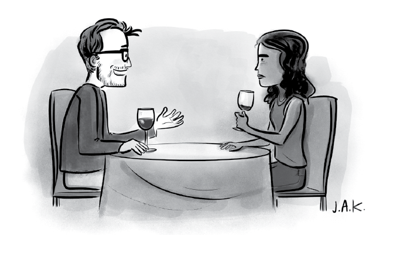
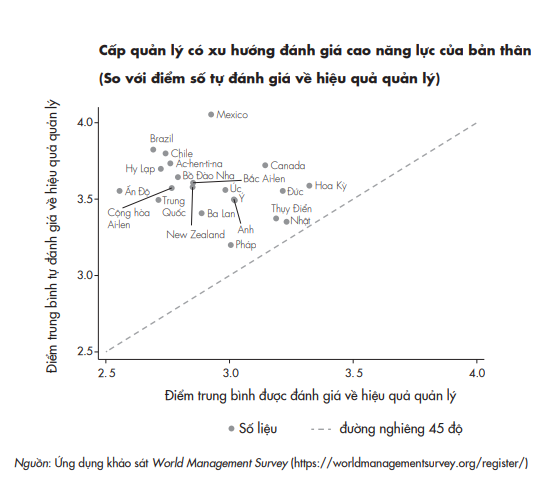
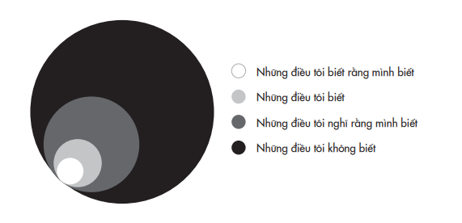
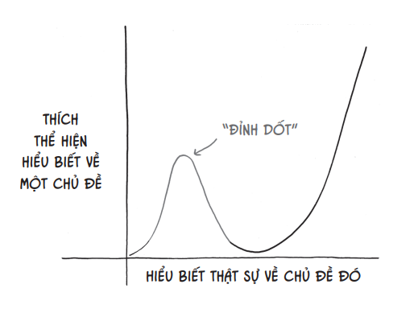
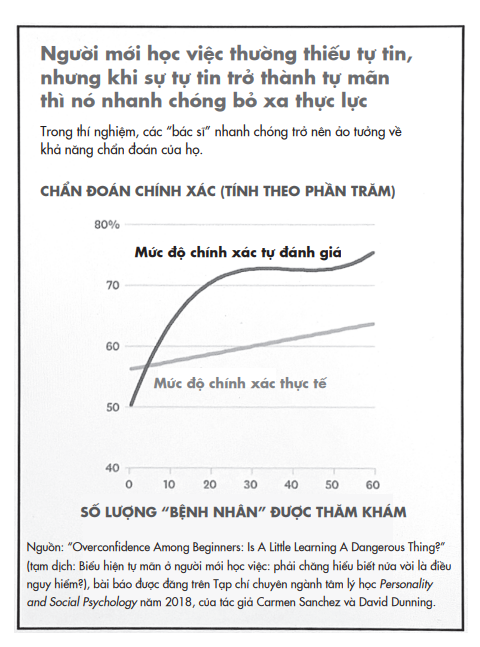
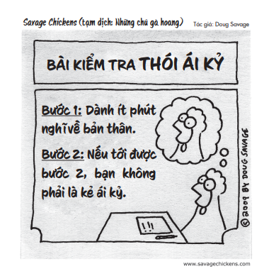
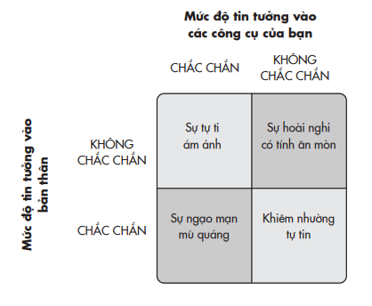
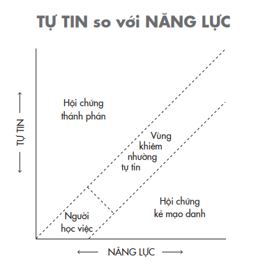
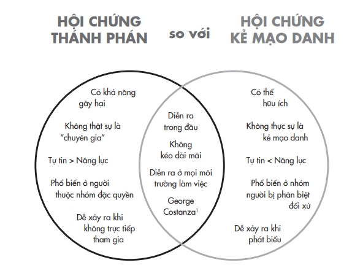

# Chương 2: Thánh Phán Và Kẻ Mạo Danh
## Khám phá điểm lý tưởng của sự tự tin

---

---

Ngu dốt, chứ không phải hiểu biết, sinh ra sự tự tin.

> *- Charles Darwin*

Ursula Mercz nhập viện với triệu chứng nhức đầu, đau lưng và chóng mặt đến mức không thể làm việc được. Trong một tháng sau đó, tình trạng của bà càng lúc càng tệ hơn. Phải khó khăn lắm, bà mới tìm được ly nước mà bà đã đặt kế bên giường. Bà còn không thể tìm ra cửa vào phòng mình và bà cứ đâm sầm vào khung giường.

Ursula là một thợ may ở tuổi ngũ tuần, và bà vẫn chưa đánh mất sự khéo léo của mình: với kéo và giấy trong tay, bà có thể cắt ra nhiều hình thù khác nhau. Bà có thể dễ dàng chỉ ra đâu là mũi, miệng, tay, hay chân, mô tả ngôi nhà và các thú cưng của mình không chút khó khăn. Đối với vị bác sĩ người Áo Gabriel Anton, Ursula là một ca đáng chú ý. Khi Anton đặt một dải ruy băng đỏ và một cây kéo trên bàn trước mặt Ursula, bà không thể gọi tên những vật đó, mặc dù “bà khẳng định, một cách bình thản và thành thật, rằng mình có thể thấy rõ các đồ vật ấy”. Rõ ràng bà đang gặp vấn đề về chức năng ngôn ngữ, điều mà bà đã nhận thức được, và khả năng định hướng không gian. Nhưng còn một việc đáng lo ngại khác: Ursula không còn phân biệt được sáng và tối. Khi bác sĩ Anton giơ một vật lên và yêu cầu bà mô tả nó, bà thậm chí không hề nhìn mà ngay lập tức đưa tay ra để chạm lấy nó. Các kiểm tra cho thấy thị lực của Ursula bị sa sút nghiêm trọng. Điều kỳ lạ là khi Anton hỏi bà về tình trạng này, bà lại khăng khăng nói rằng mình vẫn nhìn thấy. Cuối cùng, khi đã mất hoàn toàn thị lực, Ursula vẫn hoàn toàn không ý thức được điều này. Bác sĩ Anton ghi chú vào hồ sơ bệnh nhân: “Điều lạ lùng là bệnh nhân không nhận biết được tình trạng suy giảm thị lực nghiêm trọng của mình và về sau thì mất đi hoàn toàn thị lực… bệnh nhân bị mù ý thức về tình trạng mù thể lý của mình”.

Việc đó xảy ra vào cuối những năm 1800 và Ursula không phải là trường hợp duy nhất. Một thập niên trước đó, một nhà bệnh học thần kinh ở Zurich đã báo cáo một ca về một người đàn ông bị mù sau tai nạn nhưng không hề ý thức được điều này, mặc dù bệnh nhân hoàn toàn không có dấu hiệu “suy giảm trí năng”. Mặc dù ông ấy không chớp mắt khi ai đó giơ nắm đấm trước mặt và cũng không nhìn thấy thức ăn trên đĩa của mình, “ông ấy vẫn nghĩ mình không nhìn thấy vì đang ở trong một hố sâu hay một căn hầm tối nào đó”.

Nửa thế kỷ sau, có thêm hai bác sĩ báo cáo sáu trường hợp bệnh nhân bị mù nhưng không nhận ra điều đó. “Một trong những đặc điểm đáng chú ý nhất trong hành vi của những bệnh nhân này là họ bị mất khả năng học từ kinh nghiệm của mình”, các bác sĩ mô tả. Họ nói thêm:

Vì họ không ý thức được tình trạng mù của mình nên khi đi lại, họ va vào đồ đạc, vào tường nhưng vẫn không thay đổi hành vi. Khi đối mặt với tình trạng mù lòa của mình, hoặc là họ phủ nhận mình có bất cứ vấn đề thị lực nào, hoặc chống chế: “Trong phòng tối quá, sao họ không bật đèn lên chứ?”; “Tôi quên mang kính”, hay “Mắt tôi đúng là hơi kém, nhưng tôi vẫn nhìn rõ”. Bệnh nhân thường phủ nhận mọi luận cứ chứng minh hay sự xác quyết nào có thể chứng minh họ bị mù.

Hiện tượng này lần đầu tiên được mô tả bởi triết gia người La Mã Seneca. Triết gia này ghi lại trường hợp một phụ nữ bị mù nhưng lại cho rằng chỉ vì cô ấy đang ở trong phòng tối. Hiện nay, tình trạng này đã được y văn ghi nhận là hội chứng Anton – một dạng sa sút khả năng tự nhận thức khiến cho một người, tuy có dấu hiệu rõ ràng về một khuyết tật thể chất, nhưng lại nhận thức trái ngược về tình trạng của mình. Nguyên nhân được cho là do thùy chẩm¹⁴ bị tổn thương. Song, tôi cho rằng ngay cả khi não bộ của chúng ta vận hành khỏe mạnh, ai trong chúng ta cũng có thể bị tấn công bởi một phiên bản khác của hội chứng Anton.

> **Chú thích:** ¹⁴ Thùy chẩm (tiếng Anh: occipital lobe) là vùng não chịu trách nhiệm xử lý thị giác. (ND)

Chúng ta đều có những điểm mù trong kiến thức và quan điểm cá nhân. Tin xấu là những điểm mù đó có thể ngăn chúng ta không thấy được sự “mù nhận thức” của mình, điều khiến chúng ta tự tin một cách mù quáng vào khả năng phán đoán của bản thân và cản trở ta tái tư duy. Tin tốt là bằng sự tự tin đúng mức, chúng ta có thể học cách nhìn nhận bản thân chính xác hơn và làm mới các quan điểm của mình. Trong các khóa dạy lái xe, chúng ta đều được học cách xác định và khắc phục các điểm mù với sự trợ giúp của gương chiếu hậu và công cụ cảm biến. Trong đời sống, bởi tâm trí của chúng ta không được trang bị những công cụ bổ trợ này, nên chúng ta cần học cách nhận diện các điểm mù trong tư duy và điều chỉnh cách tư duy sao cho phù hợp.

## CÂU CHUYỆN HAI HỘI CHỨNG

Một ngày đầu tháng Mười Hai năm 2015, Halla Tómasdóttir nhận được một cuộc gọi mà cô không bao giờ ngờ tới. Phần mái của căn nhà Halla đang ở bị phủ một lớp băng tuyết dày. Và khi Halla đang lo lắng nhìn nước nhỏ xuống tường nhà, người bạn ở đầu dây bên kia hỏi cô đã xem bài đăng trên Facebook về mình chưa. Ai đó đã khởi xướng kiến nghị mời Halla tranh cử chức tổng thống Iceland.

Suy nghĩ đầu tiên xuất hiện trong đầu Halla là: Tôi là ai mà làm tổng thống chứ? Cô đã góp phần xây dựng một trường đại học và sau đó đồng sáng lập một quỹ đầu tư vào năm 2007. Trong cuộc khủng hoàng tài chính toàn cầu năm 2008, Iceland chịu ảnh hưởng hết sức nặng nề – ba ngân hàng thương mại tư nhân đầu ngành của nước này đều vỡ nợ và cả hệ thống tiền tệ sụp đổ. Tương ứng với quy mô kinh tế, đất nước đối mặt với tình trạng sụp đổ hệ thống tài chính tồi tệ nhất trong lịch sử loài người. Thế nhưng Halla, bằng khả năng lãnh đạo tài tình của mình, đã lèo lái công ty vượt qua khủng hoảng thành công. Ngay cả với thành tựu đáng nể ấy, cô vẫn không cảm thấy sẵn sàng với việc ứng cử tổng thống. Cô không có xuất thân, học vấn hay kinh nghiệm làm việc liên quan đến chính trị – cô chưa từng làm việc trong cơ quan chính phủ hay đảm nhiệm bất cứ vai trò nào trong lĩnh vực công.

Đây không phải là lần đầu Halla cảm giác mình như một kẻ mạo danh. Khi cô tám tuổi, giáo viên dạy piano chuyển cô lên lớp nâng cao và thường xuyên tạo điều kiện để cô biểu diễn ở các buổi hòa nhạc, nhưng Halla không bao giờ cảm thấy mình xứng đáng với vinh dự ấy, nên trước mỗi buổi trình diễn, cô lại cảm thấy lo đến phát ốm. Dẫu “ván bài” lần này lớn hơn rất nhiều, nhưng cảm giác hoài nghi bản thân thì vẫn y như cũ. “Tôi có cảm giác như sắp ốm, giống như tâm trạng trước mỗi buổi biểu diễn trước đây nhưng khủng khiếp hơn nhiều”, Halla kể với tôi. “Đó là lần tôi bị hội chứng kẻ mạo danh tồi tệ nhất từ khi trưởng thành”. Trong nhiều tháng sau đó, Halla đấu tranh tư tưởng về việc có nên ra ứng cử không. Dù bạn bè và gia đình động viên cô rằng cô có nhiều kỹ năng phù hợp, Halla vẫn nghĩ cô không có đủ kinh nghiệm lẫn sự tự tin cần thiết để ra ứng cử. Cô còn động viên những phụ nữ khác ra tranh cử

> *– một trong số đó về sau đã thăng tiến đến một vị trí trọng yếu khác, thủ tướng của Iceland.

Nhưng mọi người chưa quên lời kiến nghị. Bạn bè, gia đình và đồng nghiệp của Halla vẫn không ngừng thuyết phục cô. Cuối cùng, Halla tự hỏi: Tôi là ai mà không chịu phục vụ đất nước mình? Sau cùng cô hạ quyết tâm ra ứng cử, nhưng lợi thế của cô thật sự không lớn. Cô tranh cử ở vị thế một ứng viên độc lập vô danh, cạnh tranh với hơn hai mươi đối thủ khác. Một trong số đó là người có quyền thế – và đặc biệt “nguy hiểm”.

Khi được hỏi rằng với tư cách một chuyên gia kinh tế, theo cô ba nhân vật nào chịu trách nhiệm cao nhất cho tình trạng vỡ nợ của Iceland, cô đã nêu tên Davíð Oddsson ba lần. Ở cương vị thủ tướng của Iceland từ năm 1991 đến năm 2004, Oddsson đã đẩy các ngân hàng nhà nước vào cảnh khốn khó bởi chính sách tư nhân hóa ngân hàng. Sau đó, khi giữ chức thống đốc ngân hàng trung ương Iceland từ năm 2005 đến năm 2009, ông ta lại cho phép bảng cân đối kế toán của ngân hàng tăng lên gấp cả chục lần so với tổng sản phẩm quốc nội (GDP). Khi người dân lên tiếng phản đối về khả năng điều hành đất nước, Oddson vẫn từ chối từ chức cho đến khi bị bãi nhiệm bởi Nghị viện. Về sau, tạp chí Time đã đưa tên ông ta vào danh sách hai mươi lăm cá nhân gây ra cuộc khủng hoảng tài chính toàn cầu này. Bất chấp tất cả những điều ấy, năm 2016 Oddsson vẫn tuyên bố sẽ ra tranh cử chức tổng thống Iceland: “Với bề dày kiến thức và kinh nghiệm mình có được, tôi tin rằng bản thân rất phù hợp ở vị trí đó”.

Theo lý thuyết, năng lực và sự tự tin luôn đi đôi với nhau, nhưng thực tế thì không diễn ra như vậy. Bạn có thể thấy rõ điều này khi so sánh kết quả tự đánh giá kỹ năng lãnh đạo của một người với nhận xét của đồng nghiệp, cấp trên, hay nhân viên về người đó. Trong một phân tích theo phương pháp meta về kết quả của chín mươi lăm nghiên cứu trên hơn một trăm ngàn người, phụ nữ thường tự đánh giá thấp khả năng lãnh đạo của bản thân, trong khi nam giới lại tự tin thái quá.

Bạn hẳn cũng từng gặp một vài người hâm mộ bóng đá luôn tự tin rằng họ am hiểu bóng đá nhiều hơn cả các huấn luyện viên trên sân. Đó là “hội chứng thánh phán”, xảy ra khi sự tự mãn vượt quá thực lực. Thậm chí sau khi đã đưa ra những quyết sách tài chính hủy hoại nền kinh tế, Davíð Oddsson vẫn không thừa nhận rằng bản thân không đủ khả năng làm huấn luyện viên, huống hồ là làm tiền vệ. Ông ta bị mù nhận thức về nhược điểm của bản thân.

“Anh xin phép cắt ngang những lời thông thái của em bằng sự tự mãn của anh.”

Jason Adam Katzenstein/The New Yorker Collection/ The Cartoon Bank; © Condé Nast

Ngược lại với hội chứng thánh phán là hội chứng kẻ mạo danh¹⁵, xảy ra khi sự tự tin quá thấp so với năng lực. Thử nghĩ về những người quen biết của bạn luôn tin rằng họ không xứng đáng với thành công mà mình đạt được. Họ thật lòng không hề nhận ra bản thân là người thông minh, sáng tạo hay xinh đẹp đến nhường nào, và dù cho bạn có cố công bao nhiêu vẫn không tài nào khiến họ thay đổi suy nghĩ. Ngay cả khi một kiến nghị trực tuyến cho thấy rất nhiều người tin tưởng mình, Halla Tómasdóttir vẫn không tự tin rằng cô có đủ năng lực để lãnh đạo đất nước. Cô ấy bị mù nhận thức về các điểm mạnh của bản thân. ¹⁵ Hội chứng kẻ mạo danh là một hiện tượng tâm lý. Người mắc hội chứng này có cảm giác mình là kẻ mạo danh. Họ không nhận thức được giá trị của bản thân nên kém tự tin hơn thực lực của họ, từ đó họ tự thu mình và mất dần động lực phấn đấu.

Mặc dù có điểm mù đối lập nhau, cả hai ứng cử viên đều có niềm tin cực đoan khiến họ không sẵn sàng tái tư duy về hướng đi của mình. Mức độ lý tưởng của niềm tin về bản thân có lẽ nên ở đâu đó trong khoảng giữa hai thái cực thánh phán và kẻ mạo danh. Vậy làm thế nào để chúng ta tìm ra điểm lý tưởng đó?

## SỰ DỐT NÁT TRONG THÓI KIÊU NGẠO

Một trong những sự vinh danh mà tôi rất thích là giải thưởng dành cho lĩnh vực nghiên cứu mà vừa có tính khai phóng lẫn tính giải trí cao. Đó là giải Ig Nobel¹⁶, và nó được trao bởi chính những người thật sự đoạt giải Nobel. Một ngày mùa thu thời học đại học, tôi hộc tốc chạy tới hội trường để xem buổi lễ trao giải cùng với hàng ngàn bạn đồng môn thích nghiên cứu khoa học khác. Những người thắng giải năm đó gồm hai nhà vật lý đã chế tạo ra một trường lực có thể nâng bổng được một con ếch còn sống, ba nhà hóa học với khám phá rằng môi trường hóa sinh của cơ thể đang yêu có điểm tương đồng với trạng thái rối loạn ám ảnh cưỡng chế, và một chuyên gia khoa học máy tính phát minh ra PawSense – phần mềm phát hiện khi mèo nhà bạn giẫm chân lên bàn phím, và nó sẽ phát ra tiếng báo động để ngăn chúng lại. Không rõ liệu ứng dụng này có hiệu quả với các chú chó hay không. ¹⁶ Giải Ig Nobel là giải thưởng nhại lại giải Nobel, được trao tặng vào đầu mùa thu hàng năm _ gần với thời gian mà giải Nobel chính thức được công bố _ cho mười thành tựu “trước hết khiến cho mọi người cười, sau đó làm họ suy nghĩ”. Mục đích chính của giải là tạo không khí vui vẻ nhằm khuyến khích nghiên cứu khoa học.

Nhiều giải thưởng khiến tôi bật cười, nhưng hai người được trao giải gây ấn tượng nhất đối với tôi là hai nhà tâm lý học David Dunning và Justin Kruger. Trước đó, họ đã cho đăng một báo cáo chuyên ngành “khiêm tốn” về đề tài kỹ năng và sự tự tin, từ đó trở nên nổi tiếng. Bài nghiên cứu đưa ra khám phá là trong nhiều tình huống, những người không có năng lực… không hề biết rằng họ không có năng lực. Hiện tượng này thời nay được biết đến với tên gọi là hiệu ứng Dunning- Kruger và nó mô tả xu hướng những người thiếu năng lực thường khoác lên mình vẻ tự tin thái quá.

Các nghiên cứu ban đầu về hiệu ứng Dunning-Kruger cho thấy những người đạt điểm thấp nhất trong các bài kiểm tra về khả năng tư duy logic, ngữ pháp và khiếu hài hước lại thường tự đánh giá cao khả năng của mình. Trung bình, các đối tượng nghiên cứu tin rằng mình làm tốt hơn 62% số người cùng làm bài kiểm tra với họ, trong khi trên thực tế, họ chỉ làm tốt hơn khoảng 12% trên tổng số. Càng kém hiểu biết trong một lĩnh vực nào đó, chúng ta càng có xu hướng ảo tưởng về trí thông minh của mình. Trong một câu lạc bộ người hâm mộ bóng đá, người ít am hiểu nhất lại thường là thánh phán – họ không ngừng lên án huấn luyện viên đã đưa ra các quyết định sai lầm và không ngớt lời rao giảng rằng phải chơi như thế nào mới là “có chiến lược”.

Khuynh hướng này rất đáng lo ngại vì nó tổn hại đến khả năng tự nhận thức của chúng ta, và ngáng chân ta trong mọi hoàn cảnh. Hãy xem sự khác biệt giữa kết quả đánh giá hiệu quả vận hành và quản lý doanh nghiệp của các nhà kinh tế thực hiện trên hàng ngàn công ty thuộc nhiều ngành nghề và ở nhiều quốc gia khác nhau, với kết quả tự đánh giá nội bộ của cấp quản lý các công ty này:

Trong biểu đồ trên, nếu kết quả tự đánh giá hiệu quả quản lý của các công ty đúng với tình hình thực tế, các quốc gia lẽ ra sẽ ở sát trên đường đứt nét. Thói tự mãn có mặt ở mọi nền văn hóa, và càng lan tràn ở những nơi mà năng lực quản lý yếu kém nhất.¹⁷

> **Chú thích:** ¹⁷ Nhìn qua biểu đồ thì có vẻ các nước như Hoa Kỳ đang làm khá tốt, với điểm tự đánh giá không quá cách xa thực tế, song điều này không đúng trong tất cả các lĩnh vực. Trong một nghiên cứu gần đây, trẻ vị thành niên tại các quốc gia nói tiếng Anh ở nhiều nơi trên thế giới được mời tham gia đánh giá kiến thức trong mười sáu lĩnh vực toán học. Ba trong số các chủ đề được liệt kê là giả, không có trong thực tế _ declarative fractions (tạm dịch: phân số mô tả), proper numbers (tạm dịch: số thích hợp), và subjunctive scaling (tạm dịch: tỷ xích mong đợi)

> *- để phát hiện những người tự cho là mình giỏi về các khái niệm trừu tượng. Kết quả trung bình cho thấy hầu hết những người bị hội chứng ảo tưởng về bản thân là nam giới, có điều kiện khá giả, và ở khu vực Bắc Mỹ. (TG)

Tất nhiên, kỹ năng quản lý khó có thể được đánh giá một cách khách quan. Kiến thức thì dễ đánh giá hơn – bạn đã phải làm bài kiểm tra trong suốt những năm cắp sách đến trường đấy thôi. Trong các chủ đề sau, bạn tự đánh giá mức độ hiểu biết của mình như thế nào so với đa số mọi người – nhiều hơn, ít hơn hay tương đương?

• Tại sao tiếng Anh trở thành ngôn ngữ chính thức tại Hoa Kỳ

• Tại sao phụ nữ bị thiêu sống ở Salem¹⁸

> **Chú thích:**¹⁸ Salem là một thành phố thủ phủ thuộc bang Massachusetts, Hoa Kỳ, nổi tiếng về các cuộc hành hình những người bị gán tội phù thủy. (ND)

• Walt Disney đã làm công việc gì trước khi sáng tạo ra Chuột Mickey

• Con người lần đầu tiên nhìn thấy Vạn Lý Trường Thành trên chuyến bay vào vũ trụ nào

• Tại sao thói quen ăn kẹo lại ảnh hưởng đến hành vi của trẻ Một trong những thứ khiến tôi khó chịu trên đời là thói thùng rỗng kêu to, biểu hiện ở những người cố tỏ ra sành sõi về một lĩnh vực nào đó mà thật ra họ chẳng biết gì cả. Tôi bực mình với điều này đến độ ngay lúc này đây tôi đang viết cả một quyển sách về chủ đề ấy. Trong một loạt nghiên cứu, các đối tượng tham gia tự đánh giá mức độ hiểu biết của mình so với đại đa số về nhiều lĩnh vực khác nhau như ở trên, và sau đó trả lời các câu hỏi để kiểm tra kiến thức thật sự của mình. Người càng tự cho mình điểm cao thì có khả năng là người càng tự tin thái quá về bản thân – và càng ít tinh thần học hỏi, cập nhật kiến thức nhất. Nếu bạn nghĩ mình am hiểu về lịch sử hay khoa học nhiều hơn hầu hết mọi người, rất có khả năng bạn hiểu biết ít hơn mình tưởng. Giống như Dunning đã nói một cách dí dỏm: “Quy tắc đầu tiên để gia nhập câu lạc bộ Dunning-Kruger là bạn không biết mình là hội viên của câu lạc bộ Dunning-Kruger¹⁹”.

>**Chú thích:**¹⁹ Ví dụ ưa thích nhất của tôi là câu chuyện của Nina Strohminger: “Một sáng nọ, cha tôi gọi điện thoại cho tôi và giảng giải về hiệu ứng Dunning-Kruger. Vì quên mất rằng con gái mình, một tiến sĩ tâm lý học, hiển nhiên phải biết về hiệu ứng Dunning-Kruger, nên ông cứ giải thích luyên thuyên khái niệm này cho tôi”. (TG)

Với các câu hỏi ở trên, nếu bạn nghĩ rằng mình có hiểu biết ít nhiều, hãy nghĩ lại lần nữa đã. Nước Mỹ không hề có ngôn ngữ chính thức; những người bị gán tội phù thủy ở Salem bị treo cổ chứ không phải thiêu sống; Walt Disney không phải là người sáng tạo ra Chuột Mickey (đó là sáng tác của một họa sĩ hoạt hình tên là Ub Iwerks); trên thực tế, bạn không thể nhìn thấy Vạn Lý Trường Thành ở Trung Quốc từ không gian; và tác động của đường lên hành vi ở trẻ gần như bằng không.

Mặc dù hiệu ứng Dunning-Kruger thường vô hại và hài hước trong đời sống hằng ngày, nhưng trong trường hợp của Iceland thì không phải chuyện đùa. Dù giữ chức thống đốc ngân hàng trung ương, Davíð Oddsson không có bất cứ bằng cấp chuyên môn nào về tài chính hay kinh tế. Trước khi bước chân vào chính trường, ông đã sắm vai trong một chương trình hài kịch trên radio, viết kịch và truyện ngắn, theo học trường luật và làm nghề phóng viên. Trong thời gian đương vị thủ tướng Iceland, Oddsson coi nhẹ các ý kiến chuyên môn đến mức ông đã giải thể Viện Kinh tế Quốc gia. Và để buộc ông ta phải rời ghế thống đốc ngân hàng trung ương, Nghị viện đã phải thông qua một điều luật bất thường: mọi thống đốc đều phải có bằng cấp tối thiểu là thạc sĩ kinh tế. Tuy nhiên, điều này cũng không ngăn được Oddsson ra tranh cử chức tổng thống vài năm sau đó. Oddsson dường như hoàn toàn mù mờ về sự mù lòa của bản thân: ông ta không biết mình không biết những gì.

### ĐIỀU TÔI BIẾT

## KẸT TRÊN ĐỈNH DỐT

Vấn đề của hội chứng thánh phán là nó chắn lối con đường tái tư duy. Nếu chúng ta chắc chắn mình đã biết điều gì đó, chẳng có lý do gì phải tìm kiếm lỗ hổng hoặc sai sót trong kiến thức đó của mình – nói chi đến việc lấp đầy lỗ hổng hoặc hiệu chỉnh kiến thức cho chính xác. Trong một nghiên cứu, những người có chỉ số cảm xúc thấp nhất không chỉ có xu hướng đánh giá bản thân quá cao, họ còn là những người thường hay phản bác kết quả nhận được – cho rằng cách đánh giá không chính xác hoặc “điểm số chẳng nói lên được điều gì”. Và rất ít ai trong số họ sẵn sàng đầu tư cho việc khai vấn hoặc cải thiện bản thân.

Đúng là khuynh hướng này phần nào đến từ cái tôi mong manh của chúng ta. Chúng ta bị dồn vào thế phải phủ nhận những yếu kém của mình khi muốn giữ cái nhìn tích cực về bản thân hay muốn dựng nên một hình ảnh lấp lánh trong mắt người khác. Một chính trị gia tham ô luôn hô hào quyết tâm chống tham nhũng, nhưng động cơ thật sự đằng sau là ngoan cố mù ý thức về bản thân hay che mắt công luận. Tuy vậy, động cơ chỉ là một phần của tảng băng²⁰. ²⁰ Dù còn nhiều tranh cãi xoay quanh việc đo lường thống kê về hiệu ứng Dunning-Kruger, nhưng các tranh cãi chủ yếu là về mức độ ảnh hướng của hiệu ứng và thời điểm nó xảy ra, chứ không có bất cứ hồ nghi nào về tính xác thực của nó. Một điểm thú vị là ngay cả khi mọi người được tạo điều kiện để tự đánh giá lại chính xác mức độ hiểu biết của bản thân, những người càng ít kiến thức về lĩnh vực càng hay từ chối làm điều này. Sau khi những đối tượng nghiên cứu hoàn thành bài kiểm tra khả năng tư duy logic, họ được yêu cầu đoán số câu trả lời đúng của mình. Mặc dù được hứa hẹn giải thưởng 100 đô-la nếu đoán đúng (và thành thật), nhưng kết quả cuối cùng vẫn cho thấy là họ bị chứng tự tin thái quá. Trong một bài kiểm tra gồm hai mươi câu hỏi, trung bình số câu họ đoán mình trả lời đúng vẫn nhiều hơn 1,42 số câu thực đúng, và những người có ít câu trả lời đúng nhất là những người tự tin thái quá nhiều nhất. (TG)

Có một lực cản tinh vi hơn che mắt chúng ta trong việc nhìn nhận năng lực bản thân: đó là sự thiếu năng lực siêu nhận thức, tức là khả năng tư duy về cách tư duy của chính mình. Việc thiếu khả năng này có thể khiến chúng ta mù ý thức về tình trạng thiếu năng lực của bản thân. Nếu bạn là một doanh nhân trong mảng công nghệ và hiểu biết rất ít về hệ thống giáo dục, bạn có thể khăng khăng tưởng rằng giải pháp của mình có thể áp dụng hiệu quả cho mọi hệ thống giáo dục. Nếu bản thân là người không giỏi xã giao và lại thiếu hiểu biết về một số phép tắc trong xã hội, thì nhiều khả năng bạn sẽ hành xử như thể mình là James Bond. Thời trung học, một người bạn bảo rằng tôi không có óc hài hước chút nào cả. Vì sao cô bạn ấy lại nghĩ như vậy? “Cậu chẳng bao giờ cười khi tớ kể chuyện cười”. Tôi là người hài hước… người hài hước nào lại nói vậy chứ. Tôi sẽ để bạn đọc quyết định xem ai là người không có khiếu hài.

Khi chúng ta không có đủ kiến thức hay kỹ năng để trở nên xuất sắc trong một lĩnh vực, chúng ta cũng thiếu luôn cả kiến thức và kỹ năng để đánh giá như thế nào mới là xuất sắc. Ý thức được điều này sẽ ngay lập tức đưa chàng ngốc tự cao trong bạn về đúng vị trí của mình. Nhưng trước khi chế nhạo những kẻ mù quáng ấy, đừng quên rằng ai trong chúng ta cũng từng giống như họ.

Tất cả chúng ta đều là “người học việc” trong rất nhiều lĩnh vực, nhưng không phải lúc nào chúng ta cũng không nhận thức được điều đó. Chúng ta có khuynh hướng tự đề cao bản thân ở những kỹ năng đáng mơ ước, chẳng hạn khả năng dẫn dắt một cuộc trò chuyện lôi cuốn. Chúng ta cũng hay tự tin thái quá ở các khía cạnh nhập nhằng giữa kinh nghiệm và sự chuyên nghiệp, như lái xe, đánh máy nhanh, sự diễn đạt ngôn từ hay quản lý cảm xúc. Trái lại, chúng ta thường tự đánh giá thấp bản thân ở những lĩnh vực mà ta dễ dàng nhận ra mình thiếu kinh nghiệm, chẳng hạn như hội họa, lái xe đua, hay đọc ngược bảng chữ cái. Những người hoàn toàn mới với một lĩnh vực nào đó hiếm khi rơi vào bẫy Dunning- Kruger. Nếu bạn chưa biết gì về bóng đá, bạn sẽ không đi khoe khoang rằng mình am hiểu hơn huấn luyện viên.

Thời điểm chúng ta từ người không biết gì bắt đầu tiến bộ thành người biết “kha khá” cũng là khi chúng ta trở nên tự mãn. Kiến thức nửa vời là một thứ vô cùng nguy hiểm. Ở rất rất nhiều lĩnh vực trong cuộc sống, chúng ta không bao giờ có được đủ chuyên môn để biết tự chất vấn quan điểm của bản thân hay nhận ra giới hạn hiểu biết của mình. Chúng ta chỉ “gom” được một lượng kiến thức vừa đủ để mạnh miệng khoe khoang và đưa ra phán xét, đâu ngờ rằng bản thân chỉ mới leo được tới Đỉnh Dốt và chẳng nghĩ tới việc đi xuống ở phía bên kia.

Bạn có thể thấy rõ điều này trong một thí nghiệm khác của Dunning: những người tham gia được yêu cầu đóng vai bác sĩ trong một tình huống mô phỏng ngày tận thế vì sự tấn công của xác sống. Khi tiếp nhận chỉ một vài “nạn nhân” bị thương, các “bác sĩ” nhận thức chính xác về kỹ năng thực tế của mình. Thật không may, khi họ có nhiều kinh nghiệm hơn, mức độ tự mãn của họ phát triển nhanh hơn thực lực, và từ thời điểm đó trở đi, mức độ tự mãn ấy không bao giờ trở về ngang bằng với thực lực.

Đây có thể là một trong những nguyên nhân khiến tỷ lệ bệnh nhân tử vong ở bệnh viện thường tăng cao vào tháng Bảy, thời điểm nhiều bác sĩ thực tập thường xuyên trực ở bệnh viện. Bản thân sự thiếu kỹ năng của họ không nhất thiết gây ra nguy hiểm, chính là sự tự mãn về kỹ năng đó mới là mối nguy.

Quá trình tăng tiến từ người học việc lên mức nghiệp dư có thể phá vỡ vòng lặp tái tư duy. Khi có thêm một ít kinh nghiệm, chúng ta đánh mất một ít sự khiêm nhường. Tiến bộ nhanh làm chúng ta tự tin, song nó lại bồi đắp ảo tưởng rằng bản thân đã tinh thông mọi thứ. Ảo tưởng này khởi động một chu kỳ tự mãn, ngăn chúng ta hoài nghi về những điều mình đã biết và học hỏi những điều mình chưa biết. Chúng ta bị kẹt trong bong bóng giả định thiếu sót của người học việc, trong đó ta mù tịt về sự mù tịt của bản thân.

Đây là điều đã xảy ra ở Iceland với Davíð Oddsson, khi thói tự phụ của ông ta được củng cố bởi “những người bạn chí cốt” và trở nên miễn nhiễm trước những lời chỉ trích. Ông ta được cho là thường giao du với “đám bạn tâm phúc” từ thời đi học và hội chơi bài bridge, và còn lập ra một danh sách bạn và thù. Nhiều tháng trước khi hệ thống tài chính Iceland sụp đổ, Oddsson đã từ chối đề nghị giúp đỡ của ngân hàng trung ương Anh Quốc. Và khi cuộc khủng hoảng đã lên đỉnh điểm, ông ta xấc xược tuyên bố trước công luận rằng mình không có ý định lo liệu các khoản nợ của các ngân hàng Iceland. Hai năm sau, một ủy ban sự thật²¹ được Nghị viện thành lập đã kết tội ông ta là “thiếu trách nhiệm gây hậu quả nghiêm trọng”. Thất bại của Oddsson, theo lời một nhà báo theo đuổi cuộc điều tra về cuộc khủng hoảng, là do “thói tự phụ, niềm tin huyễn hoặc rằng ông ta biết đâu là điều tốt nhất cho đảo quốc của mình”.

>**Chú thích:**²¹ Ủy ban sự thật là một cơ quan được giao nhiệm vụ khám phá và tiết lộ những hành động sai trái của chính phủ trong quá khứ, nhằm giải quyết những xung đột còn sót lại từ quá khứ.

Thứ ông ta thiếu là một dưỡng chất vô cùng thiết yếu cho trí não: sự khiêm nhường. Sử dụng đều đặn loại “thuốc giải” này chính là giải pháp cho tình trạng mắc kẹt trên Đỉnh Dốt. “Tự cao là kết quả của ngu dốt cộng với xác tín”, blogger Tim Urban lý giải như vậy. “Trong khi tính khiêm nhường là màng lọc thẩm thấu có thể hấp thu kinh nghiệm sống và chuyển hóa thành kiến thức và trí tuệ, thì thói tự cao lại là một tấm khiên cao su mà mọi kinh nghiệm sống được rót vào đều dội ngược trở ra.”

## NGUYÊN TẮC GOLDILOCKS²² KHÔNG ỔN Ở ĐÂU

>**Chú thích:**²² Truyện cổ tích Anh Goldilocks và ba chú gấu kể về một cô gái tên là Goldilocks, cô đi dạo trong rừng và tình cờ đến nhà của một gia đình gấu. Cô nếm ba bát cháo khác nhau và nhận thấy mình thích cháo không quá nóng cũng không quá lạnh, có nhiệt độ vừa phải. Nguyên tắc Goldilocks rút ra từ câu chuyện này là: sự lựa chọn tốt nhất luôn nên ở mức độ trung dung, cân bằng và phù hợp với khả năng. (ND)

Nhiều người hình dung sự tự tin như trò chơi bập bênh. Nếu tự tin quá mức, chúng ta sẽ bị ngả về phía cao ngạo. Nếu đánh mất sự tự tin, chúng ta trở thành nhu nhược. Đây chính là nỗi sợ của chúng ta về tính khiêm nhường: chúng ta lo rằng nếu quá khiêm tốn, chúng ta sẽ dần xem nhẹ bản thân. Chúng ta muốn giữ cho chiếc bập bênh cân bằng, vì vậy ta bước vào chế độ Goldilocks nhằm tìm ra cho mình mức độ tự tin phù hợp nhất. Tuy vậy, gần đây tôi nhận ra phương pháp tiếp cận này không ổn.

Sự khiêm nhường rất thường bị hiểu sai. Nó không hàm ý là mức độ tự tin thấp. Một trong những nghĩa gốc trong tiếng La-tinh của từ humility (khiêm tốn, khiêm nhường trong tiếng Anh) là “từ đất”. Nó nói đến trạng thái “tiếp đất” – nhận ra rằng chúng ta đều không hoàn hảo và có thể mắc sai lầm.

Tự tin là một thước đo về mức độ tin tưởng của bạn vào bản thân. Các bằng chứng chỉ ra rằng sự tự tin ấy là khác biệt với việc bạn tin tưởng bao nhiêu vào các phương pháp của mình. Bạn có thể tự tin vào khả năng đạt được mục tiêu trong tương lai của mình và đồng thời vẫn luôn khiêm nhường tự chất vấn liệu hiện tại bạn có đang sở hữu những công cụ đúng đắn để đạt mục tiêu ấy hay không. Đây chính là điểm lý tưởng của sự tự tin.

Chúng ta bị thói tự mãn che mắt khi tin tưởng tuyệt đối vào những thế mạnh và chiến lược của bản thân. Nhưng chúng ta lại bị sự hoài nghi làm tê liệt nếu thiếu niềm tin vào hai thứ này. Chúng ta có thể bị phức cảm tự ti nuốt chửng khi ta biết chính xác phương pháp thực hiện nhưng lại cảm thấy không chắc chắn về khả năng của mình trong việc thực hiện theo phương pháp ấy. Vì thế, phẩm chất chúng ta cần có là sự khiêm nhường tự tin: có niềm tin chắc chắn vào năng lực của bản thân trong khi nhận thức được rằng có khả năng chúng ta không chọn giải pháp đúng hoặc thậm chí không nhận diện được chính xác vấn đề. Tâm thế này cho chúng ta đủ sự hoài nghi cần thiết để suy xét lại những kiến thức hiện có và đủ tự tin để khai phá những hiểu biết mới.

### ĐIỂM LÝ TƯỞNG CỦA SỰ TỰ TIN

Khi người sáng lập thương hiệu thời trang Spanx là Sara Blakely nảy ra ý tưởng về quần tất, cô tin vào khả năng của mình trong việc biến ý tưởng thành hiện thực, nhưng cô cũng đầy hoài nghi về các phương tiện mình có trong tay. Thời điểm đó, công việc cô làm ban ngày là gõ cửa từng nhà để bán máy fax, và cô ý thức rằng mình không biết chút gì về thời trang, hoạt động bán lẻ hay sản xuất. Sau khi thiết kế ra mẫu quần tất đầu tiên, cô dành một tuần lái xe đi khắp các xưởng sản xuất đồ dệt kim tìm kiếm sự giúp đỡ. Khi không có đủ tiền trả cho hãng luật để đăng ký bằng sáng chế, cô tìm đọc sách về vấn đề này và tự điền vào đơn xin cấp bằng sáng chế. Sự hoài nghi trong cô không có tính ăn mòn – cô tự tin rằng mình có thể vượt qua những thử thách trước mắt. Sự tự tin của cô không nằm ở kiến thức hiện có, mà ở khả năng học hỏi của bản thân.

Sự khiêm nhường tự tin là thứ có thể trau dồi. Trong một thí nghiệm, các sinh viên được đọc một bài viết ngắn trên báo về những ích lợi của việc thừa nhận điều mình không biết thay vì tỏ ra chắc chắn về kiến thức của mình. Kết quả là tỷ lệ sinh viên tìm sự trợ giúp trong lĩnh vực không phải thế mạnh của mình tăng vọt từ 65% lên 85%. Họ cũng cởi mở tìm hiểu các quan điểm chính trị đối lập để thử học hỏi từ phía bên kia.

Sự khiêm nhường tự tin không chỉ giúp chúng ta cởi mở tâm trí để tái tư duy mà còn giúp chúng ta cải thiện chất lượng tái tư duy. Ở bậc đại học và sau đại học, những sinh viên có ý thức sẵn sàng nhìn nhận lại quan điểm cá nhân thường đạt điểm số cao hơn so với các bạn học. Ở bậc phổ thông, những học sinh thừa nhận rằng mình không biết một vấn đề gì đó thường được giáo viên đánh giá là tiếp thu tốt và được bạn bè cùng nhóm nhận xét là đóng góp nhiều hơn. Điểm tổng kết năm học của các học sinh này trong môn toán cao vượt trội so với các bạn học hay tỏ ra chắc chắn về hiểu biết của mình. Thay vì mặc nhiên cho rằng mình đã hiểu tường tận bài học, họ thường tự mình vấn đáp để kiểm tra xem bản thân nắm vững kiến thức đến đâu.

Khi những người trưởng thành có đủ tự tin để thừa nhận điều mình không biết, họ sẽ chú ý hơn đến độ vững chắc của bằng chứng và dành nhiều thời gian hơn để tìm đọc những nội dung có quan điểm trái ngược với mình. Trong những nghiên cứu được thực hiện nghiêm ngặt về hiệu quả quản lý ở Hoa Kỳ và Trung Quốc, các đội ngũ làm việc hiệu quả và có nhiều sáng kiến nhất không được dẫn dắt bởi người lãnh đạo tự tin hay khiêm nhường. Những người lãnh đạo hiệu quả, đạt điểm cao nhất trong bảng khảo sát là những người tự tin và khiêm nhường. Dù có niềm tin mạnh mẽ vào những thế mạnh của bản thân, họ cũng ý thức rất rõ những điểm hạn chế của mình. Họ biết rằng bản thân cần nhận ra và vượt lên giới hạn của mình trước khi muốn vượt qua những giới hạn lớn lao hơn nữa trong cuộc sống.

Nếu muốn hướng đến sự chính xác, chúng ta phải cương quyết xử lý các điểm mù của mình. Để có hình dung chính xác về kiến thức và kỹ năng của mình, có lẽ chúng ta cần nhìn nhận lại bản thân như cách các nhà khoa học nhìn qua kính hiển vi. Nhưng, một trong những niềm tin mới định hình gần đây của tôi là đôi khi chúng ta tốt nhất nên đánh giá thấp bản thân một chút.

## NHỮNG LỢI ÍCH CỦA SỰ HOÀI NGHI

Chỉ một tháng rưỡi trước kỳ bầu cử tổng thống Iceland, cuộc thăm dò ý kiến cho thấy Halla Tómasdóttir chỉ nhận được 1% phiếu ủng hộ. Để tập trung vào những ứng viên triển vọng, kênh truyền hình phát sóng buổi tranh luận đầu tiên giữa các ứng cử viên tuyên bố họ từ chối ghi hình những người có tỷ lệ phiếu bầu dự đoán dưới 2,5%. Đến ngày tranh luận, Halla chỉ vừa chạm đến mốc ấy. Nhưng trong một tháng sau đó, mức độ ủng hộ cô tăng đột biến. Không chỉ là một ứng cử viên có thể trụ lại, cô là một trong bốn ứng cử viên sau cùng.

Vài năm sau, khi tôi mời cô đến nói chuyện với sinh viên của mình, Halla có đề cập đến hội chứng kẻ mạo danh và chia sẻ rằng nó chính là động cơ tâm lý mạnh mẽ thúc đẩy sự vụt sáng bất ngờ của cô. Cảm thấy mình là kẻ mạo danh thường được xem là tiêu cực, và điều đó là hoàn toàn xác đáng – cảm giác bản thân không xứng đáng kéo dài có thể gây đau khổ, nghiền nát mọi động lực và ngăn chúng ta theo đuổi hoài bão.

Tuy nhiên, lúc này lúc khác, một cảm giác hoài nghi ít mang tính phá hoại hơn cũng đã len lỏi vào tâm trí của hầu hết chúng ta. Một vài cuộc khảo sát cho rằng hơn một nửa số người quen của chúng ta từng có cảm giác mình là kẻ mạo danh ở một thời điểm nào đó trong sự nghiệp của mình. Có ý kiến cho rằng điều này xảy ra nhiều với phụ nữ và nhóm bị phân biệt đối xử. Nhưng bất ngờ là hiện tượng này cũng đặc biệt phổ biến ở những người thành đạt.

Một vài sinh viên của tôi được cấp bằng sáng chế ngay cả trước khi đủ tuổi uống bia rượu²³, và một số khác trở thành kiện tướng cờ vua trước tuổi được phép lái xe²⁴, nhưng cũng chính những người này thường xuyên vật lộn với cảm giác bất an và không ngừng hoài nghi về khả năng của mình. Cách lý giải tiêu chuẩn cho thành tựu của họ chính là họ đã vượt qua hoài nghi để thành công, nhưng nếu thành công của họ phần nào được thúc đẩy bởi những hoài nghi đó thì sao?

>**Chú thích:** ²³ Ở Mỹ, trên 21 tuổi mới được sử dụng đồ uống có cồn. (ND) ²⁴ Ở Mỹ, 18 tuổi mới được phép lái xe (16 tuổi trở lên được phép lái xe nhưng phải có người lớn ngồi bên cạnh). (ND)

Để tìm ra câu trả lời, Basima Tewfik – khi ấy là nghiên cứu sinh ở Đại học Wharton, hiện là giáo sư tại Đại học MIT – đã thực hiện nghiên cứu trên một nhóm sinh viên y khoa đang chuẩn bị bước vào giai đoạn thực tập lâm sàng. Cô thu xếp để nhóm này tiếp xúc trong hơn nửa giờ với các diễn viên được huấn luyện để đóng vai bệnh nhân mang nhiều chứng bệnh khác nhau. Basima quan sát cách các sinh viên y khoa thăm khám và điều trị cho bệnh nhân, đồng thời theo dõi xem liệu họ có đưa ra các chẩn đoán chính xác hay không.

Một tuần trước đó, nhóm sinh viên này đã được làm một bảng khảo sát về mức độ thường xuyên nuôi dưỡng những suy nghĩ của hội chứng kẻ mạo danh như Tôi không giỏi như mọi người nghĩ và Những người quan trọng với tôi tin rằng tôi có khả năng hơn tôi nghĩ. Những sinh viên có cảm giác kẻ mạo danh hoàn toàn không thua kém các sinh viên khác về khả năng chẩn đoán, và họ trội hơn hẳn các sinh viên khác về kỹ năng thăm khám cho bệnh nhân tại giường – họ được đánh giá cao ở sự thấu cảm, tôn trọng bệnh nhân, chuyên nghiệp, và họ cũng làm rất tốt việc đặt câu hỏi cũng như giải thích triệu chứng cho bệnh nhân. Một nghiên cứu khác của Basima trên đối tượng các chuyên viên tư vấn đầu tư cũng cho ra kết quả tương tự sau bốn tháng: những người thường xuyên có cảm giác kẻ mạo danh thường được cấp trên đánh giá cao về hiệu quả làm việc.

Bằng chứng này vẫn còn mới và chúng ta cần tìm hiểu sâu hơn, xem khi nào thì hội chứng kẻ mạo danh có ích và lúc nào nó gây hại. Tuy nhiên, phát hiện mới này khiến tôi tự hỏi phải chăng chúng ta đã có thành kiến sai về hội chứng kẻ mạo danh khi hoàn toàn xem nó là một rối loạn.

Khi nỗi ám ảnh về kẻ mạo danh xuất hiện, lời khuyên phổ biến là chúng ta nên phớt lờ chúng và tận hưởng lợi ích của sự hoài nghi. Nhưng đáng lẽ chúng ta nên tận dụng nỗi sợ này, vì nó cho ta đến ba ích lợi của sự hoài nghi.

Lợi ích đầu tiên của cảm giác kẻ mạo danh là nó thúc đẩy chúng ta nỗ lực nhiều hơn. Có thể nó không ảnh hưởng nhiều khi chúng ta còn chần chừ chưa nhảy vào cuộc đua, nhưng một khi chúng ta đã đặt chân vào vạch xuất phát, thứ cảm giác này là nguồn động năng buộc chúng ta cố gắng đến cùng để trở thành một trong những người về đích đầu tiên²⁵. Trong một vài nghiên cứu của cá nhân tôi ở các trung tâm dịch vụ khách hàng, các cơ quan chính phủ và quân đội, và cả các tổ chức phi lợi nhuận, tôi khám phá ra rằng sự tự tin có thể khiến chúng ta tự mãn. Nếu không bao giờ lo lắng việc khiến người khác thất vọng, rất có khả năng chúng ta sẽ thật sự khiến họ thất vọng. Khi bị cảm giác kẻ mạo danh theo đuổi, chúng ta nghĩ rằng mình cần chứng tỏ điều gì đó. Những “kẻ mạo danh” có thể chần chừ khi nhập cuộc, nhưng họ là những kẻ trụ lại sau cùng. 25 Phản ứng này có thể khác nhau giữa nam giới và nữ giới. Trong nghiên cứu của Basima trên đối tượng các chuyên viên tư vấn đầu tư, suy nghĩ mình là kẻ mạo danh giúp gia tăng hiệu quả công việc của cả nam giới lẫn nữ giới, nhưng đặc biệt kích thích tinh thần đồng đội ở phái nam. Nam giới có xu hướng bù đắp nỗi sợ không đạt được kỳ vọng trong các nhiệm vụ quan trọng của bản thân bằng việc cống hiến nhiều hơn cho công việc tập thể. Trong khi đó, phụ nữ phụ thuộc nhiều hơn vào niềm tin và dễ bị sự hoài nghi làm sa sút. (TG)

Thứ hai, cảm giác kẻ mạo danh có thể thúc đẩy chúng ta làm việc thông minh hơn. Khi không tự tin rằng mình có thể chiến thắng, chúng ta chẳng có gì để mất khi thử tái tư duy về chiến lược của bản thân. Nên nhớ rằng những người hoàn toàn mới trong một lĩnh vực không phải là nạn nhân của hiệu ứng Dunning-Kruger. Cảm giác là kẻ mạo danh đặt chúng ta vào tâm thế của một người mới vào nghề, không ngại chất vấn những giả định mà người khác xem là hiển nhiên đúng.

Thứ ba, cảm giác kẻ mạo danh giúp chúng ta học hỏi tốt hơn. Sự hoài nghi về kỹ năng và kiến thức của bản thân giúp chúng ta bật dậy khỏi cơn mê của kẻ tự mãn, khuyến khích chúng ta học hỏi từ những người khác để mở mang hiểu biết. Như nhà tâm lý học Elizabeth Krumrei Mancuso và các đồng nghiệp của cô có viết: “Sự học đòi hỏi ở chúng ta tính khiêm nhường để nhận ra sự học không bao giờ là đủ”.

Bằng chứng cho thấy mối tương quan này đến từ nghiên cứu của một cựu nghiên cứu sinh khác từng được tôi hướng dẫn tại Đại học Wharton, Danielle Tussing – cô hiện là giáo sư tại trường SUNY Buffalo. Danielle thu thập dữ liệu cho nghiên cứu của cô tại một bệnh viện mà ở đó vị trí y tá trưởng được luân phiên đảm nhiệm theo các ca trực. Nghĩa là các y tá đều có lúc phải ở vị trí chỉ huy ngay cả khi họ hoài nghi năng lực của mình. Trong thực tế, những y tá có cảm giác không chắc chắn về khả năng đảm đương trọng trách của mình lại là những người lãnh đạo hiệu quả hơn, một phần vì họ có xu hướng tìm đến hỏi ý kiến các đồng nghiệp nhiều hơn. Họ không nhìn nhận bản thân ở vị thế cao hơn mọi người và họ hiểu được rằng cách tốt nhất để bù đắp sự thiếu hụt về kinh nghiệm và chuyên môn của mình chính là lắng nghe. Điều này thể hiện rất rõ trong trường hợp của Halla Tómasdóttir.

## HỘI NHỮNG KẺ KHIÊM NHƯỜNG XUẤT CHÚNG

Khi tôi ngồi lại với Halla, cô ấy chia sẻ rằng trước đây, cảm giác hoài nghi từng tác động tiêu cực đến cô. Cô xem đó là dấu hiệu cho thấy mình thiếu năng lực để thành công. Nhưng giờ cô đã đạt đến điểm khiêm nhường tự tin và cô diễn giải cảm giác hoài nghi theo một cách khác: đó là tín hiệu nhắc nhở cô “nâng cấp” các công cụ hiện có của mình.

Rất nhiều bằng chứng cho thấy sự tự tin vừa là thành quả vừa là nguyên nhân đưa đến sự tiến bộ. Chúng ta không cần phải chờ cho đến khi đủ tự tin mới chinh phục những mục tiêu thách thức. Chúng ta có thể vun đắp phẩm chất này thông qua việc chinh phục những mục tiêu thử thách. “Tôi đã đến bước đón nhận hội chứng kẻ mạo danh như một dấu hiệu tốt lành: nó thúc đẩy tôi làm nhiều hơn, cố gắng nhiều hơn”, Halla cho biết. “Tôi đã học cách tận dụng nó như một ưu thế. Quá trình phát triển bản thân của tôi thật sự bắt đầu từ cảm giác hoài nghi về bản thân.”

Trong khi các ứng cử viên khác bằng lòng với việc dựa vào những kênh truyền thông chính thống, sự hoài nghi của Halla với những công cụ đang có đã thôi thúc cô tái tư duy về cách thức vận động tranh cử của mình. Cô làm việc nhiều hơn và thông minh hơn, cô thức khuya để tự tay trả lời tin nhắn của những người theo dõi trên mạng xã hội. Cô mở các buổi giao lưu trực tuyến trên Facebook để trả lời mọi câu hỏi của cử tri và cô còn học cách dùng Snapchat để tiếp cận giới trẻ. Với suy nghĩ rằng mình không có gì để mất, cô chọn một chiến lược mà rất ít ứng cử viên nào dám thử: thay vì công kích các đối thủ, cô xây dựng một chiến dịch tranh cử tích cực. Mọi chuyện đâu thể nào tệ hơn nữa, cô tự nhủ. Điều này phần nào lý giải tại sao cô được cử tri ủng hộ mạnh mẽ: họ đã quá chán ngán việc nhìn các ứng cử viên bôi nhọ lẫn nhau và hài lòng khi nhìn thấy một ứng cử viên tôn trọng các đối thủ của mình.

Sự thiếu chắc chắn thúc đẩy chúng ta đặt câu hỏi và tiếp thu những ý tưởng mới. Nó bảo vệ chúng ta khỏi hiệu ứng Dunning-Kruger. “Cảm giác mình là kẻ mạo danh khiến tôi luôn phải gióng tai lên để lắng nghe và học hỏi, vì tôi cảm thấy có quá nhiều điều mình chưa biết”, Halla nói, nghe như một nhà khoa học hơn là một chính khách. “Có thể hội chứng kẻ mạo danh là cần thiết cho sự thay đổi. Những kẻ mạo danh hiếm khi nói: ‘Trước giờ chúng ta làm thế nào thì hãy giữ nguyên như thế đi’. Họ cũng không nói: ‘Làm như thế này mới đúng’. Khao khát học hỏi và phát triển khiến tôi luôn sẵn sàng lắng nghe lời khuyên từ mọi người để xem liệu mình có thể làm thế nào để mọi thứ khác đi”. Mặc dù luôn cảm thấy hoài nghi các công cụ hiện có của mình, Halla vẫn tin vào khả năng học hỏi của bản thân. Cô hiểu rằng khi cần tri thức thì phải tìm đến các chuyên gia, nhưng khả năng sáng tạo và trí tuệ thì có thể trau dồi ở bất cứ đâu.

Vòng tranh cử tổng thống Iceland sau cùng chỉ còn lại Halla, Davíð Oddsson, và hai nam ứng cử viên khác. Ba người đàn ông đều xuất hiện trên truyền thông nhiều hơn Halla xuyên suốt kỳ tranh cử, trong đó có các bài phỏng vấn trên trang nhất của các tờ báo – đặc quyền cô không bao giờ có. Ngân sách dành cho hoạt động tranh cử của họ cũng lớn hơn. Thế nhưng đến ngày bầu cử, Halla đã làm rúng động cả nước, và cả chính cô, khi giành được hơn một phần tư số phiếu bầu.

Cô không đắc cử mà chỉ về nhì. Tỷ lệ 28% trên tổng số phiếu bầu của cô vẫn còn cách biệt xa tỷ lệ 39% của người đắc cử. Nhưng Halla đã vượt xa Davíð Oddsson, người về thứ tư với tỷ lệ 14% tổng số phiếu. Dựa theo quỹ đạo và đà đi lên của mức ủng hộ dành cho cô, tôi có thể hình dung nếu cuộc vận động được kéo dài thêm một vài tuần thì cô đã có thể chiến thắng.

Những nhà tư tưởng lớn ôm giữ những hoài nghi không phải bởi vì họ là những kẻ mạo danh. Họ duy trì cảm giác hoài nghi vì biết rằng tất cả chúng ta đều bị mù một phần nào đó, và họ cam kết không ngừng cải thiện thị lực của bản thân. Họ không huênh hoang khoác lác mình biết nhiều đến cỡ nào mà trái lại, họ luôn tự hỏi mình hiểu biết ít ra sao. Họ ý thức được rằng mỗi câu trả lời lại mở ra những câu hỏi mới và hành trình tìm kiếm tri thức không bao giờ có điểm dừng. Dấu hiệu nhận biết những người học tập suốt đời là họ quan niệm rằng họ luôn có thể học hỏi điều gì đó từ mọi người mà họ gặp.

Thói ngạo mạn ngăn chúng ta nhìn thấy nhược điểm của mình. Sự khiêm nhường là lăng kính phản chiếu: nó giúp chúng ta nhìn thấy nhược điểm của mình hết sức rõ ràng. Sự khiêm nhường tự tin là kính chỉnh độ: nó giúp chúng ta khắc phục những nhược điểm ấy.
