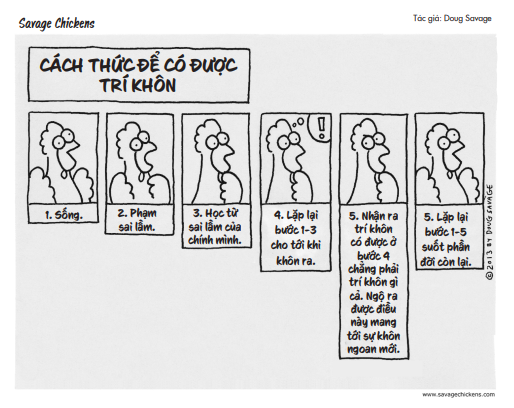
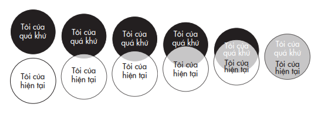
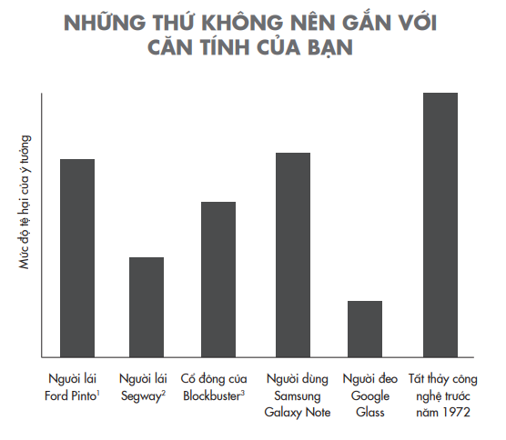
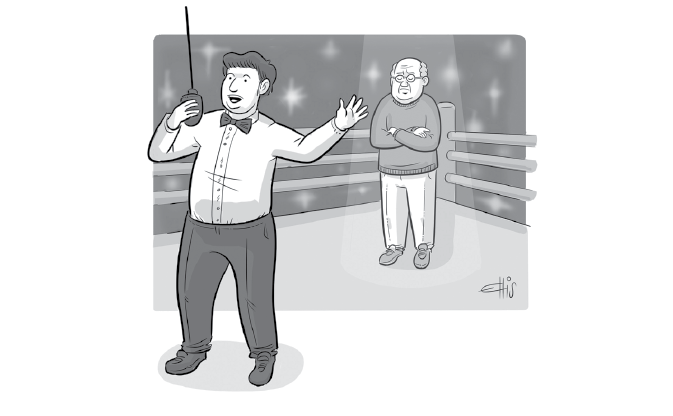
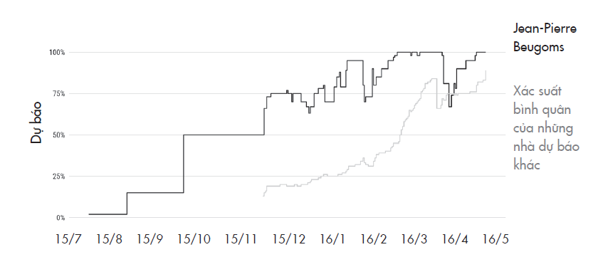
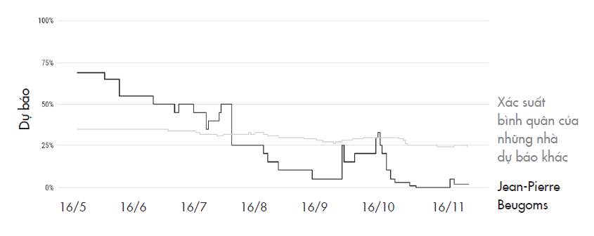
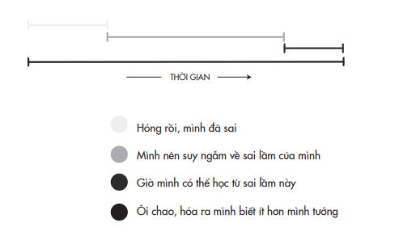

# Chương 3: Niềm Vui Khi Sai
## Sự phấn khích của việc không tin vào mọi suy nghĩ của mình

---

---

Tôi tốt nghiệp Đại học Harvard. Mỗi khi tôi sai, là thế giới vô lý hơn một chút.

> *- Tiến sĩ Frasier Crane, do Kelsey Grammer thủ vai, trong bộ phim truyền hình Frasier

Mùa thu năm 1959, một nhà tâm lý học danh tiếng tuyển người tham gia vào một nghiên cứu vô cùng trái đạo đức. Ông trực tiếp chọn ra một nhóm sinh viên Harvard năm thứ hai để tham gia vào một chuỗi thí nghiệm được tiến hành trong suốt thời gian họ học đại học. Các sinh viên tình nguyện sẽ dành ra một vài giờ đồng hồ mỗi tuần để đóng góp vào công trình nghiên cứu về quá trình phát triển nhân cách và cách giải quyết các vấn đề tâm lý. Họ không hề hay biết rằng khi tham gia dự án này, họ thật ra đã ký giao kèo cho phép niềm tin của mình bị tấn công dữ dội.

Nhà nghiên cứu Henry Murray vốn là một bác sĩ y khoa và là chuyên gia hóa sinh. Sau khi trở thành một nhà tâm lý học xuất sắc, ông thất vọng vì nhận thấy rằng lĩnh vực tâm lý đã thiếu quan tâm đến cách ứng xử của con người trong các tình huống tương tác khó khăn. Ông quyết định sẽ tự tạo ra các tình huống này trong phòng thí nghiệm để nghiên cứu. Ông cho các sinh viên thời hạn một tháng để viết ra các triết lý sống của riêng họ, bao gồm những giá trị cốt lõi và các nguyên tắc kèm theo. Đến ngày nộp bài, họ được sắp xếp để bắt cặp với một thành viên khác trong cùng nhóm nghiên cứu này. Họ sẽ có từ một đến hai ngày để đọc các triết lý của nhau, sau đó cùng nhau tranh luận và toàn bộ phần tranh luận sẽ được quay phim. Trải nghiệm thực tế sẽ khốc liệt hơn nhiều so với dự đoán của họ.

Murray đã thiết kế nghiên cứu này dựa theo những đánh giá tâm lý mà ông từng xây dựng cho các điệp viên trong Thế chiến thứ hai. Với quân hàm trung tá, ông được giao nhiệm vụ chăm sóc sức khỏe tâm lý cho các ứng viên tiềm năng của Cục Tình báo Chiến lược (Office of Strategic Services), tiền thân của Cơ quan Tình báo Trung ương (CIA). Để đo khả năng chịu áp lực của các ứng viên, ông đưa họ xuống tầng hầm để bị tra hỏi trong khi chiếu đèn thẳng vào mặt họ. Người thẩm vấn sẽ chờ đợi bất kỳ sơ hở nào xuất hiện trong câu trả lời để lập tức sấn tới, quát vào mặt các ứng viên: “Nói láo!”. Một số ứng viên bỏ cuộc ngay tức thì; một số khác bật khóc. Những người vượt qua được màn tra hỏi sẽ được tuyển dụng.

Giờ đây Murray sẵn sàng cho một nghiên cứu có hệ thống hơn về cách con người phản ứng với căng thẳng. Ông sàng lọc kỹ các sinh viên với mong muốn tạo ra một nhóm đối tượng nghiên cứu đa dạng về tính cách và sức khỏe tâm thần. Ông đặt mật danh cho mỗi người dựa theo đặc trưng tính cách của họ, như Mũi Khoan, Thạch Anh, Châu Chấu, Bản Lề và Hợp Pháp – ta sẽ nói thêm về người này ở phần sau.

Khi các sinh viên tới buổi tranh luận, họ mới biết người bắt cặp với mình hóa ra không phải cùng chuyên ngành với họ mà là một sinh viên khoa luật. Điều họ không hề biết là sinh viên luật ấy vốn được sắp đặt bởi nhóm nghiên cứu: nhiệm vụ của anh ta là trong suốt mười tám phút tranh luận phải công kích thô bạo thế giới quan của đối phương. Murray gọi đó là một “cuộc tranh luận căng thẳng giữa các cá nhân”, trong đó người sinh viên luật được chỉ đạo phải làm cho đối tượng nghiên cứu giận dữ và lo lắng bằng một “chế độ tấn công” mang tính “quyết liệt, không khoan nhượng và gây tổn thương”. Những sinh viên tội nghiệp đều vã mồ hôi và mất bình tĩnh khi cố bảo vệ quan điểm của mình.

Thử thách không dừng lại ở đó. Những tuần lễ sau đó, các sinh viên được mời trở lại phòng thí nghiệm để thảo luận về những đoạn phim ghi lại phản ứng của chính mình. Họ phải xem cảnh chính mình nhăn nhó, cố gắng chắp vá câu chữ lại với nhau. Tổng cộng, họ đã phải trải qua tám giờ đồng hồ sống lại mười tám phút lòng tự trọng bị tổn thương ấy. Một phần tư thế kỷ sau, khi được hỏi lại về trải nghiệm này, những người tham gia cuộc thí nghiệm năm ấy vẫn cảm nhận được cảm giác đau đớn. Mũi Khoan nói rằng anh “giận sôi người”. Châu Chấu nhớ lại cảm giác hoang mang, tức giận, tủi nhục và khó chịu. Anh viết: “Họ gạt tôi, bảo rằng đó chỉ là một buổi thảo luận, nhưng thực tế đó là một cuộc công kích. Sao họ có thể làm như thế với tôi, mục đích của việc đó là gì chứ?”.

Tuy nhiên, một số người tham gia khác lại có phản ứng hoàn toàn trái ngược: họ thật sự thấy phấn khích khi bị buộc phải chất vấn lại niềm tin của mình. “Có thể một vài người trong chúng tôi cảm thấy khó chịu đôi chút về trải nghiệm ấy, khi những triết lý mà một người trẻ (như trong trường hợp của tôi là một sinh viên năm thứ hai) đúc kết được với bao tâm huyết, bị chất vấn một cách thô bạo”, một thành viên tham gia nghiên cứu nhớ lại. “Nhưng trải nghiệm đó hầu như chẳng thể ám ảnh người ta đến một tuần, nói gì đến một đời.” Một người khác mô tả toàn bộ chuỗi sự kiện đó là “rất dễ chịu”. Một phần ba trong số đó thậm chí còn cho rằng đây là một nghiên cứu “thú vị”.

Ngay từ lần đầu tiên đọc về những người tham gia có phản ứng tích cực, tôi hết sức tò mò rằng điều gì đã khiến họ cảm thấy hứng thú. Làm thế nào họ có thể thích kiểu trải nghiệm mà niềm tin cá nhân bị lôi ra công kích và làm thế nào tất thảy chúng ta có thể học hỏi để làm được như họ?

Bởi vì tài liệu lưu trữ về nghiên cứu này vẫn còn được niêm phong, và đa số những người tham gia đều giữ kín danh tính, nên tôi tìm đến cách khả thi thứ hai: tìm kiếm những người có xu hướng giống như họ. Tôi kết nối được với một nhà khoa học đoạt giải Nobel và hai chuyên gia dự báo bầu cử hàng đầu thế giới. Họ là những người không chỉ dễ dàng chấp nhận việc mình có thể sai mà thực tế còn có vẻ phấn khích với việc đó. Tôi tin họ có thể dạy chúng ta cách giữ được sự nhã nhặn và tâm thế điềm tĩnh đón nhận những giây phút vỡ lẽ rằng những điều mình tin là đúng có thể sai. Mục đích của chúng ta không phải là để có thể sai sót nhiều hơn. Điều chúng ta hướng đến là nhận ra được tất cả chúng ta thường sai lầm nhiều hơn mức chúng ta muốn thừa nhận, và càng phủ nhận điều này, chúng ta lại càng đào hố chôn mình sâu hơn.

## KẺ ĐỘC TÀI KHỐNG CHẾ SUY NGHĨ CỦA BẠN

Khi con trai chúng tôi lên năm, cháu hăm hở trước tin cậu của mình sắp có em bé. Vợ tôi và tôi đều đoán em bé sẽ là con trai, và con trai tôi cũng nghĩ thế. Vài tuần sau, chúng tôi biết tin em bé là con gái. Lúc chúng tôi báo tin này cho cu cậu, thằng bé bật khóc nức nở. “Sao con lại khóc?”, tôi hỏi. “Có phải vì con rất mong có em họ là con trai không?”

“Không phải!”, thằng bé gào lên, đấm nắm tay xuống sàn. “Tại vì chúng ta đoán sai rồi!”

Tôi giải thích với con rằng sai không phải lúc nào cũng là điều tồi tệ. Đó có thể là dấu hiệu cho thấy rằng chúng ta vừa hiểu biết thêm được điều gì đó và bản thân phát hiện này đã là một niềm vui.

Không dễ để tôi nhận ra được điều này. Từ bé tôi đã muốn mình phải luôn đúng. Năm học lớp hai, tôi đã chỉnh cô giáo khi cô viết sai từ lightning (sấm chớp) thành lightening (sự lóe sáng). Khi trao đổi các thẻ sưu tập bóng chày, tôi hay trích dẫn một tràng những số liệu thống kê mà tôi thu thập được về các trận đấu gần đây để chứng minh rằng giá tiền trên thẻ không phản ánh chính xác giá trị của các danh thủ. Các bạn tôi lấy làm khó chịu và bắt đầu gọi tôi là “quý ngài Sự Thật”. Chuyện trở nên ngày càng tệ đến nỗi một hôm cậu bạn thân nhất của tôi tuyên bố sẽ không nói chuyện với tôi nữa cho tới khi tôi chịu nhận rằng mình đã sai. Đó là thời điểm tôi bắt đầu hành trình học cách chấp nhận rằng mình cũng có thể sai lầm.

Trong một bài luận kinh điển, nhà xã hội học Murray Davis cho rằng một ý tưởng tồn tại được không phải là vì nó đúng, mà vì nó thú vị. Và một ý tưởng thú vị là ý tưởng thách thức những quan điểm còn lỏng lẻo của chúng ta. Bạn có biết rằng mặt trăng có thể vốn được hình thành từ cơn mưa mắc ma bên trong Trái Đất? Rằng sừng của kỳ lân biển thật ra là răng của nó? Với một ý kiến hay giả định không đụng chạm đến chúng ta, chúng ta thường hào hứng chất vấn nó. Chuỗi cảm xúc tự nhiên sẽ là ngạc nhiên (“Thật vậy sao?”), kế đến là tò mò (“Nói thêm cho tôi biết đi!”) và phấn khích (“Ồ! Ra thế!”). Diễn đạt lại một câu nói được cho là của Isaac Asimov²⁶, ta có thể nói, những khám phá vĩ đại thường không bắt đầu bằng “Tìm thấy rồi!” (“Eureka!”), mà bằng “Thú vị đấy…”. ²⁶ Isaac Asimov (1920 – 1992): nhà văn, giáo sư hóa sinh của trường Đại học Boston. Sinh thời, ông được coi là một trong ba cây đại thụ của thể loại khoa học viễn tưởng (hai người còn lại là Robert A. Heinlein và Arthur C. Clarke). Nguyên gốc câu nói của ông được tác giả nhắc đến ở đây là “The most exciting phrase to hear in science, the one that heralds new discoveries, is not ‘Eureka!’ but ‘That’s funny…’”. (Trong khoa học, câu nói gây hào hứng nhất khi nghe, câu nói báo trước những khám phá mới, không phải là “Eureka!”, mà là “Thú vị đấy…”.)

Tuy nhiên, khi một niềm tin cốt lõi bị chất vấn, chúng ta có xu hướng đóng chặt hơn là cởi mở. Như thể có một kẻ độc tài tí hon luôn hiện diện trong đầu chúng ta, kiểm duyệt luồng thông tin đi vào tâm trí chúng ta. Thuật ngữ tâm lý học gọi nó là cái tôi chuyên chế và nhiệm vụ của nó là bảo vệ chúng ta khỏi các thông tin có khả năng đe dọa.

Rất dễ để nhận thấy cách mà kẻ độc tài bên trong chúng ta luôn sẵn sàng có mặt tiếp ứng mỗi khi ai đó công kích tính cách hay tri thức của chúng ta. Những kiểu lăng mạ cá nhân ấy đe dọa làm đảo lộn các khía cạnh thuộc về căn tính mà chúng ta rất xem trọng và có thể không sẵn lòng thay đổi. Cái tôi chuyên chế ngay lập tức xuất hiện như một vệ sĩ của tâm trí, bảo vệ nhận thức về bản thân của chúng ta bằng những lời xoa dịu dối lừa. Bọn họ đều chỉ đang ganh tị đấy. Bạn toát lên thần thái rạng ngời. Bạn sắp sửa tạo ra Pet Rock²⁷ tiếp theo rồi đấy. Như nhà vật lý Richard Feynman từng nói: “Bạn không được dối mình – và chính bạn là người dễ bị đánh lừa nhất”. ²⁷ Pet Rock (Đá thú cưng) là thương hiệu đồ chơi do Gary Dahl sáng lập vào năm 1975. Nắm được nhu cầu nuôi thú cưng và tâm lý ngại chăm sóc, dọn phân, tiêu tốn chi phí của người Mỹ, Gary Dahl ra mắt sản phẩm đá thú cưng. Chỉ với 4 đô-la, không tốn thêm chi phí khác cũng như công chăm sóc, mọi người đều có thể sở hữu “thú cưng”. Hơn một triệu đơn hàng chỉ trong năm 1975, Pet Rock đã chứng minh thành công có thể đến nhờ một lối tư duy khác biệt.

Kẻ độc tài bên trong chúng ta cũng sẵn sàng ra mặt khi những suy nghĩ cố hữu của chúng ta bị đe dọa. Trong thí nghiệm về phản ứng của sinh viên khi triết lý cá nhân bị công kích kể trên, người tham gia có phản ứng tiêu cực mạnh mẽ nhất là người có mật danh Hợp Pháp. Sinh viên này xuất thân từ gia đình lao động và đã sớm lõi đời, vào trường đại học năm mười sáu tuổi và tham gia cuộc thí nghiệm khi mười bảy tuổi. Một trong những niềm tin của anh ấy chính là công nghệ đang gây hại cho nền văn minh, và anh tỏ thái độ thù địch khi quan điểm của mình bị công kích. Hợp Pháp sau này trở thành một học giả và các sách nghiên cứu của ông ta đều thể hiện bản thân là người không dễ thay đổi quan điểm, mà trái lại, những quan ngại của ông về công nghệ được thể hiện ngày càng rõ nét:

Cuộc Cách mạng Công nghiệp và những hậu quả của nó đã luôn là thảm họa đối với nhân loại. Chúng kéo dài tuổi thọ dự tính của những người sống ở các quốc gia “tiên tiến”, nhưng lại khiến xã hội bất ổn, khiến cuộc sống trở nên đầy bất mãn,… Nó hạ thấp nhân phẩm con người và tàn phá nghiêm trọng thế giới tự nhiên…, khiến con người mệt mỏi hơn về thể xác…

Kiểu xác tín như thế là cách phản ứng thông thường của con người trước các mối đe dọa. Các nhà khoa học thần kinh khám phá ra rằng khi niềm tin cốt lõi của chúng ta bị thách thức, hạch hạnh nhân liền bị kích hoạt. Đây là phần “não thằn lằn” nguyên thủy có khả năng lấn lướt phần não lý trí và kích hoạt chế độ phản ứng “chiến hay chạy”. Cảm xúc tức giận và sợ hãi đều là phản ứng của phần não này: nó cho chúng ta cảm giác như thể tâm trí bị tấn công. Cái tôi chuyên chế liền xuất hiện để giải cứu với hàng rào bảo vệ đầy lý lẽ. Khi ấy, chúng ta trở thành nhà truyền giáo hay công tố viên cố ra sức “khai sáng” hay lên án đối phương. Nhà báo kỳ cựu Elizabeth Kolbert có viết: “Trước lý lẽ của người khác, chúng ta khá giỏi tìm ra những lỗ hổng, còn những lập luận mà ta không thể thấy rõ ràng chính là những lập luận của bản thân”.

Với tôi điều này khá lạ lùng, bởi vì chúng ta sinh ra không có sẵn các tư tưởng. Khác với chiều cao hay trí thông minh bẩm sinh, chúng ta có toàn quyền kiểm soát những điều chúng ta tin là đúng. Chúng ta có toàn quyền lựa chọn quan điểm và quyết định suy xét lại những quan điểm đó bất cứ khi nào ta muốn. Đáng ra đây phải là một việc quen thuộc, bởi vì chúng ta đã có cả cuộc đời chứng minh rằng mình vẫn sai đều đặn. Tôi từng tin chắc mình sẽ hoàn tất bản thảo chương này vào thứ Sáu. Tôi từng chắc chắn loại ngũ cốc có hình con chim tu-căng trên bao bì là Fruit Loops, nhưng tôi vừa nhận ra trên hộp đề Froot Loops²⁸. Tôi đinh ninh là đã cất hộp sữa vào tủ lạnh tối qua, nhưng lạ thay sáng nay nó vẫn còn ở trên bàn.

> **Chú thích:**²⁸ Froot Loops là một hiệu ngũ cốc phổ biến có hương vị trái cây, cách đặt nhãn hàng dùng lối chơi chữ: “Froot” là từ được viết trại đi từ “Fruit”. (ND)

Kẻ độc tài bên trong mỗi người thường duy trì sự chuyên quyền bằng cách kích hoạt vòng lặp tự tin thái quá. Trong vòng lặp đó, đầu tiên là các ý kiến sai lạc của chúng ta được che chắn bên trong các bong bóng lọc²⁹, ở đó chúng ta kiêu ngạo khi chỉ nhìn thấy những thông tin củng cố những điều mình xác tín mà thôi. Tiếp đó, những điều xác tín của chúng ta lại được khóa chặt trong những buồng dội âm³⁰, nơi mà chúng ta chỉ nghe được tư tưởng của những người ủng hộ quan điểm của mình. Mặc dù những lớp thành lũy tâm trí này tưởng chừng như bất khả xâm phạm, nhưng ngày càng có nhiều chuyên gia quyết tâm tìm ra cách công phá nó.

²⁹ Bong bóng lọc hoặc khung tư tưởng là từ để mô tả tình huống mà ai đó chỉ muốn nghe hoặc nhìn thấy những tin tức hoặc thông tin đúng với niềm tin hay nhận thức của mình. Trong truyền thông, đó là tình huống mà thông tin tìm kiếm của người dùng bị giới hạn do bị chi phối bởi một số thuật toán nào đó. ³⁰ Buồng dội âm hay buồng echo là thuật ngữ công nghệ thông tin, dùng để chỉ tình huống mà thông tin bị can thiệp bằng cách chỉ cho phép những tư tưởng, niềm tin hay điểm dữ liệu nào đó được luân chuyển trong một không gian bị đóng kín.

## CÁC VẤN ĐỀ BÁM CHẤP

Cách đây không lâu, tôi có bài phát biểu tại một hội nghị để trình bày nghiên cứu của mình về đề tài người cho, người nhận và người sòng phẳng. Nghiên cứu của tôi nhằm tìm hiểu xem liệu giữa người có tinh thần vị tha, người vị kỷ và người thích sự công bằng – ai sẽ làm việc hiệu quả hơn trong các lĩnh vực như bán hàng hay kỹ thuật. Trong số những người tham dự hội nghị có Daniel Kahneman, nhà tâm lý học đoạt giải Nobel đã dành trọn sự nghiệp của mình để chứng minh trực giác của con người là không chính xác. Sau hội nghị, ông nói với tôi rằng ông rất bất ngờ về khám phá của tôi, rằng những người cho đi có tỷ lệ thất bại cao hơn so với những người nhận hay những người thích sòng phẳng – nhưng tỷ lệ thành công của họ cũng cao hơn.

Khi đọc một kết quả nghiên cứu khiến bạn ngỡ ngàng, bạn phản ứng như thế nào? Nhiều người sẽ bật chế độ phòng vệ, tìm kiếm những lỗi sai về logic hay trong phần phân tích thống kê. Danny đã làm điều ngược lại. Mắt ông ấy sáng lên và nở nụ cười thật tươi. “Thật tuyệt vời”, ông thốt lên. “Tôi đã sai.”

Sau đó, tôi ăn trưa với Danny và hỏi ông về phản ứng của ông. Với tôi, phản ứng ấy trông rất giống niềm vui của việc sai – đôi mắt ông lấp lánh như thể ông đang vui. Danny nói trong tám mươi năm cuộc đời ông, chưa từng có ai chỉ ra điều này, nhưng đúng vậy, ông thật lòng vui sướng khi phát hiện mình sai, bởi vì điều này có nghĩa là nay ông đã ít sai hơn trước.

Tôi hiểu cảm giác này. Thời đại học, điều thu hút tôi đến với khoa học xã hội là tôi sẽ được đọc những nghiên cứu có thể mâu thuẫn với những gì mình đã biết; tôi nóng lòng chia sẻ với bạn cùng phòng về các giả định mới của mình sau quá trình tái tư duy. Trong dự án nghiên cứu độc lập đầu tiên của cá nhân tôi, tôi đã kiểm tra các dự đoán của chính mình và cũng nhận ra rất nhiều giả thuyết của tôi là sai³¹. Đó là một bài học lớn về tính khiêm nhường trong tri thức, nhưng không vì thế mà tôi nản lòng. Tôi cảm nhận sự dâng lên của một cơn phấn khích. Khám phá ra bản thân đã sai khiến tôi sung sướng bởi vì điều đó có nghĩa là tôi đã học được điều gì đó. Như Danny đã nói: “Thấy mình sai là cách duy nhất để tôi chắc chắn rằng mình đã thật sự học hỏi”.

>**Chú thích:**³¹ Tôi đã nghiên cứu các yếu tố lý giải vì sao tại công ty lữ hành mà tôi đang làm việc có một số cây bút và biên tập viên làm việc hiệu quả hơn những người khác. Hiệu quả công việc không thật sự liên quan tới ý thức tự quản, tính tự chủ, tự tin, thách thức, sự kết nối, hợp tác, xung đột, hỗ trợ, giá trị bản thân, sự căng thẳng, phản hồi, nắm rõ vai trò hay niềm vui. Những người có hiệu quả làm việc tốt nhất là những người theo đuổi công việc với ý thức rằng những gì họ làm sẽ tác động tích cực tới người khác. Điều này khiến tôi nghĩ rằng những người có tinh thần phụng sự (người cho) sẽ thành công hơn người chỉ biết thụ hưởng (người nhận), vì họ được tiếp thêm động lực bởi suy nghĩ công việc họ làm giúp thay đổi cuộc sống của người khác. Tôi tiếp tục kiểm tra và xác minh giả thuyết này qua nhiều nghiên cứu, nhưng rồi tôi tình cờ được tiếp xúc với những nghiên cứu khác, trong đó sự rộng lượng được dự đoán sẽ dẫn đến hiệu suất thấp hơn và nguy cơ kiệt sức cao hơn. Thay vì cố gắng chứng minh các nghiên cứu này sai, tôi nhận ra người sai là mình, rằng hiểu biết của tôi chưa đầy đủ. Tôi liền lao vào tìm hiểu sâu thêm xem tình huống nào đưa người cho đến thành công và khi nào thì đến thất bại, và đó là cơ duyên ra đời quyển sách đầu tay của tôi, Give and Take (Cho và Nhận). (TG)

Danny không mặn mà với việc thuyết giảng, lên án hay vận động theo kiểu chính trị. Ông ấy là một nhà khoa học hết lòng vì sự thật. Khi tôi hỏi bằng cách nào mà ông có thể duy trì chế độ tư duy ấy, Danny nói ông không để cho những niềm tin cá nhân trở thành một phần căn tính của mình. “Tôi thay đổi ý tưởng xoành xoạch đến độ các cộng sự phải điên đầu”, ông giải thích. “Sự bám chấp của tôi với các ý tưởng của mình là tạm thời. Không thể dành tình yêu vô điều kiện cho chúng được.”

Sự bám chấp. Đó là thứ ngăn trở chúng ta nhận ra khi nào thì những ý tưởng của mình bắt đầu chệch hướng và khi nào thì cần tái tư duy về chúng. Để mở khóa niềm vui khi sai, chúng ta cần tách biệt. Tôi nhận ra rằng có hai kiểu tách biệt đặc biệt hữu ích: tách biệt bản thân của hiện tại với bản thân của quá khứ, và tách biệt quan điểm của bản thân với căn tính của mình.

Hãy bắt đầu bằng sự tách biệt giữa con người hiện tại với con người quá khứ. Trong tâm lý học, một cách để đo lường mức độ giống và khác giữa bạn bây giờ và bạn trước đây chính là trả lời câu hỏi: cặp vòng tròn nào mô tả chính xác nhất cách bạn nhìn nhận về bản thân?

Ngay lúc này, việc tách biệt con người hiện tại khỏi con người quá khứ có thể khiến bạn cảm thấy bất an. Ngay cả những thay đổi tích cực cũng có thể dẫn đến các cảm xúc tiêu cực, việc phát triển căn tính có thể khiến bạn mất phương hướng và mất kết nối. Dù như vậy, theo thời gian, tái tư duy về việc bạn thật sự là ai chính là một tiến trình lành mạnh cho tâm trí – miễn là bạn có thể kể được câu chuyện mạch lạc về bản thân, từ con người quá khứ tới con người hiện tại. Một nghiên cứu cho thấy, khi người ta cảm thấy tách biệt với con người trong quá khứ của mình, họ có ít nguy cơ bị trầm cảm hơn trong một năm sau đó. Khi bạn có cảm giác cuộc sống của mình như đang chuyển hướng và bạn đang trong quá trình chuyển biến bản thân, bạn sẽ dễ dàng từ bỏ những niềm tin ngờ nghệch mà mình từng giữ khư khư.

Con người quá khứ của tôi là “quý ngài Sự Thật” – tôi quá bám chấp vào điều mình biết. Giờ đây tôi lại hứng thú với việc khám phá những điều mình chưa biết. Như nhà sáng lập Bridgewater, Ray Dalio, từng nói với tôi: “Nếu bạn không nhìn lại mình và thốt lên: ‘Ôi, một năm trước mình mới ngô nghê làm sao’ thì có vẻ như bạn chẳng học hỏi thêm được là bao trong một năm qua”.

Loại tách biệt thứ hai là tách quan điểm của bạn ra khỏi căn tính. Tôi đoán bạn sẽ không muốn đi khám ở chỗ một bác sĩ định danh mình là “Giáo sư Phẫu thuật Thùy não³²”, sẽ không gửi con cho một giáo viên tự xưng là “Người ưa dùng đòn roi³³”, và cũng sẽ không chọn sống ở một thị trấn có cảnh sát trưởng có danh xưng là “Người chuyên chặn và xét³⁴”. Vậy mà từng có một thời, tất cả những phương pháp hành nghề này đã được coi là hợp lý và hiệu quả.

>**Chú thích:**³² Phẫu thuật thùy não là một liệu pháp chữa trị những rối loạn tâm thần trầm trọng bằng cách phẫu thuật cắt bỏ thùy não, bằng búa đục xương và kẹp đá vào những năm 1940. Phương pháp này sau đó đã chính thức bị bãi bỏ vì lý do thiếu tính khoa học. (ND) ³³ Nguyên văn: Corporal Punisher. Corporal Punishment là sự trừng phạt, dạy dỗ bằng bạo lực thể xác mà đối tượng chủ yếu là trẻ em. Hình thức này từng được áp dụng cho đến khi bị Công ước Liên Hợp Quốc về Quyền Trẻ em (Convention on the Rights of the Child, 1989) nghiêm cấm (điều 19).

³⁴ Nguyên văn: Stop-and-Frisker. Stop-and-Frisk là một chính sách của Sở Cảnh sát Thành phố New York, cho phép cảnh sát có thể chặn, khám xét và tạm giữ bất kỳ ai mà họ nghi ngờ là đối tượng tình nghi có mang vũ khí hoặc các dấu hiệu tội phạm khác. Chính sách này bị lên án là thô bạo và có tính xúc phạm, vì đối tượng chủ yếu bị nhắm đến là người da đen và Mỹ La-tinh.

Hầu hết chúng ta đều quen định danh bản thân bằng niềm tin, quan điểm và hệ tư tưởng. Điều này có thể trở thành một vấn đề khi nó ngăn cản chúng ta thay đổi suy nghĩ trong khi thế giới thay đổi liên tục và tri thức mở rộng không ngừng. Quan điểm cá nhân có thể trở thành bất khả xâm phạm đến độ chúng ta lập tức trấn áp bất cứ suy nghĩ nào về khả năng mình sai, và cái tôi chuyên chế sẽ sấn tới chặn ngay mọi lý lẽ phản biện, nghiền nát mọi bằng chứng trái chiều và đóng sập cánh cửa học hỏi.

Câu hỏi “Tôi là ai?” nên là thứ giúp bạn nhận diện bản thân nên dựa trên những điều bạn xem là giá trị, thay vì những điều bạn tin. Các giá trị này là những nguyên tắc cốt lõi trong cuộc sống của bạn – nó có thể là sự ưu tú và rộng lượng, tự do và công bằng, hay bình an và chính trực. Xây dựng căn tính dựa trên những nguyên tắc này cho phép bạn luôn giữ cho mình một tâm thái cởi mở về những phương cách tốt nhất để thúc đẩy các giá trị này. Bạn muốn bác sĩ là người nhận diện bản thân như người bảo vệ sức khỏe cho mọi người; giáo viên thì coi mình là người giúp đỡ học sinh trong việc học; và cảnh sát trưởng thì coi mình là người luôn đặt an ninh và công lý lên hàng đầu. Khi nhận diện bản thân dựa trên các giá trị thay vì quan điểm, họ đã trao cho bản thân sự linh hoạt để cập nhật cách thức làm việc của mình dưới sự soi rọi của các bằng chứng mới.

## HIỆU ỨNG YODA: “BẠN PHẢI QUÊN ĐI³⁵ NHỮNG GÌ ĐÃ HỌC”

>**Chú thích:**³⁵ Nguyên văn: unlearn, là quá trình xem xét, xóa bỏ, chắt lọc kiến thức sẵn có và bổ sung thêm kiến thức hiện đại, nhằm giữ tinh thần sẵn sàng cầu thị, đổi mới và phát triển. Từ này đôi khi được dịch là “xóa học”.

Trong cuộc điều tra tìm kiếm những người vui sướng nhận ra mình đã sai, một đồng nghiệp tin cậy bảo tôi nhất định phải gặp Jean-Pierre Beugoms. Jean-Pierre đã gần năm mươi tuổi và anh là kiểu người thành thật thừa nhận sai lầm – anh luôn nói thật, cho dù sự thật đó không dễ chiu. Khi con trai anh còn nhỏ, có lần hai cha con cùng xem một bộ phim tài liệu về vũ trụ và Jean-Pierre ngẫu hứng nói rằng một lúc nào đó, mặt trời sẽ biến thành một quả cầu lửa khổng lồ nuốt chửng Trái Đất. Con trai anh không thấy thông tin đó thú vị. Cậu bé vừa khóc vừa mếu: “Nhưng con yêu hành tinh này lắm!”. Jean-Pierre cảm thấy vô cùng ray rứt nên quyết định sẽ không nói thêm lời nào về những hiểm họa có thể khiến Trái Đất không tồn tại được đến khi điều đó xảy ra.

Ngược về những năm 1990, Jean-Pierre có sở thích thu thập những dự báo mà các chuyên gia đưa ra trên báo đài và đối chiếu chúng với những dự đoán của riêng anh. Cuối cùng anh bắt đầu tham gia vào các cuộc thi dự báo tầm cỡ quốc tế như cuộc thi do Good Judgement Project³⁶ tổ chức. Dự báo tương lai là một nhiệm vụ khó nhằn, chẳng thế mà có câu ngạn ngữ cổ nói rằng các sử gia thậm chí còn không thể dự đoán nổi quá khứ. Một kỳ thi tầm cỡ như vậy thường thu hút hàng ngàn thí sinh từ khắp nơi trên thế giới đến tranh tài, cùng đưa ra những dự báo về các sự kiện lớn liên quan đến chính trị, kinh tế hay công nghệ. Các câu hỏi đều hạn định mốc thời gian với các kết quả cụ thể và đo lường được. Liệu tổng thống Iran đương nhiệm còn tại chức trong sáu tháng nữa không? Đội tuyển bóng đá nào sẽ đoạt chức vô địch ở kỳ World Cup sắp tới? Trong năm sau, liệu sẽ có một cá nhân hay nhà sản xuất nào phải đối đầu với những cáo buộc về pháp lý liên quan đến tai nạn gây ra bởi xe hơi tự hành hay không?

>**Chú thích:**³⁶ Good Judgement Project (tạm dịch: Dự án Phán đoán Chính xác) là cuộc thi dự báo nhằm tìm kiếm “những nhà dự báo siêu phàm”, được tài trợ bởi chương trình Nghiên cứu Tình báo Nâng cao của chính phủ Hoa Kỳ. (ND)

Các thí sinh không chỉ trả lời có hay không. Họ phải đưa ra được xác suất. Đây là một cách kiểm tra có hệ thống xem liệu các thí sinh có ý thức về giới hạn hiểu biết của mình khi đưa ra dự báo hay không. Sau vài tháng, các thí sinh nhận được chấm điểm dựa trên mức độ chính xác và khả năng kiểm định trước khi đưa ra dự đoán – nghĩa là họ được cho điểm không chỉ dựa trên câu trả lời đúng, mà còn dựa trên mức độ tin tưởng của họ với câu trả lời. Những người dự báo giỏi nhất đã luôn tự tin với những dự đoán về sau đã thành sự thật của mình, và với những dự đoán về sau đã được chứng minh là sai thì họ đã luôn nghi ngờ.

Vào ngày 18 tháng Mười một năm 2015, Jean-Pierre đã gửi dự thi một dự báo khiến các đấu thủ khác phải bàng hoàng. Một ngày trước đó, một câu hỏi mới được đưa ra để mở màn kỳ thi dự báo: Vào tháng Bảy năm 2016, ai sẽ chiến thắng trong kỳ bầu cử tổng thống sơ bộ của Đảng Cộng hòa? Các lựa chọn là: Jed Bush, Ben Carson, Ted Cruz, Carly Fiorina, Marco Rubio, Donald Trump, và không ai trong số đó. Tám tháng trước Đại hội đại biểu toàn quốc Đảng Cộng hòa, ai cũng xem việc Trump tranh cử là một trò đùa. Khả năng trở thành ứng cử viên Đảng Cộng hòa của Trump chỉ là 6% theo phân tích của Nate Silver, chuyên gia thống kê nổi tiếng hoạt động đằng sau trang web FiveThirtyEight³⁷. Dẫu thế, khi Jean-Pierre nhìn xuyên qua quả cầu tiên tri của mình, anh quyết định Trump sẽ có 68% khả năng giành thắng lợi.

>**Chú thích:**³⁷ Một trang mạng nổi tiếng chuyên phân tích thăm dò dư luận, chính trị, kinh tế, và thể thao. (ND)

Jean-Pierre không chỉ xuất sắc trong dự đoán kết quả các sự kiện diễn ra trong nước Mỹ. Dự báo của anh ấy về Brexit³⁸ luôn dao động ở mức 50%, trong khi hầu hết các đấu thủ khác đều cho rằng cuộc trưng cầu dân ý rất ít khả năng được thông qua. Anh ấy còn dự đoán chính xác về việc một vị tổng thống đương nhiệm thất cử trong kỳ tái tranh cử ở Senegal, bất chấp xác suất cơ bản cho thấy khả năng tái đắc cử của người đó cực kỳ cao và những nhà dự báo khác đều xác định đó sẽ là một chiến thắng tuyệt đối. Và trên thực tế, Jean-Pierre đã xác định Trump là người chiến thắng từ lâu trước khi các nhà bình luận và thăm dò ý kiến công chúng xem ông là một ứng cử viên có tiềm lực. “Không tài nào hiểu nổi”, Jean-Pierre viết từ rất sớm, vào thời điểm năm 2015, “rất nhiều nhà dự báo vẫn phản bác khả năng thắng cử của Trump”.

>**Chú thích:**³⁸ Brexit là từ ghép của “Britain” (nước Anh) và “exit” (sự ra đi), dùng để chỉ sự kiện nước Anh rời khỏi liên minh châu Âu, kéo theo sự thay đổi mối quan hệ giữa Anh với Liên minh châu Âu trong các lĩnh vực an ninh, thương mại và vấn đề di dân. (ND)

Dựa theo thành tích dự báo, Jean-Pierre có thể được xem là nhà dự báo số một thế giới. Lợi thế của anh là tư duy như một nhà khoa học. Anh ấy trung dung một cách triệt để. Ở nhiều thời điểm trong đời mình, Jean- Pierre đã thay đổi quan điểm chính trị và niềm tin tôn giáo³⁹. Jean-Pierre không xuất thân là nhà thống kê hay khảo sát; anh là một sử gia quân sự, nghĩa là anh không dính líu gì đến cách mọi thứ hoạt động trong lĩnh vực dự báo. Các nhà thống kê thường bám chặt vào quan điểm của họ về cách tổ hợp các kết quả trưng cầu ý kiến. Jean-Pierre chú ý nhiều hơn tới các yếu tố khó đo lường và dễ bị bỏ qua. Trong trường hợp của Trump, các yếu tố này là “Bậc thầy thao túng truyền thông; Độ nhận diện tên tuổi; và Vấn đề mang tính quyết định (chẳng hạn vấn đề nhập cư và ‘bức tường’⁴⁰)”.

>**Chú thích:** ³⁹ Việc có thể thay đổi những niềm tin thâm căn cố đế trong khi vẫn giữ nguyên các giá trị của bản thân là hoàn toàn khả dĩ. Các nhà tâm lý gần đây đã so sánh những người từ bỏ tôn giáo gốc của mình với những người hiện vẫn đang sùng đạo và những người chưa từng theo tín ngưỡng nào. Qua kiểm nghiệm ở Hồng Kông, Hà Lan, New Zealand và Hoa Kỳ, người ta phát hiện ra “hiệu ứng thặng dư tôn giáo”: những người ly giáo có xu hướng làm thiện nguyện và đóng góp tiền từ thiện nhiều hơn so với những người chưa bao giờ theo tôn giáo. (TG) ⁴⁰ Bức tường Trump, hay còn thường được gọi là “bức tường”, chỉ ý kiến đề xuất mở rộng bức tường biên giới Mexico – Hoa Kỳ trong nhiệm kỳ của tổng thống Mỹ Donald Trump.

Ngay cả khi bạn không mặn mà lắm với việc dự đoán, chúng ta cũng có thể học hỏi được rất nhiều từ việc tìm hiểu cách mà các nhà dự báo như Jean-Pierre định hình quan điểm của họ. Đồng nghiệp Phil Tetlock của tôi nhận thấy rằng kỹ năng dự đoán phụ thuộc nhiều vào cách chúng ta tư duy hơn là vào lượng thông tin chúng ta nắm. Khi ông và các cộng sự nghiên cứu về các yếu tố chủ chốt làm nên khả năng dự báo vượt trội, tính bạo dạn và tham vọng không phải là những phẩm chất đứng đầu. Ngay cả trí thông minh cũng chỉ đứng thứ hai. Có một yếu tố khác nhân năng lực dự đoán lên gần gấp ba lần.

Chìa khóa quan trọng nhất làm nên thành công của những nhà dự báo đó là mức độ thường xuyên cập nhật quan điểm cá nhân của họ. Những nhà dự báo tài ba nhất kiểm tra vòng lặp tái tư duy nhiều hơn người bình thường. Họ có tính khiêm nhường tự tin giúp họ luôn hoài nghi các phán đoán của chính mình và tò mò muốn khám phá những thông tin mới giúp họ hiệu chỉnh các dự đoán trước đó của mình.

Câu hỏi mấu chốt ở đây là chúng ta cần tái tư duy nhiều chừng nào. Mặc dù tần suất tối ưu cho mọi người và mọi tình huống là khác nhau, chúng ta có thể tham khảo con số bình quân. Qua nhiều năm quan sát các cuộc thi dự báo, tôi nhận thấy các đấu thủ thông thường cập nhật dự đoán của họ khoảng hai lần cho mỗi câu hỏi. Những nhà dự báo siêu đẳng thì cập nhật dự đoán của họ ít nhất bốn lần cho mỗi câu hỏi.

Dễ thấy điều này không phải là quá sức. Bạn không cần tới hàng trăm hay thậm chí hàng chục lần cập nhật để phán đoán chính xác hơn. Chỉ nỗ lực hơn một chút với tái tư duy bạn đã có thể tạo ra thay đổi đáng kể. Tuy nhiên, cũng cần chỉ ra tần suất tái tư duy của chúng ta thấp ra sao. Bao nhiêu người trong chúng ta chí ít nhớ được lần cuối cùng thừa nhận mình đã sai và điều chỉnh lại quan điểm cho đúng? Như nhà báo Kathryn Schulz nhận xét: “Mặc dù chỉ cần một ít bằng chứng là đủ để chúng ta rút ra kết luận, nhưng hiếm khi nào bằng chứng được coi là đủ để chúng ta xem xét lại kết luận ấy”.

Đó chính là chỗ mà những chuyên gia dự báo tài tình vượt trội hơn: họ rất háo hức với việc tái tư duy. Họ xem quan điểm của chính mình chỉ là những phỏng đoán bằng linh cảm thay vì sự thật – như những khả năng để bàn luận hơn là những sự thật để tin vào. Họ chất vấn mỗi quan điểm trước khi chấp nhận chúng và sẵn sàng quay lại đặt nghi vấn ngay cả khi đã chấp nhận quan điểm ấy. Họ không ngừng tìm kiếm thông tin mới và những chứng cứ tốt hơn, đặc biệt là những chứng cứ có tính bác bỏ. Trong loạt phim truyền hình Seinfeld⁴¹, nhân vật George Costanza có câu thoại nổi tiếng: “Lời nói dối không phải là lời nói dối nếu bạn tin nó là thật”. Tôi mạn phép thêm vào ý này: Chỉ bởi vì bạn tin vào điều gì đó không biến nó thành sự thật. Một biểu hiện của sự khôn ngoan là tránh tin vào mọi suy nghĩ nảy sinh trong tâm trí và dấu hiệu của trí thông minh cảm xúc là tránh đồng hóa bản thân với mọi cảm giác dấy lên trong lòng bạn. ⁴¹ Seinfeld là loạt phim hài sitcom của đài NBC, phát sóng từ năm 1989 đến 1998, bao gồm chín phần, 180 tập. Seinfeld được xem là một trong những loạt phim kinh điển và có ảnh hường mạnh mẽ nhất đối với phim ảnh và truyền hình.

*“Và ở góc võ đài bên này, đương kim bất bại, những niềm tin thâm căn cố đế của Frank!”*

Ellis Rosen/The New Yorker Collection/The Cartoon Bank

Một nhà dự báo hàng đầu khác là Kjirste Morrell. Cô ấy chắc chắn là một người thông minh – cô có bằng tiến sĩ tại Học viện Công nghệ Massachusetts (MIT), ngành kỹ thuật cơ khí - song bằng cấp lẫn kinh nghiệm chuyên môn của cô đều không liên quan tới lĩnh vực dự báo các sự kiện xảy ra trên thế giới. Nền tảng chuyên môn của cô là làm ra các khớp cơ hông nhân tạo, thiết kế những đôi giày thật tiện dụng và chế tạo xe lăn tự động. Khi tôi hỏi Kjirste về bí quyết trở thành nhà dự báo tài ba, cô trả lời: “Tôi ý thức rằng chẳng lợi lộc gì cho mình khi giữ khư khư quan điểm sai. Sẽ tốt hơn nhiều nếu tôi thay đổi niềm tin của mình sớm hơn, và cảm giác khám phá ấy, sự ngạc nhiên ấy mới tuyệt vời làm sao – tôi nghĩ ai cũng sẽ thích cảm giác đó”.

Kjirste không chỉ tìm ra cách xóa bỏ sự đau đớn của việc sai lầm. Cô còn chuyển hóa nó thành nguồn vui. Cô đạt được trình độ đó thông qua hình thức phản xạ có điều kiện kinh điển, giống như chú chó của Pavlov học phản xạ tiết nước bọt khi có tiếng rung chuông. Nếu việc liên tục sai dẫn chúng ta tới câu trả lời đúng, thì bản thân trải nghiệm sai có thể trở thành niềm vui.

Điều này không có nghĩa là mọi bước đi trên hành trình này đều dễ chịu. Một trong những sơ sẩy lớn nhất của Kjirste là lần dự đoán kết quả bầu cử tổng thống Mỹ năm 2016, khi cô cá rằng Hillary Clinton sẽ đánh bại Donald Trump. Bởi vì cô vốn không ủng hộ Trump, nên viễn cảnh dự đoán sai với cô là quá đau đớn – nó quá quan trọng đối với căn tính của cô. Cô biết việc Trump đắc cử là hoàn toàn có khả năng, nhưng vì không muốn tin điều này sẽ xảy ra nên cô tự ngăn mình dự đoán viễn cảnh ấy.

Đó là một sai lầm quá nhiều người mắc phải vào năm 2017. Vô số chuyên gia, chuyên viên khảo sát và nhà phê bình đã đánh giá thấp Trump – và Brexit – bởi vì họ đã đặt quá nhiều cảm xúc vào những dự báo trước đó cũng như vào căn tính của mình. Nếu bạn muốn trở thành một nhà dự báo giỏi hơn trong hôm nay, việc bạn từ bỏ cam kết với các quan điểm của ngày hôm qua là vô cùng hữu ích. Hãy cứ đơn giản thức dậy mỗi sáng, búng ngón tay, và quyết định không quan tâm. Việc ai sẽ trở thành tổng thống hay điều gì xảy ra cho quốc gia thì có quan trọng gì. Thế giới vốn bất công và chuyên môn mà bạn dày công phát triển hàng chục năm qua đã lạc hậu! Tất cả chỉ là chuyện nhỏ, phải không? Cũng đơn giản dễ dàng như khi bạn quyết định hết yêu vậy. Bằng cách nào đó, Jean-Pierre Beugoms đã làm được như vậy.

Khi Donald Trump lần đầu tiên tuyên bố ra tranh cử vào mùa xuân năm 2015, Jean-Pierre dự đoán ông ta chỉ có 2% khả năng trở thành ứng cử viên của Đảng Cộng hòa. Khi sự ủng hộ Trump bắt đầu gia tăng trong các cuộc thăm dò vào tháng Tám, Jean-Pierre nhận thấy cần phải chất vấn lại chính mình. Anh tách biệt bản thân hiện tại khỏi bản thân quá khứ, thừa nhận dự đoán ban đầu của mình là có cơ sở, dựa trên các thông tin anh có được ở thời điểm đó.

Việc tách rời quan điểm cá nhân khỏi căn tính của mình thì khó khăn hơn. Jean-Pierre không muốn Trump chiến thắng, nên anh rất dễ sa vào cái bẫy của thiên kiến mong chờ. Anh vượt qua thiên kiến đó bằng cách chú tâm vào một mục tiêu khác. “Tôi không quá cố chấp với dự đoán ban đầu của mình”, anh lý giải, “vì mong muốn của tôi là thắng cuộc thi, trở thành nhà dự báo chính xác nhất”. Jean-Pierre vẫn hứng thú với kết quả mà anh thật sự mong nó xảy ra, nhưng anh còn hứng thú hơn với việc không phạm sai lầm. Hệ giá trị của anh đã đặt sự thật lên trên phe phái: “Nếu bằng chứng cho thấy rõ rằng phe của tôi sai trong một vấn đề cụ thể nào đó, vậy thì đúng là phe của tôi sai. Tôi xem mọi quan điểm của mình đều là thử nghiệm. Khi bằng chứng thực tế thay đổi, quan điểm của tôi cũng thay đổi theo”.

Nghiên cứu chỉ ra rằng chỉ cần xác định được một lý do duy nhất cho thấy chúng ta có thể sai cũng đã đủ để ta kiềm chế sự tự tin thái quá của mình. Jean-Pierre còn đi xa hơn; anh viết xuống một danh sách tất cả các luận cứ từ giới phân tích bầu cử cho thấy lý do Trump không thể thắng cử và sau đó anh đi tìm các bằng chứng xác nhận rằng họ (và cả anh) đã sai. Anh tìm thấy bằng chứng đó ở ngay trong kết quả thăm dò: trái với nhiều ý kiến cho rằng Trump là một ứng cử viên gây chia rẽ và thiếu sức hút, Jean-Pierre nhận thấy Trump rất được yêu mến trong các nhóm nhân khẩu học chủ chốt thuộc Đảng Cộng hòa. Cho tới trung tuần tháng Chín, Jean-Pierre trở thành người cá biệt – anh dự đoán xác suất Trump trở thành ứng cử viên chính thức là trên 50%. “Hãy chấp nhận sự thật là bạn có thể sai”, Jean-Pierre đưa ra lời khuyên. “Cố gắng phản bác chính mình. Khi bạn sai, đó cũng chẳng phải việc gì nặng nề. Hãy tự nhủ: “Xem này, mình vừa khám phá được cái mới!”.

### XÁC SUẤT DONALD TRUMP GIÀNH CHIẾN THẮNG Ở KỲ BẦU CỬ SƠ BỘ ĐẢNG CỘNG HÒA

## CÁC SAI LẦM HẦU HẾT LÀ DO… TÔI

Dẫu tiên đoán như thần về Trump, Jean-Pierre vẫn khó khăn trong việc kiên định với dự đoán này vì những cảm giác khó chịu nó gây ra. Vào mùa xuân 2016, anh xác định vụ truyền thông phanh phui các bức thư điện tử của Hillary Clinton là một báo động đỏ và tiếp tục giữ nguyên dự đoán về chiến thắng của Trump thêm hai tháng nữa. Tuy vậy, đến hè, khi ý nghĩ về khả năng Trump trở thành tổng thống ngày một ám ảnh, anh không thể yên giấc về đêm. Anh chuyển dự đoán của mình sang Clinton.

### XÁC SUẤT DONALD TRUMP CHIẾN THẮNG TRONG KỲ BẦU CỬ TỔNG THỐNG

Nhìn lại, Jean-Pierre không hề bào chữa cho quyết định của mình. Anh thoải mái thừa nhận rằng dù là một nhà dự báo có kinh nghiệm, anh vẫn mắc một sai lầm sơ đẳng là rơi vào chiếc bẫy của thiên kiến mong chờ, cho phép ước muốn của anh che mờ phán đoán. Jean-Pierre tập trung tìm kiếm mọi bằng chứng ủng hộ dự đoán Clinton chiến thắng, bởi anh quá cầu mong Trump sẽ thất bại. “Đó chỉ là cách tôi cố đối phó với dự đoán đáng buồn mình đã đưa ra”, anh lý giải. Rồi sau đó, anh làm một điều khác thường: tự cười nhạo bản thân.

Khi cảm thấy bất an, chúng ta thường cười nhạo người khác. Nếu cảm thấy thoải mái với việc mình sai, chúng ta sẽ không ngại cười nhạo chính mình. Cười nhạo chính mình để tự nhắc nhở rằng dẫu cho những quyết định chúng ta đưa ra nghiêm túc đến đâu, chúng ta cũng không cần phải quá nghiêm khắc với bản thân. Nghiên cứu cho thấy khả năng tự cười chính mình khiến chúng ta có xu hướng hạnh phúc hơn⁴². Thay vì trách móc bản thân vì sai lầm của mình, chúng ta có thể biến những ngộ nhận trong quá khứ thành nguồn vui trong hiện tại. ⁴² Bằng chứng cho thấy rằng cách mọi người xung quanh phản ứng với việc bạn tự trào phúng về bản thân phụ thuộc vào giới tính của bạn. Khi đàn ông tự cười nhạo chính mình, họ được nhìn nhận như những nhà lãnh đạo có năng lực vượt trội, trong khi nếu phụ nữ làm tương tự, họ lại bị đánh giá là thiếu khả năng. Có vẻ như nhiều người đã không biết rằng khi một phụ nữ tự trào phúng về mình, điều ấy chẳng hề phản ánh sự thiếu năng lực hay không thích hợp. Đó là dấu hiệu của sự khiêm nhường tự tin và dí dỏm. (TG)

Việc phạm sai lầm không phải lúc nào cũng đem lại niềm vui. Con đường học hỏi từ những sai lầm trải đầy những khoảnh khắc đau đớn, và ta có thể vượt qua những khoảnh khắc ấy dễ dàng hơn khi nhớ rằng chúng là phần tất yếu của sự tiến bộ. Nhưng nếu chúng ta không thể học cách thỉnh thoảng tìm được cảm giác sung sướng khi phát hiện cái sai của chính mình, thì việc sửa sai để trở nên đúng sẽ khó khăn gấp bội.

Tôi nhận ra một nghịch lý ở những nhà khoa học lỗi lạc và những nhà dự báo tài ba: lý do khiến họ hết sức thoải mái với việc mình sai là vì họ khiếp sợ việc phạm sai lầm. Điều khiến họ trở nên xuất chúng là chân trời thời gian⁴³. Họ quyết tâm tìm cho ra câu trả lời đúng về lâu dài, và họ hiểu điều này đồng nghĩa với việc họ phải đón nhận rủi ro bị sẩy chân, lần ngược lại lối cũ, hay đổi hướng ngắn hạn. Họ không mang cặp kính màu hồng mà thích nhìn vào một tấm gương trong phản ánh sự thật. Nỗi sợ không đạt được mục tiêu năm tới là động lực thôi thúc họ nhìn rõ cái sai của năm vừa rồi. “Những người thường xuyên đúng là những người luôn chăm chú lắng nghe, và họ cũng rất thường xuyên đổi ý”, Jeff Bezos nói. “Nếu bạn không thường xuyên đổi ý, bạn sẽ thường xuyên sai.” ⁴³ Chân trời thời gian (tiếng Anh: time horizon), là một khái niệm thường được dùng trong tài chính hoặc quản trị rủi ro, chỉ một thời điểm cố định trong tương lai khi các quy trình sẽ được đánh giá hoặc giả định kết thúc. (ND)

Jean-Pierre Beugoms có một mẹo ưa thích để giúp bản thân phát hiện mình sai. Khi đưa ra một dự đoán, anh đồng thời lập ra một danh sách các điều kiện cho thấy nên giữ vững lập trường, và cả những điều kiện mà nếu chúng xảy ra thì nên xem xét lại dự đoán. Anh giải thích rằng cách thức này buộc anh luôn trung thực, ngăn anh cố chấp với một dự đoán thiếu cơ sở.

Cách thức của các nhà dự báo trong các giải đấu có thể được áp dụng hiệu quả trong đời sống hằng ngày. Khi định hình một quan điểm, bạn hãy tự chất vấn trong tình huống nào thì điều đó được chứng minh là sai. Tiếp đó hãy theo dõi các luận điểm của bản thân để thấy khi nào mình đúng, khi nào mình sai, và xem cách tư duy của bạn đã tiến bộ thế nào. “Ban đầu tôi đơn giản là chỉ muốn chứng tỏ bản thân”, Jean-Pierre chia sẻ. “Bây giờ thì tôi muốn cải thiện bản thân – xem mình có thể làm tốt đến đâu.”

Tự thừa nhận mình sai là một chuyện, thú nhận điều đó với mọi người lại là một chuyện khác. Ngay cả khi lật đổ được kẻ độc tài bên trong, thì bên ngoài chúng ta vẫn phải đối diện với nguy cơ bị chế giễu. Trong một vài trường hợp, chúng ta sợ rằng nếu người khác phát giác rằng chúng ta đã sai, thì danh tiếng bản thân coi như tiêu tùng. Bằng cách nào những cá nhân thừa nhận mình sai có thể đương đầu với chuyện đó?

Đầu những năm 1990, nhà vật lý người Anh Andrew Lyne đã xuất bản một công trình nghiên cứu tầm cỡ trên tạp chí khoa học uy tín hàng đầu thế giới. Ông đưa ra bằng chứng đầu tiên để chứng minh rằng một hành tinh có thể di chuyển quanh quỹ đạo của một sao neutron – một ngôi sao đã nổ tung thành một siêu tân tinh⁴⁴. Nhiều tháng sau đó, khi đang chuẩn bị thuyết trình tại một hội nghị thiên văn, ông phát hiện ra mình đã không hiệu chỉnh dữ kiện Trái Đất di chuyển theo quỹ đạo hình ê-líp chứ không phải hình tròn. Ông đã mắc một sai lầm khủng khiếp và đáng xấu hổ. Hành tinh ông đã khám phá thật ra không hề tồn tại. ⁴⁴ Hiện tượng siêu tân tinh là vụ nổ của một ngôi sao, kết thúc quá trình tiến hóa của nó. Vụ nổ tạo nên các vật thể rất sáng chủ yếu gồm plasma bùng lên trong một thời gian ngắn, khiến người quan sát thời xa xưa lầm tưởng đó là một ngôi sao mới vừa sinh ra.

Trước hàng trăm đồng nghiệp, Andrew bước lên bục khán phòng và thừa nhận sai sót của mình. Khi ông vừa kết thúc lời thú tội, cả khán phòng đều đứng dậy vỗ tay nhiệt liệt. Một nhà vật lý thiên văn đã gọi đó là “hành động đáng kính nhất mà tôi từng thấy”.

Andrew Lyne không phải là trường hợp cá biệt. Các nhà tâm lý học phát hiện rằng sự thừa nhận lỗi sai của bản thân không khiến chúng ta có vẻ kém năng lực. Nó thể hiện sự trung thực và tinh thần cầu thị. Mặc dù các nhà khoa học đều tin rằng họ sẽ tự làm tổn hại danh tiếng của bản thân khi thú nhận nghiên cứu của mình thiếu căn cứ đáng tin cậy, nhưng điều ngược lại mới đúng: họ sẽ càng được tin tưởng hơn nếu sẵn sàng đón nhận dữ kiện mới thay vì bác bỏ chúng. Rốt cuộc, “khi thứ gì đó đổ vỡ thì lỗi thuộc về ai không quan trọng nếu bạn đứng ra nhận trách nhiệm sửa chữa nó”, như diễn viên Will Smith từng nói. “Nhận lãnh trách nhiệm giúp bạn tìm lại sức mạnh của bản thân”.

### TRÌNH TỰ THỜI GIAN HỌC CÁI MỚI

Khi chúng ta nhận ra mình có thể sai, phản ứng phòng vệ điển hình là “Tôi có quyền có quan điểm riêng”. Tôi muốn sửa lại chỗ này: Đúng là chúng ta có quyền bảo toàn các ý tưởng trong đầu mình. Nhưng nếu chúng ta chọn trình bày ý tưởng với thế giới bên ngoài, tôi nghĩ rằng chúng ta có trách nhiệm đặt chúng trên nền móng logic và sự thật, chia sẻ lập luận của mình với người khác và thay đổi suy nghĩ khi xuất hiện bằng chứng tốt hơn.

Triết lý này đưa chúng ta trở lại với những sinh viên trường Harvard bị tấn công vào thế giới quan khi tham gia cuộc thí nghiệm trái đạo đức của Henry Murray. Theo suy đoán của tôi, những sinh viên thích thú với trải nghiệm ấy có cùng một kiểu tư duy với những nhà dự đoán tài ba hay những nhà khoa học lớn. Họ nhìn nhận những sự thách thức với quan điểm của mình như một cơ hội tuyệt vời để phát triển và nâng tầm tư duy của mình. Những sinh viên cảm thấy căng thẳng, nặng nề trong tình huống này đã không biết làm thế nào để tách biệt trong nhận thức. Quan điểm cá nhân cũng chính là căn tính của họ. Sự tấn công vào thế giới quan của họ được coi là mối đe dọa đối với bản ngã. Vì vậy, kẻ độc tài bên trong đã tức tốc đứng ra bảo vệ các cá nhân này.

Người sinh viên có mật danh Hợp Pháp là một ví dụ. Anh ấy cảm thấy mình đã bị thương tổn về mặt cảm xúc khi tham gia nghiên cứu này. “Đối thủ trong cuộc tranh luận hôm ấy đã tấn công chúng tôi bằng đủ loại lời lăng nhục”, bốn mươi năm sau Hợp Pháp đã hồi tưởng lại như vậy. “Đó là một trải nghiệm vô cùng khó chịu.”

Ngày nay, Hợp Pháp có một bí danh khác mà đa phần người Mỹ từng nghe đến: Kẻ đánh bom thư (Unabomber).

Ted Kaczynski từ một giáo sư toán học đã trở thành kẻ theo chủ nghĩa vô chính phủ và khủng bố quốc gia. Hắn gửi bom thư giết chết ba người và làm bị thương hai mươi ba nạn nhân khác. Cuộc điều tra kéo dài mười tám năm của FBI đi đến hồi kết khi Kaczynski bị bắt sau khi tờ New York Times và Washington Post đăng bản tuyên ngôn của hắn và em trai hắn đã nhận ra anh mình qua lối hành văn. Ted hiện đang thụ án chung thân không ân xá.

Đoạn viết về công nghệ ở phần trước được tôi trích ra từ bản tuyên ngôn của Kaczynski. Nếu đọc toàn bộ văn bản gốc, bạn sẽ không thấy cấu trúc hay nội dung có điều gì gây bất an. Yếu tố đáng lo ngại là mức độ xác tín trong đó. Kaczynski tỏ ra gần như không đếm xỉa đến bất cứ một góc nhìn nào khác, tuyệt nhiên không một ý nào đề cập đến khả năng hắn có thể sai. Hãy thử đọc đoạn mở đầu sau đây:

Cuộc Cách mạng Công nghiệp và những hậu quả của nó đã luôn là thảm họa đối với nhân loại… Chúng khiến xã hội bất ổn, khiến cuộc sống đầy bất mãn… Sự phát triển không ngừng của công nghệ làm tình hình ngày một thêm tồi tệ. Nó chắc chắn sẽ hạ thấp nhân phẩm con người và tàn phá nghiêm trọng thế giới tự nhiên… Nếu hệ thống này cứ tồn tại, những hậu quả sẽ là tất yếu: Không có cách gì có thể cải tổ hay chỉnh đốn lại hệ thống…

Vụ án của Kaczynski khiến nhiều câu hỏi về sức khỏe tâm thần của hắn không được giải đáp. Song, tôi không khỏi tự hỏi: Nếu học được cách chất vấn niềm tin của bản thân, liệu hắn có tiếp tục biện minh cho hành động bạo lực của mình không? Nếu hắn phát triển khả năng nhận ra cái sai của mình, liệu hắn có đi đến bước thực hiện hành vi sai trái đến thế không?

Mỗi khi bắt gặp một thông tin mới, chúng ta đều có quyền lựa chọn. Hoặc là chúng ta sẽ gắn chặt quan điểm cá nhân vào căn tính của mình và tiếp tục rao giảng và lên án một cách bảo thủ. Hoặc chúng ta có thể hành xử như những nhà khoa học, coi bản thân là những người cam kết theo đuổi sự thật – dù cho điều đó đồng nghĩa với việc chứng minh quan điểm của mình là sai.

## Chương 4
