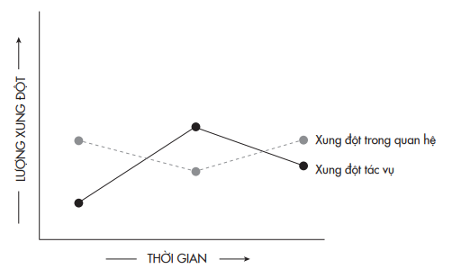
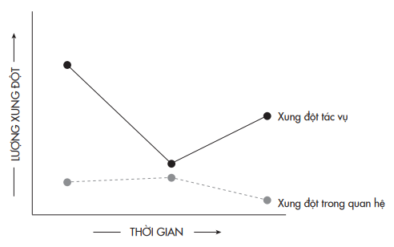
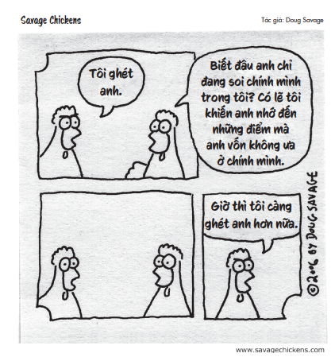
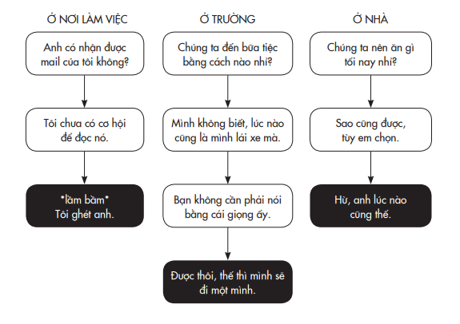

# Chương 4: Đấu Trường Lành Mạnh
## Tâm lý học về sự xung đột có tính xây dựng

---

---

Tranh cãi là cách hành xử cực kỳ tầm thường, bởi vì con người trong một xã hội thanh bình thì đều có quan điểm giống như nhau.

> *– Oscar Wilde*

Là hai con trai nhỏ nhất trong một gia đình đông con, hai cậu con của vị giám mục làm gì cũng có nhau. Họ cùng nhau lập ra một tờ báo và tự tay chế tạo máy in. Họ cùng nhau mở một cửa hàng xe đạp, sau đó bắt đầu tự sản xuất dòng xe đạp riêng. Và sau nhiều năm nhọc nhằn theo đuổi một vấn đề dường như bất khả thi, họ đã cùng nhau sáng chế thành công chiếc máy bay đầu tiên của nhân loại.

Khi Wilbur và Orville Wright lần đầu tiên bắt được một con bọ bay cũng là lúc cha của họ mang về cho hai anh em một chiếc trực thăng đồ chơi. Sau khi chiếc máy bay bị hỏng, họ tìm cách chế ra một chiếc khác. Trong suốt quá trình họ lớn lên cùng nhau, từ khi cùng nhau chơi đùa đến khi cùng nhau làm việc, cùng tái tư duy về khả năng bay của con người, không hề xảy ra sự xung đột nào giữa hai anh em. Đến độ Wilbur từng nói là họ luôn “suy nghĩ chung”. Tuy Wilbur là người khởi xướng dự án, cả hai chia sẻ thành quả ngang bằng nhau. Tới khi phải quyết định ai sẽ là người lái chuyến bay lịch sử của họ tại Kitty Hawk, họ cũng đơn giản dùng cách tung đồng xu.

Những phương thức tư duy mới thường nảy sinh từ những gắn kết cũ. Tình cảm khắng khít của bộ đôi diễn viên hài Tina Fey và Amy Poehler⁴⁵ khởi đầu từ thời tuổi đôi mươi khi cả hai cùng theo học một lớp diễn xuất và lập tức có thiện cảm với nhau. Sự đồng điệu về âm nhạc của các thành viên nhóm Beatles thậm chí được nhen nhóm từ sớm hơn – vào thời trung học. Chỉ vài phút sau khi được một người bạn chung giới thiệu họ với nhau, Paul McCartney đã chỉ John Lennon cách chỉnh dây đàn guitar. Chuỗi cửa hàng kem Ben & Jerry’s Ice Cream được xây dựng trên nền móng tình bạn giữa hai người sáng lập, vốn là bạn thân từ khi học chung thể dục năm lớp bảy. Có vẻ như để tiến bộ và phát triển cùng nhau, chúng ta cần phải đồng điệu. Nhưng sự thật, cũng như tất cả mọi sự thật trên đời, phức tạp hơn thế nhiều.

> **Chú thích:**⁴⁵ Cặp diễn viên người Mỹ tài năng, đồng thời là bạn thân thiết. (ND)

Một trong những chuyên gia hàng đầu thế giới về sự xung đột là nhà tâm lý học tổ chức người Úc, Karen “Etty” Jehn. Khi nói đến sự xung đột, hẳn bạn sẽ hình dung về điều mà Etty gọi là xung đột trong mối quan hệ – loại va chạm về cảm xúc, có tính cá nhân, bao hàm không chỉ bất đồng ý kiến mà có cả oán giận. Tôi ghét cay ghét đắng cậu⁴⁶. Ta sẽ dùng từ bình dân may ra ngươi mới hiểu, đồ đầu đất mặt thộn⁴⁷. Mày chơi trò đớp táo trong bồn cầu… và mày thích thế⁴⁸.

⁴⁶ Đây là câu thoại nổi tiếng của nhân vật Alfalfa (và Buckwheat) trong bộ phim The Little Rascals (1994). Những câu trích dẫn ở đoạn này được coi là những câu sỉ nhục “kinh điển” nhất từng được đưa lên màn ảnh. ⁴⁷ Câu thoại của nhân vật Westley trong bộ phim The Princess Bride (1987). ⁴⁸ Câu thoại của nhân vật Phillips trong bộ phim The Sandlot (1993). “Đớp táo” (Apple bobbing) là trò chơi truyền thống thường được chơi trong dịp lễ Halloween ở một số nước phương Tây. Những quả táo được thả vào một chậu nước và người chơi sẽ dùng răng để lấy táo ra ngoài.

Nhưng Etty còn nhận diện một sắc thái khác được gọi là xung đột tác vụ – loại xung đột về ý tưởng và quan điểm. Loại xung đột này xảy ra khi chúng ta tranh cãi về chuyện thuê mướn người, chọn nhà hàng cho bữa tối, nên đặt tên con là Gertrude hay Quasar. Câu hỏi đặt ra là liệu hai loại xung đột này có dẫn đến những hệ quả khác nhau không.

Vài năm trước, tôi đã tiến hành nhiều cuộc khảo sát về sự xung đột trên hàng trăm đội nhóm mới ở Thung lũng Silicon trong suốt sáu tháng đầu họ làm việc với nhau. Dù cãi vã liên tục và chẳng đồng tình với nhau về bất cứ điều gì, nhưng họ đồng ý với nhau về loại xung đột mình đang có. Khi các dự án được hoàn thành, tôi yêu cầu người quản lý của họ đánh giá hiệu quả làm việc của từng nhóm.

Những đội nhóm làm việc kém nhất đều đã bắt đầu làm việc với nhiều xung đột trong quan hệ hơn là xung đột tác vụ. Họ sớm bị cuốn vào hiềm khích cá nhân và quá bận tâm thù ghét lẫn nhau tới độ không còn đủ thoải mái để thách thức quan điểm của nhau. Nhiều nhóm phải mất hàng tháng trời mới thật sự có tiến triển trong việc giải quyết các vấn đề về tương tác, và khi họ đã ngồi lại được với nhau để tranh luận về các quyết định quan trọng thì thường đã quá muộn để cân nhắc lại chiến lược hoặc hướng đi.

### NHÓM LÀM VIỆC KÉM HIỆU QUẢ

Thế còn điều gì xảy ra ở các đội nhóm làm việc hiệu quả cao? Như bạn có thể đã đoán được, họ bắt đầu làm việc với rất ít xung đột trong quan hệ và duy trì như vậy trong suốt quá trình làm việc cùng nhau. Điều này không hề ngăn họ khỏi những xung đột tác vụ khi bắt đầu làm việc: họ không ngần ngại bày tỏ những quan điểm đối nghịch. Khi giải quyết được một số khác biệt về quan điểm, họ có thể thống nhất một hướng đi chung và xúc tiến công việc cho đến khi vấp phải những vấn đề mới cần tranh luận.

### NHÓM LÀM VIỆC HIỆU QUẢ CAO

Nhìn chung, hiện đã có hơn một trăm nghiên cứu về các loại xung đột được thực hiện trên hơn tám ngàn đội nhóm làm việc. Một phân tích meta của những nghiên cứu đó cho thấy các xung đột trong mối quan hệ thường gây bất lợi cho hiệu quả công việc, nhưng một số xung đột tác vụ có thể mang đến lợi ích: nó dẫn đến sức sáng tạo cao hơn và những lựa chọn thông minh hơn. Chẳng hạn, bằng chứng cho thấy khi các nhóm trải qua xung đột tác vụ ở mức vừa phải trong giai đoạn đầu, công việc của họ đạt kết quả tốt hơn: ở các công ty công nghệ của Trung Quốc, họ nảy ra nhiều ý tưởng độc đáo hơn; ở các dịch vụ giao hàng của Hà Lan, họ có nhiều sáng kiến cải tiến hơn; và ở các bệnh viện Hoa Kỳ, họ đưa ra những quyết định đúng đắn hơn. Một nhóm nghiên cứu đã kết luận như sau: “Sự vắng bóng của xung đột không phải là sự hòa thuận, đó là tình trạng thờ ơ”.

Xung đột trong quan hệ phần nào mang tính hủy hoại bởi vì nó cản trở tái tư duy. Khi một va chạm nhuốm màu cá nhân và cảm tính, chúng ta biến thành những nhà truyền giáo tự cho quan điểm của mình là đúng, những công tố viên mang tư tưởng đối đầu với đối phương, hay những chính trị gia bảo thủ bác bỏ mọi ý kiến từ phe phái khác. Xung đột tác vụ có thể mang tính xây dựng khi nó giúp đa dạng hóa tư tưởng, ngăn chúng ta mắc kẹt trong vòng lặp cố chấp. Nó có thể giữ cho chúng ta luôn khiêm nhường, khuyến khích chúng ta bày tỏ những hoài nghi, và thúc đẩy chúng ta tò mò liệu mình có đang bỏ sót điều gì hay không. Điều đó dẫn chúng ta tới việc tái tư duy, đưa chúng ta đến gần sự thật hơn mà không gây tổn hại đến các mối quan hệ.

Mặc dù bất đồng sinh lợi⁴⁹ là một kỹ năng sống tối quan trọng, nhưng nó cũng là thứ mà nhiều người chưa bao giờ phát triển một cách trọn vẹn. Vấn đề này có căn nguyên từ thời ấu thơ: cha mẹ chỉ thể hiện bất đồng trong phòng kín vì sợ rằng sự xung đột sẽ khiến các con lo lắng hay ảnh hưởng xấu tới tính cách của chúng. Song nghiên cứu cho thấy rằng mức độ thường xuyên của các cuộc tranh cãi giữa cha mẹ không thật sự liên quan đến kết quả học tập hay sự phát triển cảm xúc và kỹ năng xã hội của con cái. Yếu tố quyết định là mức độ tôn trọng lẫn nhau giữa cha và mẹ trong các cuộc tranh cãi chứ không phải tần suất xảy ra. Khi cha mẹ tranh cãi với tinh thần xây dựng, trẻ thường có sự cân bằng hơn về mặt cảm xúc ở bậc tiểu học và khi lớn lên thường thể hiện rõ nét sự bao dung và thái độ sẵn sàng giúp đỡ bạn bè nhiều hơn.

>**Chú thích:**⁴⁹ Bất đồng sinh lợi (tiếng Anh: productive disagreement) là khái niệm được đưa ra trong một quyển sách của Buster Benson. Theo đó, bất đồng có thể trở thành công cụ mạnh mẽ mà chúng ta có thể tận dụng để làm sâu sắc thêm mối quan hệ, giải quyết vấn đề và nảy sinh những ý tưởng mới.

Biết cách đấu tranh hợp lý không chỉ giúp chúng ta văn minh hơn, nó còn làm tăng trưởng sức sáng tạo của chúng ta. Trong một nghiên cứu kinh điển, những kiến trúc sư sáng tạo hơn so với đồng nghiệp – những người có cùng năng lực chuyên môn nhưng kém hơn về mặt ý tưởng, đa phần xuất thân từ các gia đình thường xuyên có bất đồng. Họ thường lớn lên dưới những mái nhà “căng thẳng nhưng an toàn”, như lời mô tả của nhà tâm lý học Robert Albert: “Người có hạt mầm sáng tạo không sinh trưởng trong một mái ấm bình yên, mà đến từ một gia đình ‘sôi động’”. Cha mẹ của họ không hành hạ người khác bằng lời nói hay vũ lực, nhưng họ cũng không ngại va chạm. Thay vì dạy con cái chỉ biết khoanh tay lắng nghe, họ khuyến khích chúng bảo vệ chính kiến của mình. Bọn trẻ học cách đưa ra ý kiến của mình lẫn cách đón nhận ý kiến của người khác. Đó chính xác là những gì đã xảy qua với Wilbur và Orville Wright.

Khi anh em nhà Wright nói rằng họ suy nghĩ cùng nhau, họ thật sự muốn nói là họ chiến đấu cùng nhau. Tranh cãi là nếp sinh hoạt của gia đình Wright. Mặc dù cha của họ là một giáo sĩ ở nhà thờ địa phương nhưng trong thư viện của ông vẫn có những quyển sách của các tác giả vô thần – ông khuyến khích các con đọc và tranh luận về sách. Các con của ông đã xây dựng tinh thần mạnh dạn tranh đấu cho ý kiến của mình và bản lĩnh để chấp nhận thua mà không thoái chí. Với những vấn đề hai anh em cần giải quyết, cuộc tranh cãi của họ kéo dài không chỉ trong vài giờ mà có khi tới hàng tuần, hàng tháng. Họ không có kiểu cãi nhau vặt vãnh liên miên chỉ vì nóng giận. Họ không ngừng tranh cãi vì cảm thấy việc tranh cãi thú vị và cũng giúp họ học hỏi kinh nghiệm. “Tôi thích đối đầu với Orv”, Wilbur kể lại. Như bạn sẽ thấy, trong những cuộc tranh cãi sôi nổi và dai dẳng nhất của anh em Wright đã đưa họ đến việc tái dư duy về một giả định then chốt mà nếu cứ bám theo nó thì con người đã không thể chinh phục được bầu trời.

## CẢNH NGỘ CỦA KẺ CHIỀU LÒNG THIÊN HẠ

Ngẫm lại thì từ bé tôi đã xác định mình phải là người gìn giữ hòa bình. Có thể vì tôi bị đám bạn thời trung học tẩy chay. Có thể do di truyền. Có thể vì cha mẹ tôi ly hôn. Bất kể nguyên nhân là gì, trong tâm lý học có một thuật ngữ dành riêng cho “điểm yếu” này của tôi. Nó được gọi là tính dễ chịu, là một trong những đặc điểm tính cách chính của con người trên khắp thế giới. Những người dễ chịu có xu hướng tử tế. Thân thiện. Lịch sự. Giống người Canada⁵⁰. ⁵⁰ Trong một phân tích dựa trên 40 triệu dòng trạng thái trên Twitter, người Mỹ hay sử dụng các từ chửi thề hơn người Canada, trong khi người Canada thường ưa dùng các từ dễ chịu hơn, như cảm ơn, thật tuyệt, tốt quá, và chắc rồi. (TG)

Thôi thúc đầu tiên trong tôi luôn là tránh những xung đột, dù là nhỏ nhất. Khi bắt phải một chiếc xe Uber mở điều hòa lạnh thấu xương, tôi phải cố tránh để mở miệng yêu cầu tài xế tăng nhiệt độ – tôi cứ ngồi đó im lặng co ro cho tới khi răng va lập cập vào nhau. Khi bị ai đó giẫm lên giày của tôi, tôi thật sự còn nói xin lỗi vì đã vô ý đặt chân ngáng đường họ. Khi sinh viên điền vào bảng đánh giá môn học do tôi phụ trách, một trong những phàn nàn nổi cộm của họ là tôi “quá tử tế với những phát biểu ngu ngốc (của sinh viên) trong lớp”.

### TẠI SAO TÔI TRÁNH XUNG ĐỘT

Người khó tính thường hay chỉ trích, đa nghi và hay thách thức – và vì vậy, họ có xu hướng trở thành kỹ sư hay luật sư nhiều hơn so với bạn đồng trang lứa. Họ không chỉ thoải mái với những xung đột, nói đúng hơn là sự xung đột tiếp thêm năng lượng cho họ. Nếu bạn cực kỳ khó tính, một cuộc tranh cãi có lẽ đem đến cho bạn nhiều niềm vui hơn so với một cuộc trò chuyện thân tình. Tính cách này thường bị mang tiếng xấu: họ bị cho là những kẻ bẳn tính luôn bác bỏ, chê bai mọi ý kiến, hay những tên Giám ngục⁵¹ hút cạn niềm vui khỏi mọi cuộc họp. Tuy nhiên, khi tìm hiểu về Pixar, tôi sáng tỏ ra một góc nhìn hoàn toàn khác.

>**Chú thích:**⁵¹ Sinh vật huyền bí trong truyện/phim Harry Potter, là những sinh vật ma thuật hút niềm vui và hạnh phúc (linh hồn) ra khỏi nạn nhân. (ND)

Vào năm 2000, Pixar nổi lên như một hiện tượng. Đội ngũ nhân viên của họ đã sử dụng công nghệ máy tính để thay đổi tư duy ngành hoạt hình với bộ phim bom tấn đầu tiên, Toy Story (Câu chuyện đồ chơi), và gây sốt với hai tác phẩm sau đó nữa. Tuy nhiên, các nhà sáng lập công ty không ngủ quên trên chiến thắng. Họ tuyển Brad Bird, một đạo diễn bên ngoài vào với mong muốn khuấy động mọi thứ lên. Brad lúc ấy cũng vừa ra mắt bộ phim đầu tay, tuy được giới chuyên môn đánh giá cao nhưng lại thất bại ở phòng vé, nên ông nung nấu ý định sáng tạo ra cái gì đó hoành tráng và ấn tượng. Khi ông đề đạt tầm nhìn của mình, những người đứng đầu mảng kỹ thuật ở Pixar lắc đầu, nói đây là chuyện bất khả thi: họ sẽ cần cả chục năm và 500 triệu đô-la mới làm nổi.

Brad không dễ bỏ cuộc. Ông lôi kéo những thành phần quái kiệt nhất Pixar vào dự án của mình – những người khó tính, không an phận và chẳng bao giờ hài lòng. Người thì gọi họ là cừu đen⁵²; kẻ khác gọi họ là cướp biển. Khi Brad tập hợp những người đó thành một đội, ông cảnh báo họ rằng chẳng một ai tin họ sẽ làm ra ngô ra khoai dự án này. Chỉ bốn năm sau đó, đội của ông không chỉ thành công khi cho ra đời bộ phim phức tạp nhất của Pixar tính tới thời điểm bấy giờ; họ còn giảm được đáng kể chi phí sản xuất tính trên phút. Bộ phim The Incredibles (Gia đình siêu nhân) đạt tổng doanh thu toàn cầu đến hơn 631 triệu đô-la và giành giải Oscar cho hạng mục Phim Hoạt hình Hay nhất.

>**Chú thích:**⁵² Black sheep là từ dùng ám chỉ một thành viên trong gia đình, công ty, tổ chức… có tính cách khác biệt, thậm chí lập dị, so với các thành viên còn lại. Từ này thường mang nghĩa chỉ trích, vì nó ám chỉ sự khác biệt theo hướng tiêu cực: hành vi nổi loạn, bốc đồng, ngang bướng, khó kiểm soát.

Hãy để ý điều Brad không làm. Ông không đưa vào đội của mình những người dễ chịu. Người dễ chịu là những thành viên tuyệt vời của một mạng lưới hỗ trợ: họ hăm hở động viên và cổ vũ tinh thần cho chúng ta. Tái tư duy lại cần một mạng lưới khác: mạng lưới thử thách, là một đội ngũ những người mà chúng ta tin rằng sẽ chỉ ra được những điểm mù trong tư duy và giúp chúng ta khắc phục các điểm yếu. Vai trò của họ là kích hoạt những vòng lặp tái tư duy bằng việc buộc chúng ta phải khiêm nhường về khả năng chuyên môn của mình, hồ nghi kiến thức bản thân, và mong muốn hiểu biết về những tầm nhìn mới.

Những thành viên lý tưởng của một mạng lưới thử thách là người khó tính, bởi vì họ chẳng hề ngại chất vấn những cách thức theo lối mòn và buộc chúng ta có trách nhiệm tái tư duy. Bằng chứng cho thấy những người khó tính thường lên tiếng nhiều hơn – nhất là khi giới lãnh đạo không chịu tiếp thu – và tạo thêm nhiều xung đột tác vụ. Họ giống như người bác sĩ trong loạt phim truyền hình House (Bác sĩ House⁵³) hay người sếp trong bộ phim The Devil Wears Prada (Yêu nữ thích hàng hiệu). Họ đưa ra những lời phê bình khắt khe mà ta có thể chẳng muốn nghe, nhưng đấy lại là những điều chúng ta cần nghe. ⁵³ Loạt phim truyền hình chính kịch khai thác đề tài y khoa với nhân vật chính là bác sĩ Gregory House.

Cầm cương người khó tính không phải là chuyện dễ. Việc này đòi hỏi những điều kiện nhất định phải được thỏa mãn. Các nghiên cứu ở các công ty khoan dầu và công nghệ gợi ý rằng sự bất mãn chỉ giúp phát huy óc sáng tạo khi con người ta cảm thấy được hỗ trợ và cam kết, và những cá nhân dị biệt về văn hóa so với tập thể sẽ có khả năng đóng góp giá trị nhiều nhất khi họ có sự gắn kết bền chặt với các đồng sự của mình⁵⁴.

>**Chú thích:**⁵⁴ Trong xây dựng đội ngũ, trên vài phương diện thì sự tương hợp là cần thiết, và trong một vài phương diện khác, sự bất đồng lại mang đến giá trị nhiều hơn. Nghiên cứu cho thấy chúng ta cần những người khác biệt về tính cách và xuất thân, nhưng tương đồng về mặt nguyên tắc. Sự đa dạng về tính cách và kinh nghiệm đem lại những ý tưởng mới thúc đẩy tái tư duy và cho phép bổ trợ kỹ năng cho nhau nhằm tạo ra các cách thức làm việc mới. Những giá trị chung củng cố tinh thần cam kết và hợp tác. (TG)

Trước khi Brad Bird gia nhập Pixar, công ty này vốn đã nổi danh về việc thúc đẩy người tài vượt qua những giới hạn. Nhưng các tác phẩm trước của hãng phim đã lấy đề tài đồ chơi, côn trùng và quái vật, vốn khá đơn giản để tạo hình nhân vật. Bởi vì để làm ra một bộ phim siêu anh hùng với nhân vật giống người trong đời thật là vượt quá năng lực xử lý của hệ thống máy tính đồ họa vào thời điểm ấy, nên không lạ khi đội ngũ kỹ thuật bác bỏ ý tưởng của Brad về The Incredibles. Đó là lúc ông lập nên mạng lưới thử thách của mình. Ông tuyển mộ cho riêng mình một băng nhóm quái kiệt, những “tên cướp biển”, nhằm khuyến khích những xung đột tác vụ và tái tư duy về quy trình làm việc.

Brad tập hợp “nhóm cướp biển” ở sân khấu của hãng phim Pixar và nói với họ rằng dù cho hàng tá người thủ cựu và lãnh đạo công ty có thể không tin tưởng họ, nhưng ông vẫn đặt niềm tin ở họ. Sau phần phát biểu lên dây cót tinh thần cho nhóm, ông tìm mọi cách để khơi gợi họ phát triển ý tưởng. “Tôi cần những người không bằng lòng với mọi việc bởi vì họ có cách làm tốt hơn và luôn nóng lòng tìm ra hướng đi”, Brad kể lại. “Các chiến xa này bao lâu nay chỉ rồ ga trong ga-ra thay vì được thỏa sức trên đường đua. Chỉ cần bạn mở cửa ga-ra, họ sẽ đưa bạn đi xa ngoài mong đợi”. Đội quân cướp biển có khả năng ứng biến với tình hình – họ luôn tìm kiếm những phương án giúp tiết kiệm thay cho những công nghệ tốn kém và giải pháp tình thế đơn giản để xử lý những vấn đề phức tạp. Tới khi phải dựng hình các nhân vật gia đình siêu nhân, họ đã không cắm đầu vào thiết kế bộ khung cử động phức tạp với chằng chịt những khối cơ. Thay vào đó, họ tìm ra cách ghép những hình ô-van đơn giản vào nhau để tạo nên các khối cơ bản cho các cơ bắp phức tạp.

Khi tôi hỏi Brad làm thế nào mà ông ấy nhận ra giá trị của đội quân cướp biển, ông nói bởi vì ông chính là một trong số họ. Nhớ lại thời niên thiếu, khi đến nhà một người bạn ăn tối, ông đã sửng sốt trước những câu hỏi lịch sự mà cha mẹ bạn mình hỏi về việc học ở trường của con. Bữa tối ở gia đình Bird thì chẳng khác nào một trận khẩu chiến trên bàn ăn, nơi tất cả mọi người đều tranh nhau nói, tranh luận và bày tỏ ý kiến. Brad thấy những câu chuyện trao đổi tuy ồn ào nhưng rất lý thú, và ông mang tinh thần ấy vào công việc trong mơ đầu tiên của mình tại Disney. Những ngày mới vào nghề, ông được đào tạo và hướng dẫn bởi một nhóm những bậc thầy kỳ cựu của Disney, những người luôn đặt chất lượng lên hàng đầu, và ông vô cùng bức bối khi những người thay thế họ sau này – cũng chính là những người giám sát thế hệ trẻ hơn tại xưởng phim – đã không duy trì các tiêu chuẩn như xưa. Chỉ vài tháng sau khi tham gia thực hiện bộ phim hoạt hình đầu tiên trong sự nghiệp của mình tại Disney, Brad đã chỉ trích các lãnh đạo kỳ cựu vì đã nhận làm các dự án cũ kỹ và tạo ra những tác phẩm hạng hai. Họ bảo ông im miệng và lo làm việc của mình đi. Khi ông từ chối làm vậy, họ đã sa thải ông.

Bản thân tôi đã chứng kiến rất nhiều lãnh đạo luôn phòng vệ trước những xung đột tác vụ. Càng nắm thêm quyền hành, họ càng ngoảnh mặt với những người “gây rối” mà nghe theo các thành phần bợ đỡ. Họ trở thành những chính trị gia muốn vây quanh mình những người dễ chịu, biết nghe lời và họ dễ bị ngã lòng trước lời đường mật của những kẻ xu nịnh. Nghiên cứu cho thấy rằng khi tình hình doanh nghiệp đi xuống, các giám đốc điều hành quen được tâng bốc và vâng lời sẽ trở nên cố chấp. Họ sẽ bám lấy các kế hoạch chiến lược hiện có thay vì cân nhắc việc chuyển hướng – đây là nguyên nhân khiến họ đâm đầu vào thất bại không tránh khỏi.

Chúng ta học hỏi được từ những người thách thức phương pháp tư duy của chúng ta nhiều hơn là từ những người luôn ủng hộ những gì chúng ta kết luận. Các nhà lãnh đạo bản lĩnh tiếp thu phê bình và lấy đó tôi luyện bản thân. Những lãnh đạo yếu kém ngăn chặn mọi phê bình và tự khiến mình yếu kém hơn. Phản ứng này không chỉ có ở những người nắm quyền hành. Dẫu cho có đồng tình với nguyên tắc này, thì trên thực tế chúng ta vẫn thường xuyên bỏ qua giá trị của mạng lưới thử thách.

Trong một thí nghiệm, khi người tham gia thí nghiệm bị người bắt cặp chỉ trích thay vì khen ngợi, họ có xu hướng đòi đổi đối tác khác nhiều gấp bốn lần. Ở đa số các môi trường làm việc, khi nhân viên nhận được lời phê bình nặng nề từ đồng nghiệp, phản ứng mặc định của họ là tránh mặt đồng nghiệp đó hoặc tìm cách loại người đó ra khỏi mọi mạng lưới tương tác của mình, và kết quả là hiệu quả công việc của họ bị ảnh hưởng suốt một năm sau đó.

Một số tổ chức và doanh nghiệp tìm cách ngăn chặn sự phát triển những xu hướng trên bằng cách xây dựng các mạng lưới thử thách vào văn hóa làm việc của họ. Lầu Năm Góc và Nhà Trắng đôi khi sử dụng một nhóm có tên rất kêu là “ủy ban hành thích⁵⁵” nhằm khuyến khích những xung đột tác vụ. Ủy ban này tập hợp những nhân vật có tư duy khắt khe nhất để dẹp bỏ không thương tiếc các kế hoạch hay ứng viên yếu kém. Tại X⁵⁶, hay còn gọi là “Xưởng phóng tên lửa lên mặt trăng” của Google, cũng có một đội đánh giá nhanh chuyên trách các đề xuất tư duy đột phá: các thành viên tiến hành những đánh giá độc lập và chỉ đề xuất lên cấp trên các ý tưởng vừa đột phá vừa phải khả thi. Trong khoa học, quy trình đánh giá đồng đẳng (peer-review) như trên thường được đặt trên nền móng cơ bản là một mạng lưới thử thách. Chúng tôi nộp các bài báo khoa học với trạng thái ẩn danh, và các bài báo này được duyệt một cách khách quan bởi các chuyên gia độc lập. Tôi sẽ không bao giờ quên một lá thư từ chối mình từng nhận được, trong đó có lời khuyên rằng tôi nên viết lại và tìm đọc công trình nghiên cứu của Adam Grant. Thưa ngài, tôi là Adam Grant đây.

>**Chú thích:**⁵⁵ Nguyên văn: murder board. ⁵⁶ X Development, công ty con của Google, tên cũ là Google X.

Khi viết một quyển sách, tôi thích lập ra một mạng lưới thử thách của riêng mình. Tôi chiêu mộ một nhóm những nhà phê bình sâu sắc mà tôi biết và nhờ họ mổ xẻ không thương tiếc từng chương một. Tôi hiểu rằng việc xem xét cả hệ giá trị lẫn tính cách của họ là rất quan trọng – tôi tìm kiếm những người khó tính đồng thời là người cho đi, không phải người chỉ biết nhận. Người cho đi khó tính là những nhà phê bình tuyệt nhất: bởi mục đích của họ là nâng cao chất lượng công việc chứ không phải để phục vụ cái tôi cá nhân. Họ phê bình không phải bởi vì họ bất an, họ phản biện bởi vì họ thật lòng quan tâm. Họ trao đi một tình yêu thương nghiêm khắc⁵⁷.

⁵⁷ Việc chúng ta sẵn sàng đón nhận lời phê bình ở mức nào phụ thuộc vào mối quan hệ của chúng ta với người đưa ra phản biện cũng nhiều như vào bản thân nội dung lời phê bình ấy. Trong một thí nghiệm, người tham gia có mức sẵn sàng đón nhận lời phê bình tăng lên ít nhất 40% sau khi họ nghe câu này: “Tôi dành cho bạn những lời nhận xét này bởi vì tôi có những kỳ vọng rất cao và tôi biết chắc bạn có thể đạt được chúng”. Việc đón nhận một sự thật phũ phàng hóa ra lại dễ đến không ngờ khi những lời phê phán ấy đến từ một ai đó tin tưởng ở tiềm năng của bạn và thật lòng muốn bạn thành công. (TG)

Ernest Hemingway từng nói: “Tài năng tinh túy nhất của một nhà văn giỏi là chiếc máy dò chống sốc sẵn có bên trong, dùng để dò những thứ rác rưởi⁵⁸”. Mạng lưới thử thách của tôi chính là chiếc máy dò này. Tôi hình dung đây là một đấu trường vui vẻ. Nguyên tắc đầu tiên của đấu trường: né tránh tranh cãi là một thói xấu. Im lặng là xem thường giá trị của các quan điểm đối phương đưa ra, đồng thời coi nhẹ khả năng của mình trong việc thể hiện sự bất đồng một cách văn minh.

>**Chú thích:** ⁵⁸ Ý nói những ý tưởng tồi hay vớ vẩn.

Brad Bird sống đúng với nguyên tắc ấy. Những cuộc tranh cãi của ông với nhà sản xuất lâu năm của mình là John Walker đã được nhiều người truyền tụng. Khi thực hiện bộ phim The Incredibles, họ đấu khẩu về mọi chi tiết nhân vật, không sót điểm nào – từ việc mái tóc của ông bố siêu anh hùng nên có đường rẽ ngôi như thế nào, cho đến việc cô con gái tuổi ô mai có nên để tóc dài và bồng bềnh không. Có một thời điểm, Brad muốn nhân vật em bé biến hình thành một dạng thể nhầy, có tính dính, giống như thạch, nhưng John đã phủ quyết. Ý tưởng này quá khó để dựng hình hoạt họa, mà họ đã chậm khá xa so với tiến độ rồi. “Tôi chỉ đang cố thúc anh đi đúng hướng”, John nói và cười sảng khoái. “Anh bạn à, tôi chỉ đang cố đưa hai chúng ta về đến đích thôi.” Đập tay lên bàn, Brad bật lại: “Còn tôi thì đang cố gắng đưa chúng ta về đích ở hạng nhất”.

Cuối cùng John cũng thuyết phục được Brad từ bỏ ý tưởng bay bổng kia và vụ biến hình được bỏ qua. “Tôi thích làm việc cùng John, vì anh ấy không ngại nói thẳng mọi thứ với tôi”, Brad chia sẻ. “Thật tốt là chúng tôi luôn bất đồng. Thật tốt là chúng tôi thường tranh luận cho ra ngô ra khoai. Nhờ đó mà mọi thứ hoàn hảo hơn”.

Nhờ có những bất đồng mà Brad đã giành được hai giải Oscar – ông cũng trở thành một người có kỹ năng học hỏi tốt hơn và một lãnh đạo tốt hơn. Về phần John, ông cũng không kịch liệt phản bác ý tưởng sáng tạo em bé siêu nhân thạch. Ông chỉ bảo Brad cần chờ thêm. Quả đúng vậy, trong phần hậu truyện của The Incredibles được ra mắt mười bốn năm sau, cậu bé siêu nhân đã có màn đánh nhau với một con gấu mèo và đã biến hình thành dạng thạch “siêu dính”. Phân cảnh đó làm mấy đứa con tôi cười nhiều chưa từng thấy.

## HÃY TỈNH TÁO VỚI BẤT ĐỒNG

Tranh luận đến cùng những góc nhìn trái ngược cũng có những mặt trái tiềm ẩn – những nguy cơ mà chúng ta cần kiểm soát. Trong bộ phim The Incredibles phần đầu, một người trẻ đầy triển vọng tên Nicole Grindle đã tạo hình được mái tóc nhân vật khi lặng lẽ quan sát từ xa cách mà John và Brad tương tác với nhau. Khi Nicole tham gia sản xuất phần hậu truyện của bộ phim cùng với John, một trong những mối bận tâm của cô là âm lượng tranh cãi của hai vị lãnh đạo tiếng tăm lẫy lừng có thể sẽ lấn át tiếng nói của những người vốn ngại lên tiếng: đó là những nhân viên mới, người hướng nội, phụ nữ hay nhóm thiểu số. Phản ứng thông thường của những người thiếu quyền hành hay vị thế là chuyển sang chế độ tư duy của chính trị gia, đè nén những quan điểm đối lập của bản thân để chiều theo ý kiến của những người “quyền cao chức trọng”. Đôi khi họ không có lựa chọn nào khác nếu không muốn bị mất việc.

Nhằm đảm bảo nhu cầu được tán thành của họ không trở thành rào cản ngăn họ khỏi các xung đột tác vụ, Nicole khuyến khích người mới nêu lên các ý kiến trái chiều ra để thảo luận. Một số người trình bày trực tiếp trước tập thể; số khác lại tìm đến cô để xin ý kiến phản hồi hay sự ủng hộ cá nhân. Mặc dù Nicole không thuộc nhóm “cướp biển”, nhưng vì tự xem mình là người cổ xúy cho những góc nhìn đa chiều nên cô trở nên thoải mái khi đấu tranh với Brad về các nhân vật và lời thoại. “Brad vẫn là một trong những tay khó chịu đời đầu ở Pixar, thế nên bạn phải sẵn sàng cho một cuộc tranh luận nảy lửa khi đề xuất một ý tưởng đối lập.”

Ý niệm về một cuộc tranh luận nảy lửa giúp chúng ta khám phá ra một điều quan trọng về cách thức và lý do diễn ra một đấu trường lành mạnh. Nếu có cơ hội xem Brad và các cộng sự tranh cãi với nhau – hay nói đúng hơn là cuộc chiến giữa những “tên cướp biển”

> *– bạn có thể sớm nhận ra sự căng thẳng giữa họ đơn thuần là về lý lẽ, không có cảm xúc chen vào. Bầu không khí sôi nổi và đầy nhiệt huyết chứ không hiếu chiến hay gây hấn. Họ không bất đồng chẳng vì lý do nào cả; họ bất đồng vì sự tận tâm dành cho công việc. Nicole giải thích: “Dù bạn thể hiện bất đồng công khai hay âm thầm, thì khi kiên trì đưa ra những góc nhìn khác biệt là chúng ta cùng chung sức để nhắm đến một mục tiêu chung là sự xuất chúng

> *– làm ra những kiệt tác phim ảnh”.*

Sau khi quan sát “cận cảnh” cách họ tương tác với nhau, tôi cuối cùng cũng hiểu ra một phẩm chất mà lâu nay tôi cho là mâu thuẫn với tính cách của mình: làm thế nào mình có thể vừa dễ tính vừa thích tranh cãi lành mạnh. Dễ chịu có nghĩa là tìm kiếm sự chan hòa trong giao tiếp xã hội, chứ không phải sự đồng lòng về mặt nhận thức. Chúng ta hoàn toàn có thể bất đồng ý kiến mà không trở thành một kẻ khó ưa. Mặc dù tôi sợ chết khiếp việc làm người khác tổn thương, nhưng khi cần chất vấn suy nghĩ của ai đó, tôi không chút ngại ngần. Trên thực tế, việc tôi tranh cãi với một ai đó không phải là biểu hiện của sự thiếu tôn trọng, mà chính là dấu hiệu của sự tôn trọng. Nó thể hiện rằng tôi coi trọng quan điểm của họ đến độ tôi muốn tranh luận về nó. Nếu ý kiến của họ không có giá trị gì với tôi, tôi sẽ chẳng bận tâm. Tôi biết mình sẽ có thiện cảm với ai đó khi cả hai đều thấy hứng thú với việc chứng minh người kia sai.

Người dễ chịu không phải là người luôn tránh né mọi xung đột. Họ dễ dàng hòa nhịp với những người xung quanh và thường thích ứng tốt với các quy chuẩn của tập thể. Dẫn chứng ưa thích của tôi cho điều này là một thí nghiệm do các đồng nghiệp của tôi, Jennifer Chatman và Sigal Barsade, thực hiện. Thí nghiệm cho thấy người dễ chịu thường nhiệt tình với đồng đội hơn hẳn những người khó tính, miễn là họ được xếp vào một đội có tinh thần cộng tác. Khi được xếp vào một đội có tính cạnh tranh cao, họ hành xử khó tính không khác gì các đồng đội khó tính của mình.

Điều đó cho thấy những người như Brad Bird có tác động ra sao lên những người như John Walker khi họ làm việc hay cộng tác với nhau. Bản tính của John là tránh xung đột: khi đi nhà hàng, nếu người phục vụ mang ra nhầm món, ông sẽ bỏ qua và vẫn đồng ý ăn món ấy. “Nhưng khi tôi tham gia vào một việc gì đó lớn lao hơn bản thân mình”, ông phân tích, “tôi cảm thấy như mình được trao cho một cơ hội, một trọng trách thật sự, nên tôi cần phải lên tiếng, trình bày, tranh luận. Khi vào việc thì có thể choảng nhau nảy lửa, nhưng khi ra khỏi công việc thì lại bá vai nhau đi làm ly bia”.

Khả năng thích ứng ấy cũng thể hiện rất rõ ràng trong mối quan hệ của anh em nhà Wright. Orville đã sẵn có một mạng lưới thử thách ở chính con người Wilbur. Wilbur có tiếng là người cực kỳ khó tính: ông không bao giờ nao núng bởi ý kiến của người khác và ông còn có thói quen tấn công ý tưởng người khác ngay khi ý tưởng đó được nói ra. Orville thì được biết đến với tính cách nhẹ nhàng, vui vẻ và nhạy cảm với những lời chỉ trích. Vậy mà các phẩm chất ấy dường như “bốc hơi” khi Orville cộng tác với anh trai mình. “Cậu ấy đúng là một người biết cãi nhau”, Wilbur nhận xét. Một đêm mất ngủ, Orville nảy ra sáng kiến làm bánh lái có thể chuyển động thay vì cố định. Trong bữa điểm tâm sáng hôm sau, Orville nháy mắt với một cộng sự trong tư thế sẵn sàng trình bày ý tưởng ấy với Wilbur, đoán chắc thể nào Wilbur cũng bật chế độ thách thức lên và bác bỏ đề xuất. Nhưng thật ngạc nhiên, Wilbur ngay lập tức nhìn ra tiềm năng của ý tưởng ấy và nó đã trở thành một trong những phát kiến quan trọng của họ.

Những người khó tính không chỉ thách thức chúng ta phải tái tư duy. Họ còn làm cho những người dễ chịu thấy thoải mái với việc tranh luận. Thay vì tránh né va chạm, các đồng nghiệp gắt gỏng của chúng ta chọn cách đương đầu trực diện. Bằng việc thể hiện rõ rằng họ có thể đảm đương mọi kiểu bất đồng, những người này tạo ra một cái chuẩn cho tất cả chúng ta làm theo. Tuy nhiên, nếu chúng ta không cẩn trọng, một chút tranh cãi ban đầu có thể trở thành một trận sống mái. Làm thế nào chúng ta có thể tránh tình huống khó kiểm soát này?

### XUNG ĐỘT TÁC VỤ CÓ THỂ CHUYỂN THÀNH XUNG ĐỘT VỀ QUAN HỆ NHƯ THẾ NÀO

## SÔI NỔI NHƯNG KHÔNG SÔI MÁU

Vấn đề chính đối với xung đột tác vụ là nó dễ biến tướng thành xung đột về quan hệ. Chỉ một phút trước, bạn còn đang bất đồng về chuyện nên ướp bao nhiêu gia vị vào món gà tây cho lễ Phục sinh, và một phút sau bạn thấy mình quát lên “Đồ mũi điếc!”.

Mặc dù anh em nhà Wright đã sống bên nhau cả đời, đủ để hiểu ngòi nổ của nhau ở chỗ nào, nhưng không có nghĩa là lúc nào họ cũng giữ được bình tĩnh. Thử thách quan trọng cuối cùng để họ có thể bay được lại chính là vấn đề nan giải duy nhất: thiết kế cánh quạt máy bay. Họ biết rằng máy bay sẽ không thể cất cánh nếu thiếu bộ phận này, song loại cánh quạt thích hợp vẫn chưa có mặt trên đời. Trong lúc chật vật thử nhiều cách khác nhau, họ tranh cãi qua lại hàng giờ liền, và thường xuyên lớn tiếng. Mối bất hòa kéo dài nhiều tháng trời khi mỗi người thay phiên rao giảng về giải pháp của riêng mình và lên án quan điểm của người kia. Cuối cùng em gái của họ, Katharine, dọa sẽ bỏ nhà đi nếu hai người không thôi cãi nhau. Nhưng họ vẫn tiếp tục như thế, cho đến một tối, căng thẳng lên đến đỉnh điểm trong một trận đấu khẩu lớn tiếng chưa từng có.

Thật lạ là buổi sáng hôm sau, họ đến xưởng và cư xử như chưa hề có chuyện gì xảy ra. Họ khơi lại cuộc tranh luận về cánh quạt ngay tại chỗ bất đồng còn bỏ dở hôm trước, chỉ khác là lúc này họ không còn to tiếng nữa. Không lâu sau cả hai bắt đầu tái tư duy về các giả định của mình và rồi nảy ra ý tưởng mà sau đó đã trở thành một trong những đột phá lớn nhất của anh em Wright.

Anh em Wright là những bậc thầy trong việc giữ cho xung đột tác vụ giữa họ dù căng thẳng thế nào cũng không bị biến tướng thành xung đột trong quan hệ. Khi họ lớn tiếng thì nó cũng chỉ phản ánh sự quyết liệt hơn là thù nghịch. Người thợ máy gắn bó với họ kể lại với vẻ thán phục: “Tôi không nghĩ họ thật sự điên tiết, nhưng rõ ràng là cả hai đều sôi sùng sục”.Các thử nghiệm cho thấy việc đơn giản nhìn nhận trận cãi vã như là một cuộc tranh luận hơn là mối bất hòa là dấu hiệu cho thấy bạn sẵn sàng tiếp nhận những ý kiến đối lập và thay đổi suy nghĩ, bạn sẽ khiến người kia sẵn lòng chia sẻ thông tin với bạn nhiều hơn. Một mối bất hòa thường thiên về cá nhân và nhen nhóm sự thù địch; điều chúng ta nên hướng đến là một cuộc tranh luận về ý tưởng thay vì cảm xúc. Khi mở đầu một sự bất đồng ý kiến bằng cách hỏi: “Chúng ta có thể tranh luận được không?”, bạn gửi đi một thông điệp rằng bạn muốn tư duy như một nhà khoa học chứ không phải như một nhà truyền giáo hay công tố viên, và khuyến khích đối phương cũng chọn lối tư duy tương tự. Anh em Wright đã hưởng lợi từ việc sinh trưởng trong một gia đình xem các bất đồng là thứ sinh lợi và thú vị. Tuy vậy, khi tranh cãi với những người khác, họ cũng thường phải kiềm chế bản thân để điều chỉnh hành vi của mình. “Tranh luận thẳng thắn đơn thuần chỉ là tiến trình giúp loại bỏ ‘cái rác, cây xà⁵⁹’ trong mắt nhau để cả hai cùng nhìn rõ”, Wilbur có lần đã viết thư cho một đồng nghiệp thấy tự ái nặng nề sau một cuộc trao đổi nảy lửa giữa hai người về hàng không. Wilbur nhấn mạnh rằng đó không phải là chỉ trích cá nhân: ông coi những lần tranh cãi như những cơ hội để kiểm nghiệm và hoàn thiện tư duy của mình. “Tôi thấy rằng anh lại đang dùng chiêu cũ là bỏ ngang khi cuộc tranh cãi còn chưa ngã ngũ. Tôi thường khá chắc chắn khi đưa ra lập luận của mình nhưng vẫn mong đợi niềm vui của một cuộc tranh cãi lành mạnh trước khi kết luận. Trao đổi ý kiến mang lại những góc nhìn mới cho vấn đề cũ”.

> **Chú thích:** ⁵⁹ Nguyên văn: beams and motes. Đây là dụ ngôn của Chúa Jesus, nằm ở chương 7 của Phúc Âm Matthew, nói về thói phán xét của con người: “Sao anh chỉ thấy cái rác trong con mắt của người anh em, mà cây xà trong con mắt của mình thì lại không để ý tới… Hãy lấy cây xà ra khỏi mắt anh trước đã, rồi anh sẽ thấy rõ, để lấy cái rác ra khỏi mắt người anh em”.

Khi tranh cãi về thiết kế cánh quạt, anh em Wright vẫn mắc một sai lầm phổ biến. Mỗi bên đều vẫn muốn rao giảng tại sao mình đúng và tại sao người kia sai. Khi tranh cãi về vấn đề tại sao, chúng ta thường có nguy cơ gắn chặt về mặt cảm xúc với lập trường của mình và bài bác lập trường của đối phương. Để có một cuộc khẩu chiến lành mạnh, chúng ta nên tranh cãi theo hướng như thế nào.

Khi các nhà xã hội học khảo sát trên một số người về việc tại sao họ ủng hộ cho một chính sách cụ thể nào đó – về thuế, y tế hay chương trình hạt nhân, những người được hỏi thường tăng mức độ tin tưởng của họ với chính sách lên gấp đôi. Còn những câu hỏi yêu cầu giải thích chính sách ấy được triển khai như thế nào trên thực tế

> *– nghĩa là diễn giải theo cách của một chuyên gia – thì vòng lặp tái tư duy được kích hoạt. Họ nhận ra các lỗ hổng trong kiến thức của mình, hồ nghi về kết luận của mình và trở nên ít cực đoan hơn – đó là khi họ trở nên tò mò hơn về những phương án thay thế khác.

Các nhà tâm lý học phát hiện ra rằng đa số chúng ta đều mắc ảo tưởng chiều sâu hiểu biết⁶⁰. Đơn cử các vật dụng thường ngày như xe đạp, đàn dương cầm hay chiếc tai nghe: bạn hiểu chúng tường tận đến mức nào? Con người có xu hướng tự tin thái quá về tri thức của mình: họ tin rằng mình hiểu biết về những món đồ kia nhiều hơn những gì họ thật sự biết. Chúng ta có thể giúp người khác nhận ra giới hạn hiểu biết của mình bằng việc yêu cầu họ giải thích cặn kẽ về cơ chế hoạt động của chúng. Các bánh răng truyền động ở xe đạp hoạt động ra sao? Làm thế nào các phím đàn dương cầm tạo ra âm nhạc? Tai nghe truyền âm thanh từ chiếc điện thoại vào tai của bạn như thế nào? Mọi người sẽ bất ngờ với việc mình phải vất vả thế nào để trả lời những câu hỏi trên và nhanh chóng nhận ra hiểu biết hạn hẹp của mình. Đó chính là điều mà anh em nhà Wright đã nhận ra sau trận cãi nhau long trời lở đất.

> **Chú thích:** ⁶⁰ Nguyên văn: Illusion of explanatory depth. Thuật ngữ này được đặt ra bởi các nhà nghiên cứu Leonid Rozenblit và Frank Keil vào năm 2002, mô tả một hiện tượng tâm lý quan sát được, trong đó con người có xu hướng tin rằng họ hiểu biết, có khả năng lý giải về một sự vật, sự việc nhiều hơn những gì họ thật sự biết, nó còn được mô tả như một thiên kiến nhận thức hay một ảo tưởng.

Buổi sáng ngày hôm sau đó, anh em Wright đã tiếp cận vấn đề thiết kế cánh quạt theo một cách hoàn toàn khác. Orville đến xưởng trước và bảo người thợ máy của họ rằng ông đã sai: họ nên thiết kế bánh lái theo phương án của Wilbur. Và rồi Wilbur đến xưởng cũng bắt đầu đưa ra lập luận bác bỏ chính ý tưởng của mình, giả thuyết rằng có thể phương án của Orville mới đúng.

Khi chuyển sang chế độ tư duy của nhà khoa học, họ không còn quá bận tâm về việc tại sao giải pháp này thành công và giải pháp kia thất bại mà tập trung vào việc làm thế nào để những giải pháp khả thi có thể thực hiện được. Cuối cùng, họ xác định được những vấn đề trong cách tiếp cận của cả hai và nhận ra cả hai đều sai. Orville ghi chép lại: “Chúng tôi bắt tay vào thử nghiệm giả thuyết của chính mình và cuối cùng cũng đã nhận ra rằng tất cả những cánh quạt được thiết kế cho đến nay đều sai”. Ông tin chắc rằng thiết kế mới của họ là “đúng (cho đến khi chúng tôi có cơ hội kiểm nghiệm nó ở Kitty Hawk và nhận được kết quả hoàn toàn trái ngược)”.

Ngay cả sau khi đã xây dựng được một phương án tốt hơn, họ vẫn mang tinh thần cởi mở, sẵn sàng xem xét lại nó. Ở Kitty Hawk, họ đã nhận ra ý tưởng của mình thật ra là đúng. Anh em Wright đã khám phá ra rằng chiếc máy bay của họ không cần một cánh quạt. Thực tế nó cần hai cánh quạt, quay ngược chiều nhau, để có thể hoạt động như một cánh quay nâng.

Đó chính là cái hay của xung đột tác vụ. Trong một cuộc tranh cãi lý tưởng, đối thủ của chúng ta không phải là nền để chúng ta nổi bật, họ là cánh quay nâng. Với hai cánh quạt quay ngược chiều nhau, tư duy của chúng ta không còn nằm ỳ trên mặt đất nữa, nó cất cánh bay lên.
