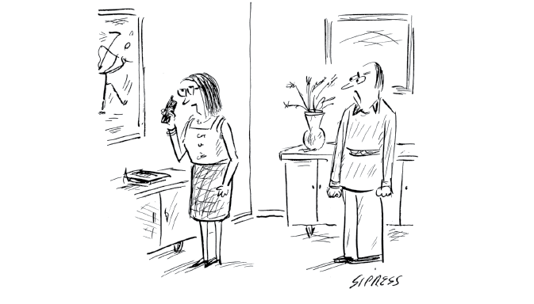
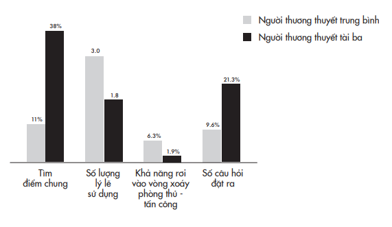
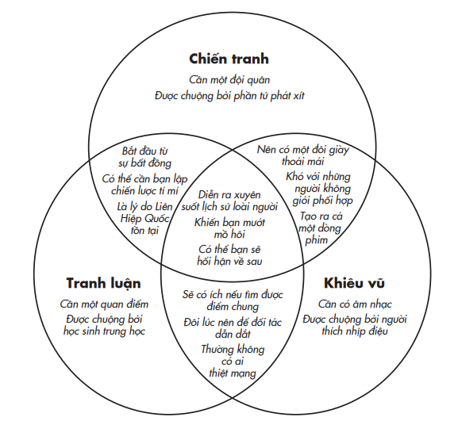
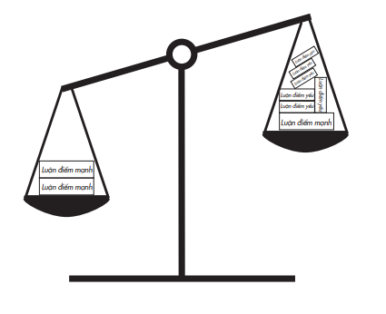
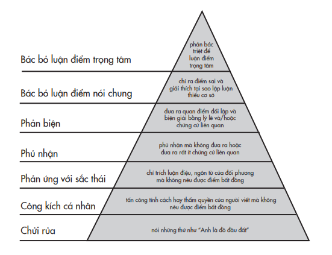

# PHẦN II: TÁI TƯ DUY LIÊN CÁ NHÂN
*Khai mở tư duy của người khác *---

# Chương 5: Khiêu Vũ Cùng Đối Thủ
## Đắc nhân tâm trong tranh luận

---

Đè bẹp người khác trong một cuộc tranh cãi không làm cho họ đồng tình với bạn.

>* – Tim Kreider*

Ở tuổi ba mươi m ốt, Harish Natarajan đã thắng ba mươi sáu cuộc thi tranh biện quốc tế. Anh được coi là người giữ kỷ lục thế giới. Nhưng đấu thủ của anh hôm nay mang đến một thách thức chưa từng th ấy.

Debra Jo Prectet là một thần đồng đến từ Haifa, Israel. Debra mới tám tuổi, và dù chỉ mới góp mặt so tài lần đầu tiên trong cuộc thi tranh biện lớn vào mùa hè năm ngoái, cô bé đã chuẩn bị cho thời khắc này nhiều năm trước đó. Debra đã nghiền ngẫm vô số bài báo để tích lũy kiến thức, nghiên cứu kỹ càng những bài diễn văn nổi tiếng để mài giũa khả năng diễn đạt mạch lạc của mình, và thậm chí tập luyện cách đưa sự hóm hỉnh vào nội dung diễn thuyết. Giờ đây Debra đã sẵn sàng tranh tài với đương kim vô địch. Cha mẹ Debra hy vọng cô bé sẽ viết nên lịch sử.

Harish cũng từng là một thần đồng. Trước sinh nhật tám tuổi, cậu bé Harish đã khôn khéo hơn cha mẹ mình trong các cuộc tranh luận trên bàn ăn về hệ thống đẳng cấp của Ấn Độ. Anh tiếp tục trở thành nhà vô địch tranh biện toàn châu Âu, lọt vào vòng chung kết giải vô địch tranh biện thế giới, và được mời làm huấn luyện viên cho đội tranh biện trường quốc gia Filipino tại giải vô địch thế giới. Tôi được giới thiệu với Harish thông qua một học trò cũ xuất sắc từng so tài với anh và cậu nhớ đã thua “kha khá lần (hay là tất cả nhỉ)” trong các cuộc tranh biện giữa họ.

Harish và Debra giáp mặt ở San Francisco vào tháng Hai năm 2019 trước đông đảo khán giả. Cả hai đều không được cho biết trước đề tài tranh biện. Khi họ yên vị trên sân khấu, người điều phối mới công bố chủ đề: Liệu giáo dục mầm non có nên được chính phủ tài trợ ngân sách?

Chỉ sau mười lăm phút chuẩn bị, Debra sẽ trình bày những lập luận vững chắc nhất của mình theo hướng ủng hộ việc trợ cấp, và Harish sẽ vận dụng các lý lẽ sắc bén nhất có thể để phản đối việc này. Mục tiêu của họ là giành được nhiều sự đồng tình hơn từ khán giả với quan điểm của họ, nhưng sức ảnh hưởng của họ lên cá nhân tôi còn lớn hơn thế nhiều: họ sẽ làm thay đổi hoàn toàn cái nhìn của tôi về cách thức để chiến thắng một cuộc tranh luận.

Debra mở màn bằng một câu đùa hóm hỉnh, tạo một tràng cười cho khán giả khi nói với Harish rằng dù anh đang giữ kỷ lục thế giới về số lần vô địch, cô bé cược rằng anh chưa từng gặp đối thủ nào như cô. Sau đó cô tóm lược một cách ấn tượng một số những nghiên cứu – có trích dẫn nguồn – cho thấy các lợi ích về giáo dục, xã hội và nghề nghiệp mà các chương trình mầm non mang lại. Để tăng thêm sức thuyết phục, cô trích dẫn lời của một cựu thủ tướng rằng phát triển giáo dục mầm non là một sự đầu tư khôn ngoan.

Harish công nhận các dữ liệu thực tế mà Debra đưa ra, nhưng sau đó phản biện rằng trợ cấp cho giáo dục mầm non không phải là một biện pháp thích đáng để giải quyết những tổn hại gây ra bởi sự thiếu thốn. Anh đề nghị vấn đề nên được nhìn nhận dựa trên hai cơ sở: một là liệu các trường mầm non hiện đang yếu kém là do chưa được cung cấp đủ hay chưa được tận dụng hết tiềm năng; hai là liệu việc chính phủ trợ cấp có giúp được cho những đối tượng kém may mắn không. Anh biện giải rằng trong một thế giới mà mọi thứ đều phải đánh đổi, dành ngân sách cho giáo dục mầm non không phải là cách sử dụng tiền thuế của dân tốt nhất.

Tới tham dự buổi tranh biện này, 92% khán giả đã có sẵn lập trường của riêng mình. Tôi là một trong số họ: chẳng cần tốn công suy nghĩ, tôi cũng rõ mười mươi quan điểm của mình về vấn đề trợ cấp cho bậc mầm non. Ở Hoa Kỳ, giáo dục công lập là miễn phí cho trẻ từ mẫu giáo đến hết bậc trung học. Tôi đã thuộc lòng các bằng chứng cho thấy việc trẻ được tiếp cận sớm với giáo dục trong những năm đầu đời thậm chí còn thiết yếu hơn bất cứ chương trình giáo dục nào trẻ nhận được về sau để giúp chúng thoát nghèo. Tôi tin giáo dục là một quyền căn bản của con người, cũng giống như quyền được tiếp cận với nước sạch, thức ăn, nơi ở và dịch vụ y tế. Điều này làm tôi nghiêng về phía Debra. Khi tôi theo dõi cuộc tranh biện, các lập luận ban đầu của cô bé hoàn toàn thuyết phục. Dưới đây là một số luận điểm nổi bật:

Debra: Nghiên cứu rõ ràng đã cho thấy một chương trình mầm non tốt có thể giúp trẻ em vượt lên những bất lợi vốn là hệ quả của sự nghèo khó.

Dữ kiện cầm chắc phần thắng! Nhưng cứ bình tĩnh đã, đừng vội.

Debra: Quý vị chắc hẳn sẽ nghe đối thủ của tôi hôm nay biện luận rằng còn rất nhiều ưu tiên khác…, anh ấy có thể nói rằng trợ cấp là cần đấy, nhưng không phải dành cho các trường mầm non. Tôi xin phép được hỏi ngài Natarajan… thưa ngài, tại sao chúng ta không xem xét các bằng chứng, dữ liệu và dựa trên cơ sở đó để quyết định?

Người học trò cũ từng bảo tôi, nếu Harish có gót chân Achilles thì đó chính là các lập luận xuất sắc của anh ấy không phải lúc nào cũng dựa trên dữ liệu thực tế.

Harish: Tôi sẽ bắt đầu bằng việc phân tích luận điểm chính… rằng nếu chúng ta tin rằng giáo dục mầm non về cơ bản là có lợi, thì việc tài trợ ngân sách cho nó hẳn là rất xứng đáng rồi – nhưng tôi không nghĩ điều đó là đủ chứng minh sự đúng đắn của việc trợ cấp.

Debra rõ ràng có sự chuẩn bị kỹ lưỡng. Cô bé không chỉ tìm cách bắt bí Harish bằng các dữ kiện mà còn dự liệu trước những ý kiến phản biện của anh ấy.

Debra: Ngân sách tiểu bang rất dồi dào, và đủ để vừa trợ cấp cho giáo dục mầm non vừa đầu tư vào những mảng khác. Do đó, ý kiến cho rằng còn nhiều thứ khác quan trọng hơn để cân nhắc bỏ tiền vào là không hợp lý, bởi các khoản trợ cấp khác nhau không loại trừ lẫn nhau.

Cô bé đã bác bỏ một cách ngoạn mục luận điểm của Harish về việc phải lựa chọn và đánh đổi. Quá hay.

Harish: Có thể tiểu bang có đủ ngân sách để làm tất cả những điều tốt đẹp cho người dân: cung cấp dịch vụ y tế; cung cấp chương trình phúc lợi; cung cấp nước sạch cũng như giáo dục mầm non. Tôi cũng rất thích được sống trong thế giới đó, nhưng thế giới chúng ta đang sống thì không được như vậy. Tôi nghĩ chúng ta đang sống trong một thế giới có các hạn chế thực tế về những thứ mà tiền của chính phủ có thể tiêu vào – và ngay cả khi các khoản chi không bị hạn chế thì các chương trình cũng cần được hỗ trợ về mặt chính trị mới có thể thực thi.

Chà! Một điểm cộng. Ngay cả một chương trình có đủ vốn để có thể tự chủ về tài chính thì vẫn cần rất nhiều vốn chính trị⁶¹ để có thể được thực hiện – phần vốn có thể được đầu tư vào chỗ khác.

> **Chú thích:** ⁶¹ Vốn chính trị là khái niệm mang tính ẩn dụ để chỉ sự tích lũy tài nguyên và quyền lực được xây dựng thông qua các mối quan hệ, niềm tin, thiện chí và ảnh hưởng giữa các chính trị gia hoặc các đảng và các bên liên quan khác.

Debra: Trao cơ hội cho những người kém may mắn hơn trong xã hội nên là trách nhiệm đạo đức của mỗi con người, và đó là vai trò trọng yếu của tiểu bang. Một cách rõ ràng hơn, chúng ta nên tìm nguồn tài chính cho các trường mầm non thay vì trông mong vào vận may hay các lực tác động thị trường. Lĩnh vực này quan trọng đến mức không thể không có “tấm lưới an toàn”.

Đúng! Đây không đơn thuần là một vấn đề chính trị hay kinh tế. Nó còn là vấn đề đạo đức.

Harish: Tôi muốn bắt đầu bằng việc ghi nhận những gì [chúng ta] đồng ý với nhau. Chúng ta đồng ý rằng nghèo đói là điều tồi tệ. Nó tồi tệ khi có những người sống trong cảnh không có nước sạch. Nó tồi tệ khi… người ta phải chật vật kiếm miếng ăn cho gia đình. Nó tồi tệ khi họ cũng không có khả năng mua bảo hiểm y tế… Đó đều là những tình trạng tồi tệ, và tất cả đều cần được chúng ta bàn luận để đưa ra giải pháp, và chẳng có vấn đề nào nói trên được giải quyết chỉ vì bạn ưu tiên dành ngân sách cho giáo dục mầm non. Vậy tại sao đó là điều nên làm?

Hừm. Liệu Debra có thể phản bác được điểm này không?

Debra: Chương trình phổ cập giáo dục mầm non toàn thời gian giúp tạo ra những khoản tiết kiệm kinh tế đáng kể trong lĩnh vực chăm sóc sức khỏe cũng như giảm con số tệ nạn, phụ thuộc phúc lợi và ngược đãi trẻ em.

Harish: Các trường mầm non chất lượng cao sẽ làm giảm tệ nạn. Có thể đấy, nhưng vẫn còn những biện pháp khác để ngăn ngừa tội phạm.

Debra: Mầm non chất lượng cao giúp tăng tỷ lệ học sinh tốt nghiệp trung học.

Harish: Giáo dục mầm non chất lượng cao có thể cải thiện rất lớn cuộc sống cá nhân của nhiều người. Có thể thôi, nhưng tôi không chắc nếu chúng ta tăng ồ ạt số trẻ đi học mầm non thì tất cả đều được vào các trường mầm non chất lượng cao.

Ái chà. Harish rất có lý: có nguy cơ là trẻ em của những gia đình nghèo nhất sẽ phải đi học ở những trường mầm non có điều kiện kém nhất. Tôi bắt đầu cảm thấy cần suy xét lại lập trường của mình.

Harish: Cứ cho là chúng ta có thể dành ngân sách cho các trường mầm non, điều đó cũng không đồng nghĩa với việc mọi trẻ con đều được đi học… Câu hỏi đặt ra là ai sẽ nhận được sự giúp đỡ của bạn? Và đối tượng không được bạn giúp đỡ lại là những người nghèo nhất. Rốt cuộc, bạn chỉ đem lại sự bất công và tăng lợi lộc cho những cá nhân thuộc tầng lớp trung lưu.

Rất thuyết phục. Bởi vì giáo dục mầm non không miễn phí, nên tầng lớp dưới đáy vẫn là những người không có khả năng chi trả. Đến đây thì tôi bắt đầu lung lay, không biết nên về phe ai.

Bạn đã theo dõi luận điểm của cả hai bên. Trước khi tôi tiết lộ ai là người chiến thắng, bạn hãy xem lại lập trường của bản thân: quan điểm của cá nhân bạn về việc trợ cấp cho trường mầm non là gì khi cuộc tranh biện bắt đầu, và bao nhiêu lần bạn đã xem xét lại quan điểm ấy?

Nếu giống như tôi, hẳn bạn đã suy xét lại quan điểm của mình rất nhiều lần. Thay đổi ý kiến không biến bạn thành một kẻ ba phải hay giả tạo. Nó là dấu hiệu cho thấy bạn là người cởi mở, sẵn sàng học hỏi.

Nhìn lại, tôi thất vọng về bản thân khi đã ấn định sẵn cho mình một suy nghĩ trước cả khi cuộc tranh biện bắt đầu. Dĩ nhiên là tôi có đọc một số nghiên cứu về sự phát triển đầu đời của trẻ, nhưng tôi gần như mù tịt về khía cạnh kinh tế của các khoản trợ cấp từ ngân sách và những phương án đầu tư khác nhau cho các quỹ này. Ghi chú cho riêng tôi: trong chuyến leo lên Đỉnh Dốt lần tới, nhớ chụp một tấm ảnh selfie.

Kết quả thăm dò ý kiến khán giả sau cuộc tranh biện cho thấy số người không nghiêng về bên nào vẫn giữ nguyên không đổi, nhưng cán cân ủng hộ các luận điểm của thí sinh đã nghiêng sang phía Harish nhiều hơn Debra. Tỷ lệ ủng hộ cho việc trợ cấp cho giáo dục mầm non đã sụt giảm từ 79% xuống 62%, và tỷ lệ phản đối đã tăng hơn gấp đôi, từ 13% lên 30%. Debra không chỉ đưa ra nhiều dữ kiện hơn, bằng chứng tốt hơn, và hình ảnh gây ấn tượng hơn – vì vậy cô đã giành được cảm tình của khán giả từ khi bước vào tranh biện. Thế nhưng Harish lại là người thuyết phục được phần đông chúng ta tái tư duy về lập trường của mình. Anh ấy đã làm điều đó như thế nào, và chúng ta có thể học được gì ở anh ấy về nghệ thuật tranh luận?

Phần sau đây của quyển sách sẽ bàn về cách thuyết phục người khác tái tư duy về lập trường của chính họ. Khi tìm cách thuyết phục đối phương, chúng ta thường có cách tiếp cận theo kiểu đối đầu. Thay vì giúp họ suy nghĩ cởi mở, chúng ta lại rất giỏi chặn đứng hay trêu tức họ. Họ sẽ dùng thế phòng thủ bằng cách thuyết giảng quan điểm của họ và lên án quan điểm của chúng ta, hoặc họ dùng lối chơi chính trị – nói điều chúng ta muốn nghe dù họ thực lòng chẳng mảy may nghĩ thế. Tôi muốn khai phá một lối tiếp cận mang tính cộng tác hơn – chúng ta thể hiện sự khiêm nhường và tò mò, rồi khích lệ người khác tư duy theo cách của nhà khoa học nhiều hơn.

### KHOA HỌC THƯƠNG THUYẾT

Vài năm trước, một sinh viên cũ tên là Jamie gọi điện cho tôi để xin lời khuyên về việc nên thi vào trường dạy kinh doanh nào. Vì nhận thấy cô ấy đang trên đà tạo dựng sự nghiệp thành công, nên tôi bảo rằng học lên nữa chỉ lãng phí thời gian và tiền bạc. Tôi thuyết phục cô học trò của mình rằng không có bằng chứng rõ ràng nào cho thấy bằng cấp sau đại học sẽ tạo nên khác biệt đáng kể cho tương lai của cô, chưa kể nguy cơ cô có thể bị thừa bằng cấp mà thiếu kinh nghiệm. Khi cô ấy cứ khăng khăng rằng công ty hiện tại của cô yêu cầu phải có bằng Thạc sĩ Quản trị Kinh doanh (MBA) mới có cơ hội thăng tiến, tôi liền nói tôi có biết những ngoại lệ và chỉ ra rằng cô ấy hẳn sẽ không muốn dành cả sự nghiệp ở một chỗ làm duy nhất. Cuối cùng, cô “phản công”: “Thầy là kẻ bắt nạt bằng lý luận”.

Kẻ gì cơ?

“Kẻ bắt nạt bằng lý luận”, Jamie lặp lại. “Thầy chỉ trấn áp em bằng những luận điểm rất hợp lý, và em không đồng tình chúng nhưng em không thể phản bác.”

Thoạt tiên, tôi thấy thích thú với cái nhãn ấy. Nó mô tả đích xác một trong những vai trò của tôi với tư cách một nhà khoa học xã hội: chiến thắng tranh luận bằng những dữ liệu tốt nhất. Nhưng sau đó Jamie giải thích thêm rằng kiểu tiếp cận của tôi không thật sự giúp ích cho cô. Tôi càng ra sức thuyết phục thì cô ấy càng giữ nguyên ý kiến. Tôi chợt nhận ra trước đây mình đã kích lên cùng kiểu kháng cự như thế ở người khác không biết bao nhiêu lần rồi.

*“Tớ gọi lại cho cậu sau nhé? Bọn tớ đang có cuộc cãi vã ưa thích.”*

David Sipress/The New Yorker Collection/The Cartoon Bank; © Condé Nast

Thời niên thiếu, tôi được võ sư karate dạy rằng không bao giờ “động thủ” trừ khi mình đã chuẩn bị sẵn sàng để có thể là người trụ lại cuối cùng. Tôi cũng theo tinh thần này khi tranh luận ở chỗ làm và với bạn bè: tôi nghĩ mấu chốt để chiến thắng là xông trận với trang bị lập luận chặt chẽ và dữ kiện đích xác. Tuy nhiên, tôi tấn công đối thủ càng mạnh mẽ thì họ càng phản công quyết liệt. Tôi dồn hết “công lực” thuyết phục họ chấp nhận góc nhìn của mình và suy xét lại quan điểm của họ, nhưng như thế thì tôi đã chọn cách tiếp cận của một nhà truyền giáo và công tố viên. Dù những chế độ tư duy ấy đôi khi giúp tôi kiên định với lập trường của mình nhưng thường dẫn đến kết cục là tạo ra khoảng cách giữa tôi và người nghe. Tôi không hề chiến thắng.

Hàng thế kỷ nay, tranh luận được tôn vinh như một nghệ thuật, còn hiện nay đã có hẳn một ngành khoa học mới nổi nghiên cứu làm thế nào để tranh luận tốt nhất. Với một cuộc tranh luận chính thức, mục tiêu của bạn là khiến khán giả thay đổi ý kiến. Còn trong tranh luận thường ngày, bạn cố gắng khiến người đối thoại với mình thay đổi ý kiến. Đó là một dạng thương thuyết mà bạn cố gắng đạt được một sự đồng thuận về điều bạn tin là đúng đắn hay sự thật. Nhằm xây dựng kiến thức và kỹ năng về cách để chiến thắng các cuộc tranh luận, tôi đã nghiên cứu tâm lý học trong đàm phán và dần dà sử dụng những gì mình tiếp thu được để giảng dạy kỹ năng thương lượng cho lãnh đạo khắp các tập đoàn và cơ quan chính phủ. Tôi rốt cuộc vỡ lẽ rằng việc mình làm theo bản năng – và những gì học được trong karate – là sai trầm trọng.

Một cuộc tranh luận không phải là một cuộc chiến. Nó thậm chí không phải một trận kéo co trong đó bạn dùng hết sức bình sinh hòng lôi kéo bằng được đối phương sang phần sân của mình. Thật ra, nó giống như một điệu nhảy không được biên đạo sẵn nhiều hơn, và bạn tìm cách bắt nhịp với một đối tác đã định sẵn trong đầu những bước nhảy khác của họ. Nếu bạn cố đóng vai trò dẫn dắt, người bạn nhảy của bạn sẽ kháng cự. Nếu bạn có thể uyển chuyển để bước cùng nhịp với đối phương và khiến người ấy cũng làm theo tương tự, hai bạn sớm muộn sẽ hòa điệu nhịp nhàng.

Trong một nghiên cứu kinh điển, đội nghiên cứu do Neil Rackham dẫn dắt đã tìm hiểu xem những chuyên gia thương thuyết thường làm gì khác biệt. Họ tuyển một nhóm những người thương thuyết trung bình và một nhóm những chuyên gia lão luyện, đã có nhiều thành công đáng nể và được người trong giới công nhận tài năng. Để có thể so sánh kỹ thuật thương thuyết của những người tham gia, đội nghiên cứu ghi hình cả hai nhóm khi họ thực hiện đàm phán về công việc và hợp đồng.

Trong một cuộc chiến, mục tiêu của chúng ta là tiến lên thay vì bị đẩy lui, vì lẽ đó ta thường sợ thất thủ trong một vài trận. Trong một cuộc đàm phán, đồng tình với luận điểm người khác đưa ra lại là một bước xoa dịu. Nhóm chuyên gia nhận thức được rằng đó là điệu nhảy của cả hai và một bên không thể chỉ cứ đứng yên và trông chờ phía bên kia gánh hết mọi bước nhảy. Để hòa nhịp được, họ cần phải biết lúc tiến lúc lùi.

Có một điểm khác biệt dễ nhận ra trước khi cả hai bên ngồi vào bàn đàm phán. Trước buổi thương thuyết, đội nghiên cứu phỏng vấn cả hai nhóm tham gia về kế hoạch của họ. Nhóm thương thuyết trung bình chuẩn bị xông trận với đầy đủ khí giới và hầu như không có dòng ghi chú nào về những điều khoản họ có thể nhượng bộ. Nhóm chuyên gia thì ngược lại, họ dự tính một loạt những bước nhảy họ có thể song hành với phía bên kia, dành hơn một phần ba kế hoạch để tìm ra điểm chung của đôi bên.

Khi các nhóm thương thuyết bắt đầu thảo luận về các điều kiện và đề nghị, điểm khác biệt thứ hai bắt đầu xuất hiện. Hầu hết mọi người hình dung một cuộc tranh biện như một cặp cân: chúng ta càng đưa ra nhiều lý lẽ nặng ký, cán cân ưu thế càng nghiêng về chúng ta. Song nhóm chuyên gia thương thuyết làm theo hướng ngược lại hoàn toàn: trên thực tế, họ không dùng quá nhiều lý lẽ để thể hiện quan điểm. Họ không muốn làm loãng những luận điểm mấu chốt của mình, như Rackham⁶² nói: “Một luận điểm yếu thường làm loãng đi một luận điểm mạnh”.

> **Chú thích:**⁶² Neil Rackham (1942 _ ) là tác giả, học giả nổi tiếng về nghệ thuật bán hàng và thương thuyết. (ND)

Chúng ta càng tung ra nhiều lý lẽ, người khác càng dễ bắt thóp những lập luận không chặt chẽ. Một khi họ phản bác được một luận điểm của chúng ta, họ có thể dễ dàng gạt bỏ toàn bộ đề xuất. Đó là tình huống thường xuyên xảy ra với những người thương thuyết trung bình: họ mang quá nhiều vũ khí khác nhau ra trận. Họ thua trận không phải vì luận điểm thuyết phục nhất của họ không đủ mạnh, mà do luận điểm ít thuyết phục nhất của họ bộc lộ sự yếu kém.

Những tập tính này dẫn đến điểm khác biệt thứ ba: những người thương thuyết trung bình rất dễ sa vào vòng xoáy phòng thủ – tấn công. Họ thô bạo gạt phăng những đề nghị của đối phương và bằng mọi giá bảo vệ lập trường của mình, khiến cả hai bên không thể mở lòng với nhau. Những người có tài thương thuyết hiếm khi chỉ giữ thế tấn công hoặc phòng thủ. Thay vì vậy, họ bày tỏ sự hiếu kỳ bằng những câu hỏi như: “Vậy các bạn không thấy đề xuất này có bất kỳ giá trị nào sao?.”

Cách đặt câu hỏi là điểm khác biệt thứ tư giữa hai nhóm. Bình quân trong năm phát ngôn mà các chuyên gia thương thuyết đưa ra, ít nhất có một phát ngôn là câu hỏi. Họ không tỏ vẻ quyết đoán, song như trong một điệu nhảy, họ là người dẫn dắt bằng cách để cho đối tác bước lên trước.

### NGƯỜI THƯƠNG THUYẾT TÀI BA KHÁC BIỆT NHƯ THẾ NÀO

Những thực nghiệm gần đây cho thấy chỉ cần một người thương thuyết đến với cuộc tranh luận bằng tư duy của một nhà khoa học khiêm nhường và hiếu kỳ cũng có thể mang lại kết quả tốt đẹp cho đôi bên, bởi vì người đó sẽ luôn tìm kiếm thêm thông tin và tìm ra những phương cách để đôi bên cùng có lợi. Người này sẽ không tìm cách dẫn dắt suy nghĩ của đối phương, mà mời đối phương cùng khiêu vũ. Và đây chính xác là cách mà Harish Natarajan đã áp dụng trong các cuộc tranh biện của mình.

### NHẢY CÙNG MỘT NHỊP

Bởi vì khán giả ngay từ đầu đã nghiêng về quan điểm ủng hộ trợ cấp cho giáo dục mầm non, Harish có nhiều cơ hội để xoay chuyển tình thế hơn, nhưng nhiệm vụ của anh cũng khó khăn hơn vì phải bào chữa cho lập trường không được ủng hộ. Anh đã khiến cho khán giả suy nghĩ cởi mở hơn bằng cách áp dụng chiến thuật của các chuyên gia thương thuyết.

Harish mở đầu bằng việc nhấn mạnh điểm chung trong góc nhìn của đôi bên. Khi đến lượt anh đưa ra lập luận phản đối của mình, anh lập tức hướng sự chú ý vào những điểm mà cả anh và Debra đều đồng tình. “Xem ra”, anh vào đề, “tôi nghĩ chúng ta có ít điểm đối lập hơn chúng ta tưởng”. Anh chỉ rõ sự nhất trí của họ về vấn nạn nghèo đói, cũng như về tính xác thực của một số nghiên cứu, trước khi đưa ra lập luận bác bỏ giải pháp trợ cấp.

Chúng ta sẽ khó có thể thay đổi suy nghĩ của người khác nếu luôn khăng khăng không thay đổi suy nghĩ của mình. Chúng ta có thể thể hiện tinh thần cởi mở bằng cách thừa nhận những chỗ mình đồng tình với ý kiến của đối phương và thậm chí còn học hỏi được từ đó. Như thế, khi đến lượt chúng ta đề nghị đối phương cân nhắc lại một vài điểm, chúng ta sẽ không bị xem là trơ tráo.

Để thuyết phục được người khác thay đổi suy nghĩ, chúng ta không chỉ cần có lập luận xác đáng, chúng ta cần chứng minh rằng việc đề nghị đối phương nghĩ lại là đến từ một động cơ đúng đắn. Khi thừa nhận rằng lý lẽ ai đó đưa ra là có sức thuyết phục, chúng ta bắn tín hiệu cho đối phương rằng mình không phải là nhà truyền giáo, công tố viên, hay chính trị gia đang cố đề đạt một nghị trình. Chúng ta là những nhà khoa học đang cố gắng tìm đến sự thật. “Các cuộc tranh cãi thường có xu hướng trở nên tính đối đầu và thù địch quá mức cần thiết”, Harish nói với tôi. “Bạn nên sẵn lòng lắng nghe điều người khác muốn nói và ghi nhận chúng với thái độ hết sức trân trọng. Điều này gây ấn tượng bạn là người biết lẽ phải luôn suy nghĩ thấu đáo mọi thứ.”

Là người biết lẽ phải, theo nghĩa đen, có nghĩa là chúng ta có thể lắng nghe lý lẽ của người khác, có nghĩa là chúng ta cởi mở, sẵn sàng mở mang góc nhìn của mình thông qua dữ liệu và logic. Vậy thì trong cuộc tranh biện với Harish, vì lý do gì mà Debra lại không áp dụng cách thức này – tại sao cô ấy bỏ qua điểm chung với đối thủ?

Lý do không phải vì Debra chỉ mới tám tuổi. Đó là vì cô ấy không phải là người thật.

Debra Jo Prectet là cái tên tôi đặt cho “cô ấy” bằng phép đảo chữ. Tên chính thức của cô là Project Debater (tạm dịch: Nhà tranh biện Theo dự án), và cô là người máy. Chính xác hơn, Debra là một trí tuệ nhân tạo được IBM phát triển để tranh luận với con người, giống như “siêu máy tính” Watson được lập trình để đánh cờ.

Ý tưởng được nhen nhóm từ năm 2011 và IBM bắt đầu đẩy mạnh nghiên cứu thực hiện dự án từ năm 2014. Chỉ sau vài năm, Project Debater đã phát triển năng lực vượt trội để tranh tài trong cuộc thi tranh biện trước công chúng, với khả năng hoàn chỉnh dữ kiện, diễn đạt câu cú mạch lạc và thậm chí còn phản biện. Kho kiến thức của Debra bao gồm 400 triệu bài báo, phần lớn từ các tờ báo và tạp chí uy tín, và thuật toán dò tìm luận điểm của “cô” được thiết kế để định vị những lý lẽ mấu chốt, nhận diện các phạm vi và đo lường độ thuyết phục của bằng chứng. Với bất cứ chủ đề tranh biện nào, Debra cũng có thể tức thời tìm kiếm sơ đồ tri thức của mình để lấy dữ kiện liên quan, liên kết chúng thành một lập luận chặt chẽ và trình bày mạch lạc lập luận đó – thậm chí còn biết pha trò – bằng giọng nữ, trong một thời lượng có hạn định. Nguyên văn câu mở màn trong phần tranh biện về trợ cấp giáo dục mầm non của cô là: “Chào mừng anh, Harish. Tôi được biết anh đang giữ kỷ lục thế giới về số lần chiến thắng các cuộc thi tranh biện với con người, nhưng tôi ngờ rằng anh chưa bao giờ tranh luận với máy tính. Chào mừng tới tương lai”.

Dĩ nhiên, rất có khả năng Harish giành chiến thắng là vì khán giả có thành kiến với máy tính và thiên vị con người. Tuy nhiên, đáng chú ý là trong cuộc tranh tài này Harish đã áp dụng cùng một cách thức tranh biện anh đã dùng để đánh bại vô số con người trên khắp các đấu trường quốc tế. Điều làm tôi ngạc nhiên là máy tính đã làm chủ được rất nhiều năng lực phức tạp song lại hoàn toàn bỏ sót khả năng mang tính quyết định này.

Sau khi học mười tỷ mẫu câu, một máy tính đã có khả năng nói chuyện và pha trò – một kỹ năng thường được cho là ưu thế độc nhất của các sinh vật có ý thức, với trí thông minh xã hội và trí thông minh cảm xúc ở cấp độ cao. Máy tính đã học được cách đưa ra một lập luận hợp lý và thậm chí còn lường trước được lập luận phản biện của đối thủ. Tuy nhiên nó vẫn chưa học được cách đồng tình với những yếu tố trong lý lẽ của đối phương, rõ ràng bởi vì cách hành xử đó cực kỳ hiếm xảy ra trong toàn bộ 400 triệu bài báo được con người viết ra. Người ta đã quá bận rao giảng quan điểm của mình, lên án đối thủ hay lôi kéo sự ủng hộ của khán giả theo cách của chính trị gia hòng giành ưu thế so với đối phương.

Khi tôi hỏi Harish làm cách nào để tăng khả năng tìm thấy điểm chung với ai đó, anh ấy đã đưa ra một gợi ý thiết thực không ngờ. Hầu hết mọi người trực tiếp bắt đầu tranh luận bằng ngụy biện kiểu người rơm⁶³, chọc vào chỗ sơ hở, yếu nhất trong lý lẽ của đối phương. Harish làm điều ngược lại: anh tập trung vào lý lẽ thuyết phục nhất của phía bên kia, điều được gọi là tranh biện kiểu người sắt. Một chính trị gia đôi khi cũng áp dụng chiến thuật này để lấy lòng hoặc lôi kéo, nhưng với tinh thần của một nhà khoa học chân chính, Harish vận dụng cách lập luận này để học hỏi. Thay vì cố gắng bác bỏ hoàn toàn luận điểm giáo dục mầm non là tốt cho trẻ, Harish thừa nhận luận điểm này là hợp lý, và nhờ đó anh có thể liên hệ đến lập trường của đối thủ – và của khán giả. Khi đó, hoàn toàn công bằng và hợp lý khi anh bày tỏ những quan ngại của mình về việc liệu trợ cấp ngân sách có giúp những đứa trẻ kém may mắn nhất được học mầm non hay không.

>**Chú thích:**⁶³ Ngụy biện kiểu người rơm là một hình thức lập luận và ngụy biện không chính thức, xảy ra khi một người cố tình nhắm vào một điểm yếu nhất trong toàn bộ lập luận của đối thủ, không ngừng tấn công điểm này (đôi khi bằng cách bóp méo, xuyên tạc) khiến toàn bộ luận điểm của đối thủ có vẻ không hợp lý, từ đó giành ưu thế.

Hướng trọng tâm cuộc tranh luận đến việc tìm điểm chung và tránh rơi vào vòng xoáy phòng thủ – tấn công không chỉ là cách duy nhất mà Harish đã áp dụng giống như các chuyên gia thương thuyết. Anh còn cẩn trọng để không tiến lên theo cách quá mạnh bạo.

### ĐỪNG GIẪM LÊN CHÂN NGƯỜI KHÁC

Thế mạnh kế tiếp của Harish bắt nguồn từ một trong những điểm bất lợi của anh. Anh biết mình sẽ không bao giờ sánh được với máy tính về số lượng dữ kiện thu thập được. Trong cuộc thăm dò ý kiến sau đó, đại đa số khán giả cho rằng họ học hỏi được từ máy tính nhiều hơn từ Harish. Nhưng rốt cuộc Harish lại là người khiến họ phải thay đổi quan điểm. Tại sao?

Máy tính tích lũy kiến thức từ vô số nghiên cứu để xây dựng một danh sách dài những luận điểm ủng hộ trợ cấp giáo dục mầm non. Như mọi nhà thương thuyết tài ba khác, Harish chỉ tập trung vào hai luận điểm phản đối. Anh biết rằng nếu đưa ra quá nhiều luận điểm có thể dẫn đến việc không thể phát triển, trau chuốt và củng cố cho những luận điểm đáng giá nhất của mình. “Bạn càng đưa ra nhiều luận điểm chừng nào thì mỗi luận điểm sẽ càng giảm sức thuyết phục chừng ấy”, anh chia sẻ. “Mỗi luận điểm sẽ càng ít tính giảng giải hơn, và khi đó, tôi không chắc có luận điểm nào trong số ấy đủ sức thuyết phục – tôi không nghĩ khán giả sẽ tin những luận điểm này là quan trọng. Hầu hết những nhà tranh biện hàng đầu đều không trích dẫn quá nhiều thông tin.”

Liệu đây có luôn là cách tốt nhất để bước vào một cuộc tranh luận? Cũng như mọi thứ khác trong khoa học xã hội, câu trả lời là: còn tùy. Số lượng luận điểm lý tưởng sẽ khác nhau tùy từng tình huống cụ thể.

Có những trường hợp mà phương pháp thuyết giảng và lên án có thể giúp chúng ta giàu sức thuyết phục hơn. Nghiên cứu chỉ ra rằng mức độ hiệu quả của những phương pháp tiếp cận này xoay quanh ba yếu tố then chốt: mọi người quan tâm đến vấn đề nhiều thế nào, họ cởi mở với luận điểm mà chúng ta đang trình bày ra sao và xét về tổng thể thì họ cứng rắn đến mức nào. Nếu họ không quá quan tâm đến vấn đề hoặc tỏ ra dễ dàng đón nhận quan điểm của chúng ta, thì đưa ra nhiều luận điểm sẽ hiệu quả: người nghe sẽ có xu hướng tin rằng số lượng là dấu hiệu của chất lượng. Chủ đề tranh luận càng quan trọng đối với người nghe thì họ càng coi trọng chất lượng của các luận điểm chúng ta đưa ra. Đó là lúc người nghe cảm thấy bản thân có dự phần vào vấn đề, họ có xu hướng bảo thủ và hoài nghi quan điểm của chúng ta. Khi ấy, việc chồng chất các lý lẽ có nguy cơ sẽ phản tác dụng. Nếu người nghe đang kháng cự việc tái tư duy, thì đưa ra nhiều lý lẽ chỉ càng cung cấp thêm đạn dược để họ bắn hạ quan điểm của chúng ta.

Tuy nhiên, quan trọng không chỉ ở số lượng lý lẽ được trình bày, mà còn ở việc các lý lẽ khớp nhau như thế nào. Có lần, một trường đại học liên hệ với tôi và hỏi liệu tôi có thể giúp kêu gọi sự đóng góp từ các cựu sinh viên, những người chưa từng đóng góp đồng nào cho trường không. Tôi đã cùng các đồng nghiệp tiến hành một thử nghiệm với hai thông điệp kêu gọi khác nhau, tuy đều có cùng mục đích là kêu gọi đóng góp từ hàng ngàn cựu sinh viên không sẵn sàng rút hầu bao. Thông điệp thứ nhất nhấn mạnh vào cơ hội làm việc tốt: khoản quyên góp sẽ giúp ích cho sinh viên, giảng viên và nhân viên của trường. Thông điệp thứ hai nhấn mạnh vào cơ hội để mọi người có cảm giác tốt đẹp: những người hảo tâm sẽ tận hưởng niềm hân hoan, ấm áp của việc cho đi.

Hai thông điệp có hiệu quả ngang nhau: mỗi thông điệp đều kêu gọi được 6,5% cựu sinh viên đồng ý quyên góp. Kế đến, chúng tôi thử kết hợp hai thông điệp trong một lời kêu gọi, vì tin rằng hai lý do hẳn sẽ tốt hơn một.

Đáng tiếc là không phải vậy. Khi gộp hai lý lẽ làm một, tỷ lệ quyên góp rớt xuống dưới 3%. Mỗi lý do đứng riêng lại hiệu quả hơn gấp đôi so với khi chúng được kết hợp với nhau.

Trong thử nghiệm này, người tiếp nhận thông điệp vốn đã sẵn hoài nghi. Khi đưa ra những lý do khác nhau để kêu gọi họ quyên góp, chúng tôi đã khiến họ cảnh giác rằng ai đó đang cố gắng thuyết phục mình – và họ giơ tấm khiên phòng thủ lên ngay. Một dòng luận điểm duy nhất sẽ tạo cảm tưởng đây là một cuộc trò chuyện; nhiều dòng luận điểm dồn dập có thể gây ấn tượng đây là một cuộc công kích. Khán giả liền phớt lờ nhà truyền giáo và họ triệu tập “luật sư” biện hộ giỏi nhất để đáp trả lại công tố viên.

Cũng quan trọng như số lượng và chất lượng của lý lẽ, đó chính là nguồn trích dẫn. Và nguồn lý lẽ thuyết phục nhất thường là nguồn gần gũi nhất với khán giả của bạn.

Một sinh viên trong một lớp tôi phụ trách, Rachel Breuhaus, nhận thấy rằng mặc dù những đội bóng rổ hàng đầu của các trường đại học đều có cổ động viên cuồng nhiệt, nhưng vẫn thường xuyên có nhiều ghế trống trên phần khán đài của họ. Nhằm tìm ra những chiến lược để khuyến khích thêm nhiều cổ động viên đến xem hơn, chúng tôi đã tiến hành một thử nghiệm trước trận thi đấu một tuần, nhắm đến hàng trăm người giữ vé mùa giải. Khi để mọi việc diễn ra tự nhiên, 77% số người được xem là “fan cứng” đã thật sự đến sân xem trận đấu. Chúng tôi quyết định rằng thông điệp thuyết phục nhất có lẽ nên được gửi đi từ chính đội tuyển. Thế là chúng tôi gửi cho các cổ động viên một e-mail dẫn lời các tuyển thủ và huấn luyện viên rằng chúng ta nên tận dụng lợi thế sân nhà và một phần của lợi thế đó bắt nguồn từ năng lượng được truyền đi từ các khán đài đầy ắp cổ động viên nồng nhiệt. Xem ra cách này chẳng mấy hiệu quả: chỉ có 76% trong số những cổ động viên đó tham dự.

Thứ làm thay đổi tình thế là một e-mail với cách tiếp cận khác. Chúng tôi đơn giản gửi đi một câu hỏi cho các cổ động viên: Bạn có dự định sẽ đến xem trận đấu không? Kết quả là số người đến xem trận đấu tăng lên 85%. Câu hỏi trên đã cho các cổ động viên quyền tự do quyết định liệu họ có muốn đi xem thi đấu hay không.

Các nhà tâm lý học từ lâu đã nhận thấy rằng người có khả năng thuyết phục bạn thay đổi suy nghĩ nhất là chính bạn. Bạn phải là người chọn ra những lý lẽ bạn thấy thuyết phục nhất, và bạn ra về với cảm tưởng mình thật sự làm chủ những lý lẽ đó.

Đó chính là chỗ thế mạnh sau cùng của Harish được phát huy. Ở mỗi vòng, anh đều đặt ra những câu hỏi gợi suy tư. Máy tính tranh luận bằng câu khẳng định, chỉ đặt ra duy nhất một câu hỏi ở phần mào đề – và trực tiếp với Harish thay vì hướng đến khán giả. Trong phần mở đầu, Harish đã đặt sáu câu hỏi khác nhau khiến khán giả phải ngẫm nghĩ. Ngay trong phút đầu tiên, anh đã quả quyết rằng chỉ vì giáo dục mầm non là cần thiết không có nghĩa là chính phủ phải trợ cấp cho bậc học này, rồi anh chất vấn ngay: “Tại sao phải làm như vậy?”. Kế đến anh đặt câu hỏi liệu các trường mầm non có đang thiếu hụt tài chính không; liệu họ có ưu tiên hỗ trợ những người yếu thế nhất không – nếu không thì tại sao không, tại sao chi phí của trường mầm non lại đắt đỏ đến thế, và mô hình này thật sự mang lại lợi ích cho đối tượng nào.

Những kỹ thuật trên nếu được vận dụng phối hợp trong một vấn đề bất đồng sẽ làm tăng khả năng khiến người khác từ bỏ vòng lặp cố chấp và gia nhập vào vòng lặp tái tư duy. Khi chỉ ra rằng có những khía cạnh mình đồng tình và thừa nhận những chỗ đối phương có lý, chúng ta nêu gương về phong thái khiêm nhường tự tin và khuyến khích mọi người làm theo. Khi bảo vệ luận điểm của mình bằng một số ít lập luận thuyết phục và chặt chẽ, chúng ta khuyến khích người khác bắt đầu nghi ngờ lập trường của họ. Và khi đặt ra những câu hỏi xác đáng, chúng ta đã kích thích sự tò mò để họ tìm hiểu thêm. Chúng ta không cần phải thuyết phục họ rằng mình đúng – chúng ta chỉ gợi mở tư duy cho đối phương về khả năng họ có thể sai. Tính hiếu kỳ tự nhiên của mỗi người sẽ lo nốt phần còn lại.

Tuy vậy, các bước này không phải luôn luôn hiệu quả. Chẳng quan trọng chúng ta đề nghị nhã nhặn tới mức nào, người khác không phải lúc nào cũng muốn khiêu vũ cùng ta. Đôi khi họ bám quá chặt vào niềm tin cá nhân đến độ một gợi ý về sự đồng điệu cũng khiến họ có cảm giác đó là một cuộc phục kích. Khi ấy chúng ta nên làm gì?

### BÁC SĨ JEKYLL VÀ NGÀI HẰN HỌC

⁶⁴**

> **Chú thích:** ⁶⁴ Tác giả đặt tiêu đề nhại theo tác phẩm kinh điển Strange Case of Dr. Jekyll and Mr. Hyde (tạm dịch: Trường hợp kỳ lạ về bác sĩ Jekyll và ngài Hyde) của Robert Louis Stevenson, được xuất bản lần đầu vào năm 1886. Truyện kể về một luật sư tên Gabriel John Utterson ở Luân Đôn với quá trình điều tra về những sự việc kỳ lạ xảy ra giữa người bạn cũ của ông là Henry Jekyll và tên khốn Edward Hyde, nhưng hóa ra hai người này là một. Về sau, cụm từ “Jekyll và Hyde” được dùng để chỉ những người đa nhân cách – hai bản chất đối nghịch cùng tồn tại trong cùng một con người. (ND)

Vài năm trước, một tập đoàn ở phố Wall mời tôi làm cố vấn cho một dự án thu hút và giữ chân các chuyên viên phân tích và cộng sự trẻ. Sau hai tháng nghiên cứu, tôi giao cho họ một báo cáo với hai mươi sáu đề xuất dựa trên số liệu cụ thể. Khi tôi đang trình bày nửa chừng với ban lãnh đạo, một người trong số họ ngắt lời và hỏi: “Sao không đơn giản trả lương cho họ cao hơn?”.

Tôi trả lời người ấy rằng tiền không thôi thì có lẽ sẽ không giải quyết được vấn đề. Nhiều nghiên cứu trên khắp các ngành nghề đã chỉ ra rằng một khi con người ta đã có mức thu nhập đủ để đáp ứng các nhu cầu căn bản của bản thân, thì việc trả thêm cho họ cũng không thể giữ chân họ ở lại với công việc tệ hay người sếp tồi. Người quản lý cấp cao này bắt đầu tranh luận với tôi: “Với kinh nghiệm cá nhân của tôi thì không phải thế”. Tôi phản pháo bằng chế độ công tố viên: “Vâng, đó là lý do tại sao tôi trình bày ở đây các thử nghiệm ngẫu nhiên có đối chứng, với dữ liệu dọc⁶⁵: từ đó rút ra kết luận chặt chẽ từ kinh nghiệm của rất nhiều người, chứ không chỉ dựa trên kinh nghiệm của riêng ông”.

> **Chú thích:** ⁶⁵ Dữ liệu dọc, hay dữ liệu bảng, là dữ liệu được thu thập thông qua một loạt các quan sát lặp đi lặp lại của cùng một đối tượng trong một số khung thời gian kéo dài, rất hữu ích để đo lường sự thay đổi.

Vị lãnh đạo kia không chịu thua, khăng khăng rằng công ty của ông ta thì khác, thế là tôi tung ra một vài số liệu thống kê cơ bản về nhân viên của chính công ty ông ta. Trong các kết quả khảo sát và phỏng vấn về lý do không gắn bó với công ty, tổng cộng số lần đề cập đến chế độ đãi ngộ là bằng không. Họ đã được trả lương không tệ (được hiểu là “trả quá cao”), và nếu trả lương cao đã giúp giải quyết được vấn đề, thì lẽ ra vấn đề đã được giải quyết từ lâu rồi⁶⁶. Vị lãnh đạo vẫn nhất quyết không thay đổi suy nghĩ. Cuối cùng tôi cáu tiết đến độ đã làm một điều trái ngược với bản tính thường ngày của mình. Tôi bật lại: “Tôi chưa từng gặp một nhóm người thông minh nào lại hành động ngu ngốc như thế”.

> **Chú thích:** ⁶⁶ Lương bổng không phải là củ cà rốt mà chúng ta dùng để động viên tinh thần làm việc cho người khác _ đó là cách thể hiện chúng ta trân trọng họ như thế nào. Các nhà quản lý có thể khích lệ nhân viên bằng cách thiết kế những công việc có ý nghĩa, mang lại cảm giác tự do, làm chủ, gắn bó, và tự tin vào năng lực của bản thân. Và việc trả lương tương xứng cho nhân viên là cách để ghi nhận sự đóng góp của họ. (TG)

Trong biểu đồ cấp độ bất đồng của nhà khoa học máy tính Paul Graham, dạng bất đồng cao nhất là bác bỏ luận điểm trọng tâm, và cấp độ thấp nhất là chửi rủa. Chỉ trong tích tắc, tôi đã trượt từ kẻ bắt nạt bằng lý luận thành kẻ bắt nạt học đường.

Nếu được thực hiện lại buổi trình bày hôm ấy, tôi sẽ bắt đầu bằng điểm chung giữa hai bên và tiết chế số liệu. Thay vì tấn công vào niềm tin của họ bằng nghiên cứu của mình, tôi sẽ đặt câu hỏi điều gì sẽ giúp họ cởi mở hơn với số liệu của tôi.

Vài năm sau đó, tôi có cơ hội kiểm chứng cách tiếp cận đó của mình. Trong một buổi nói chuyện chuyên đề về sáng tạo, tôi trích dẫn bằng chứng rằng Beethoven và Mozart thật ra không có tỷ lệ tác phẩm ăn khách cao hơn những người cùng thời khác. Chỉ vì đã cho ra đời khối lượng sáng tác đồ sộ hơn nên họ có cơ hội thành danh cao hơn hẳn. Khi tôi nói đến đây, một người trong hàng ghế khán giả bỗng ngắt lời. “Nhảm nhí!”, anh ta quát lên. “Anh đang báng bổ các bậc thầy âm nhạc. Anh quá sức ngạo mạn, chẳng biết mình đang nói gì cả!”.

Thay vì phản ứng ngay lúc đó, tôi chờ ít phút cho đến giờ nghỉ giải lao và đi tới chỗ vị khán giả làm khó tôi ban nãy.

Tôi: Anh hoàn toàn có quyền không đồng tình với số liệu tôi đưa ra, nhưng tôi không nghĩ vừa rồi là một cách bày tỏ ý kiến lịch sự. Đó không phải là cách tôi được dạy về một cuộc tranh luận có tri thức. Anh thì sao?

Nhạc sĩ nọ: À, tôi cũng không… Tôi chỉ nghĩ là anh đã sai. **Tôi: Đó không phải ý kiến của cá nhân tôi, mà là khám phá độc lập của hai nhà khoa học xã hội khác nhau. Anh cần thêm chứng cứ gì để thay đổi suy nghĩ không?

Nhạc sĩ nọ: Tôi không nghĩ rằng các anh có thể lượng hóa sự vĩ đại của một nhạc sĩ, nhưng tôi muốn** xem nghiên cứu ấy thế nào. **Khi tôi gửi bài nghiên cứu cho anh ta, anh đã hồi đáp với một lời xin lỗi. Tôi không biết liệu mình có làm anh thay đổi quan điểm không, nhưng tôi đã làm tốt việc giúp anh cởi mở suy nghĩ.

Khi ai đó bắt đầu có thái độ thù địch, nếu bạn cũng nhìn nhận cuộc tranh cãi như là một cuộc chiến thì bạn sẽ phản ứng bằng cách tấn công hoặc thoái lui. Nếu bạn xem nó như là một điệu nhảy, bạn sẽ có một lựa chọn khác – bạn có thể bước sang bên. Trao đổi về cuộc đối thoại sẽ giúp chuyển hướng sự chú ý của cả hai từ nội dung bất đồng sang cách thức đối thoại. Người kia càng tỏ ra nóng giận và thù địch, bạn nên bày tỏ càng nhiều mong muốn hiểu biết và quan tâm. Khi ai đó mất kiểm soát, thái độ điềm tĩnh của bạn chính là dấu hiệu của sự mạnh mẽ. Nó giúp cho cơn lốc cảm xúc của đối phương lắng xuống. Hiếm có ai phản ứng lại bằng cách gào thét: “LA LỐI LÀ CÁCH GIAO TIẾP ƯA THÍCH CỦA TÔI!”

Đây là chiến lược thứ năm mà những bậc thầy thương thuyết áp dụng thường xuyên hơn hẳn những người thương thuyết trung bình. Họ thường nêu lên cảm nhận của bản thân về quá trình tranh luận và kiểm tra mức độ hiểu của mình về cảm xúc của phía bên kia: Tôi thất vọng về diễn tiến của buổi thảo luận này – anh có đang thấy chán nản không? Tôi hy vọng anh nhận thấy đề xuất này là thỏa đáng – liệu tôi có hiểu đúng không, rằng anh không thấy đề xuất này có chút giá trị nào? Thật lòng, tôi có chút bối rối về cách anh phản ứng với số liệu tôi trình bày – nếu anh không đánh giá cao những việc tôi làm, tại sao anh tuyển tôi vào vị trí này?

Trong một cuộc tranh cãi nảy lửa, bạn luôn có thể dừng lại và đặt câu hỏi: “Anh cần thêm bằng chứng gì để thay đổi ý kiến?”. Nếu câu trả lời là “không cần gì cả”, thì tiếp tục tranh luận sẽ chẳng ích gì. Bạn có thể dắt một con ngựa tới máng nước, nhưng bạn không thể bắt nó suy nghĩ.

### SỨC MẠNH CỦA MỘT LUẬN ĐIỂM YẾU

Khi một cuộc tranh luận đi vào ngõ cụt, chúng ta không nhất thiết phải dừng lại. “Thôi thì đồng ý rằng chúng ta không đồng ý với nhau” không nên là cái kết của cuộc thảo luận. Đây nên là khởi đầu của một cuộc đối thoại mới, hướng đến sự thông hiểu và học hỏi thay vì cãi cọ và thuyết giảng. Đó là cách làm với tư duy của nhà khoa học: nhìn vấn đề xa hơn và hướng mọi người đến suy nghĩ làm thế nào để có thể tranh luận hiệu quả hơn. Bằng cách này, chúng ta đặt mình trong thế thuận lợi hơn để bàn luận một vấn đề khác với người này vào lúc khác – hoặc tiếp tục bàn luận cùng một vấn đề này nhưng với người khác. Khi tôi xin lời khuyên của một nhà quản trị cấp cao ở phố Wall về cách để có một cách thức tranh luận tốt hơn trong tương lai, ông ấy gợi ý là hãy tỏ ra bớt xác tín hơn trong khi đưa ra luận điểm. Đáng ra tôi có thể dễ dàng nói trái đi rằng tôi không chắc cả hai mươi sáu đề xuất của tôi đều thích đáng. Đáng ra tôi nên thừa nhận rằng mặc dù tiền không thường xuyên giải quyết được vấn đề, nhưng tôi cũng chưa từng nghe ai kiểm nghiệm tính hiệu quả của khoản tiền thưởng hàng triệu đô-la nhằm giữ chân những nhân viên chủ chốt. Đây sẽ là một thí nghiệm thú vị, quý vị có nghĩ thế không?

Vài năm trước, tôi đã lập luận trong quyển Originals⁶⁷ rằng nếu chúng ta muốn chống lại tư duy tập thể⁶⁸, nguyên tắc sau có thể hữu ích: “Thể hiện ý kiến mạnh mẽ nhưng bám lấy ý kiến đó một cách yếu ớt”. Kể từ đó, tôi thay đổi suy nghĩ – việc mà giờ đây tôi tin là một sai lầm. Nếu chúng ta dễ thay đổi ý kiến, sự mạnh miệng ban đầu có thể phản tác dụng. Truyền đạt một quan điểm với thái độ không chắc chắn hoàn toàn sẽ thể hiện sự khiêm nhường tự tin, kích thích sự tò mò và mở đường cho một cuộc thảo luận đa chiều hơn. Nghiên cứu chỉ ra rằng ở tòa án, các nhân chứng chuyên gia⁶⁹ và bồi thẩm đoàn được coi là đáng tin cậy hơn và có sức thuyết phục hơn khi họ thể hiện sự tự tin vừa phải, thay vì tự tin thái quá hoặc thiếu tự tin⁷⁰. Và những nguyên tắc này không chỉ bó hẹp trong tranh luận mà có thể được áp dụng trong đủ loại tình huống bày tỏ quan điểm cá nhân hay thậm chí bào chữa cho bản thân.

>**Chú thích:**⁶⁷ Tựa tiếng Việt: Tư duy ngược dịch chuyển thế giới - First News xuất bản. ⁶⁸ Tư duy tập thể là tình huống khi yêu cầu thống nhất ý kiến của tập thể được coi trọng hơn quan điểm cá nhân. ⁶⁹ Những cá nhân có chuyên môn đặc biệt được thẩm phán chấp thuận ý kiến của họ như lời khai bổ sung cho các bằng chứng. (ND) ⁷⁰ Trong một nghiên cứu meta về các phương cách thuyết phục, những thông điệp hai mặt (trình bày cả ưu và nhược điểm) tỏ ra có tính thuyết phục hơn so với những thông điệp một chiều – miễn là người nói bác bỏ được luận điểm chính của phía bên kia. Nhưng nếu chỉ trình bày hai mặt của vấn đề mà không làm rõ lập trường, lập luận đưa ra sẽ kém thuyết phục hơn so với cách đơn thuần rao giảng, kêu gọi về phe mình. (TG)

Năm 2014, một phụ nữ trẻ tên Michele Hansen tình cờ đọc được thông tin tuyển dụng vị trí giám đốc sản phẩm ở một công ty đầu tư. Cô rất hào hứng với vị trí này nhưng lại không đáp ứng được hết các điều kiện: cô không có bằng cấp trong lĩnh vực tài chính và không đủ số năm kinh nghiệm như yêu cầu. Nếu bạn ở trong tình huống của Michele và quyết định thử một phen, bạn sẽ nói gì trong thư giới thiệu với nhà tuyển dụng?

### MỘT CUỘC PHỎNG VẤN THÀNH THẬT

NGƯỜI PHỎNG VẤN ỨNG VIÊN Bạn thấy mình đứng ở đâu trong năm năm nữa? Ngồi ở vị trí của anh và đưa ra các câu hỏi phỏng vấn hay hơn Mô tả về bản thân bạn bằng một câu Ngắn gọn Điểm yếu lớn nhất của bạn là gì? Chắc chắn là cơ bắp tay sau Tại sao bạn muốn rời bỏ công việc hiện tại? Tôi đâu có muốn bỏ công việc hiện tại; họ muốn đuổi tôi đấy c Thành tựu lớn nhất trong nghề của bạn là gì? Ở văn phòng, tôi giữ kỷ lục là người ngâm e-mail lâu nhất mà Tại sao bạn muốn làm công việc này? Tôi cần kiếm tiền để có cái ăn và không chết đói Bạn thường đương đầu với áp lực như thế nào? Với một sự dung hòa giữa nổi đóa và hoàn toàn trơ ra Mục tiêu của bạn là gì? Kiếm tiền để có cái ăn và không chết đói Chúng tôi sẽ liên lạc lại sau! Tôi sẽ chẳng bao giờ nhận được tin gì từ anh, đúng không? Cách tự nhiên để khởi đầu buổi phỏng vấn là nhấn mạnh vào ưu điểm của bạn và khéo léo nói giảm các điểm yếu của bản thân. Như Michael Scott nói về bản thân một cách tỉnh rụi trong The Office⁷¹ (tạm dịch: Chuyện công sở): “Tôi làm việc quá cần mẫn, tôi quá tận tâm và đôi khi tôi làm việc quên ăn quên ngủ”. Nhưng Michele Hansen thì ngược lại, chọn cách hành xử của George Costanza trong Seinfeld: “Tên tôi là George. Tôi thất nghiệp và sống với cha mẹ mình”. Thay vì cố giấu nhẹm nhược điểm của mình, Michele lại “khoe” chúng ra khi bắt đầu giới thiệu về mình. “Tôi chắc không phải là kiểu ứng viên các ngài đang tìm kiếm”, cô bắt đầu lá thư tự giới thiệu bản thân như vậy. “Tôi không có mười năm kinh nghiệm làm Giám đốc Sản phẩm và tôi cũng không có Chứng chỉ Hoạch định Tài chính chuyên nghiệp (Certified Financial Planner)”. Sau khi đưa ra các luận điểm bất lợi về bản thân, cô nhấn mạnh một số lý do mà họ vẫn nên tuyển cô bất kể những khuyết điểm nói trên:

>**Chú thích:**⁷¹ Seri truyền hình nhiều tập ăn khách, khai thác các câu chuyện thường nhật ở chốn công sở. (ND)

Nhưng tôi có những kỹ năng mà không trường lớp nào dạy được. Với mọi dự án tôi đảm nhận, tôi luôn chủ động đảm bảo mọi việc được chu toàn tốt nhất có thể mà không kể đến bậc lương hay phạm vi trách nhiệm. Tôi không chờ người khác chỉ đạo việc cần làm mà tự mình chủ động tìm hiểu đâu là việc cần phải hoàn thành. Tôi dành trọn tâm trí cho mỗi dự án mình được giao và điều đó thể hiện trong mọi việc tôi làm, từ những dự án của công ty cho tới các dự án tôi nhận để làm ngoài giờ. Tôi có tư duy của người làm chủ doanh nghiệp – đảm bảo công việc được hoàn thành và cố gắng để trở thành cánh tay đắc lực cho người đồng sáng lập chủ trì dự án. Tôi thích là người đi tiên phong và gầy dựng mọi thứ từ con số không. (Và bất cứ người sếp cũ nào của tôi cũng sẽ sẵn lòng bảo chứng cho những ưu điểm này của tôi.)

Một tuần sau, người phụ trách tuyển dụng liên hệ cô để phỏng vấn qua điện thoại và tiếp sau đó là một cuộc gọi phỏng vấn khác với nhóm làm việc. Trong khi trao đổi, cô đã hỏi nhóm làm việc về các cuộc thử nghiệm sản phẩm gần đây mà đã khiến họ bất ngờ. Bản thân câu hỏi cũng đủ khiến nhóm phỏng vấn ngạc nhiên – cuối cùng họ nói về những lần thử nghiệm sản phẩm mà họ vốn tin chắc mình đúng song sau đó nhận ra là sai. Michele giành được công việc, tỏa sáng và được bổ nhiệm vai trò phụ trách phát triển sản phẩm. Thành công này không chỉ cá biệt với cô: bằng chứng cho thấy nhà tuyển dụng thường thích chọn những ứng viên thừa nhận những khuyết điểm chính đáng của bản thân hơn là những người khoác lác hoặc khoe khoang dưới cái vỏ khiêm tốn.

Ngay cả sau khi nhận thấy mình đang chiến đấu trong một trận chiến cam go, Michele vẫn không phòng thủ hay tìm cách phản công. Cô không rao giảng các bằng cấp mình có hay lên án các vấn đề trong bảng mô tả công việc. Trong thư giới thiệu, bằng cách đồng tình với những luận điểm có thể chống lại mình, cô đã đón đầu và ngăn chặn được sự từ chối của nhà tuyển dụng, thể hiện rằng cô có đủ nhận thức về bản thân để nhận ra các điểm yếu và đủ sự vững chãi để thừa nhận chúng.

Một người nghe có trình độ đằng nào cũng sẽ phát giác những chỗ hổng trong lời lẽ của chúng ta. Chúng ta cũng có thể “ghi điểm” bằng sự khiêm tốn với mong muốn tìm ra những chỗ hổng đó, bằng khả năng nhận diện chúng và bằng tính chính trực để thừa nhận chúng. Bằng cách chỉ nhấn mạnh một số ít thế mạnh then chốt của mình, Michele tránh được việc người nghe bị phân tán bởi quá nhiều luận điểm – cô hướng sự chú ý của người nghe vào những ưu điểm nổi bật nhất. Và nhờ thể hiện sự tò mò, mong muốn tìm hiểu về những kinh nghiệm sai lầm của nhóm làm việc, cô có thể đã truyền cảm hứng để họ tái tư duy về tiêu chí tuyển nhân sự của mình. Họ nhận ra rằng họ không phải đang tìm kiếm một cỗ máy có nhiều kỹ năng và bằng cấp, điều họ mong muốn là tuyển dụng một con người có động lực và khả năng học hỏi. Michele biết những gì mình còn thiếu sót và đủ bản lĩnh để thừa nhận chúng, qua đó gửi đi một thông điệp không thể rõ hơn rằng cô sẵn sàng học hỏi bất cứ điều gì công việc đòi hỏi.

Bằng cách đặt những câu hỏi để đối phương trả lời thay vì nghĩ thay cho họ, chúng ta mời họ cùng tham gia như một người bạn nhảy và mỗi bên tự nghĩ cho chính mình. Nếu chúng ta xem cuộc tranh luận như một cuộc chiến thì ắt phải có người thắng kẻ thua. Nếu nhìn nhận nó như một cuộc khiêu vũ, chúng ta có thể bắt đầu biên đạo những bước đi tiến về phía trước. Bằng cách quan tâm đến sự thể hiện mạnh mẽ nhất của đối phương khi bày tỏ quan điểm và tiết chế phản hồi của chúng ta với một vài bước đi tuyệt nhất, chúng ta có thể tìm thấy sự đồng điệu.

Chương 6**
