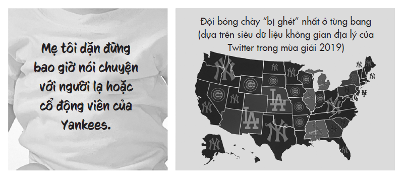
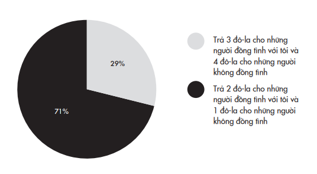
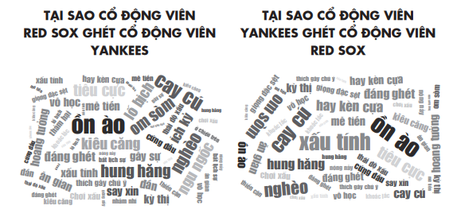
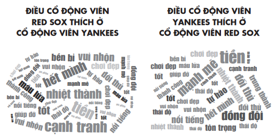
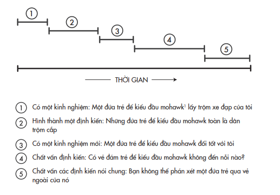

# Chương 6: Ác Cảm Che Mờ Lý Trí
## Loại trừ định kiến nhờ tháo gỡ khuôn mẫu suy nghĩ

---

---

Tôi ghét cay ghét đắng đội Yankees, đến mức mà tôi phải xưng tội vì lần đầu tiên trong đời tôi mong cầu người khác gặp điều dữ – cụ thể là tôi cầu cho các cầu thủ New York Yankees bị gãy tay, chân, hay mắt cá…

> *– Doris Kearn Goodwin*

Một buổi chiều năm 1983 ở Maryland, Daryl Davis ⁷² đến chơi piano tại một buổi trình diễn nhạc đồng quê. Đây không phải là lần đầu tiên anh là người da đen duy nhất trong khán phòng, nhưng đó là lần đầu tiên trong đời anh trò chuyện với một người da trắng theo chủ nghĩa da trắng thượng đẳng.

> **Chú thích:**⁷² Daryl Davis (1958 – ): nhạc sĩ và nhà hoạt động chống phân biệt chủng tộc, từng chiến đấu với nhiều thành viên của hội Ku Klux Klan, ông cũng từng thuyết phục được nhiều người rời bỏ và tố cáo hội kín này.

Khi đã quá nửa khuya, sau buổi diễn, một người đàn ông da trắng lớn tuổi từ phía khán giả tiến đến chỗ Daryl và nói rằng ông ấy vô cùng kinh ngạc khi thấy một nghệ sĩ da đen lại chơi được như Jerry Lee Lewis⁷³. Daryl đáp rằng thật ra anh và Lewis là bạn của nhau, và chính Lewis cũng thừa nhận rằng phong cách của ông ấy chịu ảnh hưởng bởi các nhạc sĩ da đen. Mặc dù lòng còn ngờ vực, người đàn ông vẫn mời Daryl cùng ngồi xuống uống một ly. ⁷³ Jerry Lee Lewis (1935 – ): nghệ sĩ piano, ca sĩ nhạc đồng quê và rock ‘n’ roll nổi tiếng ở Mỹ với biệt danh “The Killer”. (ND)

Ông ta thú nhận ngay rằng mình chưa bao giờ ngồi uống với một người da đen. Cuối cùng ông giải thích cho Daryl lý do tại sao. Ông là hội viên của Ku Klux Klan (KKK), nhóm người da trắng cực đoan theo chủ nghĩa thượng đẳng từng sát hại nhiều người Mỹ gốc Phi trong suốt hơn một thế kỷ qua và chỉ trước đó hai năm, họ đã hành hình một người đàn ông.

Nếu bạn nhận ra bạn đang ngồi với một người căm ghét mình và tất cả những người cùng màu da với mình, bản năng sẽ cho bạn các lựa chọn: chiến đấu, bỏ chạy, hoặc tê liệt, và đó là những phản ứng hoàn toàn chính đáng. Daryl đã có một phản ứng hoàn toàn khác: anh phá lên cười. Khi người đàn ông rút ra tấm thẻ hội viên KKK để chứng tỏ mình không nói đùa, Daryl trở lại với câu hỏi đã ăn sâu trong tâm trí anh từ khi mới lên mười. Cuối thập niên 1960, khi anh tham gia diễu hành trong đội Hướng đạo sinh Sói Con thì bị những khán giả da trắng ném đá và chai lọ vào mình. Đó là ký ức về lần đầu tiên trong đời anh đối mặt với hành vi phân biệt chủng tộc công khai, và dẫu hoàn toàn có quyền chính đáng để nổi giận, anh chỉ tự hỏi, lòng đầy bối rối: “Làm sao bạn có thể thù ghét tôi khi mà bạn thậm chí còn không biết tôi?”.

Cuối buổi trò chuyện, người đàn ông theo hội KKK đó đã đưa Daryl số điện thoại và hỏi liệu anh có thể gọi cho ông ấy nếu có dịp đến đây chơi nhạc. Daryl đã làm theo và một tháng sau, người đàn ông dắt theo cả tá bạn đến xem Daryl trình diễn.

Qua thời gian, tình bạn giữa hai người ngày một bền chặt, người đàn ông kia rốt cuộc đã ra khỏi hội KKK. Đó cũng là một bước ngoặt trong đời Daryl. Không lâu sau đó, Daryl có cơ hội gặp gỡ các Pháp Sư Hoàng Gia và Rồng Tối Cao – biệt danh của những chỉ huy cao nhất của hội KKK – để đưa ra câu hỏi vẫn canh cánh trong lòng anh. Kể từ đó, Daryl đã thuyết phục được hàng loạt người theo chủ nghĩa da trắng thượng đẳng rời khỏi hội KKK và xóa bỏ sự hận thù trong họ.

Tôi muốn hiểu được làm thế nào kiểu chuyển biến đó có thể xảy ra – làm sao để phá vỡ những vòng lặp tư duy cố chấp vốn bị nhấn chìm trong những khuôn mẫu và định kiến về cả một chủng tộc. Lạ lùng thay, hành trình của tôi khởi đầu ở một trận bóng chày.

## GHÉT NHAU GHÉT CẢ TÔNG CHI HỌ HÀNG

“Yankees dở tệ! Yankees dở tệ!” Đó là một tối mùa hè ở Fenway Park, lần đầu tiên và duy nhất tôi đi xem trận bóng chày của đội Boston Red Sox. Vào lượt đấu thứ bảy, bất thình lình, 37.000 người cùng đồng thanh la ó. Cả sân vận động cùng xỉ vả đội New York Yankees trong sự đồng lòng tuyệt đối.

Tôi biết hai đội này là đối thủ truyền kiếp cả thế kỷ nay, được xem như điểm nóng nhất trong toàn giới thể thao chuyên nghiệp Mỹ. Tôi không lấy làm lạ việc các cổ động viên Boston reo hò bài bác đội Yankees. Tôi chỉ không ngờ rằng việc đó sẽ xảy ra vào ngày hôm ấy, bởi vì đội Yankees không hề có mặt trên sân.

Red Sox đang thi đấu với Oakland A’s, và các cổ động viên Boston lại đang la ó chế giễu một đội ở cách xa nơi đó hàng trăm dặm. Việc này giống như các khách hàng yêu thích Burger King đang đối đầu với người yêu thích Wendy’s⁷⁴ trong một buổi thử vị nhưng lại cùng đồng thanh hô “McDonald’s dở tệ!” vậy. ⁷⁴ Burger King và Wendy’s là tên của hai chuỗi nhà hàng thức ăn nhanh hamburger toàn cầu của Mỹ.

Tôi bắt đầu tự hỏi phải chăng các cổ động viên Red Sox lại căm ghét Yankees hơn cả tình yêu họ dành cho chính đội nhà của mình. Các phụ huynh ở Boston nổi tiếng dạy con giơ ngón tay thối về phía đội Yankees, tẩy chay bất cứ thứ gì có họa tiết sọc dọc, và một trong những chiếc áo phông bán chạy nhất trong lịch sử Boston hiển nhiên là áo phông in chữ YANKEES DỞ TỆ. Khi được hỏi với bao nhiêu tiền thì họ sẽ chế giễu đội nhà, các cổ động viên Red Sox đòi trung bình 503 đô-la. Và để cổ vũ cho Yankees, họ còn đòi cao hơn: 560 đô-la. Những cảm xúc này mạnh đến nỗi các nhà khoa học thần kinh có thể quan sát chúng “phát sáng” trong đầu những người tình nguyện tham gia thí nghiệm: khi cổ động viên Red Sox thấy đội Yankees mất điểm, phần não liên quan đến phần thưởng và khoái cảm của họ được kích hoạt ngay tức thì. Những cảm xúc này còn lan rộng ra khỏi biên giới của Boston: kết quả phân tích các dòng tweet trong năm 2019 cho thấy Yankees là đội bóng chày bị ghét nhiều nhất ở 28/50 tiểu bang của Hoa Kỳ, và điều này giải đáp cho độ phổ biến của chiếc áo phông dưới đây:

Gần đây tôi gọi cho một người bạn là cổ động viên ruột của Red Sox và hỏi một câu đơn giản: với điều kiện nào thì anh sẽ cổ vũ cho đội Yankees. Không cần nghĩ ngợi, anh đáp ngay: “Chắc là… nếu họ thi đấu với Al Qaeda⁷⁵”.

>**Chú thích:** ⁷⁵ Tổ chức hồi giáo cực đoan do Osama bin Laden thành lập. (ND)

Yêu thích đội bóng của mình là một chuyện. Căm ghét đội đối thủ đến mức có ý nghĩ ủng hộ bọn khủng bố nghiền nát họ lại là chuyện khác. Bạn đặc biệt khinh miệt một đội tuyển thể thao nào đó và cả các cổ động viên của họ nghĩa là bạn đang ghim trong đầu mình những quan điểm đanh thép về một nhóm người. Những niềm tin đó là khuôn mẫu suy nghĩ, và chúng thường lan ra thành định kiến. Thái độ của bạn càng mạnh mẽ bao nhiêu thì bạn càng khó tái tư duy những quan điểm của mình bấy nhiêu.

Sự kình địch không chỉ xuất hiện duy nhất trong thể thao. Sự kình địch xảy ra bất cứ khi nào chúng ta duy trì mối hiềm khích đặc biệt đối với một nhóm nào đó mà chúng ta cho là đang tranh giành tài nguyên với mình hay đe dọa căn tính của chúng ta. Trong kinh doanh, sự kình địch giữa hai công ty giày Puma và Adidas căng thẳng đến mức nhiều thế hệ gia đình đã tự chia rẽ nhau dựa theo các thương hiệu mà họ trung thành

> *– họ tới các tiệm bánh khác nhau, quán rượu hay cửa hàng khác nhau, hay thậm chí từ chối hẹn hò với một người chỉ vì người ấy làm việc cho công ty đối thủ. Trong chính trị, bạn hẳn cũng biết vài người theo Đảng Dân chủ luôn chỉ trích các đảng viên Đảng Cộng hòa là tham lam, thiếu hiểu biết, vô cảm, và vài người theo Đảng Cộng hòa luôn xem người theo phe Dân chủ là lười biếng, giả dối, là những kẻ “thương vay, khóc mướn”. Khi những khuôn mẫu suy nghĩ quá chặt và những định kiến quá sâu, chúng ta không chỉ đồng hóa bản thân với nhóm của mình mà còn tách biệt mình khỏi những người có quan điểm đối lập, dẫn đến việc chúng ta định danh chính mình bằng cách vạch rõ mình không phải kiểu người nào. Chúng ta không chỉ rao giảng những “phẩm hạnh” ở phía bên mình mà còn vuốt ve lòng tự trọng bằng việc lên án “thói hư tật xấu” của đối thủ.

Khi người ta giữ định kiến về một nhóm đối địch, họ thường sẵn sàng nâng phe mình lên và hạ thấp đối thủ bằng mọi giá – ngay cả khi điều đó đồng nghĩa với việc làm điều ác hay sai trái. Chúng ta vẫn thường thấy nhiều người bước qua ranh giới mong manh ấy trong những trận đấu thể thao⁷⁶. Việc gây hấn còn lan rộng ra bên ngoài sân đấu: từ Barcelona tới Brazil, các trận ẩu đả thường xuyên nổ ra giữa các cổ động viên bóng đá. Các vụ bê bối gian lận cũng vì thế mà thành một vấn nạn, và sự việc xảy ra không chỉ giữa các cầu thủ hay huấn luyện viên. Khi các sinh viên trường Đại học Bang Ohio được trả tiền để tham gia một thí nghiệm, họ được biết nếu họ sẵn lòng nói dối một sinh viên thuộc một trường khác, họ sẽ nhận được tiền công cao gấp đôi, còn số tiền sinh viên kia nhận được sẽ bị cắt đi một nửa. Tỷ lệ sẵn sàng nói dối tăng gấp bốn lần nếu người kia là sinh viên trường Đại học Michigan – đối thủ lớn nhất của họ – thay vì các trường khác như Berkeley hay Virginia.

> **Chú thích:**⁷⁶ Khi Monica Seles bị đâm ở ngay trên sân quần vợt vào năm 1993, tôi biết có ít nhất một cổ động viên của Steffi Graf ăn mừng. Vào mùa chung kết NBA (giải bóng rổ nhà nghề Mỹ), khi Kevin Durant bị chấn thương, một số cổ động viên của đội Toronto Raptors bắt đầu reo hò, chứng tỏ ngay cả người Canada cũng có thể xấu tính. Một bình luận viên thể thao trên radio lập luận: “Chẳng có cổ động viên thể thao chuyên nghiệp nào lại không vui mừng khi cầu thủ chủ chốt của đội đối phương bị chấn thương và trên lý thuyết thì nhờ vậy mà đội nhà có thể chiến thắng dễ dàng hơn”. Công tâm mà nói, nếu bạn chỉ quan tâm đến chiến thắng của đội nhà, bất chấp việc một con người nào đó có thể bị chấn thương, bạn có khả năng bị chứng rối loạn nhân cách chống đối xã hội. (TG)

Tại sao người ta luôn hình thành những khuôn mẫu suy nghĩ ngay từ đầu về các nhóm đối địch và chúng ta có thể làm gì để họ tái tư duy về những khuôn mẫu suy nghĩ đó?

## Hoà NHẬP VÀ TÁCH BIỆT

Trong những thập niên qua, các nhà tâm lý học đã phát hiện ra rằng con người có thể dễ có cảm giác thù địch với những nhóm người khác, ngay cả khi giữa họ không có vấn đề gì nghiêm trọng. Giả dụ có một câu hỏi tưởng chừng vô thưởng vô phạt như sau: Bánh mì xúc xích (hot dog) có phải là bánh mì kẹp (sandwich) không? Khi các sinh viên trả lời câu hỏi, hầu hết đều tranh luận hăng say đến độ họ sẵn lòng chịu thiệt thêm một đô-la để trả thêm cho mỗi người đồng tình với họ nhằm đảm bảo những ai có ý kiến đối lập sẽ nhận được ít hơn.

### KHẢO SÁT BÁNH MÌ XÚC XÍCH & BÁNH MÌ KẸP

Sống trong mọi xã hội loài người, con người luôn có thôi thúc tìm kiếm “cảm giác thuộc về⁷⁷” và thân phận. Đồng nhất hóa bản thân với một hội, nhóm hay cộng đồng là bắn một mũi tên trúng hai đích: chúng ta trở thành thành viên của một “bầy đàn” và có được niềm kiêu hãnh khi “bầy đàn” đó chiến thắng. Trong những nghiên cứu kinh điển được thực hiện trong khuôn viên trường đại học, các chuyên gia tâm lý thấy rằng sau mỗi trận đấu bóng bầu dục, sinh viên của đội chiến thắng thường đi loanh quanh trong trường, diện trang phục liên quan đến đội bóng mà họ cổ vũ. Từ Đại học Bang Arizona tới Notre Dame hay USC (Đại học Nam California), sinh viên dang nắng cả ngày thứ Bảy để cổ vũ đội nhà trong hào quang chiến thắng và hân hoan bận áo, mũ, hay áo khoác cổ động viên cả trong ngày Chủ nhật. Nếu đội nhà bại trận, họ nhanh chóng cởi bỏ đồng phục, và tách mình ra khỏi đội khi nói “họ thua rồi” thay vì “chúng ta thua rồi”. Một số nhà kinh tế học và chuyên gia tài chính thậm chí còn phát hiện ra rằng thị trường chứng khoán tăng điểm mỗi khi đội bóng đá quốc gia chiến thắng một trận World Cup và mất điểm nếu đội tuyển thua trận⁷⁸.

>**Chú thích:**⁷⁷ Tiếng Anh: sense of belonging, là cảm giác tâm lý của một cá nhân, cảm nhận mình là thành viên của một gia đình, dòng tộc, cộng đồng, hay cảm giác gắn kết gần gũi giữa mình với một không gian. ⁷⁸ Thị trường chứng khoán dao động theo những trận thua trong bóng đá là đề tài tranh cãi sôi nổi: tuy một vài nghiên cứu cho thấy mối liên hệ, một số nghiên cứu khác không chứng minh được điều này. Theo cảm nhận của tôi, điều này có khả năng xảy ra cao hơn ở các nước mà môn thể thao này phổ biến, đội tuyển được kỳ vọng sẽ thắng, trận đấu có số người đánh cược cao, và thắng thua là khá sít sao. Dẫu cho kết quả các trận đấu thể thao có thật sự ảnh hưởng đến thị trường hay không, chúng ta biết rằng chúng có thể ảnh hưởng đến tâm trạng. Một nghiên cứu trên các sĩ quan quân đội châu Âu cho thấy khi đội bóng đá ưa thích của họ thua trận vào Chủ nhật, họ sẽ dễ vắng mặt ở sở làm vào thứ Hai, và điều này dẫn đến kết quả công việc bị giảm sút. (TG)

Sự kình địch thường có nhiều khả năng nảy sinh giữa các đội ở gần nhau về mặt địa lý, thường xuyên đối đầu và ngang sức ngang tài. Yankees và Red Sox khớp với khuôn mẫu này: họ đều ở Bờ Đông, gặp nhau mười tám hay mười chín trận mỗi mùa, đều có lịch sử thắng trận, và tính đến năm 2019, hai đội đã thi đấu với nhau hơn 2.200 lần – trong đó mỗi bên sở hữu hơn 1.000 lần thắng. Hai đội bóng này có nhiều cổ động viên hơn bất kỳ đội nào khác trong làng bóng chày.

Tôi quyết định kiểm chứng xem cần những yếu tố nào để các cổ động viên tái tư duy về những niềm tin của họ về đối thủ truyền kiếp. Cùng với Tim Kundro, một nghiên cứu sinh tiến sĩ, tôi đã tiến hành một loạt thí nghiệm với những người hâm mộ nhiệt thành của đội Yankees và Red Sox. Để nhận diện các khuôn mẫu suy nghĩ của họ, chúng tôi đã yêu cầu hơn một ngàn cổ động viên Red Sox và Yankees liệt kê ra ba điểm tiêu cực về đối thủ của mình. Họ hầu như đều dùng những từ ngữ tương tự để mô tả về nhau, như phàn nàn về giọng địa phương của nhau, cách để râu của đối phương, và đều cho rằng đối thủ “có mùi như bánh phồng để lâu”.

Một khi chúng ta đã hình thành trong tâm trí những khuôn mẫu suy nghĩ ấy, xóa bỏ chúng là vô cùng khó, vì những lý do cả về mặt nhận thức lẫn xã hội. Nhà tâm lý học George Kelly nhận thấy rằng những niềm tin của chúng ta giống như những lăng kính thực tại. Chúng ta sử dụng chúng để nhận thức và định hướng về thế giới xung quanh. Một mối đe dọa nào đó với quan điểm của chúng ta sẽ làm cặp kính bị vỡ, khiến sức nhìn của ta nhòe mờ. Thế nên phản ứng tự nhiên của chúng ta là phòng vệ, và Kelly quan sát thấy chúng ta trở nên đặc biệt thù địch khi ra sức bảo vệ những ý kiến mà từ trong sâu thẳm ta biết rằng chúng sai. Thay vì thử nhìn qua lăng kính khác, chúng ta lại trở thành những nghệ sĩ uốn dẻo về tâm trí, xoay và chuyển đủ tư thế cho đến khi tìm ra được góc nhìn mà ở đó chúng ta giữ nguyên trạng quan điểm cũ.

Xét về mặt xã hội, còn một lý do khác nữa khiến các định kiến bám chặt đến vậy. Chúng ta có xu hướng thích tương tác với những người cũng có cùng những định kiến với mình, khiến chúng càng cực đoan hơn. Hiện tượng này được gọi là sự phân cực nhóm, được bộc lộ rõ qua hàng trăm thực nghiệm. Bồi thẩm đoàn với những niềm tin chuyên quyền thường đề nghị những mức án càng nặng hơn sau khi hội ý với nhau. Hội đồng quản trị tập đoàn dễ chấp thuận các khoản chi không cần thiết cho các công ty thành viên hơn sau khi họp và thảo luận. Những công dân vốn có sẵn lập trường rõ ràng về quy định chống phân biệt đối xử⁷⁹ và hôn nhân đồng giới càng gia tăng những góc nhìn cực đoan về các vấn đề này sau khi bàn luận với một số người có cùng quan điểm. Hành vi thuyết giảng và lên án song hành cùng xu hướng chính trị của họ. Sự phân cực càng được củng cố bởi tính tuân phục: các thành viên vòng ngoài gia nhập và tăng tiến bằng cách theo gót thành viên nguyên mẫu nhất trong nhóm, cũng thường là người có định kiến sâu đậm nhất. ⁷⁹ Quy định chống phân biệt đối xử là quy định của chính quyền Mỹ nhằm loại trừ tình trạng phân biệt đối xử trên thị trường lao động và hạn chế những ảnh hưởng của sự phân biệt đối xử kéo dài trước đây.

Nếu sinh trưởng trong một gia đình cổ động cho Red Sox, hiển nhiên bạn sẽ nghe không ít điều chướng tai về các cổ động viên Yankees. Bạn lớn lên và bắt đầu tới sân bóng chật cứng những người có cùng sự căm ghét ấy, và vấn đề chỉ là thời gian trước khi mối ác cảm trong bạn dày cộm thêm và hằn sâu hơn. Khi đó, bạn sẽ chỉ mong muốn nhìn thấy những điều tốt đẹp nhất xảy đến với đội nhà và những kết quả tồi tệ nhất đến với đối thủ. Bằng chứng đã cho thấy rằng nếu các đội tuyển tìm cách hạ nhiệt sự công kích bằng việc nhắc cổ động viên rằng chẳng qua đây chỉ là một trận thi đấu mà thôi, nỗ lực này thường phản tác dụng. Các cổ động viên sẽ cảm thấy bản sắc của họ bị hạ giá trị và họ sẽ càng thêm thù địch. Ý tưởng đầu tiên của tôi về cách để xóa bỏ định kiến này đến từ bên ngoài không gian.

## GIẢ THUYẾT 1: CHÚNG TA KHÔNG Ở MỘT ĐẲNG CẤP KHÁC

Nếu có dịp rời khỏi Trái Đất, bạn hẳn sẽ có những cảm nhận hoàn toàn khác về những con người đồng loại của mình. Một nhóm chuyên gia tâm lý đã nghiên cứu các tác động của ngoại tầng không gian lên thế giới nội tâm, bằng cách đánh giá những thay đổi ở hơn một trăm phi hành gia và nhà du hành vũ trụ thông qua các cuộc phỏng vấn, bảng câu hỏi, và phân tích nhật ký hành trình. Trước khi trở về từ không gian, các phi hành gia ít bận tâm về những thành tựu của bản thân hay hạnh phúc cá nhân, mà họ nghĩ đến lợi ích chung của nhân loại nhiều hơn. “Bạn phát triển một ý thức toàn cầu ngay tức thì… một nỗi bất mãn sâu sắc với thực trạng của thế giới và một thôi thúc mãnh liệt phải làm điều gì đó”, phi hành gia Edgar Mitchell của tàu Apollo 14 hồi tưởng lại. “Khi bạn đứng trên mặt trăng nhìn vào không gian, nền chính trị quốc tế trở nên thật vụn vặt. Bạn chỉ muốn nắm cổ một chính khách nào đó, ném hắn ra xa nửa triệu cây số và bảo: ‘Nhìn cảnh này đi, đồ rác rưởi’”.

Phản ứng này được gọi là hiệu ứng toàn cảnh. Phi hành gia mô tả hiệu ứng này sống động nhất đối với tôi là Jeff Ashby, chỉ huy trưởng tàu con thoi. Ông hồi tưởng lại lần đầu tiên nhìn Trái Đất từ bên ngoài không gian, khoảnh khắc đó đã làm thay đổi ông vĩnh viễn:

Khi ở Trái Đất, các phi hành gia chỉ hướng đến các vì sao – hầu hết chúng tôi đều là đám cuồng trăng sao – nhưng khi ra ngoài không gian, các vì sao trông cũng chẳng khác nào khi được nhìn từ Trái Đất. Thứ khác biệt hoàn toàn chính là hành tinh này – bạn được trao cho một nhãn quan mới khi nhìn về nó. Trải nghiệm nhìn ngắm Trái Đất từ ngoài không gian lần đầu tiên của tôi xảy ra vào thời điểm khoảng mười lăm phút sau khi tôi bắt đầu chuyến du hành vũ trụ đầu tiên của mình. Khi ấy, tôi đang kiểm tra danh sách những việc cần làm, vừa ngước nhìn lên thì đột ngột nhận ra mình đã ở bên trên phần sáng của Trái Đất – lúc này cửa sổ tàu không gian đang hướng về Trái Đất. Bên dưới tôi là lục địa châu Phi, và nó đang di chuyển với tốc độ tương đương một thành phố lướt qua từ cửa sổ máy bay. Lượn vòng quanh toàn bộ tinh cầu này trong vòng chín mươi phút, bạn có thể nhìn thấy bầu khí quyển là một lớp mỏng màu xanh. Nhìn thấy lớp bảo vệ ấy mỏng manh ra sao, trong đó toàn bộ nhân loại đang tồn tại, bạn có thể dễ dàng nhìn từ không gian để thấy sự nối kết giữa một người ở phía bán cầu này với một người ở bán cầu bên kia – và không có một đường ranh giới nào rõ rệt. Trong cái nhìn toàn cảnh ấy, tất cả chúng ta đều hiện hữu dưới một mái vòm chung này.

Khi tận mắt nhìn toàn cảnh Trái Đất từ bên ngoài không gian, bạn mới nhận ra mình và toàn thể nhân loại chỉ có một căn tính, một bản thể đồng nhất. Tôi muốn tạo ra một phiên bản hiệu ứng toàn cảnh tương tự cho các cổ động viên bóng chày.

Có vài chứng cứ cho thấy rằng nhận thức về một căn tính chung có thể tạo cầu nối giữa những đối thủ cạnh tranh. Trong một thí nghiệm, các chuyên gia tâm lý đã chọn ngẫu nhiên các cổ động viên đội tuyển bóng đá Manchester United và yêu cầu họ viết một bài luận ngắn. Sau đó, họ được sắp đặt để chứng kiến một tình huống khẩn cấp khi một người chạy ngang qua bị trượt ngã, ôm mắt cá chân và kêu la thảm thiết vì đau. Người này mặc áo phông của cổ động viên đội đối thủ đáng ghét nhất của họ, và câu hỏi đặt ra là liệu những người tham gia thí nghiệm có dừng lại và giúp đỡ người đó hay không. Nếu trước đó các cổ động viên được yêu cầu viết về lý do họ yêu thích đội của mình, chỉ có 30% chạy đến giúp đỡ người bị nạn. Nếu họ được yêu cầu viết về những điểm chung giữa họ với những cổ động viên bóng đá khác, 70% người tham gia thí nghiệm chạy đến giúp đỡ.

Khi Tim và tôi thử yêu cầu cổ động viên của hai đội Red Sox và Yankees suy nghĩ về những đặc điểm chung của họ với tư cách là những cổ động viên bóng chày, thử nghiệm không hiệu quả. Rốt cuộc họ vẫn không nhìn thấy ở nhau điểm nào tích cực và cũng không hề có động thái sẵn lòng giúp đỡ nhau nếu không ở trong tình huống nguy cấp. Căn tính chung không phát huy tác dụng trong mọi tình huống. Nếu ở trong tình huống một cổ động viên đội đối thủ vừa bị tai nạn, ý thức về căn tính chung có thể thúc đẩy tinh thần tương thân tương ái trong chúng ta. Nhưng nếu người đó đang không gặp nguy hiểm hay có nhu cầu cấp thiết, thì ta rất dễ gạt hắn sang một bên như thể đó chỉ là một gã ngớ ngẩn nào đó – chẳng liên quan gì đến ta. “Chúng tôi đều yêu bóng chày”, một người ủng hộ Red Sox nhận xét. “Nhưng các cổ động viên Yankees yêu thích nhầm đội.” Một cổ động viên khác thì tuyên bố rằng tình yêu chung dành cho bóng chày hoàn toàn không thay đổi được quan điểm của anh ta: “Đội Yankees dở tệ và cổ động viên của họ mãi mãi khó ưa”.

## GIẢ THUYẾT 2: ĐỒNG CẢM VỚI ĐỐI THỦ

Tiếp theo, tôi tìm đến tâm lý học hòa bình. Nhiều năm trước, nhà tâm lý học tiên phong và là người sống sót khỏi nạn diệt chủng Do Thái thời Đức Quốc xã, Herbert Kelman, quyết định thách thức những định kiến đằng sau xung đột giữa Israel và Palestine bằng cách giúp cả hai phía hiểu và đồng cảm với phía bên kia. Ông thiết kế những hội thảo tương tác theo hướng giải quyết vấn đề, trong đó các nhân vật có ảnh hưởng ở Israel và lãnh đạo Palestine bàn luận kín về tiến trình hòa bình. Trong nhiều năm liền, họ đều đặn gặp mặt để chia sẻ kinh nghiệm và quan điểm cá nhân, đồng thời thảo luận về những nhu cầu, những mối quan ngại của mỗi bên, và tìm kiếm các giải pháp mới cho xung đột. Qua thời gian, các cuộc hội thảo không chỉ giúp phá vỡ những định kiến, một vài người trong số thành phần người tham dự thậm chí còn thiết lập tình bằng hữu lâu dài.

Việc “nhân tính hóa⁸⁰” đối thủ sẽ dễ dàng hơn nhiều trong lĩnh vực thể thao, bởi vì cái giá phải trả thấp hơn và sân chơi bình đẳng hơn. Tôi bắt đầu thử nghiệm với một cặp đối thủ truyền kiếp khác trong thể thao: UNC⁸¹ và Duke. Tôi đã hỏi Shane Battier, người dẫn dắt đội tuyển Duke tới ngôi vị vô địch giải bóng chày NCAA⁸² vào năm 2001, rằng điều gì sẽ khiến anh ủng hộ cho UNC. Anh ấy đáp không chần chừ: “Nếu họ thi đấu với quân Taliban”. Tôi không biết là có nhiều người mơ tưởng nghiền nát bọn khủng bố bằng môn thể thao yêu thích của họ đến thế. Tôi tự hỏi liệu việc “nhân tính hóa” một sinh viên Duke có làm thay đổi định kiến chung của cả đội UNC về toàn nhóm đối thủ của họ hay không.

>**Chú thích:**⁸⁰ Khái niệm nhân tính hóa được dùng ở đây theo nghĩa tập trung vào nhân tính của đối tượng, xem đối tượng là một con người với đầy đủ phẩm chất cá nhân của người đó – không phải một thành viên nhóm hay đại diện nhóm.

⁸¹ Tên viết tắt của đội bóng trường Đại học Bang North Carolina. (ND) ⁸² Từ viết tắt của National Collegiate Athletic Association – Hiệp hội Thể thao Đại học Quốc gia. (ND)

Trong một thí nghiệm cùng với các cộng sự của tôi là Alison Fragale và Karren Knowlton, chúng tôi đề nghị các sinh viên của UNC giúp cải thiện hồ sơ xin việc của một sinh viên. Khi chúng tôi đề cập đến việc người này học ở Duke thay vì UNC bởi hoàn cảnh kinh tế của anh ta hết sức khó khăn, những người tham gia thí nghiệm đã dành nhiều thời gian hơn để giúp đỡ sinh viên ấy. Một khi họ đồng cảm với hoàn cảnh của chàng sinh viên, họ nhìn nhận anh ta như một cá thể riêng biệt đáng nhận được sự giúp đỡ và cũng có thiện cảm với anh ta hơn. Nhưng khi chúng tôi khảo sát thái độ dành cho sinh viên Duke nói chung, các sinh viên UNC vẫn xem họ là những đối thủ đáng ghét. Cụ thể hơn, nếu ai đó chê bai đội Duke thì họ sẽ xem đó là một lời khen cá nhân dành cho mình, và nếu ai đó tán dương đội Duke thì có nghĩa là đang xúc phạm họ. Chúng tôi đã thành công trong việc thay đổi thái độ của họ về một cá nhân, nhưng lại thất bại khi muốn thay đổi những định kiến của họ về cả nhóm.

Điều tương tự cũng xảy ra khi Tim và tôi cố gắng “nhân tính hóa” một người hâm mộ Yankees. Chúng tôi cho các cổ động viên Red Sox đọc một câu chuyện được viết bởi một người mê môn bóng chày cuồng nhiệt, chuyện kể về tuổi thơ được ông nội dạy chơi bóng chày và ký ức đẹp về những lần tập bắt bóng với mẹ của mình. Đến gần cuối truyện, tác giả mới tiết lộ mình là một người hâm mộ nhiệt thành của đội Yankees. “Tôi nghĩ người này rất chân thành và là một cổ động viên Yankee cá biệt”, một cổ động viên Red Sox bình phẩm. “Người này có vẻ hiểu chuyện và không phải như những tay cổ động viên Yankees khác”, người thứ hai góp vào. “Chà, tôi thật sự thích câu chuyện này cho tới khi vỡ lẽ ra đây là một cổ động viên Yankees”, người thứ ba tiếc rẻ, nhưng “tôi nghĩ riêng với người này, tôi tìm được nhiều điểm chung hơn so với những cổ động viên Yankees điển hình, cùng một khuôn đúc khác. Gã này thì không đến nỗi”.

Herbert Kelman cũng gặp vấn đề tương tự trong các cuộc hội thảo về vấn đề Israel và Palestine. Trong các cuộc hội thảo đó, họ gặp gỡ trên tinh thần là những cá nhân tin cậy lẫn nhau trên bàn nghị sự, nhưng họ vẫn bám chặt vào những định kiến về nhóm người của phía bên kia.

Trong một thế giới lý tưởng, việc hiểu biết hơn về những cá nhân riêng lẻ của một nhóm sẽ nhân tính hóa cả nhóm ấy, song trên thực tế, hiểu hơn về một người chỉ giúp củng cố hình ảnh người đó như là một thành viên cá biệt của nhóm mà thôi. Khi chúng ta gặp một vài thành viên nhóm hoàn toàn không giống với định kiến của chúng ta về nhóm ấy, phản ứng bản năng đầu tiên của chúng ta không phải là xem họ như những hình mẫu đại diện và tái tư duy về những định kiến của mình. Chúng ta xem họ như những ngoại lệ và tiếp tục bám lấy niềm tin hiện có của mình. Vậy là cách này cũng thất bại. Nỗ lực của chúng tôi lại trở về điểm xuất phát.

## GIẢ THUYẾT 3: NHỮNG QUÁI VẬT THÓI QUEN

Quảng cáo tôi yêu thích nhất là đoạn phim quay cận cảnh một người nam và một người nữ đang hôn nhau. Khi góc quay dần mở rộng ra, bạn sẽ thấy chàng trai mặc áo dài tay của đội Buckeyes thuộc bang Ohio và cô gái mặc áo phông của đội Wolverines thuộc bang Michigan. Dòng chữ trên quảng cáo là: “Nếu không vì thể thao, cảnh này sẽ chẳng hề phản cảm”.

Là người hâm mộ trọn đời của đội Wolverines, tôi đã được dạy chê bai, chế giễu cổ động viên của đội Buckeyes. Chú của tôi lấp đầy tầng hầm trong nhà bằng các vật dụng và phụ kiện cổ vũ cho đội Michigan, chú có thể thức dậy lúc ba giờ sáng thứ Bảy để trang trí thùng xe sau và chú lái chiếc xe tải hạng nhẹ có logo Michigan trang trí hai bên xe. Khi tôi trở về nhà để tiếp tục chương trình thạc sĩ ở Đại học Michigan và được biết một người bạn cùng phòng của tôi ở đại học đã nộp đơn vào học ngành y tại Đại học Bang Ohio, phản ứng tự nhiên của tôi là gọi điện thoại rao giảng về sự ưu việt của trường mình và gửi tin nhắn để lên án lựa chọn thiếu khôn ngoan của cậu bạn kia.

Vài năm trước, tôi có cơ hội quen biết một người phụ nữ vô cùng tốt bụng tuổi đã ngoài bảy mươi, chuyên hỗ trợ những người sống sót sau nạn diệt chủng Do Thái thời Đức Quốc xã. Hè vừa rồi, khi bà kể mình từng học ở Đại học Bang Ohio, phản xạ đầu tiên của tôi là “khiếp!”. Nhưng liền sau đó, tôi đã tự phẫn nộ với chính mình. Ai đời lại bận tâm bà ấy học ở trường nào nửa thế kỷ trước cơ chứ? Từ đâu tôi lại có thói quen phản xạ như thế? Bất giác tôi cảm thấy việc ai đó ghét một đội tuyển mới thật ngớ ngẩn làm sao.

Thời Hy Lạp cổ đại, triết gia Plutarch đã viết về con tàu gỗ mà Theseus⁸³ dùng để đi từ Crete đến Athens. Khi ván tàu bắt đầu mục nát, để bảo trì con tàu, những người Athens đã thay các tấm gỗ cũ mục bằng những tấm gỗ mới. Dần dà, toàn bộ ván gỗ trên tàu đã được thay hết. Con tàu vẫn giống y hệt nó trước đây, nhưng không còn bất cứ phần nào là của con tàu cũ. Vậy nó có phải là cùng một con tàu hay không? Về sau, các triết gia bổ sung thêm một câu hỏi hóc búa: giả như bạn thu thập lại được toàn bộ các tấm ván ban đầu và phục dựng thành một con tàu, liệu nó có phải là con tàu trước kia không?

>**Chú thích:**⁸³ Người anh hùng trong thần thoại Hy Lạp, được biết với chiến công giết quái vật Minotaur. (ND)

Con tàu của Theseus có nhiều điểm chung với một thương hiệu thể thao. Nếu bạn đến từ Boston, bạn hẳn có hiềm thù với đội Yankees năm 1920 vì đã cướp mất cầu thủ Babe Ruth, hay Yankees của năm 1978 vì đã đập tan hy vọng vô địch giải bóng chày Bắc Mỹ. Mặc dù đội tuyển hiện tại vẫn giữ nguyên cái tên, nhiều thành tố tạo nên nó đã khác xưa. Các tuyển thủ đã giải nghệ từ lâu. Ban quản lý và huấn luyện viên cũng vậy. Sân vận động đã được thay mới. “Thật ra mọi người chỉ đang cổ vũ cho những bộ đồng phục”, Jerry Seinfeld châm biếm. “Người hâm mộ có thể vô cùng yêu mến một cầu thủ, nhưng nếu anh ta chuyển sang chơi cho một đội khác, họ sẽ lập tức quay lưng với anh. Tuy anh ta vẫn là cùng một con người đó trong màu áo khác, nhưng họ vẫn ghét anh ta. Ê ê! Đổi màu áo kìa! Ê ê!”

Tôi nghĩ nó là một nghi thức. Một nghi thức thú vị nhưng đầy cảm tính mà chúng ta thực hiện theo thói quen. Chúng ta in sâu nó khi chúng ta còn nhỏ và dễ bị ảnh hưởng, chúng ta cũng dễ “tiêm nhiễm” nó khi mới dọn đến một thành phố xa lạ và muốn có bạn có bè. Dĩ nhiên, có những thời điểm sự trung thành với một đội tuyển trở nên có ý nghĩa trong cuộc sống của chúng ta: nó mang lại cho chúng ta những người quen mới bằng cái đập tay ở quán bar, cái ôm với những người xa lạ trong niềm vui chiến thắng. Nó đem đến cho ta cảm giác đoàn kết. Song nếu ngẫm nghĩ một chút, bạn sẽ nhận ra ác cảm về một đội đối thủ chỉ là một sự ngẫu nhiên đến từ nơi chốn chào đời. Nếu được sinh ra ở New York thay vì Boston, liệu bạn có thật sự ghét đội Yankees không?

Để kiểm nghiệm hướng tiếp cận thứ ba, Tim và tôi đã tuyển mộ các cổ động viên của hai đội Red Sox và Yankees tham gia thử nghiệm. Để chứng minh lòng trung thành của mình, họ được cho xem một tấm ảnh và phải nêu đúng tên của một cầu thủ thuộc đội của mình trong ảnh, và năm gần nhất đội của họ giành chức vô địch tại giải bóng chày Bắc Mỹ. Sau đó chúng tôi tiến hành một số bước để giúp họ có góc nhìn cởi mở hơn. Trước tiên, nhằm giúp họ nhận ra sự đa chiều, phức tạp trong niềm tin của mình, chúng tôi yêu cầu họ liệt kê ba điểm tích cực và ba điểm tiêu cực về các cổ động viên của đội đối thủ. Bạn đã thấy những nhận xét tiêu cực ở trên rồi, nhưng họ cũng đã đưa ra được những điểm tích cực:

Kế đến chúng tôi ngẫu nhiên yêu cầu phân nửa số tình nguyện viên làm thêm một bước nữa là suy ngẫm về sự vô lý trong mối hiềm khích của họ:

Hãy suy nghĩ và viết về việc làm thế nào mà cổ động viên của hai đội Yankee và Red Sox lại không ưa nhau vì những lý do khá tùy tiện. Giả sử nếu bạn sinh ra trong một gia đình có truyền thống là cổ động viên của đội đối thủ thì có nhiều khả năng ngày hôm nay bạn đã là một trong số bọn họ.

Nhằm đo mức độ ác cảm mà các cổ động viên dành cho đối thủ của mình, chúng tôi cho họ cơ hội được chọn độ cay của tương ớt được bày bán ở khu vực khán đài của đội đối thủ. Lý do được đưa ra là các nhà nghiên cứu sản phẩm tiêu dùng đang có ý định kiểm nghiệm khẩu vị về độ cay của tương ớt ở các sân thi đấu bóng chày. Những người được phân công ngẫu nhiên phải suy nghĩ về tính tùy tiện, vô lý trong định kiến của họ đã chọn tương ớt ít cay hơn cho phần khán đài đội đối thủ. Chúng tôi cũng cho họ cơ hội “làm khó” cổ động viên đội đối thủ bằng việc cho phép họ chọn cho cổ động viên đối thủ một đề toán khó hơn trong một bài kiểm tra có thời hạn và được trả phí. Những người được yêu cầu suy nghĩ về tính tùy tiện trong các định kiến của mình đã chọn những câu hỏi dễ hơn cho cổ động viên đội đối thủ.

Mọi người không chỉ đồng cảm hơn với cá nhân một cổ động viên nào đó, họ cũng đã thay đổi cách nhìn về toàn thể đội đối thủ. Họ cũng bớt xem thất bại của đối thủ là thành công của mình hay thành công của đối thủ là nỗi nhục của bản thân, họ cũng ít xem việc ai đó chỉ trích đối thủ như là lời khen ngợi cho cá nhân mình. Và họ sẵn lòng hơn trong việc ủng hộ đội đối thủ qua những cách thức mà thông thường khó lòng tưởng tượng đến: mặc áo cầu thủ đội đối phương, ngồi ở khu vực khán đài của đội đối phương, bình chọn cho tuyển thủ của đội đối phương trong giải All-Star Game⁸⁴, và thậm chí còn đưa ra những ý kiến ủng hộ đội đối phương trên mạng xã hội. Với một số người hâm mộ, điều này được xem gần giống như sự phá bỏ đức tin trong tôn giáo, nhưng những quan điểm họ bày tỏ dưới đây cho thấy họ đã tái tư duy rõ ràng về lập trường của mình:

>**Chú thích:**⁸⁴ All-Star Game là trận tranh giải vô địch giữa hai đội vô địch bóng chày quốc gia National League và American League của Mỹ.

Tôi nghĩ thật ngớ ngẩn khi ghét một ai đó chỉ dựa trên đội tuyển thể thao mà họ yêu thích và ủng hộ. Nghĩ về việc đó khiến tôi phải xem lại cách bản thân nhìn nhận về người hâm mộ của những đội bóng mà mình không thích.

Nếu ai đó ghét tôi chỉ vì đội bóng mà tôi yêu thích thì thật bất công. Nó gần như là một định kiến bởi vì họ phán xét tôi dựa trên một điều về tôi và họ ghét tôi chỉ vì điều ấy. Sau khi nhận ra được những suy nghĩ này, có thể tôi sẽ thay đổi cách ứng xử với các cổ động viên Red Sox.

Đội tuyển mà họ ủng hộ không tất yếu thể hiện được họ là ai. Cho dù họ có ủng hộ nhầm đội đi nữa.

Cuối cùng thì chúng tôi cũng có được sự tiến triển. Bước tiếp theo là xem xét những yếu tố then chốt đằng sau sự chuyển biến trong quan điểm của các cổ động viên. Chúng tôi phát hiện ra rằng chính việc họ suy ngẫm về sự tùy tiện, độc đoán trong mối ác cảm của bản thân – chứ không phải những điểm tích cực ở đối thủ – đã tạo nên khác biệt. Bất kể các cổ động viên có nhận ra được những lý do để thích đối thủ hay không, họ vẫn tỏ ra bớt thù địch hơn khi suy ngẫm về việc sự đối đầu mới ngớ ngẩn làm sao. Việc tự ngẫm rằng bản thân cảm thấy thế nào khi bị ghét vì những nguyên do lố bịch đã giúp họ nhận ra rằng xung đột này có những tác động thực tế, rằng ghét cổ động viên đối thủ chẳng phải có gì hay ho.

### DÒNG THỜI GIAN CỦA ĐỊNH KIẾN

## BƯỚC VÀO VŨ TRỤ SONG SONG

Bên ngoài phòng thí nghiệm, việc tháo gỡ khuôn mẫu suy nghĩ và giảm bớt định kiến khó có thể xảy ra chỉ trong một sớm một chiều. Ngay cả khi người ta không cảnh giác từ đầu, thì bức tường phòng thủ cũng lập tức được dựng lên một khi quan điểm của họ bị thách thức. Để xuyên thủng được bức tường đó, chúng ta không thể chỉ đơn giản bảo họ rằng suy nghĩ của họ là tùy hứng. Bước mấu chốt là gợi ý cho họ một vài suy nghĩ giả định phản thực tế: giúp họ cân nhắc nếu sống trong một thực tại khác, niềm tin của họ là gì.

Trong tâm lý học, tư duy giả định bao gồm việc tưởng tượng về những sự kiện trong cuộc đời chúng ta có thể đã diễn ra khác đi như thế nào. Khi nhận ra mình có thể dễ dàng có những khuôn mẫu suy nghĩ khác như thế nào, chúng ta có thể sẵn lòng cập nhật quan điểm của bản thân hơn⁸⁵. Để kích hoạt tư duy giả định, bạn có thể hỏi đối phương những mẫu câu hỏi như: Liệu những khuôn mẫu suy nghĩ của bạn sẽ khác ra sao nếu bạn sinh ra là người da đen, người Mỹ La-tinh, người châu Á hay người Mỹ bản địa? Bạn sẽ có những quan điểm sống nào nếu lớn lên ở nông trại thay vì ở thành thị, hoặc trong một nền văn hóa ở cách chỗ bạn nửa vòng trái đất? Giả như bạn sống ở thế kỷ mười tám thì bạn sẽ có niềm tin mạnh mẽ vào điều gì?

>**Chú thích:**⁸⁵ Điều này không nhằm ám chỉ rằng những khuôn mẫu suy nghĩ không bao giờ có cơ sở thực tế. Các nhà tâm lý học phát hiện rằng khi so sánh giữa các nhóm, đa phần các khuôn mẫu suy nghĩ đều tương ứng với những khuôn mẫu trung bình của một nhóm, song điều này không có nghĩa là chúng giúp ích cho việc hiểu đúng về từng cá nhân riêng lẻ trong nhóm ấy. Hàng ngàn năm trước, khi con người hiếm khi có dịp tương tác với những nhóm khác, niềm tin về các khuynh hướng của các bộ lạc khác nhau có thể giúp tổ tiên chúng ta bảo vệ bộ tộc của chính họ. Nhưng ngày nay, khi sự tương tác liên nhóm đã quá sức phổ biến, những giả định về một nhóm đã không còn hữu dụng như trước: lúc này, việc hiểu biết từng cá thể lại càng cần thiết hơn. Các nhà tâm lý học trên cũng chỉ ra rằng những khuôn mẫu suy nghĩ trở nên càng lúc càng sai lạc một cách nhất quán khi chúng ta đối đầu với một nhóm khác, và khi chúng ta đang phán xét hệ tư tưởng của những nhóm quá khác biệt với mình. Khi một khuôn mẫu lây lan thành định kiến, nó là dấu hiệu báo động đã tới lúc chúng ta cần tái tư duy. (TG)

Bạn đã học được từ những nhà vô địch tranh biện và chuyên gia thương thuyết là việc đặt cho đối phương những câu hỏi có thể thúc đẩy họ tái tư duy về những kết luận trước đó của chính mình. Điểm khác biệt của kiểu câu hỏi giả định phản thực tế là chúng kêu gọi mọi người tìm về khám phá căn nguyên niềm tin của bản thân – và suy xét lại lập trường của họ đối với những nhóm khác.

Người ta trau dồi tính khiêm nhường khi họ suy xét về việc những hoàn cảnh khác nhau có thể dẫn họ đến những niềm tin khác nhau như thế nào. Họ có thể đi đến kết luận rằng một vài trong số những điều họ tin chắc trong quá khứ phải chăng đã quá đơn giản, và họ bắt đầu tự chất vấn một vài quan điểm tiêu cực của bản thân. Sự hồ nghi ấy làm họ thêm tò mò về một nhóm nào đó mà họ đã có định kiến, và cuối cùng họ có thể khám phá ra những điểm tương đồng đáng kinh ngạc giữa họ và nhóm ấy.

Gần đây, tôi tình cờ có cơ hội khuyến khích người khác tư duy giả định. Một người sáng lập công ty khởi nghiệp đã mời tôi tham dự một cuộc họp toàn công ty của cô ấy để chia sẻ hiểu biết của tôi về việc làm thế nào để hiểu hơn về người khác và về chính mình. Trong cuộc trò chuyện hết sức thực tế giữa chúng tôi, cô ấy nói mình là một người yêu thích chiêm tinh học và nhiều người trong công ty cũng có cùng mối quan tâm. Tôi tự hỏi liệu mình có thể nào khiến một vài người trong số họ nhận ra bản thân đã có những khuôn mẫu suy nghĩ thiếu chính xác về người khác dựa trên tháng mà họ ngẫu nhiên được sinh ra. Sau đây là trích đoạn câu chuyện đã diễn ra:

Tôi: Chị biết đó, chúng ta không hề có bất cứ bằng chứng nào về ảnh hưởng của cung hoàng đạo lên tính cách cả.

Người sáng lập: Đúng là cách nói chuyện của Ma Kết đây mà.**

Tôi: Thật ra tôi là Sư Tử. Tôi rất muốn biết bằng chứng nào có thể thuyết phục được chị thay đổi suy nghĩ.

Người sáng lập: Đó cũng là việc chồng tôi cố gắng thử từ thời chúng **tôi mới hẹn hò. Giờ thì anh ấy đã bỏ cuộc. Không gì có thể khiến tôi** thay đổi suy nghĩ. **Tôi: Vậy thì chị đang không tư duy như một nhà khoa học. Đây là một thứ tôn giáo đối với chị.

Người sáng lập: À, ừ, cũng có thể.**

Tôi: Nếu chị được sinh ra ở Trung Quốc thay vì ở Hoa Kỳ thì sao? Có bằng chứng mới cho thấy rằng nếu ta có cung Xử Nữ (Virgo) và sống ở Trung Quốc, ta sẽ bị kỳ thị khi xin việc lẫn hẹn hò. Những người Xử Nữ bị định kiến là những người khó chịu và dễ gây hấn⁸⁶.

> **Chú thích:** ⁸⁶ Gần đây, các nhà tâm lý học thực tế đã tiến hành nghiên cứu và phát hiện ra các tên gọi không có quy chuẩn của các cung hoàng đạo có thể làm gia tăng định kiến và sự kỳ thị. Xử Nữ (Virgo) khi dịch ra tiếng Trung có nghĩa “trinh nữ” – từ này vốn dùng gợi lên trong tâm trí sự định kiến về những trinh nữ già, bà cô không chồng, hay hạch sách, sạch sẽ quá mức, kiểu cọ và kén cá chọn canh. (TG)

Người sáng lập: Ở phương Tây cũng vậy mà Adam, những người **cung Bò Cạp cũng bị phân biệt đối xử như thế.**

Mặc dù ban đầu cô ấy chống lại các lập luận của tôi, nhưng sau khi cân nhắc khả năng mình có thể đã có những khuôn mẫu suy nghĩ khác nếu sống ở Trung Quốc, cô ấy đã nhận ra một khuôn thức quen thuộc. Cô ấy hiểu ra rằng cả một nhóm người bị đối xử phân biệt chỉ bởi vị trí của mặt trời và mặt trăng vào cái ngày mà họ ngẫu nhiên chào đời.

Nhận ra sự phân biệt đối xử với người khác dựa theo cung hoàng đạo của họ là bất công ra sao, người sáng lập cuối cùng đã nhảy vào hỗ trợ tôi xây dựng các lập luận của mình. Vào cuối buổi trò chuyện, tôi đề nghị một buổi thảo luận tiếp theo về khoa học tính cách. Hơn một phần tư nhân viên công ty đã đăng ký tham gia. Sau đó, một trong những người tham dự đã viết rằng “thu hoạch lớn nhất từ buổi nói chuyện này là tầm quan trọng của việc ‘xóa học’ những điều đã biết để không trở thành thiếu hiểu biết”. Nắm bắt được tính tùy tiện và độc đoán trong những khuôn mẫu suy nghĩ, những người này đã cởi mở hơn để sẵn sàng tái tư duy về những quan điểm của chính mình.

Các chuyên gia tâm lý phát hiện ra phần nhiều niềm tin của chúng ta mang tính văn hóa: được lan truyền rộng rãi nhưng hầu như hiếm khi được chất vấn. Nếu suy xét chúng kỹ càng, chúng ta thường vỡ ra rằng chúng chẳng hề có cơ sở vững chắc. Các khuôn mẫu suy nghĩ đều không có một kết cấu bền chặt của một con tàu được đóng kỹ lưỡng. Chúng không khác gì tòa tháp trong trò chơi rút gỗ⁸⁷ – bấp bênh trên vài khối gỗ khi các cột trụ chính bị rút đi. Để đánh đổ cả tòa tháp, đôi khi chúng ta chỉ cần hẩy nhẹ một cái. Hy vọng trong tình huống này là người ta có thể ứng biến với thay đổi của tình hình và xây dựng niềm tin mới dựa trên một nền tảng vững chắc hơn.

> **Chú thích:** ⁸⁷ Trong trò chơi rút gỗ, người chơi rút những thanh gỗ và đặt lại lên trên tháp gỗ sao cho không gây hại đến sự ổn định của khối tổng thể, ai làm đổ tháp gỗ sẽ thua.

Cách tiếp cận này có thể mở rộng ra cho những vấn đề chia rẽ ở phạm vi lớn hơn không? Tôi chưa từng tin rằng nó sẽ giúp giải quyết được xung đột Israel – Palestine hay ngăn chặn nạn phân biệt chủng tộc. Dẫu vậy, tôi nghĩ nó là một bước để tiến đến những vấn đề cốt yếu hơn là chỉ đơn giản tái tư duy về những khuôn mẫu suy nghĩ của chúng ta. Ít nhất, chúng ta có thể chất vấn niềm tin sâu xa của bản thân, rằng việc chúng ta bảo vệ nhận định của mình về một nhóm người nào đó là có thỏa đáng hay không.

Nếu bạn khiến người khác dừng lại một chút và suy xét, họ có thể ngộ ra rằng chỉ riêng ý nghĩ áp đặt những khuôn mẫu về một nhóm lên từng thành viên của nhóm là thật ngớ ngẩn. Nghiên cứu chỉ ra rằng có nhiều điểm tương đồng giữa các nhóm hơn chúng ta tưởng. Và giữa nội bộ các nhóm cũng có nhiều sự khác biệt hơn so với giữa các nhóm với nhau.

Đôi khi từ bỏ những định kiến đồng nghĩa với việc nhận ra nhiều thành viên của một nhóm mà bạn cực kỳ ghét hóa ra không xấu xa đến thế. Và điều này càng dễ xảy ra khi chúng ta gặp mặt họ trực tiếp. Hơn nửa thế kỷ qua, các nhà khoa học xã hội đã kiểm chứng hiệu quả của tương tác liên nhóm. Trong một phân tích meta tổng hợp từ hơn năm trăm nghiên cứu trên 250.000 đối tượng, sự tương tác với các thành viên nhóm khác giúp làm giảm định kiến của những người tham gia trong 94% trường hợp. Mặc dù giao tiếp liên nhóm không phải là lời giải cho mọi vấn đề, nhưng con số thống kê này đã rất ấn tượng. Cách hiệu quả nhất để giúp ai đó rút những khối gỗ ra khỏi các tòa tháp định kiến là trao đổi trực tiếp với họ. Và đó chính xác là điều Daryl Davis đã làm.

## CÁCH MỘT NGHỆ SĨ DA ĐEN ĐƯƠNG ĐẦU VỚI NHỮNG NGƯỜI THEO CHỦ NGHĨA DA TRẮNG THƯỢNG ĐẲNG

Một ngày nọ, Daryl lái chiếc xe của mình, trong xe là người đứng đầu một chi hội KKK, người này có chức danh chính thức là Người Khổng Lồ Một Mắt Tối Cao. Trước đó khá lâu, Người Khổng Lồ Một Mắt đã chia sẻ với anh những định kiến của ông ta về người da đen. Theo lời ông ta, đó là một chủng tộc hạ đẳng, não họ nhỏ hơn nên họ ngu độn và đặc tính di truyền của họ có xu hướng bạo lực. Khi Daryl chỉ ra rằng anh là người da đen nhưng chưa bao giờ dùng súng tấn công hay trộm cắp xe của ai, Người Khổng Lồ Một Mắt bảo rằng gien tội phạm trong anh chắc còn ẩn tàng. Nó chỉ chưa bộc phát thôi.

Daryl quyết định dùng chiến thuật “gậy ông đập lưng ông” với Người Khổng Lồ Một Mắt. Anh thách ông ta nêu tên ba kẻ giết người hàng loạt là người da đen. Khi Người Khổng Lồ Một Mắt không kể được cái tên nào, Daryl liệt kê một danh sách dài những kẻ giết người hàng loạt khét tiếng là người da trắng và nói thêm rằng Người Khổng Lồ Một Mắt chắc hẳn cũng là một kẻ giết người. Khi Người Khổng Lồ Một Mắt phản đối rằng mình không bao giờ giết hại ai cả, Daryl dùng chính lập luận của ông ta để phản bác lại, rằng chắc chắn gien giết người hàng loạt của ông ta còn ẩn tàng đấy thôi.

“Ôi, điều đó thật ngớ ngẩn”, Người Khổng Lồ Một Mắt bối rối đáp. “Ừ, ngớ ngẩn thật!”, Daryl đồng tình. “Anh nói đúng. Điều tôi nói về anh quả là ngớ ngẩn, nhưng điều anh nói về tôi cũng ngớ ngẩn không kém.” Người Khổng Lồ Một Mắt im lặng và lảng sang chủ đề khác. Nhiều tháng sau, ông ta nói với Daryl rằng mình vẫn mãi suy nghĩ về cuộc đối thoại ấy. Daryl đã gieo cho ông hạt giống hồ nghi và khiến ông tò mò về những niềm tin của mình. Người Khổng Lồ Một Mắt cuối cùng đã rời bỏ hội KKK và giao lại áo thụng và mũ trùm cho Daryl.

Daryl chắc chắn là một người phi thường – không chỉ ở khả năng đơn thương độc mã đương đầu với định kiến mà còn ở sự kiên định làm điều đó. Nói chung, người nắm quyền lực càng cao lại càng cần tái tư duy nhiều hơn, không chỉ vì họ dễ có khuynh hướng cấp đặc quyền cho các ý kiến của mình mà còn vì những ý kiến họ đưa ra hiếm khi bị chất vấn. Trong hầu hết trường hợp, các đối tượng bị đàn áp hay bị xem là cá biệt cũng đóng góp đáng kể bằng việc ép mình cho vừa với những định kiến.

Là đối tượng bị kỳ thị chủng tộc từ bé, với những gì đã trải qua trong đời, Daryl có đủ các lý do chính đáng để hình thành sự thù ghét đối với người da trắng. Anh vẫn sẵn lòng tiếp cận người da trắng theo chủ nghĩa thượng đẳng bằng suy nghĩ cởi mở và trao cho họ cơ hội tái tư duy về lập trường của bản thân. Nhưng đúng lý ra, việc đặt bản thân ở thế hiểm nguy khi thách thức những người da trắng theo chủ nghĩa thượng đẳng không nên là trách nhiệm của Daryl. Trong một thế giới lý tưởng, Người Khổng Lồ Một Mắt lẽ ra nên nhận phần việc khai sáng cho những người đồng đẳng của mình. Một số hội viên KKK khác đã có sự tiến bộ, vừa hành động độc lập lẫn phối hợp cùng Daryl để lên tiếng cho những người bị áp bức và cải tổ các cấu trúc đã sản sinh ra sự áp bức ngay từ đầu.

Khi hướng đến những thay đổi mang tính hệ thống, Daryl nhấn mạnh chúng ta không nên bỏ qua sức mạnh của đối thoại. Khi chúng ta chọn cách không tương tác với người khác vì những khuôn mẫu suy nghĩ và định kiến của họ, chúng ta đã từ bỏ khả năng giúp họ tư duy cởi mở hơn. “Chúng ta đang sống trong thời đại du hành vũ trụ, song phần lớn vẫn có lối tư duy của thời đồ đá”, anh trầm ngâm. “Tư tưởng của chúng ta cần bắt kịp với công nghệ”. Anh ước tính rằng mình đã giúp cho hơn hai trăm người da trắng theo chủ nghĩa thượng đẳng tái tư duy về niềm tin của họ và rời bỏ KKK lẫn các nhóm phát xít mới. Nhiều người trong số họ tiếp tục giáo dục gia đình và bạn bè của mình. Daryl chỉ ra rằng anh không trực tiếp thuyết phục những người đàn ông ấy thay đổi suy nghĩ. “Tôi chẳng cải đạo ai cả”, anh nói. “Tôi cho họ lý do để suy ngẫm về phương hướng của họ trong cuộc đời, và họ tự suy ngẫm, rồi nhận ra: ‘Tôi cần một hướng đi tốt đẹp hơn, và đây là con đường nên đi’.”

Daryl không làm điều này bằng cách rao giảng hay lên án. Khi anh bắt chuyện với những người da trắng theo chủ nghĩa thượng đẳng, nhiều người ban đầu đã ngạc nhiên về sự chín chắn, sâu sắc của anh. Khi họ bắt đầu nhìn nhận anh như một cá nhân độc lập và dành thời gian tiếp xúc nhiều với anh, họ thường tìm thấy ở anh những đặc điểm tính cách tương đồng với mình xoay quanh những sở thích chung về các chủ đề như âm nhạc. Qua thời gian, anh giúp họ thấy được rằng họ đã gia nhập các nhóm cực đoan vì những lý do không phát xuất từ chính họ – đó là truyền thống gia đình cứ thế tiếp nối qua hàng thế hệ, hay ai đó đã bảo rằng công việc mưu sinh của họ bị đám đàn ông da đen cướp mất. Khi nhận ra mình thật sự hiểu biết rất ít về những nhóm khác và nhận ra mức độ thiển cận trong những khuôn mẫu suy nghĩ của mình, họ bắt đầu suy nghĩ lại.

Sau khi quen biết Daryl, một trong các Pháp Sư Hoàng Gia của KKK không chỉ dừng lại ở việc rời bỏ hội này. Ông ta đóng cửa cả một chi hội. Nhiều năm sau, ông đã đề nghị Daryl trở thành cha đỡ đầu cho con gái của mình.

## Chương 7
