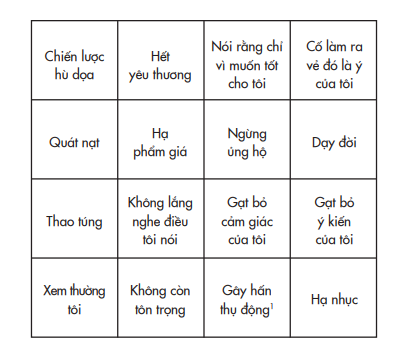
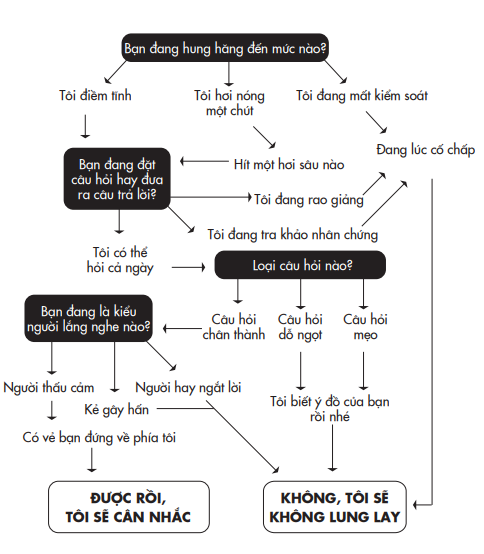

# Chương 7: Người Tâm Tình Về Vắc-Xin Và Điều Tra Viên Nhã Nhặn
## Việc lắng nghe đúng đắn khiến người khác thay đổi ra sao

---

---

Người muốn nghe điều bản thân không muốn nghe là một người hiếm có.

> *– Dick Cavett*

Khi Marie-Hélène Étienne-Rousseau chuyển dạ, cô đã bật khóc. Khi đó là tháng Chín năm 2018, và em bé lẽ ra phải đến tháng Mười Hai mới chào đời. Chỉ vài phút trước nửa đêm, con trai Tobie ra đời, nặng chưa đầy một ki-lô-gram. Em bé nhỏ xíu, đến nỗi cái đầu có thể đặt trọn trong lòng bàn tay Marie-Hélène, và cô vô cùng sợ hãi với ý nghĩ rằng con mình sẽ không sống nổi. Tobie chỉ được ở trong vòng tay mẹ vài giây ngắn ngủi trước khi được khẩn cấp đưa đến khoa chăm sóc đặc biệt cho trẻ sơ sinh. Em bé cần mặt nạ trợ thở và ngay sau đó được đưa đi phẫu thuật vì xuất huyết trong. Phải mất nhiều tháng, cậu bé mới được cho phép về nhà.

Khi Tobie còn ở bệnh viện, Marie-Hélène đi mua tã và nghe được bản tin về dịch sởi đang lan rộng ở tỉnh Quebec của cô. Cô vẫn chưa tiêm ngừa cho Tobie. Đó thậm chí không phải là một vấn đề được cân nhắc – em bé vẫn còn quá yếu. Cô cũng không tiêm ngừa cho ba đứa con lớn của mình – việc tiêm ngừa không phổ biến tại cộng đồng của cô. Bạn bè và hàng xóm của cô đều mặc nhiên cho rằng các vắc- xin là nguy hiểm và truyền tai nhau những câu chuyện rùng rợn về tác dụng phụ của vắc-xin. Tuy thế, thực tế vẫn còn đó: trong thập niên ấy, Quebec đã có tới hai đợt dịch sởi bùng phát.

Ngày nay ở các nước phát triển, bệnh sởi đang gia tăng lần đầu tiên trong ít nhất nửa thế kỷ, và tỷ lệ tử vong là khoảng 1/1.000. Ở các nước đang phát triển, con số này là gần 1/100. Ước tính từ năm 2016 đến 2018, tỷ lệ tử vong do sởi tăng vọt trên toàn cầu đến 58%, với hơn một trăm ngàn ca thiệt mạng. Những cái chết này đáng lẽ đã có thể được ngăn chặn bằng tiêm chủng – nhờ vắc-xin mà đã có khoảng hai mươi triệu người được cứu sống trong hai thập niên qua. Mặc dù các nhà dịch tễ học đề xuất việc tiêm hai mũi vắc xin phòng bệnh sởi và tỷ lệ miễn dịch tối thiểu là 95%, chỉ có khoảng 85% số người trên toàn cầu tiêm mũi đầu và 67% số người tiếp tục tiêm mũi thứ hai. Nhiều người bỏ qua việc tiêm vắc-xin đơn giản vì họ không tin vào khoa học.

Các cơ quan chức năng đã tìm mọi cách để lên án vấn đề này, một số quan chức đưa ra cảnh báo rằng những người từ chối tiêm chủng có thể bị phạt đến một ngàn đô-la và có thể bị phạt tù đến sáu tháng. Nhiều trường học từ chối nhận trẻ chưa được tiêm ngừa và một hạt thậm chí còn cấm trẻ em chưa được tiêm ngừa đến nơi công cộng. Khi các phương án này không giải quyết được vấn đề, các quan chức chính phủ chuyển sang dùng phương án rao giảng. Bởi vì người dân mang những nỗi sợ vô căn cứ về vắc-xin, đây là lúc cần giáo dục họ bằng một liều sự thật.

Các kết quả thu được hầu như đều đáng thất vọng. Trong hai cuộc thử nghiệm được tiến hành song song ở Đức, ý tưởng cung cấp cho người dân các bằng chứng khoa học về sự an toàn của vắc-xin đều phản tác dụng: mọi người rốt cuộc càng cho rằng vắc-xin là nguy hiểm. Tương tự, khi người dân Mỹ được tiếp cận những thông tin về các mối nguy hại của bệnh sởi, xem những hình ảnh trẻ em bị di chứng từ sởi, hay biết tin một trẻ nhỏ suýt tử vong vì sởi, mối quan tâm của họ với việc tiêm ngừa không tăng lên chút nào. Và khi họ được truyền thông rằng không có bằng chứng nào cho thấy vắc-xin ngừa sởi gây ra chứng tự kỷ, những người trước đó đã hoài nghi vẫn tiếp tục thờ ơ với việc tiêm chủng. Có vẻ như không có một luận điểm xác thực hay lý giải dựa trên dữ kiện nào có thể lay chuyển sự quả quyết của họ rằng vắc-xin không an toàn.

Đây là một vấn đề thường gặp khi thuyết phục người khác: điều gì không lay chuyển được niềm tin của chúng ta thì có thể khiến niềm tin ấy càng mạnh mẽ hơn. Tương tự như vắc-xin được truyền vào hệ miễn dịch cơ thể nhằm chống lại vi-rút, chính động thái kháng cự đó càng củng cố thêm hệ miễn dịch tâm lý của chúng ta. Bác bỏ một quan điểm sẽ làm sản sinh ra các kháng thể chống lại mọi nỗ lực tác động trong tương lai. Khi đó, chúng ta thường trở nên quả quyết hơn với quan điểm của mình và mất đi hứng thú tìm hiểu những góc nhìn khác. Các phản đề không còn gây bất ngờ hay đánh động chúng ta nữa – chúng ta đã sẵn sàng tâm thế cự tuyệt.

Marie-Hélène Étienne-Rousseau đã đi qua hết hành trình ấy. Một kịch bản quen thuộc luôn chờ sẵn mỗi khi cô đưa những đứa con lớn đi khám bệnh. Bác sĩ ca ngợi ích lợi của vắc-xin, cảnh báo cô về các nguy cơ nếu từ chối tiêm chủng, và cứng nhắc với thông điệp chung chung ấy thay vì lắng nghe để trả lời những câu hỏi cụ thể của cô. Toàn bộ cung cách ấy toát lên sự xem thường. Marie-Hélène cảm thấy như thể mình đang bị công kích: “giống như cô ấy đang bị kết tội rằng tôi muốn con mình mắc bệnh. Như thể tôi là một bà mẹ tồi vậy”.

Khi Tobie bé bỏng cuối cùng đã đủ khỏe để về nhà sau năm tháng nằm viện, nguy cơ nhiễm bệnh của bé vẫn rất cao. Các y tá biết đây là cơ hội cuối cùng để bé được tiêm ngừa nên họ đã mời đến một “người tâm tình về vắc-xin⁸⁸” – một bác sĩ địa phương với cách tiếp cận mới mẻ nhằm giúp các phụ huynh trẻ tái tư duy về sự chống đối của họ đối với tiêm chủng. Vị bác sĩ này không rao giảng hay lên án các bậc cha mẹ. Ông cũng không tìm cách tuyên truyền theo kiểu chính trị. Ông chỉ đội chiếc mũ tư duy của nhà khoa học và phỏng vấn họ.

> **Chú thích:**⁸⁸ Nguyên văn: vaccine whisperer. Đây là chức danh đặt ra cho người giữ vai trò tư vấn và tuyên truyền các thông tin về vắc-xin tại Quebec với cách thức làm việc khác kiểu tư vấn thông thường. Thay vì chỉ tuyên truyền lợi ích của vắc-xin, ép buộc tiêm chủng, “người tâm tình về vắc-xin” sẽ trò chuyện với các phụ huynh một cách lành mạnh, lắng nghe những lo lắng của họ và trao đổi sâu sát mọi khía cạnh xung quanh vấn đề. Chương trình này của Quebec đã phát huy tác dụng.

## TRUYỀN ĐỘNG LỰC THÔNG QUA PHỎNG VẤN

Vào đầu thập niên 1980, một chuyên gia tâm lý lâm sàng có tên là Bill Miller không đồng tình với thái độ của các đồng nghiệp của mình đối với những người nghiện ngập. Một thực tế khá phổ biến là những chuyên gia trị liệu và tham vấn thời ấy thường kết tội các thân chủ lạm dụng chất gây nghiện là những kẻ dối trá do bệnh lý và sống trong sự chối bỏ. Cách nhìn nhận này khác với những điều Miller quan sát thấy trong quá trình đích thân trị liệu cho những người nghiện rượu, trong đó anh biết rao giảng vàlên án thường chỉ phản tác dụng. “Những người uống rượu quá mức hầu như đều ý thức được điều ấy”, Miller nói với tôi. “Nếu cố gắng thuyết phục rằng họ uống quá nhiều hay cần phải thay đổi tức là bạn đang kích lên sự kháng cự và điều này sẽ càng khiến họ khó thay đổi.”

Thay vì công kích hay hạ thấp thân chủ của mình, Miller thường bắt đầu bằng việc đặt câu hỏi cho họ và lắng nghe câu trả lời. Không lâu sau, Miller viết một bài báo chuyên đề về triết lý của mình và nó được chuyền tới tay của Stephen Rollnick, một thực tập sinh điều dưỡng trẻ đang làm việc trong lĩnh vực điều trị nghiện. Vài năm sau, hai người tình cờ gặp nhau ở Úc và nhận ra lĩnh vực họ đang khai phá rộng lớn hơn nhiều so với một phương pháp điều trị đơn thuần. Đó là một cách thức tiếp cận hoàn toàn khác trong việc giúp con người thay đổi.

Cùng nhau, họ phát triển các nguyên tắc cốt lõi của một phương pháp thực hành mang tên phỏng vấn truyền động lực. Tiền đề trọng tâm là chúng ta rất khó có thể thúc đẩy hay thuyết phục một ai đó thay đổi. Tốt hơn là chúng ta hãy giúp họ tự mình tìm ra động lực để thay đổi chính mình.

Giả sử bạn là một học sinh trường Hogwarts⁸⁹, và bạn đang lo chú của mình sẽ theo phe Voldemort. Bạn có thể thực hiện một cuộc phỏng vấn truyền động lực kiểu như thế này: ⁸⁹ Trường dạy phù thủy trong bộ tiểu thuyết nổi tiếng Harry Potter của nhà văn J. K. Rowling. (ND)

Bạn: Cháu rất muốn biết cảm nhận của chú về Kẻ Chớ Gọi Tên** Ra⁹⁰. **>**Chú thích:**⁹⁰ Biệt danh của nhân vật Voldemort.

Chú: Chà, ngài là phù thủy hùng mạnh nhất còn sống hiện nay.** Với lại, các môn đệ của ngài đã hứa cho chú một tước hiệu ra trò. **Bạn: Thú vị đấy. Có điều gì về ông ta mà chú không thích** không? **Chú: À, chú không thích lắm vụ giết chóc.**

Bạn: Thì đâu có ai hoàn hảo. **Chú: Ừ, nhưng giết chóc thì xấu xa thậm tệ rồi.**

Bạn: Nghe như chú cũng có những e ngại về Voldemort. Điều gì **ngăn chú thoát ly khỏi hắn chứ?**

Chú: Chú sợ ngài hướng vụ giết chóc về phía chú chứ còn gì nữa. **Bạn: Sợ cũng đúng. Cháu cũng cảm thấy vậy. Nhưng cháu rất tò** mò là đối với chú có bất cứ nguyên tắc sống nào thật sự quan **trọng, đến mức chú sẵn sàng đương đầu với nỗi sợ ấy không?**

Phỏng vấn truyền động lực bắt đầu trước hết với thái độ khiêm nhường và sự tò mò. Chúng ta không biết điều gì có thể khiến đối phương thay đổi, nhưng chúng ta thật lòng muốn biết. Mục tiêu không phải là để thúc đẩy người khác làm gì mà nhằm giúp họ phá vỡ vòng lặp cố chấp và nhìn thấy những khả năng mới. Vai trò của chúng ta là giữ thẳng chiếc gương để họ có thể nhìn thấy chính mình rõ hơn, và từ đó truyền lực để họ khám phá những niềm tin và hành vi của bản thân. Điều đó có thể kích hoạt một vòng lặp tái tư duy, trong đó người ta tiếp cận quan điểm của bản thân một cách khoa học hơn. Họ tăng trưởng thái độ khiêm nhường về hiểu biết của mình, hoài nghi những điều mình xác tín và tò mò về những góc nhìn khác biệt.

Tiến trình phỏng vấn truyền động lực bao gồm ba kỹ thuật mấu chốt:

• Đặt những câu hỏi mở

• Lắng nghe có suy ngẫm • Khẳng định mong muốn và khả năng thay đổi của đối phương

Khi Marie-Hélène sẵn sàng cho Tobie xuất viện, “người tâm tình về vắc-xin” được các điều dưỡng viên gọi tới là một chuyên gia về trẻ sơ sinh và là một nhà nghiên cứu tên Arnaud Gagneur. Chuyên môn của anh là áp dụng các kỹ thuật phỏng vấn truyền động lực vào các cuộc thảo luận về tiêm chủng. Khi Arnaud tiếp chuyện Marie- Hélène, anh không hề phán xét cô vì đã không tiêm ngừa cho các con của mình và cũng không áp đặt cô phải thay đổi. Anh tiếp cận cô như một nhà khoa học hay như “một phiên bản Socrates mềm mỏng hơn”, như cách phóng viên Eric Boodman mô tả khi viết bài về buổi gặp gỡ của họ.

Arnaud nói với Marie-Hélène rằng anh lo ngại những gì có thể xảy đến cho Tobie nếu bé bị lây bệnh sởi, nhưng anh chấp nhận quyết định của cô và muốn hiểu rõ hơn về quyết định đó. Trong khoảng hơn một giờ đồng hồ, anh đặt các câu hỏi mở về những lý do dẫn cô đến quyết định không tiêm phòng. Anh chú tâm lắng nghe các câu trả lời của cô, công nhận rằng quả thực thế giới hiện nay đầy rẫy những thông tin gây hoang mang về sự an toàn của vắc-xin. Cuối buổi trao đổi, Arnaud nhắc lại với Marie-Hélène rằng cô có quyền tự do lựa chọn việc có tiêm ngừa hay không, và anh tin tưởng ở khả năng nhận định và chủ ý của cô.

Trước khi Marie-Hélène rời bệnh viện, cô đã cho bé Tobie tiêm ngừa. Theo lời cô, thời khắc xoay chuyển quyết định là khi Arnaud “nói với tôi rằng dù tôi quyết định có tiêm ngừa hay không, anh vẫn tôn trọng lựa chọn của tôi vì tôi là một người mẹ luôn muốn làm điều tốt nhất cho các con của mình. Đối với tôi, chỉ riêng câu nói ấy thôi đã có giá trị hơn ngàn vàng”.

Marie-Hélène không chỉ cho Tobie tiêm ngừa – cô còn nhờ một y tá sức khỏe cộng đồng đến tiêm ngừa cho ba đứa con còn lại tại nhà. Cô thậm chí còn đề nghị liệu Arnaud có thể nói chuyện với chị dâu của mình về việc tiêm ngừa cho các con của chị ấy. Cô cho hay quyết định của mình trong cộng đồng chống vắc-xin “giống như thể cho phát nổ một quả bom”.

Marie-Hélène Étienne-Rousseau là một trong nhiều bậc cha mẹ trải qua quá trình xoay chuyển quyết định như thế. Những “người tâm tình về vắc-xin” không chỉ giúp người khác thay đổi niềm tin, mà đồng thời còn làm họ thay đổi cả hành vi. Trong nghiên cứu ban đầu của Arnaud trên đối tượng những bà mẹ sau sinh ở nhà hộ sản, 72% trong số họ cho biết họ dự định sẽ tiêm ngừa cho con mình; sau một buổi phỏng vấn truyền động lực với một tham vấn viên tiêm phòng, 87% đồng ý tiêm ngừa cho con. Trong thí nghiệm kế tiếp của Arnaud, nếu các bà mẹ tham dự một buổi phỏng vấn truyền động lực, khả năng trẻ được tiêm ngừa đầy đủ trong vòng hai năm sau đó sẽ tăng lên 9%. Nghe có vẻ chỉ là một con số nhỏ, song nên nhớ đây là kết quả có được chỉ từ một buổi trao đổi duy nhất tại nhà hộ sản, và như vậy thôi đã đủ làm thay đổi hành vi của các bà mẹ trong hai mươi bốn tháng tới. Chẳng bao lâu sau đó, Bộ Y tế liên bang đã đầu tư hàng triệu đô-la vào chương trình phỏng vấn truyền động lực của Arnaud, với kế hoạch gửi những người tâm tình về vắc-xin đến khoa phụ sản ở tất cả các bệnh viện ở Quebec.

Ngày nay, hình thức phỏng vấn truyền động lực được áp dụng rộng rãi trên toàn thế giới bởi hàng vạn người có chuyên môn – bao gồm những chuyên viên huấn luyện được chứng nhận ở khắp châu Mỹ và nhiều nước ở châu Âu, đồng thời các khóa học trang bị các kỹ năng cần thiết cũng được tổ chức rộng rãi tại Argentina, Malaysia và Nam Phi. Phỏng vấn truyền động lực đã là đề tài nghiên cứu của hơn một ngàn thử nghiệm đối chứng; chỉ liệt kê hết chúng trong một thư mục cũng đã mất đến sáu mươi bảy trang. Hình thức phỏng vấn này được các nhà chuyên môn về y tế sử dụng hiệu quả trong việc giúp mọi người cai thuốc lá, rượu và các chất gây nghiện, từ bỏ thói quen cờ bạc và các hành vi tình dục không an toàn, cũng như cải thiện chế độ ăn uống và luyện tập, điều trị những chứng rối loạn ăn uống và giảm cân. Nó còn được các huấn luyện viên vận dụng thành công vào việc giúp các tuyển thủ bóng đá chuyên nghiệp gia tăng sức bền, các giáo viên giúp học sinh ngủ đủ giấc, các cố vấn giúp các đội nhóm làm việc chuẩn bị sẵn sàng cho sự thay đổi về tổ chức, các nhân viên sức khỏe cộng đồng khuyến khích người dân ở Zambia lọc nước trước khi uống, và các nhà hoạt động môi trường giúp mọi người hành động ngăn chặn thay đổi khí hậu. Các kỹ năng tương tự cũng đã giúp các cử tri có nhiều định kiến cởi mở hơn trong suy nghĩ, và khi chuyên viên hòa giải giúp các phụ huynh ly hôn xử lý bất đồng về con cái, phỏng vấn truyền động lực có khả năng đem lại kết quả thành công gấp đôi so với cách thức hòa giải truyền thống.

Nhìn chung, ba trong số bốn nghiên cứu đều cho thấy phương pháp này có tác động đáng kể đến sự thay đổi hành vi cả về mặt thống kê lẫn ý nghĩa lâm sàng, và các chuyên gia tâm lý hay y bác sĩ áp dụng nó đều đạt kết quả với tỷ lệ thành công là 4/5. Không nhiều lý thuyết ứng dụng trong các chuyên ngành khoa học hành vi có được bộ bằng chứng thuyết phục đến thế.

Phỏng vấn truyền động lực không chỉ giới hạn trong môi trường công việc – nó cũng có thể được áp dụng trong các quyết định và tương tác trong cuộc sống thường nhật. Một ngày nọ, một người bạn gọi điện cho tôi để hỏi xin lời khuyên rằng liệu cô ấy có nên quay lại với người yêu cũ không. Tôi ủng hộ việc đó, nhưng tôi không nghĩ mình có tư cách để khuyên cô ấy nên làm thế nào. Thay vì đưa ra ý kiến cá nhân, tôi gợi ý để cô ấy suy xét tất cả những lý do nên và không nên và những điều đó đáp ứng như thế nào với mong muốn của cô về người bạn đời. Cô ấy cân nhắc và cuối cùng tự thuyết phục mình rằng cô nên hàn gắn lại mối quan hệ. Cuộc trò chuyện giữa chúng tôi cứ như một phép màu, bởi vì tôi không hề cố thuyết phục cô ấy và thậm chí cũng không đưa ra bất cứ lời khuyên nào.⁹¹ ⁹¹ Dường như con người đã hiểu được sức mạnh của thuyết phục bản thân thay đổi từ hàng ngàn năm nay. Tôi mới biết được gần đây rằng cụm từ abracadabra (úm ba la xì bùa) xuất phát từ một thành ngữ Do Thái có nghĩa là “Khi nói, tôi tạo ra thế giới quanh mình”. (TG)

Khi người ta phớt lờ lời khuyên, không phải lúc nào cũng bởi vì họ không đồng tình với nó, mà đôi khi họ chỉ kháng cự lại cảm giác có áp lực và cảm thấy ai đó đang kiểm soát quyết định của mình. Để bảo vệ quyền tự quyết của họ, thay vì ra lệnh hay khuyên răn, chuyên viên phỏng vấn truyền động lực sẽ bắt đầu buổi trao đổi đại khái như sau: “Có những cách này từng giúp ích cho tôi, bạn xem có cách nào trong số đó có thể giúp ích cho bạn không?”.

### CÁCH TRUYỀN ĐỘNG LỰC DỞ TỆ

## BINGO

Bạn đã thấy rằng việc đặt câu hỏi có thể giúp đối phương tự thuyết phục bản thân. Phỏng vấn truyền động lực còn đi xa hơn, nó gợi mở để người khác tự khám phá chính mình. Bạn đã xem cách nó phát huy tác dụng trong thực tế ra sao khi Daryl Davis hỏi các hội viên KKK rằng làm sao họ có thể thù ghét anh khi thậm chí còn không biết về anh, và đến đây, tôi muốn giải mã các kỹ thuật liên quan một cách cụ thể hơn. Khi muốn người khác tái tư duy, phản xạ đầu tiên theo bản năng của chúng ta thường là bắt đầu nói. Song, cách hiệu quả nhất giúp người khác tư duy cởi mở thường là lắng nghe.

## BÊN NGOÀI PHÒNG KHÁM

Nhiều năm trước, một công ty công nghệ sinh học khởi nghiệp liên hệ tôi nhờ giúp đỡ. Giám đốc điều hành, Jeff, xuất thân là một nhà khoa học, nên anh ấy có khuynh hướng thu thập mọi dữ kiện cần thiết trước khi đưa ra một quyết định. Sau hơn một năm rưỡi lèo lái công ty, anh vẫn chưa thể vạch ra được tầm nhìn, và công ty đang trên đà thất bại. Một bộ ba nhà cố vấn đã cố thuyết phục anh đưa ra định hướng phát triển công ty và cả ba đều bị sa thải. Trước khi giám đốc nhân sự bỏ cuộc, cô thực hiện một nỗ lực sau chót là liên hệ một người trong giới học thuật. Đó là một thời điểm hoàn hảo để áp dụng phỏng vấn truyền động lực: Jeff dường như chống lại việc thay đổi và tôi không biết nguyên nhân là gì. Khi gặp nhau, tôi quyết định thử xem mình có thể giúp anh ấy tự tìm thấy động lực để thay đổi không. Sau đây là những khoảnh khắc then chốt trong cuộc trao đổi giữa chúng tôi:

Tôi: Tôi thật vinh hạnh là người tham vấn cho anh sau khi ba **người tham vấn trước đã bị anh cho nghỉ. Tôi rất muốn nghe tại** sao họ lại thất bại. **Jeff: Người đầu tiên đưa ra ngay những câu trả lời thay vì đặt** câu hỏi. Như thế là ngạo mạn: làm sao anh ta có thể giải quyết **vấn đề khi thậm chí chưa dành thời gian để hiểu về nó? Hai** người kế tiếp có khá hơn khi tìm hiểu vấn đề từ tôi, nhưng rốt **cuộc họ lại cố dạy bảo tôi phải làm công việc của mình như thế** nào. **Tôi: Nếu vậy sao anh còn tốn công mời thêm một cố vấn ở bên** ngoài nữa? **Jeff: Tôi đang tìm những ý tưởng mới mẻ cho vai trò lãnh đạo.**

Tôi: Tôi không ở vị thế có thể nói anh nên lãnh đạo công ty như **thế nào. Theo anh, lãnh đạo có nghĩa là gì?**

Jeff: Đưa ra các quyết định mang tính hệ thống, với một chiến **lược được cân nhắc kỹ lưỡng.**

Tôi: Có những lãnh đạo nào anh ngưỡng mộ vì các phẩm chất ấy **không?**

Jeff: Abraham Lincoln, Martin Luther King Jr., Steve Jobs. **Đó chính là thời điểm làm xoay chuyển quyết định. Trong phỏng vấn truyền động lực, có sự khác biệt giữa lời nói khuyến khích giữ nguyên hiện trạng và lời nói khuyến khích thay đổi. Lời nói khuyến khích giữ nguyên hiện trạng là những ý kiến hay gợi ý hướng đến việc duy trì mọi thứ như hiện có. Lời nói khuyến khích thay đổi đề cập đến một mong muốn, khả năng, nhu cầu, hay cam kết điều chỉnh. Khi suy tính về một thay đổi, nhiều người có cảm giác mâu thuẫn – họ có những lý do để cân nhắc đến sự thay đổi nhưng cũng có những lý do để duy trì hiện trạng. Miller và Rollnick gợi ý đặt câu hỏi và lắng nghe lời nói hướng đến sự thay đổi, và tiếp đó đặt một số câu hỏi về lý do và những cách thức thay đổi dự kiến.

Giả dụ một người bạn của bạn đề cập đến mong muốn bỏ thuốc lá. Bạn có thể phản hồi bằng cách hỏi tại sao cô ấy cân nhắc việc bỏ thuốc. Nếu cô ấy trả lời vì bác sĩ khuyên như thế, bạn có thể tiếp tục hỏi về những động lực của chính cô: cô ấy suy nghĩ như thế nào về việc bỏ thuốc lá? Nếu cô ấy nêu ra một lý do đưa đến quyết tâm bỏ thuốc lá, bạn có thể hỏi bước đầu tiên để từ bỏ việc hút thuốc sẽ là gì? “Lời nói khuyến khích thay đổi là mối chỉ vàng”, chuyên gia tâm lý lâm sàng Theresa Moyers nhận xét. “Điều bạn cần làm là bắt lấy mối chỉ đó và kéo nó lên.” Và đó chính là cách tôi đã làm với Jeff. Tôi: Anh ngưỡng mộ điều gì nhất ở những vị lãnh đạo vừa kể** tên? **Jeff: Tất cả họ đều có tầm nhìn rõ ràng. Họ truyền cảm hứng cho** người khác để làm được những điều phi thường. **Tôi: Thật thú vị. Nếu Steve Jobs ở vai trò hiện tại của anh, anh** nghĩ ông ấy sẽ làm gì? **Jeff: Ông ấy hẳn sẽ thúc giục ban lãnh đạo đề xuất một ý tưởng** táo bạo và tạo ra một trường biến dạng thực tại⁹² để làm cho ý **tưởng đó có vẻ hoàn toàn khả thi. Có lẽ tôi cũng nên làm thế.**

> **Chú thích:** ⁹² Trường biến dạng thực tại (tiếng Anh: reality distortion field) là một thuật ngữ được Bud Tribble tại hãng máy tính Apple sử dụng lần đầu tiên vào năm 1981, để mô tả sức hút hay khả năng thuyết phục của người đồng sáng lập Steve Jobs đối với các cộng sự của ông. Một khi Steve đã quyết định việc gì đó phải được diễn ra thì ông ấy sẽ tìm mọi cách để nó diễn ra.

Vài tuần sau đó, tại cuộc họp ban lãnh đạo, Jeff đã lần đầu tiên đứng lên phát biểu về tầm nhìn. Khi nghe được tin này, tôi không khỏi cảm thấy tự hào: Tôi đã khuất phục được kẻ bắt nạt bằng lý luận bên trong mình và dẫn dắt anh ấy tìm ra động lực của bản thân.

Tiếc thay, ban lãnh đạo cuối cùng vẫn quyết định đóng cửa công ty. Phần trình bày của Jeff hoàn toàn thất bại. Anh ấy lúng túng diễn đạt các ý từ ghi chú trên giấy ăn và những thông điệp về định hướng công ty của anh ấy không truyền được lửa đến những người tham dự cuộc họp. Tôi đã bỏ qua một bước quan trọng, đó là giúp anh ấy suy nghĩ về cách thức tiến hành sự thay đổi một cách hiệu quả.

Kỹ thuật thứ tư trong phỏng vấn truyền động lực là tóm tắt, kỹ thuật này thường được khuyên áp dụng vào cuối mỗi cuộc trao đổi và khi cần chuyển tiếp sang nội dung khác. Khi tóm tắt, bạn diễn giải những gì bạn hiểu về những lý do cần thay đổi của đối phương, để kiểm tra xem liệu bạn có bỏ sót hay hiểu sai ý nào không, và để thăm dò về những kế hoạch và các bước triển khai khả thi tiếp theo.

Trong phỏng vấn truyền động lực, vai trò của bạn không phải là người chỉ đạo hay người theo gót, mà là người dẫn đường. Miller và Rollnick so sánh điều này với việc thuê một hướng dẫn viên khi đi du lịch ở nước ngoài: chúng ta không muốn người này chỉ định mình nên đi đâu, nhưng cũng không muốn cô ấy chỉ theo chúng ta đến những nơi ta muốn đến. Tôi đã quá phấn khích khi Jeff quyết định sẽ chia sẻ tầm nhìn, đến độ tôi đã không hỏi tầm nhìn đó ra sao, hay anh ấy sẽ trình bày như thế nào. Tôi đã chỉ giúp anh tái tư duy về việc liệu có nên và khi nào nên đưa ra tuyên bố, mà không đá động đến nội dung của tuyên bố.

Nếu được làm lại, tôi sẽ hỏi Jeff xem anh dự định sẽ truyền tải thông điệp của mình như thế nào và anh dự đoán đội ngũ của mình sẽ đón nhận nó ra sao. Một người dẫn dắt tốt không chỉ dừng lại ở việc giúp người khác thay đổi niềm tin hay hành vi của họ. Công việc của chúng ta chỉ được xem là hoàn tất khi chúng ta giúp họ đạt được mục tiêu đề ra.

Phần tuyệt vời của phỏng vấn truyền động lực là nó làm nảy sinh sự cởi mở từ cả hai phía. Việc lắng nghe có thể khuyến khích người khác nhìn nhận lại lập trường của họ về chúng ta, đồng thời cũng cung cấp cho chúng ta những thông tin có thể khiến chúng ta chất vấn lại quan điểm của mình về họ. Nếu thực hành nghiêm túc phỏng vấn truyền động lực, chúng ta có thể trở thành người được tái tư duy.

Không khó để nhận ra phương pháp phỏng vấn truyền động lực hiệu quả thế nào trong hành nghề các chuyên viên tư vấn, bác sĩ, nhà trị liệu, giáo viên và huấn luyện viên. Khi người khác tìm đến sự giúp đỡ của chúng ta – hoặc chấp nhận vai trò giúp đỡ của chúng ta – thì ta đang ở vị thế phải chiếm được lòng tin của họ. Song, chúng ta đều đối mặt với những tình huống trong đó ta nảy sinh tham vọng muốn xoay người khác theo ý mình. Các bậc cha mẹ và những người thầy thường tin rằng họ biết điều gì tốt nhất cho con cái và học trò. Những người bán hàng, người gây quỹ và chủ doanh nghiệp có mối quan tâm đặc hữu là những cái gật đầu.

### BẠN SẼ LÀM TÔI ĐỔI Ý CHỨ?

Những người tiên phong về phỏng vấn truyền động lực như Miller và Rollnick đã cảnh báo ngay từ đầu rằng kỹ thuật này không nên được sử dụng nhằm mục đích thao túng. Các chuyên gia tâm lý nhận ra rằng khi mọi người phát hiện dụng ý gây ảnh hưởng của đối phương, họ sẽ dựng nên các cơ chế phòng thủ phức tạp. Khoảnh khắc người đối diện cảm thấy rằng chúng ta đang cố thuyết phục họ, hành vi của chúng ta sẽ lập tức mang một ý nghĩa khác. Một câu hỏi thẳng thắn sẽ bị xem như một chiến thuật chính trị, một câu phản hồi sau khi lắng nghe sẽ được hiểu thành thủ đoạn của công tố viên, một lời khẳng định về khả năng thay đổi thì lại nghe giống như một sự áp đặt cải đạo của nhà truyền giáo.

Phỏng vấn truyền động lực đòi hỏi ở người thực hiện nó một khao khát chân thành muốn giúp người khác đạt được mục tiêu. Cả Jeff và tôi đều mong muốn công ty của anh ấy thành công. Cả Marie-Hélène và Arnaud đều muốn bé Tobie được khỏe mạnh. Nếu mục tiêu của hai bên không tương hợp, làm sao bạn có thể giúp người khác thay đổi suy nghĩ của họ?

## NGHỆ THUẬT LẮNG NGHE GÂY ẢNH HƯỞNG

Betty Bigombe đã đi gần mười hai cây số đường rừng và vẫn chưa thấy một dấu hiệu sự sống nào. Bà không lạ gì với việc đi bộ đường dài: lớn lên ở miền bắc Uganda, bà đi bộ mỗi ngày gần mười hai cây số đến trường. Bà lớn lên chỉ với một bữa ăn mỗi ngày, trong căn nhà ở nông trang cùng gia đình của người chú có tám người vợ. Giờ thì sau bao nỗ lực bà đang làm việc tại Nghị viện Uganda, và bà đứng ra nhận lãnh một thử thách mà không một đồng sự nào của bà đủ can đảm để đảm nhận: cố gắng đàm phán hòa bình với một thủ lĩnh phiến quân.

Joseph Kony là lãnh đạo của Quân kháng chiến của Chúa⁹³. Tên này và nhóm phiến quân của hắn ta bị cáo buộc chịu trách nhiệm về việc thảm sát hơn một trăm ngàn người, bắt cóc hơn ba mươi ngàn trẻ em và khiến hơn hai triệu dân Uganda mất nhà cửa. Vào đầu thập niên 1990, Betty đã thuyết phục tổng thống Uganda cử bà đi đàm phán hòng có thể ngăn chặn bạo động.

> **Chú thích:** ⁹³ Quân kháng chiến của Chúa là một tổ chức tôn giáo và chiến binh hoạt động ở phía bắc Uganda và Nam Sudan. Hiện nhóm này đang được liệt vào danh sách các tổ chức khủng bố.

Khi Betty cuối cùng cũng liên lạc được với phiến quân sau nhiều tháng ròng nỗ lực, phe phiến quân từ chối với lý do cảm thấy bị sỉ nhục khi đàm phán với một phụ nữ. Nhưng Betty đã tìm cách thương thảo để được phép gặp trực tiếp Kony. Không lâu sau đó, hắn ta đã nhắc đến bà bằng danh xưng Mẹ, và thậm chí còn đồng ý rời khỏi khu rừng để bắt đầu đàm phán hòa bình. Mặc dù nỗ lực hòa bình không thành công, chỉ riêng việc khiến Kony cởi mở hơn để đối thoại cũng đã là một thành tựu đáng kể.⁹⁴ Vì những nỗ lực nhằm chấm dứt bạo lực, Betty được vinh danh là “Người phụ nữ Uganda của năm”. Gần đây, khi có dịp trò chuyện với bà, tôi đã hỏi bằng cách nào bà thành công trong việc tiếp cận Kony và quân đội của anh ta. Bà giải thích rằng chìa khóa không phải là thuyết phục, thậm chí cũng không phải là dỗ ngọt, mà là lắng nghe.

> **Chú thích:** ⁹⁴ Các nỗ lực đàm phán hòa bình bất thành khi tổng thống Uganda bác bỏ yêu cầu của Betty là vạch ra những nguyên tắc thỏa thuận chung cho các cuộc đàm phán và thay vào đó còn công khai lên tiếng đe dọa Kony, khiến hắn ta sau đó đáp trả bằng việc tàn sát hàng trăm người ở Atiak. Lòng đầy thất vọng, Betty rời nghị viện và chuyển sang làm việc cho Ngân hàng Thế giới. Một thập niên sau, bà khởi xướng một vòng đàm phán hòa bình khác với phe phiến quân. Bà trở về Uganda với vai trò trưởng ban hòa giải, sử dụng tiền riêng thay vì chấp nhận dùng ngân sách của chính phủ, mục đích là để bà có thể độc lập trong các quyết định của mình. Bà đã gần chạm đến mốc thành công nếu Kony không nuốt lời vào phút cuối. Ngày nay, quân phiến loạn của hắn ta đã suy yếu thành một nhóm rất nhỏ so với ban đầu và không còn là một mối đe dọa đáng kể nữa. (TG)

Biết lắng nghe không chỉ là nói ít lại. Lắng nghe là một bộ kỹ năng về việc đặt câu hỏi và hồi đáp. Nó bắt đầu bằng việc bày tỏ sự quan tâm đến những mối bận tâm của người đối diện hơn là tìm cách phán xét hiện trạng của họ hay chứng tỏ vị thế của bản thân. Nhà báo Kate Murphy từng viết rằng chúng ta có thể làm tốt hơn với việc đặt những câu hỏi “thể hiện thái độ mong muốn hiểu biết đầy chân thành mà không ẩn giấu đằng sau ý đồ sửa chữa, giải cứu, khuyên răn, thuyết phục hay sửa cho đúng”, và giúp đối phương “bộc lộ suy nghĩ của mình một cách rõ ràng nhất có thể⁹⁵”. ⁹⁵ Trong các khoảng thời gian tịnh tu, phái giáo hữu cũng có những “hội đồng minh triết” với nhiệm vụ tương tự, tức là đặt ra các câu hỏi nhằm giúp các thành viên tư duy rõ ràng và khúc chiết, và xử lý các vấn đề nan giải của bản thân. (TG)

Khi chúng ta cố gắng làm người khác thay đổi, đó có thể là một nhiệm vụ khó khăn. Ngay cả khi có những mục đích tốt đẹp nhất, chúng ta vẫn có thể dễ dàng rơi vào chế độ tư duy của một nhà truyền giáo thuyết giảng thao thao bất tuyệt, một công tố viên ra sức phân định đúng sai hay một chính trị gia đang vận động tranh cử. Tất cả chúng ta đều có “phản xạ trở về đúng⁹⁶”, mà như Miller và Rollnick mô tả là sự khao khát “chỉnh sửa cho đúng” mọi vấn đề và đưa ra các câu trả lời. Một người phỏng vấn truyền động lực giỏi luôn kiềm chế phản xạ này của bản thân – mặc dù mọi người sẽ ngay lập tức gặp bác sĩ chấn thương chỉnh hình nếu họ bị gãy xương, nhưng với các vấn đề liên quan đến tâm trí, họ thường mong chờ sự đồng cảm hơn là giải pháp.

> **Chú thích:** ⁹⁶ Trong y khoa, phản xạ này được gọi là phản xạ ưỡn – là phản xạ ưỡn thẳng người để nhanh chóng trở về tư thế đúng, tức là tư thế cân bằng với đầu thẳng đứng.

Đó chính là cách mà Betty Bigombe áp dụng để khởi động những nỗ lực của mình ở Uganda. Bà bắt đầu bằng những chuyến đi qua các vùng thôn dã để thăm các trại tị nạn dành cho những người vô gia cư do nội chiến. Bà đoán một số người tị nạn có thể có người thân ở trong hàng ngũ của Joseph Kony và có khả năng biết nơi trú ẩn của hắn ta. Mặc dù chưa từng được đào tạo về phỏng vấn truyền động lực, trực giác cho bà biết nên làm thế nào. Ở mỗi trại tị nạn, bà tuyên bố với mọi người rằng bà không ở đây để giáo huấn ai cả, mà để lắng nghe họ.

Lòng ham hiểu biết và khiêm nhường tự tin của bà đã khiến người dân Uganda ngạc nhiên. Những người hòa giải trước đó đều đến với yêu cầu ngưng chiến. Họ rao giảng về những sách lược giải quyết xung đột của mình và lên án những nỗ lực thất bại trước đây. Giờ đây Betty, một chính trị gia thực thụ, không bảo mọi người phải làm gì. Bà chỉ ngồi kiên nhẫn hàng giờ bên đống lửa, ghi chép và thỉnh thoảng nhẹ nhàng cắt ngang để đặt những câu hỏi. “Nếu bạn muốn xỉ vả tôi, hãy cứ tự nhiên”, bà nói. “Nếu bạn muốn tôi cuốn gói đi chỗ khác, tôi sẽ đi.”

Để thể hiện rõ cam kết vì hòa bình của mình, Betty lưu lại các trại tị nạn ngay cả khi họ thiếu lương thực và điều kiện vệ sinh không được tốt. Bà mời gọi mọi người nói lên những bất bình của mình và các giải pháp mà họ mong đợi. Những người tị nạn nói với bà rằng việc một người ngoài cuộc cho họ cơ hội được nói lên quan điểm của mình là rất hiếm có và thật mới mẻ. Họ được tự do đưa ra giải pháp của chính mình, điều này cho họ cảm giác về quyền tự chủ. Cuối cùng mọi người đã gọi bà là Megu, dịch sát nghĩa là “mẹ”, và đó cũng là danh xưng đầy tôn kính dành cho những người lớn tuổi. Sự quý trọng này đặc biệt ấn tượng bởi lẽ Betty là người đại diện của chính phủ – vốn được xem là thế lực đàn áp ở nhiều trại tị nạn. Sau đó không lâu, mọi người đề nghị giới thiệu bà với các thành viên điều phối và cấp chỉ huy trong hàng ngũ của Joseph Kony. Như Betty nhận xét một cách hóm hỉnh: “Ngay cả quỷ dữ cũng cảm kích khi được lắng nghe”.

Hàng loạt thực nghiệm cho thấy việc tương tác với một người chăm chú lắng nghe bằng sự thấu cảm và thái độ không phán xét sẽ giúp người ta bớt lo âu và phòng thủ. Họ cảm thấy ít áp lực phải né tránh các mâu thuẫn trong suy nghĩ của mình, từ đó nảy sinh mong muốn khám phá sâu hơn các quan điểm của bản thân, nhận ra thêm nhiều sắc diện trong đó, và cởi mở hơn khi bày tỏ suy nghĩ của mình. Những ích lợi của việc lắng nghe không chỉ giới hạn trong các tương tác giữa hai người mà cả trong tương tác nhóm. Các cuộc thử nghiệm trên các loại hình tổ chức từ cơ quan chính phủ, công ty công nghệ, cho đến trường học đều cho thấy quan điểm của mọi người trở nên đa chiều và ít cực đoan hơn sau khi họ tham gia một vòng tròn lắng nghe, trong đó tại từng thời điểm chỉ có một người được giữ gậy nói chuyện và tất cả những người còn lại thì chăm chú lắng nghe. Các chuyên gia tâm lý gợi ý thực hành kỹ năng này bằng cách ngồi lại và lắng nghe những người mà chúng ta đôi khi cảm thấy khó hiểu được họ. Ý tưởng là cho họ biết rằng chúng ta đang nỗ lực để trở thành người lắng nghe tốt hơn, chúng ta muốn nghe suy nghĩ của họ và chúng ta sẽ ít phút lắng nghe trước khi phản hồi.

Nhiều người làm công tác truyền đạt thường cố làm cho bản thân trông có vẻ thông minh, trong khi những người lắng nghe tuyệt vời thì chú trọng việc làm cho khán giả cảm thấy họ mới là người thông minh. Người lắng nghe giúp người khác tiếp cận quan điểm của chính mình bằng tâm thế khiêm nhường, hồ nghi và sẵn sàng học hỏi hơn. Khi có cơ hội bày tỏ bản thân thành lời, người ta thường khám phá ra những suy nghĩ mới. Như tác giả E. M. Forster mô tả: “Làm sao tôi có thể biết mình nghĩ gì cho đến khi tôi nghe được điều mình nói ra?”. Nhận thức này giúp Forster trở thành một người lắng nghe tận tụy. Một người viết tiểu sử đã viết về ông: “Nói chuyện với ông ấy cho tôi cảm giác như bị cuốn vào một sức hút nghịch đảo⁹⁷, đó là cảm giác được lắng nghe với sự lôi cuốn đến độ bạn phải hiển lộ cái tôi thành thật, sâu sắc và tuyệt vời nhất của bản thân”.

> **Chú thích:** ⁹⁷ Nguyên văn: inverse charisma. Một người có sức hút thông thường (charisma) là người có khả năng thuyết phục, thu hút người khác về phía mình. Ngược lại, một người có sức hút nghịch đảo (inverse charisma) là người có khả năng khơi gợi, phơi bày những điều tốt đẹp nhất của người khác, giúp họ tự bộc lộ sức hút của chính mình.

*Sức hút nghịch đảo. Một cụm từ mô tả chính xác làm sao về đặc tính thu hút của một người lắng nghe giỏi. Ngẫm mà xem kiểu lắng nghe này hiếm thấy đến chừng nào. Trong số những nhà quản lý bị nhân viên đánh giá là không biết lắng nghe, có đến 94% tự đánh giá là có khả năng lắng nghe tốt hoặc rất tốt. Dunning và Kruger chắc sẽ có đôi lời về việc này. Trong một khảo sát, một phần ba số phụ nữ được hỏi cho biết thú cưng của họ biết lắng nghe hơn bạn đời của mình. Biết đâu không phải chỉ có đám trẻ nhà tôi muốn nuôi mèo. Một thực tế phổ biến là bác sĩ thường ngắt lời bệnh nhân trong vòng mười một giây, trong khi bệnh nhân chỉ cần hai mươi chín giây để mô tả triệu chứng của họ. Tuy nhiên, Marie-Hélène đã có một trải nghiệm hoàn toàn khác ở Quebec.*

Khi Marie-Hélène giải thích rằng cô lo lắng về nguy cơ tự kỷ và những ảnh hưởng của việc tiêm nhiều loại vắc-xin cùng một lúc, Arnaud không dội bom cô bằng hàng tấn dữ kiện khoa học. Anh hỏi cô lấy thông tin ấy từ nguồn nào. Như phần lớn phụ huynh, cô cho biết mình đã đọc về vắc-xin trên mạng nhưng không nhớ ở trang nào. Anh đồng ý rằng trong một biển thông tin tràn ngập những tin trái ngược như vậy, thật khó để có được cái nhìn chính xác về tính an toàn của vắc-xin.

Cuối cùng, khi đã hiểu được những niềm tin của Marie-Hélène, Arnaud hỏi liệu anh có thể chia sẻ với cô một số thông tin về vắc-xin dựa trên hiểu biết chuyên môn của mình không. “Tôi đã bắt đầu cuộc đối thoại như thế”, anh kể với tôi. “Mục đích là nhằm tạo dựng một mối quan hệ tin tưởng. Nếu bạn trình bày thông tin mà không xin phép, sẽ chẳng ai nghe bạn.” Arnaud đã có thể nhắm đến nỗi sợ và nhận thức sai lầm của cô bằng việc giải thích rằng vắc-xin phòng bệnh sởi là một vi rút sống đã bị làm suy yếu, vì vậy các triệu chứng gây ra thường không đáng kể và không có bằng chứng nào cho thấy nó làm tăng nguy cơ bị chứng tự kỷ hay các hội chứng khác. Anh không tuyên truyền hay giảng giải mà cùng thảo luận với cô. Những câu hỏi của Marie-Hélène đã dẫn đường cho những bằng chứng mà anh chia sẻ và chúng đã định hình lại những hiểu biết của cô. Từng bước đi theo tiến trình, Arnaud tránh được việc gây áp lực cho cô. Thậm chí sau khi trình bày xong các thông tin khoa học, anh còn chốt lại phần trao đổi bằng việc bảo cô cứ cân nhắc về việc này, khẳng định quyền tự do quyết định của cô.

Năm 2020, vào một ngày bão tuyết tồi tệ nhất mùa đông năm ấy, một cặp vợ chồng đã lái xe suốt một tiếng rưỡi đồng hồ để đến gặp Arnaud. Các con của họ đều chưa được tiêm phòng mũi nào, nhưng sau bốn mươi lăm phút trao đổi với anh, họ đã quyết định cho cả bốn đứa con tiêm ngừa. Gia đình này sống ở cùng làng với Marie-Hélène, và khi nhìn thấy những đứa trẻ trong làng được tiêm ngừa, người mẹ cũng cảm thấy đủ tò mò để tìm kiếm thêm thông tin.

Sức mạnh của việc lắng nghe không chỉ nằm ở việc tạo điều kiện cho người khác suy tư về quan điểm của bản thân. Lắng nghe còn là biểu hiện của tôn trọng và bày tỏ sự quan tâm. Khi Arnaud dành thời gian để hiểu những khúc mắc của Marie-Hélène thay vì gạt bỏ chúng, anh bày tỏ rằng mình quan tâm một cách chân thành đến sức khỏe của cô lẫn con trai cô. Khi Betty Bigombe lưu lại trại tị nạn với những người Uganda đã mất hết nhà cửa và đặt câu hỏi để lắng nghe những bất bình của họ, bà đã cho thấy rằng những điều họ nói rất quan trọng đối với bà. Lắng nghe người khác là một cách trao tặng món quà hiếm có và quý giá nhất của chúng ta: sự chú tâm. Một khi chúng ta thể hiện mình quan tâm đến đối phương và những mục tiêu của họ, họ cũng sẽ sẵn lòng lắng nghe chúng ta hơn.

Nếu chúng ta có thể thuyết phục một người mẹ tiêm phòng cho những đứa con vốn rất cần được bảo vệ của mình, hay thuyết phục một thủ lĩnh phiến quân cân nhắc đàm phán hòa bình, rất có thể chúng ta sẽ dễ dàng kết luận rằng mục đích có thể biện minh cho phương tiện. Nhưng cần phải nhớ cách thức là thước đo phẩm cách của chúng ta. Khi chúng ta thành công trong việc khiến người khác thay đổi ý kiến, chúng ta không nên chỉ tự hỏi liệu mình có tự hào về kết quả đạt được hay không. Chúng ta còn cần tự hỏi liệu mình có tự hào về cách thức đã thực hiện điều đó hay không.
