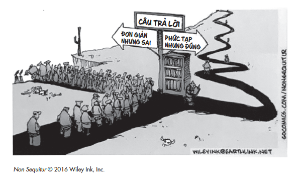
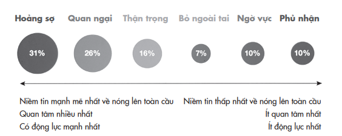
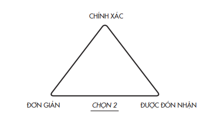
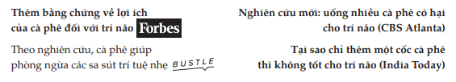
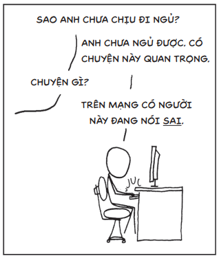
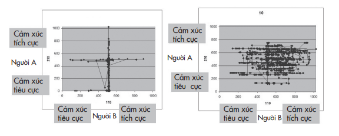
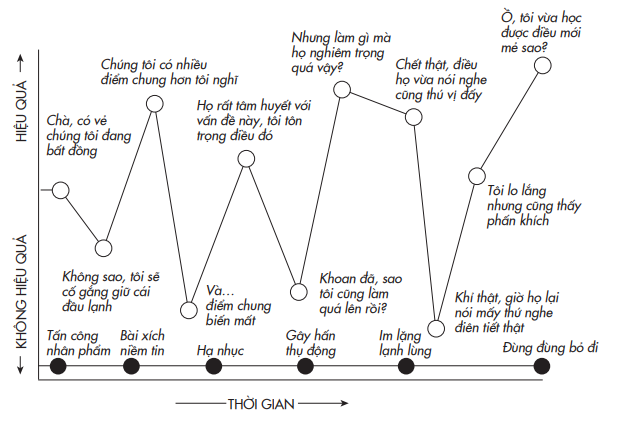

# PHẦN III: TÁI TƯ DUY TẬP THỂ
*Tạo ra những cộng đồng học tập suốt đời *---

# Chương 8: Những Cuộc Đối Thoại Gay Cấn
## Xử lý vấn đề phân cực trong những cuộc trao đổi khó tìm tiếng nói chung

---

---

Khi xung đột trở thành chuyện thường ngày thì sự đa chiều là tin nóng.

>* – Amanda Ripley *Bạn có hứng thú với một cuộc tranh luận gay cấn và nảy lửa về việc nạo phá thai? Còn vấn đề nhập cư, án tử hình hay biến đổi khí hậu thì sao? Nếu bạn nghĩ mình có đủ bản lĩnh để tham gia, hãy đến tầng hai của tòa nhà bằng gạch trong khuôn viên trường Đại học Columbia ở New York. Đây là trụ sở của “Phòng thí nghiệm những cuộc đối thoại gay cấn”.

Nếu đủ can đảm ghé thăm nơi này, bạn sẽ được ghép cặp với một người lạ có quan điểm hoàn toàn trái ngược với bạn về một chủ đề gây tranh cãi. Các bạn sẽ chỉ có hai mươi phút cho việc thảo luận vấn đề, và sau đó cả hai sẽ phải quyết định có thể đi đến thống nhất để soạn và ký vào một tuyên bố chung của hai người về những quan điểm liên quan đến luật nạo phá thai hay không. Nếu các bạn có thể thực hiện được điều đó

>* – một việc chẳng dễ dàng gì – thì phát ngôn chung đó sẽ được đăng tải lên một diễn đàn mở.

Suốt hai thập niên nay, nhà tâm lý học điều hành phòng thí nghiệm này, Peter T. Coleman, đã hội tụ mọi người đến đây để bàn luận về những vấn đề phân cực. Nhiệm vụ của ông là phân tích các cuộc đối thoại thành công theo kỹ nghệ đảo ngược⁹⁸ và sau đó thử nghiệm các công thức vừa tìm ra hòng có thể tạo ra thêm nhiều cuộc trao đổi thành công khác theo cùng cơ chế. ⁹⁸ Tiếng Anh: reverse - engineer, kỹ nghệ đảo ngược hay chế tạo ngược là kỹ thuật hay quy trình phân tích cấu trúc, chức năng và nguyên lý hoạt động của một sản phẩm có sẵn. Kỹ nghệ này áp dụng với nhiều mục đích, có thể để tìm ra lỗ hổng của sản phẩm hoặc để chế tạo một sản phẩm tương tự mà không sao chép gì từ sản phẩm nguyên bản.

Để đặt bạn ở một chế độ tư duy phù hợp trước khi bạn bắt đầu cuộc trao đổi về vấn đề nạo phá thai, Peter sẽ đưa cho bạn và người lạ kia một bài báo về một chủ đề gây tranh cãi khác: việc kiểm soát súng. Điều bạn không được biết là có những phiên bản khác nhau của bài báo về kiểm soát súng, và phiên bản bạn đọc sẽ tác động phần lớn đến khả năng bạn tìm được tiếng nói chung về nạo phá thai.

Nếu bài báo về kiểm soát súng trình bày cả hai mặt của vấn đề, phân bổ đồng đều luận điểm cho cả hai phương diện – quyền sở hữu súng và những chính sách hạn chế súng, thì bạn và đối thủ của mình sẽ có nhiều cơ may đi đến được điểm đồng thuận về nạo phá thai. Trong một thí nghiệm của Peter, sau khi đọc được bài báo đề cập cả hai lập trường, 44% các cặp tranh cãi đã có thể tìm ra được đủ điểm tương đồng để soạn thảo và ký vào một tuyên bố chung về nạo phá thai. Quả là một kết quả đáng chú ý.

Nhưng Peter vẫn tiếp tục với mong muốn tạo ra kết quả ấn tượng hơn nhiều. Ông chọn ngẫu nhiên một vài cặp và đưa cho họ đọc một phiên bản khác của bài báo, với nội dung có thể khiến 100% số cặp cùng soạn và ký vào một tuyên bố chung về luật nạo phá thai.

Phiên bản này của bài báo cũng truyền tải chừng ấy thông tin nhưng được trình bày khác đi. Thay vì mô tả vấn đề kiểm soát súng như một bất đồng theo kiểu phân định trắng đen giữa hai phe, phiên bản này định hình cuộc tranh luận đa chiều với nhiều vùng xám, tương ứng một số lượng lớn các quan điểm khác biệt.

Thời điểm chuyển giao sang thế kỷ 21, hy vọng lớn lao đối với internet là nó sẽ phơi bày cho chúng ta nhiều góc nhìn khác nhau. Nhưng khi không gian mạng chào đón thêm vài tỷ tiếng nói và làm tăng thêm ưu thế cho các luận điểm đối thoại, nó cũng trở thành một vũ khí chứa đầy những thông tin sai và tin giả. Thời điểm bầu cử tổng thống Mỹ năm 2016, khi vấn đề phân cực trong chính trị trở nên ngày một cực đoan và rõ nét hơn, đối với tôi, giải pháp cho vấn đề lại có vẻ hiển nhiên. Chúng ta cần chọc thủng các bong bóng lọc ở những trang tin chúng ta đọc hằng ngày và phá bỏ các buồng dội âm⁹⁹ ở các trang mạng; và nếu chúng ta có thể đơn giản chỉ cho người khác thấy mặt bên kia của vấn đề, họ sẽ cởi mở hơn trong suy nghĩ và có được nhiều thông tin chính xác hơn. Nghiên cứu của Peter thách thức giả định này.

> **Chú thích:**⁹⁹ Xem khái niệm “bong bóng lọc” và “buồng dội âm” ở phần đầu Chương 3.

Giờ đây chúng ta biết được rằng với những vấn đề phức tạp, xem xét những quan điểm của cả phía bên kia là không đủ. Tuy các nền tảng mạng xã hội tạo điều kiện cho chúng ta tiếp xúc với các góc nhìn mới, nhưng chúng không thể thay đổi suy nghĩ của chúng ta. Biết thêm một mặt khác của vấn đề là không đủ để chúng ta rời bỏ tư duy của nhà truyền giáo – luôn nghi ngờ liệu góc nhìn ấy có đúng đắn về mặt đạo đức hay không; tư duy của công tố viên – luôn chất vấn liệu chúng có đứng về lẽ phải hay không; hoặc tư duy của các chính trị gia – luôn tự hỏi liệu chúng có đứng đúng chiến tuyến về lịch sử không. Nghe một ý kiến trái chiều không nhất thiết thúc đẩy bạn tái tư duy về lập trường của mình, nó dễ khiến bạn cố chấp hơn với quan điểm ủng hộ súng của mình (hay quan điểm cấm sử dụng súng). Trình bày hai quan điểm khác biệt không đưa đến giải pháp; nó là một phần của vấn đề phân cực.

Các chuyên gia tâm lý có một thuật ngữ riêng dành cho điều này: thiên kiến nhị nguyên. Khuynh hướng cơ bản của con người là tìm kiếm sự sáng tỏ và kết luận bằng việc đơn giản hóa một miền phức tạp thành hai loại. Theo cách diễn đạt của tác gia trào phúng Robert Benchley là trên đời có hai loại người: những kẻ chia thế giới thành hai loại người, và những người còn lại.

“Thuốc giải” cho khuynh hướng này là đa diện hóa: phơi bày ra một loạt quan điểm khác nhau về mọi chủ đề mà chúng ta nói đến. Chúng ta cứ ngỡ rằng mình đang có bước tiến khi thảo luận những vấn đề nhạy cảm như hai mặt của một đồng xu, nhưng những người tham gia sẽ thật sự sẵn sàng nhìn nhận lại quan điểm cá nhân hơn nếu chúng ta trình bày các chủ đề này qua nhiều lăng kính khác nhau. Mượn lời của Walt Whitman, cần nhiều góc nhìn khác nhau để người ta nhận ra rằng họ cũng có nhiều thật nhiều góc nhìn.

Một liều thuốc giải đa diện có thể bẻ gãy vòng lặp tư duy cố chấp và kích thích vòng lặp tái tư duy. Nó cho chúng ta sự khiêm tốn về hiểu biết của mình và sự hồ nghi về các ý kiến của bản thân, và nó có thể khiến chúng ta đủ hiếu kỳ để khám phá những thông tin mình còn thiếu. Trong thí nghiệm của Peter, điều mấu chốt là định hình được câu chuyện kiểm soát súng không chỉ đơn giản là một vấn đề với hai quan điểm đối lập mà nó là một vấn đề bao gồm nhiều nan đề có liên hệ với nhau. Như nhà báo Amanda Ripley mô tả, bài báo về kiểm soát súng “nghe không giống như lời mở đầu phiên tòa của một luật sư mà giống như ghi chép thực địa của một nhà nhân chủng học hơn”. Những ghi chép đó đủ để giúp các nhà hoạt động “ủng hộ sự sống” và “ủng hộ quyền tự do lựa chọn¹⁰⁰” tìm ra được những phạm vi đồng thuận về vấn đề phá thai trong vòng hai mươi phút ngắn ngủi.

¹⁰⁰ Trong cuộc tranh cãi kéo dài về vấn đề phá thai ở Mỹ, những người tự nhận là “pro-life” (ủng hộ sự sống) giữ quan điểm phá thai là tội ác, những người tự nhận là “pro-choice” (ủng hộ quyền tự do lựa chọn) thì cho rằng mọi người đều có quyền tự do cơ bản là lựa chọn khi nào thì nên sinh con, họ tin rằng phá thai nên là việc hợp pháp.

Bài báo không chỉ làm người đọc sẵn sàng hơn trong việc tái tư duy về quan điểm của bản thân đối với việc nạo phá thai; họ còn tự xem xét lại lập trường của mình trong các vấn đề gây chia rẽ khác như Quy định chống phân biệt đối xử hay án tử hình¹⁰¹. Những người đọc bài báo ở phiên bản “nhị nguyên luận” (nêu lên hai mặt của vấn đề) có xu hướng bảo vệ quan điểm cá nhân nhiều hơn là quan tâm đến ý kiến của đối phương. Trong khi đó, những người đọc phiên bản bài báo có góc nhìn đa chiều đã đưa ra bình luận về điểm chung giữa họ với đối phương nhiều gấp đôi so với quan điểm cá nhân của chính mình. Họ cũng ít khẳng định lập trường hơn và đặt nhiều câu hỏi hơn. Vào cuối buổi đối thoại, họ cũng đưa ra các phát biểu có chất lượng và toàn diện hơn về lập trường, và khi buổi đối thoại kết thúc, cả hai bên đều cảm thấy hài lòng hơn.

>**Chú thích:**¹⁰¹ Khi các phương tiện truyền thông đồng loạt đưa tin nước Mỹ bị chia rẽ vì luật quản lý súng, họ đã bỏ sót nhiều khía cạnh phức tạp của vấn đề. Đồng ý rằng có một khoảng cách giữa 47% và 50% của Đảng Cộng hòa và Đảng Dân chủ về việc ủng hộ luật cấm và thu mua lại các vũ khí có sức sát thương. Tuy nhiên, các khảo sát lại cho thấy sự nhất trí giữa hai đảng về yêu cầu kiểm tra nhân thân bắt buộc (với tỷ lệ ủng hộ của Đảng Cộng hòa là 83% và của Đảng Dân chủ là 96%), đồng thời kiểm tra sức khỏe tâm thần (với tỷ lệ ủng hộ của Đảng Cộng hòa là 81% và Đảng Dân chủ là 94%). (TG)

Suốt một thời gian dài, tôi chật vật với việc bàn về các vấn đề chính trị trong cuốn sách này như thế nào. Tôi không có “viên đạn bạc¹⁰²” nào hay những chiếc cầu bắc qua mọi con sông. Tôi thậm chí còn không tin ở các đảng phái chính trị. Là một chuyên gia về tâm lý học tổ chức, tôi luôn quan tâm đến kỹ năng lãnh đạo của các ứng cử viên trước khi bận tâm về đường lối chính trị của họ. Là một công dân, tôi tin trách nhiệm của mình là phải có ý kiến độc lập về từng vấn đề một. Cuối cùng, tôi quyết định rằng cách tốt nhất để đứng trên mọi xung đột là tìm ra những thời điểm mà ai trong chúng ta cũng dễ bị kích động: đó là khi tham gia vào một cuộc đối thoại nảy lửa, dù là trực tiếp hay trực tuyến. ¹⁰² Nguyên văn: silver bullet, đây là thành ngữ chỉ một giải pháp dễ dàng và nhanh chóng để giải quyết một vấn đề khó khăn.

Kiềm chế thôi thúc đơn giản hóa mọi vấn đề là một bước tiến gần hơn tới văn minh tranh luận. Làm được như vậy sẽ tạo ra những tác động sâu sắc đến cách chúng ta trao đổi về các vấn đề phân cực. Trên các phương tiện truyền thông truyền thống, cách thức này giúp các nhà báo có thể khiến độc giả cởi mở hơn với những thông tin không dễ chịu. Trên mạng xã hội, chúng ta có thể áp dụng nó để xử lý các cuộc khẩu chiến trên Twitter và Facebook hiệu quả hơn. Trong những dịp họp mặt gia đình, nó có thể không giúp bạn tìm được tiếng nói chung với ông bác khó ưa của mình, nhưng nó rất hữu ích trong việc ngăn một cuộc trò chuyện vô thưởng vô phạt bùng nổ thành một hỏa ngục cảm xúc. Và trong các cuộc thảo luận về những chính sách ảnh hưởng đến mọi mặt trong đời sống của chúng ta, cách thức này có thể mang lại những giải pháp tốt hơn, thực tế hơn và nhanh chóng hơn. Đó chính là điều mà phần này của quyển sách hướng đến: áp dụng tái tư duy vào những phương diện khác nhau của đời sống, từ đó chúng ta có thể không ngừng học hỏi ở mọi giai đoạn cuộc đời.

## NHỮNG SỰ THẬT PHIỀN TOÁI

Năm 2007, cựu Phó Tổng thống Mỹ Al Gore là nhân vật chính trong một bộ phim bom tấn về biến đổi khí hậu, An Inconvenient Truth (tạm dịch: Một sự thật phiền toái). Bộ phim đã được trao giải Oscar cho hạng mục Phim Tài liệu Hay nhất và gây ra một làn sóng chiến dịch vận động, khuyến khích các doanh nghiệp xanh hóa hoạt động sản xuất và kinh doanh, đồng thời thúc đẩy chính phủ các nước thông qua dự luật và ký kết những thỏa thuận cột mốc nhằm bảo vệ hành tinh này. Lịch sử dạy chúng ta rằng đôi khi cần có sự kết hợp của thuyết giảng, lên án và vận động chính trị mới có thể tạo được sự chuyển biến mạnh mẽ đến thế.

Song đến năm 2018, chỉ 59% người Mỹ xem biến đổi khí hậu là một mối đe dọa nghiêm trọng – và 17% tin rằng nó chẳng phải là hiểm họa gì sất. Khắp các quốc gia ở Tây Âu và Đông Nam Á, có một tỉ lệ dân số cao hơn đã cởi mở với các chứng cứ khoa học cho thấy rằng biến đổi khí hậu là một thảm họa khốc liệt. Trong khi đó, trong cả một thập niên vừa qua tại Hoa Kỳ, niềm tin về biến đổi khí hậu gần như không hề chuyển biến.

Vấn đề gai góc này là bối cảnh tự nhiên để chúng ta khám phá xem chúng ta có thể tăng thêm tính đa diện vào các cuộc đối thoại như thế nào. Về cơ bản, điều đó đòi hỏi lôi kéo sự chú ý vào những khía cạnh thường bị bỏ qua. Hãy bắt đầu với việc tìm kiếm và phát hiện những vùng xám.

Một bài học cơ bản về thiên kiến mong chờ là niềm tin của chúng ta được thành hình từ động lực của bản thân. Điều ta tin phụ thuộc vào điều ta muốn tin. Về mặt cảm xúc, bất cứ ai cũng có thể bất an khi thừa nhận toàn bộ sự sống mà chúng ta biết rõ đang trong tình trạng nguy hiểm, nhưng người Mỹ còn có thêm những lý do khác để hồ nghi về vấn đề biến đổi khí hậu. Về mặt chính trị, biến đổi khí hậu bị gắn mác như là một vấn đề tự do quan điểm ở Mỹ; ở một số cộng đồng bảo thủ, việc đơn thuần thừa nhận rằng đó có thể là một vấn đề có thật cũng khiến nhiều người bị tẩy chay. Có bằng chứng cho thấy trình độ học vấn cao dẫn đến mức độ quan tâm lớn hơn đối với vấn đề biến đổi khí hậu ở những người theo phe Dân chủ, nhưng chiều hướng xảy ra hoàn toàn ngược lại ở phía Cộng hòa. Về kinh tế, người Mỹ vẫn tự tin rằng nước Mỹ có khả năng phục hồi tốt hơn so với đa số các quốc gia khác khi ứng phó với biến đổi khí hậu và chúng ta không sẵn lòng hy sinh những cách thức giúp chúng ta đạt đến sự thịnh vượng như hiện nay. Những niềm tin thâm căn cố đế ấy khó lòng thay đổi được.

Là một nhà tâm lý học, tôi muốn hướng sự chú ý vào một khía cạnh khác. Đó là điều tất cả chúng ta có thể kiểm soát được: cách chúng ta truyền đạt thông tin về biến đổi khí hậu. Nhiều người tin rằng rao giảng với lòng nhiệt huyết và sự xác tín là đủ để thuyết phục. Một ví dụ rõ nét là Al Gore. Khi ông thua suýt soát trong cuộc tranh cử tổng thống Mỹ năm 2000, một trong những điểm yếu trí mạng của ông là sinh khí – hay đúng hơn là ông thiếu điều đó. Nhiều người nhận xét rằng ông khô khan. Nhàm chán. Máy móc. Tua nhanh đến vài năm sau: bộ phim của ông ra mắt với đầy sức hút và các kỹ năng diễn thuyết của ông đã tăng tiến ngoạn mục. Vào năm 2016, khi tôi xem Gore diễn thuyết trên bục của diễn đàn TED, ngôn ngữ của ông thật sống động, giọng ông trầm bổng theo cảm xúc và nhiệt huyết của ông như thể đang tuôn ra theo những giọt mồ hôi. Nếu một robot có từng điều khiển bộ não của ông ấy, thì nó đã đoản mạch và nhường lại quyền kiểm soát cho con người rồi. “Một số người vẫn nghi ngờ liệu chúng ta có ý chí để hành động không”, ông nói một cách hùng hồn, “nhưng tôi dám nói rằng bản thân ý chí để hành động là một tài nguyên có khả năng tái tạo”. Khán giả đứng dậy với một tràng pháo tay kéo dài và sau đó ông được gọi là Elvis của TED. Nếu không phải phong cách truyền đạt của ông đã chạm đến trái tim khán giả, thì còn có thể là điều gì khác?

Trong buổi nói chuyện ở TED, Gore ca tụng với dàn hợp xướng rằng những khán giả của ông là vô cùng cấp tiến. Với những khán giả có niềm tin đa chiều hơn, ngôn ngữ của ông không phải lúc nào cũng tạo được sự cộng hưởng. Trong phim An Inconvenient Truth, Gore tách bạch “sự thật” với những phát ngôn của “những người tạm gọi là những kẻ hoài nghi”. Trong một bài viết trên báo vào năm 2010, ông phân biệt nhà khoa học với “những người chối bỏ vấn đề khí hậu”.

Đây là một ví dụ thực tế về thiên kiến nhị nguyên. Nó giả định rằng thế giới được chia thành hai phe: người tin và người không tin. Chỉ một phe đúng, bởi lẽ sự thật chỉ có một. Tôi không chê trách gì cách tiếp cận này của Al Gore; ông trình bày những dữ kiện xác thực và đại diện cho niềm tin chung của giới khoa học. Bởi vì ông từng là một chính trị gia, lối nhìn nhận hai mặt của một vấn đề hẳn là một khuynh hướng ăn sâu trong cách nghĩ. Nhưng khi chỉ có hai lựa chọn khả dĩ là hoặc trắng hoặc đen, ta sẽ dễ dàng rơi vào tâm thế phân biệt – ta đối đầu với họ – và có xu hướng thiên về một bên nào đó hơn là tập trung vào khoa học. Đối với những người trung lập, khi buộc phải chọn một bên, những áp lực về cảm xúc, chính trị và kinh tế sẽ đẩy họ theo hướng né tránh hoặc chối bỏ vấn đề.

Để vượt qua thiên kiến nhị nguyên, chúng ta nên bắt đầu từ việc ý thức rằng mọi vấn đề hay ý niệm đều có hàng loạt quan điểm khác nhau. Các khảo sát cho thấy chỉ riêng vấn đề biến đổi khí hậu đã có ít nhất sáu phe phái tư tưởng. Những “người tin” chiếm hơn phân nửa dân số Mỹ, trong đó, một số thì lo lắng trong khi số khác thì cảm thấy hoảng sợ. Những người được gọi là “người không tin” lại được phân ra thành bốn loại: từ thận trọng đến bỏ ngoài tai, rồi đến ngờ vực và phủ nhận hoàn toàn.

Một điều đặc biệt quan trọng là cần phân biệt giữa người hoài nghi và người chối bỏ. Người theo chủ nghĩa hoài nghi có một lập trường khoa học lành mạnh: Họ không tin bất cứ thứ gì họ nhìn thấy, nghe hay đọc được. Họ đặt những câu hỏi phản biện và cập nhật góc nhìn của bản thân mỗi khi tiếp cận với thông tin mới. Người chối bỏ thì theo trường phái phủ nhận, khóa chặt mình trong chế độ tư duy của nhà truyền giáo, công tố viên hay chính trị gia: Họ không tin bất cứ thông tin nào đến từ bên đối lập. Như Ủy ban Điều tra Hoài nghi¹⁰³ từng phát biểu trước truyền thông, chủ nghĩa hoài nghi là “nền móng của phương pháp luận khoa học”, trong khi chối bỏ là “một sự phủ nhận bằng suy diễn mọi ý kiến mà không hề suy xét khách quan¹⁰⁴”.

>**Chú thích:**¹⁰³ Committee for Skeptical Inquiry (viết tắt: CSI) là một chương trình của một tổ chức giáo dục phi lợi nhuận của Hoa Kỳ, nhằm khuyến khích việc tìm ra sự thật trên cơ sở khoa học, điều tra theo hướng phản biện và vận dụng lý lẽ để thẩm tra những tuyên bố ngoài phạm vi lý giải của khoa học. ¹⁰⁴ Các nhà khí hậu học còn phân biệt rõ hơn nữa, rằng người chối bỏ còn được phân ra thành ít nhất sáu kiểu nhận thức khác nhau: lập luận rằng (1) lượng CO2 không hề tăng lên; (2) ngay cả khi lượng CO2 có tăng lên, việc trái đất ấm dần lên là không thể; (3) ngay cả khi hiện tượng ấm dần lên đang xảy ra thật, đó là do các nguyên nhân tự nhiên; (4) ngay cả nếu con người là tác nhân gây ra sự ấm dần lên, mức tác động cũng không đáng kể; (5) ngay cả khi tác động của con người không hề nhỏ, nó sẽ có ích lợi bằng cách này hay cách khác; và (6) trước khi tình hình trở nên nghiêm trọng thật sự, chúng ta sẽ thích nghi được hoặc giải quyết nó thôi. Các thí nghiệm cho thấy việc hướng sự chú ý của công chúng tới nhóm chối bỏ khoa học có thể phản tác dụng vì nó càng lan truyền niềm tin sai lạc, trong khi việc bác bỏ những luận điểm hay kỹ thuật của họ sẽ có thể mang lại hiệu quả. (TG)

Tháng 11 năm 2019. Cơ sở dữ liệu: người Mỹ trên 18 tuổi, N = 1.303. (N: số mẫu được khảo sát, tức tổng số người.

Mức độ phức tạp của kiểu niềm tin đa sắc diện này thường không được đề cập đến trong các báo cáo về biến đổi khí hậu. Mặc dù chỉ có không quá 10% người dân Mỹ phủ nhận biến đổi khí hậu, số ít người chối bỏ này lại thu hút báo giới nhiều nhất. Theo một bài phân tích tổng hợp từ vài trăm ngàn bài báo trên các phương tiện truyền thông về biến đổi khí hậu từ năm 2000 đến năm 2016, số ít những người phủ nhận biến đổi khí hậu lại xuất hiện trên mặt báo một cách áp đảo: họ được truyền thông nhắc đến thường xuyên hơn đến 49% so với các nhà khoa học có chuyên môn. Kết quả là người ta đánh giá cao thái quá về sự phổ biến của các quan điểm phủ nhận và điều này khiến mọi người trở nên lưỡng lự hơn trong việc lên tiếng ủng hộ các chính sách bảo vệ môi trường. Khi vùng ở giữa hai thái cực không được nhìn thấy, ý chí hành động của số đông cũng biến mất theo. Nếu những người khác không định làm gì về điều đó, cớ gì tôi phải bận tâm? Khi nhận thức được rằng thực tế có rất nhiều người quan tâm đến vấn đề biến đổi khí hậu, họ sẽ sẵn sàng hành động hơn.

### NÓI VỀ CÁC CHỦ ĐỀ TRANH CÃI

Là người dùng thông tin, chúng ta có vai trò cổ xúy cho góc nhìn đa chiều về mọi vấn đề. Khi đọc, nghe hay xem, chúng ta có thể học cách nhận diện tính phức tạp như là dấu hiệu của thông tin đáng tin cậy. Chúng ta có thể ủng hộ những nội dung và nguồn dữ liệu trình bày nhiều khía cạnh của một vấn đề thay vì chỉ đưa ra một hoặc hai quan điểm. Khi bắt gặp những tiêu đề theo kiểu đơn giản hóa, chúng ta có thể cố gắng cưỡng lại xu hướng chấp nhận tính nhị nguyên của mình bằng cách đặt câu hỏi: còn những góc nhìn nào khác chưa được đề cập ở giữa hai quan điểm trái cực này.

Cách thức này cũng được áp dụng khi chúng ta là những người tạo ra và lan truyền thông tin. Nghiên cứu gần đây cho thấy khi các phóng viên thừa nhận những điểm không chắc chắn xoay quanh thông tin về các vấn đề phức tạp như biến đổi khí hậu và người nhập cư, cách tiếp cận này không hề làm sụt giảm niềm tin của độc giả. Và vô số thực nghiệm đã chứng minh rằng khi các chuyên gia bày tỏ sự hồ nghi, họ càng trở nên đáng tin cậy hơn. Khi ai đó thừa nhận rằng mình không chắc chắn về điều gì, người nghe sẽ ngạc nhiên và họ sẽ càng chú tâm hơn đến cốt lõi của vấn đề đang tranh luận.

Lẽ dĩ nhiên, một trở ngại tiềm tàng của cách trình bày đa diện là sức lan truyền của nó. Quãng chú ý trở thành ngắn ngủi: chúng ta chỉ có một vài giây để thu hút sự quan tâm bằng một tiêu đề thật cuốn hút. Rõ ràng là tính phức tạp của vấn đề không phải lúc nào cũng tạo được sự chú ý, nhưng nó là nền tảng cho những cuộc trao đổi tuyệt vời. Và một số nhà báo đã tìm được những cách trình bày khôn khéo để gói gọn sự đa diện đó chỉ trong một vài từ.

Vài năm trước đây, truyền thông đăng tin về một nghiên cứu cho thấy các hệ quả về mặt nhận thức của việc tiêu thụ cà phê. Mặc dù các tiêu đề được đúc kết từ cùng một nội dung, một vài tờ báo tung hô lợi ích của cà phê, trong khi những tờ khác lại cảnh báo về nguy cơ:

Nghiên cứu thực tế chỉ ra rằng những người lớn tuổi uống một hay hai cốc cà phê mỗi ngày có nguy cơ sa sút trí tuệ thấp hơn so với những người hoàn toàn không dùng, không dùng thường xuyên, và người lạm dụng cà phê. Nếu họ tăng lượng cà phê tiêu thụ mỗi ngày thêm một cốc hoặc hơn, thì họ có nguy cơ tổn hại trí não cao hơn so với những người duy trì đều đặn hoặc uống ít hơn một cốc mỗi ngày. Mỗi tiêu đề “đơn chiều” như trên, từ mười hai đến mười sáu từ, có thể khiến độc giả hiểu sai lạc về tác dụng của việc uống cà phê. Một tiêu đề chính xác hơn như dưới đây, với số từ tương đương, cho người đọc cảm nhận về tính đa chiều ngay tức thì:

## Nghiên cứu hôm qua: cà phê tốt cho trí não. Hôm nay: chưa hẳn…

Hãy hình dung sẽ thế nào nếu ý thức về tính đa chiều này cũng được vận dụng ở mức tối thiểu cho các bài báo về biến đổi khí hậu. Các nhà khoa học gần như nhất trí tuyệt đối về các tác động do con người gây ra, nhưng ngay trong số họ vẫn có nhiều quan điểm khác nhau về những tác động trong thực tế – và cả các giải pháp tiềm năng. Chúng ta hoàn toàn có thể vừa có ý thức cảnh giác về thực trạng, vừa đồng thời nhìn nhận có vô số cách để cải thiện tình hình¹⁰⁵. ¹⁰⁵ Khi các nhà hoạt động vì môi trường và phóng viên lên tiếng về những hậu quả của biến đổi khí hậu, tính đa chiều cũng thường bị bỏ sót. Kiểu thông điệp chỉ toàn những sự kiện hay viễn cảnh ảm đạm có thể có tác dụng như một lời cảnh báo khẩn cấp đối với những người vốn đã sẵn có nỗi lo về ngày tận thế. Nhưng nghiên cứu trên hai mươi bốn quốc gia cho thấy rằng con người có động lực để lên tiếng và hành động hơn khi họ nhìn thấy được những lợi ích chung mà những động thái ấy mang lại, chẳng hạn như giúp cho sự tiến bộ của khoa học và kinh tế, hay tạo dựng nên một cộng đồng có đạo đức và biết quan tâm hơn. Những người theo quan điểm hoài nghi về biến đổi khí hậu ở những mức độ khác nhau, từ hoảng sợ cho đến ngờ vực, hóa ra lại sẵn lòng hành động hơn khi họ tin điều đó có thể mang lại những ích lợi cụ thể. Và thay vì chỉ kêu gọi các giá trị theo chiều hướng tự do và mang tính khuôn mẫu như lòng trắc ẩn và sự công bằng, nghiên cứu cho thấy rằng báo chí có thể khơi gợi con người hành động nhiều hơn bằng cách nhấn mạnh những giá trị “lồng ghép” như bảo vệ quyền tự do và các giá trị truyền thống hơn, như bảo tồn sự thuần khiết của tự nhiên hay bảo vệ trái đất như là biểu hiện của lòng yêu nước. (TG)

Các nhà tâm lý học phát hiện ra rằng con người sẽ phớt lờ hay thậm chí chối bỏ sự tồn tại của vấn đề nếu họ không hứng thú với giải pháp. Những người theo khuynh hướng tự do dễ dàng bác bỏ vấn đề bạo lực với kẻ xâm nhập gia cư khi họ đọc một lập luận cho rằng đạo luật kiểm soát súng nghiêm ngặt có thể dẫn đến việc chủ nhà không thể tự vệ. Những người có tư tưởng bảo thủ dễ tiếp nhận các chứng cứ khoa học về khí hậu hơn khi họ đọc một dự luật về công nghệ xanh thay vì dự luật về hạn chế khí thải.

Làm nổi bật những “vùng xám” khi thảo luận về giải pháp có thể giúp chuyển sự chú ý của người nghe từ “tại sao biến đổi khí hậu là một vấn đề” thành “làm thế nào chúng ta có thể cải thiện vấn đề”. Như chúng ta đã thấy từ các bằng chứng về ảo tưởng chiều sâu hiểu biết, việc đặt câu hỏi “làm thế nào” có thể làm giảm bớt sự phân cực, tạo nền tảng cho các trao đổi mang tính xây dựng hơn – hướng đến hành động. Dưới đây là một ví dụ về những tiêu đề trong đó người viết đã ám chỉ đến tính phức tạp, đa chiều của các giải pháp:

### TÔI HOẠT ĐỘNG TRONG PHONG TRÀO BẢO VỆ MÔI TRƯỜNG.

### TÔI KHÔNG CẦN BIẾT BẠN CÓ TÁI CHẾ HAY KHÔNG

### TRỒNG MỘT NGÀn TỶ CÂY XANH CÓ NGĂN ĐƯỢC BIẾN ĐỔI KHÍ HẬU KHÔNG?

### CÁC NHÀ KHOA HỌC CHO BIẾT MỌI CHUYỆN PHỨC TẠP HƠN NHIỀU

## VÀI CẢNH BÁO VÀ CÁC BIẾN SỐ

Nếu bạn muốn nâng cao khả năng truyền đạt tính đa chiều, hãy chú ý quan sát kỹ cách giao tiếp của các nhà khoa học. Bước chủ chốt là bao hàm các cảnh báo “đón đầu”. Rất hiếm khi chỉ một nghiên cứu hay thậm chí một chuỗi nghiên cứu là đủ để đi đến kết luận. Trong các báo cáo khoa học, các nhà nghiên cứu đều dành khá nhiều đoạn bàn luận về những hạn chế trong từng nghiên cứu của họ. Chúng tôi không coi đó là những lỗ hổng trong công trình của mình mà là những ô cửa sổ thông đến các khám phá trong tương lai. Tuy vậy, khi chia sẻ kết quả nghiên cứu với các giới ngoài ngành, đôi khi chúng tôi che đậy những cảnh báo về hạn chế này.

Theo nghiên cứu gần đây, đó là một sai lầm. Trong một loạt thí nghiệm, các nhà tâm lý học chứng minh rằng những bản tin khoa học được đăng trên báo có bao gồm cả những cảnh báo về hạn chế đã thu hút nhiều sự quan tâm hơn từ độc giả và cũng khiến họ cởi mở tiếp nhận hơn. Tôi lấy ví dụ về một nghiên cứu cho rằng chế độ ăn thiếu dinh dưỡng làm đẩy nhanh quá trình lão hóa. Các độc giả vẫn giữ mức độ quan tâm như thế đối với chủ đề – nhưng với những niềm tin linh hoạt hơn – khi bài báo đề cập rằng các nhà khoa học vẫn còn ngần ngại để đưa ra kết luận chắc chắn vì đoán chừng còn nhiều yếu tố có thể tác động đến lão hóa. Thậm chí chỉ cần nêu một ý rằng các nhà khoa học tin rằng còn nhiều khía cạnh cần khám phá trong lĩnh vực này thì bài báo cũng mang lại một tác động tích cực hơn.

Chúng ta cũng có thể truyền đạt tính đa chiều bằng cách nêu bật lên các biến số. Mọi khám phá đến từ thực nghiệm đều bỏ ngỏ những câu hỏi về việc trong bối cảnh thời gian và không gian nào thì các kết quả sẽ được lặp lại y nguyên hoặc trở thành vô hiệu hoặc đảo ngược. Các biến số có ở mọi nơi chốn và mọi đối tượng, mà ở đó một tác động có thể thay đổi.

Thử xét tính đa dạng¹⁰⁶: mặc dù những dòng tiêu đề thường nói “Đa dạng là tốt”, nhưng bằng chứng cho điều này thì đầy các biến số. Mặc dù sự đa dạng về nền tảng cá nhân và kiểu tư duy chứa đựng tiềm năng giúp các nhóm suy nghĩ với góc nhìn cởi mở hơn và xử lý thông tin sâu sắc hơn, nhưng tiềm năng ấy chỉ được thấy rõ trong một số hoàn cảnh nhất định, không phải tất cả. Nghiên cứu mới đây hé lộ rằng con người có khuynh hướng ủng hộ đa dạng và hòa nhập khi thông điệp trên được viết lại tinh tế (và chính xác hơn): “Đa dạng là tốt, nhưng chẳng dễ dàng¹⁰⁷”. Ghi nhận tính đa chiều của vấn đề không làm giảm sức thuyết phục của người nói hay người viết; trái lại, nó giúp họ trở nên đáng tin hơn. Nó không làm mất khán giả hay độc giả; nó duy trì mối quan tâm cũng như khơi dậy sự tò mò nơi họ. ¹⁰⁶ Văn hóa tổ chức hiện nay xem đa dạng, bình đẳng và hòa nhập (diversity, equality, inclusion – viết tắt DEI) là ba trụ cột chính của một tổ chức hiệu quả. Các tiêu chí này đến từ khái niệm công bằng xã hội, ngày nay nó được áp dụng trong tổ chức nhân sự, trong kinh tế và các hoạt động khác. ¹⁰⁷ Ngay cả khi chúng ta cố gắng biểu đạt tính đa chiều, thông điệp đôi khi vẫn bị hiểu sai lệch. Gần đây tôi cùng một số đồng nghiệp xuất bản một bài báo nhan đề “Các hiệu ứng pha trộn của đào tạo trực tuyến về tính đa dạng”. Tôi cứ ngỡ chúng tôi đã đề cập rất rõ rằng nghiên cứu của chúng tôi chỉ ra mức độ phức tạp của việc đào tạo về tính đa dạng, nhưng ngay sau đó rất nhiều ý kiến bình luận cho rằng bài báo của chúng tôi chứng minh giá trị của đào tạo về tính đa dạng, và nhiều người khác lại đề cập đến bài báo để dẫn chứng rằng đào tạo tính đa dạng là lãng phí thời gian. Thiên kiến xác nhận và thiên kiến mong chờ vẫn sống khỏe. (TG)

Trong khoa học xã hội, thay vì chọn lọc những thông tin củng cố cho những lập luận hiện có, chúng tôi được đào tạo để luôn tự chất vấn xem liệu bản thân có cần tái tư duy và sửa đổi những lập luận ấy không. Khi phát hiện những bằng chứng không khớp chặt chẽ với hệ thống niềm tin của bản thân, chúng tôi phải công bố chúng một cách minh bạch¹⁰⁸. Dù vậy, trong một số bài viết công khai của tôi trước đây, tôi tiếc rằng mình đã không thật sự làm đến nơi đến chốn trong việc nêu rõ những chỗ mà chứng cứ chưa đầy đủ hoặc có xung đột. Đôi khi tôi né tránh bàn luận về các kết quả không rõ ràng vì không muốn làm độc giả hoang mang. Nghiên cứu cho thấy nhiều người viết rơi vào cùng cái bẫy này khi cố gắng “bảo toàn một lập luận nhất quán thay vì một ghi chép chính xác”.

>**Chú thích:** ¹⁰⁸ Một số thực nghiệm cho thấy khi người ta dành thời gian suy tư về những nghịch lý và mâu thuẫn – thay vì tránh né chúng – họ nảy ra những ý tưởng và giải pháp sáng tạo hơn. Nhưng lại có những thực nghiệm phát hiện rằng nếu người ta chú trọng những nghịch lý và mâu thuẫn, họ sẽ dễ sa vào những niềm tin và hành động sai lạc. Thôi thì hãy để nghịch lý này được nghiên cứu thêm một thời gian. (TG)

Một ví dụ đặc sắc là sự chia rẽ quan điểm xoay quanh vấn đề trí thông minh cảm xúc. Ở thái cực bên này là Daniel Goleman, người đã phổ biến khái niệm này. Ông giảng rằng trí thông minh cảm xúc (EQ) đóng vai trò quan trọng đối với hiệu quả công việc của một người hơn hẳn khả năng trí óc (IQ), và nó đóng góp “gần 90%” sự thành công của những người ở các vị trí lãnh đạo. Ở thái cực bên kia là Jordan Peterson, tác giả của tuyên bố “KHÔNG CÓ THỨ GỌI LÀ EQ” và cũng là người đã kết tội trí thông minh cảm xúc là “một khái niệm lừa bịp, một ngẫu hứng dở hơi, mì ăn liền, sự a dua theo phong trào hay âm mưu tiếp thị của doanh nghiệp”.

Cả hai người đều có bằng tiến sĩ tâm lý, nhưng cả hai dường như đều không thiết tha với việc tạo ra một ghi chép khoa học chính xác. Nếu Peterson chịu dành thời gian đọc các phân tích meta tổng hợp từ những nghiên cứu trải rộng trên gần hai trăm ngành nghề, ông sẽ ngộ ra rằng, trái với tuyên bố của ông, trí thông minh cảm xúc là thứ có thật và có vai trò quan trọng. Các bài kiểm tra chỉ số EQ giúp tiên lượng hiệu suất làm việc sau khi đã loại trừ yếu tố IQ và tính cách. Nếu Goleman không lờ đi cùng những dữ kiện ấy, ông ấy đã có thể hiểu ra rằng khi cần tiên lượng hiệu quả công việc trên nhiều ngành nghề khác nhau, IQ quan trọng gấp đôi so với EQ (thứ vốn chỉ đóng góp từ 3% đến 8% vào hiệu quả công việc).

Tôi nghĩ cả hai người đều đang đi chệch trọng điểm. Thay vì tranh cãi liệu trí thông minh cảm xúc có ý nghĩa hay không, chúng ta nên tập trung vào những biến số để lý giải khi nào nó ảnh hưởng nhiều và khi nào ảnh hưởng của nó là không đáng kể. Hóa ra trí thông minh cảm xúc hữu ích trong các công việc đòi hỏi sự tương tác về mặt cảm xúc, nhưng lại ít có tác động – và thậm chí có thể gây bất lợi – ở những công việc mà xúc cảm không phải là trọng tâm. Nếu bạn là một người môi giới bất động sản, một nhân viên chăm sóc khách hàng hay là một cố vấn, việc có kỹ năng tiếp thu, thấu hiểu và quản trị cảm xúc tốt có thể giúp bạn hỗ trợ khách hàng giải quyết những khó khăn của họ. Nếu bạn làm nghề cơ khí hay là một kế toán viên, khả năng nhạy bén về mặt cảm xúc lại không đem đến nhiều giá trị và thậm chí có thể trở thành một trở ngại. Nếu bạn đang sửa chiếc xe của tôi hay giúp tôi xử lý các thủ tục thuế, tôi sẽ không cần bạn quá quan tâm đến cảm xúc của tôi làm gì.

Với nỗ lực làm sáng tỏ mọi việc, tôi viết một bài đăng ngắn trên LinkedIn với lập luận phản biện rằng trí thông minh cảm xúc bị đánh giá cao quá mức. Tôi cố gắng hết sức tuân thủ nguyên tắc về tính đa chiều do chính mình đề ra:

*Đa chiều: Tôi không có ý nói rằng trí thông minh cảm xúc là vô dụng. Cảnh báo về hạn chế: Khi có các bài kiểm tra đánh giá trí thông minh cảm xúc tốt hơn, hiểu biết của chúng ta có thể sẽ thay đổi. Các biến số: Cho đến giờ, các chứng cứ hiện có đều cho thấy rằng trí thông minh cảm xúc không phải là chiếc chìa khóa vạn năng. Cần phải nhìn nhận đúng vai trò của nó: là một bộ kỹ năng có thể hữu ích trong những tình huống mà thông tin xúc cảm đầy đủ hay đóng vai trò thiết yếu.*

Hơn một ngàn ý kiến bình luận được gửi đến, và tôi ngạc nhiên, theo cách dễ chịu, khi thấy nhiều người đã phản hồi nồng nhiệt với thông điệp đa chiều của mình đến vậy. Một số còn đề cập rằng không có gì tuyệt đối và rằng các dữ kiện giúp chúng ta xem xét cặn kẽ hơn những niềm tin cố chấp của mình. Số khác thì chống đối dữ dội. Họ tự che mắt bản thân trước chứng cứ khoa học và nhất quyết cho rằng trí thông minh cảm xúc là điều kiện tiên quyết của thành công. Như thể họ thuộc về một giáo phái tôn sùng trí thông minh cảm xúc vậy.

Thỉnh thoảng tôi bắt gặp những hội cuồng tín ý tưởng – những nhóm người mù quáng tin vào sự phối trộn tri thức hết sức giản tiện và lôi kéo một lượng lớn tín đồ. Họ rao giảng sự ưu việt của khái niệm mình tâm đắc và lên án bất cứ ai cổ xúy cho tính đa chiều hay phức tạp. Trong lĩnh vực sức khỏe, những kẻ cuồng tín ý tưởng kiên quyết bảo vệ những chế độ ăn uống thải độc và thanh lọc cơ thể suốt một thời gian dài sau khi chúng đã bị vạch trần chỉ là những thứ giả hiệu. Trong giáo dục thì tồn tại những kẻ cuồng tín ý tưởng liên quan đến phương pháp học tập – quan niệm rằng việc giảng dạy phải được cá nhân hóa cho từng khuynh hướng tiếp thu của mỗi học sinh, học tập qua các kênh âm thanh, hình ảnh hay các hình thức hoạt động thể chất. Một số giáo viên cố gắng bằng mọi cách thiết kế phương pháp truyền đạt theo ý tưởng đó, bất chấp bằng chứng khoa học bao thập niên qua cho thấy dù sinh viên có ưa thích việc nghe, đọc hay vận động thì các em cũng không thật sự tiếp thu tốt hơn theo cách đó. Trong tâm lý học, tôi vô tình va chạm với các hội viên cuồng tín ý tưởng khi chia sẻ bằng chứng rằng thiền không phải là cách duy nhất để ngăn ngừa căng thẳng hay làm tăng trưởng sự tỉnh thức; rằng khi xét đến độ tin cậy và tính hiệu lực, bài trắc nghiệm tính cách Myers-Briggs (hay MBTI) có phần nào đó giống tử vi và phần nào đó giống máy đo nhịp tim; và rằng đôi khi sự đáng tin lại là thứ cản đường thành công. Nếu một lúc nào đó, bạn tuyên bố rằng _____ luôn luôn tốt/đúng hay _____ không bao giờ xấu/sai, rất có thể bạn là hội viên của một nhóm cuồng tín ý tưởng nào đó. Một khi nhận ra giá trị của tính đa chiều, chúng ta luôn được nhắc nhớ rằng không một hành vi nào là luôn luôn hiệu quả và mọi liều thuốc đều có kèm tác dụng phụ không mong muốn.

Trong triết học luân lý của triết gia John Rawls, bức màn vô tri¹⁰⁹ khiến chúng ta phán xét công bằng trong một xã hội bằng việc liệu ta có được tham gia vào xã hội ấy hay không, trong khi không biết vị trí của ta trong xã hội ấy. Tôi tin rằng bức màn vô tri của nhà khoa học chính là đặt câu hỏi liệu chúng ta có chấp nhận những kết quả của một nghiên cứu dựa trên các phương pháp được sử dụng trong khi không biết kết luận của nghiên cứu là gì hay không.

> **Chú thích:** ¹⁰⁹ Bức màn vô tri (tiếng Anh: veil of ignorance) là khái niệm được đưa ra bởi nhà triết học John Rawls. Bức màn vô tri là thứ tạm thời ngăn chúng ta biết ta là ai – ở sau nó, con người không biết gì về hoàn cảnh, tình trạng, địa vị, tương lai của bản thân cũng như hoàn cảnh xã hội mà ta sống. Theo John, khi đứng sau bức màn vô tri, không ai ở vị thế cao hơn nên về mặt lý thuyết các lựa chọn đưa ra đều sẽ bình đẳng và công bằng.

## CÁC CẢM XÚC HỖN HỢP

Trong các cuộc tranh luận phân cực, một lời khuyên phổ biến là hãy thử nhìn nhận từ góc nhìn của đối phương. Trên lý thuyết, việc đặt mình vào vị trí của người khác giúp chúng ta bước cùng nhịp với họ. Tuy nhiên, khi áp dụng vào thực tế thì không đơn giản như vậy.

Trong hai thí nghiệm song song, khi người tham gia được chỉ định ngẫu nhiên để suy ngẫm về mục đích và quyền lợi của những người có quan điểm chính trị đối lập, việc đó khiến họ ít sẵn lòng tái tư duy về lập trường của bản thân hơn trong các vấn đề y tế và thu nhập cơ bản phổ quát. Trong hai mươi lăm thực nghiệm khác, việc tưởng tượng đứng ở lập trường của người khác hoàn toàn không giúp những người tham gia rút ra những hiểu biết chính xác hơn – và đôi khi còn làm cho họ càng tự tin hơn vào những nhận định thiếu chính xác của mình. Phương thức đứng ở góc nhìn của người khác hầu như luôn thất bại bởi vì chúng ta rất dở trong việc đọc ý nghĩ của người khác. Chúng ta đơn thuần chỉ suy đoán.

Nếu không hiểu về một ai đó, làm sao chúng ta có thể có được những khoảnh khắc vỡ lẽ chỉ bằng cách mường tượng góc nhìn của người đó. Các kết quả khảo sát cho thấy những người theo phía Dân chủ đánh giá thấp số lượng thực tế những người theo phe Cộng hòa nhận thức được tình trạng phổ biến của nạn kỳ thị chủng tộc và phân biệt giới tính, và những người theo Đảng Cộng hòa thì đánh giá thấp số lượng thực tế những người theo phe Dân chủ “tự hào là người Mỹ” và phản đối việc mở cửa biên giới. Khoảng cách giữa chúng ta và đối phương càng lớn, chúng ta càng dễ có khuynh hướng đơn giản hóa động cơ thật sự của họ và tự nghĩ ra những diễn giải vô cùng sai lạc với thực tế. Cách thức thật sự hiệu quả không phải là đứng ở góc nhìn của đối phương mà tìm kiếm một góc nhìn đúng: thật sự đối thoại với đối phương để gia tăng hiểu biết về các góc độ khác biệt tinh tế trong quan điểm của họ. Đó là điều mà những nhà khoa học giỏi vẫn làm: thay vì vội kết luận về người khác dựa trên một vài manh mối ít ỏi, họ kiểm nghiệm các giả thuyết của mình bằng cách chủ động trao đổi.

Suốt một thời gian dài, tôi đã tin rằng cách tốt nhất để giảm bớt sự phân cực trong những cuộc trao đổi ấy là không để cảm xúc xen vào. Chỉ khi chúng ta gạt cảm tính sang một bên, chúng ta sẽ cởi mở hơn để tái tư duy. Và rồi tôi đọc được những bằng chứng giúp suy nghĩ của mình trở nên phức tạp, đa chiều hơn.

Hóa ra ngay cả khi chúng ta bất đồng sâu sắc với ai đó về một vấn đề xã hội, nếu nhận ra rằng họ vô cùng tâm huyết với vấn đề ấy, chúng ta sẽ tin tưởng họ hơn. Chúng ta có thể vẫn không thích họ, nhưng chúng ta nhìn nhận tâm huyết của họ dành cho một nguyên tắc như là biểu hiện của tính chính trực. Chúng ta bác bỏ niềm tin của đối phương nhưng gia tăng sự tôn trọng dành cho người đứng sau niềm tin ấy.

Việc bày tỏ sự tôn trọng ngay từ đầu cuộc nói chuyện sẽ mang lại ích lợi. Trong một thí nghiệm, nếu một người có tư tưởng đối lập bắt đầu cuộc trao đổi bằng câu ghi nhận “Tôi vô cùng tôn trọng những người giống như bạn, những người có lập trường rõ ràng”, thì đối phương sẽ ít có khả năng xem người này là kẻ đối địch mà còn ứng xử lại bằng thái độ cởi mở hơn.

Khi Peter Coleman mời mọi người đến “Phòng thí nghiệm những cuộc đối thoại gay cấn”, sau mỗi lần đối thoại, người tham gia được ông cho nghe lại bản ghi âm nội dung trao đổi của mình. Ông muốn tìm hiểu xem họ cảm nhận như thế nào trong từng khoảnh khắc khi nghe lại chính mình. Sau khi nghiên cứu hơn năm trăm cuộc đối thoại như thế, ông phát hiện ra rằng những cuộc trao đổi không hiệu quả đều ghi nhận sự thiếu vắng cả hai dạng cảm xúc tích cực lẫn tiêu cực, như minh họa ở hình bên trái dưới đây. Người ta mắc vào cái bẫy giản tiện cảm xúc, chỉ còn một hay hai cảm xúc chủ đạo.

Như bạn có thể thấy, với các cặp trao đổi trong hình bên phải, các cuộc đối thoại hiệu quả bao hàm các cung bậc cảm xúc đa dạng gấp bội. Cuộc trò chuyện hiệu quả không ít cảm xúc hơn – thực tế chúng rất phức tạp về mặt cảm xúc. Tại một thời điểm, người ta có thể nóng giận vì quan điểm của đối phương, nhưng chỉ một phút sau, họ đã hiếu kỳ muốn tìm hiểu thêm. Chẳng lâu sau, họ có thể chuyển sang lo lắng và rồi lại phấn khích với việc cân nhắc một góc nhìn mới. Đôi khi họ thậm chí còn vỡ òa vui sướng vì phát hiện mình đã sai.

Trong một cuộc đối thoại hiệu quả, người ta xem những cảm nghĩ của mình như một bản phác thảo thô. Giống như nghệ thuật, cảm xúc là những tác phẩm đang được hoàn thiện. Nó hiếm khi hữu ích trong việc giúp ta đóng khung bản phác thảo ban đầu. Khi có thêm góc nhìn, chúng ta suy xét lại cảm nghĩ của mình. Thậm chí đôi khi chúng ta phải phác thảo lại từ đầu.

### SO SÁNH GIỮA ĐỐI THOẠI HIỆU QUẢ VÀ KHÔNG HIỆU QUẢ

Thứ cản trở tái tư duy không phải là việc biểu lộ cảm xúc mà là một loạt cảm xúc bị hạn chế. Vậy bằng cách nào chúng ta có thể truyền sự đa dạng cảm xúc vào một cuộc đối thoại gay cấn – bằng cách ấy tăng khả năng thấu hiểu và tái tư duy về quan điểm của đôi bên?

Cần nhớ rằng chúng ta có thể rơi vào cái bẫy thiên kiến nhị nguyên trong cả cảm xúc, chứ không chỉ riêng với vấn đề đang tranh luận. Cũng như mức độ đa dạng trong quan điểm đối với các chủ đề gây tranh cãi thường phức tạp hơn rất nhiều chứ không chỉ có hai thái cực, cảm xúc của chúng ta thường hòa trộn phức tạp hơn bản thân có thể nhận ra¹¹⁰. Nếu bạn bất chợt tìm thấy bằng chứng cho thấy suy nghĩ của bạn về giải pháp tối ưu cho vấn đề sử dụng súng có thể đã sai, bạn có thể cùng lúc cảm thấy khó chịu lẫn phấn khích về nhận thức mới mẻ của mình. Nếu bạn cảm thấy bị sửa lưng bởi ai đó có một loạt niềm tin trái ngược với mình, bạn có thể đồng thời cảm thấy bực tức về lối hành xử của mình trước đó, vừa khấp khởi hy vọng về một mối quan hệ trong tương lai. Nếu ai đó bảo rằng những việc làm của bạn không đi đôi với những tuyên bố hùng hồn của bạn về lập trường chống phân biệt chủng tộc, bạn có thể vừa có phản ứng phòng vệ (Tôi là người tốt!) vừa cảm thấy hối lỗi (Đáng ra tôi phải hành động nhiều hơn). ¹¹⁰ Hóa ra giới trẻ người Mỹ gốc Anglo (gốc Anh) có xu hướng chối bỏ những cảm xúc phức hợp nhiều hơn thế hệ cha ông hay những người gốc Á cùng thế hệ của họ, chẳng hạn cảm giác hạnh phúc và buồn bã đồng thời. Sự khác biệt dường như nằm ở khả năng đón nhận những nghịch lý và tính hai mặt. Tôi nghĩ sẽ hữu ích hơn nếu chúng ta biểu đạt những cảm xúc mâu thuẫn bằng những ngôn từ phong phú hơn. Ví dụ như tiếng Nhật có từ koi no yokan, để diễn tả sự cảm mến với ai đó mà ta không có ngay từ đầu nhưng dần nảy sinh qua thời gian. Người bản địa Bắc cực có từ iktsuarpok để miêu tả cảm giác xốn xang và lo lắng khi chờ một vị khách đến nhà. Tiếng Gruzia có từ shemomedjamo, là cảm giác đã no ních bụng nhưng vẫn muốn ăn nữa vì bữa ăn quá ngon. Từ mô tả cảm xúc ưa thích của tôi là một từ tiếng Đức: kummerspeck, là sự tăng cân do ăn quá độ để giải tỏa ưu phiền. Nghĩa đen của từ này là “thịt xông khói buồn đau (grief bacon)”. Tôi có thể dùng nó trong các cuộc tranh luận nảy lửa: Tôi không có ý xúc phạm bạn, tôi chỉ đang cố xử lý một ít thịt xông khói buồn đau lúc này. (TG)

Vào một ngày mùa xuân năm 2020, một người đàn ông da đen tên Christian Cooper có mặt ở công viên trung tâm thành phố New York để ngắm nhìn chim chóc, cùng lúc đó, một phụ nữ da trắng đi dạo cùng với con chó của mình. Anh ôn tồn đề nghị cô buộc dây cho chú chó, vì đó là quy định trên biển báo ở gần đó. Khi cô từ chối, anh vẫn bình tĩnh và bắt đầu lấy điện thoại ra để quay phim cô. Người phụ nữ phản ứng bằng cách cảnh báo rằng cô sẽ gọi cảnh sát và “tố cáo rằng một người đàn ông Mỹ gốc Phi đang đe dọa mạng sống của tôi”. Cô ấy đã gọi cho 911 và làm đúng y như vậy.

Khi đoạn phim quay lại màn giằng co được lan truyền, một loạt những phản ứng đầy cảm xúc tuôn trào trên mạng xã hội một cách hợp lý – từ giận dữ có lý có lẽ cho đến phẫn nộ. Sự kiện gợi nhắc nhiều vụ việc đau thương trong lịch sử với những lời buộc tội oan sai của những phụ nữ da trắng đối với những người đàn ông da đen và thường dẫn đến kết cục bi thảm. Việc người phụ nữ không buộc con chó của mình thật tệ – và định kiến của cô cũng vậy.

“Tôi không phải là một người phân biệt chủng tộc. Tôi không cố ý làm hại người đàn ông ấy dưới bất cứ hình thức nào”, người phụ nữ phân trần trong lời xin lỗi công khai. “Tôi nghĩ chỉ là do mình quá hoảng sợ.” Lời biện bạch giản đơn của cô ấy đã bỏ qua những cảm xúc phức tạp đằng sau hành động của mình. Lẽ ra cô ấy đã có thể dừng lại để tự hỏi tại sao mình lại sợ hãi – những định kiến nào về đàn ông da đen đã khiến cô cảm thấy mối đe dọa trong một cuộc đối thoại lịch sự? Lẽ ra cô nên dừng lại để cân nhắc lý do cô cho rằng mình có quyền khai báo sai sự thật với cảnh sát – động lực nào đã khiến cô cảm thấy đó là điều chấp nhận được?

Sự chối bỏ giản đơn của cô ấy đã bỏ qua thực tế vốn phức tạp hơn nhiều rằng kỳ thị chủng tộc là một chức năng trong hành động của chúng ta, chứ không đơn thuần là chủ đích. Theo nhà sử học Ibram X. Kendi, “người phân biệt chủng tộc và người chống phân biệt chủng tộc không có các đặc điểm nhận dạng cố định. Một phút trước ta có thể là kẻ kỳ thị, và ngay sau đó ta đã là người chống kỳ thị”. Con người, giống như những vấn đề gây phân cực, hiếm khi nào được ghi nhận trong trạng thái nhị nguyên.

Khi được hỏi anh có chấp nhận lời xin lỗi của cô gái kia không, Christian Cooper từ chối đưa ra một bình luận đơn giản, thay vào đó là sự đánh giá đa chiều:

Tôi nghĩ lời xin lỗi của cô ấy là chân thành. Tôi không chắc liệu trong lời xin lỗi đó, cô ấy có nhận ra rằng dù cô có thể không phải hoặc không cho mình là người kỳ thị chủng tộc, nhưng hành động cụ thể kia đích xác là kỳ thị chủng tộc…

Cứ cho đó là một tình huống căng thẳng và bất ngờ, có thể là một giây phút phán đoán sai tình hình, nhưng cô ấy đã đến công viên…

Cô ấy có phải là người kỳ thị chủng tộc không? Tôi không thể trả lời – cô ấy là người duy nhất có thể trả lời… bằng cách chủ động xem lại hành động của bản thân và cách cô chọn để suy xét lại kỹ lưỡng về tình huống.

Qua việc bày tỏ những cảm xúc lẫn lộn của bản thân và sự không chắc chắn khi phán xét người phụ nữ, Christian cho thấy anh sẵn lòng tái tư duy về bối cảnh và khuyến khích người khác tái tư duy về phản ứng của chính họ. Rất có thể bạn cũng đang trải nghiệm một số cảm xúc phức tạp khi đọc đến đây.

Không nên coi việc đưa tính đa chiều vào trong một cuộc đối thoại gay cấn chỉ là bổn phận của nạn nhân. Tái tư duy nên bắt đầu từ phía người gây ra vụ việc. Nếu người phụ nữ kia nhận trách nhiệm tự đánh giá lại niềm tin và hành vi của mình, cô có thể trở thành tấm gương cho những người đã nhận ra trong cách phản ứng của cô một phần hình ảnh chính họ. Tuy cô không thể thay đổi việc mình đã làm, nhưng bằng cách nhận ra những động lực phức tạp đã châm ngòi và dung dưỡng ý thức phân biệt chủng tộc mang tính hệ thống, cô có thể thúc đẩy những cuộc đối thoại sâu sắc hơn về một loạt hành động khả thi hướng đến công bằng xã hội.

Các cuộc đối thoại gay cấn đòi hỏi cách tiếp cận đa chiều. Khi chúng ta thuyết giảng, lên án hay vận động chính trị trong đối thoại, tính phức tạp của hiện thực có thể bị xem như một sự thật phiền toái. Ở chế độ tư duy của nhà khoa học, nó lại có thể là một sự thật truyền cảm hứng – bởi nó đồng nghĩa với những cơ hội mới mẻ cho sự thấu hiểu và tiến bộ.

## Chương 9
