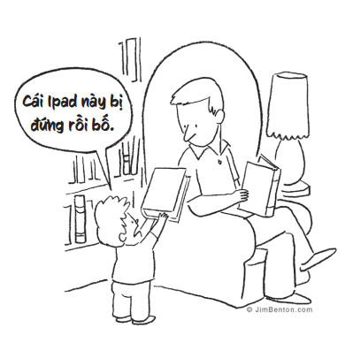
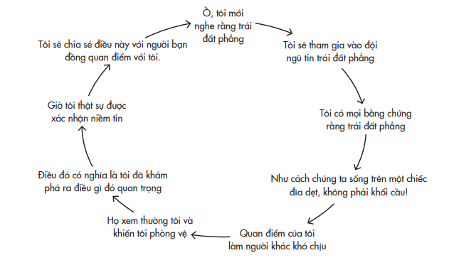
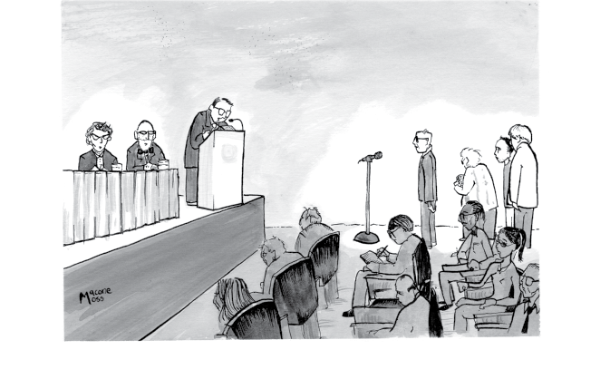
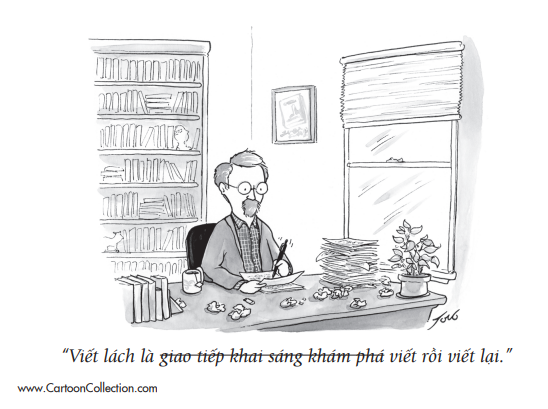
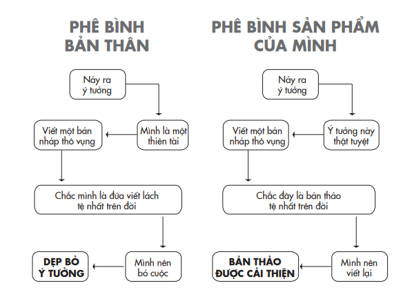
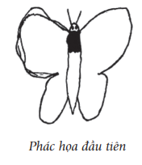
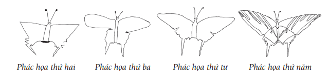
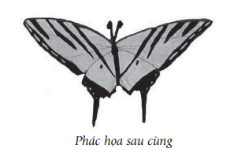

# Chương 9: Viết Lại Sách Giáo Khoa
## Dạy sinh viên chất vấn tri thức

---

---

Không thể chế trường học nào được phép can thiệp vào sự học của tôi.

> *– Grant Allen*

Mười năm trước, nếu bạn nói với Erin McCarthy rằng cô sẽ trở thành một giáo viên, cô hẳn sẽ cười ngất. Khi cô tốt nghiệp đại học, dạy học là điều cuối cùng trên đời mà cô muốn làm. Cô hứng thú với giờ học lịch sử nhưng cảm thấy các môn khoa học xã hội thật nhàm chán. Với niềm say mê tìm cách thổi hồn vào những hiện vật không được nhìn nhận đúng giá trị và những sự kiện bị lãng quên, Erin khởi đầu sự nghiệp của cô tại các viện bảo tàng. Không lâu sau, cô bắt đầu biên soạn xong một sổ tay tư liệu dành cho giáo viên, dẫn các đoàn tham quan của trường và vận động học sinh tham gia các chương trình có tính tương tác. Cô nhận ra rằng tinh thần say mê mà cô thường thấy ở các chuyến đi thực địa đang vắng mặt trong nhiều lớp học và cô quyết định bản thân phải làm điều gì đó.

Trong tám năm qua, Erin giảng dạy môn khoa học xã hội ở khu vực Milwaukee¹¹¹. Cô đặt cho mình sứ mệnh nuôi dưỡng niềm khao khát hiểu biết về quá khứ, nhưng đồng thời cũng khích lệ học sinh cập nhật tri thức về hiện tại. Năm 2020, cô được vinh danh là Giáo viên của năm toàn bang Wisconsin. ¹¹¹ Khu vực Milwaukee gồm bốn quận Milwaukee, Waukesha, Washington và Ozaukee thuộc bang Wisconsin, Hoa Kỳ.

Một ngày nọ, một học sinh lớp tám phàn nàn rằng bài đọc được giao trong sách giáo khoa lịch sử không chính xác. Nếu là một giáo viên, bạn có thể sẽ xem lời chỉ trích như thế là một cơn ác mộng. Sử dụng một bản sách giáo khoa lỗi thời có thể là dấu hiệu cho thấy bạn không nắm rõ về tài liệu mình giảng dạy và thật xấu hổ nếu học trò là người phát hiện lỗi sai trước.

Nhưng Erin đã giao cho lớp bài tập đọc ấy một cách cố ý. Cô sưu tầm các sách lịch sử cũ bởi vì cô thích tìm hiểu cách thức mà các câu chuyện được kể thay đổi qua thời gian và vì thế, cô đã quyết định giao cho học sinh của mình một trích đoạn sách giáo khoa được biên soạn từ năm 1940. Một số em đơn giản chấp nhận mọi thông tin được trình bày trong sách là có giá trị. Qua nhiều năm cắp sách đến trường, các em đã tin rằng giáo khoa hiển nhiên chỉ viết sự thật. Một số khác bàng hoàng khi phát hiện những lỗi sai hoặc thiếu sót. Các em đã có một niềm tin thâm căn cố đế rằng mọi kiến thức được viết ra sách là chân lý không cần bàn cãi. Bài học hôm ấy đã khiến các em bắt đầu tư duy như những nhà khoa học và chất vấn những điều học được: câu chuyện của ai được kể, câu chuyện của ai đã bị loại trừ, và liệu sách giáo khoa còn bỏ sót điều gì nếu chỉ có một hoặc hai quan điểm được đề cập?

Sau khi giúp học sinh của mình “sáng mắt” trước sự thật rằng tri thức có thể được phát triển, bước tiếp theo, Erin cho các em thấy tri thức luôn trong quá trình phát triển. Để chuẩn bị một bài giảng về quá trình khai phá miền viễn Tây, cô tự soạn riêng một bài trong giáo trình nói về học sinh trung học cơ sở ngày nay. Toàn bộ nhân vật trong đó đều là phụ nữ và bé gái, và tất cả ngôi nhân xưng đều là nữ giới. Trong năm đầu tiên Erin giới thiệu giáo trình mới, một học sinh giơ tay thắc mắc tại sao không có đàn ông, con trai nào cả. “Nhưng có một cậu bé ở đây”, Erin đáp. “Có đàn ông, con trai ở đấy. Họ chỉ không được dự phần vào những việc quan trọng thôi”. Đây chính là khoảnh khắc vỡ lẽ đối với cậu học sinh: cậu đột nhiên hiểu ra việc cả một nhóm người bị gạt ra ngoài lề xã hội trong suốt hàng trăm năm nghĩa là gì.

Tôi thích nhất là bài tập cuối khóa của Erin. Là người rất tâm đắc và giỏi về phương pháp học dựa trên việc điều tra, truy vấn, cô cho các em học sinh lớp tám của mình làm các bài tự nghiên cứu, nghĩa là các em tự thu thập thông tin, khảo sát, chất vấn và đưa ra lời giải thích. Thành quả thu hoạch được từ quá trình học chủ động của các em được đúc kết thành một dự án nhóm: các em chọn một chương trong sách giáo khoa, chọn giai đoạn lịch sử mà các em cảm thấy hứng thú và một chủ đề trong lịch sử mà các em nhận thấy là chưa được quan tâm đúng mức. Và các em tiến hành viết lại phần ấy.

Một nhóm đã chọn chương về phong trào nhân quyền vì nó đã bỏ sót cuộc tuần hành đầu tiên vì nhân quyền và tự do ở Washington vào đầu những năm 1940 – tuy cuộc tuần hành bị hủy bỏ vào phút cuối nhưng nó đã truyền cảm hứng cho cuộc biểu tình lịch sử của Martin Luther King Jr. hai thập niên sau đó. Những nhóm khác bổ sung chương về Thế chiến thứ hai, đề cập đến các trung đoàn bộ binh người gốc La-tinh và các binh sĩ gốc Nhật Bản thuộc thế hệ thứ hai chiến đấu trong hàng ngũ quân đội Hoa Kỳ. “Quả là một khoảnh khắc bừng sáng”, Erin chia sẻ.

Ngay cả khi không làm nghề giáo, có thể bạn vẫn đảm trách những vai trò giáo dục khác – có thể là một người cha, người mẹ hay một người hướng dẫn, một người bạn, hay một đồng nghiệp. Thực tế, mỗi lần chúng ta cố gắng giúp một ai đó tái tư duy là chúng ta đang làm công tác giáo dục. Dù chúng ta đang truyền đạt kiến thức trong lớp học, trong phòng họp, ở chỗ làm hay bên bàn ăn, luôn có những cách thức để chúng ta làm cho việc tái tư duy trở thành trọng tâm của nội dung – và cách thức – mà ta truyền đạt.

Quá tập trung vào việc truyền đạt kiến thức và xây dựng sự tự tin, nhiều giáo viên không chú trọng đến việc khuyến khích học sinh tự nghi ngờ chính mình và người khác. Nhằm tìm ra yếu tố nào giúp thay đổi tâm thức ấy, tôi đã tìm hiểu một số nhà giáo dục có uy tín vốn cổ xúy cho vòng lặp tái tư duy bằng cách nuôi dưỡng tính khiêm nhường trong tri thức, khích lệ thói quen đặt nghi vấn và nuôi dưỡng trí tò mò. Tôi cũng kiểm nghiệm một vài ý tưởng của riêng mình bằng cách biến lớp học thành một phòng thí nghiệm sống.

## HỌC TẬP VÀ NGỪNG LẠI ĐỂ ĐIỀU CHỈNH

Nhìn lại quá trình học tập thuở nhỏ, một trong những nỗi thất vọng lớn nhất của tôi là chưa bao giờ được nếm trải cảm giác chấn động tột cùng trước một khám phá khoa học. Từ rất sớm, trước khi tôi bắt đầu có cảm hứng tò mò về vũ trụ, các giáo viên trường mẫu giáo đã giảng giải những kiến thức ấy cho tôi. Tôi thường tự hỏi, nếu đến tuổi thiếu niên tôi mới lần đầu tiên biết được rằng chúng ta không sống trên một cái đĩa dẹt bất động, mà là một khối hình cầu không ngừng quay, cảm giác của tôi sẽ thế nào.

Tôi hy vọng rằng mình sẽ há hốc kinh ngạc và sự hoài nghi sớm nhường chỗ cho sự hiếu kỳ và sau cùng là cảm giác tột cùng sung sướng của sự khám phá và niềm vui khi phát hiện mình đã sai. Tôi cũng ngờ rằng mình có thể đã học được một bài học để đời về sự khiêm nhường tự tin. Nếu tôi có thể lầm tưởng về thứ ở ngay dưới chân mình, thì còn bao nhiêu cái được gọi là chân lý khác nhưng thật ra vẫn là những dấu chấm hỏi? Dĩ nhiên, tôi biết rằng nhiều thế hệ loài người trước đây cũng lầm tưởng về nó, nhưng có một sự khác biệt khổng lồ giữa việc học được về những niềm tin sai lạc của người khác và thật sự học được cách tự mình biết hoài nghi mọi thứ.

Tôi hiểu rằng thí nghiệm tưởng tượng này là hoàn toàn thiếu thực tế. Chỉ việc giấu bọn trẻ sự thật về Ông già Noel và Nàng tiên Răng cũng đã là quá khó. Ngay cả khi chúng ta xoay xở thế nào đó để trì hoãn được sự thật, thì vẫn có rủi ro rằng một số học sinh sẽ bám lấy và cố chấp với những điều chúng học được trong giai đoạn đầu đời. Bọn trẻ có thể bị mắc kẹt vào vòng lặp cố chấp, ở đó sự tự phụ với những kiến thức sai lầm tiếp nhiên liệu cho sự xác tín, và thiên kiến xác nhận cùng thiên kiến mong chờ dẫn đến sự hợp thức hóa kiến thức. Trước khi kịp nhận ra, chúng ta có thể đã trở thành một quốc gia toàn những người tin vào thuyết trái đất phẳng.

Bằng chứng cho thấy nếu những niềm tin khoa học sai lạc không được điều chỉnh ở bậc tiểu học, càng về sau chúng sẽ càng khó thay đổi. “Tiếp thu những ý tưởng khoa học trái ngược với thông thường thì cũng khó như trở thành một diễn giả nói lưu loát ngôn ngữ thứ hai vậy”, nhà tâm lý học Deborah Kelemen viết. Đó là “nhiệm vụ mà càng trì hoãn càng khó khăn, và vốn dĩ không bao giờ đạt được nếu chỉ trông chờ vào sự hướng dẫn đơn thuần, nhỏ giọt và không được thực hành thường xuyên”. Đó chính là điều trẻ em thật sự cần: thường xuyên luyện tập bỏ qua những gì đã học, đặc biệt đối với những việc diễn ra theo cơ chế nhân – quả.

### NIỀM TIN TRÁI ĐẤT PHẲNG TRONG VÒNG LẶP CỐ CHẤP

Trong lĩnh vực giảng dạy lịch sử, khuynh hướng đang lên là đặt những câu hỏi không có một câu trả lời đúng duy nhất. Trong một chương trình học được phát triển tại Stanford, học sinh trung học được khuyến khích nghiên cứu với tư duy phản biện về các vấn đề như: nguyên nhân thật sự gây ra cuộc chiến tranh Tây Ban Nha – Mỹ; liệu Chính sách Kinh tế mới¹¹² có phải là một thành công, và tại sao phong trào tẩy chay xe buýt tại Montgomery là bước ngoặt của lịch sử. Một số giáo viên thậm chí còn cho học sinh đi phỏng vấn những người có ý kiến mà học sinh không tán thành. Trọng tâm không phải là phân định đúng sai, mà nhằm xây dựng các kỹ năng suy xét đa góc nhìn và đưa ra các lập luận hữu ích về vấn đề. ¹¹² Chính sách Kinh tế mới là một loạt các đạo luật, chính sách và giải pháp nhằm đưa Hoa Kỳ thoát ra khỏi cuộc đại suy thoái kinh tế 1929 _1933. Chính sách kinh tế mới gắn liền với tên tuổi của vị tổng thống thứ 32 của Hoa Kỳ, Franklin Delano Roosevelt.

Điều này không có nghĩa rằng mọi cách thức diễn giải đều được chấp nhận là có giá trị. Khi con trai của một nạn nhân sống sót sau nạn diệt chủng Do Thái đến lớp của Erin McCarthy, cô nói với các học sinh rằng nhiều người phủ nhận sự tồn tại của nạn diệt chủng Do Thái, và dạy các em làm thế nào để xem xét chứng cứ và gạn lọc những phát ngôn sai lạc. Đây là một phần của một phong trào sâu rộng hơn nhằm dạy trẻ em cách tư duy của những người xác minh dữ kiện: các hướng dẫn bao gồm (1) “chất vấn thông tin thay vì đơn thuần tiếp thu nó”, (2) “từ chối xem cấp bậc và sự nổi tiếng là bảo chứng cho độ tin cậy”, và (3) “hiểu rằng người cung cấp thông tin thường không phải là nguồn gốc của thông tin”.

Giá trị của những nguyên tắc này vượt ra ngoài phạm vi lớp học. Bên bàn ăn của gia đình tôi vào các bữa tối, chúng tôi thỉnh thoảng có những cuộc trao đổi “mổ xẻ sự thật”. Vợ tôi và tôi chia sẻ chuyện mình từng được học ở trường rằng Sao Diêm Vương là một hành tinh (không còn đúng nữa) và Columbus là người phát hiện ra châu Mỹ (chưa bao giờ đúng). Bọn trẻ dạy chúng tôi rằng vua Tut chắc có lẽ không phải qua đời vì tai nạn xe ngựa và hào hứng giải thích rằng khi con lười đánh rắm, luồng hơi không thoát ra phía sau mà từ miệng chúng.

Tái tư duy cần phải trở thành một thói quen thường ngày. Tiếc thay, các phương pháp giáo dục truyền thống không phải lúc nào cũng hỗ trợ học sinh hình thành thói quen ấy.

## HIỆU ỨNG ĐIẾNG NGƯỜI

Đó là tuần thứ mười hai của lớp vật lý, và bạn sắp tham dự một vài buổi học của một giảng viên mới, được đánh giá cao – bài học về trạng thái cân bằng tĩnh và các chất lỏng. Buổi đầu là về trạng thái tĩnh, buổi học diễn ra kiểu thuyết giảng. Buổi thứ hai là về chất lỏng, dưới hình thức học chủ động. Bạn cùng phòng của bạn thì theo học một giảng viên nổi tiếng khác, người này có cách dạy ngược lại – áp dụng hình thức học chủ động cho cả hai bài học.

Trong cả hai trường hợp, nội dung và tài liệu học là đồng nhất, sự khác biệt chỉ nằm ở phương pháp truyền đạt. Trong một bài giảng, giảng viên trình chiếu nội dung, giải thích các khái niệm, đưa ra các ví dụ minh họa, giải các bài tập mẫu và bạn ghi chú vào tài liệu học. Với phương pháp học chủ động, thay vì giảng viên giải mẫu các bài tập ví dụ, họ yêu cầu cả lớp tự tìm ra phương án bằng cách làm việc theo từng nhóm nhỏ. Trong khi đó, giảng viên đi quanh trong lớp, đặt câu hỏi cho sinh viên và đưa ra những gợi ý trước khi hướng dẫn cả lớp tìm ra giải pháp. Cuối buổi, bạn điền vào phiếu khảo sát.

Trong thí nghiệm này, chủ đề học không phải là mấu chốt: phương pháp dạy mới là thứ định hình trải nghiệm học tập của bạn. Tôi đã kỳ vọng rằng học chủ động là phương pháp chiếm ưu thế, nhưng kết quả khảo sát cho thấy mọi người đều hứng thú với môn học hơn khi nó được truyền đạt bằng cách giảng giải. Bạn hẳn cũng sẽ đánh giá giảng viên trong buổi học theo phương pháp giảng bài là hiệu quả hơn, và nếu được hỏi, có khi bạn còn nói rằng giá mà mọi môn vật lý của mình đều được dạy theo cách ấy.

Ngẫm lại, sức hút của những bài giảng sinh động không có gì đáng ngạc nhiên. Qua nhiều thế hệ, biết bao người đã tỏ lòng ngưỡng mộ tài hùng biện của các nhà thơ như Maya Angelou, các chính trị gia như John F. Kennedy Jr.¹¹³ và Ronald Reagan, những nhà truyền giáo như Martin Luther King Jr. và những nhà giáo như Richard Feynman¹¹⁴. Ngày nay chúng ta sống trong thời đại hoàng kim của nghệ thuật trình bày lôi cuốn, nơi những nhà hùng biện tài năng có thể tương tác và truyền đạt những thông điệp mang tính giáo dục từ bục diễn thuyết với độ phủ ngoài sức tưởng tượng. Cộng đồng sáng tạo trước đây chỉ chia sẻ phương pháp với các nhóm nhỏ lẻ; giờ đây họ thu hút được lượng người đăng ký theo dõi trên YouTube và Instagram đủ để lập ra một tiểu quốc. Các linh mục một thời chỉ giảng đạo cho vài trăm người đến dự lễ ở nhà thờ; giờ đây họ có thể tiếp cận được hàng trăm ngàn tín đồ trong các đại giáo đoàn trên internet. Các giáo sư ngày trước dạy các lớp không quá đông để họ có thể dành thời gian cho từng sinh viên; giờ đây bài giảng của họ có thể được đăng tải và truyền đạt đến hàng triệu học viên qua các khóa học trực tuyến.

> **Chú thích:**¹¹³ John Fitzgerald Kennedy, Jr. (1960 – 1999) là luật sư, nhà báo và nhà xuất bản người Mỹ. Ông là con trai của Tổng thống thứ 35 của Hoa Kỳ John F. Kennedy và Jacqueline Bouvier Kennedy. ¹¹⁴ Richard Phillips Feynman (1918 – 1988) là một nhà vật lý lý thuyết người Mỹ gốc Do Thái. Ông không chỉ là một nhà khoa học thiên tài mà còn là một nhà sư phạm lỗi lạc – ông giảng giải các vấn đề vật lý phức tạp theo cách hầu hết mọi người đều có thể hiểu được.

Rõ ràng rằng những bài giảng ấy vừa có tính giải trí vừa cung cấp kiến thức phong phú. Câu hỏi đặt ra là liệu chúng có phải là phương pháp dạy học lý tưởng không. Trong thí nghiệm lớp học vật lý nói trên, các sinh viên làm bài kiểm tra để đo lường mức độ hiểu của họ về tĩnh học và chất lỏng. Mặc dù họ thích phần giảng bài hơn nhưng thực tế lại tiếp thu được nhiều kiến thức và kỹ năng hơn từ buổi học theo phương pháp chủ động. Nó đòi hỏi vận dụng trí não nhiều hơn – có thể kém vui nhộn hơn nhưng lại đưa đến sự hiểu biết sâu hơn.

Suốt một thời gian dài, tôi đã luôn tin rằng chúng ta học được nhiều hơn trong tâm trạng vui vẻ. Nghiên cứu này cho thấy rằng tôi đã sai. Nó cũng nhắc tôi nhớ đến một thầy dạy vật lý mà tôi rất yêu mến. Thầy nhận được điểm khảo sát cao chót vót vì đã cho chúng tôi chơi bóng bàn trong lớp, nhưng tôi lại không nhớ nổi hệ số ma sát sau khi học xong môn ấy.

Cách học chủ động mang lại hiệu quả không chỉ ở môn vật lý. Một phân tích meta đã so sánh các tác động của phương pháp giảng bài và học tập chủ động lên khả năng lĩnh hội bài học của sinh viên, từ kết quả của 225 nghiên cứu trên hơn 46.000 sinh viên đại học thuộc các ngành khoa học, công nghệ, kỹ thuật và toán (STEM). Phương pháp học chủ động bao gồm giải quyết vấn đề thông qua hoạt động nhóm, bảng tính, số liệu và sự hướng dẫn của giáo sư. Trung bình, sinh viên học theo phương pháp truyền thống có thành tích học tập kém hơn nửa điểm¹¹⁵ so với sinh viên học theo phương pháp chủ động, và sinh viên ở các lớp học theo lối giảng truyền thống có tỷ lệ trượt cao hơn 1,55 lần. Những nhà nghiên cứu ước lượng rằng số sinh viên thi trượt trong nghiên cứu trên, vì đã được dạy theo phương pháp giảng bài, nếu được học phương pháp học chủ động thì đã có thể tiết kiệm đến hơn 3,5 triệu đô-la học phí.

>**Chú thích:** ¹¹⁵ Giáo dục Hoa Kỳ dùng thang điểm theo chữ cái, cao nhất là A+, A,

A-, B+… (ND)

Không quá khó để hiểu lý do tại sao một buổi giảng bài nhàm chán lại thất bại, nhưng ngay cả những bài giảng thu hút cũng có thể không đạt hiệu quả vì một lý do ít hiển nhiên nhưng đáng lo ngại hơn. Các buổi giảng bài vốn không được thiết kế bao gồm các phần đối thoại hay ý kiến bất đồng; chúng biến sinh viên thành những người nhận thông tin thụ động thay vì tư duy chủ động. Trong phân tích meta ở trên, hình thức giảng bài đặc biệt kém hiệu quả trong khả năng làm sáng tỏ những hiểu biết ngộ nhận trước đó – hay nói cách khác là giúp sinh viên tái tư duy. Và các thực nghiệm cho thấy rằng khi người nói trình bày một thông điệp quá lôi cuốn, khán giả sẽ ít suy xét kỹ lưỡng hơn về giáo trình và ít chú ý đến nội dung hơn – ngay cả khi họ khẳng định là ghi nhớ kiến thức nhiều hơn.

Các nhà khoa học xã hội đã gọi hiện tượng này là hiệu ứng choáng ngợp, nhưng tôi nghĩ nên gọi nó là hiệu ứng điếng người¹¹⁶. “Nhà thông thái trên bục giảng” thường truyền giảng các tư tưởng mới, nhưng hiếm khi dạy chúng ta cách tự tư duy. Những người thuyết giảng sâu sắc có thể chỉ ra những luận điểm thiếu chính xác và dạy ta nên tư duy như thế nào cho đúng, nhưng họ không nhất thiết cho chúng ta biết cách để tiếp tục tái tư duy. Những diễn giả có sức hút có thể “bỏ bùa” chúng ta theo kiểu của các chính trị gia, khiến chúng ta đi theo ủng hộ họ, hầu mong có được sự hậu thuẫn từ họ hay được gia nhập bè phái họ lập ra. Chúng ta chỉ nên để bản thân bị thuyết phục bởi nội dung cốt lõi của một tư tưởng thay vì bởi lớp giấy gói hào nhoáng bọc bên ngoài. ¹¹⁶ Tiếng Anh: dumbstruck effect, là hiệu ứng được tạo ra khi ai đó có bài diễn thuyết hay lời nói hùng hồn, nhiều cảm xúc khiến người nghe trở nên thụ động, bị cuốn theo cảm xúc đó nên không còn chú ý đến tính logic của nội dung.

Ở đây cần nói rõ, tôi không có ý đề xuất rằng nên dẹp bỏ hoàn toàn lối thuyết giảng. Tôi rất thích xem các bài nói chuyện trên TED và thậm chí đã học được cách tận hưởng khoảnh khắc đứng trên sân khấu đó. Chính nhờ nghe được những bài diễn thuyết xuất sắc mà tôi đã nhen nhóm trong mình ý muốn trở thành một nhà giáo và tôi hoàn toàn không phản đối phương pháp giảng bài được áp dụng trong các lớp học của mình. Tôi chỉ cho rằng sẽ có vấn đề nếu chúng ta vẫn tiếp tục xem giảng bài là phương pháp dạy học chủ đạo ở giáo dục bậc trung học phổ thông trở lên. Đón chờ bài giảng của tôi về đề tài này nhé.

Ở các trường đại học thuộc khu vực Bắc Mỹ, quá nửa số giáo sư dạy các môn STEM dành ít nhất 80% thời lượng để giảng bài, chỉ hơn một phần tư có tích hợp một ít hoạt động tương tác, và chưa đầy một phần năm áp dụng các phương pháp xem người học là trọng tâm mà có bao gồm học chủ động. Ở các trường trung học, dường như phân nửa số giáo viên giảng bài trong hầu hết hoặc toàn bộ thời gian lên lớp¹¹⁷. Giảng bài không phải lúc nào cũng là phương pháp học tốt nhất, và chỉ riêng việc giảng bài không đủ để phát triển học sinh thành những người học tập trọn đời. Nếu bạn dành toàn bộ thời cắp sách đến trường để tích lũy kiến thức và không được tạo bất kỳ cơ hội nào để chất vấn những kiến thức đó, bạn sẽ không phát triển được các công cụ tái tư duy, thứ vốn rất cần trong đời sống. ¹¹⁷ Bằng chứng cho thấy học sinh trung học cơ sở có điểm số cao hơn ở các bài kiểm tra năng lực toán và khoa học khi giáo viên dành phần lớn thời gian giảng bài hơn là dùng phương pháp học chủ động. Mối băn khoăn vẫn chưa có lời giải là liệu rằng việc giảng bài có hiệu quả cao hơn với đối tượng người học nhỏ tuổi, hay sự chênh lệch ấy là do sự vận dụng thiếu hiệu quả các phương pháp học chủ động. (TG)

*“Bây giờ chúng tôi xin chuyển sang phần các câu thuyết giảng ngắn đội lốt câu hỏi.”*

Steve Macone/ The Cartoon Bank; © Condé Nast

## CÁI NHẸ KHÔN KHAM CỦA SỰ LẶP LẠI

¹¹⁸ **¹¹⁸ Nguyên văn: The Unbearable Lightness of Repeating – cách chơi chữ nhại theo tác phẩm The Unbearable Lightness of Being (tựa Việt: Đời nhẹ khôn kham) của Milan Kundera.

Có một môn học duy nhất mà tôi thấy tiếc vì đã bỏ lỡ ở đại học. Triết gia Robert Nozick là người đứng lớp môn học này. Một trong những ý tưởng của ông đã trở nên nổi tiếng nhờ bộ phim The Matrix (Ma trận) – vào thập niên 1970, Nozick giới thiệu một thí nghiệm tưởng tượng về việc liệu con người có chọn bước vào một “cỗ máy trải nghiệm” có khả năng mang lại niềm vui sướng vô tận nhưng tước mất cơ hội sống cuộc đời thực của họ hay không¹¹⁹. Nozick đã tạo ra phiên bản cỗ máy trải nghiệm của chính mình trong lớp học của ông: ông quyết tâm mỗi năm sẽ dạy một môn học mới. Ông nói: “Tôi tư duy qua các môn mình dạy”.

>**Chú thích:**¹¹⁹ Nozick dự đoán là hầu hết chúng ta sẽ khước từ cỗ máy vì chúng ta quan trọng việc hành động và sống, thay vì chỉ trải nghiệm, và bởi vì chúng ta không muốn giới hạn những trải nghiệm của bản thân chỉ ở mức những gì con người có thể tưởng tượng ra và giả lập ra. Các triết gia sau này lập luận rằng nếu chúng ta từ chối cỗ máy, có thể ta làm vậy không phải vì những lý do trên, mà do thiên kiến an phận: vì lựa chọn ấy sẽ khiến chúng ta phải rời bỏ thực tại thân thuộc. Để kiểm chứng khả năng này, họ đã thay đổi tiền đề và chạy một thử nghiệm. Hãy tưởng tượng một ngày kia bạn thức dậy và nhận ra toàn bộ cuộc đời mình vừa sống qua hóa ra chỉ là những trải nghiệm trong máy tính mà bạn lựa chọn từ nhiều năm trước, và bây giờ bạn phải chọn giữa việc ngắt mạch hay cho cỗ máy hoạt động trở lại. Trong kịch bản ấy, 46% số người được hỏi nói rằng họ chọn tiếp tục trải nghiệm trong cỗ máy. Nếu họ được cho biết việc ngắt mạch sẽ đưa họ trở về thực tại là một danh họa triệu phú ở Monaco, 50% số người tham gia thực nghiệm vẫn muốn tiếp tục sống trong cỗ máy. Dường như phần lớn mọi người thà duy trì một thực tại ảo quen thuộc hơn là đổi lấy một đời sống thực xa lạ, hoặc cũng có thể một số người không thích những trải nghiệm vương giả, đủ đầy và hào nhoáng. (TG)

Nozick đã dạy một lớp học về chân lý; một lớp khác là về triết học và khoa học thần kinh; lớp thứ ba là về Socrates, Đức Phật và chúa Jesus; lớp thứ tư là tư duy về tư duy; và lớp thứ năm là về Cách mạng Nga năm 1917. Trong hơn bốn mươi năm làm giảng viên, chỉ có một môn học ông dạy hai lần: môn học về đời sống mỹ mãn. “Trình bày một quan điểm được trau chuốt và đánh bóng kỹ càng không giúp cho sinh viên thật sự hình dung được như thế nào là nảy ra một tư tưởng triết lý, quan sát nó diễn tiến và phổ biến việc thực hành nó”, ông giải thích. Buồn thay, trước khi tôi có thể đăng ký một lớp học của ông thì ông đã qua đời vì căn bệnh ung thư.

Với tôi, điều truyền đạt hấp dẫn trong lối tiếp cận của Nozick là ông không bằng lòng để sinh viên học hỏi từ ông. Ông muốn họ học cùng ông. Mỗi lần gặp một chủ đề mới, ông sẽ xem đó là cơ hội để tái tư duy về những quan điểm hiện thời của ông đối với chủ đề đó. Ông là một hình mẫu xuất sắc trong việc đổi mới các phương pháp dạy và học quen thuộc. Khi mới bắt đầu đi dạy, tôi từng muốn vận dụng một số nguyên tắc của ông. Tôi không sẵn sàng giáng xuống cho sinh viên của mình cả một học kỳ với những tư tưởng nửa vời, nên tôi đặt ra một tiêu chí: mỗi năm tôi phải loại bỏ 20% nội dung đã dạy và thay thế bằng những kiến thức mới. Nếu mỗi năm tôi đều khởi xướng một góc nhìn mới mẻ, tôi và tất cả sinh viên của mình có thể tái tư duy cùng nhau.

Song, với 80% nội dung giáo trình còn lại, tôi nhận ra mình vẫn thất bại. Tôi dạy một lớp học kéo dài một học kỳ về hành vi tổ chức cho sinh viên năm ba và năm tư. Khi đưa ra các bằng chứng khoa học, tôi không cho họ cơ hội để tái tư duy. Sau nhiều năm trăn trở với vấn đề này, tôi lóe ra ý tưởng là mình có thể dạy sinh viên tái tư duy bằng cách làm mới các bài tập được giao. Tôi phân sinh viên thành các nhóm nhỏ và yêu cầu mỗi người thu âm để thực hiện những podcast hay bài thuyết trình TED “mini” của riêng mình. Yêu cầu đặt ra là phải chất vấn một phương thức phổ biến nào đó, bảo vệ một ý tưởng trái chiều so với các quan điểm truyền thống, hay phản biện những nguyên lý được dạy trên lớp.

Khi cả lớp bắt tay vào thực hiện dự án, tôi phát hiện ra một mô thức đầy bất ngờ. Những sinh viên trầy trật nhất lại là những sinh viên luôn đạt điểm A – những con người cầu toàn. Hóa ra những người cầu toàn, tuy thường đạt thành tích vượt trội so với bạn bè ở trường, song họ lại không có gì nổi trội hơn các đồng nghiệp trong công việc. Phát hiện này chứng tỏ rằng trong khắp các ngành nghề, điểm số không phải là cơ sở chắc chắn để dự đoán hiệu quả làm việc của nhân viên.

Đạt thành tích xuất sắc trong học tập thường đòi hỏi chúng ta phải giỏi tư duy theo lối cũ. Trong khi đó, tạo dựng một sự nghiệp thành công lại đòi hỏi những cách thức tư duy mới. Trong một nghiên cứu kinh điển về các kiến trúc sư tài năng, những kiến trúc sư sáng tạo nhất thường là những người tốt nghiệp với điểm B. Những đồng nghiệp đạt điểm A của họ vẫn thường được coi là luôn đúng nên họ không sẵn lòng chấp nhận rủi ro của việc suy xét lại những gì được xem là chính thống. Một mô thức tương tự cũng được tìm thấy trong một nghiên cứu về các sinh viên tốt nghiệp loại ưu. “Những sinh viên ưu tú thường hiếm khi trở thành những người có tư tưởng siêu việt trong tương lai”, nhà nghiên cứu giáo dục Karen Arnold giải thích. “Họ thường an phận trong hệ thống hơn là xoay chuyển nó.”

Đó chính là điều tôi nhận thấy ở các sinh viên đứng đầu lớp mình dạy: họ sợ chết khiếp việc mình sai. Nhằm cho họ động lực mạnh mẽ hơn để dám chấp nhận rủi ro, tôi giao cho họ bài tập với số điểm tối đa là 20% tổng điểm cuối kỳ. Tôi đã thay đổi luật chơi: giờ đây sinh viên của tôi sẽ được tưởng thưởng cho việc tái tư duy thay vì “nhai lại” kiến thức. Tôi đã không chắc cách thức khích lệ này có hiệu quả không, cho đến khi tôi đánh giá thành quả công việc của một nhóm ba sinh viên giỏi. Họ tự quay một đoạn TED ngắn bàn về những vấn đề của các bài thuyết trình trên TED, chỉ ra những nguy cơ của việc tìm mọi cách kéo dài những quãng chú ý của khán giả hay đề cao các quan điểm hào nhoáng nhưng hời hợt thay vì những tư tưởng sâu sắc. Bài thuyết trình của họ không chỉ thú vị mà còn có chiều sâu, đến độ tôi đã chiếu cho cả lớp xem. “Nếu các bạn đủ can đảm để bảo vệ mình trước xu hướng các kiểu câu trả lời trơn tru, bề mặt, thì hãy ngừng xem video này và lập tức đi làm nghiên cứu thật sự, giống như chúng tôi đã làm”, họ nói đùa với vẻ mặt nghiêm túc, khiến cả lớp bật cười.

Từ đó về sau, tôi biến bài tập này thành bài tập chính của môn học. Trong năm tiếp theo, tôi muốn tiến xa hơn nữa trong việc tái tư duy nội dung và cách thức dạy và học trong lớp của mình. Trong một buổi học thông thường kéo dài ba tiếng đồng hồ, tôi sẽ chỉ dành không quá hai mươi tới ba mươi phút cho bài giảng. Thời gian còn lại được dành cho phương pháp học chủ động – sinh viên tập ra quyết định trong các tình huống giả lập và thực tập đàm phán dưới hình thức sắm vai, sau đó chúng tôi nêu lên câu hỏi, thảo luận, tranh luận và rút ra giải pháp. Sai lầm của tôi lúc trước là xem đề cương môn học như một hợp đồng: một khi tôi đã hoàn tất nó vào tháng Chín đầu niên học, nó được đóng dấu có hiệu lực và tôi bám cứng nhắc vào đó. Tôi quyết định đã đến lúc phải thay đổi điều này và cho phép sinh viên cùng tái tư duy về một phần cấu trúc của lớp học.

Trong lần soạn đề cương môn học tiếp theo, tôi cố tình để trống hoàn toàn một buổi học. Vào khoảng giữa học kỳ, tôi khuyến khích sinh viên làm việc theo nhóm nhỏ để phát triển và đóng góp chọn ra ý tưởng sau cùng về việc chúng tôi sẽ làm gì trong buổi học trống ấy. Và sau đó cả lớp bình bầu.

Một trong những ý tưởng được ủng hộ nhiều nhất là của Lauren McCann. Cô đề nghị một bước sáng tạo nhằm giúp các sinh viên nhận ra tái tư duy là một kỹ năng hữu ích – và là phương thức họ đã và đang áp dụng ở trường đại học. Lauren mời các bạn cùng lớp viết thư cho chính mình khi là sinh viên năm nhất, để chia sẻ về những điều họ ước giá mà mình đã sớm được biết từ lúc ấy. Các sinh viên đã khuyến khích phiên bản trẻ hơn của mình giữ thái độ cởi mở để tìm hiểu những chuyên ngành khác nhau, thay vì tuyên bố ngay lựa chọn đầu tiên vừa nảy ra trong đầu để xóa đi cảm giác thiếu chắc chắn của bản thân. Họ khuyên chính mình của trước đây không quá coi trọng điểm số mà đầu tư nhiều hơn cho các mối quan hệ, dành thời gian khám phá các lựa chọn nghề nghiệp khác nhau, thay vì vội cam kết quá sớm với một ngành nghề chỉ vì danh tiếng hay mức lương cao.

Lauren thu thập thư từ hàng tá sinh viên và đăng tải các bức thư lên một website có tiêu đề là Dear Penn Freshman (tạm dịch: Thương gửi Sinh viên năm nhất Đại học Pennsylvania). Trong vòng hai mươi bốn tiếng, dearpennfresh.com đã có hơn mười ngàn lượt truy cập, và sáu trường khác cũng bắt tay vào lập website riêng cho trường mình nhằm giúp các sinh viên tái tư duy về các lựa chọn học hành, quan hệ xã hội và sự nghiệp của bản thân.

Phương cách này có thể mở rộng ra bên ngoài phạm vi lớp học. Khi chúng ta đối mặt với từng giai đoạn chuyển tiếp trong cuộc sống – dù đó là công việc đầu tiên trong đời, cuộc hôn nhân thứ hai hay quyết định có đứa con thứ ba – chúng ta có thể chậm lại để hỏi một vài người xem họ ước mình biết điều gì sớm hơn trước khi trải qua việc ấy. Một khi đã trải qua sự kiện, chúng ta có thể chia sẻ những điều là lẽ ra ta nên suy nghĩ lại.

Thực tế đã liên tục chứng minh rằng một trong những cách học tốt nhất là dạy cho người khác. Mãi cho đến khi tôi cho phép sinh viên tự thiết kế một buổi học, tôi mới thật sự hiểu họ có quá nhiều điều để dạy lẫn nhau – và dạy cả tôi. Trong quá trình làm bài tập ấy, họ không chỉ tái tư duy về những gì cần học, mà còn tái tư duy về việc họ có thể học từ những ai.

Năm học tiếp theo, ý tưởng được lớp bình chọn đã nâng hiệu quả của tái tư duy lên một bước: sinh viên tổ chức một ngày theo chủ đề “chia sẻ đam mê” và trong buổi học hôm đó, bất kỳ ai cũng có thể dạy cả lớp một sở thích hoặc đam mê của mình. Chúng tôi đã học cách chơi beatbox, thiết kế các công trình hài hòa với thiên nhiên và ít gây dị ứng. Từ đó trở đi, chia sẻ đam mê trở thành một phần hoạt động tương tác của lớp. Mọi sinh viên chia sẻ niềm đam mê như một cách giới thiệu bản thân với bạn bè. Qua các năm, sinh viên đều nói với tôi rằng cách làm này đã kích thích tinh thần ham hiểu biết của mọi sinh viên trong lớp, khiến họ hào hứng tiếp nhận những hiểu biết thú vị từ mỗi người bạn cùng lớp của mình.

## TỪ BẢN NHÁP THÔ VỤNG ĐẾN LÀM CHỦ TAY NGHỀ

Khi tôi yêu cầu một số lượng kha khá những người tiên phong trong ngành giáo dục nêu tên một giáo viên giỏi về tái tư duy mà họ từng tiếp xúc, một cái tên liên tục được nhắc đến là Ron Berger. Nếu bạn mời Ron đến nhà ăn tối, ông ấy thuộc kiểu người mà khi thấy một chiếc ghế ở nhà bạn bị hỏng, ông ấy sẽ hỏi bạn có sẵn đồ nghề không và ngồi xuống sửa ngay tại chỗ.

Trong phần lớn sự nghiệp của mình, Ron là giáo viên trường tiểu học công lập ở vùng thôn quê bang Massachusetts. Y tá, thợ sửa ống nước và lính cứu hỏa địa phương đều là học trò cũ của ông. Trong mùa hè và vào mỗi cuối tuần, ông chuyển sang làm thợ mộc. Ron đã cống hiến cả đời mình để dạy học sinh về đạo đức làm nghề. Theo kinh nghiệm của ông, để tinh thông một nghề người ta phải không ngừng điều chỉnh lối tư duy của bản thân. Sự lành nghề thông qua thực hành là nền tảng triết lý dạy học của ông.

Ron muốn các học sinh của mình trải nghiệm niềm vui khám phá, nên ông không bắt đầu bằng việc dạy các em những kiến thức có sẵn. Đầu năm học, ông bày ra những “trò vật lộn” cho bọn trẻ tham gia – tức là những vấn đề để các em học cách xử lý theo từng phân đoạn. Phương pháp là suy nghĩ – ghép cặp – chia sẻ: đầu tiên là từng đứa trẻ suy nghĩ độc lập, kế tiếp là chia sẻ ý tưởng của cá nhân theo nhóm nhỏ, sau đó là trình bày ý tưởng với cả lớp rồi đi đến thống nhất giải pháp. Chẳng hạn, thay vì giới thiệu các nguyên tắc phân loại động vật sẵn có, đầu tiên Ron cho các em tự đặt ra cách phân loại theo ý mình. Một số học sinh phân chia động vật theo nhóm đi trên cạn, bơi dưới nước hay bay trên không; số khác xếp loại theo màu sắc, kích cỡ hay thức ăn. Bài học đúc kết được là các nhà khoa học luôn có nhiều phương án khả thi và các khuôn thức họ đưa ra có thể hữu ích theo cách nào đó đôi khi lại mang tính chủ quan.

Khi học sinh đối diện những vấn đề phức tạp, các em thường cảm thấy bối rối. Thôi thúc tự nhiên của thầy cô giáo là giải cứu các em nhanh nhất có thể để chúng không cảm thấy lạc lối hoặc thiếu năng lực. Tuy nhiên, các chuyên gia tâm lý phát hiện ra rằng một trong những tiêu chuẩn để nhận biết một tâm trí cởi mở là khả năng ứng phó với tình huống rối rắm bằng trí tò mò và sự hào hứng. Một học sinh tuyên bố hùng hồn: “Em cần thời gian để xử lý sự bối rối của mình”. Bối rối có thể là tín hiệu cho biết phía trước có một vùng đất mới đang chờ được khám phá hay một câu đố mới đang chờ được giải.

Ron không bằng lòng ở việc cung cấp tức thì các bài học để dập tắt sự bối rối của các em. Ông muốn các em nắm bắt cảm giác mơ hồ. Mục đích sâu xa của ông là giúp chúng trở thành những người chủ động với việc học của bản thân, tựa như các em tham gia các dự án “tự tay làm lấy” (Do it yourself – DIY) của riêng mình. Ông bắt đầu bằng việc khuyến khích học sinh tư duy như những nhà khoa học nhỏ tuổi: xác định vấn đề, xây dựng giả thuyết và tự thiết kế các thí nghiệm để kiểm chứng. Các học sinh lớp sáu của ông đi khắp khu phố để kiểm tra nồng độ khí radon¹²⁰ ở mỗi nhà. Học sinh lớp ba của ông tự làm ra bản đồ cư trú của các loài lưỡng cư. Học sinh lớp một của ông lập nhóm nuôi ốc sên – cho ốc sên ăn thử hơn 140 loại thức ăn để tìm ra những món chúng thích và cũng kiểm tra xem chúng thích sống trong môi trường nóng hay lạnh, tối hay sáng, ẩm ướt hay khô ráo.

>**Chú thích:** ¹²⁰ Radon là một loại khí hiếm có tính phóng xạ xuất hiện trong tự nhiên, có thể được tìm thấy trong môi trường sống. Radon là một trong những nguyên nhân chính gây ung thư phổi.

Với những bài học về kỹ thuật và kiến trúc, Ron cho các học trò thiết kế bản vẽ cho một căn nhà. Khi ông yêu cầu các em làm ra ít nhất bốn bản nháp khác nhau, các giáo viên khác cảnh báo rằng ở lứa tuổi nhỏ như thế, các em sẽ không đủ kiên nhẫn. Ron không đồng tình, vì trước đó ông đã kiểm chứng điều này với học sinh mẫu giáo và lớp một trong môn nghệ thuật. Thay vì đơn giản yêu cầu các em vẽ một căn nhà, ông ra đề: “Chúng ta sẽ làm ra bốn mẫu thiết kế khác nhau cho cùng một ngôi nhà”.

Một số học sinh không bằng lòng ở mức đó; nhiều em thậm chí quyết định nộp tám đến mười bản phác thảo. Các em có một đội cổ động là các bạn cùng lớp luôn cổ vũ các em. “Chất lượng đồng nghĩa với tái tư duy, làm đi làm lại và mài dũa”, Ron nhớ lại. “Các em cần cảm giác được cổ vũ thay vì bị trêu chọc, để lần sau tiếp tục có hứng thú quay lại giá vẽ… Chỉ sau một thời gian ngắn, bọn trẻ bắt đầu phàn nàn nếu tôi chỉ yêu cầu chúng vẽ một bản.”

Ron muốn dạy học sinh cách điều chỉnh suy nghĩ của mình dựa trên ý kiến đóng góp từ người khác, vì vậy ông biến lớp học thành một mạng lưới thử thách. Mỗi tuần, và đôi khi mỗi ngày, cả lớp sẽ được dành một buổi để đánh giá, phê bình. Một trong hai hình thức tổ chức là phê bình triển lãm: Ron trưng bày tác phẩm của cả lớp, cho các em đi quanh phòng quan sát và sau đó thảo luận về những điểm các em cho là xuất sắc và tại sao. Phương pháp này không chỉ được áp dụng cho các dự án khoa học và nghệ thuật. Hình thức thứ hai là phê bình có chiều sâu: cả lớp sẽ được dành riêng một buổi để tập trung nhận xét sản phẩm của một học sinh hay một nhóm. Tác giả sẽ giải thích những mục tiêu mình muốn đạt cũng như khía cạnh nào cần được hỗ trợ, và Ron dẫn dắt cả lớp thảo luận về các điểm mạnh và những chỗ cần hoàn thiện. Ông khuyến khích các em luôn trình bày ý kiến một cách cụ thể và nhã nhặn: chỉ phê bình sản phẩm không phải tác giả. Ông dạy các em tránh lối thuyết giảng và lên án: các em đang chia sẻ ý kiến chủ quan của mình, chứ không phải những đánh giá khách quan, vì vậy các em nên nói “Mình nghĩ” thay vì “Nhìn nó không đẹp chút nào”. Ông khuyến khích các em thể hiện sự khiêm nhường và óc tò mò, diễn đạt các góp ý của mình dưới dạng câu hỏi như “Mình muốn nghe bạn giải thích tại sao…” và “Bạn thử cân nhắc liệu có nên…”.

Lớp học của thầy Ron không chỉ có những buổi học phê bình. Mỗi ngày các em còn thảo luận như thế nào là một tác phẩm xuất sắc. Với mỗi dự án mới, các em lại cập nhật thêm những tiêu chí đánh giá cho mình. Song song với việc học cách tái tư duy về tác phẩm của chính mình, các em còn thường xuyên nhìn nhận lại những tiêu chuẩn của bản thân. Nhằm giúp học sinh liên tục nâng cao các tiêu chuẩn, Ron thường xuyên mời các chuyên gia bên ngoài đến giao lưu. Các kiến trúc sư và nhà khoa học địa phương được mời đến để đưa ra nhận xét, và lớp học lắng nghe để học hỏi các nguyên tắc và cách dùng từ ngữ của họ để đưa vào các cuộc thảo luận tiếp theo. Cả khi các em đã lên trung học cơ sở hay trung học phổ thông, không hiếm khi các em lại ghé thăm lớp học của thầy Ron để xin lời phê bình cho tác phẩm mới của mình.

Ngay khi mới kết nối với Ron Berger, tôi đã có mong muốn có dịp được tham dự một trong những lớp học của ông. Không phải vì thời đi học tôi chưa từng có những giáo viên tuyệt vời, mà tôi chưa bao giờ may mắn được ngồi trong một lớp học có một văn hóa học tập như thế – một lớp học với toàn bộ học sinh hăng say đặt nghi vấn cho chính mình và phản biện lẫn nhau.

Hiện tại, Ron dành thời gian cho công việc diễn thuyết, viết sách, giảng dạy một khóa huấn luyện dành cho các giảng viên tại trường Harvard và làm công việc tư vấn cho các trường. Ông là giám đốc học thuật của EL Education, một tổ chức với sứ mạng tái thiết cách dạy và học ở các trường. Ron và các cộng sự làm việc trực tiếp với 150 trường và phát triển các chương trình học cho hàng triệu học sinh.

Ở trường học tại bang Idaho, một học sinh tên Austin được giao bài tập phác họa chính xác hình dạng của một con bướm theo khoa học. Đây là hình vẽ đầu tiên của cậu:

Các bạn cùng lớp của Austin lập một nhóm phê bình. Các em cho cậu bạn của mình hai lượt góp ý, đề nghị thay đổi hình dáng của đôi cánh và theo đó, Austin làm ra bản vẽ thứ hai và thứ ba. Nhóm phê bình chỉ ra rằng hai cánh không cân xứng và bản vẽ thứ ba thì cánh lại bị lỗi quá tròn. Austin không hề nản lòng. Ở lần chỉnh sửa thứ tư, nhóm khuyến khích cậu vẽ thêm họa tiết trên cánh.

Ở hình vẽ sau cùng, Austin đã sẵn sàng tô màu cho nó. Khi Ron cho một lớp học sinh tiểu học ở Maine xem hình vẽ đã được hoàn thiện, tất cả các em đều trầm trồ trước sự tiến bộ và thành phẩm của Austin.

Cả tôi cũng há hốc vì ngạc nhiên, bởi vì Austin đã vẽ các bức hình này khi cậu học lớp một.

Chứng kiến một đứa trẻ sáu tuổi trải qua sự lột xác ngoạn mục khiến tôi nhìn nhận lại về khả năng làm quen nhanh chóng của trẻ em với việc tái tư duy và thay đổi góc nhìn. Kể từ đó, tôi khuyến khích lũ trẻ nhà mình làm ra thật nhiều phiên bản nháp cho mỗi bài tập vẽ của chúng. Bọn trẻ càng phấn khích khi bức phác họa đầu tiên của mình được treo lên tường bao nhiêu thì càng tự hào với bản vẽ thứ tư của mình bấy nhiêu.

Không phải ai trong chúng ta cũng có cơ may được học vẽ một con bướm với Ron Berger hay viết lại sách giáo khoa với Erin McCathy. Song tất cả chúng ta đều có cơ hội truyền thụ cái hay cho người khác giống như họ. Bất kể chúng ta đang dạy cho đối tượng nào, chúng ta cũng có thể thể hiện nhiều hơn tính khiêm nhường, khơi dậy thêm óc tò mò và chỉ cho mọi trẻ con mà chúng ta gặp trong đời niềm vui bất tận của sự khám phá.

Tôi tin rằng những giáo viên giỏi dạy những tư duy mới, còn những giáo viên xuất chúng thì dạy những cách tư duy mới. Thu nhặt kiến thức từ giáo viên có thể giúp chúng ta giải quyết những khó khăn xảy đến trong ngày hôm nay, nhưng hiểu được lối tư duy của giáo viên có thể giúp chúng ta vượt qua chướng ngại trong suốt cuộc đời. Sau rốt, giáo dục không chỉ là lượng thông tin chúng ta tích lũy trong đầu. Nó còn là những thói quen tư duy mà chúng ta phát triển trong quá trình điều chỉnh những bản nháp và các kỹ năng chúng ta xây dựng để học hỏi không ngừng.

## Chương 10
