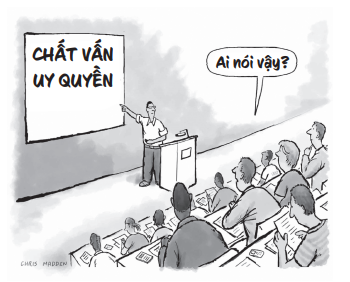
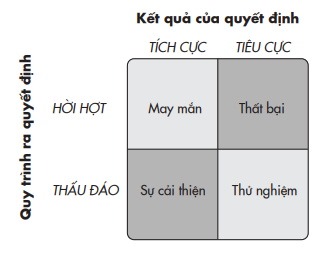
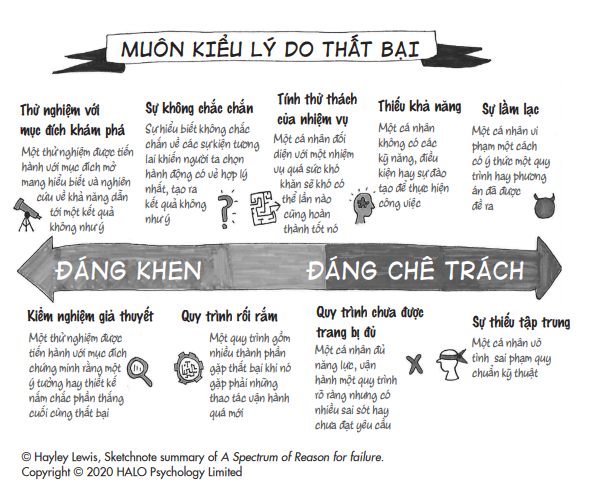

# Chương 10: Đây Không Phải Cách Chúng Ta Vẫn Làm Trước Giờ
## Xây dựng văn hóa học tập nơi công sở

---

---

Nếu không phải tại loài người… trái đất sẽ là một thiên đường của kỹ sư.

> *– Kurt Vonnegut*

Là một thợ lặn giàu đam mê, Luca Parmitano không lạ gì với những rủi ro chết đuối. Anh chỉ không hình dung điều đó có thể xảy ra ở ngoài không gian.

Luca vừa mới trở thành phi hành gia trẻ tuổi nhất từng tham gia chuyến hành trình dài đến Trạm Không gian Quốc tế. Vào tháng Bảy năm 2013, phi hành gia người Ý ba mươi sáu tuổi này hoàn thành chuyến bộ hành không gian đầu tiên của anh, trải qua sáu tiếng đồng hồ thực hiện các thí nghiệm, di chuyển thiết bị, lắp đặt các đường cáp để truyền năng lượng và dữ liệu. Giờ đây, một tuần sau đó, Luca và một phi hành gia khác là Chris Cassidy đang chuẩn bị cho chuyến đi bộ ra ngoài không gian thứ hai để tiếp tục nhiệm vụ và các công tác bảo trì. Khi sắp sửa rời buồng kín khí¹²¹, họ có thể nhìn thấy Trái Đất ở bên dưới, cách hơn 400 ki-lô-mét. ¹²¹ Buồng kín khí (hay còn gọi là chốt gió) trên tàu không gian được sử dụng để cung cấp quyền truy cập vào và ra khỏi khu vực kín mà không cho phép không khí ra ngoài hoặc nước đi vào.

Sau bốn mươi bốn phút ở ngoài không gian, Luca cảm thấy điều gì đó khác lạ: chỗ sau đầu anh hình như hơi ươn ướt. Anh không chắc nước từ đâu ra. Điều này không chỉ gây khó chịu mà nó có thể cắt đứt liên lạc nếu micro và tai nghe mất tín hiệu. Anh báo cáo vấn đề với Trung tâm Điều khiển Sứ mệnh ở Houston, và Chris hỏi có phải anh đang đổ mồ hôi không. “Tôi có đổ mồ hôi”, Luca đáp, “nhưng có cảm giác như rất nhiều nước. Nước không thoát ra mà đọng lại trong chiếc mũ Snoopy¹²² của tôi. Báo để anh biết thôi.” Và anh quay lại làm tiếp công việc.

> **Chú thích:** ¹²² Tên gọi khác của mũ chụp truyền tín hiệu, là chiếc mũ ôm sát đầu của các phi hành gia, có tích hợp điện đàm để liên lạc thông tin. (ND)

Người chuyên trách thăm dò không gian, Karina Eversley, biết có điều gì đó không ổn. Điều này không bình thường chút nào, cô thầm nghĩ, và nhanh chóng tập hợp một đội các chuyên gia để đặt ra một loạt các câu hỏi dành cho Luca. Lượng chất lỏng có đang tăng lên không? Luca không thể biết được. Anh có chắc đó là nước không? Khi anh thè lưỡi ra để đón lấy một vài giọt chất lỏng đó chảy ra từ trong mũ bảo hiểm, nó có vị kim loại.

Trung Tâm Điều khiển Sứ mệnh ra lệnh chấm dứt nhiệm vụ sớm. Luca và Chris phải tách ra để bám theo dây buộc của mỗi người – đi theo hai hướng ngược nhau. Để đi vòng qua một chiếc ăng-ten, Luca phải đi lộn người. Bỗng nhiên, mắt anh không thể nhìn thấy rõ và anh cũng không thở được bằng mũi – những quả cầu nước che phủ mắt anh và chảy tràn vào mũi. Nước tiếp tục dồn ứ, và nếu nó ngập đến miệng thì anh có thể chết đuối. Hy vọng duy nhất của anh là lần dò được đường để về buồng kín khí thật nhanh. Đó là thời điểm mặt trời lặn, bóng tối bao trùm lấy Luca và anh chỉ có một ngọn đèn pha nhỏ dẫn đường. Và rồi hệ thống liên lạc cũng bị cắt đứt, anh không còn nghe được chính mình hay người khác nói gì.

Luca đã xoay xở tìm ra được đường về đến chiếc cửa sập bên ngoài của buồng kín khí dựa vào trí nhớ và độ căng của dây neo. Anh vẫn ở tình huống ngàn cân treo sợi tóc: trước khi có thể tháo chiếc mũ bảo hiểm ra, anh sẽ phải chờ Chris đóng cửa chặn và điều áp buồng kín khí. Nhiều phút hiểm nghèo im lặng trôi qua, không gì đảm bảo anh có thể chống chọi nổi. Khi cuối cùng đủ an toàn để cởi chiếc mũ bảo hiểm ra, có gần hai lít nước ở bên trong, nhưng Luca vẫn còn sống. Nhiều tháng sau, sự cố này được biết đến là “sự cố trang phục bảo hộ đáng sợ nhất trong lịch sử NASA”.

Việc cập nhật kỹ thuật được tiến hành ngay lập tức. Những kỹ sư đồ bảo hộ không gian dò tìm chỗ rò ở quạt, bơm, thiết bị phân ly, và sau đó thay thế chúng. Họ cũng thêm vào một ống thở có chức năng như ống thở của thợ lặn và một miếng lót để thấm nước bên trong mũ. Nhưng lỗi lớn nhất không phải do kỹ thuật, mà do con người.

Khi Luca trở về sau chuyến bộ hành ngoài không gian đầu tiên trước đó một tuần, anh đã để ý thấy có vài giọt nước trong mũ bảo hiểm. Anh và Chris cho đó là nước rò rỉ từ chiếc túi đựng nước uống cho phi hành gia bên trong bộ đồ, và đội điều khiển ở Houston cũng đồng tình với suy đoán này. Để chắc ăn, họ thay túi đựng nước, nhưng vấn đề được khép lại ở đó.

Kỹ sư trưởng của trạm không gian, Chris Hansen là người chỉ đạo cuộc điều tra sự cố xảy ra với bộ đồ của Luca. “Việc có một ít nước trong mũ bảo hiểm là việc khá thông thường”, Chris cho tôi biết. Trong cộng đồng trạm không gian, “ai cũng cho nguyên nhân là rò rỉ từ túi đựng nước uống và mọi người chấp nhận nó như một giải thích hợp lý mà không đào sâu thêm để tìm nguyên nhân”.

Trải nghiệm đáng sợ của Luca không phải là sự cố đầu tiên cho thấy việc NASA thiếu tái tư duy có thể tai hại ra sao. Năm 1986, tàu con thoi Challenger bị nổ sau khi một phân tích rủi ro hời hợt đến đáng sợ đã bỏ qua khả năng các vòng đệm cao su, có tên gọi là vòng chữ O, có thể bị hỏng. Mặc dù tình trạng này đã được xác định là một hạn chế với việc phóng, nhưng NASA đã bỏ qua nó và ghi vào hồ sơ theo dõi tiền sứ mệnh là không có bất cứ trục trặc nào. Vào ngày phóng, thời tiết lạnh giá một cách bất thường, vòng chữ O giữ các khớp nối tên lửa đẩy bị đứt gãy, khiến khí nóng tràn vào bình nhiên liệu, làm thiệt mạng toàn bộ bảy phi hành gia trên tàu Challenger.

Năm 2003, tàu con thoi Columbia đã bị vỡ tan trong tình huống tương tự. Sau khi tàu được phóng lên, đội điều khiển mặt đất phát hiện một mảng xốp cách nhiệt rơi ra từ con tàu, nhưng hầu hết mọi người đều cho là không có vấn đề gì nghiêm trọng vì hiện tượng này từng xảy ra ở các sứ mệnh trước mà không gây ra sự cố nào. Họ bỏ qua việc tái tư duy về giả định ấy mà chuyển sang thảo luận về những tu bổ cần thiết cho con tàu nhằm rút ngắn thời gian chuẩn bị để con tàu sẵn sàng thực hiện sứ mệnh tiếp theo. Mảng xốp bị rơi ra thực tế lại là một vấn đề nghiêm trọng: nó đã va vào rìa cánh trước làm tổn hại phần cánh, khiến cho khí nóng rò rỉ vào bên trong cánh con tàu khi nó bay trở vào bầu khí quyển. Một lần nữa, toàn bộ phi hành đoàn bảy người đã thiệt mạng.

Tái tư duy không chỉ là một kỹ năng cá nhân. Nó là một năng lực tập thể và phụ thuộc rất nhiều vào văn hóa tổ chức. NASA từ lâu đã được xem là một ví dụ điển hình của văn hóa xem trọng hiệu quả: thực thi xuất sắc được coi là giá trị hàng đầu. Đành rằng NASA đã đạt được những thành tựu phi thường, nhưng họ đã sớm trở thành nạn nhân của vòng lặp tự tin thái quá. Khi người ta quá tự tin vào các quy trình thao tác chuẩn của mình, có sự xác tín thông qua công việc và cuộc sống thường ngày, và nhận thấy các quyết định của bản thân đều đúng đắn vì kết quả thu được luôn tốt, thì họ đã bỏ qua các cơ hội tái tư duy.

Tái tư duy dễ được tìm thấy ở một môi trường có văn hóa học tập, nơi sự phát triển là giá trị cốt lõi và vòng lặp tái tư duy là một phần hoạt động hằng ngày. Tại những nơi có văn hóa học tập, chuẩn mực chung là giúp người khác biết những điều họ chưa biết, hoài nghi những cách thức hiện tại và nuôi dưỡng sự hiếu kỳ để thử nghiệm những phương thức mới. Bằng chứng đã cho thấy rằng các tổ chức có văn hóa học tập sáng tạo nhiều hơn và ít phạm sai lầm hơn. Sau khi nghiên cứu và tham mưu những sáng kiến cải tổ ở NASA và Gates Foundation, tôi nhận ra rằng văn hóa học tập lớn mạnh khi có sự kết hợp đặc biệt giữa hai yếu tố: sự an toàn về mặt tâm lý và tinh thần trách nhiệm.

## TÔI LUÔN CÓ THỂ MẮC SAI LẦM, NÊN TÔI CẦN HỌC HỎI

Nhiều năm trước, Amy Edmondson, một giáo sư quản trị học xuất thân là kỹ sư, bắt đầu hứng thú với việc ngăn ngừa những sai sót trong y khoa. Cô đến một bệnh viện và khảo sát các nhân viên ở đó về mức độ an toàn về mặt tâm lý mà họ cảm thấy ở bộ phận của mình – liệu có thể họ mạo hiểm mà không sợ bị phạt không? Sau đó cô thu thập dữ liệu về số sai phạm trong khám chữa bệnh mà mỗi ê kíp mắc phải, theo dõi những hậu quả nghiêm trọng như kê đơn thuốc sai làm tăng nguy cơ gây tử vong. Cô đã bất ngờ khi phát hiện ra rằng ê kíp nào càng cảm thấy an toàn về tâm lý thì tỷ lệ sai sót ở nhóm ấy lại càng cao.

Có vẻ như cảm giác an toàn về mặt tâm lý có thể nảy sinh sự chủ quan. Khi sự tin tưởng tồn tại lâu ngày trong một ê kíp, người ta có thể cảm thấy không cần thiết phải chất vấn đồng nghiệp của họ hay kiểm tra lại lần nữa công việc của bản thân.

Nhưng Edmondson sớm nhận ra một hạn chế lớn của số liệu nói trên: những trường hợp sai sót đều là tự báo cáo. Để có sự đo lường không thiên kiến về con số sai phạm, cô gửi một người quan sát bí mật đến các cơ sở y tế. Khi cô phân tích những số liệu ghi nhận được, kết quả hoàn toàn đảo ngược: các ê kíp cảm thấy an toàn về mặt tâm lý báo cáo con số sai phạm nhiều hơn, nhưng thực tế họ lại gây ra ít sai sót hơn. Khi thoải mái thừa nhận sai lầm của bản thân, họ có cơ hội biết được nguyên nhân gây ra sai sót và loại bỏ chúng về sau. Ở các ê kíp không có sự an toàn về tâm lý, mọi người che giấu sai sót để tránh bị phạt, vì thế chẳng ai có thể tìm ra được những nguyên nhân gốc rễ để ngăn ngừa được các rắc rối trong tương lai. Họ cứ thế lặp lại cùng những sai sót cũ.

Kể từ đó, nghiên cứu về an toàn tâm lý phát triển nở rộ. Khi tôi tham gia vào một nghiên cứu tại Google nhằm tìm hiểu các yếu tố giúp phân định những đội nhóm làm việc đạt hiệu suất cao và có đời sống lành mạnh, yếu tố tạo nên khác biệt quan trọng nhất không phải là các thành viên trong đội và thậm chí cũng không phải ý nghĩa của công việc họ làm. Thứ tác động nhiều nhất là sự an toàn về tâm lý.

Suốt những năm gần đây, an toàn tâm lý đã trở thành một thuật ngữ thông dụng ở nhiều nơi làm việc. Tuy các lãnh đạo có thể hiểu được tầm quan trọng của nó, họ thường hiểu không thật chính xác nó có nghĩa là gì và làm sao để tạo ra nó. Edmondson sớm chỉ ra rằng sự an toàn về mặt tâm lý không liên quan đến các tiêu chuẩn về một môi trường làm việc thư giãn, chẳng hạn như giúp mọi người thoải mái, thân thiện và hòa nhã hay dễ dàng đưa ra lời khen. An toàn về mặt tâm lý có nghĩa là tạo ra một môi trường tôn trọng, tin cậy và cởi mở, nơi mọi người có thể nói ra những băn khoăn và đóng góp ý kiến mà không lo bị trả đũa. Nó là nền móng của văn hóa học tập.

Tại những nơi có văn hóa xem trọng hiệu quả, việc quá tập trung vào kết quả thường dẫn đến xem nhẹ tâm lý an toàn. Khi nhìn thấy người khác bị phạt hay chịu hậu quả vì thất bại hoặc sai lầm, chúng ta sẽ bắt đầu lo lắng làm thế nào để chứng tỏ năng lực bản thân và bảo vệ sự nghiệp của mình. Chúng ta học làm quen với những hành vi tự kiềm chế bản thân, giữ mồm giữ miệng thay vì lên tiếng thắc mắc và nêu lên vấn đề. Đôi khi vấn đề là khoảng cách quyền lực: chúng ta sợ phải thách thức sếp cấp cao. Áp lực phải nghe theo uy quyền là có thật, và những cá nhân có cả gan làm trái có nguy cơ nhận lãnh cú phản đòn xứng đáng. Tại những nơi có văn hóa xem trọng hiệu quả, chúng ta còn tự kiểm duyệt bản thân khi đối diện với những chuyên gia được cho là có mọi câu trả lời – đặc biệt nếu chúng ta thiếu tự tin về chuyên môn của chính mình.

### CẢM GIÁC AN TOÀN VỀ MẶT TÂM LÝ

KHI CÓ NÓ, BẠN… KHI THIẾU NÓ, BẠN…

Xem sai lầm là cơ hội học hỏi Xem sai lầm là mối đe dọa cho sự nghiệp Sẵn lòng mạo hiểm và va vấp Không sẵn lòng mạo hiểm Nói lên suy nghĩ trong cuộc họp Giữ suy nghĩ cho riêng mình Cởi mở chia sẻ những trở ngại Chỉ ba hoa về thế mạnh của mình Tin tưởng đồng đội và cấp trên E sợ đồng đội và cấp trên Dám liều Sợ trước sợ sau Thiếu vắng an toàn tâm lý là một vấn đề muôn thuở tại NASA. Trước ngày phóng tàu Challenger, một số kỹ sư đã lên tiếng cảnh báo nhưng quản lý buộc họ im lặng; những người khác bị phớt lờ khi đưa ra ý kiến và cuối cùng họ cũng im lặng. Sau khi tàu Columbia được phóng lên, một kỹ sư yêu cầu xem các bức ảnh chụp rõ nét hơn để xem xét kỹ mức độ hư hỏng ở phần cánh con tàu, nhưng cấp quản lý không cung cấp cho họ. Trong một buổi họp quan trọng nhằm đánh giá tình trạng của tàu con thoi sau khi cất cánh, người kỹ sư ấy không lên tiếng nữa.

Khoảng một tháng trước đợt phóng tàu Columbia, Ellen Ochoa trở thành phó giám đốc vận hành đội bay. Năm 1993, Ellen đã làm nên lịch sử khi trở thành người phụ nữ gốc La-tinh đầu tiên đi vào không gian. Giờ đây, chuyến bay đầu tiên cô hỗ trợ ở vai trò điều hành đã kết thúc bằng thảm kịch. Sau khi thông báo tin dữ cho các phi hành gia trên trạm không gian và chia buồn với gia đình các phi hành gia bị tử nạn, cô quyết tâm tìm ra cách để cô, với tư cách cá nhân, có thể giúp ngăn chặn những thảm kịch tương tự không bao giờ xảy ra lần nữa.

Ellen nhận ra rằng ở NASA, văn hóa xem trọng hiệu quả đã làm xói mòn an toàn tâm lý. “Khi người ta tự hào về tài năng và chuyên môn kỹ thuật của họ”, cô nói với tôi, “họ sẽ sợ hãi việc chuyên môn của mình bị đem ra chất vấn, khiến họ bị bẽ mặt. Đó chính là tâm lý sợ hãi căn bản – sợ bị xem như một tên ngốc, sợ đặt những câu hỏi và bị người khác gạt phăng, hay sợ bị cho rằng phát biểu chẳng đâu vào đâu”. Để chống lại tâm lý ấy và thúc đẩy văn hóa hướng đến sự học hỏi, cô bắt đầu tập thói quen luôn mang sẵn trong túi áo một xấp giấy ghi chú cỡ nhỏ với những câu hỏi đặt ra cho mỗi lần phóng và trước các quyết định vận hành quan trọng. Danh sách của cô bao gồm:

• Điều gì khiến bạn đi đến giả định ấy? Tại sao bạn nghĩ là nó đúng? Điều gì có thể xảy ra nếu nó sai?

• Có điểm nào không chắc chắn trong phân tích của bạn?

• Tôi hiểu những lợi điểm trong đề xuất của bạn. Vậy còn những bất cập là gì?

Vậy mà một thập niên sau, cùng những bài học về tái tư duy này lại cần được học một lần nữa trong bối cảnh các bộ đồ đi bộ ngoài không gian. Khi đội điều khiển mặt đất bắt đầu để tâm đến những giọt nước đọng trong mũ bảo hiểm của Luca Parmitano, họ đã có hai giả định sai lầm: nguyên nhân là do túi nước uống và nó ảnh hưởng không đáng kể. Cho đến chuyến đi bộ ngoài không gian lần thứ hai, khi Luca thật sự gặp nguy hiểm, họ mới bắt đầu đặt câu hỏi liệu những giả định trên có sai không.

Khi kỹ sư Chris Hansen tiếp quản văn phòng vận hành hoạt động bên ngoài tàu vũ trụ ở cương vị giám đốc, ông khởi xướng một thông lệ – đó là đặt ra các câu hỏi giống như Ellen. Ông nói: “Điều quan trọng nhất mọi người lẽ ra cần hỏi là: ‘Sao bạn biết túi đựng nước uống bị rò?’ Câu trả lời sẽ là: ‘Bởi vì có người đã bảo chúng tôi làm thế’. Câu trả lời như thế có lẽ đã gióng lên hồi chuông báo động. Sẽ chỉ tốn mười phút để kiểm tra, nhưng không một ai buồn hỏi. Điều tương tự cũng xảy ra với tàu Columbia. Boeing đã vào cuộc và nói: ‘Tấm xốp cách nhiệt này, chúng tôi nghĩ chúng tôi biết nó đã gây ra điều gì’. Nếu khi ấy có người hỏi bằng cách nào mà họ biết, thì sẽ chẳng ai trong đoàn đó trả lời được”.

*Bằng cách nào mà bạn biết? Đây là câu hỏi chúng ta cần đặt ra thường xuyên hơn, cho bản thân chúng ta và người khác. Sức mạnh nằm ở sự tính bộc trực của nó. Nó không hàm ý phán xét, nó bộc lộ thẳng thắn sự hồ nghi và tò mò mà không đặt người khác ở thế phòng vệ. Ellen Ochoa không ngại đặt câu hỏi ấy, nhưng cô là một phi hành gia với bằng tiến sĩ về kỹ thuật, ở cương vị một lãnh đạo cấp cao. Còn đối với đại đa số mọi người ở phần lớn môi trường làm việc, câu hỏi này dường như đi quá giới hạn. Tạo ra sự an toàn tâm lý là việc nói dễ hơn làm, vì thế tôi quyết tâm tìm hiểu bằng cách nào các lãnh đạo có thể thiết lập được nó.*

## SỰ AN TOÀN TÂM LÝ Ở TRỤ SỞ GATES

Tôi đến Gates Foundation lần đầu tiên khi mọi người đang kháo nhau về các buổi đánh giá chiến lược thường niên. Đó là thời điểm các nhóm dự án thuộc tất cả bộ phận của quỹ gặp gỡ hai đồng chủ tịch, Bill và Melinda Gates, và giám đốc điều hành để báo cáo tiến độ các dự án và ghi nhận phản hồi. Mặc dù quỹ này tuyển mộ những chuyên gia hàng đầu thế giới thuộc nhiều lĩnh vực, từ phòng chống dịch bệnh cho đến thúc đẩy công bằng giáo dục, nhưng những chuyên gia này lại thường mất tự tin trước tầm hiểu biết của Bill mà họ xem là sâu rộng ngoài sức tưởng tượng. Ngộ nhỡ ông ấy phát hiện ra một sai sót chết người trong công việc của mình thì sao? Biết đâu nó có thể là dấu chấm hết cho sự nghiệp của mình ở đây?

Cách đây vài năm, các lãnh đạo Gates Foundation đã liên hệ tôi nhờ hỗ trợ họ xây dựng một môi trường làm việc an toàn về mặt tâm lý. Họ lo ngại rằng áp lực phải trình bày những phân tích chính xác tuyệt đối đang tạo cho mọi người tâm lý không dám mạo hiểm. Họ thường bám lấy những chiến lược từng được kiểm nghiệm qua để tạo ra những tiến bộ có tính kế thừa và tích lũy, thay vì dám đảm trách những thí nghiệm táo bạo mà có thể tạo nên sự khác biệt trong việc xử lý các vấn đề gây nhức nhối trên toàn cầu hiện nay.

Bằng chứng hiện có về việc xây dựng sự an toàn tâm lý đã cho chúng tôi một vài căn cứ để bắt đầu. Tôi biết rằng thay đổi văn hóa của cả một tổ chức là việc rất dễ nản lòng, nhưng thay đổi văn hóa của một nhóm thì hoàn toàn khả thi. Nó bắt đầu bằng việc định hình các giá trị mà chúng ta muốn cổ xúy, nhận diện và tuyên dương những người thực hiện tốt các giá trị này và tạo dựng một liên minh những đồng sự cam kết tạo ra thay đổi.

Lời khuyên tiêu chuẩn dành cho cấp quản lý muốn tạo ra sự an toàn tâm lý là trở thành tấm gương về tinh thần cởi mở và hòa nhập. Hãy chủ động hỏi mọi người xem bạn có thể cải thiện như thế nào, và mọi người sẽ cảm thấy an toàn để chấp nhận mạo hiểm. Nhằm kiểm chứng liệu lời khuyên trên có thật sự hiệu quả, tôi tiến hành một thử nghiệm cùng với một nghiên cứu sinh tiến sĩ là Constantinos Coutifaris. Ở nhiều công ty khác nhau, chúng tôi ngẫu nhiên đề nghị một vài người quản lý yêu cầu nhân viên trong bộ phận của họ đưa ra những ý kiến phê bình mang tính xây dựng. Trong tuần kế tiếp, chúng tôi ghi nhận được sự an toàn tâm lý ở các nhân viên có tăng lên, nhưng đúng như chúng tôi dự đoán, tình trạng này không kéo dài. Một số người quản lý cảm thấy những lời góp ý nghe không lọt tai và họ bật chế độ phòng vệ. Một số khác nhận thấy các góp ý không hữu ích hoặc khó khả thi, khiến họ mất đi sự hào hứng để tiếp tục tìm kiếm sự phản hồi và vì thế, nhân viên của họ cũng ngừng đưa ra phản hồi.

Với một nhóm quản lý khác, chúng tôi áp dụng một phương pháp khác, tuy không mang lại tác động đáng kể trong tuần đầu tiên song lại giữ cho an toàn tâm lý được duy trì suốt một năm sau đó. Thay vì đề nghị cấp quản lý lắng nghe phản hồi từ nhân viên, chúng tôi chọn ngẫu nhiên một vài người quản lý và yêu cầu họ chia sẻ những kinh nghiệm trước đây của bản thân về việc tiếp nhận phản hồi và các mục tiêu phát triển của họ trong tương lai. Chúng tôi khuyên họ nên chia sẻ với nhân viên về một lần nào đó họ được lợi từ lời phê bình có tính xây dựng đồng thời cho biết những khía cạnh mà hiện nay họ đang tập trung cải thiện.

Bằng việc thừa nhận những điểm chưa hoàn hảo của mình, người quản lý tuyên bố rằng họ có thể tiếp nhận lời phê bình có tính xây dựng – và đưa ra một cam kết công khai sẽ luôn giữ tinh thần cởi mở với những góp ý. Khi người quản lý bình thường hóa việc bày tỏ chỗ còn thiếu sót của bản thân, thành viên trong đội ngũ trở nên thoải mái chia sẻ những khó khăn của mình hơn. Các thành viên đưa ra những phản hồi hữu ích hơn vì họ đã biết sếp của mình đang cần ưu tiên phát triển ở những mặt nào. Việc đó thúc đẩy các nhà quản lý tạo thói quen làm việc với cánh cửa luôn rộng mở: họ bắt đầu tổ chức các buổi cà phê trò chuyện với thông điệp “có thể hỏi tôi bất cứ điều gì”, các cuộc trao đổi riêng hằng tuần giữa sếp và từng nhân viên để người quản lý lắng nghe những ý kiến phê bình có tính xây dựng, và lên lịch họp hằng tháng với cả đội để mọi người chia sẻ các mục tiêu phát triển và những tiến bộ.

Tạo ra sự an toàn tâm lý không thể là một giai đoạn biệt lập hay một nhiệm vụ làm một lần là xong. Khi thảo luận về những điểm yếu của mình, ban đầu nhiều người quản lý trong thí nghiệm của chúng tôi cảm thấy ngượng ngập và lo lắng. Nhiều cộng sự và nhân viên của họ bất ngờ với sự bộc lộ ấy và lúng túng không biết nên hồi đáp thế nào. Một số còn bán tín bán nghi: họ nghĩ rằng là các quản lý đang câu kéo sự tán dương hoặc chắc là đang trông đợi những phản hồi làm họ đẹp lên trong mắt mọi người. Cơ chế phản xạ này chỉ thay đổi qua thời gian, khi người quản lý thể hiện sự khiêm nhường và cầu thị trong mọi tình huống.

Tại Gates Foundation, tôi muốn tiến xa thêm một bước. Thay vì chỉ các quản lý sẵn lòng bộc bạch với cộng sự và nhân viên của mình về kinh nghiệm bị phê bình trước đây, tôi tò mò muốn biết điều gì sẽ xảy ra nếu các lãnh đạo cấp cao cũng chia sẻ kinh nghiệm của họ với toàn tổ chức. Tôi chợt nhớ mình có một phương pháp khó quên có thể thực hiện việc đó.

Cách đây một vài năm, các sinh viên cao học ngành quản trị kinh doanh (MBA) tại Wharton đã quyết định thực hiện một video cho buổi diễn hài kịch thường niên của họ. Nó được lấy cảm hứng từ các tập “Mean Tweets” (tạm dịch: Các dòng tweet ác ý) trong chương trình đêm khuya Jimmy Kimmel Live! của kênh truyền hình ABC, trong đó những người nổi tiếng được mời đọc to những dòng tweet ác ý về mình. Phiên bản của chúng tôi được đặt tên là “Các phê bình ác ý”, trong đó các giảng viên trong khoa đọc to những bình luận gay gắt từ phiếu phản hồi của sinh viên sau khóa học. “Đây chắc hẳn là lớp học tệ hại nhất tôi từng học trong đời”, một giáo sư đọc với vẻ bị đánh gục trước khi nói: “Xin ghi nhận”. Một người khác đọc: “Giáo sư này rất mất nết. Nhưng là sự mất nết dễ thương”, rồi bình phẩm thêm với vẻ chua chát: “Thú vị thật”. Một trong những bình luận dành cho tôi là: “Thầy làm tôi nhớ đến con rối muppet”. Cú đá xoáy đáng nhớ thuộc về một giảng viên trẻ trong khoa: “Thầy ra vẻ rành rọt văn hóa đại chúng lắm, nhưng thầy lại nhầm Ariana Grande với một font chữ trong Microsoft Word”.

Thói quen của tôi là chiếu video này cho các lớp vào mỗi đầu năm học, và ngay sau đó “cánh cửa xả lũ” được mở toang. Sinh viên dường như thoải mái hơn để đưa ra lời phê bình và đề xuất cải tiến môn học sau khi nhận ra rằng mặc dù nghiêm túc với công việc nhưng tôi không quá nghiêm túc về chính mình.

Tôi gửi đoạn video đến Melinda Gates, hỏi liệu cô có cho rằng làm tương tự với tổ chức của cô có thể giúp tạo ra tâm lý an toàn không. Cô không chỉ gật đầu đồng ý; cô còn yêu cầu toàn bộ các lãnh đạo cấp cao cùng tham gia và cô xung phong là người đầu tiên ngồi vào “ghế nóng”. Các cộng sự của cô thu thập lời phê bình từ các bảng khảo sát ý kiến nhân viên, in tất cả ra trên các thẻ ghi chú, và ghi hình phản ứng thực của cô khi đọc mỗi lời phê bình. Cô đọc lời phàn nàn của một nhân viên nói rằng cô giống như Mary Poppins¹²³ Chết tiệt – đó là lần đầu tiên mọi người chứng kiến Melinda chửi thề – và giải thích rằng cô đang cố gắng bộc lộ nhiều hơn nữa các điểm chưa hoàn thiện của mình.

¹²³ Nhân vật giả tưởng trong tác phẩm cùng tên dành cho thiếu nhi của P. L. Travers. (ND)

Nhằm kiểm tra tác động của phần thể hiện của cô, chúng tôi ngẫu nhiên chọn một nhóm nhân viên xem đoạn ghi hình Melinda phản ứng với các bình luận khó nghe, và nhóm thứ hai xem một video trong đó cô nói về văn hóa mà cô muốn tạo dựng trong tổ chức một cách chung chung, và nhóm thứ ba được mời tham gia như một nhóm đối chứng. Nhóm đầu tiên thể hiện một xu hướng ham học hỏi mạnh mẽ hơn – họ được truyền cảm hứng để nhận diện các nhược điểm của bản thân và tìm cách cải thiện chúng. Khoảng cách quyền lực được xóa bỏ phần nào – họ sẵn lòng tiếp xúc với Melinda và các lãnh đạo cấp cao khác để phê bình và cả khen ngợi. Một nhân viên đã bình luận như sau:

Trong video đó, Melinda đã làm một điều tôi chưa từng được chứng kiến ở tổ chức này: cô ấy đã bóc trần lớp vỏ bọc che đậy. Đó là khi cô ấy nói: “Tôi tham dự rất nhiều cuộc họp mà ở đó có những điều tôi không biết”. Tôi phải viết ngay câu này vào sổ tay vì quá đỗi kinh ngạc và biết ơn sự thành thật của cô ấy. Ở phần sau, cô ấy cười, kiểu cười ngặt nghẽo ấy, và tiếp đó trả lời những bình luận nặng nề – khi ấy thì lớp vỏ bọc rơi ra thêm lần nữa và tôi nhìn thấy một Melinda Gates không kém đi chút nào, đúng hơn là tôi thấy một Melinda Gates thú vị hơn trước nhiều.

Cần có một sự khiêm nhường tự tin để thừa nhận chúng ta vẫn đang trong quá trình cải thiện. Nó chứng tỏ chúng ta coi trọng việc hoàn thiện bản thân hơn là chứng tỏ bản thân¹²⁴. Nếu tinh thần này lan tỏa đủ rộng trong lòng một tổ chức, nó có thể cho người ta sự tự do và dũng khí để nói lên suy nghĩ.

> **Chú thích:**¹²⁴ Chia sẻ những điểm chưa hoàn thiện của bản thân có thể rủi ro trong trường hợp chúng ta chưa xác định rõ thực lực của mình. Trong các nghiên cứu trên đối tượng là các ứng viên cho công việc luật sư và giáo viên, việc bộc lộ bản thân một cách chân thật làm tăng khả năng được tuyển dụng nếu năng lực của họ được đánh giá là ở bách phân vị thứ 90 (tức nằm trong nhóm 10% tài năng) trở lên, nhưng sẽ phản tác dụng nếu họ có năng lực kém hơn. Những luật sư ở bách phân vị thứ 50 trở xuống về năng lực, và các giáo viên ở bách phân vị thứ 25 trở xuống, thường bị người phỏng vấn đánh giá thấp hơn nếu họ thật thà. Các thực nghiệm cho thấy những người chưa chứng minh được thực lực của bản thân sẽ ít được trọng vọng khi họ thú nhận các điểm yếu của mình. Họ không chỉ thiếu năng lực, mà còn không vững chắc nữa. (TG)

Nhưng tinh thần thôi vẫn chưa đủ để làm chuyển biến một văn hóa. Tuy sự an toàn tâm lý xóa tan nỗi sợ thách thức uy quyền, nó không hẳn truyền động lực để chúng ta chủ động chất vấn uy quyền. Để xây dựng một môi trường có văn hóa học tập, chúng ta còn cần tạo ra tinh thần chịu trách nhiệm – thứ giúp người ta suy xét lại những cách thức làm việc như thế nào là tốt nhất ở nơi làm việc.

## CÁI DỞ CỦA NHỮNG “CÁCH TỐI ƯU”

Ở những môi trường văn hóa xem trọng hiệu quả, người ta có xu hướng bám chặt lấy những cách thức họ cho là tốt nhất. Rủi ro là một khi chúng ta tuyên bố một quy trình nào đó là tối ưu, thì nó bị đóng băng vĩnh viễn. Chúng ta rao giảng về những cái hay của nó mà ngưng chất vấn những thiếu sót, cũng không còn sự hiếu kỳ về những chỗ chưa hoàn thiện và cần cải tiến. Tiến trình học hỏi của tổ chức phải là một hoạt động tiếp diễn không ngừng, trong khi những cách làm tối ưu lại hàm ý rằng nó đã đến vạch đích. Chúng ta đáng ra nên tiếp tục tìm những giải pháp tốt hơn nữa.

Tại NASA, mặc dù thông thường các đội đều được thẩm vấn sau mỗi buổi huấn luyện giả lập cũng như những sự kiện vận hành quan trọng (nhằm xem xét lại quy trình hoặc rút kinh nghiệm), nhưng thứ đôi khi cản trở họ khám phá ra những cách thức tốt hơn chính là văn hóa xem trọng hiệu quả, buộc người ta phải đặt nặng kết quả phải đạt. Mỗi lần phải hoãn lại lịch phóng, họ đối mặt với những chỉ trích nặng nề từ công luận và rủi ro bị cắt giảm ngân sách. Mỗi lần hân hoan với một chuyến bay vào quỹ đạo thành công, họ lại khuyến khích các kỹ sư chỉ chú ý đến thực tế là các quy trình đúng đắn đã dẫn đến lần phóng thành công này thay vì cũng cần lưu tâm xem lại các quy trình còn sai sót ẩn chứa nguy cơ cho các lần phóng trong tương lai. Điều này khiến NASA phải trông cậy vào vận may và tiếp tục lặp lại những quy trình có vấn đề, bỏ qua việc tái tư duy về việc điều gì có thể được coi là một nguy cơ. Rõ ràng không phải là do thiếu năng lực. Suy cho cùng, họ đều là những nhà khoa học tên lửa. Như Ellen Ochoa quan sát: “Khi công việc của bạn gắn liền với sinh mạng của người khác trong điều kiện không có gì là chắc chắn, bạn chỉ còn cách tuân thủ các quy trình hiện có. Phương pháp này có thể là tối ưu trong những tình huống chịu áp lực về thời gian, nhưng nó có thể trở thành vấn đề nếu nó cản trở một sự đánh giá triệt để sau khi sự cố xảy ra”.

Tập trung vào kết quả có thể có lợi cho hiệu quả công việc trong ngắn hạn, nhưng nó có thể là một rào cản đối với việc học hỏi về lâu về dài. Không lạ gì khi các nhà khoa học xã hội phát hiện rằng khi người ta bị buộc chịu trách nhiệm hoàn toàn dựa trên kết quả thành hay bại, họ dễ có xu hướng tiếp tục duy trì những cách thức làm việc đầy nguy cơ. Khen ngợi và tưởng thưởng chỉ dựa vào kết quả sẽ vô cùng nguy hiểm, bởi lẽ nó sản sinh sự cả tin vào những chiến lược tồi, cổ vũ người ta tiếp tục làm theo cách họ vẫn làm từ trước đến nay. Chỉ cho đến khi một quyết định liều lĩnh dẫn đến hậu quả tai hại thì người ta mới chịu ngừng lại để tái xem xét cách làm của mình.

Chúng ta không nên chờ cho đến khi một con tàu không gian nổ tung hay một phi hành gia gần chết đuối mới xác định liệu một quyết định có thành công hay không. Song song với ý thức chịu trách nhiệm về kết quả, chúng ta có thể thiết lập ý thức chịu trách nhiệm về quy trình bằng cách đánh giá mức độ cẩn trọng trong việc cân nhắc các phương án lựa chọn khác nhau trước khi một quyết định được đưa ra. Một quy trình quyết định tồi được dựa trên lối tư duy bề nổi. Một quy trình tốt thì dựa trên nền tảng tư duy thấu đáo và tái tư duy, tạo điều kiện cho mọi người hình thành và bày tỏ những ý kiến độc lập. Nghiên cứu cho thấy rằng khi chúng ta phải giải thích các quy trình đằng sau mỗi quyết định theo thời gian thực, chúng ta tư duy phản biện nhiều hơn và đánh giá các khả năng cũng thấu đáo hơn.

Ý thức chịu trách nhiệm về quy trình nghe có vẻ đối nghịch với sự an toàn về mặt tâm lý, nhưng thật ra chúng trung dung, không loại trừ nhau. Amy Edmondson phát hiện ra rằng khi có an toàn tâm lý mà không có ý thức chịu trách nhiệm, người ta có khuynh hướng ở yên trong vùng an toàn, và khi có ý thức chịu trách nhiệm nhưng lại không có an toàn tâm lý, người ta có khuynh hướng giữ im lặng trong vùng lo âu. Khi kết hợp cả hai, chúng ta tạo ra một vùng học hỏi. Người ta cảm thấy tự do thể nghiệm và giúp nhau tìm ra những sai sót trong các thử nghiệm vì mục đích giúp nhau tiến bộ. Tất cả trở thành một mạng lưới thử thách.

Một trong những bước hiệu quả nhất hướng đến ý thức chịu trách nhiệm về quy trình mà tôi từng thấy chính là ở Amazon – ở đó không một quyết định quan trọng nào được đưa ra chỉ dựa trên những bài thuyết trình PowerPoint. Họ được thông tin đầy đủ bởi một bản báo cáo dài sáu trang mô tả vấn đề hay hiện trạng, các phương án khác nhau đã được cân nhắc trước đây, và những giải pháp đề xuất mang lại lợi ích như thế nào cho khách hàng. Bắt đầu buổi họp, nhằm tránh lối tư duy tập thể, mỗi cá nhân sẽ đọc bản báo cáo trong im lặng. Cách này không được sử dụng trong mọi tình huống, nhưng nó có nhất thiết được áp dụng đối với những lựa chọn vừa có ảnh hưởng lớn vừa không thể đảo ngược. Vì mãi về sau mới biết được quyết định hôm nay sẽ cho ra kết quả thế nào, nên chất lượng của quy trình có thể được đánh giá dựa trên tính kỷ luật và óc sáng tạo trong tư duy của tác giả thể hiện trong bản báo cáo, và dựa trên mức độ suy xét thấu đáo của những quan điểm được trao đổi trong cuộc họp.

Trong các môi trường có văn hóa học tập, người ta ghi lại mọi thành tích. Họ mở rộng bảng ghi điểm nhằm xem xét cả quy trình lẫn kết quả:

### BẢNG ĐIỂM TÁI TƯ DUY

Ngay cả nếu một quyết định cho ra kết quả tích cực, nó không hẳn là một quyết định thành công. Nếu quy trình đưa ra quyết định đó vốn hời hợt, thì bạn chỉ ăn may. Nếu quyết định đó được đưa ra theo một quy trình thấu đáo, bạn có thể xem đó là một sự cải thiện: bạn đã khám phá ra một cách thức đưa ra quyết định tốt hơn. Nếu kết quả là tiêu cực, quyết định đó chỉ được xem là thất bại khi nó được đưa ra một cách hời hợt. Nếu quyết định cho ra kết quả tiêu cực nhưng bạn đã có sự đánh giá thấu đáo để đi đến quyết định, thì có nghĩa là bạn đã có một thử nghiệm hiệu quả.

Thời điểm lý tưởng để tiến hành những thử nghiệm như thế là khi ra các quyết định không quá hệ trọng và có thể sửa đổi được. Tuyệt đại đa số các tổ chức, các nhà lãnh đạo đều tìm kiếm những cách thức nhằm đảm bảo kết quả như ý trước khi tiến hành thử nghiệm hoặc đầu tư vào một ý tưởng mới. Điều này chẳng khác nào bảo Gutenberg¹²⁵ rằng bạn sẽ chỉ cấp vốn cho công nghệ in ép của ông ta nếu ông ta có một danh sách dài những khách hàng hài lòng, hay tuyên bố với một nhóm nghiên cứu HIV rằng bạn sẽ chỉ tài trợ những thử nghiệm lâm sàng của họ sau khi thuốc điều trị HIV của họ thành công.

>**Chú thích:** ¹²⁵ Johannes Gutenberg (1400 – 1468) là nhà phát minh người Đức, người đã làm ra kỹ thuật in ép. (ND)

Đòi hỏi sự chứng minh là kẻ thù của tiến bộ. Đây là lý do các công ty như Amazon áp dụng một nguyên tắc “bất đồng và vẫn cam kết”. Như Jeff Bezos giải thích trong một bức thư gửi cổ đông thường niên: thay vì đòi hỏi các kết quả đủ thuyết phục, khi cân nhắc thử nghiệm, chúng ta nên bắt đầu bằng việc hỏi mọi người có sẵn sàng chấp nhận rủi ro không. “Xem này, tôi biết chúng ta bất đồng về quyết định này nhưng liệu bạn có đánh cược với tôi không?”. Mục tiêu của một tổ chức có văn hóa học tập là khuyến khích những loại thử nghiệm như thế này, để tái tư duy trở nên quen thuộc đến độ nó trở thành thông lệ.

Ý thức chịu trách nhiệm về quy trình không chỉ là vấn đề thưởng phạt. Nó còn liên quan đến việc ai có thẩm quyền quyết định. Trong một nghiên cứu tại các ngân hàng ở California, các cấp quản lý tín dụng thường tiếp tục duyệt thêm các khoản vay cho những khách hàng đã không chi trả đúng hạn khoản vay cũ. Bởi vì ngân hàng này đã trót chấp thuận cho khoản vay lần đầu, họ bị thôi thúc phải biện bạch cho quyết định ban đầu ấy. Điều thú vị là, các ngân hàng có xu hướng xác định được và loại bỏ các khoản nợ khó đòi vào những thời điểm nhân sự thường xuyên thay đổi quyết định duyệt cho vay. Nếu không phải là người đã bật đèn xanh cho khoản vay ban đầu, bạn có đầy đủ động cơ để xem xét lại đánh giá trước đây về vị khách hàng kia. Nếu họ đã thất tín trong mười chín khoản vay trước, có lẽ đã đến lúc phải điều chỉnh đánh giá. Tái tư duy sẽ dễ dàng hơn khi chúng ta tách bạch những người ra quyết định ban đầu với những người đánh giá quyết định ở những khoản vay sau.

Suốt nhiều năm, NASA đã thất bại trong việc tạo ra sự rạch ròi ấy. Ellen Ochoa nhớ lại rằng theo quy trình truyền thống, “những người quản lý chịu trách nhiệm về chi phí và lịch trình phóng cũng lại chính là những người được quyền bãi miễn các yêu cầu về kỹ thuật. Đã đến ngày phóng thì người ta dễ tự trấn an chính mình về vấn đề nào đó”.

Thảm họa tàu Columbia đã cảnh tỉnh NASA về sự cần thiết phải phát triển mạnh hơn nữa văn hóa học tập. Trong chuyến bay kế tiếp của tàu con thoi, một vấn đề đã phát sinh với các cảm biến trong một buồng động cơ đẩy bên ngoài. Nó xảy ra nhiều lần sau đó trong suốt một năm rưỡi, nhưng không gây ra vấn đề đáng kể nào. Vào năm 2007 tại Houston, vào ngày đếm ngược tới thời điểm phóng, toàn đội điều hành sứ mệnh quyết định bỏ phiếu. Tuyệt đại đa số ủng hộ việc phóng theo đúng kế hoạch. Chỉ một người cá biệt bỏ phiếu chống: Ellen Ochoa.

Trong văn hóa xem trọng hiệu quả trước đây, Ellen có thể đã e ngại khi bỏ phiếu phản đối quyết định phóng. Trong văn hóa học tập đang ngày càng được phát huy, “không chỉ đơn giản là chúng tôi được khuyến khích lên tiếng. Trách nhiệm của chúng tôi là phải lên tiếng”, cô giải thích. “Tinh thần hòa nhập tại NASA không chỉ là cách để khuyến khích tăng sáng kiến và gắn kết nhân viên; nó còn trực tiếp ảnh hưởng đến sự an toàn bởi vì mọi người cần cảm thấy bản thân được ghi nhận và tôn trọng để đủ thoải mái nêu ý kiến cá nhân.” Trước đây, trách nhiệm của cô là phải chứng minh rằng việc phóng là không an toàn. Giờ đây, trách nhiệm đó được đặt lên vai của các thành viên trong đội – họ phải chứng minh điều kiện phóng là đủ an toàn. Điều đó có nghĩa là họ thể hiện khả năng chuyên môn của mình một cách khiêm nhường hơn, hoài nghi hơn khi đưa ra quyết định, và sẵn sàng lắng nghe hơn khi trình bày kết quả phân tích của chính mình về những nguyên nhân và hậu quả tiềm ẩn của vấn đề.

Sau khi hoàn tất việc bỏ phiếu, Ellen bất ngờ nhận được một cuộc gọi từ giám đốc NASA ở Florida – ông bày tỏ sự hứng thú với việc tái tư duy ý kiến của số đông trong phòng họp. “Tôi muốn hiểu thêm suy nghĩ của cô”, ông ấy nói. Cuối cùng, họ quyết định hoãn lại việc phóng. “Một số người không hài lòng vì chúng tôi không phóng đúng ngày đã định”, Ellen nhớ lại. “Nhưng mọi người không chạy xộc đến chỗ tôi mà nhiếc móc hay thậm chí chỉ để than vãn hay khiến tôi cảm thấy tệ. Họ không xem đó là vấn đề cá nhân.” Ngày hôm sau, toàn bộ các cảm biến đều hoạt động bình thường, nhưng NASA vẫn quyết định hoãn thêm ba đợt phóng nữa trong các tháng kế tiếp do những trục trặc cảm biến bất thường. Ngay lúc đó, giám đốc của chương trình tàu con thoi yêu cầu toàn đội tạm ngưng mọi kế hoạch để tìm cho ra nguyên nhân gốc rễ. Sau cùng họ phát hiện ra rằng các cảm biến đều hoạt động ổn định, chính môi trường siêu lạnh đã gây ra lỗi truyền tín hiệu giữa cảm biến và máy tính.

Ellen trở thành phó giám đốc và sau đó là giám đốc của Trung tâm Không gian Johnson, và NASA tiếp tục triển khai mười chín sứ mệnh tàu con thoi thành công liên tiếp trước khi chấm dứt chương trình. Năm 2018, khi Ellen từ giã NASA để nghỉ hưu, một lãnh đạo cao cấp đã đến gặp và chia sẻ với cô rằng lá phiếu chống của cô vào năm 2006 đã tác động đến ông ra sao. “Tôi chưa bao giờ nói điều này với cô mười hai năm trước”, ông nói, “nhưng việc cô bỏ phiếu chống đã khiến tôi xem xét lại cách mình đưa ra quyết định về ngày phóng và nghĩ lại liệu mình có đang làm đúng không”.

Chúng ta không thể thử nghiệm những gì đã xảy ra trong quá khứ; chúng ta chỉ có thể tưởng tượng ra những giả định phản thực tế trong hiện tại. Chúng ta có thể tự hỏi liệu sinh mạng của mười bốn phi hành gia lẽ ra có được cứu hay không nếu NASA quay ngược được thời gian về thời điểm đó để tái tư duy về những nguy cơ có thể xảy ra do những hỏng hóc của các vòng chữ O và khả năng những mảng xốp bị rơi ra trước khi quá muộn. Chúng ta có thể tự hỏi tại sao những sự cố như thế đã không khiến họ đánh giá lại những vấn đề có thể xảy ra với các bộ đồ phi hành gia một cách cẩn trọng như họ đã làm với tàu con thoi. Trong các môi trường văn hóa học hỏi, chúng ta không bị đè nặng bởi quá nhiều câu hỏi như thế – nghĩa là chúng ta có thể sống mà không có quá nhiều điều hối tiếc.
