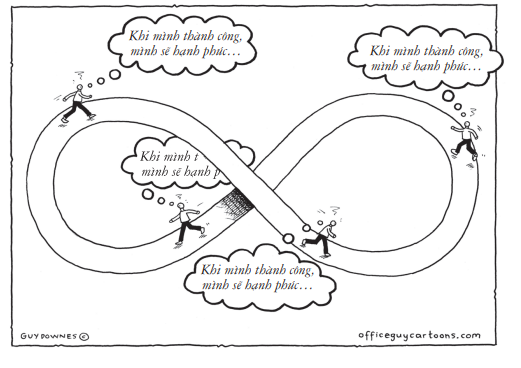
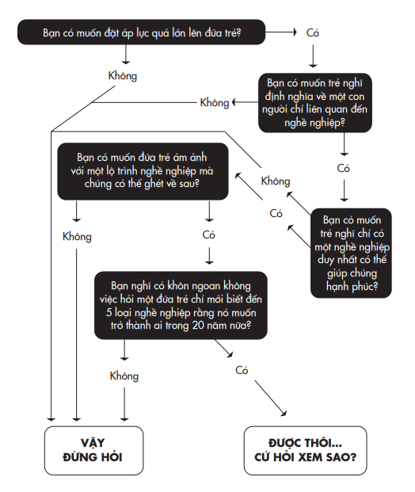
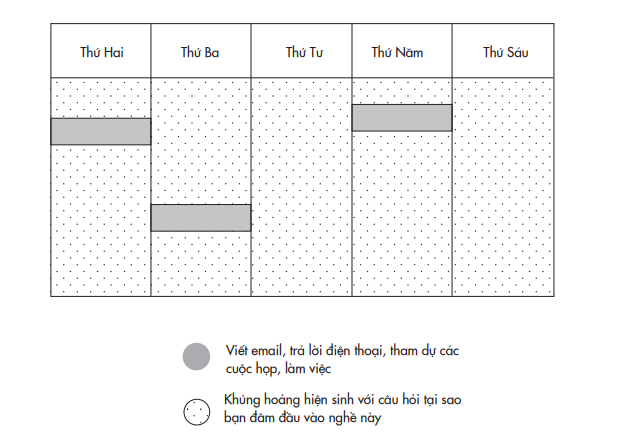
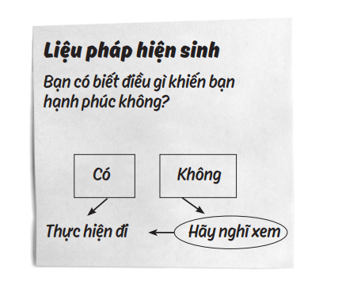
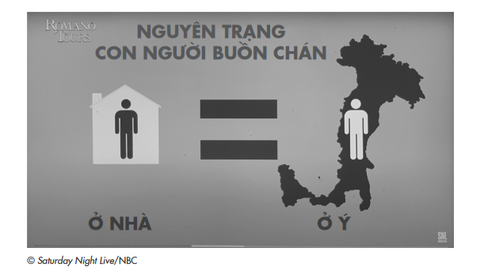

# PHẦN IV: KẾT LUẬN

---

# Chương 11: Thoát Khỏi Tầm Nhìn Đường Hầm
## Suy xét lại những kế hoạch sự nghiệp và kế hoạch cuộc đời tỉ mỉ nhất

---

---

Một cảm giác bức bối bắt đầu xâm chiếm trong những giờ đầu tiên tôi đến đây. Tôi nghĩ tìm một công việc để làm chắc sẽ đỡ hơn. Hóa ra tôi có rất nhiều họ hàng ở địa ngục, và nhờ các mối quan hệ, tôi trở thành phụ tá cho một con quỷ chuyên bẻ răng người. Đó không hẳn là công việc, một kiểu học việc thì đúng hơn. Nhưng tôi vẫn hăm hở. Và khởi đầu có vẻ khá thú vị. Nhưng sau một thời gian, bạn sẽ bắt đầu tự hỏi: Mình xuống địa ngục để làm việc này ư, đưa cho một con quỷ đủ loại kềm khác nhau?

> *– Jack Handey (My First Day in Hell, The New Yorker)*

Con muốn làm nghề gì khi lớn lên? Khi tôi còn nhỏ, đó là câu hỏi mà tôi không muốn nghe nhất. Tôi sợ những cuộc trò chuyện với người lớn bởi họ lúc nào cũng hỏi câu đó, và dù câu trả lời của tôi như thế nào họ cũng không bao giờ hài lòng. Khi tôi nói mình muốn làm siêu nhân, họ cười ồ. Mục tiêu kế tiếp của tôi là trở thành vận động viên bóng rổ nhà nghề, nhưng bất chấp bao nhiêu giờ tập ném bóng ở sân gần nhà, tôi vẫn bị loại ra khỏi đội bóng rổ trường trung học cơ sở trong ba đợt tuyển cầu thủ liên tiếp. Tôi rõ là đã đặt mục tiêu quá cao.

Ở trường trung học phổ thông, tôi bỗng mê đắm môn nhảy cầu và quyết định mình muốn trở thành huấn luyện viên của bộ môn này. Người lớn chế giễu kế hoạch ấy: họ bảo rằng mục tiêu của tôi quá tầm thường. Trong học kỳ đầu tiên ở trường đại học, tôi quyết định chọn chuyên ngành tâm lý học, nhưng nó cũng không mở ra thêm cánh cửa nào mà trái lại, tôi buộc phải đóng bớt các lựa chọn. Tôi biết mình không phù hợp để trở thành một chuyên gia trị liệu (vì không đủ kiên nhẫn) hay một bác sĩ tâm thần (vì trường y quá sức khắt khe). Tôi vẫn vô phương hướng và tôi ganh tị với những người đã có một kế hoạch sự nghiệp rõ ràng.

Từ lúc học mẫu giáo, cậu em họ Ryan của tôi đã biết chính xác mình muốn làm nghề gì khi lớn lên. Trở thành bác sĩ không chỉ là giấc mơ Mỹ – nó là ước vọng của cả gia đình. Ông bà cố của chúng tôi từ Nga di dân sang đây và sống đời chật vật. Bà nội của chúng tôi là một thư ký và ông nội làm việc ở nhà máy nhưng vẫn không đủ chu cấp cho năm đứa con, nên ông còn kiêm thêm công việc giao sữa. Trước khi các con đến tuổi vị thành niên, ông đã dạy các con lái xe chở sữa để họ có thể hoàn tất việc giao sữa vào lúc bốn giờ sáng trước khi trường lớp và một ngày làm việc bắt đầu. Khi không đứa con nào của họ vào trường y (hay theo nghề giao sữa), ông bà hy vọng thế hệ chúng tôi sẽ mang lại tiếng thơm cho dòng họ Grant.

Không ai trong bảy đứa cháu đầu trở thành bác sĩ. Tôi là đứa thứ tám, và tôi làm nhiều nghề khác nhau để có đủ tiền đóng học phí đại học và có thể để ngỏ các lựa chọn. Cả nhà tự hào khi tôi có bằng tiến sĩ tâm lý học, nhưng họ vẫn mong mỏi có một tiến sĩ thật sự, tức là một bác sĩ¹²⁶. Với đứa cháu thứ chín, Ryan, nhỏ hơn tôi bốn tuổi, mục tiêu trở thành tiến sĩ y khoa xem như đã được định đoạt.

> **Chú thích:**¹²⁶ “Doctor” được dịch sang tiếng Việt là bác sĩ, thực chất nó là “medical doctor” – tiến sĩ y khoa. (ND)

Ryan hội đủ mọi tố chất: cậu già dặn trước tuổi, luôn đặt đạo đức nghề nghiệp lên hàng đầu. Cậu đặt mục tiêu trở thành một bác sĩ ngoại thần kinh. Cậu vô cùng tâm huyết với viễn cảnh giúp đỡ người khác và sẵn sàng theo đuổi mục tiêu đến cùng bất chấp mọi chướng ngại ở phía trước.

Khi chuẩn bị chọn trường đại học, Ryan ghé thăm tôi. Khi chúng tôi bắt đầu bàn về các chuyên ngành, cậu bỗng thoáng hồ nghi về lựa chọn ngành y và hỏi tôi liệu chuyển sang học kinh tế thì có tốt hơn không. Trong tiếng Anh có một thuật ngữ trong tâm lý học phản ánh nét tính cách này của Ryan: “blirtatiousness” (tạm dịch: bộc tính). Vâng, đó là một khái niệm thực tế được nghiên cứu, bắt nguồn từ sự kết hợp từ “blurt” (bày tỏ bộc phát) và “flirt” (tán tỉnh). Người có tính cách này khi giao tiếp với người khác thường đối đáp nhanh và thể hiện nhiều cảm xúc. Trong các bài kiểm tra tính cách, họ thường đạt điểm cao ở tính hướng ngoại và bốc đồng, và đạt điểm thấp ở tính e dè và nhạy cảm. Ryan có thể cố ép bản thân ngồi học hàng giờ liền, nhưng việc đó sẽ khiến cậu kiệt quệ. Với bản tính ưa thích các hoạt động giao tiếp và năng động, Ryan bay bổng với ý nghĩ rằng mình sẽ có đủ khả năng ôm đồm cùng lúc cả hai chuyên ngành – kinh tế và dự bị y khoa, nhưng sau đó đã dẹp bỏ ý định này khi bước chân vào đại học. Phải kiên định một con đường.

Ryan vượt qua chương trình dự bị y khoa không mấy khó khăn và trở thành trợ giảng cho các lớp cử nhân khi vẫn chưa tốt nghiệp. Khi lên lớp trong các buổi ôn thi và thấy sinh viên căng thẳng đến thế nào, cậu cũng kiên quyết không giải đáp các câu hỏi cho tới khi cả lớp chịu đứng dậy và nhảy múa. Khi được nhận vào một trường y thuộc Liên minh Ivy¹²⁷, Ryan lại hỏi ý kiến tôi rằng liệu có nên đồng thời theo đuổi cả chương trình tiến sĩ y khoa (MD) và thạc sĩ quản trị kinh doanh (MBA) không. Cậu ấy vẫn còn rất hứng thú với lĩnh vực kinh doanh, nhưng cũng lo ngại mình sẽ bị phân tâm. Phải kiên định một con đường.

>**Chú thích:**¹²⁷ Là một nhóm các trường đại học hàng đầu và lâu đời nhất ở Mỹ.

Năm cuối ở trường y, Ryan nghiêm túc nộp đơn xin xét tuyển vào chương trình nội trú ngoại thần kinh, một chuyên ngành đòi hỏi sự tập trung trí não cao độ để giải phẫu bộ não của con người. Cậu không chắc mình có thật sự phù hợp với con đường này, hay liệu việc theo đuổi nó có khiến cậu không còn thời gian cho cuộc sống riêng nữa hay không. Cậu cũng băn khoăn rằng thay vì vậy, liệu mình có thể mở một công ty chăm sóc sức khỏe không, nhưng đến khi được nhận vào Đại học Yale, cậu đã quyết định chọn chương trình nội trú. Phải kiên định một con đường.

Trong suốt thời gian học nội trú, những giờ trực mệt lử và tập trung cao độ bắt đầu gây ra những tác động tiêu cực, và Ryan hoàn toàn kiệt quệ. Cậu có cảm tưởng rằng nếu một ngày kia mình khuỵu xuống trong khi đang làm việc thì có lẽ sẽ chẳng ai trong guồng máy bận rộn này bận tâm hay để ý tới. Cậu thường xuyên chịu đựng cảm giác đau buồn khi bệnh nhân qua đời và phải đau đầu ứng phó với hành vi bắt nạt của các bác sĩ mổ chính, và tình trạng này chẳng có dấu hiệu kết thúc. Mặc dù đây là ước mơ thời thơ ấu của Ryan và mong mỏi của ông bà nội chúng tôi, nhưng công việc của Ryan đã chiếm gần hết cuộc sống của cậu. Tình trạng đuối sức hoàn toàn khiến Ryan tự hỏi liệu mình có nên từ bỏ không.

Và rồi Ryan quyết định cậu không thể bỏ cuộc. Cậu đã đi quá xa nên không thể đổi hướng được, vì vậy cậu quyết tâm hoàn tất bảy năm nội trú ở khoa ngoại thần kinh. Đến khi Ryan nộp các giấy tờ để xin thư giới thiệu, bệnh viện từ chối chỉ vì cậu đã viết ngày tháng ở bên phải thay vì ở bên trái trên tờ lý lịch. Quá chán ngán với hệ thống đầy những nguyên tắc ấy, cậu từ chối sửa lại cách trình bày. Sau khi chiến thắng sự quan liêu cứng nhắc, cậu tạo thêm một chiến tích nữa cho chính mình – nhận học bổng nghiên cứu sinh năm thứ tám cho đề tài phẫu thuật cột sống phức tạp bằng phương pháp xâm lấn tối thiểu.

Ngày nay, Ryan là một bác sĩ ngoại thần kinh tại một trung tâm y tế lớn. Tuổi chưa đến bốn mươi, cậu ấy vẫn còn khoản nợ học phí sau hơn mười năm tốt nghiệp trường y. Mặc dù cậu ấy yêu thích việc giúp đỡ người khác và chăm sóc bệnh nhân, nhưng công việc kéo dài hàng giờ và lề lối quan liêu dần bào mòn nhiệt huyết của cậu. Ryan nói với tôi rằng nếu có thể làm lại từ đầu, cậu sẽ chọn đi một con đường khác. Tôi thường tự hỏi có điều gì đáng ra đã thuyết phục được Ryan tái tư duy về lựa chọn hướng đi cho sự nghiệp của mình, và một sự nghiệp như thế nào mới đúng như Ryan thật sự kỳ vọng.

Tất cả chúng ta đều có những ý niệm về con người mà bản thân muốn trở thành và cách thức sống mà bản thân mong muốn. Những ý niệm ấy không chỉ xoay quanh chuyện nghề nghiệp; từ thuở nhỏ, chúng ta đã hình thành những ý tưởng về nơi mình sẽ sống, ngôi trường mình sẽ theo học, kiểu người mình muốn kết hôn và mình sẽ có bao nhiêu đứa con. Những hình dung này có thể tạo cảm hứng để chúng ta đặt ra những mục tiêu táo bạo và dẫn dắt chúng ta trên con đường hiện thực hóa chúng. Mối nguy hiểm của những kế hoạch này là chúng có thể đặt ta vào tầm nhìn đường hầm, che mắt ta trước những lựa chọn thay thế khác. Chúng ta không biết thời gian và hoàn cảnh sẽ làm thay đổi thế nào về những điều ta mong muốn và thậm chí cả con người mà ta muốn trở thành, và việc chúng ta khóa chặt hệ thống định hướng cho cuộc đời mình vào một mục tiêu duy nhất có thể dẫn chúng ta đi đúng con đường đã chọn nhưng tới một đích đến sai.

## CHẤP NHẬN CĂN TÍNH ĐƯỢC QUY ƯỚC

Khi chúng ta đặt hết tâm sức vào một kế hoạch và nhận ra nó sẽ không xảy ra như chúng ta mong đợi, phản ứng bản năng đầu tiên của chúng ta thường không phải là tái tư duy về nó. Thay vào đó, chúng ta có xu hướng càng hạ quyết tâm và dồn thêm các nguồn lực vào kế hoạch. Khuôn thức này được gọi là sự leo thang cam kết¹²⁸. Bằng chứng thực tế cho thấy rằng những doanh nhân khởi nghiệp bám víu lấy những chiến lược đang có nguy cơ thất bại vào thời điểm họ nên từ bỏ, các ông bầu và huấn luyện viên NBA¹²⁹ cứ liên tục đầu tư vào những hợp đồng mới và thời gian thi đấu cho các tuyển thủ có phong độ không tương xứng với giá chuyển nhượng, và các chính khách không ngừng đẩy binh sĩ vào những cuộc chiến mà lẽ ra ngay từ đầu đã không cần thiết. Chi phí chìm¹³⁰ là một nhân tố, nhưng những căn nguyên quan trọng nhất có vẻ như mang tính tâm lý hơn là kinh tế. Sự leo thang cam kết xảy ra bởi vì chúng ta là những sinh vật duy lý, liên tục tìm kiếm những lý lẽ biện minh cho những niềm tin trước đó của mình, như một cách để vuốt ve bản ngã, bảo vệ hình tượng cá nhân và hợp lý hóa những quyết định trong quá khứ của mình.

>**Chú thích:**¹²⁸ Leo thang cam kết là khái niệm được dùng để chỉ tình trạng bám víu vào một quyết định khi nó không còn hợp thời; hay sự sa đà (tiêu tốn tiền của, công sức, thời gian) vào một hướng đi hay dự án có nguy cơ thất bại thay vì nên làm điều ngược lại. ¹²⁹ Giải bóng rổ Nhà nghề Mỹ. ¹³⁰ Chi phí chìm là những khoản chi tiêu đã thực hiện và không thể thu hồi được.

Leo thang cam kết là một căn nguyên chính của những thất bại có thể ngăn ngừa được. Trớ trêu thay, nó có thể được tiếp sức bởi một trong những động lực thành công được tôn vinh nhiều nhất: sự bền bỉ. Bền bỉ là sự kết hợp của đam mê và kiên trì, và nghiên cứu cho thấy nó có thể đóng một vai trò quan trọng trong việc thúc đẩy chúng ta hoàn thành những mục tiêu dài hạn. Tuy vậy, khi cần tái tư duy, bền bỉ lại bộc lộ mặt trái của nó. Các thực nghiệm chỉ ra rằng những người càng bền bỉ càng dễ nhấn mạnh vai trò của mình trong những trò may rủi và thường sẵn sàng thực hiện đến cùng những nhiệm vụ mà họ đang thất bại và không có cơ may thành công. Các nhà nghiên cứu thậm chí còn cho rằng những nhà leo núi bền bỉ thường có khả năng tử nạn trong chuyến thám hiểm cao hơn, bởi họ vốn có quyết tâm phải leo lên đến đỉnh bằng mọi giá. Có một lằn ranh mỏng manh giữa sự kiên định anh hùng và cứng đầu một cách dại dột. Đôi khi kiểu bền bỉ tốt nhất chính là hạ quyết tâm bắt đầu lại.

Ryan để bản thân leo thang cam kết với chương trình y khoa đến mười sáu năm. Nếu bớt kiên gan bền chí một chút, cậu ấy đã có thể định hướng lại nghề nghiệp sớm hơn. Từ rất sớm, cậu đã là nạn nhân của tình trạng mà các nhà tâm lý học gọi là “căn tính được quy ước¹³¹” – khi chúng ta hấp tấp định hình một ý niệm về bản ngã mà không trải qua đủ sự thẩm định và đóng chặt tâm trí khỏi những lựa chọn khác về con người mình có thể trở thành.

>**Chú thích:**¹³¹ Tiếng Anh: identity foreclosure, là khái niệm tâm lý để chỉ tình trạng một người ở độ tuổi đang trưởng thành tự cam kết với một vai trò, giá trị hay mục tiêu nào đó được xây dựng từ các hình mẫu có sẵn, thay vì không ngừng tự khám phá để định hình bản thân.

Trong định hướng nghề nghiệp, căn tính được quy ước thường khởi phát khi người lớn hỏi trẻ con: Con muốn trở thành gì khi lớn lên? Suy nghĩ về câu hỏi ấy có thể khiến trẻ nuôi dưỡng một suy nghĩ bị đóng khung về bản thân và công việc. “Tôi nghĩ đó là một trong những câu hỏi vô dụng nhất mà một người lớn có thể hỏi trẻ con”, Michelle Obama viết. “Con muốn trở thành gì khi lớn lên? Cứ như thể lớn lên là thứ gì hữu hạn ấy. Cứ như thể đến một thời điểm, bạn trở thành ai đó và đó là dấu chấm hết¹³²”. ¹³² Tôi có một lý do khác để phản đối câu hỏi này: câu hỏi này khuyến khích trẻ em biến công việc thành thứ chính yếu trong căn tính của mình. Khi bạn hỏi ai đó muốn trở thành gì, câu trả lời có thể chấp nhận về mặt xã hội duy nhất chính là một nghề nghiệp cụ thể. Người lớn mong chờ trẻ con nói lên những ước mơ đẹp đẽ – trở thành một hình tượng nào đó thật lớn lao như một phi hành gia, anh hùng như lính cứu hỏa chẳng hạn, hay truyền cảm hứng như một nhà làm phim. Không có chỗ cho những câu trả lời như chỉ muốn một việc làm ổn định, là một người cha hay người mẹ tốt, là một người biết quan tâm và ham tìm hiểu mọi thứ. Mặc dù công việc của tôi là nghiên cứu về nghề nghiệp, tôi không nghĩ chúng ta nên xem nó là thứ để định nghĩa bản thân. (TG)

Một số trẻ em có ước mơ thật khiêm tốn. Chúng được định hình với việc đi theo truyền thống gia đình và không bao giờ thật sự cân nhắc đến lựa chọn nào khác. Bạn hẳn cũng biết một số người đối mặt với vấn đề ngược lại. Họ mơ quá lớn, họ bám chặt vào một viễn cảnh quá cao vời mà không thực tế. Đôi lúc chúng ta không có đủ tài năng để theo đuổi những đam mê nghề nghiệp, đành bỏ chúng lại sau lưng; cũng có khi ta cay đắng nhận ra đam mê khó mà nuôi sống được mình. “Bạn có thể làm bất cứ công việc gì mình muốn ư!?”, diễn viên hài Chris Rock châm biếm. “Hãy nói sự thật cho bọn trẻ biết… Con có thể làm bất cứ công việc gì mình giỏi… miễn đó là thứ người ta có tuyển dụng.”

Ngay cả khi lũ trẻ hào hứng về một lựa chọn nghề nghiệp khá thực tiễn, suy nghĩ của chúng về “công việc đáng mơ ước” có thể biến thành một cơn ác mộng. Trẻ em tốt nhất nên được dạy rằng nghề nghiệp là công việc để làm, nó không phải là một tuyên bố về căn tính. Khi trẻ xem công việc là những việc chúng làm thay vì là cơ sở để nhận diện bản sắc riêng của chúng, chúng sẽ cởi mở hơn, sẵn sàng khám phá những lựa chọn khác nhau.

### CÓ NÊN HỎI “CON MUỐN TRỞ THÀNH GÌ KHI LỚN LÊN?”

Mặc dù trẻ em thường hào hứng với khoa học từ lứa tuổi nhỏ, nhưng qua mấy năm tiểu học chúng có xu hướng mất dần hứng thú và cả niềm tin vào tiềm năng trở thành nhà khoa học. Những nghiên cứu gần đây cho thấy việc duy trì niềm yêu thích khoa học của trẻ là hoàn toàn có thể, thông qua việc dạy về khoa học cho trẻ theo cách khác đi. Khi học sinh lớp hai và lớp ba học “thực hành khoa học” thay vì “trở thành nhà khoa học”, chúng sẽ hào hứng theo đuổi khoa học hơn. Trở thành một nhà khoa học dường như ngoài tầm với, nhưng làm thí nghiệm là điều bất cứ ai trong chúng ta đều có thể thử. Ngay cả trẻ mầm non cũng biểu lộ sự thích thú với khoa học khi được biết đến khoa học là cái gì đó chúng ta làm, thay vì là danh hiệu của ai đó.

Trong một bữa tối gần đây, lũ trẻ nhà tôi quyết định hỏi một lượt mọi người muốn trở thành gì khi lớn lên. Tôi nói rằng không cần phải chọn một nghề duy nhất; một người trung bình làm khoảng một tá công việc khác nhau trong đời. Không nhất thiết phải làm một nghề duy nhất; bọn trẻ có thể muốn làm nhiều nghề. Chúng bắt đầu động não về tất cả những công việc bản thân muốn làm. Chúng liệt kê ra nào là thiết kế những bộ đồ chơi Lego, nghiên cứu về không gian, sáng tác, làm kiến trúc, thiết kế nội thất, dạy thể dục, nhiếp ảnh gia, huấn luyện viên bóng đá và cả trở thành một YouTuber về lối sống khỏe.

Chọn lựa một nghề không giống như tìm kiếm một bạn tâm giao. Công việc lý tưởng của bạn thậm chí có thể còn chưa được phát minh ra. Những ngành công nghiệp cũ đang thay đổi và những ngành công nghiệp mới đang phát triển nhanh hơn bao giờ hết: cách đây không lâu, Google, Uber và Instagram còn chưa xuất hiện. Con người tương lai của bạn cũng chưa tồn tại vào lúc này, và các sở thích của bạn đều có thể thay đổi theo thời gian.

## “KHÁM TỔNG QUÁT” ĐỊNH KỲ

Chúng ta thường đóng khung mọi thể loại kế hoạch cuộc đời. Một khi bạn cam kết với một thứ gì đó, nó trở thành một phần bản sắc của bạn, khiến cho việc tháo dỡ nó vô cùng khó khăn. Bạn tuyên bố chọn chuyên ngành Ngữ văn bởi vì bạn thích đọc sách, nhưng rồi sau đó phát hiện ra rằng bạn không ưa việc viết lách. Bạn quyết định học đại học trong lúc đại dịch còn tiếp diễn, để rồi sau đó nghĩ lại rằng lẽ ra bạn nên cân nhắc bảo lưu việc học một năm. Phải kiên định một con đường. Bạn quyết định chấm dứt một mối quan hệ lãng mạn bởi vì bạn không muốn có con, để rồi nhiều năm sau bạn chợt nhận ra mình cũng muốn có con.

Căn tính được quy ước có thể ngăn chúng ta phát triển. Trong một nghiên cứu về các nhạc sĩ nghiệp dư, những người đã chọn âm nhạc làm nghề nghiệp có khuynh hướng phớt lờ lời khuyên hướng nghiệp từ một người hướng dẫn đáng tin cậy trong suốt bảy năm kế tiếp. Họ nghe theo con tim và ngoảnh mặt với những người thầy. Ở nhiều phương diện, chấp nhận căn tính quy ước là trạng thái đối lập của khủng hoảng căn tính¹³³: thay vì chấp nhận việc bản thân không chắc chắn về con người mình muốn trở thành, chúng ta phát triển một sự xác tín bù trừ và lao vào một chọn lựa nghề nghiệp mà không suy nghĩ thấu đáo. Tôi để ý rằng những sinh viên chắc chắn nhất về các kế hoạch nghề nghiệp của bản thân ở độ tuổi hai mươi thường là những người hối tiếc nhiều nhất ở tuổi ba mươi. Họ đã không thực hiện đủ việc tái tư duy trong suốt chặng đường ấy¹³⁴.

>**Chú thích:**¹³³ Khủng hoảng căn tính hay khủng hoảng bản sắc (tiếng Anh: identity crisis) là một dạng khủng hoảng tâm lý, xảy ra khi cảm nhận của một người về bản thân (mục đích sống, giá trị, tính cách) trở nên không vững chắc, bị lung lay bởi vô số các yếu tố bên ngoài như sự thay đổi hoàn cảnh sống, vị trí xã hội, tuổi tác, mối quan hệ. ¹³⁴ Nghiên cứu cho thấy các sinh viên tốt nghiệp đại học ở Anh và xứ Wales thường thay đổi lộ trình nghề nghiệp hơn so với các sinh viên ở Scotland. Đây không phải là một hiệu ứng văn hóa mà là hiệu ứng thời điểm. Ở Anh và xứ Wales, sinh viên phải chọn chuyên ngành từ khi học trung học, điều này làm giới hạn cơ hội tìm hiểu những lựa chọn khác khi vào đại học. Ở Scotland, sinh viên không cần chọn chuyên ngành cho đến năm ba đại học, nhờ đó họ có nhiều cơ hội hơn để tái tư duy về các kế hoạch của bản thân và phát triển những sở thích mới. Kết quả, họ thích hợp với những môn học chưa từng được biết đến ở trung học hơn – và như thế, khả năng chọn được nghề phù hợp với mình sẽ cao hơn. (TG)

Đôi khi, nguyên nhân là vì những cá nhân này suy nghĩ y như một chính trị gia – quá mong mỏi có được sự công nhận của cha mẹ và chúng bạn. Họ bị mê hoặc bởi địa vị xã hội, không đủ tỉnh táo để nhận ra rằng một thành công hay danh tiếng họ đạt được – dẫu khiến người khác trầm trồ đến độ nào – nếu nó khiến họ căng thẳng thì nó vẫn là một lựa chọn tồi. Trong những hoàn cảnh khác, nguyên do là vì họ bị kẹt trong chế độ tư duy của nhà truyền giáo, xem công việc là một mục đích thiêng liêng. Và nếu họ chọn nghề nghiệp theo chế độ tư duy của công tố viên, họ sẽ lên án bạn bè đã bán linh hồn cho lối sống tư bản và sẽ lao vào làm việc cho các tổ chức phi lợi nhuận với niềm tin cứu thế.

Đáng buồn thay, họ thường hiểu biết quá ít về công việc đã chọn – và càng quá ít về bản thân không ngừng phát triển của họ – để có thể đưa ra cam kết trọn đời. Họ bị mắc kẹt trong vòng lặp cố chấp, lấy làm kiêu hãnh khi theo đuổi một hình tượng nghề nghiệp và gắn kết với những con người luôn ủng hộ niềm xác tín đó. Đến khi phát hiện ra nó không phải là lựa chọn phù hợp, họ cảm thấy đã quá trễ để suy nghĩ lại. Quay lưng lại với lựa chọn dường như là ván cược quá lớn; hy sinh lương bổng, địa vị, kỹ năng và thời gian đã qua có vẻ là cái giá quá đắt. Kỳ thực, tôi vẫn nghĩ thà chịu mất hai năm đã qua còn hơn lãng phí hai mươi năm kế tiếp. Bài học đắt giá ở đây là, căn tính được quy ước chẳng khác nào một miếng băng dính cá nhân: nó tạm che đi tình trạng khủng hoảng căn tính, nhưng không thể chữa lành trạng thái đó.

Lời khuyên của tôi dành cho sinh viên là hãy học hỏi từ lĩnh vực chăm sóc sức khỏe. Giống như việc chúng ta đặt hẹn với bác sĩ và nha sĩ ngay cả khi sức khỏe không có vấn đề gì, bạn cũng nên lên lịch “khám tổng quát định kỳ” cho định hướng nghề nghiệp của mình. Tôi khuyến khích sinh viên đặt lịch nhắc nhở để hỏi chính mình những câu hỏi then chốt hai lần mỗi năm. Bạn bắt đầu có hứng thú với công việc bạn đang theo đuổi từ lúc nào, và bạn đã thay đổi ra sao kể từ lúc đó? Bạn đã đạt tới giai đoạn bão hòa – không có gì mới để học hỏi thêm – trong vai trò hay nơi làm việc hiện tại chưa, và phải chăng đã đến lúc cần cân nhắc một sự chuyển hướng? Trả lời những câu hỏi kiểm tra định kỳ này là một cách để kích hoạt vòng lặp tái tư duy đều đặn. Nó giúp sinh viên duy trì sự khiêm nhường về năng lực dự đoán tương lai của mình, suy tư về những hoài nghi với kế hoạch của bản thân, và luôn giữ mức tò mò đủ để khám phá những khả năng mới hay cân nhắc lại những lựa chọn mà bản thân từng bỏ qua trước đó.

### THỜI GIAN BIỂU ĐIỂN HÌNH SAU KHI CHẤP NHẬN CĂN TÍNH QUY ƯỚC

Một sinh viên của tôi, Marissa Shandell, tìm được một công việc nhiều người thèm muốn ở một công ty tư vấn có tiếng và kế hoạch của cô là dần leo lên những vị trí cao hơn. Cô nhanh chóng thăng tiến nhưng rồi cô nhận ra mình không bao giờ làm hết việc. Thay vì cứ cố chịu cho qua, cô và chồng mình lên lịch “khám tổng quát định kỳ” cho nghề nghiệp của họ, thông qua cuộc trò chuyện giữa hai người, mỗi sáu tháng một lần. Trong buổi trao đổi đó, họ không chỉ dự liệu về đường hướng phát triển của công ty hiện tại của mỗi người mà còn cân nhắc về hướng phát triển sự nghiệp của họ. Sau khi đã thăng tiến đến vị trí chủ nhiệm sớm hơn lộ trình, Marissa nhận ra cô đã đạt tới độ bão hòa về cơ hội học hỏi (và cả về lối sống), nên cô quyết định sẽ theo đuổi học hàm tiến sĩ về quản trị¹³⁵. ¹³⁵ Ban đầu tôi chỉ khuyến khích áp dụng “khám tổng quát định kỳ” về nghề nghiệp cho những sinh viên hay vướng vào tầm nhìn đường hầm, nhưng rồi tôi nhận ra nó cũng hữu ích cả với những sinh viên ở thái cực bên kia của phạm trù tái tư duy: những người tư duy quá mức. Họ thường phản hồi rằng mỗi khi thấy ít hài lòng với công việc hiện tại, ý nghĩ rằng bản thân đã lên kế hoạch mỗi năm hai lần tái tư duy giúp họ cưỡng lại được thôi thúc suy nghĩ về ý định bỏ việc. (TG)

Quyết định rời bỏ lộ trình nghề nghiệp hiện tại thường dễ dàng hơn tìm ra một lộ trình mới. Cách thức yêu thích của tôi để thực hiện thử thách này đến từ một giáo sư dạy môn quản trị học, Herminia Ibarra. Cô phát hiện ra rằng khi người ta cân nhắc các lựa chọn hay chuyển đổi trong nghề nghiệp, lối tư duy của nhà khoa học là rất hữu ích. Bước đầu tiên cần làm là khám phá những phiên bản khả thi của chính mình: xác định những người mình ngưỡng mộ trong hoặc ngoài lĩnh vực của mình và quan sát công việc thực tế hằng ngày của họ. Bước thứ hai là phát triển những giả thuyết để xem các phương hướng này phù hợp ra sao với sở thích, kỹ năng và các giá trị của bạn. Bước thứ ba là kiểm nghiệm thực tế những căn tính khác nhau thông qua các thử nghiệm: đặt hẹn phỏng vấn để được tư vấn về nghề nghiệp, học việc tại chỗ, và thực hiện những dự án mẫu để cảm nhận rõ hơn về công việc. Mục tiêu ở đây không phải là xác định một kế hoạch cụ thể mà mở rộng danh mục những phiên bản khả thi của chính mình, nhờ đó bạn cởi mở hơn cho việc tái tư duy.

Phương pháp “khám tổng quát định kỳ” không chỉ áp dụng cho định hướng nghề nghiệp – nó còn hữu ích đối với mọi kế hoạch cuộc sống khác. Cách đây vài năm, một cựu sinh viên gọi điện cho tôi để xin lời khuyên về chuyện tình yêu. Xin nói trước là tôi không phải là chuyên gia về khoản ấy đâu nhé. Cậu ấy đang hẹn hò với một phụ nữ hơn một năm, và dù đây là mối quan hệ hạnh phúc nhất từ trước tới nay, cậu ấy vẫn tự hỏi liệu đây có phải là một nửa của mình không. Cậu ấy từng luôn nuôi mộng cưới một phụ nữ có tham vọng trong sự nghiệp hay đầy nhiệt huyết thay đổi thế giới, trong khi bạn gái hiện tại dường như ít nỗ lực và có lối sống khá thong dong.

Đây quả là một thời điểm lý tưởng để kiểm tra định kỳ. Tôi hỏi rằng cậu ấy đã hình dung về người bạn đời tương lai từ năm bao nhiêu tuổi và bản thân cậu đã thay đổi ra sao sau ngần ấy năm. Cậu ấy nói rằng đã suy nghĩ về người bạn đời lý tưởng từ thời niên thiếu và chưa bao giờ lắng lại để suy nghĩ lại về nó. Qua cuộc trao đổi giữa chúng tôi, cậu bắt đầu nhận ra rằng nếu mình và bạn gái hiện tại hạnh phúc với nhau, tham vọng và lý tưởng ở người bạn đời có thể không còn quan trọng với cậu như trước đây. Cậu cũng đã hiểu lý do cậu thích những phụ nữ có khát vọng thành công và lý tưởng phụng sự là bởi vì cậu từng muốn trở thành người như vậy.

Hai năm rưỡi sau, cậu ấy liên lạc lại và cập nhật tình hình, rằng cậu đã quyết định từ bỏ hình mẫu người bạn đời lý tưởng trước đây:

Em đã quyết định mở lòng và nói chuyện với cô ấy về việc cô ấy khác ra sao với hình mẫu bạn đời em từng tưởng tượng. Bất ngờ thay, cô ấy nói với em điều y hệt! Em cũng không phải là kiểu người bạn đời lý tưởng của cô ấy – cô ấy mong gặp một người có óc sáng tạo hơn, một người quảng giao hơn. Chúng em chấp nhận con người của nhau và sẽ cùng nhau đi tiếp. Em cảm thấy vô cùng phấn khích trước việc mình đã có thể từ bỏ những hình mẫu quá khứ và dành trọn không gian hiện tại cho con người trọn vẹn của cô ấy và đón nhận mọi trải nghiệm mà mối quan hệ sẽ đem lại.

Không lâu trước đại dịch, cậu ấy đã cầu hôn bạn gái và giờ họ đã đính hôn.

Một mối quan hệ thành công đòi hỏi tái tư duy đều đặn. Đôi khi sự cẩn trọng đồng nghĩa với suy xét lại những thứ nhỏ nhặt như các thói quen của chúng ta. Học cách để không thường xuyên trễ hạn với mọi thứ. Dọn bớt tủ đồ chứa đầy những chiếc áo thun sự kiện đã cũ sờn. Nằm xoay hướng khác vì tật hay ngáy của mình. Trong những trường hợp khác, là một người biết nâng đỡ có nghĩa là cởi mở với những thay đổi lớn của cuộc đời – chuyển đến sống ở một đất nước khác, một cộng đồng khác, hay làm một công việc khác để hỗ trợ cho các ưu tiên của người bạn đời. Trong trường hợp cựu sinh viên của tôi, nó đồng nghĩa với việc tái tư duy về hình mẫu vị hôn thê của mình, nhưng cũng đồng thời cởi mở tiếp nhận con người mà cô ấy có thể trở thành trong tương lai. Sau này, cô ấy chuyển việc nhiều lần, trở thành con người nhiệt huyết trong công việc lẫn lý tưởng cá nhân – đấu tranh với những bất công trong giáo dục. Khi chúng ta sẵn lòng cập nhật suy nghĩ của bản thân về mẫu người bạn đời mình mong muốn, chúng ta trao cho người ấy sự tự do phát triển và tạo điều kiện cho mối quan hệ của chúng ta đơm hoa kết trái.

Dù chúng ta thực hiện “khám tổng quát định kỳ” với người bạn đời, cha mẹ hay người dẫn dắt mình thì mỗi năm cũng nên một hai lần lắng lại suy nghĩ về việc những khát vọng của chúng ta đã thay đổi như thế nào. Khi xác định được những hình dung trong quá khứ về cuộc sống của mình đã không còn phù hợp với tương lai, chúng ta có thể bắt đầu tái tư duy về những kế hoạch cuộc đời. Điều đó có thể tạo điều kiện cho hạnh phúc đến với chúng ta, miễn là chúng ta không quá ám ảnh với việc tìm kiếm nó.

## KHI VIỆC THEO ĐUỔI HẠNH PHÚC LẠI XUA ĐUỔI HẠNH PHÚC

Khi chúng ta suy tư về việc lên kế hoạch cho cuộc đời mình, có một vài thứ cần ưu tiên hơn là hạnh phúc. Vương quốc Bhutan đặt ra chỉ số Tổng Hạnh phúc Quốc gia. Ở Hoa Kỳ, mưu cầu hạnh phúc được đề cao đến mức nó là một trong ba quyền không thể tước bỏ được đề cập trong Tuyên ngôn Độc lập. Tuy nhiên, nếu ta không cẩn thận, theo đuổi hạnh phúc có thể trở thành một công thức tạo ra khổ đau.

Các nhà tâm lý học nhận thấy rằng khi càng coi trọng hạnh phúc, người ta càng trở nên ít bằng lòng với cuộc sống của mình. Điều này đúng với những cá nhân có thiên hướng đặt nặng hạnh phúc và những người được mời ngẫu nhiên để suy ngẫm và trả lời câu hỏi tại sao hạnh phúc lại quan trọng. Thậm chí có những chứng cứ cho thấy việc mong mỏi hạnh phúc quá mức là một nhân tố rủi ro dẫn đến chứng trầm cảm. Tại sao vậy?

Một trong các khả năng là khi tìm kiếm hạnh phúc, chúng ta trở nên quá bận tâm đến việc đánh giá cuộc sống thay vì thật sự trải nghiệm nó. Thay vì tận hưởng những khoảnh khắc vui sướng, chúng ta không thôi ngẫm nghĩ về việc tại sao cuộc đời mình không thể hạnh phúc hơn nữa. Khả năng thứ hai là chúng ta có thể tiêu tốn quá nhiều thời gian cho những nỗ lực hướng đến một hạnh phúc hoàn hảo, bỏ qua sự thật rằng hạnh phúc phụ thuộc nhiều vào tần suất hơn là cường độ của các cảm xúc tích cực. Khả năng thứ ba là khi săn lùng hạnh phúc, chúng ta quá chú trọng cảm giác vui sướng và phải trả giá bằng mục đích thật sự. Lý thuyết này nhất quán với các số liệu chứng minh rằng ý nghĩa cuộc sống là thứ lành mạnh hơn hạnh phúc, và những người tìm kiếm ý nghĩa trong công việc thường thành công hơn trong việc theo đuổi đam mê – và khả năng bỏ việc cũng ít hơn – so với những người chỉ biết tìm niềm vui trong công việc. Trong khi thú vui dần phai nhạt, ý nghĩa thường trường tồn. Cách lý giải thứ tư: quan niệm về hạnh phúc của phương Tây – là một trạng thái cá nhân – đẩy chúng ta vào cảm giác cô đơn. Ở những nền văn hóa Đông phương vốn xem trọng tập thể hơn cá nhân, khuôn mẫu này được đảo ngược: sự mưu cầu hạnh phúc là dấu hiệu dự đoán một cuộc sống viên mãn hơn, bởi vì người ta ưu tiên sự gắn kết xã hội hơn các hoạt động cá nhân.

Mùa thu năm ngoái, một sinh viên ghé qua văn phòng của tôi để xin lời khuyên. Cô ấy giải thích rằng khi chọn trường Wharton, cô đã quá chú trọng việc được nhận vào trường tốt nhất mà xem nhẹ việc tìm trường phù hợp nhất với mình. Cô ước giá như mình đã chọn môi trường đại học có văn hóa tôn trọng tự do hơn và giàu tính cộng đồng hơn. Giờ đây, cô đã nhận thức rõ giá trị quan của mình và đang cân nhắc việc chuyển sang một trường mà cô được tạo điều kiện để hạnh phúc hơn.

Vài tuần sau, cô ấy kể với tôi rằng một khoảnh khắc trong lớp đã giúp cô tái tư duy về kế hoạch của mình. Cơ hội tái tư duy ấy không đến từ cuộc thảo luận giữa chúng tôi về nghiên cứu hạnh phúc, không đến từ bài tập khảo sát về giá trị mà cô ấy làm, hay bài tập ra quyết định mà chúng tôi thực hành trong lớp. Đó chính là một đoạn hài ngắn tôi cho cả lớp xem trích từ chương trình truyền hình Saturday Night Live.

Đó là cảnh quay Adam Sandler¹³⁶ trong vai một hướng dẫn viên du lịch. Trong đoạn phim giả quảng cáo về tuyến du lịch lữ hành đến Ý của công ty mình, anh ấy nói rằng đôi khi khách hàng thể hiện sự thất vọng trong cách phản hồi của họ. Anh muốn nhân cơ hội này nhắc lại với khách hàng những điều họ có thể và không thể trông đợi ở một chuyến du lịch: ¹³⁶ Diễn viên hài người Mỹ, sinh năm 1966. Anh từng là thành viên của chương trình Saturday Night Live (1990 – 1995) trước khi trở thành một diễn viên hài ăn khách trong các bộ phim Hollywood.

Một chuyến du lịch có thể mang đến cho bạn rất nhiều điều: giúp bạn thư giãn, ngắm nhìn những con sóc có hình thù kỳ lạ, nhưng nó không giúp bạn giải quyết được các vấn đề sâu xa, chẳng hạn bạn nên cư xử thế nào trong một tập thể.

Chúng tôi có thể thu xếp cho bạn những chuyến đi bộ đường dài. Nhưng chúng tôi không thể biến bạn thành một người thích đi bộ đường dài.

Hãy nhớ, bạn vẫn là chính bạn trong chuyến du lịch. Nếu bạn đang buồn, rồi bạn bước lên phi cơ bay sang Ý, thì ở Ý bạn vẫn là con người buồn bã như trước đó, chỉ là đang ở một nơi mới thôi.

Khi theo đuổi hạnh phúc, chúng ta thường bắt đầu bằng việc thay đổi môi trường xung quanh. Chúng ta trông đợi sẽ tìm thấy bình yên ở một nơi có khí hậu ấm áp hơn hay một ký túc xá thân thiện hơn, nhưng bất kể niềm vui nào mà những lựa chọn ấy mang lại thì cũng chỉ là tạm thời. Trong một chuỗi nghiên cứu, những sinh viên thay đổi môi trường xung quanh bằng cách điều chỉnh cách tổ chức cuộc sống hay thời gian biểu dành cho các môn học đều nhanh chóng trở lại mức độ hạnh phúc ban đầu, như trước khi chưa thực hiện thử nghiệm. Như Ernest Hemingway đã viết: “Bạn không thể nào chạy trốn khỏi bản thân bằng cách di chuyển từ chỗ này sang chỗ khác”. Trong khi đó, những sinh viên thay đổi hành vi qua việc tham gia một câu lạc bộ mới, điều chỉnh thói quen học tập hay bắt tay vào một dự án mới lại trải nghiệm hạnh phúc gia tăng theo hướng bền vững. Hạnh phúc của chúng ta phụ thuộc nhiều vào những việc chúng ta làm hơn là nơi chúng ta sống. Chính hành động của chúng ta – chứ không phải môi trường xung quanh – mang lại cho chúng ta ý nghĩa và cảm giác thuộc về một nơi nào đó.

Cô sinh viên của tôi đã quyết định không chuyển trường. Thay vì tái tư duy về việc chọn trường để học, cô tái tư duy về cách sử dụng thời gian sao cho tốt nhất. Cô có thể không thay đổi được văn hóa của cả một ngôi trường nhưng có thể tạo ra một tiểu văn hóa. Cô bắt đầu tổ chức những buổi trò chuyện ở quán cà phê với các bạn học và mời những người có chung sở thích và giá trị đến nhà trà đàm mỗi tuần. Vài tháng sau, cô cho biết đã vun đắp được một vài tình bạn thân thiết và thật mừng vì đã quyết định ở lại. Tác động không chỉ dừng lại ở đó: các buổi trà đàm của cô trở thành một truyền thống để chào đón những sinh viên còn cảm thấy lạc lõng ở môi trường đại học. Thay vì chuyển sang một cộng đồng mới, họ xây dựng cho chính mình một tiểu cộng đồng. Họ không tập trung vào hạnh phúc mà thay vào đó, họ tìm kiếm sự cống hiến và kết nối.

## SỐNG TRỌN VẸN, TỰ DO VÀ TÌM KIẾM Ý NGHĨA

Cần làm rõ là tôi không khuyến khích bất cứ ai ở yên trong một vai trò, một mối quan hệ hay một nơi mà họ chán ghét trừ khi họ không có lựa chọn nào khác. Tuy nhiên, trong việc định hướng nghề nghiệp, thay vì tìm kiếm một công việc khiến mình hạnh phúc, tốt hơn chúng ta nên theo đuổi một công việc giúp bản thân học hỏi và cống hiến được nhiều nhất.

Các nhà tâm lý học phát hiện ra rằng đam mê thường là thứ được phát triển mà có, không phải thứ có sẵn để khám phá. Trong một nghiên cứu về các doanh nhân khởi nghiệp, họ càng đầu tư nhiều nỗ lực vào công ty mới thành lập của mình, nhiệt huyết họ dành cho công việc kinh doanh càng tăng lên theo tuần. Niềm say mê lớn dần theo đà đi lên và độ chín trong nghề của họ. Niềm yêu thích công việc không phải lúc nào cũng có trước nỗ lực và kỹ năng, đôi khi nó là kết quả theo sau hai phẩm chất này. Bằng việc đầu tư vào sự học hỏi và giải quyết vấn đề, chúng ta có thể vun đắp đam mê của mình, và từ đó xây dựng những kỹ năng cần thiết nhằm đáp ứng công việc và hướng đến một cuộc đời mà ta cho là đáng giá.

Khi tuổi đời dày thêm, chúng ta tập trung nhiều hơn vào việc tìm kiếm ý nghĩa – và chúng ta dễ dàng tìm thấy ý nghĩa hơn khi hành động vì lợi ích của tha nhân. Bài kiểm tra ưa thích của tôi để xác định công việc ý nghĩa là tự hỏi: nếu công việc này không tồn tại, cuộc sống của con người sẽ khổ sở hơn đến mức nào? Thường thì đến gần tuổi trung niên, câu hỏi này mới bắt đầu thường xuyên xuất hiện trong chúng ta. Đến giai đoạn này, trong công việc lẫn cuộc sống, chúng ta nhận ra mình có nhiều thứ để cho đi (và ít thứ để mất) hơn, và chúng ta đặc biệt hứng thú với việc chia sẻ kiến thức và kỹ năng cho thế hệ sau.

Khi các sinh viên của tôi nói về tiến trình phát triển lòng tự tôn trong nghề nghiệp của bản thân, tiến trình ấy thường diễn ra thế này:

Giai đoạn 1: Tôi không quan trọng

Giai đoạn 2: Tôi quan trọng

Giai đoạn 3: Tôi muốn góp phần vào việc gì đó quan trọng

Tôi nhận ra rằng càng sớm đến được giai đoạn 3 chừng nào, chúng ta càng tạo ra nhiều ảnh hưởng và trải nghiệm nhiều hạnh phúc chừng ấy. Phát hiện này khiến tôi thay đổi cách nhìn về hạnh phúc, rằng nó không hẳn là một đích đến mà là sản phẩm phụ của sự thạo việc và ý nghĩa. “Những người đơn thuần hạnh phúc”, triết gia John Stuart Mill đã viết, “là những người đặt tâm trí vào một đối tượng hơn là hạnh phúc của cá nhân mình; vào hạnh phúc của người khác, vào sự tiến bộ của loài người, hay thậm chí vào một nghệ thuật hay niềm đam mê, được theo đuổi không phải như một phương tiện, mà như một kết quả lý tưởng tự thân. Nhờ nhắm đến những thứ khác ngoài hạnh phúc, họ đồng thời tìm thấy hạnh phúc trên đường đi”.

Sự nghiệp, mối quan hệ và cộng đồng là những ví dụ của khái niệm mà các nhà khoa học gọi là hệ thống mở – chúng luôn vận động, tiến hóa không ngừng bởi vì chúng không khép kín trước môi trường xung quanh. Chúng ta biết rằng các hệ thống mở bị chi phối bởi ít nhất hai nguyên tắc: luôn luôn có nhiều con đường để đi đến cùng một đích (equifinality – tạm dịch: nguyên lý đẳng kết), và cùng một xuất phát điểm có thể dẫn đến nhiều kết cuộc khác nhau (multifinality – tạm dịch: nguyên lý đa kết). Chúng ta nên cẩn thận tránh việc bản thân quá bám chấp vào một hướng đi hay đích đến cụ thể. Không có một định nghĩa duy nhất về sự thành công hay một con đường duy nhất dẫn tới hạnh phúc.

Cậu em họ Ryan của tôi cuối cùng cũng mạnh dạn tái tư duy về con đường sự nghiệp của mình. Sau năm năm làm bác sĩ nội trú ngoại thần kinh, cậu ấy đã tự làm một phiên bản “khám tổng quát định kỳ” cho sự nghiệp của mình và quyết định khơi lại máu kinh doanh vốn có. Cậu đồng sáng lập một công ty được góp vốn và phát triển chóng mặt, tên là Nomad Health. Công ty có vai trò như một cổng kết nối giữa các bác sĩ với các cơ sở y tế. Cậu ấy còn làm cố vấn cho một vài công ty khởi nghiệp cung cấp thiết bị y tế, đăng ký nhiều bằng sáng chế thiết bị y tế và hiện đang cùng lúc tham gia nhiều dự án khởi nghiệp khác nhau nhằm đẩy mạnh ngành chăm sóc sức khỏe. Ngẫm lại, cậu ấy vẫn tiếc rằng mình đã chấp nhận căn tính quy ước quá sớm ở vai trò bác sĩ ngoại thần kinh và leo thang cam kết với sự nghiệp này.

Trong công việc và cuộc sống, điều tốt nhất chúng ta có thể làm là lên kế hoạch cho những điều bản thân muốn học và cống hiến trong từ một đến hai năm kế đó, và luôn cởi mở đón nhận mọi cơ hội có thể đến tiếp theo. Tôi xin mượn lời một câu nói ẩn dụ của E. L. Doctorow¹³⁷: Viết ra kế hoạch cuộc đời mình “giống như lái xe trong đêm mù sương. Đèn pha chiếu đến đâu bạn nhìn thấy được đến đó, nhưng bằng cách đó bạn có thể đi hết cuộc hành trình”. ¹³⁷ Edgar Lawrence Doctorow (1931 – 2015): tiểu thuyết gia người Mỹ.

---

CHÚNG TA KHÔNG CẦN PHẢI XỚI TUNG toàn bộ những con đường đang đi khi chỉ cần tái tư duy một vài kế hoạch của mình. Một số người hoàn toàn yêu thích lĩnh vực mình đang làm nhưng không hài lòng với vai trò họ hiện đang đảm trách. Một số khác không muốn đương đầu với rủi ro của việc dịch chuyển về mặt địa lý vì công việc hay người bạn đời. Và nhiều người không có cơ may đổi nghề: họ bị phụ thuộc kinh tế vào công việc hiện tại hay sự ràng buộc về tình cảm với gia đình có thể khiến họ không có nhiều lựa chọn để cân nhắc. Dẫu có hay không có cơ hội hoặc khao khát tạo ra sự thay đổi lớn trong cuộc sống của mình, thì chúng ta vẫn có thể tạo ra những điều chỉnh nho nhỏ để phả hơi thở ý nghĩa mới mẻ vào nhịp sống thường ngày của mình.

Các đồng nghiệp Amy Wrzesniewski và Jane Dutton của tôi đã nhận thấy trong bất kỳ ngành nghề nào cũng có những người trở thành kiến trúc sư chủ động cho công việc của riêng mình. Họ tái tư duy về các vai trò mình thông qua chế tác công việc¹³⁸ – điều chỉnh hoạt động công việc hằng ngày để thích ứng tốt hơn với các giá trị, sở thích và kỹ năng của riêng mình. Một trong những nơi Amy và Jane chọn để nghiên cứu chế tác công việc là hệ thống chăm sóc sức khỏe trực thuộc Đại học Michigan.

>**Chú thích:** ¹³⁸ Nguyên văn: job crafting. Đây là một khái niệm trong quản lý, chỉ việc nhân viên có thể cá nhân hóa công việc bằng cách linh hoạt điều chỉnh công việc sao cho phù hợp với kỹ năng, sở thích của họ. Từ đó nhân viên có thể tận dụng thế mạnh của mình, trải nghiệm sự hài lòng và tăng hiệu suất công việc.

Nếu bạn ghé thăm bất kỳ tầng nào của bệnh viện này, chẳng mấy chốc sẽ có những bệnh nhân ung thư bày tỏ với bạn rằng họ biết ơn Candice Walker đến nhường nào. Sứ mệnh của cô là không chỉ bảo vệ hệ thống miễn dịch mong manh của họ, mà còn săn sóc những cảm xúc mong manh của họ nữa. Cô gọi trung tâm hóa trị là Ngôi nhà Hy vọng.Candice thường là người đầu tiên an ủi thân nhân người bệnh khi người thân của họ bước vào đợt điều trị; cô đến, mang theo bánh vòng và cà phê. Cô thường khiến bệnh nhân cười ngặt nghẽo với những câu chuyện về mấy con mèo cô nuôi uống trộm sữa của cô, hay cho họ xem cô đã đãng trí mang nhầm một chiếc vớ nâu một chiếc vớ xanh. Một ngày nọ, cô bắt gặp một bệnh nhân gục trên sàn thang máy, quằn quại vì đau và các nhân viên ở gần đó không biết phải xử trí thế nào. Candice chạy ngay đến, đặt người phụ nữ lên xe lăn và đưa vào thang máy đến khu điều trị khẩn cấp. Bệnh nhân này sau đó gọi cô là “vị cứu tinh của tôi”.

Candice Walker không phải là bác sĩ hay y tá. Cô cũng không phải là một người làm công tác xã hội. Cô là người coi sóc nơi này. Công việc chính thức của cô là đảm bảo trung tâm điều trị ung thư được gọn gàng, ngăn nắp.

Candice được thuê làm công việc này cùng với những người khác, nhưng một vài người trong số họ đã tái tư duy về vai trò của họ. Một người quét dọn ở khu chăm sóc tích cực xung phong nhận nhiệm vụ thường xuyên bố trí lại các bức tranh trên tường, với hy vọng rằng sự thay đổi cảnh trí có thể khuấy động chút nhận thức ở những bệnh nhân đang hôn mê. Khi được hỏi về việc này, cô nói: “Không, đó không phải một phần công việc của tôi, nhưng đó là một phần của con người tôi”.

Căn tính của chúng ta là hệ thống mở, và cuộc sống của chúng ta cũng vậy. Chúng ta không việc gì phải tự trói buộc mình với những hình mẫu cũ kỹ về nơi chúng ta muốn đến hay con người mà ta muốn trở thành. Cách đơn giản nhất để bắt đầu tái tư duy về các khả năng lựa chọn mà ta có thể cân nhắc là tự vấn về những việc chúng ta làm hằng ngày.

Chúng ta cần tính khiêm nhường để suy xét lại những cam kết trước đây của mình; cần sự hoài nghi để chất vấn những quyết định hiện tại và cần óc tò mò để tái hình dung các kế hoạch tương lai. Những gì khám phá được trên hành trình này có thể giải phóng chúng ta khỏi những gông cùm của môi trường thân thuộc và những phiên bản trước đây của chính mình. Tái tư duy cho chúng ta tự do để làm được nhiều hơn là chỉ cập nhật kiến thức và quan điểm của mình – nó là công cụ giúp chúng ta tận hưởng cuộc sống trọn vẹn hơn.
