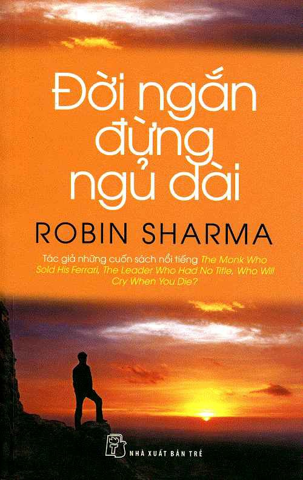

# Đời Ngắn Đừng Ngủ Dài (The Greatness Guide)

- **Tác giả:** Robin Sharma
- **Người dịch:** Phạm Anh Tuấn
- **Nhà xuất bản:** NXB Trẻ
- **Số trang:** 226 trang (101 bài học / chương)

---

## Giới thiệu

Cuốn sách **"Đời ngắn đừng ngủ dài"** của Robin Sharma là tập hợp 101 bài học ngắn gọn, súc tích và thực tế về nghệ thuật lãnh đạo bản thân, nuôi dưỡng lòng đam mê, vượt qua nỗi sợ hãi và vươn tới một cuộc sống ngoại hạng.

---

## Mục lục

### Phần mở đầu
- [Thông tin xuất bản](00_Thong_tin_xuat_ban.md)
- [Về tác giả Robin Sharma](00_Ve_tac_gia.md)
- [Lời khen tặng](00_Loi_khen_tang.md)
- [Lời tựa](00_Loi_tua.md)
- [Mục lục chi tiết](00_Muc_luc.md)

### 101 Chương / Bài học

- [1. Hãy là chính mình](01_Hay_la_chinh_minh.md)
- [2. Rào cản vô hình](02_Rao_can_vo_hinh.md)
- [3. Sức mạnh của sự đơn giản](03_Suc_manh_cua_su_don_gian.md)
- [4. Hoặc giỏi hoặc ra rìa](04_Hoac_gioi_hoac_ra_ria.md)
- [5. Nguyên tắc mở rộng thành công](05_Nguyen_tac_mo_rong_thanh_cong.md)
- [6. Giữ đôi giày bóng láng](06_Giu_doi_giay_bong_lang.md)
- [7. Lắng nghe kỹ](07_Lang_nghe_ky.md)
- [8. Ước mơ như David](08_Uoc_mo_nhu_David.md)
- [9. Hãy làm ngay](09_Hay_lam_ngay.md)
- [10. Hãy tử tế](10_Hay_tu_te.md)
- [11. Không có lỗi](11_Khong_co_loi.md)
- [12. Một ngày mới](12_Mot_ngay_moi.md)
- [13. Lòng biết ơn](13_Long_biet_on.md)
- [14. Nhanh chóng nhận lãnh trách nhiệm](14_Nhanh_chong_nhan_lanh_trach_nhiem.md)
- [15. Các ý tưởng đều vô giá trị](15_Cac_y_tuong_deu_vo_gia_tri.md)
- [16. Mở to mắt](16_Mo_to_mat.md)
- [17. Biểu tượng huy hoàng](17_Bieu_tuong_huy_hoang.md)
- [18. Hãy là người vô lý](18_Hay_la_nguoi_vo_ly.md)
- [19. Không phải mọi nhà lãnh đạo đều như nhau](19_Khong_phai_moi_nha_lanh_dao_deu_nhu_nhau.md)
- [20. Học từ lỗi lầm](20_Hoc_tu_loi_lam.md)
- [21. Câu hỏi đúng](21_Cau_hoi_dung.md)
- [22. Khiêm nhường](22_Khiem_nhuong.md)
- [23. Nhãn hiệu nổi tiếng](23_Nhan_hieu_noi_tieng.md)
- [24. Yêu quý xung đột](24_Yeu_quy_xung_dot.md)
- [25. Đồng hồ đo trách nhiệm](25_Dong_ho_do_trach_nhiem.md)
- [26. Thèm khát sự phát triển](26_Them_khat_su_phat_trien.md)
- [27. Lời ngợi khen không là gì](27_Loi_ngoi_khen_khong_la_gi.md)
- [28. Chấp nhận là khôn ngoan](28_Chap_nhan_la_khon_ngoan.md)
- [29. Nhà tư tưởng thanh cao](29_Nha_tu_tuong_thanh_cao.md)
- [30. Dư luận chẳng là gì](30_Du_luan_chang_la_gi.md)
- [31. Bạn biết đùa không?](31_Ban_biet_dua_khong.md)
- [32. Cách tăng quyền lực](32_Cach_tang_quyen_luc.md)
- [33. Thói quen](33_Thoi_quen.md)
- [34. Tìm giây phút tuyệt vời](34_Tim_giay_phut_tuyet_voi.md)
- [35. Nghịch lý của lời khen](35_Nghich_ly_cua_loi_khen.md)
- [36. May mắn và qui luật](36_May_man_va_qui_luat.md)
- [37. Hội chứng lưng lừa](37_Hoi_chung_lung_lua.md)
- [38. Nỗ lực thêm một phần trăm](38_No_luc_them_mot_phan_tram.md)
- [39. Có đi có lại](39_Co_di_co_lai.md)
- [40. Nói điều bạn muốn](40_Noi_dieu_ban_muon.md)
- [41. Lạc quan mãnh liệt](41_Lac_quan_manh_liet.md)
- [42. Lời nói yếm thế](42_Loi_noi_yem_the.md)
- [43. Thoát khỏi vỏ sò](43_Thoat_khoi_vo_so.md)
- [44. Đừng cố quá sức](44_Dung_co_qua_suc.md)
- [45. Kiểm tra trước gương](45_Kiem_tra_truoc_guong.md)
- [46. Tìm những người bạn hay đòi hỏi](46_Tim_nhung_nguoi_ban_hay_doi_hoi.md)
- [47. Đổi mới nơi bạn làm việc](47_Doi_moi_noi_ban_lam_viec.md)
- [48. Tự hào làm cha mẹ](48_Tu_hao_lam_cha_me.md)
- [49. Cỗ máy che giấu](49_Co_may_che_giau.md)
- [50. Đừng chờ cơ hội đến](50_Dung_cho_co_hoi_den.md)
- [51. Nguyên tắc đầu tiên cho quan hệ tốt đẹp](51_Nguyen_tac_dau_tien_cho_quan_he_tot_dep.md)
- [52. Lo lắng và hồi tưởng](52_Lo_lang_va_hoi_tuong.md)
- [53. Tin nơi người khác](53_Tin_noi_nguoi_khac.md)
- [54. Thực hành là tốt nhất](54_Thuc_hanh_la_tot_nhat.md)
- [55. Đau khổ sẽ giúp bạn](55_Dau_kho_se_giup_ban.md)
- [56. Chính bạn quyết định khả năng của cả nhóm](56_Chinh_ban_quyet_dinh_kha_nang_cua_ca_nhom.md)
- [57. Âm nhạc giúp đời tươi vui](57_Am_nhac_giup_doi_tuoi_vui.md)
- [58. Đừng gân cổ bào chữa](58_Dung_gan_co_bao_chua.md)
- [59. Luôn kết nối](59_Luon_ket_noi.md)
- [60. Điều gì khiến bạn khác biệt?](60_Dieu_gi_khien_ban_khac_biet.md)
- [61. Thời gian trôi qua rất nhanh](61_Thoi_gian_troi_qua_rat_nhanh.md)
- [62. Thinh lặng thì sao?](62_Thinh_lang_thi_sao.md)
- [63. Một tính cách không rỉ sét](63_Mot_tinh_cach_khong_ri_set.md)
- [64. Hãy để người khác tự do](64_Hay_de_nguoi_khac_tu_do.md)
- [65. Một ngày lắng nghe](65_Mot_ngay_lang_nghe.md)
- [66. Công ty khôn ngoan biết tranh thủ cảm xúc](66_Cong_ty_khon_ngoan_biet_tranh_thu_cam_xuc.md)
- [67. Bạn sẽ biết khi nào bạn biết](67_Ban_se_biet_khi_nao_ban_biet.md)
- [68. Hãy là người hùng](68_Hay_la_nguoi_hung.md)
- [69. Sao phải có khế hoạch?](69_Sao_phai_co_khe_hoach.md)
- [70. Đòi hỏi để được đáp ứng](70_Doi_hoi_de_duoc_dap_ung.md)
- [71. Làm điều mới mẻ](71_Lam_dieu_moi_me.md)
- [72. Làm chủ bản thân](72_Lam_chu_ban_than.md)
- [73. Hãy khác biệt](73_Hay_khac_biet.md)
- [74. Sỡ hữu sự vĩ đại](74_So_huu_su_vi_dai.md)
- [75. Hãy bắt chước ban nhạc Coldplay](75_Hay_bat_chuoc_ban_nhac_Coldplay.md)
- [76. Đời ngắn đừng ngủ dài](76_Doi_ngan_dung_ngu_dai.md)
- [77. Khám phá chân trời mới](77_Kham_pha_chan_troi_moi.md)
- [78. Sống cuộc đời mình](78_Song_cuoc_doi_minh.md)
- [79. Cho đi để nhận lấy](79_Cho_di_de_nhan_lay.md)
- [80. Giống như J. K. Rowling](80_Giong_nhu_J_K_Rowling.md)
- [81. Tận tâm](81_Tan_tam.md)
- [82. Vui mừng hay lo lắng](82_Vui_mung_hay_lo_lang.md)
- [83. Xây cầu nối, đừng xây hàng rào](83_Xay_cau_noi_dung_xay_hang_rao.md)
- [84. Thất bại nhanh hơn](84_That_bai_nhanh_hon.md)
- [85. Thiên thần trong tiến hóa](85_Thien_than_trong_tien_hoa.md)
- [86. Lãnh đạo bằng cách làm gương](86_Lanh_dao_bang_cach_lam_guong.md)
- [87. Nhà máy sản xuất ý tưởng](87_Nha_may_san_xuat_y_tuong.md)
- [88. Nói sự thật](88_Noi_su_that.md)
- [89. Tề gia trước tiên](89_Te_gia_truoc_tien.md)
- [90. Tôn trọng nguyên tắc](90_Ton_trong_nguyen_tac.md)
- [91. Học tập Michael J. Fox](91_Hoc_tap_Michael_J_Fox.md)
- [92. Hành trình và đích đến](92_Hanh_trinh_va_dich_den.md)
- [93. Thành công là gì?](93_Thanh_cong_la_gi.md)
- [94. Tự do tuyệt đối](94_Tu_do_tuyet_doi.md)
- [95. Bắt chước Hollywood](95_Bat_chuoc_Hollywood.md)
- [96. Gánh nặng của sự vĩ đại](96_Ganh_nang_cua_su_vi_dai.md)
- [97. Sống mãnh liệt](97_Song_manh_liet.md)
- [98. Dấu ấn của bạn](98_Dau_an_cua_ban.md)
- [99. Để lại di sản](99_De_lai_di_san.md)
- [100. Như Mandela](100_Nhu_Mandela.md)
- [101. Hôm nay bạn sẽ xuất sắc chứ?](101_Hom_nay_ban_se_xuat_sac_chu.md)
