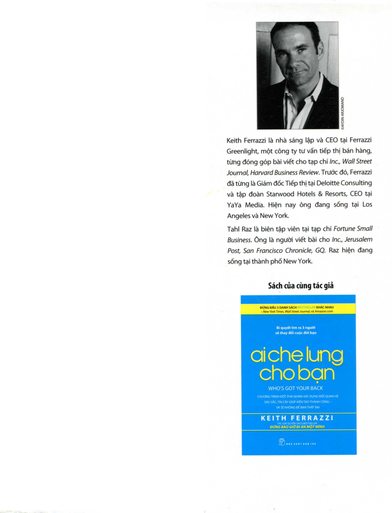
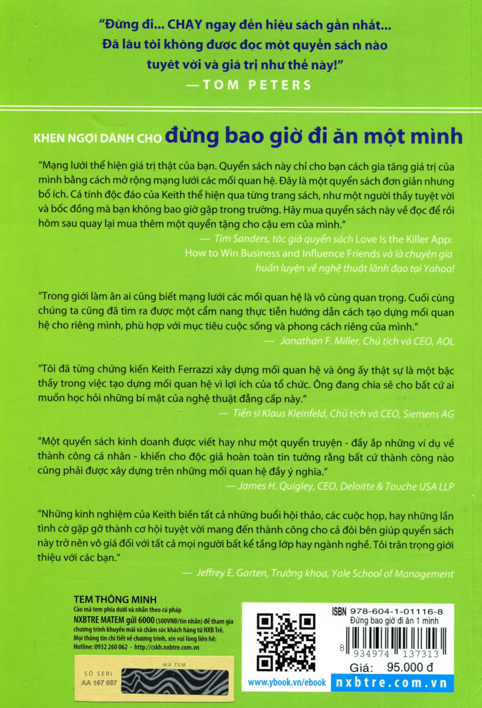

# Lời Kết & Về Tác Giả

## Về tác giả Keith Ferrazzi

**Keith Ferrazzi** là nhà sáng lập và CEO tại Ferrazzi Greenlight, một công ty tư vấn tiếp thị bán hàng, và là cựu Giám đốc Tiếp thị (CMO) tại Starwood Hotels and Resorts cũng như Deloitte Consulting.

Ông tốt nghiệp Đại học Yale và Trường Kinh doanh Harvard (HBS). Ông thường xuyên xuất hiện trên các kênh truyền hình lớn như CNN, CNBC và là diễn giả hàng đầu thế giới về kỹ năng lãnh đạo và kết nối.

---

## Bìa sau

