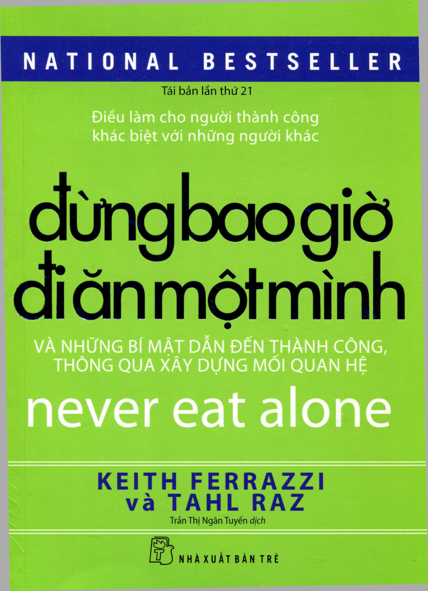
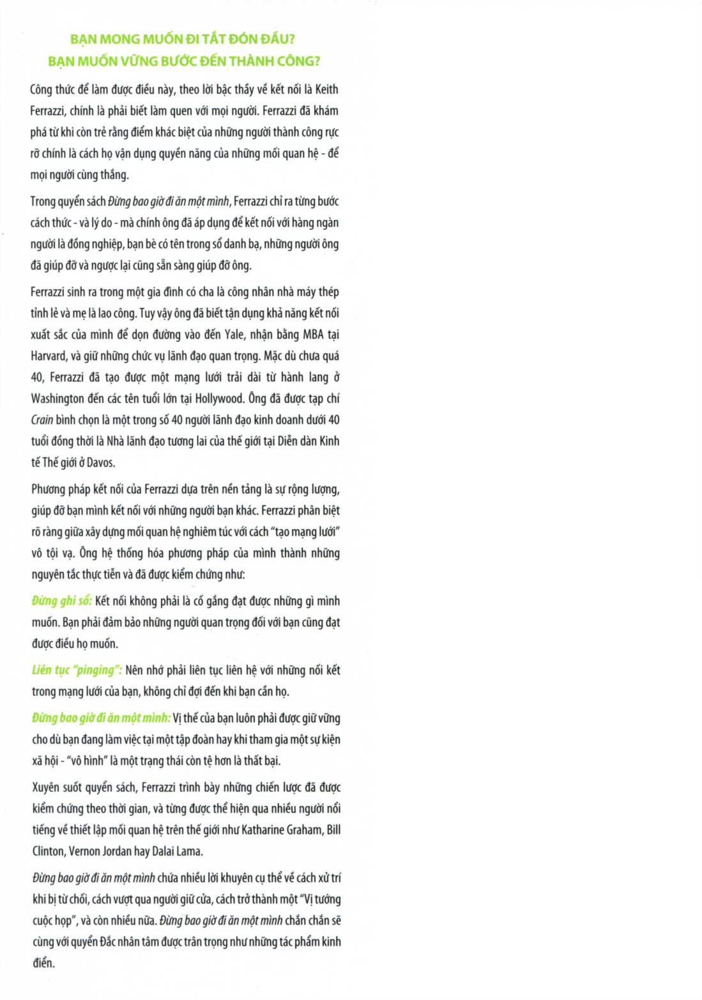
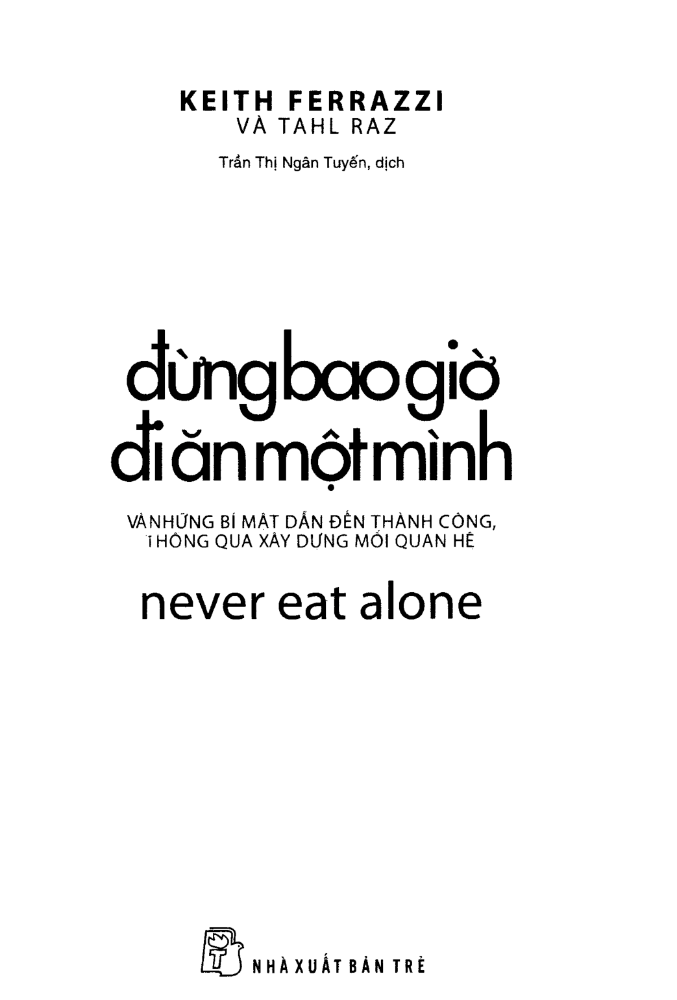
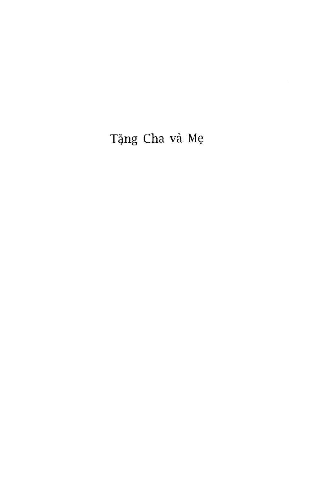

# Đừng Bao Giờ Đi Ăn Một Mình
*(Never Eat Alone)*

**Tác giả:** Keith Ferrazzi & Tahl Raz  
**Người dịch:** Trần Thị Ngân Tuyến  
**Nhà xuất bản:** NXB Trẻ  

---

## Bìa sách

---

## Trang tiêu đề & Thông tin xuất bản

> **ĐỪNG BAO GIỜ ĐI ĂN MỘT MÌNH**  
> *Và những bí mật dẫn đến thành công thông qua xây dựng mối quan hệ*  
> *Nguyên bản tiếng Anh: Never Eat Alone*  
> *Bản quyền tiếng Việt thuộc Nhà xuất bản Trẻ.*  

---

## Lời đề tặng

> *Tặng Cha và Mẹ*

---

## Mục lục tổng quan

- [Lời giới thiệu & Thông tin xuất bản](00_gioi_thieu_va_muc_luc.md)

### PHẦN 1: XÁC ĐỊNH QUAN ĐIỂM
1. [Chương 1: Ghi danh thành viên câu lạc bộ](chuong_01_ghi_danh_thanh_vien_cau_lac_bo.md)
2. [Chương 2: Đừng ghi sổ](chuong_02_dung_ghi_so.md)
3. [Chương 3: Sứ mệnh của bạn là gì?](chuong_03_su_menh_cua_ban_la_gi.md)
   - *Tiểu sử người nổi tiếng: Bill Clinton*
4. [Chương 4: Hãy xây dựng sẵn trước khi cần đến](chuong_04_hay_xay_dung_san_truoc_khi_can_den.md)
5. [Chương 5: Cảm hứng táo bạo](chuong_05_cam_hung_tao_bao.md)
6. [Chương 6: Tạo mối quan hệ một cách tích cực](chuong_06_tao_moi_quan_he_mot_cach_tich_cuc.md)
   - *Tiểu sử người nổi tiếng: Katharine Graham*

### PHẦN 2: CÁC KỸ NĂNG
7. [Chương 7: Soạn bài tập ở nhà](chuong_07_soan_bai_tap_o_nha.md)
8. [Chương 8: Ghi nhớ tên](chuong_08_ghi_nho_ten.md)
9. [Chương 9: Hâm nóng những cuộc gọi lạnh](chuong_09_ham_nong_nhung_cuoc_goi_lanh.md)
10. [Chương 10: Vượt qua người giữ cửa](chuong_10_vuot_qua_nguoi_giu_cua.md)
11. [Chương 11: Đừng bao giờ đi ăn một mình](chuong_11_dung_bao_gio_di_an_mot_minh.md)
12. [Chương 12: Chia sẻ đam mê](chuong_12_chia_se_dam_me.md)
13. [Chương 13: Theo dõi hay thất bại](chuong_13_theo_doi_hay_that_bai.md)
14. [Chương 14: Biến mình thành viên tướng hội thảo](chuong_14_bien_minh_thanh_vien_tuong_hoi_thao.md)
15. [Chương 15: Kết nối với người nối kết](chuong_15_ket_noi_voi_nguoi_noi_ket.md)
    - *Tiểu sử người nổi tiếng về kết nối: Paul Revere*
16. [Chương 16: Mở rộng mạng lưới](chuong_16_mo_rong_mang_luoi.md)
17. [Chương 17: Nghệ thuật nói chuyện xã giao](chuong_17_nghe_thuat_noi_chuyen_xa_giao.md)
    - *Tiểu sử người nổi tiếng: Dale Carnegie*

### PHẦN 3: BIẾN NỐI KẾT THÀNH BẠN ĐỒNG HÀNH
18. [Chương 18: Sức khỏe, của cải và con cái](chuong_18_suc_khoe_cua_cai_va_con_cai.md)
19. [Chương 19: Môi giới xã hội](chuong_19_moi_gioi_xa_hoi.md)
    - *Tiểu sử người nổi tiếng: Vernon Jordan*
20. [Chương 20: Pinging - mọi lúc mọi nơi](chuong_20_pinging_moi_luc_moi_noi.md)
21. [Chương 21: Tìm cột neo và làm họ hài lòng](chuong_21_tim_cot_neo_va_lam_ho_hai_long.md)

### PHẦN 4: TRAO ĐỔI - CHO VÀ NHẬN
22. [Chương 22: Thể hiện bản thân đáng làm quen](chuong_22_the_hien_ban_than_dang_lam_quen.md)
    - *Tiểu sử người nổi tiếng: Dalai Lama*
23. [Chương 23: Xây dựng thương hiệu cá nhân](chuong_23_xay_dung_thuong_hieu_ca_nhan.md)
24. [Chương 24: Quảng cáo thương hiệu](chuong_24_quang_cao_thuong_hieu.md)
25. [Chương 25: Công việc viết lách](chuong_25_cong_viec_viet_lach.md)
26. [Chương 26: Tiếp cận quyền lực](chuong_26_tiep_can_quyen_luc.md)
27. [Chương 27: Xây dựng hôm nay, gặt hái ngày mai](chuong_27_xay_dung_hom_nay_gat_hai_ngay_mai.md)
    - *Tiểu sử người nổi tiếng: Benjamin Franklin*
28. [Chương 28: Đừng bao giờ kiêu căng](chuong_28_dung_bao_gio_kieu_cang.md)
29. [Chương 29: Tìm người đỡ đầu, tìm người để đỡ đầu, lại quay về tìm người đỡ đầu](chuong_29_tim_nguoi_do_dau.md)
    - *Tiểu sử người nổi tiếng: Eleanor Roosevelt*
30. [Chương 30: Cân bằng là một khái niệm nhảm nhí](chuong_30_can_bang_la_mot_khai_niem_nham_nhi.md)
31. [Chương 31: Thời đại nối kết](chuong_31_thoi_dai_noi_ket.md)

### PHẦN KẾT
- [Lời kết & Về tác giả](99_loi_ket_va_ve_tac_gia.md)
