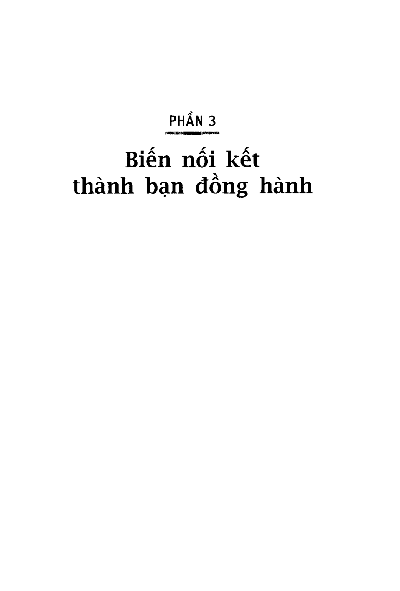

# Chương 18: Sức khỏe, của cải và con cái

*Phần 3: Biến nối kết thành bạn đồng hành*

---

“Thật sự anh muốn gì?” Năm chữ này có thể nói là cụm từ phổ biến nhất trong tiếng Anh. Như tôi đã trình bày trong chương “Sứ mệnh của bạn là gì?”, câu trả lời cho câu hỏi “Thật sự anh muốn gì?” sẽ quyết định tất cả những gì bạn làm và đóng góp của mọi người xung quanh để giúp bạn đạt được ước nguyện. Nó đề ra phác thảo cho những nỗ lực của bạn để tìm và kết nối với mọi người. Tương tự, khi bạn hiểu được sứ mệnh của người khác, bạn nắm trong tay chìa khóa mở những cánh cửa có ý nghĩa nhất đối với họ. Biết được thông tin này sẽ giúp bạn tạo dựng những mối quan hệ sâu sắc và lâu bền.

Khi mới tiếp xúc với ai đó, cho dù đó là một người tôi sẽ đỡ đầu hay chỉ là một đối tác kinh doanh, tôi đều cố gắng tìm hiểu động lực của họ. Những động lực khác nhau rồi cũng thường quy về ba điều chính yếu: kiếm tiền, kiếm tình, hay thay đổi thế giới. Bạn đừng cười - nhiều người cũng đã cười khi phải nhìn nhận bản chất thật sự của ước mong sâu lắng trong cuộc đơi mình.

Hãy cứ thoải mái trước thực tế này. Học làm một người nối kết theo một nghĩa nào đó cũng giống như học trở thành nhà trị liệu. Khi bạn càng đi sâu vào công việc này, bạn sẽ thấy mình càng giống một người quan sát kiên nhẫn về tâm lý con người. Bạn phải học để biết những điều người khác quan tâm và làm thế nào thỏa mãn những quan tâm này của họ. Nhờ vậy bạn có thể định danh “nhảm nhí” khi thấy người nào không trung thực với ngay chính bản thân họ.

Nhà xây dựng quan hệ thành công trên thực tế là tổng hợp hoàn hảo tử nhiều người khác nhau: chuyên gia tài chính, nhà trị liệu tình dục, và một người luôn làm việc tốt.

Kết nối là một triết lý trong cuộc sống. Nguyên tắc cơ bản là con người, tất cả mọi người, bất cứ ai bạn gặp, cũng là một cơ hội để bạn giúp đỡ hoặc được giúp đỡ. Tại sao tôi lại đặt nặng vấn đề phụ thuộc lẫn nhau? Trước hết là vì, do nhu cầu căn bản, chúng ta là những tế bào trong xã hội. Sức mạnh của chúng ta là do sự tích hợp của những điều chúng ta biết và chúng ta làm. Sự thực là, trong thế giới này, không ai đi lên mà không cần đến sự giúp đỡ.

Nếu loại bỏ những yếu tố ép buộc hay lửa lọc, chỉ cỏn một cách duy nhất để khiến người ta làm bất cứ điều gì bạn muốn. Bạn có biết cách này không?

Đây không phải là một câu hỏi cho vui trong chương trình trò chơi truyền hình. Kinh doanh, nói cho củng, là khả năng kêu gọi một nhóm người để biến ý tưởng từ giai đoạn khái niệm đến thực tiễn, để áp dụng một lý thuyết vào thực tế, để thuyết phục được sự ủng hộ của nhân viên và đồng nghiệp, để khuyến khích mọi người triển khai kế hoạch của bạn.

Nếu bạn vẫn còn phân vân chưa dám trả lời, hãy cứ mạnh đạn lên; nhiều người không được vậy đâu. Mỗi năm trên thế giới có hàng trăm quyển sách mới được xuất bản để hướng dẫn làm thế nào tạo được động lực và sự trung thành. Đa số đều đưa ra câu trả lời sai.

Họ sai vì những giả định của họ sai. Mọi người chạy theo thời thượng và tuyên bố: Mọi thứ đều mới cả! Mọi thứ đều khác xưa! Kinh doanh bây giờ đã thay đổi! Người ta cho rằng câu trả lời phải đến từ công nghệ mới hay các dạng lãnh đạo mới hay các lý thuyết về tổ chức rất buồn cười. Nhưng về mặt con người thì sao, có gì mới hay khác biệt nhiều không? Chưa hẳn.

Nguyên tắc làm việc với người khác chính là những nguyên tác được Dale Carnegie ủng hộ cách đây hơn 70 năm và đã được chứng minh là phổ quát và trường tồn theo thời gian.

Cách duy nhất để khiến người khác làm bất cứ điều gì là phải công nhận tầm quan trọng của họ, từ đó làm cho họ thấy mình quan trọng. Sự khát khao sâu thẳm cả đời của mỗi người là được trở nên quan trọng và được mọi người nhìn nhận.

Để thể hiện sự công nhận và khen ngợi thoải mái một người nào đó, có cách nào tốt hơn là quan tâm đến họ và tìm hiểu sứ mệnh cuộc đời của họ?

Tìm hiểu biết được người ta quan tâm đến điều gì nhất còn mang lại thêm một tầng lợi ích nữa. Giúp đỡ ai đó để họ đạt được khao khát sâu thẩm không chỉ quan trọng khi cần tạo kết nối với họ mà còn cần thiết để giữ cho mối liên hệ này được vững bền và ngày càng thắt chặt. Trung thành có thể là một đức tính không còn mấy ai quan tâm trong thời đại ngày nay, nhưng nó vẫn là dấu hiệu xác tín của một mối quan hệ vững chắc và nhiều công ty đang tìm mọi cách đưa nó vào trong thói quen tác nghiệp hàng ngày của mình.

Trung thành, theo thiển ý của tôi, là thể hiện thực trước ai đó (hoặc điều gì đó, như một thương hiệu hay một phân khúc khách hàng) cho dù trong tình huống tốt hay xấu. Trung thực là một quá trình chứ không phải chỉ có một sớm một chiều. Ai làm giám đốc nhãn hiệu cũng biết đấy, bạn không thể thu phục được sự trung thành của khách hàng trong tích tắc. Bạn phải lao động vất vả mới mong được nhận lại. Nhưng làm thế nào?

Để tôi kể cho bạn câu chuyện về Michael Milken. Mike là một người nổi tiếng trong lĩnh vực tài chính và thương lượng, nhưng đồng thời ông cũng là một nhà tử thiện và người phân tích hành vi con người đầy thuyết phục. Thông qua Entertainment Media Ventures (EMV) Mike đã đầu tư vào công ty mới thành lập mà tôi về đầu quân sau thời gian làm tại Starwood. Và, trong giai đoạn làm CEO tại đây, tôi đã nói thẳng với ông và cô bạn Sandy Climan, người điều hành EMV, rằng một động lực mạnh thúc đẩy tôi nhân công việc này là được học hỏi từ Mike. Trước đó mấy năm tôi đã quen biết Mike một cách độc lập khi còn là cố vấn cho DuPont, khi công ty bắt đầu thành lập liên doanh sản xuất sữa đậu nành. Mike là một người mà tôi vẫn luôn muốn được gặp gỡ - một trong những tên tuổi đáng khao khát của tôi. Tôi khám phá qua một số bài báo viết về ông rằng ông rất quan tâm đến đậu nành cũng như tác dụng chữa bệnh của nó. Ông đã từng bị ung thư tuyến tiền liệt, từ đó thúc đẩy ông đam mê công tác chăm sóc sức khỏe và chú trọng đến tầm quan trọng của các loại thuốc phòng ngừa. Đối với Mike, ăn uống là một thành tố không thể thiếu khi nhắc đến sức khỏe, nó trở thành một niềm đam mê cá nhân và một chủ đề từ thiện.

Ngay từ những tháng ngày đầu tiên làm CEO, tôi đã tìm cách xây dựng công ty lớn mạnh và củng cố mối quan hệ của mình với Mike. Ngược lại, ông cũng chấp nhận giúp đỡ tôi và mở cho tôi cánh cửa bước vào thế giới của ông.

Nếu ông phải đi New York để tham gia vận động ủng hộ từ thiện cho CapCure, tổ chức tài trợ nghiên cứu khoa học để tìm phương thức chữa trị căn bệnh ung thư tiền liệt tuyến, hay phải đi đến một nơi nào đó để trao giải thưởng dành cho những giáo viên xuất sắc từ Quỹ Milken Family Foundation, tôi đều cố tranh thủ được đi theo. Mục tiêu duy nhất của tôi là quan sát cách ông làm việc và may ra học hỏi thêm được ít nhiều. Tôi đặt ra chỉ tiêu là mình cũng phải tìm đến khách hàng hoặc tiềm năng tại bất cứ thành phố nào ông đặt chân đến, do đó đây cũng là thời gian quý báu đối với YaYa.

Trong đa số trưởng hợp, chúng tôi thường ngồi làm việc trong im lặng. Ông sẽ lục lợi trong hàng chục túi đựng sách mà ông tha theo bất cứ đi đâu, và tôi thì đĩ nhiên là hùng hục gõ máy tính, gửi email, săn lùng các mối quan hệ để mang lại doanh thu và phát triển kinh doanh cho YaYa. Chỉ cần quan sát cách ông đọc hay cách ông tư duy và diễn giải cũng học được nhiều điều.

Có một lần trên chuyến đi, Mike và tôi bắt đầu trò chuyện về niềm đam mê của mỗi người, những điều thật sự quan trọng đối với mọi người. Chính lần đó tôi đã hiểu thêm rất nhiều về con người và lòng trung thành. Bạn biết rồi đó, Mike không chỉ là một bộ óc tính toán xuất sắc, ông còn là một nghệ sĩ trong việc xây dựng quan hệ.

Tôi đã từng thấy ông dành hàng nhiều giở nói chuyện với những người mà bạn không thể nghĩ rằng ông có thể quan tâm đến: thư ký, những người rất già hoặc rất trẻ, người có quyền và người trắng tay. Ông yêu quý mọi người, thích những câu chuyện của họ, và thú vị trước cách họ nhìn nhận thế giới. Khi tôi nhắc điều này với ông, tôi được ông nhác nhở về Ralph Wado Emerson, người đã từng phát biểu: “Mỗi người tôi gặp đều có những điểm giỏi hơn tôi. Tôi học tử họ.” Ai cũng có một điều gì đó để dạy lại ông.

Sự quan tâm đến con người chính là lý do khiến nhiều người thể hiện lỏng trung thành với ông. Tôi cũng cảm nhận được sự trung thành này của mình dành cho ông. Tôi hỏi ông tại sao nhiều người dành công sức xây dựng mối quan hệ với ông. Có điều gì ông biết mà người khác không biết chăng? Mike suy nghĩ một lúc lâu, như cách ông thể hiện khi ông đặc biệt thích (hoặc không thích) một câu hỏi. Sau đó ông mỉm cười.

“Keith," ông nói, “trên thế gian này có ba điều tạo nên sự gắn kết sâu sắc giữa con người với nhau. Đó là sức khỏe, của cải, và con cái.”

Có rất nhiều thứ chúng ta có thể làm cho người khác: đưa ra những lời khuyên bổ ích, giúp họ rửa xe, hoặc giúp họ dọn nhà. Nhưng sức khỏe, của cải và con cái tác động đến ta khác hơn so với những hành động tử tế khác.

Khi bạn giúp ai đó về một vấn đề sức khỏe, hay tác động tích cực đến của cải của họ, hay thể hiện mối quan tâm thật sự đến con cái họ, bạn sẽ tạo ra sự trung thành gắn kết cả đời.

Kinh nghiệm của Mike thật ra đã được kiểm chứng bằng nghiên cứu khoa học. Nhà tâm lý học Abraham Maslow đã đưa ra lý thuyết về tháp nhu cầu của con người. Chúng ta đều có cùng những nhu cầu, như Maslow tin tưởng, và chúng ta phải được thỏa mãn những nhu cầu căn bản trước khi đề cập đến nhu cầu cao hơn.

Nhu cầu cao nhất của con người, theo Maslow là tự thể hiện bản thân - niềm khát khao được thể hiện hết sức mình. Dale Carnegie cũng công nhận điều này. Nhưng Maslow lý luận rằng chúng ta không thể thỏa mãn nhu cầu này nếu chúng ta chưa giải quyết những nhu cầu nằm dưới đáy kim tự tháp, những nhu cầu cần thiết để tồn tại, nhu cầu an toàn, và nhu cầu tình cảm. Chính trong nhóm nhu cầu dưới đáy kim tự tháp này - nơi sức khỏe, của cải và con cái ngự trị - là nơi theo Mike sẽ hình thành lỏng trung thành. Khi đề cập đến những vấn đề căn bản này, bạn sẽ đạt được hai điểm: 1) Bạn giúp người khác thỏa mãn những nhu cầu tối thiết đối với họ, và 2) Bạn giúp họ có cơ hội tiến lên những nắc thang nhu cầu cao hơn của kim tự tháp.

Tôi nhìn lại kinh nghiệm bản thân mình và nhận thấy ý kiến của ông hoàn toàn đúng.

Gần đây, tôi có một người bạn bị chẩn đoán ung thư tiền liệt tuyến. Nhờ có mối quan hệ tốt với tổ chức CapCure, tôi biết vị bác sĩ hàng đầu tại đây. Tôi gọi điện hỏi ông có thể dành ít thời gian cho bạn tôi hay không. Một người bạn khác, Mehmet Oz, điều hành Viện Tim tại ĐH Columbia, nhà sáng lập đồng thời là giám đốc Chương trình Y tế Bổ trợ tại Bệnh viện Giáo hội Trưởng lão New York, luôn sẵn sàng tiếp nhận giúp đỡ những người do tôi giới thiệu đến.

Tôi hiểu rất rõ từ kinh nghiệm bản thân trong giai đoạn băn khoăn lo lắng như thế này một ý kiến dặn dò của chuyên gia đáng giá hơn toàn bộ của cải trên thế giới. Trong suốt quá trình cha tôi bị căn bệnh liên quan đến tim, một người bạn của gia đình là Arlene Treskovich đang làm việc cho một trong những vị bác sĩ chuyên khoa tim giỏi nhất tại Pittsburgh, đã giúp chúng tôi nhận được những lời tư vấn sức khỏe mà hiếm có mấy gia đình thuộc tầng lớp lao động tại Pittsburgh đủ tiền để trả. Bà ấy chỉ làm những gì bà được dạy; mẹ của bà, bà Marge, đã làm việc cho Bệnh viện Latrobe và từng nhận trách nhiệm đảm bảo cho mọi thành viên trong gia đình chúng tôi hoặc bạn bè của gia đình nếu chẳng may phải nằm viện đều được đối xử như bậc vương giả, cho dù nhiều khi chỉ là một phần Jell-O khi nhà bếp đã đóng cửa. Đến bây giở, tôi sẵn lòng làm bắt cứ điều gì chỉ cần Arlene lên tiếng.

Nhưng nhiều khi chỉ đơn giản là ta thể hiện mối quan tâm và ủng hộ về mặt tỉnh thần. Để tôi lấy một ví dụ. Robin Richards là vị chủ tịch sáng lập trang chủ MP3.com và đưa nó thành một trong những công ty Internet nổi đình nổi đám nhất trên thế giới. Ông đã khéo léo lèo lái MP3.com qua khỏi giai đoạn khó khăn trước khi bán cho Vivendi Universal; công ty nảy sau đó lại thuê ông làm một thành viên điều hành chủ chốt. Tôi gặp Robin khoảng thời gian này vì ông đang đứng đầu nhóm thương lượng mua lại công ty chúng tôi.

Cuộc thương lượng đã không thành công, nhưng trong quá trình này, tôi được biết Robin có một đứa con nhỏ mắc một dạng ung thư rất khủng khiếp. Khi ông chia sẻ thông tin rất riêng tư và đầy đau đớn này với tôi trong một bữa tiệc tối, cái không khí ngột ngạt thường thấy sau cuộc thương lượng đã vút bay qua cửa sổ. Chúng tôi nói về những kinh nghiệm cả hai đã trải qua và tôi giới thiệu ông với Mike, người cũng rất mong muốn tìm ra phương thuốc chữa trị dang ung thư này. Robin và tôi đến giờ vẫn là bạn tốt của nhau, và tôi biết cả hai đều sẵn sàng làm mọi việc để giúp nhau.

Bạn có bao giờ giúp ai giảm cân bằng cách cho họ một lời khuyên hữu ích về chế độ dinh dưỡng không? Bạn có phát hiện ra một vitamin đặc biệt tốt cho sức khỏe và giới thiệu nó cho mọi người chưa? Những chuyện này có vẻ như rất nhỏ nhặt. Nhưng khi nó liên quan đến ba vấn đề ở trên, trong đó có sức khỏe và dinh dưỡng, thì những điều dù nhỏ nhặt cũng mang lại ý nghĩa thật lớn lao.

Khi nhắc đến của cải, tôi nghĩ đến rất nhiều nam thanh nữ tú mà tôi đã giúp họ tìm được công việc. Mặc dù việc này không thể so sánh với việc giúp ai đó kiếm được hàng triệu đô tử những công cụ tài chính độc đáo như Mike đã làm với nhiều người, một công việc ổn định dẫu sao cũng làm thay đổi hoàn toàn tình hình tài chính của họ. Nếu một người tôi quen biết cần tìm việc, tôi thường nhờ đến mạng lưới của mình để giới thiệu. Nếu họ đã tìm được một công việc yêu thích, tôi sẽ gọi đến cho người có thẩm quyền quyết định. Đôi khi tôi chỉ giúp cho người ta chỉnh sửa lại bản sơ yếu lý lịch, hoặc nhận lời đóng vai người nhận xét. Tôi làm bất cứ chuyện gì có thể. Và tôi cũng thực hiện đúng như thế trong kinh doanh. Chẳng hạn, với nhà hàng tôi thường xuyên lui tới, tôi đặt ra mục tiêu phải giới thiệu cho càng nhiều người đến càng tốt. Tôi đầu tư công sức tìm ra khách hàng cho những người trong mạng lưới của tôi là nhà tư vấn, nhà cung cấp, người bán hàng của đủ loại sản phẩm dịch vụ. Tôi biết họ là người tốt, tôi tin tưởng họ, và tôi muốn người khác cũng được hưởng lợi tử khả năng chuyên môn của họ như tôi.

Con cái có ý nghĩa rất lớn đối với mọi người. Tôi tự nhận trách nhiệm làm người đỡ đầu cho các em. Công việc này rất vui, thú vị, và truyền dạy là một phương pháp tuyệt vời để học hỏi. Lòng trung thành mà tôi nhận được khi gửi giúp con cháu ai đó vào thực tập, hoặc tại công ty tôi hay công ty bạn tôi, thật không diễn tả hết.

Để tôi kể cho bạn về kinh nghiệm của tôi với Jack Valenti, cựu Chủ tịch và Giám đốc Hiệp hội Điện Ảnh. Valenti sinh ra tại 'Texas, từng theo học Harvard, và có một cuộc đời thật sôi động: phi công máy bay ném bom trong thời chiến, nhà sáng lập công ty quảng cáo, nhà tư vấn chính trị, Cố vấn đặc biệt cho Nhà Trắng, và nhà lãnh đạo ngành công nghiệp điện ảnh. Ông biết _ mò sò

Đừng bao giờ đi ăn một mình

tất cả mọi người; quan trọng hơn, những người biết ông đều rất kính trọng ông (nhất là trong một ngành công nghiệp không có khuynh hướng dành sự kính trọng cho bất cứ ai).

Valenti là một người tôi khao khát được gặp trong suốt một thời gian dài. Tôi chưa bao giờ cố công theo đuổi ông, nhưng tôi biết ông là một người rất thú vị nếu được làm quen, một gã trai người Ý cật lực xây dựng thành công từ con số 0. Tôi đoán chắc chúng tôi có rất nhiều điểm tương đồng.

Cuộc gặp gỡ đầu tiên của chúng tôi diễn ra hoàn toàn tình cở. Tôi tham dự bữa trưa dành cho các thành viên quốc hội tại Hội nghị toàn quốc Đảng Dân chủ tổ chức ở Los Angeles trong năm cuối cùng đương chức của tổng thống Clinton. Tôi bắt gặp Jack cũng là một trong số những người tham dự. Khi đến lúc ngồi vào bàn, tôi tìm cách sao cho chúng tôi được ngồi cạnh nhau.

Buổi trò chuyện chiều hôm đó phải nói là tốt đẹp, thú vị, và hơi lịch sự. Lúc đó tôi không có mục tiêu cụ thể nào. Tôi chỉ hy vọng nó trở thành một bước đệm để đi đến một điều gì đó lớn lao hơn sau này.

Không lâu sau, một người bạn gọi điện cho tôi vì biết rằng tôi là người rất đam mê công việc đỡ đầu. “Anh biết không, con trai của Jack Valenti đang tìm việc làm trong ngành của anh đấy. Tôi nghĩ anh nên gặp và cho cậu bé một vài lời khuyên.”

Con trai của Jack là một người rất nổi bật, sáng dạ và dễ thương. Tôi cho cậu bé vài lời khuyên, giới thiệu cậu cho vài nhân vật chủ chốt trong ngành mà cậu nên biết, tất cả chỉ có thế.

Vài tháng sau, tôi lại gặp Jack tại hội nghị CEO của Yale.

“Jack”, tôi nói, “tôi biết ông không nhớ tôi đâu. Chẳng có lý do gì khiến ông phải nhớ tôi cả. Chúng ta từng ngồi cạnh nhau tại bữa trưa ở hội nghị Đảng Dân chủ. Nhưng tôi có gặp con trai ông cách đây vài tháng và cho cậu ấy vài lời khuyên nghề nghiệp. Cho tôi hỏi thăm cậu ấy giờ sao rồi?”

Jack bỏ ngang tất cả những gì ông đang làm và thể hiện sự quan tâm chăm chú. Ông đặt cho tôi rất nhiều câu hỏi về con trai mình và cách nào tốt nhất để đặt chân vào ngành của tôi.

Tôi nhấn mạnh cuộc tiếp xúc lần này bằng một lời mời tham dự tiệc tối vào ngày hôm sau, cùng với nhiều nhân vật chính trị và giải trí khác.

“Chắc rồi, tôi sẽ đến buổi tiệc nếu tôi có thời gian," ông nói. “Nhưng quan trọng hơn, tôi muốn chúng ta gặp nhau ăn trưa hôm nào đó, giữa ông, tôi và con trai tôi.”

Jack rõ ràng không quan tâm lắm đến lời mời ăn tối của tôi. Biết đâu được? Nhưng ông rất quan tâm cho con trai mình. Jack xem trọng lời mời của tôi, và thể hiện sự hào hứng nhiều hơn bình thường nếu trước đó tôi không có cơ hội được đặn đỏ con trai ông vài lời dù rất bình thường và đơn giản.

Nhiều người cho rằng chỉ cần một lời mời là đã đủ để tạo nên sự trung thành. Từ lúc tôi còn làm cho Deloitte, cũng như hiện nay khi tôi có công việc tư vấn riêng, rất nhiều người cho rằng cách xây dựng lòng trung thành ở khách hàng là dẫn họ đi đến một bữa tiệc hào nhoáng, hay đến một trận thi đấu thể thao, hay một buổi trình diễn nào đó. Thậm chí bản thân tôi cũng đã từng bị rơi vào cái bẫy này. Trong giai đoạn đầu của mối quan hệ, đây là những dịp để bạn nối kết sâu đậm với đối phương để giúp họ giải quyết những vấn đề họ đang quan tâm. Ngoài ra, chúng tôi cũng khuyến khích những khách hàng của mình thuộc nhóm Fortune 100 hãy bắt đầu mời khách hàng hiện tại và tiềm năng về nhà của các vị lãnh đạo dùng bữa tối, gặp gỡ gia đình, và tìm hiểu thêm những cách khác nhau họ có thể giúp cho khách hàng thật sự với tư cách cá nhân.

Nhưng hãy nhớ, nếu bạn sắp giải quyết những vấn đề tối quan trọng với người khác, hãy dành cho chúng sự tận tâm xứng đáng. Nếu không, ý định tốt cũng trở thành tôi. Không gì làm cho người ta nổi giận bằng việc bạn hứa hẹn giúp đỡ một cách chân thành rồi bỏ trốn.

Bạn có làm được không? Nói thì rất dễ: “Tôi quan tâm đến mọi người. Tôi tin tưởng vào việc phải giúp đỡ và được giúp đỡ. Tôi tin rằng giúp đỡ người khác về sức khỏe, giúp họ kiếm tiền, giúp họ nuôi dạy con cái thành công là mục tiêu cao cả trong cuộc đời.” Nhiều người đã từng nói rất huyênh hoang - nhưng khi bạn nhìn vào hành động của họ, bạn nghe chính những người trong mạng lưới của họ nói về họ, và bạn khám phá ra rằng họ không tin vào bất cứ lời nào của mình. Tôi đảm bảo với bạn rằng những thành viên trong mạng lưới của bạn sẽ phơi bày sự thật một cách nhanh chóng và nhắc đi nhắc lại cho tất cả mọi người.

Bạn phải bắt đầu từ đâu? Hãy bất đầu với quan điểm triết lý, nhân sinh quan, rằng mọi cá nhân là một cơ hội giúp đỡ và được giúp đỡ. Những gì tiếp nối - có thể là giúp đỡ về mặt sức khỏe, của cải, con cái, hay bất cứ khao khát nào - sẽ tự động hiện ra.
