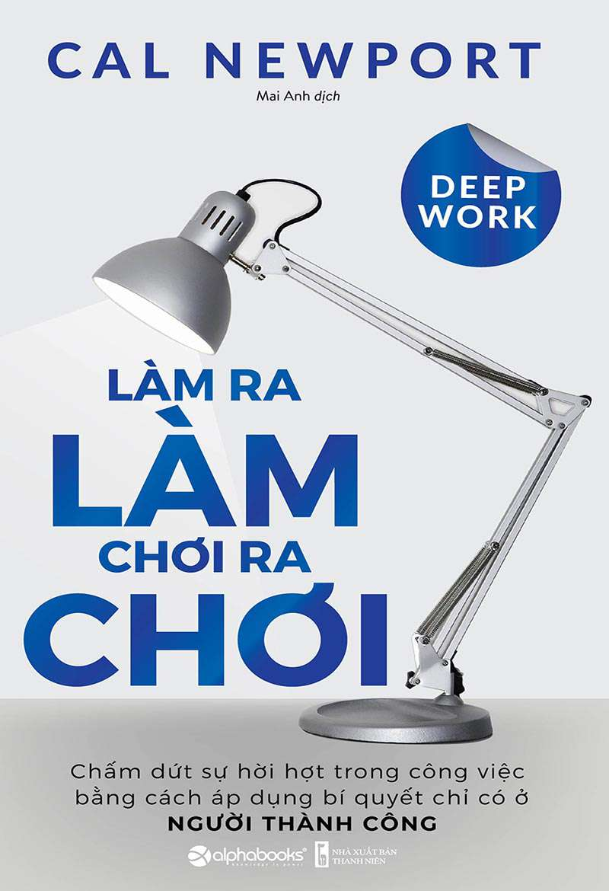

# LÀM RA LÀM, CHƠI RA CHƠI (Deep Work)

- **Tác giả:** Cal Newport
- **Dịch giả:** Mai Anh
- **Nhà xuất bản:** Alpha Books - NXB Thanh Niên
- **Tên gốc:** Deep Work: Rules for Focused Success in a Distracted World

---

## Giới Thiệu Tác Phẩm

**Làm Ra Làm, Chơi Ra Chơi** (*Deep Work: Rules for Focused Success in a Distracted World*) của Giáo sư khoa học máy tính kiêm tác giả best-seller Cal Newport là một trong những cuốn sách kinh điển và có ảnh hưởng sâu rộng nhất về kỹ năng làm việc trong thời đại số.

Trong một thế giới ngập tràn sự sao lãng – nơi email, mạng xã hội và các thông báo liên tục cắt vụn sự chú ý của chúng ta – hầu hết mọi người đang rơi vào cái bẫy của **Làm việc hời hợt** (*Shallow Work*): bận rộn cả ngày nhưng không tạo ra giá trị đột phá. Ngược lại, **Làm việc sâu** (*Deep Work*) – khả năng tập trung cao độ, không phân tâm vào các tác vụ đòi hỏi tư duy nhận thức cao – chính là năng lực cốt lõi giúp bạn:
- Nhanh chóng làm chủ những kiến thức và kỹ năng khó.
- Sản xuất ra những thành quả xuất sắc, vượt trội trong thời gian ngắn hơn.
- Tìm thấy sự thỏa mãn, ý nghĩa sâu sắc và niềm vui thực sự trong công việc và cuộc sống.

Cuốn sách chia làm 2 phần lớn: **Phần 1 - Ý tưởng** (giải thích lý do khoa học và kinh tế vì sao Deep Work có giá trị phi thường nhưng ngày càng hiếm hoi) và **Phần 2 - Các quy tắc** (bộ 4 quy tắc thực chiến giúp bạn rèn luyện năng lực làm việc sâu mỗi ngày).

---

## Mục Lục Chi Tiết

1. [Trang bìa & Thông tin sách](00_Trang_bia_va_muc_luc.md)
2. [Lời giới thiệu](01_Loi_gioi_thieu.md)
3. [Lời mở đầu](02_Loi_mo_dau.md)
4. [Phần 1: Ý tưởng - Chương một: Làm việc sâu thật đáng giá](03_Phan_1_Chuong_1_Lam_viec_sau_that_dang_gia.md)
5. [Chương hai: Trạng thái làm việc sâu rất ít khi xuất hiện](04_Phan_1_Chuong_2_Trang_thai_lam_viec_sau_rat_it_khi_xuat_hien.md)
6. [Chương ba: Làm việc sâu có ý nghĩa](05_Phan_1_Chuong_3_Lam_viec_sau_co_y_nghia.md)
7. [Phần 2: Các quy tắc - Quy tắc số 1: Làm việc sâu](06_Phan_2_Quy_tac_1_Lam_viec_sau.md)
8. [Quy tắc số 2: Tận dụng sự buồn chán](07_Phan_2_Quy_tac_2_Tan_dung_su_buon_chan.md)
9. [Quy tắc số 3: Thoát khỏi truyền thông xã hội](08_Phan_2_Quy_tac_3_Thoat_khoi_truyen_thong_xa_hoi.md)
10. [Quy tắc số 4: Loại bỏ những thứ hời hợt](09_Phan_2_Quy_tac_4_Loai_bo_nhung_thu_hoi_hot.md)
11. [Kết luận](10_Ket_luan.md)
