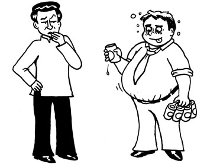
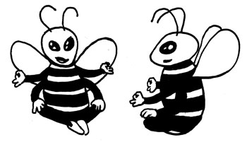

# Chương 1: THẬM CHÍ MỘT KỸ SƯ CŨNG CÓ THỂ THÀNH CÔNG VỀ TRÍ THÔNG MINH CẢM XÚC
### Trí thông minh cảm xúc là gì và phát triển nó như thế nào?

> *Thứ nằm phía sau chúng ta và thứ nằm phía trước chúng ta chỉ là vụn vặt so với thứ nằm bên trong chúng ta.*  
> — **Ralph Waldo Emerson**

Tôi muốn bắt đầu chuyến hành trình của chúng ta bằng một tinh thần lạc quan, một phần là do nếu bắt đầu bằng một tinh thần bi quan thì sách còn lâu mới bán được. Quan trọng hơn, dựa trên những kinh nghiệm giảng dạy tại Google và các nơi khác mà nhóm của tôi có được thì tôi lạc quan rằng, trí thông minh cảm xúc là một trong những chỉ báo tốt nhất về thành công trong công việc cũng như sự thỏa mãn trong cuộc sống, và ai cũng có thể được đào tạo để sở hữu nó. Với sự đào tạo đúng, bất cứ ai cũng có thể trở nên thông minh hơn về mặt cảm xúc. Với tinh thần “nếu Meng có thể nấu ăn thì bạn cũng có thể”, nếu chương trình đào tạo này có tác dụng với một kỹ sư nghiêm túc và cực kỳ nội tâm như tôi, thì có lẽ nó sẽ có tác dụng với bạn.

## TRÍ THÔNG MINH CẢM XÚC CƠ BẢN

*“Vì một lý do nào đó, Starfleet muốn tôi hoàn thành khóa học này. Anh thì sao?”*

Định nghĩa chuẩn nhất về trí thông minh cảm xúc là của hai người được coi là cha đẻ của khung lý thuyết về trí thông minh cảm xúc, Peter Salovey và John D. Mayer. Họ định nghĩa trí thông minh cảm xúc như sau:

> *Khả năng theo dõi cảm giác và cảm xúc của mình cũng như của người khác, phân biệt chúng, và sử dụng thông tin này để dẫn dắt tư duy và hành động của mình.*[^1]

Cuốn sách đột phá khiến chủ đề này trở nên phổ biến là *Emotional Intelligence: Why It Can Matter More Than IQ* (Trí tuệ xúc cảm) của Daniel Goleman, người bạn và cũng là người cố vấn của chúng tôi. Một trong những thông điệp quan trọng nhất của cuốn sách là năng lực cảm xúc không phải là bẩm sinh; chúng là những khả năng mà người ta có thể học hỏi được. Nói cách khác, bạn có thể chủ đích trang bị năng lực cảm xúc thông qua luyện tập.

Goleman đã xây dựng một cấu trúc rất hữu ích về trí thông minh cảm xúc bằng cách phân loại nó thành năm phần. Đó là:

1. **Khả năng am hiểu bản thân:** Kiến thức về các trạng thái bên trong, sở thích, nguồn lực, và trực giác của chính mình
2. **Khả năng kiểm soát bản thân:** Khả năng quản lý các trạng thái bên trong, các xung động, và nguồn lực của chính mình
3. **Động lực:** Những xu hướng cảm xúc dẫn dắt hoặc hỗ trợ việc đạt được mục tiêu
4. **Cảm thông:** Khả năng am hiểu cảm xúc, nhu cầu và mối quan tâm của người khác
5. **Kỹ năng xã hội:** Sự thành thạo trong việc gợi ra những phản ứng mong muốn bên trong người khác.

Salovey và Mayer không phải là những người duy nhất có công trình liên quan đến trí thông minh cảm xúc và xã hội. Ví dụ, Howard Gardner là người nổi tiếng vì đã đưa ra ý tưởng rằng có nhiều loại hình thông minh. Gardner cho rằng mọi người có thể thông minh theo những cách mà bài kiểm tra IQ không đo lường được. Ví dụ, một đứa trẻ có thể không giỏi làm toán, nhưng lại có năng khiếu về ngôn ngữ hoặc sáng tác nhạc, thì chúng ta nên coi cậu bé là thông minh. Gardner đã tạo ra một danh sách bảy loại hình thông minh (sau này tăng lên thành tám). Hai trong số đó, trí thông minh nội tâm cá nhân và trí thông minh tương tác cá nhân, có liên quan mật thiết đến trí thông minh cảm xúc. Gardner gọi chúng là “trí thông minh cá nhân”. Năm phần trí thông minh cảm xúc của Goleman vẽ ra rất đẹp con đường đi vào trí thông minh cá nhân của Gardner: bạn có thể coi ba phần trí thông minh cảm xúc đầu tiên là trí thông minh nội tâm cá nhân và hai phần sau là trí thông minh tương tác cá nhân.

Tôi thấy khá buồn cười là minh họa tốt nhất về việc trí thông minh cảm xúc là một năng lực có thể học hỏi được không phải đến từ một bài viết mang tính học thuật mà đến từ câu chuyện về Ebenezer Scrooge trong *A Christmas Carol*[^2] (Giáng Sinh Yêu Thương). Ở phần đầu câu chuyện, Scrooge là một minh chứng về trí thông minh cảm xúc thấp. Trí thông minh nội tâm cá nhân của ông quá thấp, ông không thể tạo ra sự thỏa mãn về mặt cảm xúc cho chính mình dù ông rất giàu. Thực tế, ông am hiểu bản thân rất kém, phải cần đến ba con ma để giúp ông hiểu về bản thân mình. Tất nhiên, trí thông minh tương tác cá nhân của ông thì siêu tồi. Tuy nhiên, gần cuối câu chuyện, Scrooge lại trở thành một ví dụ về trí thông minh cảm xúc cao. Ông đã phát triển khả năng am hiểu bản thân mạnh mẽ, có thể kiểm soát cảm xúc của mình, đồng thời các kỹ năng xã hội và khả năng cảm thông của ông cũng nở rộ. Scrooge là một minh chứng cho thấy trí thông minh cảm xúc là một thứ có thể được phát triển (trong phiên bản mà tôi xem, nó xuất hiện trong không gian của một bộ phim truyền hình dài hai tiếng với đủ thời gian dành cho quảng cáo, nhưng bản mà bạn xem có thể khác).

Ở phần sau của cuốn sách này, chúng ta sẽ kiểm tra chi tiết sự phát triển của từng phần trí thông minh cảm xúc. Thật may là việc này sẽ không cần đến những con ma Giáng sinh.

## NHỮNG LỢI ÍCH CỦA TRÍ THÔNG MINH CẢM XÚC

Có một câu hỏi quan trọng mà những người bạn của tôi trong lĩnh vực đào tạo gọi là câu hỏi thế thì sao, kiểu như, “Vâng, rất hay, nhưng thế thì trí thông minh cảm xúc có tác dụng gì cho tôi?”. Trong bối cảnh công sở, trí thông minh cảm xúc giúp trang bị ba bộ kỹ năng quan trọng: **Hiệu suất làm việc nổi bật**, **năng lực lãnh đạo xuất sắc**, và **khả năng tạo ra các điều kiện cho hạnh phúc**.

### Hiệu suất làm việc nổi bật
Điều đầu tiên trí thông minh cảm xúc giúp trang bị là hiệu suất làm việc nổi bật. Các nghiên cứu đã cho thấy năng lực cảm xúc quan trọng gấp đôi chuyên môn và kiến thức thuần túy trong việc tạo ra sự hoàn hảo[^3]. Một nghiên cứu của Martin Seligman, người được coi là cha đẻ của tâm lý học tích cực hiện đại và cũng là người tạo ra ý tưởng rằng tính lạc quan có thể học hỏi được, đã cho thấy rằng các nhân viên bán bảo hiểm lạc quan bán được nhiều hơn các đồng nghiệp bi quan 8% trong năm đầu tiên và 31% trong năm thứ hai[^4]. (Vâng, tôi lạc quan về việc viết ra một cuốn sách bán chạy nhất. Cám ơn vì bạn đã hỏi.)

Tôi không ngạc nhiên về điều này. Suy cho cùng, có nhiều công việc trong ngành bán hàng và dịch vụ khách hàng mà các năng lực cảm xúc rõ ràng có khả năng tạo ra sự khác biệt lớn. Bằng trực giác, chúng ta đã biết điều này rồi. Điều khiến tôi ngạc nhiên là nó đúng thậm chí cả với những người làm việc trong khu vực kỹ thuật như những kỹ sư giống tôi, những người mà bạn sẽ nghĩ rằng thành công chỉ dựa vào trí thông minh thuần túy. Theo một nghiên cứu thì sáu năng lực đứng đầu giúp phân biệt những người làm việc hiệu suất cao với những người làm việc bình thường trong khu vực kỹ thuật là (theo thứ tự này):

1. Khát khao đạt được thành tựu và tiêu chuẩn thành tựu cao
2. Khả năng gây ảnh hưởng
3. Tư duy khái niệm
4. Khả năng phân tích
5. Chủ động chấp nhận thử thách
6. Tự tin[^5].

Trong sáu năng lực này, chỉ có hai năng lực (khả năng phân tích và tư duy khái niệm) là những năng lực thuộc về trí thông minh thuần túy. Bốn năng lực kia, kể cả hai năng lực đứng đầu, là năng lực thuộc về cảm xúc.

Trí thông minh cảm xúc cao có thể giúp bất kỳ ai trở nên xuất sắc trong công việc, thậm chí cả kỹ sư.

### Năng lực lãnh đạo xuất sắc
Trí thông minh cảm xúc biến mọi người trở thành những nhà lãnh đạo tốt hơn. Bằng trực giác, phần lớn chúng ta hiểu được điều này thông qua những kinh nghiệm hàng ngày thu được khi tương tác với những người chúng ta lãnh đạo và những người lãnh đạo chúng ta. Cũng có những nghiên cứu cung cấp bằng chứng khoa học làm cơ sở cho trực giác của chúng ta. Ví dụ, Goleman đã nêu ra một phân tích cho thấy năng lực cảm xúc chiếm từ 80 đến 100% những năng lực đặc trưng của những nhà lãnh đạo xuất sắc[^6]. Điều này được minh họa bởi câu chuyện về Gerald Grinstein, một CEO đã phải trải qua quá trình cắt giảm chi phí đau đớn. Grinstein rất cứng rắn, nhưng là một thiên tài về kỹ năng tương tác cá nhân, anh đã nhận được sự hợp tác của nhân viên, giữ cho lòng trung thành và tinh thần của họ ở mức cao trong khi đảo ngược lại tình thế, bất chấp việc phải đưa ra những quyết định rất khó khăn. Thực tế, Grinstein đã biểu diễn ma thuật của mình không chỉ một mà là hai lần, một lần khi là CEO của Western Airlines, một lần khi là CEO của Delta. Khi Grinstein tiếp nhận Delta đang trong thời kỳ khủng hoảng, anh ngay lập tức bắt tay vào việc hồi phục lại dòng giao tiếp và niềm tin bên trong công ty. Anh hiểu tầm quan trọng của việc tạo ra một môi trường làm việc tích cực, và bằng việc sử dụng những kỹ năng lãnh đạo phi thường (trí thông minh cảm xúc), anh đã biến một môi trường làm việc độc hại thành một bầu không khí giống như gia đình hơn.

Một lần nữa, tôi không thấy có gì đáng ngạc nhiên bởi vì bằng trực giác, chúng ta đã hiểu tầm quan trọng của trí thông minh cảm xúc trong việc lãnh đạo. Điều tôi thấy ngạc nhiên là nó còn đúng thậm chí cả ở trong Hải quân Mỹ. Một nghiên cứu khác được thực hiện bởi chuyên gia lãnh đạo Wallace Bachman cho thấy những Trung tá Hải quân Mỹ nổi bật nhất thường “tích cực hơn, cởi mở hơn, biểu cảm hơn, ấn tượng hơn, ấm áp hơn, hòa đồng hơn (bao gồm cả cười nhiều hơn), thân thiện hơn, dân chủ hơn, hợp tác hơn, dễ thương hơn, ở cạnh vui hơn, khen nhiều hơn, đáng tin cậy hơn, và thậm chí nhẹ nhàng hơn những người chỉ ở mức trung bình”[^7]. Khi nghĩ về những người lãnh đạo trong quân đội, tôi nghĩ họ là những người cứng rắn, thích hét vang quân lệnh và muốn được tuân lệnh, vì vậy, tôi thấy thật thú vị khi biết trong môi trường quân đội, thứ phân biệt nhà lãnh đạo tốt nhất với những người chỉ ở mức trung bình cũng là trí thông minh cảm xúc. Những Trung tá quân đội giỏi nhất về cơ bản là những người tốt và ở cạnh rất vui. Một điều khá hài hước là tên nghiên cứu của Bachman là “Người Tốt Về Đích Trước”.

*Những người tốt trong quân đội*

### Khả năng tạo ra các điều kiện cho hạnh phúc
Có lẽ điều quan trọng nhất là trí thông minh cảm xúc đem lại các kỹ năng giúp chúng ta tạo ra các điều kiện cho hạnh phúc lâu dài của mình. Matthieu Ricard định nghĩa hạnh phúc là “một cảm giác viên mãn sâu sắc xuất phát từ một cái tâm lành mạnh tuyệt vời... không phải là một cảm giác vui vẻ đơn thuần, một cảm xúc thoáng qua, hay một tâm trạng, mà là trạng thái hiện hữu trọn vẹn”[^8]. Và trạng thái hiện hữu trọn vẹn đó là “sự cân bằng cảm xúc sâu sắc được đạt đến thông qua việc am hiểu tinh tế cách hoạt động của tâm”.

Theo kinh nghiệm của Matthieu, hạnh phúc là một kỹ năng có thể rèn luyện được. Việc rèn luyện đó bắt đầu bằng sự nhận thức sâu sắc tâm trí, cảm xúc, và kinh nghiệm của chúng ta về hiện tượng. Sau đó, nó sẽ tạo điều kiện cho những phương pháp giúp tối đa hóa hạnh phúc bên trong của chúng ta ở một mức độ sâu rồi cuối cùng tạo ra hạnh phúc lâu dài.

Trải nghiệm của tôi cũng giống của Matthieu. Khi còn trẻ, tôi không hạnh phúc một cách tự nhiên. Nếu không có gì tốt xảy ra, thì tôi mặc định là không hạnh phúc. Giờ thì ngược lại: nếu không có gì xấu xảy ra thì tôi mặc định đó là hạnh phúc. Tôi đã trở nên vui vẻ một cách tự nhiên đến mức nó trở thành một phần trong chức danh của tôi tại Google: người bạn tốt luôn vui vẻ. Tất cả chúng ta đều có một trọng điểm hạnh phúc mà chúng ta quay trở lại bất cứ khi nào sự hưng phấn của một trải nghiệm dễ chịu hay sự đau đớn của một trải nghiệm khó chịu phai nhạt. Nhiều người trong chúng ta cho rằng trọng điểm này cố định, nhưng kinh nghiệm cá nhân của tôi cũng như của nhiều người khác như Matthieu đã cho thấy rằng có thể dịch chuyển trọng điểm này thông qua rèn luyện có chủ đích.

Một cách hạnh phúc, những kỹ năng giúp chúng ta trau dồi trí thông minh cảm xúc cũng sẽ giúp chúng ta xác định và phát triển các yếu tố tạo cảm giác an lành sâu bên trong chúng ta. Những thứ xây dựng trí thông minh cảm xúc cũng sẽ giúp chúng ta tạo ra các điều kiện cho hạnh phúc của mình. Do đó, hạnh phúc có thể là một phản ứng phụ chắc chắn sẽ xảy ra của việc trau dồi trí thông minh cảm xúc. Những phản ứng phụ khác bao gồm năng lực hồi phục, tinh thần lạc quan, và lòng tốt. (Bạn có thể sẽ muốn gọi cho bác sỹ của mình để quyết định xem hạnh phúc có phù hợp với bạn không.)

*“Vâng, anh bị bệnh hạnh phúc. Tin tốt là tôi có thể chữa khỏi ngay lập tức.”*

Thực ra mà nói, trong ba lợi ích của trí thông minh cảm xúc, hạnh phúc là thứ duy nhất tôi thực sự quan tâm. (Đùa một chút, nhưng chỉ giữa bạn, tôi cùng hàng triệu người khác đang đọc cuốn sách này thôi nhé. Những lợi ích hiệu suất làm việc nổi bật và năng lực lãnh đạo xuất sắc, mặc dù hữu dụng, đúng đắn và có cơ sở khoa học, nhưng tôi chủ yếu chỉ sử dụng chúng để lấy con dấu xác nhận từ cấp trên thôi.) Thứ tôi thực sự quan tâm là hạnh phúc của các đồng nghiệp. Đó là lý do tại sao trí thông minh cảm xúc khiến tôi rất phấn khích. Nó không chỉ tạo ra các điều kiện cho thành công nổi bật trong công việc; mà còn tạo ra các điều kiện cho hạnh phúc cá nhân của tất cả mọi người. Và tôi thích hạnh phúc.

## TỐI ƯU HÓA BẢN THÂN

Nếu có một từ có thể tóm tắt mọi thứ tôi vừa nói (gợi ý: có đấy), từ đó là “tối ưu hóa”. Mục tiêu của việc phát triển trí thông minh cảm xúc là giúp bạn tối ưu hóa bản thân và hoạt động ở mức độ cao hơn mức độ mà bạn vốn đã có khả năng đạt được. Thậm chí dù bạn đã xuất sắc trong công việc rồi (ai trong lớp học của chúng tôi tại Google cũng đều như vậy), việc mài giũa và làm sắc các năng lực cảm xúc vẫn có thể mở rộng giới hạn của bạn. Chúng tôi hy vọng phương pháp rèn luyện được ghi trong cuốn sách này có thể giúp bạn đi từ tốt đến vĩ đại.

## TRAU DỒI TRÍ THÔNG MINH CẢM XÚC

Khi mọi người tham gia một khóa học như khóa học của chúng tôi với lời quảng cáo “khóa học trí thông minh cảm xúc”, phần lớn họ sẽ nghĩ nó chỉ là một khóa học thuần túy về hành vi. Họ kỳ vọng mình sẽ được dạy cách cư xử tốt đẹp, chia sẻ kẹo, và không cắn đồng nghiệp.

Chúng tôi quyết định sẽ dùng một cách tiếp cận hoàn toàn khác, tập trung chủ yếu vào việc mở rộng phạm vi và chiều sâu các năng lực cảm xúc của mọi người. Chúng tôi bắt đầu với nhận thức rằng trí thông minh cảm xúc là một tập hợp các kỹ năng cảm xúc, và như mọi kỹ năng khác, các kỹ năng cảm xúc có thể đào tạo được. Chúng tôi tạo ra một khóa học để đào tạo những kỹ năng đó. Chúng tôi thấy rằng nếu phát triển các kỹ năng thì các vấn đề về hành vi sẽ tự động biến mất. Ví dụ, nếu một người thu được kỹ năng quản lý cơn giận của bản thân thì mọi vấn đề về hành vi của người đó có liên quan đến cơn giận đều “tự động” được giải quyết. Thành thạo về mặt cảm xúc sẽ giải phóng chúng ta khỏi những ràng buộc cảm xúc. Chúng ta tạo ra các vấn đề khi chúng ta bị cảm xúc ép buộc phải cư xử theo cách này hay cách khác, nhưng nếu chúng ta trở nên thành thạo với các cảm xúc của mình đến mức không còn bị ép buộc nữa, chúng ta có thể cư xử theo những cách lý trí có lợi nhất cho chính mình và những người khác. Chúng ta sẽ cư xử tốt đẹp, chia sẻ kẹo, và không cắn đồng nghiệp.

Trí thông minh cảm xúc có thể đào tạo được, thậm chí cả với người lớn. Khẳng định này dựa trên một nhánh khoa học khá mới có tên là “tính dẻo của não”. Ý tưởng ở đây là những gì chúng ta nghĩ, làm, và chú ý sẽ thay đổi cấu trúc và chức năng của não. Có một ví dụ rất thú vị về những người lái xe taxi đen truyền thống ở London. Để có bằng lái xe taxi này, bạn cần có khả năng định hướng trong đầu 25 ngàn con phố ở London và tất cả những điểm đến ưa thích của nó. Đây là một bài kiểm tra khó, có thể cần từ hai đến bốn năm đào tạo chuyên sâu. Nghiên cứu đã cho thấy rằng phần não liên quan đến trí nhớ và định hướng không gian, hồi hải mã, của các tài xế taxi London lớn hơn và năng động hơn người bình thường. Thú vị hơn, người nào càng lái xe taxi lâu ở London, thì hồi hải mã của người đó càng lớn và năng động.[^9]

Một hàm ý rất quan trọng trong tính dẻo của não là chúng ta có thể chủ đích thay đổi bộ não thông qua rèn luyện. Ví dụ, nghiên cứu của bạn tôi và một giảng viên chương trình Tìm Kiếm Bên Trong Bạn, Philippe Goldin, cho thấy chỉ sau 16 đợt trị liệu hành vi nhận thức (CBT), những người bị chứng rối loạn sợ xã hội có thể gia tăng hoạt động ở những phần não liên quan đến sự tự chủ, xử lý ngôn ngữ, và chú ý trong khi làm việc với những niềm tin tiêu cực của chính họ[^10]. Hãy nghĩ về điều này, nếu bạn có thể rèn luyện não của mình vượt qua chứng rối loạn cảm xúc nghiêm trọng, thì hãy tưởng tượng xem nó sẽ có khả năng đến thế nào trong việc cải thiện đáng kể chất lượng cuộc sống tinh thần của chúng ta. Đó là lời hứa của khoa học và của những phương pháp được miêu tả trong cuốn sách này.

Một ví dụ thú vị về ứng dụng tính dẻo của não đến từ công trình của Christopher deCharms[^11]. DeCharms đã cho những người bị những cơn đau mãn tính nằm trong một máy chụp cộng hưởng từ và với công nghệ cộng hưởng từ chức năng thời gian thực, ông cho mỗi người tham gia xem ảnh một ngọn lửa trên màn hình. Hoạt động thần kinh ở những phần não có liên quan đến cơn đau càng mạnh thì ngọn lửa càng lớn. Bằng cách sử dụng hình ảnh đó, ông giúp mọi người học cách điều chỉnh tăng hoặc giảm hoạt động não và báo cáo cho thấy, với khả năng đó, những người tham gia đã giảm được một lượng tương ứng trong mức độ đau của họ. Ông gọi phương pháp này là “trị liệu thần kinh bằng hình ảnh” (neuroimaging therapy).

Não. Có thể đào tạo được. Tốt.

## RÈN LUYỆN SỰ CHÚ Ý

Làm thế nào chúng ta có thể bắt đầu rèn luyện trí thông minh cảm xúc? Chúng tôi bắt đầu từ việc rèn luyện sự chú ý. Ban đầu, điều này nghe có vẻ hơi trái với trực giác. Ý tôi là sự chú ý thì liên quan gì đến các kỹ năng cảm xúc chứ?

Câu trả lời là, một sự chú ý khỏe mạnh, ổn định, và tỉnh táo, có khả năng đem lại cho bạn sự bình tĩnh và sáng suốt, chính là nền tảng để xây dựng lên trí thông minh cảm xúc. Ví dụ, sự tự nhận thức phụ thuộc vào việc có thể nhìn nhận bản thân một cách khách quan, và điều đó đòi hỏi khả năng kiểm tra ý nghĩ và cảm xúc từ góc nhìn của người thứ ba, không bị cuốn theo cảm xúc, không bị đồng hóa với cảm xúc, mà chỉ nhìn nó một cách rõ ràng và khách quan. Điều này đòi hỏi một sự chú ý ổn định, sáng suốt và không phán xét. Một ví dụ khác sẽ cho thấy mối liên hệ giữa sự chú ý với sự tự chủ. Có một khả năng được gọi là “phản ứng linh hoạt”, cái tên hoa mỹ cho khả năng dừng lại một chút trước khi hành động. Khi bạn trải qua một kích thích cảm xúc rất mạnh, thay vì phản ứng ngay lập tức như thường lệ (ví dụ như giơ ngón giữa với người lái xe khác), bạn tạm dừng trong một khoảnh khắc, và khoảnh khắc tạm dừng đó cho bạn cơ hội chọn lựa cách bạn muốn phản ứng trong tình huống cảm xúc đó (ví dụ, chọn không giơ ngón giữa với người lái xe khác và giúp bạn không gặp rắc rối vì người lái xe kia có thể là một ông già đang giận dữ, tay cầm gậy golf, và là cha của cô gái bạn đang hẹn hò). Khả năng này cũng lại phụ thuộc vào sự chú ý rõ ràng và vững vàng.

Như Viktor Frankl đã nói: *“Giữa kích thích và phản ứng, có một khoảng cách. Thứ nằm trong khoảng cách đó là sức mạnh và sự tự do của chúng ta trong việc chọn phản ứng của mình. Thứ nằm trong phản ứng của chúng ta là sự phát triển và hạnh phúc của chúng ta”.* Khi chúng ta có một tâm trí bình tĩnh và sáng suốt, nó sẽ giúp gia tăng khoảng cách đó cho chúng ta.

Để rèn luyện phẩm chất chú ý này, có một phương pháp có tên là “thiền chánh niệm”. Chánh niệm được Jon Kabat-Zinn định nghĩa là: *“chú ý theo một cách thức nhất định: có mục đích, trong thời điểm hiện tại, và không phán xét”*[^12]. Thiền sư nổi tiếng người Việt Nam, Thích Nhất Hạnh, định nghĩa chánh niệm một cách rất thơ là: *“giữ cho ý thức sống với thực tại”*[^13]. Đây là định nghĩa mà tôi thực sự thích, nhưng tôi thấy định nghĩa của Jon dễ giải thích với các kỹ sư hơn, và tôi thích các kỹ sư. Chánh niệm là một phẩm chất của tâm trí, mà tất cả chúng ta thỉnh thoảng đều trải nghiệm và thưởng thức, nhưng nó có thể mạnh lên rất nhiều bằng cách luyện tập, và một khi trở nên đủ mạnh, nó sẽ trực tiếp dẫn đến sự chú ý bình tĩnh và sáng suốt mà từ đó tạo nên nền tảng của trí thông minh cảm xúc.

Có bằng chứng khoa học cho thấy rằng, khi chúng ta cải thiện khả năng kiểm soát sự chú ý, cách chúng ta phản ứng với cảm xúc sẽ thay đổi rất lớn. Một nghiên cứu thú vị do nhà nghiên cứu thần kinh bằng hình ảnh, Julie Brefczynski-Lewis, và các đồng nghiệp thực hiện đã tiết lộ rằng khi các thiền sư (những người hành thiền từ 10.000 giờ trở lên) bị ảnh hưởng bởi các âm thanh tiêu cực (ví dụ, tiếng hét của phụ nữ), thì phần não có liên quan đến cảm xúc của họ, hay còn gọi là hạch hạnh nhân, có mức độ hoạt động ít hơn so với người mới thiền[^14]. Ngoài ra, thiền sư nào hành thiền càng lâu thì hoạt động ở hạch hạnh nhân càng ít. Điều này rất thú vị bởi hạch hạnh nhân là một vị trí được ưu tiên trong não – nó là người lính gác của não, liên tục quét mọi thứ chúng ta nhìn thấy để phát hiện những mối đe dọa đối với sự sống của chúng ta.

Hạch hạnh nhân là một cảm biến rất nhạy, luôn làm việc theo nguyên tắc thà nhầm còn hơn bỏ sót. Khi hạch hạnh nhân phát hiện một thứ gì đó có vẻ đe dọa đến sự sống của bạn, ví dụ như một con hổ răng kiếm đang lao vào bạn hoặc sếp của bạn đang coi thường bạn, nó sẽ đặt bạn vào chế độ chiến đấu hay bỏ chạy và làm hại tư duy lý trí của bạn. Tôi thấy thật thú vị khi, chỉ đơn giản bằng cách rèn luyện sự chú ý, bạn hoàn toàn có thể kiểm soát được phần não nguyên sơ và quan trọng như hạch hạnh nhân.

Một bộ nghiên cứu khác đến từ phòng nghiên cứu UCLA của Matthew Lieberman[^15]. Có một kỹ năng tự chủ đơn giản tên là “đặt tên cho ảnh hưởng”, mà chỉ đơn giản có nghĩa là đặt tên cho các cảm xúc. Khi bạn đặt tên cho một cảm xúc mà bạn đang trải qua (ví dụ: “Tôi cảm thấy tức giận”), thì bằng một cách nào đó, nó giúp bạn kiểm soát cảm xúc đó. Lieberman cho rằng chính các cơ chế thần kinh nằm đằng sau cách hoạt động của quá trình này. Bằng chứng cho thấy khi đặt tên, bạn làm tăng mức độ hoạt động ở vỏ não trước trán bụng bên phải. Tiếp theo, phần vỏ não này, hay còn gọi là “bàn đạp phanh” của não, sẽ làm tăng mức độ hoạt động ở phần trung tâm điều khiển của não có tên là vỏ não trước trán giữa, rồi đến lượt nó sẽ điều chỉnh giảm mức độ hoạt động ở hạch hạnh nhân.

Một nghiên cứu khác có liên quan do David Creswell và Matthew Lieberman thực hiện cho thấy quá trình thần kinh vừa mới được miêu tả ở trên còn có hiệu quả tốt hơn nữa với những người có chánh niệm mạnh và một phần nữa của não có tên là vỏ não trước trán bụng giữa cũng được kích hoạt. Như vậy, thiền có thể giúp não bạn tận dụng được nhiều hơn từ các bộ phận của nó, từ đó khiến việc quản lý cảm xúc trở nên hiệu quả hơn[^16].

## RÈN LUYỆN Ở CẤP ĐỘ SINH LÝ

Một khi chúng ta phát triển được sự chú ý khỏe mạnh, ổn định và tỉnh táo thì chúng ta làm gì với nó? Tất nhiên, chúng ta tập trung nó vào cơ thể. Một lần nữa, điều này nghe có vẻ hơi trái với trực giác. Cơ thể chúng ta thì có liên quan gì đến việc phát triển trí thông minh cảm xúc?

Có hai lý do rất thuyết phục để tập trung vào cơ thể: **sự sống động** và **độ phân giải**.

Mỗi một cảm xúc đều có một đối ứng trong cơ thể. Laura Delizonna, trước là một nhà nghiên cứu sau đó chuyển thành một nhà chiến lược về hạnh phúc, đã đưa ra một định nghĩa rất hay về cảm xúc, đó là *“một trạng thái sinh lý cơ bản được thể hiện qua những thay đổi có thể nhận biết ở cơ thể hoặc trong tiềm thức”*[^17]. Mỗi một trải nghiệm cảm xúc đều không đơn thuần chỉ là một trải nghiệm tâm lý; nó còn là một trải nghiệm sinh lý nữa.

Chúng ta luôn nhận biết cảm xúc một cách sống động trong cơ thể hơn là trong tâm trí. Do đó, khi cố gắng nhận thức một cảm xúc, chúng ta luôn thu được nhiều hơn nếu tập trung sự chú ý vào cơ thể thay vì tâm trí.

Quan trọng hơn, việc tập trung sự chú ý vào cơ thể giúp chúng ta nhận thức cảm xúc ở độ phân giải cao. Nhận thức ở độ phân giải cao có nghĩa là nhận thức của bạn trở nên tinh tế cả về không gian và thời gian đến mức bạn có thể theo dõi một cảm xúc vào đúng khoảnh khắc nó xuất hiện, có thể nhận thức những thay đổi vi tế của nó khi nó tăng rồi lại giảm, và bạn có thể theo dõi khoảnh khắc nó biến mất. Khả năng này rất quan trọng bởi bạn càng nhận thức cảm xúc của mình rõ bao nhiêu thì bạn kiểm soát chúng càng tốt bấy nhiêu. Khi chúng ta có thể nhận thức các cảm xúc sinh ra rồi thay đổi một cách chầm chậm, từng chút một, chúng ta sẽ trở nên cực kỳ thành thạo trong việc kiểm soát chúng, gần giống như một cảnh rất “ngầu” trong phim *Ma trận* mà Neo, do Keanu Reeves thủ vai, đã né các viên đạn sau khi anh có thể nhận thức khoảnh khắc các viên đạn được bắn ra và nhìn thấy từng chút một đường đi của chúng. Ô vâng, có thể chúng ta không “ngầu” đến thế, nhưng chắc bạn hiểu ý tôi muốn nói. Không như Neo, chúng ta đạt được thành tựu của mình không phải bằng cách làm chậm thời gian, mà bằng cách cải thiện mạnh mẽ khả năng nhận thức cảm xúc của chúng ta.

Để phát triển khả năng nhận thức cảm xúc ở độ phân giải cao, chúng ta cần áp dụng sự tỉnh thức với cơ thể. Lấy ví dụ sự tức giận, bạn có thể rèn luyện bản thân quan sát tâm trí trong mọi lúc và bắt được sự tức giận ngay khi nó khởi lên trong tâm trí. Tuy nhiên, theo kinh nghiệm của chúng tôi, thực hiện điều đó với cơ thể thì dễ dàng và hiệu quả hơn nhiều. Ví dụ, nếu đối ứng với sự tức giận trên cơ thể của bạn là ngực thắt lại, hơi thở nông, trán thắt lại, thì khi bạn ở trong một tình huống giao tiếp khiến bạn khó chịu, khoảnh khắc ngực thắt lại, hơi thở nông, và trán thắt lại, bạn sẽ biết mình đang ở trong khoảnh khắc sự tức giận khởi lên. Kiến thức này giúp bạn có được khả năng phản ứng theo lựa chọn của bạn (chẳng hạn như rời khỏi phòng trước khi bạn làm một điều gì đó có thể khiến bạn ân hận, hoặc chọn cho phép cơn tức giận bùng phát nếu đó là phản ứng hợp lý trong tình huống đó).

Mấu chốt là, do cảm xúc có một thành phần sinh lý mạnh mẽ đến như vậy, chúng ta không thể phát triển trí thông minh cảm xúc mà không rèn luyện ở cấp độ sinh lý. Đó là lý do tại sao chúng ta hướng sự tỉnh thức của mình vào đây.

Cuối cùng nhưng không kém phần quan trọng, một lý do rất hữu ích để phát triển khả năng nhận thức cơ thể ở độ phân giải cao là nhằm nâng cao trực giác của chúng ta. Rất nhiều trực giác bắt nguồn từ cơ thể, và học cách lắng nghe nó có thể đem lại rất nhiều lợi ích. Sau đây là một ví dụ có tính chất minh họa được lấy từ cuốn sách *Blink* (Trong chớp mắt) của Malcolm Gladwell:

> Hãy tưởng tượng tôi đang rủ bạn chơi một trò chơi cá cược rất đơn giản. Trước mặt bạn là bốn bộ bài – hai bộ màu đỏ và hai bộ màu xanh. Mỗi quân bài trong bốn bộ đó đều hoặc là giúp bạn có tiền hoặc là khiến bạn mất tiền, và công việc của bạn là lật các quân bài ở bất kỳ bộ bài nào cũng được, từng quân một, sao cho có được nhiều tiền nhất. Tuy nhiên, lúc đầu, bạn không biết rằng bộ đỏ là một bãi mìn... Bạn chỉ có thể thắng nếu lấy bài từ bộ xanh. Câu hỏi ở đây là bạn sẽ cần bao lâu để phát hiện ra điều đó?
>
> Một nhóm các nhà khoa học của đại học Iowa đã thực hiện thí nghiệm này vài năm trước, và họ phát hiện ra rằng, sau khi lật khoảng 50 quân, phần lớn chúng ta bắt đầu có linh cảm về chuyện đang xảy ra. Chúng ta không biết tại sao chúng ta thích bộ xanh hơn, nhưng vào thời điểm đó, chúng ta khá chắc rằng đó là lựa chọn tốt hơn. Sau khi lật khoảng 80 quân, phần lớn chúng ta đều đã phát hiện ra bí mật và có thể giải thích chính xác tại sao hai bộ đầu tiên đều là lựa chọn rất tồi. Nhưng các nhà khoa học Iowa đã làm một điều nữa, và đây mới là phần kỳ lạ của thí nghiệm. Họ nối người chơi với máy phát hiện nói dối. Chiếc máy này sẽ đo mức độ hoạt động của tuyến mồ hôi nằm dưới da trong lòng bàn tay. Phần lớn tuyến mồ hôi phản ứng với nhiệt độ, nhưng tuyến mồ hôi trong lòng bàn tay phản ứng với áp lực – đó là lý do tại sao tay chúng ta rất dính khi bị căng thẳng. Các nhà khoa học Iowa phát hiện ra rằng những người chơi bắt đầu tạo ra những phản ứng áp lực với bộ đỏ khi đến quân thứ 10, và sau 40 quân nữa, họ có thể nói rằng họ linh cảm là có điều gì đó bất thường với hai bộ đó. Quan trọng hơn là ngay vào lúc bàn tay bắt đầu ra mồ hôi thì hành vi của họ cũng bắt đầu thay đổi. Họ bắt đầu thiên về hai bộ tốt hơn[^18].

Về mặt thần kinh, có một lý do hợp lý giải thích tại sao trực giác lại được thể hiện trên cơ thể. Trong bài nhận xét về nghiên cứu, Matthew Lieberman đã đưa ra “bằng chứng cho thấy về mặt giải phẫu thần kinh, hạch nền chính là bộ phận nằm đằng sau trực giác và việc học hỏi trong vô thức”. Một lần nữa, người bạn của chúng tôi, Daniel Goleman, là người kể câu chuyện hay nhất về hạch nền:

> *Hạch nền quan sát mọi việc chúng ta làm trong cuộc sống, mọi tình huống, và rút ra những nguyên tắc quyết định... Trí tuệ của chúng ta về bất kỳ chủ đề nào của cuộc sống đều được lưu giữ ở hạch nền. Hạch nền nguyên sơ đến mức nó không có liên hệ gì với phần vỏ não đảm nhiệm việc nói năng. Nó không thể nói với chúng ta những gì nó biết bằng lời. Nó nói với chúng ta bằng cảm giác, nó có rất nhiều mối liên hệ với những trung tâm cảm xúc của não và với ruột. Nó nói với chúng ta cái gì là đúng, cái gì là sai, bằng cảm giác ở ruột.*[^19]

Đó có thể là lý do tại sao trực giác được thể hiện trên cơ thể và ở ruột, nhưng không thể dễ dàng thể hiện bằng lời.

*“Có lẽ anh nên tập trung hơn vào việc phát triển phần bản năng thay vì phần ruột.”*

## TỪ THIỀN ĐẾN TRÍ THÔNG MINH CẢM XÚC

Phương pháp trau dồi trí thông minh cảm xúc của chúng tôi bắt đầu với thiền. Chúng tôi sử dụng thiền để rèn luyện tâm trí trở nên rõ ràng và ổn định. Sau đó, chúng tôi hướng sự chú ý đã được nạp năng lượng này vào các khía cạnh sinh lý của cảm xúc để có thể nhận thức cảm xúc với sự sống động và độ phân giải cao hơn. Khả năng nhận thức cảm xúc ở một mức độ rõ ràng và độ phân giải cao tạo nên nền tảng của trí thông minh cảm xúc.

Và kể từ đó, chúng tôi sống hạnh phúc mãi mãi.

Trong các chương tiếp theo, chúng ta sẽ khám phá phương pháp này chi tiết hơn, rồi từ đó xây dựng các kỹ năng bổ trợ để phát triển cả năm phần của trí thông minh cảm xúc.

## THIỀN TRONG HAI PHÚT

Phần lớn các buổi tối, trước khi đi ngủ, tôi cùng cô con gái út ngồi thiền với nhau trong hai phút. Tôi thích đùa rằng hai phút là tối ưu với chúng tôi vì đó là khoảng thời gian mà một đứa trẻ và một kỹ sư có thể tập trung được. Hai phút mỗi ngày, chúng tôi yên lặng tận hưởng việc được sống và được ở cùng nhau. Cơ bản hơn, hai phút mỗi ngày, chúng tôi tận hưởng việc tồn tại. Chỉ tồn tại mà thôi. Chỉ tồn tại vừa là trải nghiệm bình thường nhất vừa là trải nghiệm quý giá nhất trong cuộc đời.

Bình thường, tôi để kinh nghiệm của tôi với một đứa trẻ dẫn dắt cách tôi dạy người lớn. Trải nghiệm hai phút mỗi ngày này chính là nền tảng để tôi giới thiệu phương pháp thiền trong các lớp học dành cho người mới bắt đầu của người trưởng thành.

Trong việc học và dạy thiền, tin vui là thiền dễ một cách đáng ngại. Nó dễ bởi chúng ta đã biết nó như thế nào, và thỉnh thoảng chúng ta đã được trải nghiệm nó. Hãy nhớ là Jon Kabat-Zinn đã định nghĩa thiền rất hay là: “chú ý theo một cách thức nhất định: có mục đích, trong thời điểm hiện tại, và không phán xét”. Nói một cách đơn giản nhất, tôi nghĩ thiền là tâm trí khi chúng ta chỉ tồn tại. Tất cả những gì bạn cần làm là chú ý đến từng khoảnh khắc mà không phán xét. Nó đơn giản đến vậy cơ mà.

Phần khó của thiền là khiến nó trở nên sâu, mạnh, duy trì nó, đặc biệt là trong những thời điểm khó khăn. Để có khả năng tỉnh thức mạnh đến mức từng khoảnh khắc trong cuộc đời, thậm chí cả trong những thời điểm khó khăn, đều tràn đầy sự an tĩnh sâu sắc và sự hiện hữu sống động, thì rất khó và cần tập luyện rất nhiều. Nhưng bản thân việc thiền là dễ. Dễ hiểu và dễ gợi lên bên trong chúng ta. Cái dễ đó là thuận lợi của tôi khi làm người hướng dẫn.

Trong các lớp học của tôi, sau khi giải thích một số lý thuyết và khía cạnh khoa học não bộ đằng sau việc thiền, tôi đưa ra hai cách để nếm trải cảm giác thiền: **Cách Dễ** và **Cách Dễ Hơn**.

* **Cách Dễ**, được đặt tên một cách sáng tạo, chỉ đơn giản nghĩa là chú ý nhẹ nhàng và liên tục đến hơi thở trong hai phút. Chỉ vậy thôi. Bắt đầu bằng việc nhận ra rằng bạn đang thở, rồi sau đó chú ý đến quá trình thở. Mỗi lần sự chú ý của bạn đi lang thang, chỉ cần mang nó trở lại một cách nhẹ nhàng.
* **Cách Dễ Hơn**, đúng như cái tên của nó, còn dễ hơn. Tất cả những gì bạn phải làm là ngồi trong hai phút mà không cần làm bất cứ cái gì cả. Cuộc sống thật sự không thể nào đơn giản hơn được nữa. Ý tưởng ở đây là chuyển từ trạng thái “hành động” sang trạng thái “tồn tại”, dù điều đó có nghĩa là gì với bạn cũng được, trong hai phút. Chỉ tồn tại mà thôi.

Để dễ hơn nữa, bạn được thoải mái đổi từ Cách Dễ sang Cách Dễ Hơn và ngược lại bất kỳ lúc nào trong hai phút đó. Bất kỳ lúc nào bạn cảm thấy bạn muốn chú ý đến hơi thở, chỉ cần đổi sang Cách Dễ. Bất kỳ lúc nào bạn muốn chỉ ngồi mà không làm gì cả, chỉ cần đổi sang Cách Dễ Hơn. Không có gì phải băn khoăn.

Bài tập đơn giản này chính là thiền. Nếu tập đủ thường xuyên, nó khiến sự an tĩnh và sự rõ ràng vốn có trong tâm trí trở nên sâu sắc hơn. Nó mở ra khả năng trân trọng trọn vẹn từng khoảnh khắc của cuộc sống, từng khoảnh khắc đều quý giá. Với nhiều người, kể cả tôi, đây là một trải nghiệm thay đổi cuộc đời. Hãy tưởng tượng mà xem – một thứ đơn giản như học cách để chỉ tồn tại lại có thể thay đổi cuộc đời bạn.

Điều tuyệt vời nhất là thậm chí một đứa trẻ cũng biết cách làm. Vâng, và một kỹ sư nữa.

Trong chương sau, chúng ta sẽ đi sâu vào thiền.

*“Này anh bạn, như con người nói đấy: Hãy tồn tại; chỉ tồn tại mà thôi.”*

---
[^a]: Nguyên gốc tiếng Anh là “Bee; just bee”. Ở đây, tác giả chơi chữ, “bee” nghĩa là con ong nhưng cách đọc lại giống “be” nghĩa là tồn tại. (Dịch giả)
[^1]: Peter Salovey và John D. Mayer, “Trí thông minh cảm xúc,” *Imagination, Cognition, and Personality* 9, số 3 (1990): 185–211.
[^2]: Lần đầu tiên tôi biết đến mối liên hệ này là thông qua một đoạn phim ngắn trên YouTube có tên là “Scrooge và trí thông minh cảm xúc của ông”, http://siybook.com/v/scrooge.
[^3]: Daniel Goleman, *Working with Emotional Intelligence* (New York: Bantam, 1998).
[^4]: Martin E. Seligman, *Learned Optimism* (New York: Vintage Books, 1990).
[^5]: Daniel Goleman, “Trí thông minh xã hội: Lĩnh vực khoa học mới về mối quan hệ của con người” (bài giảng, Authors@Google, 2007).
[^6]: Goleman, *Working with Emotional Intelligence*.
[^7]: Wallace Bachman, “Người tốt về đích trước: Một phân tích SYMLOG về các Trung tá Hải quân Mỹ,” (1988).
[^8]: Matthieu Ricard, *Happiness: A Guide to Developing Life's Most Important Skill* (2003).
[^9]: Katherine Woollett, Hugo J. Spiers, và Eleanor A. Maguire, “Nhân tài trong chiếc taxi,” *Philosophical Transactions of the Royal Society B* (2009).
[^10]: Philippe Goldin, “Tái đánh giá nhận thức cảm xúc sau khi điều trị hành vi nhận thức của chứng rối loạn sợ xã hội” (2008).
[^11]: R. Christopher deCharms, cùng những người khác, “Kiểm soát hoạt động não và sự đau đớn bằng cách sử dụng MRI chức năng thời gian thực,” *PNAS* (2005).
[^12]: Jon Kabat-Zinn, *Wherever You Go, There You Are* (1994).
[^13]: Thích Nhất Hạnh, *The Miracle of Mindfulness* (1999).
[^14]: J. A. Brefczynski-Lewis, cùng những người khác, “Mối liên hệ giữa thần kinh và khả năng chú ý của những người thực hành thiền trong thời gian dài,” *PNAS* (2007).
[^15]: Matthew Lieberman, cùng những người khác, “Biến cảm xúc thành ngôn từ,” *Psychological Science* (2007).
[^16]: J. D. Creswell, cùng những người khác, “Mối liên hệ giữa thần kinh và thiền trong việc đặt tên cho các ảnh hưởng,” *Psychosomatic Medicine* (2007).
[^17]: Laura Delizonna và Ted Anstedt, “Cải thiện trí thông minh cảm xúc” (2011).
[^18]: Malcolm Gladwell, *Blink: The Power of Thinking Without Thinking* (2005).
[^19]: Daniel Goleman, “Trí thông minh xã hội: Lĩnh vực khoa học mới về mối quan hệ của con người” (2007).
