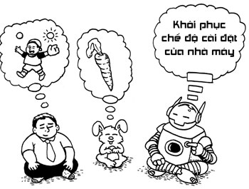
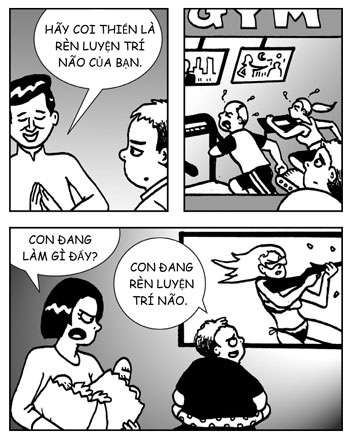
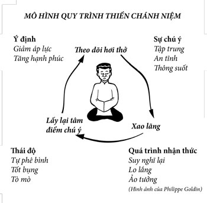
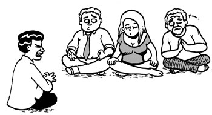
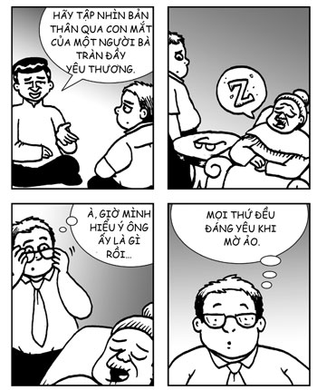
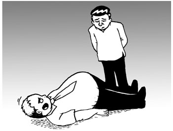
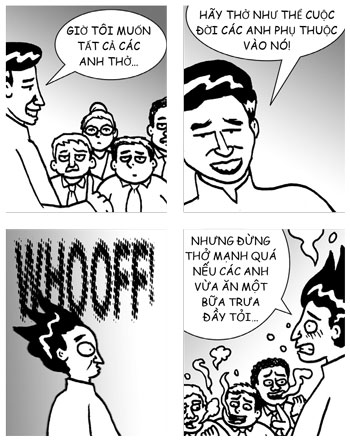
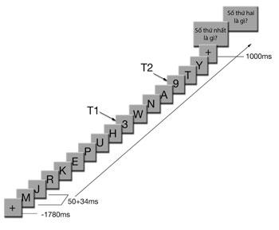

# Chương 2: HÃY THỞ NHƯ THỂ CUỘC ĐỜI BẠN PHỤ THUỘC VÀO NÓ
### Lý thuyết và cách thực hành thiền

> *Vô vi nhi vô bất vi (Không làm gì mà không gì là không làm).*  
> — **Lão Tử**

Thiền không có gì bí ẩn. Thực ra nó chỉ là rèn luyện tinh thần.

Định nghĩa khoa học về thiền, như Julie Brefczynski-Lewis đưa ra, là: *“Một hệ những phương pháp rèn luyện tinh thần được thiết kế để giúp người thực hành quen với những dạng quy trình tinh thần cụ thể”*[^1].

*“Nghe đây! Đây là nơi các anh biến từ một đống chất xám thành những bộ não thực sự! Các anh nghe tôi nói gì không?”

*“Có, thưa ngài!”**

Những định nghĩa truyền thống về thiền rất giống với định nghĩa của khoa học hiện đại ở trên. Trong tiếng Tây Tạng, thiền là *Gom*, có nghĩa là “làm cho quen hoặc tạo thói quen”. Trong tiếng Pali, ngôn ngữ 2.600 năm tuổi được dùng trong các văn bản đầu tiên của đạo Phật, thiền là *Bhavana*, có nghĩa là “vun trồng”, như trong trồng trọt. Thậm chí trong những xã hội cổ đại có truyền thống thiền lâu năm, thiền không được xem là một thứ ma thuật hay huyền bí – nó chỉ là rèn luyện tinh thần. Vì vậy, nếu bạn đến với thiền để tìm kiếm điều kỳ diệu, thì tôi rất xin lỗi; ma thuật là ba cánh cửa nằm dưới hành lang này[^2].

Như định nghĩa khoa học về thiền ở trên đã chỉ ra một cách chính xác, có nhiều loại thiền được thiết kế để rèn luyện các năng lực tâm trí khác nhau. Loại thiền mà chúng tôi hứng thú vì mục đích phát triển trí thông minh cảm xúc là thiền chánh niệm, vốn đã được giới thiệu qua trong chương trước.

Nếu thiền là rèn luyện tinh thần thì nó rèn luyện những năng lực tinh thần nào? Thiền rèn luyện hai năng lực quan trọng: **chú ý** và **tự chú ý**. Chú ý thì chúng ta đều hiểu. William James có một định nghĩa rất hay cho nó: *“Bị tâm trí chiếm đoạt, dưới dạng sống động và rõ ràng”*[^3].

Tự chú ý là chú ý sự chú ý, khả năng chú ý đến chính sự chú ý. Hả? Nói một cách đơn giản, tự chú ý là khả năng biết rằng sự chú ý của bạn đang đi lang thang. Giả sử bạn đang chú ý đến một vật thể và cuối cùng sự chú ý của bạn lang thang sang một vật thể khác. Sau một thời gian, có một thứ gì đó trong tâm trí bạn “tách” một cái, để báo cho bạn là, này, tâm trí của bạn đã đi lang thang rồi đấy. Năng lực đó là tự chú ý.

Tự chú ý cũng là bí quyết để tập trung. Nó giống như đi xe đạp. Để giữ thăng bằng cho một chiếc xe đạp, bạn thực hiện rất nhiều điều chỉnh nhỏ. Khi xe đạp hơi nghiêng sang trái, bạn điều chỉnh lại bằng cách hơi nghiêng sang phải, và khi nó hơi nghiêng sang phải, bạn điều chỉnh bằng cách hơi nghiêng sang trái. Bằng những điều chỉnh nhỏ nhanh chóng và thường xuyên như thế, bạn tạo ra hiệu ứng thăng bằng liên tục. Nó cũng giống như sự chú ý. Khi sự tự chú ý của bạn trở nên mạnh mẽ, bạn sẽ có thể điều chỉnh lại sự chú ý đang lang thang một cách nhanh chóng và thường xuyên. Nếu bạn điều chỉnh sự chú ý đủ nhanh chóng và thường xuyên, bạn tạo ra hiệu ứng chú ý liên tục, và đó chính là sự tập trung.

## THƯ GIÃN VÀ CẢNH GIÁC TRONG CÙNG MỘT LÚC

Bí mật lớn nhất của thiền, ít nhất trong giai đoạn đầu, là nó đưa bạn đến một trạng thái mà ở đó tâm trí bạn thư giãn và cảnh giác trong cùng một lúc.

Khi sự chú ý và tự chú ý của bạn trở nên mạnh mẽ, một điều thú vị sẽ xảy ra. Tâm trí bạn trở nên ngày càng tập trung và ổn định, nhưng theo một cách cũng thư giãn nữa. Nó giống như việc giữ xe đạp thăng bằng trên một vùng đất bằng phẳng. Nếu luyện tập đủ, bạn gần như chẳng tốn chút sức lực nào, và bạn có được trải nghiệm vừa tiến về phía trước vừa thư giãn trong cùng một lúc. Bạn đến nơi cần đến, và thực sự tận hưởng trải nghiệm đến đó bởi nó thư giãn.

Nếu luyện tập đủ, bạn thậm chí có thể đưa tâm trí đến trạng thái đó khi cần thiết và đắm chìm trong đó trong một khoảng thời gian dài. Khi tâm trí trở nên cực kỳ thư giãn và cảnh giác trong cùng một lúc, ba phẩm chất tuyệt vời của tâm trí sẽ tự nhiên xuất hiện: **an tĩnh**, **rõ ràng**, và **hạnh phúc**.

Sau đây là một phép so sánh. Hãy tưởng tượng bạn có một bình nước bên trong đầy cặn, và bạn khuấy nó liên tục. Nước bị đục. Bạn dừng khuấy và để nó lên sàn. Nước sẽ lặng dần rồi sau một lúc, tất cả cặn sẽ lắng lại một chỗ, và nước trở nên trong. Đây là ví dụ kinh điển nhất về tâm trí trong trạng thái vừa thư giãn vừa cảnh giác. Trong trạng thái này, chúng ta tạm thời dừng khuấy động tâm trí đúng như cách chúng ta dừng khuấy động bình nước. Cuối cùng, tâm trí chúng ta trở nên an tĩnh và rõ ràng, theo đúng cách nước trở nên bình lặng và trong vắt.

## HẠNH PHÚC LÀ TRẠNG THÁI MẶC ĐỊNH CỦA TÂM TRÍ

Có một phẩm chất cực kỳ quan trọng của tâm trí trong trạng thái an tĩnh và rõ ràng mà không được thể hiện trong so sánh trên. Phẩm chất đó là hạnh phúc. Khi tâm trí an tĩnh và rõ ràng trong cùng một lúc, hạnh phúc sẽ tự nhiên xuất hiện. Tâm trí tự nhiên vui tươi!

Nhưng tại sao? Thậm chí sau khi đã có thể đạt được tâm trí đó khi cần thiết, tôi vẫn không thực sự hiểu nổi. Tại sao một tâm trí an tĩnh và rõ ràng lại tự động hạnh phúc? Tôi đã hỏi bạn tôi, Alan Wallace, một trong những chuyên gia hàng đầu của thế giới phương Tây về phương pháp tập trung thư giãn (một phương pháp có tên là *shamatha*).

Alan nói rằng lý do rất đơn giản: **hạnh phúc là trạng thái mặc định của tâm trí**. Vì vậy, khi tâm trí trở nên an tĩnh và rõ ràng, nó trở lại trạng thái mặc định và trạng thái mặc định đó là hạnh phúc. Vậy thôi. Không có phép thuật nào cả; chúng ta chỉ đơn giản là trở lại trạng thái tự nhiên của tâm trí.

Alan, trong trí tuệ sâu sắc của mình, nói điều đó theo phong cách bình thản, vui vẻ, và nhẹ nhàng thường thấy của anh. Nhưng với tôi, câu nói đó thể hiện một nhận thức tuy giản dị song vẫn cực kỳ sâu sắc và có thể thay đổi cả một cuộc đời. Nó ngụ ý rằng hạnh phúc không phải là thứ bạn theo đuổi, mà là thứ bạn cho phép xảy ra. Chỉ tồn tại thôi đã là hạnh phúc. Nhận thức đó đã thay đổi cuộc đời tôi.

*Khôi phục chế độ cài đặt của nhà máy — Hạnh phúc là trạng thái mặc định của tâm trí*

Với tôi, câu chuyện đùa buồn cười nhất là, sau tất cả những điều được thực hiện để theo đuổi hạnh phúc trong suốt lịch sử thế giới, hóa ra hạnh phúc vững bền có thể đạt được chỉ bằng cách đơn giản là mang sự chú ý vào từng hơi thở. Cuộc sống thật buồn cười. Ít nhất thì cuộc sống của tôi là như vậy.

## THIỀN LÀ RÈN LUYỆN

Phép so sánh truyền thống về bình nước đầy cặn ít nhất đã 2.600 năm tuổi. Có một phép so sánh khác về thiền, mà người hiện đại có thể hiểu dễ hơn, đó là so sánh với rèn luyện thể chất. Thiền là một dạng rèn luyện dành cho tâm trí.

Khi đến phòng tập, bạn đang rèn luyện cơ thể để nó có thể có thêm các năng lực thể chất. Nếu bạn nâng tạ, cuối cùng, bạn sẽ trở nên khỏe hơn. Nếu bạn chạy bộ thường xuyên, bạn sẽ chạy nhanh hơn và xa hơn. Cũng như vậy, thiền là một dạng rèn luyện tâm trí để nó có thể có thêm các năng lực tinh thần. Ví dụ, nếu thiền nhiều, tâm trí của bạn trở nên an tĩnh hơn, nhạy cảm hơn, bạn có thể tập trung sự chú ý một cách mạnh mẽ hơn và trong thời gian lâu hơn, v.v.

Tôi hay nói đùa rằng thiền giống như đổ mồ hôi tại phòng tập, bỏ đi đổ mồ hôi, và phòng tập.

*“Con đang làm gì đấy?”

*“Con đang rèn luyện trí não.”**

Một điểm giống nhau quan trọng giữa thiền và rèn luyện là, trong cả hai trường hợp, tiến bộ đều đến từ việc vượt qua sự kháng cự. Ví dụ, khi nâng tạ, mỗi lần bạn gập tay để kháng cự lại sức nặng của quả tạ, cơ bắp của bạn sẽ khỏe lên một chút. Quá trình tương tự cũng xảy ra trong việc thiền. Mỗi lần sự chú ý của bạn đi lang thang khỏi hơi thở và bạn mang nó trở lại, điều đó giống như bạn gập tay – “cơ bắp” của sự chú ý sẽ khỏe lên một chút.

Ngụ ý của nhận thức này là không có thứ gì gọi là thiền sai. Với nhiều người trong số chúng tôi, khi thiền, chúng tôi thấy sự chú ý của mình đi lang thang khỏi hơi thở rất nhiều lần, và chúng tôi liên tục phải mang nó trở lại. Khi đó, chúng tôi nghĩ mình đang làm sai hết rồi. Thực ra, đây là một bài tập tốt vì mỗi lần chúng tôi mang sự chú ý đang đi lang thang trở lại, chúng tôi đang cho cơ bắp chú ý của mình cơ hội để khỏe lên.

Điểm giống nhau thứ hai giữa thiền và rèn luyện là cả hai đều có thể thay đổi đáng kể chất lượng cuộc sống. Nếu bạn chưa từng rèn luyện và bạn đặt mình vào chế độ rèn luyện thường xuyên, thì sau một vài tuần hoặc một vài tháng, bạn sẽ thấy mình có nhiều thay đổi đáng kể. Bạn sẽ có nhiều năng lượng hơn, bạn có thể hoàn thành được nhiều việc hơn, bạn ít bị ốm hơn, bạn trông đẹp hơn trong gương, và bạn cảm thấy tuyệt vời về bản thân mình. Điều này cũng đúng với thiền. Sau một vài tuần hoặc một vài tháng bắt đầu thiền thường xuyên, bạn có nhiều năng lượng hơn; tâm trí của bạn trở nên an tĩnh hơn, rõ ràng hơn, và vui vẻ hơn; bạn ít bị ốm hơn; bạn cười nhiều hơn; cuộc sống xã hội của bạn được cải thiện (vì bạn cười nhiều hơn); và bạn cảm thấy tuyệt vời về bản thân mình. Và bạn thậm chí không cần phải đổ mồ hôi.

## THỰC HÀNH THIỀN CHÁNH NIỆM

Quy trình thiền chánh niệm khá đơn giản, như được minh họa trong mô hình sau:

Quy trình bắt đầu với một ý định. Bắt đầu bằng việc tạo ra một ý định, một lý do để muốn an trú trong chánh niệm. Có thể là để giảm căng thẳng. Có thể là để tăng hạnh phúc. Có thể bạn muốn trau dồi trí thông minh cảm xúc để được vui vẻ và thu được lợi ích gì đó. Hoặc có thể bạn chỉ muốn tạo ra các điều kiện cho hòa bình thế giới, hay một thứ gì đó khác thôi.

Thực ra, nếu bạn thực sự lười, hay thực sự bận, hay thực sự cả hai, bạn có thể tuyên bố rằng việc thiền của bạn chấm dứt ngay tại đây được rồi. Bản thân việc tạo ra những ý định tốt đẹp đã là một dạng thiền. Mỗi lần bạn tạo ra một ý định là bạn đang tinh tế hình thành hoặc củng cố một thói quen tinh thần. Nếu bạn tạo ra cùng một ý định nhiều lần, nó cuối cùng sẽ trở thành một thói quen liên tục xuất hiện trong tâm trí bạn ở nhiều tình huống khác nhau để định hướng hành vi của bạn. Ví dụ, nếu nhiều lần trong ngày, bạn tạo ra ý định quan tâm đến hạnh phúc của bản thân, thì sau một thời gian, trong mọi tình huống bạn gặp hay với mọi quyết định bạn đưa ra, bạn sẽ thấy bản thân mình (có thể một cách vô thức) hướng mọi điều bạn làm về những hành động hoặc quyết định làm tăng hạnh phúc, và bởi lẽ đó mà hạnh phúc của bạn thật sự tăng lên.

Điều này thậm chí còn mạnh mẽ hơn khi ý định của bạn là hướng về hạnh phúc của người khác. Chỉ cần tạo ra ý định đó thật nhiều, mà không làm bất kỳ điều gì khác, bạn có thể thấy bản thân dần dần (lại một lần nữa, thỉnh thoảng trong vô thức) trở nên tốt bụng hơn và hiền hòa hơn với người khác. Khá nhanh thôi, sẽ có thêm nhiều người thích bạn và muốn trò chuyện với bạn, mà có thể bạn cũng chẳng biết tại sao có thể bạn chỉ nghĩ rằng họ bị cuốn hút bởi vẻ ngoài đẹp đẽ của bạn thôi.

Sau khi tạo ra ý định, bước tiếp theo là **theo dõi hơi thở**. Chỉ cần mang sự chú ý nhẹ nhàng đến quá trình thở. Chỉ vậy thôi.

*“Hơi thở! Hơi thở! Tôi nói là theo dõi hơi thở cơ mà!”*

Một so sánh kinh điển về quá trình này là một người gác cổng đứng ở cổng thành quan sát mọi người ra vào thành phố. Anh ta không làm gì cả, chỉ đứng yên lặng, quan sát mọi người ra vào với tinh thần cảnh giác. Cũng như vậy, bạn có thể coi tâm trí mình là người gác cổng đang cảnh giác quan sát hơi thở ra vào. Bạn có thể giả vờ là mình đang cầm một cái gậy thật to để cảm thấy mình thật “ngầu”. Một so sánh khác, rất đẹp, do bạn tôi và cũng là giảng viên của Tìm Kiếm Bên Trong Bạn, Yvonne Ginsberg, đưa ra. Đó là một con bướm đang đậu trên một cánh hoa trong khi làn gió nhẹ đang làm cánh hoa đung đưa lên xuống. Sự chú ý của bạn là con bướm còn cánh hoa là hơi thở của bạn.

Vào lúc này, sự chú ý của bạn có thể tập trung lại. Bạn có thể thấy mình trong một trạng thái mà tâm trí bạn an tĩnh và tập trung. Bạn thậm chí có thể thấy mình thông suốt, chỉ tồn tại cùng hơi thở của bạn. Nếu luyện tập đầy đủ, trạng thái này có thể kéo dài rất lâu, nhưng với đa số người, có thể nó chỉ diễn ra trong vài giây. Và sau đó chúng ta rơi vào **xao lãng**.

Trong trạng thái xao lãng đó, chúng ta có thể bắt đầu suy nghĩ lại, lo lắng, hoặc ảo tưởng. Đôi khi, tôi thậm chí còn ảo tưởng về việc không lo lắng. Sau một thời gian, chúng ta nhận ra sự chú ý của chúng ta đang đi lang thang. Phản ứng mặc định của phần lớn mọi người vào lúc này là chỉ trích bản thân. Chúng ta bắt đầu tự kể cho mình nghe những câu chuyện về việc chúng ta thiền kém như thế nào, chúng ta là những người tồi tệ ra sao. Thật may là có một cách hay để giải quyết vấn đề này.

1. **Việc đầu tiên cần phải làm** là chỉ cần đơn giản lấy lại tâm điểm chú ý bằng cách mang sự chú ý trở lại quá trình thở.
2. **Việc thứ hai cần phải làm** là ghi nhớ một nhận thức quan trọng chúng ta đã thảo luận ở đầu chương này – quá trình mang sự chú ý đang đi lang thang trở lại cũng giống như gập tay trong khi tập thể hình. Đó không phải là thất bại, mà là quá trình tiến bộ và phát triển các “cơ bắp” tinh thần mạnh mẽ.
3. **Việc thứ ba cần phải làm** là cảnh giác thái độ của bạn với bản thân mình. Hãy quan sát cách bạn đối xử với bản thân mình và mức độ bạn thường nói xấu bản thân. Nếu có thể, hãy chuyển hướng thái độ đó sang sự tò mò và đối xử tốt với chính mình. Bản thân việc chuyển hướng này đã là một dạng thiền. Một lần nữa, nó liên quan đến việc tạo nên các thói quen tinh thần.

Mỗi lần tạo ra một thái độ đối xử tốt với chính mình, là chúng ta lại làm thói quen đó sâu sắc thêm một chút nữa. Nếu thực hiện điều đó nhiều, chúng ta có thể vượt qua sự oán ghét bản thân và thậm chí trở thành người bạn tốt nhất của chính mình. (Tôi chợt nhớ ra một câu thoại rất buồn cười trong phim *Spaceballs*: “Tôi là một nhân cẩu: nửa người, nửa chó. Tôi là người bạn tốt nhất của chính tôi!”.)

Một cách đẹp đẽ để làm điều này là tạo ra cái mà những người hành thiền gọi là **“tâm trí của bà”**: áp dụng tâm trí của một người bà tràn đầy yêu thương. Đối với một người bà tràn đầy yêu thương, thì bạn đẹp và hoàn hảo trong mọi khía cạnh. Không cần biết bạn phạm phải sai lầm gì, bạn là hoàn hảo và bà yêu bạn với đúng con người bạn. Không có nghĩa là bà không nhìn thấy những điểm xấu của bạn, cũng không có nghĩa là bà cho phép bạn được làm tổn thương chính mình. Đôi khi, bà thậm chí còn can thiệp quyết liệt để không cho bạn đưa mình vào rắc rối lớn. Nhưng dù thế nào, bạn hoàn hảo trong mắt bà và bà yêu bạn.

Phương pháp là hãy nhìn bản thân qua con mắt của một người bà tràn đầy tình yêu thương.

*“À, giờ mình hiểu ý ông ấy là gì rồi... Mọi thứ đều đáng yêu khi mờ ảo.”*

Cuối cùng, hãy trở lại với việc theo dõi hơi thở và, bất cứ khi nào có ích, hãy nhắc nhở bản thân về ý định của mình. Chào mừng bạn đã trở lại.

## NHỮNG VẤN ĐỀ VỀ TƯ THẾ

Thực ra bạn có thể thiền trong bất cứ tư thế nào mà bạn muốn. Ví dụ, Phật giáo Nguyên thủy đưa ra bốn tư thế thiền chính là đi, đứng, nằm, ngồi, mà dường như đã bao hàm tất cả. Phật giáo đó thật tham lam.

Khi chọn tư thế thiền, chỉ có một điều phải nhớ. Chỉ một thôi. **Tư thế thiền tốt nhất là tư thế giúp bạn duy trì trạng thái vừa thư giãn vừa cảnh giác trong cùng một lúc trong một khoảng thời gian dài.** Ví dụ, bạn có thể không muốn một tư thế ngả ngớn vì điều đó không có lợi cho sự cảnh giác, và bạn cũng không muốn một tư thế đòi hỏi bạn phải căng cứng lưng, vì nó không có lợi cho sự thư giãn.

Thật may cho chúng ta, một tư thế ngồi được tối ưu hóa cả cho sự cảnh giác và sự thư giãn đã được phát triển qua hàng ngàn năm con người thiền. Tư thế truyền thống này đôi khi được gọi là tư thế thiền bảy điểm. Nói ngắn gọn thì bảy điểm đó là:

1. Lưng thẳng “như một mũi tên”
2. Chân khoanh lại “theo thế hoa sen”
3. Vai thả lỏng, nâng lên cao và ra sau, “như con kền kền”
4. Cằm thu lại một chút, “như một cái móc sắt”
5. Mắt nhắm lại hoặc nhìn xa xăm
6. Lưỡi chạm vào vòm miệng
7. Môi hơi mở, răng không nghiến.

Chúng ta không phải đi vào các chi tiết của tư thế truyền thống. Tôi thấy những dạng chuẩn của tư thế này ban đầu rất khó đối với phần lớn người thời nay vì chúng ta không ngồi trên sàn nhiều. Thay vào đó, chúng ta quen với việc ngồi trên ghế tựa, nên nhiều người cảm thấy hơi ngại tư thế truyền thống, ít nhất là lúc đầu. Vì vậy, tôi cho rằng bạn chỉ cần biết có tồn tại một tư thế truyền thống đã được tối ưu hóa về mặt chức năng. Hãy sử dụng nó như một hướng dẫn, rồi tìm bất cứ tư thế nào bạn thấy thoải mái và quan trọng nhất là giúp bạn duy trì sự cảnh giác cũng như sự thư giãn. Ví dụ, không thực sự quan trọng là bạn khoanh chân hay sử dụng ghế tựa, hay bạn thực sự thích tư thế để con búp bê Hello Kitty trên đầu. Miễn là bạn có thể duy trì sự cảnh giác và sự thư giãn, thì đó là tốt.

Sogyal Rinpoche, một giảng viên Phật giáo Tây Tạng nổi tiếng thế giới, đã đưa ra một cách hữu ích và thú vị để tìm ra tư thế cho riêng mình. Ông đề nghị hãy **ngồi như một ngọn núi hùng vĩ**. Ý tưởng ở đây là hãy nghĩ về ngọn núi bạn ưa thích nhất, núi Phú Sĩ hoặc núi Kilimanjaro chẳng hạn, sau đó giả vờ bạn là ngọn núi đó khi bạn ngồi. Và bạn đây rồi, quý ngài (hoặc quý bà) Núi Phú Sĩ, hùng vĩ, oai nghiêm, và đầy cảm hứng. Điều tốt đẹp là nếu bạn ngồi theo cách khiến bạn cảm thấy mình hùng vĩ, oai nghiêm, và đầy cảm hứng, nó có thể chính là tư thế giúp bạn vừa cảnh giác vừa thư giãn, và còn khá thú vị nữa. Hãy thử cách này và xem nó có hiệu quả với bạn không.

*“Nhưng tôi thấy mình giống với ngọn núi hơn ở tư thế này.”*

Một đề nghị khác đơn giản nhưng hữu dụng của giảng viên chương trình Tìm Kiếm Bên Trong Bạn, Yvonne Ginsberg:

> *Hít một hơi thật sâu, nâng xương sườn lên. Thở ra, để vai rơi xuống trong khi cột sống giữ nguyên vị trí một cách nhẹ nhàng. Sau đó, đồng thời tưởng tượng ra dòng chảy của một con sông và sự ổn định của một ngọn núi.*

Một câu hỏi tôi thường xuyên nhận được là nên nhắm mắt hay mở mắt khi thiền. Câu trả lời vui là: nhắm một mắt, nhắm cả hai, và không nhắm mắt nào. Câu trả lời thực là, mỗi cái đều có ưu và nhược điểm riêng, vì vậy bạn nên hiểu rõ và chơi đùa với các lựa chọn.

* **Nhắm mắt khi thiền** là tốt; nó giúp bạn giữ bình tĩnh và tránh xa những hình ảnh gây xao lãng. Vấn đề là rất dễ ngủ gật.
* **Mở mắt**, bạn sẽ gặp vấn đề ngược lại. Bạn không dễ ngủ gật nữa, nhưng bạn bị xao lãng bởi các vật thể bạn nhìn thấy.

Phải làm gì đây? Có hai cách để dung hòa, một về thời gian và một về không gian:
* **Dung hòa về thời gian:** khi bắt đầu thì nhắm mắt, sau đó thỉnh thoảng mở mắt khi bắt đầu thấy buồn ngủ.
* **Dung hòa về không gian:** nếu có thể, bạn hãy nhắm nửa mắt, mở nửa mắt. Hơi mở mắt một chút, hơi nhìn xuống dưới một chút, và không tập trung vào một điểm nào nhất định cả. Theo kinh nghiệm của tôi, lựa chọn này là tối ưu.

Thường thì khi chúng ta đang cố gắng thiền, chúng ta bị xao lãng bởi âm thanh, ý nghĩ, hoặc các cảm giác trên cơ thể (chẳng hạn như ngứa ngáy hay một nỗi đau âm ỉ). Tôi đưa ra kế hoạch bốn bước sau để ứng phó với những xao lãng đó:

### Thừa nhận
Chỉ thừa nhận rằng có điều gì đó đang xảy ra.

### Trải nghiệm mà không phán xét hay phản ứng
Dù bạn đang trải nghiệm cái gì, hãy chỉ trải nghiệm nó mà thôi. Đừng phán xét nó là tốt hay xấu. Cứ để nó vậy, cứ để nó vậy, giống như lời một bài hát nổi tiếng[^a]. Nếu có thể, cố gắng đừng phản ứng với nó. Nếu bạn phải phản ứng (ví dụ, bạn thực sự phải gãi), hãy cố hít thở năm lần trước khi phản ứng. Lý do là để tập tạo ra khoảng cách giữa kích thích và phản ứng.

Chúng ta càng có thể tạo ra khoảng cách giữa kích thích và phản ứng thì chúng ta càng có khả năng kiếm soát đời sống cảm xúc của mình. Kỹ năng mà bạn phát triển ở đây trong khi ngồi có thể được phổ biến vào trong cuộc sống hàng ngày.

### Nếu cần phản ứng, hãy tiếp tục duy trì sự chú tâm
Nếu cần phản ứng, chẳng hạn cần gãi hay đứng dậy, hãy duy trì sự chú tâm vào ba thứ: ý định, chuyển động, và cảm giác. Hãy nhớ rằng mục tiêu của bài tập này không phải là ngồi yên; mục tiêu là chú tâm. Vì vậy, miễn là bạn duy trì sự chú tâm, thì bạn làm gì cũng không sao. Tức là giả sử, bạn cần phản ứng với một chỗ ngứa trên mặt, trước tiên hãy mang sự chú ý đến cảm giác ngứa, sau đó đến ý định gãi, cuối cùng đến chuyển động của cánh tay và ngón tay cùng cảm giác gãi trên khuôn mặt bạn. Không hơn. Không kém.

### Buông thả nó
Nếu nó muốn được buông thả, hãy buông thả nó. Nếu không, cứ để nó vậy.

Hãy nhớ rằng buông thả không phải là buộc một thứ gì đó biến đi. Thay vào đó, buông thả là một lời mời. Chúng ta hào phóng cho phép người nhận chọn chấp nhận hay không chấp nhận lời mời đó, và dù thế nào chúng ta cũng vẫn vui. Khi chúng ta buông thả một thứ gì đó gây xao lãng đến việc thiền của chúng ta, chúng ta nhẹ nhàng mời nó dừng gây xao lãng, nhưng hào phóng cho phép nó quyết định ở lại hay không. Nếu nó quyết định đi thì tốt. Nếu nó quyết định ở lại thì cũng tốt. Chúng ta đối xử với nó bằng lòng tốt và sự hào phóng trong suốt thời gian nó hiện diện. Đây là một bài tập buông thả.

Cuối cùng, nếu cho đến giờ, bạn không nhớ một điều nào trong những điều bạn đọc ở chương này (có thể bởi vì bạn không quan tâm đến cuốn sách này nhưng vợ bạn bắt bạn ngồi đọc nó), thì thật may, Jon Kabat-Zinn đã đưa ra một câu tóm tắt toàn bộ chương này:

> **Hãy thở như thể cuộc đời bạn phụ thuộc vào nó.**

Nếu bạn chỉ có thể nhớ một câu trong chương này, hãy nhớ câu trên, thế là bạn sẽ hiểu thiền chánh niệm.

*“Giờ tôi muốn tất cả các anh thở... Hãy thở như thể cuộc đời các anh phụ thuộc vào nó! Whooff! Nhưng đừng thở mạnh quá nếu các anh vừa ăn một bữa trưa đầy tỏi...”*

## THỜI GIAN NGỒI

Đến giờ bạn đã được học về lý thuyết và cách thực hành thiền chánh niệm, giờ chúng ta hãy dành vài phút ngồi thiền.

Có rất nhiều cách ngồi thiền. Cách đơn giản nhất là kéo dài bài tập thiền hai phút được nói đến ở chương trước. Đầu tiên, hãy ngồi trong tư thế thiền cho phép bạn vừa cảnh giác vừa thư giãn cùng lúc. Sau đó, bất cứ khi nào cảm thấy thoải mái, bạn có thể thực hành Cách Dễ (chú ý đến quá trình thở và nhẹ nhàng mang sự chú ý trở lại mỗi khi nó đi lang thang), hoặc Cách Dễ Hơn (ngồi không làm gì cả và chỉ đơn giản chuyển từ trạng thái hành động sang trạng thái tồn tại). Nếu muốn, bạn có thể đổi giữa Cách Dễ và Cách Dễ Hơn bất kỳ lúc nào. Làm như vậy trong khoảng 10 phút hoặc bao lâu tùy thích. Đây chính là bạn đang tập thiền.

Nếu bạn thích thứ gì đó chuẩn hơn và bài bản hơn, bạn có thể áp dụng Mô Hình Quy Trình Thiền Chánh Niệm đã được thảo luận ở đầu chương này. Bắt đầu bằng việc ngồi trong tư thế thiền cho phép bạn vừa cảnh giác vừa thư giãn cùng lúc. Khi bạn cảm thấy thoải mái, hãy mời gọi ý định dựa trên lý do tại sao bạn đang ngồi đây xuất hiện. Điều này sẽ khuyến khích bạn tiếp tục thiền. Mang sự chú ý đến quá trình thở. Nếu tâm trí an tĩnh và tập trung, hãy trú trong tâm trí đó. Nếu tâm trí bị xao lãng bởi âm thanh, ý nghĩ, hay cơn ngứa, hãy thừa nhận nguyên nhân gây ra xao lãng đó, trải nghiệm nó mà không phán xét nó, và buông thả nó nếu nó muốn được buông thả. Nếu bạn cần cử động, hãy duy trì sự chú tâm vào ý định, chuyển động, và cảm giác. Nhẹ nhàng mang sự chú ý trở lại hơi thở. Nếu những suy nghĩ phê bình hay phán xét bản thân khởi lên, hãy mời gọi ý nghĩ đối xử tốt với bản thân khởi lên, nếu muốn. Còn không, cứ để vậy đi; mọi thứ đều tốt. Làm vậy trong 10 phút hoặc bao lâu tùy thích.

### BÀI TẬP THỰC HÀNH: THIỀN CHÁNH NIỆM

Chúng ta hãy bắt đầu bằng cách ngồi thoải mái. Ngồi trong một tư thế giúp bạn vừa thư giãn vừa cảnh giác cùng lúc, dù điều đó có nghĩa là gì với bạn đi nữa. Hoặc, nếu thích, bạn có thể ngồi như một ngọn núi hùng vĩ, dù điều đó có nghĩa là gì với bạn đi nữa.

Giờ chúng ta hãy hít vào ba hơi thật sâu, thật chậm, để truyền năng lượng và sự thư giãn vào bài tập của chúng ta.

Giờ chúng ta hãy thở một cách tự nhiên và mang sự chú ý rất nhẹ nhàng đến hơi thở. Bạn có thể mang sự chú ý đến hai lỗ mũi, bụng, hay toàn bộ cơ thể đang thở, dù điều đó có nghĩa là gì với bạn. Hãy chú ý đến hơi thở vào, hơi thở ra, cùng các khoảng dừng ở giữa.

*(Ngưng ngắn)*

Nếu bạn muốn, bạn có thể coi bài tập này là để tâm trí nghỉ ngơi trên hơi thở. Bạn có thể tưởng tượng hơi thở là một nơi nghỉ ngơi, hoặc một cái gối, hoặc một cái đệm, và để tâm trí nghỉ ngơi trên đó, rất nhẹ nhàng. Chỉ tồn tại thôi.

*(Ngưng dài)*

Nếu bất kỳ lúc nào bạn cảm thấy bị xao lãng bởi một cảm giác, một ý nghĩ, một âm thanh, hãy chỉ thừa nhận nó, trải nghiệm nó, và nhẹ nhàng buông thả nó. Hãy mang sự chú ý rất nhẹ nhàng quay trở lại việc thở.

*(Ngưng dài)*

Nếu bạn thích, chúng ta hãy kết thúc việc thiền này bằng cách mời gọi sự an tĩnh vui vẻ trong tâm khởi lên:

> *Hít vào, tôi an tĩnh.*  
> *Thở ra, tôi mỉm cười.*  
> *Phút giây hiện tại này,*  
> *Thật tuyệt vời.*

*(Ngưng ngắn)*

Cảm ơn sự chú ý của các bạn.

## NÀY ANH BẠN, KHOA HỌC Ở ĐÂU?

Ít nhất, thiền có một điểm chung quan trọng với khoa học: cả hai đều nhấn mạnh vào tinh thần hỏi. Trong thiền, có hai khía cạnh về tinh thần hỏi. Một, thiền có phần lớn là khám phá bản thân. Vâng, chúng ta bắt đầu với việc rèn luyện sự chú ý, nhưng sự chú ý không phải là mục tiêu cuối cùng của phần lớn các truyền thống thiền; mục tiêu cuối cùng thực sự là trí tuệ. Lý do chúng ta tạo ra khả năng chú ý mạnh mẽ là để có thể phát triển trí tuệ vào bên trong tâm trí. Có sức chú ý mạnh mẽ giống như có một cây đuốc sáng rực – có thì thật vui nhưng mục đích thực sự của nó là cho phép chúng ta nhìn vào bên trong những căn phòng tối tăm của tâm trí và của bản thân để chúng ta có thể, vâng, tìm kiếm bên trong mình. Và do mục tiêu cuối cùng là phát triển trí tuệ nên tinh thần hỏi – ít nhất là hỏi bên trong – phải trở thành một thành phần trọng yếu trong quá trình thiền.

Khía cạnh thứ hai của tinh thần hỏi này vượt ra ngoài thế giới bên trong và đi vào thế giới bên ngoài. Vì các thiền sinh đều quen với việc hỏi nên chúng tôi rất thoải mái với khoa học cũng như các câu hỏi mang tính khoa học về thiền. Điều này đúng thậm chí với cả những người hành thiền theo phương pháp cổ xưa trong các truyền thống thiền cổ đại, ví dụ như Đức Phật. Với nhiều người bạn của tôi, ví dụ hấp dẫn nhất về sự thoải mái với khoa học này là khi Đạt-lai Lạt-ma nói: “Nếu phân tích khoa học cuối cùng cho thấy rằng một số nhận định về Đức Phật là sai, thì chúng ta phải chấp nhận các phát hiện của khoa học và từ bỏ những nhận định đó”[^4].

Ghi nhớ điều này, chúng ta hãy xem qua một số văn bản khoa học xung quanh việc thiền.

Một trong những nghiên cứu nói lên nhiều điều nhất do hai người tiên phong trong lĩnh vực khoa học thần kinh về thiền, Richard Davidson và Jon Kabat-Zinn, thực hiện[^5]. Nghiên cứu này mang tính đột phá vì nhiều lý do. Nó là nghiên cứu lớn đầu tiên được thực hiện trong bối cảnh công ty, với các đối tượng là nhân viên của một công ty công nghệ sinh học. Điều này khiến nó trở nên cực kỳ có liên quan với một người làm việc trong thế giới công sở như tôi. Nghiên cứu đã cho thấy rằng chỉ sau tám tuần tập thiền, mức độ lo âu của các đối tượng đã giảm đi đáng kể. Đây là một điều tốt nhưng không đáng ngạc nhiên vì tên chương trình của Jon Kabat-Zinn là Giảm Căng Thẳng Bằng Thiền. Nếu sự lo âu không giảm đi đáng kể thì cũng khá xấu hổ.

Ngạc nhiên hơn, khi hoạt động điện bên trong não bộ của các đối tượng được đo lường, những người trong nhóm thiền thể hiện sự gia tăng đáng kể mức độ hoạt động ở những phần não có liên quan đến các cảm xúc tích cực. Phát hiện thú vị nhất có liên quan đến chức năng miễn dịch của họ. Gần cuối cuộc nghiên cứu, các đối tượng được tiêm vắc-xin cúm và những người trong nhóm thiền phát triển nhiều kháng thể hơn đối với vắc-xin cúm. Nói cách khác, chỉ sau tám tuần thiền chánh niệm, các đối tượng hạnh phúc hơn đáng kể (đã được đo trong não bộ của họ) và thể hiện mức tăng đáng chú ý trong việc phát triển khả năng miễn dịch. Hãy nhớ rằng nghiên cứu này không được tiến hành trên những người đầu trọc, mặc áo choàng, sống trong tu viện, mà trên những người bình thường, có cuộc sống thực, có những công việc vô cùng căng thẳng, trong công ty của Mỹ.

Một nghiên cứu được thực hiện sau bởi Heleen Slagter, Antoine Lutz, Richard Davidson, v.v... tập trung vào sự chú ý[^6]. Cụ thể, nó khám phá thiền trong mối liên hệ với một hiện tượng thú vị có tên là “cái nháy mắt của sự chú ý”. Có một cách rất đơn giản để giải thích cái nháy mắt của sự chú ý. Giả sử bạn được cho xem một chuỗi các ký tự (con số hoặc chữ cái) trên một màn hình máy tính, từng ký tự một, liên tục với tốc độ cao (các ký tự cách nhau khoảng 50 mi-li giây, tức là một nửa của 1/10 giây). Giả sử toàn bộ chuỗi đều là chữ cái và chỉ có hai con số. Ví dụ, chuỗi ký tự gồm P, U, H, 3, W, N, 9, T, Y. Có hai con số bên trong chuỗi chữ cái. Nhiệm vụ của bạn là xác định hai con số đó.

### Nhiệm vụ cái nháy mắt của sự chú ý

Đây là điểm thú vị: nếu hai con số được chiếu cách nhau nửa giây, thì thông thường, sẽ không xác định được con số thứ hai. Hiện tượng này được gọi là cái nháy mắt của sự chú ý. Theo một cách nào đó, sau khi mục tiêu quan trọng đầu tiên được xác định, sự chú ý của tư duy sẽ “nháy mắt” một cái, và cần một lúc thì não bộ mới có thể xác định được mục tiêu tiếp theo.

Hiện tượng cái nháy mắt này trước đây được giả định là một đặc tính của hệ thống dây thần kinh và có tính bất biến. Nghiên cứu của Slagter chỉ ra rằng chỉ sau ba tháng tập thiền chuyên sâu và nghiêm ngặt, những người tham gia có thể làm giảm đáng kể hiện tượng nháy mắt này. Về lý thuyết, với việc tập thiền, não bộ có thể học được cách xử lý kích thích hiệu quả hơn, do đó sau khi xử lý mục tiêu quan trọng đầu tiên, nó vẫn còn nguồn lực tư duy để xử lý cái thứ hai.

Nghiên cứu này đem lại một cái nhìn thú vị về khả năng nâng cấp hiệu quả hoạt động của não bộ bằng thiền. Vì vậy, nếu công việc của bạn phụ thuộc vào khả năng chú ý đến thông tin trong một khoảng thời gian dài, thì có thể việc thiền này sẽ giúp bạn tăng lương.

*“Còn anh? Anh cũng cần tăng lương à? Anh đang tự tăng khá tốt đấy thôi!”*

Còn nhiều nghiên cứu khoa học thú vị về thiền nữa. Chúng ta sẽ chỉ đưa ra một vài nghiên cứu quan trọng.

Antoine Lutz đã cho thấy rằng những thiền sinh lão luyện của đạo Phật có thể tạo ra những sóng não gamma cường độ cao. Những sóng não này thường có liên quan đến mức độ hiệu quả cao trong các khía cạnh trí nhớ, học tập và nhận thức.[^7] Hơn nữa, những thiền sinh lão luyện này còn thể hiện mức độ hoạt động cao hơn ở dải gamma khi họ không thiền, từ đó cho thấy rằng việc tập thiền có thể thay đổi bộ não của bạn khi nghỉ ngơi. Nếu nâng tạ nhiều, bạn sẽ có cơ bắp cuồn cuộn ngay cả khi không đến phòng tập. Tương tự, khi rèn luyện tinh thần nhiều, bạn sẽ có các “cơ bắp” tinh thần khỏe, các “cơ bắp” an tĩnh, rõ ràng và vui vẻ, ngay cả khi bạn chỉ đang đi chơi.

Nghiên cứu đầu tiên về lĩnh vực này của Jon Kabat-Zinn đã tiết lộ rằng thiền có thể làm tăng đáng kể tốc độ khỏi bệnh vẩy nến[^8]. Phương pháp rất đơn giản. Tất cả những người tham gia đều được chữa trị theo cách thông thường, nhưng một nửa được nghe các đoạn băng hướng dẫn thiền của Jon Kabat-Zinn trong suốt quá trình chữa trị, và chỉ riêng việc được nghe các đoạn băng này thôi đã làm tăng đáng kể tốc độ khỏi bệnh rồi. Mặc dù tôi thấy các kết quả này rất thú vị nhưng điều hấp dẫn về nghiên cứu này là, bệnh vẩy nến là một thứ hữu hình – một căn bệnh da liễu có đặc tính là những nốt đỏ sẽ phát triển to hơn khi chúng trở nên tệ hơn. Vì vậy, khi bạn nói về một cách thiền giúp bạn khỏi bệnh trong ngữ cảnh này, nó không phải chỉ là những lời nói suông của một người Thời đại Mới nào đó; nó là một thứ quá hữu hình, bạn có thể thấy nó và thật sự đo được nó bằng một cái thước.

Cuối cùng, có một nghiên cứu chỉ ra rằng thiền có thể làm dày tân vỏ não. Nghiên cứu này, do Sara Lazar thực hiện, đã chụp cộng hưởng từ bộ não của những người thiền và những người không thiền, từ đó cho thấy rằng những người thiền có vỏ não dày hơn ở những vùng não có liên quan đến sự chú ý và khả năng xử lý cảm giác[^9]. Tất nhiên, những phép đo này chỉ thể hiện sự tương quan, chứ không phải thể hiện nguyên nhân, tức là hoàn toàn có thể những người có vỏ não dày hơn ở những vùng não đó chỉ tình cờ là người thực hành thiền. Tuy nhiên, nghiên cứu này cũng chỉ ra rằng, với những đối tượng thiền, ai thực hành thiền càng lâu thì những phần não đó càng dày, tức là thiền có thể là nguyên nhân gây ra những thay đổi đã quan sát được đó ở bộ não.

Những điều trên chỉ là tóm tắt của một vài nghiên cứu trong 25 năm qua. Điều tuyệt vời là thiền giúp cải thiện mọi thứ, từ sự chú ý và chức năng não bộ cho đến hệ miễn dịch và bệnh da liễu. Thiền giống như con dao của quân đội Thụy Sĩ – nó hữu dụng trong mọi tình huống.

Hãy nhớ rằng, nếu Meng có thể ngồi thì bạn cũng có thể.

---
[^a]: Bài hát Let it be của ban nhạc The Beatles. Let it be tạm dịch là “cứ để nó vậy”. (Dịch giả)
[^1]: J. A. Brefczynski-Lewis, cùng những người khác, “Mối liên hệ giữa thần kinh và khả năng chú ý của những người thực hành thiền trong thời gian dài,” *PNAS* (2007).
[^2]: Thực ra, ma thuật nằm ở sân ga 9¾ thuộc nhà ga Ngã Tư Vua nhưng đáng ra tôi không được nói.
[^3]: William James, *The Principles of Psychology*, tập 1 (1890).
[^4]: Đức Đạt-lai Lạt-ma, *The Universe in a Single Atom* (2006).
[^5]: Richard Davidson, cùng những người khác, “Tác dụng của thiền chánh niệm đối với bộ não và khả năng miễn dịch,” *Psychosomatic Medicine* (2003).
[^6]: Heleen Slagter, cùng những người khác, “Tác động của việc rèn luyện tâm trí đối với việc phân bố các nguồn lực giới hạn của bộ não,” *PLoS Biology* (2007).
[^7]: Antoine Lutz, cùng những người khác, “Những thiền sinh lâu năm tự tạo ra sự đồng bộ gamma cường độ cao trong khi thiền,” *PNAS* (2004).
[^8]: Jon Kabat-Zinn, cùng những người khác, “Ảnh hưởng của việc can thiệp bằng cách sử dụng thiền đối với bệnh nhân vẩy nến,” *Psychosomatic Medicine* (1998).
[^9]: Sara Lazar, cùng những người khác, “Thiền có liên quan đến việc làm tăng độ dày vỏ não,” *Neuroreport* (2005).
