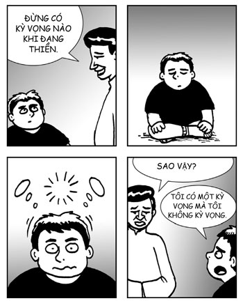

# Chương 3: THIỀN KHÔNG NGỒI TRÊN ĐỆM
### Mở rộng lợi ích của thiền ra khỏi việc ngồi

> *Thiền, ta khẳng định rằng, có ích ở khắp mọi nơi.*  
> — **Đức Phật**

Thiền là một trong những việc quan trọng nhất bạn có thể học được trong cuộc đời. Nhưng đừng chấp nhận nó từ tôi. William James, cha đẻ của tâm lý học hiện đại, đã nói như sau:

> *Và năng lực tự nguyện mang sự chú ý đang đi lang thang trở lại hết lần này đến lần khác chính là cội rễ của sự đánh giá, tính cách và ý chí. Không ai có thể làm chủ bản thân nếu không có nó.*  
> *Một nền giáo dục cải thiện năng lực này là nền giáo dục hoàn hảo.*[^1]

Bạn có nó rồi. Thiền chính là một kỹ năng đem lại cho bạn năng lực tự nguyện mang sự chú ý đang đi lang thang trở lại hết lần này đến lần khác, và như William James đã nói, nó là “nền giáo dục hoàn hảo”, thứ tốt nhất bạn có thể học. Tôi hy vọng điều đó sẽ khiến bạn cảm thấy dễ chịu hơn với việc tiêu tiền mua cuốn sách này.

Ở chương trước, chúng ta đã học được rằng thiền chánh niệm là một công cụ quan trọng trong việc phát triển trí thông minh cảm xúc. Trong chương này, chúng ta sẽ học những cách mở rộng thiền vào mọi khía cạnh trong đời sống hàng ngày. Cái tâm an tĩnh và sáng suốt bạn trải nghiệm được khi ngồi thiền là rất tuyệt vời, nhưng nó chỉ thay đổi cuộc đời bạn nếu bạn có thể khơi lại tâm trí đó mỗi khi cần thiết trong cuộc sống hàng ngày. Chương này sẽ nói cho bạn biết cách.

Một trong những điều quan trọng nhất một thiền sinh cần làm là mở rộng lợi ích của thiền ra khỏi việc ngồi và đưa nó vào mọi mặt của cuộc sống. Trong khi ngồi thiền, bạn có thể trải nghiệm một mức độ an tĩnh, rõ ràng, hạnh phúc nào đó, và thách thức ở đây là hãy phổ biến tâm trí đó vào các tình huống trong cuộc sống, bên ngoài việc ngồi thiền chuẩn.

Tin tốt là lợi ích của việc tập thiền sẽ trở nên phổ biến một cách tự nhiên, hay nói cách khác là dễ dàng được tích hợp vào mọi mặt của cuộc sống. Ví dụ, sự chú ý của bạn sẽ tự nhiên bị hấp dẫn về phía những thứ hoặc là rất dễ chịu hoặc là rất khó chịu, vì vậy nếu bạn có thể rèn luyện bản thân giữ sự chú ý vào một thứ trung tính như hơi thở, thì bạn có thể giữ sự chú ý vào mọi thứ khác. Hơi thở giống như thành phố New York của sự chú ý – nếu nó có thể thành công ở đây thì nó có thể thành công ở bất kỳ nơi nào khác. Do đó, nếu bạn rất thành thạo trong việc cố định sự chú ý vào việc thở, thì bạn có thể thấy mình có khả năng tập trung tốt hơn nhiều trong lớp học hay tại các cuộc họp. Thiền sư nổi tiếng Shaila Catherine đã nói với tôi rằng sau khi học thiền một cách chuyên sâu tại đại học, cô chưa từng có môn nào dưới điểm A.

*“Tôi có thể ra khỏi lớp không? Tôi mất trí rồi.”*

## NÓI CHUNG, HÃY PHỔ BIẾN VIỆC THIỀN

Đó là một tin tốt. Tin tốt hơn là có những thứ bạn có thể làm để tăng khả năng ứng dụng của việc tập thiền vào các lĩnh vực khác của đời sống.

Có hai lĩnh vực trong đó bạn có thể bắt đầu tích hợp thiền ngay lập tức và một cách tự nhiên. Đầu tiên là mở rộng từ thiền khi nghỉ ngơi sang thiền khi hoạt động. Thứ hai là mở rộng từ thiền hướng vào bản thân sang thiền hướng vào người khác. Nếu thích, bạn có thể coi việc này giống như một sự mở rộng, hoặc phổ biến, thiền theo hai chiều: một từ nghỉ ngơi đến hoạt động và một từ bản thân đến người khác. Trong những phần sau, tôi sẽ đưa ra bài tập cho từng loại.

## THIỀN TRONG HOẠT ĐỘNG

Cách tốt nhất để tập thiền là tập trong đời sống hàng ngày. Một khi bạn có thể thiền trong mọi khoảnh khắc của đời sống hàng ngày thì chất lượng cuộc sống của bạn sẽ thay đổi rõ rệt. Thích Nhất Hạnh đã minh họa điều này một cách vô cùng đẹp đẽ khi ông miêu tả một trải nghiệm rất đơn giản là bước đi:

> *Mọi người luôn coi đi trên nước hay đi trên không là một phép màu. Nhưng tôi nghĩ phép màu thực sự không phải là đi trên nước hay đi trên không, mà là đi trên mặt đất. Mỗi ngày, chúng ta đều tham gia một phép màu mà thậm chí chúng ta còn không nhận ra: bầu trời xanh, mây trắng, lá xanh, đôi mắt đen tò mò của một đứa trẻ – đôi mắt của chính chúng ta. Tất cả đều là một phép màu.*[^2]

Khi trong trạng thái thiền, thậm chí một trải nghiệm đơn giản như bước đi trên mặt đất cũng có thể là một phép màu tuyệt đẹp.

Theo kinh nghiệm của tôi, thiền có thể làm tăng hạnh phúc mà không thay đổi bất cứ cái gì khác. Chúng ta thường coi nhiều điều trung tính là tất nhiên, như không bị đau, ăn ba bữa một ngày, và có thể bước đi từ điểm A đến điểm B. Khi thiền, những điều này trở thành nguồn cơn tạo ra hạnh phúc vì chúng ta không còn coi chúng là tất nhiên nữa. Hơn nữa, những trải nghiệm dễ chịu sẽ còn trở nên dễ chịu hơn vì sự chú ý của chúng ta hiện hữu ở đó để trải nghiệm chúng một cách trọn vẹn. Ví dụ, một bữa ăn ngon nếu được ăn trong trạng thái thiền sẽ trở nên ngon hơn, đơn giản bởi vì bạn đặt toàn bộ sự chú ý vào việc tận hưởng bữa ăn. Khi sống trong thiền, những trải nghiệm trung tính có xu hướng trở nên dễ chịu, và những trải nghiệm dễ chịu trở nên dễ chịu hơn. Không có chi phí hay nhược điểm (cũng không phải đặt cọc). Thật là một giao dịch tuyệt vời.

Một lần, khi tôi còn khá nhỏ, bố đưa cả nhà đến một nhà hàng Trung Quốc sang trọng và gọi một số món chủ đạo của họ. Trong bữa ăn, tôi phát hiện bản thân mình đang dành cho trải nghiệm này toàn bộ sự chú ý, một phần bởi vì quả thật bữa ăn rất ngon, một phần bởi vì nó quá đắt, và một phần bởi vì tôi coi nó là một trải nghiệm khá hiếm hoi. Không phải ngày nào chúng tôi cũng tiêu tiền thoải mái vào thức ăn. Vì tất cả những điều đó, tôi thấy mình chìm sâu trong thiền suốt bữa ăn. Và rồi tôi nhận ra, tại sao tôi chỉ dành sự chú ý thế này với các bữa ăn đắt tiền? Nếu tôi giả sử rằng mọi bữa ăn đều hiếm, đều đắt, rồi chú ý đến chúng nhiều nhất có thể thì sao? Tôi gọi nó là **Thiền Ăn Sang Chảnh**. Kể từ đó, tôi đã tập phương pháp này trong phần lớn các bữa ăn. Điều này cũng có chút buồn cười vì phần lớn các bữa ăn của tôi là ở Google mà đồ ăn ở Google thì lại miễn phí.

Nếu bạn không có phương pháp nào khác ngoài việc ngồi, thì cuối cùng, thiền vẫn sẽ lan sang đời sống hàng ngày của bạn và đem lại cho bạn nguồn động lực hạnh phúc không mất chi phí, không mất tiền đặt cọc. Tuy nhiên, bạn có thể tăng tốc quá trình phổ biến này bằng cách chủ đích thiền trong mọi hoạt động. Cách đơn giản nhất để làm điều này là mang sự chú ý trọn vẹn từng khoảnh khắc vào mọi công việc với một tâm trí không phán xét, và mỗi khi sự chú ý đi lang thang, chỉ cần nhẹ nhàng mang nó trở lại. Nó vẫn chẳng khác gì ngồi thiền, ngoại trừ việc đối tượng thiền là công việc ngay trước mắt, thay vì hơi thở. Vậy thôi.

Với những người thích một cách chính thống hơn, phương pháp tốt nhất tôi biết là thiền đi. Điểm tốt của thiền đi theo cách chính thống là nó có sự trang nghiêm, sự tập trung, và sự nghiêm khắc của thiền ngồi, nhưng nó được thực hiện khi đang chuyển động và nhất thiết phải mở mắt (nếu không, nó sẽ trở thành thiền va), vì vậy nó rất có lợi cho việc mang sự an tĩnh tinh thần của thiền ngồi vào trong hoạt động. Thực ra, đây là một phương pháp hữu ích đến mức trong nhiều chương trình dạy thiền, các thiền sinh được yêu cầu thay đổi luân phiên giữa thiền ngồi và thiền đi.

Thiền đi thực sự đơn giản đúng như cái tên của nó. Khi đi, hãy mang sự chú ý trọn vẹn từng khoảnh khắc vào từng chuyển động và từng cảm giác trên cơ thể, rồi mỗi khi sự chú ý đi lang thang, chỉ nhẹ nhàng mang nó trở lại.

### BÀI TẬP THỰC HÀNH: THIỀN ĐI

Bắt đầu bằng việc đứng yên. Mang sự chú ý đến cơ thể này. Cảm nhận áp lực trên chân khi nó chạm xuống đất. Dành một giây để trải nghiệm cơ thể đang đứng trên mặt đất này.

Giờ, bước lên một bước. Nhấc một chân một cách tỉnh thức, di chuyển nó về phía trước một cách tỉnh thức, đặt nó xuống phía trước bạn một cách tỉnh thức, và chuyển trọng lượng của bạn sang chân này một cách tỉnh thức. Dừng lại một chút, rồi làm tương tự với chân kia.

Nếu bạn thích, khi nhấc chân, bạn có thể niệm: *“Nhấc, nhấc, nhấc”*, và khi di chuyển rồi đặt chân về phía trước, bạn có thể niệm: *“Di chuyển, di chuyển, di chuyển”*.

Sau khi bước một vài bước, bạn có thể muốn dừng và quay ngược lại. Khi quyết định dừng, hãy dành vài giây chú ý đến cơ thể bạn đang trong tư thế đứng. Nếu bạn muốn, bạn có thể niệm: *“Đứng, đứng, đứng”*. Khi bạn quay ngược lại, hãy thực hiện một cách tỉnh thức, và nếu bạn muốn, bạn có thể niệm: *“Quay, quay, quay”*.

Nếu bạn muốn, bạn có thể hòa chuyển động với hơi thở của mình. Khi nhấc chân, hít vào, và khi di chuyển rồi đặt chân xuống, thở ra. Làm vậy có thể giúp truyền sự an tĩnh vào trải nghiệm.

Bạn không phải đi chậm khi thiền đi; nó có thể được thực hiện ở bất kỳ tốc độ nào. Điều này có nghĩa là bạn có thể thiền đi bất cứ khi nào bạn đi.

Với tôi, tôi thực hiện nó mọi lúc tôi đi từ văn phòng đến nhà vệ sinh và quay trở lại. Tôi coi thiền đi là một dạng nghỉ ngơi cho tâm trí, và một tâm trí thư giãn có lợi cho tư duy sáng tạo. Vì vậy, tôi thấy việc này rất hữu dụng cho công việc thường đòi hỏi khả năng giải quyết vấn đề theo cách sáng tạo của tôi, vì vậy, mỗi lần xin nghỉ giải lao để vào nhà vệ sinh, tâm trí của tôi có cơ hội được nghỉ ngơi trong một trạng thái sáng tạo. Các vấn đề thường được giải quyết trong tâm trí mỗi khi tôi xin nghỉ giải lao để vào nhà vệ sinh. (Vâng, dường như tôi làm việc năng suất nhất khi nghỉ giải lao, vì vậy, có thể sếp của tôi nên trả tiền để tôi nghỉ giải lao. Sếp ơi, em hy vọng sếp đang đọc đoạn này.)

Chúng ta có lợi là việc đi tản bộ được chấp nhận trong văn hóa của chúng ta. Nó có nghĩa là bạn có thể thiền đi bất cứ lúc nào trong ngày và mọi người sẽ chỉ nghĩ là bạn đang đi tản bộ. Bạn thậm chí không phải đợi đến lúc buồn đi vệ sinh thì mới thiền đi.

## THIỀN HƯỚNG TỚI NGƯỜI KHÁC

Một cách thiền rất tốt đẹp, mà gần như bảo đảm sẽ cải thiện cuộc sống giao tiếp xã hội của bạn, là thiền hướng tới những người khác vì lợi ích của họ. Ý tưởng rất đơn giản – đưa sự chú ý trọn vẹn từng khoảnh khắc tới người khác với một tâm trí không phán xét, và mỗi khi sự chú ý của bạn đi lang thang, chỉ nhẹ nhàng mang nó trở lại. Nó cũng giống như thiền chúng ta đang tập, ngoại trừ đối tượng thiền là người khác.

Bạn có thể thiền nghe theo cách chính thống hoặc không chính thống. Phương pháp chính thống là tạo ra một môi trường nhân tạo để một người nói còn người kia thiền nghe. Phương pháp không chính thống là thiền nghe với người khác và hào phóng cho người đó không gian để nói trong một cuộc trò chuyện bình thường.

### CÁCH THIỀN NGHE CHÍNH THỐNG

Trong bài tập này, chúng ta sẽ luyện nghe theo cách khác so với cách chúng ta thường nghe.

Chúng ta sẽ làm theo cặp, với một thành viên trong gia đình hoặc một người bạn, mỗi người lần lượt đóng vai người nói và người nghe.

* **Hướng dẫn cho người nói:** Đây sẽ là một cuộc độc thoại. Bạn phải nói mà không bị ngắt lời trong ba phút. Nếu bạn hết chuyện để nói, không sao cả; bạn có thể chỉ ngồi trong yên lặng và bất cứ khi nào bạn có gì đó để nói, bạn có thể tiếp tục nói lại. Toàn bộ ba phút thuộc về bạn, bạn có thể sử dụng thời gian đó theo bất cứ cách nào bạn muốn, và biết rằng bất cứ khi nào bạn sẵn sàng nói, có một người sẵn sàng lắng nghe bạn.
* **Hướng dẫn cho người nghe:** Việc của bạn là lắng nghe. Khi bạn lắng nghe, bạn chú ý hoàn toàn vào người nói. Bạn không được đưa ra câu hỏi trong suốt ba phút này. Bạn có thể thừa nhận bằng biểu cảm trên gương mặt, bằng cách gật đầu, hoặc bằng cách nói: “Tôi hiểu rồi”. Bạn không được nói ngoại trừ để thừa nhận. Hãy cố đừng thừa nhận thái quá, nếu không, bạn có thể sa vào việc dẫn dắt người nói. Và nếu người nói không còn chuyện gì để nói, hãy cho người đó một khoảng im lặng, rồi sau đó sẵn sàng lắng nghe khi người đó nói lại.

Chúng ta có một người nói và một người nghe trong ba phút. Tiếp đó, hãy đổi cho nhau trong ba phút tiếp theo. Sau đó, dành ba phút trò chuyện với chính bản thân, trong đó cả hai hãy nói về những cảm nhận của mình về trải nghiệm này.

**Những chủ đề gợi ý cho cuộc độc thoại:**
* Ngay bây giờ bạn đang cảm thấy như thế nào?
* Có điều gì xảy ra trong ngày hôm nay mà bạn muốn nói không?
* Bất cứ thứ gì khác bạn muốn nói.

Khi một người bạn hoặc một người thân nói chuyện với bạn, hãy áp dụng thái độ hào phóng bằng cách trao cho người này món quà là sự chú ý trọn vẹn của bạn và quyền được nói. Hãy nhắc bản thân rằng vì người này quá quan trọng đối với bạn, người đó xứng đáng nhận được toàn bộ sự chú ý của bạn cũng như tất cả không gian và thời gian cần thiết để thể hiện bản thân.

Khi bạn lắng nghe, hãy chú ý trọn vẹn đến người nói. Nếu bạn thấy sự chú ý của mình đi lang thang, chỉ rất nhẹ nhàng mang sự chú ý trở lại người nói, như thể người đó là một đối tượng thiền thiêng liêng. Cố gắng kiềm chế tối đa việc nói, đặt câu hỏi, hay dẫn dắt người nói. Hãy nhớ rằng, bạn đang cho người đó món quà quý giá là quyền được nói. Bạn có thể thừa nhận bằng biểu cảm trên khuôn mặt, hoặc gật đầu, hoặc nói: “Tôi hiểu rồi”, nhưng cố đừng thừa nhận quá mức để không dẫn dắt người nói. Nếu người nói hết chuyện để nói, hãy cho người đó một khoảng im lặng, rồi sau đó sẵn sàng lắng nghe khi người đó nói lại.

Khi chúng tôi thực hiện cách chính thống ở lớp, phản hồi phổ biến nhất là mọi người thực sự đánh giá cao việc được lắng nghe. Chúng tôi thường thực hiện bài tập chính thống trong những buổi đầu tiên của chương trình Tìm Kiếm Bên Trong Bạn kéo dài bảy tuần, trong đó phần lớn những người tham gia khi mới bắt đầu đều không biết nhau. Ngay sau bài tập này, chúng tôi thường xuyên nghe mọi người bảo rằng: “Tôi mới tìm hiểu người này trong sáu phút, thế mà chúng tôi đã trở thành bạn rồi. Vậy mà có những người ngồi ngay góc bên cạnh trong hàng tháng trời mà tôi vẫn không biết họ”. Đây là sức mạnh của sự chú ý. Chỉ cần trao cho nhau món quà là sự chú ý trọn vẹn trong sáu phút là đủ để tạo nên một tình bạn rồi. Bạn của tôi, và cũng là giảng viên chương trình Tìm Kiếm Bên Trong Bạn cùng với tôi, thiền sư Norman Fischer nói: *“Lắng nghe là một ma thuật: nó biến một người từ một vật thể bên ngoài, mờ đục hoặc có khả năng gây nguy hiểm, thành một trải nghiệm thân mật, và do đó thành một người bạn. Theo cách này, lắng nghe làm mềm và chuyển hóa người nghe”*[^3].

Sự chú ý của chúng ta là món quà quý giá nhất chúng ta có thể trao cho người khác. Khi chúng ta trao cho ai đó sự chú ý trọn vẹn, trong khoảnh khắc đó, thứ duy nhất trên thế giới chúng ta quan tâm là người đó, không có gì khác quan trọng bởi không còn gì khác mạnh mẽ trong địa hạt ý thức của chúng ta. Cái gì có thể quý giá hơn điều đó chứ? Như thường lệ, Thích Nhất Hạnh diễn tả điều này một cách vô cùng đẹp đẽ: *“Món quà quý giá nhất chúng ta có thể trao cho người khác là sự hiện diện của chúng ta. Khi sự chú tâm bao bọc lấy những người chúng ta yêu thương, họ sẽ nở rộ như những đóa hoa”*[^4].

Nếu bạn quan tâm đến một ai đó trong cuộc đời này, hãy bảo đảm trao cho người đó một vài phút chú ý trọn vẹn mỗi ngày. Và họ sẽ nở rộ như những đóa hoa.

*“Tôi đang giành được sự chú ý trọn vẹn của ông ấy đây, nhưng tôi chả thấy mình nở rộ gì cả.”*

## THIỀN NÓI CHUYỆN

Chúng ta có thể mở rộng thiền nghe vào một phương pháp cực kỳ hữu dụng là thiền nói chuyện. Những người bạn của chúng tôi trong cộng đồng pháp lý đã giới thiệu cho chúng tôi phương pháp này. Cụ thể là thiền sinh lão luyện Gary Friedman đã dạy cho thiền sư Norman Fischer, và ông dạy lại cho chúng tôi ở Google.

Có ba thành phần quan trọng trong thiền nói chuyện:
1. **Thiền nghe:** Thành phần đầu tiên và cũng dễ thấy nhất, mà chúng ta đã luyện tập ở trên rồi.
2. **Thắt nút (Looping):** Gọi tắt của “thắt lại vòng tròn giao tiếp”. Thắt nút rất đơn giản. Giả sử có hai người đang nói chuyện với nhau – Allen và Becky – và đến lượt Allen nói. Allen nói một lúc, và sau khi anh nói xong, Becky (người nghe) thắt nút lại bằng cách nói những điều cô nghĩ là cô đã nghe Allen nói. Sau đó, Allen nhận xét về những gì anh nghĩ là còn thiếu hoặc bị diễn giải sai trong cách Becky diễn đạt đoạn độc thoại ban đầu của anh. Và họ cứ trao đổi qua lại như vậy cho đến khi Allen (người nói đầu tiên) cảm thấy thỏa mãn rằng Becky (người nghe đầu tiên) đã hiểu đúng ý anh. Thắt nút là một dự án hợp tác trong đó cả hai người làm việc cùng nhau để giúp Becky (người nghe) hiểu trọn vẹn Allen (người nói).
3. **Nhúng (Dipping):** Xem xét bản thân. Lý do chính khiến chúng ta không lắng nghe người khác là bởi chúng ta bị xao lãng bởi cảm xúc và tiếng nói bên trong chúng ta, thường là để phản ứng lại với những gì người khác nói. Cách tốt nhất để giải quyết những sự xao lãng bên trong này là nhận ra và thừa nhận chúng. Biết rằng chúng ở đó, cố không phán xét chúng, và buông thả chúng đi nếu chúng sẵn lòng đi. Nếu cảm xúc cùng những sự xao lãng bên trong khác quyết định ở lại, cứ để vậy và chỉ cần nhận thức rõ chúng có thể ảnh hưởng đến việc lắng nghe của bạn như thế nào. Bạn có thể coi nhúng là một dạng thiền hướng vào bản thân trong khi lắng nghe. Nhúng cũng hữu dụng với người nói. Khi người nói nói, sẽ có ích nếu người đó nhúng và xem có những cảm xúc nào xuất hiện khi đang nói. Nếu thích, người đó có thể nói về chúng, hoặc chỉ đơn giản là thừa nhận chúng, cố không phán xét và buông thả chúng đi nếu chúng sẵn lòng đi.

Những học viên của chúng tôi thường hỏi làm thế nào để có thể vừa chú ý trọn vẹn đến người nói vừa nhúng cùng một lúc. Chúng tôi đưa ra một so sánh với thị giác ngoại vi. Khi chúng ta nhìn vào thứ gì đó, chúng ta có thị giác trung tâm và thị giác ngoại vi. Chúng ta có thể nhìn thấy rõ ràng vật thể được chọn (bằng thị giác trung tâm), và cùng lúc đó, chúng ta có một cảm giác về hình ảnh xung quanh nó (sử dụng thị giác ngoại vi). Tương tự, chúng ta có thể coi sự chú ý của mình gồm hai thành phần, trung tâm và ngoại vi, vì vậy chúng ta có thể đưa sự chú ý trung tâm vào người khác để lắng nghe, trong khi vẫn duy trì một sự chú ý ngoại vi với chính bản thân mình để nhúng.

Bạn có thể thiền nói chuyện theo cách chính thống hoặc không chính thống. Cách chính thống là tạo ra một môi trường nhân tạo để mỗi người luyện tập ba kỹ thuật là lắng nghe, thắt nút, và nhúng. Phương pháp không chính thống thì đơn giản là sử dụng những kỹ thuật đó trong các cuộc nói chuyện hàng ngày.

### CÁCH THIỀN NÓI CHUYỆN CHÍNH THỐNG

Kỹ năng này có ba phần là lắng nghe, thắt nút và nhúng. Lắng nghe có nghĩa là trao món quà sự chú ý cho người nói. Thắt nút có nghĩa là thắt lại vòng tròn giao tiếp bằng cách thể hiện rằng bạn đã thực sự lắng nghe những điều người kia nói. Đừng cố nhớ tất cả mọi thứ: nếu bạn thực sự lắng nghe, bạn sẽ nghe. Nhúng có nghĩa là xem xét chính bản thân, biết rằng mình đang cảm thấy thế nào về những gì mình đang nghe. Một phần của bài tập là rèn luyện khả năng chú ý trọn vẹn đến người nói, trong khi vẫn nhận thức trọn vẹn cảm xúc của mình.

#### Phần I: Độc thoại
**Hướng dẫn:**
* Anh A độc thoại trong bốn phút. Khi nói, hãy duy trì một sự chú tâm nào đó vào cơ thể (đây là phần nhúng). Toàn bộ bốn phút thuộc về bạn, vì vậy nếu bạn không còn gì để nói, cả hai có thể ngồi trong yên lặng, rồi lúc sau, khi bạn có gì đó khác để nói, bạn cứ nói.
* Cô B lắng nghe. Công việc của bạn là trao sự chú ý trọn vẹn cho người nói như một món quà, trong khi cùng lúc đó duy trì một sự chú tâm nào đó vào cơ thể (đây lại là phần nhúng). Bạn đang cho người kia món quà là sự chú ý của bạn, mà không đánh mất sự chú tâm vào cơ thể bạn. Bạn có thể thừa nhận, nhưng đừng thừa nhận quá mức. Bạn không được nói, trừ phi để thừa nhận.

#### Phần II: Đối thoại
Sau đó, cô B nói lại với anh A những gì cô nghĩ là cô đã nghe. B có thể bắt đầu bằng cách nói: “Mình đã nghe bạn nói rằng...”. Ngay sau đó, A nhận xét B bằng cách bảo B những gì mà anh cảm thấy là B đúng hoặc sai (ví dụ, cô đã bỏ sót điều gì, cô đã hiểu sai điều gì, v.v). Trao đổi qua lại như vậy cho đến khi A thỏa mãn rằng B đã hiểu trọn vẹn mình. Làm điều này cho đến khi mục tiêu đạt được hoặc cho đến khi hết sáu phút. (Đây là phần thắt nút.)

Sau đó đổi chỗ, B là người nói và A là người nghe.

Sau bài tập, dành bốn phút để tự nói chuyện với bản thân về trải nghiệm này.

**Một số chủ đề gợi ý cho cuộc nói chuyện:**
* Tự đánh giá. Ấn tượng của bạn về bản thân, bạn thích điểm nào, bạn muốn thay đổi điểm nào, v.v.
* Một tình huống khó khăn xảy ra gần đây hoặc từ lâu rồi mà bạn muốn nói.
* Bất kỳ chủ đề nào khác có ý nghĩa đối với bạn.

Bạn có thể coi cách không chính thống là phiên bản lén lút của cách chính thống. Bạn không phải nói với bạn mình là: “Này, tớ muốn thử một phương pháp tớ đọc được trong một quyển sách rất hay, thế nên tớ sẽ thắt nút cậu và nhúng chính tớ nhé”. Nói vậy sẽ rất ngại. Thay vào đó, bạn chỉ cần nói: “Thứ cậu nói có vẻ quan trọng đấy. Để chắc chắn là tớ hiểu đúng ý cậu, tớ muốn nói lại với cậu điều mà tớ nghĩ là tớ đã nghe được. Cậu xem tớ có hiểu đúng không nhé. Cậu thấy thế được không?”. Đa phần là bạn của bạn sẽ đánh giá cao điều đó, vì bạn đang dành thời gian và công sức để lắng nghe và để hiểu đúng người đó. Khi đưa ra yêu cầu này, bạn ngầm thể hiện rằng bạn đánh giá cao và trân trọng bạn mình.

Đây là điều rất có lợi cho các mối quan hệ.

### CÁCH THIỀN NÓI CHUYỆN KHÔNG CHÍNH THỐNG

Bạn có thể tập thiền nói chuyện trong bất kỳ cuộc nói chuyện nào, nhưng nó hữu dụng nhất khi sự giao tiếp đang đi vào ngõ cụt, chẳng hạn như trong một tình huống xung đột.

Kỹ năng này có ba phần là lắng nghe, thắt nút và nhúng. Lắng nghe có nghĩa là trao món quà sự chú ý cho người nói. Thắt nút có nghĩa là thắt lại vòng tròn giao tiếp bằng cách thể hiện rằng bạn đã thực sự lắng nghe những điều người kia nói. Nhúng có nghĩa là xem xét chính bản thân, biết rằng mình đang cảm thấy thế nào về những gì mình đang nghe.

Bắt đầu với thiền nghe. Trao cho người nói món quà là sự chú ý của bạn mà không đánh mất sự chú tâm vào bản thân. Nếu bất kỳ cảm xúc mạnh nào khởi lên, hãy thừa nhận nó, và nếu có thể, hãy thả nó đi. Sau khi người nói thể hiện quan điểm xong, hãy chắc chắn bạn hiểu hoàn toàn bằng cách xin phép nói lại điều bạn đã nghe. Bạn có thể nói một điều gì đó đại loại như: “Thứ cậu nói có vẻ quan trọng đấy. Để chắc chắn là tớ hiểu đúng ý cậu, tớ muốn nói lại với cậu điều mà tớ nghĩ là tớ đã nghe. Cậu xem tớ có hiểu đúng không nhé. Cậu thấy thế được không?”. Nếu người nói đồng ý, hãy nói lại những gì bạn đã nghe và sau đó hỏi người nói xem bạn hiểu đúng chỗ nào hay hiểu sai chỗ nào. Sau khi người nói đưa ra nhận xét, lặp lại những chỗ người đó sửa chữa bằng từ ngữ của bạn để chắc chắn bạn hiểu đúng những điều đó. Lặp lại quá trình này đến khi người nói hoàn toàn thỏa mãn rằng người đó đã được thấu hiểu.

Sau khi thể hiện rằng bạn đã hiểu người nói, giờ đến lượt bạn nói. Nếu thoải mái, bạn có thể giải thích quy trình thắt nút và trân trọng mời người kia tham gia nếu muốn. Bạn có thể nói như sau: “Tớ muốn chắc chắn rằng tớ không truyền đạt sai bất kỳ điều gì, vì vậy nếu cậu thấy được thì sau khi tớ nói, tớ muốn mời cậu cho tớ biết cậu đã nghe được những gì. Chúng ta làm thế có được không?”. Nếu người kia chấp nhận lời mời, bạn có thể áp dụng quy trình thắt nút.

## DUY TRÌ VIỆC THỰC HÀNH

Chúng ta đã thảo luận về những cách thực hành thiền để phát triển một tâm trí vừa an tĩnh vừa rõ ràng trong cùng một lúc, cũng như các cách thực hành để mở rộng thiền ra mọi tình huống hàng ngày. Từ khóa ở đây là thực hành. Thiền cũng giống như tập luyện – chỉ hiểu nội dung là không đủ; bạn chỉ có thể được lợi từ nó nếu bạn thực hành.

Là một người hướng dẫn, tôi thấy khá dễ dàng để thuyết phục mọi người bắt đầu thực hành thiền. Tôi chỉ cần cho họ xem các kiến thức khoa học về não bộ, giải thích các lợi ích, giới thiệu một bài thiền ngắn hai phút, và thế là xong, mọi người làm theo. Đấy là tin tốt.

Tin xấu là sau một vài ngày đầu tiên, nhiều người thấy khó có thể duy trì việc thực hành. Nhiều người trong chúng tôi bắt đầu một vài ngày đầu tiên với tinh thần tràn đầy nhiệt huyết, thực hành phương pháp tuyệt vời này từ 10 đến 20 phút một ngày, nhưng sau nhiệt huyết ban đầu đó, nó bắt đầu giống như một công việc nhà. Bạn ngồi đó buồn chán và xao động, băn khoăn tại sao thời gian trôi chậm thế, và rồi sau một lúc, bạn quyết định mình có những việc quan trọng hơn hoặc thú vị hơn để làm, ví dụ như hoàn thành công việc hoặc xem mèo xả nước bồn cầu trên YouTube. Và trước khi kịp nhận ra thì bạn đã đánh mất thói quen thực hành hàng ngày rồi. Một người có cách miêu tả tình trạng này rất buồn cười là thiền sư Tây Tạng, Yongey Mingyur Rinpoche (nhưng này, hãy gọi ngài là Mingyur, ngài cứ đòi như vậy). Tự nói về bản thân như một người trẻ tuổi mới bắt đầu thiền, ngài nói: “Mặc dù tôi thích ý tưởng thiền, nhưng tôi không thích thực hành thiền”.

Làm thế nào chúng ta có thể duy trì việc thực hành thiền?

Thật may là sự khó khăn trong việc duy trì thực hành thiền thường chỉ kéo dài một vài tháng. Nó cũng giống như bắt đầu một chu trình tập luyện. Những tháng đầu tiên luôn luôn rất khó – bạn có thể phải ép bản thân vào trong khuôn khổ tập luyện hàng ngày, nhưng sau một vài tháng, bạn thấy chất lượng cuộc sống của mình thay đổi rõ rệt. Bạn có nhiều năng lượng hơn, bạn ốm ít hơn, bạn có thể hoàn thành nhiều việc hơn, và bạn trông đẹp hơn trong gương. Bạn cảm thấy tuyệt vời về bản thân. Một khi đạt đến điểm đó, bạn không thể không làm nữa. Mức độ cải thiện trong chất lượng cuộc sống đã trở nên quá hấp dẫn. Từ đó trở đi, chu trình tập luyện của bạn tự duy trì chính nó. Vâng, có thể thỉnh thoảng bạn vẫn phải thuyết phục bản thân đi đến phòng tập nhưng nó đã trở nên khá dễ dàng.

Cũng như vậy với việc duy trì thực hành thiền. Bạn có thể cần một chút khuôn khổ lúc đầu, nhưng sau một vài tháng, bạn có thể chú ý đến những thay đổi đáng kể trong chất lượng cuộc sống. Bạn trở nên hạnh phúc hơn, an tĩnh hơn, mềm dẻo về mặt cảm xúc hơn, nhiều năng lượng hơn và mọi người thích bạn nhiều hơn bởi vì sự tích cực của bạn lan tỏa đến họ. Bạn cảm thấy tuyệt vời về bản thân mình. Và lại một lần nữa, một khi bạn đạt đến điểm đó, nó trở nên quá hấp dẫn, bạn không thể không thực hành nữa. Vâng, ngay cả một thiền sinh lâu năm thỉnh thoảng cũng vẫn cần thuyết phục bản thân ngồi lên đệm, nhưng nó trở nên khá dễ dàng và thành thói quen.

Vậy thì làm thế nào để bạn duy trì việc thực hành đến điểm mà nó trở nên hấp dẫn đến mức tự duy trì? Chúng tôi có ba gợi ý:

1. **Có bạn tập cùng:** Chúng tôi học điều này từ Norman Fischer, người mà chúng tôi gọi đùa là giáo chủ thiền của Google. Một lần nữa, chúng tôi sử dụng cách so sánh về phòng tập thể hình. Đi tập thể hình một mình là rất khó, nhưng nếu bạn có một người bạn mà bạn hứa đi cùng, thì khả năng bạn đi thường xuyên sẽ cao hơn nhiều. Điều này một phần là bởi bạn có đồng bọn, một phần là bởi cách này giúp các bạn khuyến khích lẫn nhau và có trách nhiệm với nhau (tôi thường đùa rằng đây là quấy rối lẫn nhau).  
   Chúng tôi khuyên bạn hãy tìm một bạn thiền và cam kết mỗi tuần thiền nói chuyện 15 phút, về ít nhất hai chủ đề sau:
   * Tôi đang thực hiện như thế nào lời cam kết thực hành của tôi?
   * Điều gì đã xuất hiện trong cuộc đời tôi liên quan đến việc thực hành của tôi?  
   Chúng tôi cũng đề nghị hãy kết thúc cuộc nói chuyện bằng câu hỏi cuộc trò chuyện này diễn ra như thế nào. Chúng tôi đã đưa nó vào chương trình Tìm Kiếm Bên Trong Bạn và thấy rất hiệu quả.

2. **Làm ít hơn khả năng:** Bài học này đến từ Mingyur Rinpoche. Ý tưởng ở đây là thực hiện các bài tập chính thống ít hơn so với khả năng của bạn. Ví dụ, nếu sau năm phút ngồi thiền bạn mới cảm thấy nó giống như một công việc nhà, thì đừng ngồi trong năm phút – chỉ ngồi trong ba hoặc bốn phút thôi, có lẽ một vài lần một ngày. Lý do là để giữ việc thực hành khỏi trở thành một gánh nặng. Nếu việc thực hành thiền trở thành một công việc nhà, nó sẽ không thể duy trì. Yvonne Ginsberg luôn nói rằng: “Thiền là một dạng hưởng thụ”. Tôi nghĩ suy nghĩ của cô đã nắm bắt chính xác cốt lõi ý tưởng của Mingyur. Đừng ngồi lâu đến mức nó trở thành gánh nặng. Ngồi thường xuyên, trong những khoảng thời gian ngắn, và việc thiền của bạn có thể nhanh chóng trở thành một dạng hưởng thụ.

3. **Hít một hơi mỗi ngày:** Tôi có thể là người hướng dẫn thiền lười nhất trên thế giới bởi tôi nói với các học viên rằng tất cả những gì họ cần cam kết là hít một hơi tỉnh thức mỗi ngày. Chỉ một thôi. Hít vào và thở ra một cách tỉnh thức, và cam kết của bạn cho ngày hôm đó được hoàn thành; mọi thứ khác chỉ là phần thưởng thêm.  
   Có hai lý do tại sao một hơi thở là quan trọng. Lý do đầu tiên là tạo đà. Nếu bạn cam kết một hơi thở mỗi ngày, bạn có thể dễ dàng hoàn thành cam kết này và bảo tồn được bước đà cho việc thực hành của bạn. Sau đó, khi bạn cảm thấy sẵn sàng làm nhiều hơn, bạn có thể dễ dàng khơi lại nó. Lý do thứ hai là bản thân việc tạo nên ý định thiền đã là một loại thiền. Cách này khuyến khích bạn tạo ra ý định làm một điều gì đó tốt đẹp và có lợi với bản thân hàng ngày, và qua thời gian, loại lòng tốt hướng vào bản thân này trở thành một thói quen tinh thần có giá trị. Khi lòng tốt hướng vào bản thân trở nên mạnh mẽ, thiền trở nên dễ dàng hơn.  
   Hãy nhớ, một hơi thở mỗi ngày trong phần còn lại của cuộc đời bạn. Đó là tất cả những gì tôi yêu cầu.

## SỰ NHẸ NHÕM VÀ NIỀM HOAN HỈ KHI THIỀN

Khi mới thiền, tôi gặp phải vấn đề đơn giản nhất và ngớ ngẩn nhất trong tất cả các vấn đề, đó là tôi không thể thở. Ý tôi là, tôi có thể lấy vào không khí trong suốt các hoạt động bình thường của một ngày, nhưng khi tôi cố gắng ý thức mang sự chú ý của mình đến hơi thở, thì tôi không thể thở bình thường. Tôi đang cố gắng quá mức.

Một ngày, tôi quyết định sẽ dừng cố gắng. Tôi sẽ chỉ ngồi, cười, và chú ý đến thân thể mình khi ngồi, chỉ vậy thôi. Chỉ sau một vài phút làm vậy, tôi rơi vào trạng thái vừa cảnh giác vừa thư giãn trong cùng một lúc. Và rồi tôi phát hiện ra bản thân đang thở bình thường. Đó là lần đầu tiên tôi có thể chú ý đến hơi thở và thở bình thường trong cùng một lúc. Chỉ bằng cách không cố gắng mà tôi cuối cùng đã thành công. Nếu là một nhân vật trên truyền hình, chắc tôi đã nhìn lên trời vào khoảnh khắc đó và thốt lên một cách chế nhạo: “Buồn cười thật”.

Theo một cách hài hước, thiền cũng giống như ngủ. Bạn càng thư giãn, bạn càng ít bị bám vào mục tiêu, nó càng trở nên dễ hơn, và kết quả càng tốt hơn. Lý do cho điều này là bởi thiền và ngủ có một điểm chung quan trọng: chúng đều dựa trên việc buông thả.

Bạn càng giỏi buông thả, bạn càng giỏi thiền và giỏi ngủ. Đó là lý do tại sao nhiều thiền sư bảo các thiền sinh của họ đừng có nảy sinh kỳ vọng nào về việc tập thiền vì bị bám chặt vào kết quả sẽ làm gián đoạn tâm trí buông thả. Tôi nghĩ cách tiếp cận này là đúng, nhưng nó tạo ra một vấn đề khó chịu: nếu mọi người không có kỳ vọng về lợi ích thì tại sao họ lại muốn tập chứ?

Giải pháp tốt nhất tôi biết được đưa ra bởi Alan Wallace: *“Hãy kỳ vọng trước khi thiền, nhưng đừng kỳ vọng trong khi thiền”*[^5]. Đã giải quyết xong. Những giải pháp đơn giản, tao nhã như thế này làm ấm trái tim của những kỹ sư có chút già cỗi như tôi.

*“Đừng có kỳ vọng nào khi đang thiền.”

*“Sao vậy?”*

*“Tôi có một kỳ vọng mà tôi không kỳ vọng.”**

Có một tâm trí thư giãn là rất có lợi cho việc thiền. Thư giãn là nền tảng của sự tập trung sâu. Khi tâm trí thư giãn, nó trở nên an tĩnh hơn và ổn định hơn. Những phẩm chất này đến lượt nó lại củng cố sự thư giãn, từ đó tạo nên một vòng tròn hỗ trợ lẫn nhau. Một điều nghịch lý là khả năng tập trung sâu lại được xây dựng dựa trên sự thư giãn.

Trong thiền cũng có một cơ chế tương tự. Tôi thấy sự nhẹ nhõm cực kỳ có lợi với việc tập thiền. Nhẹ nhõm mở đường để tâm trí thư giãn. Khi tâm trí nhẹ nhõm, nó trở nên cởi mở hơn, nhạy cảm hơn, và không phán xét. Những phẩm chất này làm sâu sắc thêm sự tỉnh thức. Sự tỉnh thức đến lượt nó lại củng cố sự nhẹ nhõm và thư giãn, từ đó tạo nên một vòng tròn hỗ trợ lẫn nhau.

Hiểu biết này gợi ý rằng có một cách tập thiền rất tốt là sử dụng sự vui vẻ làm đối tượng thiền, đặc biệt là loại vui vẻ nhẹ nhàng không che mờ các giác quan. Ví dụ, đi tản bộ nhàn nhã, nắm tay người yêu, ăn một bữa ăn ngon, ru con ngủ, hoặc ngồi với con khi con đang đọc một cuốn sách hay. Đây là những cơ hội tuyệt vời để tập thiền bằng cách mang sự chú ý trọn vẹn từng khoảnh khắc đến trải nghiệm vui vẻ, đến tâm trí, và đến cơ thể. Tôi gọi nó là **Thiền Vui Vẻ**.

Tác dụng đầu tiên của việc mang thiền vào những trải nghiệm vui vẻ là chúng trở nên vui vẻ hơn, đơn giản là bởi bạn hiện hữu nhiều hơn để tận hưởng chúng – thêm vui vẻ mà không thêm chi phí. Quan trọng hơn, tôi thấy lợi ích thiền này có thể được phổ biến. Tức là nếu bạn tập và thiền vững trong các trải nghiệm vui vẻ, thì lợi ích đạt được khi thiền theo cách này lan tỏa sang cả những trải nghiệm khác, vì vậy cuối cùng bạn thiền vững hơn trong cả những trải nghiệm trung tính và khó chịu nữa. (Thiền mà lại vui, thật là một thỏa thuận tuyệt vời!)

Như đã nói, điều quan trọng là phải ghi nhớ rằng, Thiền Vui Vẻ phát huy tác dụng tốt nhất khi là một sự bổ sung, chứ không phải một sự thay thế, cho việc ngồi thiền chính thống. Phương pháp chính thống đòi hỏi bạn mang sự chú ý đến những trải nghiệm trung tính như hơi thở, và do sự chú ý tự nhiên bị hút ra khỏi những trải nghiệm trung tính, nên lợi ích khi thiền theo cách này có khả năng phổ biến cao hơn nhiều. Vì vậy, khi so sánh thiền chính thống với Thiền Vui Vẻ, bạn thấy rằng cách thiền chính thống cho bạn nhiều lợi ích hơn, nhưng không may là nó lại đòi hỏi kỷ luật mà kỷ luật lại là một tài nguyên hiếm có. Ngược lại, Thiền Vui Vẻ cho bạn ít lợi ích hơn nhưng khả năng duy trì lại cao hơn nhiều. Thêm nữa là nó rất vui, và không ai có thể chống lại niềm vui cả – tôi biết là tôi không thể. Do đó, bạn có thể coi Thiền Vui Vẻ giống như là số một của xe ô tô: nó có thể dễ dàng khiến xe chuyển động, nhưng nếu bạn chỉ dùng số một, bạn không thể đi nhanh được. Ngược lại, thiền chính thống giống như các số cao hơn: rất khó dùng các số này để khiến một chiếc xe đang đứng yên bắt đầu chuyển động, nhưng chúng là những số giúp bạn đi được nhanh và xa.

Hai cách này bổ sung cho nhau rất tốt. Thực hiện cả hai hàng ngày giống như tận dụng toàn bộ hộp số trong xe ô tô: bạn có thể khởi động chiếc xe một cách nhẹ nhàng và đạt được tốc độ tốt.

Quan trọng hơn, sau một thời gian, khi bạn ngồi thiền theo cách chính thống, bạn có thể đạt được trạng thái rất mạnh mà trong tiếng Sanskrit gọi là *sukha*. *Sukha* thường được dịch là: “an lạc”, “hạnh phúc”, hoặc “thanh thản”. Theo tôi, cách dịch *sukha* chuẩn nhất là cách dịch mang tính kỹ thuật nhất: “niềm vui vô năng lượng”. Sukha là một niềm vui không đòi hỏi năng lượng. Nó giống như tiếng ồn trắng trong môi trường xung quanh, một thứ luôn tồn tại nhưng ít khi được chú ý. Có hai hàm ý quan trọng về phẩm chất vô năng lượng của sukha. Đầu tiên là nó có khả năng duy trì cao vì nó không đòi hỏi phải giải phóng năng lượng. Thứ hai là vì không đòi hỏi năng lượng nên nó tinh tế đến mức phải có một tâm trí rất tĩnh lặng mới chạm đến được nó, giống như tiếng rì rầm nho nhỏ trong môi trường xung quanh chỉ có thể nghe thấy khi không ai trong phòng nói to. Điều đó có nghĩa là bạn cần học cách làm tĩnh lặng tâm trí mình để chạm đến sukha, nhưng một khi đã làm điều đó thành thạo, bạn sẽ có nguồn hạnh phúc bền vững mà không cần phải thỏa mãn các giác quan.

Gần như mọi thiền sư lão luyện tôi biết đều đạt đến sukha ở một điểm nào đó trong sự nghiệp thiền. Tuy nhiên, kinh nghiệm của tôi cho thấy Thiền Vui Vẻ giúp việc ngồi thiền chính thống nhanh đạt được sukha hơn. Tôi cho rằng việc tập Thiền Vui Vẻ giúp tâm trí quen với sự thanh thản, hài hước, và nhẹ nhõm, từ đó cho phép nó dễ dàng kết nối với sukha hơn trong thiền chính thống. Và rồi sukha đó sẽ hòa vào cuộc sống thường ngày và khiến các trải nghiệm thường ngày trở nên vui vẻ hơn, làm tăng tần suất và cường độ của các trải nghiệm vui vẻ mà tôi có thể sử dụng để tập Thiền Vui Vẻ. Kết quả là, một vòng tròn hỗ trợ nữa, một vòng tròn hạnh phúc nữa được hình thành. Thiền Vui Vẻ bản thân nó đã rất có hiệu quả, nhưng nó sẽ trở nên rất mạnh khi kết hợp với thiền chính thống.

## LÀM CHỦ CẢ SỰ CHÚ Ý MỞ VÀ SỰ CHÚ Ý TẬP TRUNG

Trong sức khỏe thể chất có hai phẩm chất bổ sung cho nhau là sức mạnh và sức bền. Một vận động viên toàn diện nên có cả hai. Tương tự, trong sự chú ý có hai phẩm chất bổ sung cho nhau là sự chú ý tập trung và sự chú ý mở. Một thiền sinh lão luyện nên giỏi cả hai.

Sự chú ý tập trung là khả năng tập trung cao độ vào một vật thể được lựa chọn. Nó ổn định, mạnh mẽ, và không thể lay chuyển. Nó giống như ánh nắng mặt trời khi được chiếu qua các thấu kính thì hội tụ lại thành một tia rất mạnh và tập trung vào một điểm duy nhất. Nó giống như một hòn đá rắn chắc, đứng hiên ngang không bị gió lay động. Nó là thứ tâm trí giống như một cung điện hoàng gia được canh gác nghiêm ngặt mà chỉ những vị khách danh giá nhất mới được phép vào còn tất cả những người khác đều bị từ chối một cách lịch sự nhưng kiên quyết.

Sự chú ý mở là khả năng sẵn sàng tiếp nhận bất cứ vật thể nào chạm đến tâm trí hoặc các giác quan. Nó cởi mở, mềm dẻo, và mời gọi. Nó giống như ánh nắng mặt trời tỏa ra xung quanh, chiếu lên tất cả mọi thứ. Nó giống như cỏ, luôn lay động nhẹ nhàng theo cơn gió. Nó giống như nước, sẵn sàng chấp nhận bất cứ hình dạng nào vào bất cứ lúc nào. Nó là thứ tâm trí giống như một ngôi nhà mở với người chủ thân thiện, nơi mà bất kỳ ai bước vào cũng được nghênh đón như một vị khách danh dự.

Tin tốt là khi thiền, bạn đang rèn luyện cả sự chú ý tập trung và sự chú ý mở trong cùng một lúc. (Được hai mà chỉ phải trả tiền một!) Đó là bởi thiền bao gồm cả hai thành phần trên. Yếu tố sự chú ý trong từng khoảnh khắc mà bạn liên tục mang trở lại chính là rèn luyện sự chú ý tập trung. Yếu tố không phán xét và buông thả chính là rèn luyện sự chú ý mở. Do đó, nếu bạn chỉ thiền thôi thì cũng tốt rồi.

Tuy nhiên, như đã nói, chúng tôi thấy sẽ rất hữu dụng nếu để cho các học viên được trải nghiệm sự khác biệt giữa chúng và nắm bắt được những công cụ giúp họ có thể ưu tiên rèn luyện một trong hai nếu họ muốn vậy. Phương pháp chúng tôi tạo ra cũng giống với phương pháp tổng hợp mà một số vận động viên sử dụng. Phương pháp tổng hợp là kết hợp cả rèn luyện sức chịu đựng và rèn luyện tim cường độ cao trong cùng một bài tập. Bài tập phổ biến là chạy một vòng (tim), rồi dừng lại chống đẩy (sức chịu đựng), rồi lại chạy một vòng, rồi lại dừng lại chống đẩy, cứ như vậy. Người tập luân phiên rèn luyện tim và sức chịu đựng, nên phát triển được cả sức mạnh và sức bền cùng một lúc.

Tương tự, phương pháp tổng hợp của chúng tôi bắt đầu bằng một bài tập rèn luyện sự chú ý tập trung trong ba phút, sau đó thực hiện bài tập rèn luyện sự chú ý mở trong ba phút, cứ như vậy. Chúng tôi luôn làm trong 12 phút, cộng thêm hai phút lúc đầu và hai phút lúc cuối để tâm trí nghỉ ngơi trên hơi thở. Sau đây là hướng dẫn chúng tôi sử dụng.

### BÀI TẬP THỰC HÀNH: PHƯƠNG PHÁP THIỀN TỔNG HỢP

Chúng ta hãy bắt đầu bằng cách ngồi thoải mái theo một tư thế giúp bạn vừa cảnh giác vừa thư giãn trong cùng một lúc, dù điều đó có nghĩa là gì với bạn đi nữa.

Hãy để tâm trí nghỉ ngơi. Nếu muốn, bạn có thể hình dung hơi thở là một nơi nghỉ ngơi, hoặc một cái gối, hoặc một cái đệm, và để tâm trí nghỉ ngơi trên đó.

*(Ngưng ngắn)*

Chúng ta hãy chuyển sang sự chú ý tập trung. Mang sự chú ý đến hơi thở của bạn, hay bất kỳ vật thể thiền nào khác mà bạn chọn. Để sự chú ý này ổn định như một hòn đá, không bị lay chuyển bởi bất kỳ yếu tố nào. Nếu tâm trí bị xao lãng, hãy nhẹ nhàng nhưng kiên quyết mang tâm trí trở lại. Chúng ta hãy tiếp tục bài tập này cho đến khi hết ba phút.

*(Ngưng dài)*

Giờ chúng ta chuyển sang sự chú ý mở. Mang sự chú ý của bạn đến bất kỳ cái gì mà bạn trải nghiệm và bất kỳ cái gì chạm đến tâm trí. Để sự chú ý này linh hoạt như cỏ lay động trong gió. Trong tâm trí này, không có gì gọi là xao lãng. Mọi vật thể bạn trải nghiệm đều là đối tượng thiền. Mọi thứ đều được chấp nhận. Chúng ta hãy tiếp tục bài tập này cho đến khi hết ba phút.

*(Ngưng dài)*

*(Chuyển sang sự chú ý tập trung trong ba phút. Sau đó chuyển sang sự chú ý mở trong ba phút.)*

Chúng ta hãy kết thúc việc ngồi thiền này bằng cách để tâm trí nghỉ ngơi. Nếu muốn, bạn có thể lại hình dung hơi thở là một nơi nghỉ ngơi, hoặc một cái đệm, hoặc một cái gối, và để tâm trí nghỉ ngơi trên đó.

*(Ngưng dài)*

Cảm ơn sự chú ý của các bạn.

Có một vài điểm chung quan trọng giữa sự chú ý tập trung và sự chú ý mở. Những điểm chung này cũng tồn tại ở phương pháp thiền đầu tiên mà chúng ta đã luyện tập lúc trước.

Điểm đầu tiên là khả năng tự chú ý mạnh mẽ (chú ý sự chú ý). Đấy là bởi trong cả hai loại thiền, bạn đều phải duy trì nhận thức rõ ràng về sự chuyển động (hoặc không chuyển động) của sự chú ý. Do đó nếu được rèn luyện thích đáng, khả năng tự chú ý có thể trở nên mạnh mẽ dù là trong tâm trí chuyển động (sự chú ý mở) hay trong tâm trí tĩnh (sự chú ý tập trung). Điểm thứ hai, có liên quan mật thiết với điểm thứ nhất, là sự rõ ràng và sống động của sự chú ý. Trong cả hai loại thiền, sự chú ý đều có thể được duy trì với mức độ rõ ràng cao. Cũng giống như một ngọn đuốc sáng, dù bạn chiếu nó vào một điểm hay di chuyển nó đi khắp căn phòng thì nó vẫn sáng như nhau.

Điểm thứ ba là cả hai loại thiền đều đòi hỏi sự cân bằng giữa nỗ lực và thư giãn. Trong cả hai trường hợp, quá nhiều nỗ lực có thể khiến bạn mệt mỏi và không thể duy trì, trong khi quá ít nỗ lực lại khiến bạn đánh mất sự chú ý của mình. Một so sánh kinh điển với trạng thái cân bằng này là dây đàn được căng vừa đủ. Nếu dây quá căng thì sẽ dễ đứt, nhưng nếu dây quá lỏng thì lại không thể phát ra đúng nốt. Vì vậy, dây đàn cần phải không quá lỏng mà cũng không quá căng.

Tôi gợi ý cho bạn một cách rất vui để duy trì sự cân bằng này, đó là chơi đùa với nó như chơi trò chơi điện tử. Khi chơi một trò chơi trên Xbox, vui nhất là khi chế độ khó của trò chơi chỉ vừa đủ khó để gây thử thách nhưng không quá khó đến mức chơi lúc nào cũng thua. Vì vậy, tôi muốn bắt đầu chơi ở chế độ người mới chơi và tăng dần độ khó khi trở nên giỏi hơn. Chúng ta có thể chơi đùa với cách tương tự trong thiền, đặc biệt bởi chúng ta kiểm soát được chế độ khó. Ban đầu, chúng ta có thể chơi ở mức dễ. Ví dụ, chúng ta có thể tự nhủ: “Nếu tôi có thể ngồi chỉ trong năm phút, và duy trì sự chú ý sắc nét vào hơi thở của mình trong 10 hơi thở liên tục bất cứ lúc nào trong suốt năm phút này, thì tôi thắng!”. Nếu bạn có thể “phá đảo” trò chơi ở chế độ khó này, giả sử trong khoảng 90% thời gian, thì bạn có thể tăng độ khó lên để vui hơn. Một lần nữa, điểm mấu chốt là tạo ra vừa đủ độ khó để gây thử thách, nhưng không đến mức khiến bạn nản lòng. Tôi đã khám phá ra một điều rất thú vị về trò chơi này là khi tôi đã chơi khá giỏi rồi thì mức độ khó thấp nhất lại trở nên thực sự rất vui. Đối với tôi, chế độ đó là: “Để tâm trí nghỉ ngơi trong 10 phút, với một mức độ cảnh giác nào đó”. Vậy thôi, chỉ nghỉ ngơi thôi. Tôi thích nó đến mức tôi vẫn chơi ở chế độ này nhiều lần trong những ngày tôi chơi các trò chơi thử thách hơn. Nó là một trò chơi mà chế độ dễ nhất không bao giờ nhàm chán.

*“Bố cho con cuốn sách này về thiền chánh niệm thay vì Xbox. Nó hay chả kém gì đâu!”*

Điểm cuối cùng, có liên quan mật thiết đến điểm thứ ba, là trong cả hai loại thiền, đều có thể đi vào trạng thái thanh thản và thông suốt rất tuyệt vời. Khi bạn tham gia một hoạt động mà bạn rất giỏi, như trượt tuyết, khiêu vũ, hay viết mã, và nếu bạn ở trong trạng thái mà bạn chú ý trọn vẹn đến hoạt động, cũng như nó vừa vui vẻ, vừa dễ dàng, vừa đủ thách thức trong cùng một lúc, thì bạn có thể đi vào trạng thái thông suốt trong đó bạn thể hiện tốt nhất năng lực của mình nhưng tâm trí thì vẫn thư giãn. Tương tự, nếu tập luyện thích đáng, bạn có thể trở nên thành thạo trong việc chơi đùa với sự chú ý và đi vào trạng thái thông suốt khi bạn cảm thấy vừa vui vẻ vừa dễ dàng trong cùng một lúc, chỉ bằng cách ngồi. Quá tuyệt.

## THIỀN VÀ ĐỨA BÉ TẬP ĐI

Một trong những so sánh hay nhất tôi biết về việc tập thiền là một đứa bé đang tập đi.

Tôi nhớ là con gái tôi đã đi bước đầu tiên khi được khoảng chín tháng tuổi. Một bước đi đẹp đẽ. Một bước đi là tất cả những gì con bé có thể làm được trước khi ngã, theo cái cách siêu dễ thương mà chỉ những đứa bé mới có thể ngã được (Mọi người nói: “Aaaaaa”). Cuối cùng, con bé tăng được từ một bước lên hai bước. Và rồi con bé chững lại trong một thời gian. Trong hai tháng, con bé không thể đi nhiều hơn một hoặc hai bước trước khi ngã (Aaaaaa). Rồi một vài ngày sau sinh nhật đầu tiên của con bé, tôi thấy con bé bước được bốn bước. Cũng trong ngày hôm đó, con bé tăng gấp đôi thành tựu đó và bước được tám bước. (Vâng, tôi đã đếm – tôi là một kỹ sư mà.) Ngày tiếp theo, con bé có vẻ chững lại ở tám bước, nhưng đến chiều muộn, con bé bước được 16 bước rồi mới ngã. Đến tối, con bé vượt quá 30 bước. Một khi con bé vượt qua được ngưỡng đó, con bé đã biết đi. Vào ngày hôm đó, con bé đã làm chủ việc đi. (Aaaaaa.)

Tôi nhận thấy có một điểm tương đồng quan trọng giữa trải nghiệm này với việc tập thiền của tôi. Dường như có hai giai đoạn trong quá trình thiền của một người. Tôi gọi hai giai đoạn đó là “mới chạm đến” và “hợp nhất”. Giai đoạn mới chạm đến là khi bạn thấy bản thân có thể chạm đến một trạng thái tâm trí nhất định, nhưng bạn không thể duy trì tâm trí đó lâu. Ví dụ, bạn có thể tình cờ thấy bản thân trong một trạng thái tâm trí mà bạn vừa an tĩnh vừa cảnh giác, cũng như bạn cảm thấy một niềm vui sâu sắc thấm vào tâm, nhưng chỉ sau vài phút, bạn đánh mất nó. Giai đoạn này giống như đứa bé bước đi bước đầu tiên. Đứa bé cuối cùng có thể chạm đến trải nghiệm đi. Đứa bé cuối cùng cũng biết đi là như thế nào, nhưng nó chỉ kéo dài trong một, hoặc hai bước, và sau đó kết thúc.

Giai đoạn hợp nhất là một quá trình dài, bắt đầu từ khi bước được một bước cho đến khi có thể bước khắp nhà. Đối với một thiền sinh, đó là khi có thể mang đến trạng thái tâm trí khi cần thiết, với mức độ và thời lượng tùy thích. Sự tiến bộ trong giai đoạn này dường như được nhân lên theo cấp số mũ kiểu như biểu đồ cái gậy hockey, tức là trong một thời gian dài, bạn khó chịu vì mình cứ dậm chân tại chỗ, nhưng đột nhiên – bùm – trong một thời gian rất ngắn, bạn đạt được tiến bộ lớn và chạm đến trạng thái hợp nhất hoàn toàn. Nó giống như việc con gái tôi trong hàng tháng trời chỉ dừng lại ở hai bước, nhưng đột nhiên, trong hai ngày, con bé đã biết đi. Đối với một người quan sát bình thường, có vẻ như con bé học đi chỉ trong hai ngày, nhưng trên thực tế, con bé học đi trong ba tháng. Chính sự luyện tập bền bỉ của con bé trong ba tháng đã tạo nên hai ngày cuối cùng bùng nổ.

Tôi nghĩ bài học rút ra ở đây là đừng cảm thấy chán nản khi việc thiền của bạn dường như chả có chút tiến bộ nào. Nếu am hiểu quá trình, bạn sẽ hiểu rằng khi thay đổi đến, nó sẽ đến bất ngờ, và từng khoảnh khắc nỗ lực đều mang bạn đến gần thời điểm đó thêm một chút. Một so sánh kinh điển là băng vỡ trên mặt hồ bị đông cứng. Đối với người quan sát bình thường, băng vỡ dường như là một hiện tượng đột ngột, nhưng thực ra đó là cả một quá trình dài lớp băng bên dưới dần dần tan ra. Trong thiền, chúng tôi gọi nó là tiệm tu và đốn ngộ.

Vì vậy, khi bạn thấy một đứa bé học đi, hãy chú ý một chút. Đứa bé đó thực sự là một bậc thầy về thiền đang dạy bạn một vài điều về sự tiến bộ trong thiền đấy. (Mọi người nói: “Aaaaaa”.)

*“Con bé rất tiến bộ.”*

---
[^1]: William James, *The Principles of Psychology*, tập 1 (New York: MacMillan, 1890).
[^2]: Thích Nhất Hạnh, *The Miracle of Mindfulness: An Introduction to the Practice of Meditation* (Boston: Beacon Press, 1999).
[^3]: Norman Fischer, *Taking Our Places: The Buddhist Path to Truly Growing Up* (San Francisco: HarperOne, 2004).
[^4]: Thích Nhất Hạnh, *Living Buddha, Living Christ* (New York: Riverhead, 1997).
[^5]: B. Alan Wallace, Giao tiếp cá nhân.
