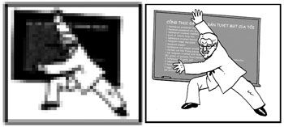
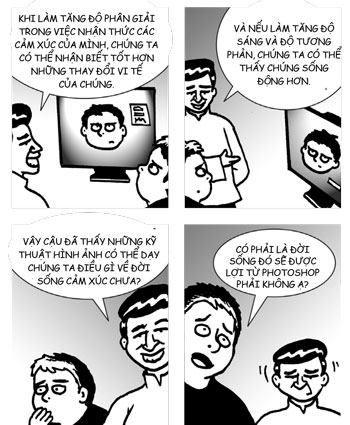
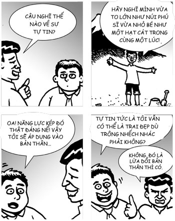
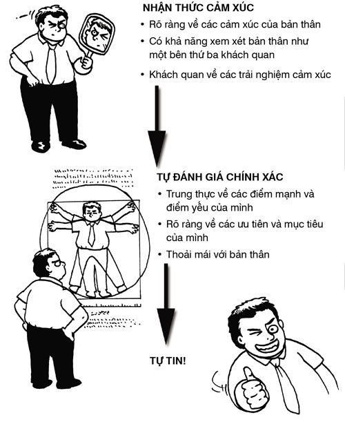
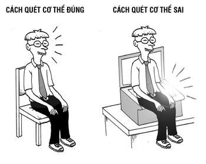
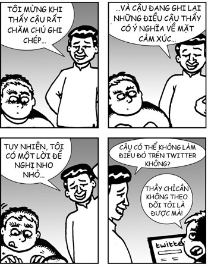
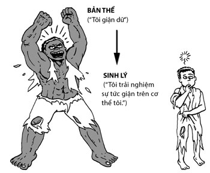

# Chương 4: SỰ TỰ TIN HỮU CƠ
### Nhận thức về bản thân dẫn đến tự tin về bản thân

> *Bạn không thể giải quyết một vấn đề với cùng một tâm trí đã tạo ra nó.*  
> — **Albert Einstein**

Ngày xửa ngày xưa, ở nước Ấn Độ cổ đại, một tên trộm đang chạy trốn lính gác thì nhìn thấy một người ăn xin ngủ trong một con hẻm tối. Hắn ta bí mật cho một món đồ trang sức nhỏ nhưng vô giá vừa ăn cắp được vào túi của người ăn xin. Sau đó, hắn chạy đi, với ý định sẽ quay lại và ăn trộm từ người ăn xin sau khi đã thoát khỏi lính gác. Đến đêm, tên trộm bị lính gác đâm chết. Người ăn xin bỗng dưng vớ bở. Trong túi của mình, ông có đủ tài sản để sống một cuộc sống dư dả, nhưng ông chưa từng một lần kiểm tra túi, nên không bao giờ biết được bí mật kia. Ông sống suốt phần đời còn lại của mình là một người ăn xin.

Bạn không bao giờ biết rằng bạn sẽ tìm thấy gì khi nhìn vào bên trong – chúng có thể ẩn chứa những kho báu bí mật đấy.

## SỰ RÕ RÀNG

Chương này sẽ đề cập đến việc nhìn vào bên trong bản thân. Nếu có một từ có thể tóm gọn cả chương thì đó là **sự rõ ràng**. Làm sâu sắc thêm nhận thức về bản thân tức là phát triển sự rõ ràng bên trong bản thân. Có hai phẩm chất cụ thể mà chúng tôi muốn phát triển – **độ phân giải** và **sự sống động** – như minh họa trong hình ở trên.

Bức tranh bên phải khác bức tranh bên trái ở hai khía cạnh. Đầu tiên là độ phân giải cao hơn, nên chúng ta có thể thấy nhiều chi tiết hơn. Thứ hai, độ sáng và độ tương phản cao hơn, nên chúng ta có thể thấy hình ảnh sống động hơn. Sự kết hợp giữa độ phân giải và sự sống động khiến hình ảnh hữu dụng hơn cho chúng ta. Tương tự, các phương pháp trong chương này sẽ giúp chúng ta nhận thức các cảm xúc của mình rõ ràng hơn ở hai khía cạnh. Đầu tiên, chúng ta làm tăng độ phân giải (hay độ chính xác) trong việc nhận thức các cảm xúc của mình, vì vậy, chúng ta có thể nhận thức các cảm xúc vào khoảnh khắc chúng khởi lên và mất đi, cũng như những thay đổi vi tế ở giữa. Thứ hai, chúng ta làm tăng độ sáng và độ tương phản của chúng, từ đó có thể nhìn chúng sống động hơn trước. Sự kết hợp này sẽ cho chúng ta những thông tin có độ trung thực cao và rất hữu dụng về đời sống cảm xúc.

*“Có phải là đời sống đó sẽ được lợi từ Photoshop phải không ạ?”*

## VỀ SỰ TỰ NHẬN THỨC

Daniel Goleman định nghĩa tự nhận thức tức là *“biết các trạng thái bên trong, các ưu tiên, các nguồn lực, và các trực giác của mình”*[^1]. Tôi thích định nghĩa này bởi nó gợi ý rằng tự nhận thức đã không còn đơn thuần chỉ là nhận thức về các trải nghiệm cảm xúc trong từng khoảnh khắc nữa; nó đã lan sang một vùng rộng hơn của “cái tôi”, chẳng hạn như sự am hiểu những ưu điểm cũng như nhược điểm của mình hay khả năng truy cập vào kho trí tuệ bên trong.

Tự nhận thức chính là lĩnh vực mấu chốt của trí thông minh cảm xúc. Từ đây mới tạo ra tất cả những thứ khác. Đó là bởi sự tự nhận thức có liên quan đến phần tân vỏ não (não tư duy) trong quá trình cảm xúc. Sự tự nhận thức mở đường vào trong những khu vực não tư duy có liên quan đến sự chú ý tập trung vào bản thân và ngôn ngữ, vì vậy khi chúng ta có sự tự nhận thức mạnh, các khu vực não đó sẽ được thắp sáng, và điều này có thể tạo ra sự khác biệt giữa hét vào mặt ai đó hay kiềm chế lại và tự nhủ: “Tôi không thể hét vào mặt ông ta; ông ta là CEO cơ mà!”. Sự tham gia của tân vỏ não trong mọi trải nghiệm cảm xúc là một bước cần thiết để đạt được khả năng kiểm soát cuộc sống cảm xúc. Mingyur Rinpoche có một ẩn dụ nên thơ về điều này, ngài nói rằng, khoảnh khắc bạn có thể nhìn thấy một dòng sông đang giận dữ, thì bạn đã vượt lên trên nó rồi. Tương tự, khoảnh khắc mà bạn có thể nhìn thấy một cảm xúc, thì bạn không còn bị nhấn chìm trong nó nữa rồi.

## NHỮNG NĂNG LỰC TỰ NHẬN THỨC

Theo Daniel Goleman, năng lực cảm xúc là một khả năng có thể học được dựa trên trí thông minh cảm xúc, từ đó sẽ tạo ra kết quả xuất sắc trong công việc[^2]. Ông cho rằng, trong lĩnh vực tự nhận thức có ba năng lực cảm xúc là:

1. **Nhận thức cảm xúc:** Nhận ra cảm xúc của mình và các tác động của chúng
2. **Tự đánh giá chính xác:** Biết các điểm mạnh và giới hạn của mình
3. **Tự tin:** Cảm giác mạnh mẽ về giá trị và năng lực của bản thân.

Sự khác biệt chủ yếu giữa năng lực nhận thức cảm xúc và năng lực tự đánh giá chính xác là năng lực đầu hoạt động chủ yếu ở cấp độ sinh lý còn năng lực sau hoạt động chủ yếu ở cấp độ ý nghĩa. Nhận thức cảm xúc tức là nhận thức được chính xác các cảm xúc trong cơ thể, biết chúng đến từ đâu, và hiểu cách chúng tác động đến hành vi của mình. Ngược lại, năng lực tự đánh giá chính xác không chỉ là những cảm xúc nữa mà còn bao gồm cả kiến thức về bản thân trong vai trò là con người. Nó đặt ra những nghi vấn như: Điểm mạnh và điểm yếu của tôi là gì? Các nguồn lực và hạn chế của tôi là gì? Điều gì quan trọng đối với tôi? Năng lực tự đánh giá chính xác được xây dựng trên năng lực nhận thức cảm xúc.

Cả ba kỹ năng này đều rất hữu dụng trong cuộc sống và trong công việc. Ở Chương 1, chúng ta đã thảo luận về việc khi có được khả năng nhận thức cảm xúc mạnh, đặc biệt là trên cơ thể, thì sẽ tăng được khả năng chạm đến trực giác như thế nào. Ngoài ra, năng lực nhận thức cảm xúc còn có những tác động trực tiếp đến việc truyền động lực cho bản thân. Cách tốt nhất để chúng ta tự động viên chính mình là hòa hợp những việc làm của mình với những giá trị sâu thẳm nhất, và năng lực nhận thức cảm xúc mạnh mẽ sẽ chạm đến những giá trị này một cách có ý thức. Chúng ta sẽ khám phá điều này chi tiết hơn ở Chương 6, khi chúng ta xem xét về khía cạnh động lực.

Năng lực nhận thức cảm xúc thậm chí có thể ảnh hưởng trực tiếp lên lợi nhuận. Ví dụ, hai nhà tâm lý học tổ chức là Cary Cherniss và Robert Caplan đã báo cáo rằng việc dạy các kỹ năng nhận thức cảm xúc cho các chuyên viên tư vấn tài chính tại American Express Financial Advisors đã tạo ra kết quả là làm tăng doanh thu bình quân tính trên mỗi chuyên viên[^3]. Những chuyên viên tư vấn tài chính đó đã học được cách xác định những phản ứng cảm xúc của mình trong các tình huống khó khăn, cũng như nhận thức được nhiều hơn những lời tiêu cực mà họ nói với chính mình, những lời khiến họ nghi ngờ bản thân và xấu hổ. Khả năng nhận thức cảm xúc đó giúp họ áp dụng các chiến lược giải quyết và làm việc hiệu quả hơn, kiếm được nhiều tiền hơn, đem lại cho khách hàng những lời tư vấn tài chính tốt hơn. (Sự việc liên quan: Tôi đã dạy chuyên viên tài chính riêng của mình thiền chánh niệm, nhưng anh ta nghĩ tôi chỉ đang đối xử tốt với anh ta mà thôi.)

Năng lực tự đánh giá chính xác còn được gọi là “năng lực khách quan về bản thân”. Nó hữu dụng cho tất cả mọi người, nhưng đặc biệt hữu dụng cho các nhà quản lý. Daniel Goleman đã nói như sau:

> *Với hàng trăm quản lý đến từ 12 tổ chức khác nhau thì năng lực tự đánh giá chính xác chính là dấu hiệu của những người làm việc vượt trội... Các cá nhân có năng lực tự đánh giá chính xác nhận thức rõ các khả năng và giới hạn của mình, tìm kiếm những lời nhận xét và học hỏi từ các sai lầm. Họ biết họ cần cải thiện ở đâu và khi nào họ nên làm việc với những người khác có các thế mạnh bổ sung cho họ. Một nghiên cứu về vài trăm người làm công việc trí óc – nhà khoa học máy tính, kiểm toán viên, v.v – tại các công ty như AT&T, 3M... đã phát hiện ra rằng tự đánh giá chính xác là năng lực được tìm thấy trong gần như tất cả những người làm việc giỏi nhất. Trên bảng đánh giá năng lực, những người làm việc trung bình thường đánh giá quá cao điểm mạnh của bản thân, trong khi những người làm việc xuất sắc hiếm khi làm thế; nếu có thì những người làm việc xuất sắc có xu hướng đánh giá thấp năng lực của họ, một chỉ báo cho thấy rằng bên trong họ có tiêu chuẩn rất cao.*[^4]

Về cơ bản, không có ai hoàn hảo, và năng lực tự đánh giá chính xác giúp chúng ta thành công bất chấp những hạn chế của mình.

Tự tin là một năng lực rất mạnh. Norman Fischer đã đưa ra một miêu tả rất đáng yêu về sự tự tin đích thực:

> *Tự tin không phải là tự phụ... Khi bạn thực sự tự tin, cái tôi của bạn sẽ mềm dẻo: tùy tình huống, bạn có thể nắm lấy cái tôi hoặc buông bỏ nó để học một cái gì đó hoàn toàn mới thông qua việc lắng nghe. Và nếu bạn phát hiện ra rằng bạn không thể buông bỏ cái tôi, ít nhất bạn biết điều đó. Bạn có thể thừa nhận điều đó với bản thân. Cần rất nhiều sự tự tin để đủ khiêm tốn nhận ra các giới hạn của bản thân mà không chỉ trích chính mình.*[^5]

Đến giờ, chúng ta đã cùng nhau đi qua hai chương và gần như đã trở thành những người bạn cũ, vì vậy đây là lúc tôi chia sẻ một bí mật nhỏ với bạn: Thực ra, tôi rất nhát. Khi tôi lớn lên, tôi nhút nhát và ngại giao tiếp xã hội, rất giống hình mẫu một đứa trẻ kỳ quặc mà khi mọi người nhìn vào, họ sẽ tiên đoán rằng sau này lớn lên, nó sẽ trở thành một kỹ sư thành công. Ngày nay, khi đã trưởng thành, mặc dù vẫn rất nhát, nhưng tôi thấy mình đã có thể thể hiện một sự tự tin tĩnh lặng nhưng không lẫn đi đâu được, dù cho tôi đang gặp những nhà lãnh đạo thế giới như Barack Obama, phát biểu trước đám đông, hay giải quyết với cảnh sát giao thông. Tôi đã xem đoạn băng mình phát biểu tại Liên Hợp Quốc, và tôi kinh ngạc trước sự tự tin mà mình thể hiện. Quái thật, nếu tôi không biết cái gã trong đoạn băng đó, chắc tôi đã nghĩ rằng hắn phải tuyệt vời lắm.

Tôi có thể thể hiện sự tự tin đó không phải bởi tôi nỗ lực để trông tự tin, mà bởi tôi đùa giỡn với cái tôi của chính mình, hoặc tôi có cảm giác về tầm quan trọng của bản thân. Trong phần lớn các tình huống, khi tương tác với mọi người, tôi để cái tôi của mình trở nên nhỏ bé, khiêm tốn, đa phần đặt nó sang một bên, và tập trung vào việc mang yêu thương, ích lợi cho bất kỳ ai tôi đang tương tác. Cùng lúc đó, tôi lại để cái tôi của mình phát triển đến bất kỳ kích cỡ nào, cho phép tôi không cảm thấy sợ hãi trước bất kỳ ai tôi đang tương tác, dù cho đó là Bill Clinton, Natalie Portman, cảnh sát giao thông, hay một đám đông đang xem tôi trên YouTube. Theo nghĩa đó, tôi coi tự tin là khả năng trở nên vừa to lớn như núi Phú Sĩ vừa nhỏ bé như một hạt cát trong cùng một lúc. Tôi để cái tôi của mình vừa lớn vừa nhỏ đồng thời, và tôi cười thầm vào sự phi lý của nó. Đó là bí mật để tự tin của một kỹ sư nhát gan.

Không có gì ngạc nhiên khi tự tin rất hữu dụng trong công việc, đã có nhiều nghiên cứu chứng minh tầm quan trọng của tự tin trong việc đạt được khả năng làm việc xuất sắc. Ví dụ, một nghiên cứu của một chuyên gia nổi tiếng về trí thông minh cảm xúc, Richard Boyatzis, đã cho thấy tự tin là một yếu tố quan trọng tạo ra sự khác biệt giữa người quản lý xuất sắc và người quản lý trung bình[^6]. Một phân tích lớn về 114 nghiên cứu cũng chỉ ra rằng việc tin mình có thể thực hiện được một điều gì đó (một dạng của sự tự tin) có mối quan hệ cùng chiều với năng lực làm việc, thậm chí nó có thể còn hiệu quả hơn các chiến lược như đặt mục tiêu, vốn đã được biết đến rộng rãi là giúp cải thiện hiệu quả làm việc[^7].

*“Oai năng lực kép đó thật đáng nể! Vậy tôi sẽ áp dụng vào bản thân... Tự tin tức là tôi vẫn có thể là trai đẹp dù trông nhếch nhác phải không?”

*“Không, đó là lừa dối bản thân thì có.”**

## TỪ NĂNG LỰC NHẬN THỨC CẢM XÚC ĐẾN SỰ TỰ TIN

Một cách dễ dàng để tự tin là tham gia một buổi diễn thuyết truyền động lực mà ở đó, có một người nói thứ tiếng Anh chuẩn, không bị lẫn cái chất giọng buồn cười của tôi, hét vào mặt bạn và bảo bạn bạn tuyệt vời đến thế nào. “Bạn có thể thành công! Bạn rất tuyệt vời! Bạn có thể làm được!”. Và mọi người vỗ tay. Và tất cả chúng ta về nhà cảm thấy tuyệt vời về bản thân. Điều này có thể kéo dài trong ba ngày. Tuy nhiên, theo kinh nghiệm của tôi, nguồn tự tin bền vững nhất đến từ sự hiểu biết sâu sắc bản thân và sự trung thực về bản thân không giấu giếm.

Trong chuyên ngành kỹ sư, tôi coi điều đó giống như việc am hiểu hai chế độ quan trọng: **chế độ thất bại** và **chế độ phục hồi**. Nếu tôi có thể hiểu một hệ thống thấu đáo đến mức biết chính xác nó thất bại như thế nào, thì tôi cũng biết khi nào nó không thất bại. Khi đó, tôi có thể cực kỳ tự tin vào hệ thống, bất chấp việc biết rằng nó không hoàn hảo, vì tôi biết cách điều chỉnh cho từng tình huống.

Ngoài ra, nếu tôi biết chính xác cách hệ thống phục hồi sau thất bại, tôi có thể tự tin ngay cả khi nó thất bại vì tôi biết các điều kiện có thể giúp hệ thống trở lại đủ nhanh đến mức thất bại cũng không còn là điều quan trọng nữa. Tương tự, bằng việc hiểu biết tâm trí, cảm xúc, và khả năng của mình, tôi có thể có được sự tự tin về bản thân bất chấp việc tôi gặp nhiều thất bại và bất chấp việc tôi trông giống như một kẻ thất bại.

Tôi đã có cơ hội kiểm tra điều này khi gần đây được phát biểu tại Lễ hội Hòa bình Thế giới ở Berlin. Tôi vô cùng căng thẳng khi ở trong một ban toàn những người tuyệt vời hơn tôi gấp chục lần. Họ gồm một người đạt giải Nobel Hòa bình, một bộ trưởng, một nhà từ thiện nổi tiếng, và bạn tôi, Deepak Chopra, trong khi tôi chỉ là một gã nào đó ở Google. Tôi thấy mình như một đứa trẻ ngồi ở bàn người lớn. Tệ hơn, tôi luôn phải dành nhiều thời gian để chuẩn bị cho việc nói trước đám đông bởi để kết hợp các từ tiếng Anh một cách hợp lý, tôi cần phải trải qua một quá trình tư duy xử lý có ý thức. Việc nói và nghĩ cùng một lúc rất khó đối với tôi. Lần này, do chỉ có thể biết người dẫn chương trình sẽ hỏi cái gì trước khi sự kiện bắt đầu đúng một phút, nên tôi không thể chuẩn bị mọi thứ thích đáng.

Thật may là các bài tập thiền của tôi đã phát huy tác dụng. Đầu tiên, tôi nhớ phải đối xử với cái tôi của mình bằng sự hài hước và để nó đủ nhỏ sao cho “cái tôi” không còn quan trọng, nhưng đủ lớn để tôi cảm thấy hoàn toàn thoải mái với việc phát biểu bên cạnh một người đạt giải Nobel Hòa bình trong một hội thảo về hòa bình như thể tôi ngang hàng với người đó. Sau đó tôi nhớ tới các điểm mạnh và điểm yếu của mình – ví dụ, tôi biết tôi là một chuyên gia về các phương pháp trí tuệ trong môi trường công sở nhưng không biết gì về việc tạo ra các cơ sở hạ tầng cho hòa bình quốc gia, vì vậy tôi tập trung vào việc tăng thêm giá trị ở nơi tôi có thể đóng góp nhiều nhất. Tôi cũng nhắc nhở bản thân rằng điểm mạnh chính của mình là khả năng đóng góp vào bầu không khí hòa bình và vui vẻ ở trong phòng, vì vậy tôi sử dụng Thiền Vui Vẻ (xem Chương 3) càng nhiều càng tốt. Cuối cùng, tôi hiểu rằng chế độ thất bại tức thì của mình là bị loạn từ ngữ tiếng Anh khi đang nói, cũng như chế độ phục hồi là hít sâu, cười, duy trì tỉnh thức, và không để việc thỉnh thoảng lắp ba lắp bắp làm phiền mình. Áp dụng tất cả những chiến lược dựa trên năng lực nhận thức bản thân này, tôi đã có thể duy trì sự tự tin trong toàn bộ thời gian. Tôi mừng là tôi đã học thứ này.

Hiểu biết bản thân sâu sắc và trung thực với bản thân không giấu giếm, hai điều kiện cần thiết cho sự tự tin bền vững, tức là không có gì phải che giấu với chính mình. Nó đến từ việc tự đánh giá chính xác. Nếu có thể tự đánh giá chính xác, chúng ta có thể nhìn rõ ràng và khách quan những điểm mạnh lớn nhất và những điểm yếu lớn nhất của chính mình. Chúng ta trở nên trung thực với bản thân về những ham muốn đen tối nhất và những nguyện vọng thiêng liêng nhất của mình. Chúng ta biết về những ưu tiên sâu sắc nhất trong đời, điều gì là quan trọng, và điều gì không quan trọng mà chúng ta có thể buông bỏ. Cuối cùng, chúng ta đạt đến một điểm khiến chúng ta thoải mái với bản thân. Không có bí mật khủng khiếp nào mà chúng ta chưa biết về nó. Không có gì về bản thân mà chúng ta không thể giải quyết. Đây là nền tảng của sự tự tin.

Năng lực tự đánh giá chính xác xuất phát từ năng lực nhận thức cảm xúc mạnh. Tôi coi nó là khả năng nhận được dữ liệu cảm xúc ở một tỷ lệ tín hiệu cao hơn nhiều so với tiếng ồn (tức là, thu được tín hiệu sạch). Để phát triển năng lực nhận thức cảm xúc, chúng ta phải nghiên cứu cẩn thận các trải nghiệm cảm xúc của mình. Chúng ta phải giống như một huấn luyện viên đang luyện ngựa; bạn càng quan sát cẩn thận ngựa trong các tình huống khó khăn, bạn càng hiểu các xu hướng cũng như hành vi của nó, và bạn càng thành thạo trong việc đối phó với nó. Với sự rõ ràng đó, chúng ta tạo ra một không gian cho phép chúng ta xem xét cuộc sống cảm xúc của mình như thể một bên thứ ba khách quan. Nói cách khác, chúng ta đạt được sự khách quan, và chúng ta bắt đầu nhận thức từng trải nghiệm cảm xúc một cách rõ ràng và khách quan đúng như bản chất của nó. Đây chính là tín hiệu sạch tạo nên các điều kiện để tự đánh giá chính xác.

Như vậy, giữa ba năng lực cảm xúc của tự nhận thức có một mối quan hệ tuyến tính đơn giản – khi có khả năng nhận thức cảm xúc mạnh mẽ, chúng ta sẽ tự đánh giá chính xác hơn, và khi tự đánh giá chính xác hơn, chúng ta sẽ tự tin hơn.

## PHÁT TRIỂN KHẢ NĂNG NHẬN THỨC BẢN THÂN

Trong đời có những thứ hiển nhiên đến mức chúng ta không thể thấy chúng nếu chỉ nhìn theo cách thông thường. Một ví dụ là sự tương đồng giữa khả năng nhận thức bản thân và thiền. Ví dụ, hãy so sánh hai định nghĩa được hai người khổng lồ trong lĩnh vực của mình đưa ra:

> *Khả năng nhận thức bản thân... là một chế độ trung tính giúp duy trì sự tự kiểm điểm bản thân ngay trong những cảm xúc hỗn loạn nhất.*  
> — **Daniel Goleman**[^8]

> *Thiền là chú ý theo một cách thức nhất định: có mục đích, trong thời điểm hiện tại, và không phán xét.*  
> — **Jon Kabat-Zinn**[^9]

Về cơ bản thì họ đang nói về cùng một thứ! Nhận thức bản thân (theo định nghĩa của Dan) là thiền (theo định nghĩa của Jon). Đây thực sự là kiến thức chủ chốt khiến tôi phát triển Tìm Kiếm Bên Trong Bạn. Bản thân là một người thực hành, tôi biết rằng thiền có thể tập được, và nếu khả năng nhận thức bản thân về cơ bản chính là thiền, thì nó cũng phải tập được theo những cách tương tự. Ra rồi! Chính hiểu biết này và việc đi theo dòng câu hỏi đó đã dẫn đội của tôi và tôi đến việc phát triển một chương trình hoàn chỉnh cho trí thông minh cảm xúc.

Một so sánh truyền thống về điều này là lá cờ đang tung bay trên cột cờ. Lá cờ đại diện cho tâm trí. Trong sự hiện diện của các cảm xúc mạnh, tâm trí có thể rối loạn như một lá cờ đang bay phần phật trong gió. Cột cờ đại diện cho thiền – nó khiến tâm trí ổn định và vững chãi bất chấp mọi chuyển động cảm xúc. Sự ổn định này là thứ cho phép chúng ta xem xét bản thân với sự khách quan của bên thứ ba.

Khi nói đến lá cờ và tâm trí, tự nhiên tôi nhớ đến một câu chuyện đùa về thiền. Rất đông người đang tụ tập để lắng nghe một bài nói chuyện của một giảng viên thiền. Một khán giả bị xao lãng bởi lá cờ đang bay và nói: “Cờ đang chuyển động kìa”. Một người khác nói: “Không, gió đang chuyển động”. Người thứ ba, khán giả khôn ngoan nhất, nói: “Không, những người bạn của tôi, tâm trí đang chuyển động chứ”. Người thứ tư, thực sự tức giận, nói: “Miệng đang chuyển động thì có”.

Chỉ cần thiền chánh niệm theo cách đơn giản nhất, cũng có thể giúp phát triển năng lực tự nhận thức. Tuy nhiên, chúng tôi cảm thấy các phương pháp chính thống có thể hiệu quả hơn, vì vậy chúng tôi giới thiệu hai phương pháp chính thống trong lớp của mình, cả hai đều dựa trên thiền. Phương pháp đầu tiên, **quét cơ thể**, hoạt động ở cấp độ sinh lý và hiệu quả nhất với việc phát triển năng lực nhận thức cảm xúc. Phương pháp thứ hai, **ghi chép**, hoạt động ở cấp độ ý nghĩa và hiệu quả nhất với việc phát triển năng lực tự đánh giá chính xác.

Hai phương pháp này, bằng việc hỗ trợ sự am hiểu về bản thân và trung thực với bản thân, cũng tạo ra các điều kiện cho sự tự tin.

## QUÉT CƠ THỂ

Trong Chương 1, chúng tôi đã nói đến việc cảm xúc là một trải nghiệm sinh lý, do đó cách tốt nhất để phát triển năng lực nhận thức cảm xúc ở độ phân giải cao là áp dụng thiền với cơ thể. Cách đơn giản nhất để làm điều này là mang thiền vào cơ thể mọi lúc. Bất cứ khi nào bạn hướng sự chú ý trọn vẹn vào cơ thể mình, bạn tạo ra điều kiện cho các thay đổi về thần kinh, từ đó cho phép bạn trở nên ngày càng nhạy cảm về cơ thể mình và kết quả là nhạy cảm cả về quá trình cảm xúc.

Với những ai thích làm mọi thứ theo cách hệ thống, có một phương pháp chính thống tên là quét cơ thể. Đây là một trong những phương pháp cốt lõi trong khóa học Giảm Căng Thẳng Bằng Thiền (MSBR) rất thành công của Jon Kabat-Zinn. Bản thân phương pháp này rất đơn giản: chúng ta chỉ cần mang sự chú ý trong từng khoảnh khắc, không phán xét đến các phần khác nhau trên cơ thể một cách hệ thống, bắt đầu từ đỉnh đầu rồi di chuyển dần xuống đầu ngón chân (hoặc ngược lại), chú ý tất cả các cảm giác hoặc sự không có cảm giác. Hãy nhớ rằng điều quan trọng là chú ý, chứ không phải cảm giác. Do đó, không quan trọng là bạn trải nghiệm được các cảm giác hay không, quan trọng là bạn chú ý.

Trong MSBR, tùy vào giảng viên, phương pháp này có thể kéo dài từ 20 đến 45 phút. Trong Tìm Kiếm Bên Trong Bạn, phương pháp này ngắn hơn, chỉ tập trung vào những bộ phận cơ thể có liên quan nhất đến trải nghiệm cảm xúc. Ngoài ra, vì Tìm Kiếm Bên Trong Bạn chủ yếu là khóa học về trí thông minh cảm xúc, nên chúng tôi cũng mời những người tham gia trải nghiệm những tương quan của cảm xúc được thể hiện trên cơ thể trong nửa sau của khoảng thời gian ngồi thiền.

### BÀI TẬP THỰC HÀNH: QUÉT CƠ THỂ

#### Ổn định sự chú ý
Chúng ta hãy bắt đầu bằng việc ngồi thoải mái trong hai phút. Ngồi trong một tư thế mà bạn cảm thấy vừa thư giãn vừa cảnh giác trong cùng một lúc, dù điều đó có nghĩa là gì với bạn đi nữa.

Giờ chúng ta hãy thở tự nhiên và mang sự chú ý rất nhẹ nhàng đến hơi thở. Bạn có thể mang sự chú ý đến hai lỗ mũi, bụng, hoặc toàn bộ cơ thể đang thở, dù điều đó có nghĩa là gì với bạn đi nữa. Nhận thức hơi thở vào, hơi thở ra, cùng các khoảng dừng ở giữa.

#### Quét cơ thể
* **Đầu:** Hãy mang sự chú ý đến đỉnh đầu, tai và nửa sau đầu. Chú ý đến các cảm giác, hoặc sự không có cảm giác, trong một phút.
* **Mặt:** Giờ thì hãy di chuyển sự chú ý đến khuôn mặt. Trán, mắt, má, mũi, môi, miệng và bên trong miệng (lợi, lưỡi) trong một phút.
* **Cổ và vai:** Di chuyển sự chú ý đến cổ, bên trong họng và vai trong một phút.
* **Lưng:** Di chuyển sự chú ý đến lưng dưới, lưng giữa, và lưng trên trong một phút. Lưng phải mang rất nhiều gánh nặng và chịu rất nhiều sức ép. Vì vậy chúng ta hãy trao cho lưng của mình sự chú ý đầy yêu thương mà nó xứng đáng được nhận.
* **Bụng và ngực:** Giờ thì di chuyển sự chú ý đến ngực và bụng trong một phút. Nếu có thể, hãy cố mang sự chú ý đến các bộ phận bên trong, dù điều đó có nghĩa là gì với bạn đi nữa.
* **Toàn bộ cơ thể cùng một lúc:** Và giờ, mang sự chú ý đến toàn bộ cơ thể cùng một lúc trong một phút.

#### Quét cảm xúc
Bạn có phát hiện ra bất kỳ cảm xúc nào trên cơ thể mình không? Nếu có, hãy chỉ chú ý đến sự tồn tại của nó trên cơ thể. Nếu không, hãy chỉ chú ý đến sự thiếu vắng của cảm xúc, và nắm bắt lấy nó nếu nó khởi lên trong hai phút tiếp theo.

#### Cảm xúc tích cực
Giờ chúng ta hãy cố gắng trải nghiệm một cảm xúc tích cực trên cơ thể.

Hãy nhớ đến một sự kiện vui vẻ, hạnh phúc hoặc một thời điểm mà bạn hoạt động ở mức độ tối đa và vô cùng năng suất hoặc một thời điểm mà bạn thấy tự tin.

Hãy trải nghiệm cảm giác về cảm xúc tích cực. Giờ thì mang sự chú ý đến cơ thể bạn. Cảm xúc tích cực đó thể hiện như thế nào trên cơ thể? Trên mặt? Cổ, ngực, lưng? Bạn đang thở như thế nào? Có gì khác trong mức độ căng thẳng không? Chúng ta hãy trải nghiệm nó trong ba phút.

#### Trở lại mặt đất
Giờ chúng ta hãy trở lại hiện tại. Nếu bạn phát hiện ra một ý nghĩ đong đầy cảm xúc, hãy buông thả nó đi. Mang sự chú ý đến hoặc là cơ thể bạn hoặc là hơi thở bạn, tùy theo tâm trí bạn cảm thấy ổn định hơn ở đâu. Và chúng ta hãy ổn định tâm trí ở đó trong hai phút.

*(Ngưng dài)*

Cảm ơn sự chú ý của các bạn.

Chú ý rằng chúng tôi chỉ mời bạn mang đến một cảm xúc tích cực trong bài tập này, chứ không phải cảm xúc tiêu cực. Chúng tôi đợi đến chương sau mới thực hiện một bài tập liên quan đến cảm xúc tiêu cực vì đó là khi chúng tôi giới thiệu đến các bạn các công cụ để ứng phó với nó. Trong lớp, chúng tôi cũng không muốn đề nghị những người tham gia mang đến các cảm xúc tiêu cực trước khi giới thiệu các công cụ đối phó vì làm vậy sẽ khiến các luật sư của chúng tôi tức giận, mà chúng tôi lại thích các luật sư của mình.

Tôi muốn khuyến khích mọi người thử phương pháp quét cơ thể chính thống vì nó có nhiều lợi ích quan trọng. Đầu tiên, nó hiệu quả hơn so với việc chỉ đơn thuần mang thiền đến các hoạt động hàng ngày. Lý do chính là sự tập trung. Khi bạn thực hiện các hoạt động thông thường, nhiều khả năng bạn chỉ có thể dành một phần nhỏ sự chú ý của mình cho cơ thể, trừ phi bạn có một tâm trí đã được rèn luyện rất kỹ càng, giống như Thích Nhất Hạnh, hoặc hành động của bạn đòi hỏi phải tập trung toàn bộ sự chú ý vào cơ thể, ví dụ như khi đang thi khiêu vũ, hoặc bạn chính là Thích Nhất Hạnh đang tham gia thi khiêu vũ. Ngược lại, nếu bạn đang không làm gì khác ngoài việc quét cơ thể theo cách chính thống, thì bạn có thể tập trung nhiều hơn sự chú ý của mình vào cơ thể, và sự chú ý đó chính là thứ kích thích sự thay đổi về thần kinh.

Trong lớp học Tìm Kiếm Bên Trong Bạn của chúng tôi có một người quản lý tên là Jim. Sau một vài tuần thực hành quét cơ thể, anh nói với tôi: “Tôi nhận ra rằng tôi đã đè nén các cảm xúc vào trong cơ thể của mình. Điều đó khiến cơ thể tôi kiệt sức và đây là nguyên nhân làm tôi thường xuyên nhỡ công việc. Phương pháp này đã giúp tôi đi làm thường xuyên hơn”. Dưới Jim có chín người báo cáo trực tiếp cho anh, vì vậy việc anh thực hành phương pháp này sẽ đem lại lợi ích cho ít nhất 10 người tại công sở. (“Jim” không phải tên thật nhưng tôi bảo đảm với bạn là anh ta có thật.)

*“Hãy quét cơ thể mình đi!”*

Lợi ích thứ hai của việc quét cơ thể là nó giúp bạn ngủ. Tôi biết điều đó vì trong MSBR, các học viên thực hành quét cơ thể trong tư thế nằm, và trong tất cả các lớp đều có ít nhất một người rơi vào tình trạng ngáy (trong khi những người khác đang nghĩ rằng: “Đừng có ngáy nữa. Tôi đang cố thiền đây, tức thật!”). Tôi không chắc lắm về lý do tại sao việc quét cơ thể lại rất có lợi cho việc ngủ, nhưng từ kinh nghiệm bản thân, tôi có thể nghĩ ra một vài lý do. Khi mang sự chú ý đến cơ thể mình, chúng ta đang giúp nó thư giãn. Những căng thẳng trong cơ thể thường xuyên bị dồn ứ lại vì chúng ta không chú ý đến cơ thể, vì vậy chỉ riêng việc chúng ta chú ý thôi là đã giúp giải quyết vấn đề đó rồi. Ngoài ra, quét cơ thể cùng những bài tập thiền nhẹ nhàng khác giúp tâm trí được nghỉ ngơi. Vậy là việc quét cơ thể giúp thư giãn cả cơ thể cũng như tâm trí, và khi bạn thực hiện trong tư thế nằm thì rất dễ chìm vào giấc ngủ. Nếu bạn có vấn đề về ngủ thì phương pháp này có khi giúp được bạn đấy.

## GHI CHÉP

Ghi chép là bài tập khám phá bản thân bằng cách viết cho chính mình. Nó là một bài tập quan trọng giúp bạn khám phá những điều nằm trong tâm trí vẫn còn chưa rõ ràng và thông suốt. Thường thì khi viết, chúng ta đang cố gắng truyền đạt ý nghĩ cho một người nào đó. Bài tập này thì khác. Bạn không cố gắng truyền đạt ý nghĩ cho ai cả. Thay vào đó, bạn đang cố gắng để ý nghĩ của mình tuôn chảy vào trang giấy để bạn có thể xem cái gì sẽ xuất hiện.

Bài tập này rất đơn giản. Bạn dành ra cho mình một khoảng thời gian nhất định, giả sử là ba phút, và bạn được cho (hoặc bạn tự cho mình) một gợi ý, với mục đích của chúng ta thì gợi ý đó sẽ là một câu mở, chẳng hạn như: “Điều tôi đang cảm thấy ngay lúc này là...”. Trong ba phút đó, hãy viết ra bất cứ điều gì xuất hiện trong tâm trí bạn. Bạn có thể viết theo nội dung gợi ý, hoặc bạn có thể viết về bất cứ điều gì khác xuất hiện trong tâm trí. Cố đừng nghĩ mình sẽ viết gì – cứ viết thôi. Không quan trọng là bạn bám sát gợi ý đến đâu; cứ để tất cả suy nghĩ của bạn tuôn chảy vào trang giấy. Chỉ có một quy tắc duy nhất: đừng dừng viết cho đến khi hết thời gian. Nếu bạn hết thứ để viết, thì cứ viết: *Tôi hết thứ để viết. Tôi không còn gì để viết. Tôi vẫn không còn gì để viết...* cho đến khi bạn có thứ gì đó để viết trở lại. Hãy nhớ rằng, bạn đang viết cho chính bản thân bạn, vì chính bản thân bạn, và bạn sẽ không bao giờ phải cho người khác xem nếu bạn không muốn. Vì vậy, bạn có thể làm điều này với sự trung thực tuyệt đối.

Bạn có thể coi việc ghi chép là một dạng thiền suy nghĩ và cảm xúc; đặt sự chú tâm trong từng khoảnh khắc và không phán xét vào suy nghĩ và cảm xúc khi chúng khởi lên; đồng thời hỗ trợ cho dòng chảy của chúng bằng cách đặt chúng lên giấy. Có một vài cách nhìn khác về điều này. Cách nhìn theo kiểu kỹ sư của tôi là nó giống như đổ não ra giấy mà không cần lọc – đổ dòng suy nghĩ của bạn ra giấy. Cách nhìn văn thơ hơn là coi các suy nghĩ như một dòng chảy nhẹ nhàng và cố gắng bắt được dòng chảy đó trên trang giấy.

Bài tập này đơn giản đến mức có thể bạn sẽ nghĩ không biết nó có tác dụng gì không. Lần đầu tiên nghe Norman Fischer giải thích tôi cũng nghĩ như vậy nhưng một nghiên cứu đã khiến tôi sửng sốt. Trong một nghiên cứu, Stefanie Spera, Eric Buhrfeind, và James Pennebaker đã đề nghị một nhóm những người thất nghiệp viết về các cảm xúc của họ cho chính họ trong năm ngày liên tiếp, mỗi ngày 20 phút[^10]. Tỷ lệ những người này tìm được công việc mới cao hơn nhiều so với những người không ở trong nhóm viết. Sau tám tháng, 68,4% số họ tìm được việc làm, trong khi tỷ lệ chỉ là 27,3% ở nhóm kia. Những con số đó đã khiến tôi kinh ngạc. Bất cứ lúc nào một phương pháp có thể tạo ra sự khác biệt vài điểm phần trăm là bạn có thể xuất bản một bài viết rồi. Nhưng ở đây chúng ta không nói về 3%. Chúng ta đang nói về hơn 40%! Và tất cả những gì cần làm chỉ là 100 phút làm theo một phương pháp. Thật không thể tin được.

Bạn phải viết bao nhiêu mới có thể đạt được một sự thay đổi đáng kể? Một bài báo đăng ngày 2 tháng 3 năm 2009 trên trang *Very Short List (VSL): Science*[^11] đã viết như sau:

> 20 năm trước, James Pennebaker, nhà tâm lý học thuộc Đại học Texas, đã kết luận rằng những sinh viên dành 15 phút mỗi ngày trong vài ngày liên tiếp để viết về các trải nghiệm cá nhân có ý nghĩa nhất của mình có cảm giác tốt hơn, kết quả xét nghiệm máu khỏe mạnh hơn và được điểm cao hơn ở trường. Nhưng một nghiên cứu mới từ trường đại học Missouri đã cho thấy viết một vài phút cũng đủ rồi.
> 
> Các nhà nghiên cứu đã đề nghị 49 sinh viên dành hai phút trong hai ngày liên tiếp để viết về một thứ gì đó họ thấy có ý nghĩa về mặt cảm xúc. Những người tham gia đã thể hiện sự cải thiện ngay lập tức về tâm trạng cũng như được đánh giá cao hơn trong các tiêu chuẩn hạnh phúc về mặt sinh lý. Nghiên cứu này đã kết luận rằng không cần thiết phải nhìn sâu hơn vào bên trong; chỉ cần “dành một ngày gợi ra chủ đề và ngày hôm sau để khám phá nhanh nó” là đủ để nhìn nhận đúng mọi việc rồi.

Bốn phút có thể tạo ra một sự khác biệt đáng kể. Tiếng nổ đó chính là âm thanh tâm trí tôi đã bị thổi bay.

Để thực hiện bài tập ghi chép hàng ngày này một cách vui vẻ, hãy viết những lời gợi ý khác nhau lên nhiều mảnh giấy, đặt chúng vào trong một cái bể cá (tôi khuyên bạn nên dùng một cái bể cá không có nước), sau đó mỗi ngày chọn ngẫu nhiên một hoặc hai mảnh giấy. Sau đây là một số lời gợi ý tham khảo:
* Điều tôi đang cảm thấy ngay lúc này là...
* Tôi đang nhận thấy rằng...
* Điều thúc đẩy tôi là...
* Tôi được truyền cảm hứng bởi...
* Hôm nay, tôi khao khát...
* Điều làm tổn thương tôi là...
* Tôi ước...
* Những người khác đang...
* Tôi đã mắc phải một sai lầm hạnh phúc...
* Tình yêu là...

*“Tôi mừng khi thấy cậu rất chăm chú ghi chép... và cậu đang ghi lại những điều cậu thấy có ý nghĩa về mặt cảm xúc... Tuy nhiên, tôi có một lời đề nghị nho nhỏ... Cậu có thể không làm điều đó trên Twitter không?”

*“Thầy chỉ cần không theo dõi tôi là được mà!”**

### BÀI TẬP THỰC HÀNH: GHI CHÉP ĐỂ TỰ ĐÁNH GIÁ

#### Khởi động 1
Trước khi bắt đầu ghi chép, chúng ta hãy khởi động tâm trí.

Chúng ta hãy dành hai phút nghĩ về một hoặc nhiều trường hợp trong đó bạn phản ứng một cách tiêu cực với một tình huống khó khăn, và bạn rất không thỏa mãn với kết quả. Bạn cảm thấy rằng bạn làm rất tồi, và bạn ước rằng mình có thể thay đổi một điều gì đó. Nếu bạn đang xem xét nhiều trường hợp, hãy nghĩ xem có bất kỳ mối quan hệ hay khuôn mẫu nào không.

Giờ hãy dành một chút thời gian để thư giãn tinh thần. *(Ngưng 30 giây)*

**Gợi ý (hai phút một gợi ý):**
* *Những điều khiến tôi khó chịu là...*
* *Những điểm yếu của tôi là...*

#### Khởi động 2
Chúng ta hãy dành hai phút nghĩ về một hoặc nhiều trường hợp trong đó bạn phản ứng một cách tích cực với một tình huống khó khăn, và bạn rất thỏa mãn với kết quả. Bạn cảm thấy rằng bạn làm rất tốt. Nếu bạn đang xem xét nhiều trường hợp, bạn hãy nghĩ xem có bất kỳ mối liên hệ hay khuôn mẫu nào không.

Giờ hãy dành một chút thời gian để thư giãn tinh thần. *(Ngưng 30 giây)*

**Gợi ý (hai phút một gợi ý):**
* *Những điều khiến tôi vui vẻ là...*
* *Những điểm mạnh của tôi là...*

Dành một vài phút để đọc những điều bạn đã viết cho bản thân mình.

## CẢM XÚC CỦA TÔI KHÔNG PHẢI LÀ TÔI

Khi sự tự nhận thức của chúng ta trở nên sâu sắc hơn, cuối cùng chúng ta sẽ đạt đến một nhận thức rất quan trọng: **chúng ta không phải là cảm xúc của chúng ta**.

Chúng ta luôn coi cảm xúc của chúng ta là chúng ta. Điều này được thể hiện trong ngôn ngữ chúng ta sử dụng để miêu tả nó. Ví dụ, chúng ta nói: “Tôi giận dữ”, hoặc “Tôi hạnh phúc”, hoặc “Tôi buồn”, như thể sự giận dữ, hạnh phúc, hoặc nỗi buồn là chính chúng ta, hoặc đang trở thành con người chúng ta. Đối với tâm trí, cảm xúc của chúng ta trở thành chính bản thể của mình.

Nếu tập thiền đủ, cuối cùng bạn có thể nhận thấy một sự chuyển đổi vi tế nhưng rất quan trọng – bạn có thể bắt đầu nhận ra rằng cảm xúc chỉ đơn giản là những gì bạn cảm thấy, chứ không phải con người bạn. Cảm xúc chuyển từ bản thể (“tôi”) sang trải nghiệm (“tôi cảm thấy”). Nếu tập thiền nhiều hơn nữa, có thể có một sự chuyển đổi nữa, cũng vi tế nhưng rất quan trọng – bạn có thể bắt đầu coi cảm xúc đơn giản chỉ là hiện tượng sinh lý. Cảm xúc trở thành những gì chúng ta trải nghiệm trên cơ thể, vì vậy chúng ta chuyển từ “Tôi giận dữ” sang “Tôi trải nghiệm sự giận dữ trên cơ thể tôi”.

Sự chuyển đổi vi tế này cực kỳ quan trọng vì nó cho thấy chúng ta có khả năng làm chủ các cảm xúc. Nếu cảm xúc chính là tôi thì gần như tôi chẳng thể làm được gì. Tuy nhiên, nếu cảm xúc đơn giản chỉ là những gì tôi trải nghiệm trên cơ thể, thì việc cảm thấy tức giận sẽ giống như việc cảm thấy đau ở vai sau khi tập nặng; cả hai chỉ là những trải nghiệm sinh lý mà tôi có thể tác động đến. Tôi có thể làm dịu chúng. Tôi có thể phớt lờ chúng và đi ăn kem vì tôi biết rằng sau một vài giờ nữa, tôi sẽ đỡ. Tôi có thể trải nghiệm chúng một cách tỉnh thức. Về cơ bản, tôi có thể thực hiện các hành động đối với chúng vì chúng không phải là bản thể cốt lõi của tôi.

Trong các truyền thống thiền có một ẩn dụ rất đẹp cho điều này. Ý nghĩ và cảm xúc giống như đám mây – có đám mây đẹp, có đám mây đen – còn bản thể cốt lõi của chúng ta là bầu trời. Đám mây không phải là bầu trời; chúng chỉ là hiện tượng trên bầu trời, hết đến rồi lại đi. Tương tự, ý nghĩ và cảm xúc không phải là chúng ta; chúng chỉ đơn giản là hiện tượng trong tâm trí và cơ thể, hết đến rồi lại đi.

Với hiểu biết này, chúng ta có thể thay đổi bên trong chúng ta.

---
[^1]: Daniel Goleman, *Working with Emotional Intelligence* (New York: Bantam, 1998).
[^2]: Daniel Goleman, *Working with Emotional Intelligence*. Xem “Bộ khung năng lực cảm xúc” để biết định nghĩa về tự nhận thức.
[^3]: Cary Cherniss and Daniel Goleman, *The Emotionally Intelligent Workplace: How to Select for, Measure, and Improve Emotional Intelligence in Individuals, Groups, and Organizations* (Hoboken, NJ: Jossey-Bass, 2001).
[^4]: Cherniss and Goleman, *The Emotionally Intelligent Workplace*.
[^5]: Norman Fischer, *Taking Our Places: The Buddhist Path to Truly Growing Up* (San Francisco: HarperOne, 2004).
[^6]: Richard Boyatzis, *The Competent Manager: A Model for Effective Performance* (New York: Wiley, 1982).
[^7]: Alexander Stajkovic and Fred Luthans, “Phân tích về mối liên hệ giữa hiệu quả công việc và sự tự tin vào bản thân,” *Psychological Bulletin* 124, số 2 (1998): 240–261.
[^8]: Daniel Goleman, *Emotional Intelligence: Why It Can Matter More Than IQ* (New York: Bantam, 1995).
[^9]: Jon Kabat-Zinn, *Wherever You Go, There You Are: Mindfulness Meditation in Everyday Life* (New York: Hyperion, 1994).
[^10]: S. P. Spera, E. D. Buhrfeind, và J. W. Pennebaker, “Cách viết biểu cảm và giải quyết vấn đề mất việc,” *Academy of Management Journal* 37, số 3 (1994): 722-733.
[^11]: “Biết mình,” *Very Short List (VSL): Science* (2 tháng Ba, 2009), http://siybook.com/a/knowthyself.
