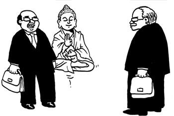
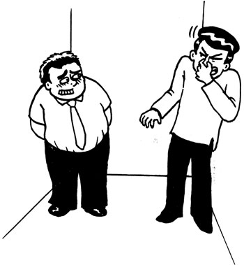
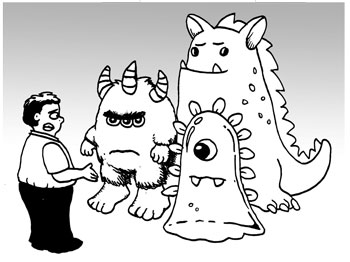
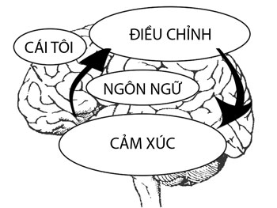
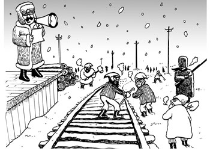
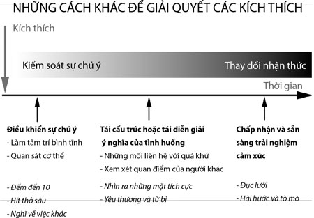
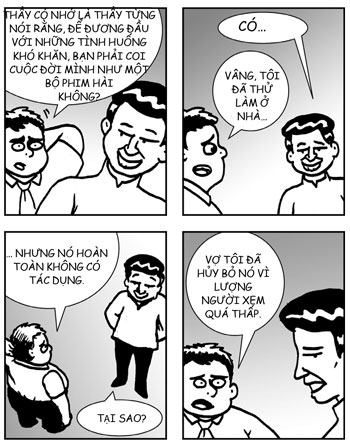
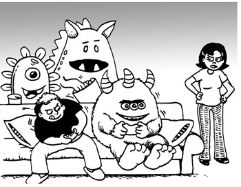

# Chương 5: ĐIỀU KHIỂN CẢM XÚC NHƯ THUẦN DƯỠNG MỘT CON NGỰA
### Phát triển sự tự chủ

> *Không có sự làm chủ nào lớn hơn hay sự làm chủ nào nhỏ hơn sự làm chủ bản thân.*  
> — **Leonardo da Vinci**

Chủ đề của chương này có thể tóm gọn trong sáu chữ: **Từ ép buộc đến lựa chọn**.

Ngày xửa ngày xưa ở Trung Hoa cổ đại, có một người đàn ông cưỡi ngựa ngang qua một người đàn ông khác đang đứng bên đường. Người đang đứng bên đường hỏi: “Này anh cưỡi ngựa, anh đang đi đâu vậy?”. Người cưỡi ngựa trả lời: “Tôi không biết. Hỏi con ngựa ấy”.

Câu chuyện này chính là một ẩn dụ về đời sống cảm xúc của chúng ta. Con ngựa đại diện cho cảm xúc của chúng ta. Chúng ta luôn cảm thấy bị cảm xúc của mình ép buộc phải làm một điều gì đó. Chúng ta cảm thấy chúng ta không thể kiểm soát con ngựa và chúng ta để nó dẫn chúng ta đi bất cứ nơi nào nó muốn. May mắn thay, hóa ra là chúng ta có thể chế ngự và điều khiển con ngựa. Để làm được điều đó, chúng ta bắt đầu từ việc am hiểu con ngựa, quan sát sở thích, thiên hướng, và hành vi của nó. Một khi đã am hiểu được con ngựa rồi, chúng ta sẽ học được cách giao tiếp và làm việc với nó một cách điêu luyện. Cuối cùng, nó sẽ đưa chúng ta đến bất cứ nơi nào chúng ta muốn. Vậy là chúng ta tạo ra lựa chọn cho chính mình. Khi đó, chúng ta có thể chọn cưỡi ngựa đi ngắm hoàng hôn và trông “ngầu” không kém gì John Wayne.

Chương trước, khi chúng ta khám phá sự tự nhận thức, sẽ nói về việc am hiểu con ngựa. Trong chương này, chúng ta sẽ tận dụng sự tự nhận thức để đạt được khả năng làm chủ các cảm xúc của chính mình. Nói cách khác, chúng ta sẽ học cách cưỡi ngựa.

## VỀ SỰ TỰ ĐIỀU CHỈNH

Khi nghĩ về sự tự điều chỉnh, chúng ta luôn coi đó là sự tự kiểm soát, như kiểu tự kiểm soát để không hét vào mặt sếp. Nếu đó là tất cả những gì các bạn nghĩ, thì hỡi những người bạn của tôi, các bạn đang bỏ lỡ tất cả những thứ ngon lành nhất đấy. Tự điều chỉnh hơn xa tự kiểm soát. Daniel Goleman đã xác định năm năng lực cảm xúc nằm dưới lĩnh vực tự điều chỉnh:

1. **Tự kiểm soát:** Kiềm chế các cảm xúc và xung động có thể gây hỗn loạn.
2. **Đáng tin cậy:** Duy trì các chuẩn mực về sự trung thực và chính trực.
3. **Tận tâm:** Nhận trách nhiệm về những việc làm của bản thân.
4. **Dễ thích nghi:** Linh hoạt để đáp ứng trước sự thay đổi.
5. **Đổi mới:** Thoải mái với các ý tưởng, cách tiếp cận và thông tin mới.

Có một điểm chung của năm năng lực này, đó là sự lựa chọn. Ai cũng muốn có tất cả những phẩm chất này. Ai chẳng muốn mình là người dễ thích nghi và đổi mới. Làm gì có ai không muốn duy trì các chuẩn mực về sự trung thực và chính trực? Song, có rất nhiều người không thành công trong việc duy trì được các phẩm chất này trong mọi lúc. Tại sao? Vì chúng ta thường cảm thấy bị cảm xúc của mình ép buộc đi sang hướng khác. Tuy nhiên, nếu chúng ta có khả năng biến sự ép buộc thành sự lựa chọn thì chúng ta có thể có được tất cả những phẩm chất này, và chúng ta có thể chọn thể hiện chúng ra nếu chúng ta muốn.

Khả năng biến sự ép buộc thành sự lựa chọn là chìa khóa mở ra tất cả những năng lực này.

## TỰ ĐIỀU CHỈNH KHÔNG PHẢI LÀ LẢNG TRÁNH HAY ĐÈ NÉN CẢM XÚC

Sau khi dạy Tìm Kiếm Bên Trong Bạn một thời gian, chúng tôi nhận ra rằng mặc dù giải thích sự tự điều chỉnh nghĩa là gì rất quan trọng, nhưng giải thích nó không là gì cũng quan trọng không kém. Có một lý do đơn giản là nhiều người nghĩ tự điều chỉnh chỉ đơn giản là đè nén các cảm xúc khó chịu. Thật may là không phải thế.

Tự điều chỉnh không phải là lảng tránh cảm xúc. Có những tình huống chúng ta nên cảm nhận các cảm xúc đau đớn. Ví dụ, khi người bạn thân nói với bạn một tin không vui, tốt nhất là bạn nên chia sẻ nỗi buồn với người bạn đó. Hoặc khi bạn là bác sỹ và phải nói với bệnh nhân một tin rất xấu, có thể bạn sẽ không muốn tránh cảm giác buồn. Chắc chắn bạn không muốn mình cười toe toét khi nói với bệnh nhân rằng người đó chỉ còn sống được một tháng nữa – như vậy sẽ rất không ổn.

Tự điều chỉnh cũng không phải là phủ nhận hay đè nén các cảm giác đích thực. Các cảm giác chứa đựng những thông tin giá trị, vì vậy nếu bạn phủ nhận hay đè nén chúng, bạn sẽ mất những thông tin giá trị đó. Ví dụ, một học viên của chương trình Tìm Kiếm Bên Trong Bạn ở Google đã học được cách chăm chú lắng nghe các cảm giác của mình và bắt đầu nắm được toàn bộ sự bất mãn trong vai trò mà mình đang đảm nhiệm. Để giải quyết vấn đề này, ngay sau khóa học, anh đã chuyển sang một vị trí khác tại Google và trở nên hạnh phúc hơn cũng như đạt được hiệu quả tốt hơn nhiều trong công việc của mình.

Tự điều chỉnh chưa bao giờ nghĩa là đạt được những cảm xúc nhất định nào đó. Nó có nghĩa là có thể xử lý thành thạo các cảm xúc. Ví dụ, người ta nói với tôi rằng theo triết lý Phật giáo, có một sự khác biệt quan trọng giữa tức giận và phẫn nộ: tức giận phát sinh từ bất lực, trong khi phẫn nộ phát sinh từ quyền lực. Do có sự khác biệt đó nên khi cảm thấy tức giận, bạn mất kiểm soát, còn khi cảm thấy phẫn nộ, bạn có thể kiểm soát toàn bộ tâm trí và cảm xúc của mình. Vì vậy, bạn có thể vừa ngập tràn cảm xúc để đấu tranh vì một sự thay đổi nào đó vừa giữ được “cái đầu lạnh”. Phẫn nộ là một trạng thái tinh tế, một ví dụ tuyệt vời về sự tự điều chỉnh được phát huy ở mức cao nhất. Tôi nghĩ người minh chứng rõ nhất điều này là Gandhi. Gandhi không phải là người dễ tức giận, nhưng điều đó không ngăn cản ông đấu tranh cho công lý hay lãnh đạo những cuộc tuần hành lớn. Trong suốt thời gian đấu tranh, ông chưa bao giờ đánh mất sự bình tĩnh hay lòng từ bi của mình. Khi tôi lớn lên, tôi cũng muốn được như vậy.

## GIỐNG NHƯ VIẾT TRÊN NƯỚC

Song, cuộc sống có những tình huống bạn thực sự cần phải làm dịu những suy nghĩ hoặc cảm xúc không lành mạnh, khi đó bạn làm gì?

Tôi nghĩ câu hỏi đầu tiên phải là liệu có thể chấm dứt ngay từ đầu một suy nghĩ hoặc cảm xúc không lành mạnh, khiến nó không thể khởi lên hay không. Theo kinh nghiệm cá nhân của tôi thì điều này là không thể. Thực tế, Paul Ekman, một trong những nhà tâm lý học lỗi lạc nhất thế giới, đã nói với tôi rằng đây chính là vấn đề ông từng thảo luận với Đạt-lai Lạt-ma. Cả hai đều nhất trí rằng không thể khiến một suy nghĩ hay một cảm xúc không khởi lên được. Chắc đó là câu trả lời đúng vì không thể nào cả Paul, Đạt-lai Lạt-ma, và tôi đều đồng thời sai được, phải vậy không?

Tuy nhiên, Đạt-lai Lạt-ma đã bổ sung một điểm quan trọng: mặc dù chúng ta không thể khiến một suy nghĩ hoặc một cảm xúc không lành mạnh không khởi lên, chúng ta có sức mạnh để buông thả nó đi, và một tâm trí đã được rèn luyện kỹ càng sẽ có thể buông thả nó đi ngay khoảnh khắc nó khởi lên.

Đức Phật có một ẩn dụ rất đẹp về trạng thái tâm trí này. Ngài coi nó *“giống như viết trên nước”*[^1]. Bất cứ khi nào một suy nghĩ hoặc một cảm xúc không lành mạnh khởi lên trong một tâm trí đã giác ngộ thì nó cũng giống như viết trên nước vậy; ngay khoảnh khắc nó được viết ra, nó biến mất luôn.

*“Khách hàng của tôi muốn hợp đồng được viết trên nước.”*

## TẬP BUÔNG THẢ

Một trong những hiểu biết quan trọng nhất, có khả năng thay đổi cuộc đời, mà thiền đem lại là đau và khổ hoàn toàn khác biệt nhau, cái này không nhất thiết phải dẫn đến cái kia. Để có được hiểu biết này, chúng ta phải tập buông thả.

Buông thả là một kỹ năng vô cùng quan trọng. Nó là một trong những nền tảng trọng yếu của việc tập thiền. Như mọi khi, những thiền sư thời xưa đã giải thích hiểu biết quan trọng này theo cách thú vị nhất. Tam Tổ Tăng Xán nói: *“Đạo lớn chẳng khó, chỉ hiềm lựa chọn, chẳng khởi ghét yêu, tự nhiên sáng rõ”*[^2]. Khi tâm trí tự do đến mức có thể buông thả cả ghét và yêu thì đạo lớn chẳng còn khó gì nữa.

Tầm quan trọng của việc buông thả gợi lên một câu hỏi thiết yếu: có thể vừa buông thả, vừa trân trọng và trải nghiệm trọn vẹn các thăng trầm của cuộc đời không? Tôi thì thích hỏi theo cách này hơn: bạn có thể vừa có nghiệp của mình vừa ăn bánh không?[^a]

Tôi nghĩ là có thể. Mấu chốt là buông thả hai điều: tham lam và oán ghét. Tham lam là tâm trí bám chặt vào một cái gì đó và không chịu buông thả nó đi. Oán ghét là tâm trí tránh xa một cái gì đó và không chịu để nó đến. Hai điều này đối nghịch nhau. Tham lam và oán ghét chiếm một phần rất lớn trong những nỗi khổ mà chúng ta phải trải qua, có lẽ là 90%, thậm chí 100%.

Khi chúng ta trải nghiệm bất cứ hiện tượng nào, chúng ta bắt đầu bằng việc các giác quan tiếp xúc với vật thể, sau đó cảm giác và nhận thức khởi lên, rồi ngay sau đó, tham lam hoặc oán ghét nổi lên (một số truyền thống thiền coi bản thân tâm trí cũng là một giác quan nên mô thức trải nghiệm này cũng được mở rộng một cách tinh tế sang cả trải nghiệm tinh thần cũng như trải nghiệm thể xác). Một hiểu biết quan trọng ở đây là tham lam và oán ghét tách biệt với cảm giác và nhận thức. Chúng khởi lên gần như cùng lúc với nhau nên thông thường chúng ta không nhận ra được sự khác biệt này.

Tuy nhiên, khi tập thiền ngày càng vững vàng, bạn có thể nhận ra sự khác biệt này và thậm chí cả một khoảng trống rất nhỏ giữa chúng nữa. Ví dụ, sau khi ngồi thiền một thời gian dài, bạn có thể cảm thấy đau ở lưng, và gần như ngay lập tức sau đó, bạn có thể cảm thấy oán ghét. Bạn tự nhủ: “Tôi ghét cảm giác đau này. Tôi không muốn cảm giác này nữa. Biến đi!”. Nếu bạn tập thiền đủ lâu, bạn có thể nhận thấy rằng hai trải nghiệm này tách biệt nhau. Một là trải nghiệm đau về thể xác còn một là trải nghiệm thù ghét. Tâm trí không được rèn luyện sẽ hợp chúng thành một trải nghiệm đơn nhất, nhưng tâm trí được rèn luyện sẽ nhìn ra hai trải nghiệm tách biệt nhau, cái này dẫn đến sự khởi lên của cái kia.

Một khi tâm trí đã đạt đến mức độ nhận thức ở độ phân giải cao, bạn sẽ có được hai cơ hội rất lớn:

1. **Khả năng trải nghiệm đau mà không khổ:** Về lý thuyết, chính sự oán ghét, chứ không phải cơn đau, mới là nguyên nhân đích thực của khổ; đau chỉ là một cảm giác tạo ra sự oán ghét đó thôi. Do đó, nếu tâm trí nhận ra điều này và sau đó có khả năng buông thả sự oán ghét, thì khi trải nghiệm đau, khổ sẽ giảm đi rất nhiều – thậm chí không còn khổ nữa. Jon Kabat-Zinn có một ví dụ tuyệt vời về cách lý thuyết này hoạt động trong thực tế. Dưới đây là câu chuyện về một người đàn ông tham gia chương trình Giảm Căng Thẳng Bằng Thiền:
   > *Một người đàn ông, hơn 70 tuổi, đến tham gia với cái chân rất đau. Buổi học đầu tiên, ông đến bằng xe lăn... Ngày đầu tiên đó, ông nói với cả lớp rằng ông đau đến nỗi chỉ muốn cắt cả chân đi. Ông không biết thiền có thể làm gì cho mình, nhưng ông quá đau nên sẵn sàng thử bất cứ phương pháp gì. Mọi người cảm thấy ông rất tội nghiệp... Buổi học thứ hai, ông đến bằng nạng thay vì xe lăn. Sau đó, ông chỉ dùng gậy ba-toong. Sự biến chuyển từ xe lăn sang nạng rồi gậy ba-toong nói lên rất nhiều điều với tất cả chúng tôi vì chúng tôi quan sát ông ấy từ tuần này sang tuần khác. Cuối khóa, ông ấy nói rằng cơn đau gần như vẫn thế nhưng thái độ của ông đối với cơn đau đã thay đổi rất nhiều.*[^3]

   Một trong những nhân vật lịch sử thú vị nhất đạt được hiểu biết này là Hoàng đế La Mã Marcus Aurelius, hoàng đế cuối cùng trong Ngũ Hiền Đế. Ông viết trong tác phẩm *Meditations* (Những suy tư):
   > *Nếu bạn cảm thấy đau đớn vì bất cứ thứ gì bên ngoài, thì cơn đau không phải do thứ đó tạo ra, mà do cách bạn đánh giá nó; và do đó, bạn có sức mạnh để hủy bỏ nó vào bất kỳ lúc nào.*

2. **Khả năng trải nghiệm sự sung sướng mà không bị thất vọng khi nó kết thúc:** Những trải nghiệm sung sướng chứa đựng một vấn đề rất lớn là cuối cùng, tất cả chúng cũng kết thúc. Bản thân trải nghiệm không gây ra khổ, mà là việc chúng ta cứ bám chặt lấy chúng, mong mỏi một cách tuyệt vọng rằng chúng sẽ không biến mất, mới là nguyên nhân gây ra khổ. Thích Nhất Hạnh diễn tả điều này rất hay: hoa héo không gây ra khổ; chính ham muốn vô lý rằng hoa không được héo mới gây ra khổ. Do đó, nếu tâm trí nhận ra điều này và sau đó có khả năng buông thả tham lam, thì trải nghiệm sung sướng sẽ tạo ra ít khổ, hoặc không tạo ra khổ chút nào. Chúng ta có thể tận hưởng trọn vẹn đóa hoa dù cho cuối cùng nó cũng héo.

Bằng cách buông thả tham lam và oán ghét, chúng ta vừa có thể áp dụng trọn vẹn tâm trí buông thả vừa có thể tận hưởng trọn vẹn cuộc sống trong sự muôn màu muôn vẻ của nó. Thực ra, chúng ta còn có thể trải nghiệm sống động hơn vì nó giải phóng chúng ta khỏi sự xao lãng, sự ồn ào mà tham lam, oán ghét và khổ gây ra.

Nghiệp tốt. Bánh ngon.

*“Được rồi, cậu không phải buông thả toàn bộ đâu.”*

## NHỮNG NGUYÊN TẮC CHUNG ĐỂ GIẢI QUYẾT SỰ ĐAU ĐỚN

Sau đây là bốn nguyên tắc chung rất hữu dụng trong việc giải quyết bất kỳ cảm xúc đau đớn nào:

1. **Biết khi nào bạn không đau:** Khi bạn không đau, hãy nhận thức rằng mình không đau. Đây là một bài tập rất hiệu quả ở nhiều khía cạnh. Một khía cạnh là nó làm tăng hạnh phúc. Khi bị đau, chúng ta luôn tự nhủ: “Tôi sẽ vô cùng hạnh phúc nếu tôi được thoát khỏi cơn đau này”, nhưng khi chúng ta thoát khỏi cơn đau, chúng ta quên mất việc tận hưởng cảm giác đó. Nếu chúng ta liên tục tập chú ý đến trạng thái không tồn tại sự khó chịu nào cả thì chúng ta sẽ có động lực để tận hưởng sự ngọt ngào của trạng thái thoải mái đó, từ đó chúng ta hạnh phúc hơn.  
   Ở một khía cạnh khác, tôi thấy rằng ngay cả khi đang bị đau thì cơn đau cũng không liên tục, đặc biệt là cơn đau cảm xúc. Cơn đau tăng giảm liên tục, và có những thời điểm (có lẽ những khoảng ngắn vài phút hoặc vài giây) một khoảng trống mở ra và chúng ta thoát khỏi cơn đau. Bài tập chú ý đến việc mình không bị đau giúp chúng ta có thể trú trong cái khoảng trống nhỏ đó khi nó mở ra. Khoảng trống này cho chúng ta sự giải thoát ngắn hạn, nó là nền tảng để từ đó chúng ta khởi động quá trình phục hồi và tìm ra sức mạnh để đương đầu với các vấn đề.

2. **Đừng cảm thấy tồi tệ về việc mình cảm thấy tồi tệ:** Chúng ta có xu hướng cảm thấy tồi tệ về việc mình cảm thấy tồi tệ. Tôi gọi nó là “tự phiền não”, phiền não về việc mình phiền não. Điều này đặc biệt đúng với những người tốt và nhạy cảm. Chúng ta trách móc bản thân: “Này, mình là người tốt như vậy mà sao lại cảm thấy đố kỵ đến mức này cơ chứ?”. Điều này thậm chí còn đúng hơn với những người tốt và có thực hành các bài tập suy tư như thiền. Chúng ta trách mắng bản thân: “Nếu mình là một thiền sinh tốt thì mình sẽ không cảm thấy như thế này. Mình đúng là một kẻ đạo đức giả, một miếng [điền một danh từ phù hợp với ngữ cảnh] vứt đi”.  
   Điều quan trọng là phải nhận ra rằng phiền não là hiện tượng khởi lên một cách tự nhiên – tất cả chúng ta đều trải nghiệm nó lúc này hay lúc khác. Ngay cả Thích Nhất Hạnh, biểu tượng của hòa bình thế giới, cũng đã từng tức giận với một người đến mức gần như muốn đứng lên và đánh người đó. Ngoài ra, hãy nhận ra rằng cảm thấy tồi tệ về việc mình cảm thấy tồi tệ là một hành động của bản ngã. Đó là sự phản chiếu hình ảnh của bản ngã về chính nó, và kết quả cuối cùng là tạo ra một sự phiền não mới mà không có lý do nào xác đáng cả. Liều thuốc giải là hãy buông thả bản ngã đi, với sự hài hước và vui vẻ bất cứ khi nào có thể. Và hãy nhớ rằng, tự phiền não thật sự rất thiếu hiệu quả về mặt kinh tế.

3. **Đừng cho quái vật ăn:** Chúng ta hãy giả sử rằng những con quái vật là thủ phạm gây ra sự phiền não của chúng ta, chiếm giữ tâm trí và tàn phá cảm xúc của chúng ta. Chúng ta có thể làm gì để ngăn chúng lại đây? Chúng có vẻ vô cùng mạnh, chúng ta không thể ngăn chúng không xuất hiện trong tâm trí, và chúng ta dường như không có sức mạnh để bắt chúng đi.  
   Thật may là những con quái vật cần chúng ta cho ăn thì mới sống được. Nếu chúng ta không cho chúng ăn thì chúng sẽ đói, và có thể sẽ đi chỗ khác. Sức mạnh của chúng ta nằm ở đây: chúng ta không thể khiến quái vật không xuất hiện hoặc bắt chúng đi, nhưng chúng ta có sức mạnh để không cho chúng ăn nữa.  
   Hãy lấy ví dụ về sự tức giận. Nếu bạn thực sự tức giận ai đó và dùng thiền để xem xét sự tức giận này, bạn có thể sẽ phát hiện ra rằng sự tức giận không liên tục mà dao động không ngừng một cách vi tế. Bạn cũng có thể nhận ra rằng tâm trí liên tục cho cơn tức giận ăn bằng cách kể lại một hoặc nhiều câu chuyện hết lần này đến lần khác. Nếu bạn dừng kể các câu chuyện đó, bạn có thể phát hiện ra rằng sự tức giận dần tiêu tan vì thiếu nhiên liệu. Quái Vật Tức Giận cần được ăn các câu chuyện tức giận của bạn. Nếu không có câu chuyện nào để ăn, Quái Vật Tức Giận sẽ đói và đôi khi biến mất luôn. Bằng cách không cho Quái Vật Tức Giận ăn, bạn tiết kiệm được năng lực tinh thần, Quái Vật Tức Giận có thể để bạn yên và đi chỗ khác chơi. Quái Vật Tức Giận biết rằng ở nơi khác, mọi người vẫn đang cung cấp rất nhiều thức ăn tức giận. Không cho quái vật ăn rất hiệu quả về mặt kinh tế.

*“Được rồi, để khai vị thì tôi sẽ không cho các bạn ăn tinh bột nữa, thế nhé?”*

4. **Khởi đầu mọi suy nghĩ bằng tình thương và óc hài hước:** Trong mọi tình huống, dù phiền não hay không, thì việc khởi động mọi suy nghĩ bằng tình thương và óc hài hước, vì bản thân và vì người khác, cũng đều rất hữu dụng.  
   Theo kinh nghiệm của tôi, đặc tính quan trọng nhất của tình thương là khả năng chữa lành. Hãy tưởng tượng bạn dùng một cái bàn chải có các lông chải nhọn và lởm chởm liên tục chải mạnh và nhanh lên da của mình. Cuối cùng, da của bạn sẽ sưng tấy và đau rát. Tình thương chính là nhẹ nhàng dừng lại hành động chải có hại đó. Nếu bạn làm điều đó, cuối cùng da sẽ lành.  
   Tôi cũng thấy việc nhìn ra sự hài hước trong những thất bại của bản thân rất hữu dụng. Mỗi lần tôi mất kiềm chế hay có một ý nghĩ tham lam, đen tối mà một lúc lâu vẫn không biến đi, tôi thấy mình giống như lại rơi ra khỏi xe một lần nữa. Đương nhiên, tôi có thể coi việc rơi ra khỏi xe là một trải nghiệm nhục nhã và đáng xấu hổ. Tuy nhiên, sẽ vui hơn nhiều nếu coi sự việc đó như một cảnh trong phim hài. Một anh chàng ngã khỏi xe trong tiếng nhạc dồn dập, vui vẻ, làm mặt xấu, phủi bụi trên người, rồi trèo lại vào xe trong một tư thế nhanh nhảu, ngại ngùng, và ngớ ngẩn. Tất cả đều rất buồn cười. Vì vậy mỗi lần tôi ngã, đó là một màn hài kịch. Và vì tôi ngã rất thường xuyên, nên cả cuộc đời tôi là một tác phẩm hài kịch tuyệt vời.

## MÔ THỨC THẦN KINH ĐIỀU CHỈNH CẢM XÚC

Trong não, việc điều chỉnh và phản ứng cảm xúc diễn ra như sau:

Philippe Goldin, nhà khoa học nghiên cứu thuộc Đại học Stanford, đã giải thích quá trình này rất rõ như sau:

> *Khi có một mối đe dọa, dù là có thật hay chỉ là tưởng tượng, thì trạng thái cảm xúc của chúng ta có thể nhanh chóng chuyển thành sợ hãi hay lo lắng. Sự thay đổi trong phản ứng cảm xúc này xảy ra ở những vùng não có liên quan đến cảm xúc nằm ở hệ viền (hay “não cảm xúc”, được thể hiện bởi ô “cảm xúc” trong hình trên). Một tín hiệu đi từ dưới lên trên được gửi đến các vùng não khác để huy động các hệ thống não khác hỗ trợ điều chỉnh (ô “điều chỉnh”) những khía cạnh cụ thể của phản ứng cảm xúc thông qua những tín hiệu đi từ trên xuống dưới. Khi hệ thống này đang làm việc, các hệ thống điều chỉnh tạo ra các thay đổi trong sự chú ý, suy nghĩ và hành vi. Khi nhận thức một cách khách quan, chúng ta có thể kiểm tra xem cái gì là nguồn gốc tạo ra mối đe dọa đó và quyết định chiến lược nào sẽ hiệu quả nhất trong việc điều chỉnh cường độ, thời gian cũng như cách diễn giải trải nghiệm cảm xúc sắp xảy ra đó. Tôi cũng xin nói thêm rằng, với loài người thì điều này càng dễ có khả năng được xem xét thông qua cách chúng ta đánh giá bản thân, dù nó tích cực, tiêu cực hay thế nào đi nữa, cùng khả năng sử dụng ngôn ngữ cũng như cách chúng ta tư duy để điều chỉnh và am hiểu các trải nghiệm của chúng ta.*[^4]

Mô thức này đưa ra một cách nhìn về thiền và các bài tập khác trong cuốn sách. Thiền giúp não cảm xúc và não tư duy của chúng ta giao tiếp với nhau rõ ràng hơn, vì vậy chúng làm việc với nhau tốt hơn. Kỹ sư chúng tôi có thể coi thiền là việc mở rộng dải băng thông nối giữa vùng “cảm xúc” và vùng “điều chỉnh” ở hình trên để từ đó, chúng tôi có dòng thông tin tốt hơn giữa chúng. Thiền cũng làm tăng thêm sức mạnh tư duy cho não bất cứ khi nào bạn cần. Bạn có thể coi thiền là việc làm tăng nguồn sức mạnh đầu ra của các hệ thống điều chỉnh trong não để nó hoạt động còn tốt hơn nữa. Thực ra, các nghiên cứu chỉ ra rằng nó thực sự có tác dụng đó bằng cách làm tăng hoạt động thần kinh ở vùng trung tâm điều hành của não, tức vùng vỏ não trước trán giữa. Cuối cùng, thiền, cùng với các bài tập và kiến thức khác trong cuốn sách này, giúp chúng ta tận dụng thành thạo hơn bản thân mình cũng như các vùng trong hình trên.

## GIẢI QUYẾT CÁC KÍCH THÍCH

Một tình huống thường xuyên xảy ra thể hiện rõ tác dụng của các kỹ năng tự kiểm soát là khi bạn bị kích thích. Đó là khi một tình huống có vẻ như rất nhỏ lại tạo ra một phản ứng cảm xúc lớn một cách bất thường, ví dụ như khi người bạn đời đưa ra một nhận xét tưởng chừng như vô hại về một việc làm của chúng ta nhưng tự nhiên chúng ta lại điên tiết lên. Từ quan điểm khách quan của bên thứ ba, một sự kiện như vậy chẳng khác gì “chuyện bé xé ra to”. Ví dụ, Cindy chỉ nghịch tóc chồng mình là John và nhận xét rằng: “Ở trên này tóc anh hơi mỏng đấy”, vậy mà mặt John ngay lập tức đỏ bừng lên vì giận dữ và anh dùng những từ ngữ thô tục để xúc phạm cô ngay trước mặt nhân viên của mình.

Bước đầu tiên trong việc học cách giải quyết các kích thích là xác định khi nào bạn bị kích thích. Huấn luyện viên Marc Lesser đã cung cấp những gợi ý hữu ích về những thứ cần lưu ý như sau:
* **Cơ thể:** hơi thở nông, tim đập nhanh và bụng sôi.
* **Cảm xúc:** trải nghiệm một phản ứng theo kiểu không biết nên chiến đấu hay bỏ chạy, hoặc là cảm thấy quá sợ hãi không biết phải làm gì hoặc là cảm thấy một sự bùng nổ về cảm xúc (Goleman đã đặt cho nó một cái tên nổi tiếng là “bắt cóc hạch hạnh nhân”).
* **Suy nghĩ:** cảm thấy như mình là nạn nhân, nghĩ về việc đổ lỗi và phán xét, khó tập trung.

Những kích thích thường ẩn giấu một câu chuyện xa xưa. Khi chúng ta bị kích thích, thường là kích thích đó khơi lại một điều từ quá khứ, cảm giác như kiểu “cô ta lại thế nữa rồi”. Những kích thích thường có liên quan đến sự nhìn nhận bản thân một cách lệch lạc và đây là nguồn gốc gây đau khổ cho chúng ta, như một dạng nỗi đau thầm kín vậy. Ví dụ, nếu tôi cảm thấy rất bất an về hiệu suất công việc của mình thì chỉ một lời nhận xét bình thường từ sếp là bà hơi lo lắng một chút về tiến độ dự án của tôi cũng có thể tạo ra một phản ứng bùng nổ trong tôi. Ngược lại, nếu tôi tự tin hoàn toàn về công việc của mình, phản ứng của tôi với sếp sẽ hoàn toàn khác.

## ĐƯỜNG RAY PHÍA BẮC SIBERIA

Sau đây là một bài tập có tên là **đường ray phía Bắc Siberia** nhằm giúp giải quyết các kích thích. Đây là một bài tập hữu ích không chỉ với các kích thích mà còn với các tình huống chúng ta phải đương đầu với các cảm xúc tiêu cực hay đau đớn.

Bài tập này có năm bước:
1. **Dừng lại (Stop)**
2. **Hít thở (Breathe)**
3. **Chú ý (Notice)**
4. **Kiểm điểm (Reflect)**
5. **Phản ứng (Respond)**

Jennifer Bevan, một học viên của chúng tôi, đã nghĩ ra hình tượng này và sau trở thành tên của bài tập. Cô lấy chữ cái đầu của mỗi bước, SBNRR, để tạo ra cụm “đường ray phía Bắc Siberia” (*Siberia North RailRoad*). Tôi thích ý nghĩa đằng sau nó. Nếu bạn cần dịu lại sau khi bị bốc hỏa vì một kích thích cảm xúc, còn địa điểm nào tốt hơn một trong những nơi xa xôi hẻo lánh và lạnh nhất thế giới?

* **Bước đầu tiên và quan trọng nhất là dừng lại.** Bất cứ khi nào bạn thấy mình bị kích thích, hãy dừng lại. Tạm ngưng ngay từ phút giây đầu tiên bị kích thích là một kỹ năng quan trọng và rất hiệu quả. Đừng phản ứng gì cả, chỉ trong một khoảnh khắc thôi. Khoảnh khắc này được người ta gọi là **khoảng tạm dừng thần thánh**. Nó là điều kiện tạo nên tất cả các bước còn lại. Nếu bạn chỉ nhớ được một bước trong bài tập này thì hãy nhớ bước này. Gần như trong mọi trường hợp, bước này là đủ để tạo nên sự khác biệt.
* **Bước tiếp theo là hít thở.** Bằng cách tập trung tâm trí vào hơi thở, chúng ta củng cố khoảng tạm dừng thần thánh. Ngoài ra, việc hít thở một cách có ý thức, đặc biệt là hít thở thật sâu, khiến cơ thể và tâm trí an bình.
* **Sau hít thở, hãy chú ý.** Trải nghiệm cảm xúc bằng cách mang sự chú ý đến hơi thở. Nó có cảm giác như thế nào trên cơ thể? Trên mặt, cổ, vai, ngực và lưng? Hãy chú ý đến những thay đổi trong mức độ căng thẳng và nhiệt độ. Hãy áp dụng thiền bằng cách trải nghiệm nó trong từng khoảnh khắc mà không phán xét. Điều quan trọng nhất trong thời điểm này là cố gắng trải nghiệm sự khó chịu về cảm xúc như thể nó đơn giản chỉ là một hiện tượng sinh lý, chứ không phải là một hiện tượng về bản thể. Ví dụ, nếu bạn đang trải nghiệm sự tức giận thì quan sát của bạn không phải là “Tôi tức giận” mà là “Tôi đang trải nghiệm sự tức giận trên cơ thể tôi”.
* **Giờ đến kiểm điểm.** Cảm xúc đó đến từ đâu? Có một câu chuyện đằng sau nó không? Có liên quan đến một sự nhìn nhận bản thân lệch lạc nào không? Đừng phán xét nó là đúng hay sai, chúng ta hãy chỉ mang sự khách quan này vào trong tình huống. Nếu trải nghiệm này liên quan đến một người khác, hãy đặt mình vào trong người đó và nhìn lại bản thân. Hãy nghĩ đến những điều này:
  * Ai cũng muốn hạnh phúc.
  * Người này nghĩ rằng hành động như vậy sẽ khiến anh ta hạnh phúc theo một cách nào đó.
  Một lần nữa, hãy nhận thức mà không phán xét nó là đúng hay sai.
* **Cuối cùng, chúng ta phản ứng.** Hãy đưa vào tâm trí những cách bạn có thể phản ứng với tình huống này để tạo được kết quả tích cực. Bạn không thực sự phải làm việc đó – chỉ cần tưởng tượng phản ứng tích cực nhất, giàu tình thương nhất thôi. Nó như thế nào?

Trong lớp học Tìm Kiếm Bên Trong Bạn của chúng tôi, trước khi thực hiện bài tập đường ray phía Bắc Siberia, chúng tôi đề nghị những học viên nói về tình huống mà họ bị kích thích. Điều này giúp họ chuẩn bị sẵn sàng cho bài tập. Chúng tôi luôn bảo họ ngồi theo nhóm ba người và trong từng nhóm, mỗi người có hai phút độc thoại. Chủ đề của đoạn độc thoại là:
1. Sự kiện đó là gì?
2. Những cảm giác xuất hiện lúc đó là gì? Cảm giác đầu tiên là gì – tức giận, rút lui?
3. Bạn đã cảm thấy nó ở đâu trên cơ thể / bạn có cảm thấy nó bây giờ không?

Ở nhà, tôi đề nghị bạn nghĩ về lần cuối cùng cảm xúc của bạn bị kích thích và tự hỏi mình những câu hỏi trên. Việc này sẽ giúp bạn chuẩn bị sẵn sàng cho bài tập thiền sau đây.

### BÀI TẬP THỰC HÀNH: ĐƯỜNG RAY PHÍA BẮC SIBERIA

#### Ổn định sự chú ý
Bắt đầu bằng việc hít thở sâu ba lần.

Nhẹ nhàng mang sự nhận thức đến hơi thở. Mang sự chú ý đến hơi thở vào và hơi thở ra, cùng những khoảng dừng ở giữa.

#### Cảm xúc tiêu cực
Giờ chúng ta hãy đi vào một cảm xúc tiêu cực trong hai phút.

Mang đến tâm trí một kỷ niệm không vui, một trải nghiệm khó chịu, tức giận, đau đớn, hoặc một trải nghiệm mà trong đó bạn bị kích thích.

Hãy xem liệu bạn có thể làm sống lại sự kiện đó cùng những cảm xúc đi kèm trong tâm trí bạn hay không.

#### Kiểm soát cảm xúc tiêu cực
Giờ chúng ta hãy thực hành các chiến lược phản ứng trong tư duy của mình trong bảy phút.

Hai bước đầu tiên là dừng lại và hít thở. Việc dừng lại ngay trong phút giây đầu tiên bị kích thích được gọi là khoảng tạm dừng thần thánh. Chúng ta hãy củng cố khoảng tạm dừng này bằng cách tập trung tâm trí vào hơi thở, và không phản ứng lại cảm xúc. Nếu muốn, bạn có thể thử hít thở chậm và sâu. Chúng ta hãy ở trong trạng thái tạm dừng này thêm 30 giây nữa.

*(Ngưng 30 giây)*

Bước tiếp theo là chú ý. Chúng ta chú ý bằng cách trải nghiệm cảm xúc trên cơ thể. Mang sự chú ý đến cơ thể. Một cảm xúc thì thể hiện như thế nào trên cơ thể? Trên mặt? Cổ, vai, ngực, lưng? Hãy chú ý đến bất kỳ sự khác biệt nào trong mức độ căng thẳng hay nhiệt độ.

Hãy trải nghiệm nó mà không phán xét. Điều quan trọng nhất vào thời điểm này là cố gắng trải nghiệm sự khó chịu về cảm xúc như thể nó đơn giản chỉ là một hiện tượng sinh lý, chứ không phải một hiện tượng về bản thể. Ví dụ, trải nghiệm không phải là “Tôi giận dữ”, mà là “Tôi đang trải nghiệm sự giận dữ trên cơ thể tôi”.

Hãy dành một phút để trải nghiệm khía cạnh sinh lý của cảm xúc trên cơ thể.

*(Ngưng 60 giây)*

Giờ chúng ta hãy kiểm điểm.

Cảm xúc đó đến từ đâu? Có một câu chuyện đằng sau nó không? Nếu trải nghiệm này có liên quan đến người khác, hãy đặt mình vào trong người đó và nhìn lại bản thân. Hãy nghĩ đến những điều này: “Ai cũng muốn hạnh phúc. Người này nghĩ rằng hành động như vậy sẽ khiến anh ta hạnh phúc theo một cách nào đó”. Hãy nhận thức mà không phán xét nó là đúng hay sai.

*(Ngưng 30 giây)*

Giờ chúng ta hãy phản ứng.

Hãy đưa vào tâm trí những cách bạn có thể phản ứng với tình huống này để tạo ra được kết quả tích cực. Bạn không thực sự phải làm việc đó – chỉ cần tưởng tượng phản ứng tích cực nhất, giàu tình thương nhất thôi. Nó như thế nào? Chúng ta hãy dành khoảng một phút tiếp theo để tạo ra phản ứng đó.

*(Ngưng 60 giây)*

#### Trở lại mặt đất
Giờ chúng ta hãy trở lại hiện tại trong hai phút. Mang sự nhận thức trở lại hơi thở của bạn.

*(Ngưng ngắn)*

Nắm chặt tay lại, giữ ở đó bất kỳ cảm xúc nào còn sót lại. Chầm chậm mở ra và giải phóng năng lượng đó.

Mang sự chú ý trở lại, vào cơ thể hoặc hơi thở, tùy theo tâm trí bạn cảm thấy ổn định hơn ở đâu.

Cứ ổn định tâm trí ở đó, trong thời gian còn lại của một phút.

Ở lớp, ngay sau bài tập này, chúng tôi luôn thực hiện thiền nói chuyện (xem Chương 3) theo cặp để tất cả mọi người có cơ hội “tiêu hóa” trải nghiệm này. Những người thoải mái với việc này có thể kể câu chuyện và chia sẻ kinh nghiệm của họ. Những người không thoải mái có thể chỉ nói về cảm giác của họ khi trải qua quá trình này.

Trong bối cảnh tái dựng này, quá trình năm bước trên kéo dài bảy phút. Trong đời thực, cả quá trình có thể kết thúc chỉ sau vài giây và bạn sẽ không có nhiều thời gian để suy nghĩ về hành động đúng nếu không được rèn luyện đầy đủ. Một cách để luyện tập là thực hành với quá khứ, tức là thực hành việc kiểm điểm và phản ứng sau khi sự kiện kích thích đã qua. Ba bước đầu tiên (dừng lại, hít thở, chú ý) có thể được củng cố thông qua ngồi thiền. Hai bước sau (kiểm điểm và phản ứng) được củng cố tốt nhất bằng những trường hợp thực tế. Nhưng do mỗi trường hợp đều xảy ra rất nhanh nên rất khó để luyện tập trong thời gian thực. Tuy nhiên, thực hành với quá khứ cũng đem lại hiệu quả không kém. Bạn càng dành nhiều thời gian thực hành quá trình kiểm điểm và phản ứng với quá khứ, bạn càng giỏi hơn trong các tình huống thực.

Lần tiếp theo bạn bị kích thích, nhớ dùng đến mẹo này nhé.

*“Tin tốt đây, các đồng chí! Để giúp các đồng chí giải quyết các cảm xúc tiêu cực, phiền não, lãnh đạo đã nghĩ ra một hình tượng rất có tác dụng...”*

### Để không bóp cổ mẹ vợ

Derek, một học viên của Tìm Kiếm Bên Trong Bạn, người chưa từng có kinh nghiệm thiền, đã kể với tôi câu chuyện này:

> *Mẹ vợ tôi quên cài phanh chiếc xe đẩy trong khi bên trong lại có con gái mới 20 tháng tuổi của tôi. Chiếc xe đẩy trôi qua đường và đâm vào một chiếc xe của chúng tôi. Nhờ có Tìm Kiếm Bên Trong Bạn, thay vì mất kiểm soát và nói một điều ngu ngốc, tôi hít hai hơi thật sâu và kiềm chế việc chỉ trích. Đáng mừng hơn nữa là tôi đã làm điều đó mà gần như không cần nghĩ gì cả, tôi chỉ mang sự chú ý đến hơi thở ở hai lỗ mũi và nó có hiệu quả ngay. Tôi thậm chí còn nhận ra tim mình đang đập nhanh cùng cảm giác khó chịu, bức bối ở trong bụng. Thật tuyệt vời.*  
> *Nếu có khi nào anh cần các ví dụ về những người tuy vô cùng nóng tính (như tôi), thường dùng miệng trước khi dùng não, nhưng lại áp dụng thành công các bài tập của Tìm Kiếm Bên Trong Bạn để không bóp cổ mẹ vợ mình, anh có thể kể câu chuyện của tôi.*

Derek không những có thể kiềm chế không làm một việc ngu ngốc ngay tại thời điểm xảy ra, mà sau đó anh còn có thể nghĩ lại xem mẹ vợ anh có thể cảm thấy có lỗi như thế nào và anh tha thứ cho sự bất cẩn của bà bằng một vài lời nói dịu dàng. Lần cuối cùng tôi nghe nói đến thì họ sống hạnh phúc mãi mãi về sau. (Tên của Derek đã được thay đổi để bảo vệ anh khỏi mẹ vợ.)

## NHỮNG CÁCH KHÁC ĐỂ GIẢI QUYẾT CÁC KÍCH THÍCH

Phương pháp đường ray phía Bắc Siberia có thể được coi như một chiến lược tự điều chỉnh cảm xúc, bắt đầu với việc kiểm soát sự chú ý và theo thời gian sẽ tạo ra sự thay đổi nhận thức. Nếu bạn hiểu nó theo cách này, nó có thể trở thành một bộ khung khái quát mà bạn có thể bổ sung vào đó những cách giải quyết kích thích khác. Ý tưởng này được Philippe Goldin truyền cho tôi, còn ông học được nó từ một bài viết của Kevin Ochsner và James Gross[^5].

Như bạn thấy dưới đây, dòng thời gian bắt đầu với sự kiện bạn bị kích thích và đi từ trái sang phải. Chúng ta bắt đầu với việc kiểm soát sự chú ý nhưng di chuyển ngày càng nhiều về phía thay đổi nhận thức:

Khi kiểm soát sự chú ý, trong những khoảnh khắc ngay sau khi bị kích thích, chúng tôi khuyến nghị bạn nên dừng lại, hít thở và chú ý. Chúng giúp bạn tĩnh tâm và quan sát trải nghiệm cảm xúc trên cơ thể. Ngoài những điều này, có những cách khác hiệu quả hơn mà bạn có thể thử. Một là bài tập đếm đến 10. Đây là một cách tạo ra khoảng tạm dừng thần thánh chủ động hơn. Bài tập này cũng có lợi ích là cho tâm trí bạn một việc khác để làm, từ đó tạm thời khiến nó bị xao lãng khỏi cảm xúc cho đến khi nó có thể giải quyết tình huống. Một bài tập khác là hít thở chậm và sâu. Hít thở sâu tạo ra hiệu ứng là giúp bình tĩnh. Điều này có thể là do nó kích thích dây thần kinh phế vị, giúp làm giảm nhịp tim và huyết áp. (Tôi tưởng tượng nó là đối nghịch của dây thần kinh Las Vegas). Cuối cùng, nếu tình huống trở nên quá sức chịu đựng, bạn có thể tạm thời làm xao lãng bản thân hoàn toàn bằng cách tập trung vào một thứ gì đó không liên quan đến kích thích, chẳng hạn như đọc thứ bạn đang cầm trên tay hoặc xin phép ra khỏi phòng để đi vệ sinh.

Kiểm soát sự chú ý là tốt và cần thiết, nhưng thường là không đủ. Dù cho não bạn có được rèn luyện chuyên sâu đến mức có thể buông thả phiền não và trở lại bình tĩnh rất nhanh thì vấn đề nằm sau kích thích vẫn chưa được giải quyết và bạn sẽ vẫn bị kích thích tương tự trong tương lai. Do đó, việc nhận thức cũng rất cần thiết. Việc nhận thức ở đây tức là tái cấu trúc và tái diễn giải ý nghĩa của tình huống. Thường thì nó có nghĩa là nhìn mọi thứ một cách khách quan hơn, với nhiều tình yêu thương hơn đối với bản thân cũng như đối với người khác. Các bài tập nhận thức chúng tôi khuyến nghị ở đây là kiểm điểm và phản ứng, tức là kiểm điểm lại xem kích thích có liên quan như thế nào đến quá khứ của bạn, nếu là người khác thì họ sẽ nghĩ về nó như thế nào và quyết định xem phản ứng tối ưu nhất là gì nếu bạn được phép lựa chọn.

Ngoài những việc trên ra thì bạn có thể tìm cách nhìn ra những mặt tích cực trong việc bị kích thích nếu bạn thấy cách này có tác dụng. Ví dụ, bạn vừa mới phát điên trước mặt người bạn trai mới và bạn ngạc nhiên vì mức độ của cảm xúc này. Đây là thời điểm hoàn hảo để khiến mọi việc dịu lại, đồng thời tạo ra không gian để hai bạn có thể nói về nó, biến tình huống này thành một cơ hội để giúp anh ấy thấu hiểu hơn về con người bạn. Hoặc cũng có thể đây là một cơ hội để khám phá bản thân. Ví dụ, nếu bạn đã thực hành thiền và bỗng nhiên sếp của bạn nói gì đó khiến bạn rất tổn thương thì bạn đang được nhận một bài học rất có giá trị về việc bạn cần tập trung vào khía cạnh nào của thiền đấy. Cuối cùng, một bài tập cao cấp hơn và rất có hiệu quả là áp dụng lòng từ bi và tình yêu thương vào tình huống. Chúng ta sẽ khám phá điều này trong Chương 7 và Chương 8.

Mảnh ghép cuối cùng của bộ khung là tạo ra một tinh thần sẵn sàng trải nghiệm và chấp nhận cảm xúc – theo một cách nào đó, tức là cởi mở trái tim và tâm trí để chúng trở nên rộng mở đến mức có thể dễ dàng chứa đựng bất kỳ cảm xúc nào, giống như bầu trời dễ dàng chứa đựng mọi đám mây. Để làm được như vậy, chúng tôi đưa ra hai bài tập sau. Một là bài tập được Marc Lesser gọi là “đục lưới”, tức là tưởng tượng bản thân bạn cũng có nhiều lỗ thủng như một tấm lưới. Khi bạn cảm thấy những cảm xúc mãnh liệt sắp vỡ òa (như tức tối, nóng giận, sợ hãi), hãy để những cảm xúc này trôi tuột qua cơ thể bạn. Bạn có thể quan sát thấy những cảm xúc mãnh liệt này trôi qua cơ thể mình, chứ không bám chặt lấy mình và nhận ra rằng chúng hoàn toàn tách biệt với bạn. Cách thứ hai, của chính tôi, là coi cuộc đời mình giống như một bộ phim hài và trân trọng tính hài hước trong bất kỳ tình huống ngớ ngẩn nào. Trong cuộc đời mình, tôi đã gặp rất nhiều tình huống không mấy dễ chịu và phần lớn đều là những cảnh trong một bộ phim hài chán ngắt, đặc biệt là những tình huống tồi tệ do tôi tự tạo ra.

*“Vâng, tôi đã thử làm ở nhà nhưng nó hoàn toàn không có tác dụng. Vợ tôi đã hủy bỏ nó vì lượng người xem quá thấp.”*

## TỪ TỰ ĐIỀU CHỈNH ĐẾN TỰ TIN

Bất cứ khi nào gặp những cảm xúc khó chịu, bản năng đầu tiên của chúng ta là oán ghét nó. Chúng ta không muốn có những cảm xúc khó chịu, chúng ta muốn chúng biến đi. Kết quả của sự oán ghét này là chúng ta dịch chuyển suy nghĩ của mình ra bên ngoài, về phía những người khác hoặc môi trường khác, thay vì về phía bản thân mình. Ví dụ, khi chúng ta cảm thấy bị tổn thương, tâm trí của chúng ta tràn ngập suy nghĩ rằng đối phương thật tồi tệ, tất cả là bởi chúng ta muốn tránh không phải cảm nhận những cảm xúc khó chịu. Với phần lớn chúng ta, quá trình này xảy ra một cách vô thức.

Tuy nhiên, nếu thông qua thiền và các bài tập khác, chúng ta nhận thức được quá trình này, chúng ta có thể thấy rằng những suy nghĩ tiêu cực hướng ra bên ngoài của chúng ta khởi lên phần lớn là từ sự oán ghét của chính chúng ta. Với hiểu biết đó, nếu phát triển được khả năng trải nghiệm những cảm xúc khó chịu của bản thân, chúng ta có thể chế ngự sự oán ghét, từ đó có thể chế ngự những suy nghĩ sâu xa và ám ảnh. Một khi tạo ra bên trong mình khả năng chế ngự những suy nghĩ như vậy, chúng ta sẽ tăng cường được sự tự tin.

Trong chương nói về sự tự nhận thức, chúng ta đã nói về việc làm thế nào mà sự tự tin có thể phát sinh từ sự am hiểu chế độ thất bại và chế độ phục hồi. Theo cách nhìn của một kỹ sư, tôi coi việc thành thạo khả năng tự điều chỉnh là một bản nâng cấp của cơ chế phục hồi. Khi biết chính xác một hệ thống sẽ phục hồi sau thất bại như thế nào, tôi có thể tự tin về hệ thống đó ngay cả khi nó thất bại vì tôi biết những điều kiện để hệ thống có thể hoạt động trở lại nhanh đến mức thất bại không còn quan trọng nữa. Ngoài ra, nếu tôi có thể nâng cấp các cơ chế phục hồi để hệ thống phục hồi nhanh hơn và gọn gàng hơn (tức là tạo ra ít vấn đề hơn), tôi sẽ tự tin hơn về hệ thống cũng như đưa nó vào các môi trường thú vị hơn và thử thách hơn. Chúng ta có thể coi các bài tập trong chương này là những bản nâng cấp cơ chế phục hồi của chúng ta.

Đó là cách những bài tập trong chương này có thể làm tăng sự tự tin của chúng ta.

Jason, một học viên của Tìm Kiếm Bên Trong Bạn, đã học cách sử dụng những hiểu biết về sự tự điều chỉnh để cải thiện sự tự tin của mình. Anh đánh giá bản thân là một người cực kỳ dễ bị kích thích, do đó thường xuyên rơi vào những tình huống khó khăn khi giao tiếp với người khác. Trong Tìm Kiếm Bên Trong Bạn, anh biết được rằng có thể biến việc bị kích thích thành một trải nghiệm “có giới hạn thời gian” nếu anh học được cách mang sự chú ý đến hơi thở và ngừng cho quái vật ăn. Anh khám phá ra rằng tất cả những gì anh phải làm là bình tĩnh trải nghiệm sự khó chịu bằng cách “chịu đựng mọi việc” và “để cơ thể khởi động lại” trong 15 đến 30 phút và khi đó, “tầm nhìn sẽ mở ra một lần nữa”, tâm trí sẽ đủ thông suốt để suy xét thấu đáo một lần nữa. Anh cũng khám phá ra rằng anh có thể từ từ rút ngắn thời gian cần thiết để “khởi động lại” thông qua tập thiền. Kết quả là anh đạt được sự tự tin về bản thân.

Theo anh, việc này còn đem lại một hệ quả tốt đẹp không ngờ khác: “Nếu không học tất cả những điều này thì có lẽ tôi đã bỏ việc và hối hận rồi”. Jason là một kỹ sư giỏi, vì vậy anh không phải là người duy nhất được hưởng lợi từ quyết định đó; Google cũng được hưởng lợi vì đã giữ được anh.

## KẾT BẠN VỚI CẢM XÚC

Cuối cùng, tự điều chỉnh tức là kết bạn với cảm xúc. Tất cả những bài tập và kỹ thuật được miêu tả trong chương này – đường ray phía Bắc Siberia, không cho quái vật ăn, nhìn ra những mặt tích cực trong việc bị kích thích, v.v – đều hướng đến việc kết bạn với cảm xúc.

Mingyur Rinpoche đã đưa ra một ví dụ thuyết phục của chính bản thân về việc kết bạn với cảm xúc. Ông bị bệnh tâm thần hoảng loạn nặng cho đến năm 13 tuổi. Khi 13 tuổi và đang tham dự một khóa tu thiền, Mingyur đã quyết định nhìn sâu vào cơn hoảng loạn của mình. Ông nhận ra rằng có hai việc sẽ khiến cơn hoảng loạn lớn hơn và mạnh hơn: một là coi nó như ông chủ và tuân theo mọi mệnh lệnh của nó, hai là coi nó như kẻ thù và muốn nó biến đi. Thay vào đó, Mingyur quyết định ông sẽ học cách để kết bạn với cơn hoảng loạn, không nhận lệnh từ nó cũng không muốn nó biến đi mà chỉ đơn giản cho phép nó đến và đi tùy thích, cũng như đối xử với nó bằng tình yêu thương. Chỉ sau ba ngày, cơn hoảng loạn của ông đã biến mất hẳn. “Cơn hoảng loạn trở thành người bạn thân nhất của tôi, nhưng chỉ sau ba ngày, nó đã biến mất, vì vậy mà giờ tôi lại thấy nhớ người bạn của mình”, ông nói với tôi nửa đùa nửa thật. Sau đây là đoạn ông miêu tả về hiểu biết ông thu nhận được từ bài tập này:

> *Tôi ngồi thiền trong phòng mình ba ngày... Tôi dần nhận ra những suy nghĩ và cảm xúc gây đau khổ cho mình bấy lâu nay thực ra mong manh và ngắn ngủi biết chừng nào, chỉ vì chăm chăm tập trung vào những vấn đề nhỏ mà tôi đã biến chúng trở thành những vấn đề lớn. Chỉ cần ngồi yên lặng, quan sát những ý nghĩ cũng như cảm xúc của mình đến rồi đi rất nhanh, theo nhiều kiểu rất vô lý nữa, tôi bắt đầu nhận ra rõ ràng rằng chúng không hề chắc chắn hay thật như tôi tưởng. Một khi tôi bắt đầu thả được niềm tin của mình vào câu chuyện chúng dường như đang kể, tôi bắt đầu nhìn ra được “tác giả” đằng sau chúng – đó chính là nhận thức cởi mở vô hạn, rộng lớn vô hạn, vốn là bản chất của tâm trí.*[^6]

Nhà thơ vĩ đại của Ba Tư, Rumi, đã miêu tả một cách rất đẹp đẽ tình bạn của tâm trí và cảm xúc trong bài thơ nổi tiếng của mình, “Nhà khách”, như sau:

> *Con người là một nhà khách,*  
> *Mỗi sáng một vị khách mới lại đến.*  
> *Một niềm vui, một nỗi buồn, một ý nghĩa,*  
> *một sự nhận thức ngắn ngủi nào đó*  
> *đến như một vị khách không mời.*  
> 
> *Hãy chào mừng và khiến tất cả vui vẻ!*  
> *Dù cho đó là một đám đông nỗi buồn,*  
> *những kẻ thô bạo quét sạch đồ đạc*  
> *ra khỏi ngôi nhà của bạn.*  
> 
> *Song, hãy đối xử trân trọng với từng vị khách.*  
> *Có thể người đó đang làm sạch tâm trí bạn*  
> *để những luồng sáng mới có thể chiếu vào.*  
> 
> *Ý nghĩ đen tối, sự tủi hổ, tính hiểm độc,*  
> *Hãy đón họ ở cửa và cười lớn,*  
> *rồi mời họ vào.*  
> 
> *Hãy biết ơn bất kỳ ai đến,*  
> *vì mỗi người đều được trên cao gửi đến*  
> *để làm người hướng dẫn.*

Được Rumi và Mingyur truyền cảm hứng, và cũng vì tôi là một kỹ sư thích giả vờ là một nhà thơ, tôi muốn kết thúc chương này bằng một bài thơ tôi viết với tựa đề “Những con quái vật của tôi”:

### NHỮNG CON QUÁI VẬT CỦA TÔI
*(Chade-Meng Tan)*

> *Những con quái vật của tôi xuất hiện, với đủ hình dạng và kích cỡ.*  
> *Qua nhiều năm, tôi đã học được cách đương đầu với chúng.*  
> *Tôi làm việc đó bằng cách buông thả đi.*  
> 
> *Đầu tiên, tôi buông thả mong muốn đè nén chúng.*  
> *Khi chúng đến, tôi thừa nhận chúng.*  
> *Tôi để chúng đó.*  
> 
> *Tiếp theo, tôi buông thả bản năng đang muốn phỉ báng chúng.*  
> *Tôi tìm cách thấu hiểu.*  
> *Tôi nhìn chúng đúng như chúng vốn dĩ là vậy.*  
> *Chúng chỉ là những tạo vật của cơ thể và tâm trí.*  
> *Tôi trêu chúng một chút.*  
> *Tôi đùa với chúng.*  
> *Tôi đùa về chúng.*  
> *Tôi để chúng chơi.*  
> 
> *Sau đó, tôi buông thả ham muốn cho chúng ăn.*  
> *Chúng có thể chơi ở đây thế nào tùy thích.*  
> *Nhưng sẽ không được ăn uống gì đâu.*  
> *Chúng được thoải mái ở đây chịu đói, nếu muốn.*  
> *Tôi tiếp tục để chúng đó.*  
> *Rồi chúng thực sự đói. Và đôi khi chúng bỏ đi.*  
> 
> *Cuối cùng, tôi buông ham muốn níu kéo chúng.*  
> *Chúng được tự do bỏ đi nếu muốn.*  
> *Tôi để chúng đi.*  
> 
> *Tôi tự do.*  
> *Trong lúc này.*  
> *Tôi không vượt qua chúng.*  
> *Chúng không vượt qua tôi.*  
> *Và chúng tôi sống cùng nhau.*  
> *Trong hòa hợp.*

*“Em biết giờ chúng là bạn tốt của anh nhưng có nhất thiết chúng phải chơi ở đây thường xuyên thế không?”*

---
[^a]: Câu thành ngữ gốc là “Bạn không thể vừa có bánh vừa ăn nó được”. Đây là một câu thành ngữ phổ biến trong tiếng Anh có nghĩa là bạn không thể có được đồng thời cả hai thứ một lúc, bánh đã ăn rồi thì bạn sẽ không có nó nữa. (Dịch giả)
[^1]: “Lekha Sutta,” Cuộc đàm luận khắc trên đá, *Anguttara Nikaya*.
[^2]: Xinxin Ming, Chữ khắc trên đá về tín tâm (Tín Tâm Minh - Tam Tổ Tăng Xán). Trong tiếng Nhật gọi là Shinjinmei.
[^3]: Jon Kabat-Zinn, *Full Catastrophe Living: Using the Wisdom of Your Body and Mind to Face Stress, Pain, and Illness* (New York: Delacorte Press, 1990).
[^4]: Philippe Goldin, “Khoa học thần kinh về cảm xúc” (bài giảng, Google Tech Talks, Mountain View, CA, 16 tháng Chín, 2008), http://siybook.com/v/gtalk_pgoldin.
[^5]: Kevin Ochsner và James Gross, “Kiểm soát cảm xúc có ý thức,” *Trends in Cognitive Sciences* 9, số 5 (2005): 242–249.
[^6]: Yongey Mingyur Rinpoche, *The Joy of Living: Unlocking the Secret and Science of Happiness* (New York: Harmony, 2007).
