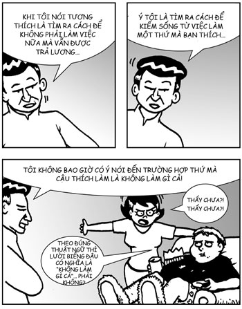
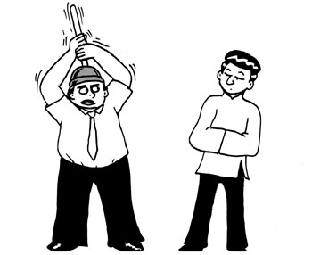
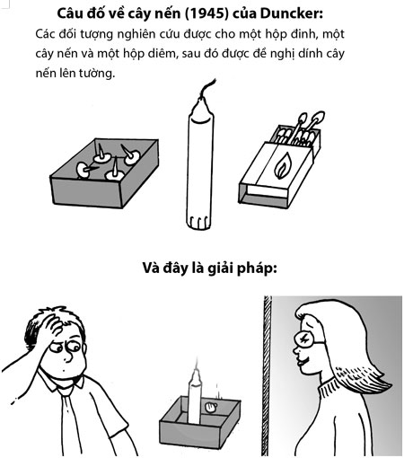
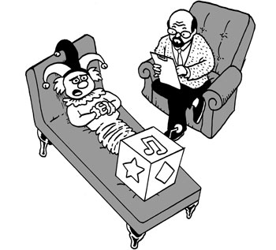
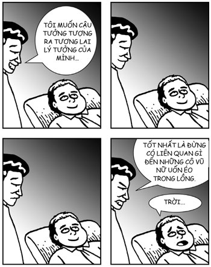
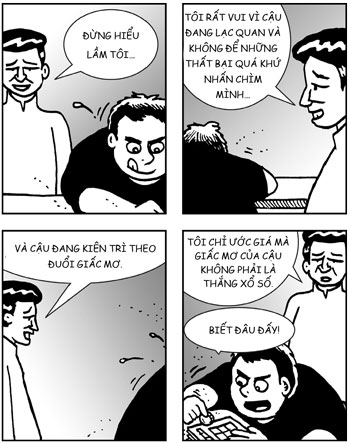

# Chương 6: TẠO RA LỢI NHUẬN, VƯỢT QUA ĐẠI DƯƠNG VÀ THAY ĐỔI THẾ GIỚI
### Nghệ thuật tự tạo động lực

> *Điều bất biến đáng kính nhất, được hiểu rõ ràng nhất, được soi sáng nhất, đáng tin cậy nhất trên thế giới không chỉ là chúng ta muốn hạnh phúc, mà còn là chúng ta chỉ muốn hạnh phúc. Chính bản chất của chúng ta đòi hỏi ở chúng ta điều đó.*  
> — **Thánh Augustine**

Để chương này có tác dụng, chúng tôi cần chiêu mộ một chuyên gia về động lực. May mắn là chúng tôi đã tìm thấy người đó và người đó chính là bạn. Bạn là chuyên gia hàng đầu thế giới trong lĩnh vực tìm ra điều gì tạo động lực cho bạn. Bạn vốn đã biết những giá trị và động lực sâu thẳm nhất bên trong bạn rồi. Trong chương này, tất cả những gì chúng tôi làm là giúp bạn khám phá chúng.

## KHOÁI LẠC, ĐAM MÊ VÀ MỤC ĐÍCH CAO CẢ

Tony Hsieh là một nguồn cảm hứng đối với tôi. Ở cái tuổi 24 còn rất trẻ, Tony đã bán LinkExchange, công ty mà anh đồng sáng lập, cho Microsoft với giá 265 triệu đô-la. Sau đó, anh trở thành CEO của Zappos và phát triển nó từ gần như không có gì thành một công ty có doanh thu hàng năm lên đến một tỷ đô-la. Nhưng thành công trong kinh doanh của anh không phải là thứ truyền cảm hứng cho tôi. Điều thực sự truyền cảm hứng cho tôi là việc anh sử dụng hạnh phúc một cách khôn ngoan, thành thạo và can đảm trong môi trường công sở. Tony đã phát hiện ra rằng bí quyết thành công của Zappos là “phân phát hạnh phúc” và đây cũng là tên cuốn sách của anh. Anh tạo ra một nền văn hóa doanh nghiệp có lợi cho hạnh phúc của nhân viên: khi nhân viên hạnh phúc, họ sẽ cung cấp cho khách hàng dịch vụ khách hàng tốt nhất trong ngành; khi khách hàng hạnh phúc thì họ sẽ tiêu nhiều tiền hơn ở Zappos. Nói cách khác, hạnh phúc không chỉ là một thứ tốt đẹp bạn nên có; mà đó còn là trọng tâm trong chiến lược kinh doanh của Zappos, nền tảng cho thành công của nó. Điều này thật sự đầy cảm hứng.

Tony có hiểu biết tuyệt vời về quy trình hạnh phúc trong bối cảnh công sở. Anh miêu tả ba loại hạnh phúc: khoái lạc, đam mê và mục đích cao cả[^1]:

1. **Khoái lạc:** tức là luôn theo đuổi những thứ cao hơn. Nó là loại hạnh phúc ngôi sao vì rất khó để duy trì nó nếu bạn không có lối sống của một ngôi sao.
2. **Đam mê:** còn được gọi là “thông suốt”, ở đó thành tích cao nhất hội tụ với sự cam kết cao nhất và thời gian trôi đi.
3. **Mục đích cao cả:** tức là trở thành một phần của một thứ gì đó lớn hơn bản thân mình, một thứ có ý nghĩa đối với bạn.

Một điểm rất thú vị về ba loại hạnh phúc này, đó là chúng có mức độ bền vững khác nhau. Hạnh phúc có được từ khoái lạc có độ thiếu bền vững cao. Một khi những tác nhân gây khoái lạc chấm dứt, hoặc nếu bạn quen với chúng, hạnh phúc của bạn sẽ trở lại điểm khởi đầu mặc định. Hạnh phúc có được từ sự thông suốt thì bền vững hơn nhiều và khả năng bạn quen với nó cũng thấp hơn. Ngược lại, hạnh phúc có được từ mục đích cao cả có độ bền vững cao. Theo kinh nghiệm của Tony và của chính tôi thì dạng hạnh phúc này có tính phục hồi cao và có thể tồn tại trong một khoảng thời gian rất dài, đặc biệt khi mục đích cao cả đó xuất phát từ sự vị tha.

Thật thú vị là theo bản năng, chúng ta theo đuổi khoái lạc và tin rằng nó là nguồn hạnh phúc bền vững. Nhiều người dành phần lớn thời gian và năng lượng theo đuổi khoái lạc, đôi khi tận hưởng sự thông suốt và thi thoảng nghĩ về mục đích cao cả. Hiểu biết của Tony gợi ý rằng chúng ta nên làm hoàn toàn ngược lại. Chúng ta nên dành phần lớn thời gian và năng lượng cho mục đích cao cả, đôi khi tận hưởng sự thông suốt và thi thoảng nếm một chút khoái lạc ngôi sao. Đây là con đường hợp lý nhất để đạt đến hạnh phúc vững bền, ít nhất là trong công việc.

Hiểu biết này cũng gợi ý rằng cách tốt nhất để tìm ra động lực trong công việc là tìm ra mục đích cao cả của bản thân. Nếu chúng ta biết mình coi trọng nhất cái gì và cái gì có ý nghĩa nhất, chúng ta sẽ biết mình có thể làm gì để phục vụ cho mục đích cao cả đó. Khi điều đó xảy ra, công việc sẽ trở thành nguồn hạnh phúc vững bền cho chúng ta. Khi đó, chúng ta sẽ trở nên tài giỏi trong công việc của mình vì chúng ta vui vẻ làm việc và điều này cho phép chúng ta được tận hưởng hạnh phúc của sự thông suốt với tần suất ngày càng tăng. Cuối cùng, khi chúng ta trở nên tài giỏi trong công việc, chúng ta sẽ được mọi người công nhận. Thỉnh thoảng, chúng ta còn có thể nhận được sự công nhận đó với mức độ cao, ví dụ như được thưởng lớn, được Phó Chủ tịch công ty tuyên dương, được nhắc đến trên tờ *New York Times*, hoặc được Đạt-lai Lạt-ma thể hiện sự biết ơn. Đây chính là trải nghiệm khoái lạc ngôi sao mà thi thoảng chúng ta được nếm trải và nó giống như lớp kem trên chiếc bánh động lực vậy. Một khi chúng ta làm việc để tiến đến mục đích cao cả của mình, bản thân công việc đó đã là một phần thưởng (nhưng đôi khi, một khoản tiền thưởng lớn cũng rất tuyệt, sếp ạ, em nói đề phòng sếp đang thắc mắc).

## BA BƯỚC DỄ DÀNG ĐỂ TẠO ĐỘNG LỰC

Trong chương này, chúng tôi sẽ giới thiệu ba bài tập để tạo động lực:
1. **Tương thích:** Khiến công việc tương thích với các giá trị và mục đích cao cả
2. **Hình dung:** Nhìn thấy tương lai chúng ta mong muốn
3. **Phục hồi:** Khả năng vượt qua các chướng ngại vật trên con đường của chúng ta.

Tổng hợp lại, chúng tôi hy vọng những bài tập này sẽ tạo nên một bộ công cụ hoàn chỉnh giúp bạn tìm ra bạn muốn cuộc đời mình trở nên như thế nào và định hướng con đường đi đến đó.

## TƯƠNG THÍCH

### Sống vui vẻ
Tương thích tức là khiến công việc tương thích với các giá trị và mục đích cao cả.

Đây là một điều nửa đùa nửa thật nhưng tôi nghĩ rằng tương thích tức là tìm cách để không phải làm việc nữa trong suốt phần đời còn lại nhưng vẫn được trả lương. Bí quyết là tạo ra một tình huống trong đó công việc là thứ bạn làm vì hạnh phúc, bạn đang làm điều đó để giải trí và việc có ai đó trả lương cho bạn vì công việc này chỉ là một sự tình cờ (và do bạn muốn tốt với họ nên bạn không muốn từ chối tiền của họ). Tôi biết nhiều người thành công và làm việc năng suất cao trong tình huống này. Một ví dụ nổi tiếng là Warren Buffett, ông vẫn làm việc... à... vẫn vui chơi trong công việc ở tuổi 80. Có lần Norman Fischer đã bảo tôi rằng ông chưa từng làm việc một ngày nào trong cuộc đời, dù cho ông là một trong những giảng viên thiền được săn đón nhất và bận rộn hơn hầu hết các nhân viên ở Thung lũng Silicon mà tôi biết. Gần hơn, phần lớn những kỹ sư tài năng nhất mà tôi từng làm việc cùng viết mã như một sở thích, vì vậy thực ra họ chỉ đến văn phòng để thỏa mãn sở thích và được trả lương.

Những công việc có bản chất như vậy sở hữu ít nhất một trong hai phẩm chất sau, thường là có cả hai:
1. Công việc đó có ý nghĩa sâu sắc đối với bạn.
2. Nó tạo ra một trạng thái thông suốt trong bạn.

Tất nhiên, điều này hoàn toàn tương thích với bộ khung khoái lạc, đam mê và mục đích cao cả của Tony Hsieh.

*“Theo đúng thuật ngữ thì lười biếng đâu có nghĩa là ‘không làm gì cả’ phải không? Thấy chưa? Thấy chưa?!”*

### Thông suốt
Thông suốt vô cùng quan trọng, rất đáng để đề cập đến một cách chi tiết. Daniel Goleman gọi nó là “động lực tối hậu”. Thông suốt là một trạng thái làm việc ở mức độ cao nhất do Mihaly Csikszentmihalyi khám phá ra. Ông đã dành hơn hai thập kỷ để nghiên cứu về nó trong các cá nhân. Csikszentmihalyi miêu tả nó là *“hoàn toàn đắm chìm vào một hoạt động vì lợi ích của chính nó. Cái tôi biến mất. Thời gian trôi đi. Mọi hành động, mọi chuyển động và mọi ý nghĩ đều tuân theo cái trước đó, giống như chơi nhạc jazz. Toàn bộ con người bạn đều tham gia vào, và bạn sử dụng các kỹ năng của mình đến mức độ cao nhất”*[^2]. Các vận động viên biết trạng thái này, họ gọi nó là “thăng hoa”. Sự thông suốt đã được ghi nhận ở rất nhiều các lĩnh vực khác nhau, ví dụ như leo núi đá, phẫu thuật não, nộp hồ sơ hay thậm chí ngồi thiền (thực ra, sự thông suốt có thể được coi là việc thiền trong khi hành động).

Sự thông suốt xảy ra khi nhiệm vụ trước mắt tương thích với trình độ của người thực hiện, tức là nó đủ khó để tạo ra một thách thức nhưng không quá khó đến mức áp đảo người thực hiện. Nếu nhiệm vụ quá dễ so với trình độ, người thực hiện sẽ chán hoặc hờ hững. Ngược lại, nếu nó quá khó, người thực hiện sẽ lo lắng hoặc sợ hãi. Sự thông suốt xảy ra khi độ khó ở mức vừa phải.

Sự thông suốt là một trạng thái sự chú ý được tập trung, vì vậy những người thành thạo trong việc tập trung sự chú ý, như các thiền sư hay các võ sư, sẽ có nhiều khả năng đạt được sự thông suốt hơn. Nếu bạn đang thực hiện những bài tập thiền trong những chương đầu của cuốn sách này thì bạn đã đi được nửa đường rồi, anh châu chấu ạ.

*“Nhưng đây là cách tôi thường dùng để làm tăng sự thông suốt.”*

### Tự trị, tự chủ, mục đích
Tác giả ăn khách Daniel Pink đã đưa ra một bộ khung có tác dụng bổ sung rất tốt cho những điều mà chúng ta đã thảo luận. Pink đã sử dụng 50 năm nghiên cứu trong lĩnh vực khoa học hành vi để lập luận rằng những phần thưởng bên ngoài như tiền bạc không phải là động lực tốt nhất để tạo ra hiệu suất làm việc cao. Thay vào đó; theo cách gọi của ông, những động lực tốt nhất là “động lực nội tại”, động lực mà chúng ta tìm thấy ở bên trong. Động lực đích thực chứa đựng ba yếu tố sau[^3]:

1. **Tự trị:** thôi thúc định hướng cuộc sống của chúng ta
2. **Tự chủ:** khao khát trở nên ngày càng giỏi hơn trong những việc quan trọng
3. **Mục đích:** mong muốn làm việc để phục vụ cho điều gì đó lớn lao hơn bản thân mình.

Trong bài diễn thuyết trong chương trình TED của mình, Pink đã kể một câu chuyện nghiên cứu thú vị dựa trên câu đố về cây nến[^4]. Câu đố về cây nến như sau: những người tham gia được cho một hộp đinh, một cây nến và một hộp diêm, sau đó họ được đề nghị tìm ra cách dính cây nến vào tường.

Sẽ phải mất một thời gian bạn mới giải được câu đố, nhưng giải pháp khá đơn giản: lấy hết đinh ra khỏi hộp, dính cây nến vào bên trong hộp, rồi sau đó dùng đinh dính hộp vào tường. Khoảnh khắc “bừng sáng” cần thiết để giải quyết câu đố này là phát hiện ra rằng chiếc hộp cũng là một phần của đáp án. Điều này sẽ không hiển hiện ngay lập tức; bạn luôn bắt đầu bằng suy nghĩ rằng chiếc hộp chỉ là thứ đựng đinh. Vì vậy, bước đột phá sáng tạo ở đây là nhận ra tác dụng khó thấy của chiếc hộp – kiểu như một dạng “suy nghĩ vượt ra khỏi chiếc hộp”, về chiếc hộp.

*“Tôi đang gặp những vấn đề thực sự trong việc suy nghĩ vượt ra ngoài chiếc hộp.”*

Sau đây là một câu chuyện thú vị: bạn có hai nhóm được chọn ngẫu nhiên. Đối với nhóm được khuyến khích, bạn nói với họ rằng họ giải quyết câu đố này càng nhanh thì họ càng được trả nhiều tiền. Đối với nhóm kiểm soát, bạn nói với họ rằng dù họ giải quyết trong bao lâu đi nữa thì họ cũng chỉ được nhận một số tiền như nhau. Phát hiện thú vị ở đây là: nhóm được khuyến khích lại làm tồi hơn! Đúng vậy đó, các chàng trai, cô gái ạ, những nguồn khuyến khích bên ngoài không chỉ không có tác dụng mà còn phản tác dụng.

Nhưng đợi đã, câu chuyện sẽ trở nên thú vị hơn. Trong một chuỗi các thí nghiệm khác, những nhà nghiên cứu cũng đã đưa cho những người tham gia các đồ vật trên (một hộp đinh, một cái nến, và bao diêm) nhưng đinh với hộp tách rời nhau. Trong trường hợp này, ngay lập tức rõ ràng là chiếc hộp là một phần của giải pháp, do đó không xuất hiện khoảnh khắc “bừng sáng”. Trong trường hợp này, nhóm được khuyến khích làm tốt hơn nhóm kiểm soát.

Từ thí nghiệm này cũng như nhiều thí nghiệm khác tương tự, chúng ta rút ra một điều là cách khuyến khích truyền thống bằng tiền có hiệu quả với các công việc làm theo thói quen và quy tắc, các công việc không cần sáng tạo nhiều. Đối với các công việc cần sự sáng tạo hoặc các kỹ năng nhận thức khác, cách khuyến khích bằng tiền không hiệu quả, thậm chí có thể phản tác dụng.

Đối với các công việc như vậy, những động lực duy nhất có hiệu quả là những động lực nội tại: tự trị, tự chủ và mục đích. Hiệu quả của chúng còn quá tốt nữa là đằng khác, chúng thậm chí có thể biến những công việc làm mài mòn tâm hồn thành những công việc đáng tự hào. Một ví dụ tuyệt vời là đội dịch vụ khách hàng của Zappos. Họ tự gọi mình là Đội Trung thành với Khách hàng của Zappos (Zappos Customer Loyalty Team – ZCLT). Những thành viên trong đội được nhận những hướng dẫn rất đơn giản: phục vụ khách hàng, giải quyết vấn đề của khách, làm điều đó theo cách tùy thích. Điều này, cộng thêm việc chú ý đến sự phát triển sự nghiệp của nhân viên, cộng thêm triết lý công ty là “phân phát hạnh phúc”, đã truyền được tính tự trị, tự chủ và mục đích vào công việc của các thành viên ZCLT. Kết quả là các thành viên tràn đầy hạnh phúc này đã cung cấp dịch vụ khách hàng tốt đến mức đôi khi còn được đánh giá cao hơn cả những khu nghỉ dưỡng và khách sạn trong hệ thống Four Seasons[^5].

### Am hiểu và khiến bản thân tương thích
Sự tương thích được xây dựng dựa trên sự tự nhận thức. Khi bạn am hiểu sâu sắc bản thân, bạn bắt đầu biết những giá trị cốt lõi, mục đích và ưu tiên của mình. Bạn biết điều gì là thực sự quan trọng đối với bạn và điều gì khiến bạn thấy có ý nghĩa. Khi mọi sự đã rõ ràng, bạn biết điều gì khiến bạn hạnh phúc trong công việc và làm thế nào để đóng góp tốt nhất cho thế giới. Khi đó, bạn sẽ biết mình muốn tạo ra tình huống công việc như thế nào cho bản thân. Khi cơ hội tốt tự xuất hiện, bạn sẽ có thể làm việc theo những cách đem lại cho bạn sự tự trị, tự chủ và mục đích. Từ đó, công việc của bạn sẽ trở thành nguồn hạnh phúc của bạn.

Nền tảng để am hiểu và khiến bản thân tương thích là thiền. Cho dù bạn không thực hiện bài tập nào khác ngoài thiền thì qua thời gian, bạn cũng sẽ tạo ra được mức độ tự nhận thức cần thiết để tìm ra sự tương thích. Chỉ thiền không cũng là đủ rồi – đó là tin tốt.

Tin còn tốt hơn là có những cách khác giúp bạn hiểu rõ được những giá trị và mục đích cao cả của mình. Một cách là nói những điều đó với người khác. Những điều như giá trị và mục đích cao cả đều khá trừu tượng. Việc nói về chúng buộc chúng ta phải khiến chúng trở nên rõ ràng hơn và dễ hình dung hơn đối với chính mình. Một cách khác là viết ra. Ở đây cũng tồn tại một cơ chế tương tự – việc nói ra những ý nghĩ trừu tượng giúp chúng trở nên rõ ràng và dễ hình dung. Chúng tôi thấy rằng việc thực hiện những bài tập này theo một cách hệ thống sẽ rất hiệu quả. Ví dụ, trong lớp của chúng tôi, nhiều học viên đã nói rằng chỉ sau một vài phút nói chuyện với nhau, họ đã trở nên thông suốt hơn nhiều.

### BÀI TẬP THỰC HÀNH: KHÁM PHÁ GIÁ TRỊ VÀ MỤC ĐÍCH CAO CẢ

Nếu bạn làm điều này một mình ở nhà, hãy thực hiện bài tập Ghi chép (xem Chương 4) trong một vài phút, sử dụng một hoặc cả hai lời gợi ý dưới đây:
* *Các giá trị cốt lõi của tôi là...*
* *Tôi đại diện cho...*

Còn không, nếu bạn có bạn bè hoặc người thân để cùng thực hiện (bạn thật may mắn) thì hãy thực hiện bài tập Thiền nghe (xem Chương 3) theo nhóm hai hoặc ba người. Hãy thay nhau nói. Người nói bắt đầu bằng một đoạn độc thoại, dài bao lâu cũng được. Sau đó, nhóm thảo luận tự do và những người nghe có thể hỏi để hiểu rõ hơn hoặc đưa ra những nhận xét ngắn gọn. Quy định duy nhất của cuộc thảo luận là người nói (ban đầu) được ưu tiên trước, nghĩa là người đó được ưu tiên nói và khi người đó nói, không ai được xen ngang.

Đoạn độc thoại có thể nói về các chủ đề sau:
* Những giá trị cốt lõi của bạn là gì?
* Bạn đại diện cho cái gì?

Sau khi tất cả mọi người đã được nói, từng người hãy tự nói chuyện với bản thân về cảm giác của mình đối với trải nghiệm này.

*“Giá trị cốt lõi, giá trị cốt lõi... Hừm...”*

## HÌNH DUNG

Hình dung dựa trên một ý tưởng rất đơn giản: việc đạt được một điều gì đó sẽ trở nên dễ dàng hơn rất nhiều nếu bạn có thể tưởng tượng ra rằng mình đã đạt được nó rồi. Bác sỹ tâm thần Regina Pally đã miêu tả như sau:

> *Theo khoa học thần kinh, ngay từ trước khi sự kiện xảy ra, bộ não đã dự đoán về việc điều gì nhiều khả năng nhất sẽ xảy ra cũng như đưa ra các nhận thức, hành vi, cảm xúc, phản ứng sinh lý và cách tương tác với mọi người sao cho phù hợp nhất với dự đoán đó. Theo một nghĩa nào đó, có thể nói rằng chúng ta dùng quá khứ để dự đoán tương lai và sau đó sống sao cho phù hợp với tương lai mà chúng ta kỳ vọng.*

Hay như Michael Jordan đã nói: “Bạn phải tưởng tượng trước khi bạn có thể thực sự có”.

Năm 2005, bạn của tôi, Roz Savage trở thành người phụ nữ đầu tiên hoàn thành phần thi đơn của Cuộc đua thuyền vượt Đại Tây Dương. Đúng như vậy, một người phụ nữ, một con thuyền, 103 ngày chèo thuyền vượt qua 4.828km đại dương. Sau 20 ngày, cái bếp nấu ăn của cô bị hỏng và toàn bộ 4 mái chèo đều bị gãy nhưng cô đã thành công. Tuy nhiên, đó chỉ là khởi đầu. Sau đó, Roz đã trở thành người phụ nữ đầu tiên một mình chèo thuyền vượt Thái Bình Dương. Cô hoàn thành sau ba giai đoạn. Năm 2008, cô chèo thuyền một mình từ San Francisco đến Oahu ở Hawaii; năm 2009, từ Hawaii đến Tarawa ở Kiribati; và năm 2010 đến Madang ở Papua New Guinea.

Không phải lúc nào Roz cũng thích phiêu lưu. Cô khẳng định rằng trước khi thực hiện các chuyến chèo thuyền phiêu lưu này, cô đã sống một cuộc sống trung lưu, bình thường, thoải mái, gần như chỉ toàn ngồi một chỗ, giống như nhiều người chúng ta. Cô là cố vấn viên về quản lý và là nhà quản lý dự án tại một ngân hàng đầu tư ở London, có thu nhập ổn định và một ngôi nhà ở vùng ngoại ô.

Vào một thời điểm nào đó ở giữa độ tuổi 30, cô thực hiện một bài tập là viết cáo phó cho chính mình. Cô băn khoăn không biết mọi người sẽ nói gì về mình sau khi cô chết. Cô đã viết hai bản cáo phó. Bản đầu tiên nói về những việc sẽ diễn ra nếu cô sống như hiện tại. Bản thứ hai nói về cuộc sống mà cô muốn sống. Trong quá trình này, cô đã phát hiện ra một điều vô cùng quan trọng. Cô nhận ra rằng việc viết bản đầu tiên đã lấy đi quá nhiều năng lượng của mình, cô không thể hoàn thành nó, nhưng khi viết bản thứ hai, cô lại tràn đầy năng lượng và không muốn dừng lại. Đó chính là hiểu biết thay đổi cuộc đời cô. Cuối cùng, cô đã từ bỏ cuộc sống cũ của mình, công việc của mình, thu nhập ổn định của mình, ngôi nhà của mình và cả cuộc hôn nhân của mình để theo đuổi giấc mơ chèo thuyền vượt đại dương.

Một số người sẽ nghĩ rằng chắc Roz phải giàu lắm mới có thể vứt bỏ mọi thứ để theo đuổi giấc mơ của mình. Nhưng thực ra thì không. Cô nói với tôi rằng khi cô bắt đầu chèo thuyền vượt Đại Tây Dương, toàn bộ tài sản của cô chỉ là chiếc thuyền cùng mọi thứ bên trong (bao gồm chiếc bếp nấu ăn mà cuối cùng đã bị hỏng).

Thứ khiến Roz có được hiểu biết thay đổi cuộc đời mình chính là bài tập hình dung. Nó giúp cô khám phá ra những giá trị và động lực sâu xa của mình, đồng thời cho phép cô hình dung ra tương lai cô mong muốn và hợp nhất tương lai đó vào tâm trí cô.

*“Trời, tự viết cáo phó cho mình còn khó hơn mình nghĩ.”*

### Khám phá tương lai lý tưởng của bạn
Trong Tìm Kiếm Bên Trong Bạn, chúng tôi cũng dạy một phương pháp hình dung tương tự như điều mà Roz đã làm. Ý tưởng cơ bản ở đây là hình dung, khám phá và hợp nhất tương lai lý tưởng vào trong tâm trí bằng cách viết về nó như thể nó đã thành hiện thực rồi. Đây là một phương pháp cực kỳ hiệu quả mà tôi đã học được từ bạn mình, Barbara Fittipaldi, Chủ tịch và CEO của Trung tâm Tương lai mới.

Sau đây là những hướng dẫn:

### BÀI TẬP THỰC HÀNH: KHÁM PHÁ TƯƠNG LAI LÝ TƯỞNG CỦA TÔI

Đây là một bài tập viết. Chúng ta sẽ thực hiện trong bảy phút, tức là lâu hơn những bài tập viết thông thường của chúng ta và chỉ có một lời gợi ý. Bài tập này sẽ khiến chúng ta rất vui và thỏa mãn đấy.

Lời gợi ý là:
> **Nếu mọi thứ trong cuộc đời tôi, bắt đầu từ hôm nay, đáp ứng hoặc vượt quá những kỳ vọng lạc quan nhất của tôi, thì trong năm năm nữa, cuộc đời tôi sẽ như thế nào?**

Bạn càng tưởng tượng chi tiết, bài tập này càng hiệu quả. Do đó, hãy xem xét những câu hỏi sau đây trước khi viết. Trong tương lai:
* Bạn là ai và bạn đang làm gì?
* Bạn cảm thấy như thế nào?
* Mọi người nói gì về bạn?

Chúng ta hãy im lặng và suy tư trong một phút trước khi viết. *(Ngưng 1 phút)*

Bắt đầu viết.

Bài tập này có nhiều biến thể khác. Bạn có thể dành nhiều thời gian hơn cho nó, chẳng hạn như một hoặc hai giờ, thay vì bảy phút. Hoặc bạn có thể thay đổi thời điểm hình dung; nếu năm năm nữa không phù hợp với bạn, hãy thử 10 hoặc 20 năm. Một biến thể khác là giả vờ bạn đã đang sống trong tương lai lý tưởng của mình năm năm sau rồi viết nhật ký ngược từ tương lai. Đây là biến thể mà chúng tôi sử dụng trong lớp của Barbara.

Có ít nhất hai biến thể lớn khác. Một là tự viết cáo phó cho mình, giống như Roz và nếu bạn thích, hãy viết hai bản, giống như Roz. Biến thể còn lại là hình dung ra khung cảnh sau:

> *Bạn là khán giả đang lắng nghe một bài diễn thuyết. Bài diễn thuyết khiến tất cả các khán giả, kể cả bạn, cảm động và được truyền cảm hứng sâu sắc. Và người diễn giả chính là bản thân bạn trong hai mươi năm nữa.*

Bạn cần cân nhắc những câu hỏi sau:
* Người diễn giả đó nói gì, những lời nói đó khiến bạn cảm động và truyền cảm hứng cho bạn như thế nào?
* Nếu người diễn giả bảo bạn ngước lên và nhìn vào người đó thì sao?

### Hãy nói về tương lai lý tưởng của bạn thật nhiều
Nếu bạn cảm thấy mình được truyền cảm hứng bởi tương lai lý tưởng của bạn, tôi xin khuyến nghị bạn hãy nói với người khác thật nhiều về nó. Việc làm này đem lại hai lợi ích quan trọng:

1. **Bạn càng nói về nó thì nó càng trở nên chân thật đối với bạn.** Điều này có tác dụng ngay cả khi giấc mơ của bạn rất thiếu khả thi hay thậm chí bất khả thi. Ví dụ, giấc mơ của tôi là tạo ra các điều kiện cho hòa bình thế giới khi tôi còn sống. Tôi hình dung ra một thế giới hòa bình vì sự an bình nội tâm, hạnh phúc nội tâm và lòng từ bi được lan rộng khắp nơi; những phẩm chất đó được lan rộng vì thế giới hiện đại được tiếp cận các phương pháp trí tuệ cổ xưa. Tôi hình dung mình là người khiến các phương pháp đó trở nên dễ tiếp cận vì tôi khiến chúng trở nên dễ hiểu, thực tế và hữu dụng trong thế giới công sở cũng như các thế giới khác. Khi mới nghĩ về điều này, tôi biết mục tiêu của mình là bất khả thi nhưng dù vậy, tôi vẫn nói về nó với rất nhiều người. Tôi càng nói về nó thì nó càng đi dần từ bất khả thi đến thiếu khả thi, rồi từ thiếu khả thi đến khả thi. Quan trọng hơn, nó đi từ khả thi đến có thể hành động. Tôi đã đạt đến một trạng thái tâm trí mà ở đó, tôi cảm thấy rằng thực sự có những việc tôi có thể làm để thúc đẩy ước mơ của mình.

2. **Bạn càng nói với mọi người về tương lai lý tưởng của mình, bạn càng có nhiều khả năng tìm được người có thể giúp bạn.** Điều này đặc biệt đúng nếu khao khát của bạn đối với tương lai là một khao khát đầy vị tha vì mọi người sẽ đổ xô đến để giúp bạn. Nếu mong ước của bạn là lái một chiếc Lexus thì sẽ chẳng ai quan tâm. Tuy nhiên, nếu mong ước của bạn là một thứ gì đó đầy vị tha – ví dụ như bạn muốn mang bữa ăn đến cho tất cả những người bị đói trên khắp thế giới, hay bạn muốn những người vô gia cư ở San Francisco sẽ không còn ai phải chết vì lạnh nữa, hay bạn khao khát muốn giúp những đứa trẻ khuyết tật trong cộng đồng có cơ hội được học tập tốt hơn – và bạn chân thành với mong ước muốn phục vụ người khác thì tôi đảm bảo phản ứng bạn nhận được nhiều nhất sẽ là “Tôi có thể giúp gì không?”. Khi bạn chân thành muốn giúp đỡ người khác, bạn truyền cảm hứng cho mọi người bằng sự vị tha của mình và khi đó, họ muốn giúp bạn.

Thật lòng mà nói, tôi vô cùng ngạc nhiên về hiệu quả của nó. Khi tôi bắt đầu nói với người khác về khao khát hòa bình thế giới của tôi, tôi rất ngạc nhiên và vui mừng khi có rất ít người nghĩ tôi bị điên (đến giờ mới chỉ có hai người). Khi nó trở nên ngày càng chân thực đối với tôi, tôi bắt đầu nói về nó ngày càng tự tin hơn và sau một thời gian, tôi nhận ra rằng mọi người muốn giúp tôi hoặc giới thiệu tôi cho những người có thể giúp.

Tôi đã nhanh chóng xây dựng được một mạng lưới đồng minh (mà tôi gọi đùa là “Nhóm âm mưu vĩ đại về hòa bình thế giới”). Tôi được kết bạn với nhiều nhân vật sáng chói trong lĩnh vực thiền như Matthieu Ricard, cũng như trong lĩnh vực hòa bình thế giới như Scilla Elworthy. Richard Gere và Đạt-lai Lạt-ma đã ôm tôi. Owen Wilson và Will.i.am nói rằng họ muốn giúp tôi. Liên Hợp Quốc đã mời tôi đến trình bày một bài nói về từ bi mà tôi đã trình bày trong chương trình TED. Hàng trăm người mà tôi không quen biết nói rằng tôi đã truyền cảm hứng cho họ. Tôi vô cùng ngạc nhiên khi thấy khao khát đơn giản của mình về hòa bình thế giới đã được lan tỏa tới rất nhiều người và tôi cảm thấy mình chưa xứng đáng với tất cả những tình bạn, tình yêu thương mà tôi đã được nhận.

Tôi đã học được rằng mọi người muốn được truyền cảm hứng. Từng khát khao được phục vụ mà chúng ta có, từng hành động từ thiện mà chúng ta thực hiện, đều truyền cảm hứng cho người khác. Do đó, nếu bạn có những khát khao vị tha, đặc biệt là nếu bạn đã và đang thực hiện chúng, tôi khuyến khích bạn chia sẻ chúng với người khác, như vậy bạn có thể truyền thêm sự tốt đẹp vào thế giới này.

*“Tôi muốn cậu tưởng tượng ra tương lai lý tưởng của mình... Tốt nhất là đừng có liên quan gì đến những cô vũ nữ uốn éo trong lồng.”

*“Trời...”**

## PHỤC HỒI

Phục hồi là khả năng vượt qua trở ngại trên đường đi. Tương thích và hình dung giúp bạn tìm ra nơi bạn muốn đến, còn phục hồi giúp bạn đến đó.

Chúng ta có thể rèn luyện sự phục hồi qua ba mức độ:
1. **An tĩnh bên trong:** Khi bạn có thể liên tục đạt được sự an tĩnh bên trong, nó trở thành nền tảng cho mọi sự lạc quan và phục hồi.
2. **Phục hồi cảm xúc:** Thành công và thất bại là những trải nghiệm cảm xúc. Khi rèn luyện mức độ này, chúng ta mở rộng không gian cho chúng.
3. **Phục hồi nhận thức:** hiểu cách mình giải thích các thất bại với chính bản thân và tạo ra các thói quen suy nghĩ hữu dụng sẽ giúp chúng ta phát triển sự lạc quan.

### An tĩnh bên trong
Tôi từng hỏi Matthieu Ricard câu hỏi mà ai cũng sẽ nghĩ tới khi hỏi người hạnh phúc nhất thế giới. Câu hỏi đó là: có ngày nào ông không hạnh phúc không?

Giống như phần lớn các vị sư phụ thông thái mà bạn từng xem trong các bộ phim võ thuật Trung Quốc, Matthieu trả lời bằng một hình ảnh ẩn dụ: “Hãy coi hạnh phúc như một đại dương sâu thẳm. Bề mặt có thể bập bềnh, nhưng đáy luôn an tĩnh. Tương tự, có những ngày mà một người hạnh phúc sâu bên trong có thể thấy buồn – ví dụ, ông ta nhìn thấy mọi người đang đau khổ – nhưng bên dưới nỗi buồn đó là một vùng hạnh phúc mênh mông sâu thẳm và không bao giờ dao động”.

Hình ảnh ẩn dụ đầy đáng yêu cũng có tác dụng đối với sự an tĩnh và phục hồi. Nếu bạn chạm được đến sự an tĩnh sâu bên trong tâm trí thì dù cuộc sống hàng ngày có thăng trầm đến đâu, bạn lúc nào cũng có thể phục hồi lại. Không gì có thể nhấn chìm bạn trong một thời gian dài vì mỗi khi có gì đó đánh bại bạn, bạn luôn có thể nghỉ ngơi, hồi phục trong sự an tĩnh bên trong đó và đứng dậy thật nhanh, tùy vào bạn rèn luyện sâu đến thế nào.

Thật may là ai cũng có thể chạm đến sự an tĩnh bên trong đó. Như chúng tôi đã đề cập trong Chương 2 và Chương 3, qua các bài tập thiền, tâm trí có thể trở nên an tĩnh, sáng suốt và hạnh phúc. Tập thiền càng nhiều, tâm trí càng trở nên như vậy.

Chỉ cần tập thiền thật nhiều và bạn “tự nhiên” sẽ đạt được trạng thái này.

### Phục hồi cảm xúc
Thành công và thất bại là những trải nghiệm cảm xúc. Những cảm xúc này có thể tạo điều kiện làm khởi lên tham lam và oán ghét, chúng có thể kìm giữ chúng ta, ngăn chúng ta đạt được mục tiêu của mình. Thông qua các bài tập, chúng ta có thể xây dựng nền tảng sự an tĩnh bên trong, từ đó giúp chúng ta xử lý được các cảm xúc có liên quan đến thành công và thất bại.

Giống như tất cả các trải nghiệm cảm xúc, thành công và thất bại biểu hiện mạnh mẽ nhất trên cơ thể chúng ta. Do đó, nơi để bắt đầu xử lý những cảm xúc này chính là trên cơ thể. Ý tưởng ở đây là hãy trở nên thoải mái với việc trải nghiệm những cảm xúc này trên cơ thể, hay theo cách nói của Mingyur Rinpoche là hãy làm bạn với chúng. Chúng ta cũng hãy buông thả bất kỳ sự tham lam hay oán ghét nào khởi lên. Khi chúng ta có khả năng chứa đựng những cảm xúc này và buông thả sự tham lam cũng như oán ghét, chúng ta có thể phục hồi về mặt cảm xúc sau thành công và thất bại.

*“Điên thật, nếu một tiếng nữa mà mình không tìm được cách giải ma trận này thì mình sẽ bỏ cuộc.”*

Với một bài tập chuẩn trong Tìm Kiếm Bên Trong Bạn, chúng tôi bắt đầu bằng việc làm an tĩnh tâm trí, quét nhanh cơ thể, sau đó nghĩ đến các kỷ niệm thành công và thất bại. Trong mỗi trường hợp, chúng tôi trải nghiệm chúng trên cơ thể và buông thả sự tham lam cũng như oán ghét. Sau đây là hướng dẫn:

### BÀI TẬP THỰC HÀNH: THIỀN PHỤC HỒI

#### Làm an tĩnh tâm trí
Bắt đầu bằng ba hơi thở sâu.

Nhẹ nhàng mang sự nhận thức đến hơi thở, nhận thức hơi thở vào, hơi thở ra cùng những khoảng dừng ở giữa.

Chúng ta hãy mang sự chú ý đến cơ thể, bắt đầu bằng việc tập trung vào các cảm giác trên bàn chân, cẳng chân, đầu gối, hông, ngực, tay, vai, lưng, cổ, gáy và mặt.

*(Ngưng dài)*

#### Thất bại
Giờ chúng ta hãy chuyển sang một trải nghiệm thất bại trong bốn phút.

Hãy nghĩ đến một sự kiện mà bạn từng trải nghiệm cảm giác thất bại nặng nề – không đạt được mục tiêu, để bản thân và những người khác thất vọng. Hãy nhìn nó, lắng nghe nó và cảm nhận nó.

Quan sát tất cả các cảm xúc có liên quan và xem chúng biểu lộ như thế nào trên cơ thể.

*(Ngưng hai phút)*

Chúng ta hãy xem mình có thể tạo ra khả năng trải nghiệm tất cả các cảm xúc đó mà không oán ghét hay không.

Hãy coi những cảm xúc mà bạn đang trải nghiệm này chỉ đơn thuần là những cảm giác sinh lý. Chỉ vậy thôi. Chúng có thể khó chịu, nhưng chúng chỉ đơn giản là những trải nghiệm mà thôi. Chúng ta chỉ cần đơn giản là cho phép những trải nghiệm đó hiện diện, đến và đi khi chúng muốn. Chỉ cần để chúng như vậy, một cách dịu dàng, hào phóng và đầy yêu thương.

*(Ngưng dài)*

#### Thành công
Giờ chúng ta hãy vui vẻ hơn và chuyển sang một trải nghiệm thành công trong bốn phút.

Hãy nghĩ đến một sự kiện mà bạn từng trải nghiệm cảm giác thành công tuyệt vời – vượt mục tiêu, được mọi người khâm phục, cảm thấy bản thân thật tài giỏi. Hãy nhìn nó, lắng nghe nó và cảm nhận nó.

Quan sát tất cả các cảm xúc có liên quan và xem chúng biểu lộ như thế nào trên cơ thể.

*(Ngưng hai phút)*

Chúng ta hãy xem mình có thể tạo ra khả năng trải nghiệm tất cả các cảm xúc đó mà không ham muốn chúng hay không.

Hãy coi những cảm xúc mà bạn đang trải nghiệm đơn thuần là những cảm giác sinh lý. Chỉ vậy thôi. Chúng có thể rất dễ chịu, nhưng chúng đơn giản chỉ là những trải nghiệm mà thôi. Chúng ta chỉ cần cho phép những trải nghiệm đó hiện diện và đi khi chúng muốn. Chỉ cần để chúng như vậy, một cách dịu dàng, hào phóng và đầy yêu thương.

*(Ngưng dài)*

#### Trở lại an tĩnh
Giờ chúng ta hãy trở lại hiện tại trong ba phút. Hãy kiểm tra cơ thể mình và xem nó đang cảm thấy như thế nào.

*(Ngưng lại)*

Hít một hơi thật sâu và buông thả. Tiếp tục chú ý một cách thư giãn vào hơi thở và nếu bạn cảm thấy bị cuốn hút quá, hãy đặt một bàn tay lên ngực để điều hòa.

*(Ngưng lại)*

Tiếp tục chú ý những điều xảy ra trên cơ thể và chầm chậm mở mắt.

Cảm ơn sự chú ý của các bạn.

## PHỤC HỒI NHẬN THỨC

Chúng ta có thể tiếp tục xây dựng khả năng phục hồi cảm xúc bằng các bài tập nhận thức giúp phát triển sự lạc quan. Chúng ta hãy bắt đầu bằng một câu chuyện về thất bại.

Ngày xửa ngày xưa, có một vận động viên đủ dũng cảm để nói với cả thế giới mình đã thất bại nhiều như thế nào:

> *“Tôi đã ném trượt hơn 9.000 lần trong sự nghiệp của mình. Tôi đã thua gần 300 trận. 26 lần tôi được tin tưởng giao trọng trách ném cú quyết định trận đấu nhưng đã ném trượt. Tôi đã thất bại hết lần này đến lần khác trong cuộc đời mình...”*  
> Và anh nói tiếp:  
> *“... và đó là lý do tôi thành công”*[^7].

Tên người vận động viên đó là Michael Jordan và chút thông tin cho những người không biết anh: anh là cầu thủ bóng rổ vĩ đại nhất mọi thời đại.

Thất bại là viên gạch xây dựng nên thành công. Soichiro Honda từng nói: “99% thành công là thất bại”. Thomas Watson nói: “Nếu muốn tăng tỷ lệ thành công, hãy tăng gấp đôi tỷ lệ thất bại”. Thậm chí, còn có một thành ngữ thông dụng là “Thất bại là mẹ thành công”. (Mặc dù vậy, tôi ghét phải làm người mẹ trong gia đình đó.)

Nếu bạn không thích thất bại thì câu chuyện sẽ trở nên tệ hơn. Nếu muốn làm một điều gì đó mới mẻ và sáng tạo bạn cần thường xuyên cảm thấy mình ngu ngốc. Nathan Myhrvold đã nói về quan điểm đó như sau (bằng cách nói về Bill Gates, bạn của mình, đồng thời đưa ra một quan điểm chung về việc “thoát ra khỏi chiếc hộp”):

> *Lewis và Clark gần như lúc nào cũng cảm thấy lạc lối. Nếu bạn coi khám phá là lúc nào cũng biết mình đang ở đâu và luôn ở trong phạm vi năng lực của mình thì bạn sẽ chẳng bao giờ làm được cái gì mới mẻ cả. Bạn phải cảm thấy hoang mang, tức giận và thấy mình ngu ngốc. Nếu không sẵn sàng làm như vậy, bạn không thể “thoát ra khỏi chiếc hộp” được đâu.*[^8]

Nathan Myhrvold đã có bằng tiến sỹ ở tuổi 23. Ông là Giám đốc Công nghệ tại Microsoft và là người sáng lập phòng nghiên cứu Microsoft. Ông là một nhiếp ảnh gia chuyên chụp ảnh thiên nhiên hoang dã và đã giành được nhiều giải thưởng. Ông còn là một đầu bếp hàng đầu chuyên về ẩm thực Pháp và là đồng tác giả của một cuốn sách bán chạy. Có thể coi ông là một trong những người thông minh nhất Trái đất. Thậm chí, Bill Gates còn nói rằng: “Tôi không biết ai thông minh hơn Nathan”. Song, thậm chí đối với cả Bill Gates và Nathan Myhrvold, sáng tạo có nghĩa là “hoang mang, tức giận và thấy mình ngu ngốc”. Khi đọc câu này, tôi cảm thấy tốt đẹp hơn về bản thân mình vì nếu đến Nathan Myhrvold còn có thể cảm thấy ngu ngốc thì tôi có như vậy cũng không sao.

Bằng chứng trên đã xác nhận một điều mà rất nhiều người trong chúng ta đã học được từ chính cuộc đời mình: thất bại là một trải nghiệm bình thường. Ở một thời điểm nào đó trong cuộc đời, tất cả mọi người đều sẽ thất bại ê chề, dù đó là người thành công nhất và vĩ đại nhất, như Michael Jordan chẳng hạn. Thứ phân biệt người thành công với những người khác là thái độ đối với thất bại và cụ thể là cách họ giải thích thất bại với chính bản thân mình.

Martin Seligman, cha đẻ đáng kính trọng của lĩnh vực học hỏi sự lạc quan, gọi nó là “phong cách diễn giải” – cách chúng ta nói với bản thân mình khi chúng ta gặp một thất bại. Những người lạc quan phản ứng với thất bại từ một giả định trước về sức mạnh của bản thân. Họ cảm thấy rằng thất bại chỉ là tạm thời, chỉ thuộc về những hoàn cảnh nhất định và cuối cùng họ có thể vượt qua nhờ nỗ lực và năng lực. Ngược lại, những người bi quan phản ứng với thất bại từ một giả định trước về sự vô dụng của bản thân. Họ cảm thấy thất bại sẽ kéo dài, bao trùm lên cuộc sống của họ, gồm cả nguyên nhân xuất phát từ sự kém cỏi của bản thân nên không thể vượt qua được. Sự khác biệt trong cách chúng ta giải thích các sự kiện xảy ra với chúng ta ảnh hưởng rất lớn đến cuộc sống. Khi một người lạc quan phải chịu một thất bại to lớn, anh ta phản ứng bằng cách tìm hiểu xem làm thế nào lần sau có thể làm tốt hơn. Ngược lại, người bi quan giả định là mình chẳng thể làm được gì đối với vấn đề này và từ bỏ.

Trong một chuỗi các thí nghiệm nổi tiếng được thực hiện cùng với MetLife, Seligman đã khám phá ra rằng những nhân viên bảo hiểm lạc quan bán tốt hơn rất nhiều những đồng nghiệp bi quan[^9]. Ngoài ra, MetLife thường xuyên thiếu đại lý bảo hiểm nên Seligman đã thuyết phục MetLife tuyển dụng một nhóm các ứng viên đặc biệt, những người mà trong các bài kiểm tra sàng lọc thông thường chỉ đạt được điểm số suýt soát điểm sàn nhưng lại đạt được điểm số cao về lạc quan. Trong năm đầu tiên, nhóm này đã bán được nhiều hơn 21% so với những người bi quan được tuyển dụng theo cách thông thường và trong năm thứ hai là 57%!

### Học hỏi sự lạc quan, trút bỏ sự bi quan
Thật may là có thể học hỏi sự lạc quan. Nhưng kỳ lạ là lạc quan xuất phát từ thực tế và khách quan. Chúng ta tự động chú ý đến những điều tiêu cực nhiều hơn những điều tích cực xảy ra trong cuộc đời. Ví dụ, nếu bạn là nhà văn và trong số 10 nhận xét về tác phẩm của bạn có chín nhận xét tốt và một nhận xét tồi thì nhiều khả năng bạn sẽ nhớ một nhận xét tồi kia lâu hơn chín nhận xét tốt. Điều này cũng đúng với các khía cạnh khác của cuộc sống. Barbara Fredrickson, một nhà tiên phong nổi bật trong lĩnh vực tâm lý tích cực, phát hiện ra rằng cần đến ba trải nghiệm tích cực để vượt qua một trải nghiệm tiêu cực, tỷ lệ 3:1[^10]. Nói chung, mỗi cảm xúc tiêu cực mạnh gấp ba lần một cảm xúc tích cực. Nếu bạn suy nghĩ về điều này, hãy giả sử rằng bạn đang sống một cuộc đời mà số khoảnh khắc hạnh phúc nhiều gấp hai lần số khoảnh khắc không hạnh phúc, tỷ lệ là 2:1. Nó giống như kiểu bạn có một ông bác giàu có và cứ mỗi lần bạn bị ai đó lấy mất một đô-la thì ông bác này sẽ cho bạn hai đô-la. Tuyệt vời, bạn thắng rồi đấy! Nếu nhìn một cách khách quan thì có vẻ như bạn đang vô cùng may mắn và có một cuộc sống tốt đẹp. Tuy nhiên, nếu nhìn một cách chủ quan thì do tỷ lệ 2:1 của bạn vẫn còn khá thấp so với tỷ lệ 3:1 của Fredrickson nên bạn sẽ nghĩ: “Cuộc đời của mình thật tồi tệ”. Hiểu biết này khiến tôi như bị ba chiếc gậy thiền đánh vào đầu (vâng, tỷ lệ là ba gậy một đầu).

* **Bước đầu tiên để học sự lạc quan** là nhận thức được mình có thành kiến mạnh về những điều tiêu cực. Mặc dù rất có thể chúng ta có nhiều thành công hơn thất bại trong cuộc đời, song chúng ta không cảm thấy như vậy vì chúng ta tập trung quá nhiều vào thất bại và quá ít vào thành công. Chỉ cần hiểu điều này thôi là đã có thể thay đổi cách nhìn của bạn về bản thân rồi.
* **Bước thứ hai là thiền.** Để học sự lạc quan, chúng ta cần tạo ra sự khách quan đối với các trải nghiệm của mình và như đã được nói đến trong Chương 4, thiền là cách tốt nhất để tạo nên sự khách quan đó. Cụ thể là bất cứ khi nào bạn trải nghiệm thành công hay thất bại thì trước hết hãy mang thiền đến cơ thể bạn. Sau đó, mang thiền đến các trải nghiệm cảm xúc và ghi nhớ rằng cơ thể là nơi các cảm xúc biểu hiện sống động nhất. Cuối cùng, mang thiền đến các suy nghĩ của bạn. Bạn đang giải thích sự kiện đó với bản thân mình như thế nào? Bạn cảm thấy mạnh mẽ hay vô dụng? Ý nghĩ của bạn liên quan đến cảm xúc của bạn như thế nào? Nếu sự kiện này là một trải nghiệm thành công, hãy mang thiền đến xu hướng giảm nhẹ nó; nếu sự kiện này là một trải nghiệm thất bại, hãy mang thiền đến tác động mạnh bất tương xứng của nó lên bạn.
* **Bước cuối cùng là biến chuyển.** Khi trải nghiệm thành công, hãy chú ý đến nó một cách có ý thức và chấp nhận công lao của mình đối với nó. Việc làm này sẽ tạo thói quen tinh thần chú ý đúng mức đến các thành công. Khi trải nghiệm thất bại, hãy tập trung vào những bằng chứng thực tế cho thấy rằng thất bại này chỉ là tạm thời. Nếu có ý nghĩ nào không lành mạnh, hãy nhớ lại những thành công trong quá khứ mà bạn đã chú ý đến một cách có ý thức và đã chấp nhận công lao của mình đối với nó. Nếu bạn tìm thấy bất kỳ bằng chứng nào cho thấy rằng bạn có lý do thực tế để hy vọng hãy chú ý đến nó. Điều này nghe có vẻ như một sự phủ nhận, nhưng thực ra nó đang làm tăng sự khách quan bằng cách cân bằng thiên kiến mạnh mẽ của bạn đối với những điều tiêu cực. Nếu làm việc này thường xuyên, bạn sẽ tạo ra những thói quen tinh thần mới và lần tới, khi trải nghiệm sự thất bại, tâm trí bạn sẽ nhanh chóng tìm được những lý do thực tế để hy vọng và bạn sẽ phục hồi nhanh hơn từ thất bại. Từ đó, sự lạc quan hình thành.

*“Tôi rất vui vì cậu đang lạc quan và không để những thất bại quá khứ nhấn chìm mình và cậu đang kiên trì theo đuổi giấc mơ. Tôi chỉ ước giá mà giấc mơ của cậu không phải là thắng xổ số.”

*“Biết đâu đấy!”**

### Những con sóng lớn
Chúng ta sẽ kết thúc chương này bằng câu chuyện về một người Nhật đã vượt qua nỗi sợ hãi và thất bại của mình bằng cách khám phá ra sự phục hồi bên trong.

Vào những ngày đầu của thời đại Minh Trị có một đô vật nổi tiếng tên là O-nami, nghĩa là “những con sóng lớn”.

O-nami rất khỏe và nắm rõ nghệ thuật đấu vật. Khi thi đấu kín, anh đánh bại cả thầy mình nhưng khi thi đấu công khai, anh rụt rè đến mức học sinh của anh cũng đánh bại được anh.

O-nami thấy rằng mình nên đến tìm một thiền sư để nhờ giúp đỡ. Hakuju, một thiền sư lang thang, đang dừng chân ở một ngôi đền nhỏ gần đó, vì vậy O-nami muốn gặp ông để kể cho ông nghe về vấn đề lớn của mình.

“Tên anh có nghĩa là những con sóng lớn”, vị thiền sư khuyên, “vì vậy tối nay hãy ở lại ngôi đền này. Hãy tưởng tượng anh là những con sóng đó. Anh không còn là một đô vật sợ sệt nữa. Anh là những con sóng lớn đang quét sạch mọi thứ trước mặt, nuốt chửng tất cả trên đường đi. Hãy làm như vậy và anh sẽ trở thành đô vật vĩ đại nhất xứ này”.

Vị thiền sư đi nghỉ. O-nami ngồi thiền, cố tưởng tượng mình là những con sóng. Anh nghĩ về nhiều thứ khác nhau. Rồi dần dần, anh ngày càng có cảm nhận về những con sóng. Khi đêm trôi đi, những con sóng trở nên ngày càng lớn. Chúng cuốn sạch những bông hoa trong lọ. Thậm chí cả tượng Đức Phật trong đền cũng bị nhấn chìm. Trước bình minh, ngôi đền biến mất và chỉ còn lại một bãi biển khổng lồ.

Buổi sáng, vị thiền sư thấy O-nami đang thiền, một nụ cười nhẹ thoáng qua trên môi ông. Ông vỗ vai người đô vật. “Giờ không gì có thể làm phiền đến anh nữa rồi”, ông nói. “Anh là những con sóng đó. Anh sẽ cuốn phăng đi mọi thứ trước mặt”.

Cũng trong ngày đó, O-nami đã tham gia các cuộc thi đấu vật và giành chiến thắng. Sau đó, không ai ở Nhật Bản có thể đánh bại được anh[^11].

*“Cẩn thận đấy, các chàng trai, huấn luyện viên mới đến rồi, và trông ông ấy thật khắc nghiệt.”*

---
[^1]: Tony Hsieh, *Delivering Happiness: A Path to Profits, Passion, and Purpose* (New York: Business Plus, 2010).
[^2]: John Geirland, “Đi theo dòng chảy,” *Wired* 4, số 9 (1996).
[^3]: Daniel Pink, *Drive: The Surprising Truth About What Motivates Us* (New York: Riverhead, 2009).
[^4]: Daniel Pink, “Khoa học đáng kinh ngạc của động lực” (bài giảng, TEDGlobal, tháng Bảy, 2009), http://siybook.com/v/ted_dpink.
[^5]: Theo báo cáo Những Quán quân Dịch vụ Khách hàng năm 2009 của BusinessWeek được xếp hạng dựa trên ý kiến độc giả và nghiên cứu của J. D. Power, Zappos xếp thứ 7 còn Four Seasons xếp thứ 12.
[^6]: Marc Lesser, *Less: Accomplishing More by Doing Less* (Novato, CA: New World Library, 2009).
[^7]: Michael Jordan trong quảng cáo của Nike, “Thất bại.”
[^8]: Brent Schlender, “Gates không có Microsoft,” tạp chí *Fortune* (20 tháng Sáu, 2008).
[^9]: Martin E. Seligman, *Learned Optimism*.
[^10]: Barbara Fredrickson, *Positivity: Groundbreaking Research Reveals How to Embrace the Hidden Strength of Positive Emotions, Overcome Negativity, and Thrive* (New York: Crown, 2009).
[^11]: “Những con sóng lớn,” *101zenstories.com*.
