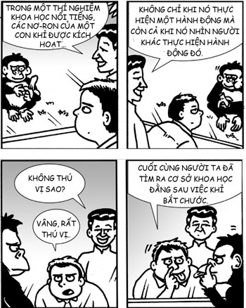
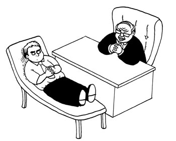
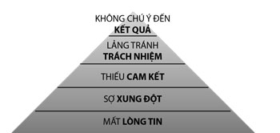
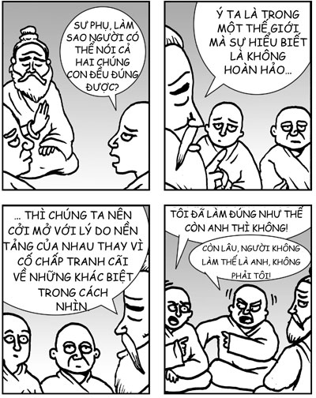

# Chương 7: SỰ ĐỒNG CẢM VÀ ĐIỆU TANGO CỦA BỘ NÃO
### Phát triển sự đồng cảm thông qua thấu hiểu và kết nối với người khác

> *Trước tiên hãy tìm cách thấu hiểu, rồi sau đó mới tìm cách để được thấu hiểu.*  
> — **Stephen R. Covey**

Sau đây, tôi sẽ kể cho các bạn một câu chuyện cười mà tôi đã được nghe cách đây rất lâu.

Ngày xửa ngày xưa, có một môn sinh hỏi sư phụ của mình như sau: “Thưa sư phụ, có phải một nửa cuộc sống thần thánh là việc kết giao với mọi người không?”.

Vị sư phụ trả lời: “Không, toàn bộ cuộc sống thần thánh đều là việc kết giao với mọi người”.

Có thể câu chuyện đùa này được “chế” từ câu chuyện Phật giáo nổi tiếng là Đức Phật nói với Ananda rằng việc kết bạn với “những người đáng khâm phục” không phải là một nửa cuộc sống thần thánh mà là toàn bộ cuộc sống thần thánh. Tuy nhiên, theo thời gian, tôi thấy phiên bản ngụy tác hài hước này chứa đựng hiểu biết rất sâu sắc. Trong ngữ cảnh trí thông minh cảm xúc, tôi cho rằng việc kết giao với mọi người chính là thử thách trọng tâm của nó.

Vì vậy, xin chúc mừng bạn đã hoàn thành các chương về trí thông minh nội tâm cá nhân và chào mừng bạn đến với trí thông minh tương tác – cấp độ đai đen.

## SỰ ĐỒNG CẢM, BỘ NÃO VÀ CHUYỆN CON KHỈ

Có một việc khiến tôi rất buồn cười, đó là một trong những phát hiện quan trọng nhất về khoa học thần kinh lại tình cờ được tìm ra khi có người nhặt thức ăn trước mặt một con khỉ.

Một nhóm những nhà sinh lý học thần kinh của Đại học Parma, Italy, đã lắp điện cực vào não của một con khỉ để ghi nhận các hoạt động thần kinh[^1]. Họ phát hiện ra rằng cứ mỗi lần con khỉ đó nhặt một miếng thức ăn lên là lại có một vài nơ-ron được kích hoạt. Một phần công tác khoa học này bao gồm cả việc thỉnh thoảng, các nhà nghiên cứu lại phải nhặt thức ăn lên để đưa cho con khỉ và họ rất ngạc nhiên khi thấy rằng việc làm đó kích hoạt cùng những nơ-ron trên trong não con khỉ. Khi nghiên cứu sâu hơn, họ phát hiện ra sự tồn tại của một thứ gọi là “nơ-ron gương”. Đó là những tế bào não được kích hoạt khi con vật đang thực hiện một hành động cũng như khi nó xem con vật khác thực hiện cùng hành động đó. Không có gì ngạc nhiên khi sau này, người ta phát hiện ra những bằng chứng chứng minh rằng trong bộ não người cũng có những nơ-ron gương đó.

Một số nhà khoa học nói rằng nơ-ron gương tạo nên nền tảng thần kinh của sự đồng cảm và nhận thức xã hội. Mặc dù những bằng chứng khoa học làm căn cứ cho tuyên bố này vẫn chưa đủ thuyết phục, song dù thế nào đi nữa, nơ-ron gương cũng đưa ra một cái nhìn thú vị về bản chất xã hội của não người. Cứ như thể bộ não người được thiết kế để phù hợp với những người khác vậy, ngay dưới lớp nơ-ron cá nhân[^2].

*“Vâng, rất thú vị.”*

Một cái nhìn khác, cũng thú vị không kém, về sự đồng cảm ở khía cạnh thần kinh được phát hiện thông qua cách bộ não phản ứng với nỗi đau của người khác. Khi bạn nhận kích thích đau, những phần não có tên là “ma trận đau” được kích hoạt. Thay vì bản thân phải gánh chịu nếu, bạn nhìn thấy người thân của mình nhận kích thích đau đó, chính những ma trận đau của bạn ở trên cũng được kích hoạt[^3]. Nói một cách rất thực thì bạn đang trải nghiệm nỗi đau của người đó trong não của mình. Kích thích hai người nhận được không nhất thiết phải đến từ cùng một nguồn nhưng hai người lại chịu chung một tác động. Đây chính là nền tảng thần kinh của sự từ bi. Bản thân chữ “từ bi” có nguồn gốc từ những chữ La-tinh có nghĩa là “chịu đựng cùng nhau”. Chúng ta chả cần cố gắng gì cả mà não của chúng ta đã tự động tạo ra sự đồng cảm và từ bi rồi, ít nhất là đối với những người chúng ta yêu thương.

## ĐIỆU TANGO CỦA NÃO

Có một mối quan hệ thú vị giữa sự tự nhận thức và sự đồng cảm. Nếu bạn có khả năng tự nhận thức mạnh, rất có thể bạn cũng có khả năng đồng cảm cao. Có vẻ như não sử dụng cùng một công cụ cho cả hai hoạt động này. Cụ thể là cả hai phẩm chất này đều liên quan rất nhiều đến một bộ phận trong não có tên là thùy đảo. Thùy đảo chịu trách nhiệm về khả năng trải nghiệm và nhận ra các cảm giác trên cơ thể. Ví dụ, một người có thùy đảo rất nhạy cảm có thể nhận thức được cả nhịp tim của mình. Một điều vô cùng thú vị là khoa học đã chứng minh rằng những người có thùy đảo nhạy cảm cũng thường có khả năng đồng cảm cao[^4].

Tại sao lại như vậy? Nhà tâm lý học nổi tiếng John Gottman và các đồng sự của mình đã tiến hành một công trình chứa đựng một gợi ý thú vị. Gottman nổi tiếng vì các công trình tiên phong trong lĩnh vực phân tích mối quan hệ và mức độ ổn định của hôn nhân. Ông có chuyên môn tuyệt vời và nổi tiếng với khả năng dự đoán chính xác việc liệu trong vòng 10 năm, một cuộc hôn nhân có kết thúc bằng ly dị hay không chỉ bằng cách quan sát hai vợ chồng nói chuyện với nhau trong 15 phút. Phần lớn nghiên cứu của Gottman diễn ra như sau: hai vợ chồng được đưa vào một căn phòng, một thiết bị giúp ghi nhận các tín hiệu sinh lý được gắn vào người họ, rồi họ nói chuyện với nhau (ví dụ, về một chủ đề mà họ đang bất đồng quan điểm) và cuộc trao đổi này sẽ được quay phim. Tiếp theo, từng người sẽ được cho xem riêng đoạn phim này và họ sẽ đánh giá mình cảm thấy như thế nào qua từng giai đoạn của cuộc trao đổi. Những thí nghiệm như vậy đem lại một kho dữ liệu vô cùng quý giá, bao gồm các đoạn phim về từng cuộc nói chuyện, những đánh giá của chính người trong cuộc về các cảm giác của mình khi nói chuyện và các dữ liệu sinh lý.

Trong một thí nghiệm thú vị khác, đồng sự của Gottman, Robert Levenson, để một người thứ ba (hãy gọi người này là “người đánh giá”) xem một số đoạn phim và đánh giá xem mỗi người trong đoạn phim cảm thấy như thế nào qua từng giai đoạn của cuộc trao đổi[^5].

Trong thí nghiệm này, người ta đo sự đồng cảm của người đánh giá: người đánh giá càng đánh giá chính xác cảm xúc của người trong cuộc thì sự đồng cảm của người đó càng cao. Điều thú vị nhất của thí nghiệm này có liên quan đến các tín hiệu sinh lý của người đánh giá. Người ta cũng đo lường cả các tín hiệu này trong thí nghiệm. Họ phát hiện ra rằng: những phản ứng sinh lý của người đánh giá càng giống với người trong cuộc thì người đó càng đánh giá chính xác cảm xúc của người trong cuộc.

*“Thật sao? Điều gì khiến ông có cái ý nghĩ là chồng tôi có khả năng đồng cảm?”*

Nói cách khác, sự đồng cảm xuất hiện bằng cách khiến bạn có những phản ứng về mặt sinh lý giống với đối phương. Daniel Goleman gọi hiện tượng này sự cuốn theo. Ông cũng gọi nó là “điệu tango của cảm xúc”. Sự cuốn theo chính là lý do giải thích tại sao sự đồng cảm có mối liên quan mật thiết với sự tự nhận thức: não bộ sử dụng chính công cụ tự nhận thức để đồng cảm. Thực tế, bạn có thể nói rằng sự đồng cảm dựa trên sự tự nhận thức và nếu sự tự nhận thức của bạn yếu sự đồng cảm của bạn cũng yếu.

Hiểu biết này chứa đựng một ngụ ý quan trọng đó là những phương pháp làm tăng sự tự nhận thức cũng đồng thời làm tăng sự đồng cảm. Ví dụ, việc chú tâm vào cơ thể (chẳng hạn như bài tập quét cơ thể được nói đến trong Chương 4) cũng giúp thùy đảo khỏe hơn và do đó, cải thiện đồng thời cả sự tự nhận thức cũng như sự đồng cảm. Một mũi tên trúng hai đích!

## ĐỒNG CẢM KHÔNG PHẢI LÀ ĐỒNG Ý HAY PHÂN TÍCH TÂM LÝ

Người ta thường nhầm đồng cảm với phân tích tâm lý, tức là suy đoán các khía cạnh hay động cơ tâm lý, và thường là thiếu cơ sở. Ví dụ, giả sử bạn đang giải thích vấn đề với sếp thì bỗng nhiên sếp ngắt lời bạn và bắt đầu nói rằng vấn đề này có liên quan như thế nào đến các vấn đề mà ông ta cho là bạn gặp phải thời thơ ấu, cũng như đến một vài khía cạnh khác trong lĩnh vực tâm lý học đại chúng mà có lẽ ông ta đọc được ở đâu đó. Việc ông ta đang làm là phân tích tâm lý chứ không phải đồng cảm. Khi phân tích tâm lý là chúng ta đang lảng tránh vấn đề chứ không phải tìm hiểu vấn đề. Không có gì ngạc nhiên khi phân tích tâm lý thường là hành động của những nhà quản lý tầm thường. Tôi hay tưởng tượng các nhà quản lý có thói quen phân tích tâm lý sẽ bắt đầu mọc hai chỏm tóc nhọn giống như sếp của Dilbert[^a]. Nếu sếp của bạn không làm thế mà toàn tâm toàn ý lắng nghe bạn, cố gắng tìm hiểu xem vấn đề của bạn có ảnh hưởng đến bạn như thế nào, cả về mặt nhận thức lẫn mặt bản năng và làm tất cả những điều này bằng tình yêu thương, thì đó là ông ta đang đồng cảm.

*“Tôi sẽ giáng chức cậu vì cậu đang gặp phải những vấn đề nan giải với mẹ mình.”*

Đồng cảm không nhất thiết nghĩa là đồng ý. Có thể vừa thấu hiểu người khác, cả ở mức độ lý trí lẫn mức độ bản năng, một cách đầy yêu thương, vừa phản đối họ một cách tôn trọng. Aristotle nói: “Dấu hiệu của một tâm trí có giáo dục là có thể chơi đùa với một ý nghĩ mà không chấp nhận nó”. Phản đối bằng sự đồng cảm cũng tương tự như vậy. Dấu hiệu của một tâm trí đã phát triển là có thể hiểu và chấp nhận cảm giác của người khác mà không đồng ý với nó.

Hiểu biết này cho thấy chúng ta có thể đưa ra những quyết định cứng rắn mà vẫn thể hiện được sự đồng cảm. Thực ra, trong nhiều tình huống, cách tốt nhất để đưa ra những quyết định cứng rắn là đưa chúng ra bằng tình yêu thương và đồng cảm. Trong bối cảnh kinh doanh, nếu phải đưa ra một quyết định sẽ gây tổn hại đến lợi ích của người khác, chúng ta rất dễ tự nhủ rằng không được mang sự đồng cảm vào tình huống này vì nếu làm thế, chúng ta chỉ càng khiến việc đưa ra quyết định cứng rắn, nhưng cần thiết, trở nên khó khăn với chính bản thân mình mà thôi. Tôi nghĩ đây không phải là cách làm tối ưu. Các quyết định cứng rắn mà không có sự đồng cảm tuy có thể dễ dàng đạt được điều mình muốn trong ngắn hạn, nhưng cũng sẽ tạo ra sự oán giận và mất lòng tin, từ đó gây tổn hại đến lợi ích lâu dài của chúng ta. Ngược lại, nếu đối xử với những người bị ảnh hưởng bằng tình yêu thương và đồng cảm, chúng ta sẽ tạo ra sự thấu hiểu và lòng tin. Kết hợp hai điều đó, chúng ta sẽ càng ngày càng thành thạo trong việc thương lượng và kiểm soát những mối quan tâm của mình. Nếu có đủ sự thấu hiểu và lòng tin, chúng ta thậm chí còn có thể tìm ra những cách thức sáng tạo để giải quyết vấn đề của mọi người, hay ít nhất cũng làm nhẹ đi đáng kể một số vấn đề nào đó. Tóm lại, vẫn cần phải đưa ra các quyết định cứng rắn nhưng nếu mọi người tin bạn, cảm thấy rằng trái tim của bạn vẫn ở đúng vị trí của nó, hiểu rằng bạn đang làm điều này vì một lợi ích lớn lao hơn, bạn sẽ dễ nhận được sự hợp tác của họ hơn. Quan trọng hơn, một khi lòng tin đã được thiết lập, nó sẽ trở thành nền tảng để bạn xây dựng nên một mối quan hệ công việc lâu dài và vững mạnh. Vậy là bạn giành chiến thắng cả trong ngắn hạn và dài hạn.

Một ví dụ tuyệt vời của việc đưa ra những quyết định cứng rắn mà vẫn thể hiện được sự đồng cảm xuất hiện trong cuốn *Emotional Intelligence: Why It Can Matter More Than IQ* (Trí tuệ xúc cảm) của Goleman:

> *Hãy xem cách đối xử với nhân viên của hai công ty khi nhà máy bị đóng cửa. Ở GE, công nhân được thông báo trước hai năm về việc đóng cửa nhà máy và công ty cật lực giúp họ tìm kiếm công việc mới. Công ty kia chỉ thông báo trước một tuần và không hề làm gì để giúp công nhân tìm công việc mới.*  
> *Kết quả thì sao? Gần một năm sau, phần lớn cựu công nhân GE nói rằng công ty là một nơi làm việc tốt và 93% đánh giá cao những đãi ngộ mà họ được nhận trong quá trình chuyển việc. Còn ở công ty kia, chỉ 3% nói rằng công ty là một nơi làm việc tốt. GE đã bảo tồn được một kho tàng những điều tốt đẹp, công ty kia chỉ để lại một di sản đầy cay đắng.*[^6]

Khi sa thải nhân viên, các công ty đang đẩy họ vào một trong những trải nghiệm đau đớn nhất trong cuộc đời. Song ngay cả như vậy, chúng ta vẫn có thể làm điều đó bằng sự đồng cảm và thậm chí ngay trong những tình huống đau đớn đó, chúng ta vẫn có thể tạo ra lòng tin và những điều tốt đẹp. Một số người gọi việc này là “cứng rắn mà không đáng ghét”.

## CÁCH LÀM TĂNG SỰ ĐỒNG CẢM

Tình yêu thương sẽ làm tăng sự đồng cảm. Tình yêu thương là động cơ của sự đồng cảm; nó thúc đẩy bạn quan tâm, khiến bạn cởi mở với người khác hơn và người khác cởi mở với bạn hơn. Càng thể hiện tình yêu thương với người khác, bạn càng dễ đồng cảm với họ.

Chúng ta cũng sẽ đồng cảm hơn nếu nhìn ra được cái gì đó tương tự với mình. Càng thấy người khác giống chúng ta thì chúng ta càng dễ đồng cảm với họ. Andrea Serino và nhóm của mình đã thực hiện một nghiên cứu thú vị có cái tên rất phù hợp là *Tôi cảm thấy những gì bạn cảm thấy nếu bạn có điểm giống tôi*. Nghiên cứu này cung cấp gợi ý về sự ảnh hưởng mạnh mẽ của việc nhìn ra được sự tương đồng đối với sự đồng cảm[^7]. Cơ sở của nghiên cứu này là một phát hiện cho thấy nếu bạn xem đoạn phim có ai đó đang chạm vào cơ thể bạn thì sự nhạy cảm về mặt xúc giác của bạn cũng sẽ tạm thời được tăng lên. Ví dụ, nếu dùng điện kích thích má của bạn ở mức độ thấp hơn mức độ bạn có thể nhận thức được (gọi là “kích thích xúc giác dưới ngưỡng”), bạn có thể sẽ không cảm thấy gì. Nhưng nếu việc đó xảy ra khi bạn đang xem một đoạn phim có người chạm vào má của mình thì có thể bạn sẽ cảm thấy nó. Nói cách khác, việc xem người khác chạm vào má của mình sẽ khiến bạn nhạy cảm hơn với cảm giác má của mình bị chạm. Cơ chế này được gọi là “tái định hướng xúc giác bằng hình ảnh” và nó cũng phát huy tác dụng khi bạn xem một đoạn phim mặt người khác thay vì mặt bạn bị chạm. Đúng là một cơ chế tuyệt vời.

Nghiên cứu của Serino đào sâu cả vào câu hỏi liệu cơ chế tái định hướng xúc giác bằng hình ảnh này có phát huy tác dụng mạnh hơn nếu khuôn mặt bạn nhìn thấy đang bị chạm vào là của một người mà bạn thấy có điểm giống mình hay không. Trong thí nghiệm đầu tiên, họ sử dụng khuôn mặt của những người có chung chủng tộc với người tham gia và khuôn mặt của những người có chủng tộc khác (cụ thể ở đây là người Kavkaz với người Maghreb). Một điều thú vị, nhưng có lẽ không quá gây ngạc nhiên, là cơ chế này hoạt động tốt hơn rất nhiều nếu đó là khuôn mặt của những người có chung chủng tộc với người tham gia.

Thí nghiệm thứ hai sử dụng khuôn mặt của những nhà lãnh đạo đảng phái chính trị mà người tham gia ủng hộ và khuôn mặt của những nhà lãnh đạo đảng phái đối lập (tất cả đều có chung chủng tộc với nhau). Kết quả là cơ thể tái định hướng bằng hình ảnh hoạt động tốt hơn rất nhiều nếu đó là khuôn mặt của những người thuộc đảng phái chính trị mà người tham gia ủng hộ! Đúng là một phát hiện đột phá. Chỉ một hiểu biết đơn giản là người kia có chung quan điểm chính trị với bạn hay không cũng có thể ảnh hưởng rất lớn đến cách bạn phản ứng với người đó ở mức độ vô thức và thần kinh.

Do đó, để trở nên đồng cảm hơn, chúng ta cần tạo ra một tâm trí có bản năng phản ứng theo cách đầy yêu thương với tất cả mọi người và một nhận thức tự động coi những người khác “cũng như mình mà thôi”. Nói cách khác, chúng ta cần tạo ra các thói quen tư duy.

## TẠO RA CÁC THÓI QUEN TƯ DUY TÍCH CỰC

Việc tạo ra các thói quen tư duy dựa trên một hiểu biết đơn giản và ai cũng biết song vô cùng quan trọng. Đức Phật miêu tả như sau:

> *Khi một người thường xuyên suy nghĩ về một điều gì đó thì nó sẽ trở thành xu hướng tâm trí của anh ta.*[^8]

Nói cách khác, chúng ta nghĩ gì thì sẽ trở thành cái đó.

Bản thân phương pháp này rất đơn giản: hãy thường xuyên đưa một suy nghĩ vào tâm trí bạn và nó sẽ trở thành một thói quen tư duy. Ví dụ, nếu bất cứ khi nào nhìn thấy một người nào đó, bạn đều mong người đó được hạnh phúc thì cuối cùng, nó sẽ trở thành thói quen tư duy của bạn để rồi bất cứ khi nào nhìn thấy một người nào đó, theo bản năng, ý nghĩ đầu tiên của bạn sẽ là mong người đó được hạnh phúc. Sau một thời gian, bạn sẽ phát triển được bản năng yêu thương và trở thành một người đầy tình yêu thương. Tình yêu thương của bạn thể hiện trong khuôn mặt, tư thế và thái độ của bạn bất cứ khi nào bạn gặp người nào đó. Mọi người sẽ bị cuốn hút vào tính cách, chứ không chỉ vẻ ngoài hấp dẫn của bạn.

*“Thế hôm nay, anh học được điều gì? — Anh học được là anh sẽ trở thành một cái ham-bơ-gơ.”*

Một cách luyện tập không chính thống là chỉ cần đơn giản tạo ra những ý nghĩ này bất cứ khi nào bạn gặp mọi người. Tuy nhiên, có một cách luyện tập chính thống, có hệ thống, và rất hiệu quả. Chúng tôi gọi nó là bài tập **Yêu Thương / Cũng Như Mình Mà Thôi**.

### Yêu thương & Cũng như mình mà thôi
Có hai bài tập riêng biệt để rèn luyện khả năng nhìn ra điểm giống nhau và thể hiện tình yêu thương. Bài tập thứ nhất có tên là **Cũng Như Mình Mà Thôi**, trong đó chúng ta nhắc nhở bản thân về việc người khác giống chúng ta như thế nào, từ đó tạo nên thói quen nhìn ra điểm giống nhau. Bài tập thứ hai là một bài tập rất phổ biến có tên là **Thiền Yêu Thương**, trong đó chúng ta tạo ra những lời chúc tốt đẹp cho những người khác, từ đó tạo nên thói quen yêu thương. Chúng tôi kết hợp cả hai bài tập thành một.

Trong lớp, chúng tôi thường thực hiện bài tập này theo cặp và hai người sẽ ngồi quay mặt vào nhau. Mục đích của chúng tôi ở đây là, thay vì tìm một người ngồi đối diện với bạn, bạn chỉ cần đơn giản là hình dung trong tâm trí một người mà bạn quan tâm khi thực hiện bài tập này.

Tôi khuyên bạn nên đọc các hướng dẫn của bài tập Yêu Thương và Cũng Như Mình Mà Thôi thật chậm rãi và ngưng lại những khoảng thật lâu:

### BÀI TẬP THỰC HÀNH: CŨNG NHƯ MÌNH MÀ THÔI VÀ THIỀN YÊU THƯƠNG

#### Chuẩn bị
Ngồi trong tư thế thoải mái cho phép bạn vừa cảnh giác vừa thư giãn trong cùng một lúc. Bắt đầu với việc để tâm trí nghỉ ngơi trên hơi thở trong hai phút.

Nghĩ về một người mà bạn quan tâm. Hình dung ra người đó. Nếu muốn, bạn có thể sử dụng một tấm hình hoặc một đoạn phim về người đó.

#### Cũng như mình mà thôi
Giờ hãy đọc thật chậm rãi hướng dẫn dưới đây cho chính mình nghe, cứ hết một câu lại ngưng lại để suy ngẫm:
* *Người này có một cơ thể và một tâm trí, cũng như mình mà thôi.*
* *Người này có các cảm giác, cảm xúc, và suy nghĩ, cũng như mình mà thôi.*
* *Người này, vào một lúc nào đó trong cuộc đời, đã từng buồn bã, thất vọng, giận dữ, đau đớn, hay hoang mang, cũng như mình mà thôi.*
* *Người này, trong cuộc đời, đã từng trải qua những nỗi đau về thể xác và tinh thần, cũng như mình mà thôi.*
* *Người này muốn thoát khỏi đau đớn và khốn khổ, cũng như mình mà thôi.*
* *Người này muốn khỏe mạnh và được yêu thương, muốn có những mối quan hệ trọn vẹn, cũng như mình mà thôi.*
* *Người này muốn hạnh phúc, cũng như mình mà thôi.*

#### Yêu thương
Giờ chúng ta hãy để một số lời chúc khởi lên:
* *Tôi chúc người này có sức mạnh, có nguồn lực, có sự hỗ trợ về mặt cảm xúc cũng như mặt xã hội để vượt qua những khó khăn trong cuộc đời.*
* *Tôi chúc người này được thoát khỏi khổ đau. Tôi chúc người này hạnh phúc.*
* *Vì người này là một con người, cũng như mình mà thôi.*

*(Ngưng lại)*

*Giờ tôi chúc tất cả mọi người hạnh phúc.*

*(Ngưng dài)*

#### Kết thúc
Kết thúc bằng việc để tâm trí nghỉ ngơi trong một phút.

Bất cứ khi nào chúng tôi hỏi những người tham gia về cảm nhận của họ khi thực hiện bài tập này thì câu trả lời chúng tôi nhận được nhiều nhất luôn là “hạnh phúc”. Họ khám phá ra rằng khi mình là người cho đi yêu thương thì mình được an bình và hạnh phúc, ít nhất cũng không kém gì khi mình là người được nhận. Nghe thì có vẻ nghịch lý, nhưng nếu bạn nhớ đến việc chúng ta là những sinh vật có tính xã hội cao và não của chúng ta được định trước là mang tính xã hội thì không có gì là nghịch lý cả. Dựa trên việc chúng ta mang tính xã hội và chúng ta cần mang tính xã hội để sống sót, việc chúng ta yêu thương người khác cũng sẽ đem lại phần thưởng về mặt nội tâm cho chúng ta là hoàn toàn hợp lý; đây có thể là một phần quan trọng trong cơ chế sinh tồn. Thậm chí, một nghiên cứu đã chỉ ra rằng nếu chỉ trong 10 ngày thôi, mỗi ngày bạn làm một việc tốt thì bạn sẽ thấy hạnh phúc hơn rất nhiều[^9].

Nói cách khác, yêu thương là một nguồn hạnh phúc bền vững – đây là một hiểu biết đơn giản song rất quan trọng, có khả năng thay đổi cuộc đời chúng ta.

*“Các anh có chắc đây là cách đúng để thực hiện bài tập Cũng Như Mình Mà Thôi không?”*

### Cách cứu vãn cuộc sống hôn nhân và các mối quan hệ khác
Một trong những điều tuyệt vời nhất của bài tập trên là nó có thể được sử dụng để hàn gắn các mối quan hệ trong bất kỳ tình huống nào. Tôi thấy nó đặc biệt hữu dụng trong việc giải quyết xung đột. Bất cứ khi nào tranh cãi với vợ hoặc đồng nghiệp, tôi đều đi sang phòng khác để bình tĩnh lại và sau một vài phút bình tĩnh lại, tôi bí mật thực hiện bài tập này. Tôi hình dung ra đối phương ở căn phòng bên cạnh. Tôi tự nhủ rằng người đó cũng như mình mà thôi, muốn thoát khổ đau giống như mình, muốn hạnh phúc giống như mình, v.v. Và rồi tôi chúc người đó khỏe mạnh, hạnh phúc, thoát khỏi khổ đau, v.v. Chỉ sau một vài phút làm như vậy, tôi cảm thấy tốt hơn nhiều về bản thân mình, về người kia, và về toàn bộ tình huống. Đa phần sự tức giận của tôi đã tiêu tan ngay lập tức.

Nếu lần sau bạn có mâu thuẫn với một người mà bạn quan tâm hay một người mà bạn làm việc cùng, tôi khuyến khích bạn thực hiện bài tập này. Nó sẽ đem lại những điều tuyệt diệu cho mối quan hệ của bạn. Tôi coi bài tập này là nguyên nhân lớn nhất giải thích cho việc kết hôn với tôi cũng không quá tệ.

### Phương pháp yêu thương truyền thống
Bài tập Yêu Thương trên được chúng tôi cải biến dựa trên một bài tập cổ xưa tên là **Metta Bhavana** hay Thiền Yêu Thương. Dạng cổ xưa thì có cấu trúc rõ ràng hơn một chút và có nhịp độ chậm hơn (đây là một điều khá buồn cười vì tôi là kỹ sư nhưng lại cải biên nó theo cách làm giảm cấu trúc đi).

Như mọi phương pháp thiền khác, phương pháp Metta Bhavana truyền thống bắt đầu bằng việc để tâm trí nghỉ ngơi trong vài phút. Sau khi đã có được sự ổn định nào đó về tinh thần, bạn mời gọi một cảm xúc yêu thương đối với chính bản thân. Để làm như vậy, hãy yên lặng lặp lại những câu sau với chính mình:
* *Chúc tôi khỏe mạnh.*
* *Chúc tôi hạnh phúc.*
* *Chúc tôi thoát khỏi khổ đau.*

Sau một vài phút làm như vậy, hãy mời gọi một cảm xúc yêu thương với một người mà bạn yêu mến hoặc khâm phục, một người mà bạn dễ dàng tạo ra tình yêu thương. Nếu muốn, bạn có thể sử dụng các câu trên cho người đó. Chúc người đó khỏe mạnh, hạnh phúc và thoát khỏi khổ đau.

Sau một vài phút làm điều đó, làm tương tự với một người trung lập, một người mà bạn không đặc biệt thích hay không thích, hoặc một người mà bạn không biết rõ lắm. Một vài phút sau, hãy làm như vậy với một người mà bạn khó chịu hoặc không thích, hoặc một người gây ra rất nhiều khó khăn cho cuộc đời bạn. Chúc người đó khỏe mạnh, hạnh phúc và thoát khỏi khổ đau. Cuối cùng, lan tỏa cảm giác đó ra tất cả những sinh vật có cảm giác khác. Chúc tất cả những sinh vật có cảm giác khỏe mạnh, hạnh phúc và thoát khỏi khổ đau.

Một trong những điều tuyệt vời nhất mà phương pháp truyền thống này đem lại là khi phải tiếp xúc với một người khó chịu, tâm trí bạn đã được thấm đẫm tình yêu thương và bạn sẽ dễ dàng phá vỡ những thói quen tư duy từng có về người đó. Ví dụ, nếu bạn có thói quen cứ mỗi lần nghĩ đến Nick là có cảm giác chán ghét hãy chọn Nick làm đối tượng để thực hiện Metta Bhavana hàng ngày, sau một thời gian, tâm trí bạn sẽ bắt đầu liên kết Nick với một cảm xúc tích cực, vì cứ mỗi lần bạn nghĩ đến Nick khi đang thiền thì tâm trí bạn đã được thấm đẫm tình yêu thương rồi. Sau một thời gian, bạn sẽ thấy mình không còn ghét Nick nữa và có thể bạn sẽ phải tìm một người khó chịu mới để thực hiện Metta Bhavana. (Cuối cùng, có thể bạn sẽ hết cả người bạn ghét. Với mục đích của phương pháp thiền này thì đây đúng là một điều khó chịu, nhưng nếu được gặp phải vấn đề này thì cũng không quá tệ đâu, thật đấy.)

Cứ thoải mái sử dụng phương pháp truyền thống này nếu nó hiệu quả hơn với bạn.

*“Được rồi, để xem nào... tiếp theo mình nên dùng Metta Bhavana lên ai đây?”*

## GỢI RA ĐIỂM TỐT ĐẸP NHẤT TRONG MỖI NGƯỜI

Trong các phần trước, chúng ta đã học các phương pháp để phát triển các kỹ năng đồng cảm mang tính nền tảng. Trong các phần sau, chúng ta sẽ tập trung vào những phương pháp giúp chúng ta hỗ trợ sự phát triển của người khác và gợi lên điểm tốt đẹp trong họ.

### Tạo dựng lòng tin rất có lợi cho công việc
Đồng cảm là một điều rất tốt, nhưng không chỉ có vậy, nó còn đóng vai trò quan trọng trong việc giúp bạn thành công trong công việc, đặc biệt là khi công việc của bạn có liên quan đến việc xây dựng một đội hay việc huấn luyện, đào tạo và quan tâm đến người khác. Có một năng lực cơ bản giúp bạn trở nên cực kỳ hiệu quả trong những hoạt động này, đó là năng lực tạo dựng lòng tin. Về điều này thì hãy tin tôi.

Đồng cảm giúp chúng ta tạo dựng lòng tin. Khi tương tác bằng sự đồng cảm, chúng ta làm tăng khả năng mọi người cảm thấy mình được nhìn nhận, được lắng nghe và được thấu hiểu. Khi mọi người cảm nhận được những điều đó, họ sẽ thấy an toàn hơn và dễ tin tưởng người hiểu họ hơn.

Những nhà tư tưởng chủ chốt về tính hiệu quả trong công việc coi sự tin cậy là nền tảng cho các phương pháp và cách tiếp cận của họ. Ví dụ Marc Lesser, một nhà huấn luyện điều hành lỗi lạc, đã đưa ra chu trình huấn luyện/đào tạo gồm những bước sau:
1. Tạo dựng lòng tin
2. Lắng nghe (bằng cách “thắt nút” và “nhúng”)
3. Hỏi những câu hỏi mở và có tính thăm dò
4. Cung cấp phản hồi
5. Hợp tác để tạo ra các lựa chọn và phương pháp.

Bước quan trọng nhất là bước đầu tiên, tạo dựng lòng tin. Lòng tin là nền tảng cho một mối quan hệ huấn luyện/đào tạo. Nó rất đơn giản: nếu bạn muốn hướng dẫn học viên thì người đó phải cởi mở với bạn. Người đó càng cởi mở thì sự hướng dẫn của bạn càng hiệu quả, người đó càng tin bạn thì càng cởi mở với bạn. Nếu không có sự tin cậy thì mối quan hệ đào tạo này sẽ chỉ làm lãng phí thời gian (trừ phi bạn được ăn bánh rán trong quá trình đào tạo, khi đó những chiếc bánh này sẽ bù đắp được một phần nào đó lượng thời gian bị lãng phí, nhưng tôi không khuyến khích bạn lấy bánh rán để thay cho lòng tin đâu nhé).

Tương tự, sự tin cậy là nền tảng trọng yếu của một đội nhóm có hiệu quả cao. Trong cuốn *The Five Dysfunctions of a Team: A Leadership Fable* (Năm rối loạn chức năng ở một nhóm lãnh đạo), Patrick Lencioni đã miêu tả năm cách có thể khiến một nhóm bị rối loạn chức năng và chúng được trình bày dưới dạng một kim tự tháp[^10]:

*“Thật ra, Dave ạ, chúng tôi đang hy vọng là chúng ta có thể quay trở lại lúc anh chưa cảm thấy cởi mở đến mức sẵn sàng phơi bày mọi điểm yếu với chúng tôi.”*

Năm loại rối loạn chức năng, xếp theo thứ tự nhân quả là:
1. **Mất lòng tin:** Mọi người không tin tưởng vào ý định của đồng đội. Họ cảm thấy cần phải bảo vệ bản thân mình trước những người khác trong đội và đi qua nhau vô cùng thận trọng. Điều này dẫn đến rối loạn chức năng thứ hai.
2. **Sợ xung đột:** Không có lòng tin, mọi người không muốn tham gia vào những cuộc tranh luận và xung đột mang tính xây dựng, loại xung đột tập trung hoàn toàn vào việc giải quyết vấn đề chứ không phải công kích cá nhân hay có những động cơ ích kỷ đằng sau. Thiếu vắng những xung đột lành mạnh như vậy, các vấn đề sẽ ở mãi trong tình trạng không được giải quyết hoặc dù được giải quyết nhưng cũng không triệt để. Mọi người cảm thấy họ không được tham gia thích đáng vào việc ra quyết định. Điều này dẫn đến rối loạn chức năng tiếp theo.
3. **Thiếu cam kết:** Khi mọi người cảm thấy ý kiến của họ không được cân nhắc và họ không được tham gia thích đáng vào việc ra quyết định thì họ sẽ không đồng ý với quyết định đó. Họ sẽ không cam kết với quyết định cuối cùng. Các ưu tiên và hướng đi càng ngày càng mơ hồ, cũng như sự không chắc chắn ngày càng gia tăng. Điều này sẽ dẫn đến rối loạn chức năng tiếp theo.
4. **Lảng tránh trách nhiệm:** Khi mọi người không đồng ý với quyết định cuối cùng, họ sẽ lảng tránh trách nhiệm. Tồi tệ hơn là họ đổ lỗi cho các đồng nghiệp vì đưa ra các tiêu chuẩn cao. Sự oán giận tích tụ và sự tầm thường lan rộng. Điều này dẫn đến rối loạn chức năng cuối cùng.
5. **Không chú ý đến kết quả:** Loại rối loạn chức năng chí mạng của một đội. Mối quan tâm của mọi người khác với các mục tiêu chung của nhóm. Các mục tiêu không đạt được, các kết quả không thành hiện thực và bạn sẽ đánh mất những thành viên tốt nhất của mình vào tay đối thủ cạnh tranh.

Tất cả đều bắt đầu từ lòng tin. Mất lòng tin là nguyên nhân gốc rễ của tất cả các rối loạn chức năng khác. Cụ thể, loại lòng tin mà Lencioni đang nói đến được ông gọi là “lòng tin dựa trên điểm yếu”. Đó là khi các thành viên trong nhóm tin vào ý định của nhau đến mức họ sẵn sàng phơi bày điểm yếu của mình vì họ tin rằng mọi người sẽ không sử dụng những điểm yếu mà họ phơi bày ra để chống lại họ. Do đó, họ sẵn sàng thừa nhận vấn đề cũng như khuyết điểm và nhờ mọi người giúp đỡ. Nói cách khác, họ có thể tập trung năng lượng vào việc đạt được các mục tiêu chung của nhóm thay vì lãng phí thời gian tìm cách bảo vệ cái tôi của mình và giữ hình ảnh với đồng đội.

Loại lòng tin dựa trên điểm yếu này cũng chính là loại lòng tin mà Marc Lesser nói rằng nó là nền tảng của mối quan hệ huấn luyện/đào tạo hiệu quả. Nếu học được cách thiết lập loại lòng tin này, bạn sẽ trở nên hiệu quả không chỉ trong vai trò trưởng nhóm mà còn trong vai trò huấn luyện viên hay chuyên viên đào tạo nữa.

### Bắt đầu bằng sự chân thành, tình yêu thương, và sự cởi mở
Nhiều năm trước, tôi có một người quản lý tên là John, tôi rất yêu quý và kính trọng ông. Tôi và John là những người bạn tốt của nhau. John rời công ty chúng tôi vì gặp phải những tình huống mà theo tôi là rất khó chịu, rất không công bằng với ông. Khi một người quản lý mới tên là Eric đến thay thế ông thì tôi không vui chút nào. Về mặt cảm xúc, tôi cảm thấy ghét Eric nhưng về mặt lý trí, tôi biết đó thực ra không phải là lỗi của Eric. Vì vậy tôi quyết định xóa tan mọi sự oán ghét với Eric. Đến thời điểm đó, tôi đã là một thiền sinh giàu kinh nghiệm, nên tôi biết chính xác mình cần sử dụng công cụ gì, đó là sự đồng cảm.

Eric vốn là một người quen của tôi và thỉnh thoảng tôi vẫn làm việc với ông trong những vấn đề nhỏ, vì vậy tôi biết ông không phải là một người xấu. Thực ra, về mặt lý trí, tôi còn cảm giác (hóa ra là đúng) rằng ông là một người tốt và tất cả những gì tôi phải làm là thuyết phục não cảm xúc của mình. Vì vậy trong buổi gặp riêng đầu tiên của chúng tôi kể từ khi ông trở thành người quản lý chính thức, tôi bảo đảm mình chỉ nói về những việc cá nhân và nói bằng tình yêu thương cùng sự cởi mở. Chúng tôi đã trao đổi các câu chuyện cũng như các ước mơ trong cuộc đời mình. Tôi đã hỏi ông rằng ông muốn làm gì để cứu thế giới. Mục đích của tất cả những việc này là cho cả não lý trí và não cảm xúc của tôi một cơ hội để tìm hiểu Eric với tư cách là một con người, để liên kết ông với sự tốt đẹp bên trong ông, để mỗi lần tôi thấy ông, não cảm xúc của tôi sẽ phản ứng là: “Đây là một người tốt. Mình thích ông ta”.

Nó hiệu quả như một thần chú vậy. Ngay lập tức Eric đã giành được sự tin cậy của tôi bằng cách hồi đáp lại sự chân thành, tình yêu thương và sự cởi mở của tôi. Tuyệt vời hơn là tôi thấy ông là một người rất tốt và đáng khâm phục. Ví dụ, ông đã dành tất cả những năm tháng tuổi trẻ để tham gia các hoạt động xây dựng hòa bình ở các quốc gia thuộc thế giới thứ ba. Ông hiếm khi nói về điều này nhưng tôi vô cùng kính trọng nó. Khi cuộc trò chuyện đầu tiên của chúng tôi kết thúc, não cảm xúc của tôi đã được làm mát và não tư duy đã bảo não cảm xúc của tôi rằng: “Thấy chưa? Tôi đã nói với anh là ông ấy là một người tốt mà!”. Sự oán ghét của tôi đối với ông hoàn toàn tan biến.

Trong phạm vi một cuộc trò chuyện riêng một tiếng, tôi và Eric đã thiết lập được một nền tảng vững mạnh cho sự tin cậy lẫn nhau. Trong khoảng thời gian chúng tôi làm việc cùng nhau, chúng tôi đã có một mối quan hệ công việc rất tích cực và hiệu quả. Tôi rất vui được coi ông là bạn mình. (Đây là một câu chuyện có thật, tên nhân vật đã được thay đổi để bảo vệ tôi.)

Tinh thần của câu chuyện này là hãy luôn chuẩn bị bánh rán trong các cuộc họp. Không, tôi chỉ đùa thôi. Tinh thần thật sự của câu chuyện này là lòng tin phải bắt đầu bằng sự chân thành, tình yêu thương và sự cởi mở. Vì vậy, tối ưu nhất là bắt đầu mọi mối quan hệ theo cách đó, cả trong công việc và trong cuộc sống. Bất cứ khi nào có thể, hãy bắt đầu bằng việc giả định rằng đối phương là một người tốt, xứng đáng được đối xử như một người tốt, cho đến khi điều ngược lại được chứng minh.

Một bài học khác là việc luôn đối xử với đối phương như một con người sẽ mang lại rất nhiều lợi ích. Khi xây dựng lòng tin, tôi thấy mình rất dễ xử lý não lý trí, cái khó là làm mát não cảm xúc. Để làm mát não cảm xúc, tôi phải nhận ra rằng đối phương là một con người, cũng như mình mà thôi. Đối phương không chỉ là một đối thủ trên bàn thương lượng, một khách hàng hay một đồng nghiệp; người đó còn là một con người nữa, cũng như mình mà thôi. Khi tâm trí của bạn có thể hoạt động ở mức độ đó trong mọi tình huống, đặc biệt là những tình huống khó khăn, bạn sẽ tạo nên được những điều kiện vững chắc cho sự tin cậy lẫn nhau.

Karen May, Phó Chủ tịch phụ trách lãnh đạo và nhân tài của Google – người có khả năng đồng cảm nhất mà tôi từng làm việc cùng – đưa ra thêm hai mẹo nhỏ để xây dựng lòng tin như sau:
1. **Tập trao cho mọi người lợi ích của sự nghi ngờ:** Phần lớn mọi người làm những việc họ làm vì vào thời điểm đó, dựa trên điều họ muốn đạt được và thông tin họ có được thì dường như, đó là việc nên làm. Họ thấy lý do của mình hợp lý, ngay cả khi chúng ta thấy hành động của họ là vô lý. Hãy giả định rằng họ đang đưa ra lựa chọn đúng đắn dù cho chúng ta không hiểu hoặc chúng ta sẽ đưa ra lựa chọn khác nếu là họ.
2. **Ghi nhớ rằng lòng tin sinh ra lòng tin:** Một cách tôi có thể dùng để xây dựng lòng tin với bạn là giả định rằng bạn là người đáng tin cậy và đối xử với bạn như thế. Khi cảm thấy một người tin bạn, bạn sẽ dễ tin lại họ hơn và ngược lại.

*“Nó sẽ có tác dụng với cả mẹ chồng chứ?”*

### Ba giả định
Bất cứ khi nào tôi chủ trì một cuộc họp, tôi đều thích bắt đầu bằng một bài tập mà tôi gọi là Ba Giả Định: tôi mời tất cả mọi người trong phòng họp đưa ra ba giả định sau về người khác:
1. **Giả định rằng tất cả mọi người trong căn phòng này đều ở đây để phục vụ cho lợi ích lớn hơn**, cho đến khi điều ngược lại được chứng minh.
2. **Dựa trên giả định trên, giả định rằng không ai trong chúng ta có bất cứ động cơ đen tối nào**, cho đến khi điều ngược lại được chứng minh.
3. **Dựa trên giả định trên, giả định rằng tất cả chúng ta đều có lý ngay cả khi chúng ta bất đồng**, cho đến khi điều ngược lại được chứng minh.

Tôi thấy rằng khi bắt đầu một cuộc họp bằng ba giả định này thì một cảm giác tin cậy lớn hơn sẽ hình thành trong phòng họp. Tôi khuyến khích bạn sử dụng phương pháp đơn giản này để nuôi dưỡng sự tin cậy trong nhóm của bạn. Hãy làm điều này ở mọi cuộc họp, và bạn sẽ thấy các thành viên trong nhóm của mình dần dần tin cậy lẫn nhau.

## LẮNG NGHE ĐỒNG CẢM

Nếu bạn đã luyện tập thiền nói chuyện (việc thắt nút và nhúng trong Chương 3), giờ có thể bạn đã thành thạo thiền nghe và đang tận hưởng sự khâm phục của đồng nghiệp đối với năng lực nghe của bạn. Này anh châu chấu, đã đến lúc tiến thêm một bước rồi! Giờ chúng ta sẽ nâng cấp từ thiền nghe lên lắng nghe đồng cảm và đạt được khả năng lắng nghe các cảm giác.

Lắng nghe đồng cảm là một kỹ năng rất mạnh. Trong một bài tập lắng nghe đồng cảm trong chương trình Tìm Kiếm Bên Trong Bạn, tôi đã đóng vai một học viên để lấp vào một chỗ trống. Một phần của bài tập là tôi lắng nghe cảm xúc của học viên cùng tập với tôi khi cô ấy nói, sau đó tôi nói với cô ấy về những cảm xúc mà tôi nghĩ là cô ấy đã có. Sau khi tôi nói xong, cô ấy bắt đầu khóc. Tôi hỏi cô ấy có chuyện gì và cô ấy nói rằng đã lâu lắm rồi cô mới thấy mình được thấu hiểu đến thế. Đó là lúc tôi nhận ra sức mạnh của lắng nghe đồng cảm. Mọi người khao khát được người khác thấu hiểu cảm xúc của mình và khi có ai đó làm được thế, họ cảm động sâu sắc đến mức đôi khi có thể bật khóc. Hãy tưởng tượng xem bạn có thể làm những điều tốt đẹp đến mức nào cho người khác nếu bạn thành thạo kỹ năng lắng nghe đồng cảm.

Trong Tìm Kiếm Bên Trong Bạn, chúng tôi tập lắng nghe đồng cảm giống như bài tập thiền nói chuyện chính thống (Chương 3) nhưng thay đổi một điểm quan trọng. Trong thiền nói chuyện, người nghe, tức người làm việc thắt nút, bắt đầu đáp lại bằng câu: “Mình đã nghe bạn nói rằng...”. Trong bài tập này, người nghe, tức người làm việc thắt nút, sẽ bắt đầu đáp lại bằng câu: “Mình đã nghe bạn cảm thấy rằng...”. Việc này đòi hỏi người nghe phải lắng nghe các cảm xúc rồi sau đó đưa ra câu hồi đáp về các cảm xúc.

### CÁCH LẮNG NGHE ĐỒNG CẢM CHÍNH THỐNG

Đây là một bài tập thiền nói chuyện (Chương 3) nhưng thay vì lắng nghe lời nói, chúng ta lắng nghe cảm xúc.

Hãy chia thành cặp rồi lần lượt đóng vai người nói và người nghe. Bình thường, người nói bắt đầu bằng việc độc thoại. Nếu bạn là người nghe, sau khi người nói độc thoại xong, bạn thắt nút bằng cách nói bạn đã nghe người nói cảm thấy gì. Nói cách khác, thay vì bắt đầu câu hồi đáp bằng “Mình đã nghe bạn nói rằng...” thì hãy bắt đầu bằng “Mình đã nghe bạn cảm thấy rằng...”.

**Những chủ đề gợi ý cho đoạn độc thoại:**
* Một tình huống khó khăn trong công việc hay một xung đột bạn đang gặp phải với sếp, với đồng nghiệp hay với người “chỉ điểm” bạn
* Một thời điểm khi bạn có thể cảm thấy nỗi đau của người khác hoặc khi bạn muốn nhưng không thể
* Bất kỳ chủ đề nào khác có liên quan đến cảm xúc.

#### Tự nói chuyện
Sau khi mỗi người lần lượt đóng vai người nói và người nghe, hãy tự nói chuyện với bản thân mình về những cuộc trao đổi giữa hai người.

Trong lớp, sau khi hoàn thành bài tập này, chúng tôi mới nói câu quyết định: Chúng tôi chưa bao giờ giải thích cho cả lớp cách lắng nghe đồng cảm. Chúng tôi coi như mọi người đã biết rồi.

Và nó đã có tác dụng. Lúc nào cũng vậy, sau khi chúng tôi nói câu trên, mọi người trong lớp đều vô cùng ngạc nhiên và vui mừng khi thấy mình có thể lắng nghe đồng cảm tốt đến thế nào dù không có bất kỳ hướng dẫn nào. Tự bản thân họ đã khám phá ra rằng lắng nghe đồng cảm là một kỹ năng bẩm sinh, một phần trong bộ công cụ chuẩn được cài đặt vào não xã hội của chúng ta. Việc duy nhất chúng ta phải làm là rèn luyện để nó ngày càng phát triển.

Cụ thể, có bốn điều chúng ta có thể làm để nâng cao khả năng lắng nghe đồng cảm:
1. **Thiền:** Với thiền, chúng ta trở nên nhạy cảm hơn và dễ tiếp thu hơn.
2. **Yêu thương:** Khi tràn đầy tình yêu thương, chúng ta sẽ lắng nghe các cảm xúc tốt hơn.
3. **Tò mò:** Hãy tập tò mò về việc đối phương đang cảm thấy như thế nào khi bạn lắng nghe câu chuyện của họ.
4. **Tập luyện:** Hãy lắng nghe đồng cảm thật nhiều. Càng làm nhiều, bạn càng giỏi hơn, đặc biệt là khi bạn kết hợp với thiền, yêu thương và tò mò.

Từ những điều này, sau đây là một số gợi ý để bạn có thể tập lắng nghe đồng cảm một cách không chính thống trong các tình huống hàng ngày. Hãy chú ý rằng phương pháp không chính thống khó hơn phương pháp chính thống một chút. Trong phương pháp chính thống, chúng ta tạo ra một môi trường nhân tạo để nói về việc chúng ta đã lắng nghe cảm xúc của đối phương tốt đến thế nào. Nhưng trong các tình huống nói chuyện thường ngày, chúng ta không thể nói: “Tôi sẽ nói cho anh biết tôi đã nghe anh cảm thấy gì nhé, còn anh sẽ cho tôi biết tôi nói đúng đến đâu nhé, được không?”. Do đó, với phương pháp không chính thống, tôi gợi ý rằng bạn hãy tập trung nhiều hơn vào các phẩm chất bên trong có liên quan đến việc lắng nghe đồng cảm, nhẹ nhàng trong việc đưa ra phản hồi và thoải mái ở gần khu vực an toàn của mình. Hãy nhớ rằng mọi người nói chung không thích người khác nói ra cảm giác của họ, kể cả có nói đúng đi nữa (nếu cần bằng chứng, bạn có thể thử ở nhà: “Rõ ràng là em đang cảm thấy bị tổn thương mà”. “Em cảm thấy thế lúc nào chứ!”). Vì vậy, hãy hỏi về các cảm giác, hoặc ít nhất, hãy nhớ bắt đầu bằng “Tôi nghe được thế này” và cho người nghe cơ hội sửa chữa lời nói của bạn nếu bạn không nói chính xác. Khả năng lắng nghe đồng cảm của bạn sẽ được cải thiện thông qua rèn luyện, ngay cả khi bạn hoàn toàn ở trong khu vực an toàn của mình, miễn là lần nào thực hiện, bạn cũng kết hợp thiền, yêu thương và tò mò.

### CÁCH LẮNG NGHE ĐỒNG CẢM KHÔNG CHÍNH THỐNG

#### Chuẩn bị cho cuộc nói chuyện
Những phẩm chất có lợi nhất cho việc lắng nghe đồng cảm là thiền và yêu thương. Nếu bạn có thời gian chuẩn bị cho cuộc nói chuyện, hãy chuẩn bị tốt nhất những phẩm chất này, trước tiên là dành vài phút để thiền chánh niệm (xem Chương 2) hoặc thiền đi (xem Chương 3). Khi tâm trí ở trong trạng thái thiền đó, bạn sẽ có thể chú ý hơn đến các cảm giác của cả bản thân lẫn đối phương. Bạn sẽ có thể lắng nghe mà không phán xét, từ đó trở nên cởi mở hơn với những điều bạn được nghe. Nếu bạn có nhiều thời gian hơn, hãy dành vài phút để thực hiện bài tập Cũng Như Mình Mà Thôi/Yêu Thương đã được nói đến ở trên trong chương này và đối tượng là người nói chuyện với bạn. Khi đặt mình trong bộ khung tâm trí này, đối phương sẽ dễ tiếp nhận bạn hơn và bạn cũng dễ tiếp nhận đối phương hơn.

#### Trong khi nói chuyện
Bắt đầu cuộc nói chuyện bằng suy nghĩ: “Tôi muốn người này hạnh phúc”. Khi lắng nghe, hãy tập thiền nghe (xem Chương 3). Hãy tự nhắc mình lắng nghe cảm giác của đối phương. Hãy tò mò về cảm xúc mà đối phương đang có. Cho đối phương thật nhiều thời gian.

Nếu tình huống cho phép và bạn cảm thấy thoải mái bạn có thể hỏi đối phương rằng người đó đang cảm thấy như thế nào. Nếu tình huống cho phép và bạn cảm thấy thoải mái, bạn có thể nói với người đó (một cách nhẹ nhàng và đầy yêu thương) rằng: “Mình đã nghe bạn cảm thấy rằng...”. Thoải mái cho phép người đó phản ứng theo bất kỳ cách nào. Nếu bạn đúng về các cảm xúc của người đó, người đó có thể cảm động vì được bạn thấu hiểu và nói điều đó với bạn. Nếu bạn sai, hãy cho phép người đó nói với bạn như vậy, đồng thời lắng nghe với tinh thần cởi mở và yêu thương.

#### Tự nói chuyện
Nếu tình huống cho phép và bạn cảm thấy thoải mái, vào cuối buổi nói chuyện, bạn có thể tự trao đổi với bản thân bằng câu hỏi: “Cuộc nói chuyện này có ích đối với mình không?”

## KHEN NGỢI MỌI NGƯỜI MỘT CÁCH TINH TẾ

Bên cạnh lắng nghe đồng cảm, còn một việc khác bạn có thể làm để gợi lên những điều tốt đẹp nhất trong mỗi người, đó là khen ngợi. Trước hết, hãy luôn khen ngợi một cách chân thành (hoặc đừng bao giờ khen ngợi một cách giả dối). Nếu lời khen không chân thành, đối phương sẽ nhận ra và bạn đánh mất lòng tin của họ. Tuy nhiên, dù cho lời khen có chân thành đi nữa, bạn vẫn cần phải học cách khen ngợi một cách tinh tế. Mọi người hoàn toàn có thể bị tổn thương bởi lời khen của bạn, dù cho bạn có khen ngợi một cách thiện chí nhất đi nữa!

Trong các nghiên cứu của Claudia Mueller và Carol Dweck, họ giao cho những học sinh lớp 5 một bài tập giải đố được thiết kế sao cho đảm bảo những học sinh này sẽ làm tốt, rồi sau đó họ khen ngợi chúng khi chúng thành công[^11]. Một số học sinh được khen là thông minh (“khen ngợi con người”: “Cháu giải đố thông minh lắm”), một số được khen là chăm chỉ (“khen ngợi quá trình”: “Cháu giải đố chăm chỉ lắm”), còn với những học sinh còn lại, nhóm kiểm soát, thì họ chỉ đơn giản bảo chúng là điểm số của chúng rất cao. Sau đó, khi được giao một bộ những câu đố khó hơn, những học sinh được khen là thông minh làm tồi hơn rất nhiều so với những nhóm kia, còn những học sinh được khen là chăm chỉ lại làm tốt hơn rất nhiều. Như vậy, lời khen thông minh là có hại đối với bạn.

Những nhà nghiên cứu trong lĩnh vực này cũng như các lĩnh vực liên quan đã giải thích rằng khi một người được nhận lời khen ngợi con người thì nó củng cố “tư duy cố hữu”, tức là niềm tin rằng chúng ta thành công là nhờ những phẩm chất cố hữu, không bao giờ thay đổi. Những người có tư duy này luôn lo lắng về những phẩm chất của mình. Họ cũng lo lắng về việc mình có thể xứng đáng hay khiếm khuyết đến đâu. Khi thất bại, họ đổ lỗi cho sự khiếm khuyết về mặt con người. Họ không dám chấp nhận rủi ro vì nếu thất bại, mọi người có thể thấy là họ khiếm khuyết. Ngược lại, khi một người được nhận lời khen ngợi quá trình thì nó củng cố “tư duy phát triển”, tức là niềm tin rằng chúng ta có thể phát triển các phẩm chất của mình thông qua chăm chỉ và nỗ lực, hay thành công đến từ chăm chỉ và nỗ lực. Điều này tạo ra lòng ham học hỏi cùng năng lực phục hồi, những phẩm chất tối quan trọng để đạt được những thành tựu vĩ đại[^12].

Vì vậy, khi đưa ra nhận xét, cách tốt nhất là nhận xét làm sao để khuyến khích tư duy phát triển. Nhận xét về nỗ lực và khả năng phát triển thì tốt hơn là khen ngợi con người.

Tóm lại, khen ngợi mọi người làm việc chăm chỉ thì tốt hơn là khen ngợi họ thông minh. À vâng, cám ơn bạn đã đọc cuốn sách này. Bạn đang đọc rất chăm chỉ đấy. Một nỗ lực tuyệt vời!

*Khen ngợi con người: “Ngài đúng là một tướng cướp bẩm sinh.”

*Khen ngợi quá trình: “Ngài đã cướp rất chăm chỉ đấy.”**

## KHẢ NĂNG NHẬN THỨC TỔ CHỨC CHÍNH LÀ KHẢ NĂNG ĐỒNG CẢM Ở CẤP ĐỘ CAO

Đến thời điểm này, bạn đã học được những kỹ năng đồng cảm trong các tình huống tương tác một-một. Giờ là lúc đẩy trò chơi của chúng ta lên một mức độ khó hơn: đọc các dòng cảm xúc và các mối quan hệ quyền lực trong tổ chức. Kỹ năng này thường được gọi bằng cái tên là “nhận thức tổ chức”.

Nhận thức tổ chức là một trong những kỹ năng hữu ích nhất mà bạn có thể trang bị cho mình dù bạn ở trong bất kì tổ chức nào đi nữa. Thật may là kỹ năng này không có gì xa lạ đối với một người thực hành khả năng đồng cảm vì ở một mức độ nào đó, khả năng nhận thức tổ chức chỉ là sự mở rộng của khả năng đồng cảm từ mức độ tương tác cá nhân sang mức độ tổ chức. Daniel Goleman đã miêu tả như sau:

> *Mỗi tổ chức đều có hệ thống kết nối và ảnh hưởng vô hình của riêng nó... Một số người hoàn toàn lãng quên thế giới nằm ngoài tầm mắt này, trong khi những người khác lại nắm bắt trọn vẹn được nó. Để có thể thành thạo trong việc đọc các dòng cảm xúc có ảnh hưởng đến những người thực sự có quyền ra quyết định, cần phải có khả năng đồng cảm ở mức độ tổ chức, chứ không chỉ ở mức độ tương tác cá nhân nữa.*[^13]

Một cách nhìn khác là, với khả năng đồng cảm ở dạng đơn giản nhất, bạn thấu hiểu cảm giác, nhu cầu, và lo lắng của cá nhân; còn với khả năng nhận thức tổ chức, bạn thấu hiểu, cảm giác, nhu cầu và lo lắng của cá nhân, cũng như cách những cảm giác, nhu cầu và lo lắng này tương tác với những cảm giác, nhu cầu và lo lắng của những người khác, cũng như cách tất cả những thứ này đan quyện vào nhau tạo thành một sợi dây cảm xúc chung của cả tập thể nữa. Trong khả năng nhận thức tổ chức, lượng biến số phải thấu hiểu nhiều hơn nhiều, nhưng về cơ bản thì giống nhau.

Nếu thấu hiểu mọi người và thấu hiểu các mối tương tác giữa họ, bạn sẽ thấu hiểu toàn bộ tổ chức. Đó chính là khả năng nhận thức tổ chức.

## RÈN LUYỆN KHẢ NĂNG NHẬN THỨC TỔ CHỨC

Ngoài các bài tập đồng cảm (ở dạng đơn giản nhất) đã được nhắc đến trong chương này, còn có các bài tập hữu ích khác để phát triển khả năng nhận thức tổ chức. Người bạn thông thái của tôi, Marc Lesser, đã đưa ra bài học dưới đây dựa trên nhiều năm kinh nghiệm đảm nhiệm vai trò CEO và huấn luyện viên điều hành:

1. **Duy trì mạng lưới quan hệ bền chặt bên trong tổ chức**, đặc biệt là với các đồng minh, những người hướng dẫn, cũng như với các nhóm sẽ hỗ trợ và thử thách bạn. Để làm được như vậy, hãy quan tâm đến mọi người, giúp đỡ mọi người và nuôi dưỡng các mối quan hệ. Hãy chú ý đến các mối quan hệ một-một, cũng như các mối quan hệ với các nhóm chủ chốt – nhóm của bạn, các nhóm quản lý khác, khách hàng, cổ đông, v.v.
2. **Tập đọc những dòng cảm xúc đang chảy đằng sau tổ chức của bạn.** Am hiểu cách các quyết định được đưa ra. Các quyết định được đưa ra dựa trên quyền lực hay sự nhất trí? Ai là người có ảnh hưởng nhất đến quá trình ra quyết định?
3. **Phân biệt giữa lợi ích của bản thân, lợi ích của nhóm và lợi ích của tổ chức** – bất kỳ ai cũng có ba lợi ích này. Việc am hiểu cái nào là cái nào là rất quan trọng.
4. **Sử dụng khả năng tự nhận thức của bạn để hiểu rõ hơn vai trò của mình trong mạng lưới các cá nhân và các mối quan hệ.** Thường xuyên sử dụng khả năng lắng nghe đồng cảm để hiểu cảm giác của mọi người đối với các tình huống và cảm giác của người này với người kia.

Sau đây là một bài tập giúp bạn tăng khả năng nhận thức tổ chức:

### BÀI TẬP THỰC HÀNH: RÈN LUYỆN KHẢ NĂNG NHẬN THỨC TỔ CHỨC

Bạn có thể thực hiện bài tập này như một bài tập viết hoặc một bài tập nói. Nếu thực hiện như một bài tập nói, bạn có thể nói với một người bạn.

**Hướng dẫn:**
1. Nghĩ về một tình huống khó khăn trong hiện tại hoặc trong quá khứ, khi bạn gặp phải một xung đột hay một bất đồng nào đó, một điều có thật, một điều có ý nghĩa và tác động lớn đối với bạn.
2. Miêu tả tình huống đó như thể bạn đúng và có lý 100%. Miêu tả bằng cách nói hoặc viết về nó với chính bản thân mình.
3. Giờ miêu tả tình huống đó như thể người kia (hoặc những người kia) đúng và có lý 100%. Miêu tả bằng cách nói hoặc viết về nó với chính bản thân mình.

Nếu bạn thực hiện bài tập dưới dạng nói với một người bạn, hãy thảo luận tự do về nội dung bạn nói hoặc viết với chính bản thân mình.

Mục đích chính của bài tập này là tập nhìn nhận quan điểm của những người tham gia (trong trường hợp này là bạn và người kia) một cách khách quan. Bạn có thể thấy rằng những từ ngữ trong bản hướng dẫn được lựa chọn rất cẩn thận. Điểm mấu chốt ở đây là bạn sẽ học được một điều: trong đa số các trường hợp, câu chuyện ở bước 2 giống hệt câu chuyện ở bước 3. Nói cách khác, xung đột xảy ra không phải lúc nào cũng là do một bên sai hay vô lý. Hoàn toàn có thể có trường hợp là cả hai bên đều đúng 100% hoặc có lý 100% nhưng vẫn xung đột với nhau.

Có nhiều lý do giải thích cho việc này. Một lý do phổ biến là mọi người thường có các ưu tiên khác nhau mà chính họ cũng không biết. Ví dụ, một kỹ sư có thể ưu tiên việc đảm bảo lịch trình ra sản phẩm vì nghĩ rằng việc đưa sản phẩm mà mình đã hứa ra thị trường đúng hạn quan trọng hơn, cho dù có phải cắt giảm các tính năng. Một kỹ sư khác có thể ưu tiên việc đảm bảo sự hoàn hảo của sản phẩm vì anh nghĩ rằng việc đem lại cho khách hàng mọi thứ mà mình đã hứa ngay từ đầu quan trọng hơn, cho dù có phải ra sản phẩm muộn. Trong trường hợp này, cả hai đều đúng và có lý nhưng họ sẽ vẫn bị cuốn vào một cuộc cãi vã không hồi kết, cho đến khi cả hai có thể hiểu và kết hợp các ưu tiên bên trong của đối phương.

Một lý do phổ biến khác là dữ liệu chúng ta có thường thiếu sót. Điều này xảy ra rất nhiều trong cuộc sống thực và tất cả chúng ta đều có những cách hợp lý của riêng mình để lấp đầy chỗ thiếu sót đó. Ví dụ, giả sử chúng ta đang có cơ hội lớn để tăng gấp đôi hoặc gấp ba doanh thu trong một vài năm tới, nhưng nó đòi hỏi chúng ta phải đầu tư rất nhiều, nhiều hơn cả giá trị tài sản ròng hiện tại của chúng ta. Cơ hội đó hấp dẫn đến mức chúng ta phải nắm lấy hay nó rủi ro đến mức có thể khiến chúng ta phá sản? Không ai có thể biết chắc câu trả lời vì không ai có thể biết trước cơ hội này sẽ thực sự đem đến bao nhiêu khách hàng mới mỗi năm. Chúng ta chỉ có thể đưa ra dự đoán tốt nhất của mình. Trong những tình huống như vậy, có thể có bất đồng lớn xảy ra trong đó cả hai bên đều đúng và có lý. Những bất đồng này sẽ không được giải quyết cho đến khi mọi người giả định rằng đối phương là có lý và cởi mở với các giả định ngầm của nhau.

Bạn càng thường xuyên nhìn ra được những mặt đúng và có lý của các bên xung đột, bạn càng thường xuyên hiểu được các quan điểm khác nhau một cách khách quan và khả năng nhận thức tổ chức của bạn sẽ càng chính xác.

Việc này làm tôi nhớ đến một câu chuyện cười: Có hai người đang mâu thuẫn nghiêm trọng với nhau. Họ không thể giải quyết nên quyết định đến xin lời khuyên của một nhà thông thái. Sau khi người đầu tiên nói với nhà thông thái lập luận của mình, nhà thông thái gật đầu: “Phải rồi, anh đúng”. Sau đó, người thứ hai đưa ra lập luận hoàn toàn trái ngược của mình và nhà thông thái cũng gật đầu: “Phải rồi, anh đúng”. Một người thứ ba chứng kiến toàn bộ câu chuyện này cảm thấy hơi khó chịu và hỏi nhà thông thái: “Đợi đã, có gì đó sai sai ở đây. Cả hai không thể cùng đúng được”. Nhà thông thái lại gật đầu: “Phải rồi, anh đúng”.

*“Tôi đã làm đúng như thế còn anh thì không!”

*“Còn lâu, người không làm thế là anh, không phải tôi!”**

## NHỮNG THÓI QUEN TƯ DUY DÀNH CHO NGƯỜI CÓ KHẢ NĂNG ĐỒNG CẢM CAO

Sự đồng cảm vốn đã được cài đặt từ trước trong bộ não của chúng ta; tất cả chúng ta đều được kết nối với sự đồng cảm. Tuy nhiên, bài học chính của chương này là sự đồng cảm là một khả năng có thể được cải thiện thông qua các bài tập, trong đó chủ yếu là các bài tập có liên quan đến thiền và việc tạo ra những thói quen tư duy có lợi cho sự đồng cảm.

Trong số những thói quen này, thói quen quan trọng nhất là **yêu thương**. Khi có thói quen yêu thương thì bất cứ khi nào bạn tương tác với một người nào đó, những ý nghĩ sau đây cũng sẽ khởi lên trong tâm trí bạn một cách dễ dàng và tự nhiên: *“Người này là một con người cũng như mình mà thôi. Tôi muốn người này hạnh phúc”.* Khi có thói quen này, bạn sẽ dễ tiếp nhận mọi người hơn và họ cũng dễ tiếp nhận bạn hơn.

Một thói quen tư duy khác là cởi mở để thấu hiểu người khác có lý ở đâu, ít nhất là từ quan điểm của họ, ngay cả khi bạn bất đồng với họ. Khi có thói quen này, bạn sẽ có thể nhìn nhận những mối tương tác xã hội một cách rõ ràng và khách quan hơn.

Nếu tập thiền thường xuyên và nuôi dưỡng những thói quen tư duy trên, bạn sẽ có một nền tảng rất vững chắc cho sự đồng cảm. Ngoài nền tảng đó ra, nếu bạn cũng tập lắng nghe đồng cảm thật nhiều và thường xuyên chú ý đến mọi người thì cuối cùng, bạn cũng sẽ phát triển khả năng đồng cảm đến mức nó trở thành khả năng nhận thức tổ chức.

Và đến đây thì không còn liên quan gì đến chuyện con khỉ nữa.

---
[^a]: Dilbert là nhân vật chính trong bộ truyện tranh cùng tên nổi tiếng của Mỹ. Trong bộ truyện này, sếp của Dilbert, một người kém năng lực, được vẽ có hai chỏm tóc nhọn trên đầu. (Dịch giả)
[^1]: G. Rizzolatti và M. Fabbri-Destro, “Nơ-ron gương: Từ sự khám phá đến bệnh tự kỷ,” *Experimental Brain Research* 200, số 3–4 (2010): 223–237.
[^2]: Christian Keysers, bài hướng dẫn về nơ-ron gương, *Current Biology* 19, số 21 (2009): R971–R973, http://siybook.com/a/keysers.
[^3]: Tania Singer, “Thấu hiểu những người khác: Cơ chế lý thuyết của não bộ nằm đằng sau tâm trí và sự đồng cảm” trong *Neuroeconomics: Decision Making and the Brain*, biên tập viên P. W. Glimcher và cộng sự (Maryland Heights, MO: Academic Press, 2008): 251–268.
[^4]: A. D. Craig (2004), B. M. Herbert (2007), Tania Singer (2008), A. Lutz (2008) về thùy đảo và sự đồng cảm.
[^5]: R. W. Levenson và A. M. Ruef, “Sự đồng cảm: Một chất nền mang tính sinh lý,” *Journal of Personality and Social Psychology* 63, số 2 (1992): 234–246.
[^6]: Daniel Goleman, *Working with Emotional Intelligence*.
[^7]: A. Serino, G. Giovagnoli, và E. Làdavas, “Tôi cảm thấy điều bạn cảm thấy nếu bạn giống tôi,” *PLoS One* 4, số 3 (2009): e4930.
[^8]: “Dvedhavitakka Sutta,” Cuộc đàm luận về hai loại ý nghĩ, *Majjhima Nikaya*.
[^9]: K. E. Buchanan và A. Bardi, “Những hành động yêu thương và mới lạ ảnh hưởng đến mức độ thỏa mãn trong cuộc đời của bạn,” *Journal of Social Psychology* 150, số 3 (2010): 235–237.
[^10]: Patrick Lencioni, *The Five Dysfunctions of a Team: A Leadership Fable* (Hoboken, NJ: Jossey-Bass, 2002).
[^11]: C. M. Mueller và C. S. Dweck, “Khen trẻ thông minh có thể làm giảm động lực và thành tích của trẻ,” *Journal of Personality and Social Psychology* 75, số 1 (1998): 33–52.
[^12]: Carol S. Dweck, *Mindset: The New Psychology of Success* (New York: Random House, 2006).
[^13]: Daniel Goleman, *Working with Emotional Intelligence*, 160.
