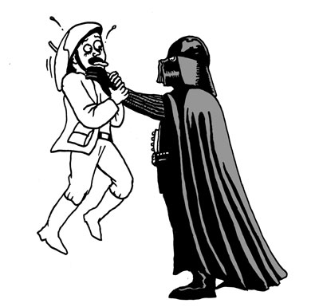
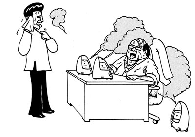
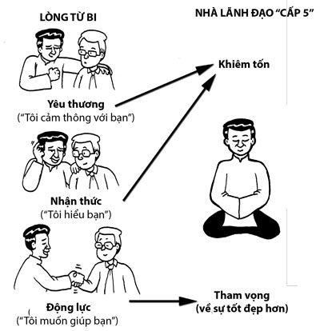
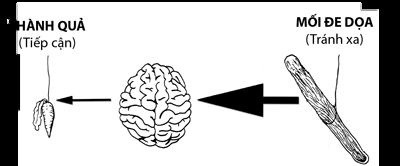
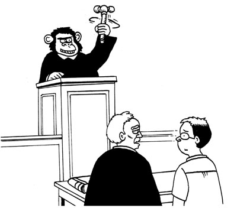
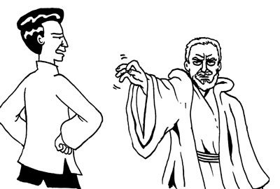
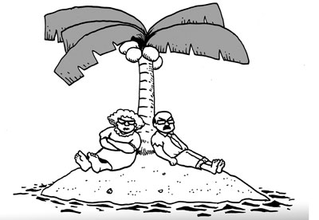

# Chương 8: VỪA CÓ HIỆU QUẢ, VỪA ĐƯỢC YÊU QUÝ
### Những kỹ năng xã hội và lãnh đạo

> *Khi thực lòng quan tâm đến người khác trong hai tháng, bạn sẽ có thêm được nhiều bạn hơn so với khi bạn tìm cách để người khác quan tâm đến bạn trong hai năm. Nói cách khác, để kết bạn với một người, hãy trở thành bạn của người đó.*  
> — **Dale Carnegie**

## KHI ĐƯỢC YÊU QUÝ, SỰ NGHIỆP CỦA BẠN SẼ THUẬN LỢI

Hai học giả nổi tiếng về lãnh đạo, Jim Kouzes và Barry Posner, đã đưa ra kết luận sau:

> *...các nhà nghiên cứu đã xem xét một số yếu tố góp phần vào thành công của một nhà quản lý. [Họ] đã phát hiện ra rằng giữa 25% những nhà quản lý giỏi nhất và 25% những nhà quản lý tồi nhất chỉ có một yếu tố khác biệt duy nhất... đó là đạt điểm cao trong tiêu chí biết quan tâm đến người khác – cả sự quan tâm được thể hiện ra cũng như sự quan tâm được mong muốn... những nhà quản lý làm việc hiệu quả cao có nhiều hành động ấm áp và thân thiện đối với người khác hơn so với 25% những nhà quản lý tồi nhất. Họ gần gũi với mọi người hơn và cởi mở hơn nhiều trong việc chia sẻ suy nghĩ cũng như cảm xúc của họ so với những người đồng nghiệp làm việc kém hiệu quả.*  
> *Nếu tất cả mọi thứ là như nhau, chúng ta sẽ làm việc chăm chỉ hơn và hiệu quả hơn cho những người mà chúng ta thích. Và việc chúng ta thích họ tỷ lệ thuận với việc họ khiến chúng ta cảm thấy như thế nào.*[^1]

Đối với những người đã quen với suy nghĩ cách tốt nhất để hoàn thành mọi việc là hành động như một kẻ thô lỗ, nghiên cứu này cung cấp một khả năng đầy tươi mới và đầy cảm hứng về một cách tiếp cận tốt hơn. Bạn không nhất thiết phải bị ghét mới hoàn thành được mọi việc; bạn có thể có được cả hai. Bạn có thể vừa có bánh, vừa được thăng chức. Thực ra, xét về dài hạn, được yêu quý có thể là cách hiệu quả nhất để hoàn thành mọi việc. Khả năng này cũng được thể hiện trong nghiên cứu về những Trung tá Hải quân Mỹ mà chúng tôi đã nói đến trong Chương 1. Nghiên cứu này cho thấy những Trung tá Hải quân làm việc hiệu quả nhất chính là những người có trí thông minh cảm xúc cao hơn và được yêu quý nhất.

*“Ngài biết đấy, ngài Vader, ngài sẽ làm việc hiệu quả hơn nhiều nếu ngài dễ thương hơn.”*

Trong chương này, chúng ta sẽ khám phá một số kỹ năng cảm xúc sẽ giúp bạn được mọi người yêu quý và thành công trong mọi công việc. Có người mua sách dạy về cách được mọi người yêu quý, có người mua sách dạy về thành công. Cuốn sách này sẽ dạy cả hai. Bạn may mắn lắm đấy!

## SỬ DỤNG TÌNH YÊU THƯƠNG ĐỂ PHÁT TRIỂN TÌNH BẠN TỪ MỘT TÌNH HUỐNG TỒI TỆ

Ngay cả trong những tình huống khó khăn thì đôi khi chúng ta vẫn có thể vừa hoàn thành những công việc quan trọng vừa tạo ra được những tình bạn tốt đẹp. Để làm được điều đó, chúng ta cần một trái tim yêu thương, một tâm trí rộng mở và những kỹ năng xã hội đúng đắn.

Nhiều năm trước, tôi có một người bạn, đồng thời là đồng nghiệp tên là Joe (tên các nhân vật đã được thay đổi, một lần nữa là để bảo vệ tôi). Joe chưa bao giờ ở trong nhóm của tôi nhưng công việc của anh có liên quan đến việc xây dựng các hệ thống nội bộ của công ty nên ở một mức độ nào đó, tôi là một khách hàng của Joe và là một khách hàng rất hài lòng. Sam, một người quản lý mới, gia nhập công ty và đảm trách nhóm của Joe. Sau một vài tuần, Sam đã gọi Joe vào văn phòng và nói rằng Joe làm việc rất tệ, cũng như họ chuẩn bị tiến hành các thủ tục để sa thải Joe.

Joe rất buồn và tôi cũng vậy. Là một khách hàng của anh, tôi coi Joe là một trong những người làm việc tốt nhất. Vì vậy tôi rất tức giận với việc anh bị người ta đánh giá là làm việc kém, chứ đừng nói đến việc bị sa thải dựa trên hiệu quả làm việc. Tôi quyết tâm giúp anh.

Tôi là người có ảnh hưởng trong công ty đó, vì vậy nếu tôi chất vấn Sam, người quản lý mới của Joe, thì rõ ràng mọi chuyện sẽ trở nên rất tồi tệ, dù cho với một kỹ sư như tôi.

May thay, tôi đã tập thiền và yêu thương trong nhiều năm, vì vậy tôi có những công cụ phù hợp để giải quyết tình huống này một cách hợp lý. Tôi dùng thiền để tâm trí mình bình tĩnh lại và thực hiện bài tập Cũng Như Mình Mà Thôi (xem Chương 7) để đặt mình vào vị trí của Sam. Tôi nhanh chóng nhận ra rằng chắc chắn phải có một chi tiết quan trọng nào đó mà tôi chưa biết về tình huống này và tôi cần hiểu được nó trước khi phán xét bất kỳ điều gì. Tôi đang bỏ sót một dữ liệu quan trọng. Tâm trí tôi nhanh chóng chuyển từ giận dữ sang sẵn sàng thấu hiểu và tràn đầy yêu thương lẫn tò mò.

Tôi viết cho Sam một bức thư điện tử, giới thiệu bản thân, chân thành chúc mừng anh gia nhập công ty, sau đó giải thích những lo lắng của mình đối với Joe và việc tôi muốn giúp anh ấy. Một phần bức thư đó như sau:

> *Tôi hiểu rằng tất cả chúng ta đều là những người biết lý lẽ, vì vậy chúng ta chắc chắn không ra quyết định một cách hời hợt. Tuy nhiên, tôi hy vọng có thể hiểu được những lý do đằng sau quyết định đó, để tôi có thể biết làm thế nào giúp được Joe tốt hơn.*  
> *Anh có phiền khi dành một chút thời gian để tôi có thể lắng nghe và thấu hiểu quan điểm của anh trong trường hợp này không? Tôi không muốn đặt anh vào một tình thế khó xử, vì vậy anh cứ thoải mái từ chối nếu muốn.*

Thật may là Sam, dù hơi khó chịu một chút, vẫn đáp lại tình yêu thương và sự chân thành của tôi. Chúng tôi ngồi với nhau, nói những chuyện riêng tư, rồi sau đó nói về Joe. Cả hai đều thu được rất nhiều từ cuộc nói chuyện này. Từ Sam, tôi biết rằng Joe đã gây ra những vấn đề cho nhóm của mình, ví dụ như anh nhận quá nhiều yêu cầu ngoài của khách hàng và điều này khiến anh lơ là các mục tiêu quan trọng của nhóm. Mặt khác, từ tôi, Sam cũng biết rằng các khách hàng của Joe đánh giá anh rất cao vì tất cả những công sức mà anh đã phải bỏ thêm ra để giúp đỡ họ. Cả Sam và tôi đều bỏ lỡ những dữ liệu quan trọng.

Ngay sau đó, Sam và Joe đã nói chuyện lại với nhau, thấu hiểu nhau hơn và tìm cách làm việc hiệu quả cùng nhau. Các thủ tục sa thải Joe bị hủy. Sam và tôi tạo nên một tình bạn tuyệt vời và đến ngày nay vẫn rất vững bền.

Thay vì trở thành một màn kịch tồi tệ, tình huống này đã trở thành điểm khởi đầu cho một tình bạn dài lâu. Đó chính là tác dụng của việc sử dụng những kỹ năng cảm xúc trong một tình huống xã hội.

Người Trung Quốc có một câu ngạn ngữ cổ về thiền như sau: “Tu ở nơi hoang dã là thấp, tu trong thành phố là trung, tu ở cung vua mới là cao”. Như phần lớn những câu nói về thiền, câu này vừa đúng đắn, vừa vô lý. Tất cả những kỹ năng cảm xúc bạn học được trong cuốn sách này đều vô dụng nếu chúng không được áp dụng vào thế giới thực, kể cả ở một nơi vừa đầy cám dỗ vừa đầy nguy hiểm như cung vua. Ngược lại, thế giới thực là nơi tốt nhất để mài sắc những kỹ năng cảm xúc của bạn. Thế giới thực vừa là võ đường, vừa là thiền đường của bạn và từ nơi đây, bạn sẽ thu được năng lực của mình. Hiểu không?

Trong chương này, chúng ta sẽ học ba kỹ năng xã hội căn bản: **dẫn dắt bằng lòng từ bi**, **ảnh hưởng bằng lòng tốt** và **giao tiếp bằng hiểu biết**.

## DẪN DẮT BẰNG LÒNG TỪ BI

Trong mọi tín ngưỡng và trường phái triết học, lòng từ bi đều được coi là một phẩm chất đạo đức tuyệt vời. Không chỉ vậy, lòng từ bi còn chính là yếu tố giúp con người đạt được mức độ hạnh phúc cao nhất từng được đo lường và là điều kiện cần thiết để tạo nên phương pháp lãnh đạo hiệu quả nhất từng được biết đến. Đúng là một thứ tuyệt vời.

### Lòng từ bi là trạng thái hạnh phúc nhất
Ở phần trước, chúng ta đã nói (và đùa) về người bạn của tôi, Matthieu Ricard, “người hạnh phúc nhất thế giới”. Khi não của Matthieu được quét và đo bằng phương pháp chụp cộng hưởng từ, người ta thấy rằng mức độ hạnh phúc của ông cực kỳ cao. Thực ra, ông không phải là người duy nhất đạt được mức độ hạnh phúc cực kỳ cao đó – người ta còn tiến hành đo cả một số thiền sư Phật giáo Tây Tạng (những người mà chúng ta coi là “Thánh” trong thế giới thiền) trong cùng phòng thí nghiệm đó và có nhiều người đạt được mức độ hạnh phúc cực kỳ cao. Matthieu là đối tượng đầu tiên vô tình bị lộ danh tính với công chúng, và việc này đã khiến ông có biệt danh trên. Một đối tượng khác gần đây trở nên nổi tiếng là Mingyur Rinpoche. Mingyur cũng được những tờ báo tiếng Trung đặt cho biệt danh tương tự: “Người hạnh phúc nhất thế giới”.

Cho đến nay, những người này là những người hạnh phúc nhất từng được đo lường bằng các phương pháp khoa học. Điều này dẫn chúng ta đến với một câu hỏi: họ đã nghĩ gì khi người ta tiến hành đo họ? Có lẽ là một cái gì đó đen tối chăng? Các bạn biết đấy, những nhà sư và công việc của họ luôn có gì đó bí hiểm. Thực ra, khi đó, họ đã thiền dựa trên lòng từ bi. Nhiều người chắc sẽ bất ngờ với điều này vì nhiều người trong chúng ta coi từ bi là một trạng thái tinh thần khó chịu nhưng khoa học lại chứng minh điều ngược lại – rằng từ bi là một trạng thái cực kỳ hạnh phúc.

Tôi đã hỏi Matthieu về nó. Trải nghiệm trực tiếp của ông đã xác nhận điều này. Theo ông, từ bi là trạng thái hạnh phúc nhất trên đời. Do tôi là một kỹ sư, tôi đã hỏi ông câu hỏi tiếp theo mà ai cũng sẽ nghĩ đến, đó là thế trạng thái hạnh phúc thứ hai là gì? Ông nói rằng đó là “khai mở nhận thức”, một trạng thái mà ở đó tâm trí hoàn toàn cởi mở, an tĩnh và thông suốt. Tôi không biết bạn thế nào, nhưng với tư cách là một thiền sinh, tôi thấy hiểu biết này thật đáng kinh ngạc. Là thiền sinh, chúng tôi rèn luyện tâm trí để nó trở nên cực kỳ an tĩnh và thông suốt. Càng rèn luyện sâu, chúng tôi càng hạnh phúc và do niềm hạnh phúc sâu sắc này không cần đến những kích thích vật lý hay tâm lý nên một số chúng tôi rơi vào tình trạng nguy hiểm là lánh xa cuộc sống thực (như mọi khi, những người trong Thiền tông có cách miêu tả buồn cười nhất; họ gọi những người như vậy là “những kẻ lang bạt của thiền”). Hóa ra là dù có rèn luyện theo cách trên đến mức hoàn hảo, bạn cũng chỉ có thể đạt đến trạng thái hạnh phúc thứ hai mà thôi.

Trạng thái hạnh phúc nhất chỉ có thể đạt được bằng lòng từ bi và điều này đòi hỏi sự tương tác trong cuộc sống thực với những con người thực. Do đó, những bài tập thiền của chúng tôi không thể hoàn hảo nếu nằm ngoài cuộc sống thực; đó phải là sự kết hợp giữa việc lánh xa thế giới (để làm sâu sắc thêm sự an tĩnh) và tương tác với thế giới (để làm sâu sắc thêm lòng từ bi). Nếu bạn là một người thiền chuyên sâu, hãy nhớ thỉnh thoảng phải mở cửa và đi ra ngoài nhé.

Lần đầu tiên tôi đọc những nghiên cứu được thực hiện trên Matthieu (trước cả khi chúng tôi quen nhau), nó đã trở thành một trong những khoảnh khắc then chốt của cuộc đời tôi. Giấc mơ của tôi là tạo ra các điều kiện cho hòa bình thế giới và thực hiện điều đó bằng cách tạo ra các điều kiện cho sự an tĩnh bên trong cùng lòng từ bi trên quy mô toàn cầu. Khi biết về Matthieu, tôi có cái nhìn mới đối với công việc của mình. Nếu người ta biết rằng lòng từ bi có thể là một thứ vui vẻ thì toàn bộ cuộc chơi sẽ thay đổi. Nếu lòng từ bi giống như một công việc nhà thì sẽ chẳng ai làm cả, ngoại trừ Đạt-lai Lạt-ma. Nhưng nếu lòng từ bi là thứ gì đó vui vẻ thì ai cũng sẽ làm. Do đó, để tạo ra các điều kiện cho lòng từ bi trên quy mô toàn cầu, tất cả những gì chúng ta phải làm là tái cấu trúc lại lòng từ bi sao cho nó trở nên thật vui vẻ. Chà, ai mà biết được việc cứu thế giới lại đòi hỏi phải vui vẻ kia chứ?

Thật may là lòng từ bi không chỉ vui không thôi đâu. Nó còn đem lại lợi ích rất thực về mặt kinh tế nữa, đặc biệt là trong việc lãnh đạo kinh doanh.

### Lãnh đạo bằng lòng từ bi là cách lãnh đạo hiệu quả nhất
Định nghĩa hay nhất về lòng từ bi mà tôi biết là của học giả Tây Tạng nổi tiếng, Thupten Jinpa. Jinpa cũng chính là người phiên dịch tiếng Anh lâu năm cho Đạt-lai Lạt-ma. Ông có một giọng nói nhẹ nhàng, êm tai và rất cuốn hút, vì vậy Đạt-lai Lạt-ma thi thoảng lại lấy cái đó ra để trêu ông (Đạt-lai Lạt-ma sẽ nói: “Mọi người thấy đấy, giọng nói của tôi thì trầm và to, nhưng anh chàng này, giọng nói của anh ta mới nhẹ nhàng làm sao” và họ sẽ phá lên cười).

Jinpa định nghĩa lòng từ bi như sau:
> *Lòng từ bi là một trạng thái tinh thần đi kèm với một cảm giác lo lắng về sự đau khổ của người khác và khao khát muốn giải tỏa sự đau khổ đó.*

Cụ thể, ông coi lòng từ bi bao gồm ba thành phần sau:
1. **Thành phần nhận thức:** “Tôi hiểu bạn”.
2. **Thành phần yêu thương:** “Tôi cảm thông với bạn”.
3. **Thành phần động lực:** “Tôi muốn giúp bạn”.

Lợi ích hấp dẫn nhất mà lòng từ bi đem lại cho môi trường công sở là nó tạo ra những nhà lãnh đạo hiệu quả cao. Để trở thành nhà lãnh đạo hiệu quả cao, bạn cần trải qua một sự biến đổi quan trọng. Bill George, cựu CEO đáng kính của Medtronic, đã miêu tả điều này vô cùng ngắn gọn: đó là quá trình đi từ “tôi” đến “chúng tôi”.

> *Sự chuyển đổi này là biến đổi từ tôi đến chúng tôi. Nó là quá trình quan trọng nhất mà những nhà lãnh đạo phải trải qua để trở thành nhà lãnh đạo thực thụ. Còn cách nào khác để giải phóng sức mạnh của tổ chức ngoài cách khích lệ mọi người phát huy toàn bộ tiềm năng của mình? Nếu những người ủng hộ chúng ta chỉ đơn thuần làm theo lời chúng ta nói thì nỗ lực của họ sẽ bị giới hạn bởi tầm nhìn và hướng đi của chúng ta... Chỉ khi những nhà lãnh đạo dừng việc tập trung vào những nhu cầu xuất phát từ cái tôi cá nhân thì khi đó, họ mới có thể tạo ra những nhà lãnh đạo khác.*[^2]

Rèn luyện lòng từ bi tức là chuyển từ bản thân sang người khác. Theo một cách nào đó, lòng từ bi là quá trình từ “tôi” đến “chúng tôi”. Vì vậy, nếu việc đổi từ “tôi” đến “chúng tôi” là quá trình quan trọng nhất trong việc trở thành một nhà lãnh đạo thực thụ thì những người rèn luyện lòng từ bi đã biết cách làm rồi và đi trước một bước.

Nhưng đợi đã, còn nữa. Tôi thấy tác phẩm của Jim Collins, cuốn sách *Good to Great: Why Some Companies Make the Leap ... and Others Don't*[^3] (Từ tốt đến vĩ đại: Tại sao một số công ty đạt bước nhảy vọt... trong khi những công ty khác thì không), thậm chí nói lên nhiều điều hơn. Tôi đã nói với tất cả những người bạn của mình rằng nếu họ chỉ có thể đọc một cuốn sách kinh doanh trong suốt cuộc đời mình thì hãy đọc *Từ tốt đến vĩ đại*. Bản thân tiền đề của cuốn sách đã rất thú vị: Collins và nhóm của mình tìm cách khám phá ra những yếu tố tạo nên những công ty đi từ tốt đến vĩ đại bằng cách sàng lọc một khối lượng dữ liệu khổng lồ. Họ bắt đầu với tất cả những công ty từng lọt vào danh sách Fortune 500 từ năm 1965 đến năm 1995 và họ đã xác định được những công ty ban đầu chỉ là những công ty “tốt” nhưng sau đó lại trở thành những công ty “vĩ đại” (được định nghĩa là hoạt động tốt hơn thị trường chung ít nhất ba lần) trong một khoảng thời gian dài (được định nghĩa là từ 15 năm trở lên để loại bỏ những trường hợp “vụt sáng” hoặc chỉ đơn thuần là may mắn). Cuối cùng, họ thu được một nhóm gồm 11 công ty “từ tốt đến vĩ đại” và so sánh chúng với một nhóm “những công ty so sánh” để xác định xem những yếu tố nào khiến những công ty chỉ đơn thuần là tốt lại trở nên vĩ đại.

Là một kỹ sư Google yêu thích dữ liệu, tôi thấy tiền đề của cuốn sách và việc cuốn sách dựa rất nhiều vào dữ liệu vô cùng thú vị. Thú vị không kém là những phát hiện của nó rất có tác dụng trong đời thực. Nhiều nguyên tắc trong cuốn sách cực kỳ giống với những trải nghiệm của tôi ở Google trong những năm đầu tiên. Nếu ai đó đọc *Từ tốt đến vĩ đại* và biết về lịch sử Google thì chắc hẳn sẽ nghĩ là tất cả chúng tôi, những thành viên đầu tiên của Google, đều thuộc lòng cuốn sách. Vì vậy, nếu bạn muốn tìm ra Google tiếp theo, tôi khuyên bạn nên đọc *Từ tốt đến vĩ đại*.

Phát hiện đầu tiên và có lẽ là quan trọng nhất của cuốn sách này là vai trò của lãnh đạo. Cần một kiểu lãnh đạo rất đặc biệt để đưa công ty từ tốt đến vĩ đại và Collins gọi họ là **những nhà lãnh đạo “cấp 5”**. Đây là những nhà lãnh đạo mà ngoài việc cực kỳ giỏi giang, họ còn sở hữu hai phẩm chất quan trọng nhưng có vẻ đối nghịch lẫn nhau là **tham vọng** và **khiêm tốn**. Những nhà lãnh đạo này cực kỳ tham vọng, nhưng họ không tham vọng cho bản thân; thay vào đó, họ tham vọng đạt được sự tốt đẹp hơn. Vì tập trung vào sự tốt đẹp hơn, họ không cảm thấy cần phải làm phình to cái tôi của mình. Điều đó khiến họ trở nên cực kỳ hiệu quả và đầy cảm hứng.

Mặc dù trình bày rất thuyết phục tầm quan trọng của những nhà lãnh đạo cấp 5, nhưng cuốn sách của Collins lại không đưa ra cách nào để đào tạo ra những người đó. Tôi không nói là tôi biết cách để đào tạo ra những nhà lãnh đạo cấp 5, nhưng tôi tin rằng lòng từ bi đóng một vai trò quan trọng.

Nếu bạn nhìn vào hai phẩm chất đặc trưng của những nhà lãnh đạo cấp 5 (tham vọng và khiêm tốn) và so sánh chúng với ba thành phần của lòng từ bi (nhận thức, yêu thương, động lực), bạn có thể thấy rằng thành phần nhận thức và yêu thương của lòng từ bi (hiểu mọi người và cảm thông với họ) làm giảm sự ám ảnh về bản thân vốn thừa thãi bên trong chúng ta và do đó, tạo ra các điều kiện cho sự khiêm tốn. Thành phần động lực của lòng từ bi, hay việc muốn giúp mọi người, tạo ra tham vọng về sự tốt đẹp hơn. Nói cách khác, ba thành phần của lòng từ bi có thể được sử dụng để rèn luyện hai phẩm chất đặc trưng nhà lãnh đạo cấp 5:

*“Tôi nói là tham vọng và khiêm tốn (humility) cơ mà, sao lại lắp toàn máy tạo độ ẩm (humidity) thế này!”*

Lòng từ bi là điều kiện cần (nhưng có thể chưa đủ) của một nhà lãnh đạo cấp 5 nên để đào tạo ra những nhà lãnh đạo cấp 5 hãy bắt đầu với việc rèn luyện lòng từ bi. Đây là một lợi ích hấp dẫn mà lòng từ bi đem lại cho môi trường công sở.

### Rèn luyện lòng từ bi bằng cách nhân sự tốt đẹp lên nhiều lần
Chúng ta có thể rèn luyện lòng từ bi tương tự như rèn luyện lòng yêu thương, tức là bằng cách tạo ra các thói quen tư duy. Tiền đề là như nhau: bạn càng nghĩ về một thứ gì đó nhiều thì hoạt động thần kinh có lợi cho suy nghĩ đó càng trở nên mạnh mẽ và việc khởi phát ý nghĩ đó càng trở nên dễ dàng. Cuối cùng, ý nghĩ đó trở thành một thói quen tư duy và có thể được khởi phát thường xuyên, dễ dàng. Thói quen tư duy mà chúng tôi định sử dụng để rèn luyện lòng từ bi là một thứ vừa mạnh mẽ lại vừa dễ chịu, đó là **sự tốt đẹp**. Chúng ta làm tăng khả năng tốt đẹp của tâm trí và làm tăng sự tốt đẹp bên trong chúng ta lẫn người khác.

Đối với bài tập này, chúng tôi còn áp dụng một công cụ tư duy khác, rất mạnh, đó là hình dung. Não của chúng ta dành phần lớn nguồn lực để xử lý quá trình nhận thức hình ảnh, vì vậy về lý thuyết, nếu chúng ta có thể khéo léo tận dụng hệ thống nhận thức hình ảnh trong bất kỳ công việc tư duy nào, chúng ta sẽ có thể lợi dụng tốt hơn rất nhiều năng lực tính toán của não. Trong thực tế, tôi thấy rằng nếu có thể hình dung ra thứ gì đó, tôi có thể khiến nó tồn tại lâu hơn. Vì vậy, trong bài tập thiền này, chúng ta sẽ sử dụng sự hình dung để làm tăng tính hiệu quả của việc tạo ra các thói quen tâm trí có lợi cho lòng từ bi.

Bài tập này rất đơn giản. Khi chúng ta hít vào, hãy hình dung rằng chúng ta đang hít vào sự tốt đẹp của bản thân, hình dung mình đang nhân sự tốt đẹp đó lên gấp 10 lần trong trái tim mình và khi chúng ta thở ra, hãy hình dung mình đang trao toàn bộ sự tốt đẹp đó cho thế giới. Sau đó, chúng ta hít vào sự tốt đẹp của những người khác và làm tương tự. Nếu muốn, bạn có thể hình dung sự tốt đẹp là một tia sáng trắng.

### BÀI TẬP THỰC HÀNH: THIỀN NHÂN LÊN SỰ TỐT ĐẸP

#### Thư giãn tâm trí
Bắt đầu bằng việc để tâm trí nghỉ ngơi trên hơi thở trong hai phút.

#### Nhân lên sự tốt đẹp
Giờ chúng ta hãy kết nối với sự tốt đẹp bên trong bản thân: tình yêu, lòng từ bi, sự vị tha và hạnh phúc nội tâm. Nếu muốn, bạn có thể hình dung sự tốt đẹp của mình đang tỏa ra khỏi cơ thể dưới dạng một tia sáng trắng.

*(Ngưng ngắn)*

Khi hít vào, hít toàn bộ sự tốt đẹp của mình vào trong trái tim. Sử dụng trái tim để nhân sự tốt đẹp đó lên gấp 10 lần. Và khi bạn thở ra, hãy gửi toàn bộ sự tốt đẹp đó đi khắp thế giới. Nếu muốn, bạn có thể hình dung mình đang thở ra một tia sáng trắng rực rỡ đại diện cho sự tốt đẹp ngập tràn này.

*(Ngưng hai phút)*

Giờ chúng ta hãy kết nối với sự tốt đẹp bên trong tất cả những người mà chúng ta biết. Tất cả những người chúng ta biết đều là người tốt và sở hữu một sự tốt đẹp nào đó. Nếu muốn, bạn có thể hình dung sự tốt đẹp của họ đang tỏa ra khỏi cơ thể dưới dạng một tia sáng trắng. Khi bạn hít vào, hãy hít toàn bộ sự tốt đẹp của họ vào trong trái tim bạn... *(Lặp lại như trên.)*

*(Ngưng hai phút)*

Cuối cùng, chúng ta hãy kết nối với sự tốt đẹp bên trong tất cả mọi người trên thế giới. Tất cả mọi người trên thế giới đều sở hữu ít nhất một chút tốt đẹp nào đó. Nếu muốn, bạn có thể hình dung sự tốt đẹp của họ đang tỏa ra khỏi cơ thể họ dưới dạng một tia sáng trắng nhạt. Khi bạn hít vào, hãy hít toàn bộ sự tốt đẹp của họ vào trong trái tim bạn... *(Lặp lại như trên.)*

*(Ngưng hai phút)*

#### Kết thúc
Kết thúc bằng việc để tâm trí nghỉ ngơi trên hơi thở trong một phút.

Bài tập này phát triển ba thói quen tư duy hữu dụng sau:
1. **Nhìn ra sự tốt đẹp ở bản thân mình và ở người khác** (củng cố nhận thức và yêu thương)
2. **Trao sự tốt đẹp cho tất cả mọi người** (củng cố động lực giúp đỡ)
3. **Tự tin vào sức mạnh chuyển hóa của bản thân** (rằng tôi có thể nhân lên sự tốt đẹp).

*“Tôi muốn trao tặng sự tốt đẹp cho toàn thế giới, nhưng thế giới cứ đòi hỏi toàn những thứ vớ vẩn thôi.”*

### Cách rèn luyện lòng từ bi dành cho người dũng cảm: Thiền Tonglen
Phương pháp rèn luyện lòng từ bi truyền thống có tên là **Tonglen**, trong tiếng Tây Tạng có nghĩa là “cho và nhận”. Nó rất giống thiền Nhân Lên Sự Tốt Đẹp, ngoại trừ việc thay vì hít vào sự tốt đẹp, bạn hít vào sự khổ đau (của bản thân và của người khác) rồi chuyển hóa nó bên trong bạn. Khi thở ra, bạn phát ra tình yêu thương và lòng từ bi.

Phương pháp này rất khó đối với những người mới tập thiền vì nó đòi hỏi phải hít vào và tiếp nhận sự khổ đau. Bạn không phải làm điều này, nhưng nếu đủ dũng cảm, cứ thoải mái thử. Sau đây là những hướng dẫn mà bạn có thể sử dụng:

### BÀI TẬP THỰC HÀNH: THIỀN TONGLEN

#### Lưu ý trước khi thiền
Để làm chủ các kỹ năng xã hội, chúng ta phải loại bỏ những đống bùn cảm xúc – tức giận, sợ hãi, hoang mang và cả nỗi đau thể xác, cũng như sự chống cự của chúng ta với tất cả những thứ này. Tonglen là một bài tập được thiết kế để làm được điều đó và nó xoay quanh sự chú tâm vào hơi thở.

Tonglen có nghĩa là “cho và nhận”, sẵn sàng nhận đau khổ của những người khác và cho lại sự giải thoát, hạnh phúc, an bình – từ đó trải nghiệm năng lực chuyển hóa của bản thân.

Bằng việc hít vào những điều tiêu cực, chúng ta có thể sử dụng trái tim như một bộ lọc. Khi thở ra, những đám mây đen có thể đi xuyên qua chúng ta và được chuyển hóa thành sự chấp nhận, thư thái, hạnh phúc và ánh sáng. Khi trải nghiệm điều này, chúng ta củng cố tuyên bố rằng không có thứ gì có thể hoàn toàn lấn át chúng ta, từ đó tạo nên sự tự tin sâu sắc. Điều này sẽ cho chúng ta một nền tảng vững chắc để đứng lên bảo vệ hạnh phúc của bản thân và người khác, từ đó xây dựng nên nền tảng cho lòng từ bi.

#### Ổn định
Chúng ta hãy bắt đầu bằng việc nhận thức về cơ thể và hơi thở của mình, chú ý đến từng cảm giác trên khắp cơ thể và nhẹ nhàng chú tâm vào nhịp thở.

*(Ngưng lại)*

Giờ hít một hơi thật sâu và khi thở ra, hãy tưởng tượng rằng bạn cảm thấy mình là một ngọn núi.

Hít một hơi thật sâu nữa và hãy tưởng tượng rằng bạn đang nhìn cuộc sống với góc nhìn từ trên cao.

#### Tonglen
Và với một hơi thở nữa, chúng ta bắt đầu bài tập Tonglen. Chúng ta sẽ bắt đầu từ chính bản thân chúng ta.

Với một trái tim cởi mở và một tâm trí hào phóng, hãy tưởng tượng bạn nhìn thấy chính mình đang ngồi trước mặt bạn. Hãy nhìn vào “con người tầm thường” của bạn, với tất cả sự khổ đau của nó – bất cứ điều gì gần đây đang khiến bạn khó chịu.

Hít nó vào và tưởng tượng bạn đang hít vào một đám mây đen, đầy vẩn đục và để nó tan ra, chuyển hóa.

Thở nó ra và tưởng tượng bạn đang thở ra những tia sáng. Lặp lại chu trình thở này trong một thời gian ngắn.

*(Ngưng lại)*

Chú ý xem bạn có cảm thấy nhẹ nhàng hơn, thấu hiểu hơn và ấm áp hơn đối với chính bản thân hay không.

*(Ngưng lại)*

Giờ chúng ta hãy luyện tập với những người khác:

Hãy tưởng tượng bạn đang nhìn thấy trước mặt mình một người đau khổ mà bạn biết trong cuộc sống.

Với một hơi thở vào, hãy cảm nhận xem bạn có thể cởi mở đến mức nào đối với trải nghiệm của người đó. Có lẽ bạn sẽ cảm thấy một thôi thúc rất mạnh muốn được giải tỏa những khó khăn của người đó.

Hít nó vào và tưởng tượng bạn đang hít vào một đám mây đen, cảm thấy nó đang đi vào trái tim bạn. Ở đây, nó sẽ hòa tan mọi dấu vết của sự tư lợi và làm lộ ra sự tốt đẹp bẩm sinh của bạn.

Thở ra những tia sáng với ý định làm giảm bớt sự đau khổ. Chúng ta hãy dành vài phút thở ra và thở vào như thế.

*(Ngưng lại)*

#### Kết thúc
Trong một vài phút cuối cùng, bạn có thể đặt tay lên ngực và chỉ hít thở thôi.

Tonglen là một bài tập có tác động rất mạnh. Người ta nói rằng đây là một trong những bài tập chính yếu mà Đạt-lai Lạt-ma thực hiện hàng ngày. Lần đầu tiên thực hiện bài tập này (dưới sự hướng dẫn của thiền sư Norman Fischer; đoạn hướng dẫn ở trên là của ông), tôi đã trải qua một sự thay đổi mạnh mẽ. Trong một vài phút đó, tôi đã thấy sự tự tin của mình tăng lên một cách bền vững. Trong khi thực hiện bài tập, tôi nhận ra rằng rất nhiều thứ đang cản trở mình đều xuất phát từ nỗi sợ đau khổ của tôi và một khi tôi thấy mình có khả năng hít vào sự đau khổ của mình cũng như người khác, đồng thời thoải mái phát ra tình yêu thương và lòng từ bi, rất nhiều trói buộc đều được giải tỏa.

*“Có những lời phàn nàn về việc cậu đã giúp ai đó hít vào sự đau khổ của cậu...”*

Chúng tôi dạy Tonglen trong suốt những khóa đầu tiên của Tìm Kiếm Bên Trong Bạn, nhưng chúng tôi nhanh chóng phát hiện ra rằng nó quá khó đối với nhiều học viên. Các giảng viên Tìm Kiếm Bên Trong Bạn gần như đều nhất trí loại nó ra khỏi giáo trình nhưng tôi đã phản đối kịch liệt. Tonglen là một bài tập có tác động quá mạnh mẽ và hữu ích nên tôi kiên quyết giữ lại nó. Cuối cùng, chúng tôi đi đến một giải pháp tuyệt vời có thể giải quyết lo lắng của tất cả mọi người là tạo ra bài tập Nhân Lên Sự Tốt Đẹp. Bài tập này vừa hữu ích vừa dễ thực hiện đối với các học viên mới, đồng thời nó cũng cho phép mọi người biết qua một chút về Tonglen. Đó là lý do tại sao trong khoảng 100 năm nữa, nhiều khả năng bạn sẽ không thấy người ta coi bài tập Nhân Lên Sự Tốt Đẹp là một bài tập truyền thống đâu, mà đến lúc đó thì tôi nghĩ mình cũng khá già rồi.

Tôi khuyên bạn nên bắt đầu với bài tập Nhân Lên Sự Tốt Đẹp, và khi đã cảm thấy tự tin hơn vào sự rèn luyện của mình (sau khoảng vài tuần), bạn có thể thử Tonglen. Nó có thể thay đổi bạn một cách mạnh mẽ đấy.

## ẢNH HƯỞNG BẰNG LÒNG TỐT

Tất cả chúng ta đều đã có rồi nguyên tắc đầu tiên của sự ảnh hưởng. Mọi việc chúng ta làm hay không làm, mọi điều chúng ta nói hay không nói, đều có tác động đối với người khác. Mấu chốt không phải là đạt được sự ảnh hưởng mà là mở rộng sự ảnh hưởng chúng ta vốn có và sử dụng nó để đem lại lợi ích cho tất cả mọi người.

### Am hiểu não xã hội
Tôi thấy rằng bước đầu tiên và quan trọng nhất để mở rộng sự ảnh hưởng là am hiểu não xã hội đến mức có thể khéo léo định hướng nó.

Theo nhà khoa học thần kinh Evian Gordon, nguyên lý “tối thiểu hóa mối đe dọa và tối đa hóa thành quả” là nguyên lý bao quát, tổ chức của bộ não. Bộ não là một cỗ máy chủ yếu tiếp cận thành quả và tránh xa mối đe dọa, giống như hình vẽ dưới đây:

*“Nếu thẩm phán Bonzo làm chủ tọa thì chúng ta có thể sẽ phải xem lại dự đoán ban đầu của mình về khả năng thành công trong vụ của anh.”*

Hãy chú ý rằng mũi tên “Thành quả (Tiếp cận)” nhỏ hơn nhiều so với mũi tên “Mối đe dọa (Tránh xa)”. Sự khác biệt về kích cỡ này minh họa một hiểu biết quan trọng là não của chúng ta phản ứng với các trải nghiệm tiêu cực mạnh hơn nhiều so với các trải nghiệm tích cực tương đương. Tất cả chúng ta đều trải qua điều này hàng ngày. Ví dụ, nếu tôi đi ngang qua Jim ở hành lang, cười với anh ấy và anh ấy cười lại, đó chỉ là một trải nghiệm xã hội tích cực rất nhỏ đối với tôi và nó chỉ ảnh hưởng chút ít đến tôi. Nhiều khả năng là trải nghiệm này sẽ biến mất dần khỏi tâm trí sau một vài phút. Tuy nhiên, giả sử Jim không cười lại mà quay đi, khuôn mặt có chút khó chịu và tiếp tục lướt qua. Xét một cách khách quan, mức độ của điều này (theo hướng tiêu cực) tương đương với việc anh ấy cười lại tôi, nhưng xét một cách chủ quan, rất có thể tôi sẽ phản ứng mạnh hơn rất nhiều. Tôi có thể sẽ nói: “Trời, cái đó có nghĩa là gì vậy? Anh ta bị làm sao vậy chứ? Lần này tôi làm gì anh ta đây?” Thay vì một vài phút, nó có thể kéo dài nhiều phút, thậm chí lâu hơn. Những trải nghiệm tiêu cực tác động lên chúng ta mạnh hơn và kéo dài hơn nhiều so với những trải nghiệm tích cực.

Cần bao nhiêu trải nghiệm tích cực để cân bằng với một trải nghiệm tiêu cực có mức độ tương đương? Còn tùy vào đó là ai. Trong Chương 6, chúng tôi đã đề cập đến công trình đột phá của nhà tâm lý học Barbara Fredrickson trong đó có đưa ra tỷ lệ là 3:1. Bà đã khám phá ra rằng “khi tỷ lệ giữa cảm xúc tích cực và cảm xúc tiêu cực là 3:1 thì mọi người sẽ đạt đến một điểm mà nếu vượt qua nó, tự nhiên họ sẽ trở nên dễ dàng phục hồi sau nghịch cảnh và đạt được những điều mà trước đây họ chỉ dám mơ đến”[^4]. Tuy nhiên, nhà tâm lý học nổi tiếng John Gottman đã tìm ra một tỷ lệ khác trong một ngữ cảnh khác. Ông phát hiện ra rằng, để có một cuộc hôn nhân thành công thì ít nhất số tương tác tích cực trong mối quan hệ đó phải nhiều gấp 5 lần số tương tác tiêu cực. Gottman gọi tỷ lệ 5:1 này là “tỷ lệ thần thánh”[^5], hay còn được biết đến nhiều hơn với cái tên “tỷ lệ Gottman”. Tỷ lệ này là một chỉ báo mạnh mẽ đến mức Gottman nổi tiếng với khả năng dự đoán chính xác việc liệu trong vòng 10 năm, một cuộc hôn nhân có kết thúc bằng một lá đơn ly dị không, chỉ bằng cách ghi lại những tương tác tích cực và tiêu cực trong 15 phút hai vợ chồng trò chuyện với nhau. Ông nói đùa rằng đây chính là lý do tại sao người ta không mời ông đến các bữa tiệc tối nữa.

Nếu bạn đặt hai tỷ lệ này cạnh nhau, ngay lập tức bạn sẽ hiểu tại sao hôn nhân lại quá khó khăn đến như vậy. Chúng ta đòi hỏi một tỷ lệ vô lý giữa tích cực và tiêu cực là 3:1 trong tất cả các trải nghiệm hàng ngày vậy mà trong hôn nhân, trải nghiệm mà chúng ta còn đòi hỏi nhiều hơn nữa. Theo nghĩa đó, tất cả chúng ta đều cư xử như những kẻ chẳng ra gì, luôn đòi hỏi người bạn đời của mình thái quá và chúng ta đánh giá họ khắc nghiệt hơn nhiều so với khi đánh giá những người thân bình thường. Có lẽ nếu hiểu được điều này, chúng ta có thể sẽ cho người bạn đời của mình được nghỉ ngơi một chút, điều mà họ xứng đáng được nhận và có lẽ khi đó, hôn nhân sẽ không còn quá khó khăn nữa.

### Mô hình SCARF dành cho não xã hội
Trong cuốn sách *Your Brain at Work* (Bộ não của bạn trong công việc), David Rock đã miêu tả năm lĩnh vực trải nghiệm xã hội mà bộ não coi là những thành quả hay mối đe dọa chính. Nói cách khác, năm lĩnh vực này quan trọng với bạn đến mức bộ não của bạn xử lý chúng như xử lý các vấn đề sống còn. Và bởi vì chúng quá quan trọng, mỗi lĩnh vực đều là một tác nhân then chốt chi phối hành vi xã hội. Năm lĩnh vực này tạo nên một mô hình mà David gọi là mô hình SCARF, viết tắt của **Địa vị (Status)**, **Sự chắc chắn (Certainty)**, **Sự tự trị (Autonomy)**, **Sự liên quan (Relatedness)** và **Sự công bằng (Fairness)**[^6].

1. **Địa vị (Status):** Địa vị tức là tầm quan trọng, chỗ đứng, thứ bậc giữa người này với người khác. Mọi người sẵn sàng làm rất nhiều việc để bảo vệ hoặc làm tăng địa vị của họ. Địa vị quan trọng đến mức nó thậm chí còn dự đoán được cả tuổi thọ của cả con người và loài linh trưởng. Những mối đe dọa về địa vị cũng có thể bị kích hoạt rất dễ dàng. Ví dụ, chỉ nói chuyện với sếp thôi là đã có thể kích hoạt một mối đe dọa về địa vị rồi. Khi một đồng nghiệp đề nghị được cho bạn “lời khuyên”, điều đó cũng có thể kích hoạt một mối đe dọa về địa vị.  
   Tin tốt là có một cách rất hay để làm tăng địa vị của bạn mà không làm hại người khác và David gọi nó là “đấu lại bản thân”. Khi bạn cải thiện một kỹ năng (chẳng hạn như cải thiện những khuyết điểm khi chơi gôn của mình), bạn làm tăng địa vị của mình so với con người cũ của bạn. Đây có lẽ là lý do tại sao làm chủ lại là một động lực mạnh mẽ đến vậy (xem Chương 6). Khi bạn tăng khả năng làm chủ một thứ quan trọng đối với bạn, bạn làm tăng địa vị của mình, ít nhất là so với con người cũ của bạn.

2. **Sự chắc chắn (Certainty):** Bộ não của chúng ta rất thích sự chắc chắn. Sự không chắc chắn tạo ra “những phản ứng sai lầm” trong bộ não và chúng có thể bị lờ đi cho đến khi được giải quyết. Nói cách khác, sự không chắc chắn cướp đi những nguồn lực trí não quan trọng. Những sự không chắc chắn lớn hơn có thể còn gây hại hơn thế nhiều. Ví dụ, nếu bạn không biết công việc của mình có bảo đảm không thì sự không chắc chắn này có thể chiếm lĩnh phần lớn tâm trí của bạn và bạn sẽ khó có thể làm được việc gì khác.

3. **Sự tự trị (Autonomy):** Tự trị tức là nhận thức về khả năng kiểm soát môi trường. Theo Steve Maier, “mức độ kiểm soát mà các sinh vật có thể áp đặt đối với những thứ tạo ra áp lực sẽ quyết định liệu những thứ tạo ra áp lực đó có thay đổi hoạt động của sinh vật hay không”[^7]. Nói cách khác, bản thân áp lực không gây ảnh hưởng đến bạn mà là cảm giác bất lực khi đối mặt với áp lực đó. Có nhiều nghiên cứu đưa ra những bằng chứng mạnh mẽ cho điều này. Ví dụ, một nghiên cứu cho thấy những công chức người Anh cấp bậc thấp gặp nhiều vấn đề về sức khỏe có liên quan đến áp lực hơn là những người cấp bậc cao, dù cho những người cấp bậc cao phải chịu nhiều áp lực hơn nhiều.

4. **Sự liên quan (Relatedness):** Liên quan tức là nhận thức về việc người kia là “bạn” hay là “thù”. Không có gì khó hiểu khi sự liên quan là một phần trong mạch thành quả/mối đe dọa chính của chúng ta vì khi xưa, sự sống còn của chúng ta gần như phụ thuộc hoàn toàn vào những người khác trong bộ lạc nhỏ nhưng hợp tác chặt chẽ của mình. Thực ra, sự liên quan mang tính căn bản đến nỗi một số nghiên cứu cho thấy rằng trải nghiệm duy nhất trong đời khiến mọi người đạt được hạnh phúc vững bền qua thời gian chính là chất lượng và số lượng các mối quan hệ xã hội. (Họ không nghiên cứu những thiền sư lão luyện, vì vậy, mặc dù đồng ý với phát hiện này, tôi nghi ngờ rằng câu chuyện đó còn ẩn chứa một chút gì đó). Warren Buffett, một trong những người giàu nhất thế giới, đã thể hiện sự hiểu biết về sức mạnh của sự liên quan khi nói: “Khi đến tuổi của tôi, bạn sẽ đo lường sự thành công của mình bằng số người bạn muốn họ yêu bạn, thực sự yêu bạn. Đó là bài kiểm tra cuối cùng về cách bạn sống cuộc đời của mình”.  
   Bộ não sẽ mặc định coi một người là kẻ thù trừ phi điều ngược lại được chứng minh. Ví dụ: Những người lạ lúc nào cũng bị coi là kẻ thù (hay ít nhất bị coi là “bạn sẽ gặp rủi ro nếu tiếp cận với họ”). Thật may là trong nhiều tình huống, không khó để chuyển từ thù thành bạn. Ví dụ, tất cả những gì bạn cần chỉ là một cái bắt tay và một cuộc trò chuyện dễ chịu. Nhiều phương pháp trong cuốn sách này, ví dụ như Cũng Như Mình Mà Thôi và Thiền Yêu Thương, có thể tăng tốc và khiến quá trình này trở nên dễ dàng hơn rất nhiều.

5. **Sự công bằng (Fairness):** Con người là loài động vật duy nhất tự làm tổn hại lợi ích của bản thân để trừng phạt sự không công bằng của người khác. Những loài linh trưởng khác có trừng phạt sự không công bằng nhưng không bao giờ làm tổn hại lợi ích của bản thân. Giả sử chúng ta đang chơi một trò chơi (có tên là Trò chơi Tối hậu thư) mà trong đó, A (“người đề nghị”) được cho 100 đô-la và phải phân chia giữa anh ta và B (“người trả lời”). Nếu B chấp nhận thỏa thuận đó thì cả hai đều được tiền theo cách phân chia của A, nhưng nếu B từ chối thỏa thuận, cả hai đều trắng tay. Nếu A chia 99 đô-la cho mình và 1 đô-la cho B thì xét một cách khách quan, B không có lý do gì để từ chối thỏa thuận này. Nếu B chấp nhận thỏa thuận thì anh ta được 1 đô-la, còn nếu từ chối, anh ta chẳng được gì. Anh ta chỉ có duy nhất một cách hành động hợp lý về mặt kinh tế. Song nhiều người ở vị trí B sẽ từ chối thỏa thuận vì bị xúc phạm bởi sự không công bằng. Ngược lại, nếu một con tinh tinh chơi trò này (dùng nho khô làm vật có giá trị thay cho đô-la), nó sẽ hiếm khi từ chối thỏa thuận. Đối với con tinh tinh thì chỉ có thằng ngu mới từ bỏ nho khô[^8]. Bài học của câu chuyện này là đừng bao giờ đánh giá thấp cảm nhận về sự công bằng của con người; nó lớn đến mức người ta có thể hy sinh lợi ích của mình để có được nó. (Bài học khác của câu chuyện là đừng bao giờ hy vọng vào việc một con tinh tinh sẽ cho bạn một thỏa thuận công bằng. Một con voi cũng vậy.)

*“Được rồi, giờ ông thử phóng sự ảnh hưởng mà không dùng trò khống chế tâm trí của Jedi xem nào.”*

### Mở rộng ảnh hưởng của bạn
Bạn có thể tác động hiệu quả nhất đến mọi người khi bạn giúp mọi người đạt được điều họ muốn theo cách cũng có lợi cho bạn, đồng thời cũng phục vụ cho lợi ích lớn hơn. Đó là lý do tại sao mô hình SCARF nói đến trong phần trước lại vô cùng giá trị. Khi hiểu được khía cạnh khoa học thần kinh của não xã hội, bạn có thể hiểu hơn về cách làm thế nào mà những hành động của bạn có thể làm tăng các yếu tố SCARF cho chính bạn và cho người khác, từ đó biết cách giúp mọi người sao cho vẫn đảm bảo được lợi ích của mình. Ví dụ, nếu dành thời gian tìm hiểu những người đồng nghiệp ở cấp độ con người, bạn sẽ làm tăng Sự liên quan của họ. Từ đó về sau, những bất đồng, dù là về chuyên môn, cũng dễ giải quyết hơn nhiều vì họ coi bạn là “bạn”, chứ không phải là “thù”. Nếu bạn hào phóng thừa nhận những ý tưởng hay của mọi người, bạn làm tăng Địa vị của họ và khi đó, bạn có thể thấy mình lại là người được nhận nhiều ý kiến cũng như giải pháp có giá trị khác. Nếu bạn là sếp và nỗ lực để công bằng với người của mình thì bạn làm tăng Sự công bằng của họ và họ sẽ thích làm việc cho bạn hơn nhiều. Như vậy, việc vận dụng khéo léo các yếu tố SCARF vì lợi ích của tất cả mọi người sẽ tạo ra một tình huống mà mọi người đều được lợi và ảnh hưởng của bạn được mở rộng.

Dựa vào hiểu biết trên, sau đây là một kế hoạch gồm bốn bước để mở rộng quy mô và phạm vi tầm ảnh hưởng của bạn:

1. **Mặc định rằng bạn vốn đã có ảnh hưởng**, vốn đã có tác động đến mọi người. Việc còn lại chỉ là làm tăng điều bạn vốn đã có.
2. **Củng cố sự tự tin.** Càng nhận thức rõ và thoải mái với điểm mạnh và điểm yếu của mình, bạn càng tự tin và càng ảnh hưởng đến mọi người hiệu quả hơn. Về mặt cảm xúc, mọi người sẽ bị hút về phía sự tự tin, đặc biệt là kiểu tự tin dựa trên yêu thương và chân thành. Những bài tập thiền chánh niệm trong Chương 2 và Chương 3 cùng các bài tập nhận thức trong Chương 4 sẽ giúp bạn tự tin.
3. **Hiểu mọi người và giúp họ thành công.** Bạn có thể ảnh hưởng đến mọi người hiệu quả hơn nếu bạn hiểu họ và cố giúp họ đạt được mục tiêu của mình theo những cách cũng giúp bạn đạt được mục tiêu của bạn. Những bài tập đồng cảm trong Chương 7 cộng với những bài tập lòng từ bi ở phần trước trong chương này sẽ giúp bạn hiểu và giúp đỡ mọi người. Kiến thức của bạn về khía cạnh khoa học thần kinh của não xã hội mà bạn học được trong phần trước cũng sẽ có ích cho bạn rất nhiều.
4. **Phục vụ cho lợi ích lớn hơn.** Mặc dù bạn cần nhớ phải chăm lo cho lợi ích của bản thân, nhưng bạn cũng đừng quên rằng mình phải làm nhiều hơn thế. Hãy làm vì lợi ích của cả nhóm, hay lợi ích của cả công ty, hay lợi ích của cả thế giới nữa. Hãy truyền cảm hứng cho những người khác làm tương tự. Khi sự tốt đẹp của bạn truyền được cảm hứng cho người khác, bạn có thể ảnh hưởng đến họ hiệu quả hơn. Những bài tập trong Chương 6 về động lực và những bài tập lòng từ bi trong chương này sẽ giúp bạn phát triển bản năng phục vụ cho lợi ích lớn hơn.

Nếu có một từ có thể tóm tắt tất cả các phương pháp giúp mở rộng sự ảnh hưởng của bạn thì từ đó là **sự tốt đẹp**. Sự tốt đẹp sẽ gây cảm hứng rất mạnh, và nó gây cảm hứng theo cách sẽ thay đổi mọi người. Đó là lý do tại sao Mahatma Gandhi đã, đang và vẫn sẽ là người có ảnh hưởng rất lớn.

### Làm thế nào sự tốt đẹp có thể thay đổi cuộc đời một con người trong vòng 10 phút
Một ví dụ cảm động về cách sự tốt đẹp thay đổi một con người là câu chuyện cá nhân mà nhà tâm lý học nổi tiếng Paul Ekman đã kể cho tôi.

Paul là nhà tâm lý học có sự nghiệp rất thành công. Thực tế, ông đã được Hiệp hội Tâm lý học Hoa Kỳ ghi danh là một trong 100 nhà tâm lý học lỗi lạc nhất của thế kỷ XX. Tuy nhiên, thời thơ ấu của Paul rất khó khăn, vì vậy, khi lớn lên, ông trở thành người rất nóng tính. Ông nói với tôi rằng tuần nào ông cũng có ít nhất hai cơn thịnh nộ khiến ông nói hoặc làm điều gì đó mà sau đó ông phải hối hận.

Vào năm 2000, Paul được mời đến diễn thuyết tại một hội thảo Tâm thức và Đời sống được tổ chức ở Ấn Độ với sự xuất hiện của Đạt-lai Lạt-ma. Paul đã lưỡng lự vì ông không coi trọng những nhà sư đạo Phật; ông coi họ là một đám người trọc đầu mặc áo choàng trông rất buồn cười. Con gái ông, Eve, đã phải thuyết phục ông tham gia.

Vào ngày thứ ba trong cuộc hội thảo năm ngày đó, một điều rất quan trọng đã xảy đến với Paul. Trong một giờ giải lao giữa các buổi nói chuyện, Eve và Paul đã đến ngồi cạnh Đạt-lai Lạt-ma và nói chuyện với ông trong 10 phút. Trong suốt thời gian trò chuyện đó, Đạt-lai Lạt-ma đã nắm tay Paul. 10 phút đó đã có tác động rất lớn đến Paul. Ông nói mình đã được trải nghiệm một “sự tốt đẹp” ngập tràn bên trong toàn bộ con người ông. Ông đã được chuyển hóa. Khi 10 phút kết thúc, ông thấy sự tức giận của mình biến mất hoàn toàn. Trong nhiều tuần sau đó, ông không thấy một dấu vết nào của sự tức giận nữa. Đối với ông, đây là một sự thay đổi lớn lao. Có lẽ, điều quan trọng hơn là, nó đã thay đổi hướng đi của cuộc đời ông. Paul đang lên kế hoạch nghỉ hưu nhưng sau 10 phút nắm tay Đạt-lai Lạt-ma đó, ông đã gợi lại được khao khát sâu thẳm của mình là muốn đem lại lợi ích cho thế giới. Đây cũng chính là lý do mà ban đầu ông đã chọn ngành tâm lý học. Sau khi được Đạt-lai Lạt-ma khích lệ một chút, Paul đã hủy bỏ kế hoạch nghỉ hưu của mình, và kể từ đó cống hiến kinh nghiệm cũng như trí tuệ của mình cho các nghiên cứu khoa học có thể giúp mọi người cải thiện sự cân bằng cảm xúc, lòng từ bi và tính vị tha.

Sự tốt đẹp mạnh mẽ đến mức chỉ cần trải nghiệm nó trong 10 phút thôi đã đủ để thay đổi cuộc đời một con người. Thậm chí, dù cho trải nghiệm đó chỉ hoàn toàn mang tính chủ quan thì cũng không quan trọng. Ví dụ, trong trường hợp của Paul, Đạt-lai Lạt-ma nói rằng ông không làm gì đặc biệt cả, tức là sự tốt đẹp mà Paul trải nghiệm được đa phần là do bản thân Paul tự đem vào tình huống đó và Đạt-lai Lạt-ma chỉ đơn thuần là người tạo điều kiện. Dù thế nào đi nữa, bài học ở đây cũng không có gì phải bàn cãi: nếu bạn muốn ảnh hưởng đến mọi người thì không có sức mạnh nào lớn hơn sự tốt đẹp.

(Thú nhận: Tôi thoải mái sử dụng từ sự tốt đẹp chỉ vì chính Paul đã dùng từ đó. Nếu từ sự tốt đẹp là đủ đối với Paul thì nó là đủ đối với tôi.)

*“Bây giờ được không? Giờ là thời điểm thích hợp để thực hiện bài tập Những Cuộc Trò Chuyện Khó Khăn đấy?”*

## GIAO TIẾP BẰNG HIỂU BIẾT

Đồng cảm là một thành phần cần thiết để giao tiếp hiệu quả, nhưng đồng cảm không thôi thì chưa đủ. Tôi đã từng nhìn thấy những người có khả năng đồng cảm tự đưa mình vào những tình huống trò chuyện rất khó chịu. Yếu tố còn thiếu chính là hiểu biết, cụ thể là hiểu biết về những yếu tố thường bị che giấu trong một cuộc nói chuyện, chẳng hạn như các vấn đề về nhận diện có liên quan là gì, những ảnh hưởng đã được tạo ra so với những ảnh hưởng dự định được tạo ra thì như thế nào.

Trong phần tiếp theo, chúng ta sẽ nhìn vào một bộ khung của Harvard chuyên dùng để tiến hành những cuộc trò chuyện khó khăn. Bộ khung này sẽ giúp chúng ta có được những hiểu biết cần thiết.

### Những cuộc trò chuyện khó khăn
Những cuộc trò chuyện khó khăn là những cuộc trò chuyện không dễ xảy ra. Thường thì chúng rất quan trọng, nhưng do chúng khó nên lúc nào chúng ta cũng muốn tránh. Hai ví dụ kinh điển về cuộc trò chuyện khó khăn ở nơi làm việc là đề nghị tăng lương và phê bình một nhân viên giỏi. Tuy nhiên, không nhất thiết lúc nào cũng phải là những tình huống nghiêm trọng. Đôi khi, ngay cả một việc nhỏ như bảo hàng xóm đừng để rác ra ngoài vào những ngày không đổ rác cũng có thể là một cuộc trò chuyện khó khăn.

Tiến hành những cuộc trò chuyện khó khăn là một kỹ năng cực kỳ hữu dụng. Theo những người viết cuốn *Difficult Conversations* (Những cuộc trò chuyện khó khăn), thuộc Dự Án Thương lượng Harvard, có năm bước để tiến hành một cuộc trò chuyện khó khăn[^9]. Sau đây là tóm lược của tôi về năm bước đó:

1. **Chuẩn bị “ba cuộc trò chuyện”.**
2. **Quyết định có nên đưa ra vấn đề hay không.**
3. **Bắt đầu từ “câu chuyện thứ ba” mang tính khách quan.**
4. **Khám phá câu chuyện của họ và câu chuyện của bạn.**
5. **Giải quyết vấn đề.**

#### Chuẩn bị “ba cuộc trò chuyện”
Bước đầu tiên, vô cùng hiệu quả trong việc cải thiện khả năng tiến hành những cuộc trò chuyện khó khăn, là am hiểu cấu trúc nền tảng của chúng. Trong mọi cuộc trò chuyện đều có ba cuộc trò chuyện nhỏ đang diễn ra:
* Cuộc trò chuyện về nội dung (“Chuyện gì đã xảy ra?”)
* Cuộc trò chuyện về cảm xúc (“Những cảm xúc nào đã tham gia vào cuộc trò chuyện?”)
* Cuộc trò chuyện về nhận diện (“Chuyện này nói lên điều gì về tôi?”). Cuộc trò chuyện về nhận diện hầu như lúc nào cũng liên quan đến một trong ba câu hỏi sau:
  1. Tôi có giỏi không?
  2. Tôi có phải người tốt không?
  3. Tôi có đáng được yêu thương không?

Bước này nhằm mục đích am hiểu cấu trúc của ba cuộc trò chuyện nhỏ và chuẩn bị trước cho chúng. Hãy xác định chuyện gì đã xảy ra một cách càng khách quan càng tốt, thấu hiểu tác động về mặt cảm xúc của chuyện này đối với bạn và đối phương, cũng như xem rủi ro của bạn là gì.

#### Quyết định có nên đưa ra vấn đề hay không
Bạn hy vọng đạt được điều gì khi đưa ra vấn đề này? Ý định đó là tích cực (ví dụ như nhằm giải quyết một vấn đề, giúp ai đó phát triển bản thân) hay tiêu cực (ví dụ như chỉ để khiến ai đó cảm thấy tồi tệ)? Đôi khi, việc nên làm lại là không đưa ra vấn đề nữa. Nếu bạn quyết định đưa vấn đề ra thì hãy cố chuyển sang một trạng thái thúc đẩy việc học hỏi và giải quyết vấn đề.

#### Bắt đầu từ “câu chuyện thứ ba” mang tính khách quan
“Câu chuyện thứ ba” tức là cách sự việc xảy ra dưới con mắt của một bên thứ ba trung lập và chứng kiến toàn bộ tình huống. Ví dụ, nếu Matthew và tôi cãi nhau, mỗi người chúng tôi sẽ có một câu chuyện của riêng mình về nguyên nhân của cuộc cãi vã đó. Lời kể của một người đồng nghiệp, John, người ngoài cuộc nhưng biết hết những gì đã xảy ra, chính là câu chuyện thứ ba.

Câu chuyện thứ ba chính là nơi tốt nhất để bắt đầu một cuộc trò chuyện khó khăn. Nó khách quan nhất và dễ giúp bạn tạo ra tiếng nói chung với đối phương nhất. Hãy sử dụng câu chuyện thứ ba này để mời đối phương trở thành đối tác của bạn và cùng nhau giải quyết vấn đề.

#### Khám phá câu chuyện của họ và câu chuyện của bạn
Hãy lắng nghe câu chuyện của họ. Hãy đồng cảm. Hãy chia sẻ câu chuyện của bạn. Hãy khám phá xem tại sao hai bên có góc nhìn khác nhau về cùng một tình huống. Hãy tái cấu trúc lại câu chuyện từ đổ lỗi và buộc tội thành xem xét trách nhiệm của mỗi bên trong tình huống đó cũng như các cảm xúc tham gia vào tình huống là gì.

#### Giải quyết vấn đề
Hãy sáng tạo ra các giải pháp đáp ứng được những lợi ích và mối quan tâm quan trọng nhất của mỗi bên. Hãy tìm cách để tiếp tục giữ được sự giao tiếp cởi mở và quan tâm đến lợi ích của nhau.

### Những hiểu biết và bài tập để tiến hành những cuộc trò chuyện khó khăn
Thật may là nếu chăm chỉ thực hiện tất cả các bài tập trong khóa học Search Inside Yourself (Tìm Kiếm Bên Trong Bạn), bạn đã có được phần lớn các kỹ năng cần thiết để tiến hành những cuộc trò chuyện khó khăn. Thứ duy nhất bạn cần là thu được hai hiểu biết mấu chốt.

* **Hiểu biết đầu tiên là tác động khác với ý định.** Ví dụ, nếu chúng ta bị tổn thương vì lời nói của một ai đó thì rất có thể, chúng ta sẽ tự động cho rằng người này có ý định làm tổn thương chúng ta. Nói cách khác, chúng ta cho rằng tác động chính là ý định. Lúc nào chúng ta cũng phán xét bản thân theo ý định của mình, nhưng chúng ta lại phán xét người khác theo tác động mà hành vi của họ gây ra vì chúng ta không thực sự biết ý định của họ. Trong vô thức, chúng ta suy luận ý định của họ dựa vào tác động mà hành vi của họ gây ra. Tuy nhiên, trong nhiều tình huống, tác động không phải là ý định. Ví dụ, khi vợ của Henry bảo anh dừng lại hỏi đường, anh cảm thấy mình bị coi thường, nhưng thật ra cô không hề có ý định coi thường anh mà chỉ đơn thuần có ý định đến bữa tiệc đúng giờ thôi. Tác động mà cô gây ra không phải ý định của cô. Henry, hãy cho cô ấy biết cô ấy đã có tác động gì đến anh, nhưng đừng cãi nhau với cô ấy. Cô ấy không có ý gì đâu. (Câu chuyện có thực, dù tên đã được thay đổi để bảo vệ mọi người chồng trên thế giới, trừ Henry.)

* **Hiểu biết thứ hai là trong mọi cuộc trò chuyện khó khăn, ngoài nội dung và cảm xúc ra thì điều quan trọng hơn là các vấn đề về nhận diện.** Đa phần các vấn đề về nhận diện bị che giấu nhiều nhất và ít được nói ra nhất nhưng lúc nào chúng cũng quan trọng nhất. Ví dụ, nếu cấp trên của tôi muốn nói chuyện với tôi về việc dự án của tôi bị chậm tiến độ thì thứ ám ảnh tôi nhất không phải là nội dung của cuộc trò chuyện đó, hay cảm giác sợ hãi của tôi, mà là việc tôi nghi ngờ về năng lực của bản thân. Nói cách khác, thứ ám ảnh tôi nhất là vấn đề nhận diện: “Tôi có giỏi không?”. Nếu nhận ra điều này, một người giao tiếp lão luyện sẽ phải bảo đảm rằng mình biết rõ các vấn đề về nhận diện và xử lý chúng khi thích hợp. Ví dụ, là một người giao tiếp lão luyện, sếp của tôi có thể bắt đầu cuộc trò chuyện bằng cách bảo đảm với tôi rằng bà hoàn toàn tự tin vào năng lực của tôi; điều mà bà thực sự muốn biết chỉ là tôi có cần thêm sự hỗ trợ nào không. Nhờ xử lý vấn đề về nhận diện của tôi một cách khéo léo ngay từ đầu, chất lượng của toàn bộ cuộc trò chuyện đã thay đổi.

Hai hiểu biết mấu chốt này có liên quan nhất đến bước 1 của bộ hướng dẫn thực hiện những cuộc trò chuyện khó khăn: chuẩn bị “ba cuộc trò chuyện”. Nếu bạn đã thực hiện những bài tập Tìm Kiếm Bên Trong Bạn, có thể bạn đã khá thoải mái với tất cả những bước kia. Do đó, chúng ta chỉ cần chú ý hơn đến bước 1.

Cách tốt nhất để chuẩn bị một cuộc trò chuyện khó khăn là nói chuyện với những người khác. Đó là bởi khi nói chuyện với mọi người, bạn sẽ có cơ hội nói ra và luyện tập những phần quan trọng của cuộc trò chuyện khó khăn đó trước. Những người phù hợp nhất để nói cùng là những người mà bạn có thể tin tưởng, ví dụ như một người bạn thân, người hướng dẫn hoặc một đồng nghiệp đáng tin cậy ở công ty. Nếu thích thực hiện một mình, bạn có thể làm dưới dạng viết.

### BÀI TẬP THỰC HÀNH: CHUẨN BỊ CHO MỘT CUỘC TRÒ CHUYỆN KHÓ KHĂN

Bạn có thể làm điều này dưới dạng viết hoặc nói. Nếu bạn thích làm dưới dạng nói, bạn có thể nói chuyện với một người bạn.

**Hướng dẫn:**
1. Hãy nghĩ về một cuộc trò chuyện khó khăn mà bạn từng thực hiện trong quá khứ, hoặc bạn định thực hiện trong tương lai gần, hoặc đáng ra bạn nên thực hiện nhưng lại không.
2. Dưới dạng viết hoặc nói với chính mình, hãy miêu tả “ba cuộc trò chuyện” từ quan điểm của bạn. Ba cuộc trò chuyện đó là: cuộc trò chuyện về nội dung (“Chuyện gì đã xảy ra?”), trò chuyện về cảm xúc (“Những cảm xúc nào đã tham gia vào cuộc trò chuyện?”) và trò chuyện về nhận diện (“Chuyện này nói lên điều gì về tôi?”). Cuộc trò chuyện về nhận diện hầu như lúc nào cũng liên quan đến một trong ba câu hỏi sau:
   * Tôi có giỏi không?
   * Tôi có phải là người tốt không?
   * Tôi có đáng được yêu thương không?
3. Giờ bạn hãy đóng vai đối phương và cố gắng miêu tả chính xác nhất ba cuộc trò chuyện từ quan điểm của người đó.

Nếu bạn làm dưới dạng nói với một người bạn, hai người hãy nói chuyện thoải mái về việc bạn cảm thấy như thế nào về nó.

### Gửi e-mail trong chánh niệm
Có một tin tốt là nhờ các phương tiện thông tin hiện đại, chúng ta không phải thực hiện điều này mặt đối mặt – chúng ta có thể sử dụng e-mail. Nhưng tin xấu là chúng ta không thực hiện mặt đối mặt – chúng ta sử dụng e-mail. Đúng vậy, tin tốt là chúng ta có thể và tin xấu là chúng ta làm đúng như thế.

Vấn đề lớn nhất của e-mail là người ta thường hiểu sai hoàn cảnh cảm xúc và đôi khi việc này gây ra những thảm họa. Khi chúng ta nói chuyện mặt đối mặt với người khác, phần lớn những cảm xúc chúng ta giao tiếp với nhau được truyền đạt theo cách phi ngôn từ, thường là thông qua những biểu cảm trên khuôn mặt, giọng nói, tư thế và cử chỉ. Nói cách khác, não của chúng ta phải gửi và nhận đủ thông tin phi ngôn từ thì mới thực hiện được một “điệu tango cảm xúc” (xem Chương 7) cho phép chúng ta truyền đạt cho nhau cảm xúc của mình. Phần lớn sự giao tiếp đó diễn ra trong vô thức. Tuy nhiên, khi trao đổi qua e-mail, chúng ta đánh mất toàn bộ cơ chế truyền đạt cảm xúc đó. Khi hai bộ não không thể nhảy cùng nhau các cảm xúc cũng không gắn kết được.

Nhưng này, đợi đã, mọi chuyện còn tệ hơn đấy. Khi não không nhận đủ thông tin về cảm xúc của người khác, nó sẽ “bịa” ra. Não tạo ra những giả định về hoàn cảnh cảm xúc của thông điệp rồi sau đó “bịa” ra những thông tin còn thiếu tương ứng. Tuy nhiên, nó không chỉ “bịa” thông tin đâu. Nó còn tự động tin rằng những “bịa đặt” đó là có thật. Tồi tệ hơn nữa là những “bịa đặt” đó thường có xu hướng tiêu cực rất mạnh – chúng ta lúc nào cũng giả định mọi người có những dự định xấu xa hơn thực tế.

Ví dụ, khi chủ tịch điều hành của Google, Eric Schmidt, nhìn thấy tôi ở hành lang, ông vẫy tay với tôi một cách tinh nghịch và nói với nụ cười rạng ngời trên môi: “Cậu đúng là đồ gây rắc rối”. Vì não của tôi có thể nhận tất cả tín hiệu phi ngôn từ nên tôi biết ông chỉ đang đùa với mình, vì vậy tôi không bao giờ lo là ông sẽ sa thải tôi. Tuy nhiên, nếu mình nhận được cũng những từ đó từ ông qua e-mail, có thể tôi đã đang đóng gói đồ đạc trong văn phòng của mình và đợi chị phụ trách nhân sự đến nói chuyện rồi. Điều này xảy ra ngay cả khi Eric có sử dụng biểu tượng “mặt cười” trong e-mail đi nữa.

Đó là lý do tại sao có quá nhiều sự hiểu lầm xảy ra qua e-mail. Chúng ta thường xuyên bị xúc phạm hoặc bị làm hoảng sợ bởi những e-mail vốn không hề định xúc phạm hay muốn làm chúng ta hoảng sợ. Nếu không thành thạo về mặt cảm xúc, chúng ta sẽ phản ứng lại bằng sự xúc phạm hoặc sợ hãi, rồi sau đó toàn bộ những điều tồi tệ nhất sẽ xảy ra. Tôi không biết có phải quỷ dữ đã phát minh ra e-mail không, nhưng tôi chắc chắn rằng nó khiến công việc của chàng ta dễ dàng hơn.

Đây là hiểu biết tối cần thiết để giao tiếp hiệu quả qua e-mail: **Do e-mail hiếm khi chứa đựng đủ thông tin để não nhận ra hoàn cảnh cảm xúc của người gửi, nên não “bịa” ra các thông tin còn thiếu, thường các thông tin này có xu hướng tiêu cực, rồi sau đó vô thức giả định rằng những điều nó “bịa” ra là thật.**

May mắn là chánh niệm có thể giúp cải thiện đáng kể chất lượng của việc giao tiếp qua e-mail. Từ gốc tiếng Pali mà được dịch là “chánh niệm” là *sati*. *Sati* còn có một cách dịch khác là “hồi tưởng lại” (hoặc nhớ lại). Điều đó có nghĩa là chánh niệm không chỉ là một tâm trí an tĩnh, mà nó còn có khả năng hồi tưởng hoặc nhớ lại các hiểu biết rất mạnh.

Khi chúng ta gửi e-mail trong chánh niệm, phẩm chất hồi tưởng của chánh niệm là phẩm chất chính chúng ta dựa vào. Điều đầu tiên chúng ta hồi tưởng là ở đầu kia có một con người, một con người cũng như mình mà thôi. Điều thứ hai chúng ta hồi tưởng là người nhận e-mail sẽ vô thức “bịa” ra thông tin còn thiếu về hoàn cảnh cảm xúc của người gửi, từ đó chúng ta áp dụng sự quan tâm và cẩn trọng phù hợp.

Dựa vào những điều trên, sau đây là phương pháp gửi e-mail trong chánh niệm:

### PHƯƠNG PHÁP GỬI E-MAIL TRONG CHÁNH NIỆM

1. Bắt đầu bằng việc hít một hơi tỉnh thức. Nếu đây là một tình huống cực kỳ nhạy cảm, hãy khiến tâm trí trở nên tĩnh lặng bằng cách dành vài phút thực hiện thiền chánh niệm (xem Chương 2) hoặc thiền đi (xem Chương 3).
2. Nhớ lại trong chánh niệm rằng ở đầu nhận có một hoặc nhiều con người. Những con người cũng như mình mà thôi. Nếu đây là một tình huống cực kỳ khó khăn thì nên tưởng tượng ra người nhận trong tâm trí và dành vài phút thực hiện bài tập Yêu Thương/Cũng Như Mình Mà Thôi (xem Chương 7).
3. Viết e-mail.
4. Trước khi gửi, nhớ lại trong chánh niệm rằng nếu hoàn cảnh cảm xúc chứa đựng trong thông điệp mà bạn gửi không rõ ràng thì não của người nhận sẽ “bịa” ra một thứ gì đó và nhiều khả năng nó sẽ tiêu cực hơn thực tế. Hãy đặt mình vào vị trí người nhận, giả vờ là bạn không biết gì về hoàn cảnh cảm xúc của người gửi (tức chính là bạn), giả vờ là bạn có xu hướng tiêu cực, rồi đọc e-mail của mình. Sửa lại e-mail nếu cần thiết.
5. Hít một hơi tỉnh thức trước khi ấn nút Gửi. Nếu đây là một tình huống cực kỳ mong manh – ví dụ bạn đang viết một e-mail đầy phẫn nộ cho cấp trên hoặc cấp dưới của mình – thì hãy hít thật chậm ba hơi tỉnh thức trước khi ấn nút Gửi. Thoải mái thay đổi quyết định về việc ấn nút Gửi.

## THẦN CHÚ NẤM MA THUẬT CỦA MENG

Chúng ta sẽ kết lại chương này bằng một thần chú mà tôi tạo ra cho chính mình. Nó tổng kết lại nhiều phương pháp giao tiếp xã hội của tôi. Thần chú đó là:

> **Yêu họ. Hiểu họ. Tha thứ cho họ. Tiến bộ cùng họ.**

Bất cứ khi nào thấy mình rơi vào tình huống gặp khó khăn với những người khác, tôi lại khẽ lẩm nhẩm thần chú này. Lúc nào nó cũng có tác dụng. Nó đặc biệt có tác dụng với các con và các sếp.

Bạn tôi, Rigel, nói rằng thần chú của tôi có thể áp dụng được với cả nấm ma thuật[^a] (rất buồn cười đấy Rigel) nên tôi lấy đó làm tên của thần chú này.

---
[^a]: Tên một loại nấm có thể gây ảo giác. (Dịch giả)
[^1]: James Kouzes và Barry Posner, *Encouraging the Heart: A Leader's Guide to Rewarding and Recognizing Others* (Hoboken, NJ: Jossey-Bass, 2003).
[^2]: Bill George, *True North: Discover Your Authentic Leadership* (Hoboken, NJ: Jossey-Bass, 2007).
[^3]: Jim Collins, *Good to Great: Why Some Companies Make the Leap and Others Don't* (New York: HarperBusiness, 2001).
[^4]: Barbara Fredrickson, *Positivity*, www.positivityratio.com.
[^5]: John Gottman, *Why Marriages Succeed or Fail . . . and How You Can Make Yours Last* (New York: Simon & Schuster, 1994).
[^6]: Tất cả những nghiên cứu có liên quan đến mô hình SCARF được đề cập đến trong cuốn sách này, ngoại trừ nghiên cứu về tính công bằng của loài tinh tinh, đều có trong phần Chú thích của cuốn sách: David Rock, *Your Brain at Work: Strategies for Overcoming Distraction, Regaining Focus, and Working Smarter All Day Long* (New York: HarperBusiness, 2009).
[^7]: Rock, *Your Brain at Work*.
[^8]: K. Jensen, J. Call, và M. Tomasello, “Trong trò chơi tối hậu thư, tinh tinh là những kẻ thu lợi triệt để và đầy lý trí,” *Science* 318, số 5847 (2007): 107–109.
[^9]: Douglas Stone, Bruce Patton, và Sheila Heen, *Difficult Conversations: How to Discuss What Matters Most* (New York: Penguin, 1999).
