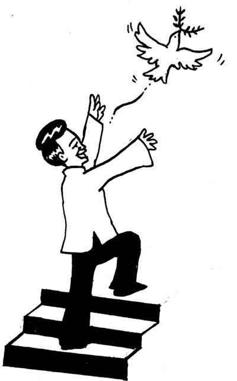
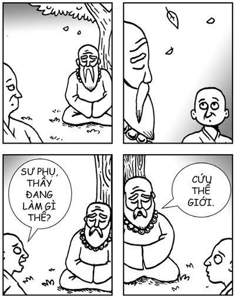
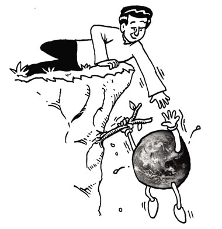

# Lời kết: CỨU THẾ GIỚI KHI BẠN RẢNH

> *Hãy viết một câu nói hài hước vào đây khi bạn rảnh.*

*“Sư phụ, thầy đang làm gì thế?”

*“Cứu thế giới.”**

Có một lần, tôi đi dạo rất lâu cùng thiền sư Roshi Joan Halifax. Bà vừa là một người bạn thân thiết, vừa giống như một người chị đối với tôi. Thỉnh thoảng tôi vẫn đùa rằng bà là “chị gái nhỏ” của tôi vì bà chỉ hơn tôi có 30 tuổi. Khi đi dạo, chúng tôi nói về cuộc sống của mình, về những bài tập tinh thần vô vi, và về khao khát phục vụ thế giới (chúng tôi gọi đùa nó là “cứu thế giới”). Chúng tôi cũng đùa về việc chúng tôi vừa muốn được là các thiền sinh lười nhác, chỉ phải ngồi trên nệm, vừa muốn được trở thành các bodhisattva (đấng cứu thế) không biết mệt mỏi.

Điều tôi nhớ nhất về cuộc trò chuyện này là sự hiện diện của Roshi đã truyền cảm hứng rất nhiều cho tôi. Roshi là một trong những người có tâm hồn từ bi nhất tôi từng có vinh dự được gặp. Chỉ cần nhìn vào mắt bà là bạn biết ngay – bà là người có đôi mắt từ bi nhất, dịu dàng nhất trong tất cả những người tôi biết. Trong cuộc đời mình, bà đã thầm lặng làm rất nhiều việc tuyệt vời, đặc biệt, bà đã dành nhiều thập kỷ để phục vụ và an ủi người sắp chết. Bà còn là một tu viện trưởng Thiền tông, một thành viên hội đồng quản trị của Học viện Tâm thức và Đời sống, nơi bà tiếp tục đem lại lợi ích cho nhiều người.

Roshi lúc nào cũng bận rộn cống hiến bản thân để đem lại lợi ích cho người khác, song bà cảm thấy rằng bà chỉ đang vui chơi bằng cách làm những điều tự nhiên nhất đối với mình mà thôi. Tôi suy nghĩ về sự hiện diện của Roshi và nhận ra rằng đây là trạng thái chung của tất cả những cá nhân đã được khai sáng và tràn đầy cảm hứng mà tôi từng có vinh dự được gặp: Sadhguru Jaggi Vasudev, một bậc thầy về yoga, tổ chức của ông còn giữ kỷ lục thế giới về số lượng cây được trồng nhiều nhất trong một ngày; A. T. Ariyaratne (“Tiến sỹ Ari”), một giáo viên tiếng Anh khiêm tốn, người đã được truyền cảm hứng để đi khắp nơi giúp đỡ mọi người và cuối cùng lập ra tổ chức phi chính phủ lớn nhất Sri Lanka; Matthieu Ricard, ngoài việc là người hạnh phúc nhất thế giới, ông còn điều hành một tổ chức nhân đạo đem lại lợi ích cho nhiều người mà không thu một đồng nào; và tất nhiên, Đạt-lai Lạt-ma.

Tất cả những vị bodhisattva này đều coi việc họ phục vụ nhân loại không biết mệt mỏi chỉ là họ đang vui chơi bằng cách làm những điều tự nhiên nhất đối với mình. Đôi khi họ nói đùa rằng bản thân mình rất “lười”, dù cho họ thường bận rộn hơn cả nhiều vị giám đốc bận rộn nhất mà tôi biết. Ví dụ, Đạt-lai Lạt-ma, dù có lịch trình rất bận rộn, vẫn nói là: “Tôi không làm gì cả”. Tất cả họ đều rất vui vẻ. Sadhguru nói rằng ông cũng nên có một chức danh giống như chức danh của tôi, người bạn tốt luôn vui vẻ.

Tôi ngộ ra rằng “cứu thế giới” là một việc khó và vất vả đến mức nếu bạn cố hết sức để “cứu thế giới”, thì nhiều khả năng bạn sẽ không thể duy trì lâu dài. Thay vào đó, sẽ hợp lý hơn nếu tập trung vào việc phát triển hòa bình, lòng từ bi và khao khát bên trong. Khi cả hòa bình, lòng từ bi và khao khát bên trong đều vững mạnh, thì những hành động từ bi sẽ đến một cách tự nhiên và thuần khiết, và do đó, bền vững.

Thiền sư lão luyện Thích Nhất Hạnh, một bodhisattva phục vụ thế giới không biết mệt mỏi khác, người tự gọi mình là “nhà sư lười biếng”, diễn tả điều này một cách đẹp đẽ như sau: *“Với tất cả những công việc xã hội này thì đầu tiên bạn phải học điều mà Đức Phật đã học, đó là ổn định tâm trí. Sau đó, bạn đừng hành động; hãy để hành động dẫn dắt bạn”.*

Bạn đừng hành động, hãy để hành động dẫn dắt bạn.

Được truyền cảm hứng bởi điều này, tôi đã viết nên bài thơ sau:

### BODHISATTVA LƯỜI BIẾNG
*(Chade-Meng Tan)*

> *Với sự an tĩnh sâu sắc bên trong,*  
> *Và lòng từ bi lớn lao,*  
> *Hàng ngày khao khát cứu thế giới.*  
> *Nhưng đừng cố đạt được nó.*  
> *Hãy chỉ làm những điều đến một cách tự nhiên.*  
> *Vì nếu khao khát mạnh mẽ,*  
> *Và lòng từ bi nở hoa,*  
> *Những điều đến một cách tự nhiên nhất,*  
> *Cũng chính là những điều đúng nên làm.*  
> *Vì vậy hỡi bạn,*  
> *Tạo vật từ bi và khôn ngoan ơi,*  
> *Hãy cứu thế giới khi đang vui chơi.*  
> *Hỡi bạn của tôi, chúc bạn lười biếng, chúc bạn cứu thế giới.*

