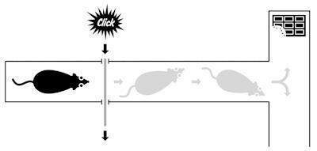
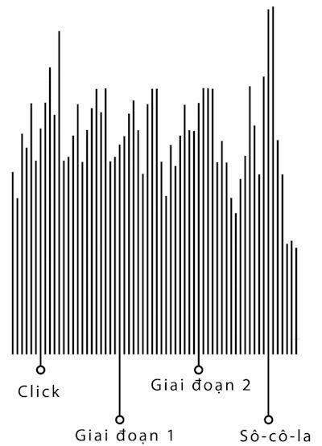
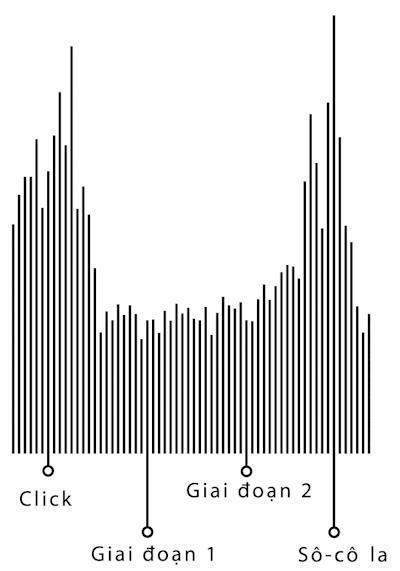
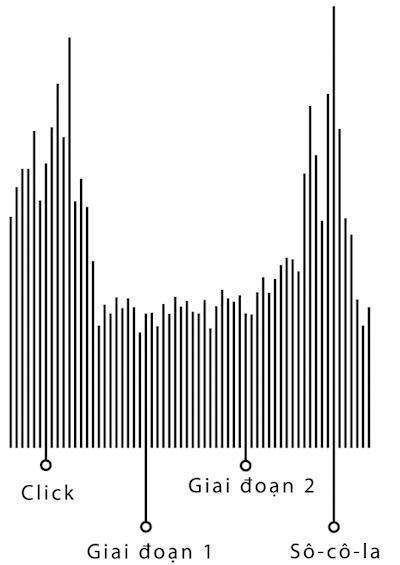
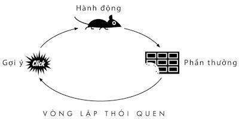
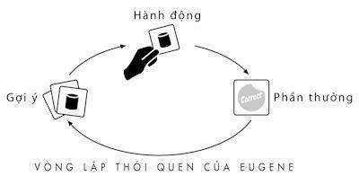

# Phần một

## Các thói quen cá nhân

* * *

# 1. Vòng lặp của thói quen

### *Cách thức thói quen hoạt động*

## I.

Mùa thu năm 1993, một người đàn ông lo lắng về việc chúng ta biết gì về thói quen bước vào phòng thí nghiệm ở San Diego cho một cuộc gặp đã hẹn trước. Ông đã lớn tuổi, cao hơn 1m8 và ăn mặc gọn gàng với một cái áo sơ mi cài kín cổ. Mái tóc trắng mỏng của ông sẽ khiến mọi người ghen tị trong bất kỳ cuộc họp lớp phổ thông lần thứ 50 nào. Chứng viêm khớp làm ông đi hơi khập khiễng khi đi qua tiền sảnh phòng thí nghiệm, ông nắm tay vợ, đi chầm chậm như thể không chắc chắn bước đi tiếp sẽ dẫn đến đâu.

Khoảng một năm trước đó, Eugene Pauly, hay “E.P”, người được biết đến trong các tài liệu y học, đã về nhà ở Playa del Rey, chuẩn bị bữa tối và vợ ông nói rằng con trai họ, Michael, đang đến nhà.

“Ai là Michael?”, Eugene hỏi

“Con của chúng ta,” Beverly, vợ ông trả lời. “Ông biết mà, đứa con chúng ta đã nuôi lớn.”

Eugene ngây ra nhìn vợ mình. “Đó là ai?” ông hỏi.

Ngày tiếp theo, Eugene bắt đầu nôn mửa và đau quằn quại vì chứng co thắt dạ dày. Trong vòng 24 giờ, sự mất nước càng nghiêm trọng nên Beverly vì hoảng sợ đã đưa ông đến phòng cấp cứu. Thân nhiệt bắt đầu tăng, lên đến hơn 40 độ C, người ông ướt đẫm mồ hôi, thấm trên ga trải giường của bệnh viện. Ông bắt đầu mê sảng rồi trở nên hung dữ, la hét đẩy y tá khi họ đang cố gắng đặt ống truyền vào tay ông. Sau khi thuốc giảm đau có tác dụng, bác sĩ mới có thể đưa kim vào giữa hai đốt sống chỗ thắt lưng của ông và lấy một vài giọt dịch tủy.

Người bác sĩ tiến hành thủ tục ngay lập tức cảm thấy có vấn đề. Máu quanh não và dây thần kinh cột sống ngăn chặn sự nhiễm trùng và tổn thương. Với những người khỏe mạnh, dịch tủy di chuyển và chảy nhanh, rõ ràng theo dòng rất mượt qua cây kim. Mẫu lấy từ xương sống của Eugene vẩn đục và nhỏ giọt một cách chậm chạp như thể nó có rất nhiều hạt cát cực nhỏ. Khi có kết quả từ phòng thí nghiệm, bác sĩ của Eugene đã hiểu được tại sao ông mắc bệnh, ông bị nhiễm vi rút viêm não, gây ra bệnh rộp môi và nhiễm trùng nhẹ trên da. Tuy nhiên trong một số trường hợp hiếm, vi rút có thể lên não, gây ra tổn thương lớn như nó gặm nhấm qua những nếp gấp của mô nơi chúng ta suy nghĩ và mơ tưởng.

Bác sĩ của Eugene báo với Beverly họ không thể làm gì để chống lại tổn thương đã hình thành nhưng một liều thuốc mạnh chống vi rút sẽ hạn chế nó lây lan. Eugene rơi vào tình trạng hôn mê khoảng 10 ngày và đang cận kề với cái chết. Dần dần, thuốc phát huy tác dụng, cơn sốt giảm dần và vi rút biến mất. Khi tỉnh lại, ông rất yếu, mất phương hướng và không thể ăn uống bình thường. Ông không thể nói thành câu và thỉnh thoảng thở một cách khó nhọc như thể có lúc ông đã quên cách thở. Nhưng ông vẫn còn sống.

Cuối cùng, Eugene đã đủ khỏe để tham gia một loạt kiểm tra. Bác sĩ rất ngạc nhiên khi cơ thể ông, trong đó có hệ thần kinh, không có tổn thương nào lớn. Bản chụp cắt lớp não của ông cho thấy một dấu vết đáng lo ngại gần trung tâm não. Vi rút đã phá hủy một mô hình bầu dục gần hộp sọ và cột sống. “Ông ấy có thể không nhớ cô,” một bác sĩ cảnh báo với Beverly. “Cô cần chuẩn bị tinh thần nếu ông ấy ra đi.”

Eugene được chuyển đến một khoa khác trong bệnh viện. Trong vòng một tuần, ông nuốt thức ăn dễ dàng. Tuần tiếp theo, ông bắt đầu nói chuyện bình thường, yêu cầu món tráng miệng Jell-O và muối, lướt nhanh các kênh ti vi và phàn nàn về một vở kịch nhiều kỳ buồn chán. Khi ông được chuyển đến trung tâm phục hồi chức năng 5 tuần sau đó, Eugene đi xuống tiền sảnh và cho các y tá lời khuyên cho kế hoạch cuối tuần.

“Tôi chưa từng thấy ai hồi sinh thế này,” một bác sĩ nói với Beverly. “Tôi thực sự không muốn gieo hy vọng cho cô, nhưng điều này thật tuyệt vời.”

Tuy nhiên, Beverly vẫn còn lo lắng. Ở bệnh viện phục hồi chức năng, rõ ràng căn bệnh đã thay đổi chồng bà theo hướng đáng lo ngại. Eugene không thể nhớ đó là ngày nào trong tuần, hay như tên của những bác sĩ và y tá chữa trị mặc dù họ đã tự giới thiệu rất nhiều lần. “Tại sao họ vẫn lặp lại những câu hỏi đó với tôi?” ông hỏi Beverly sau khi một bác sĩ ra khỏi phòng ông. Khi ông trở về nhà, mọi thứ còn trở nên lạ lùng hơn. Eugene có vẻ không nhớ gì bạn bè. Ông gặp khó khăn trong các cuộc hội thoại. Có những buổi sáng, ông bước ra khỏi giường, vào bếp, tự nấu thịt lợn muối xông khói và trứng, rồi leo lên giường và bật đài. 40 phút sau, ông lại làm những việc giống như thế: thức dậy, nấu thịt lợn xông khói và trứng, trở lại giường và nghịch cái đài. Rồi ông lại làm lại những việc đó.

Lo sợ, Beverly tìm đến các chuyên gia, có cả một nhà nghiên cứu ở đại học Carlifornia, San Diego với chuyên ngành về mất trí nhớ. Vào một ngày thu nắng đẹp, Beverly cùng Eugene đến một tòa nhà không có gì nổi bật trong khuôn viên trường đại học, nắm tay nhau và bước chậm rãi qua tiền sảnh. Họ được đưa tới một căn phòng kiểm tra nhỏ. Eugene bắt đầu nói chuyện với một người phụ nữ trẻ đang sử dụng máy vi tính.

“Làm việc trong ngành điện tử nhiều năm, điều làm tôi ngạc nhiên nhất là nó,” ông nói và chỉ vào cái máy mà cô ta đang gõ chữ. “Khi tôi còn trẻ tuổi, cái vật đó nằm trên hai cái giá gác cao khoảng 2 mét và chiếm toàn bộ căn phòng.”

Người phụ nữ tiếp tục gõ bàn phím. Eugene cười thầm.

“Thật là kỳ lạ,” ông nói. “Những thứ mạch in, ống hai cực và ống ba cực này. Khi tôi còn làm điện tử, hai cái giá đỡ cao 2 mét giữ những thứ đó.”

Một nhà khoa học vào phòng và tự giới thiệu mình. Ông hỏi Eugene bao nhiêu tuổi rồi.

“Ồ, xem nào, 59 hay 60?” Eugene đáp lời. Thực sự ông đã 71 tuổi rồi.

Nhà khoa học bắt đầu gõ máy vi tính. Eugene mỉm cười và chỉ vào nó. “Nó thật sự là cái gì đó,” ông nói. “Ông biết đấy, khi tôi còn làm điện tử, hai cái giá đỡ cao 2 mét giữ thứ này.”

Nhà khoa học Larry Squire, 52 tuổi, là một giáo sư đã dành 30 năm nghiên cứu cấu trúc hệ thần kinh của trí nhớ. Chuyên ngành của ông là khám phá cách bộ não lưu giữ các sự kiện. Tuy nhiên, công trình của ông với Eugene sẽ nhanh chóng mở ra một thế giới mới cho ông và hàng trăm nhà nghiên cứu khác, nó đã phục hồi những hiểu biết của chúng ta về cách thói quen hoạt động. Nghiên cứu của Squire sẽ chỉ ra rằng những người dù không thể nhớ tuổi của mình hay hầu như mọi thứ vẫn có thể phát triển những thói quen cực kỳ phức tạp, cho đến khi bạn nhận ra rằng ai cũng dựa vào những quá trình thần kinh giống nhau mỗi ngày. Nghiên cứu của ông và những người khác sẽ tiết lộ, cơ chế thuộc về tiềm thức con người ảnh hưởng đến vô số lựa chọn như thể nó là sản phẩm của những suy nghĩ rất hợp lý nhưng thực tế lại bị ảnh hưởng bởi những tác động mà chúng ta ít nhận ra hay hiểu được.

Ngay lúc Squire gặp Eugene, ông đã nghiên cứu hình ảnh não của Eugene hàng tuần. Bản chụp cắt lớp chỉ ra, hầu như mọi tổn thương trong hộp sọ của Eugene bị giới hạn trong một khu vực rộng 5cm gần trung tâm não. Con vi rút phá hủy gần như toàn bộ thùy thái dương trung gian, một mảnh của những tế bào mà các nhà khoa học nghi ngờ là quan trọng với các chức năng nhận thức như gợi lại quá khứ và điều chỉnh một vài cảm xúc. Squire không ngạc nhiên trước sự phá hủy hoàn toàn đó, viêm não do vi rút phá hủy mô liên tục và chính xác như phẫu thuật. Nhưng điều làm ông bất ngờ là mức độ giống nhau của các hình ảnh đó.

30 năm trước, là một học viên học bằng tiến sĩ ở MIT, Squire đã làm việc cùng một nhóm nghiên cứu một người đàn ông được biết đến là “H.M”, một trong những bệnh nhân nổi tiếng trong lịch sử y học. Khi H.M, tên thật là Henry Molaison nhưng các nhà khoa học đã che giấu căn cước của ông suốt đời, được 7 tuổi, ông bị xe đạp tông phải và đập mạnh đầu xuống đường. Không lâu sau đó, ông mắc chứng co giật và bắt đầu bất tỉnh. Vào năm 16 tuổi, chứng động kinh nặng của ông lần đầu tiên phát lộ và nó ảnh hưởng đến toàn bộ não, sau đó, ông bất tỉnh khoảng 10 lần một ngày.

Khi bước sang tuổi 27, H.M không còn hy vọng chữa khỏi. Thuốc chống co giật không còn tác dụng. Ông thông minh nhưng không thể làm việc gì. Ông vẫn còn sống chung với bố mẹ. H.M mong muốn một sự tồn tại bình thường. Vì thế ông đã tìm kiếm sự giúp đỡ từ một bác sĩ mà sự ham muốn thí nghiệm đã vượt xa nỗi sợ về sai sót y học. Nghiên cứu đã cho thấy một khu vực trong não bộ gọi là hồi hải mã có thể có vai trò quan trọng trong sự co giật. Khi bác sĩ đề nghị can thiệp vào đầu của H.M, nâng phần trước của não và dùng một ống nhỏ hút phần hồi hải mã và một vài mô xung quanh ra từ bên trong não của ông, H.M đồng ý.

Cuộc phẫu thuật diễn ra vào năm 1953 và vì H.M được chữa khỏi, cơn co giật của ông bị làm chậm lại. Tuy nhiên, gần như lập tức, não của ông rõ ràng đã bị biến đổi hoàn toàn. H.M biết tên của mình và mẹ ông đến từ Ireland. Ông có thể nhớ thị trường chứng khoán 1929 sụp đổ và tường thuật mới về cuộc xâm lược ở Normandy. Nhưng gần như mọi thứ xảy ra sau đó, mọi ký ức, kinh nghiệm và cố gắng từ hàng chục năm trước phẫu thuật, đã bị xóa bỏ. Khi một bác sĩ bắt đầu kiểm tra trí nhớ của H.M bằng việc hướng dẫn ông cách chơi bài và các dãy số, ông nhận ra H.M không thể nhớ được bất cứ thông tin mới nào hơn 20 giây.

Từ ngày phẫu thuật đến ngày mất vào năm 2008, mọi người H.M gặp, mọi bài hát ông nghe, mọi căn phòng ông vào đều hoàn toàn là những trải nghiệm mới. Não của ông đã bị đóng băng. Mỗi ngày, việc ai đó có thể chuyển kênh ti vi bằng cách chỉ vào một nút nhựa màu đen trên màn hình làm ông bối rối. Ông tự giới thiệu mình với các bác sĩ và y tá hết lần này đến lần khác, hàng chục lần mỗi ngày.

“Tôi thích tìm hiểu H.M, vì trí nhớ có vẻ là một cách thú vị và rõ ràng để tìm hiểu não bộ,” Squire nói với tôi. “Tôi lớn lên ở Ohio, và tôi có thể nhớ năm lớp Một, khi cô giáo tôi cầm bút màu của tất cả mọi người và tôi bắt đầu trộn các màu để xem chúng có thành màu đen không. Tại sao tôi có thể nhớ điều đó nhưng không thể nhớ cô giáo tôi trông như thế nào? Tại sao não của tôi lại quyết định ký ức này quan trọng hơn ký ức khác?”

Khi Squire nhận được hình ảnh não của Eugene, ông kinh ngạc khi thấy nó có vẻ giống với hình ảnh của H.M. Có một khoảng trống cỡ quả hồ đào trong đầu hai người. Trí nhớ của Eugene cũng như của H.M đều đã bị mất đi.

Squire bắt đầu kiểm tra Eugene, ông nhận thấy bệnh nhân này khác với H.M ở một vài điểm cần nghiên cứu thêm. Trong khi lúc gặp H.M, gần như mọi người đều biết có điều gì đó sai sót, thì Eugene có thể nói chuyện và làm những việc mà người bình thường sẽ không nhận ra sai sót. Cuộc phẫu thuật của H.M gây suy nhược nặng nên ông được đưa vào cơ sở từ thiện để được chăm sóc trong thời gian còn lại. Ngược lại, Eugene sống tại nhà cùng vợ. H.M còn không thể nói chuyện bình thường. Eugene trái lại có sự thông thạo đáng kinh ngạc trong việc dẫn dắt bất kỳ cuộc thảo luận nào về vấn đề ông cảm thấy thoải mái khi trò chuyện trong thời gian dài như chủ đề vệ tinh nhân tạo vì ông đã làm kỹ thuật viên cho một công ty hàng không hay chủ đề thời tiết.

Squire hỏi về thời thanh niên của Eugene để bắt đầu bài kiểm tra. Eugene nói về thị trấn ở trung tâm California nơi ông lớn lên, thời gian ông ở trong đội thương thuyền, một chuyến đi đến Australia như một người đàn ông trẻ. Ông gần như có thể nhớ mọi sự kiện xảy ra trước năm 1960. Khi Squire hỏi về những năm sau đó, Eugene chuyển chủ đề một cách lịch sự và thừa nhận ông gặp rắc rối trong việc nhớ lại những sự kiện gần đây.

Squire tiến hành một vài bài kiểm tra trí thông minh và nhận ra trí thông minh của Eugene vẫn rất sắc bén đối với một người đàn ông không thể nhớ được 30 năm trước. Hơn nữa, Eugene vẫn còn những thói quen từ thời thanh niên nên mỗi lần Squire đưa ông một tách nước hay khen ngợi một câu trả lời chi tiết, Eugene sẽ cảm ơn và đáp lại lời khen đó. Mỗi khi ai đó vào phòng, Eugene sẽ tự giới thiệu và hỏi về ngày hôm đó của họ.

Nhưng khi Squire yêu cầu Eugene nhớ lại một dãy số hay mô tả tiền sảnh bên ngoài phòng thí nghiệm, người bác sĩ nhận ra bệnh nhân của mình không thể gợi lại bất kỳ thông tin nào hơn một phút trước. Khi một người đưa cho Eugene bức ảnh cháu của ông, ông không nhận ra chúng là ai. Khi Squire hỏi liệu ông có nhớ mình đã từng mắc bệnh, Eugene trả lời ông không hề nhớ mình đã có bệnh hay từng ở trong bệnh viện. Thực tế, Eugene chưa bao giờ nhớ mình mắc chứng quên. Hình ảnh thần kinh của Eugene không thể hiện chứng mất trí nhớ và bởi vì ông không nhớ tai nạn đó nên ông không hiểu được có điều gì sai.

Vài tháng sau khi gặp Eugene, Squire tiến hành thí nghiệm để kiểm tra giới hạn của trí nhớ. Kể từ khi đó, Eugene và Beverly chuyển từ Playa del Rey đến San Diego để sống gần con gái hơn và Squire thường xuyên đến nhà họ để tiến hành cuộc kiểm tra. Một ngày nọ, Squire yêu cầu Eugene phác thảo bản thiết kế nhà ông. Eugene không thể vẽ một bản đồ sơ bộ chỉ ra vị trí của nhà bếp hay phòng ngủ. “Khi ông thức dậy vào buổi sáng, ông rời khỏi phòng như thế nào?” Squire hỏi.

“Ông biết đấy,” Eugene trả lời. “Tôi cũng không chắc nữa.”

Squire ghi chú trên máy tính cá nhân và khi nhà khoa học đánh máy, Eugene bắt đầu lơ đãng. Ông liếc qua căn phòng, rồi đứng lên, đi về phía phòng trước và mở cửa phòng tắm. Vài phút sau, nhà vệ sinh có tiếng dội nước, vòi nước thì chảy và Eugene lau tay mình trên quần, trở lại phòng khách và lại ngồi xuống ghế đối diện Squire. Ông kiên nhẫn chờ câu hỏi tiếp theo.

Lúc đó, không ai tự hỏi làm sao một người đàn ông không thể vẽ bản đồ nhà mình lại có thể tìm được phòng tắm không hề do dự. Nhưng câu hỏi đó và những câu khác kiểu như thế, cuối cùng dẫn đến những khám phá đã thay đổi sự hiểu biết của chúng ta về sức mạnh của thói quen. Nó sẽ tạo ra một cuộc cách mạng khoa học tác động đến hàng trăm nhà nghiên cứu hiện nay đang xem xét lần đầu tiên để hiểu được mọi thói quen ảnh hưởng đến cuộc sống của chúng ta thế nào.

Khi Eugene ngồi ở bàn, ông nhìn vào máy tính của Squire.

“Điều đó thật tuyệt vời,” ông nói và chỉ vào cái máy tính. “Ông biết đấy, khi tôi còn làm điện tử, hai cái giá đỡ cao chừng hơn 2 mét giữ thứ này.”

* * *

Vào những tuần đầu tiên sau khi chuyển đến nhà mới, Beverly cố gắng đưa Eugene ra ngoài mỗi ngày. Bác sĩ nói với bà, Eugene cần được tập thể dục, và nếu Eugene ở trong nhà quá lâu, ông sẽ khiến bà phát điên. Vì thế mỗi sáng và tối, bà đưa ông đi vòng quanh nhà, cùng nhau và cùng một con đường.

Bác sĩ đã cảnh báo Beverly rằng bà cần giám sát Eugene liên tục. Nếu ông ấy bị lạc, ông sẽ không bao giờ tìm được đường về nhà. Nhưng một buổi sáng khi Beverly đang thay quần áo, Eugene bước ra cửa trước. Ông ấy thường rảo bộ từ phòng này qua phòng khác nên phải mất một lúc sau bà mới biết ông đã đi khỏi. Khi biết được, bà phát điên lên vì lo lắng. Bà chạy ra khỏi nhà và nhìn khắp con đường. Bà không thấy ông. Bà đến nhà hàng xóm và đập vào cửa sổ. Nhà của họ giống nhau nên có thể Eugene nhầm lẫn và bước vào. Bà chạy đến cửa ra vào và nhấn chuông cho đến khi có người trả lời. Eugene không có ở đó. Bà chạy hết sức về con đường, lên khu nhà và hét tên Eugene. Bà khóc. Chuyện gì sẽ xảy ra nếu ông gặp tai nạn? Làm sao ông nói với mọi người nơi ông ở? Bà đã ở ngoài 15 phút và tìm kiếm khắp nơi. Bà quay về nhà để báo cảnh sát.

Khi mở tung cánh cửa, bà thấy Eugene trong phòng khách, ngồi trước ti vi và xem kênh History Channel. Nước mắt của bà làm ông bối rối. Ông không nhớ mình đã rời đi, ông nói, ông không biết mình đã ở đâu và không hiểu tại sao bà lại buồn. Beverly thấy một đống quả cây thông trên bàn, giống loại quả bà đã nhìn thấy ở sân nhà hàng xóm phía cuối đường. Bà đến gần và nhìn tay của Eugene. Ngón tay của ông dính nhựa cây nhớp nháp. Đó là lúc bà nhận ra Eugene đã tự mình đi bộ. Ông đã tản bộ dọc con đường và thu nhặt một vài vật kỷ niệm.

Và ông ấy đã tìm được đường về nhà.

Chẳng bao lâu sau, Eugene tự đi bộ mỗi sáng. Beverly cố ngăn cản ông nhưng vô ích.

“Cho dù tôi bảo ông ấy ở nhà, ông lại quên ngay vài phút sau đó,” bà nói với tôi. “Tôi đã đi theo ông ấy vài lần để bảo đảm ông ấy không bị lạc nhưng ông ấy luôn luôn trở về.” Đôi lúc ông trở về mang theo quả cây thông hay vài viên đá. Một lần ông trở về mang theo một cái ví, lần khác với một con chó con. Ông không bao giờ nhớ được những thứ đó từ đâu ra.

Khi Squire và trợ lý của ông biết được những lần đi bộ đó, họ bắt đầu nghi ngờ có điều gì đang xảy ra trong đầu Eugene mà nó không tác động gì đến trí nhớ của ông. Họ lập ra một thí nghiệm. Một trong những trợ lý của Squire đến thăm nhà và nhờ Eugene vẽ bản đồ căn hộ ông đang sống. Ông ấy không thể làm được việc đó. Còn về vị trí của ngôi nhà trên con đường thì sao, cô hỏi. Ông vẽ nguệch ngoạc một hồi rồi quên mất việc cần làm. Cô nhờ ông chỉ cánh cửa nào dẫn đến nhà bếp. Eugene nhìn khắp căn phòng. Ông nói ông không biết. Cô hỏi ông sẽ làm gì khi đói. Ông đứng dậy, đi đến nhà bếp, mở một ngăn tủ và lấy một lọ quả hạnh nhân xuống.

Tuần sau đó, một vị khách đi cùng Eugene trong cuộc tản bộ hàng ngày. Họ đi bộ khoảng 15 phút trong mùa xuân vĩnh hằng của Bắc California và không khí ngập mùi hoa giấy. Eugene không nói nhiều nhưng ông luôn dẫn đường và có vẻ biết mình đang đi đến đâu. Ông không bao giờ hỏi chỉ dẫn. Khi họ vòng lại góc đường gần nhà ông, vị khách hỏi Eugene nơi ông sống. “Tôi không biết chính xác,” ông nói. Sau đó, ông bước lên vỉa hè, mở cửa trước, đi vào phòng khách và bật ti vi.

Squire nhận thấy rõ ràng Eugene đang tiếp thu thông tin mới. Nhưng bên trong não của ông thông tin đó có lưu lại? Làm sao một người có thể tìm một lọ quả hạnh nhân khi không thể nói nhà bếp ở đâu? Hay làm sao ông có thể về nhà khi không biết ngôi nhà nào là của mình? Squire tự hỏi, có phải cấu trúc mới đã hình thành trong bộ não bị tổn thương của Eugene?

## II.

Bên trong tòa nhà có khoa Não bộ và Khoa học nhận thức của Viện công nghệ thông tin Massachusetts (MIT) là những phòng thí nghiệm chứa phiên bản nhà đồ chơi theo cái nhìn của người thường. Có dao mổ nhỏ, khoan nhỏ và cưa thu nhỏ rộng chừng 87mm gắn với những cái tay robot. Ngay cả bàn phẫu thuật cũng nhỏ giống như nó chuẩn bị cho những cuộc phẫu thuật cỡ trẻ em. Căn phòng luôn được giữ lạnh ở nhiệt độ -60 vì không khí tê buốt giữ cho ngón tay của các nhà nghiên cứu thực hiện chuẩn những thủ tục phức tạp. Bên trong các phòng thí nghiệm đó, nhà thần kinh học can thiệp sọ não của những con chuột đã được gây tê, đưa vào thiết bị cảm biến cực nhỏ có thể ghi lại những thay đổi nhỏ nhất bên trong não. Khi những con chuột tỉnh dậy, dường như nó không thể nhận ra có hàng tá dây cực nhỏ được sắp xếp như mạng nhện thần kinh trong não chúng.

Những phòng thí nghiệm này đã trở thành cái nôi của một cuộc cách mạng thầm lặng trong khoa học về việc hình thành thói quen và những thí nghiệm mở ra ở đây giải thích cách thức Eugene cũng như bạn, tôi và những người khác phát triển các lề thói cần thiết để làm mỗi ngày. Những con chuột trong phòng thí nghiệm đã làm sáng tỏ sự phức tạp xảy ra trong đầu chúng ta mỗi khi chúng ta làm gì đó vô vị như đánh răng hay lùi xe khỏi đường vào nhà. Và đối với Squire, những phòng thí nghiệm đó giúp giải thích cách thức Eugene học thói quen mới.

Khi các nhà nghiên cứu MIT bắt đầu nghiên cứu thói quen trong những năm 1990, cùng lúc Eugene suy sụp vì cơn sốt, họ tò mò về cục u của mô thần kinh gọi là hạch nền. Nếu hình ảnh não người như một củ hành có nhiều lớp ở trên lớp tế bào, sau lớp bên ngoài gần da đầu nhất là vật được thêm vào mới gần đây theo góc nhìn tiến hóa. Khi bạn nghĩ về sự phát minh hay cười trước câu chuyện cười của bạn, đó là phần bên ngoài của não bạn làm việc. Đó là nơi suy nghĩ phức tạp nhất lóe lên.

Sâu hơn trong não và gần với cuống não, nơi não tiếp xúc với cột sống, có những cấu trúc nguyên thủy và xưa cũ. Nó kiểm soát lề thói tự nhiên của con người như thở, ăn uống hay phản ứng giật mình khi ai đó nhảy ra từ sau lùm cây. Hướng trung tâm của hộp sọ là một mô cỡ quả bóng gôn giống với thứ bạn hay tìm thấy bên trong đầu cá, bò sát hay động vật có vú. Đó là hạch nền, những tế bào hình oval mà các nhà khoa học không thể hiểu rõ đã nhiều năm, ngoại trừ nghi ngờ vai trò của nó đối với những căn bệnh như Parkinson.

Vào đầu thập niên 1990, các nhà nghiên cứu tại MIT bắt đầu tự hỏi phải chăng hạch nền cũng không thể thiếu đối với thói quen. Họ nhận ra những động vật có tổn thương hạch nền gặp vấn đề với những việc như học cách băng qua mê cung hay nhớ cách mở hộp thức ăn. Họ quyết định làm thí nghiệm bằng công nghệ vi mô cho phép họ quan sát đến từng chi tiết những gì xảy ra trong đầu những con chuột thí nghiệm khi nó thực hiện những công việc hàng ngày. Sau phẫu thuật, mỗi con chuột có thứ giống như một cần điều khiển nhỏ và hàng tá dây nhỏ gắn vào bên trong hộp sọ. Sau đó, con vật được đặt vào một mê cung hình chữ T có sô-cô-la ở một đầu.

Mê cung được thiết kế sao cho mỗi con chuột được đặt sau một vách ngăn có thể mở ra khi một tiếng click lớn vang lên. Lúc đầu, khi con chuột nghe tiếng click và thấy vách ngăn biến mất, nó thường đi lên và xuống lối đi giữa, ngửi từng góc và cào cào các vách tường. Nó ngửi được mùi sô-cô-la nhưng không thể tìm được đường đến đó. Khi nó đến được phần trên chữ T, nó thường rẽ phải, cách xa sô-cô-la hơn rồi sau đó rẽ trái, đôi lúc nó dừng lại không rõ lý do. Cuối cùng, tất cả đều có thể tìm thấy phần thưởng. Nhưng không có cấu trúc rõ ràng nào cho việc đi lang thang của nó. Có vẻ như mỗi con chuột đang đi dạo thư giãn, không suy nghĩ.

Tuy nhiên, những que thăm dò trong đầu nó lại thể hiện khác. Trong khi mỗi con đi trong mê cung, não nó hay thông thường là hạch nền làm việc cật lực. Mỗi lần con chuột ngửi mùi trong không khí hay cào tường, não nó bùng nổ hoạt động, phân tích mùi, hình ảnh và âm thanh mới. Con chuột xử lý thông tin trong suốt thời gian nó đi lang thang.

Các nhà khoa học lặp lại thí nghiệm, xem xét bộ não chuột thay đổi như thế nào khi nó di chuyển cùng một con đường hàng trăm lần. Một chuỗi thay đổi từ từ xảy ra. Con chuột dừng ngửi các góc và rẽ sai hướng. Thay vào đó, nó băng qua mê cung nhanh hơn. Và trong não nó, vài thứ không ngờ xảy ra: khi mỗi con chuột học cách xác định mê cung, hoạt động thần kinh của nó giảm xuống. Khi con đường dần quen thuộc hơn, mỗi con chuột bắt đầu suy nghĩ ít dần đi.

Vài lần đầu khi con chuột xác định đường trong mê cung, não nó phải hoạt động hết sức để nhận thức toàn bộ thông tin mới. Nhưng sau vài ngày đi cùng một con đường, con chuột không cần cào tường hay ngửi mùi nữa, vì thế hoạt động gắn với việc cào và ngửi của não biến mất. Nó không cần lựa chọn hướng rẽ nên trung tâm ra quyết định của não cũng đi vào im lặng. Tất cả những thứ nó phải làm là nhớ lại con đường nhanh nhất để tìm sô-cô-la. Trong vòng một tuần sau, cả cấu trúc não liên quan đến trí nhớ cũng không cần hoạt động. Con chuột đã tiếp thu cách đi trong mê cung đến mức độ nó không cần phải suy nghĩ nữa.

Nhưng sự tiếp thu đó – đi thẳng, rẽ trái và ăn sô-cô-la – phụ thuộc vào hạch nền, theo như những que thăm dò thể hiện. Cấu trúc thần kinh nhỏ và xưa đó tiếp tục khi con chuột chạy nhanh hơn và não hoạt động ít hơn. Hạch nền là trung tâm gợi nhớ lại những lề thói đó và thực hiện nó. Nói cách khác, hạch nền là nơi lưu giữ những thói quen ngay cả khi phần não còn lại không hoạt động.

Để kiểm chứng khả năng đó trên thực tế, đồ thị sau thể hiện những hoạt động trong hộp sọ con chuột khi nó đi trong mê cung lần đầu tiên. Lúc đầu, não nó làm việc toàn thời gian:

Sau một tuần, khi đã quen thuộc con đường và thành thói quen, não nó giảm hoạt động khi chạy qua mê cung:

Quá trình não bộ chuyển hóa một chuỗi lề thói thành hoạt động tự nhiên bản năng gọi là “chunking” và là cơ sở để thói quen hình thành. Có hàng tá nếu không phải là hàng trăm nhóm lề thói chúng ta thực hiện mỗi ngày. Một số thì đơn giản: Bạn tự động đưa bàn chải lên trước khi đẩy nó trong miệng. Một số thì phức tạp hơn như thay quần áo hay chuẩn bị bữa trưa cho con cái.

Một số thì quá phức tạp nên chỉ một số nhỏ mô đặc biệt tiến hóa qua hàng triệu năm mới có thể chuyển thành thói quen như việc lái ô tô ra khỏi đường dẫn vào nhà. Khi bạn mới học lái xe, lái xe trong đường dẫn vào nhà cần sự tập trung cao độ và vì lý do: cần phải mở gara, mở khóa cửa xe, điều chỉnh ghế ngồi, tra chìa khóa vào ổ, khởi động xe, điều chỉnh gương chiếu hậu và kính bên, kiểm tra chướng ngại vật, đặt chân lên thắng xe, gạt ngược cần số lại, thả thắng xe, nhẩm ước tính khoảng cách giữa gara và con đường trong khi giữ bánh xe thẳng hàng, xem xét giao thông sắp đến, tính toán hình ảnh phản chiếu trong gương để biết khoảng cách thực giữa thanh hãm xung, thùng rác và hàng rào, tất cả trong khi nhấn nhẹ lên bàn đạp ga và thắng và thông thường phải nhắc hành khách ngừng nghịch phá cái đài radio.

Tuy nhiên, ngày nay, bạn làm tất cả những việc đó mà không cần phải suy nghĩ nhiều. Đó là lề thói do thói quen.

Hàng triệu người làm công việc phức tạp đó mỗi buổi sáng, không suy nghĩ vì ngay lúc bạn lấy chìa khóa xe, hạch nền đã hoạt động, xác định thói quen lưu giữ trong não bộ liên quan đến việc lái xe ra khỏi nhà. Một khi thói quen đó bắt đầu, việc làm khác của chúng ta là im lặng hay suy nghĩ những việc khác. Nó giải thích tại sao ta có đủ khả năng tinh thần để nhận ra cậu con trai bỏ quên hộp cơm trưa trong nhà.

Theo các nhà khoa học, thói quen hình thành vì não bộ không ngừng tìm cách để giảm bớt sự nỗ lực trí óc. Não bộ cố gắng để chuyển hầu hết hoạt động hàng ngày thành thói quen vì thói quen cho phép não bộ nghỉ ngơi thường xuyên hơn. Bản năng giảm bớt nỗ lực đó là một thuận lợi lớn. Một bộ não hiệu quả cần không nhiều chỗ trống, tạo khuynh hướng có đầu nhỏ hơn, làm cho việc sinh con dễ dàng hơn và giảm tỉ lệ tử vong của cả trẻ mới sinh và bà mẹ. Một bộ não hiệu quả cũng cho phép chúng ta không suy nghĩ liên tục về những lề thói cơ bản như đi bộ hay lựa chọn thức ăn, vì thế chúng ta có dùng khả năng trí óc để sáng tạo cái giáo, hệ thống tưới tiêu và cuối cùng là máy bay và trò chơi video.

Nhưng để giữ cho trí óc cố gắng cần sự khéo léo, vì nếu não bộ ngừng sai thời điểm, chúng ta không thể biết được những điều quan trọng như một loài động vật ăn thịt đang núp trong bụi rậm hay một chiếc xe đang chạy rất nhanh trên đường. Vì thế hạch nền đã đặt ra một hệ thống thông minh hơn nhằm xác định khi nào cần để thói quen hoạt động. Bất kể khi nào một nhóm lề thói bắt đầu hay kết thúc đều sẽ có điều gì đó xảy ra.

Để biết cách thức nó hoạt động, hãy nhìn thật kỹ vào đồ thị thần kinh thói quen của chuột thí nghiệm. Chú ý rằng hoạt động của não thay đổi vào lúc bắt đầu mê cung, khi con chuột nghe tiếng click và trước khi vách ngăn mở ra và lặp lại khi nó tìm thấy sô-cô-la.

Sự thay đổi đó là cách não bộ xác định khi nào để thói quen hoạt động và sử dụng thói quen nào. Ví dụ, từ sau vách ngăn, rất khó để con chuột xác định đó là mê cung quen thuộc hay là một cái tủ đựng chén bát khác có một con mèo đang núp trong đó. Để hạn chế sự không chắc chắn, não bộ dành rất nhiều nỗ lực từ lúc bắt đầu thói quen để tìm kiếm một gợi ý cho sự lựa chọn mô hình. Từ sau vách ngăn, nếu con chuột nghe tiếng click, nó biết sẽ dùng thói quen trong mê cung. Nếu nó nghe tiếng mèo kêu, nó sẽ chọn một mô hình khác. Và đến cuối lề thói khi phần thưởng xuất hiện, não bộ hoạt động lại và bảo đảm mọi thứ diễn ra như mong đợi.

Quá trình đó trong não chúng ta là một vòng lặp 3 bước. Đầu tiên,

gợi ý như một nút bấm sẽ đưa não bộ vào trạng thái tự động và lựa chọn thói quen để sử dụng. Sau đó, một hoạt động có thể thuộc về thể chất, tinh thần hay cảm xúc diễn ra. Cuối cùng, phần thưởng xuất hiện sẽ giúp não bộ xác định vòng lặp đó có cần ghi nhớ để sử dụng sau này không.

Qua thời gian, vòng lặp đó – gợi ý, hoạt động, phần thưởng; gợi ý, hoạt động, phần thưởng – trở nên tự động hóa. Gợi ý và phần thưởng gắn kết với nhau cho đến khi hình thành một nhận thức mạnh mẽ về sự đề phòng và lòng ham muốn. Cuối cùng, cho dù trong phòng thí nghiệm của MIT hay trên đường lái xe, thói quen cũng được tạo ra.

* * *

Thói quen không phải là vận mệnh. Hai chương tiếp theo sẽ giải thích tiếp cho bạn, thói quen có thể bị lãng quên, thay đổi hay thay thế. Nhưng khám phá vòng lặp của thói quen quan trọng đến nỗi nó tiết lộ một sự thật cơ bản: Khi một thói quen hình thành, não bộ ngừng tham gia hoàn toàn vào việc ra quyết định. Nó không còn làm việc tích cực hay chuyển sự tập trung vào việc khác. Vì thế nếu không phải bạn đang cố tình chống lại một thói quen hay tìm được hoạt động mới, mô hình đó sẽ tự động mở ra.

Tuy nhiên, chỉ cần hiểu được thói quen hoạt động thế nào và cấu trúc của vòng lặp thói quen, chúng ta có thể điều khiển nó dễ dàng hơn. Khi bạn chia nhỏ thói quen ra nhiều thành phần, bạn có thể nghịch ngợm với cần số.

“Chúng tôi đã hoàn thành thí nghiệm huấn luyện một con chuột chạy trong mê cung cho đến khi hình thành thói quen, sau đó chúng tôi hủy bỏ thói quen đó bằng cách thay đổi vị trí của phần thưởng,” Anne Graybiel, một nhà khoa học của MIT, người đã quan sát nhiều thí nghiệm về hạch nền nói với tôi. “Rồi một ngày nọ, chúng tôi sẽ đặt phần thưởng ở vị trí cũ, đặt con chuột vào và thật ngạc nhiên, thói quen cũ lại hoạt động đúng như trước. Thói quen chưa bao giờ thực sự mất đi. Chúng được mã hóa thành cấu trúc của não bộ và đó là thuận lợi lớn cho chúng ta, bởi vì nếu chúng ta phải học lại cách lái xe vào mỗi kỳ nghỉ thì sẽ rất khủng khiếp. Vấn đề là não bộ không thể chỉ ra sự khác nhau giữa thói quen tốt và xấu, nếu bạn có một thói quen xấu, nó thường ẩn nấp ở đó, chờ đợi gợi ý và phần thưởng thích hợp xuất hiện.”

Điều này giải thích tại sao rất khó để tạo thói quen tập thể dục hay thay đổi món ăn. Một khi đã hình thành thói quen nằm ườn trên ghế dài thay vì chạy bộ hay ăn vội vàng khi có một hộp bánh nướng, những mô hình đó luôn luôn nằm trong đầu chúng ta. Mặc dù áp dụng cùng một quy luật, nếu chúng ta học cách tạo ra hoạt động thần kinh mới áp đảo những lề thói đó hay nếu chúng ta kiểm soát vòng lặp thói quem, chúng ta có thể buộc những khuynh hướng xấu đó trở nên vô hình như điều Lisa Allen đã làm sau chuyến đi đến Cairo. Và như nghiên cứu đã chứng minh, khi ai đó tạo ra mô hình mới như đi bộ hay phớt lờ bánh nướng, nó sẽ trở nên tự động như những thói quen khác.

Không có vòng lặp thói quen, bộ não của chúng ta sẽ ngừng làm việc và tràn ngập những chi tiết vụn vặt trong cuộc sống. Những người mà hạch nền bị tổn thương do tai nạn hay bệnh tật thường bị tê liệt thần kinh. Họ gặp rắc rối với những hoạt động cơ bản hàng ngày như mở cửa hay quyết định ăn gì. Họ mất khả năng bỏ qua những chi tiết phụ, một nghiên cứu cho thấy những bệnh nhân bị tổn thương hạch nền không thể nhận ra biểu hiện nét mặt, bao gồm sự sợ hãi và chán ghét vì họ luôn luôn không chắc chắn cần tập trung vào phần nào của khuôn mặt. Không có hạch nền, chúng ta không thể sử dụng thông tin của hàng trăm thói quen thực hiện hàng ngày. Sáng nay có phải bạn dừng một lát để quyết định cột dây giày bên nào trước? Bạn có gặp rắc rối khi xác định mình nên đánh răng trước hay sau khi tắm?

Tất nhiên là không. Những quyết định đó là thói quen, không cần nỗ lực. Miễn là hạch nền còn nguyên vẹn và gợi ý không thay đổi, lề thói sẽ diễn ra không cần suy nghĩ. (Mặc dù khi bạn đi nghỉ mát, bạn có thể thay quần áo bằng cách khác hay đánh răng lúc khác vào buổi sáng mà không để ý đến.)

Tuy nhiên, cùng lúc đó, sự phụ thuộc của não vào những lề thói tự nhiên có thể gặp nguy hiểm. Thói quen thông thường như chửi rủa cũng có thể có ích.

Hãy xem Eugene như một ví dụ. Những thói quen đưa ông trở lại cuộc sống bình thường sau khi ông mất trí nhớ. Sau đó, chúng lại lấy đi mọi thứ một lần nữa.

## III.

Khi chuyên gia về trí nhớ Larry Squire dành nhiều thời gian với Eugene hơn, ông bắt đầu thuyết phục bệnh nhân của mình học lề thói mới. Hình ảnh não bộ của Eugene cho thấy hạch nền đã thoát khỏi tổn thương do vi rút viêm não. Nhà khoa học tự hỏi Eugene với tổn thương não nặng có thể sử dụng vòng lặp gợi ý-hoạt động-phần thưởng không? Quá trình thần kinh cổ xưa đó có thể giải thích liệu Eugene có thể đi vòng quanh khu nhà và tìm được lọ hạt trong nhà bếp chăng?

Để kiểm tra thử xem Eugene có đang hình thành thói quen mới không, Squire thiết kế một thí nghiệm. Ông lấy 16 vật khác nhau, những mảnh đồ chơi bằng nhựa và sáng màu, rồi dán chúng lên một tấm bìa cứng hình vuông. Sau đó ông chia chúng ra 8 cặp: lựa chọn A và B. Trong mỗi cặp, một mảnh bìa cứng lựa chọn ngẫu nhiên có mảnh giấy dính ở phía dưới ghi “chính xác”.

Eugene ngồi tại bàn và được yêu cầu lựa chọn một trong những cặp đồ vật được giao cho. Tiếp theo, ông phải lật tấm bìa lại để xem có mảnh giấy dính “chính xác” ở phía dưới. Đó là cách phổ biến để đo lường trí nhớ. Vì chỉ có 16 đồ vật và được trình bày như nhau trong 8 cặp, nhiều người có thể nhớ được vật nào là “chính xác” sau vài lần. Loài khỉ có thể nhớ tất cả các vật “chính xác” sau 8 đến 10 ngày.

Eugene không thể nhớ bất kỳ vật “chính xác” nào dù cho ông đã làm bài kiểm tra bao nhiêu lần. Ông lặp lại bài kiểm tra hai lần một tuần trong nhiều tháng, nhìn 40 cặp mỗi ngày.

“Ông có biết tại sao mình lại có mặt ở đây hôm nay không?” một nhà nghiên cứu đặt câu hỏi lúc bắt đầu một buổi họp vài tuần trước thí nghiệm.

“Tôi nghĩ là không,” Eugene trả lời.

“Tôi sẽ chỉ cho ông vài đồ vật. Ông có biết tại sao không?”

“Có phải tôi định mô tả chúng cho ông hay nói với ông mục đích sử dụng của chúng?” Eugene không hề nhớ gì những lần họp trước.

Nhưng khi nhiều tuần trôi qua, Eugene thể hiện tốt hơn. Sau 28 ngày huấn luyện, Eugene lựa chọn vật “chính xác” 85% trên tổng số lần. Vào ngày thứ 36, khả năng chính xác tăng lên 95%. Sau một bài kiểm tra, Eugene nhìn nhà nghiên cứu đang bối rối vì thành công của mình.

“Tôi đã làm nó như thế nào?” ông hỏi nhà nghiên cứu.

“Hãy nói với tôi điều gì đang diễn ra trong đầu ông,” nhà nghiên cứu yêu cầu. “Có phải ông đã nói với mình,‘Tôi nhớ đã nhìn thấy thứ này’?”

“Không,” Eugene trả lời. “Nó ở đây bằng cách này hay cách khác” ông chỉ vào đầu mình, “và tay tôi chỉ làm theo.”

Tuy nhiên, với Squire, nó tạo nên một nhận thức hoàn hảo. Eugene được đưa cho một gợi ý: cặp đồ vật luôn luôn được trình bày cùng một sự kết hợp. Có một thói quen: Ông sẽ chọn một vật và kiểm tra xem có miếng giấy dính bên dưới không, cho dù ông không hiểu tại sao mình bắt buộc phải lật tấm bìa lại. Sau đó, có một phần thưởng: sự thỏa mãn ông có được sau khi tìm được tấm giấy dính có chữ “chính xác”. Cuối cùng, một vòng lặp thói quen được hình thành.

Để chắc chắn mô hình đó trên thực tế là một thói quen, Squire tiến hành một thí nghiệm nữa. Ông lấy hết 16 đồ vật và đặt chúng trước mặt Eugene cùng một lúc. Ông yêu cầu Eugene lấy những vật “chính xác” xếp thành một chồng.

Eugene không biết bắt đầu từ đâu. “Chúa ơi, làm sao nhớ nổi?” ông hỏi. Ông chọn một vật và bắt đầu lật nó lại. Người thí nghiệm ngăn ông lại và giải thích cho ông. Nhiệm vụ là đặt những vật đó thành chồng. Tại sao ông lại cố lật nó lại?

“Đó chỉ là thói quen, tôi nghĩ thế,” ông nói.

Ông không thể làm được. Những đồ vật nằm ngoài vòng lặp thói quen nên không có tác động gì đến ông.

Đó là bằng chứng Squire đang tìm kiếm. Những thí nghiệm cho thấy Eugene có khả năng hình thành những thói quen mới, dù cho nó liên quan đến những việc hay đồ vật ông không thể nhớ lâu hơn vài giây. Nó giải thích việc Eugene có thể đi bộ mỗi sáng ra sao. Những gợi ý như những cái cây, góc đường nhất định hay vị trí đặt những hộp thư nhất quán mỗi lần ông ra ngoài, vì thế dù cho ông không biết nhà mình, những thói quen cũng đưa ông về đúng cửa trước. Nó cũng giải thích tại sao Eugene ăn sáng 3 hay 4 lần một ngày cho dù ông không đói. Miễn là có gợi ý đúng như đài radio hay ánh nắng xuyên qua cửa sổ, ông tự động làm theo những gì hạch nền đã sắp xếp.

Hơn thế, có hàng tá thói quen khác trong cuộc sống của Eugene mà không ai để ý đến cho đến khi họ bắt đầu tìm kiếm chúng. Ví dụ như con gái của Eugene thường dừng ngang nhà ông để gửi lời chào. Cô sẽ nói chuyện với cha mình trong phòng khách một lúc, đến nhà bếp để thăm mẹ mình, rồi rời đi, vẫy tay chào trên đường ra cửa. Eugene sẽ quên cuộc hội thoại giữa họ trước đó ngay lúc cô đi, rồi ông sẽ nổi giận tại sao cô không nói chuyện gì mà đã đi, rồi lại quên tại sao mình buồn. Nhưng thói quen cảm xúc đã bắt đầu nên sự nổi giận của ông sẽ tiếp tục, nhiều hơn và vượt xa điều ông có thể hiểu được cho đến khi nó tự biến mất.

“Đôi lúc ông ấy đập bàn hay chửi rủa và nếu ông hỏi ông ấy tại sao, ông ấy sẽ trả lời ‘Tôi không biết, nhưng tôi đang bực!’”, Beverly nói với tôi. Ông ấy sẽ đá ghế và cáu kỉnh với bất kỳ ai vào phòng. Vài phút sau, ông lại mỉm cười và nói về thời tiết. “Giống như một khi đã bắt đầu, ông ấy phải tự kết thúc cơn giận dữ,” bà nói với tôi.

Thí nghiệm mới của Squire còn chỉ ra điều khác: thói quen dễ biến mất một cách đáng ngạc nhiên. Nếu những gợi ý thay đổi một chút xíu thôi, thói quen của Eugene cũng sẽ đổ vỡ. Chẳng hạn như vài lần ông đi quanh căn hộ và có vài thứ khác đi như thành phố đang sửa đường hay một cơn bão thổi bay những cành cây khắp vỉa hè, Eugene sẽ bị lạc cho dù ông ở gần nhà bao nhiêu cho đến khi một người hàng xóm tốt bụng chỉ cho ông đường về nhà. Nếu con gái ông đến trò chuyện khoảng mười phút trước khi đi, thói quen nổi giận của ông sẽ không hình thành.

Những thí nghiệm của Squire với Eugene đã cách mạng hóa sự hiểu biết của cộng đồng khoa học về cách thức bộ não hoạt động bằng cách chứng minh một lần và mãi sau này rằng có thể học và ra lựa chọn vô thức mà không cần ghi nhớ thứ gì về bài học hay việc ra quyết định. Eugene cho thấy thói quen, cũng như trí nhớ và lý do, là nguồn gốc của cách chúng ta cư xử. Chúng ta có thể không nhớ những trải nghiệm đã tạo ra thói quen, nhưng một khi nó được đặt vào bộ não, nó sẽ ảnh hưởng đến cách chúng ta hành động mà chúng ta thường không nhận ra.

* * *

Khi bài nghiên cứu đầu tiên của Squire về thói quen của Eugene được công bố, khoa học về hình thành thói quen đã phát triển thành một lĩnh vực nghiên cứu. Các nhà nghiên cứu tại Đại học Duke, Harvard, California, Yale, Bắc California, Princeton, Pennsylvania, cũng như của các trường ở Anh, Đức, Hà Lan, cũng như các nhà khoa học hợp tác làm việc cho Proctor & Gamble, Microsoft, Google và hàng trăm công ty khác tập trung vào việc hiểu thần kinh học và tâm lý học của thói quen, điểm mạnh và điểm yếu của nó, tại sao nó hình thành và làm sao thay đổi nó.

Các nhà nghiên cứu đã biết được gợi ý có thể là bất kỳ thứ gì, từ một vật có thể nhìn thấy như một thanh kẹo, quảng cáo trên ti vi ở một nơi nhất định, thời gian trong ngày, một cảm xúc, một loạt suy nghĩ hay bạn đồng hành của bất kỳ ai. Hoạt động có thể cực kỳ phức tạp hay rất đơn giản (vài thói quen, như một số liên quan đến cảm xúc, được đo theo đơn vị 1/1000 giây). Phần thưởng có thể từ thức ăn hay thuốc gây ra cảm giác cơ thể đến tác động cảm xúc như cảm giác kiêu hãnh cùng với sự ca ngợi hay tự tán thưởng.

Khám phá của Squire về Eugene tạo tiếng vang đối với mọi thí nghiệm của các nhà nghiên cứu khác: Thói quen có tác động mạnh nhưng mong manh. Nó có thể hình thành bên ngoài nhận thức của chúng ta hay có thể tạo ra theo chủ ý. Nó thường xảy ra không cần sự cho phép nhưng có thể thay đổi bằng cách sửa thành phần. Nó ảnh hưởng cuộc sống chúng ta nhiều hơn chúng ta biết, trên thực tế nó rất mạnh, làm cho não bộ gắn chặt vào nó cùng những thứ khác, gồm cả nhận thức chung.

Ví dụ như trong một chuỗi thí nghiệm, các nhà nghiên cứu liên kết với Viện quốc gia về lạm dụng rượu và chứng nghiện rượu huấn luyện chuột để ấn cái cần gạt phản ứng lại những gợi ý nhất định cho đến khi trở thành thói quen. Con chuột luôn được thưởng thức ăn. Sau đó, nhà khoa học bỏ độc vào thức ăn làm nó mắc bệnh nặng hay cho nhiễm điện sàn nhà để khi con chuột bước về phía phần thưởng, nó bị sốc điện. Con chuột biết thức ăn và cái lồng có nguy hiểm, khi nó được đưa viên thức ăn có độc trong một cái tô hay thấy tấm sàn có điện, nó sẽ tránh xa. Tuy nhiên, khi nó thấy những gợi ý cũ, nó không nghĩ ngợi ấn cái cần gạt và ăn thức ăn hoặc bước qua sàn nhà cho dù nó bị nôn mửa hay mắc điện. Thói quen đã ăn sâu nên con chuột không thể tự ngừng lại.

Không khó để tìm thấy điều tương tự trong thế giới con người. Thức ăn nhanh là một ví dụ. Khi bọn trẻ đang đói còn bạn đang lái xe về nhà sau một ngày dài, thật dễ hiểu khi bạn dừng lại ở quầy McDonald hay Burger King, chỉ lần này thôi. Thức ăn không quá đắt. Mùi vị cũng tốt. Trên hết, một phần thịt đã chế biến, khoai tây muối chiên giòn và soda có đường có một chút hại cho sức khỏe phải không? Nhưng không có vẻ lúc nào bạn cũng làm việc đó.

Nhưng thói quen hình thành không cần sự cho phép. Nghiên cứu chỉ ra rằng các gia đình không có ý định ăn thức ăn nhanh thường xuyên. Điều xảy ra là mô hình một tháng một lần dần trở thành một lần một tuần rồi hai lần một tuần, như những gợi ý và phần thưởng tạo ra thói quen cho đến khi bọn trẻ đang ăn hamburger và khoai tây chiên không tốt cho sức khỏe. Khi các nhà nghiên cứu tại Đại học Bắc Texas và Yale cố tìm hiểu tại sao các gia đình lại tăng lượng tiêu thụ thức ăn nhanh, họ tìm ra một chuỗi gợi ý và phần thưởng tác động đến lề thói của khách hàng mà họ không hề biết. Họ khám phá ra vòng lặp thói quen.

Ví dụ, mỗi cửa hàng McDonald đều như nhau, công ty theo chủ ý cố gắng chuẩn hóa thiết kế cửa hàng và những gì nhân viên nói với khách hàng, vì thế mọi thứ là một gợi ý nhất quán tác động đến lề thói ăn uống. Thức ăn tại một số chuỗi cửa hàng được sắp đặt đặc biệt để có phần thưởng ngay lập tức, ví dụ khoai tây chiên được chế tạo để tan ra trong miệng ngay lúc nó chạm lưỡi để tạo ra vị muối và mỡ càng nhanh càng tốt, làm tăng cảm giác thích thú và não bộ sẽ giữ lại mô hình đó. Những thứ đó giúp thắt chặt vòng lặp thói quen.

Tuy nhiên, những thói quen cũng rất mong manh. Khi một nhà hàng thức ăn nhanh đóng cửa, những gia đình đã từng ăn ở đó sẽ bắt đầu ăn tối ở nhà, hơn là tìm kiếm một vị trí khác. Một chuyển đổi nhỏ có thể kết thúc mô hình đó. Nhưng chúng ta thường không nhận ra những vòng lặp thói quen khi nó xuất hiện, chúng ta bỏ qua khả năng kiểm soát nó. Chúng ta có thể thay đổi những hoạt động bằng cách học quan sát những gợi ý và phần thưởng.

## IV.

Năm 2000, 7 năm sau khi mắc bệnh, cuộc sống của Eugene đạt trạng thái cân bằng. Ông đi bộ mỗi buổi sáng. Ông ăn những gì mình muốn, đôi khi 5 hay 6 lần một ngày. Vợ ông biết miễn là tivi đang mở kênh History Channel, Eugene sẽ ngồi trên chiếc ghế nhung lông và xem bất kể nó đang phát lại hay chiếu chương trình mới. Ông không thể xác định sự khác nhau.

Tuy nhiên, khi Eugene lớn tuổi hơn, những thói quen bắt đầu ảnh hưởng xấu đến cuộc sống của ông. Ông thường ngồi một chỗ, đôi lúc ông xem tivi nhiều giờ liền vì ông chưa bao giờ chán các chương trình. Bác sĩ bắt đầu lo lắng cho tim của ông. Bác sĩ bảo Beverly duy trì cho ông một chế độ ăn kiêng nghiêm ngặt với những thức ăn tốt cho sức khỏe. Bà cố gắng, nhưng rất khó để ảnh hưởng đến việc ông thường xuyên ăn hay ông ăn gì. Ông không bao giờ nhớ lời khuyên nhủ của bà. Cho dù tủ lạnh chất đầy rau củ và hoa quả, Eugene sẽ tìm đến khi nào thấy thịt lợn xông khói và trứng thì thôi. Đó là thói quen của ông. Và khi tuổi tác và xương của Eugene bắt đầu dễ tổn thương, bác sĩ nói ông cần đi lại cẩn thận hơn. Tuy nhiên, trong suy nghĩ của mình, Eugene nghĩ mình trẻ hơn tuổi thật 20 tuổi. Ông không bao giờ nhớ bước đi cẩn thận.

“Cuộc sống của tôi bị mê hoặc bởi trí nhớ,” Squire nói với tôi. “Rồi tôi gặp E.P. và biết được cuộc sống có thể giàu có thế nào cho dù bạn không nhớ nó. Bộ não có khả năng đáng kinh ngạc khi tìm kiếm hạnh phúc cho dù ký ức về nó đã không còn.

“Mặc dù nó đang chống lại ông, nhưng thật khó để dừng nó lại.”

Beverly thử dùng hiểu biết của mình về thói quen để giúp Eugene tránh những rắc rối ở độ tuổi của ông. Bà nhận ra mình có thể phá hỏng một vài thói quen không tốt của ông bằng cách đưa vào gợi ý mới. Nếu bà không để thịt lợn xông khói trong tủ lạnh, Eugene sẽ không ăn nhiều bữa sáng không tốt cho sức khỏe. Khi bà để một đĩa rau trộn gần ghế ông ngồi, thỉnh thoảng ông sẽ ăn nó, và khi bữa ăn trở thành thói quen, ông sẽ ngừng tìm kiếm món ưa thích trong bếp. Chế độ ăn uống của ông dần được cải thiện.

Tuy nhiên, sức khỏe của Eugene vẫn giảm sút dù đổ ra bao nhiêu nỗ lực chăng nữa. Vào một ngày mùa xuân, khi đang xem tivi, Eugene đột nhiên hét lên. Beverly chạy vào và thấy ông đang ôm chặt ngực mình. Bà gọi xe cấp cứu. Tại bệnh viện, họ chẩn đoán có một cơn đau tim nhỏ. Cơn đau qua đi và Eugene cố leo xuống băng ca bệnh viện. Đêm đó, ông luôn tay kéo những đầu cảm biến gắn trên ngực để có thể lăn mình và ngủ. Chuông reo lên và y tá đến. Họ cố gắng làm ông từ bỏ việc nghịch phá những thiết bị cảm biến bằng cách buộc dây dò lại và nhắc nhở Eugene sẽ dùng cưỡng chế nếu ông còn tiếp tục gây rối. Không cái nào có hiệu quả. Ông quên ngay lời nhắc nhở khi nó được nói ra.

Sau đó, con gái ông nhờ một y tá thử khen ngợi ông vì sự sẵn lòng giữ yên và lặp lại lời khuyên đó mỗi lần cô nhìn thấy ông. “Ông biết đấy, chúng tôi muốn nhắc đến lòng tự hào của ông,” Carol Rayes con gái ông nói với tôi. “Chúng tôi sẽ nói, ‘Ôi, bố thật sự đang làm điều quan trọng cho khoa học nhờ việc giữ yên những đầu cảm biến đó.’” Y tá bắt đầu thể hiện sự quan tâm đến ông. Ông thích điều đó. Sau vài ngày, ông luôn làm theo những gì họ yêu cầu. Eugene trở về nhà một tuần sau đó.

Sau đó, mùa thu năm 2008, khi đang đi bộ trong phòng khách, ông vấp phải một gờ tường gần chỗ tiếp nước để chữa cháy, ngã và bị vỡ khớp háng. Tại bệnh viện, Squire và đội của ông lo lắng Eugene có thể bị hoảng loạn vì ông không biết mình đang ở đâu. Vì thế họ để lại ghi chú bên cạnh giường ông để giải thích điều gì đã xảy ra và dán những bức ảnh của con ông trên tường. Vợ và con ông đến thăm mỗi ngày.

Tuy nhiên, Eugene không hề lo lắng. Ông cũng không hỏi tại sao mình lại ở bệnh viện. “Ông ấy có vẻ chấp nhận những điều không chắc chắn vào lúc đó,” Squire nói. “Đã 15 năm trôi qua kể từ khi ông mất trí nhớ. Như thể một phần não của ông biết có nhiều điều ông sẽ không bao giờ hiểu và chấp nhận điều đó.”

Beverly đến bệnh viện mỗi ngày. “Tôi dành nhiều thời gian trò chuyện với ông ấy,” bà nói. “Tôi nói tôi yêu ông ấy, nói về con của chúng tôi và cuộc sống tốt đẹp chúng tôi đã có. Tôi chỉ vào những bức ảnh và nói ông đã được yêu mến rất nhiều. Chúng tôi đã kết hôn được 57 năm và trong 42 năm, chúng tôi đã có một cuộc hôn nhân thật sự và bình thường. Đôi lúc nó thật sự khó khăn vì tôi muốn quay lại với người chồng cũ. Nhưng ít nhất tôi biết ông ấy hạnh phúc.”

Vài tuần sau đó, con gái ông đến thăm. Cô hỏi, “Kế hoạch là gì?” Cô đưa ông ra ngoài bằng xe lăn, đến bãi cỏ bệnh viện. “Thật là một ngày đẹp trời,” Eugene nói. “Thời tiết thật đẹp phải không cha?” Cô kể với ông về con của mình và họ đã cùng đùa giỡn với một con chó. Cô nghĩ ông có thể được trở về nhà sớm. Mặt trời đang lặn dần. Cô đang chuẩn bị đưa ông vào trong.

Eugene nhìn cô.

“Cha thật may mắn khi có đứa con gái như con.” Lời ông nói khiến cô cảm thấy rung động. Cô không thể nhớ lần cuối cùng ông nói những lời ngọt ngào như thế là khi nào.

“Con thật may mắn khi có cha,” cô đáp.

“Chúa ơi, thật là một ngày tuyệt vời,” ông nói. “Con nghĩ gì về thời tiết hôm nay?”

Đêm đó, lúc 1 giờ sáng, điện thoại của Beverly reo lên. Bác sĩ nói Eugene bị cơn đau tim nặng, họ đã làm những gì có thể nhưng không thể cứu được ông. Ông đã ra đi rồi. Sau cái chết của ông, các nhà nghiên cứu biểu dương ông, hình ảnh não của ông được nghiên cứu trong hàng trăm phòng thí nghiệm và trường y học.

“Tôi biết ông ấy sẽ rất tự hào khi biết mình đã đóng góp rất nhiều cho khoa học,” Beverly nói với tôi. “Một lần ông ấy đã nói với tôi, không lâu sau khi kết hôn, rằng ông muốn làm một điều gì đó quan trọng trong đời, điều thật sự có ý nghĩa. Và ông đã làm được. Chỉ là ông không nhớ được gì về điều đó.”
