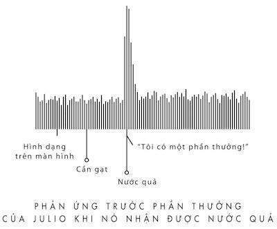
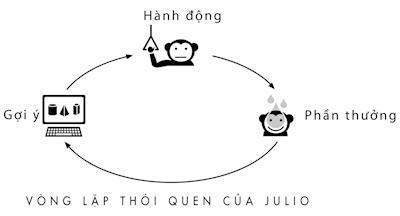
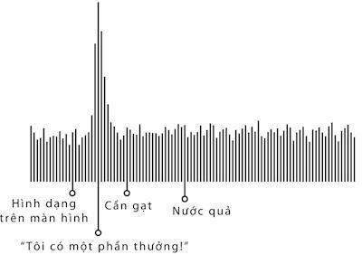
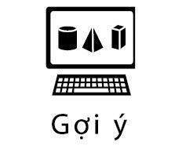
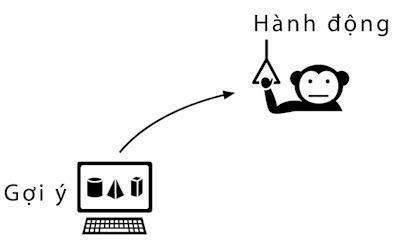
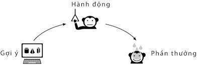
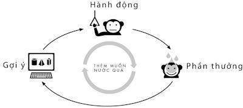
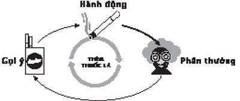
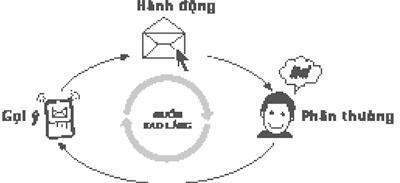
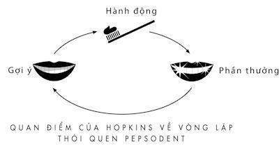

# 2. Não bộ của sự thèm muốn

### *Cách tạo thói quen mới*

Vào một ngày đầu những năm 1900, Claude C. Hopkins, một nhà quản trị xuất chúng người Mỹ đã được gặp một người bạn cũ đang có ý tưởng kinh doanh mới. Bạn của ông đã tìm thấy một sản phẩm độc đáo và thuyết phục ông về sự thành công của nó sau này. Đó là một loại kem đánh răng, một loại thuốc pha chế có bọt và có mùi bạc hà với tên gọi “Pepsodent.” Đã có vài nhà đầu tư ưa mạo hiểm chấp nhận tham gia, một người thì đang nắm giữ các hợp đồng bất động sản đang rớt giá, người khác thì theo tin đồn đang liên kết với các băng nhóm xã hội đen, nhưng vụ kinh doanh này hứa hẹn sẽ rất lớn. Vì thế, ông muốn hỏi liệu Hopkins có đồng ý giúp đỡ họ thiết kế một chiến dịch quảng cáo trên toàn quốc không.

Vào thời điểm đó, Hopkins đang là người đứng đầu trong một lĩnh vực kinh doanh đang bùng nổ nhưng không phổ biến trong nhiều thập kỷ trước: ngành quảng cáo. Ông chính là người đã thuyết phục người Mỹ mua bia Schlitz bằng cách quảng bá công ty đã dùng hơi nước để làm sạch chai lọ và bỏ qua thực tế rằng các công ty khác cũng làm điều tương tự. Ông cũng thuyết phục hàng triệu phụ nữ mua xà phòng Pamolive bằng lời khẳng định Cleopatra đã sử dụng nó, bỏ qua sự phản đối của các nhà Sử học. Ông đã làm nổi danh Puffed Wheat nhờ câu nói hạt lúa mỳ được thổi phồng đến 8 lần kích thước bình thường. Ông cũng đã làm cho hàng chục sản phẩm không nổi tiếng như Quaker Oats, lốp xe Goodyear, máy quét thảm Bissel, súp đậu Van Camp trở thành sản phẩm phổ biến rộng rãi. Và trong thời gian đó, nhờ sự giàu có của mình, ông đã dành nhiều trang trong cuốn tự truyện bán chạy nhất,** *My Life in Advertising*** (tạm dịch:** *Đời quảng cáo của tôi***), để nói về những khó khăn trong việc kiếm được nhiều tiền.

Claude Hopkins nổi tiếng với chuỗi quy luật ông đặt ra để giải thích cách tạo thói quen mới cho khách hàng. Những quy luật đó làm thay đổi hoàn toàn các ngành kinh doanh và cuối cùng trở thành kiến thức phổ thông của các nhà tiếp thị, nhà cải cách giáo dục, chuyên gia sức khỏe cộng đồng, chính trị gia và giám đốc điều hành. Cho đến hôm nay, những quy luật của Hopkins vẫn tác động đến mọi thứ từ cách chúng ta mua dụng cụ vệ sinh đến dụng cụ chính phủ sử dụng để chống lại dịch bệnh. Nó đóng vai trò quan trọng trong việc hình thành bất cứ thói quen mới nào.

Tuy nhiên, khi người bạn cũ đến tìm Hopkins về việc quảng cáo Pepsodent, ông không thích thú hay quan tâm cho lắm. Thực sự sức khỏe răng miệng của người Mỹ đang xuống dốc nhanh chóng. Khi mọi người khỏe mạnh hơn, họ bắt đầu mua số lượng lớn thức ăn đã chế biến và chứa nhiều đường. Khi chính phủ bắt đầu kêu gọi lực lượng cho Chiến tranh Thế giới thứ nhất, có quá nhiều lính mới mắc bệnh sâu răng nên các viên chức đã khẳng định vệ sinh răng miệng không tốt là một hiểm họa cho an ninh quốc gia.

Theo như Hopkins biết, kinh doanh kem đánh răng là một hành động tự tử tài chính. Đã có rất nhiều người bán hàng đến từng nhà chào hàng thuốc bột và thuốc tiên cho răng không rõ nguồn gốc và bị phá sản.

Vấn đề là hiếm có ai mua kem đánh răng vì dù đó là vấn đề răng miệng quốc gia thì cũng rất ít người đánh răng.

Vì vậy, Hopkins đã suy nghĩ về lời đề nghị của bạn mình và từ chối. Ông vẫn còn công việc với xà phòng và ngũ cốc, ông nói. “Tôi không tìm thấy một con đường nào để giải thích cho những người bình thường những lý thuyết chuyên môn về kem đánh răng”, ông giải thích trong cuốn tự truyện. Nhưng bạn của ông thì vẫn kiên trì. Ông ấy cứ tìm đến, đánh vào lòng tự trọng của Hopkins cho đến khi ông đồng ý tham gia.

“Cuối cùng tôi đồng ý tiến hành chiến dịch nếu anh ấy cho tôi quyền quyết định về vốn trong vòng 6 tháng,” Hopkins viết. Người bạn đã đồng ý.

Đó là quyết định đầu tư khôn ngoan nhất trong cuộc đời Hopkins.

Trong vòng 5 năm hợp tác, Hopkins đã đưa Pepsodent trở thành một trong những sản phẩm được biết đến hàng đầu trên thế giới và cùng lúc ông đã giúp tạo thói quen chải răng trên khắp đất nước với tốc độ chóng mặt. Chẳng mấy chốc, mọi người từ Shirley Temple đến Clark Gable đều khoe “nụ cười Pepsodent” của họ. Năm 1930, Pepsodent được bán ở Trung Quốc, Nam Phi, Braxin, Đức và gần như ở khắp mọi nơi Hopkins có thể quảng cáo. 10 năm sau chiến dịch Pepsodent đầu tiên, những người thăm dò ý kiến nhận thấy việc đánh răng đã trở thành một nghi thức đối với hơn một nửa dân số Mỹ. Hopkins đã giúp đưa việc đánh răng trở thành lề thói hàng ngày.

Sau này, Hopkins đã tiết lộ bí mật thành công của ông là ông đã tìm thấy một loại gợi ý và phần thưởng chắc chắn để tạo thói quen chung. Đó là một phép màu có tác động sâu sắc nên đến hôm nay, những nguyên tắc đơn giản đó vẫn được sử dụng trong thiết kế trò chơi video, kinh doanh thực phẩm, bệnh viện và cho hàng triệu người bán hàng trên thế giới. Eugene Paulty dạy chúng ta vòng lặp thói quen nhưng chính Claude Hopkins mới là người chỉ cho chúng ta thói quen mới hình thành và phát triển ra sao.

Vậy chính xác Hopkins đã làm những gì?

Ông tạo ra một sự thèm muốn. Và sự thèm muốn đó làm cho những gợi ý và phần thưởng có tác dụng. Sự thèm muốn đó đã tạo sức mạnh cho vòng lặp thói quen.

* * *

Trong suốt sự nghiệp của mình, một trong những thủ thuật đặc trưng của Claude Hopkins là tìm những lời khuyên đơn giản để thuyết phục khách hàng sử dụng sản phẩm của mình mỗi ngày. Ví dụ như, ông bán Quaker Oats như một loại ngũ cốc cho bữa sáng, bạn chỉ cần ăn một tô mỗi sáng thì bạn có thể có năng lượng suốt 24 giờ. Ông giới thiệu những loại thuốc bổ mà chỉ cần uống khi có triệu chứng đầu tiên thì có thể chữa những bệnh như đau dạ dày, đau khớp, da xấu và “bệnh phụ nữ”. Không lâu sau, mọi người ăn bột yến mạch cho bữa sáng hay uống một hơi những chai thuốc nhỏ màu nâu khi không may cảm thấy mệt mỏi hơn mọi ngày.

Để bán Pepsodent, Hopkins cần những lời khuyên cho việc sử dụng kem đánh răng hàng ngày. Ông nghiên cứu rất nhiều sách về răng miệng. “Đó chỉ là đọc khan,” ông viết. “Nhưng đến giữa một cuốn sách, tôi tìm thấy một đoạn nhắc đến bựa răng mà sau đó tôi gọi là ‘mảng bám’. Nó mang đến cho tôi một ý tưởng hấp dẫn. Tôi quyết định quảng cáo kem đánh răng như là thứ tạo nên vẻ đẹp và giải quyết mảng bám đó.”

Khi tập trung vào mảng bám răng, Hopkins phớt lờ sự thực rằng mảng bám này luôn phủ bên ngoài răng mọi người và dường như nó chẳng ảnh hưởng gì. Mảng bám hình thành trên răng bạn một cách tự nhiên bất kể bạn ăn gì hay bạn đánh răng thường xuyên thế nào. Mọi người không chú ý nhiều vào nó và cũng có rất ít lý do tại sao họ nên làm thế: Bạn không thể tống khứ được mảng bám bằng cách ăn một quả táo, chà ngón tay trên răng, chải răng hay súc miệng bằng nước thật mạnh trong miệng. Kem đánh răng không làm gì giúp bạn thoát khỏi mảng bám răng. Trên thực tế, một trong những nhà nghiên cứu răng miệng hàng đầu lúc đó đã có phát biểu, mọi kem đánh răng hay cụ thể Pepsodent là vô tác dụng.

Điều đó không làm Hopkins ngừng tiếp tục khám phá của mình. Ông quyết định đó sẽ là một gợi ý để tạo ra thói quen. Chẳng lâu sau, các thành phố tràn ngập quảng cáo của Pepsodent.

“Chỉ cần lướt ngón tay dọc răng bạn, bạn sẽ cảm thấy mảng bám, nguyên nhân làm cho răng bạn xỉn màu và dễ bị sâu răng”, một quảng cáo nêu lên.

“Hãy chú ý xem bao nhiêu người có hàm răng đẹp ở khắp mọi nơi,” một quảng cáo khác khắc họa vẻ đẹp của nụ cười. “Hàng triệu người đang sử dụng một phương pháp mới để làm sạch răng. Tại sao chẳng có phụ nữ nào có mảng bám xỉn màu trên răng họ? Pepsodent đánh bay mảng bám!”

Sự sáng suốt của những lời thuyết phục đó dựa trên một gợi ý – mảng bám răng – một thứ rất phổ biến và không thể bỏ qua. Nói ai đó đưa ngón tay lướt dọc răng họ, có vẻ thực sự họ sẽ làm theo như thế. Và khi họ làm, họ sẽ cảm thấy mảng bám. Hopkins đã tìm thấy một gợi ý đơn giản, lâu đời, rất dễ tạo ra mà một quảng cáo có thể khiến mọi người tự động làm theo.

Hơn nữa, như Hopkins hình dung ra, phần thưởng còn hấp dẫn hơn. Sau cùng, ai không muốn được đẹp hơn? Ai không muốn một nụ cười xinh hơn? Đặc biệt khi chỉ cần đánh răng nhanh với Pepsodent?

Sau khi tiến hành chiến dịch, một tuần im ắng trôi qua. Rồi hai tuần nữa. Đến tuần thứ ba, nhu cầu bùng nổ. Có quá nhiều đơn đặt hàng Pepsodent nên công ty không thể đáp ứng kịp. Trong ba năm, sản phẩm được mở rộng ra thị trường quốc tế và quảng cáo của Hopkins có ở cả Tây Ban Nha, Đức và Trung Quốc. Trong 10 năm, Pepsodent là một trong những sản phẩm bán chạy hàng đầu trên thế giới và là kem đánh răng bán chạy nhất nước Mỹ trong hơn 30 năm.

Trước khi có Pepsodent, chỉ 7% người Mỹ có một ống kem đánh răng trong tủ thuốc. 10 năm sau khi chiến dịch quảng cáo của Hopkins phát triển trên cả nước, con số đó đã tăng đến 65%. Đến cuối Chiến tranh Thế giới thứ hai, sự quan tâm của quân đội về răng miệng của lính mới đã giảm xuống vì rất nhiều binh lính đánh răng mỗi ngày.

Một vài năm sau khi sản phẩm xuất hiện trên kệ, Hopkins viết: “Tôi kiếm đươc một triệu đô-la từ Pepsodent.” Ông nói, điều then chốt là ông đã “biết đúng tâm lý con người.” Tâm lý đó dựa trên hai nguyên tắc cơ bản:

Một là, tìm một gợi ý đơn giản và rõ ràng.

Hai là, xác định rõ ràng những phần thưởng.

Hopkins hứa hẹn, nếu bạn tìm được đúng những điều đó, nó giống như phép màu. Hãy xem Pepsodent: Ông đã xác định một gợi ý – mảng bám răng – và một phần thưởng – hàm răng đẹp – đã thuyết phục hàng triệu người bắt đầu một việc làm mỗi ngày. Cho đến hôm nay, những quy tắc của Hopkins là chủ đề của nhiều sách tiếp thị và là nền tảng của hàng triệu chiến dịch quảng cáo.

Và những nguyên tắc đó đã được dùng để tạo hàng ngàn thói quen khác mà mọi người thường không nhận ra nó tuân thủ chặt chẽ công thức của Hopkins như thế nào. Chẳng hạn, những nghiên cứu về người tạo được thói quen tập thể dục mới thành công cho thấy họ thường tuân theo một kế hoạch luyện tập nếu họ chọn một gợi ý nhất định như chạy bộ ngay lúc đi làm về và một phần thưởng rõ ràng như một cốc bia hay một buổi tối xem tivi thoải mái. Nghiên cứu về chế độ ăn kiêng cho thấy tạo một thói quen ăn uống mới cần một gợi ý định trước như lên thực đơn và những phần thưởng đơn giản cho người ăn kiêng khi họ làm theo ý định.

“Theo thời gian, quảng cáo dần trở thành một loại khoa học,” Hopkins viết. “Quảng cáo, một khi dám mạo hiểm và theo đúng hướng phát triển, sẽ trở thành một trong những loại hình kinh doanh an toàn nhất.”

Đó quả là một lời khoe khoang. Tuy nhiên, có vẻ hai quy tắc của Hopkins vẫn chưa đủ. Để tạo thói quen, cần có một quy tắc thứ ba, một quy tắc mà Hopkins đã dựa vào nhưng không hề biết đến sự tồn tại của nó. Nó giải thích mọi thứ từ việc tại sao thật khó để bỏ qua một hộp bánh nướng đến làm thế nào đi bộ thể dục buổi sáng trở thành một hoạt động hàng ngày mà không cần sự nỗ lực.

Các nhà khoa học và các nhà quản trị tiếp thị tại Procter & Gamble tụ họp quanh một cái bàn cũ trong một căn phòng nhỏ, không có cửa sổ và đang đọc bản ghi cuộc phỏng vấn một người phụ nữ đang nuôi 9 con mèo, cuối cùng, một trong số họ nói lên những gì mọi người đang nghĩ.

“Nếu chúng ta mệt mỏi, điều gì sẽ xảy ra?” cô ấy hỏi. “Bảo vệ có xuất hiện và đưa chúng ta ra ngoài hay chúng ta bị cảnh cáo trước?”

Người đội trưởng, một ngôi sao nổi danh trước kia trong công ty tên là Drake Stimson, nhìn chằm chằm vào cô ấy.

“Tôi không biết,” anh nói. Đầu tóc anh bù xù, đôi mắt mệt mỏi. “Tôi chưa bao giờ nghĩ mọi việc sẽ trở nên xấu đi. Họ nói với tôi chạy dự án này là quảng cáo.”

Bỏ qua lời quyết đoán của Hopkins rằng quá trình bán thứ gì đó sẽ trở nên hoàn toàn không khoa học như thế nào, đến năm 1996, nhóm người tụ tập quanh chiếc bàn đó được tìm thấy. Họ làm việc cho một trong những công ty kinh doanh hàng tiêu dùng lớn nhất thế giới, công ty chính của khoai tây rán Pringles, Oil of Olay, khăn giấy Bounty, mỹ phẩm CoverGirl, Dawn, Downy và Duracell cũng như hàng chục nhãn hàng khác. P&G thu thập số liệu nhiều hơn bất kỳ thương hiệu nào trên thế giới và dựa trên những phương pháp thống kê phức tạp để thiết kế chiến dịch tiếp thị của mình. Công ty đó rất thành công trong việc tìm ra cách để bán hàng. Chỉ riêng trên thị trường sản phẩm làm sạch quần áo, sản phẩm của P&G đã giúp làm giảm được một nửa gánh nặng về quần áo cho người Mỹ. Lợi nhuận hàng năm lên đến 35 tỷ đô-la.

Tuy nhiên, đội của Stimson đang trên bờ vực thất bại khi được giao thiết kế chiến dịch quảng cáo cho một trong những sản phẩm mới đầy hứa hẹn của P&G. Công ty đã dành hàng tỷ đô-la để phát triển một loại chất phun khử mọi mùi khó chịu bám trên bất kỳ loại vải nào. Và những nhà nghiên cứu trong căn phòng nhỏ không có cửa sổ ấy không có ý tưởng nào để thuyết phục mọi người mua nó.

Ba năm trước, khi một trong những nhà hóa học của P&G nghiên cứu một hóa chất tên hydroxypropyl beta cyclodextrin, hay HPBCD trong phòng thí nghiệm đã tạo ra chất phun khử mùi đó. Nhà hóa học đó là một người nghiện thuốc lá. Quần áo của ông thường có mùi giống như gạt tàn thuốc lá. Một ngày nọ, sau khi làm việc với HPBCD và về nhà, vợ ông chào đón ông ở cửa.

“Anh bỏ thuốc lá rồi à?” bà ấy hỏi ông.

“Không,” ông trả lời. Ông thấy nghi ngờ. Nhiều năm nay rồi, bà cứ nhắc mãi với ông chuyện bỏ thuốc lá. Nó giống như một cú lừa tâm lý đã được chuẩn bị sẵn.

“Người ông không có mùi thuốc lá nữa rồi,” bà ấy nói.

Ngày hôm sau, ông quay trở lại phòng thí nghiệm và bắt đầu thử nghiệm HPBCD với nhiều mùi khác nhau. Ông có hàng trăm lọ nhỏ chứa sợi vải có những mùi như chó bị ướt, xì-gà, mồ hôi tất, món ăn Trung Hoa, quần áo bị mốc và khăn tắm bẩn. Khi ông cho HPBCD vào nước và phun lên mẫu thử, những mùi đó bị hút vào các phân tử hóa chất. Sau khi làm khô sương phun, mùi đã biến mất.

Khi nhà hóa học giải thích sáng chế của mình cho ban quản trị của P&G, họ hoàn toàn bị thuyết phục. Nhiều năm rồi, nghiên cứu thị trường cho thấy nhu cầu lớn của khách hàng về thứ gì có thể làm mất những mùi khó chịu, không phải là át mùi mà là làm mất hoàn toàn. Khi một đội nghiên cứu thị trường phỏng vấn khách hàng, họ biết được nhiều người thường để áo choàng hay quần bên ngoài sau một đêm ở quán bar hay một bữa tiệc. “Quần áo của tôi thường có mùi giống thuốc lá khi tôi về nhà nhưng tôi không muốn phải trả tiền giặt khô mỗi lần ra ngoài,” một người phụ nữ nói.

Nhận thấy đó là một cơ hội, P&G đã thực hiện một kế hoạch bí mật để đưa HPBCD trở thành một sản phẩm khả thi. Công ty dành hàng triệu đô để hoàn thành công thức và cuối cùng tạo ra một chất lỏng không màu, không mùi, có thể thổi bay bất kỳ mùi khó chịu nào. Kỹ thuật của loại chất phun đó rất tiên tiến nên NASA cuối cùng sử dụng nó để làm sạch bên trong tàu con thoi mỗi lần họ trở về từ không gian. Điều tốt nhất là nó không cần nhiều tiền để sản xuất ra, không để lại vết bẩn và có thể tẩy mùi tốt trên ghế dài, áo vét cũ hay bên trong ô tô. Dự án đó là một cuộc mạo hiểm lớn, nhưng nếu P&G có chiến dịch tiếp thị tốt, công ty có thể kiếm được hàng tỷ đô-la.

Họ quyết định gọi nó là Febreze và đề nghị Stimson, một thiên tài 31 tuổi có nền tảng về toán học và tâm lý học, dẫn dắt đội. Stimson cao ráo và đẹp trai, có cằm nhọn, giọng nói nhẹ nhàng và vị giác tinh tế. (“Tôi thà để con tôi hút cần sa còn hơn là ăn ở McDonald’s,” anh ấy đã một lần nói với đồng nghiệp như vậy.) Trước khi vào P&G, anh đã làm việc 5 năm ở Phố Wall để xây dựng mô hình Toán học cho việc lựa chọn cổ phiếu. Khi anh chuyển đến CinCinnati – nơi có trụ sở của P&G, anh được liên hệ để giúp kinh doanh nhiều mặt hàng quan trọng như giấy thơm Bounce và Downy. Nhưng Febreze thì lại khác. Đó là cơ hội để tung ra một loại sản phẩm hoàn toàn mới, chưa từng có từ trước đến giờ để thêm vào giỏ mua sắm của khách hàng. Tất cả những gì Stimson cần là tìm ra cách để đưa Febreze thành một thói quen và là sản phẩm sẽ nổi bật trên các kệ hàng. Điều đó sẽ khó khăn thế nào?

Stimson và các đồng nghiệp giới thiệu Febreze ở vài thị trường thử nghiệm như Phoenix, Salt Lake City và Boise. Họ đến, phát mẫu thử và hỏi mọi người liệu họ có thể đến nhà không. Trong hơn hai tháng, họ ghé đến hàng trăm hộ gia đình. Khi họ đến thăm nhà một nhân viên kiểm lâm ở Phoenix, họ đã có bước tiến triển lớn đầu tiên. Nhân viên kiểm lâm là nữ giới khoảng hơn 20 tuổi và sống một mình. Công việc của cô là bắt lại những động vật chạy ra khỏi vùng đất rừng. Cô đã bắt chó sói đồng cỏ, gấu trúc Mỹ, sư tử núi. Và chồn hôi. Rất nhiều chồn hôi. Chúng thường phun dịch hôi vào cô mỗi khi bị bắt.

“Tôi độc thân, tôi muốn tìm ai đó và có con,” người nhân viên nói với Stimson và đồng nghiệp của anh khi họ đang ngồi trong phòng khách. “Tôi đã có rất nhiều buổi hẹn hò. Mọi người biết đấy, tôi nghĩ mình cũng hấp dẫn? Tôi thông minh và tôi cảm thấy mình là người thích hợp để kết hôn.”

Nhưng tình yêu của cô thường không suôn sẻ, cô giải thích, vì mọi thứ trong cuộc sống của cô đều có mùi giống chồn hôi. Nhà, xe, quần áo, giày ống, tay và cả rèm cửa của cô. Thậm chí cả giường của cô. Cô đã thử mọi cách để làm mất mùi. Cô mua xà phòng và dầu gội đầu đặc biệt. Cô dùng nến thơm và mua nhiều máy làm sạch thảm đắt tiền. Nhưng chẳng có cái nào hiệu quả.

“Khi đang hẹn hò, tôi sẽ ngửi thấy một mùi gì đó giống như chồn hôi và bắt đầu ám ảnh nó,” cô nói với họ. “Tôi bắt đầu tự hỏi liệu anh ấy có ngửi thấy nó? Điều gì sẽ xảy ra nếu tôi đưa anh ấy về nhà và anh ấy muốn ra khỏi nhà?”

“Năm ngoái, tôi đã hẹn hò 4 lần với một chàng trai rất tốt và tôi thực sự thích, tôi đã chờ rất lâu để mời anh đến nhà tôi. Cuối cùng, anh ấy đến và tôi nghĩ mọi thứ sẽ tốt đẹp. Ngày hôm sau, anh ấy nói anh ấy muốn chia tay. Anh rất tế nhị về việc đó nhưng tôi luôn tự hỏi, có phải là do cái mùi đó?”

“Vâng, tôi rất vui khi cô đã thử dùng Febreze,” Stimson nói. “Cô thấy nó thế nào?”

Cô nhìn Stimson. Cô đang khóc.

“Tôi muốn cảm ơn,” cô nói. “Loại thuốc phun này đã thay đổi cuộc đời tôi.”

Sau khi nhận mẫu thử Febreze, cô trở về nhà và phun lên ghế dài. Cô cũng phun rèm cửa, thảm, khăn trải giường, quần jean, đồng phục và cả bên trong xe ô tô. Ống phun đầu tiên hết, cô lấy tiếp một ống khác và phun lên mọi thứ còn lại.

“Tôi đã nhờ tất cả bạn mình ghé qua nhà,” cô nói. “Họ không còn ngửi thấy gì. Mùi chồn hôi đã biến mất.”

Cô khóc nhiều hơn nên một đồng nghiệp của Stimson vỗ nhẹ lên vai cô. “Cảm ơn rất nhiều,” cô nói. “Tôi cảm thấy rất thoải mái. Cảm ơn. Sản phẩm này rất quan trọng với tôi.”

Stimson ngửi không khí trong phòng khách của cô. Anh không ngửi thấy mùi gì. Anh nghĩ,** *chúng ta sẽ phát tài nhờ thứ này.***

* * *

Stimson cùng cả đội trở về trụ sở của P&G và bắt đầu xem lại chiến dịch tiếp thị họ đang định giới thiệu. Họ quyết định chìa khóa để bán được Febreze là truyền cảm giác nhẹ nhõm mà nhân viên kiểm lâm đó có được. Họ xác định vị trí của Febreze là thứ giúp mọi người xóa bỏ những mùi gây xấu hổ. Tất cả họ đều quen thuộc với những quy tắc của Hopkins hay những hiện thân hiện đại của nó trong nhiều sách về kinh doanh. Họ muốn giữ quảng cáo thật đơn giản: Tìm một gợi ý rõ ràng và một phần thưởng xác định.

Họ thiết kế hai mẫu quảng cáo trên ti vi. Cái đầu tiên quay một người phụ nữ nói về khu vực hút thuốc của nhà hàng. Mỗi lần cô ăn ở đó, áo khoác của cô thường có mùi khói thuốc. Một người bạn nói với cô nếu dùng Febreze, nó sẽ làm bay mùi. Gợi ý: mùi thuốc lá. Phần thưởng: quần áo không còn mùi đó. Quảng cáo thứ hai là về một người phụ nữ đang lo lắng về con chó của cô, Sophie, luôn ngồi trên cái ghế dài. “Sophie sẽ luôn có mùi của nó,” cô nói, nhưng với Febreze, “bây giờ đồ dùng của tôi không có mùi giống nó nữa.” Gợi ý: mùi vật nuôi trong nhà, điều mà 79 triệu hộ gia đình có vật nuôi đang gặp phải. Phần thưởng: một căn nhà không có mùi giống như cái chuồng chó.

Năm 1996, Stimson và các đồng nghiệp bắt đầu cho quảng cáo ở các thành phố đã thử nghiệm. Họ phát mẫu thử, đặt quảng cáo vào hòm thư và trả tiền cho các quầy tạp hóa để đặt thật nhiều Febreze gần quầy tính tiền. Sau đó họ tạm nghỉ ngơi và tính trước sẽ dùng tiền thưởng thế nào.

Một tuần trôi qua. Rồi hai tuần. Một tháng. Hai tháng. Việc bán hàng bắt đầu kém dần đi. Vì lo lắng, công ty đã cử người nghiên cứu đến các cửa hàng tìm hiểu chuyện gì đang xảy ra. Chưa ai đụng tới các kệ xếp đầy ống Febreze. Họ bắt đầu đến thăm các bà nội trợ đã nhận mẫu thử.

“Ồ, vâng!” một trong số họ nói với một nhà nghiên cứu của P&G. “Ống phun! Tôi nhớ rồi. Xem nào.” Người phụ nữ quỳ xuống sàn bếp và bắt đầu tìm kiếm ngăn tủ dưới bồn rửa. “Tôi đã dùng nó một thời gian, nhưng sau đó tôi lại quên mất. Tôi nghĩ nó ở đâu đây thôi.” Cô đứng lên vì chẳng thấy gì. “Có thể nó ở trong tủ để đồ?” Cô bước đến và đẩy mấy cây chổi sang một bên. “À! Nó đây rồi! Ở phía sau! Anh thấy không? Nó vẫn nằm gần đây. Anh có muốn lấy lại không?”

Febreze là thứ vô dụng.

Đối với Stimson, đó là một thảm họa. Các đối thủ cạnh tranh ở các chi nhánh khác nhận thấy một cơ hội khác trong sự thất bại đó. Anh nghe thấy những tin đồn, có ai đó đang vận động hành lang để xóa bỏ Febreze và đưa anh trở lại làm việc ở sản phẩm tóc Nicky Clarke, một loại hàng tiêu dùng tương đương ở Siberia.

Một trong những chủ tịch chi nhánh của P&G triệu tập một cuộc họp khẩn và thông báo họ phải cắt giảm thiệt hại của Febreze trước khi thành viên hội đồng bắt đầu chất vấn. Cấp trên của Stimson đứng dậy và đưa ra một lời bào chữa. “Vẫn có cơ hội để xoay chuyển mọi thứ,” ông nói. “Ít nhất hãy yêu cầu các tiến sĩ tìm hiểu chuyện gì đang xảy ra.” P&G vừa tuyển dụng từ Stanford, Carnegie Mellon và mọi nơi khác những nhà khoa học được cho là chuyên gia nghiên cứu tâm lý khách hàng. Chủ tịch chi nhánh đồng ý kéo dài thời gian cho sản phẩm này.

Vì thế, một nhóm mới các nhà nghiên cứu gia nhập nhóm của Stimson và bắt đầu tiến hành nhiều cuộc phỏng vấn hơn. Khi họ đến nhà một phụ nữ bên ngoài Phoenix, họ đã có được lời gợi ý đầu tiên về sự thất bại của Febreze. Họ có thể ngửi thấy mùi 9 con mèo trước khi họ bước vào nhà. Tuy nhiên, trong nhà lại rất sạch sẽ và gọn gàng. Người phụ nữ giải thích mình là một người ưa ngăn nắp. Bà hút bụi mỗi ngày và không thích mở cửa sổ vì gió sẽ thổi bụi vào nhà. Khi Stimson và các nhà khoa học bước vào phòng khách nơi những con mèo sống, một người đã phải che miệng lại vì mùi bốc lên quá nặng.

“Bà làm thế nào với mùi mèo này?” một nhà khoa học hỏi người phụ nữ.

“Nó không phải là vấn đề,” bà nói.

“Bà để ý đến mùi đó thường xuyên thế nào?”

“Ồ, khoảng một tháng một lần,” người phụ nữ trả lời.

Các nhà nghiên cứu bối rối nhìn nhau.

“Bây giờ bà có ngửi thấy nó không?” một nhà khoa học hỏi.

“Không,” bà đáp.

Tình cảnh đó lặp lại ở hàng chục căn hộ có mùi khác mà các nhà nghiên cứu đã ghé đến. Mọi người không thể nhận ra hầu hết các mùi khó chịu trong cuộc sống của họ. Nếu bạn sống với 9 con mèo, bạn sẽ dần quen với mùi của nó. Nếu bạn hút thuốc, nó gây tổn thương đến khả năng khứu giác nên bạn không còn ngửi thấy mùi khói. Stimson nhận ra rằng điều đó giải thích tại sao không ai dùng Febreze. Gợi ý của sản phẩm – thứ được cho là có tác động đến việc sử dụng hàng ngày – bị che giấu với những người cần nó nhất. Người ta không để ý thường xuyên những mùi khó chịu đó để tạo nên thói quen. Kết quả là Febreze bị vứt đằng sau tủ đựng đồ. Những người có khuynh hướng dùng ống phun nhất không bao giờ ngửi được những mùi nhắc nhở họ dùng chúng cho phòng khách của mình.

Đội của Stimson trở về trụ sở, họp nhau lại trong một phòng họp không có cửa sổ và đọc lại bản ghi cuộc phỏng vấn người phụ nữ có 9 con mèo. Nhà tâm lý học đặt câu hỏi, điều gì sẽ xảy ra nếu anh bị sa thải. Stimson lấy tay úp mặt. Nếu anh ấy không thể bán Febreze cho người phụ nữ có 9 con mèo, anh tự hỏi có thể bán nó cho ai nữa? Làm sao để xây dựng thói quen mới khi không có gợi ý nào tác động đến việc sử dụng và khi khách hàng cần nó nhất lại không coi trọng phần thưởng?

Phòng thí nghiệm của Wolfram Schultz, một giáo sư thần kinh học thuộc Đại học Cambridge, không phải là nơi thú vị. Đồng nghiệp mô tả bàn của ông là một hố đen hay làm mất tài liệu vĩnh viễn và là đĩa Petri nơi vi khuẩn có thể sinh sôi, tăng trưởng nhanh chóng và không bị gì ngăn cản qua nhiều năm. Khi Schultz cần lau dọn gì đó khác thường, ông không dùng ống phun hay chất tẩy rửa. Ông thấm ướt khăn giấy và cọ thật mạnh. Nếu quần áo của ông có mùi thuốc lá hay lông mèo, ông cũng chẳng để ý hay quan tâm đến.

Tuy nhiên, những thí nghiệm Schultz tiến hành hơn 20 năm qua đã thay đổi hiểu biết của chúng ta về cách gợi ý, phần thưởng và thói quen tương tác thế nào. Ông đã giải thích tại sao vài gợi ý và phần thưởng lại có nhiều tác động hơn những cái khác và đưa ra bản đồ khoa học giải thích tại sao Pepsodent là một thành công, làm thế nào nhiều người ăn kiêng và người thích thể dục thay đổi thói quen rất nhanh, và cuối cùng cần có gì để bán được Febreze.

Vào những năm 1980, Schultz ở trong nhóm các nhà khoa học nghiên cứu bộ não của khỉ khi chúng học để thực hiện vài hoạt động nhất định như nhấn cần gạt hay mở móc gài. Mục tiêu của họ là tìm ra phần nào trong não bộ chịu trách nhiệm cho hành động mới.

“Một ngày nọ, tôi nhận ra điều này rất thú vị,” Schultz nói với tôi. Ông sinh ra ở Đức và bây giờ khi ông nói tiếng Anh, nghe có vẻ giống Arnold Schwarzenegger nếu Kẻ hủy diệt là một thành viên của Hội Hoàng gia. “Một vài con khỉ chúng tôi nghiên cứu thích nước táo ép, những con khác thì thích nước nho ép và tôi bắt đầu tự hỏi điều gì đang diễn ra trong đầu những con khỉ này? Tại sao những phần thưởng khác nhau lại có tác động khác nhau đến não bộ?”

Schultz bắt đầu chuỗi thí nghiệm để giải mã phần thưởng tác động như thế nào trên mức độ thần kinh học. Vào những năm 1990, khi công nghệ tiến bộ, ông tiếp cận những thiết bị mà các nhà nghiên cứu ở MIT đã sử dụng. Tuy nhiên, ngoài chuột, Schultz còn hứng thú với khỉ như Julia, một con khỉ đuôi ngắn nặng 3,6 kg, có đôi mắt màu nâu lục nhạt và có một điện cực rất mảnh gắn vào não bộ cho phép Schultz quan sát các hoạt động thần kinh khi nó xảy ra.

Một ngày nọ, Schultz đặt Julio vào một cái ghế trong một phòng được chiếu sáng mờ mờ và bật một màn hình máy vi tính lên. Nhiệm vụ của Julio là nhấn một cần gạt khi những hình ảnh có màu sắc xuất hiện trên màn hình – những xoắn ốc nhỏ màu vàng, những đường cong màu đỏ hay những đường thẳng màu xanh. Nếu Julio nhấn cần gạt khi một hình xuất hiện, một giọt quả mâm xôi theo đường ống gắn từ trần sẽ nhỏ vào miệng nó.

Julia thích nước quả mâm xôi.

Đầu tiên, Julio không mấy hứng thú với những gì đang có trên màn hình. Phần lớn thời gian nó cố cựa quậy để thoát khỏi cái ghế. Nhưng ngay khi một giọt nước quả đầu tiên rớt xuống, Julio bắt đầu tập trung vào màn hình. Khi con khỉ bắt đầu hiểu ra qua hàng chục lần lặp lại, rằng những hình trên màn hình là gợi ý cho một hành động (nhấn cần gạt) dẫn đến phần thưởng (nước quả mâm xôi), nó bắt đầu nhìn chằm chằm vào màn hình với sự tập trung cao độ. Nó không cựa quậy nữa. Khi một đường cong màu vàng xuất hiện, con khỉ tiến đến cái cần gạt. Khi một đường màu xanh lóe lên, nó vồ lấy cái cần gạt. Và khi có nước quả, Julio liếm môi một cách thỏa mãn.

Khi Schultz xem xét hành động trong não của Julio, ông thấy một mô hình hình thành. Khi Julio nhận được phần thưởng, hoạt động não của nó tăng lên, thể hiện nó đang hạnh phúc. Một bản ghi hoạt động thần kinh cho thấy não bộ con khỉ nói lên đúng bản chất, “Tôi nhận được phần thưởng!”

Schultz lặp lại cùng một thí nghiệm với Julio nhiều lần và ghi lại phản ứng thần kinh mỗi lần. Khi Julio nhận nước quả, mô hình “Tôi nhận được phần thưởng!” xuất hiện trên màn hình do kết nối với điện cực trong đầu con khỉ. Từ góc nhìn thần kinh học, lề thói của Julia dần dần trở thành thói quen.

Tuy nhiên, điều hấp dẫn nhất với Schultz là cách mọi thứ thay đổi khi ông tiến hành thí nghiệm. Khi con khỉ bắt đầu thành thạo hành động đó hơn – khi thói quen trở nên mạnh hơn – não bộ của Julio bắt đầu đoán trước được nước quả mâm xôi sẽ đến. Điện cực của Schultz bắt đầu ghi lại mô hình “Tôi nhận được phần thưởng!” ngay khi Julio thấy hình màu trên màn hình, ngay cả trước khi có nước quả:

HIỆN GIỜ, PHẢN ỨNG TRƯỚC PHẦN THƯỞNG CỦA JULIO XẢY RA TRƯỚC KHI CÓ NƯỚC QUẢ

Nói cách khác, hình màu trên màn hình trở thành một gợi ý không chỉ cho việc nhấn cần gạt mà còn cho phản ứng thỏa mãn bên trong não con khỉ. Julio bắt đầu mong đợi phần thưởng ngay khi nó nhìn thấy xoắn ốc màu vàng và đường cong màu đỏ.

Sau đó, Schultz điều chỉnh lại thí nghiệm. Trước đó, Julio nhận được nước quả ngay khi nó chạm vào cần gạt. Bây giờ, đôi lúc không hề có nước quả cho dù Julio thực hiện hoàn toàn đúng. Hay sẽ có nước quả chậm hơn một lúc. Hay nước quả bị pha loãng đi chỉ còn ngọt một nửa so với lúc đầu.

Khi không có nước quả, chậm hơn hay bị loãng đi, Julio nổi giận và tạo tiếng ồn khó chịu hay trở nên chán nản. Và trong não của Julio, Schultz thấy một mô hình mới hình thành: sự thèm muốn. Khi Julio mong chờ nước quả nhưng không nhận được, một mô hình thần kinh gắn với sự thèm muốn và thất vọng hình thành bên trong não nó. Khi Julio nhìn thấy gợi ý, nó bắt đầu mong đợi niềm vui có nước quả. Nhưng nếu nước quả không đến, niềm vui đó trở thành sự thèm muốn mà nếu không được thỏa mãn, Julio sẽ nổi giận hay chán nản.

Những nhà nghiên cứu ở các phòng thí nghiệm khác cũng tìm thấy mô hình tương tự. Những con khỉ khác được huấn luyện để mong đợi nước quả mỗi lần chúng trông thấy một hình ảnh trên màn hình. Sau đó, các nhà nghiên cứu thử làm chúng xao lãng. Họ mở cửa phòng thí nghiệm, nên con khỉ có thể ra ngoài và chơi với bạn của nó. Họ để thức ăn trong một góc nên con khỉ có thể ăn nếu nó không làm thí nghiệm.

Đối với những con khỉ không phát triển một thói quen bền vững, sự xao lãng có hiệu quả. Nó trượt khỏi cái ghế, ra khỏi phòng và không bao giờ nhìn lại. Nó không học để thèm muốn nước quả. Tuy nhiên, một khi con khỉ đã hình thành thói quen – một khi não nó mong đợi phần thưởng – việc xao lãng không có ảnh hưởng gì. Con vật sẽ ngồi đó, xem màn hình và nhấn cần gạt nhiều lần cho dù có thức ăn sẵn hay cơ hội để ra ngoài. Sự mong đợi và cảm giác thèm muốn quá lớn nên con khỉ cứ gắn chặt vào màn hình, giống như một người đánh bạc sẽ tiếp tục chơi khi vừa thua hết toàn bộ phần thắng.

Điều đó giải thích tại sao thói quen có tác động lớn lao: Nó tạo ra sự thèm muốn trong thần kinh. Phần lớn thời gian, sự thèm muốn đó xuất hiện rất thường xuyên nên chúng ta không thật sự biết nó có tồn tại và không biết đến ảnh hưởng của nó. Nhưng khi chúng ta kết hợp gợi ý với phần thưởng nhất định, sự thèm khát thuộc về tiềm thức xuất hiện trong não và bắt đầu vòng lặp thói quen. Ví dụ, một nhà nghiên cứu ở Cornell tìm ra sự thèm khát thức ăn và mùi có ảnh hưởng mạnh mẽ thế nào đến lề thói khi ông chú ý cách các cửa hàng Cinnabon được chia vị trí trong các trung tâm thương mại. Nhiều người bán thức ăn mở quán ở khu ăn uống, nhưng Cinnabon lại thử mở cửa hàng cách xa những khu ăn uống đó. Tại sao? Bởi vì nhà điều hành của Cinnabon muốn mùi bánh mì quế lan đến tiền sảnh và các khu xung quanh không bị ngắt quãng, vì thế người mua sắm sẽ vô thức bắt đầu thèm một cái bánh. Ngay lúc một khách hàng rẽ qua và thấy cửa hàng Cinnabon, sự thèm muốn sẽ như một con quái vật đang gầm gừ bên trong đầu họ và không nghĩ ngợi, họ sẽ đưa tay tìm ví. Vòng lặp thói quen đang quay vì cảm giác thèm muốn đã xuất hiện.

“Chẳng có gì được lập trình trong não chúng ta, làm cho chúng ta khi thấy một hộp bánh nướng thì tự động muốn một bữa tiệc ngọt,” Schultz nói với tôi. “Nhưng một khi não chúng ta học được rằng một hộp bánh nướng chứa đường ngon tuyệt và các loại các-bon-hy-đrát khác, nó sẽ bắt đầu mong chờ nhiều đường hơn. Não chúng ta sẽ thúc đẩy ta về phía cái hộp. Sau đó, nếu chúng ta không ăn bánh nướng, chúng ta sẽ thấy thất vọng.”

Để hiểu quá trình này, hãy xem thói quen của Julio hình thành thế nào. Đầu tiên, nó thấy một hình ảnh trên màn hình:

Qua thời gian, Julio học được rằng sự xuất hiện của hình ảnh nghĩa là lúc cần thực hiện một hành động. Vì thế nó nhấn cái cần gạt:

Kết quả là Julio nhận được một giọt nước quả mâm xôi.

Đó là bài học căn bản. Thói quen chỉ hình thành khi Julio bắt đầu thèm muốn nước quả khi nó nhìn thấy gợi ý. Một khi có sự thèm muốn đó, Julio sẽ tự động thực hiện. Nó sẽ làm theo thói quen:

VÒNG LẶP THÓI QUEN CỦA JULIO

Đó là cách thói quen mới được hình thành: bằng cách đặt một gợi ý, một hành động và một phần thưởng cùng nhau, sau đó tạo một sự thèm khát làm động lực cho vòng lặp. Lấy việc hút thuốc lá làm ví dụ. Khi một người nghiện thuốc thấy một gợi ý – như một gói Marlboros – não bộ bắt đầu mong chờ mùi thuốc.

Để não bộ có sự thèm muốn hơi thuốc thì chỉ cần dấu hiệu của điếu thuốc là đủ. Nếu không có điếu thuốc, sự thèm muốn sẽ tiếp tục tăng cho đến khi người hút thuốc vớ lấy một điếu Marlboro mà không nghĩ ngợi gì.

Hay xem ví dụ về thư điện tử. Khi máy vi tính báo hiệu hay điện thoại rung lên mỗi lần có tin nhắn mới, não bộ bắt đầu thúc đẩy sự xao lãng nhất thời khi nghĩ đến việc mở thư điện tử. Nếu sự mong đợi đó không được thỏa mãn thì nó sẽ tiếp tục cho đến khi chủ nhân vì sốt ruột sẽ kiểm tra điện thoại BlackBerry đang rung lên của họ dưới gầm bàn dù đang trong một cuộc họp và họ biết đó chỉ là kết quả trận bóng đá mới nhất với một đội hình lý tưởng. (Nói cách khác, nếu ai đó không để chế độ rung điện thoại – và vì thế loại bỏ gợi ý – họ có thể làm việc nhiều giờ liền mà không nghĩ đến việc kiểm tra hộp thư đến.)

Các nhà khoa học đã nghiên cứu não bộ của người nghiện rượu, người nghiện thuốc lá, người ăn uống quá mức và xác định được cách hệ thần kinh của họ – cấu trúc của não bộ và sự lưu thông các chất thần kinh bên trong não – thay đổi khi sự thèm khát bắt đầu ăn sâu. Theo 2 nhà nghiên cứu tại Đại học Michigan, thông thường thói quen bền vững tạo ra những phản ứng như bị nghiện nên “tăng tiến thành sự ám ảnh thèm muốn” có thể làm não bộ tự động hóa, “dù cho có phải đối mặt với những chuyện tồi tệ nhất như mất danh tiếng, công việc, nhà cửa và gia đình.”

Tuy nhiên, sự thèm khát đó không tác động hoàn toàn đến chúng ta. Chương tiếp theo sẽ giải thích, có những cơ chế giúp chúng ta bỏ qua cám dỗ. Nhưng để áp đảo thói quen, chúng ta phải nhận ra sự thèm khát nào đang tác động đến lề thói. Nếu chúng ta không nhận thấy sự mong đợi, chúng ta sẽ giống như những người đi mua sắm lang thang đến Cinnabon như thể đang bị ma lực nào đó dẫn dắt.

* * *

Để hiểu được sức mạnh của sự thèm khát trong việc hình thành thói quen, hãy xem xét thói quen tập thể dục hình thành thế nào. Năm 2002, các nhà nghiên cứu tại Đại học New Mexico State muốn tìm hiểu tại sao mọi người tập thể dục đều đặn. Họ nghiên cứu 266 người, phần lớn tập thể dục ít nhất 3 lần một tuần. Nhiều người trong số họ bắt đầu chạy bộ hay nâng tạ là do ý định chợt nảy ra, hay bởi họ bất ngờ có thời gian rảnh hoặc muốn giải tỏa những căng thẳng không đoán trước trong cuộc sống. Tuy nhiên, lý do họ tiếp tục – tại sao nó trở thành thói quen – là vì họ thèm muốn một phần thưởng nhất định.

Trong một nhóm nghiên cứu, 92% người tập thể dục thường xuyên nói rằng vì nó giúp họ “cảm thấy tốt hơn” – họ bắt đầu mong muốn và trông chờ các hoóc-môn giảm đau và những chất thần kinh khác do thể dục mang lại. Trong một nhóm khác, 67% người tham gia cho rằng tập thể dục mang đến cảm giác “thành công” – họ đã thèm khát một cảm giác chiến thắng thường xuyên từ hành động của mình, và phần thưởng tự thân đó đủ để biến hoạt động thể dục thể thao thành một thói quen.

Nếu bạn muốn bắt đầu chạy bộ mỗi sáng, bạn cần phải chọn một gợi ý đơn giản (như luôn buộc dây giày trước khi ăn sáng hay đặt quần áo chạy bộ gần giường ngủ) và một phần thưởng rõ ràng (như nghỉ trưa, cảm giác thành công khi ghi lại chặng đường, hay lượng hoóc-môn có được do chạy bộ). Nhưng vô số nghiên cứu đã cho thấy một gợi ý và một phần thưởng không thể tự làm cho một thói quen mới kéo dài. Chỉ khi não bộ bắt đầu mong đợi phần thưởng – thèm muốn những hoóc-môn giảm đau hay cảm giác thành công – việc buộc dây giày mỗi buổi sáng sẽ trở thành tự động. Bên cạnh việc tạo ra một hành động, gợi ý còn tạo ra một sự thèm muốn để có phần thưởng.

“Cho tôi hỏi ông vài điều về vấn đề tôi đang gặp phải,” tôi nói với Wolfram Schultz, nhà khoa học thần kinh, sau khi ông giải thích với tôi cách thức sự thèm khát tạo nên. “Tôi có một đứa con 2 tuổi và khi tôi đang cho nó ăn tối – miếng thịt gà hay những thứ tương tự – tôi thường cầm lấy và ăn không suy nghĩ. Đó là một thói quen. Và bây giờ tôi đang lên cân.”

“Mọi người đều làm thế,” Schultz nói. Ông có 3 đứa con, giờ tất cả đều đã lớn. Khi chúng còn nhỏ, ông sẽ ăn một ít bữa tối của chúng mà không suy nghĩ. “Bằng cách nào đó,” ông nói với tôi, “chúng ta giống như những con khỉ. Khi chúng ta thấy thịt gà hay khoai tây chiên trên bàn, não chúng ta bắt đầu mong muốn món ăn đó cho dù chúng ta không đói. Não chúng ta đang thèm khát chúng. Nói thẳng ra, tôi không thích loại thức ăn đó, những đột nhiên rất khó để cưỡng lại. Và ngay khi tôi ăn nó, tôi thấy thích thú vì sự thèm khát đã được thỏa mãn. Điều đó không phù hợp nhưng đó là cách thói quen hoạt động.

“Tôi đoán vậy nên tôi thấy biết ơn,” ông nói, “vì quá trình tương tự đã giúp tôi tạo nhiều thói quen tốt. Tôi làm việc chăm chỉ vì tôi muốn tự hào khi có một khám phá mới. Tôi tập thể dục vì tôi muốn cảm thấy tốt hơn sau đó. Tôi chỉ ước tôi có thể lựa chọn tốt hơn.”

Sau cuộc phỏng vấn chẳng tốt đẹp gì với người phụ nữ nuôi mèo, đội của Drake Stimson tại P&G bắt đầu tìm kiếm những kênh thường dùng bên ngoài để trợ giúp. Họ bắt đầu nghiên cứu kỹ những thí nghiệm như Wolfram Schultz đã thực hiện. Họ nhờ một giáo sư thuộc khoa Kinh doanh của Đại học Harvard để tiến hành những bài kiểm tra tâm lý về chiến dịch quảng cáo Febreze. Họ phỏng vấn hết khách hàng này đến khách hàng khác, tìm kiếm thứ gì đó sẽ cho họ một gợi ý để đưa Febreze là một phần trong cuộc sống của khách hàng.

Một ngày nọ, họ tìm đến và nói chuyện với một người phụ nữ ở vùng ngoại ô gần Scottsdale. Bà khoảng hơn 49 tuổi và có 4 đứa con. Nhà bà sạch sẽ nhưng không gọn gàng lắm. Bà rất thích Febreze và điều đó làm các nhà nghiên cứu ngạc nhiên.

“Tôi dùng nó mỗi ngày,” bà nói với họ.

“Thật không?” Stimson hỏi. Căn nhà không có vẻ gì là nơi có vấn đề về mùi. Không có con vật nuôi nào. Không ai hút thuốc. “Thế là thế nào? Bà đang cố gắng tẩy bỏ mùi gì?”

“Tôi không dùng nó cho bất cứ một mùi nhất định nào,” người phụ nữ nói. “Ý tôi là, anh biết đấy, tôi có con trai. Chúng đang tuổi dậy thì và nếu tôi không dọn dẹp phòng chúng, nó sẽ có mùi như một cái tủ khóa. Nhưng tôi thật sự không dùng nó theo cách đó. Tôi dùng nó để tẩy rửa thông thường – xịt một ít khi dọn phòng xong. Đó là một cách tốt để làm mọi thứ không còn mùi dù chỉ một ít.”

Họ đề nghị liệu họ có thể xem bà dọn dẹp nhà cửa không. Trong phòng ngủ, bà dọn giường, giũ gối, căng góc ga trải giường, rồi lấy một ống Febreze và phun nhẹ nhàng. Trong phòng khách, bà hút bụi, dọn giày của con, kéo thẳng bàn uống cà phê và phun Febreze trên tấm thảm vừa làm sạch. “Nó thật tuyệt, anh biết không?” bà nói. “Phun xịt như một sự ăn mừng nho nhỏ khi tôi dọn phòng xong.” Stimson ước tính với mức độ dùng Febreze của bà, bà sẽ dùng hết một ống trong hai tuần.

P&G đã thu thập hàng nghìn băng video dài nhiều giờ ghi lại việc lau dọn nhà cửa của mọi người trong nhiều năm. Khi các nhà nghiên cứu quay trở lại Cincinnati, vài người dành một buổi tối xem qua những đoạn băng đó. Sáng hôm sau, một trong những nhà khoa học yêu cầu đội Febreze gặp ông trong phòng họp. Ông cho chiếu một đoạn băng về một người phụ nữ 26 tuối có 3 đứa con đang dọn giường. Cô làm phẳng ga trải giường và chỉnh trang gối. Sau đó, cô mỉm cười và rời khỏi phòng.

“Mọi người có nhìn thấy không?” nhà nghiên cứu hỏi đầy phấn khích.

Ông mở một đoạn băng khác. Một người phụ nữ trẻ hơn, có làn da ngăm đen trải một tấm ga trải giường đầy màu sắc, kéo thẳng gối, rồi mỉm cười trước công việc của mình. “Nó cũng giống thế!” nhà nghiên cứu nói. Đoạn băng tiếp theo ghi lại một người phụ nữ trong bộ quần áo thể thao đang dọn dẹp bếp và lau chùi bàn trước khi căng người thư giãn.

Nhà nghiên cứu nhìn các đồng nghiệp.

“Các anh có thấy không?” ông hỏi.

“Ai cũng thư giãn hay vui vẻ khi họ dọn dẹp xong,” ông nói. “Chúng ta có thể dựa vào đó! Chuyện gì sẽ xảy ra nếu Febreze là thứ gì đó xảy ra vào lúc kết thúc công việc dọn dẹp thay vì vào lúc bắt đầu? Chuyện gì sẽ xảy ra nếu nó làm cho việc dọn dẹp vui vẻ hơn?”

Đội của Stimson cho thử một bài kiểm tra nữa. Trước kia, quảng cáo sản phẩm tập trung vào xóa bỏ những mùi khó chịu. Công ty cho in nhãn hiệu mới thể hiện cửa sổ mở rộng và nhiều không khí trong lành. Nhiều mùi thơm được đưa vào công thức nên Febreze thay vì chỉ làm trung hòa các mùi, nó còn có mùi đặc trưng. Quảng cáo trên tivi quay hình những người phụ nữ phun lên giường vừa dọn dẹp xong hay quần áo vừa giặt xong. Khẩu hiệu cũ là “Đẩy bay các mùi khó chịu ra khỏi vải” được đổi thành “Làm sạch mùi cuộc sống.”

Mỗi thay đổi được tạo ra để lôi cuốn một gợi ý nhất định hàng ngày: dọn dẹp phòng, dọn giường ngủ, hút bụi thảm sàn. Trong mỗi thứ, Febreze đều được định vị là phần thưởng: mùi dễ chịu sau khi dọn dẹp xong. Điều quan trọng nhất là mỗi quảng cáo được tạo ra để khơi lên một sự thèm muốn: đồ vật đó sẽ có mùi dễ chịu như vẻ ngoài đẹp đẽ sau khi làm sạch xong. Điều phi lý là một sản phẩm được sản xuất để khử mùi lại được chuyển thành điều ngược lại. Thay vì xóa bỏ mùi trên vải vóc bẩn, nó trở thành một loại nước xịt phòng sử dụng như lần chạm cuối cùng trước khi mọi thứ được làm sạch hoàn toàn.

Khi các nhà nghiên cứu quay lại nhà khách hàng, họ nhận thấy vài người nội trợ thuộc thị trường thử nghiệm đã bắt đầu mong đợi – thèm khát – mùi Febreze. Một người phụ nữ nói khi cô dùng hết ống, cô phun nước hoa loãng lên quần áo thay thế. “Sau cùng nếu tôi không ngửi thấy mùi gì dễ chịu, có vẻ vẫn chưa sạch,” cô nói với họ.

“Nhân viên kiểm lâm với vấn đề về mùi chồn hôi đã làm chúng tôi đi sai hướng,” Stimson nói với tôi. “Cô ấy làm chúng tôi nghĩ rằng Febreze sẽ thành công nếu cung cấp giải pháp cho một vấn đề. Nhưng chẳng ai muốn thừa nhận nhà họ có mùi.

“Điều chúng tôi đang xem xét là sai. Không ai muốn sự không mùi. Ngược lại, nhiều người lại muốn có một mùi dễ chịu sau khi họ dành 30 phút để dọn dẹp.”

Mùa hè năm 1998, Febreze được ra mắt lại. Trong vòng hai tháng, doanh thu tăng gấp đôi. Trong một năm, khách hàng đã chi hơn 230 triệu đô-la cho sản phẩm. Kể từ đó, Febreze phát sinh hàng chục sản phẩm phụ như nước xịt phòng, nến thơm, thuốc tẩy quần áo và xịt nhà bếp, tất cả đem lại doanh thu hơn 1 tỷ đô-la mỗi năm. Cuối cùng, P&G bắt đầu đề cập với khách hàng, Febreze không chỉ có mùi thơm mà còn làm mất đi những mùi khó chịu.

Stimson được thăng chức và đội của anh được thưởng. Công thức đó đã có hiệu quả. Họ đã tìm ra những gợi ý đơn giản và rõ ràng. Họ cũng đã xác định rõ phần thưởng.

Nhưng chỉ khi họ tạo ra cảm giác thèm muốn – mong muốn mọi thứ đều có mùi dễ chịu như vẻ bề ngoài của nó – Febreze mới thành công. Sự thèm muốn đó là một phần thiết yếu của công thức để tạo ra thói quen mới mà Claude Hopkins, người quảng cáo của Pepsodent, không bao giờ nhận ra.

Trong những năm cuối đời, Hopkins bắt đầu đi diễn thuyết. Các bài nói của ông về “Những quy luật của quảng cáo khoa học” lôi cuốn hàng nghìn người. Trên sân khấu, ông thường so sánh mình với Thomas Edison và George Washington và kéo dài những dự đoán không có cơ sở về tương lai (như xe ô tô biết bay). Nhưng ông không bao giờ đề cập đến sự thèm khát hay nguồn gốc thần kinh học của vòng lặp thói quen. Sau 70 năm nữa, điều đó mới được biết đến nhờ những thí nghiệm của các nhà khoa học MIT và Wolfram Schultz.

Thế nên, làm thế nào Hopkins xây dựng được thói quen chải răng có tác động mạnh mà không cần biết đến lợi ích của những hiểu biết đó?

Chừng như ông thực sự đã dựa vào lợi ích của những lý thuyết được khám phá ra sau này ở phòng thí nghiệm của MIT và Schultz cho dù không ai biết đến vào thời điểm đó.

Kinh nghiệm của Hopkins với Pepsodent phức tạp như những gì ông mô tả trong trí nhớ. Mặc dù ông khoe khoang mình đã tìm được một gợi ý đáng ngạc nhiên về mảng bám và khoác lác ông là người đầu tiên đề nghị đến khách hàng một phần thưởng cụ thể về hàm răng đẹp, có vẻ Hopkins không phải là người khởi đầu của thủ thuật này. Không phải là làm cầu may. Ví dụ, hãy xem những quảng cáo của các hãng kem đánh răng khác đang tràn ngập trên báo chí ngay cả trước khi Hopkins biết đến sự tồn tại của Pepsodent.

“Nguyên liệu của loại kem này được đặc biệt tạo ra để ngăn ngừa sự hình thành cao răng,” một quảng cáo cho kem đánh răng Dr. Sheffield’s Crème Dentrifrice có trước Pepsodent ghi. “Hãy làm sạch lớp bẩn đó!”

“Một lớp mảng bám che lấp lớp men răng trắng của bạn,” một quảng cáo trong những cuốn sách nha khoa Hopkins đã nghiên cứu có ghi. “Kem đánh răng Sanitol sẽ loại bỏ mảng bám và nhanh chóng phục hồi sự trắng sáng ban đầu.”

“Nét quyến rũ của một nụ cười đẹp phụ thuộc vào vẻ đẹp của hàm răng bạn,” một quảng cáo thứ ba khẳng định. “Bí mật sự lôi cuốn của một cô gái đẹp là hàm răng trắng đẹp. Hãy dùng kem đánh răng S. S. White!”

Hàng chục người làm quảng cáo khác đã dùng từ ngữ giống như Pepsodent nhiều năm trước khi Hopkins bắt tay vào. Tất cả các quảng cáo đều đảm bảo loại bỏ mảng bám và đem lại một hàm răng trắng đẹp. Không có cái nào thực hiện được.

Nhưng khi Hopkins tiến hành chiến dịch của mình, doanh thu của Pepsodent bùng nổ. Tại sao Pepsodent lại có sự khác biệt?

Bởi vì thành công của Hopkins được dẫn dắt bởi những yếu tố tương tự như thứ đã làm cho con khỉ Julio nhấn vào cần gạt và những bà nội trợ phun Febreze trên giường sau khi dọn sạch sạch sẽ. Pepsodent tạo ra một sự thèm muốn.

Hopkins không dành phần nào trong cuốn tự truyện để nói về thành phần của Pepsodent, nhưng công thức được ghi ra ở phần đính kèm của bằng sáng chế kem đánh răng và dữ liệu của công ty cũng tiết lộ vài điều thú vị: Không giống như những loại kem khác lúc đó, Pepsodent có chứa acid citric cũng như một lượng tinh dầu bạc hà và các hóa chất khác. Nhà đầu tư của Pepsodent sử dụng những thành phần đó để làm kem có vị tươi mát, nhưng nó cũng có ảnh hưởng khác và không biết trước. Nó là chất kích thích, tạo cảm giác mát lạnh trên lưỡi và nướu răng.

Sau khi Pepsodent bắt đầu chiếm lĩnh thị trường, các nhà nghiên cứu thuộc các công ty đối thủ cố gắng tìm hiểu tại sao. Điều họ tìm thấy là khách hàng nói nếu họ quên dùng Pepsodent, họ nhận ra sai lầm vì đã bỏ lỡ cảm giác mát lạnh đó trong miệng. Họ hy vọng – họ thèm khát – sự kích thích nhẹ đó. Nếu không có nó, họ cảm thấy miệng mình không sạch sẽ.

Claude Hopkins không bán hàm răng đẹp. Ông bán một cảm giác. Một khi mọi người thèm muốn sự mát lạnh – một khi họ đánh đồng nó với sự sạch sẽ – chải răng trở thành thói quen.

Khi các công ty khác khám phá được điều Hopkins đang bán thật sự là gì, họ bắt đầu bắt chước ông. Trong nhiều năm, gần như mọi loại kem đánh răng đều chứa tinh dầu và hóa chất làm cho nướu răng bị kích thích. Ngay sau đó, Pepsodent bắt đầu bán chạy hơn. Cho đến hôm nay, gần như tất cả kem đánh răng đều chứa chất phụ gia với mục đích duy nhất là kích thích miệng sau khi đánh răng.

“Khách hàng cần vài dấu hiệu cho thấy một sản phẩm đang có tác dụng,” Tracy Sinclair là nhà quản trị thương hiệu cho Oral-B và kem đánh răng Crest Kids nói với tôi. “Chúng tôi có thể làm kem đánh răng có vị giống bất cứ thứ gì – việt quất, trà xanh – miễn là nó có sự mát lạnh, mọi người cảm thấy miệng họ đã sạch. Sự mát lạnh không làm cho kem đánh răng có hiệu quả tốt hơn. Nó chỉ thuyết phục mọi người là nó đang có hiệu quả.”

Bất kỳ ai cũng có thể sử dụng công thức đơn giản này để tạo thói quen cho mình. Muốn tập thể dục nhiều hơn? Hãy chọn một gợi ý, như đến phòng tập thể hình khi vừa thức dậy và một phần thưởng, như một ly sữa trái cây sau mỗi lần tập. Sau đó, hãy nghĩ về ly sữa trái cây đó hay lượng hoóc-môn bạn cảm thấy. Hãy cho phép bản thân mong đợi phần thưởng. Cuối cùng, sự thèm muốn đó sẽ giúp bạn đẩy cửa phòng tập dễ dàng hơn mỗi ngày.

Bạn muốn tạo một thói quen ăn uống mới? Khi các nhà nghiên cứu liên kết với Sổ đăng ký kiểm soát cân nặng quốc gia – một dự án với hơn 6.000 người đã sụt hơn 13,6 kg – để xem xét thói quen của những người ăn kiêng thành công, họ nhận thấy 78% trong số họ ăn sáng mỗi ngày, một bữa ăn báo hiệu một thời gian trong ngày. Nhưng phần lớn những người ăn kiêng thành công còn hình dung một phần thưởng xác định khi họ tuân theo khẩu phần ăn uống – một bộ đồ tắm họ muốn mặc hay cảm giác tự hào khi họ bước lên cân mỗi ngày – điều họ lựa chọn kỹ càng và thật sự muốn. Họ tập trung vào sự thèm muốn phần thưởng đó khi có sự cám dỗ đưa sự thèm muốn thành một nỗi ám ảnh nhỏ. Và các nhà nghiên cứu nhận thấy sự thèm muốn phần thưởng lấn át sự cám dỗ để giảm cân. Sự thèm muốn dẫn dắt vòng lặp thói quen.

Đối với các công ty, hiểu được khoa học của sự thèm muốn là một cuộc cách mạng. Có hàng chục hoạt động hàng ngày mà chúng ta có thể thực hiện nhưng không bao giờ trở thành thói quen. Chúng ta nên theo dõi lượng muối và uống nhiều nước hơn. Chúng ta nên ăn nhiều rau và ít chất béo. Chúng ta nên dùng vi-ta-min và kem chống nắng. Thực tế không thể rõ ràng hơn: Xoa nhẹ một ít kem chống nắng trên mặt mỗi buổi sáng làm giảm đáng kể khả năng mắc ung thư da. Trong khi mọi người đều chải răng, dưới 10% dân Mỹ sử dụng kem chống nắng mỗi ngày. Tại sao?

Bởi không có sự thèm muốn nào làm cho kem chống nắng trở thành một thói quen hàng ngày. Một vài công ty đang cố gắng sửa chữa điều đó bằng cách tạo cho kem chống nắng một cảm giác kích thích hay thứ gì đó giúp mọi người biết họ đang dùng nó trên da. Họ hy vọng nó sẽ gợi nhắc một sự mong đợi cũng giống như sự mong muốn miệng mát lạnh nhắc chúng ta đánh răng. Họ đã sử dụng mẹo tương tự cho hàng trăm sản phẩm khác.

“Sự tạo bọt là một phần thưởng lớn,” Sinclair, nhà quản trị thương hiệu nói. “Dầu gội không cần phải tạo bọt, nhưng chúng ta thêm hóa chất tạo bọt vì mọi người mong đợi nó mỗi lần họ gội đầu. Bột giặt cũng tương tự. Và kem đánh răng – hiện nay mọi công ty đều thêm vào muối na-tri để tạo bọt cho kem. Nó không có tác dụng làm sạch nhưng mọi người cảm thấy tốt hơn khi có bọt xà phòng xung quanh miệng. Khi khách hàng bắt đầu mong đợi bọt xà phòng, thói quen đó bắt đầu phát triển.”

Sự thèm muốn là điều dẫn dắt thói quen. Và tìm ra cách làm nảy sinh sự thèm muốn sẽ giúp tạo thói quen mới dễ dàng hơn. Điều đó luôn đúng dù ở hiện tại hay ở thế kỷ trước. Mỗi tối, hàng triệu người chải răng để có cảm giác kích thích mát rượi; mỗi sáng, hàng triệu người mang giày đi bộ để có được lượng hoóc-môn mà họ đã học để mong muốn.

Và khi trở về nhà, sau khi dọn dẹp nhà bếp hay phòng ngủ, một vài người sẽ phun một ít Febreze.
