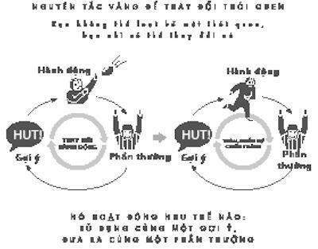
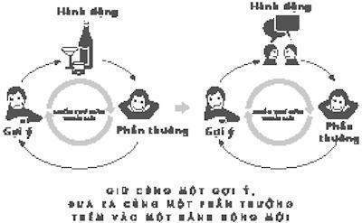
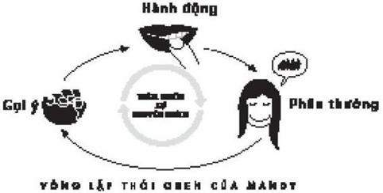
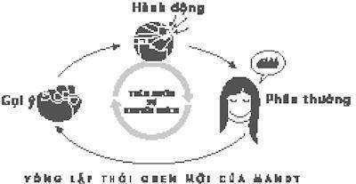
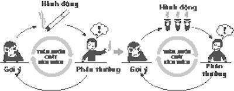

# 3. Nguyên tắc vàng để thay đổi thói quen

### *Tại sao lại có sự thay đổi*

Khi đồng hồ trận đấu ở phía cuối sân bóng báo thời gian còn lại là 8 phút 19 giây, Tony Dungy, huấn luyện viên trưởng mới của đội Tampa Bay Buccaneers – một trong những đội tệ nhất của Liên đoàn Bóng bầu dục quốc gia, chúng tôi không có ý nhắc lại lịch sử của bóng bầu dục chuyên nghiệp – bắt đầu cảm thấy một tia hy vọng nhỏ.

Đó là vào một buổi chiều muộn ngày chủ nhật, ngày 17/10/1996. Đội Buccaneers đang chơi trên sân San Diego cùng đội Chargers, một đội xuất hiện trên Super Bowl năm ngoái. Đội Bucs đang thua, 17-16. Họ đã thua mọi cuộc đấu. Họ đã thua toàn mùa giải. Họ đã thua toàn thập kỷ. Đội Buccaneers chưa từng thắng một trận nào ở West Coast trong 16 năm nay, nhiều cầu thủ hiện nay của đội đang học tiểu học khi đội Bucs có được mùa giải thắng lợi lần cuối cùng. Năm nay, thành tích của họ là 2-8. Trong một trận đấu, đội Detroit Lions – một đội chơi rất tệ nên sau này mọi người thường gọi là “vô vọng” thay vì “hy vọng” – đã đánh bại đội Bucs với tỉ số 21-6 và 3 tuần sau, điều đó lặp lại với tỉ số 27-0. Người phụ trách chuyên mục thể thao của một tờ báo đã bắt đầu dùng cái tên “Thảm chùi chân màu cam của người Mỹ” để nói về Bucs. ESPN dự đoán Dungy sẽ bị sa thải trước khi hết năm dù ông vừa mới đảm nhận vị trí hồi tháng Giêng vừa rồi.

Tuy nhiên, ngoài đường biên, khi Dungy đang quan sát đội bóng của ông tự phân công vị trí cho hiệp đấu tiếp, có vẻ như cuối cùng mặt trời đã chiếu xuyên màn mây. Ông không cười. Ông không bao giờ để lộ cảm xúc trong suốt trận đấu. Nhưng có gì đó xảy ra trên sân, điều mà ông đã làm việc chăm chỉ để hướng đến trong nhiều năm. Khi tiếng cười nhạo của 50.000 khán giả đội bạn hướng về Tony Dungy, ông đã thấy một điều mà không ai thấy. Ông thấy được bằng chứng về hiệu quả của kế hoạch ông đã đặt ra.

* * *

Tony Dungy đã chờ đợi một thời gian dài để có được vị trí này. Trong 17 năm, ông đã đi quanh đường biên với cương vị trợ lý huấn luyện viên, đầu tiên tại Đại học Minnesota, sau đó với đội Pittsburgh Steelers, rồi đến đội Kansas City Chiefs và cuối cùng quay lại Minnesota với đội Vikings. Trong 10 năm qua, ông đã được mời phỏng vấn 4 lần cho vị trí huấn luyện viên trưởng của đội NFL. Cả 4 lần đó, cuộc phỏng vấn đều không suôn sẻ.

Một phần vấn đề là nguyên tắc huấn luyện của Dungy. Trong cuộc phỏng vấn, ông luôn kiên nhẫn giải thích niềm tin của ông rằng chìa khóa để chiến thắng là thay đổi những thói quen của cầu thủ. Ông nói, ông muốn các cầu thủ không ra quá nhiều quyết định trong một trận đấu. Ông muốn họ phản ứng tự nhiên, theo thói quen. Nếu ông có thể truyền những thói quen đúng đắn, đội bóng của ông sẽ thắng. Theo từng hiệp.

“Chức vô địch không làm nên những điều phi thường,” Dungy giải thích. “Cầu thủ tạo ra những điều đó, nhưng họ tạo ra nó không suy nghĩ và thật nhanh để những đội khác không thể phản ứng. Họ làm theo thói quen họ đã học được.”

Chủ đội bóng sẽ hỏi anh định làm thế nào để tạo ra những thói quen mới đó?

”Ồ không, tôi không định tạo ra những thói quen mới,” Dungy trả lời. Các cầu thủ đã dành cả đời để xây dựng những thói quen giúp họ vào được NFL. Không có vận động viên nào sẽ từ bỏ những thói quen đó chỉ vì huấn luyện viên mới nói thế.

Vì thế, thay vì tạo thói quen mới, Dungy dự định sẽ thay đổi những thói quen cũ của cầu thủ. Và bí mật để thay đổi chúng là sử dụng những gì có sẵn trong đầu các cầu thủ. Thói quen là một vòng lặp có 3 bước – gợi ý, hành động và phần thưởng – nhưng Dungy chỉ muốn thay đổi bước giữa, hành động. Từ kinh nghiệm bản thân, ông biết để thuyết phục ai đó chấp nhận một lề thói mới dễ dàng hơn khi có điều gì đó quen thuộc ở cả lúc bắt đầu và kết thúc.

Chiến thuật huấn luyện của ông thể hiện một chân lý, Nguyên tắc Vàng để thay đổi thói quen, học liên tục được coi là một cách hiệu quả để tạo thay đổi. Dungy nhận ra không bao giờ bạn có thể bỏ hoàn toàn những thói quen xấu.

Đúng hơn, để thay đổi một thói quen, bạn phải giữ lại gợi ý cũ và phần thưởng cũ, nhưng thêm vào một hành động mới.

Đó là quy tắc: Nếu bạn dùng cùng một gợi ý và phần thưởng, bạn có thể thay hành động và chuyển đổi thói quen. Nếu gợi ý và phần thưởng được giữ nguyên thì hầu như mọi hành động đều có thể thay đổi được.

Nguyên tắc vàng có ảnh hưởng đến việc chữa trị chứng nghiện rượu, bệnh béo phì, chứng rối loạn ám ảnh và hàng trăm lề thói không tốt khác, hiểu được nguyên tắc đó có thể giúp bất cứ ai thay đổi thói quen của mình. (Ví dụ, nỗ lực để bỏ chứng ăn vặt thường thất bại nếu không có một lề thói mới để đáp ứng những gợi ý cũ và sự ham muốn phần thưởng. Một người nghiện thuốc thường không bỏ thuốc được nếu cô không làm gì đó để thay thế thuốc lá khi có cơn thèm chất kích thích.)

Dungy đã giải thích 4 lần với chủ đội bóng về nguyên tắc dựa theo thói quen. 4 lần họ đã kiên nhẫn lắng nghe, cảm ơn ông đã đến và sau đó thuê một người khác.

Sau đó, vào năm 1996, đội Buccaneers gọi đến. Dungy đáp chuyến bay đến Tampa Bay và một lần nữa trình bày kế hoạch của ông về cách chiến thắng. Một ngày sau buổi phỏng vấn, ông được đảm nhận vị trí.

Hệ thống của Dungy cuối cùng đưa Bucs trở thành một trong những đội thắng lợi nhất của liên đoàn. Ông là huấn luyện viên duy nhất trong lịch sử NFL đưa đội bóng vào trận đấu quyết định trong 10 năm liên tiếp, là huấn luyện viên người Mỹ gốc Phi đầu tiên dẫn dắt đội bóng chiến thắng Super Bowl và là một trong những nhân vật đáng chú ý trong thể thao chuyên nghiệp. Kỹ thuật huấn luyện của ông được mở rộng khắp liên đoàn và mọi môn thể thao. Phương pháp của ông giúp làm sáng tỏ cách tạo lại thói quen trong cuộc sống mỗi người.

Nhưng tất cả những điều đó đều đến sau này. Hiện tại, ở San Diego, Dungy chỉ muốn chiến thắng.

* * *

Từ ngoài đường biên, Dungy nhìn đồng hồ: còn lại 8 phút 19 giây. Đội Bucs đã thua mọi trận đấu và đã bỏ qua rất nhiều cơ hội. Nếu hậu vệ không thể làm gì ngay lúc này thì trận đấu sẽ hoàn toàn chấm dứt. Bóng đang ở vạch 20 trên sân San Diego và tiền vệ của Charger, Stan Humphries, đang chuẩn bị dẫn banh với hy vọng sẽ kết thúc trận đấu. Đồng hồ bắt đầu chạy và Humphries đang ở tư thế cho một cú thần tốc.

Nhưng Dungy không nhìn vào Humphries. Thay vào đó, ông đang nhìn các cầu thủ của mình xếp đội hình mà họ đã mất hàng tháng trời để hoàn thiện. Theo truyền thống thì bóng bầu dục là một trận đấu của sự nghi binh và phản nghi binh, chơi lừa và đánh lạc hướng. Những huấn luyện viên có những cuốn sách chiến thuật mỏng nhất và những kế hoạch phức tạp nhất thường chiến thắng. Tuy nhiên, Dungy lại dùng phương pháp ngược lại. Ông không hứng thú với sự phức tạp hay làm hoang mang. Khi những cầu thủ hậu vệ của Dungy xếp vào vị trí, mọi người đều biết rõ họ định sử dụng lối chơi nào.

Dungy lựa chọn phương pháp này vì theo lý thuyết, ông không cần đánh lạc hướng. Đơn giản, ông chỉ cần đội của mình nhanh hơn bất kỳ ai. Trong bóng bầu dục, một phần nghìn giây cũng đáng quan tâm. Vì thế thay vì hướng dẫn các cầu thủ hàng trăm đội hình, ông chỉ hướng dẫn họ một vài kiểu, nhưng họ đã luyện tập rất nhiều lần cho đến khi những lề thói đó trở thành tự động. Khi chiến thuật của ông có hiệu quả, các cầu thủ có thể di chuyển với một tốc độ không thể vượt qua.

Nhưng chỉ khi nó có hiệu quả. Nếu các cầu thủ suy nghĩ quá nhiều, do dự hay phỏng đoán sau bản năng của họ thì cả hệ thống sẽ đổ vỡ. Và hơn thế, các cầu thủ của Dungy sẽ trở thành một mớ hỗn độn.

Tuy nhiên, lần này, khi đội Bucs đang xếp vị trí trên vạch 20, có điều gì đó khác lạ. Hãy xem Regan Upshaw, một cầu thủ hậu vệ của Buccaneers đang ở vị trí của tư thế 3 điểm trên vạch ngang. Thay vì nhìn lên xuống đường vạch và cố gắng tìm hiểu càng nhiều thông tin càng tốt, Upshaw lại chỉ đang nhìn vào những gợi ý mà Dungy đã hướng dẫn anh phải tập trung vào. Đầu tiên, anh liếc nhìn chân ngoài của tiền vệ đối thủ (mũi giày anh ta đang hướng về phía sau, nghĩa là anh ta định lùi về sau và chặn bóng khi tiền vệ băng qua); tiếp theo, Upshaw nhìn vào vai của tiền vệ đó (quay nhẹ hướng vào trong) và khoảng cách giữa anh ta và cầu thủ kế tiếp (một khoảng chật hơn ước tính).

Upshaw đã luyện tập cách phản ứng lại những gợi ý đó rất nhiều lần nên ngay lúc này anh không cần phải suy nghĩ điều mình phải làm. Anh chỉ cần làm theo thói quen.

Tiền vệ của Sand Diego tiếp cận vạch ngang, liếc nhìn sang phải rồi trái và giành bóng. Anh ta lùi 5 bước, đứng thẳng, xoay xoay đầu và tìm kiếm khoảng trống. Đã 3 phút trôi qua kể từ lúc anh ta bắt đầu. Mọi cặp mắt trong sân vận động và mọi máy quay đều hướng về anh ta.

Vì thế nhiều cặp mắt đã không thể thấy điều đang xảy ra trong đội Buccaneers. Ngay khi Humphries bắt đầu chạy, Upshaw bắt đầu hành động. Chỉ trong một giây đầu tiên, anh lao sang phải, băng qua vạch ngang rất nhanh nên tiền vệ đối thủ không thể ngăn cản anh. Trong giây tiếp theo, Upshaw chạy thêm 4 bước chân ở giữa sân đối phương, anh bước không rõ ràng. Giây tiếp theo, Upshaw di chuyển thêm 3 bước dài và gần tiền vệ kia hơn, hướng đi của anh làm tiền vệ đối thủ không thể dự đoán được.

Và khi bước vào giây thứ tư, Humphries, tiền vệ đội San Diego, bất ngờ để lộ ra. Anh ta do dự, liếc nhìn Upshaw. Và đó là lúc Humphries mắc lỗi. Anh ta bắt đầu suy nghĩ.

Humphries đưa một đồng đội, một tân binh ở vị trí tấn công gần đường biên ngang tên Brian Roche, 18.3 mét về giữa sân. Có một cầu thủ trung tuyến của đội San Diego đang ở gần hơn và vẫy tay để có thể nhận bóng. Chuyền bóng ngắn là một lựa chọn an toàn. Thay vào đó, Humpries dưới sức ép đã có một phân tích chính xác, đưa tay ra hiệu và chuyền bóng cho Roche.

Quyết định nóng vội đó chính xác là điều Dungy đang mong đợi. Ngay khi quả bóng đang trên không, một hậu vệ của Buccaneers tên là John Lynch bắt đầu di chuyển. Nhiệm vụ của Lynch rất rõ ràng: khi trận đấu bắt đầu, anh chạy đến một vị trí nhất định trên sân và chờ đợi gợi ý của mình. Có rất nhiều áp lực trước tình huống đó. Nhưng Dungy đã huấn luyện Lynch cho đến khi lề thói trở thành tự động. Và kết quả là, khi bóng rời khỏi tay tiền vệ kia, Lynch đang đứng cách Roche 9,1 mét và chờ đợi.

Khi bóng đang quay tròn trong không khí, Lynch đọc gợi ý của mình – hướng đầu và tay của tiền vệ đó, khoảng cách của các cầu thủ trung tuyến – và bắt đầu di chuyển trước khi biết được bóng sẽ rơi xuống đâu. Roche, cầu thủ trung tuyến của San Diego, nhảy về trước, nhưng Lynch cắt ngang anh ta và chặn đường chuyền. Trước khi Roche có thể phản ứng, Lynch hạ xuống sân và hướng về khu vực cấm địa của Charger. Các cầu thủ Buccaneers khác đang ở vị trí hoàn hảo để làm trống đường cho anh. Lynch chạy 9, 14, rồi 18 và gần 23 mét trước khi đá bóng đi. Toàn bộ hiệp đấu diễn ra dưới 10 giây.

2 phút sau, đội Bucs ghi bàn từ một cú ném biên và dẫn đầu lần đầu tiên trong mọi trận đấu. 5 phút sau, họ ghi bàn từ điểm cách làn phân cách giữa 9 mét. Giữa lúc đó, tuyến phòng vệ của Dungy đã cản trở thành công nỗ lực san bằng tỉ số của đối phương. Đội Buccaneers thắng với tỉ số 25-17, một trong những kết quả bất ngờ nhất mùa giải.

Vào cuối trận đấu, Lynch và Dungy cùng nhau ra khỏi sân.

“Có vẻ như đã có điều gì khác lạ trên sân,” Lynch nói khi họ cùng nhau đi vào đường hầm.

“Chúng tôi bắt đầu tin tưởng,” Dungy trả lời.

Để hiểu được cách một huấn luyện viên tập trung vào thay đổi thói quen có thể tái sinh một đội bóng, chúng ta cần phải nhìn thế giới bên ngoài thể thao. Con đường bên ngoài dẫn đến một tầng hầm tối tăm ở Lower East Side của thành phố New York năm 1934, nơi mà một trong những nỗ lực lớn nhất và thành công nhất để thay đổi thói quen trên phạm vi rộng được tạo ra.

Một người nghiện rượu 39 tuổi tên Bill Wilson đang đứng trong tầng hầm. Nhiều năm trước, Wilson đã uống rượu lần đầu tiên tại trại huấn luyện sĩ quan ở New Bedford, Massachusetts, nơi anh học bắn súng máy trước khi lên tàu sang Pháp và đến Chiến tranh Thế giới thứ nhất. Nhiều gia đình danh tiếng sống gần căn cứ thường mời các sĩ quan đến nhà ăn tối và vào một tối chủ nhật, Wilson tham dự một bữa tiệc, anh được phục vụ món pho-mát nóng chảy quệt bánh mì nướng và bia. Anh 22 tuổi và chưa từng uống rượu. Có vẻ như việc lịch sự duy nhất anh làm là anh uống ly rượu được phục vụ. Vài tuần sau đó, Wilson được mời đến một sự kiện trang trọng khác. Nam mặc vét-tông, nữ cũng ăn mặc quý phái. Một người hầu rượu đi qua và đặt một ly cốc-tai Bronx – một hỗn hợp rượu gin, rượu vang trắng mạnh ngọt nguyên chất và nước cam ép – vào tay Wilson. Anh nhấm từng ngụm và cảm thấy như đã tìm thấy một “liều thuốc trường sinh bất lão”, anh nói sau này.

Vào giữa những năm 1930, sau khi trở về từ châu Âu, hôn nhân của anh tan vỡ và tài sản từ việc bán cổ phiếu cũng tiêu tan, Wilson uống ba chai rượu mỗi ngày. Vào một buổi chiều tháng Mười một lạnh lẽo, khi anh đang ngồi giữa đêm tối ảm đạm, một bạn rượu cũ gọi đến. Wilson mời bạn đến nhà và pha một chai rượu gin với nước dứa. Anh rót cho bạn một ly.

Bạn anh đẩy ly rượu lại. Anh ấy đã kiêng rượu hai tháng nay rồi, anh nói.

Wilson rất ngạc nhiên. Anh bắt đầu nói về sự nỗ lực của mình để bỏ rượu, có cả cuộc ẩu đả anh mắc vào trong một câu lạc bộ bình dân đã làm anh mất việc. Anh đã cố gắng từ bỏ, anh nói, nhưng không thể làm được. Anh đã tham gia điều trị nghiện rượu và uống thuốc. Anh đã hứa với vợ và còn tham gia nhiều nhóm kiêng rượu. Nhưng không cái nào có hiệu quả. ”Anh đã cai rượu như thế nào,” Wilson hỏi.

“Tôi dựa vào tôn giáo,” người bạn trả lời. Anh ấy nói về địa ngục và sự cám dỗ, tội lỗi và ác quỷ. “Nhận ra bạn đang cố gắng, thừa nhận nó và quyết tâm thay đổi cuộc sống tốt đẹp hơn.”

Wilson nghĩ bạn mình là một kẻ điên rồ. “Hè năm ngoái là một kẻ nghiện rượu lập dị, bây giờ tôi nghi ngờ là một kẻ chuộng đạo dở hơi,” anh viết sau này. Khi bạn ra về, Wilson bỏ bữa rượu và lên giường ngủ.

Một tháng sau, vào tháng 9/1934, Wilson đăng ký vào bệnh viện Charles B. Towns dành cho người nghiện rượu, trung tâm điều trị cai nghiện hạng sang Manhattan. Trong nhiều giờ, một bác sĩ điều trị bắt đầu truyền một loại thuốc gây ảo giác tên belladonna, loại thuốc sau này rất phổ biến trong điều trị nghiện rượu. Trong một căn phòng nhỏ, Wilson lúc tỉnh lúc mê trên giường.

Sau đó, Wilson bắt đầu đau đớn tột cùng như trong một triệu chứng được mô tả tại hàng triệu cuộc họp ở quán cà phê, phòng họp và tầng hầm của nhà thờ. Trong nhiều ngày, anh bị ảo giác. Quá trình cai nghiện làm anh đau đớn như có rất nhiều côn trùng đang bò qua da. Anh bị buồn nôn nặng nên rất khó di chuyển, nhưng nỗi đau quá lớn nên khó nằm yên. “Nếu có Chúa ở đây, hãy để ngài nhìn thấy!” Wilson hét lên trong căn phòng trống. “Tôi đã sẵn sàng để làm bất cứ điều gì. Bất cứ gì!” Sau này anh viết, vào lúc đó, một ánh sáng trắng tràn ngập phòng, nỗi đau biến mất và anh cảm thấy như mình đang ở trên đỉnh núi, “và không phải một cơn gió mà là một luồng linh hồn đang thổi. Và tôi chợt nghĩ tôi là một người tự do. Cảm giác sung sướng từ từ lắng xuống. Tôi nằm trên giường, nhưng bây giờ là lúc tôi đang ở một thế giới khác, thế giới của sự tỉnh táo.”

Bill Wilson không bao giờ uống rượu nữa. Trong 36 năm sau đó, cho tới khi anh chết vì bệnh khí thũng năm 1971, anh đóng góp cho việc thành lập, xây dựng và tuyên truyền cho trung tâm cai rượu Alcoholics Anonymous cho đến lúc nó trở thành tổ chức lớn nhất, nổi tiếng nhất và thành công nhất về thay đổi thói quen trên thế giới.

Theo ước tính, khoảng 2,1 tỷ người tìm kiếm sự giúp đỡ từ AA mỗi năm và khoảng 10 triệu người nghiện rượu đã cai rượu thành công nhờ tổ chức. AA không làm việc cho bất kỳ ai – vì tình trạng giấu tên của người tham gia nên tỷ lệ thành công rất khó xác định – nhưng hàng triệu người tín nhiệm chương trình vì cuộc sống của họ đã được cứu nhờ nó. Cương lĩnh thành lập của AA, 12 bước nổi tiếng, đã trở thành điểm nhấn giáo dục lôi cuốn được kết hợp vào các chương trình điều trị ăn uống quá mức, cờ bạc, nợ nần, tình dục, ma túy, sự tiết kiệm quá mức, bệnh tự làm tổn thương, nghiện thuốc lá, nghiện trò chơi video, sự phụ thuộc tâm lý và hàng chục lề thói không tốt khác. Trên nhiều khía cạnh, cách thức mà tổ chức mang lại là một trong những công thức hữu hiệu nhất để thay đổi.

Tất cả những điều đó là điều không ngờ tới, vì AA gần như không có nền tảng khoa học hay có những phương pháp chữa bệnh được chấp nhận nhất.

Tất nhiên, chứng nghiện rượu nghiêm trọng hơn cả một thói quen. Nó là chứng nghiện về thể chất có gốc rễ tâm lý hay có thể cả di truyền. Tuy nhiên, điều thú vị về AA là nó không giải quyết trực tiếp các vấn đề tâm thần hay hóa sinh mà các nhà nghiên cứu thường xem là lý do quan trọng nhất tại sao người nghiện rượu lại uống rượu. Trên thực tế, những phương pháp của AA có vẻ cách xa những phát hiện khoa học và cả y học, cũng như những cách can thiệp mà các chuyên gia tâm thần học cho là những người nghiện rượu thực sự cần. Thay vào đó, điều mà AA cung cấp là một phương pháp để đối phó với những thói quen xung quanh việc uống rượu. Về bản chất, AA là một cỗ máy khổng lồ để thay đổi vòng lặp thói quen. Và mặc dù những thói quen gắn với chứng nghiện rượu rất lớn, những bài học AA đưa ra tập trung vào cách hầu như mọi thói quen – cho dù cái khó thay đổi nhất – có thể được thay đổi.

* * *

Bill Wilson không đọc các tạp chí chuyên đề học thuật hay tham khảo ý kiến bác sĩ trước khi thành lập AA. Vài năm sau khi cai rượu thành công, anh viết ra 12 bước hiện giờ rất nổi tiếng vào một buổi tối khi đang ngồi trên giường. Anh chọn con số 12 vì có 12 ông tổ truyền đạo. Và vài khía cạnh của chương trình không chỉ không khoa học mà còn có vẻ hoàn toàn kỳ lạ.

Ví dụ như, AA nhấn mạnh rằng người nghiện dùng thuốc mỗi ngày – đây có vẻ là sự lựa chọn ngẫu nhiên trong một khoảng thời gian. Hay sự tập trung cao độ của chương trình về tinh thần thể hiện trong bước thứ ba, cho rằng những người nghiện có thể thành công bằng cách ra “quyết định để chuyển sự quyết tâm và cuộc sống theo hướng quan tâm của Chúa như cách chúng ta hiểu ngài.” 7 trong 12 bước đề cập đến Chúa hay tinh thần, một điều có vẻ kỳ lạ đối với một chương trình được thành lập bởi một người tin rằng không thể biết về sự tồn tại của Chúa trước kia, người đã căm ghét tôn giáo của tổ chức trong suốt cuộc đời. Những cuộc họp của AA không lên lịch theo quy định hay chương trình có sẵn. Thay vào đó, nó thường bắt đầu với một thành viên kể chuyện của mình, sau đó mọi người sẽ tiếp tục. Không có chuyên gia nào dẫn dắt cuộc hội thoại hay quy tắc nào quy định cách những cuộc họp được tiến hành. Trong 50 năm trước, khi gần như mọi khía cạnh của nghiên cứu thần kinh học và chứng nghiện đã được cách mạng hóa nhờ những khám phá trong khoa học lề thói, khoa dược lý và hiểu biết của chúng ta về bộ não, AA vẫn đứng nguyên tại chỗ.

Vì tính thiếu chính xác của chương trình, các học giả và nhà nghiên cứu thường phê bình nó. Một vài người khẳng định, sự nhấn mạnh của AA về thần kinh làm nó giống một nghi lễ tôn giáo hơn là một phương pháp điều trị. Tuy nhiên, trong vòng 15 năm trước, đã có một cuộc đánh giá lại. Các nhà nghiên cứu giờ đây cho rằng những phương pháp của chương trình đưa ra nhiều bài học quý giá. Giảng viên của Harvard, Yale, Đại học Chicago, Đại học New Mexico và hàng chục trung tâm nghiên cứu khác đã tìm thấy một loại khoa học trong AA giống như khoa học mà Tony Dungy đã sử dụng trên sân bóng. Những phát hiện của họ đã chứng thực Quy tắc Vàng của thay đổi thói quen: AA thành công vì nó giúp những người nghiện rượu sử dụng cùng một gợi ý, nhận được cùng một phần thưởng nhưng chuyển đổi hành động.

Theo các nhà nghiên cứu, AA có tác dụng vì chương trình thúc đẩy mọi người xác định những gợi ý và phần thưởng cổ vũ thói quen nghiện rượu của họ và sau đó giúp họ tìm được lề thói mới. Khi Claude Hopkins bán Pepsodent, ông tìm ra một cách để tạo thói quen mới bằng cách tạo ta một sự thèm khát mới. Nhưng để thay đổi thói quen cũ, bạn phải giải quyết sự thèm khát cũ. Bạn phải giữ gợi ý và phần thưởng như trước và thỏa mãn sự thèm khát bằng cách thêm vào một lề thói mới.

Hãy xem bước thứ tư (để tạo ra “một sáng chế tinh tế và can đảm của mình”) và thứ năm (để thừa nhận “với Chúa, với chúng ta và với những người khác bản chất thực của những sai lầm”).

“Từ cách nó được viết ra đã không rõ ràng, nhưng để hoàn thành những bước đó, phải có một người tạo ra một danh sách gồm những tác động ảnh hưởng đến sự ham muốn rượu chè,” J. Scott Tonigan nói, một nhà nghiên cứu của Đại học New Mexico đã nghiên cứu AA hơn 10 năm nay. “Khi bạn tự khám phá chính mình, bạn đang tìm hiểu mọi thứ làm bạn uống rượu. Và thừa nhận với ai đó tất cả những việc không tốt bạn đã làm là một cách tốt để tìm ra thời điểm mọi thứ liên tục mất kiểm soát.

Sau đó, AA yêu cầu những người nghiện rượu tìm kiếm phần thưởng họ có được từ rượu. Chương trình đặt ra câu hỏi, những sự thèm khát nào đang dẫn dắt vòng lặp thói quen? Thông thường, sự say xỉn không tự tạo ra danh sách đó. Người nghiện rượu thèm uống rượu vì nó thường mang đến sự giải thoát, sự thư giãn, sự thân thiết, giảm bớt lo lắng và một cơ hội để giải thoát tâm trạng. Họ có thể muốn một ly cốc-tai để quên đi những lo lắng. Nhưng họ không thèm cảm giác say xỉn. Ảnh hưởng sinh lý của chất cồn thường là một trong những phần thưởng cuối cùng của việc uống rượu vì nghiện.

“Chất cồn có một yếu tố khoái lạc,” Ulf Mueller nói, một nhà thần kinh học người Đức đã nghiên cứu hoạt động não bộ của những người nghiện rượu. “Nhưng mọi người thường dùng chất cồn vì họ muốn thoát khỏi sự thèm muốn ở khắp các phần khác nhau của não bộ hơn là thoát khỏi sự thèm muốn vì thỏa mãn nhu cầu sinh lý.”

Để mang đến cùng một phần thưởng như tại quầy uống rượu cho những người nghiện rượu, AA đã thành lập một hệ thống gặp gỡ và đồng hành – người hỗ trợ và mỗi thành viên cùng làm việc với nhau – phấn đấu để mang đến càng nhiều sự giải thoát, sự điên cuồng và phấn chấn như trong một cuộc chè chén tối thứ 6. Nếu ai đó cần sự thanh thản, họ có thể nhận được nhờ tâm sự với người hỗ trợ hay tham dự một buổi tụ tập nhóm, hơn là nâng cốc chúc mừng một người bạn nhậu.

“AA bắt buộc bạn tạo ra một hành động mới để làm mỗi tối thay vì uống rượu,” Tonigan nói. “Bạn có thể thư giãn và tự do kể ra những lo lắng tại các cuộc gặp mặt. Sự tác động và phần thưởng là như nhau, chỉ có hành động là thay đổi.”

Năm 2007, một minh chứng đặc biệt ấn tượng về cách những gợi ý và phần thưởng của những người nghiện rượu có thể được chuyển thành thói quen mới đã xuất hiện khi Mueller, một nhà thần kinh học người Đức, cùng các đồng nghiệp tại Đại học Magdeburg cấy các thiết bị điện nhỏ vào não của 5 người nghiện rượu đã cố gắng cai rượu nhiều lần. Những người nghiện trong cuộc nghiên cứu đã mất ít nhất 6 tháng tại trung tâm cai nghiện nhưng không thành công. Một trong số họ đã trải qua điều trị cai nghiện hơn 60 lần.

Thiết bị cấy vào đầu những người đàn ông đó được đặt bên trong hạch nền – bộ phận tương tự của não bộ mà các nhà nghiên cứu MIT đã tìm ra vòng lặp thói quen – và phát ra điện tích làm gián đoạn phần thưởng thuộc về thần kinh tác động đến sự thèm khát theo thói quen. Sau khi tất cả mọi người tỉnh lại sau cuộc phẫu thuật, họ được tiếp xúc với những gợi ý đã từng tác động đến ham muốn rượu cồn, như tấm hình chai bia hay lúc đi đến quầy rượu. Thông thường, để họ cưỡng lại, không uống một ly là không thể. Nhưng những thiết bị trong não họ “lấn át” những thèm khát thần kinh. Họ không chạm đến một giọt.

“Một người trong số họ nói với tôi sự thèm khát đã biến mất ngay khi chúng tôi khởi động những điện cực đó,” Mueller nói. “Sau đó, chúng tôi tắt nó đi và sự thèm khát trở lại ngay lập tức.”

Tuy nhiên, xóa bỏ những sự thèm khát thần kinh của người nghiện không đủ để họ dừng thói quen uống rượu. Bốn người trong số đó đã nghiện trở lại ngay sau khi phẫu thuật, thường là sau một sự kiện căng thẳng nào đó. Họ lấy một chai vì đó là cách họ đối mặt tức thì với nỗi lo lắng. Tuy nhiên, một khi họ đã học những lề thói thay thế để giải tỏa căng thẳng, sự say xỉn dừng lại. Ví dụ, một bệnh nhân tham dự những cuộc gặp mặt của AA. Những người khác dùng liệu pháp tâm lý. Và khi họ kết hợp những lề thói mới đó để giải quyết căng thẳng và lo lắng trong cuộc sống, họ thành công đầy bất ngờ. Người đàn ông đã từng điều trị nghiện 60 lần không bao giờ uống một ly nào nữa. Hai bệnh nhân khác bắt đầu uống rượu năm 12 tuổi, bị nghiện vào năm 18 tuổi, đã từng uống hàng ngày nhưng hiện nay kiêng rượu được 4 năm rồi. Hãy chú ý nghiên cứu này tuân theo Nguyên tắc Vàng của thay đổi thói quen chặt chẽ thế nào: Cho dù não của những người nghiện rượu bị biến đổi qua phẫu thuật, điều đó cũng chưa đủ. Những gợi ý cũ và sự thèm muốn phần thưởng vẫn ở đó và chờ thời điểm để xuất hiện. Những người nghiện rượu chỉ tạm thời thay đổi khi họ học được lề thói mới nhờ những tác động cũ và mang đến cảm giác thanh thản. “Một vài bộ não nghiện chất cồn quá nặng nên chỉ phẫu thuật mới có thể dừng nó lại,” theo Mueller. “Nhưng những người đó cũng cần những cách mới để giải quyết vấn đề trong cuộc sống.”

AA mang đến một hệ thống tương tự dù tác động kém hơn để đưa hành động mới vào vòng lặp thói quen cũ. Khi các nhà khoa học bắt đầu hiểu được cách AA hoạt động, họ bắt đầu áp dụng phương pháp của chương trình với những thói quen khác như cơn thịnh nộ kéo dài hai năm, chứng nghiện tình dục và cả những thói quen nhỏ nhất. Khi các phương pháp của AA đã lan rộng, người ta chọn lọc chúng để đưa vào những liệu pháp tâm lý sử dụng can thiệp vào gần như mọi mô hình.

* * *

Mùa hè năm 2006, một sinh viên 24 tuổi đã tốt nghiệp đại học tên là Mandy bước vào trung tâm tư vấn tại Đại học bang Mississippi. Gần như suốt cuộc đời, Mandy đã cắn móng tay và gặm nhấm cho đến lúc ngón tay chảy máu. Rất nhiều người cắn móng tay của mình. Tuy nhiên, với những người cắn móng tay thành thói quen, vấn đề đó lại ở mức độ khác. Nhiều người thường cắn móng tay cho đến khi móng tay bắt đầu tách khỏi lớp da bên dưới. Đầu ngón tay của cô phủ đầy những miếng vảy nhỏ. Phần cuối của ngón tay bắt đầu cùn móng, không được bảo vệ và thỉnh thoảng nó bị ngứa, một dấu hiệu của sự tổn thương nặng. Thói quen cắn móng tay đã gây tác động không tốt cho cuộc sống của cô. Vì quá xấu hổ với bạn nên cô thường để tay trong túi áo và khi hẹn hò, cô thường ám ảnh việc để tay thành nắm đấm. Cô đã cố gắng dừng lại bằng cách sơn móng tay với sơn bóng có vị khó chịu hay tự hứa với lòng mình, kể từ giờ cô sẽ tập trung ý chí để từ bỏ. Nhưng ngay khi cô bắt đầu làm bài tập hay xem ti vi, rốt cuộc ngón tay vẫn ở trong miệng cô.

Trung tâm tư vấn giới thiệu Mandy đến một người đang học bằng tiến sĩ tâm lý học, đang nghiên cứu một phép trị bệnh tên là “rèn luyện đảo ngược thói quen.” Nhà tâm lý học rất quen thuộc với Nguyên tắc Vàng của thay đổi thói quen. Ông biết rằng để thay đổi thói quen cắn móng tay của Mandy cần phải đưa một hành động mới vào cuộc sống của cô.

“Cô cảm thấy thế nào trước khi cô đưa tay lên miệng để cắn móng tay?” ông hỏi cô ấy. “Có một chút căng thẳng ở các đầu ngón tay,” Mandy nói. “Nó đau một ít ở đây, tại mép của móng tay. Thỉnh thoảng tôi sẽ lướt ngón tay cái để tìm những chỗ xước dọc móng tay và khi tôi thấy chỗ nào xước, tôi sẽ đưa nó lên miệng. Sau đó tôi sẽ cắn tiếp hết ngón này đến ngón khác, cắn hết những chỗ thô ráp. Một khi tôi đã bắt đầu, có vẻ như tôi phải cắn hết tất cả những ngón còn lại.”

Bước đầu tiên trong rèn luyện đảo ngược thói quen là yêu cầu bệnh nhân mô tả thứ tác động đến lề thói theo thói quen gọi là rèn luyện nhận thức và giống như sự nhấn mạnh của AA về việc bắt buộc những người nghiện rượu nhận ra những gợi ý. Sự căng thẳng mà Mandy cảm thấy ở móng tay gợi ý thói quen cắn móng tay của cô.

“Thói quen của nhiều người tồn tại đã lâu nên họ không còn để ý đến cái gì gây ra nó nữa,” Brad Dufrene, người chữa trị cho Mandy nói. “Tôi đã gặp nhiều người nói lắp đến đây và tôi hỏi họ những từ nào hay tình huống nào làm họ nói lắp, họ không biết vì từ lâu lắm rồi họ không còn để ý đến nó nữa.”

Tiếp theo, nhà trị liệu yêu cầu Mandy mô tả tại sao cô cắn móng tay. Đầu tiên, cô gặp rắc rối khi nêu lên lý do. Mặc dù khi họ nói chuyện, rõ ràng cô cắn khi cảm thấy buồn chán. Nhà trị liệu đặt cô vào một số hoàn cảnh điển hình như xem ti vi và làm bài tập, cô bắt đầu cắn từng tý một. Khi đã cắn hết các móng tay, cô có một cảm giác hoàn thành ngắn ngủi, cô nói. Đó là phần thưởng của thói quen: sự khuyến khích tự nhiên mà cô đã thèm muốn.

Cuối buổi gặp đầu tiên, nhà trị liệu cho Mandy một bài tập tại nhà: Mang theo một tấm thẻ liệt kê và mỗi lần cô cảm thấy gợi ý – sự căng thẳng ở đầu ngón tay – hãy đánh một dấu tích trên tấm thẻ. Một tuần sau cô quay lại với 28 dấu. Tại thời điểm đó, cô nhận thức sâu sắc những cảm giác có trước thói quen của mình. Cô biết nó xảy ra bao nhiêu lần trong lớp học hay khi đang xem ti vi.

Sau đó nhà trị liệu chỉ cho Mandy cái được gọi là “phản ứng đối lập”. Ông nói với cô ấy, khi nào cô cảm thấy căng thẳng ở đầu ngón tay, cô ngay lập tức nên bỏ tay vào túi, để dưới chân, hay nắm chặt một cây bút chì hoặc thứ gì đó làm cô không thể cho tay vào miệng. Sau đó Mandy nên tìm kiếm thứ gì khác sẽ mang đến sự kích thích sinh lý nhanh chóng – như chà xát cánh tay hay gõ khớp tay trên mặt bàn – bất cứ điều gì tạo ra phản ứng sinh lý.

Những gợi ý và phần thưởng được giữ nguyên. Chỉ có hành động là thay đổi.

Họ luyện tập trong văn phòng của nhà trị liệu khoảng 30 phút và Mandy về nhà với một bài tập mới: Tiếp tục dùng tấm thẻ liệt kê nhưng đánh dấu tíc khi cô cảm thấy căng thẳng ở các đầu ngón tay và đánh dấu thăng khi cô đã vượt qua thói quen thành công.

Một tuần sau, Mandy chỉ cắn móng tay 3 lần và sử dụng phản ứng đối lập 7 lần. Cô tự thưởng cho mình cắt sửa móng tay nhưng vẫn dùng tấm thẻ liệt kê. Sau một tháng, thói quen cắn móng tay đã không còn nữa. Hành động đối lập đã trở thành tự động. Một thói quen khác đã thay thế.

“Nó có vẻ đơn giản một cách kỳ lạ nhưng một khi bạn biết được thói quen của mình hoạt động thế nào, một khi bạn nhận ra những gợi ý và phần thưởng, bạn đã thay đổi nó được một nửa,” Nathan Azrin, một trong những người sáng lập khóa đào tạo đảo ngược thói quen, nói với tôi. “Có vẻ nó nên phức tạp hơn. Sự thật là bộ não có thể được lập trình lại. Bạn chỉ cần cân nhắc thật kỹ về nó.”

Hiện nay, liệu pháp đảo ngược thói quen được dùng để chữa những tật sinh lý và ngôn ngữ, trầm cảm, hút thuốc lá, vấn đề cờ bạc, nỗi lo lắng, chứng đái dầm, tính trì hoãn lãng phí thời gian, chứng rối loạn ám ảnh bắt buộc và những vấn đề lề thói khác. Và các phương pháp đó dựa vào một trong những nguyên tắc cơ bản của thói quen: Thông thường, chúng ta không thật sự hiểu được sự thèm khát dẫn dắt lề thói như thế nào cho đến khi chúng ta tìm kiếm nó. Mandy không bao giờ nhận ra một sự thèm khát kích thích sinh lý làm cô cắn móng tay mình, nhưng một khi cô phân tích thói quen, rất dễ để cô tìm một lề thói mới đem đến cùng một phần thưởng.

Bạn muốn dừng ăn vặt khi làm việc. Phần thưởng bạn đang tìm kiếm có thỏa mãn cơn đói của bạn không? Hay nó làm đứt quãng sự buồn chán? Nếu bạn ăn vặt để thanh thản trong giây lát, bạn có thể dễ dàng tìm được một lề thói khác – như đi bộ ngắn hay cho mình lên mạng 3 phút – tạo ra cùng sự ngắt quãng mà không làm vòng eo bạn to hơn.

Nếu bạn muốn dừng hút thuốc, hãy tự hỏi bản thân, bạn làm nó vì bạn thích thuốc phiện hay vì nó mang đến một sự bùng nổ kích thích, một cách giao tiếp? Nếu bạn hút thuốc vì bạn cần sự kích thích, những nghiên cứu chỉ ra vài loại cà-phê-in vào buổi chiều có thể làm tăng tỷ lệ bạn sẽ từ bỏ. Hơn 36 nghiên cứu về những người hút thuốc trước đây đã cho thấy rằng xác định những gợi ý và phần thưởng gắn kết với thuốc lá, sau đó lựa chọn lề thói mới đem đến kết quả tương tự – một miếng Nicorette, một vài cái hít đất nhanh, hay đơn giản dành vài phút để giãn người và thư giãn – có vẻ sẽ làm họ từ bỏ.

Nếu bạn xác định được những gợi ý và phần thưởng, bạn có thể thay đổi lề thói.

Ít ra là trong phần lớn thời gian. Tuy nhiên, với vài thói quen, cần phải có một nhân tố khác: niềm tin.

“Đây là sáu lý do mọi người nghĩ chúng ta không thể thắng,” Dungy nói với đội Buccaneers sau khi ông trở thành huấn luyện viên trưởng năm 1996. Đó là vài tháng trước khi mùa giải bắt đầu và mọi người đang ngồi trong phòng thay đồ. Dungy bắt đầu liệt kê những lý thuyết mà họ đã đọc trên báo hay nghe trên đài phát thanh. Việc quản lý đội rất lộn xộn. Huấn luyện viên mới chưa được kiểm tra. Các cầu thủ thì hư hỏng. Thành phố thì không quan tâm đến. Cầu thủ chủ chốt thì đang bị chấn thương. Và họ không có tài năng họ cần.

“Đó đều là những lý do áp đặt,” Dungy nói. “Đây mới là thực tế: Không ai cần cù hơn chúng tôi.”

Dungy giải thích, chiến thuật của ông là chuyển đổi những lề thói của đội cho đến khi sự thể hiện của họ đi vào tự động. Ông không tin đội Buccaneers cần một quyển sách chiến thuật mỏng nhất. Ông không nghĩ họ phải ghi nhớ hàng trăm đội hình. Họ chỉ cần học một vài bước di chuyển chính và áp dụng nó đúng lúc.

Tuy nhiên, trong bóng bầu dục, sự hoàn hảo rất khó đạt được. “Mọi trận đấu trong bóng bầu dục – mỗi trận – đều có ai đó làm rối lên,” Herm Edwards, một trong những trợ lý huấn luyện viên của Dungy ở Tampa Bay nói. “Phần lớn thời gian, nó không phải là thể chất. Nó là tinh thần.” Các cầu thủ làm mọi thứ rối tung lên khi họ bắt đầu suy nghĩ quá nhiều hay dự đoán trận đấu. Điều Dungy muốn là loại bỏ hoàn toàn việc ra quyết định khỏi cuộc chơi của họ.

Và để làm điều đó, ông cần họ nhận ra thói quen nào đang tồn tại và chấp nhận lề thói mới.

Ông bắt đầu bằng sự quan sát cách đội của ông đã chơi như thế nào.

“Hãy làm việc với sự phòng thủ dưới,” Dungy nói to vào một buổi sáng luyện tập. “Số 55, anh đọc được gì?”

“Tôi đang nhìn hậu vệ tham gia tấn công và tiền vệ,” Derrick Brooks, một hậu vệ ngoài nói.

“Chính xác là anh đang nhìn cái gì? Mắt của anh đang ở đâu?”

“Tôi đang nhìn sự chuyển động của tiền vệ,” Brooks nói. “Tôi đang nhìn chân và hông của tiền vệ sau khi anh ta nhận bóng. Và tôi đang tìm kiếm khoảng trống của tình thế để biết liệu họ có định chuyền bóng và liệu tiền vệ có định chuyền đến phía tôi hay đến vị trí khác.”

Trong bóng bầu dục, những gợi ý có thể nhìn thấy được biết đến là “chìa khóa”, và nó quan trọng đối với mọi trận đấu. Sự đổi mới của Dungy là sử dụng những chìa khóa đó như những gợi ý để làm lại thói quen. Ông biết rằng, thỉnh thoảng, khi bắt đầu trận đấu, Brooks do dự hơi lâu. Có quá nhiều thứ anh phải suy nghĩ – hậu vệ có định bước khỏi đội hình? Chân của hậu vệ công có cho thấy anh ta đang chuẩn bị chạy hay chuyền bóng không? – nên thỉnh thoảng anh chậm lại.

Mục tiêu của Dungy là làm cho tâm trí của Brook không còn vướng mắc những phân tích đó nữa. Giống như Alcoholics Anonymous, ông dùng cùng gợi ý mà Brooks đã quen thuộc nhưng đưa cho anh những hoạt động khác để cuối cùng sẽ xảy ra một cách tự động.

“Tôi muốn anh sử dụng cũng những chìa khóa đó,” Dungy nói với Brooks. “Nhưng đầu tiên, hãy chỉ tập trung vào hậu vệ công. Chính là nó. Hãy làm nó mà không suy nghĩ gì. Một khi anh ở trong tình huống đó, anh hãy tìm kiếm tiền vệ.”

Đó là sự chuyển đổi mang tính tương đối – mắt của Brook tìm những gợi ý tương tự, nhưng thay vì nhìn nhiều vị trí cùng một lúc, Dungy đặt chúng theo một trình tự và nói với anh ấy, trước lúc đó, khi anh thấy mỗi chìa khóa thì hãy ra lựa chọn. Tính khôn ngoan của hệ thống này là nó không yêu cầu ra quyết định. Nó cho phép Brooks di chuyển nhanh hơn, vì mọi thứ đều là sự phản ứng – và cuối cùng là một thói quen – hơn là một sự lựa chọn.

Dungy hướng dẫn các cầu thủ khác cũng tương tự như thế và luyện tập đội hình hết lần này đến lần khác. Mất gần một năm những thói quen của Dungy mới chiếm ưu thế. Đội đã thua những trận đầu dễ dàng. Những người phụ trách chuyên mục thể thao của các tờ báo đặt câu hỏi tại sao đội Bucs lại bỏ quá nhiều thời gian cho vấn đề tâm lý.

Nhưng dần dần, họ bắt đầu tiến bộ hơn. Cuối cùng, những mô hình trở nên quá quen thuộc với các cầu thủ nên họ thực hiện một cách tự động ngay khi vào sân. Mùa giải thứ hai của Dungy với cương vị huấn luyện viên, đội Bucs đã chiến thắng 5 trận đấu đầu tiên và bước vào vòng đấu quyết định lần đầu tiên trong vòng 15 năm. Năm 1999, họ giành chức vô địch khu vực.

Phương thức huấn luyện của Dungy bắt đầu thu hút được sự chú ý khắp cả nước. Giới truyền thông thể thao yêu thích cách cư xử nhẹ nhàng của ông, sự sùng đạo và tầm quan trọng của việc cân bằng công việc và gia đình mà ông quan tâm. Các câu chuyện tạp chí kể lại cách ông đưa con mình, Eric và Jamie, đến sân vận động để chúng có thể vui chơi trong lúc tập luyện như thế nào. Chúng làm bài tập trong văn phòng của ông và nhặt khăn tắm trong phòng thay đồ. Có vẻ như cuối cùng, thành công đã đến.

Năm 2000, đội Bucs lại bước vào vòng đấu quyết định một lần nữa và sau đó vào năm 2001. Mỗi tuần sân vận động lại tràn ngập người hâm mộ. Những người bình luận thể thao nói về đội như những đối thủ khác ở Super Bowl. Tất cả đều đã trở thành sự thật.

* * *

Nhưng cho dù Bucs có trở thành một đội năng lực thế nào thì vẫn có vấn đề rắc rối xảy ra. Họ thường chơi những trận bóng chặt chẽ và có kỷ luật. Tuy nhiên, vào những lúc quan trọng và nhiều áp lực, mọi thứ sẽ sụp đổ.

Năm 1999, sau 6 lần chiến thắng giống nhau liên tục cuối mùa giải, đội Bucs đã bôi nhọ giải đấu của liên đoàn thể thao khi đối nghịch với đội St. Louis Rams. Năm 2000, khi họ còn một trận cuối cách vòng Super Bowl, họ đã tan rã trước đội Philadelphia Eagles với tỉ số 3-21. Năm tiếp theo, chuyện tương tự lại xảy ra, đội Bucs lại thua đội Eagles, 31 và 9, làm mất cơ hội để tiếp tục nâng cao vị trí.

“Chúng tôi sẽ luyện tập, mọi thứ sẽ cùng đến và sau đó khi chúng tôi bước vào một trận đấu lớn, mọi huấn luyện như đã biến mất,” Dungy nói với tôi. “Sau đó, các cầu thủ của tôi sẽ nói, ‘Vâng, đó là một trận đấu quan trọng và tôi đã chơi bằng những gì tôi biết,’ hay ‘Tôi cảm thấy như tôi phải vượt qua nó.’ Điều mà họ thực sự nói là họ tin tưởng vào hệ thống của mình trong phần lớn thời gian, nhưng khi mọi thứ vào đúng vị trí, niềm tin đó lại sụp đổ.” Tại buổi tổng kết mùa giải 2001, sau khi đội Bucs đã bỏ lỡ vòng Super Bowl hai năm liên tiếp, người quản lý cao nhất của đội yêu cầu Dungy đến nhà ông. Ông đỗ xe gần một cây sồi khổng lồ, bước vào trong và 30 giây sau ông bị sa thải.

Đội Bucs tiếp tục chiến thắng Super Bowl năm sau đó nhờ sử dụng đội hình cùng những cầu thủ của Dungy và dựa vào những thói quen mà ông đã hình thành. Ông đang xem qua ti vi khi huấn luyện viên thay thế ông nâng chiếc cúp Lombardi. Kể từ đó, ông đã sẵn sàng để đi xa.

Khoảng 60 người – những bà mẹ quan tâm đến hoạt động giải trí của con và luật sư đang giờ nghỉ trưa, nhiều người đàn ông lớn tuổi mặc quần vải dày có hình in đã bạc màu – đang ngồi trong một nhà thờ, lắng nghe một người đàn ông bụng hơi phệ, đeo cà vạt và đôi mắt xanh đầy mệt mỏi. Trông ông giống một chính trị gia uy tín nhận được tái bầu cử cao.

“Tôi tên là John,” ông nói, “và tôi là một người nghiện rượu.”

“Xin chào, John,” mọi người đáp lời.

“Lần đầu tiên tôi quyết định tìm sự giúp đỡ là khi con trai tôi bị gãy tay,” John nói. Ông đang đứng trên bục. “Tôi gặp vấn đề với phụ nữ lúc làm việc và cô ấy nói với tôi cô muốn chấm dứt nó. Thế nên, tôi đã đến một quầy rượu, uống hai ly vodka và quay trở lại bàn làm việc, bữa trưa tôi cùng bạn đến Chili, mỗi người uống vài cốc bia, sau đó khoảng 2 giờ, tôi cùng một người bạn khác đi và tìm một nơi để vui vẻ một lúc. Đó là ngày tôi phải đón con – vợ tôi không biết vấn đề mà tôi gặp phải – nên tôi lái xe đến trường và đón chúng, tôi đang lái xe trên con đường tôi đã đi cả ngàn lần nhưng tôi đã đâm vào một biển báo dừng lại ở cuối con đường. Xe lấn lên vỉa hè và rầm, đâm vào cái biển báo. Sam – con trai tôi – không thắt dây an toàn nên nó bị nảy lên, đập vào kính chắn gió và bị gãy tay. Chỗ va chạm khi nó đập mũi vào có vết máu và tấm kính bị vỡ, tôi đã rất sợ hãi. Đó là lúc tôi quyết định cần sự giúp đỡ.

“Vì thế tôi đã đăng ký vào một bệnh viện tư và mọi thứ đều tốt đẹp trong một khoảng thời gian. Khoảng tháng thứ 13, mọi thứ cũng tốt đẹp. Tôi cảm thấy mình đang có kiểm soát và tôi đến những cuộc gặp mặt vài ngày một lần, nhưng cuối cùng tôi bắt đầu nghĩ, Tôi không phải một kẻ thua cuộc nên tôi có thể ra ngoài với những người bạn rượu.Vì thế tôi đã dừng lại.

“Gần hai năm sau khi tôi bỏ rượu, mẹ tôi mắc bệnh ung thư và bà gọi đến chỗ tôi làm. Bà đang trên đường về nhà từ văn phòng bác sĩ và bà nói, ‘Bác sĩ nói chúng ta có thể chữa bệnh nhưng nó rất tốn kém.’ Việc đầu tiên tôi làm sau khi gác máy là tìm một quầy rượu và tôi đã say xỉn rất nhiều hai năm sau đó cho đến khi vợ tôi chuyển nhà đi và tôi lại phải đón con. Kể từ đó, tôi thường ở trong tình trạng rất tệ. Một người bạn chỉ cho tôi dùng cô-ca-in và mỗi buổi chiều tôi sẽ dùng một ít trong văn phòng, năm phút sau tôi sẽ hít nó thật sâu, vào sâu trong cổ họng và làm một ít khác.

“Nhưng dù thế nào cũng tới lượt tôi phải đón con. Tôi đang trên đường đến trường của chúng và tôi cảm thấy rất ổn, giống như tôi đang ở trên đỉnh mọi thứ, dù có đèn đỏ, tôi vẫn đi vào chỗ đường giao nhau và một chiếc xe tải lớn đâm sầm vào xe tôi. Nó đã làm xe của tôi nghiêng một bên. Tôi không bị trầy xước gì. Tôi leo ra và bắt đầu cố gắng đẩy chiếc xe lật lại, vì tôi tính nếu có thể đưa xe về nhà và rời đi trước khi cảnh sát đến, tôi sẽ ổn. Tất nhiên nó không hiệu quả, khi họ bắt giữ tôi về DUI, họ chỉ cho tôi thấy phía ghế của khách đã vỡ nát hoàn toàn như thế nào. Đó là chỗ Sammy hay ngồi. Nếu nó có ở đó, chắc nó đã không còn.

“Thế nên tôi bắt đầu lại đến những buổi gặp mặt, người hỗ trợ nói không có vấn đề gì nếu tôi thấy kiểm soát được mình. Nếu không có sức mạnh lớn hơn trong cuộc sống, nếu không thừa nhận sự bất lực của mình, không cách nào có hiệu quả. Tôi nghĩ điều này thật vớ vẩn – tôi là kẻ vô thần. Nhưng tôi biết nếu không thay đổi, có lúc tôi sẽ giết chết con mình. Nên tôi bắt đầu tập trung vào điều đó, tập trung tin vào điều to lớn hơn bản thân. Và nó đã có hiệu quả. Tôi không biết liệu có Chúa hay thứ gì khác, nhưng có một sức mạnh đã giúp tôi cai rượu được 7 năm và tôi đang sợ hãi rượu. Mỗi sáng khi thức dậy, tôi đều không tỉnh táo – nghĩa là tôi không uống một chút nào 7 năm qua, nhưng vài buổi sáng tôi thức dậy và cảm thấy như mình sẽ thất bại ngày hôm nay. Những ngày đó, tôi tìm kiếm sức mạnh lớn hơn, tôi gọi cho người hỗ trợ của mình và phần lớn thời gian chúng tôi không nói về rượu. Chúng tôi nói về cuộc sống, hôn nhân, cả công việc của tôi và lúc tôi chuẩn bị đi tắm, đầu óc tôi đã bình thường trở lại.”

Khuyết điểm đầu tiên trong lý thuyết làm cho Alcoholics Anonymous thành công chỉ bằng tái tạo lại thói quen của người tham gia bắt đầu xuất hiện trong 10 năm qua và do những câu chuyện từ những người nghiện rượu như John. Các nhà nghiên cứu bắt đầu tìm ra rằng sự thay thế thói quen có hiệu quả tốt với nhiều người cho đến khi những áp lực cuộc sống – như biết được mẹ bạn mắc bệnh ung thư, hay hôn nhân sắp tan vỡ – dần tăng cao cho đến điểm mà người nghiện rượu không thể kiêng rượu được nữa. Các học giả đặt câu hỏi tại sao, nếu sự thay đổi thói quen rất hiệu quả, nó có vẻ như thất bại tại thời điểm quan trọng đó. Và khi họ đào sâu những câu chuyện của người nghiện rượu để có câu trả lời, họ biết được sự thay thế thói quen chỉ trở thành lề thói mới lâu dài khi nó được kết hợp với cái gì đó.

Ví dụ như, một nhóm các nhà nghiên cứu tại Nhóm Nghiên cứu Chất cồn ở California chú ý đến một mô hình trong phỏng vấn. Những người nghiện rượu nói cùng một thứ lặp đi lặp lại nhiều lần: Xác định những gợi ý và lựa chọn lề thói mới là quan trọng, nhưng nếu không có yếu tố khác, thói quen mới sẽ không bao giờ giữ được.

Những người nghiện nói, bí mật là Chúa.

Các nhà nghiên cứu ghét lời giải thích đó. Chúa và đời sống tâm linh không phải là giả thuyết có thể kiểm chứng được. Các nhà thờ có đầy những người say xỉn vẫn tiếp tục uống dù cho họ sùng đạo. Mặc dù vậy, trong các cuộc thảo luận với người nghiện, vấn đề tâm linh vẫn cứ xuất hiện lặp đi lặp lại. Vì thế năm 2005, một nhóm các nhà khoa học – liên kết với UC Berkeley, Đại học Brown và Viện Sức khỏe quốc gia – bắt đầu hỏi những người nghiện rượu về mọi loại chủ đề tôn giáo và tâm linh. Sau đó họ dựa vào dữ liệu để xem xét có hay không sự liên kết với niềm tin tôn giáo và mọi người kiêng rượu được bao lâu.

Một mô hình hình thành. Dữ liệu cho thấy những người nghiện rượu luyện tập phương pháp thay thế thói quen thường có thể kiêng rượu cho đến khi có những sự kiện gây áp lực trong cuộc sống – tại thời điểm đó, một số lượng nhất định bắt đầu uống rượu trở lại bất kể họ đã học được bao nhiêu lề thói mới.

Tuy nhiên, giống như John ở Brooklyn, những người nghiện rượu đó tin rằng sức mạnh lớn hơn đã bước vào cuộc sống của họ và có vẻ như giúp họ vượt qua những giai đoạn đầy áp lực mà không ảnh hưởng đến việc kiêng rượu.

Các nhà nghiên cứu tìm ra, vấn đề không phải ở Chúa, mà chính niềm tin tạo ra sự khác biệt. Một khi mọi người học cách tin tưởng vào điều gì đó, kỹ năng đó bắt đầu ảnh hưởng đến những phần khác của cuộc sống, cho đến khi họ bắt đầu tin rằng họ có thể thay đổi. Niềm tin là thành phần làm cho một vòng lặp thói quen được tạo lại trở thành một lề thói lâu dài, ổn định.

“Tôi sẽ không nói điều này vào một năm trước – đó là sự hiểu biết của chúng ta thay đổi nhanh như thế nào,” Tonigan, một nhà nghiên cứu của Đại học New Mexico, nói, “nhưng niềm tin có vẻ quan trọng. Bạn không cần phải tin vào Chúa, nhưng bạn cần tin vào những thứ sẽ trở nên tốt đẹp hơn.

“Cho dù bạn mang đến cho mọi người những thói quen tốt hơn, nó cũng không thay đổi được tại sao họ bắt đầu uống tại nơi đầu tiên. Cuối cùng họ sẽ có một ngày tồi tệ và không có lề thói nào làm mọi thứ ổn hơn. Điều có thể tạo ra sự khác biệt là họ tin rằng có thể đối mặt với căng thẳng mà không cần rượu.”

Bằng cách đưa những người nghiện rượu vào các cuộc gặp mặt nơi niềm tin được đưa ra – nơi mà trên thực tế, niềm tin là một phần không thể thiếu của 12 bước – AA rèn luyện mọi người cách tin vào điều gì đó cho đến khi họ tin vào chương trình và chính bản thân mình. Nó cho phép mọi người làm quen để tin rằng mọi thứ sẽ tốt đẹp hơn cho tới khi thực tế là như vậy.

“Vào một vài thời điểm, mọi người trong AA nhìn quanh phòng và nghĩ,** *nếu tôi làm việc cho*** ***người đó, tôi đoán nó có thể tốt cho tôi,***” Lee Ann Kaskutas, một nhà khoa học trẻ tuổi thuộc Nhóm Nghiên cứu chất cồn, nói. “Có vài thứ mà nhóm và các kinh nghiệm được chia sẻ thật sự có sức mạnh. Mọi người có thể nghi ngờ về khả năng thay đổi của họ nếu họ thực hiện một mình, không ai giúp đỡ, nhưng một nhóm sẽ thuyết phục họ để gạt bỏ sự hoài nghi đó. Một cộng đồng tạo ra niềm tin.”

Khi John đang chuẩn bị rời cuộc họp AA, tôi hỏi ông tại sao chương trình hiện nay lại có hiệu quả, nhưng chính nó đã thất bại trước đây. “Khi tôi bắt đầu đến các buổi gặp mặt sau tai nạn xe hơi, ai đó đã hỏi tìm tình nguyện viên để chuyển những cái ghế,” ông nói với tôi. “Tôi đã giơ tay. Chuyện đó chẳng có gì to tát, mất khoảng 5 phút thôi nhưng tôi cảm thấy tốt khi làm điều gì đó không phải vì chính bản thân mình. Tôi nghĩ nó đã giúp tôi theo một cách khác.

“Lúc đầu tôi chưa sẵn sàng để ghi tên vào nhóm, nhưng khi quay trở lại, tôi đã sẵn sàng để bắt đầu tin vào điều gì đó.”

Trong một tuần sau khi Dungy bị đội Bucs sa thải, ông chủ của Indianapolis Colts gửi cho ông một tin nhắn hấp dẫn dài 15 phút trong máy trả lời tự động. Đội Colts dù có một trong những hậu vệ tốt nhất NFL nhưng vừa mới kết thúc một mùa giải tồi tệ. Ông chủ của đội cần sự giúp đỡ. Ông đã quá mệt mỏi vì luôn thua cuộc, ông nói. Dungy chuyển đến Indianapolis và trở thành huấn luyện viên trưởng.

Ngay lập tức, ông bắt đầu áp dụng kế hoạch thi đấu đơn giản tương tự: tạo lại những hoạt động của đội Colts và hướng dẫn các cầu thủ sử dụng những gợi ý cũ để xây dựng lại thói quen. Trong mùa giải đầu tiên của ông, đội Colts đã thắng 10-6 và đủ tiêu chuẩn để bước vào vòng đấu quyết định. Mùa giải tiếp theo, họ ghi được 12-4 và bước vào một trận đấu của Super Bowl. Danh tiếng của Dungy tăng dần. Tiểu sử cá nhân của ông trên tạp chí và truyền hình xuất hiện khắp nước. Người hâm mộ đáp máy bay đến để họ có thể thăm nhà thờ mà Dungy tham gia. Con trai ông trở thành người có mặt thường xuyên trong phòng thay đồ của đội Colts và ngoài đường biên. Năm 2005, Jamie, con trai nhỏ nhất của ông, tốt nghiệp phổ thông và học đại học ở Florida.

Tuy nhiên, cho dù thành công của Dungy tăng lên, sự rắc rối tương tự cũng hình thành. Đội Colts sẽ chơi một mùa giải có kỷ luật, chiến thắng và dưới áp lực của vòng đấu quyết định, tất cả sẽ đổ vỡ.

“Niềm tin là thành tố lớn nhất của sự thành công trong bóng bầu dục chuyên nghiệp,” Dungy nói với tôi. “Cả đội muốn tin tưởng nhưng khi mọi thứ rơi vào tình thế căng thẳng, họ lại trở lại khu vực thoải mái của mình và cả những thói quen cũ.”

Đội Colts kết thúc mùa giải thường lệ 2005 với 14 trận thắng và 2 trận thua, thành tích tốt nhất trong lịch sử của đội.

Thảm kịch đã đến.

Ba ngày trước Giáng sinh, điện thoại của Tony Dungy reo lên giữa đêm. Vợ ông trả lời điện thoại và đưa lại cho ông, nghĩ đó là một trong những cầu thủ của ông gọi đến. Một y tá đang gọi đến. Con trai của Dungy, Jamie, đã được đưa vào bệnh viện lúc gần sáng do tổn thương ở cổ họng, cô nói. Bạn gái Jamie đã tìm thấy cậu ta đang bị treo lên trong căn hộ với một cái thắt lưng quanh cổ. Nhân viên cấp cứu đã đưa cậu thật nhanh đến bệnh viện nhưng nỗ lực cứu sống không thành. Cậu đã ra đi.

Một giáo sĩ bay đến để mừng Giáng sinh với gia đình. “Cuộc sống sẽ không bao giờ lặp lại như cũ,” giáo sĩ nói với họ, “nhưng các bạn sẽ khó mà cảm thấy được ngay bây giờ bản thân đang làm điều đúng.”

Vài ngày sau tang lễ, Dungy lại trở về bên ngoài đường biên. Ông cần làm việc gì đó để có thể quên đi nỗi đau, vợ ông và cả đội cũng khuyến khích ông trở lại làm việc. “Tôi bị choáng ngợp bởi tình cảm và sự cổ vũ của họ,” ông viết sau này. “Là một nhóm, chúng tôi luôn luôn dựa vào nhau những lúc khó khăn, tôi cần họ bây giờ hơn lúc nào hết.”

Kết thúc mùa giải, đội đã thua vòng đấu quyết định đầu tiên. Nhưng trong khoảng thời gian sau nỗi đau của Dungy, “có điều gì đó đã thay đổi,” một cầu thủ trong lúc đó nói với tôi. “Chúng tôi biết Huấn luyện viên đã trải qua một điều tồi tệ và tất cả muốn giúp đỡ ông phần nào.”

Giản dị mà nói, cái chết của chàng trai trẻ có thể có tác động đến trận đấu bóng. Dungy vẫn luôn nói rằng không gì quan trọng với ông hơn gia đình. Nhưng trong lúc cậu con trai đã qua đời, cũng là thời điểm đội Colts bắt đầu chuẩn bị cho mùa giải tiếp theo, có điều gì đó đã thay đổi, các cầu thủ nói. Cả đội chấp thuận với tầm nhìn của Dungy về cách chơi bóng bầu dục theo lối chưa từng được chơi trước đây. Họ bắt đầu tin tưởng.

“Các mùa giải trước, tôi lo lắng nhiều về hợp đồng và tiền lương của mình,” một cầu thủ giấu tên, cũng như bao người khác, nói về thời kỳ đó. “Khi Huấn luyện viên trở lại sau tang lễ, tôi muốn cho ông mọi thứ tôi có thể để giúp ông xua tan nỗi đau. Tôi hồ như trao bản thân mình cho cả đội.”

“Vài người rất thích ôm,” một cầu thủ khác nói với tôi. “Tôi thì không. Tôi đã không ôm con trai tôi 10 năm nay rồi. Nhưng sau khi Huấn luyện viên trở lại, tôi đã bước đến và ôm ông lâu nhất tôi có thể, vì tôi muốn ông biết rằng tôi ở đó là vì ông.”

Sau cái chết của con trai Dungy, cả đội bắt đầu chơi khác đi. Các cầu thủ đều tin chắc về sức mạnh chiến thuật của Dungy. Trong lúc luyện tập cho mùa giải 2006, đội Colts chơi bóng chặt chẽ và chính xác.

“Nhiều đội bóng thực sự không phải là một đội. Họ chỉ là những người làm việc cùng nhau,” một cầu thủ nói với tôi. “Nhưng chúng tôi đã trở thành một đội. Tôi cảm thấy thật ngạc nhiên. Huấn luyện viên là người phát động nhưng điều đó có ý nghĩa nhiều hơn bản thân ông. Sau khi ông trở lại, có vẻ như chúng tôi thực sự tin tưởng lẫn nhau, giống như chúng tôi biết cách chơi cùng nhau theo lối chúng tôi chưa từng chơi trước đây.”

Đối với đội Colts, niềm tin của đội – vào thủ thuật của Dungy và khả năng chiến thắng của họ – bắt đầu hình thành sau bi kịch đó. Nhưng cũng như thường lệ, một niềm tin tương tự có thể hình thành mà không cần hoàn cảnh không may nào.

Ví dụ, trong một nghiên cứu của Harvard năm 1994 xem xét những người đã hoàn toàn thay đổi cuộc sống của mình, các nhà nghiên cứu biết được một số người đã sửa lại thói quen sau một bi kịch cá nhân, như ly hôn hay một căn bệnh đe dọa đến tính mạng. Những người khác thay đổi sau khi họ thấy một người bạn trải qua điều gì tồi tệ, cũng giống như các cầu thủ của Dungy thấy ông đang cố gắng.

Tuy nhiên, thông thường, không có bi kịch nào diễn ra trước sự thay đổi của mọi người. Thay vì thế, họ thay đổi vì họ gắn bó với những tập thể làm cho thay đổi dễ dàng hơn. Một phụ nữ nói rằng toàn bộ cuộc đời cô thay đổi khi cô ghi danh vào một lớp tâm lý và gặp được một nhóm bạn tuyệt vời. “Nó đã mở ra chiếc hộp Pandora bí mật,” người phụ nữ nói với các nhà nghiên cứu. “Tôi không thể chịu đựng tình cảnh hiện tại lâu hơn được nữa. Tôi đã thay đổi từ trong bản chất rồi.” Một người đàn ông khác nói, ông đã tìm thấy bạn mới khi rèn luyện sống tập thể. “Khi tôi nỗ lực vượt qua sự xấu hổ, tôi cảm thấy nó không thực sự khiến tôi hành động mà là ai đó khác,” ông nói. Nhưng nhờ rèn luyện với nhóm mới, cảm giác đang diễn ra đã ngừng lại. Ông bắt đầu tin rằng mình không xấu hổ và sau đó, thật sự ông không còn xấu hổ nữa. Khi mọi người tham gia nhóm rất có thể sẽ thay đổi, tiềm năng cho sự thay đổi trở nên thật hơn. Đối với những người sống gấp, chẳng có khoảnh khắc nào ảnh hưởng sâu xa hay bi kịch làm thay đổi cuộc đời. Có những cộng đồng – đôi lúc chỉ là một người nào đó – làm cho mọi người có thể tin vào sự thay đổi. Một người phụ nữ nói với các nhà nghiên cứu, cuộc đời cô thay đổi sau một ngày lau dọn nhà vệ sinh – và sau nhiều tuần bàn luận với nhóm lau dọn việc cô có nên bỏ chồng hay không.

“Thay đổi diễn ra giữa mọi người,” nhà tâm lý học Todd Heatherton nói với tôi. “Dường như là thật khi chúng ta có thể nhìn thấy nó trong mắt người khác.”

Cơ chế chính xác của niềm tin vẫn còn chưa hiểu rõ được. Không ai chắc chắn tại sao một nhóm tình cờ gặp trong một lớp tâm lý có thể thuyết phục một người phụ nữ rằng mọi thứ là khác nhau, hay tại sao đội của Dungy lại đoàn kết sau cái chết của con trai huấn luyện viên. Nhiều người trò chuyện với bạn bè về hôn nhân không hạnh phúc và không bao giờ rời bỏ người bạn đời, nhiều đội bóng thấy được huấn luyện viên của họ trải qua khó khăn và không bao giờ đoàn kết.

Nhưng chúng ta biết rằng để thói quen thay đổi lâu dài, mọi người phải tin rằng sự thay đổi có thể thực hiện được. Quá trình giống như cái làm cho AA hiệu quả – sức mạnh của một nhóm để hướng dẫn những cá nhân cách tin tưởng – xảy ra khi mọi người cùng nhau giúp đỡ người khác thay đổi. Niềm tin tồn tại dễ dàng hơn khi nó xảy ra trong một cộng đồng.

* * *

10 tháng sau cái chết của Jamie, mùa giải 2006 bắt đầu. Đội Colts đã chơi trận bóng có một không hai, thắng liên tiếp 9 trận đầu tiên và chiến thắng năm với tỷ số 12-4. Họ chiến thắng vòng đấu quyết định đầu tiên và đánh bại đội Baltimore Ravens giành danh hiệu toàn đoàn. Tại thời điểm đó, họ chỉ còn cách một bước đến Super Bowl – thi đấu vì chức vô địch liên đoàn – trận đấu mà Dungy đã thua 8 lần trước.

Việc bắt cặp thi đấu diễn ra vào ngày 21 tháng Giêng năm 2007, đấu với đội New England Patriots, đội đã từng làm tiêu tan hy vọng Super Bowl của đội Colts hai lần.

Đội Colts bắt đầu trận đấu một cách mạnh mẽ, nhưng trước khi hiệp đấu đầu tiên kết thúc, họ bắt đầu sa sút. Các cầu thủ lo sợ bị mắc lỗi hay quá khao khát vượt qua vòng đấu Super Bowl cuối cùng nên họ mất dấu ở nơi mà họ được cho là phải tập trung vào. Họ ngừng dựa vào thói quen của mình và bắt đầu suy nghĩ nhiều. Sự phòng vệ lỏng lẻo dẫn đến tình thế bị kèm cặp. Một đường chuyền của Peyton Manning bị chặn lại và chuyển hướng ra ngoài đường biên. Đối thủ của họ, đội Patriots, dẫn trước 21-3. Không có đội nào trong lịch sử của NFL vượt qua được tỷ số dẫn trước quá lớn như thế trong trận đấu chức vô địch liên đoàn. Một lần nữa đội của Dungy sắp thua cuộc.

Lúc giải lao giữa hiệp, đội tập trung ở phòng thay đồ và Dungy yêu cầu mọi người đứng gần lại. Tiếng ồn từ sân vận động lọt qua cánh cửa đóng kín nhưng mọi người bên trong lại lặng lẽ. Dungy nhìn các cầu thủ.

Chúng ta phải tin tưởng, ông nói.

“Chúng ta đã từng đối diện với một tình cảnh tương tự – đấu với đội cũ – năm 2003,” Dungy nói với họ. Trong trận đó, họ đã cách chiến thắng chỉ 0,9 mét. 0,9 mét. “Hãy chuẩn bị sẵn sàng vì lần này chúng ta sẽ chiến thắng. Đây là trận đấu của chúng ta. Đây là giây phút của chúng ta.”

Đội Colts bước vào hiệp hai và bắt đầu chơi như những gì họ đã làm trong mọi trận đấu trước. Họ tập trung hết sức vào những gợi ý và thói quen. Họ cẩn trọng dẫn dắt trận đấu mà họ đã dành 5 năm qua để luyện tập cho đến lúc họ trở nên tự động. Lối tấn công của họ trên đường chuyền mở, vượt qua sân hơn 5.000 mét, 14 phạm vi và ghi một bàn thắng. 3 phút sau khi chiếm bóng, họ lại ghi điểm.

Trong lúc giải lao sau 15 phút thứ tư, 2 đội thỏa hiệp điểm. Đội Colts của Dungy hòa trận đấu nhưng không thể xoay xở để dẫn trước. Còn 3 phút 49 giây cho trận đấu, đội Patriots ghi điểm, đặt các cầu thủ của Dungy vào thế bất lợi 3 điểm, 34 và 31. Đội Colts có bóng và bắt đầu đưa xuống sân. Họ di chuyển 70 mét trong 19 giây và băng qua khu vực cấm địa trước khung thành. Lần đầu tiên, đội Colts dẫn trước, 38 và 34. Đồng hồ còn 60 giây cuối. Nếu đội của Dungy không thể ngăn cản đội Patriots ghi bàn, đội Colts sẽ thua.

60 giây là một thời gian dài trong bóng bầu dục.

Tiền vệ của Patriots, Tom Brady, đã từng ghi bàn trong thời gian rất ngắn. Đủ chắc chắn rằng trong vài giây bắt đầu hiệp, Brady sẽ di chuyển cả đội sâu xuống nửa sân. Trong 17 giây còn lại, đội Patriots đang ở trong khoảng cách đáng chú ý, đưa trận đấu cuối vào tình thế không chắc chắn, có thể dẫn Dungy đến một thất bại, một đòn chí mạng khác và một lần nữa làm tan biến giấc mơ Super Bowl của đội.

Khi đội Patriots tiếp đến đường biên ngang, phòng vệ của Colts vào tư thế. Marlin Jackson, một trung vệ phòng ngự của Colts, đang đứng cách đường biên 9 mét. Anh nhìn vào các gợi ý: chiều dài khoảng cách giữa tiền vệ Patriot và chiều dài vị trí của hậu vệ công. Cả hai đều cho anh biết đó sắp là một đường chuyền. Tom Brady, tiền vệ của Patriots, chớp thời cơ và lùi lại để chuyền bóng. Jackson đã sẵn sàng di chuyển. Brady giơ tay và ném bóng. Mục tiêu định sẵn của anh là cầu thủ nhận bóng của Patriots cách 20 mét, có lỗ hổng rộng, gần giữa sân. Nếu cầu thủ nhận bóng bắt được bóng, có vẻ anh sẽ đưa nó gần khu vực cấm địa và ghi bàn. Trái bóng bay trong không trung. Jackson, trung vệ phòng ngự của Colts, đã sẵn sàng ở góc sân theo thói quen. Anh vượt nhanh qua vai phải của cầu thủ nhận bóng, qua trước mặt anh ta chỉ vừa lúc trái bóng tới. Jackson ngắt đường bóng, chạy thêm vài bước và trượt trên sân, ôm bóng trong ngực. Toàn bộ hiệp đấu kéo dài dưới 5 giây. Trận đấu đã kết thúc. Dungy và đội Colts đã thắng.

Hai tuần sau, họ chiến thắng Super Bowl. Có hàng chục lý do có thể giải thích tại sao đội Colts cuối cùng trở thành đội vô địch năm nay. Có thể họ may mắn. Có thể đó chỉ là giây phút của họ. Nhưng các cầu thủ của Dungy nói rằng đó là vì họ tin tưởng, và vì niềm tin đó khiến cho mọi thứ họ học – mọi lề thói họ đã rèn luyện cho đến khi chúng trở thành tự động – quen thuộc hơn cho dù trong những thời điểm áp lực nhất.

“Chúng tôi tự hào đã giành được chức vô địch này vì lãnh đạo của chúng tôi, Huấn luyện viên Dungy,” Peyton Manning nói với đám đông sau đó, khi đang ôm cúp Lombardi.

Dungy chuyển sang vợ mình. “Chúng tôi đã làm được,” ông nói.

* * *

Thói quen thay đổi thế nào?

Thật không may, không có chuỗi các bước cố định nào đảm bảo hiệu quả cho mọi người. Chúng ta biết rằng một thói quen không thể bị xóa bỏ - thay vào đó, nó phải được thay thế. Và chúng ta biết rằng những thói quen rất dễ uốn nắn khi áp dụng Quy tắc Vàng cho thay đổi thói quen: Nếu chúng ta giữ cùng gợi ý và phần thưởng, một lề thói mới có thể thêm vào.

Nhưng điều đó cũng chưa đủ. Để một thói quen thay đổi, mọi người phải tin rằng thay đổi là có thể. Và thường xuyên, niềm tin đó chỉ hình thành khi có sự giúp đỡ của một nhóm.

Nếu bạn muốn bỏ thuốc lá, hãy tìm ra một lề thói khác thỏa mãn sự thèm khát được lấp đầy do thuốc lá. Sau đó, tìm một nhóm hỗ trợ, một tập thể những người đã hút thuốc trước đây, hay một cộng đồng sẽ giúp bạn tin rằng bạn có thể tránh khỏi chất nghiện và dựa vào nhóm đó khi bạn cảm thấy bạn có thể mắc sai lầm.

Nếu bạn muốn giảm cân, hãy học thói quen để xác định tại sao bạn** *thật sự*** rời bàn làm việc để ăn vặt mỗi ngày và sau đó tìm ai đó để dạo bộ với bạn, để cùng trò chuyện tại nơi làm việc hơn là trong quán cà phê, tìm một nhóm tìm kiếm mục tiêu giảm cân cùng nhau, hay ai đó cũng muốn mang một ít táo hơn là khoai tây chiên.

Chứng cứ đã rõ ràng: Nếu bạn muốn thay đổi một thói quen, bạn phải tìm một lề thói thay thế và tỷ lệ thành công của bạn tăng nhanh bất ngờ khi bạn hứa thay đổi như mọi người trong nhóm. Niềm tin là cần thiết và nó phát triển tốt hơn kinh nghiệm chung, cho dù cộng đồng đó chỉ có hai người.

Chúng ta biết thay đổi có thể xảy ra. Những người nghiện rượu có thể ngừng uống. Những người nghiện thuốc lá có thể bỏ thuốc. Những người thua cuộc lâu dài có thể trở thành nhà vô địch. Bạn có thể ngừng cắn móng tay hay ăn vặt lúc làm việc, ngừng la hét các con bạn, không thức cả đêm hay lo lắng những vấn đề nhỏ nhất. Và như các nhà khoa học đã khám phá, không chỉ cuộc sống của cá nhân có thể thay đổi khi các thói quen được hướng đến. Còn có cả công ty, tổ chức và cộng đồng như chương tiếp theo sẽ giải thích.
