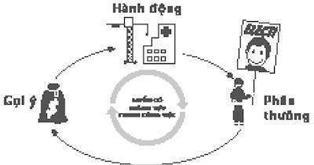
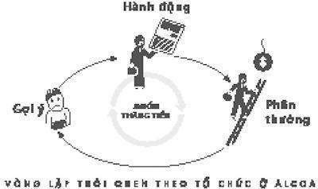

# Phần II

## Thói quen của các tổ chức thành công

* * *

# 4. Thói quen quyết định hay bản tình ca của Paul O’Neill

### *Thói quen nào có tác động nhất*

1.

Vào một ngày tháng Mười một gió thổi dữ dội năm 1987, một nhóm các nhà đầu tư xuất chúng phố Wall và các chuyên gia phân tích cổ phiếu tập trung trong phòng khiêu vũ của một khách sạn Manhattan sang trọng. Họ ở đó để gặp giám đốc điều hành mới của Công ty Aluminum ở Mỹ – hay Alcoa, như nó được biết đến – một tập đoàn sản xuất mọi thứ từ lá kim loại bọc Hershey’s Kisses và kim loại của lon Coca-Cola đến bu-lông để giữ các vệ tinh trong gần một thế kỷ nay.

Người thành lập Alcoa đã sáng tạo ra phương pháp làm tan chảy nhôm một thế kỷ trước và kể từ đó công ty trở thành một trong những công ty lớn nhất trên thế giới. Nhiều người trong nhóm đã đầu tư hàng triệu đô-la vào cổ phiếu Alcoa và hưởng lợi nhuận đều đặn. Tuy nhiên, năm ngoái, một nhà đầu tư bắt đầu càu nhàu. Quản trị của Alcoa đã phạm sai lầm hết lần này đến lần khác, trong khi các đối thủ cướp đi cả khách hàng và lợi nhuận thì lại nỗ lực để mở rộng dây chuyền sản xuất mới.

Vì thế, họ có một cảm giác thanh thản rõ ràng khi hội đồng Alcoa thông báo đây là lúc cho lãnh đạo mới. Mặc dù sự thanh thản đó trở nên không dễ dàng khi người ta thông báo lựa chọn: giám đốc điều hành mới là một viên chức chính phủ trước kia tên là Paul O’Neill. Nhiều người ở phố Wall chưa từng nghe đến tên ông. Khi Alcoa sắp xếp buổi gặp mặt và chào đón tại phòng khiêu vũ Manhattan, tất cả các nhà đầu tư chính đều yêu cầu một lời mời.

Vài phút trước bữa trưa, O’Neill bước lên bục. Ông 51 tuổi, mảnh khảnh, mặc quần áo có sọc nhỏ màu xám và thắt cà vạt màu đỏ sậm. Tóc ông đã bạc trắng và thái độ thì thẳng thắn giống như trong quân đội. Ông bước từng bước và cười ấm áp. Ông nhìn cao quý, vững chắc và tự tin. Giống như một người đứng đầu chính quyền.

Sau đó ông bắt đầu nói.

“Tôi muốn nói với mọi người về an toàn lao động,” ông nói. “Mỗi năm, rất nhiều công nhân Alcoa bị thương nặng nên họ phải nghỉ làm một ngày. Hồ sơ an toàn lao động của chúng ta tốt hơn lực lượng lao động chung của Mỹ, đặc biệt xem xét rằng công nhân của chúng ta làm việc với kim loại ở 1500 độ và các máy móc có thể xé toạc cánh tay một người đàn ông. Nhưng điều đó cũng chưa đủ. Tôi có ý định đưa Alcoa trở thành công ty an toàn nhất ở Mỹ. Tôi dự định sẽ không có tai nạn nào xảy ra.”

Khán giả cảm thấy không rõ ràng. Những cuộc gặp mặt như thế này thường theo một kịch bản có thể đoán được: Giám đốc điều hành mới sẽ bắt đầu bằng lời giới thiệu, nói đôi điều buồn cười giả vờ hạ thấp bản thân – điều gì đó về cách ông ngủ trên đường đến Trường Kinh doanh Harvard – sau đó hứa hẹn sẽ nâng cao lợi nhuận và giảm chi phí. Rồi sẽ là lời chỉ trích gắt gao thuế, điều lệ kinh doanh và đôi lúc với một sự nhiệt tình đưa ra một ít kinh nghiệm trực tiếp trong ly hôn ra tòa, luật sư. Cuối cùng, bài diễn thuyết sẽ kết thúc với nhiều từ thông dụng như – “sự hiệp lực,” “quy mô phù hợp,” và “sự hợp tác” – đến thời điểm mọi người có thể trở về văn phòng, họ vẫn chắc chắn rằng chủ nghĩa tư bản là an toàn cho những ngày sắp đến.

O’Neill không nói gì về lợi nhuận. Ông cũng không đề cập đến thuế. Cũng không có lời nào về “nhờ sự liên kết để đạt được lợi thế kinh doanh hai bên cùng có lợi.” Tất cả thính giả đều biết, bài nói của ông là về an toàn lao động, O’Neill có thể là người ủng hộ điều lệ, quy định. Hay tệ hơn, một người Đảng Dân chủ. Đó là một viễn cảnh đáng lo ngại.

“Bây giờ, trước khi tiếp tục,” O’Neill nói, “Tôi muốn chỉ ra lối thoát an toàn trong căn phòng này.” Ông chỉ đến phía sau phòng khiêu vũ. “Có hai cánh cửa ở phía sau và trong hoàn cảnh có hỏa hoạn hay bất kỳ nguy cấp khác, các bạn nên bình tĩnh bước ra, xuống cầu thang, ra tiền sảnh và rời khỏi tòa nhà.”

Yên lặng. Tiếng ồn duy nhất là tiếng xe cộ lọt qua cửa sổ. Sự an toàn? Lối thoát hỏa hoạn? Có phải là chuyện đùa không? Một nhà đầu tư trong nhóm biết O’Neill đã từng ở Washington, D.C. trong khoảng thời gian ông hơn 60 tuổi.** *Người đàn ông này chắc đã uống rất nhiều, ông nghĩ.***

Cuối cùng, ai đó giơ tay lên và đặt câu hỏi về vấn đề đầu tư trong lĩnh vực hàng không vũ trụ. Người khác thì hỏi về tỷ lệ vốn của công ty.

“Tôi không chắc là các bạn nghe tôi,” O’Neill nói. “Nếu các bạn muốn hiểu được cách Alcoa đang làm, bạn cần phải nhìn vào các số liệu về an toàn nơi làm việc. Nếu chúng ta giảm tỷ lệ tai nạn, sẽ không có những chuyện vớ vẩn nào thi thoảng bạn nghe được từ các Giám đốc điều hành. Đó là vì các cá nhân trong công ty này đã đồng ý trở thành một phần của thứ gì đó quan trọng: Họ đã đóng góp bản thân để tạo một thói quen của sự xuất sắc. An toàn sẽ là một điều cho thấy chúng ta đang tiến bộ trong thay đổi thói quen ở toàn bộ cơ quan. Đó là cách chúng ta nên được đánh giá.”

Các nhà đầu tư trong phòng gần như đổ xô ra khỏi cửa khi buổi trình bày kết thúc. Một người chạy đến tiền sảnh, tìm một cái điện thoại trả tiền và gọi cho 20 khách hàng lớn nhất.

“Tôi nói, ‘Hội đồng đã giao trách nhiệm cho một kẻ lập dị điên rồ và hắn ta sắp giết chết công ty,’” nhà đầu tư đó nói với tôi. “Tôi đề nghị họ bán cổ phiếu ngay lập tức, trước khi ai khác trong căn phòng bắt đầu gọi cho khách hàng của mình và nói với họ điều tương tự.

“Đó quả thật là một lời khuyên tệ nhất tôi đưa ra trong suốt sự nghiệp của mình.”

Một năm kể từ bài diễn thuyết của O’Neill, lợi nhuận của Alcoa đã tăng đến đỉnh trong lịch sử. Lúc O’Neill từ chức năm 2000, lợi nhuận ròng hàng năm của công ty lớn gấp 5 lần trước khi ông đến và nguồn vốn thị trường đã tăng đến 27 tỉ đô-la. Người đầu tư một triệu đô-la cho Alcoa vào ngày O’Neill được tuyển dụng sẽ kiếm được một triệu đô cổ tức khi ông đứng đầu công ty và giá cổ phiếu của họ sẽ tăng gấp 5 lần khi ông đi.

Không những thế, tất cả sự tăng trưởng đó đều diễn ra trong lúc Alcoa trở thành một trong những công ty an toàn nhất trên thế giới. Trước khi O’Neill đến, gần như mọi nhà máy của Alcoa có ít nhất một tai nạn một tuần. Khi kế hoạch an toàn của ông được áp dụng, nhiều dự án kéo dài cả năm mà không có công nhân nào mất một ngày làm việc do tai nạn. Tỷ lệ tai nạn của công nhân công ty giảm còn 1/20 tỷ lệ trung bình của Mỹ.

O’Neill đã làm thế nào để đưa một trong những công ty lớn nhất, nghiêm trọng nhất và nhiều tiềm năng nguy hiểm nhất thành một cỗ máy lợi nhuận và một thành lũy của sự an toàn?

“Tôi biết tôi phải thay đổi Alcoa,” O’Neill nói với tôi. “Nhưng bạn không thể yêu cầu mọi người thay đổi. Đó không phải là cách bộ não hoạt động. Vì thế tôi quyết định sẽ bắt đầu bằng cách tập trung vào một thứ. Nếu tôi có thể bắt đầu cản trở những thói quen xung quanh thứ đó, nó sẽ lan rộng ra toàn công ty.”

O’Neill tin rằng vài thói quen có sức mạnh bắt đầu một chuỗi sự kiện để thay đổi những thói quen khác khi nó di chuyển trong toàn tổ chức. Nói cách khác, vài thói quen ảnh hưởng nhiều hơn những cái khác trong việc làm lại cuộc sống và công việc. Có “những thói quen chủ chốt,” và chúng có thể tác động đến cách mọi người làm việc, ăn uống, vui chơi, sống, tiêu xài và giao tiếp. Những thói quen chủ chốt bắt đầu một quá trình và qua thời gian chuyển đổi mọi thứ.

Những thói quen chủ chốt thể hiện rằng sự thành công không phụ thuộc vào việc làm từng điều đúng nhưng dựa vào việc xác định vài ưu tiên quan trọng và đưa chúng đến mức độ ảnh hưởng cao hơn. Phần đầu tiên của cuốn sách này giải thích cách thói quen hoạt động, cách nó được tạo ra và thay đổi. Tuy nhiên, một thói quen sẽ tốt đẹp bắt đầu ở đâu? Hiểu được những thói quen chủ chốt đưa ra câu trả lời cho câu hỏi đó: Những thói quen tác động nhiều nhất khi nó bắt đầu đẩy mô hình cũ và tạo lại mô hình mới.

Những thói quen chủ chốt giải thích cách Micheal Phelps đoạt chức vô địch Olympic và tại sao nhiều sinh viên đại học thể hiện tốt hơn bạn cùng trang lứa. Nó mô tả tại sao có người sau nhiều năm cố gắng bất ngờ giảm khoảng 18 kg trong khi làm việc hiệu quả hơn và vẫn trở về nhà kịp lúc để ăn tối cùng con cái. Và những thói quen chủ chốt cũng giải thích cách Alcoa là một trong những cổ phiếu tốt nhất trong bảng xếp hạng Dow Jones trong khi trở thành một trong những nơi làm việc an toàn nhất trên thế giới.

* * *

Khi Alcoa lần đầu tiên tìm đến O’Neill để mời ông làm Giám đốc điều hành, ông không chắc mình muốn công việc đó. Ông đã kiếm được rất nhiều tiền và vợ ông yêu thích nơi họ sống, Connecticut. Họ không biết gì về Pittsburgh, nơi có trụ sở của Alcoa. Nhưng trước khi từ chối lời đề nghị, ông yêu cầu có thêm thời gian để suy nghĩ. Để giúp bản thân ra quyết định, ông bắt đầu nghiên cứu một danh sách những điều sẽ được ưu tiên nhất khi ông chấp nhận vị trí đó.

O’Neill luôn có một niềm tin lớn vào danh sách. Những danh sách là cách ông sắp xếp cuộc sống của mình. Ở một trường đại học thuộc bang Fresno – nơi ông hoàn thành các khóa học 3 năm qua trong khi làm việc 20 giờ một tuần – O’Neill đã phác ra một danh sách các thứ ông hy vọng hoàn thành xong trong cuộc đời, bao gồm một điều ở đầu danh sách, “Tạo ra một sự khác biệt.” Sau khi tốt nghiệp năm 1960, theo lời khuyến khích của một người bạn, O’Neill đã nộp đơn xin thực tập cho liên bang và cùng với 300.000 người khác tham gia bài kiểm tra tuyển dụng của chính phủ. 3.000 người được chọn để phỏng vấn. 300 người trong số đó được nhận công việc. O’Neill là một trong số đó.

Ông bắt đầu từ vị trí quản lý cấp trung tại Tổ chức Quản lý Cựu chiến binh và người ta yêu cầu ông học hệ thống máy tính. Trong thời gian đó, O’Neill vẫn lập các danh sách, ghi lại tại sao vài dự án lại thành công hơn những cái khác, nhà thầu nào giao đúng hạn và ai không. Ông được thăng chức mỗi năm. Và khi ông thăng tiến qua các cấp bậc của tổ chức, ông đã tự tạo danh tiếng cho mình như một người lập danh sách luôn giải quyết được vấn đề.

Vào giữa những năm 1960, Washington, D.C. rất cần những kỹ năng đó. Robert McNamara đã vừa xây lại Lầu năm góc nhờ thuê một nhóm các nhà toán học, nhà thống kê và nhà lập trình máy tính trẻ. Tổng thống Johnson muốn có tài năng trẻ của chính mình. Vì thế O’Neill được tuyển dụng cho Văn phòng Quản trị và Ngân sách, một trong những cơ quan quyền lực nhất D.C. Trong vòng 10 năm, ở tuổi 18, ông được thăng chức phó giám đốc và bất ngờ là một trong những người có ảnh hưởng nhất địa phương.

Đó là lúc sự giáo dục của O’Neill về thói quen tổ chức thật sự bắt đầu. Một trong những bài tập đầu tiên của ông là tạo ra một cơ cấu phân tích để nghiên cứu cách chính phủ chi tiền cho bảo vệ sức khỏe con người. Ông nhanh chóng biết được rằng những nỗ lực của chính phủ lẽ ra nên do các quy tắc hợp lý và quyền ưu tiên có cân nhắc kỹ dẫn dắt thì thay vào đó lại do các quy trình kỳ lạ của tổ chức mà theo nhiều cách khác nhau hoạt động như thói quen. Các quan chức và chính trị gia đang đáp lại những gợi ý bằng những lề thói tự động hơn là ra quyết định để nhận được phần thưởng như sự thăng chức hay tái bầu cử. Đó là vòng lặp thói quen – lan rộng qua hàng nghìn người và hàng tỷ đô-la.

Chẳng hạn, sau Chiến tranh thế giới thứ hai, Quốc hội đã tạo ra một chương trình để xây dựng các bệnh viện cộng đồng. Một phần tư thế kỷ sau, nó vẫn không có gì thay đổi và mỗi khi các nhà lập pháp cấp cho những quỹ chăm sóc sức khỏe mới thì các quan chức ngay lập tức bắt đầu xây dựng. Thành phố nơi có bệnh viện mới không thật sự cần nhiều giường bệnh hơn nhưng đó không phải là vấn đề. Cái có vấn đề là xây dựng một công trình lớn mà một chính trị gia có thể chỉ trỏ khi vận động bầu cử.

Các nhân viên chính phủ “dành hàng tháng trời tranh luận rèm cửa màu xanh hay vàng, tính toán phòng bệnh nên có một hay hai ti vi, thiết kế quầy y tá, những vấn đề thật sự vô nghĩa,” O’Neill nói với tôi. “Phần lớn thời gian, không ai từng hỏi liệu thành phố có cần một bệnh viện hay không. Các viên chức đã nhiễm một thói quen giải quyết mọi vấn đề y tế bằng cách xây dựng cái gì đó, chính vì thế, một nghị sĩ Hoa Kỳ có thể nói, ‘Đây là điều tôi đã làm!’ Nó chẳng có nghĩa lý gì nhưng mọi người làm đi làm lại điều gì đó.”

Các nhà nghiên cứu tìm thấy thói quen của tổ chức trong gần như mọi tổ chức và công ty họ xem xét. “Cá nhân có thói quen (habit); nhóm thì có lề thói (routine),” học giả Geoffrey Hodgson đã dành cả đời làm việc để nghiên cứu những mô hình của tổ chức, viết rằng: “Lề thói là điều tương tự của thói quen trong tổ chức.”

Với O’Neill, những loại thói quen đó có vẻ nguy hiểm. “Về cơ bản chúng tôi từ bỏ quyền ra quyết định làm cho một quá trình xảy ra mà không cần suy nghĩ thật sự,” O’Neill nói. Nhưng tại các cơ quan khác, nơi mà sự thay đổi là hão huyền, những thói quen tốt của tổ chức đang tạo ra thành công.

Ví dụ, nhiều bộ phận của NASA bị thay đổi là do những lề thói có chủ ý của tổ chức, khuyến khích các kỹ sư thử thách nhiều hơn. Khi tên lửa không người lái nổ cất cánh, bộ phận đầu não sẽ hoan hô, thế nên mọi người đều biết ban của họ đã cố gắng và thất bại, nhưng ít nhất họ đã cố gắng. Cuối cùng, nhiệm vụ điều khiển luôn tràn ngập những tiếng hoan hô mỗi lần thứ gì đó đắt tiền bay lên. Nó trở thành một thói quen của tổ chức. Hay ví dụ như Sở Bảo vệ Môi trường được thành lập năm 1970. Người điều hành đầu tiên, William Ruckelshaus, cố tình tạo ra những thói quen của tổ chức, khuyến khích những người kiểm tra tức giận khi bị cưỡng chế. Khi các luật sư xin phép trình một vụ kiện hay lề thói cưỡng chế, nó phải qua một quá trình để được chấp thuận. Sự vắng mặt là thẩm quyền để tiếp tục. Thông điệp rất rõ ràng: Ở sở, sự nóng giận được khen thưởng. Năm 1975, Sở đã ra hơn 150 quy định mới về môi trường trong một năm.

“Mỗi lần tôi nhìn vào một bộ phận khác của chính phủ, tôi biết những thói quen đó giải thích được tại sao mọi thứ có thể thành công hay thất bại,” O’Neill nói với tôi. “Cơ quan tốt nhất hiểu được tầm quan trọng của lề thói. Cơ quan tệ nhất được dẫn dắt bởi những người không bao giờ nghĩ về nó và sau đó tự hỏi tại sao không ai tuân theo yêu cầu của họ.”

Năm 1977, sau 16 năm ở Washington, D.C., O’Neill quyết định đây là lúc thích hợp để ra đi. Ông đã làm việc 15 tiếng một ngày, 7 ngày một tuần và vợ ông đã mệt mỏi vì phải chăm sóc con cái một mình. O’Neill từ chức và kiếm được một việc làm ở Công ty Giấy quốc tế, công ty giấy và bột giấy lớn nhất thế giới. Cuối cùng ông trở thành chủ tịch công ty.

Khi đó, vài người bạn cũ trong chính phủ của ông đang có vị trí trong hội đồng của Alcoa. Khi công ty cần một giám đốc điều hành mới, họ nghĩ đến ông, nếu ông nhận công việc thì ông sẽ lên danh sách ưu tiên như thế nào.

Vào thời điểm đó, Alcoa đang cố gắng. Các nhà phê bình cho rằng công nhân của công ty không đủ nhanh nhẹn và chất lượng sản phẩm thì không tốt. Nhưng ở đầu danh sách của O’Neill ông không hề viết “chất lượng” hay “hiệu quả” là ưu tiên hàng đầu của ông. Tại một công ty vừa lớn vừa lâu đời như Alcoa, bạn không thể chỉ nhấn một cái nút và hy vọng mọi người làm việc chăm chỉ hơn hay sản xuất nhiều hơn. Giám đốc điều hành trước đã cố gắng yêu cầu cải thiện và 15.000 nhân viên đã đình công. Đình công tăng cao đến mức họ mang người nộm đến bãi đỗ xe, cho chúng mặc quần áo giống quản lý và đốt hình nộm đó. “Alcoa không phải là một gia đình hạnh phúc,” một người trong khoảng thời gian đó nói với tôi. “Nó giống như gia đình Manson nhưng phải thêm vào kim loại nóng chảy.”

O’Neill xác định ưu tiên hàng đầu của mình, nếu ông nhận công việc, sẽ phải là điều mà mọi người – công đoàn và quản lý – đồng ý là quan trọng. Ông cần một sự tập trung có thể mang mọi người đến gần nhau, điều đó sẽ cho ông sức ảnh hưởng để thay đổi cách mọi người làm việc và giao tiếp.

“Tôi bắt đầu từ những điều căn bản,” ông nói với tôi. “Mọi người đều xứng đáng được rời công việc an toàn như khi họ đến, phải không nào? Ông không nên lo sợ rằng việc chăm nuôi gia đình sắp sửa giết chết mình. Đó là điều tôi quyết định tập trung vào: thay đổi thói quen an toàn của mọi người.”

Đầu danh sách của O’Neill, ông viết “AN TOÀN” và đặt ra một mục tiêu táo bạo: không tai nạn. Không chỉ không tai nạn trong nhà máy, mà còn là không tai nạn trong cả thời kỳ. Đó sẽ là trách nhiệm của ông dù cho nó tiêu tốn bao nhiêu chăng nữa.

O’Neill quyết định nhận công việc.

* * *

“Tôi thật sự rất vui khi được ở đây,” O’Neill phát biểu trong một căn phòng chật kín công nhân ở một nhà máy bốc mùi ở Tennessee vài tháng sau khi ông được tuyển dụng. Không có gì là suôn sẻ. Phố Wall vẫn còn giật mình. Công đoàn thì quan tâm. Một vài phó chủ tịch của Alcoa khó chịu khi bị lỡ mất chức vụ cao nhất. Và O’Neill vẫn cứ nói về an toàn lao động.

“Tôi sẵn lòng thỏa thuận với mọi người bất cứ gì,” O’Neill nói. Ông đang đi thăm toàn bộ nhà máy ở Mỹ của Alcoa, sau đó ông sẽ đến thăm cơ sở vật chất của công ty ở 31 nước khác. “Nhưng có một điều tôi sẽ không bao giờ thỏa thuận với mọi người, đó là sự an toàn. Tôi không muốn mọi người nói rằng chúng tôi đã bỏ qua tất cả các bước giúp bảo đảm không ai bị thương. Nếu ai muốn tranh cãi với tôi về điều đó, người đó sẽ thua.”

Điều tuyệt vời của chiến lược này là dĩ nhiên không ai muốn tranh cãi với O’Neill về độ an toàn của người lao động. Công đoàn đã đấu tranh cho nhiều quy định an toàn tốt hơn trong nhiều năm. Các nhà quản lý cũng không muốn tranh cãi về nó vì tai nạn có nghĩa là mất năng suất lao động và tinh thần thấp kém.

Tuy nhiên, nhiều người không nhận ra rằng kế hoạch của O’Neill để không còn tai nạn dẫn đến việc tái cơ cấu triệt để nhất trong lịch sử của Alcoa. O’Neill tin rằng chìa khóa để bảo vệ lao động Alcoa là hiểu được tại sao tai nạn xảy ra ở nơi đầu tiên. Và để hiểu được tại sao tai nạn xảy ra, bạn phải nắm được quá trình sản xuất sai như thế nào. Để hiểu cách mọi thứ đang đi sai, bạn phải kiếm được những người có thể huấn luyện công nhân, kiểm soát chất lượng và quá trình làm việc hiệu quả nhất, dẫn đến làm mọi thứ đúng đắn sẽ dễ dàng hơn, vì việc làm đúng cũng là việc làm an toàn.

Nói cách khác, để bảo vệ người lao động, Alcoa cần trở thành công ty nhôm tốt nhất, tổ chức hợp lý nhất thế giới.

Trong thực tế, kế hoạch an toàn của O’Neill được xây dựng theo vòng lặp thói quen. Ông xác định một gợi ý đơn giản: tai nạn của công nhân. Ông xây dựng một lề thói tự động: Bất cứ lúc nào có người bị thương, chủ tịch đơn vị phải báo cáo với O’Neill trong vòng 24 tiếng và đề ra một kế hoạch để bảo đảm tai nạn không bao giờ xảy ra lần nữa. Và có một phần thưởng: Chỉ có người tuân theo hệ thống đó mới được thăng tiến.

Lãnh đạo đơn vị là những người bận rộn. Để liên hệ với O’Neill trong vòng 24 giờ về vụ tai nạn, họ cần phải biết về tai nạn đó từ các phó chủ tịch càng sớm càng tốt. Thế nên, phó chủ tịch cần giữ liên lạc kịp thời với các cấp quản lý thấp hơn. Và quản lý cấp thấp hơn phải làm cho công nhân nâng cao cảnh giác ngay khi họ thấy vấn đề và ra một danh sách những đề nghị, để khi phó chủ tịch hỏi về một kế hoạch, họ đã có đầy một hộp ý tưởng với nhiều khả năng. Đề làm tất cả những điều đó xảy ra, mỗi đơn vị phải xây dựng hệ thống liên lạc mới cho phép công nhân cấp thấp hơn đưa ý kiến đến lãnh đạo cao nhất dễ dàng hơn và nhanh nhất có thể. Gần như mọi thứ về hệ thống cấp bậc cứng nhắc của công ty phải thay đổi để đáp ứng chương trình an toàn của O’Neill. Ông đang xây dựng những thói quen tập thể mới.

Khi những mô hình an toàn của Alcoa chuyển đổi, các khía cạnh còn lại của công ty cũng bắt đầu thay đổi với tốc độ chóng mặt. Những quy định mà công đoàn đã dành cả chục năm để chống lại – như đo lường năng suất lao động của cá nhân người lao động – bất ngờ được tuân theo, vì những đo lường đó giúp mọi người tìm ra phần nào của quá trình sản xuất đang chạy không đúng quy trình và gây đe dọa. Những chính sách mà các nhà quản lý đã chống lại rất lâu – như cho người lao động thẩm quyền để dừng một dây chuyền sản xuất khi tốc độ trở nên khó kiểm soát – bây giờ được chào đón, vì đó là cách tốt nhất để ngừng tai nạn ngay cả trước khi nó xảy ra. Công ty chuyển đổi quá nhiều nên vài công nhân nghĩ, thói quen an toàn đã lan đến các phần khác trong cuộc sống của họ.

“Hai hay ba năm trước, tôi đang ở trong văn phòng, nhìn chiếc cầu Đường số 9 ngoài cửa sổ và có vài người đàn ông đang làm việc mà không sử dụng đúng các công thức an toàn,” Jeff Shockey, giám đốc an toàn hiện nay của Alcoa, nói. Một người đang đứng ở mép ngoài của cầu an toàn trong khi người khác đang giữ chặt thắt lưng an toàn của anh ta. Họ không dùng trang bị lao động hay thiết bị an toàn nào. “Họ làm việc cho các công ty không liên quan gì đến chúng tôi, nhưng không cần nghĩ về nó, tôi đứng dậy khỏi ghế, đi bộ xuống năm tầng lầu, bước ra cái cầu và nói với những người đó, này, ông đang mạo hiểm cuộc sống của mình đấy, ông phải dùng trang bị lao động và bánh răng an toàn.” Người đàn ông giải thích giám sát của họ đã quên mang dụng cụ đến. Vì thế Shockey đã gọi đến văn phòng quản lý An toàn lao động và Sức khỏe và họ đã buộc người giám sát đến trình diện.

“Một nhà điều hành khác nói với tôi rằng, một ngày nọ, ông dừng lại ở một con đường đang đào bới gần nhà mình vì họ không có khung đào và cho mọi người một bài giảng về tầm quan trọng của quy trình đúng. Đó là vào cuối tuần, ông lại dừng xe, có con cái ở ghế sau, để giảng cho công nhân thành phố về an toàn hào giao thông. Chẳng tự nhiên chút nào, nhưng đó chính là vấn đề. Bây giờ, chúng tôi làm những thứ như thế mà không cần phải suy nghĩ gì.”

O’Neill không bao giờ hứa rằng sự tập trung của ông về an toàn lao động sẽ làm tăng lợi nhuận của Alcoa. Tuy nhiên, khi những lề thói mới của ông chuyển dịch khắp tổ chức, chi phí giảm xuống, chất lượng tăng lên và năng suất tăng vọt. Nếu kim loại nóng chảy khi văng ra làm người lao động bị thương, thì hệ thống rót sẽ được thiết kế lại để làm giảm thương tổn. Nó cũng giúp tiết kiệm tiền vì Alcoa mất ít nguyên liệu thô hơn trong khi rót. Nếu một máy liên tục hỏng, nó sẽ được thay thế, có nghĩa là sẽ có ít nguy hiểm về gãy bánh răng hơn và làm mắc tay công nhân. Nó cũng có nghĩa sản phẩm có chất lượng cao hơn vì như Alcoa biết rằng, máy móc không hoạt động đúng là nguyên nhân chính của nhôm kém chất lượng.

Các nhà nghiên cứu đã tìm thấy nhiều động lực tương tự trong hàng chục hoàn cảnh khác, kể cả cuộc sống của cá nhân.

Hãy lấy ví dụ, những nghiên cứu từ nhiều thập kỷ trước xem xét tác động của thể dục thể thao lên cuộc sống hàng ngày. Khi mọi người bắt đầu tập thể dục theo thói quen, cho dù không thường xuyên như một lần một tuần, họ bắt đầu thay đổi những mô hình khác không liên quan trong cuộc sống và thường không hay biết gì. Điển hình như, người tập thể dục bắt đầu ăn uống tốt hơn và làm việc hiệu quả hơn. Họ hút thuốc lá ít hơn và kiên nhẫn hơn với đồng nghiệp và gia đình. Họ dùng thẻ tín dụng ít hơn và nói rằng họ cảm thấy ít căng thẳng hơn. Nó không rõ ràng là tại sao. Nhưng với nhiều người, tập thể dục là một thói quen chủ chốt gây ra những thay đổi rộng hơn. “Tập thể dục lan khắp nơi,” James Prochaska nói, một nhà nghiên cứu của Đại học Đảo Rhode. “Có điều gì đó về nó làm cho những thói quen tốt khác dễ dàng hơn.”

Các nghiên cứu dẫn chứng rằng, con cái trong các gia đình có thói quen ăn tối cùng nhau có vẻ có nhiều kỹ năng làm việc nhà tốt hơn, học cao hơn, kiểm soát cảm xúc tốt hơn và tự tin hơn. Dọn giường mỗi buổi sáng liên quan đến năng suất lao động tốt hơn, cảm giác sung túc hơn và những kỹ năng tốt hơn liên quan đến tiền bạc. Không phải vì bữa ăn gia đình hay một cái giường ngủ sạch sẽ khiến cho việc học cao hơn hay tiêu xài ít đi, mà có lúc những sự chuyển đổi ban đầu bắt đầu chuỗi phản ứng giúp cho những thói quen tốt chiếm ưu thế.

Nếu bạn tập trung vào thay đổi hay tu dưỡng những thói quen chủ chốt, bạn có thể tạo ra sự chuyển đổi rộng rãi. Tuy nhiên, xác định những thói quen chủ chốt là rất khó khăn. Để tìm ra nó, bạn phải biết nơi nào để nhìn vào. Tìm ra những thói quen chủ chốt nghĩa là tìm ra những đặc điểm nhất định. Những thói quen chủ chốt mang đến thứ mà trong các tài liệu học thuật gọi là “những chiến thắng nhỏ.” Chúng giúp cho những thói quen khác phát triển hơn nhờ tạo ra những cấu trúc mới và chúng lập nên những sự mở mang mà ở đó sự thay đổi dễ lan truyền hơn.

Nhưng như O’Neill và vô số người khác biết được, vượt qua khoảng cách giữa hiểu được những lý thuyết đó và áp dụng chúng đòi hỏi chút ít sự khéo léo.

Vào một buổi sáng ngày 13/8/2008, khi đồng hồ báo thức của Micheal Phelps đổ chuông lúc 6h30, anh bò ra khỏi giường ở Làng Olympic Bắc Kinh và ngay lập tức làm theo thói quen.

Anh mặc một cái quần giữ ấm và đi ăn sáng. Anh vừa giành được ba huy chương vàng trong tuần này – dẫn đến tổng số 9 huy chương vàng trong sự nghiệp – và có 2 cuộc đua hôm nay. Lúc 7 giờ sáng, anh ngồi trong quán cà phê, ăn khẩu phần ăn thông thường cho những ngày đua gồm trứng, cháo yến mạch và 4 cốc sữa trứng đã khuấy có nhiều năng lượng, phần đầu tiên của hơn 6.000 ca-lo anh sẽ tiêu thụ trong 16 giờ tới.

Cuộc đua đầu tiên của Phelps – bơi bướm 200 mét, môn thi đấu mạnh nhất của anh – được xếp lịch lúc 10 giờ. Hai giờ trước khi có tiếng súng bắt đầu, anh bắt đầu chế độ tập luyện căng cơ thường ngày, bắt đầu với tay, rồi đến lưng, sau đó xuống mắt cá chân, mà do rất mềm dẻo nên có thể kéo dãn đến hơn 90 độ, hơn cả mức của một nữ diễn viên múa ba-lê. Lúc 8h30, anh nhảy vào hồ và bắt đầu bài tập khởi động đầu tiên, 800 mét bơi hỗn hợp, sau đó là 600 mét bơi uốn song bướm, 400 mét bơi giữ phao giữa chân, 200 mét luyện tập và một chuỗi bơi nước rút 25 mét để làm tăng nhịp tim. Buổi luyện tập thể lực mất chính xác 45 phút.

Lúc 9h15, anh rời khỏi hồ và bắt đầu nhét mình vào bộ LZR Racer, một bộ áo liền quần quá chật nên phải mất 20 phút kéo mạnh anh mới mặc được. Sau đó, anh kẹp chặt tai nghe qua tai, mở một liên khúc nhạc hip-hop anh thường nghe trước mỗi cuộc đua và chờ đợi.

Phelps bắt đầu bơi lội lúc 7 tuổi để đốt cháy năng lượng đã làm cho mẹ anh và giáo viên lo lắng. Khi một huấn luyện viên bơi lội ở địa phương tên là Bob Bowman nhìn thấy thân mình dài, tay to và đôi chân tương đối ngắn (giúp làm giảm sức kéo trong nước) của Phelps, ông biết Phelps có thể trở thành một nhà quán quân. Nhưng Phelps lại dễ xúc động. Anh gặp rắc rối để giữ bình tĩnh trước các cuộc đua. Bố mẹ anh đã ly hôn và anh gặp vấn đề khi có căng thẳng. Bowman mua một cuốn sách về các bài tập thư giãn và nhờ mẹ của Phelps đọc to chúng mỗi đêm. Quyển sách có một câu – “Nắm chặt tay phải bạn thành nắm đấm và thả ra. Hãy tưởng tượng sự căng thẳng đang tan đi” – đã làm căng thẳng và thư giãn mỗi phần cơ thể của Phelps trước khi anh ngủ.

Bowman tin rằng với người bơi lội, chìa khóa đến chiến thắng là tạo ra được những lề thói đúng. Như Bowman biết, Phelps có một thể lực hoàn hảo cho bơi lội. Nghĩa là, tất cả ai cuối cùng tranh tài tại Olympic đều có cơ bắp hoàn hảo. Bowman cũng thấy rằng Phelps mặc dù còn trẻ nhưng có một khả năng ám ảnh quá mức làm cho anh trở thành một vận động viên lý tưởng. Một lần nữa, những người thể hiện xuất sắc lại là những người bị ám ảnh.

Tuy nhiên, điều Bowman có thể mang đến cho Phelps - điều làm anh khác với những đối thủ khác – là những thói quen làm cho anh là người bơi lội có suy nghĩ mạnh nhất trong hồ. Ông không cần phải kiểm soát mọi khía cạnh cuộc sống của Phelps. Toàn bộ điều ông cần làm là nhắm đến một vài thói quen nhất định không liên quan gì đến bơi lội và mọi thứ liên quan để tạo ra nếp suy nghĩ đúng. Ông chỉ ra một chuỗi các lề thói giúp Phelps có thể dùng để trở nên bình tĩnh và tập trung trước mỗi cuộc đua, để tìm ra những lợi thế nhỏ có thể tạo ra sự khác biệt trong thể thao, nơi mà chiến thắng có thể đến trong một phần nghìn giây.

Ví dụ, khi Phelps còn là một thiếu niên, khi luyện tập xong, Bowman sẽ bảo anh về nhà và “xem băng video. Hãy xem nó trước khi đi ngủ và sau khi thức dậy.”

Băng video không có thật. Nó chỉ là sự tưởng tượng về cuộc đua hoàn hảo nhất. Mỗi tối trước khi đi ngủ và mỗi sáng sau khi thức dậy, Phelps sẽ tưởng tượng mình nhảy khỏi bệ và từ từ bơi một cách hoàn hảo. Anh hình dung ra cú nhảy của mình, vách hồ bơi, nước nhỏ ra khỏi miệng mình khi miệng anh chạm bề mặt, cái gì có vẻ sẽ rơi khỏi mũ bơi vào lúc cuối. Anh sẽ nằm trên giường nhắm mắt và xem toàn bộ trận đấu cùng những chi tiết nhỏ nhất lặp đi lặp lại nhiều lần cho đến lúc anh thuộc lòng từng giây phút.

Lúc luyện tập, khi Bowman yêu cầu Phelps bơi với tốc độ thi đấu, ông sẽ la lên, “Nhét đoạn băng vào!” và Phelps sẽ tự thúc đẩy mình tốt nhất có thể. Nó gần như hạ xuống từ cực điểm khi anh băng qua nước. Anh đã làm thế rất nhiều lần trong đầu nên bây giờ nó giống như đã thuộc lòng. Nhưng nó có hiệu quả. Anh càng lúc càng nhanh hơn. Cuối cùng, tất cả những gì Bowman phải làm trước một cuộc đua là thì thầm, “Hãy chuẩn bị sẵn sàng đoạn băng,” Phelps sẽ bình tĩnh và vượt qua trận đấu.

Và khi Bowman thiết lập một vài lề thói chính trong cuộc sống của Phelps, tất cả những thói quen khác – cách ăn uống và lịch luyện tập, thói quen giãn cơ thể và đi ngủ – có vẻ như về đúng vị trí của nó. Cốt lõi lý do những thói quen đó lại hiệu quả, lý do chúng như là những thói quen chủ chốt, được biết đến trong các tài liệu học thuật với tên gọi “chiến thắng nhỏ”.

* * *

Chiến thắng nhỏ là một phần của cách những thói quen chủ chốt tạo ra sự thay đổi lan rộng. Một lượng lớn nghiên cứu cho thấy chiến thắng nhỏ có sức mạnh to lớn, một sự tác động không cân đối đến chiến thắng. “Chiến thắng nhỏ là ứng dụng đều đặn của một lợi thế nhỏ,” một giáo sư trường Cornell viết năm 1984. “Khi một chiến thắng nhỏ được hoàn thành, sức lực được chuẩn bị để giúp cho một chiến thắng nhỏ khác.” Chiến thắng nhỏ là nguồn lực cho những thay đổi bằng cách đưa những lợi thế nhỏ vào các mô hình thuyết phục mọi người rằng thành tựu lớn hơn đang trong tầm tay.

Ví dụ như, khi các tổ chức về quyền lợi của người đồng tính nam bắt đầu vận động chống lại hội chứng sợ và kỳ thị người đồng tính vào cuối những năm 1960, nỗ lực đầu tiên của họ chỉ mang đến một chuỗi thất bại. Họ thúc đẩy để bãi bỏ các luật lệ được sử dụng để truy tố những người đồng tính và bị đánh bại hoàn toàn ở các cơ quan lập pháp của ban. Các giáo viên cố gắng tổ chức các hoạt động để khuyên bảo người đồng tính trẻ và đã bị sa thải do đề nghị sự đồng tính nên được chấp nhận. Có vẻ như những mục tiêu lớn hơn của cộng đồng những người đồng tính – chấm dứt phân biệt đối xử và sự quấy nhiễu của cảnh sát, thuyết phục Hiệp hội Tâm thần Mỹ dừng định nghĩa sự đồng tính là một căn bệnh sinh lý – nằm ngoài tầm với. Sau đó, vào đầu những năm 1970, Nhóm đấu tranh đồng tính của Hiệp hội Thư viện Mỹ quyết định tập trung vào một mục tiêu khiêm tốn nhất: thuyết phục Thư viện Quốc gia Hoa kỳ phân loại lại những sách về phong trào đấu tranh đồng tính từ HQ 71-471 (“Quan hệ giới tính không bình thường, Bao gồm tội phạm tình dục”) thành một hạng mục khác, ít mang tính miệt thị hơn.

Năm 1972, sau khi nhận được một lá thư yêu cầu việc phân loại lại, Thư viện Quốc gia Hoa Kỳ đã đồng ý chuyển đổi, phân loại lại sách vào hạng mục mới tạo, HQ 76.5 (“Tình trạng đồng tính, Đồng tính nữ - Phong trào đấu tranh đồng tính, Phong trào ủng hộ đồng tính”). Đó là thay đổi nhỏ trong một thói quen tập thể cũ kỹ liên quan đến cách sắp xếp sách, nhưng lại gây hứng thú. Tin tức về chính sách mới lan truyền khắp cả nước. Các tổ chức quyền lợi người đồng tính chỉ ra sự thành công để bắt đầu nỗ lực gây quỹ. Trong vài năm, các chính trị gia đồng tính công khai đua tranh vào văn phòng chính trị ở California, New York, Massachusetts và Oregon, nhiều người trong số đó trích ra quyết định của Thư viện Quốc gia Hoa Kỳ như một nguồn cảm hứng. Năm 1973, Hiệp hội Tâm thần Mỹ, sau nhiều năm thảo luận nội bộ, đã viết lại định nghĩa về đồng tính để nó không còn là một căn bệnh sinh lý nữa – chuẩn bị lối đi cho việc thông qua luật lệ của bang quy định về phân biệt đối xử với người khác vì khuynh hướng tình dục của họ là bất hợp pháp.

Và tất cả bắt đầu với một chiến thắng nhỏ.

“Những chiến thắng nhỏ không kết hợp trong một hình thức chặt chẽ, thẳng hàng hay theo chuỗi, với mỗi bước là một bước rõ ràng gần với một mục tiêu định trước,” Karl Weick, một nhà tâm lý lỗi lạc của tổ chức, đã viết. “Điều phổ biến hơn là hoàn cảnh mà những chiến thắng nhỏ tỏa ra… giống như những thí nghiệm thu nhỏ kiểm chứng các lý thuyết ẩn về sự đối kháng, cơ hội, những nguồn giúp đỡ và sự cản trở bị ẩn giấu trước khi tình huống được mở ra.”

Đó chính xác là điều đã xảy ra với Micheal Phelps. Khi Bob Bowman bắt đầu làm việc với Phelps và mẹ anh về những thói quen chủ chốt của sự tưởng tượng và sự thư giãn, cả Bowman và Phelps đều không có ý tưởng gì về điều họ đang làm. “Chúng tôi làm thí nghiệm, thử nhiều thứ khác nhau cho đến khi chúng tôi tìm ra thứ có hiệu quả,” Bowman nói với tôi. “Cuối cùng chúng tôi tìm ra cách tốt nhất để tập trung vào những khoảnh khắc thành công nhỏ và xây dựng chúng thành những tác động thể chất. Chúng tôi đưa nó thành một lề thói. Chúng tôi làm một chuỗi việc trước mỗi cuộc đua để mang đến cho Micheal cảm giác đang xây dựng chiến thắng.

“Nếu bạn hỏi Micheal điều gì đang diễn ra trong đầu anh trước cuộc đua, anh sẽ trả lời anh không thật sự suy nghĩ điều gì cả. Anh chỉ làm theo chương trình. Nhưng điều đó không đúng. Nó giống như những thói quen của anh đang tiếp tục. Khi đến cuộc đua, anh đã qua hơn nửa kế hoạch và đã thành công ở mọi bước. Mọi bài căng cơ xảy ra như anh đã sắp xếp. Những bài khởi động giống như anh đã tưởng tượng. Tai nghe của anh đang phát chính xác những gì anh mong đợi. Cuộc đua thật sự chỉ là một bước khác trong một mô hình đã bắt đầu sớm hơn trong ngày đó và không có gì khác ngoài chiến thắng. Chiến thắng là một sự kéo dài tự nhiên.”

Trở lại Bắc Kinh, đó là lúc 9h56’ sáng – 4 phút trước khi cuộc đua bắt đầu – và Phelps đứng phía sau bục bắt đầu, nhảy nhẹ nhàng bằng ngón chân. Khi người giới thiệu gọi tên anh, Phelps bước lên bục như anh thường làm trước mỗi cuộc đua và rồi anh lại bước xuống như anh thường làm. Anh xoay cánh tay 3 lần như anh thường làm trước mỗi cuộc đua kể từ năm 12 tuổi. Anh lại bước lên bục lần nữa, vào tư thế của mình và khi tiếng súng vang lên, anh nhảy xuống.

Phelps biết có điều gì đó không ổn ngay khi anh chạm nước. Có hơi nước trong kính bơi của anh. Anh không biết liệu nó có đang rỉ ra từ phía trên hay dưới nhưng khi anh làm vỡ mặt nước và bắt đầu bơi, anh hy vọng chỗ rỉ không trở nên quá tệ.

Tuy nhiên, tại lần quay thứ hai, mọi thứ bị mờ đi. Ngay khi anh tiếp cận chỗ quay thứ ba và vòng đua cuối, tròng kính của anh đã đầy nước. Phelps không thể nhìn thấy gì. Không phải đường vạch dọc đáy hồ, cũng không phải chữ T màu đen đánh dấu thành tường tiếp cận. Anh không thể thấy còn lại bao nhiêu sải tay nữa. Với nhiều vận động viên bơi lội, mất tầm nhìn vào giữa một vòng đấu cuối của Olympic sẽ là nguyên nhân cho sự hoang mang.

Phelps rất bình tĩnh.

Mọi thứ khác trong ngày hôm đó đã đi theo kế hoạch. Cặp kính bơi bị rỉ là một sự sai lệch nhỏ nhưng anh đã có chuẩn bị. Bowman đã có lần buộc Phelps bơi trong hồ ở Michigan trong màn đêm vì tin rằng anh cần phải sẵn sàng cho mọi sự bất ngờ. Một vài băng video trong đầu Phelps có ghi lại những vấn đề như thế. Anh đã tập dượt trong trí óc cách anh sẽ phản ứng lại một cặp kính hỏng. Khi anh bắt đầu vòng đua cuối cùng, Phelps ước tính cú chạm cuối cần bao nhiêu sải tay nữa – 19 hay 20, có thể 21 – và bắt đầu đếm. Anh cảm thấy hoàn toàn thư giãn khi anh bơi hết sức lực. Được nửa vòng cuối, anh bắt đầu nỗ lực hơn, một cú vọt cuối cùng đã trở thành một trong những kỹ thuật chính của anh để lấn át đối thủ. Vào sải thứ 18, anh bắt đầu dự đoán vách hồ. Anh có thể nghe đám đông la hét, nhưng vì anh chẳng thấy gì, anh chẳng thể biết họ đang cổ vũ cho mình hay người khác. 19 sải, rồi 20. Có vẻ như anh cần một cú nữa. Đó là điều mà đoạn băng trong đầu anh nói. Anh sải tay lần thứ 21, một sải rộng, trượt với đôi tay căng rộng và chạm bức vách. Anh đã tính thời gian hoàn hảo. Khi anh tháo kính xuống và nhìn vào bảng ghi điểm, nó ghi “WR” – kỉ lục thế giới – cạnh tên anh. Anh đã giành một huy chương vàng khác.

Sau cuộc đua, một phóng viên hỏi anh cảm thấy gì khi bơi mà không nhìn được.

“Giống như tôi tưởng tượng nó,” Phelps nói. Đó là một chiến thắng thêm vào cuộc đời đầy những chiến thắng nhỏ.

* * *

Sáu tháng sau khi Paul O’Neill trở thành Giám đốc điều hành của Alcoa, ông nhận được một cuộc điện thoại lúc nửa đêm. Một quản lý nhà máy ở Arizona đang gọi đến trong trạng thái hoảng loạn, báo một máy ép đã ngừng hoạt động và một công nhân – một thanh niên trẻ vừa vào công ty được vài tuần, hăng hái làm việc vì công việc này sẽ giúp anh có điều kiện chăm sóc sức khỏe cho người vợ đang mang thai – đã cố gắng sửa chữa. Anh đã nhảy qua bức tường an toàn màu vàng quanh cái máy và bước qua hầm. Có một mảnh nhôm nhét chặt trong cái bản lề của một nhánh rung 1,8 mét. Người thanh niên trẻ nắm chặt mảnh nhôm và lấy nó ra. Cái máy đã được sửa. Sau lưng anh, cái nhánh bắt đầu vòng cung của nó, rung hướng về phía đầu anh. Khi nó chạm đến, cái nhánh đã nghiền vỡ sọ. Anh chết ngay lập tức.

14 giờ sau, O’Neill yêu cầu tất cả nhà điều hành các nhà máy – cũng như nhân viên cấp cao của Alcoa ở Pittsburgh – đến một cuộc họp khẩn cấp. Gần như cả ngày, họ cẩn thận tạo lại vụ tai nạn theo biểu đồ bằng cách xem băng ghi hình nhiều lần. Họ nhận thấy hàng chục lỗi dẫn đến cái chết, bao gồm cả hai quản lý thấy người đó nhảy qua rào chắn nhưng không cản lại, một chương trình huấn luyện đã không nhấn mạnh đến người mà anh sẽ không bị đổ lỗi vì máy hỏng, thiếu hướng dẫn để anh tìm một người quản lý trước khi cố gắng sửa chữa và thiếu thiết bị cảm biến để tự động tắt máy khi ai đó bước vào hầm.

“Chúng ta giết anh ấy”, O’Neill nói với cả nhóm với nét mặt đầy thất vọng. “Đó là lỗi của người lãnh đạo. Tôi đã gây ra cái chết của anh ấy. Và đó là lỗi của tất cả mọi người trong bộ máy quản lý.”

Điều đó làm các nhà điều hành trong phòng ngạc nhiên. Chắc chắn, một tai nạn bi thảm đã xảy ra nhưng những tai nạn bi thảm là một phần cuộc sống của Alcoa. Đó là một công ty lớn với nhiều công nhân làm việc với kim loại nóng đỏ và nhiều máy móc nguy hiểm. “Paul đến như một kẻ ngoại đạo và có rất nhiều nghi ngờ khi ông nói về an toàn,” Bill O’Rourke, một nhà điều hành cấp cao nói. “Chúng tôi nhận thấy nó sẽ kéo dài khoảng vài tuần và sau đó ông sẽ bắt đầu tập trung vào thứ khác. Nhưng cuộc họp này thật sự làm mọi người sửng sốt. Ông rất nghiêm túc với điều bình thường đó, đủ nghiêm túc để ông có thể thức cả đêm để lo lắng về vài công nhân ông không bao giờ gặp mặt. Đó là lúc mọi thứ bắt đầu thay đổi.”

Trong vòng một tuần sau cuộc họp, tất cả các rào chắn an toàn ở các nhà máy của Alcoa được sơn lại màu vàng tươi và nhiều chính sách mới được soạn ra. Các nhà quản lý nói với công nhân không phải lo sợ khi đề nghị chủ động bảo trì và những quy định được làm rõ nên không ai còn cố gắng sửa chữa khi không đảm bảo an toàn. Sự thận trọng mới làm giảm đáng kể tỷ lệ tai nạn trong thời gian ngắn. Alcoa trải qua một chiến thắng nhỏ.

O’Neill chụp lấy điều đó.

“Tôi muốn chúc mừng mọi người vì đã làm giảm số lượng tai nạn dù chỉ trong hai tuần,” ông viết trong một bản thông báo nội bộ dán khắp công ty. “Chúng ta không nên ăn mừng vì chúng ta đã làm theo quy định hay làm giảm con số. Chúng ta nên ăn mừng vì chúng ta đang cứu những cuộc đời.”

Các công nhân sao chép thông báo đó và dán vào tủ đồ của mình. Ai đó còn vẽ cả tranh O’Neill trên tường một máy làm chảy có khắc lời dẫn từ thông báo nội bộ bên dưới. Cũng như những lề thói của Micheal Phelps không liên quan gì đến bơi lội và mọi thứ liên quan đến thành công của anh, nỗ lực của O’Neill bắt đầu tăng nhanh thành những thay đổi không liên quan gì đến an toàn nhưng dù sao cũng chuyển đổi.

“Tôi nói với các công nhân làm theo giờ, ‘Nếu quản lý của bạn không tuân theo các vấn đề an toàn, hãy gọi đến nhà tôi, đây là số của tôi,’” O’Neill nói với tôi. “Các công nhân bắt đầu gọi nhưng họ không muốn nói về tai nạn. Họ muốn nói về những ý tưởng tuyệt vời khác.”

Ví dụ như, nhà máy Alcoa sản xuất nhôm dành riêng cho nhà ở đã cố gắng nhiều năm vì các nhà điều hành thử đoán trước những màu phổ biến và không thể tránh được đoán sai. Họ sẽ trả cho các nhà tư vấn hàng triệu đô-la để lựa chọn màu sơn và 6 tháng sau, nhà kho sẽ tràn ngập “màu vàng chói lóa” và nhu cầu bất ngờ ngoài dự tính màu “xanh thợ săn.” Một ngày nọ, một công nhân cấp thấp đưa ra một lời đề nghị nhanh chóng được đưa đến tổng quản lý: Nếu chúng ta nhóm những máy sơn cùng nhau, chúng ta có thể chuyển màu nhanh hơn và đáp ứng kịp thời sự chuyển đổi nhu cầu của khách hàng. Trong vòng một năm, lợi nhuận trên nhôm dành riêng tăng gấp đôi.

Những chiến thắng nhỏ bắt đầu với sự chú trọng của O’Neill vào an toàn tạo ra một môi trường trong đó mọi loại ý tưởng mới khác nhanh chóng tăng lên.

“Thực ra người công nhân đó đã đề nghị ý tưởng sơn 10 năm nay rồi nhưng không đến được tai bất kỳ ai thuộc ban quản lý,” một nhà điều hành của Alcoa nói với tôi. “Rồi khi chúng tôi hỏi xin lời khuyên về sự an toàn, anh ấy nhận ra tạo sao không nói với họ về ý tưởng khác này. Giống như anh ấy đã cho chúng ta những con số để thắng xổ số vậy.”

Khi còn trẻ, Paul O’Neill làm việc cho chính phủ và xây dựng một khuôn khổ để phân tích phần dành riêng cho chăm sóc sức khỏe của liên bang, một trong những vấn đề đầu tiên liên quan đến công chức là tử vong ở trẻ sơ sinh. Vào lúc đó, nước Mỹ là một trong những quốc gia giàu nhất trên thế giới. Nhưng Mỹ có tỷ lệ tử vong ở trẻ sơ sinh cao hơn nhiều nước châu Âu và vài phần của Nam Mỹ. Thông thường, những khu vực nông thôn chứng kiến một con số đáng kinh ngạc về trẻ em tử vong trước lần sinh nhật đầu tiên.

O’Neill được giao nhiệm vụ tìm ra lý do. Ông yêu cầu các cơ quan liên bang khác bắt đầu phân tích số liệu về tử vong ở trẻ sơ sinh và mỗi lần ai đó quay lại cùng một câu trả lời, ông lại đưa ra một câu hỏi khác, cố gắng để nắm sâu hơn và hiểu được nguyên nhân sâu xa của vấn đề. Khi ai đó đến văn phòng của O’Neill với vài khám phá, O’Neill bắt đầu chất vấn họ bằng nhiều câu hỏi mới. Ông làm mọi người phát điên vì ông không ngừng buộc họ phải tìm hiểu thêm để hiểu được điều gì thực sự đang diễn ra. (“Tôi yêu Paul O’Neill, nhưng anh không thể trả cho tôi đủ lương để tôi làm việc với ông ấy một lần nữa,” một viên chức nói với tôi. “Người đàn ông đó không bao giờ lặp lại một câu trả lời để ông có thể biến nó thành 20 giờ làm việc khác.”)

Ví dụ, vài nghiên cứu cho rằng nguyên nhân lớn nhất của tử vong ở trẻ sơ sinh là do sinh non. Và lý do trẻ sơ sinh bị sinh sớm là do các bà mẹ mắc chứng thiếu dinh dưỡng khi đang mang thai. Vì thế, để giảm tỷ lệ tử vong ở trẻ sơ sinh, cần cải thiện chế độ ăn uống của các bà mẹ. Thật đơn giản phải không? Nhưng để ngăn chứng thiếu dinh dưỡng, phụ nữ phải cải thiện chế độ dinh dưỡng trước khi họ mang thai. Điều đó có nghĩa là chính phủ phải bắt đầu hướng dẫn phụ nữ về dinh dưỡng trước khi họ bắt đầu có ham muốn tình dục. Có nghĩa là các viên chức phải xây dựng chương trình giảng dạy về dinh dưỡng trong trường trung học.

Tuy nhiên, khi O’Neill bắt đầu hỏi về cách xây dựng những chương trình đó, ông nhận thấy nhiều giáo viên trung học ở các khu vực nông thôn còn không biết đủ kiến thức sinh học căn bản để dạy về dinh dưỡng. Vì thế chính phủ phải xây dựng lại cách các giáo viên được giáo dục trong trường đại học và cho họ một nền tảng kiến thức về sinh học tốt hơn để cuối cùng họ có thể dạy về dinh dưỡng cho trẻ vị thành niên nữ, nên những thanh niên đó sẽ ăn uống tốt hơn trước khi họ bắt đầu quan hệ và cuối cùng có đủ dinh dưỡng khi họ có con.

Các viên chức làm việc với O’Neill cuối cùng tìm ra, việc đào tạo giáo viên kém chính là nguyên nhân sâu xa của tử vong cao ở trẻ sơ sinh. Nếu bạn hỏi bác sĩ hay các nhân viên sức khỏe cộng đồng về một kế hoạch để chống tử vong ở trẻ sơ sinh, không ai trong số họ sẽ đề nghị thay đổi cách đào tạo giáo viên. Họ sẽ không biết mối liên hệ đó. Tuy nhiên, bằng cách dạy các sinh viên đại học về sinh học, cuối cùng bạn giúp họ có thể đưa những kiến thức đó đến thanh thiếu niên, những người bắt đầu ăn uống dinh dưỡng hơn và nhiều năm sau sinh ra những đứa trẻ khỏe mạnh hơn. Ngày nay, tỷ lệ tử vong ở trẻ sơ sinh của Mỹ là 68%, thấp hơn khi O’Neil bắt đầu công việc.

Kinh nghiệm làm việc của O’Neill với tử vong ở trẻ sơ sinh cho thấy cách thứ hai để những thói quen chủ chốt khuyến khích sự thay đổi: bằng cách tạo ra các cấu trúc giúp những thói quen khác phát triển. Trong trường hợp tử vong do sinh non, thay đổi chương trình đào tạo đại học cho giáo viên bắt đầu một chuỗi phản ứng mà cuối cùng lan truyền đến cách nữ sinh được giáo dục ở những khu vực nông thôn và liệu nó có lan truyền thành công khi họ mang thai. Và thói quen thúc đẩy không ngừng các quan chức chính phủ khác của O’Neill để họ tiếp tục nghiên cứu cho đến khi họ tìm ra nguyên nhân sâu xa của vấn đề để kiểm tra cách suy nghĩ của chính phủ về các vấn đề như tử vong ở trẻ sơ sinh.

Điều tương tự có thể xảy ra trong cuộc sống mỗi người. Ví dụ như, cho đến 20 năm trước, kiến thức phổ thông phổ biến về cách tốt nhất để mọi người giảm cân là thay đổi hoàn toàn cuộc sống của họ. Bác sĩ đưa cho các bệnh nhân béo phì chế độ ăn uống nghiêm ngặt và khuyên họ tham gia tập thể hình, tham dự những buổi tư vấn thường lệ - đôi lúc có thể tham dự mỗi ngày – và chuyển đổi hoạt động hàng ngày, ví dụ như leo cầu thang bộ thay vì dùng thang máy. Người ta nghĩ chỉ bằng cách làm xáo trộn hoàn toàn cuộc sống của ai đó mới có thể triệt bỏ được thói quen xấu của họ.

Nhưng khi các nhà nghiên cứu xem xét hiệu quả của những phương pháp đó trong thời gian dài, họ phát hiện ra mình đã thất bại. Các bệnh nhân sẽ đi cầu thang vài tuần, nhưng đến cuối tháng, có quá nhiều rắc rối. Họ bắt đầu ăn kiêng và tập thể hình, nhưng sau khi nhiệt tình lần đầu tiên giảm dần, họ trở lại thói quen cũ là ăn uống và xem ti vi. Thay đổi quá nhiều cùng một lúc làm cho không sự thay đổi nào có hiệu quả.

Sau đó, năm 2009, một nhóm các nhà nghiên cứu do Viện Sức khỏe Quốc gia hỗ trợ xuất bản một nghiên cứu về một cách tiếp cận khác để giảm cân. Họ đã tập hợp một nhóm 600 người béo phì và yêu cầu họ tập trung viết ra mọi thứ họ ăn ít nhất một ngày trong một tuần.

Ban đầu, việc đó không hề dễ dàng. Người tham gia quên mang theo sổ ghi ăn uống, ăn vặt hay quên ghi chú lại. Tuy nhiên, dần dần, mọi người bắt đầu ghi lại bữa ăn của mình mỗi lần một tuần – và đôi lúc thường xuyên hơn. Nhiều người bắt đầu giữ một nhật ký ăn uống hàng ngày. Cuối cùng, nó trở thành một thói quen. Sau đó, có điều xảy ra ngoài mong đợi. Những người tham gia bắt đầu nhìn vào danh sách và tìm ra những mô hình mà họ không biết đến sự tồn tại của nó. Họ có vẻ thường ăn vặt vào khoảng 10 giờ sáng nên họ bắt đầu đặt một quả táo hay chuối trên bàn để ăn vặt giữa sáng. Những người khác bắt đầu sử dụng danh sách để sắp xếp thực đơn sắp tới và khi đến bữa tối, họ ăn những món tốt cho sức khỏe mà họ đã viết ra hơn là thức ăn nhanh trong tủ lạnh.

Các nhà nghiên cứu đã không đề ra bất cứ lề thói nào trong đó. Đơn giản họ chỉ yêu cầu mọi người viết ra những gì họ ăn một lần một tuần. Nhưng thói quen chủ chốt đó – ghi lại danh sách món ăn – tạo ra một cấu trúc giúp những thói quen khác phát triển. Trong sáu tháng nghiên cứu, những người lưu lại danh sách món ăn hàng ngày đã giảm cân gấp hai lần hơn những người khác.

“Sau một thời gian, danh sách đã nằm trong đầu tôi,” một người nói với tôi. “Tôi bắt đầu suy nghĩ khác đi về bữa ăn. Nó mang đến cho tôi một hệ thống để suy nghĩ về thức ăn mà không mắc trầm cảm.”

O’Neill cảm nhận điều tương tự cũng xảy ra ở Alcoa. Cũng như các tạp chí ẩm thực cung cấp cấu trúc cho những thói quen khác phát triển, những thói quen an toàn của O’Neill tạo ra một môi trường trong đó nhiều lề thói khác hình thành. Từ rất sớm, O’Neill đi theo nhiều bước không bình thường để yêu cầu các văn phòng của Alcoa trên khắp thế giới kết nối trong cùng một mạng lưới điện tử. Đó là vào đầu những năm 1980, khi những mạng lưới quốc tế lớn thường không kết nối với máy tính để bàn của mọi người. O’Neill biện hộ cho lời đề nghị của mình bằng cách tranh luận nó cần thiết để tạo ra một hệ thống thông tin an toàn thật nhanh để các nhà quản lý có thể sử dụng để chia sẻ nhiều đề nghị. Kết quả là, Alcoa phát triển một trong những hệ thống thư điện tử liên kết thế giới đầu tiên thật sự.

O’Neill đăng nhập vào mỗi buổi sáng và gửi tin nhắn để bảo đảm mọi người cũng đã đăng nhập. Ban đầu, mọi người sử dụng mạng lưới chủ yếu để thảo luận các vấn đề an toàn. Sau đó, khi thói quen dùng thư điện tử trở nên phổ biến và tiện lợi hơn, họ bắt đầu đăng thông tin về tất cả các chủ đề khác, như điều kiện thị trường địa phương, hạn ngạch buôn bán và các vấn đề kinh doanh. Các nhà điều hành cấp cao bắt buộc phải gửi một bản báo cáo vào thứ Sáu hàng tuần mà bất cứ ai trong công ty cũng có thể đọc. Một nhà quản lý ở Brazil sử dụng mạng lưới để gửi số liệu về thay đổi giá sắt đến một đồng nghiệp ở New York. Nhân viên New York lấy số liệu đó và chuyển thành một lợi nhuận nhanh cho công ty ở phố Wall. Không lâu sau, mọi người sử dụng hệ thống để trao đổi về mọi thứ. “Tôi sẽ gửi vài bản báo cáo tai nạn của tôi và tôi biết mọi người đọc nó, nên tôi nhận ra tại sao không gửi thông tin giá cả hay tin tức đến các công ty khác?” một nhà quản lý nói với tôi. “Giống như chúng tôi đã khám phá ra một vũ khí bí mật. Các đối thủ không thể tìm ra cách chúng tôi đang làm nó.”

Khi trang Web phát triển hơn, Alcoa được định vị hoàn hảo để tận dụng lợi thế. Thói quen chủ chốt của O’Neill – an toàn lao động – đã tạo ra một nền tảng khuyến khích lề thói khác – thư điện tử - nhiều năm trước các đối thủ khác.

* * *

Vào năm 1996, Paul O’Neill đã ở Alcoa được 10 năm. Trường Kinh doanh Harvard và trường Kenedy của chính phủ đã nghiên cứu tài lãnh đạo của ông. Ông thường được nhắc đến là một viên chức kinh doanh đầy tiềm năng hay viên chức của Bộ nội vụ. Nhân viên của ông và công đoàn đánh giá ông rất cao. Dưới sự lãnh đạo của ông, giá cổ phiếu của Alcoa đã tăng hơn 200%. Cuối cùng, thành công của ông được công nhận khắp mọi nơi.

Vào tháng Năm năm đó, tại một cuộc họp cổ đông ở thủ phủ Pittsburgh, một nữ tu sĩ Benedictine đứng lên trong kỳ chất vấn và buộc tội O’Neill nói dối. Nữ tu sĩ Mary Margaret đại diện một nhóm ủng hộ xã hội liên quan đến lương và điều kiện bên trong một nhà máy Alcoa ở Ciudad Acuna, Mexico. Bà nói rằng trong khi O’Neill tán dương phương pháp an toàn của Alcoa, các công nhân ở Mexico đang mắc bệnh vì khí độc.

“Điều đó là không thật,” O’Neill nói với cả phòng. Trên máy tính cá nhân của mình, ông dừng lại ở những báo cáo an toàn từ nhà máy Mexico. “Mọi người thấy chứ?” ông nói, chỉ ra cho cả phòng điểm số cao về an toàn, tuân theo quy định về môi trường và khảo sát mức độ thỏa mãn của công nhân. Nhà điều hành chịu trách nhiệm vật chất, Robert Barton, là một trong những nhà quản lý thâm niên nhất của Alcoa. Ông đã ở công ty hàng chục năm rồi và chịu trách nhiệm vài quan hệ đối tác lớn nhất của công ty. Nữ tu sĩ nói rằng mọi người không nên tin O’Neill. Bà ngồi xuống.

Sau cuộc họp, O’Neill mời bà đến văn phòng. Luật dòng tu của nữ tu sở hữu 50 cổ phiếu Alcoa và nhiều tháng họ yêu cầu một phiếu bầu cử cổ đông về một quyết định để xem lại những quy định của công ty ở Mexico. O’Neill hỏi nữ tu Mary liệu bà đã từng đến nhà máy chưa. Chưa, bà nói với ông. Để an toàn, O’Neill yêu cầu trưởng phòng nhân sự của công ty và nhóm luật sư cố vấn bay đến Mexico để tìm hiểu điều gì đang xảy ra.

Khi các nhà điều hành đến, họ xem xét hồ sơ nhà máy Acuna và tìm thấy các báo cáo về một tai nạn chưa bao giờ được gửi đến trụ sở. Vài tháng trước đó, trong tòa nhà xảy ra sự tụ khói. Sự kiện đó tương đối nhỏ. Barton, người điều hành nhà máy, đã lắp đặt hệ thống thông gió để loại bỏ khí. Những người đã từng mắc bệnh hồi phục hoàn toàn trong vòng một hay hai ngày.

Nhưng Barton không bao giờ báo cáo sự việc đó.

Khi các nhà điều hành trở lại Pittsburgh và trình bày phát hiện của họ, O’Neill có một câu hỏi.

“Bob Barton có biết người đó mắc bệnh không?”

“Chúng tôi không gặp anh ấy,” họ trả lời. “Nhưng, vâng, có vẻ là anh ấy biết.”

Hai ngày sau, Barton bị sa thải.

Việc đó làm nhiều người ngoài kinh ngạc. Barton đã từng được nhắc đến trong các tạp chí là một trong những nhà điều hành sáng giá nhất của công ty. Sự ra đi của anh là một điều gây choáng với các liên doanh quan trọng.

Tuy nhiên, trong Alcoa, không ai ngạc nhiên. Đó được xem là một sự mở rộng không thể tránh khỏi của môi trường mà O’Neill đã xây dựng.

“Barton tự sa thải chính mình,” một trong những đồng nghiệp của anh nói với tôi. “Không có lựa chọn nào ở đây.”

Đó là cách cuối cùng để những thói quen chủ chốt khuyến khích sự thay đổi lan rộng: bằng cách tạo ra nhiều môi trường nơi những giá trị mới trở nên phổ biến. Những thói quen chủ chốt khiến cho các lựa chọn khó khăn – như sa thải một giám đốc điều hành – dễ dàng hơn, vì khi người đó vi phạm, rõ ràng họ phải ra đi. Đôi lúc những môi trường đó biểu thị bằng những vốn từ đặc biệt, việc sử dụng nó trở thành một thói quen định ra tổ chức. Ví dụ, ở Alcoa, có “Những chương trình trọng điểm” và “Những lý thuyết an toàn,” những cụm từ đóng vai trò như va-li, chứa đựng toàn bộ cuộc hội thoại về ưu tiên, mục tiêu và cách suy nghĩ.

“Có vẻ tại các công ty khác, để sa thải ai đó đã làm việc ở đó rất lâu là điều khó khăn,” O’Neill nói với tôi. “Nhưng với tôi không khó khăn gì. Chúng tôi tuân theo các giá trị. Anh bị sa thải vì anh không thông báo vụ tai nạn và vì thế không ai có cơ hội để biết điều đó. Không chia sẻ cơ hội để học tập là lỗi cơ bản.”

Văn hóa nơi làm việc phát triển hơn những thói quen chủ chốt trong mọi tổ chức, dù cho các lãnh đạo có biết được hay không. Ví dụ như, khi các nhà nghiên cứu xem xét một lớp sĩ quan sắp tới ở West Point, họ tính toán điểm trung bình, khả năng thể chất, khả năng quân sự và tính kỷ luật. Tuy nhiên, khi họ liên kết những yếu tố đó với sinh viên bỏ học giữa chừng hay đã tốt nghiệp, họ nhận thấy tất cả đều bị ảnh hưởng bởi thứ mà các nhà nghiên cứu gọi là “tính gan góc,” họ định nghĩa đó là khuynh hướng làm việc “căng thẳng hướng đến những thử thách, duy trì sự nỗ lực và sự thích thú qua nhiều năm dù cho có thất bại, gặp tai ương hay trạng thái bình ổn.”

Điều thú vị nhất về tính gan góc chính là cách nó hình thành. Nó hình thành từ một môi trường mà các sĩ quan tự tạo ra cho mình, và môi trường đó thường hình thành vì những thói quen chủ chốt họ chấp nhận ở West Point. “Ngôi trường này có quá nhiều thứ khắc nghiệt,” một sĩ quan nói với tôi. “Họ gọi mùa hè đầu tiên là ‘Trại súc vật,’ vì họ muốn áp bức bạn. Rất nhiều người đã từ bỏ trước khi năm học bắt đầu.

“Nhưng tôi tìm thấy nhóm những chàng trai này từ những ngày đầu tiên ở đây và chúng tôi bắt đầu điều đó ở nơi mà mỗi buổi sáng chúng tôi tụ họp lại để bảo đảm mọi người cảm thấy khỏe khoắn. Tôi tìm đến họ nếu tôi cảm thấy lo lắng hay buồn phiền và tôi biết họ sẽ làm tôi thoải mái hơn. Chỉ có 9 chúng tôi và chúng tôi tự gọi mình là những người lính ngự lâm. Không có họ, tôi không nghĩ là tôi sẽ ở đó được một tháng.”

Những sĩ quan hoàn thành tại West Point đến trường với vũ khí là những thói quen kỷ luật cả về thể chất và tinh thần. Tuy nhiên, những tài sản đó chỉ dẫn dắt bạn đến một mức độ nhất định mà thôi. Để thành công, họ cần một thói quen chủ chốt để tạo ra một môi trường – như tụ họp hàng ngày của những người bạn cùng chí hướng – để giúp tìm ra sức mạnh vượt qua trở ngại. Những thói quen chủ chốt chuyển đổi chúng ta bằng cách tạo ra nhiều môi trường giúp làm rõ những giá trị mà chúng ta có thể lãng quên vì sức ép của một quyết định khó khăn hay một khoảnh khắc không chắc chắn.

* * *

Năm 2000, theo lời yêu cầu của tổng thống vừa đắc cử George W. Bush, O’Neill từ chức ở Alcoa và trở thành Bộ trưởng Bộ tài chính. Hai năm sau, ông rời vị trí đó và hiện nay đang dành gần như toàn bộ thời gian để hướng dẫn ở các bệnh viện cách tập trung vào an toàn lao động và những thói quen chủ chốt có thể làm giảm tỷ lệ sai sót y học cũng như phục vụ cho các ủy ban liên hiệp.

Trong khi chờ đợi, các công ty và tổ chức khắp nước Mỹ đã làm theo ý tưởng sử dụng những thói quen chủ chốt để xây dựng lại nơi làm việc. Ví dụ như, tại IBM, Chủ tịch tập đoàn, Tổng Giám đốc Lou Gerstner xây dựng lại công ty bằng cách tập trung từ đầu vào một thói quen chủ chốt: những hoạt động nghiên cứu và kinh doanh của IBM. Tại công ty tư vấn McKinsey & Company, một thói quen chủ chốt đưa nhiều lời phê bình nội bộ trên diện rộng là yếu tố chính của mọi công việc đã tạo ra một môi trường phát triển không ngừng. Trong Goldman Sachs, cũng có một thói quen chủ chốt về đánh giá sự rủi ro trước mỗi quyết định.

Và tại Alcoa, truyền thống của O’Neill vẫn tiếp tục. Dù không có mặt ông, tỷ lệ tai nạn vẫn tiếp tục giảm xuống. Năm 2010, 82% cơ sở của Alcoa không mất một ngày làm việc của công nhân nào do tai nạn, gần với mức cao nhất chưa từng thấy. Theo trung bình, công nhân có khả năng dễ bị tai nạn tại một công ty phần mềm, sản xuất hoạt hình cho các xưởng phim ngắn hay làm thuế như một kế toán hơn là xử lý nhôm tan chảy ở Alcoa.

“Khi tôi đang ở vị trí quản lý nhà máy,” Jeff Shockey nói, nhà điều hành của Alcoa, “ngày đầu tiên bước vào bãi đỗ xe, tôi nhìn thấy tất cả những chỗ trống gần cửa trước và có bảng ghi chức vị của mọi người trên đó. Người đứng đầu cho điều này hay điều khác. Những người quan trọng có chỗ đỗ xe tốt nhất. Điều đầu tiên tôi làm là nói với một nhà quản lý cơ sở vật chất xóa bỏ những bảng chức vị đó. Tôi muốn ai đi làm sớm nhất có được chỗ đỗ xe tốt nhất. Tất cả mọi người đều hiểu được thông điệp: tất cả đều quan trọng. Đó là một sự mở rộng của điều mà Paul đang làm xung quanh an toàn lao động. Nó ảnh hưởng đến toàn nhà máy. Không lâu sau, mọi người sẽ đến làm việc sớm hơn mỗi ngày.”

4. Thói quen quyết định hay bản tình ca của Paul o’neil
