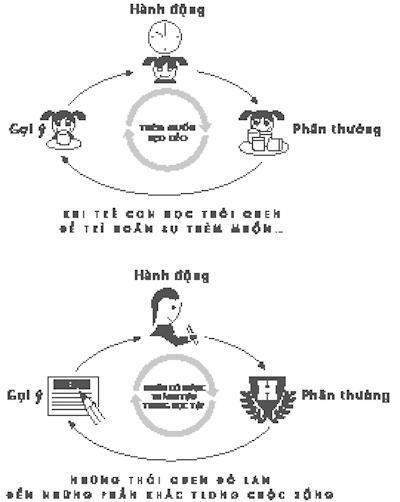
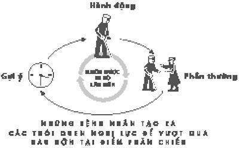
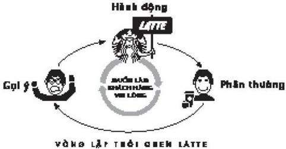

# 5. Starbucks và thói quen của sự thành công

### *Khi nào nghị lực trở thành bản năng*

Lần đầu tiên Travis Leach nhìn thấy cha mình dùng thuốc quá liều là khi anh lên 9 tuổi. Gia đình anh vừa mới chuyển đến một căn hộ nhỏ ở cuối hẻm, nơi ở mới nhất trong một chuỗi lần chuyển nhà có vẻ không chấm dứt gần đây đã làm cho họ bỏ nhà cũ đi giữa đêm khuya, ném tất cả đồ đạc của mình vào những túi rác màu đen, sau khi nhận được một thông báo thu hồi đất. Rất nhiều người đến và đi giữa đêm khuya, chủ nhà nói. Quá ầm ĩ.

Đôi khi, ở ngôi nhà cũ của mình, Travis từ trường về nhà và thấy các phòng đã sạch sẽ gọn gàng, thức ăn thừa được bọc lại kỹ càng trong tủ lạnh và những túi nhỏ nước sốt nóng và nước sốt cà chua trong hộp đựng Tupperware. Anh biết điều đó có nghĩa là cha mẹ mình đã tạm thời từ bỏ thuốc phiện và dành cả ngày để dọn dẹp điên cuồng. Những việc đó thường kết thúc một cách tồi tệ. Travis cảm thấy an toàn hơn khi căn nhà lộn xộn và cha mẹ anh ngồi trên ghế dài, mắt lim dim và xem hoạt hình. Không có chút hỗn loạn nào lúc cuối cơn say thuốc.

Cha của Travis là một người đàn ông hiền lành, thích nấu nướng và sống cả đời cách nhà bố mẹ chỉ vài dặm ở Lodi, California vì một lệnh hạn chế từ hải quân. Còn mẹ của Travis, lúc mọi người chuyển đến các căn hộ trong hẻm, đang ở trong tù vì tội tàng trữ thuốc phiện và bán dâm. Thực chất, cha mẹ anh là người nghiện và gia đình anh chỉ là đang cố giữ một vẻ ngoài bình thường như mọi người. Họ đi cắm trại mỗi mùa hè và vào nhiều tối thứ Sáu, họ tham gia các trận bóng chày của anh em Travis. Khi Travis được 4 tuổi, anh đến Disneyland với cha và được chụp hình lần đầu tiên trong cuộc đời nhờ một nhân viên của Disneyland. Máy chụp hình của gia đình đã bị bán cho một tiệm cầm đồ nhiều năm trước.

Vào buổi sáng cha Travis dùng thuốc quá liều, anh và anh trai đang chơi trong phòng khách trên những tấm thảm họ dùng trải ra nền mỗi tối để ngủ. Cha của Travis đang chuẩn bị sẵn sàng để làm bánh kếp khi ông bước vào phòng tắm. Ông mang theo cái ống tất chứa kim tiêm, thìa, bật lửa và gạc bông. Không lâu sau, ông bước ra, mở tủ lạnh để lấy trứng và làm vỡ chúng trên nền nhà. Khi các con ông chạy qua góc tường, cha chúng đang co giật và mặt tái xanh.

Anh chị của Travis đã một lần thấy cha dùng thuốc quá liều trước kia và biết phải làm gì. Anh trai Travis xoay cha về phía mình. Chị gái thì mở miệng cha ra để giữ cho ông không cắn phải lưỡi và nói với Travis chạy sang nhà hàng xóm, dùng nhờ điện thoại và gọi 911.

“Tên cháu là Travis, cha cháu đang qua đời và chúng cháu không biết chuyện gì đã xảy ra. Ông ấy không thở,” Travis nói dối người cảnh sát trực tổng đài. Cho dù chỉ 9 tuổi, anh cũng biết tại sao cha mình bị bất tỉnh. Anh không muốn nói điều đó trước mặt hàng xóm. 3 năm trước, một người bạn của cha đã chết trong tầng hầm nhà sau khi tiêm ma túy. Khi các nhân viên cấp cứu đến mang xác đi, hàng xóm nhìn chằm chằm vào Travis và chị anh khi họ đang giữ cửa mở cho băng ca ra ngoài. Một người hàng xóm có một đứa cháu cùng lớp với anh và chẳng lâu sau mọi người trong trường đều biết.

Sau khi gác điện thoại, Travis bước về phía cuối con hẻm và đợi xe cấp cứu đến. Cha anh được điều trị tại bệnh viện sáng đó, bị bắt giam vào đồn cảnh sát vào buổi chiều và về nhà lại lúc giờ ăn tối. Ông nấu món mỳ Ý. Sau đó vài tuần, Travis lên mười tuổi.

* * *

Khi Travis 16 tuổi, anh bỏ học. “Tôi mệt mỏi vì bị gọi là kẻ đồng dâm,” anh nói, “mệt mỏi vì mọi người theo tôi về nhà và ném các thứ vào tôi. Mọi thứ thật sự quá sức chịu đựng. Từ bỏ và đi đến một nơi nào khác có vẻ sẽ dễ dàng hơn.” Anh đi hai tiếng về phía Nam, đến Fresno và làm việc tại một hiệu rửa xe. Anh bị sa thải vì không chịu nghe lời. Anh nhận việc ở McDonald và Hollywood Video nhưng khi khách hàng thô lỗ - ‘Tao muốn** *rau trộn dầu giấm***, thằng khờ!’ – anh sẽ mất tự chủ.

“Ra khỏi cửa hàng của tao ngay!” anh hét vào mặt một phụ nữ, ném ức gà vào xe bà ta trước khi quản lý kéo anh vào trong.

Đôi khi vì quá buồn anh sẽ bắt đầu khóc ở giữa ca làm. Anh thường đi làm trễ hay nghỉ một ngày mà không có lý do. Vào buổi sáng, anh sẽ hét vào hình ảnh của mình trong gương, yêu cầu bản thân phải tốt hơn để kiểm soát cảm xúc. Nhưng anh không thể hòa đồng với người khác và anh cũng không đủ mạnh mẽ để vượt qua những lần phê bình nhỏ giọt và sỉ nhục. Khi hàng người đăng ký ở chỗ anh quá dài, quản lý sẽ la ó. Tay của Travis sẽ bắt đầu giật run lên và anh cảm thấy như mình không thể nín thở được. Anh tự hỏi đây có phải là điều mà cha mẹ anh cảm thấy, vì không thể chống lại cuộc sống, nên họ bắt đầu dùng thuốc.

Một ngày nọ, một khách hàng thường xuyên ở Hollywood Video, biết một ít về Travis, đề nghị anh suy nghĩ về việc làm tại Starbucks. “Chúng tôi đang mở một cửa hàng mới ở Fort Washington và tôi sắp làm trợ lý quản lý,” người đàn ông nói. “Cháu nên đăng ký.” Một tháng sau, Travis là một nhân viên làm ca sáng.

Đó là 6 năm trước. Hiện nay, ở tuổi 25, Travis là quản lý của hai cửa hàng Starbucks, giám sát 40 nhân viên và chịu trách nhiệm doanh thu hơn 2 tỷ đô-la mỗi năm. Mức lương của anh là 44.000 đô, anh có quỹ hưu 401(k) và không có khoản nợ nào. Anh không bao giờ đi làm trễ. Anh không buồn phiền vì công việc. Khi một nhân viên của anh bắt đầu khóc sau khi một khách hàng hét vào cô, Travis đưa cô ra nơi khác để nói chuyện.

“Tạp dề của bạn là một tấm khiên,” anh nói với cô. “Không điều gì mọi người nói có thể làm bạn tổn thương. Bạn sẽ luôn luôn rắn rỏi như bạn muốn.”

Anh nhận được bài học đó trong một lớp huấn luyện của Starbucks, một chương trình giáo dục bắt đầu từ những ngày đầu tiên của anh và kéo dài suốt sự nghiệp nhân viên. Chương trình được xây dựng hiệu quả nên anh có thể có chứng chỉ đại học nhờ hoàn thành các học phần. Travis nói, chương trình huấn luyện đã thay đổi cuộc đời anh. Starbucks đã dạy anh cách sống, cách tập trung, cách để đến làm việc đúng giờ và cách để làm chủ cảm xúc. Điều quan trọng nhất, nó dạy anh nghị lực.

“Starbucks là điều quan trọng nhất từng xảy ra với tôi,” anh nói với tôi. “Tôi mắc nợ công ty này mọi thứ.”

* * *

Với Travis và hàng nghìn người khác, Starbucks – cũng như rất nhiều công ty khác – đã thành công trong việc giáo dục các kỹ năng sống mà trường học, gia đình và cộng đồng không thể mang đến. Với hiện tại hơn 137.000 nhân viên và hơn một triệu trường dạy, theo cách nào đó, Starbucks bây giờ là một trong những nơi giáo dục lớn nhất nước. Tất cả những nhân viên đó, vào năm đầu tiên, dành ít nhất 50 giờ ở các phòng học Starbucks và hơn hàng chục người ở nhà cùng sách hướng dẫn của Starbucks, trò chuyện với các cố vấn được chỉ định cho họ.

Điểm cốt lõi của quá trình giáo dục đó là sự tập trung cao độ vào một thói quen quan trọng nhất: nghị lực. Hàng chục nghiên cứu chỉ ra rằng nghị lực là thói quen duy nhất và quan trọng nhất giúp cá nhân thành công. Ví dụ như, trong một nghiên cứu năm 2005, các nhà nghiên cứu từ Đại học Pennsylvania phân tích 164 học sinh lớp 8, đo chỉ số IQ và các yếu tố khác, bao gồm những học sinh đó thể hiện nghị lực bao nhiêu, như những bài kiểm tra tính tự kỷ luật đo được.

Những học sinh đạt được mức nghị lực cao có vẻ đạt được điểm cao hơn trong lớp và có được sự thừa nhận vào nhiều trường tuyển. Chúng ít nghỉ học hơn và dành ít thời gian để xem ti vi và nhiều thời gian hơn để làm bài tập. “Những thanh niên có tính tự giác cao thể hiện tốt hơn các bạn hay bốc đồng cùng lứa trên các lĩnh vực liên quan đến học thuật,” các nhà nghiên cứu viết. “Tính tự giác dự đoán việc học tập tốt hơn chỉ số IQ. Tính tự giác cũng dự đoán học sinh nào sẽ cải thiện điểm số qua các khóa học trong năm, trong khi chỉ số IQ thì không… Tính tự giác có một tác động lớn hơn trong học tập hơn là tài năng trí tuệ.”

Và theo các nghiên cứu, cách tốt nhất để củng cố nghị lực và mang đến cho học sinh một lợi thế là đưa chúng thành thói quen. “Đôi lúc nó giống như những người tự kiểm soát tốt không làm việc chăm chỉ - nhưng đó là vì họ đã biến nó thành bản năng,” Angela Duckworth, một nhà nghiên cứu của Đại học Pennsylvania nói với tôi. “Nghị lực của họ xuất hiện mà không cần họ phải nghĩ về nó.”

Với Starbucks, nghị lực không chỉ là sự ham học hỏi trên lý thuyết. Khi công ty bắt đầu dựng ra chiến lược phát triển quy mô lớn vào cuối những năm 1990, các nhà điều hành nhận ra rằng sự thành công đó đòi hỏi phải phát triển một môi trường trong đó chứng thực trả 4 đô-la được một cốc cà phê. Công ty cần huấn luyện các nhân viên để đưa ra một ít niềm vui đi kèm với cà phê sữa và bánh nướng. Vì thế từ rất sớm, Starbucks bắt đầu nghiên cứu cách họ có thể dạy cho các nhân viên điều chỉnh cảm xúc và tổ chức kỷ luật để đưa ra một tinh thần hăng hái trong mọi lần phục vụ. Nếu các nhân viên không được huấn luyện để bỏ qua một bên những vấn đề cá nhân, cảm xúc của một vài nhân viên sẽ không thể tránh khỏi tác động đến cách họ cư xử với khách hàng. Tuy nhiên, nếu một nhân viên biết cách tập trung và giữ kỷ luật, cho dù cuối một ca làm việc 8 tiếng, họ cũng sẽ mang đến một dịch vụ thức ăn nhanh cao cấp hơn mà các khách hàng của Starbucks mong muốn.

Công ty dành hàng tỷ đô-la phát triển các chương trình để huấn luyện các nhân viên về tính kỷ luật. Trong thực tế, các nhà điều hành viết sách hướng dẫn phục vụ như những người hướng dẫn để giúp các nhân viên biết cách đưa nghị lực thành thói quen trong cuộc sống. Một phần nào đó, những chương trình đó là lý do tại sao Starbucks phát triển từ một công ty ở Seattle im ắng thành một công ty lớn và vững mạnh với hơn 17.000 cửa hàng và lợi nhuận hơn 10 tỷ đô-la một năm.

Starbucks làm điều đó như thế nào? Làm thế nào công ty nhận những người như Travis – con trai của một người nghiện thuốc phiện và là một người bỏ học cấp ba không thể tập trung đủ bình tĩnh để giữ một công việc ở McDonald – và dạy anh để giám sát được hàng chục nhân viên và 10.000 đô-la lợi nhuận mỗi tháng? Chính xác Travis đã học được điều gì?

Ai bước vào căn phòng nơi tiến hành thí nghiệm ở Đại học Case Western Reserve đều đồng ý một điều: Bánh quy có mùi rất thơm ngon. Chúng vừa mới được lấy ra khỏi lò và xếp chồng trong một cái tô, làm tan chảy vụn sô-cô-la. Trên bàn, cạnh bánh quy là một tô củ cải. Sau một ngày dài, các học sinh đang đói bụng bước vào, ngồi xuống trước hai món ăn và không hay biết đang trải qua một bài kiểm tra nghị lực sẽ tạo nên những hiểu biết của chúng ta về sự hoạt động của tính kỷ luật.

Vào thời điểm đó, có rất ít khảo sát học thuật về nghị lực. Các nhà tâm lý xem chủ đề đó là những khía cạnh của “sự tự điều chỉnh,” nhưng đó không phải là một lĩnh vực khơi gợi nhiều sự tò mò. Có một thí nghiệm nổi tiếng, được tiến hành vào những năm 1960, trong đó các nhà khoa học ở Stanford đã kiểm tra nghị lực của một nhóm trẻ em 4 tuổi. Những đứa trẻ được đưa đến một căn phòng và được đưa ra nhiều sự lựa chọn cho bữa tiệc nhỏ, có cả kẹo dẻo. Chúng được đưa ra một thỏa thuận: Chúng có thể ăn một viên kẹo dẻo ngay bây giờ hay nếu chúng đợi một vài phút, chúng có thể có hai viên kẹo dẻo. Sau đó nhà nghiên cứu rời khỏi phòng. Một vài đứa không thể chịu được sự cám dỗ và ăn viên kẹo dẻo ngay khi người lớn rời khỏi phòng. Khoảng 30% xoay xở để bỏ qua sự thôi thúc đó và nhận được gấp đôi bữa tiệc khi nhà nghiên cứu quay lại sau 15 phút. Các nhà khoa học đang xem tất cả mọi thứ từ phía sau một tấm kính 2 chiều, nhìn cẩn thận xem đứa trẻ nào có đủ sự tự kiểm soát để có được viên kẹo thứ hai.

Nhiều năm sau, họ theo vết những đứa trẻ tham gia nghiên cứu đó. Hiện tại, chúng đang học trung học. Các nhà nghiên cứu hỏi về điểm số của chúng và điểm SAT, khả năng duy trì tình bạn và khả năng “đương đầu với những vấn đề quan trọng.” Họ nhận ra những đứa trẻ có thể chờ đợi phần thưởng lâu nhất cuối cùng có được điểm số tốt nhất và có điểm SAT cao hơn 210 điểm so với những đứa trẻ khác. Chúng nổi tiếng hơn và dùng ít thuốc hơn. Nếu bạn biết cách tránh được sự cám dỗ của kẹo dẻo như một đứa trẻ chưa đến tuổi đi học, có vẻ như bạn cũng biết cách làm bản thân mình đến lớp đúng giờ và kết thúc bài tập khi bạn lớn hơn, cũng như cách kết bạn và chịu đựng áp lực từ đồng nghiệp. Có vẻ như những đứa trẻ đã bỏ lơ kẹo dẻo có những kỹ năng tự điều chỉnh giúp mang đến cho chúng một lợi thế trong suốt cuộc đời.

Các nhà khoa học bắt đầu tiến hành các thí nghiệm liên quan, cố gắng tìm ra cách để giúp những đứa trẻ tăng các kỹ năng tự điều chỉnh. Họ biết được rằng dạy chúng những bí quyết đơn giản – như vẽ một bức tranh để tự làm xao lãng mình, hay tưởng tượng có một cái khung xung quanh kẹo dẻo để chúng giống một bức ảnh hơn và ít giống sự cám dỗ hơn – giúp chúng học cách tự kiểm soát. Vào những năm 1980, một lý thuyết hình thành được chấp nhận rộng rãi: Nghị lực là một kỹ năng có thể học được, một điều có thể được dạy giống như cách những đứa trẻ học làm toán và nói “cảm ơn.” Nhưng nguồn tài trợ cho những hướng dẫn đó rất hiếm. Chủ đề nghị lực không thịnh hành. Nhiều nhà khoa học của Stanford chuyển sang các lĩnh vực nghiên cứu khác.

Tuy nhiên, khi một nhóm tiến sĩ tâm lý học ở Case Western – có một người tên Mark Muraven – khám phá được những nghiên cứu vào giữa thế kỷ 20, họ bắt đầu đặt ra những câu hỏi mà các nghiên cứu trước có vẻ không trả lời được. Với Muraven, mô hình nghị lực-như-kỹ năng không phải là lời giải thích thỏa đáng. Sau cùng, kỹ năng là điều gì đó duy trì không đổi từ ngày này qua ngày khác. Nếu bạn có kỹ năng làm trứng ốp la vào thứ Tư, bạn sẽ vẫn biết cách làm nó vào thứ Sáu.

Mặc dù với kinh nghiệm của Muraven, có vẻ như ông đã quên mất cách sử dụng nghị lực mọi lúc. Vài buổi tối, ông trở về nhà sau khi làm việc và không gặp vấn đề gì khi đi bộ tập thể dục. Những ngày khác, ông không thể làm gì khác ngoài việc nằm trên ghế dài và xem ti vi. Như thể não của ông – hay, ít nhất, phần não chịu trách nhiệm làm ông tập thể dục – đã quên cách gợi ra nghị lực để đẩy ông ra khỏi cửa. Có những ngày, ông ăn uống rất lành mạnh. Những ngày khác, khi mệt mỏi, ông tới chỗ máy bán hàng tự động, nhồi cho mình kẹo và khoai tây chiên.

Muraven tự hỏi, nếu nghị lực là một kỹ năng, vậy tại sao nó không duy trì từ ngày này qua ngày khác? Ông nghi ngờ có nhiều điều về nghị lực hơn những điều các thí nghiệm trước đã tiết lộ. Nhưng làm sao để kiểm tra điều đó trong phòng thí nghiệm?

* * *

Cách giải quyết của Muraven là phòng thí nghiệm có một bát bánh quy vừa nướng xong và một bát củ cải. Căn phòng thực chất là một phòng kín có một tấm gương hai chiều, có trang bị một cái bàn, một cái ghế gỗ, một cái chuông tay và một cái lò nướng bánh. 67 sinh viên chưa tốt nghiệp được tuyển và được thông báo bỏ một bữa ăn. Từng người một, các sinh viên ngồi trước hai cái tô.

“Mục đích của thí nghiệm này là kiểm tra nhận thức mùi vị,” một nhà nghiên cứu nói với các sinh viên, nhưng thật ra không phải thế. Mục đích là buộc các sinh viên – nhưng chỉ vài người – áp dụng nghị lực. Đến cuối, một nửa sinh viên được hướng dẫn ăn bánh quy và bỏ qua củ cải; nửa còn lại được bảo ăn củ cải và bỏ qua bánh quy. Lý thuyết của Muraven là việc bỏ qua bánh quy rất khó – nó cần nghị lực. Ngược lại, bỏ qua củ cải gần như không cần nỗ lực gì.

“Hãy nhớ rằng,” nhà nghiên cứu nói, “chỉ ăn thức ăn được chỉ định cho bạn.” Sau đó, cô rời khỏi phòng.

Khi các sinh viên còn một mình, họ bắt đầu nhai nhóp nhép. Những người ăn bánh quy đang ở trên thiên đường. Những người ăn củ cải thì như ở dưới địa ngục. Họ khổ sở buộc mình bỏ qua bánh quy còn nóng hổi. Qua tấm kính hai chiều, các nhà nghiên cứu nhìn một người ăn củ cải lấy một cái bánh quy, ngửi nó thật lâu và sau đó bỏ lại vào bát. Một người khác cầm một vài cái bánh quy, bỏ chúng xuống và sau đó liếm sô-cô-la tan chảy trên các đầu ngón tay.

Sau 5 phút, các nhà nghiên cứu quay lại phòng. Theo ước tính của Muraven, nghị lực của những người ăn củ cải đã được cố gắng hoàn toàn bằng cách ăn rau quả đắng và bỏ qua bữa tiệc; còn những người ăn bánh quy thì gần như không dùng một chút tính kỷ luật nào.

“Chúng ta cần chờ khoảng 15 phút để trí nhớ tạm thời của bạn về món mình đã ăn phai đi,” nhà nghiên cứu nói với mỗi người tham gia. Thời gian trôi qua, cô yêu cầu họ hoàn thành một câu đố. Nó có vẻ khá đơn giản: vẽ một hình thuộc hình học mà không nhấc bút chì khỏi tờ giấy hay vẽ lại cùng một đường hai lần. Nếu bạn muốn bỏ cuộc, nhà nghiên cứu nói, hãy rung cái chuông. Cô ngụ ý câu đố sẽ không kéo dài.

Trên thực tế, câu đố không thể giải được.

Câu đố không phải là cách để giết thời gian; nó là phần quan trọng nhất của thí nghiệm. Nó cần nghị lực rất lớn để tiếp tục giải câu đố, nhất là khi mỗi cố gắng đều thất bại. Các nhà khoa học tự hỏi, những sinh viên vừa dùng hết nghị lực của mình để bỏ qua bánh quy có từ bỏ giải câu đố nhanh hơn không? Nói cách khác, nghị lực có phải là một nguồn có hạn?

Từ phía sau tấm gương hai chiều, các nhà nghiên cứu theo dõi. Những người ăn bánh quy với nguồn tự kỷ luật chưa dùng đến bắt đầu giải câu đố. Nhìn chung, họ có vẻ thoải mái. Một người trong số họ thử một phương pháp dễ hiểu, bị mắc chướng ngại vật và lại bắt đầu lại. Làm lại. Và làm lại. Có người đã giải hơn nửa tiếng đồng hồ trước khi nhà nghiên cứu bảo họ dừng lại. Trung bình, những người ăn bánh quy dành gần 19 phút một người để cố gắng giải câu đố trước khi họ rung chuông.

Những người ăn củ cải, với nghị lực đã cạn kiệt, cư xử hoàn toàn khác. Họ lầm bầm khi đang giải. Họ nản chí. Một người phàn nàn rằng toàn bộ thí nghiệm này chỉ làm mất thời gian. Một vài người thì gục đầu trên bàn và nhắm mắt lại. Một người cáu kỉnh với nhà nghiên cứu khi cô quay lại phòng. Trung bình, những người ăn củ cải chỉ giải khoảng 8 phút, ít hơn 60% thời gian so với những người ăn bánh quy, trước khi từ bỏ. Khi các nhà nghiên cứu hỏi sau đó họ cảm thấy thế nào, một người ăn củ cải nói anh ta “phát ốm vì cái thí nghiệm ngớ ngẩn này.”

“Bằng cách làm cho mọi người sử dụng một chút nghị lực của mình để bỏ qua bánh quy, chúng tôi đã đặt họ vào một hoàn cảnh mà họ sẵn lòng từ bỏ nhanh hơn nhiều,” Muraven nói với tôi. “Kể từ đó, có hơn 200 nghiên cứu về ý tưởng đó và họ cũng tìm thấy điều tương tự. Nghị lực không phải chỉ là một kỹ năng. Nó là một sức lực, giống như sức lực trong tay hay chân bạn và nó mệt mỏi khi nó làm việc nhiều hơn, nên chỉ còn lại ít sức lực cho những thứ khác.”

Các nhà nghiên cứu phát triển thêm hiểu biết đó để giải thích tất cả các loại hiện tượng. Một vài nghiên cứu đã cho thấy nó giúp làm sáng tỏ tại sao về mặt nào đó những người thành công không chịu nổi các vấn đề về tình dục (thường xảy ra nhất lúc đêm muộn, sau một ngày dài sử dụng nghị lực cho công việc) hay tại sao nhiều bác sĩ giỏi lại mắc lỗi ngớ ngẩn (thường xảy ra sau khi một bác sĩ vừa kết thúc một công việc kéo dài, phức tạp và đòi hỏi sự tập trung cao độ). “Nếu bạn muốn làm điều gì đó đòi hỏi nghị lực – như chạy bộ sau khi làm việc – bạn phải đảo ngược sức nghị lực của bạn trong ngày,” Muraven nói với tôi. “Nếu bạn sớm sử dụng hết chúng vào những công việc chán ngắt như viết thư điện tử hay điền vào những mẫu tài liệu đắt tiền, phức tạp và buồn chán, toàn bộ sức lực sẽ tan biến khi bạn trở về nhà.”

* * *

Nhưng sự suy luận này kéo dài đến đâu? Luyện tập nghị lực có làm nó mạnh hơn cũng giống như dùng tạ để tăng sức cho bắp tay?

Năm 2006, hai nhà nghiên cứu người Úc – Megan Oaten và Ken Cheng – cố gắng trả lời câu hỏi đó bằng cách tạo ra một buổi luyện tập nghị lực. Họ ghi danh 24 người trong độ tuổi từ 18 đến 40 trong một chương trình luyện tập thể chất và trong hai tháng, cho họ trải qua nhiều bài tập cử tạ, huấn luyện sức chịu đựng và thể dục thẩm mỹ. Hết tuần này đến tuần khác, mọi người ép buộc bản thân luyện tập thường xuyên hơn, sử dụng nhiều nghị lực hơn mỗi lần họ đến phòng tập.

Sau hai tháng, các nhà nghiên cứu xem xét cẩn thận phần cuộc sống còn lại của những người tham gia để biết liệu nghị lực tăng ở phòng tập có dẫn đến nghị lực nhiều hơn tại nhà. Trước khi thí nghiệm bắt đầu, phần lớn người tham gia tự nhận mình là “ỳ xác thối”. Bây giờ, dĩ nhiên, họ có cơ thể cân đối hơn. Nhưng họ cũng khỏe mạnh hơn ở các khía cạnh khác của cuộc sống. Nếu họ dành nhiều thời gian hơn ở phòng tập, họ sẽ hút ít thuốc đi, ít uống rượu, cà phê hơn và ăn ít thức ăn nhanh hơn. Họ cũng dành nhiều thời gian làm bài tập hơn và xem ti vi ít đi. Họ ít bị trầm cảm hơn.

Oaten và Cheng tự hỏi, có thể những kết quả đó không liên quan gì đến nghị lực. Điều gì sẽ xảy ra nếu thể dục chỉ làm mọi người khỏe mạnh hơn và ít thèm ăn thức ăn nhanh hơn?

Vì thế, họ thiết kế một thí nghiệm khác. Lần này, họ ghi danh 29 người cho một chương trình quản lý tiền bạc kéo dài 4 tháng. Họ đặt ra các mục tiêu tiết kiệm và yêu cầu những người tham gia chấp nhận không xa hoa, như đến nhà hàng dùng bữa hay đi xem phim. Những người tham gia được yêu cầu giữ lại danh sách cụ thể những thứ họ mua, điều lúc đầu có thể gây phiền toái, nhưng cuối cùng mọi người tăng dần tính kỷ luật để ghi lại mọi thứ đã mua.

Tài chính của mọi người cải thiện khi họ tiến triển trong chương trình. Điều ngạc nhiên hơn, họ cũng hút ít thuốc hơn và uống ít rượu, cà phê hơn – trung bình, hai cốc cà phê, hai ly bia và với người hút thuốc, ít hơn 15 điếu mỗi ngày. Họ ăn ít thức ăn nhanh hơn và hiệu quả hơn cả trong công việc và học tập. Nó giống như nghiên cứu về thể dục: Khi mọi người nâng cao nghị lực của mình ở một phần của cuộc sống – trong phòng tập, hay một chương trình quản lý tiền bạc – sức mạnh đó ảnh hưởng đến món họ ăn hay họ làm việc chăm chỉ thế nào. Một khi nghị lực trở nên mạnh mẽ hơn, nó chạm đến mọi thứ.

Oaten và Cheng tiến hành thêm một thí nghiệm nữa. Họ ghi danh 45 học sinh vào một chương trình cải thiện học tập, tập trung tạo ra thói quen học tập. Có thể dự đoán được, kỹ năng học tập của người tham gia được cải thiện. Và những học sinh cũng hút thuốc ít hơn, uống rượu ít hơn, xem ti vi ít hơn, tập thể dục nhiều hơn và ăn uống khỏe mạnh hơn, cho dù tất cả những thứ đó chưa bao giờ được đề cập đến trong chương trình học tập. Một lần nữa, khi sức mạnh nghị lực của họ tăng lên, những thói quen tốt có vẻ sẽ tác động đến các phần khác của cuộc sống họ.

“Khi bạn học cách ép buộc bản thân mình đến phòng tập, bắt đầu làm bài tập hay ăn rau trộn thay vì bánh mỳ kẹp, một phần của những gì đang xảy ra là bạn đang thay đổi cách suy nghĩ của mình,” Todd Heatherton nói, một nhà nghiên cứu tại Dartmouth đã xem xét các nghiên cứu về nghị lực. “Mọi người điều chỉnh sự thôi thúc tốt hơn. Họ học cách làm xao lãng mình khỏi những cám dỗ. Và khi bạn đã quen với thói quen nghị lực đó, não của bạn được luyện tập để giúp đỡ bạn tập trung vào một mục tiêu.”

Hiện nay có hàng trăm nhà nghiên cứu ở gần như mọi khoa trong trường đại học nghiên cứu về nghị lực. Các trường công lập và trường tư ở Philadelphia, Seattle, New York và khắp nơi đã bắt đầu liên kết các bài học nâng cao nghị lực vào chương trình. Tại KIPP, hay “Chương trình Tri thức là Sức mạnh” – một tập hợp các trường công lập dành cho những học sinh từ các gia đình thu nhập thấp khắp đất nước – giáo dục sự tự kiểm soát là một phần triết lý của các trường. (Một trường KIPP ở Philadelphia đưa cho học sinh áo thun tuyên bố rằng “Đừng ăn kẹo dẻo.”) Nhiều trường đã tăng nhanh đáng kể điểm kiểm tra của học sinh.

“Đó là lý do tại sao đăng ký các lớp học đàn pi-a-nô hay thể thao cho con trẻ là rất quan trọng. Nó không liên quan gì đến việc tạo ra một nhạc sĩ giỏi hay một ngôi sao bóng đá 5 tuổi,” Heatherton nói. “Khi bạn học cách buộc bản thân mình luyện tập trong một giờ hay chạy 15 vòng, bạn bắt đầu xây dựng sức mạnh tự điều chỉnh. Một đứa trẻ 5 tuổi có thể đuổi theo trái bóng trong 10 phút sẽ trở thành một học sinh lớp 6 có thể bắt đầu làm bài tập đúng giờ.”

Khi nghiên cứu về nghị lực trở thành một chủ đề hấp dẫn trong các tạp chí khoa học và chuyên mục báo, các tập đoàn ở Mỹ bắt đầu quan tâm đến nó. Các công ty như Starbucks – và Gap, Walmart, các nhà hàng hay các loại hình kinh doanh khác dựa vào các công nhân mới vào nghề - tất cả đều đối diện với một vần đề phổ biến: Bất kể nhân viên của họ muốn làm một công việc tuyệt vời thế nào, nhiều người sẽ thất bại vì họ thiếu tính kỷ luật. Họ đi làm muộn. Họ thô lỗ hét vào mặt các khách hàng. Họ bị xao lãng hay vướng vào các chuyện kịch tính ở nơi làm việc. Họ bỏ việc không lý do.

“Với nhiều nhân viên, Starbucks là trải nghiệm chuyên nghiệp đầu tiên của họ,” Christine Deputy nói, người giúp đỡ giám sát các chương trình huấn luyện của công ty hơn 10 năm nay. “Nếu cha mẹ bạn hay các giáo viên bảo bạn nên làm gì trong suốt cuộc đời, rồi đột nhiên khách hàng la hét, ông chủ của bạn thì quá bận không thể hướng dẫn bạn được, có thể bạn không chịu đựng nổi. Nhiều người không thể tạo ra sự chuyển đổi. Vì thế, chúng ta cố gắng tìm ra cách mang lại cho người lao động tính kỷ luật mà họ không được học ở trường.”

Nhưng khi các công ty như Starbucks cố gắng áp dụng các bài học về nghị lực từ những nghiên cứu củ cải-và-bánh quy vào nơi làm việc, họ gặp khó khăn. Họ tài trợ các lớp học giảm cân và cho các nhân viên thẻ thành viên tập thể hình miễn phí, với hy vọng những lợi ích sẽ tác động đến cách họ phục vụ cà phê. Họ tham dự không thường xuyên. Rất khó để ngồi học suốt buổi hay đến phòng tập sau một ngày làm việc dài, các nhân viên phàn nàn. “Nếu ai đó gặp rắc rối với tính kỷ luật lúc làm việc, họ cũng có thể sẽ gặp rắc rối khi tham dự các chương trình được thiết kế để nâng cao tính kỷ luật sau công việc,” Muraven nói.

Nhưng Starbucks được định hướng để giải quyết vấn đề đó. Năm 2007, trong lúc cao điểm của sự mở rộng, công ty mở thêm 7 cửa hàng mới mỗi ngày và thuê thêm 15.000 nhân viên mỗi tuần. Huấn luyện nhân viên xuất sắc trong dịch vụ khách hàng – đi làm đúng giờ, không nổi giận với khách hàng quen và niềm nở phục vụ mọi người trong khi vẫn nhớ các yêu cầu của khách hàng và nếu có thể, tên của họ - là điều cần thiết. Ai cũng mong muốn một tách cà phê sữa đắt tiền được giao với một nụ cười rạng rỡ. “Chúng tôi không thuộc ngành kinh doanh cà phê để phục vụ mọi người,” Howard Behar, chủ tịch trước của Starbucks nói với tôi. “Chúng tôi thuộc ngành kinh doanh con người để phục vụ cà phê. Toàn bộ mô hình kinh doanh của chúng tôi dựa vào dịch vụ khách hàng tuyệt vời. Nếu không có nó, chúng tôi không tồn tại.”

Starbucks khám phá được giải pháp chính là chuyển tính kỷ luật thành một thói quen của tổ chức.

Năm 1992, một nhà tâm lý học người Anh bước vào hai bệnh viện chỉnh hình đông nhất ở Scotland và tuyển 60 bệnh nhân cho một thí nghiệm mà cô hy vọng sẽ giải thích cách để đẩy mạnh nghị lực của con người trừ những người có sự chống trả.

Trung bình, các bệnh nhân đều 68 tuổi. Phần lớn họ kiếm được ít hơn 10.000 đô-la một năm và không có bằng cấp nào cao hơn trung học. Tất cả họ vừa trải qua những cuộc phẫu thuật thay khớp háng hay đầu gối, nhưng vì họ tương đối nghèo và thiếu giáo dục, rất nhiều người đã chờ đợi nhiều năm để được phẫu thuật. Họ là những người đã về hưu, thợ máy đã lớn tuổi, và thư ký cửa hàng. Họ đang ở những chương cuối của cuộc đời và gần như tất cả đều không có mong muốn nào để tìm lại một cuốn sách mới.

Phục hồi sau một cuộc phẫu thuật khớp háng hay đầu gối là điều khó khăn không thể ngờ. Cuộc phẫu thuật liên quan đến các cơ chung bị tổn thương nghiêm trọng và cưa qua xương. Trong lúc phục hồi, những cử động nhỏ nhất – dời chỗ trên giường hay cong một khớp – có thể đau đớn khôn cùng. Tuy nhiên, những bệnh nhân cần thiết phải bắt đầu tập thể dục gần như ngay khi họ vừa tỉnh lại sau cuộc phẫu thuật. Họ phải bắt đầu di chuyển chân và khớp háng trước khi các cơ và da lành lại, hay sẹo vết mổ làm kẹt khớp, phá hủy tính mềm dẻo của nó. Thêm vào đó, nếu các bệnh nhân không bắt đầu luyện tập, họ có nguy cơ tăng vón cục máu. Nhưng vì đau đớn quá độ nên mọi người thường bỏ qua giai đoạn phục hồi chức năng. Các bệnh nhân, thường những bệnh nhân lớn tuổi, từ chối làm theo lời yêu cầu của bác sĩ.

Những người tham gia nghiên cứu của Scottich là những người có vẻ dễ thất bại nhất trong phục hồi chức năng. Nhà khoa học tiến hành thí nghiệm muốn thấy liệu có thể giúp họ sử dụng nghị lực của mình không. Cô đưa cho mỗi bệnh nhân một cuốn sách nhỏ sau cuộc phẫu thuật của họ để ghi lại cụ thể lịch tập phục hồi và ở phía cuối có thêm 13 trang – mỗi trang cho một tuần – với nhiều chỗ trống và các hướng dẫn: “Mục tiêu của tôi tuần này là...................? Hãy viết ra chính xác điều bạn dự định làm. Ví dụ, nếu bạn dự định sẽ đi bộ tuần này, hãy viết địa điểm và thời gian bạn dự định đi.” Cô yêu cầu các bệnh nhân điền vào từng trang với những kế hoạch cụ thể. Sau đó cô so sánh sự phục hồi của những người viết ra các kế hoạch với những bệnh nhân nhận được cùng một cuốn sách nhỏ đó, nhưng không viết gì cả.

Có vẻ vô lý khi suy nghĩ rằng đưa cho mọi người một vài mảnh giấy trắng có thể tạo ra sự khác biệt trong việc họ phục hồi sau phẫu thuật nhanh như thế nào. Nhưng khi nhà nghiên cứu đến thăm các bệnh nhân ba tháng sau, cô nhận thấy một sự khác biệt đáng chú ý giữa hai nhóm. Những bệnh nhân viết ra kế hoạch trong cuốn sách nhỏ của họ đã bắt đầu đi bộ gần như nhanh gấp đôi những người không viết. Họ đã bắt đầu ngồi xuống và đứng dậy khỏi ghế không có sự giúp đỡ gần như nhanh hơn ba lần. Họ đang đi giày, giặt quần áo và tự nấu bữa ăn nhanh hơn các bệnh nhân không viết ra những mục tiêu trước.

Nhà tâm lý học muốn hiểu nguyên do. Cô kiểm tra những cuốn sách nhỏ và khám phá được phần lớn các trang giấy trắng đã được điền đủ các kế hoạch cụ thể, chi tiết về những mặt bình thường nhất của quá trình hồi phục. Ví dụ, một bệnh nhân đã viết, “Tôi sẽ đi bộ đến trạm xe buýt ngày mai để gặp vợ tôi đi làm về,” và sau đó ghi chú mấy giờ ông sẽ đi, con đường ông sẽ đi, ông sẽ mặc quần áo nào, áo khoác nào ông sẽ mang theo nếu trời mưa và ông sẽ uống thuốc nào nếu quá đau. Một bệnh nhân khác, trong một nghiên cứu tương tự, viết một chuỗi các lịch trình cụ thể về các bài tập ông sẽ thực hiện mỗi lần ông vào nhà tắm. Một người thứ ba viết một kế hoạch hành trình theo từng phút để đi vòng quanh khu nhà.

Khi nhà tâm lý học xem xét cẩn thận những cuốn sách nhỏ, cô thấy có điểm chung trong nhiều kế hoạch: Nó tập trung vào cách các bệnh nhân sẽ xử lý vào một thời điểm nhất định mà họ biết trước sẽ có cơn đau. Ví dụ, người đàn ông tập thể dục trên đường đến phòng tắm biết rằng mỗi lần ông đứng dậy khỏi chiếc ghế dài, ông sẽ đau nhức vô cùng. Thế nên, ông viết ra một kế hoạch để giải quyết nó: Tự động làm bước thứ nhất, ngay lập tức, nên ông sẽ không bị cám dỗ để ngồi xuống lại. Bệnh nhân gặp vợ tại trạm xe buýt kinh sợ những buổi chiều vì dạo bộ lúc đó là lúc dài nhất và đau đớn nhất trong ngày. Nên ông ghi lại cụ thể các trở ngại ông có thể gặp phải và đưa ra trước giải pháp.

Nói cách khác, các kế hoạch của bệnh nhân được xây dựng quanh các điểm phản chiếu khi họ biết nỗi đau của mình – và vì thế sự cám dỗ từ bỏ - sẽ mạnh mẽ hơn. Các bệnh nhân đang tự nói với chính mình cách họ dự định sẽ vượt qua khó khăn.

.

Bằng trực giác, mỗi người sử dụng cùng những quy tắc mà Claude Hopkins đã dùng để bán Pepsodent. Họ xác định những gợi ý đơn giản và những phần thưởng rõ ràng. Ví dụ, người đàn ông gặp vợ tại trạm xe buýt xác định một gợi ý dễ dàng –** *Đó là lúc 3h30, cô ấy đang trên đường*** ***về nhà***! – và ông cũng xác định rõ phần thưởng –** *Mình à, tôi ở đây!*** Khi sự cám dỗ từ bỏ lúc đi bộ được nửa đường xuất hiện, bệnh nhân có thể bỏ qua nó vì ông đã đưa tính kỷ luật thành một thói quen.

Không có lý do nào giải thích tại sao các bệnh nhân khác – những người không viết ra kế hoạch phục hồi – không thể cư xử giống như thế. Tất cả các bệnh nhân đều có thể nhận được cùng những sự quở trách và cảnh cáo tại bệnh viện. Tất cả họ đều biết thể dục cần thiết cho sự phục hồi của mình. Họ dành hàng tuần để phục hồi chức năng.

Nhưng những bệnh nhân không viết ra kế hoạch nào đang ở trong một thế bất lợi đáng kể, vì họ không bao giờ suy nghĩ trước cách đối mặt với các điểm phản chiếu đau đớn. Họ không bao giờ thiết kế theo chủ ý những thói quen nghị lực. Cho dù họ có ý định đi bộ vòng quanh khu nhà, sự quyết tâm bỏ rơi họ khi họ đối mặt với nỗi đau đớn cực độ của vài bước đi đầu.

* * *

Khi những nỗ lực của Starbucks để cải thiện nghị lực của các nhân viên qua thẻ thành viên phòng tập và các hội thảo dinh dưỡng sụp đổ, các nhà điều hành quyết định họ cần thực hiện một phương pháp mới. Họ bắt đầu bằng cách nhìn thật gần vào những gì thực sự đang xảy ra bên trong các cửa hàng. Họ nhìn thấy rằng, giống như các bệnh nhân Scottish, các nhân viên của họ đang thất bại khi họ chạy lên hướng ngược với các điểm phản chiếu. Điều họ cần là những thói quen của tổ chức làm cho việc tập hợp tính kỷ luật dễ dàng hơn.

Các nhà điều hành xác định rằng, theo vài cách nào đó, tất cả suy nghĩ của họ về nghị lực đều sai. Trên thực tế, các nhân viên thiếu nghị lực không gặp khó khăn nào khi làm việc trong phần lớn thời gian. Theo trung bình ngày, một công nhân thiếu nghị lực không khác gì với những người còn lại. Nhưng đôi lúc, thông thường khi đối mặt với những căng thẳng không biết trước hay điều không chắc chắn, những nhân viên đó sẽ hét lên và sự tự kiểm soát của họ sẽ biến mất. Ví dụ, một khách hàng có thể bắt đầu la hét và một nhân viên thường bình tĩnh sẽ đánh mất sự điềm tĩnh của mình. Một đám đông thiếu kiên nhẫn có thể lấn át một nhân viên và bất thình lình, nhân viên đó đang sắp khóc.

Điều các nhân viên thực sự cần là những hướng dẫn rõ ràng về cách đối mặt với những điểm phản chiếu – điều tương tự với những cuốn sách nhỏ của các bệnh nhân Scottish: một hoạt động cho các nhân viên làm theo khi nguồn nghị lực của họ yếu đi. Thế nên, công ty phát triển những tài liệu huấn luyện mới giải thích rõ ràng các lề thói cho nhân viên sử dụng khi họ gặp khó khăn. Các cuốn sách dạy nhân viên cách phản ứng lại những gợi ý nhất định, như một khách hàng đang la hét hay một hàng chờ dài tại quầy tính tiền. Các quản lý huấn luyện nhân viên, đóng vai với họ cho đến khi những phản ứng đó trở thành tự động. Công ty xác định các phần thưởng cụ thể - một khách hàng biết ơn, sự tán dương của quản lý – mà các nhân viên sẽ xem như bằng chứng của một công việc hoàn thành tốt.

Starbucks dạy nhân viên cách giải quyết khó khăn bằng cách mang đến cho họ vòng lặp thói quen của nghị lực.

Ví dụ như, khi Travis bắt đầu làm ở Starbucks, quản lý của anh giới thiệu ngay với anh những thói quen. “Một trong những việc khó khăn nhất của công việc này là đối mặt với một khách hàng đang giận dữ,” quản lý của Travis nói với anh. “Khi ai đó bước đến và bắt đầu hét vào bạn vì họ nhận sai đồ uống, phản ứng đầu tiên của bạn là gì?”

“Tôi không biết,” Travis nói. “Tôi đoán tôi cảm thấy sợ. Hay tức giận.”

“Điều đó là bình thường,” quản lý của anh nói. “Nhưng công việc của chúng ta là cung cấp dịch vụ khách hàng tốt nhất, cho dù đang có áp lực.” Người quản lý mở sách hướng dẫn của công ty và chỉ cho Travis một trang trống rất nhiều. Ở đầu trang có ghi, “Khi một khách hàng không vui vẻ, kế hoạch của tôi là …”

“Cuốn sách hướng dẫn này là để cho bạn tưởng tượng những tình huống không dễ chịu và viết ra một kế hoạch để phản ứng lại,” người quản lý nói. “Một trong những hệ thống chúng tôi sử dụng được gọi là phương pháp LATTE. Chúng tôi Lắng nghe (Listen) khách hàng, Chấp nhận (Acknowledge) lời phàn nàn của họ, Hành động (Take action) bằng cách giải quyết vấn đề, Cảm ơn (Thank) họ, và sau đó Giải thích (Explain) tại sao vấn đề lại xảy ra.

“Tại sao bạn không dành một vài phút và viết ra một kế hoạch để đối diện với một khách hàng đang nổi giận. Hãy sử dụng phương pháp LATTE. Sau đó chúng ta có thể đóng vai một chút.”

Starbucks có hàng chục lề thói mà các nhân viên được dạy để sử dụng giữa những thời điểm phản chiếu căng thẳng. Đó là hệ thống Cái gì Cái gì Tại sao để đưa ra lời phê bình và hệ thống** *Liên kết, Khám phá và Phản hồi*** để nhận yêu cầu khi mọi thứ trở nên cuồng nhiệt. Có những thói quen được học để giúp các nhân viên chỉ ra được sự khác biệt giữa những khách hàng quen chỉ muốn cà phê của mình (“Một khách hàng vội vã nói với cảm giác gấp gáp và có vẻ thiếu kiên nhẫn, hay nhìn vào đồng hồ”) và những người cần một ít nâng niu (“Một khách hàng biết tên các nhân viên khác và thường yêu cầu cùng một loại nước mỗi ngày”). Trong các cuốn sách huấn luyện là hàng chục trang giấy trắng để các nhân viên có thể viết ra nhiều kế hoạch đoán trước cách họ vượt qua các điểm phản chiếu. Sau đó họ thực tập những kế hoạch đó hết lần này đến lần khác cho đến khi chúng trở thành tự động.

Đó là cách nghị lực trở thành thói quen: bằng cách chọn trước một lề thói chắc chắn và sau đó làm theo lề thói đó khi một điểm phản chiếu đến. Khi các bệnh nhân Scottish điền vào quyển sách nhỏ của mình, hay Travis học phương pháp LATTE, họ quyết định trước cách phản ứng lại một gợi ý – một cơ bị đau hay một khách hàng đang nổi giận. Khi gợi ý đến, hành động xảy ra.

Starbucks không phải là công ty duy nhất sử dụng những phương pháp huấn luyện đó. Ví dụ như, tại Deloitte Consulting, công ty thuế và dịch vụ tài chính lớn nhất thế giới, các nhân viên được huấn luyện trong một chương trình tên là “Khoảnh khắc quan trọng,” tập trung vào giải quyết các điểm phản chiếu như khi một khách hàng phàn nàn về phí, khi một đồng nghiệp bị sa thải hay khi một nhà tư vấn Deloitte mắc lỗi. Với từng khoảnh khắc như thế, có những lề thói được lập trình sẵn –** *Hãy tò mò, Nói điều không ai nói, Áp dụng quy tắc 5/5/5*** – hướng dẫn các nhân viên cách họ nên phản ứng. Tại Container Store, các nhân viên nhận được hơn 185 giờ huấn luyện chỉ trong năm đầu tiên. Họ được dạy để nhận ra các điểm phản chiếu như một đồng nghiệp nổi giận hay một khách hàng quá sức chịu đựng, và những thói quen, như những lề thói cho người mua sắm điềm tĩnh hay làm lắng dịu một cuộc đối đầu. Ví dụ, khi một khách hàng bước vào có vẻ quá sức chịu đựng, một nhân viên ngay lập tức nhờ họ hình dung không gian trong nhà mà họ muốn được sắp xếp và mô tả họ sẽ cảm thấy thế nào khi mọi thứ ở đúng vị trí của nó. “Chúng ta có khách hàng tìm đến và nói, ‘Đến đây tốt hơn là đến thăm bác sĩ tâm lý của tôi,’” giám đốc điều hành của công ty nói với một nhà báo.

Howard Schultz, người xây dựng Starbucks thành một người khổng lồ, không khác nhiều với Travis theo vài cách nào đó. Ông lớn lên trong một ngôi nhà tái định cư ở Brooklyn, chỉ có hai phòng ngủ cho cha mẹ và ba anh em. Khi Schultz lên 7 tuối, cha ông bị vỡ mắt cá chân và mất công việc lái xe tải. Nó đã lấy đi tất cả và đẩy gia đình ông vào cảnh khủng hoảng. Cha của ông, sau khi chữa lành mắt cá chân, bắt đầu đi vòng suốt một chuỗi các công việc lương thấp. “Cha tôi không bao giờ tìm được lối đi cho mình,” Schultz nói với tôi. “Tôi nhìn thấy lòng tự trọng của ông giảm dần. Tôi cảm thấy còn rất nhiều việc ông có thể hoàn thành được.”

Ngôi trường Schultz học là một nơi hoang vu, đông ngẹt người, có sân chơi trải nhựa đường và những đứa trẻ đang chơi bóng đá, bóng rổ, bóng chày mi-ni, bóng để tập đấm, bóng đập và bất cứ trò chơi nào khác mà chúng có thể nghĩ ra. Nếu đội của bạn thua, phải mất một giờ sau mới có lượt chơi khác. Vì thế Schultz bảo đảm đội ông luôn luôn thắng, bất kể cái giá thế nào. Ông sẽ trở về nhà với những vết xước đầy máu ở khuỷu tay và đầu gối mà mẹ ông sẽ rửa nhẹ nhàng với một mảnh vải ướt. “Con không từ bỏ,” bà nói.

Tinh thần cạnh tranh giúp ông có được một suất học bổng học bóng đá ở đại học (ông bị vỡ quai hàm và không bao giờ chơi thêm một trận nào nữa), một chứng chỉ giao tiếp và cuối cùng là một công việc nhân viên bán hàng Xerox ở thành phố New York. Ông thức dậy mỗi buổi sáng, đến tòa nhà văn phòng mới ở giữa thành phố, đi thang máy đến tầng trên cùng và đi đến từng phòng một, lịch sự hỏi thăm liệu có ai hứng thú với mực in hay máy phô tô không. Sau đó ông đi thang máy xuống tầng một và bắt đầu lại từ đầu.

Vào đầu những năm 1980, khi đang làm việc cho một nhà sản xuất nhựa, ông để ý thấy một nhà bán lẻ ít được biết đến ở Seattle đang yêu cầu một con số không bình thường các chóp nhỏ giọt cà phê. Schultz cảm thấy yêu công ty đó. Hai năm sau, khi ông nghe được rằng Starbucks, lúc đó chỉ có 6 cửa hàng, đang rao bán, ông hỏi những người ông quen biết để có đủ tiền mua nó.

Đó là năm 1987. Trong vòng 3 năm, có 84 cửa hàng; trong vòng 6 năm, có hơn 1.000. Ngày nay, có 17.000 cửa hàng ở hơn 50 nước.

Tại sao Schultz lại trở nên quá khác biệt với tất cả những đứa trẻ còn lại trên sân chơi đó? Vài bạn học cũ của ông hiện là cảnh sát và lính cứu hỏa ở Brooklyn. Những người khác đang ở trong tù. Schultz đáng giá hơn 1 tỷ đô-la. Ông được giới thiệu là một trong những giám đốc điều hành tuyệt vời nhất của thế kỷ XX. Ông tìm thấy sự quyết đoán – nghị lực – để leo lên từ một ngôi nhà tái định cư thành một máy bay tư nhân ở đâu?

“Tôi thật sự không biết,” ông nói với tôi. “Mẹ tôi luôn luôn nói rằng, ‘Con sẽ là người đầu tiên bước vào đại học, con sẽ là một chuyên gia, con sẽ làm chúng ta tự hào.’ Bà sẽ hỏi những câu hỏi nhỏ. ‘Tối nay con định học thế nào? Mai con định làm gì? Làm sao con biết mình đã sẵn sàng cho bài kiểm tra?’ Chính những điều đó huấn luyện tôi đặt ra các mục tiêu.

“Tôi đã thật sự may mắn,” ông nói. “Và tôi thật sự, một cách chân thật tin tưởng rằng nếu bạn nói với mọi người họ có điều họ cần để thành công, họ sẽ chứng minh là bạn đúng.”

Sự tập trung của Schultz vào huấn luyện nhân viên và dịch vụ khách hàng đưa Starbucks trở thành một trong những công ty thành công nhất thế giới. Trong nhiều năm, cá nhân ông liên quan đến gần như mọi vấn đề hoạt động của công ty. Năm 2000, vì kiệt sức, ông chuyển giao những hoạt động hàng ngày cho các nhà điều hành khác, tại thời điểm đó, Starbucks bắt đầu loạng choạng. Trong vòng vài năm, khách hàng phàn nàn về chất lượng của thức uống và dịch vụ khách hàng. Các nhà điều hành tập trung vào việc mở rộng điên cuồng và thường bỏ qua những lời phàn nàn đó. Các nhân viên không vui vẻ. Nhiều khảo sát cho thấy mọi người đang bắt đầu xếp Starbucks ngang bằng với loại cà phê nhạt nhẽo và những nụ cười trống rỗng.

Vì thế năm 2008, Schultz trở lại vị trí giám đốc điều hành. Một trong những ưu tiên của ông là tái cấu trúc chương trình huấn luyện của công ty để làm mới lại sự tập trung vào nhiều vấn đề, bao gồm giúp đỡ nhân viên – hay “bạn hợp tác,” theo biệt ngữ của Starbucks – nghị lực và sự tự tin. “Chúng tôi phải bắt đầu tìm kiếm lại lòng tin của khách hàng và bạn hợp tác,” Schultz nói với tôi.

Khoảng cùng lúc đó, một làn sóng nghiên cứu xuất hiện, nhìn vào khoa học của nghị lực theo cách hơi khác biệt. Các nhà nghiên cứu nhận thấy rằng vài người, như Travis, có thể tạo ra những thói quen nghị lực tương đối dễ dàng. Tuy nhiên, những người khác thì phải nỗ lực dù cho họ nhận được bao nhiêu huấn luyện và sự hỗ trợ đi nữa. Điều gì tạo ra sự khác biệt đó?

Mark Muraven, lúc đó là giáo sư trường Đại học Albany, lập ra một thí nghiệm mới. Ông đưa các sinh viên chưa tốt nghiệp vào một phòng có một đĩa bánh quy mới, còn ấm và yêu cầu họ bỏ qua bữa tiệc đó. Một nửa những người tham gia được đối xử tốt. “Chúng tôi yêu cầu bạn làm ơn đừng ăn bánh quy, được chứ?” một nhà nghiên cứu nói. Sau đó, cô trình bày mục đích của thí nghiệm, giải thích rằng nó nhằm để đo khả năng cưỡng lại những cám dỗ. Cô cảm ơn họ vì đã góp ít thời gian. “Nếu bạn có lời đề nghị nào hay suy nghĩ về cách chúng ta có thể cải thiện thí nghiệm này, hãy cho tôi biết. Chúng tôi muốn bạn giúp đỡ để làm cho thí nghiệm này tốt nhất có thể.”

Một nửa người tham gia còn lại không được nâng niu giống như vậy. Họ chỉ đơn giản được đưa ra các yêu cầu.

“Bạn không được ăn bánh quy,” nhà nghiên cứu nói với họ. Cô cũng không giải thích mục tiêu của thí nghiệm, khen ngợi họ hay thể hiện chút hứng thú nào trong phản hồi của họ. Cô chỉ nói họ làm theo hướng dẫn. “Chúng ta sẽ bắt đầu ngay bây giờ,” cô nói.

Sinh viên ở cả hai nhóm phải bỏ qua bánh quy còn ấm khoảng năm phút sau khi nhà nghiên cứu rời khỏi phòng. Không ai được chịu thua sự cám dỗ.

Sau đó nhà nghiên cứu trở lại. Cô yêu cầu mỗi sinh viên nhìn vào một màn hình máy tính. Nó được lập trình để lóe lên các con số trên màn hình, từng số một, 0,5 giây một lần. Những người tham gia được yêu cầu nhấn phím cách mỗi lần họ thấy một số “6” và số “4” theo sau. Nó trở thành cách chuẩn mực để đo lường nghị lực – chú ý đến một chuỗi các con số nhàm chán lóe lên đòi hỏi sự tập trung gần giống như giải một câu đố không thể trả lời.

Những sinh viên được đối xử lịch thiệp hoàn thành tốt bài kiểm tra trên máy tính. Khi nào một số “6” nháy lên và một số “4” theo sau, họ nhấn phím cách. Họ có thể duy trì sự tập trung trong suốt 12 phút. Mặc dù bỏ qua bánh quy, họ vẫn có nghị lực để nhìn chăm chú.

Ngược lại, những sinh viên bị đối xử thô lỗ làm rất tệ. Họ luôn quên nhấn phím cách. Họ nói họ đang mệt mỏi và không thể tập trung. Các nhà nghiên cứu xác định, nghị lực của họ đã mệt mỏi do những hướng dẫn không lịch thiệp.

Khi Muraven bắt đầu khám phá tại sao những sinh viên được đối xử lịch thiệp có nhiều nghị lực hơn, ông nhận ra sự khác biệt là ý thức về kiểm soát mà họ đã trải qua. “Chúng tôi tìm thấy nó lặp đi lặp lại,” Muraven nói với tôi. “Khi mọi người được yêu cầu làm điều gì đó cần sự tự kiểm soát, nếu họ nghĩ rằng họ đang làm nó vì lý do cá nhân – nếu họ cảm thấy như đó là một sự lựa chọn hay điều gì đó họ yêu thích vì nó giúp đỡ ai đó – nó sẽ ít gánh nặng hơn. Nếu họ cảm thấy mình không có quyền tự chủ nào, nếu họ chỉ làm theo các yêu cầu, nghị lực của họ suy yếu nhanh hơn. Trong cả hai trường hợp, mọi người đều phải phớt lờ bánh quy. Nhưng khi những sinh viên được đối xử như một cái máy hơn là như con người, họ cần nhiều nghị lực hơn.”

Với nhiều công ty và tổ chức, sự hiểu biết đó có hàm ý rất lớn. Chỉ đơn giản cho các nhân viên cảm giác có tác dụng – cảm giác họ có quyền kiểm soát, rằng họ có thẩm quyền ra quyết định thật sự – có thể làm tăng hoàn toàn mức năng lượng và sự tập trung họ mang vào công việc. Ví dụ, một nghiên cứu năm 2010 tại một nhà máy sản xuất ở Ohio, nghiên cứu kỹ các công nhân trong dây chuyền sản xuất được trao quyền để ra các quyết định nhỏ về lịch làm việc và môi trường làm việc. Họ tự thiết kế đồng phục của mình và có quyền quyết định đối với các ca làm. Không thay đổi bất cứ điều gì. Tất cả các quy trình sản xuất và mức lương vẫn giữ nguyên. Trong vòng 2 tháng, năng suất của nhà máy tăng 20%. Các công nhân nghỉ giải lao ngắn hơn. Họ mắc lỗi ít hơn. Trao cho công nhân cảm giác kiểm soát giúp cải thiện mức tự kỷ luật họ mang vào công việc.

Những bài học tương tự cũng đúng ở Starbucks. Hiện nay, công ty đang tập trung vào việc mang đến cho nhân viên cảm giác có thẩm quyền lớn hơn. Họ đã yêu cầu các nhân viên thiết kế lại cách bố trí máy pha cà phê đậm đặc và máy thu tiền, để họ tự quyết định cách chào đón khách hàng và hàng hóa nên được trình bày ở đâu. Việc một quản lý cửa hàng dành nhiều giờ để bàn bạc với các nhân viên nơi đặt máy xay là chuyện hết sức phổ biến.

“Chúng tôi đã bắt đầu nhờ đồng nghiệp sử dụng trí tuệ và sức sáng tạo của họ, hơn là nói với họ ‘lấy cà phê ra khỏi hộp, đặt tách ở đây, làm theo quy tắc này,’” Kris Engskov, phó chủ tịch của Starbucks, nói. “Mọi người muốn được tự kiểm soát cuộc sống của mình.”

Tốc độ thay thế nhân viên giảm xuống. Sự thỏa mãn của khách hàng tăng lên. Kể từ khi Schultz trở lại, Starbucks đã tăng doanh thu hơn 1,2 tỷ đô-la mỗi năm.

Khi Travis 16 tuổi, trước khi anh bỏ học và bắt đầu làm việc tại Starbucks, mẹ anh kể cho anh nghe một câu chuyện. Họ đang lái xe cùng nhau và Travis hỏi tại sao anh không có thêm nhiều anh em nữa. Mẹ của anh luôn cố gắng thành thực hết sức với các con và vì thế bà nói với anh rằng mình đã mang thai hai năm trước khi sinh Travis nhưng đã nạo thai. Bà giải thích, lúc đó họ đã có hai đứa con và họ bị mắc nghiện. Họ không nghĩ họ có thể nuôi thêm một đứa trẻ nào nữa. Một năm sau đó, bà mang thai Travis. Bà đã nghĩ đến việc nạo thai một lần nữa nhưng điều đó là quá sức chịu đựng. Để mọi thứ theo tự nhiên sẽ dễ dàng hơn nhiều. Travis được sinh ra.

“Bà nói với tôi rằng bà đã phạm rất nhiều lỗi lầm nhưng sinh ra tôi là một trong những việc tốt nhất xảy đến với bà,” Travis nói. “Khi cha mẹ bạn là những người nghiện, bạn dần biết rằng bạn không thể lúc nào cũng tin tưởng họ được. Nhưng tôi thật sự may mắn khi tìm được những ông chủ cho tôi những gì tôi đang thiếu. Nếu mẹ tôi đã từng được may mắn như tôi, tôi nghĩ mọi thứ xảy đến với bà sẽ khác.”

Vài năm sau cuộc nói chuyện đó, cha của Travis gọi đến nói rằng máu của mẹ ông đã bị nhiễm trùng qua một điểm trên cánh tay mà bà dùng để tiêm thuốc. Ngay lập tức, Travis lái xe đến bệnh viện ở Lodi nhưng bà đã bất tỉnh ngay lúc bà được chuyển đến. Nửa tiếng sau bà qua đời khi họ gỡ các thiết bị hỗ trợ sự sống ra.

Một tuần sau, cha của Travis nằm viện vì bệnh viêm phổi. Phổi của ông đã suy kiệt. Travis lại lái xe đến Lodi, nhưng lúc đó là 8h2 tối khi anh bước vào phòng cấp cứu. Một y tá thô lỗ bảo anh nên quay trở lại vào ngày mai, giờ thăm nom đã qua rồi.

Travis đã suy nghĩ rất nhiều về khoảnh khắc đó kể từ lúc ấy. Anh vẫn chưa bắt đầu làm việc lại ở Starbucks. Anh vẫn chưa học được cách kiểm soát cảm xúc của mình. Anh vẫn chưa có những thói quen mà kể từ đó anh dành nhiều năm để luyện tập. Khi nghĩ về cuộc sống hiện tại của mình, về việc anh đã cách xa thế giới bao nhiêu khi xảy ra việc dùng thuốc quá liều, xe bị đánh cắp trên đường vào nhà và một y tá có vẻ như một chướng ngại vật không thể vượt qua, anh tự hỏi làm sao để vượt qua được khoảng cách dài trong một khoảng thời gian ngắn như thế.

“Nếu cha tôi mất một năm sau đó, mọi thứ đã khác đi rồi,” Travis nói với tôi. Đến lúc đó, anh đã biết cách nài xin cô y tá một cách bình tĩnh. Anh cũng sẽ biết thẩm quyền của cô và hỏi một cách lịch sự cho một ngoại lệ nhỏ. Anh có thể vào được bên trong bệnh viện rồi. Thay vì thế, anh bỏ cuộc và bước đi. “Tôi nói, ‘Tất cả những gì tôi muốn làm là nói chuyện với ông một lần thôi,’ còn cô ta thì nói, ‘Ông ấy còn chưa tỉnh lại và đã hết giờ thăm nom rồi, hãy quay lại vào ngày mai.’ Tôi không biết phải nói gì. Tôi cảm thấy mình thật nhỏ bé.”

Đêm đó cha của Travis mất.

Hàng năm, vào ngày giỗ của ông, Travis thức dậy thật sớm, tắm rất lâu, sắp xếp cả ngày làm việc cẩn thận đến từng chi tiết và sau đó lái xe đi làm. Anh luôn luôn đi làm đúng giờ.
