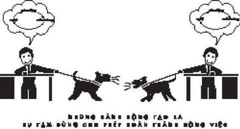
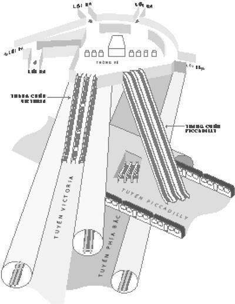

# 6. Sức mạnh của sự khủng hoảng

### *Cách thức các lãnh đạo tạo ra thói quen dù vô tình hay hữu ý*

Bệnh nhân đã bất tỉnh khi ông được đẩy vào phòng phẫu thuật ở Bệnh viện Đảo Rhode. Ông bị vỡ quai hàm, mắt ông nhắm nghiền và miệng ống luồn khí quản được dính trên môi ông. Khi một y tá đỡ ông dậy gần một cái máy để đưa không khí vào phổi trong suốt cuộc phẫu thuật, một cánh tay của ông tuột khỏi băng ca, trên da lấm chấm những vết màu nâu.

Người đàn ông đã 86 tuổi và ba ngày trước, ông bị ngã ở nhà. Sau đó, ông gặp rắc rối lúc thức dậy và trả lời các câu hỏi, vì thế, cuối cùng vợ ông đã gọi xe cứu thương. Trong phòng cấp cứu, một bác sĩ hỏi ông chuyện gì đã xảy ra nhưng ông chỉ liên tục ngủ quên khi đang nói. Một ảnh chụp cắt lớp đầu của ông cho thấy lý do tại sao: Cú ngã đã làm não ông đập vào hộp sọ, gây ra hiện tượng tụ máu dưới màng cứng. Máu đang tụ lại trong phần bên trái của hộp sọ, gây áp lực lên các nếp gấp dễ vỡ của mô bên trong hộp sọ. Chất lưu đã tích tụ liên tục gần 72 giờ đồng hồ và những phần của não kiểm soát việc thở và tim của ông bắt đầu yếu đi. Nếu không hút máu ra, người đàn ông đó sẽ chết.

Vào lúc đó, bệnh viện Đảo Rhode là một trong những viện y học hàng đầu đất nước, bệnh viện giáo dục chính cho Đại học Brown và là trung tâm tổn thương Cấp độ I duy nhất ở miền Nam nước Anh. Bên trong tòa nhà bằng kính cao và dày, các bác sĩ đã khám phá ra những phương pháp y học hàng đầu, bao gồm sử dụng sóng siêu âm để phá hủy các khối u bên trong cơ thể bệnh nhân. Năm 2002, Liên hiệp Quốc gia về Chăm sóc sức khỏe đánh giá khu chăm sóc đặc biệt của bệnh viện là một trong những khu tốt nhất quốc gia.

Nhưng vào lúc bệnh nhân lớn tuổi đó đến, bệnh viện Đảo Rhode còn có một danh tiếng khác: một nơi bị tan rã vì những căng thẳng nội bộ. Giữa các y tá và bác sĩ có sự thù hằn sâu sắc. Năm 2000, công đoàn của y tá đã biểu quyết để đình công sau khi phàn nàn rằng họ bị buộc làm việc nguy hiểm trong nhiều giờ liền. Hơn 300 người đã đứng bên ngoài bệnh viện với các bảng hiệu ghi “Dừng Nô lệ” và “Họ không thể lấy đi niềm tự hào của chúng ta.”

“Đây là một nơi khủng khiếp,” một y tá nhớ lại và nói với một nhà báo. “Các bác sĩ có thể làm cho bạn cảm thấy như bạn là kẻ vô dụng, bạn là thứ bỏ đi. Như bạn nên cảm ơn họ vì đã thu nhận bạn.”

Người quản lý cuối cùng đồng ý hạn chế làm việc ngoài giờ bắt buộc của y tá nhưng sự căng thẳng vẫn tiếp tục gia tăng. Vài năm sau, một bác sĩ phẫu thuật đang chuẩn bị cho một cuộc phẫu thuật ở bụng thông thường khi một y tá yêu cầu “thời gian nghỉ.” Những khoảng dừng ngắn như thế là thủ tục tiêu chuẩn ở nhiều bệnh viện, một cách để các bác sĩ và nhân viên bảo đảm tránh được các lỗi sai. Các nhân viên y tá tại bệnh viện Đảo Rhode khăng khăng đòi thời gian nghỉ, đặc biệt từ khi một cuộc phẫu thuật mắt cho một bệnh nhân nữ theo kế hoạch lại chuyển thành cuộc phẫu thuật cắt a-mi-đan. Thời gian nghỉ được cho là giúp ngăn chặn những lỗi đó trước khi chúng xảy ra.

Trong cuộc phẫu thuật a-mi-đan, khi các y tá phòng phẫu thuật yêu cầu đội tụ họp xung quanh bệnh nhân trong thời gian nghỉ và bàn luận kế hoạch, bác sĩ hướng về phía cửa.

“Tại sao cô không xử lý vụ này?” bác sĩ phẫu thuật nói với y tá. “Tôi đang định ra ngoài để gọi một cuộc điện thoại. Hãy gõ cửa khi nào cô sẵn sàng.”

“Ông có nhiệm vụ phải ở đây, bác sĩ,” cô đáp lời.

“Cô có thể xử lý được,” bác sĩ nói khi ông bước về phía cửa.

“Bác sĩ, tôi không thấy điều đó phù hợp.”

Bác sĩ dừng lại và nhìn cô. “Nếu tôi muốn cái ý kiến chết tiệt của cô, tôi sẽ yêu cầu,” ông nói. “Đừng bao giờ đòi hỏi thẩm quyền của tôi một lần nữa. Nếu cô không thể làm công việc của mình, hãy biến nhanh khỏi phòng phẫu thuật của tôi.”

Người y tá xử lý thời gian nghỉ, vài phút sau gọi lại cho bác sĩ và thủ tục diễn ra không có chút phức tạp nào. Cô không bao giờ cãi lại bác sĩ lần nào nữa và cũng không bao giờ nói bất cứ điều gì khi các quy tắc an toàn khác bị bỏ qua.

“Vài bác sĩ thì ổn nhưng có vài người là quái vật,” một y tá làm việc tại bệnh viện Đảo Rhode vào giữa những năm 2000 nói với tôi. “Chúng tôi gọi nó là nhà máy thủy tinh, vì có vẻ như mọi thứ có thể đổ sập bất cứ lúc nào.”

Để giải quyết căng thẳng, các nhân viên đã phát triển những quy tắc bình thường – những thói quen duy nhất cho viện – giúp đẩy lui những mâu thuẫn rõ ràng nhất. Ví dụ, các y tá, thường kiểm tra tỉ mỉ các yêu cầu của những bác sĩ có thể mắc lỗi và bảo đảm một cách kín đáo những liều thuốc đúng được kê đơn; họ dành thêm thời gian để viết rõ ràng trên các biểu đồ của bệnh nhân, vì sợ rằng một cuộc phẫu thuật vội vàng sẽ cắt sai vị trí. Một y tá nói với tôi họ phát triển một hệ thống các mã màu để cảnh báo người khác. “Chúng tôi để tên các bác sĩ ở các màu khác nhau trên bảng trắng,” cô nói. “Màu xanh nghĩa là ‘tốt,’ đỏ nghĩa là ‘ngớ ngẩn,’ và đen nghĩa là, ‘dù cho người đó có làm gì, đừng đối đầu với họ, nếu không họ sẽ lấy đầu bạn.’”

Bệnh viện Đảo Rhode là môi trường có tính ăn mòn. Không giống như Alcoa, nơi những thói quen chủ chốt được thiết kế kỹ lưỡng xoay quanh vấn đề an toàn lao động đã tạo ra những thành công ngày càng lớn hơn, bên trong bệnh viện Đảo Rhode, những thói quen hình thành rất nhanh và không suy nghĩ khi các y tá đang tìm kiếm để bù đắp lại sự ngớ ngẩn của bác sĩ. Những hoạt động của bệnh viện không được suy nghĩ kỹ càng. Thay vào đó, nó xuất hiện ngẫu nhiên và lan truyền qua những lời cảnh cáo thì thầm, cho đến khi những mô hình không tốt hình thành. Điều đó có thể xảy ra trong bất kỳ tổ chức nào - nơi những thói quen không được sắp đặt theo chủ ý. Chỉ riêng việc lựa chọn những thói quen quyết định đúng có thể tạo ra sự thay đổi tuyệt vời, những thói quen sai có thể gây ra thảm họa.

Và khi những thói quen trong bệnh viện Đảo Rhode nổ tung, chúng gây ra những sai lầm đáng sợ.

* * *

Khi nhân viên phòng cấp cứu nhìn thấy hình chụp cắt lớp não của người đàn ông 86 tuổi với hiện tượng tụ máu dưới màng cứng, ngay lập tức họ liên lạc với bác sĩ thần kinh đang trực. Ông đang trong một ca mổ xương sống thông thường, nhưng khi nhận được cuộc gọi, ông bước khỏi bàn phẫu thuật ngay và nhìn vào những hình ảnh chụp đầu của người đàn ông già trên màn hình máy tính. Bác sĩ phẫu thuật nói với trợ lý của mình – một y tá thực tập – đến phòng cấp cứu và bảo vợ ông ký vào giấy đồng ý phẫu thuật. Ông hoàn thành cuộc phẫu thuật xương sống. Nửa giờ sau, người đàn ông già được đẩy vào phòng mổ tương tự.

Các y tá đang vội vã xung quanh. Người đàn ông già bất tỉnh được đặt trên bàn. Một y tá cầm lấy giấy đồng ý của ông và biểu đồ y học.

“Bác sĩ,” y tá nói, đang nhìn vào biểu đồ của bệnh nhân. “Giấy đồng ý không ghi gì về vị trí chỗ tụ máu.” Y tá lật qua lật lại tờ giấy. Không có dấu hiệu rõ ràng nào chỉ rõ họ có nhiệm vụ phải mổ bên đầu nào của bệnh nhân.

Bệnh viện nào cũng phải dựa vào giấy tờ để hướng dẫn phẫu thuật. Trước khi cắt bất cứ thứ gì, một bệnh nhân hay thành viên trong gia đình phải được cho ký vào các giấy tờ đồng ý mỗi thủ tục và làm rõ các chi tiết. Trong một môi trường lộn xộn, nơi mà các bác sĩ cũng như y tá có thể chịu trách nhiệm một bệnh nhân đang ở giữa tình trạng cấp cứu và phục hồi, giấy đồng ý là toàn bộ hướng dẫn ghi rõ những gì được cho là sắp xảy ra. Không ai được đưa vào phòng phẫu thuật mà không có giấy đồng ý đã ký và đầy đủ chi tiết.

“Tôi đã nhìn hình chụp cắt lớp trước rồi,” bác sĩ phẫu thuật nói. “Nó ở phía bên phải đầu. Nếu chúng ta không làm thật nhanh, ông ta sẽ chết.”

“Có lẽ chúng ta nên xem lại hình chụp một lần nữa,” y tá nói, di chuyển về phía máy tính. Vì lý do an toàn, các máy tính của bệnh viện đều khóa sau 15 phút nếu không dùng đến. Sẽ mất ít nhất là một phút để y tá đăng nhập vào và tải hình chụp cắt lớp não của bệnh nhân lên màn hình.

“Chúng ta không có thời gian,” bác sĩ phẫu thuật nói. “Họ nói với tôi ông ấy đang yếu dần. Chúng ta phải giảm áp lực ngay.”

“Điều gì sẽ xảy ra nếu chúng ta tìm thấy gia đình ông ta?” y tá hỏi.

“Nếu đó là điều cô muốn thì hãy gọi đến ER chết tiệt và tìm gia đình ông ta! Trong khi chờ đợi, tôi sẽ cứu sống ông ấy.” Bác sĩ phẫu thuật nắm chặt tờ giấy, viết nghệch ngoạc “phải” trên giấy đồng ý và ký vào nó.

“Đây,” ông nói. “Chúng ta phải phẫu thuật ngay lập tức.”

Y tá đó đã làm việc tại bệnh viện Đảo Rhode được một năm. Anh hiểu rõ môi trường bệnh viện này. Người y tá biết, tên của bác sĩ phẫu thuật đó thường được viết cẩu thả bằng mực đen trên bảng trắng lớn ở hành lang, báo hiệu cho các y tá nên thận trọng. Những quy tắc không viết ra trong hoàn cảnh này là rất rõ ràng: Bác sĩ phẫu thuật luôn luôn thắng.

Người y tá đặt biểu đồ xuống và đứng bên cạnh khi bác sĩ định vị đầu của người đàn ông già trong một cái khung gạt để dễ tiếp cận phía bên phải hộp sọ của ông, cạo tóc và khử trùng vị trí đó. Kế hoạch là mở hộp sọ ra và hút máu qua lỗ trên đỉnh đầu. Bác sĩ cắt từng miếng da đầu mỏng, để lộ hộp sọ và đặt một mũi khoan trên lớp xương trắng. Ông bắt đầu ấn vào cho đến khi một mảnh vỡ ra. Ông làm thêm 2 lỗ vỡ nhỏ nữa và sử dụng một cái cưa để cắt thành một mảnh hình tam giác trên hộp sọ. Ở bên dưới là màng cứng, lớp vỏ trắng mờ bao quanh não.

“Lạy Chúa,” ai đó nói.

Không có tụ máu nào. Họ đang phẫu thuật sai vị trí.

“Chúng ta cần đổi bên!” bác sĩ phẫu thuật hét lên.

Mảnh tam giác xương được thay thế, dán lại bằng một miếng kim loại nhỏ và các đinh vít, da đầu bệnh nhân được may lại. Đầu bệnh nhân được chuyển sang phía còn lại và sau đó, lại một lần nữa, cạo, khử trùng, cắt và khoan cho đến khi có thể lấy ra được một mảnh hộp sọ hình tam giác. Lần này, ngay lập tức nhìn thấy được chỗ tụ máu, một chỗ phình màu đen tràn ra như si-rô đặc khi màng cứng bị chọc thủng. Bác sĩ hút máu ra và áp lực bên trong hộp sọ người đàn ông già giảm xuống ngay lập tức. Cuộc phẫu thuật, lẽ ra chỉ kéo dài khoảng một tiếng, đã mất gần gấp đôi thời gian.

Sau đó, bệnh nhân được đưa đến khu chăm sóc đặc biệt nhưng ông không bao giờ tỉnh lại hoàn toàn. Hai tuần sau, ông ấy chết.

Một cuộc điều tra sau phẫu thuật cho rằng có thể xác định chính xác nguyên nhân cái chết nhưng gia đình bệnh nhân tranh cãi rằng vết thương do lỗi y học đã lấn át cơ thể vốn yếu ớt của ông, rằng sức ép từ việc lấy ra hai mảnh hộp sọ, thời gian kéo dài thêm trong phẫu thuật và sự chậm trễ hút tụ máu ra đã đẩy ông gần bờ vực hơn. Họ khẳng định, nếu không phải vì lỗi đó, ông ấy có thể sống sót. Bệnh viện trả tiền bồi thường và vị bác sĩ phẫu thuật bị cấm làm việc tại bệnh viện Đảo Rhode kể từ đó.

Sau này vài y tá khẳng định, một tai nạn như thế là không thể tránh khỏi. Những thói quen tổ chức của bệnh viện Đảo Rhode rất không bình thường, đó chỉ là vấn đề thời gian cho đến khi một lỗi lầm tai hại xảy ra. Dĩ nhiên không phải chỉ bệnh viện mới phát sinh ra những mô hình nguy hiểm. Những thói quen nguy hiểm của tổ chức có thể được tìm thấy trong hàng trăm ngành công nghiệp và tại hàng nghìn công ty. Và gần như luôn luôn, các nhà lãnh đạo tránh né nhắc đến môi trường tạo ra nhiều sản phẩm không suy nghĩ và vì thế để nó phát triển mà không có sự hướng dẫn nào. Không có tổ chức nào mà không kèm theo những thói quen. Chỉ có những nơi mà chúng được thiết kế theo chủ ý và những nơi mà chúng được tạo ra mà không có tính toán trước, vì thế chúng thường hình thành từ sự ganh đua hay nỗi sợ hãi.

Nhưng đôi lúc, các nhà lãnh đạo biết cách nắm giữ những cơ hội đúng cũng có thể chuyển đổi những thói quen không tốt. Đôi lúc, giữa lúc khủng hoảng nhất, thói quen đúng có thể xuất hiện.

***Khi Thuyết tiến hóa*** ***về thay đổi kinh t***ế được xuất bản lần đầu tiên vào năm 1982, rất ít người ngoài giới học thuật để ý đến. Bìa sách nhạt nhẽo và lời nói đầu thì dễ làm nản lòng – “Trong cuốn sách này chúng tôi phát triển một lý thuyết tiến hóa về những khả năng và lề thói của các công ty kinh doanh đang hoạt động trong thị trường, hướng dẫn và phân tích một số mô hình phù hợp với lý thuyết đó” – gần như có vẻ ngụ ý né tránh độc giả. Các giáo sư Richard Nelson và Sidney Winter ở Yale, đồng tác giả cuốn sách, được biết đến nhiều nhất từ một chuỗi các bài báo phân tích chuyên sâu khám phá lý thuyết Schumpeterian mà nhiều học viên tiến sĩ không có ý định hiểu nó.

Tuy nhiên, trong thế giới của chiến lược kinh doanh và nguyên tắc tổ chức, cuốn sách xuất hiện như một quả bom. Nó nhanh chóng được tung hô là một trong những cuốn sách quan trọng nhất thế kỷ. Các giáo sư kinh tế học bắt đầu nói về nó với các đồng nghiệp ở các trường kinh doanh, nói với các giám đốc điều hành ở các cuộc hội thảo và ngay lập tức các nhà điều hành trích dẫn Nelson và Winter trong các tập đoàn khác nhau như General Electric, Pfizer và khách sạn Starwood.

Nelson và Winter đã dành hơn 10 năm nghiên cứu cách các công ty hoạt động, từng bước khảo sát rất nhiều tài liệu trước khi đến được kết luận chính yếu của mình: “Phần lớn lề thói của công ty,” họ viết, “tốt nhất nên hiểu là sự phản chiếu những thói quen chung và sự định hướng chiến lược từ quá khứ của công ty,” hơn là “kết quả của một khảo sát chi tiết từ nhánh xa nhất của biểu đồ cây về việc ra quyết định.”

Hay, đặt trong ngôn ngữ mà mọi người sử dụng bên ngoài kinh tế học lý thuyết, giống như nhiều tổ chức có được sự lựa chọn hợp lý dựa trên việc ra quyết định theo chủ ý, nhưng đó không thật sự là cách công ty hoạt động. Thay vào đó, các công ty được dẫn dắt bởi các thói quen tổ chức lâu đời, những mô hình thường hình thành từ hàng nghìn quyết định độc lập của công nhân. Và những thói quen đó có tác động sâu sắc hơn bất kỳ ai có thể hiểu được trước đó.

Ví dụ như, giám đốc điều hành của một công ty thời trang may mặc ra quyết định từ năm ngoái để nhấn mạnh một cái áo len đan màu đỏ trên bìa danh mục thời trang bằng cách xem kỹ lại doanh số và dữ liệu quảng cáo. Nhưng, trên thực tế, điều thực sự xảy ra là phó chủ tịch của ông này liên tục cập nhật các trang web theo xu hướng thời trang Nhật Bản (nơi mà màu đỏ là mốt năm ngoái), và các nhà quảng cáo của công ty thường hỏi các bạn mình màu sắc nào sắp lên, và nhà điều hành công ty, trở về từ chuyến đi thường niên đến các buổi trình diễn ở Paris, báo cáo rằng các nhà thiết kế ở các công ty đối thủ đang sử dụng chất nhuộm mới màu đỏ tươi. Tất cả những thông tin đầu vào nhỏ nhặt đó, kết quả của những mô hình thiếu hợp tác giữa các nhà điều hành tám chuyện về đối thủ và nói chuyện với bạn bè, trộn lẫn vào nghiên cứu chính thức của công ty và những hoạt động phát triển cho đến khi có một sự thống nhất: Màu đỏ sẽ phổ biến năm nay. Không ai ra quyết định đơn lẻ, theo ý mình. Thay vào đó, hàng chục thói quen, quy trình và lề thói chuyển đổi cho đến khi có vẻ như màu đỏ là lựa chọn không thể tránh khỏi.

Những thói quen tổ chức đó – hay “lề thói,” như Nelson và Winter gọi – cực kỳ quan trọng, vì nếu không có chúng, nhiều công ty sẽ không bao giờ hoàn thành xong việc gì. Những lề thói mang đến hàng trăm quy tắc không chính thức mà công ty cần để hoạt động. Chúng cho phép các công nhân thí nghiệm những ý tưởng mới mà không cần phải hỏi xin phép ở mỗi bước. Chúng mang đến một loại “trí nhớ tổ chức,” vì thế các nhà quản lý không cần phải làm mới lại quy trình kinh doanh 6 tháng một lần hay hoảng loạn mỗi lần một phó chủ tịch từ bỏ. Những lề thói làm giảm sự không chắc chắn – ví dụ, một nghiên cứu về nỗ lực hồi phục sau động đất ở Mexico và Los Angeles cho thấy những thói quen của các nhân viên viện trợ (họ mang theo từ tai họa này đến tai họa khác và gồm những thứ như xây dựng mạng lưới giao tiếp bằng cách thuê trẻ con đưa tin nhắn giữa những người hàng xóm) là cực kỳ quan trọng, “vì nếu không có chúng, sự tạo lập và thi hành chính sách sẽ lạc giữa một rừng chi tiết.”

Nhưng lợi ích quan trọng nhất của các lề thói là chúng tạo ra sự tạm dừng giữa các nhóm và cá nhân đang có mâu thuẫn tiềm tàng trong cùng một tổ chức.

Đa số các nhà kinh tế đã quen với việc xem công ty như những nơi bình dị mà mọi người ở nơi đó luôn hết lòng vì một mục tiêu chung: làm ra càng nhiều tiền càng tốt. Nelson và Winter chỉ ra rằng, trong thế giới thực, đó không phải là cách mọi thứ hoạt động. Nhiều công ty không phải là những gia đình lớn, hạnh phúc, nơi mọi người vui đùa cùng nhau một cách tốt đẹp. Thay vào đó, nhiều nơi làm việc được tạo thành từ những vùng ảnh hưởng mà các nhà điều hành có được do cạnh tranh quyền lực và sự tín nhiệm, thường trong những cuộc chạm trán nhỏ làm cho sự thể hiện của họ vượt trội hơn và của các đối thủ thì tệ đi. Các đơn vị cạnh tranh nguồn tài nguyên và phá hoại người khác để làm giảm danh tiếng của họ. Những ông chủ thì làm cấp dưới đấu đá lẫn nhau nên không ai có thể làm được chuyện gì phi thường.

Các công ty không phải là gia đình. Đó là chiến trường trong một cuộc nội chiến.

Mặc dù có khả năng xảy ra nội chiến, nhiều công ty vẫn hoạt động tương đối bình yên, năm này qua năm khác, vì họ có những lề thói – thói quen – tạo ra sự tạm dừng cho phép mọi người bỏ qua các đối thủ đủ lâu để hoàn thành một ngày làm việc.

Những thói quen của tổ chức mang đến một lời hứa cơ bản: Nếu bạn làm theo những mô hình dựng sẵn và tuân theo thời gian tạm ngừng, các đối thủ sẽ không phá hủy công ty, lợi nhuận sẽ tăng lên và cuối cùng mọi người đều giàu có. Ví dụ, một người bán hàng biết cô ấy có thể tăng điểm thưởng bằng cách mang đến cho các khách hàng yêu thích mức giảm giá cao để đổi lấy nhiều đơn đặt hàng với số lượng lớn. Nhưng cô ấy cũng biết rằng nếu mọi người bán hàng đều đưa ra mức giảm giá cao, công ty sẽ phá sản và không có điểm thưởng nào nữa, Vì thế, một lề thói hình thành: Tất cả nhân viên bán hàng cùng họp mặt vào tháng Giêng hàng năm và đồng ý giới hạn số lượng giảm giá họ đưa ra nhằm bảo vệ lợi nhuận của công ty, và cuối cùng đến cuối năm mọi người đều được tăng lương.

Hay một nhà điều hành trẻ đang săn đuổi chức phó chủ tịch mà chỉ một cuộc điện thoại lặng lẽ của anh ta đến một khách hàng lớn có thể hủy một cuộc giao dịch và dấy lên sự bất hòa ở đồng nghiệp khác, đẩy anh ta ra khỏi cuộc đua thăng chức. Vấn đề với sự phá hoại là cho dù nó tốt cho bạn, nó thường vẫn tệ đối với công ty. Vì thế, ở nhiều công ty, một thỏa thuận ngầm hình thành: tốt thôi nếu bạn có tham vọng, nhưng nếu bạn chơi quá thô lỗ, đồng nghiệp của bạn sẽ liên kết chống lại bạn. Nói cách khác, nếu bạn chỉ tập trung vào phát triển phòng của mình, hơn là phá hoại đối thủ, bạn có thể được chăm sóc tốt qua thời gian.

Nelson và Winter viết, những lề thói và sự tạm dừng mang đến một kiểu công bằng khó chịu cho tổ chức và bởi vì nó, mâu thuẫn trong công ty thường “đi theo những con đường lớn, dự đoán được và ở bên trong những phạm vi có thể biết trước, phù hợp với lề thói hiện có… Khối lượng công việc hoàn thành bình thường, những lời khiển trách và phê bình được đưa ra với tần số bình thường… Không ai cố gắng lái con tàu của tổ chức vào một vòng cua gấp với hy vọng ném một đối thủ qua mạn tàu.”

Phần lớn thời gian, những lề thói và sự tạm dừng hoạt động một cách hoàn hảo. Các đối thủ dĩ nhiên vẫn tồn tại, nhưng vì thói quen của tổ chức, họ nằm trong giới hạn và hoạt động kinh doanh thì phát đạt.

Tuy nhiên, đôi lúc sự tạm dừng cũng không hiệu quả. Đôi lúc, như bệnh viện Đảo Rhode khám phá được, sự hòa bình không ổn định cũng có thể phá hủy mọi thứ như bất kỳ cuộc nội chiến nào.

* * *

Đâu đó trong văn phòng của bạn, cất kỹ trong một ngăn kéo bàn, có thể là cuốn sổ tay bạn nhận được vào ngày đầu tiên đi làm. Nó chứa những kiểu mẫu và quy tắc đắt giá về kỳ nghỉ, các tùy chọn bảo hiểm và cơ cấu tổ chức của công ty. Nó có những biểu đồ sáng màu mô tả các kế hoạch chăm sóc sức khỏe khác nhau, một danh sách các số điện thoại liên quan và những hướng dẫn về cách truy cập thư điện tử và đăng ký quỹ hưu 401(k).

Bây giờ, hãy tưởng tượng điều bạn sẽ nói với một đồng nghiệp mới khi người đó xin bạn lời khuyên về cách để thành công ở công ty bạn. Lời khuyên của bạn có thể không bao gồm những gì có thể tìm thấy trong sách hướng dẫn của công ty. Thay vào đó, những lời khuyên của bạn – về người đáng tin cậy; những trợ lý nào có ảnh hưởng nhiều hơn ông chủ của họ; cách để lôi kéo các quan chức để làm cho xong công việc nào đó – là những thói quen bạn dựa vào mỗi ngày để sinh tồn. Nếu, bằng cách nào đó, bạn có được biểu đồ các thói quen làm việc của mình – và cơ cấu quyền lực không chính thức, các mối quan hệ, những liên minh và các mâu thuẫn nó đại diện – và sau đó xếp chồng biểu đồ của bạn với các biểu đồ mà đồng nghiệp chuẩn bị, nó sẽ tạo ra một bản đồ về hệ thống cấp bậc bí mật của công ty, một hướng dẫn cho mọi người biết cách làm cho mọi thứ diễn ra và ai là người không bao giờ có vẻ đang dẫn bóng trước.

Những lề thói của Nelson và Winter – và sự tạm dừng mà họ có thể tạo ra – quan trọng với mọi loại hình kinh doanh. Ví dụ, Đại học Utrecht ở Hà Lan tiến hành nghiên cứu xem xét những lề thói trong thế giới thời trang cao cấp. Để tồn tại, mỗi nhà thiết kế thời trang phải sở hữu vài kỹ năng cơ bản: sức sáng tạo và năng khiếu làm thời trang cao cấp như một khởi điểm. Nhưng điều đó chưa đủ để thành công. Điều tạo ra sự khác biệt giữa thành công và thất bại là những lề thói của một nhà thiết kế - liệu họ có một hệ thống để có được vải pôpơlin của Ý trước khi kho hàng của các nhà bán sỉ hết sạch, một quá trình để tìm ra dây khóa kéo và thợ may khuy áo tốt nhất, một lề thói để chuyển một bộ váy đến cửa hàng trong vòng 10 ngày thay vì 3 tuần. Thời trang là một ngành kinh doanh phức tạp mà nếu không có quy trình đúng, một công ty mới sẽ bị đình trệ ở khâu hậu cần và một khi điều đó xảy ra, sức sáng tạo không còn ảnh hưởng nữa.

Và nhà thiết kế mới nào có vẻ có được thói quen đúng nhất? Chính là người đã hình thành được sự tạm dừng đúng đắn và tìm được liên minh đúng. Sự tạm dừng quan trọng đến mức các nhãn hiệu thời trang mới thường thành công chỉ khi chúng được những người nói về các công ty thời trang** *khác*** với những lời lẽ tốt đẹp dẫn dắt.

Vài người có thể nghĩ Nelson và Winter đang viết một cuốn sách về lý thuyết kinh tế khô khan. Nhưng thứ họ thật sự tạo ra là bản hướng dẫn để sống sót trong các tập đoàn Mỹ.

Hơn thế, những lý thuyết của Nelson và Winter cũng giải thích tại sao mọi thứ lại sai hướng ở bệnh viện Đảo Rhode. Bệnh viện có những lề thói tạo ra một môi trường hòa bình không dễ dàng giữa các y tá và bác sĩ – ví dụ, bảng trắng và những lời cảnh báo mà các y tá lan truyền đến tai nhau là những thói quen tạo lập sự dừng lại chuẩn. Những thỏa ước dễ phá vỡ cho phép tổ chức hoạt động trong phần lớn thời gian. Nhưng những sự dừng lại chỉ bền vững khi chúng tạo ra sự công bằng thật sự. Nếu sự tạm dừng không cân bằng – nếu môi trường hòa bình không tồn tại thật sự – thì các lề thói thường thất bại khi người ta cần đến chúng nhất.

Vấn đề quan trọng ở bệnh viện Đảo Rhode là các y tá là những người duy nhất từ bỏ quyền lực để hướng đến sự tạm dừng. Họ kiểm tra kỹ càng việc kê đơn cho bệnh nhân và nỗ lực nhiều hơn để viết rõ ràng trên các biểu đồ; các y tá chịu đựng sự ngược đãi từ các bác sĩ bị căng thẳng, các y tá giúp tách riêng các bác sĩ trị liệu tốt bụng ra khỏi những kẻ chuyên quyền, nên các nhân viên còn lại biết được ai chịu đựng những đề nghị trong phòng phẫu thuật mà không phản đối và ai sẽ bùng nổ nếu bạn mở miệng. Các bác sĩ thường không bận tâm đến việc nhớ tên y tá. “Các bác sĩ điều khiển ca trực còn chúng tôi chỉ là người phụ giúp,” một y tá nói với tôi. “Chúng tôi bịt tai vào và tồn tại.”

Sự tạm dừng ở bệnh viện Đảo Rhode là phiến diện. Vì thế, vào những thời điểm quan trọng – ví dụ, khi một bác sĩ phẫu thuật đang định rạch vết mổ một cách vội vã và một y tá cố gắng can thiệp – thì những lề thói có thể ngăn tai nạn xảy ra và phía đầu bị mở ra sai vị trí của người đàn ông 86 tuổi.

Vài người có thể đề nghị giải pháp là những tạm dừng đều đặn hơn. Đó là nếu lãnh đạo bệnh viện chỉ định thẩm quyền tốt hơn, có thể hình thành sự cân bằng quyền lực tốt hơn, các y tá và bác sĩ sẽ bắt buộc phải tôn trọng lẫn nhau.

Đó là một khởi đầu tốt. Không may thay, điều đó vẫn chưa đủ. Tạo ra các tổ chức thành công không chỉ là vấn đề cân bằng quyền lực. Để một tổ chức hoạt động, các lãnh đạo phải nuôi dưỡng những thói quen không chỉ tạo ra một môi trường hòa bình cân bằng thật sự mà còn phải hoàn toàn làm rõ ai đang chịu trách nhiệm chính.

Một buổi tối tháng Mười một năm 1987, Philip Brickell, một nhân viên 43 tuổi làm việc ở Hệ thống tàu điện ngầm London, đang thu vé ở bên trong lối hầm đi chính của trạm tàu điện ngầm King’s Cross thì một khách đi tàu dừng ông lại nói rằng có một mảnh vải mỏng đang cháy ở cuối thang cuốn gần đây.

King’s Cross là một trong những trạm dừng tàu điện ngầm lớn nhất, quan trọng nhất và tắc nghẽn giao thông nghiêm trọng nhất ở London, một mê cung của các thang cuốn sâu, hành lang và đường hầm, một vài cái trong số đó đã được 100 tuổi rồi. Thang cuốn của trạm nổi tiếng với kích thước và tuổi thọ của nó. Có cái trải rộng bằng 5 cửa hàng trong lòng đất và được xây bằng các thanh gỗ mỏng và tay vịn bằng cao su, cùng chất liệu được sử dụng để xây dựng chúng cả chục năm trước. Hơn 25.000 lượt hành khách qua King’s Cross mỗi ngày trên 6 đường tàu khác nhau. Trong suốt giờ cao điểm mỗi tối, phòng vé của trạm là một biển người vội vã bên dưới cái trần được sơn lại rất nhiều lần nên không ai có thể nhớ được màu nguyên bản của nó.

Người hành khách nói, mảnh vải cháy đang ở phía dưới của một trong những thang cuốn dài nhất trạm, phục vụ cho đường tàu Piccadilly. Brickell ngay lập tức rời vị trí của mình, đi thang cuốn xuống sân ga, tìm mảnh vải đang cháy và với một tờ báo cuộn tròn, dập tắt lửa. Sau đó ông trở về vị trí của mình.

Brickell không điều tra sâu hơn. Ông không cố gắng tìm hiểu tại sao mảnh vải lại cháy hay nó có thể bay ra từ một đám cháy lớn hơn ở chỗ nào khác trong trạm. Ông cũng không đề cập tai nạn đó với nhân viên nào khác hay gọi phòng chữa cháy. Một phòng ban riêng biệt giải quyết việc an toàn cháy nổ và Brickell, không thua kém gì các phòng quản lý chặt chẽ của Hệ thống Tàu điện ngầm, biết rằng tốt hơn là đừng xâm phạm đến chức trách của ai. Bên cạnh đó, cho dù ông có điều tra khả năng hỏa hoạn, ông cũng sẽ không biết phải làm gì với bất kỳ thông tin nào ông biết được. Hệ thống cấp bậc quy định chặt chẽ ở Hệ thống tàu điện ngầm cấm ông liên lạc với các phòng ban khác nếu không có thẩm quyền trực tiếp từ cấp trên. Và những lề thói của Hệ thống tàu điện ngầm – truyền từ nhân viên này đến nhân viên khác – bảo với ông rằng ông không bao giờ, trong bất kỳ hoàn cảnh nào, nên nói to đến bất cứ thứ gì bên trong một nhà ga là “lửa,” vì sợ rằng khách đi tàu sẽ hoảng loạn. Đó không phải là cách giải quyết mọi việc.

Hệ thống tàu điện ngầm được điều hành theo dạng sách quy tắc có tính lý thuyết mà không ai từng nhìn thấy hay đọc được – và trên thực tế, nó không tồn tại ngoại trừ trong những quy tắc không chính thức điều chỉnh cuộc sống các nhân viên. Hàng chục năm qua, Hệ thống tàu điện ngầm được dẫn dắt bởi “4 ông trùm” – người lãnh đạo của khu dân sự, tín hiệu, điện và kỹ thuật cơ khí – và trong mỗi phòng ban đó, các ông chủ và cấp dưới đều bảo vệ thẩm quyền của mình với vẻ đố kỵ. Các chuyến tàu chạy đúng giờ vì tất cả 19.000 nhân viên của Hệ thống tàu điện ngầm phối hợp trong một hệ thống chặt chẽ được chuyển giao cho các hành khách và chuyến tàu qua hàng chục – đôi khi hàng trăm – bàn tay trong một ngày. Nhưng sự phối hợp đó phụ thuộc vào sự cân bằng quyền lực giữa bốn phòng ban và tất cả cấp dưới dựa vào hàng nghìn thói quen mà các nhân viên bám chặt vào. Những thói quen đó tạo ra một sự tạm dừng giữa bốn Ông trùm và các cấp phó. Và từ sự tạm dừng đó, các chính sách được hình thành cho Brickell biết rằng: Tìm ra hỏa hoạn không phải là công việc của ông. Đừng đi quá giới hạn của mình.

“Cho dù ở cấp bậc cao nhất, một giám đốc cũng không có vẻ sẽ xâm phạm đến lãnh thổ của người khác,” một điều tra viên ghi chú sau này. “Vì thế, giám đốc kỹ thuật không dính líu đến việc nhân viên có được huấn luyện về an toàn hỏa hoạn và các thủ tục di tản đúng hay không vì ông chỉ xem xét các vấn đề thuộc trách nhiệm của ban giám đốc.”

Vì thế, Brickell không nói gì về mảnh vải cháy. Trong các hoàn cảnh khác, nó có thể là chi tiết không quan trọng. Trong trường hợp này, mảnh vải đó là một cảnh báo riêng lẻ – một ít chất đốt đã thoát ra từ một đám cháy lớn hơn và chưa được phát hiện – sẽ chỉ ra cách các sự kiện nguy hiểm có thể cân bằng một cách hoàn hảo những sự tạm dừng nếu sự tạm dừng đó không được tạo lập đúng cách.

15 phút sau khi Brickell trở lại vị trí của mình, một hành khách khác để ý thấy một làn khói nhỏ khi ông đi thang cuốn Piccadilly lên; ông nhắc điều này với một nhân viên Hệ thống tàu điện ngầm. Giám sát an toàn của King’s Cross, Christopher Hayes, cuối cùng cũng bắt đầu điều tra. Một hành khách thứ ba, khi nhìn thấy khói và sức nóng từ bên dưới các bậc thang cuốn, đã nhấn một nút dừng khẩn cấp và bắt đầu la lên với các hành khách khác để rời khỏi thang cuốn. Một cảnh sát nhìn thấy một ít khói bên trong hầm thang cuốn dài và từ nửa đường xuống dưới, ngọn lửa bắt đầu tỏa lên phía trên các bậc thang.

Nhưng giám sát an toàn, Hayes, không gọi đến đội cứu hỏa London. Anh không nhìn thấy chút khói nào và một quy tắc bất thành văn của Hệ thống tàu điện ngầm là không bao giờ nên liên lạc với phòng ban hỏa hoạn trừ khi thật sự cần thiết. Tuy nhiên, người cảnh sát nhìn thấy khói nhận thấy cần phải liên lạc với cơ quan chính. Đài phát thanh của ông không hoạt động dưới lòng đất nên ông leo lên một cầu thang dài dẫn đến cửa ra và gọi cho cấp trên của mình, người cuối cùng chuyển lời đến phòng hỏa hoạn. Vào lúc 7h36’ tối – 22 phút sau khi Brickell được cảnh báo về mảnh vải cháy – đội cứu hỏa nhận được một cuộc gọi: Có hỏa hoạn nhỏ ở King’s Cross. Những người đi làm bằng tàu điện đổ xô băng qua viên cảnh sát khi anh đang đứng bên ngoài và thông báo qua đài phát thanh. Họ đang đổ xô vào nhà ga, xuống các đường hầm, cốt sao về nhà để chuẩn bị bữa tối.

Trong vòng vài phút, nhiều người trong số đó sẽ chết.

Lúc 7h36’ tối, một công nhân Hệ thống tàu điện ngầm chăng dây thừng để ngăn lối vào thang cuốn Piccadilly và một người khác bắt đầu đưa mọi người đến một cầu thang khác. Những chuyến tàu mới sẽ đến trong vài phút nữa. Sân ga nơi các hành khách ra khỏi tàu điện ngầm đang đông nghịt. Một chỗ hẹp dễ tắc nghẽn bắt đầu hình thành ở phần cuối của cầu thang mở.

Hayes, giám sát an toàn, bước vào một lối đi dẫn đến phòng máy của thang cuốn Piccadilly. Trong bóng tối, có một bộ cần điều khiển cho một hệ thống phun chống cháy được thiết kế riêng để chống hỏa hoạn trên thang cuốn. Nó đã được lắp đặt ở đó nhiều năm trước, sau một trận hỏa hoạn ở nhà ga khác dẫn đến một chuỗi các báo cáo đáng sợ về nguy cơ của một đám cháy bất ngờ. Hơn 24 nghiên cứu và lời khiển trách đã cho rằng Hệ thống tàu điện ngầm là nơi không được chuẩn bị cho hỏa hoạn và nhân viên ở đó cần được huấn luyện về cách sử dụng bình chữa cháy và máy dập lửa được đặt ở mọi sân ga. Hai năm trước, phó trợ lý của Đội Chữa cháy London đã gửi thư đến giám đốc kinh doanh của ngành đường sắt, phàn nàn về các thói quen an toàn của công nhân đường ngầm.

“Tôi là một người hay lo lắng quá mức,” bức thư có viết. “Tôi không thể nhấn mạnh quá nhiều rằng… những hướng dẫn rõ ràng được đưa ra, nếu có bất kỳ nghi ngờ hỏa hoạn nào, đội hỏa hoạn sẽ phải được gọi đến không chậm trễ. Điều đó sẽ giúp cứu mạng sống con người.”

Tuy nhiên, Hayes, giám sát an toàn, không bao giờ xem lá thư đó vì nó được gửi đến một đơn vị riêng biệt với nơi mà anh làm việc và theo các chính sách của Hệ thống tàu điện ngầm, nó không bao giờ được viết lại để phản ánh lời cảnh báo. Không ai bên trong King’s Cross hiểu được cách sử dụng hệ thống phun chống cháy thang cuốn hay được ủy quyền để sử dụng các máy chữa cháy, vì một phòng ban khác cai quản chúng. Hayes đã hoàn toàn quên mất sự tồn tại của hệ thống phun chống cháy. Những sự tạm dừng của Hệ thống tàu điện ngầm bảo đảm mọi người đều biết vị trí của mình, nhưng người ta không thể biết được vị trí khác. Hayes chạy qua cần điều khiển của hệ thống phun chống cháy mà không hề liếc mắt đến.

Bằng lòng nhiệt tình, anh đến được phòng máy. Nhưng trận hỏa hoạn đã quá lớn để có thể dập tắt. Anh chạy trở lại phòng chính. Có một dòng người đang đứng chỗ máy bán vé và hàng trăm người đi lang thang trong phòng, đi đến các sân ga hay rời khỏi nhà ga. Hayes tìm thấy một cảnh sát.

“Chúng ta phải dừng các chuyến tàu lại và đưa mọi người ra khỏi đây,” anh nói với người cảnh sát. “Trận hỏa hoạn đã ngoài tầm kiểm soát. Nó đang lan khắp mọi nơi.”

Lúc 7h42’ tối – gần nửa giờ sau khi có mảnh vải cháy – lính cứu hỏa đầu tiên đến King’s Cross. Khi anh tiến vào phòng vé, anh nhìn thấy khói đen dày đặc đang bắt đầu lan khắp trần. Tay nắm cao su của thang cuốn đã bắt đầu cháy. Khi mùi gắt của cao su cháy lan đi, người đi tàu trong phòng vé bắt đầu nhận ra có điều gì đó không ổn. Họ di chuyển về hướng lối thoát khi lính cứu hỏa băng qua đám đông, chống lại dòng người.

Bên dưới, lửa đang lan. Toàn bộ thang cuốn giờ đã bốc cháy, sinh ra một luồng khí cháy lớn dâng lên đến đỉnh của đường hầm thang máy, nơi nó bị giữ lại cách biệt khỏi trần nhà được phủ khoảng 20 lớp các bức họa cũ kỹ. Một vài năm trước, giám đốc hoạt động của Hệ thống tàu điện ngầm đã cho rằng tất cả các bức họa có thể mang đến nguy cơ hỏa hoạn. Ông nói, có thể những lớp vẽ cũ nên được tháo bỏ trước khi vẽ một bức mới?

Tuy nhiên, trách nhiệm về tranh vẽ không thuộc quyền của ông. Nó thuộc về phòng bảo trì mà vị trưởng phòng đã lịch sự cảm ơn đồng nghiệp về lời khuyên và sau đó lưu ý rằng nếu ông muốn can thiệp vào các phòng khác, thiện ý đó sẽ được hoàn trả ngay lập tức.

Giám đốc kinh doanh rút lại lời khuyên của mình.

Khi khí cháy cao lan khắp trần của đường hầm thang cuốn, toàn bộ các lớp vẽ cũ bắt đầu hấp thu sức nóng. Và mỗi chuyến tàu đến, nó đẩy một luồng ô-xy mới vào nhà ga như một cái ống thổi, làm cho trận lửa lớn hơn.

Lúc 7h43’ tối, một chuyến tàu đến và một người bán hàng tên là Mark Silver bước ra. Ngay lập tức anh biết rằng có điều gì đó không ổn. Không khí mờ mịt, sân ga thì đầy người. Khói tỏa xung quanh chỗ anh đứng, lan xung quanh các toa tàu khi tàu đang đậu trên đường ray. Anh quay trở lại để vào lại tàu nhưng cửa tàu đã đóng. Anh đập lên của sổ nhưng có một quy định không chính thức để tránh sự chậm trễ: Một khi cửa đóng kín, chúng không mở ra nữa. Trên sân ga, Silver và nhiều hành khách khác la hét với người lái tàu để mở cửa ra. Đèn tín hiệu chuyển sang màu xanh và đoàn tàu lăn bánh. Một phụ nữ chạy theo chuyến tàu khi nó đi vào đường hầm. “Cho tôi lên!” cô hét lớn.

Silver bước xuống sân ga, đến nơi một cảnh sát đang hướng dẫn mọi người cách xa thang cuốn Piccadilly và đến cầu thang khác. Nhiều đám đông đang hoảng loạn chờ để leo lên cầu thang. Tất cả đều ngửi thấy mùi khói và mọi người tụ lại với nhau. Silver cảm thấy nóng, nhưng không chắc là do trận lửa hay đám đông. Cuối cùng anh cũng đến được cuối thang cuốn. Khi anh leo lên hướng về phòng vé, anh có thể cảm thấy chân mình đang cháy do sức nóng xuyên qua một bức tường dày nửa mét cách biệt anh với đường hầm Piccadilly. “Tôi nhìn lên và thấy các bức tường và trần nhà đang kêu xèo xèo,” anh nói sau đó.

Lúc 7h45’ tối, một chuyến tàu đến đưa một luồng không khí lớn vào nhà ga. Vì khí ô-xy làm cho ngọn lửa lớn hơn, ngọn lửa trong thang cuốn Piccadilly bùng phát dữ dội. Khí cháy cao lan khắp trần đường hầm, được đốt bằng lửa bên dưới và các bức vẽ kêu xèo xèo bên trên, đạt đến một nhiệt độ dễ cháy, được biết đến là “điểm bốc cháy.” Vào thời điểm đó, mọi thứ bên trong đường hầm – tranh vẽ, các bậc thang bằng gỗ và bất kỳ nhiên liệu có sẵn nào – đều bắt lửa. Sức tác động của sự thiêu đốt bất ngờ đó như vụ nổ thuốc súng bên trong nòng súng. Nó bắt đầu đẩy ngọn lửa lên trên qua đường hầm dài, hấp thu nhiều nhiệt hơn và vận tốc lớn hơn khi ngọn lửa lan rộng cho đến lúc nó tràn ra khỏi đường hầm và tràn vào phòng vé hóa thành một bức tường lửa làm cho kim loại, ngói và thịt đều bốc cháy. Nhiệt độ trong phòng tăng đến 150 độ chỉ trong nửa giây. Một cảnh sát đi một bên thang cuốn sau đó có nói với các điều tra viên rằng anh ta nhìn thấy “một vòi lửa bốc lên và sau đó tụ lại thành một thứ như quả bóng.” Lúc đó còn gần 50 người trong phòng.

Trên mặt đất, trên đường phố, một khách qua đường cảm thấy sức nóng bùng nổ từ một lối ra tàu điện ngầm, nhìn thấy một hành khách loạng choạng bước ra và chạy đi tìm sự giúp đỡ. “Tôi đã giữ tay phải của anh ta bằng tay phải của tôi nhưng khi tay chúng tôi chạm vào nhau, tôi có thể cảm thấy tay anh ấy nóng đỏ và vài mảnh da bong ra trong tay tôi,” người cứu nguy nói. Trên giường bệnh viện, một cảnh sát đã vào phòng vé khi vụ nổ xảy ra nói với các nhà báo rằng, “một quả cầu lửa đụng vào giữa mặt tôi và làm tôi ngã xuống. Tay tôi bắt lửa. Nó như đang chảy ra.”

Anh ta là một trong những người cuối cùng thoát khỏi phòng vé và còn sống sót.

Không lâu sau vụ nổ, hàng chục xe cứu hỏa đến. Nhưng quy định của phòng hỏa hoạn lại chỉ dẫn họ kết nối ống vòi của họ với vòi nước máy ở đường phố thay vì các vòi được Hệ thống tàu điện ngầm lắp đặt bên trong nhà ga, và vì không có nhân viên tàu điện ngầm nào có bản thiết kế tòa nhà chỉ ra sơ đồ nhà ga – tất cả bản đồ đều ở trong một văn phòng đã khóa, và không một nhân viên soát vé hay quản lý nhà ga nào có chìa khóa – mất hàng giờ liền để dập tắt ngọn lửa.

Ngọn lửa cuối cùng được dập tắt lúc 1h46’ sáng – 6 tiếng sau khi mảnh vải cháy được phát hiện ra – thiệt hại gây ra là 31 người chết và hàng chục người bị thương.

“Tại sao họ lại cứu tôi khỏi trận hỏa hoạn?” một giáo viên âm nhạc 20 tuổi hỏi vào ngày hôm sau ở bệnh viện. “Tôi có thể thấy họ đang bốc cháy. Tôi có thể nghe họ đang la hét. Sao không ai chịu trách nhiệm gì?”

* * *

Để trả lời những câu hỏi đó, hãy xem xét vài sự tạm dừng mà Hệ thống tàu điện ngầm London dựa vào để hoạt động:

Các nhân viên bán vé được cảnh báo rằng thẩm quyền của họ chỉ giới hạn ở việc bán vé, nên nếu họ thấy một mảnh vải cháy, họ không cảnh báo ai vì sợ vượt quá giới hạn của mình.

Các nhân viên nhà ga không được huấn luyện cách sử dụng hệ thống phun chữa cháy hay máy dập lửa, vì thiết bị đó được một đơn vị khác giám sát.

Giám sát an toàn của nhà ga không bao giờ nhìn thấy một lá thư nào từ Đội Chữa cháy London cảnh báo về nguy cơ hỏa hoạn vì nó được gửi đến giám đốc kinh doanh và thông tin như thế không được chia sẻ qua các đơn vị.

Giải pháp cuối cùng là các nhân viên được hướng dẫn liên lạc với đội cứu hỏa, tránh gây hoảng loạn không cần thiết cho người đi tàu.

Đội cứu hỏa khăng khăng sử dụng vòi nước ở đường phố của họ, bỏ qua các đường ống trong phòng vé có thể dùng để đưa nước, vì họ đã được yêu cầu không sử dụng thiết bị lắp đặt bởi các đơn vị khác.

Theo cách nào đó, mỗi quy tắc không chính thức đó tự tạo ra một mức cảm nhận nhất định. Ví dụ, những thói quen giữ cho những người bán vé chỉ tập trung vào việc bán vé thay vì làm việc gì khác – bao gồm việc để ý đến các dấu hiệu cảnh báo hỏa hoạn – tồn tại vì, nhiều năm trước, Hệ thống tàu điện ngầm gặp vấn đề thiếu các phòng vé có nhân viên. Các nhân viên thường để trống vị trí của mình để nhặt rác hay chỉ đường cho khách du lịch về chuyến tàu của họ, và kết quả là, những hàng chờ dài sẽ hình thành. Vì thế các nhân viên được yêu cầu ở yên trong quầy của mình, bán vé và không lo lắng về việc gì khác nữa. Điều đó có hiệu quả. Những hàng dài đã biến mất. Nếu các nhân viên thấy điều gì đó không đúng bên ngoài quầy của mình – ngoài phạm vi trách nhiệm của họ - họ cũng chỉ quan tâm đến công việc của mình.

Và còn thói quen của đội chữa cháy khăng khăng dùng thiết bị của mình? Đó là kết quả của một tai nạn, 10 năm trước, khi một trận hỏa hoạn bùng lên ở một nhà ga khác, một lính cứu hỏa lãng phí những phút giây quý giá để cố gắng nối vòi của họ với các ống nước khác. Sau đó, mọi người đều quyết định tốt nhất là chỉ làm phận sự của mình.

Nói cách khác, không một lề thói nào là tùy tiện. Mỗi cái được thiết kế vì một lý do. Hệ thống tàu điện ngầm quá rộng và phức tạp nên nó chỉ có thể hoạt động một cách suôn sẻ khi mọi sự tạm dừng vượt qua ổn thỏa các trở ngại đáng kể. Không giống như ở bệnh viện Đảo Rhode, mỗi sự tạm dừng tạo ra một sự cân bằng quyền lực thật sự. Không phòng ban nào có quyền lực cao hơn.

Nên 31 người chết.

Những lề thói của Hệ thống tàu điện ngầm London và sự tạm dừng đều có vẻ hợp lý cho đến khi một trận hỏa hoạn nổ ra. Tại thời điểm đó, một sự thật tồi tệ xảy ra: Không ai, phòng ban hay ông trùm nào có trách nhiệm tối thượng về an toàn của hành khách.

Đôi lúc, một sự ưu tiên – một phòng ban, một người nào đó hay một mục tiêu – cần có để làm lu mờ mọi thứ khác, mặc dù nó có thể không phổ biến hay đe dọa đến sự cân bằng quyền lực giữ cho các chuyến tàu chạy đúng giờ. Đôi lúc, một sự tạm dừng có thể tạo ra nguy hiểm làm ảnh hưởng đến bất cứ sự bình yên nào.

Dĩ nhiên, có một sự nghịch lý trong quan sát đó. Làm thế nào một tổ chức có thể áp dụng những thói quen làm cân bằng thẩm quyền và cùng lúc lựa chọn một người hay một mục tiêu cao hơn những người khác? Làm thế nào các y tá và bác sĩ chia sẻ thẩm quyền trong khi vẫn rõ ràng ai đang chịu trách nhiệm? Làm thế nào một hệ thống tàu điện ngầm tránh khỏi bị sa lầy trong các trận chiến trên lớp đất cỏ trong khi bảo đảm rằng an toàn vẫn là ưu tiên, cho dù điều đó có nghĩa là các giới hạn thẩm quyền phải được vẽ lại?

Câu trả lời nằm trong sự nắm giữ lợi thế tương tự mà Tony Dungy trải qua khi tiếp quản đội tuyển Bucs đáng lo ngại và điều Paul O’Neill khám phá được khi ông trở thành Giám đốc điều hành của công ty Alcoa đang thất bại. Đó cũng là cơ hội tương tự mà Howard Schultz tìm thấy khi ông trở lại công ty Starbucks đang đi xuống năm 2007. Tất cả những người lãnh đạo đó nắm giữ các cơ hội do một cơn khủng hoảng tạo ra. Trong suốt lúc lộn xộn đó, những thói quen của tổ chức trở nên dễ tác động đủ để giao nhiệm vụ và cả tạo ra một sự cân bằng quyền lực vô tư. Trên thực tế, khủng hoảng rất quý giá nên đôi lúc nó đáng để gây ra một cảm giác thảm họa không rõ ràng hơn là để nó tan biến dần.

Bốn tháng sau khi người đàn ông già với cuộc phẫu thuật hộp sọ bị tử vong tại bệnh viện Đảo Rhode, một bác sĩ phẫu thuật khác của bệnh viện cũng mắc lỗi tương tự, phẫu thuật ở sai phía của đầu một bệnh nhân. Phòng sức khỏe của ban đã khiển trách và phạt bệnh viện 50.000 đô-la. 18 tháng sau, một bác sĩ phẫu thuật cũng mổ sai phần trên miệng một đứa trẻ trong cuộc phẫu thuật hở vòm miệng. Năm tháng sau sự kiện đó, một bác sĩ phẫu thuật mổ sai ngón tay của một bệnh nhân. 10 tháng sau đó, một mảnh khoan bị bỏ quên trong đầu một người đàn ông. Vì những vi phạm đó, bệnh viện bị phạt thêm 450.000 đô-la nữa.

Dĩ nhiên, bệnh viện Đảo Rhode không phải là cơ quan y học duy nhất có những tai nạn như thế xảy ra, nhưng nó đủ đen đủi để trở thành hình mẫu hoàn hảo cho những lỗi như thế. Các tờ báo địa phương cho in câu chuyện chi tiết về mỗi tai nạn. Các đài truyền hình cắm trại bên ngoài bệnh viện. Giới truyền thông quốc gia cũng tham gia vào. “Vấn đề không mất đi,” một phó chủ tịch của tổ chức kiểm định chất lượng bệnh viện quốc gia nói với một nhà báo của Hiệp hội báo chí. Cơ quan chức năng y tế của ban đã tuyên bố với báo chí, bệnh viện Đảo Rhode đang trong thời kỳ hỗn loạn.

“Giống như đang làm việc trong vùng chiến sự,” một y tá nói với tôi. “Có phóng viên truyền hình chờ sẵn các bác sĩ khi họ đi đến xe ô tô của mình. Một cậu bé hỏi tôi để bảo đảm bác sĩ không vô tình cắt mất tay nó trong khi phẫu thuật. Như thể mọi thứ đã vượt ngoài tầm kiểm soát.”

Khi giới phê bình và truyền thông làm căng lên, cảm giác khủng hoảng nổi lên trong bệnh viện. Vài nhà quản lý bắt đầu lo lắng rằng bệnh viện sẽ không được cấp phép nữa. Những người khác bắt đầu tự bảo vệ mình, tấn công các đài truyền hình một cách đơn lẻ. “Tôi tìm thấy một cái khuy áo có dòng chữ “Người bị oan’ mà tôi định mặc đến làm việc,” một bác sĩ nói với tôi. “Vợ tôi nói đó là một ý kiến tồi.”

Sau đó, một quản lý, bác sĩ Mary Reich Cooper, người vừa trở thành trưởng phòng chất lượng vài tuần trước cái chết của người đàn ông 86 tuổi, phát biểu. Trong các cuộc họp với ban quản lý và nhân viên của bệnh viện, Cooper nói rằng họ đang nhìn vào tình huống sai.

Tất cả những lời phê bình đó không phải là điều xấu, cô nói. Trên thực tế, bệnh viên đã nhận được một cơ hội mà rất ít tổ chức khác từng nhận được.

“Tôi nhận thấy đó là một khởi đầu,” bác sĩ Cooper nói với tôi. “Có một lịch sử dài về việc các bệnh viện cố gắng công kích những vấn đề đó và thất bại. Đôi lúc mọi người cần một sự lay tỉnh mạnh và tất cả sự công bố tồi tệ đó là một cú lắc mạnh nghiêm túc. Nó mang đến cho chúng tôi cơ hội để kiểm tra lại mọi thứ.”

Bệnh viện Đảo Rhode đóng cửa tất cả các đơn vị giải phẫu không cấp thiết nguyên một ngày – một chi phí khổng lồ – và đưa toàn bộ nhân viên vào một chương trình huấn luyện chuyên sâu nhấn mạnh làm việc nhóm và tầm quan trọng của việc trao quyền cho các y tá và nhân viên y tế. Trưởng khoa phẫu thuật thần kinh từ chức và một lãnh đạo mới được chọn ra. Bệnh viện mời đến Trung tâm chuyển giao chăm sóc sức khỏe – một liên hiệp các cơ quan y tế hàng đầu – để giúp thiết kế lại bộ phận an toàn phẫu thuật. Các nhà quản lý lắp đặt máy quay giám sát trong các phòng phẫu thuật để bảo đảm có thời gian nghỉ và danh sách các mục cần kiểm tra được thực hiện cho mỗi cuộc phẫu thuật. Một hệ thống tổ chức bằng máy tính cho phép bất cứ nhân viên bệnh viện nào báo cáo giấu tên các vấn đề đe dọa đến sức khỏe bệnh nhân.

Vài sáng kiến trong số đó đã được đề nghị ở bệnh viện Đảo Rhode nhiều năm trước, nhưng chúng đều luôn luôn bị bác bỏ. Các bác sĩ và y tá không muốn mọi người thu băng lại cuộc phẫu thuật của họ hay các bệnh viện khác chỉ bảo họ cách làm công việc của mình.

Nhưng khi một cảm giác khủng hoảng bám chặt bệnh viện Đảo Rhode, mọi người bắt đầu cởi mở hơn để thay đổi.

Các bệnh viện khác cũng có sự chuyển đổi tương tự sau khi mắc lỗi và đã làm giảm tỷ lệ mắc lỗi mà chỉ vài năm trước có vẻ không thể cải thiện. Giống như bệnh viện Đảo Rhode, những cơ quan này đã nhận ra rằng chỉ có thể cải cách khi cảm giác khủng hoảng chiếm giữ. Ví dụ, một bệnh viện chuyên về giảng dạy của Đại học Harvard, Trung tâm Y tế Beth Israel Deaconess, mắc một số lượng lớn lỗi sai và đấu tranh nội bộ vào cuối những năm 1990 đã lan đến các chuyên mục báo chí và những mâu thuẫn ngu ngốc giữa y tá và quản lý tại các buổi họp chung. Vài viên chức của bang đã có cuộc nói chuyện về cưỡng chế bệnh viện đóng cửa các khoa cho đến khi họ có thể chứng minh lỗi sai sẽ dừng lại. Bệnh viện vì sự công kích đó đã kết hợp lại quanh các giải pháp để thay đổi môi trường của nó. Một phần của câu trả lời là “phạm vi an toàn,” trong đó, 3 tháng một lần, một bác sĩ trị liệu trẻ tuổi bàn luận một cuộc phẫu thuật chung hay chẩn đoán và mô tả, theo chi tiết chính xác nhất, một lỗi sai tránh nhằm giúp hàng trăm đồng nghiệp tránh được.

“Thật khổ sở để thừa nhận công khai một sai lầm,” bác sĩ Donald Moorman nói, cho đến gần đây khi có phó trưởng khoa phẫu thuật Beth Israel Deaconess. “Hai mươi năm qua, các bác sĩ sẽ không làm điều đó. Nhưng một cảm giác hoảng sợ thật sự hiện đã lan khắp bệnh viện và cho dù bác sĩ phẫu thuật giỏi nhất cũng sẵn lòng nói về việc họ đã đến gần một lỗi sai lớn thế nào. Môi trường y học đang thay đổi.”

* * *

Nhà lãnh đạo tốt nắm bắt sự khủng hoảng để tạo lại những thói quen của tổ chức. Ví dụ, quản lý của NASA cố gắng nhiều năm để cải thiện những thói quen an toàn của cơ quan, nhưng những nỗ lực đó không thành công cho đến khi tàu con thoi Challenger phát nổ vào năm 1986. Sau thảm họa đó, tổ chức đã có thể kiểm tra lại cách nó tuân theo các tiêu chuẩn an toàn thế nào. Các phi công cũng dành nhiều năm cố gắng để thuyết phục các nhà sản xuất máy bay và ban kiểm soát giao thông không gian thiết kế lại cách bố trí buồng lái và ban điều khiển giao thông liên lạc. Sau đó, một lỗi đường băng ở đảo Tenerife thuộc Tây Ban Nha năm 1977 đã làm chết 583 người và trong vòng 5 năm, những lề thói thiết kế buồng lái, thủ tục đường băng và liên lạc của ban điều khiển giao thông không gian được kiểm tra lại toàn bộ.

Trên thực tế, khủng hoảng là cơ hội quý giá để một lãnh đạo sáng suốt kéo dài cảm giác khẩn cấp có mục đích. Đó chính xác là những gì xảy ra sau vụ hỏa hoạn ở nhà ga King’s Cross. Năm ngày sau trận hỏa hoạn, ban thư ký quốc gia Anh bổ nhiệm một điều tra viên đặc biệt, Desmond Fennell, để xem xét vụ tai nạn. Fennell bắt đầu bằng cách phỏng vấn lãnh đạo của Hệ thống tàu điện ngầm và nhanh chóng khám phá được rằng mọi người đã biết – nhiều năm rồi – rằng sự an toàn hỏa hoạn là một vấn đề quan trọng nhưng không có gì thay đổi. Vài nhà quản lý đã đề ra nhiều hệ thống cấp bậc mới sẽ làm rõ trách nhiệm ngăn ngừa hỏa hoạn. Những người khác đề nghị giao cho quản lý nhà ga nhiều quyền hạn hơn để họ có thể khắc phục sự chia rẽ theo phòng ban. Không một sự cải cách nào được thực thi.

Khi Fennelll bắt đầu đề xuất những thay đổi của mình, ông nhìn thấy những chướng ngại vật tương tự - các trưởng phòng từ chối chịu trách nhiệm hay giảm bớt các mối đe dọa tiềm tàng bằng cách chuyển xuống cấp dưới của họ - bắt đầu hình thành.

Nên anh quyết định chuyển yêu cầu của mình thành một thông tin báo chí sai sự thật.

Anh yêu cầu báo cáo công khai kéo dài 91 ngày và tiết lộ một tổ chức đã bỏ qua nhiều lần cảnh báo nguy hiểm. Anh gợi ý gián tiếp cho các phóng viên báo chí rằng người đi tàu luôn ở trong tình cảnh nguy hiểm trầm trọng mỗi khi họ đi tàu điện ngầm. Anh đối chất hàng chục nhân chứng đã mô tả một tổ chức nơi các trận đánh trên nền cỏ có ảnh hưởng nhiều hơn sự an toàn của người đi tàu. Báo cáo cuối cùng của anh, đưa ra gần một năm sau trận hỏa hoạn, là một lời chỉ trích gay gắt, 250 trang lên án Hệ thống tàu điện ngầm như một tổ chức bị lụn bại vì sự vô lý mang tính quan liêu. “Đã chỉ ra như một Điều tra viên xem xét các sự kiện trong một đêm,” Fennelll viết, “phạm vi của bản báo cáo cần được mở rộng ra thành sự kiểm tra một hệ thống.” Anh đưa ra một kết luận rất dài có những lời phê bình gây nhức nhối và lời khuyên rằng, cần thiết, đề nghị nhiều tổ chức thiếu khả năng giải thể.

Phản ứng liền xảy ra tức thì và tràn ngập. Những người đi tàu đứng canh ngoài văn phòng của Hệ thống tàu điện ngầm không cho ai vào làm việc. Ban lãnh đạo của tổ chức bị sa thải. Một số lượng lớn các luật mới được thông qua và môi trường làm việc của Hệ thống tàu điện ngầm được kiểm tra lại toàn bộ. Hiện nay, mọi nhà ga đều có một quản lý có trách nhiệm chính là đảm bảo an toàn của hành khách và mọi công nhân đều có nghĩa vụ liên lạc khi có dấu hiệu nhỏ nhất của sự nguy hiểm. Tất cả các chuyến tàu vẫn chạy đúng giờ. Nhưng những thói quen và sự tạm dừng của Hệ thống tàu điện ngầm được điều chỉnh đủ để làm rõ ai có trách nhiệm cao nhất trong việc ngăn ngừa hỏa hoạn và mọi người được giao quyền để hành động, bất kể họ có xâm phạm đến trách nhiệm của ai khác.

Những kiểu chuyển đổi tương tự có thể áp dụng ở bất cứ công ty nào – nơi những thói quen của tổ chức – qua sự thiếu suy nghĩ và bỏ mặc – đã tạo ra những sự tạm dừng có hại. Một công ty với những thói quen không bình thường không thể thay đổi hoàn toàn chỉ đơn giản vì một lãnh đạo yêu cầu điều đó. Hơn thế, những nhà lãnh đạo sáng suốt tìm kiếm những khoảnh khắc khủng hoảng – hay tạo ra nhận thức khủng hoảng – và nuôi dưỡng cảm giác rằng điều gì đó phải thay đổi, cho đến khi cuối cùng, mọi người sẵn sàng kiểm tra kỹ càng những mô hình họ sống cùng mỗi ngày.

“Bạn không bao giờ muốn lãng phí một cuộc khủng hoảng nghiêm trọng,” Rahm Emanuel nói trong hội nghị các nhà điều hành đứng đầu sau khủng hoảng tài chính toàn cầu năm 2008, ngay sau khi ông được bổ nhiệm là Chánh văn phòng của Tổng thống Obama. “Sự khủng hoảng đó mang đến cho chúng ta cơ hội làm những việc mà chúng ta không thể làm trước kia.” Không lâu sau đó, chính quyền của ông Obama thuyết phục một Quốc hội còn do dự để thông qua gói kích thích kinh tế của chính phủ có giá trị 787 tỷ đô-la. Quốc hội cũng thông qua luật cải cách chăm sóc sức khỏe của ông Obama, luật bảo vệ người tiêu dùng sửa đổi và đồng thuận hàng chục đạo luật khác, từ mở rộng bảo hiểm sức khỏe của trẻ em đến mang cho phụ nữ những cơ hội mới để khởi kiện sự phân biệt đối xử về tiền lương. Đó là một trong những chính sách lớn nhất được kiểm tra lại kể từ chính sách Xã hội lớn và Chính sách mới, và nó xảy ra bởi vì, sau một thảm họa tài chính, những người lập pháp nhận ra cơ hội.

Điều tương tự xảy ra ở bệnh viện Đảo Rhode sau cái chết của người đàn ông 86 tuổi và các lỗi sai y học khác. Kể từ lúc các thủ tục an toàn mới của bệnh viện được thi hành hoàn toàn năm 2009, không lỗi sai phía nào xảy ra. Bệnh viện vừa nhận được một giải thưởng Beacon, sự công nhận có uy tín nhất về chăm sóc bệnh nhân và bằng danh dự của Hiệp hội bác sĩ phẫu thuật Mỹ về chất lượng chăm sóc bệnh nhân ung thư.

Quan trọng hơn, các y tá và bác sĩ làm việc ở đó nói rằng, cảm giác bệnh viện Đảo Rhode như một nơi hoàn toàn khác.

Năm 2010, một y tá trẻ tên là Allison Ward bước vào một phòng phẫu thuật để giúp đỡ cho một cuộc phẫu thuật thông thường. Cô đã bắt đầu làm việc ở phòng phẫu thuật một năm trước. Cô là người trẻ nhất và ít kinh nghiệm nhất trong căn phòng. Trước khi cuộc phẫu thuật bắt đầu, toàn bộ đội phẫu thuật tập trung quanh bệnh nhân đang bất tỉnh để tạm ngừng. Bác sĩ phẫu thuật đọc danh sách các thứ cần kiểm tra, đính lên tường, ghi rõ tất cả các bước phẫu thuật.

“Được rồi, bước cuối cùng,” ông nói trước khi cầm dao mổ lên. “Có ai còn bận tâm gì trước khi chúng ta bắt đầu không?”

Bác sĩ đó đã thực hiện hàng trăm cuộc phẫu thuật như thế. Ông có một văn phòng đầy bằng cấp và giải thưởng.

“Bác sĩ,” cô Ward 27 tuổi nói, “Tôi muốn nhắc nhở lại mọi người rằng chúng ta phải tạm dừng trước thủ tục thứ nhất và thứ hai. Ông không đề cập đến điều đó, và tôi chỉ muốn chắc rằng chúng ta nhớ được.”

Đó là một kiểu bình luận mà, vài năm trước, có thể làm cô bị quở trách. Hay chấm dứt sự nghiệp của mình.

“Cảm ơn vì đã nhắc nhở điều đó,” bác sĩ phẫu thuật nói. “Tôi sẽ ghi nhớ để đề cập nó vào lần tới.

“Được rồi,” ông nói, “bắt đầu nào.”

“Tôi biết bệnh viện này đã trải qua những thời kỳ khó khăn,” Ward nói với tôi sau đó. “Nhưng thật sự giờ đây mọi người rất hợp tác. Sự rèn luyện của chúng tôi, tất cả những vai mẫu – toàn bộ môi trường của bệnh viện đều tập trung vào tinh thần làm việc nhóm. Tôi cảm giác tôi có thể nói bất cứ điều gì. Đó là nơi làm việc tuyệt vời.”
