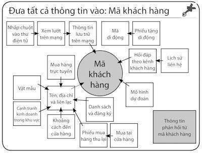
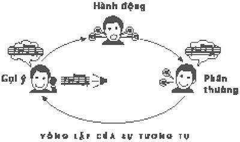
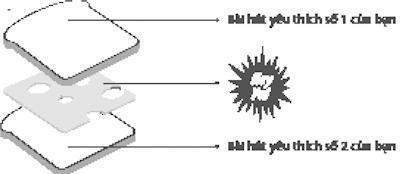

# 7. Xác định mục tiêu bạn muốn thế nào trước khi bạn làm việc

### *Khi nào công ty dự đoán (và điều chỉnh) thói quen*

Andrew Pole chỉ vừa bắt đầu làm ở vị trí chuyên gia dữ liệu cho công ty Target khi một vài đồng nghiệp ở phòng tiếp thị dừng trước bàn làm việc của anh vào một ngày nọ và hỏi loại câu hỏi mà Pole đã quen trả lời từ lâu rồi:

“Máy tính của anh có thể tìm ra khách hàng nào đang mang thai, cho dù họ không muốn chúng ta biết được không?”

Pole là một nhà thống kê. Cả cuộc đời anh tập trung vào việc sử dụng số liệu để hiểu con người. Anh lớn lên trong một thị trấn nhỏ phía Bắc Dakota và trong khi bạn anh đang học lớp 4-H hay xây dựng mô hình tên lửa, Role chơi với máy tính. Sau đại học, anh có một tấm bằng về xác suất thống kê và sau đó là một bằng khác về kinh tế, và trong khi phần lớn bạn cùng lớp trong chương trình toán kinh tế của trường Đại học Missouri hướng đến các công ty bảo hiểm hay cơ quan chính phủ, Pole đang ở trên một con đường khác. Anh bị ám ảnh bởi cách các nhà kinh tế đang sử dụng mô hình phân tích để giải thích lề thói con người. Trên thực tế, Pole đã thử tự làm một vài thí nghiệm không chính thức. Anh đã từng tổ chức một bữa tiệc, thăm dò ý kiến mọi người về câu chuyện đùa yêu thích nhất của họ và sau đó cố gắng tạo ra một mô hình tính toán cho lời nói đùa hoàn hảo nhất. Anh đã tìm kiếm cách tính toán lượng bia chính xác anh cần uống để làm tăng tự tin khi trò chuyện với phụ nữ ở các bữa tiệc, nhưng không quá nhiều để anh tự biến mình thành một kẻ ngốc. (Nghiên cứu thông thường này có vẻ không bao giờ được công bố.)

Nhưng anh biết những thí nghiệm đó là trò chơi của trẻ con so với việc các tập đoàn Mỹ đang sử dụng số liệu để nghiên cứu cuộc sống con người. Pole muốn tham gia vào. Thế nên, khi anh tốt nghiệp và nghe được rằng Hallmark, một công ty chuyên về thiệp mừng, đang tìm kiếm để thuê các nhà thống kê ở thành phố Kansas, anh nộp đơn và nhanh chóng dành nhiều ngày lùng sục số liệu kinh doanh để xác định liệu hình ảnh của gấu trúc hay voi bán được nhiều thiệp sinh nhật hơn, và liệu “What happens at Grandma’s Stays at grandma’s” hài hước hơn trên mực đỏ hay xanh. Đó là thiên đường.

Sáu năm sau, năm 2002, khi Pole biết được rằng Target đang tìm kiếm chuyên viên kiểm kê, anh tạo ra một bước nhảy. Anh biết rằng Target sẽ thành công tột đỉnh khi công ty thu thập được số liệu. Mỗi năm, hàng triệu người mua sắm bước vào 1.147 cửa hàng của Target và nhận được hàng nghìn tỷ byte thông tin về bản thân mình. Rất nhiều người không hiểu được bản thân mình đang làm điều đó. Họ dùng thẻ khách hàng thường xuyên, phiếu mua hàng tích lũy họ nhận được trong thư điện tử, hay sử dụng thẻ tín dụng mà không biết rằng Target có thể kết nối việc mua hàng của họ với tiểu sử cá nhân.

Với một nhà thống kê, số liệu đó là cánh cửa màu nhiệm để nhìn sâu vào sở thích của khách hàng. Target bán mọi thứ từ hàng tạp hóa đến quần áo, hàng điện tử và dụng cụ làm vườn, và bằng cách theo sát thói quen mua sắm của mọi người, các chuyên gia phân tích của công ty có thể dự đoán điều gì đang diễn ra trong nhà họ. Ai đó mua khăn tắm mới, khăn trải giường, đồ bằng bạc, chảo và đồ ăn đóng hộp? Họ có thể vừa mới mua nhà mới – hoặc ly hôn. Một chiếc xe chất đầy thuốc xịt côn trùng, quần áo lót của trẻ em, đèn pin và rất nhiều pin, tạp chí Real Simple, và một chai Chardonnay? Trại hè đang sắp đến và bà mẹ không thể chờ đợi thêm được nữa.

Làm việc tại Target mang đến cho Pole cơ hội để tìm hiểu sinh vật phức tạp nhất – người mua sắm Mỹ - trong môi trường tự nhiên của họ. Công việc của anh là xây dựng các mô hình tính toán có thể lướt qua các số liệu và xác định hộ gia đình nào có trẻ con và hộ nào là các anh chàng độc thân nhạy cảm; người mua sắm nào yêu thích hoạt động ngoài trời, ai thích kem và tiểu thuyết lãng mạn hơn. Pole được ủy thác trở thành người đọc được suy nghĩ theo tính toán, giải đoán những thói quen của người mua sắm để thuyết phục họ chi tiêu nhiều hơn.

Sau đó, vào một buổi chiều nọ, một vài đồng nghiệp của Pole từ phòng tiếp thị dừng trước bàn làm việc của anh. Những người đó nói, họ đang cố gắng tìm hiểu khách hàng nào của Target đang mang thai dựa vào các mô hình mua sắm. Nói cho cùng, phụ nữ mang thai và những người sắp làm cha mẹ là người kỹ càng đến từng chi tiết. Gần như không có thêm nhóm khách hàng lợi ích, thích sản phẩm và không lo ngại giá cả nào tồn tại. Nó không phải chỉ là tã giấy và khăn tay. Những người có con nhỏ quá mệt mỏi nên họ sẽ mua mọi thứ họ cần – nước ép và giấy vệ sinh, tất và tạp chí – ở bất cứ nơi nào họ mua bình sữa và sữa bột. Hơn thế nữa, nếu một cặp cha mẹ mới bắt đầu mua sắm ở Target, họ sẽ luôn quay lại trong nhiều năm.

Nói cách khác, tìm ra ai đó đang mang thai, có thể mang đến cho Target hàng triệu đô-la.

Pole ngạc nhiên. Điều thách thức một nhà dự báo thống kê không phải là chỉ bước vào suy nghĩ của người mua sắm mà là phòng ngủ của họ?

Ngay lúc dự án kết thúc, Pole học được vài bài học quan trọng về tầm nguy hiểm của việc săn đuổi những thói quen bản năng nhất của con người. Ví dụ, anh sẽ học được rằng che giấu điều bạn biết đôi lúc cũng quan trọng như bạn biết nó, và rằng không phải tất cả phụ nữ đều hứng thú với một chương trình máy tính giám sát kế hoạch sinh nở của họ.

Thực chất là, không phải ai cũng nghĩ đọc được đúng tâm trí người khác là một điều hay.

“Tôi đoán người ngoài có thể nói nó phần nào giống như chương trình truyền hình thực tế Big Brother,” Pole nói với tôi. “Điều đó làm nhiều người cảm thấy bất tiện.”

* * *

Ngày xửa ngày xưa, một công ty như Target sẽ không bao giờ thuê một người như Andrew Pole. Gần 20 năm trước, những người bán lẻ không làm những việc như phân tích kỹ càng các số liệu có tính định hướng. Thay vào đó, Target cũng như nhiều cửa hàng tạp hóa, trung tâm mua sắm, người bán thiệp mừng, người bán lẻ quần áo và các công ty khác, cố gắng săm soi đầu óc các khách hàng theo cách cũ: thuê các nhà tâm lý học đưa ra những thủ thuật khoa học không rõ ràng mà họ khẳng định có thể làm cho khách hàng chi tiêu nhiều hơn.

Một vài phương pháp trong số đó vẫn còn được sử dụng hiện nay. Nếu bạn bước vào một cửa hàng như Walmart, Home Deport hay trung tâm mua sắm địa phương và nhìn chăm chú, bạn sẽ thấy những mẹo bán lẻ đã được dùng hàng chục năm nay, mỗi cái được tạo ra để khai thác tiềm thức mua sắm của bạn.

Ví dụ, hãy xem cách bạn mua thức ăn.

Cơ hội là, những thứ đầu tiên bạn nhìn thấy khi bước vào cửa hàng tạp hóa là trái cây và rau quả được sắp xếp rất hấp dẫn và phong phú. Nếu bạn nghĩ rằng đặt sản phẩm ở phía trước cửa hàng không làm ảnh hưởng nhiều, vì trái cây và rau quả dễ bị thâm tím hơn khi ở dưới đáy của một chiếc xe bán dạo; một cách lô-gíc, chúng nên được đặt theo danh sách để có thể lấy ra dễ dàng cuối chuyến đi. Nhưng như các nhà tiếp thị và tâm lý học tìm ra từ rất lâu rồi, nếu chúng ta bắt đầu chuyến mua sắm thật nhiều bằng cách chồng chất những thứ tốt cho sức khỏe, chúng ta có vẻ mua nhiều hơn bánh Doritos, Oreos và bánh pizza làm sẵn khi chúng ta tình cờ thấy sau đó. Sự bùng nổ cảm giác tự cho mình là đúng trong tiềm thức xảy ra từ lần đầu tiên mua bí ngô làm cho bạn dễ dàng đặt một bình kem trong giỏ mua sắm sau đó hơn.

Hay hãy xem cách chúng ta đa phần sẽ rẽ phải sau khi bước vào một cửa hàng. (Bạn có biết mình rẽ phải không? Gần như chắc chắn là bạn rẽ phải. Có hàng ngàn giờ trong các băng video cho thấy những người mua sắm rẽ phải ngay khi họ mở cửa chính.) Kết quả của khuynh hướng đó là, những người bán lẻ lấp đầy phía bên phải của cửa hàng những sản phẩm có lợi nhuận cao nhất mà họ hy vọng bạn sẽ mua nó ngay lập tức. Hay xem ngũ cốc và súp: Khi chúng được xếp lên giá không theo thứ tự bảng chữ cái và có vẻ như là ngẫu nhiên, bản năng của chúng ta là chần chừ lâu hơn một chút và có lựa chọn rộng hơn. Thế nên, bạn sẽ hiếm khi tìm thấy Raisin Bran bên cạnh Rice Chex. Thay vào đó, bạn sẽ phải tìm kiếm khắp kệ cho loại ngũ cốc bạn cần và có thể vì nổi giận đã cầm một hộp của nhãn hiệu khác.

Tuy nhiên, vấn đề với những thủ thuật đó là nó xem mỗi người mua sắm là như nhau. Họ là những giải pháp phù hợp cho mọi hoàn cảnh để tạo ra thói quen mua sắm.

Tuy nhiên, trong 20 năm qua, khi những nơi mua sắm trở nên cạnh tranh hơn, những dây chuyền như Target bắt đầu hiểu được họ không thể dựa vào cùng một thủ thuật cũ. Cách duy nhất để làm tăng lợi nhuận là tìm ra thói quen của mỗi người mua sắm và mua bán với từng người một, với những lời chào hàng mang tính cá nhân được tạo ra để thu hút sở thích mua sắm riêng biệt của khách hàng.

Phần nào đó, điều này xuất phát từ một nhận thức tăng tiến về cách những thói quen tác động mạnh đến gần như mọi quyết định mua sắm. Một chuỗi các thí nghiệm thuyết phục những người tiếp thị rằng nếu họ xoay xở để hiểu được những thói quen của một khách hàng nhất định, họ có thể làm cho người đó mua gần như bất cứ thứ gì. Một nghiên cứu các khách hàng qua băng ghi âm khi họ bước vào cửa hàng tạp hóa. Các nhà nghiên cứu muốn biết cách mọi người ra quyết định mua sắm. Thông thường, họ tìm kiếm những người mua sắm mang theo danh sách các thứ cần mua – người mà theo lý thuyết đã quyết định trước mình cần mua gì.

Họ khám phá ra rằng mặc dù có những danh sách đó, hơn 50% các quyết định mua sắm xảy ra vào lúc một khách hàng nhìn thấy sản phẩm trên kệ, bởi vì, dù cho người mua sắm có ý định chắc chắn nhất, thói quen của họ vẫn mạnh hơn những ý định đã viết ra. “Hãy nhìn xem,” một người mua sắm nói thầm với chính mình khi anh bước vào một cửa hàng. “Chỗ này là khoai tây chiên. Tôi sẽ bỏ qua nó. Chờ đã. Ồ! Khoai tây chiên Lay có hàng kìa!” Anh bỏ một túi vào giỏ mua sắm của mình. Một vài người mua sắm mua cùng một nhãn hiệu, tháng này qua tháng khác, cho dù họ thừa nhận họ không thích sản phẩm đó lắm (“Tôi không đến mức phát điên vì cà phê Folgers, nhưng đó là thứ tôi mua, anh biết đấy? Còn gì ở đây nữa nào?” một người phụ nữ nói khi cô đang đứng trước một kệ có hàng chục nhãn hiệu cà phê khác). Những người mua sắm gần như mua cùng một lượng thức ăn mỗi lần họ đến quán, cho dù họ đã tự hứa nên giảm bớt.

“Khách hàng đôi lúc hành xử như loài sinh vật làm theo thói quen, lặp lại một cách tự động các lề thói cũ mà rất ít quan tâm đến những mục tiêu hiện tại,” hai nhà tâm lý học tại Đại học Nam California viết vào năm 2009.

Tuy nhiên, khía cạnh đáng ngạc nhiên của những nghiên cứu này là cho dù mọi người dựa vào các thói quen để dẫn dắt việc mua sắm, thói quen của mỗi người lại khác nhau. Người thích khoai tây chiên mua mỗi lần một túi, nhưng người phụ nữ mua cà phê Folgers không bao giờ đặt chân đến lối đi giữa các kệ có khoai tây chiên. Có những người luôn mua sữa mỗi lần họ mua sắm – cho dù họ có rất nhiều ở nhà – và có nhiều người luôn luôn mua món ngọt trong khi họ nói họ đang cố giảm cân. Nhưng những người mua sữa và những người nghiện đồ ngọt thường không trùng lặp nhau.

Những thói quen là riêng biệt với mỗi người.

Target muốn tận dụng lợi thế của những thói quen cá nhân đó. Nhưng khi hàng triệu người bước qua cửa mỗi ngày, làm thế nào bạn theo dõi được sở thích và mô hình mua sắm của họ?

Bạn thu thập dữ liệu. Một lượng dữ liệu khổng lồ, gần như lớn không tưởng được.

Từ 10 năm trước, Target bắt đầu xây dựng một cơ sở dữ liệu khổng lồ gán cho mỗi người mua sắm một mã cá nhân – phổ biến trong nội bộ là “Mã khách hàng” – để kiểm tra mỗi người mua sắm như thế nào. Khi một khách hàng sử dụng thẻ tín dụng của Target cung cấp, chuyển qua thẻ của một khách mua thường xuyên tại bàn đăng ký, tích lũy một phiếu mua hàng sẽ được chuyển thư điện tử đến nhà họ, điền vào một phiếu khảo sát, đáp thư trong lúc trả lại tiền, gọi điện đến đường dây giúp đỡ khách hàng, mở một tài khoản thư điện tử từ Target, vào trang Target.com hay mua trực tuyến bất cứ thứ gì, các máy tính của công ty đều ghi chú lại. Một bản lưu trữ của mỗi lần mua sắm được kết nối đến mã khách hàng của người đó cùng với thông tin về mọi thứ khác mà người đó đã mua.

Thông tin nhân khẩu của người đó cũng được kết nối với mã khách hàng, Target thu thập hay mua thông tin đó từ các công ty khác, bao gồm tuổi tác, họ kết hôn và có con chưa, họ sống ở nơi nào trong thành phố, họ mất bao nhiêu lâu để lái xe đến cửa hàng, một con số ước tính số tiền họ kiếm được, họ có phải vừa chuyển đến hay không, họ vào trang web nào, họ mang theo thẻ tín dụng nào trong ví, số điện thoại nhà và di động của họ. Target có thể mua dữ liệu chỉ ra dân tộc của một người mua sắm, lịch sử công việc, họ đọc tạp chí nào, họ đã từng tuyên bố phá sản chưa, năm nào họ mua (hay mất) nhà, nơi họ học đại học hay tốt nghiệp trung học và liệu họ có yêu thích nhãn hiệu cà phê, giấy vệ sinh, ngũ cốc, hay nước sốt táo nhất định nào không. Có những nơi buôn dạo dữ liệu như InfiniGraph “nghe” những cuộc hội thoại trực tuyến của người mua hàng trên bảng tin nhắn hay các diễn đàn mạng và theo dõi sản phẩm nào mọi người đề cập nhiều hơn. Một công ty tên là Rapleaf bán thông tin về kiến thức chính trị, thói quen đọc sách, hoạt động từ thiện của người mua hàng, số lượng xe hơi họ sở hữu và liệu họ thích tin tức tôn giáo hay khuyến mãi thuốc lá hơn. Các công ty khác phân tích những tấm ảnh mà khách hàng đưa lên mạng, phân loại họ béo phì hay mảnh dẻ, cao hay thấp, nhiều tóc hay bị hói và loại sản phẩm nào họ có thể muốn mua vì những điều đó. (Target tuyên bố, họ từ chối chỉ ra công ty nhân khẩu nào họ làm việc cùng và họ nghiên cứu loại thông tin nào.)

“Đó từng là những công ty chỉ biết những điều mà khách hàng muốn họ biết,” Tom Davenport, một trong những nhà nghiên cứu hàng đầu về cách các doanh nghiệp sử dụng dữ liệu và phân tích, nói. “Thế giới đó ở sau chúng ta rất xa. Bạn sẽ bị sốc về lượng thông tin ở đó – và mọi công ty mua nó, vì đó là cách duy nhất để sống sót.”

Nếu bạn dùng thẻ tín dụng Target của mình để mua một hộp Popsicles một lần một tuần, thường khoảng 6h30 chiều vào một ngày trong tuần và thu thập vỏ rác tháng Bảy và tháng Mười, các nhà thống kê của Target và chương trình máy tính sẽ xác định rằng bạn có con nhỏ ở nhà, có khuynh hướng mua sắm hàng tạp hóa trên đường đi làm về và có một đám cỏ cần cắt vào mùa hè và cây rụng lá vào mùa thu. Nó sẽ nhìn vào các mô hình mua sắm khác của bạn và để ý rằng đôi lúc bạn mua ngũ cốc, nhưng không bao giờ mua sữa – có nghĩa là bạn phải đang mua nó ở một nơi nào khác. Nên Target sẽ gửi thư cho bạn hai phiếu mua hàng giảm 2% cho sữa, cũng như cho sô-cô-la vụn, dụng cụ học tập, dụng cụ làm vườn, cái cào, và – vì có vẻ bạn sẽ muốn thư giãn sau một ngày dài làm việc – bia. Công ty sẽ đoán bạn mua gì theo thói quen và sau đó cố gắng thuyết phục bạn mua nó ở Target. Công ty có khả năng để cá nhân hóa các quảng cáo và phiếu mua hàng nó gửi đến mỗi khách hàng, cho dù bạn sẽ có thể không bao giờ nhận ra bạn vừa nhận được một tờ quảng cáo trong hộp thư khác với cái hàng xóm nhận được.

“Với mã khách hàng, chúng tôi có tên của bạn, địa chỉ và lời đề nghị mua hàng, chúng tôi biết bạn vừa có thị thực của Target, một thẻ nợ và chúng tôi có thể kết hợp điều đó với việc mua sắm của bạn,” Pole nói với các nhà thống kê bán lẻ tại một cuộc hội thảo năm 2010. Công ty có thể kết nối khoảng một nửa trong toàn bộ doanh thu tại cửa hàng đến một người nhất định, gần như mọi doanh thu trực tuyến và khoảng ¼ các tìm kiếm trực tuyến.

Tại buổi hội thảo, Pole trình chiếu một hình cho thấy mẫu của thu thập dữ liệu ở Target, một biểu đồ làm cho mọi khán giả thì thầm kinh ngạc khi nó xuất hiện trên màn hình:

Tuy nhiên, vấn đề với toàn bộ dữ liệu đó là nó sẽ trở nên vô nghĩa nếu các nhà thống kê không làm nó có nghĩa. Với một người không chuyên, hai người mua sắm đều mua nước cam ép là như nhau. Nó đòi hỏi một loại tính toán đặc biệt để tìm ra rằng một trong hai người là một phụ nữ 34 tuổi mua nước ép cho con mình (và vì thế có thể coi trọng một phiếu mua hàng cho đĩa DVD Thomas the Tank Engine) và người còn lại là một người độc thân 28 tuổi uống nước ép sau khi chạy bộ (và vì thế có thể phản ứng lại phiếu giảm giá ở giày đế mềm). Pole và 50 thành viên khác của phòng Dữ liệu khách hàng và Dịch vụ phân tích của Target là những người tìm ra những thói quen ẩn giấu bên trong thực tế.

“Chúng tôi gọi nó là ‘chân dung khách hàng,’” Pole nói với tôi. “Tôi biết về ai đó nhiều bao nhiêu, tôi có thể đoán mô hình mua sắm của họ tốt bấy nhiêu. Tôi không định lúc nào cũng đoán mọi thứ về bạn, nhưng tôi thường xuyên đúng hơn là sai.”

Vào lúc Pole gia nhập Target năm 2002, phòng phân tích vừa xây dựng các chương trình máy tính để xác định các hộ gia đình có con nhỏ và, cứ vào tháng Mười một, họ gửi cho các bậc cha mẹ danh sách xe đạp và xe hai bánh cho trẻ con trông thật hoàn hảo dưới cây thông Giáng sinh, cũng như phiếu mua hàng dụng cụ học tập vào tháng Chín và quảng cáo đồ chơi trong hồ bơi vào tháng Sáu. Các máy tính tìm kiếm những người mua sắm mua đồ bơi vào tháng Tư và gửi cho họ phiếu mua hàng kem chống nắng vào tháng Bảy và sách giảm cân vào tháng Mười hai. Nếu muốn, Target có thể gửi đến mỗi khách hàng một cuốn mua hàng đầy phiếu giảm giá cho những sản phẩm mà họ gần như chắc chắn những người mua sắm đang định mua, vì họ đã vừa mua chính xác những mục đó trước kia.

Không chỉ riêng Target mong muốn dự đoán thói quen của khách hàng. Gần như mọi nhà bán lẻ chính, gồm Amazon.com, Best Buy, siêu thị Kroger, 1-800-Flowers, Olive Garden, Anheuser-Busch, Dịch vụ thư tín của Mỹ, Đầu tư Fidelity, Hewlett-Packard, Ngân hàng Hoa Kỳ, Capital One, và hàng trăm công ty khác, có các phòng “phân tích dự đoán” để tận tâm tìm ra sở thích của khách hàng. Theo Eric Seigel, người điều hành một cuộc hội thảo có tên gọi Thế giới Phân tích Dự đoán, “Nhưng Target vẫn luôn là một trong những công ty thông minh nhất trong số đó. Dữ liệu không đơn thuần chỉ là chính nó. Target làm tốt việc tìm ra những câu hỏi thật sự thông minh.”

Không cần phải có một thiên tài để biết rằng người mua ngũ cốc có thể cũng cần sữa. Nhưng có những câu hỏi khác, khó hơn – và lợi ích hơn – cần trả lời.

Đó là lý do tại sao, vài tuần sau khi Pole được nhận vào làm, đồng nghiệp của anh hỏi liệu có thể xác định ai đang mang thai, cho dù người phụ nữ đó không muốn ai biết hay không.

* * *

Năm 1984, một giáo sư thỉnh giảng tại Đại học Los Angeles tên là Alan Andreasen xuất bản một bài báo trả lời cho một câu hỏi đơn giản: Tại sao vài người bất ngờ thay đổi lề thói mua sắm của mình?

Đội của Andreasen đã dành một năm để tiến hành khảo sát qua điện thoại với các khách hàng quanh Los Angeles, đặt câu hỏi về chuyến mua sắm gần đây của họ. Khi ai đó trả lời điện thoại, các nhà khoa học sẽ liên tục tấn công họ bằng những câu hỏi về nhãn hiệu kem đánh răng và xà phòng nào họ đã mua và sở thích của họ có thay đổi hay không. Họ phỏng vấn gần 300 người. Cũng giống như các nhà nghiên cứu khác, họ tìm ra rằng hầu hết mọi người mua cùng một nhãn hiệu ngũ cốc và chất khử mùi hết tuần này đến tuần khác. Thói quen ngự trị cao nhất.

Ngoại trừ khi chúng không như vậy.

Ví dụ, 10,5% những người Andreasen khảo sát đã chuyển nhãn hiệu kem đánh răng trong vòng 6 tháng trước. Hơn 15% đã bắt đầu mua một loại bột giặt quần áo mới.

Andreasen muốn biết được tại sao những người đó xa rời mô hình thông thường của mình. Điều ông khám phá được đã trở thành trụ cột của lý thuyết tiếp thị hiện đại: Những thói quen mua sắm của mọi người có vẻ thay đổi nhiều hơn khi họ trải qua một sự kiện quan trọng trong cuộc đời. Ví dụ, khi ai đó kết hôn, có vẻ họ sẽ mua một loại cà phê mới. Khi họ chuyển đến một ngôi nhà mới, nhiều khả năng họ sẽ mua loại ngũ cốc khác. Khi họ ly hôn, có khả năng cao họ sẽ bắt đầu mua nhiều nhãn hiệu bia khác nhau. Những khách hàng trải qua những sự kiện quan trọng trong đời thường không để ý đến, hay quan tâm rằng, mô hình mua sắm của họ đã chuyển đổi. Tuy nhiên, các nhà bán lẻ để ý đến và quan tâm nhiều hơn đến vấn đề này.

“Thay đổi chỗ ở, kết hôn hay ly hôn, mất việc hay thay đổi công việc, có thêm thành viên hay bớt đi thành viên trong nhà,” Andreasen viết, là những thay đổi trong cuộc sống làm cho khách hàng dễ “tổn thương hơn với những sự can thiệp của nhà tiếp thị.”

Và sự kiện lớn nhất trong cuộc đời đối với nhiều người là gì? Điều gì gây ra sự đổ vỡ lớn nhất và “tổn thương nhiều nhất với sự can thiệp của tiếp thị”? Đó là có con. Với đa số khách hàng, gần như không có sự biến động nào lớn hơn sự ra đời của một đứa bé. Kết quả là, thói quen của những người vừa làm cha làm mẹ tại thời điểm đó linh hoạt hơn bất kỳ thời kỳ nào khác trong cuộc đời một người trưởng thành.

Thế nên, với các công ty, phụ nữ mang thai là mỏ vàng.

Những người vừa làm cha mẹ mua rất nhiều thứ - tã giấy và khăn tay, nôi trẻ em và jumpsuit, chăn mền và bình sữa – là những thứ mà các cửa hàng như Target bán ra với mức lợi nhuận cao. Một khảo sát tiến hành năm 2010 ước tính rằng trung bình cha mẹ chi 6.800 đô-la để mua vật dụng trẻ em trước ngày sinh nhật đầu tiên của đứa trẻ.

Nhưng đó chỉ là mẹo nhỏ của tảng băng mua sắm lớn. Những chi phí ban đầu đó chỉ là hạt đậu so sánh với lợi nhuận một cửa hàng có thể kiếm được nhờ tận dụng lợi thế của việc thay đổi thói quen mua sắm của người vừa làm cha mẹ. Nếu những người mẹ kiệt sức và những người cha thiếu ngủ bắt đầu mua sữa bột trẻ em và tã giấy ở Target, họ sẽ bắt đầu mua hàng tạp hóa, dụng cụ vệ sinh, khăn tắm, quần áo lót và – không giới hạn – cũng ở Target. Vì nó tiện. Đối với họ, sự tiện lợi ảnh hưởng đến rất nhiều thứ.

“Ngay khi chúng tôi làm cho họ mua tã giấy của chúng tôi, họ cũng định bắt đầu mua mọi thứ khác,” Pole nói với tôi. “Nếu bạn đang đổ xô khắp cửa hàng, tìm kiếm bình sữa, và bạn đi qua gian hàng bán nước cam ép, bạn sẽ lấy một hộp. Ô, ở kia có đĩa DVD mới tôi muốn mua. Không lâu sau, bạn sẽ mua ngũ cốc và giấy cuộn từ chúng tôi, và liên tục trở lại.”

Những người mới trở thành cha mẹ rất quý giá nên nhiều nhà bán lẻ chính sẽ làm gần như bất cứ việc gì để tìm ra họ, bao gồm cả việc đi vào bên trong các khu sản khoa, cho dù sản phẩm của họ không liên quan gì đến trẻ con. Ví dụ, một bệnh viện New York cung cấp cho mỗi người mẹ mới một túi quà có chứa mẫu keo xịt tóc, sữa rửa mặt, kem cạo râu, lương khô, dầu gội và áo thun chất liệu cotton. Bên trong còn có các phiếu mua hàng cho dịch vụ chụp ảnh trực tuyến, xà phòng rửa tay và phòng tập thể hình địa phương. Còn có các mẫu tã giấy và sữa tắm trẻ em, nhưng nó bị chôn vùi giữa rất nhiều hàng hóa không dành cho trẻ em khác. Ở 580 bệnh viện khắp nước Mỹ, những người mẹ mới nhận quà từ công ty Walt Disney, mà từ năm 2010 đã bắt đầu xây dựng một phòng ban chuyên trách về tiếp thị đến các bậc cha mẹ của trẻ sơ sinh. Procter & Gamble, Fisher-Price và nhiều công ty khác cũng có những chương trình quà tặng tương tự. Disney ước tính thị trường trẻ sơ sinh mới ở Bắc Mỹ đáng giá 36,3 tỷ đô-la một năm. Nhưng đối với những công ty như Target, tiếp cận những người sắp làm mẹ trong khu sản khoa theo khía cạnh nào đó là quá muộn. Kể từ lúc đó, họ đã ở trên màn hình thăm dò của nhiều công ty khác rồi. Target không muốn cạnh tranh với Disney và Procter & Gamble; nó muốn đánh bại. Mục tiêu của Target là bắt đầu tiếp thị đến các bậc cha mẹ trước khi có trẻ sơ sinh – là lý do tại sao các đồng nghiệp của Andrew Pole tìm anh ngày hôm đó để hỏi về xây dựng một thuật toán dự đoán mang thai. Nếu họ có thể xác định những người mẹ sắp có thai sớm trước khoảng quý thứ hai của thai kỳ, họ có thể giành được khách hàng đó trước bất kỳ ai.

Vấn đề duy nhất là tìm ra khách hàng nào đang mang thai khó khăn hơn người ta tưởng. Target có một sổ đăng ký sữa tắm trẻ em và nó giúp xác định vài phụ nữ mang thai – và nhiều hơn thế, những người sắp trở thành mẹ sẵn lòng cung cấp những thông tin quý giá, như ngày sinh, cho phép công ty biết thời điểm để gửi họ phiếu mua hàng dinh dưỡng sau khi sinh hay tã giấy. Nhưng chỉ một phần khách hàng mang thai của Target sử dụng sổ đăng ký.

Rồi còn có những khách hàng khác mà các nhà điều hành nghi ngờ đang mang thai vì họ mua quần áo bầu, dụng cụ chăm sóc và nhiều hộp tã giấy. Tuy nhiên, nghi ngờ và biết chắc là hai điều hoàn toàn khác nhau. Làm thế nào bạn biết được ai đó mua tã giấy là đang mang thai hay mua một món quà cho người bạn đang mang thai? Hơn nữa, thời gian mới là vấn đề. Một phiếu mua hàng có ích một tháng trước khi sinh thường ở trong thùng rác vài tuần sau khi đứa trẻ ra đời.

Pole bắt đầu nghiên cứu vấn đề bằng cách lùng sục thông tin trong sổ đăng ký sữa tắm trẻ em của Target, cho phép anh quan sát thói quen mua sắm của phụ nữ thay đổi thế nào khi ngày sinh sắp đến. Sổ đăng ký giống như một phòng thí nghiệm anh có thể kiểm chứng linh cảm. Mỗi người mẹ mang thai cung cấp tên của cô, tên của chồng và cả ngày dự sinh. Kho dữ liệu của Target có thể liên kết thông tin đó với mã khách hàng của cả gia đình. Kết quả là, khi nào một người phụ nữ trong số đó mua thứ gì trong cửa hàng hay trực tuyến, Pole, sử dụng ngày dự sinh mà người đó cung cấp có thể tính được việc mua sắm xảy ra trong quý thứ ba nào. Ngay lập tức, anh xây dựng các mô hình.

Anh khám phá được rằng, những người mẹ đang mang thai mua sắm theo nhiều cách có thể dự đoán gần đúng. Rất nhiều người mua mỹ phẩm dưỡng da, nhưng một nhà phân tích dữ liệu Target lưu ý rằng những phụ nữ trong sổ đăng ký trẻ em đang mua một số lượng lớn bất thường mỹ phẩm dưỡng da không mùi khoảng bắt đầu quý thứ hai thai kỳ của họ. Một nhà phân tích khác để ý rằng đôi lúc trong 20 tuần đầu, nhiều phụ nữ có thai bổ sung nhiều loại vitamin, như can xi, ma giê và kẽm. Rất nhiều người mua xà phòng và bông cotton hàng tháng, nhưng khi ai đó bất ngờ bắt đầu mua nhiều xà phòng không mùi và bông cotton, cùng với dung dịch vệ sinh tay và một số lượng đáng kinh ngạc khăn mặt, tất cả cùng một lúc, vài tháng sau khi mua mỹ phẩm dưỡng da, ma giê và kẽm, điều đó báo hiệu họ đang đến gần ngày sinh.

Khi chương trình máy tính của Pole lùng sục cơ sở dữ liệu, anh có thể xác định khoảng 25 sản phẩm khác nhau mà khi phân tích cùng nhau, cho phép anh nhìn vào bên trong tâm tư một phụ nữ theo nghĩa nào đó. Quan trọng hơn, anh có thể đoán được cô ấy đang ở trong quý nào của thai kỳ – và ước tính ngày sinh nở - nên Target có thể gửi đến những phiếu mua hàng khi cô đang sắp sửa đi mua sắm một lần mới. Vào lúc Pole hoàn thành, chương trình có thể gán cho gần như bất kỳ người mua sắm bình thường nào một điểm số “dự đoán mang thai”.

Jenny Ward, 23 tuổi, ở Atlanta, mua mỹ phẩm dưỡng da có dưỡng chất ca cao, số tiền đó đủ lớn để mua gấp đôi lượng túi tã giấy, kẽm, ma giê và một tấm chăn màu xanh sáng? 87% khả năng là cô đang mang thai và ngày sinh nở là khoảng gần cuối tháng 8. Liz Alter ở Brooklyn, 35 tuổi, mua 5 túi khăn rửa mặt, một chai nước giặt quần áo dành cho “da nhạy cảm”, quần jean rộng, vitamin có chứa DHA và một số lượng lớn kem làm ẩm da? 96% khả năng là cô đang mang thai và cô có thể sinh vào đầu tháng Năm. Caitlin Pike, 39 tuổi, ở San Francisco, mua một cái ghế đẩy cho trẻ em giá 250 đô-la nhưng không mua gì khác nữa? Có thể cô mua mừng em bé của bạn mình. Bên cạnh đó, dữ liệu cá nhân của cô cho thấy cô đã ly hôn hai năm trước.

Pole áp dụng chương trình của mình cho tất cả các khách hàng mua sắm trong dữ liệu của Target. Khi hoàn thành, anh có một danh sách hàng trăm nghìn phụ nữ có vẻ sắp mang thai mà Target có thể làm tràn ngập hộp thư với những quảng cáo tã giấy, mỹ phẩm dưỡng da, cũi trẻ em, khăn tay và quần áo bầu tại thời điểm mà những thói quen mua sắm của họ đang tương đối linh động. Nếu một phần những phụ nữ đó hay chồng của họ bắt đầu mua sắm ở Target, nó sẽ tăng thêm cho công ty hàng triệu đô-la.

Sau đó, khi loạt quảng cáo dồn dập đó chuẩn bị bắt đầu, ai đó trong phòng tiếp thị đặt ra một câu hỏi: Những phụ nữ đó sẽ phản ứng thế nào khi họ biết được Target biết về họ nhiều bao nhiêu?

“Nếu chúng tôi gửi cho ai đó một cuốn catalog hàng hóa và nói rằng, ‘Chúc mừng bạn có con đầu lòng!’ và họ không bao giờ nói với chúng tôi họ đang có thai, điều đó sẽ làm cho vài người cảm thấy không thoải mái,” Pole nói với tôi. “Chúng tôi rất thận trọng trong việc tuân theo đúng tất cả luật lệ về quyền riêng tư. Nhưng cho dù nếu bạn tuân theo pháp luật, bạn có thể làm những việc khiến mọi người khó chịu.”

Có lý do chính đáng cho những lo lắng đó. Khoảng một năm sau khi Pole tạo ra mô hình dự đoán mang thai của mình, một người đàn ông bước vào một cửa hàng Target ở Minnesota và yêu cầu được gặp quản lý. Ông ta đang nắm chặt một tờ quảng cáo. Ông ta vô cùng giận dữ.

“Con gái chúng tôi nhận được thứ này trong hộp thư!” ông ta nói. “Nó vẫn còn học trung học và các người lại gửi cho nó phiếu mua hàng quần áo và nôi trẻ em? Có phải các người cổ động nó mang thai không hả?”

Người quản lý không hiểu gì về điều người đàn ông đó đang nói. Anh nhìn vào tờ quảng cáo có kèm thư. Chắc chắn, nó được gửi đến con gái của người đàn ông đó và có những quảng cáo về quần áo bầu, dụng cụ chăm sóc và những bức ảnh trẻ con cười khi đang nhìn vào mắt mẹ chúng.

Người quản lý xin lỗi rối rít và sau đó vài ngày, gọi điện thoại đến nhà ông để xin lỗi lần nữa.

Người cha có đôi chút bối rối.

“Tôi đã nói chuyện với con gái mình,” ông nói. “Thực ra có vài chuyện ở nhà mà tôi hoàn toàn không biết gì.” Ông thở dài. “Nó sẽ sinh vào tháng Tám. Tôi nợ anh một lời xin lỗi.”

Target không phải là công ty duy nhất làm cho khách hàng lo lắng. Những công ty khác đã từng bị đả kích vì sử dụng dữ liệu theo nhiều cách ít xâm phạm hơn. Ví dụ, năm 2011, một công dân New York kiện McDonald, CBS, Mazda và Microsoft, buộc tội bộ phận quảng cáo của những công ty này giám sát việc sử dụng mạng của mọi người để lập thông tin về thói quen mua sắm của họ. Còn có những vụ kiện nhiều nguyên đơn đang diễn ra ở California chống lại Target, Wallmart, Victoria’s Secret và các chuỗi bán lẻ khác vì yêu cầu khách hàng cung cấp mã bưu điện khi họ sử dụng thẻ tín dụng và sau đó dùng thông tin đó để tìm ra địa chỉ thư điện tử của họ.

Pole và đồng nghiệp của anh biết, sử dụng dữ liệu để dự đoán việc mang thai của một phụ nữ là một thảm họa tiềm tàng về quan hệ cộng đồng. Vì thế, làm thế nào họ có thể đưa quảng cáo đến tay những bà mẹ tương lai mà không làm lộ ra họ đang theo dõi những khách hàng đó? Làm thế nào bạn tận dụng lợi thế thói quen của ai đó mà không để cho người đó biết được bạn đang nghiên cứu mọi chi tiết cuộc sống của họ?

Mùa hè năm 2003, một nhà điều hành quảng cáo tại Arista Records tên là Steve Bartels bắt đầu gọi đến các DJ đài phát thanh để nói với họ về một bài hát mới mà ông chắc chắn họ sẽ thích. Nó có tên là “Hey Ya!” của nhóm nhạc hip-hop OutKast.

“Hey Ya!” là một bản nhạc vui kết hợp nhạc funk, rock và hip-hop với một ít nhạc jazz êm dịu của Big Bang, một trong những ban nhạc nổi tiếng nhất trên thế giới. Nghe không giống thứ gì trên đài phát thanh. “Lần đầu tiên nghe, lông tay tôi dựng đứng lên,” Bartels nói với tôi. “Nó nghe giống một bài hát đang nổi, giống loại nhạc của bài hát bạn đang nghe ở các buổi lễ trưởng thành và vũ hội nhiều năm nay.” Khắp văn phòng Arista, những người quản lý hát đoạn điệp khúc – “hãy lắc nó như tấm ảnh Polaroid” – với một người khác trong hành lang.** *Bài hát*** ***này***, họ đều đồng ý,** *sẽ cực kỳ nổi tiếng.***

Sự khẳng định chắc chắn đó không chỉ dựa vào trực giác. Vào thời điểm đó, ngành kinh doanh ghi âm đang trải qua một sự chuyển đổi giống như những sự chuyển đổi theo dữ liệu xảy ra ở Target và bất kỳ nơi nào khác. Khi những người bán lẻ đang sử dụng thuật toán máy tính để dự đoán những thói quen của người mua sắm, các nhà quản lý âm nhạc và đài phát thanh đang sử dụng chương trình máy tính để dự đoán thói quen của người nghe nhạc. Một công ty tên là Polyphonic HMI – một nhóm các chuyên gia trí tuệ nhân tạo và nhà thống kê cơ sở ở Tây Ban Nha – đã tạo ra một chương trình gọi là Khoa học Bài hát nổi tiếng nhằm phân tích những đặc điểm toán học của một giai điệu và dự đoán tính phổ biến của nó. Bằng cách so sánh nhịp, cao độ, giai điệu, loạt hợp âm và những yếu tố khác của một bài hát bình thường với hàng nghìn bài hát nổi tiếng khác được lưu giữ trong hệ thống dữ liệu của Polyphonic HMI, Khoa học bài hát nổi tiếng có thể đưa ra một điểm số dự đoán liệu một giai điệu có thành công hay không.

Ví dụ, chương trình đã dự đoán rằng đĩa nhạc** *Come Away with Me*** của Norah Jones sẽ trở nên nổi tiếng sau khi gần như toàn bộ ngành công nghiệp không thừa nhận nó. (Nó bán được 10.000 bản và thắng 8 giải Grammy.) Chương trình đã dự đoán rằng bài “Why Don’t You and I” của Santana sẽ phổ biến, dù cho các DJ có nghi ngờ. (Nó đạt đến vị trí thứ ba trên bảng xếp hạng 40 bài hát hàng đầu của** *BillBoard.***)

Khi các nhà quản lý ở phòng thu âm mở “Hey Ya!” qua Khoa học Bài hát nổi tiếng, kết quả tốt. Trên thực tế, nó còn tốt hơn thế: Đạt được điểm số cao nhất chưa từng thấy.

“Hey Ya!,” theo thuật toán, sẽ là một bản nhạc cực nổi.

Vào ngày 4/9/2003, lúc 7h15’ tối, đài Top 40 WIOQ ở Philadelphia bắt đầu mở “Hey Ya!” qua đài phát thanh. Nó mở bài hát đó thêm 7 lần nữa chỉ trong tuần đó và tổng số 37 lần trong tháng.

Tại thời điểm đó, một công ty tên là Arbitron đang thử nghiệm một công nghệ mới cho phép tìm ra có bao nhiêu người đang nghe một đài phát thanh nào tại một thời điểm và bao nhiêu lần chuyển kênh giữa một bài hát nhất định. WIOQ là một trong những đài nằm trong thử nghiệm. Quản lý của đài đang chắc chắn “Hey Ya!” sẽ làm cho người nghe nhạc dính chặt vào cái đài.

Rồi có kết quả thống kê dữ liệu.

Người nghe không chỉ không thích “Hey Ya!” Dữ liệu cho thấy, họ ghét nó. Họ ghét nó nhiều đến nỗi một phần ba số đó chuyển đài chỉ trong 30 giây đầu của bài hát. Điều đó không chỉ có ở WIOQ. Khắp đất nước, tại những đài phát thanh ở Chicago, Los Angeles, Phoenix và Seattle, bất cứ lúc nào “Hey Ya!” phát lên, một số lượng lớn người nghe sẽ chuyển đài.

“Lần đầu tiên nghe tôi đã nghĩ đó là một bài hát hay,” John Garabedian, người dẫn chương trình phát thanh Top 40 nghe được từ hơn 2 triệu người mỗi tuần, nói. “Nhưng nghe nó không giống các bài hát khác và vài người phát cáu khi nó được phát sóng. Một người đàn ông nói với tôi đó là bài tệ nhất mà anh ta từng nghe.

“Mọi người nghe Top 40 vì họ muốn nghe những bài hát yêu thích của mình hay những bài có giai điệu giống bài họ thích. Khi bài nào khác phát sóng, họ khó chịu. Họ không muốn bất cứ thứ gì không quen thuộc.”

Arista đã dành nhiều tiền để quảng bá “Hey Ya!” Ngành công nghiệp âm nhạc và đài phát thanh cần nó thành công. Những bài hát nổi tiếng xứng đáng là một gia tài – không chỉ vì mọi người tự mua bài hát đó, mà còn vì một bài nổi tiếng có thể thuyết phục người nghe từ bỏ trò chơi vi-đê-ô và mạng Internet để nghe đài. Một bài hát nổi tiếng có thể giúp bán xe hơi thể thao trên truyền hình và quần áo trong các cửa hàng hợp thời trang. Những bài hát nổi tiếng là nguồn gốc của hàng chục thói quen chi tiêu mà các nhà quảng cáo, đài truyền hình, quầy rượu, câu lạc bộ khiêu vũ – thậm chí những công ty công nghệ như Apple – dựa vào.

Hiện nay, một trong những bài hát được mong đợi nhiều nhất – một giai điệu mà các thuật toán đã dự đoán sẽ trở thành bài hát của năm – đang thất bại. Những nhà quản lý đài phát thanh đang rất cần tìm ra điều gì đó sẽ đưa “Hey Ya!” trở thành bài hát nổi tiếng.

* * *

Câu hỏi đó – làm thế nào bạn đưa một bài hát trở nên nổi tiếng? – đã làm cho ngành công nghiệp âm nhạc bối rối kể từ khi nó bắt đầu, nhưng chỉ trong vài chục năm qua, mọi người đã cố gắng để đạt đến những câu trả lời khoa học. Một trong những người tiên phong là một quản lý đài trước kia tên là Rich Meyer, người vào năm 1985, cùng với vợ mình, Nancy, thành lập một công ty có tên Mediabase trong căn hầm của nhà họ ở Chicago. Họ sẽ thức dậy mỗi buổi sáng, cầm lên một túi băng ghi âm của đài đã được thu lại ngày trước đó ở nhiều thành phố khác nhau, đếm và phân tích mọi bài hát đã được phát. Meyer sau đó sẽ phát hành một bản tin hàng tuần theo dấu những giai điệu nào đang tăng hay giảm về độ phổ biến.

Trong những năm đầu tiên, bản tin chỉ có khoảng 100 người góp ý, Meyer và vợ anh cố gắng giữ cho công ty hoạt động. Tuy nhiên, khi càng nhiều đài bắt đầu sử dụng nhận xét của Meyer để tăng lượng khán giả – và, cụ thể, nghiên cứu những công thức mà anh đã đặt ra để giải thích xu hướng nghe nhạc – bản tin của anh, dữ liệu mà Mediabase bán, và sau đó những dịch vụ tương tự cung cấp bởi một ngành công nghiệp tư vấn theo dữ liệu đang phát triển, xem xét cách các đài phát thanh được hoạt động.

Một trong những câu đố Meyer thích nhất là tìm ra tại sao người nghe không bao giờ chuyển đài giữa một vài bài hát. Theo các DJ, những bài hát này được biết đến là “ăn sâu vào tâm trí.” Meyer đã theo dấu hàng trăm bài hát ăn sâu vào tâm trí qua nhiều năm, cố gắng suy đoán những nguyên tắc làm chúng nổi tiếng. Văn phòng của anh đầy các biểu đồ và đồ thị ghi lại những đặc điểm của nhiều bài hát ăn sâu vào tâm trí. Meyer luôn tìm kiếm những cách mới để đo sự ăn sâu và lúc “Hey Ya!” được phát hành, anh bắt đầu thí nghiệm với dữ liệu từ thử nghiệm mà Arbitron đang tiến hành để xem thử nó có mang đến nhìn nhận nào mới không.

Vài bài trong số những bài hát ăn sâu nhất mà lúc đó nổi tiếng một cách đáng ngờ nghe rất quen thuộc – giống như những thứ khác trên đài – nhưng có một ít tinh tế, gần gũi hơn với ý nghĩa vàng của một bài hát hoàn hảo. Vào lúc đó, một vài bài hát ăn sâu nhất có tác động lớn vì một số lý do cụ thể - ví dụ như, ca khúc ”Crazy in Love” của Beyonce và ”Senorita” của Justin Timberlake vừa được phát hành và được ưa chuộng rộng rãi, nhưng đó đều là những bài hát tuyệt vời của những ngôi sao đã nổi tiếng, vì thế sự ăn sâu là có lý. Mặc dù vậy, những bài hát khác thì có tác động vì lý do không ai có thể thật sự hiểu được chúng. Chẳng hạn như, khi đài phát sóng ca khúc ”Breath” của Blu Cantrell trong suốt mùa hè năm 2003, gần như không có ai chuyển kênh. Bài hát có giai điệu theo tiết tấu và rất dễ quên mà các DJ cảm thấy nhạt nhẽo nên phần lớn họ thường mở nó một cách miễn cưỡng. Nhưng vì một vài lý do, mỗi khi bài hát đó được phát sóng, mọi người đều lắng nghe, cho dù sau này theo những người đi thăm dò ý kiến biết được, cũng những người đó nói rằng họ không thích bài hát lắm. Hay như ca khúc ”Here without you” của 3 Doors Down và gần như bất cứ bài hát nào của nhóm Maroon 5. Sự thiếu đặc biệt của những nhóm nhạc này khiến cho các nhà phê bình và người nghe nghĩ ra một thể loại âm nhạc mới – ”nhạc rock phổ thông” – để mô tả những âm thanh nhạt nhẽo, bình thường. Vì thế bất cứ khi nào chúng được phát trên đài, gần như chẳng ai chuyển kênh. Rồi có những bài hát mà người nghe bảo rằng họ rất không thích, nhưng lại ăn sâu. Hãy xem nhạc của Christina Aguilera hay Celine Dion làm ví dụ. Trong các lần khảo sát, người nghe là nam giới nói rằng họ ghét Celine Dion và không thể chịu nổi những bài hát của cô. Nhưng bất cứ khi nào giai điệu của Celine Dion được phát trên đài, họ lại chẳng chuyển kênh. Trong thị trường âm nhạc Los Angeles, những đài thường xuyên phát nhạc Dion cuối mỗi giờ - thời điểm có thể xác định được số lượng người nghe – có thể chắc chắn nâng số lượng khán giả lên 3%, một con số lớn đối với đài phát thanh. Người nghe là nam giới có thể nghĩ rằng họ không thích Dion, nhưng khi những bài hát của cô được lên sóng, họ lại để yên.

Một đêm nọ, Meyer ngồi xuống và bắt đầu nghe một vài bài hát ăn sâu vào tâm trí, hết bài này đến bài khác, hết lần này đến lần khác. Khi làm thế, anh bắt đầu nhận ra sự tương đồng trong những ca khúc đó. Không phải vì những bài hát nghe giống nhau. Một số bài là nhạc trữ tình trầm ấm, số khác lại là nhạc hiện đại. Tuy nhiên, chúng đều có vẻ giống nhau vì mỗi bài đều được nghe chính xác như những gì Meyer mong muốn nghe thấy từ giai điệu đặc trưng đó. Chúng nghe giống nhau – như mọi thứ trên đài – nhưng bóng bẩy hơn, gần gũi hơn với ý nghĩa đặc biệt của một bài hát hoàn hảo.

“Đôi lúc các nhà đài sẽ nghiên cứu bằng cách gọi cho nhiều người nghe, phát một đoạn nhạc và người nghe sẽ nói, ‘Tôi đã nghe nó một triệu lần rồi. Tôi thật sự chán lắm rồi,’” Meyer nói với tôi. “Nhưng khi nó được phát trên đài, phần tiềm thức của bạn nói rằng ‘Tôi biết bài hát này! Tôi đã nghe nó một triệu lần rồi! Tôi có thể hát được!’ Những bài hát ăn sâu vào tiềm thức là điều mà bạn hy vọng được nghe trên đài. Não của bạn muốn một cách bí mật bài hát đó, vì nó quá quen thuộc với mọi thứ bạn đã nghe và yêu thích. Nghe nó rất phù hợp.”

Có bằng chứng rằng thích cái gì đó nghe “quen thuộc” là sản phẩm của hệ thần kinh chúng ta. Các nhà khoa học đã xem xét não bộ con người khi họ nghe nhạc và theo vùng thần kinh liên quan đến việc hiểu các kích thích thính giác. Việc nghe nhạc kích hoạt nhiều khu vực của não bộ, bao gồm vỏ não thính giác, đồi não và vỏ não trên đỉnh. Những khu vực tương tự đó cũng kết hợp với mô hình nhận biết và giúp não bộ quyết định chú ý đến và bỏ qua dữ liệu vào nào. Nói cách khác, những khu vực xử lý âm nhạc được thiết kế để tìm kiếm những mô hình và sự quen thuộc. Điều đó có nghĩa. Nói cho cùng, âm nhạc rất phức tạp. Những giai điệu, cao độ, giai điệu trùng nhau và những âm thanh đối nghịch bên trong gần như bất kỳ bài hát nào – hay bất kỳ ai nói chuyện trên một con đường đông đúc vì vấn đề đó – quá mạnh nên nếu não bộ không có khả năng tập trung vào vài âm thanh và bỏ qua những cái khác, mọi thứ sẽ giống như bản nhạc của những tiếng ồn không hòa hợp nhau.

Não bộ của chúng ta thèm khát sự quen thuộc trong âm nhạc vì sự quen thuộc là cách chúng ta xoay xở để lắng nghe mà không bị xao lãng với mọi âm thanh. Chỉ khi các nhà khoa học ở MIT khám phá ra rằng những thói quen mang tính hành vi ngăn cản chúng ta khỏi sự choáng ngợp vì chúng ta liên tục đưa ra quyết định mỗi ngày, nếu không có nó, không thể quyết định được liệu chúng ta có nên tập trung vào tiếng của con cái, tiếng huýt sáo của huấn luyện viên hay tiếng ồn từ một con đường đông đúc giữa một trận bóng đá ngày thứ Bảy hay không. Những thói quen nghe cho phép chúng ta chia tách một cách vô thức âm thanh quan trọng khỏi những thứ có thể bỏ qua.

Đó là lý do tại sao những bài hát nghe “quen thuộc” – cho dù bạn chưa bao giờ nghe chúng trước đây – ăn sâu vào tâm trí. Não bộ của chúng ta được thiết kế để thích những mô hình thính giác có vẻ thân quen với những gì chúng ta vừa nghe hơn. Khi Celine Dion phát hành một bài hát mới – và nó nghe giống mọi bài hát khác cô đã hát, cũng như phần lớn các bài hát trên đài – não của chúng ta thèm khát trong vô thức sự thừa nhận nó và bài hát trở nên ăn sâu vào tâm trí. Bạn có thể không bao giờ đến một buổi hòa nhạc của Celine Dion, nhưng bạn sẽ nghe các bài hát của cô ấy trên đài, vì chúng là những gì bạn mong đợi được nghe khi bạn lái xe đi làm. Những bài hát đó phù hợp một cách hoàn hảo với thói quen của bạn.

Sự nhìn nhận đó giúp giải thích tại sao “Hey Ya!” lại thất bại trên đài phát thanh, dù rằng chương trình Khoa học Bài hát nổi tiếng và các nhà quản lý âm nhạc chắc chắn nó sẽ nổi tiếng. Vấn đề không phải là “Hey ya!” không hay. Vấn đề là “Hey Ya!” không quen thuộc. Những người nghe đài không muốn có ý thức khi ra quyết định mỗi lần họ được giới thiệu một bài hát mới. Thay vào dó, não của họ muốn đi theo một thói quen. Phần lớn thời gian, chúng ta không thật sự lựa chọn liệu chúng ta thích hay không một bài hát. Chúng ta sẽ mất rất nhiều nỗ lực tinh thần. Thay vào đó, chúng ta phản ứng lại những gợi ý (“Nó nghe giống tất cả những bài hát khác tôi đã từng thích”) và những phần thưởng (“Nó rất vui để ngâm nga theo!”) và không hề suy nghĩ, chúng ta bắt đầu hát theo hay chuyển đài khác.

Theo một nghĩa nào đó, Arista và DJ của đài đối mặt với rất nhiều vấn đề mà Andrew Pole đang đương đầu ở Target. Người nghe vui vẻ ngồi nghe suốt một bài hát mà họ có thể nói họ không thích, miễn là nó có vẻ giống điều gì đó họ đã nghe trước đó. Phụ nữ mang thai vui vẻ sử dụng phiếu mua hàng họ nhận được trong thư, nếu những phiếu đó không làm lộ rõ ràng rằng Target đang theo dõi tâm tư của họ, một điều lạ lẫm và khiến người ta rùng mình. Nhận được một phiếu mua hàng làm lộ ra Target biết bạn đang mang thai là trái ngược với điều khách hàng mong đợi. Nó giống như nói với một giám đốc ngân hàng đầu tư 42 tuổi rằng anh ta đang hát theo Celine Dion. Việc đó thật sai lầm.

Thế nên làm thế nào các DJ thuyết phục người nghe gắn bó với những bài hát như “Hey Ya!” đủ lâu để trở nên quen thuộc? Làm thế nào Target thuyết phục được những phụ nữ mang thai sử dụng phiếu mua hàng tã giấy mà không làm họ khó chịu?

Bằng cách dùng ”bình mới rượu cũ” và làm những thứ không quen thuộc có vẻ quen thuộc.

## III.

Đầu những năm 1940, chính phủ Mỹ bắt đầu vận chuyển phần lớn nguồn cung cấp thịt nội địa của quốc gia bằng đường biển đến châu Âu và chiến trường Thái Bình Dương để hỗ trợ đội quân chiến đấu trong Chiến tranh Thế giới thứ II. Trong nước, nguồn thịt bò và thịt lợn có sẵn bắt đầu thu nhỏ lại. Vào thời điểm nước Mỹ gia nhập cuộc chiến tranh cuối năm 1941, các nhà hàng ở New York đang sử dụng thịt ngựa cho bánh mì kẹp và thị trường chợ đen cho gia cầm bắt đầu hình thành. Các quan chức chính phủ bắt đầu lo lắng rằng nỗ lực chiến tranh kéo dài sẽ làm cho đất nước rơi vào tình trạng thiếu đạm. “Vấn đề này sẽ lớn dần lên ở nước Mỹ khi chiến tranh tiếp diễn,” tổng thống tiền nhiệm Herbert Hoover viết cho người Mỹ trong một cuốn sách mỏng của chính phủ năm 1943. “Những cánh đồng của chúng ta thiếu lao động để chăm sóc vật nuôi và trên tất cả chúng ta phải trang bị nguồn cung cấp thực phẩm cho người Anh và Nga. Thịt và mỡ cũng quan trọng như xe tăng, máy bay trong chiến tranh.”

Vì lo lắng, Bộ Quốc phòng đặt vấn đề với hàng chục nhà xã hội học, tâm lý học và thần kinh học hàng đầu cả nước – có Margaret Mead và Kurrt Lewin, người sắp trở thành nhân vật nổi danh trong lĩnh vực học thuật – và mang cho họ một nhiệm vụ: tìm ra cách để thuyết phục người Mỹ ăn bộ lòng. Làm cho các bà nội trợ phục vụ chồng và con mình với gan, tim, thận, não, bao tử và ruột giàu prô-tê-in được bỏ lại sau khi sườn bò và bò quay được đưa ra ngoài nước.

Vào lúc đó, bộ lòng không phổ biến ở Mỹ. Một người phụ nữ trung lưu năm 1940 sẽ đói ăn nhanh hơn nếu không có món lưỡi động vật hay bộ lòng trên bàn ăn. Vì thế, khi các nhà khoa học được tuyển vào Hội đồng Thói quen ăn uống gặp mặt lần đầu tiên năm 1941, họ tự đặt ra một mục tiêu xác định một cách hệ thống những rào cản văn hóa cản trở người Mỹ không ăn bộ lòng. Tất cả, hơn 200 nghiên cứu cuối cùng được phát hành và trọng tâm của toàn bộ các nghiên cứu đó là một hiểu biết giống nhau: Để thay đổi việc ăn uống của mọi người, vật lạ phải được làm thành quen thuộc. Và để làm điều đó, bạn phải ngụy trang nó trong ăn uống hàng ngày.

Các nhà khoa học kết luận, để thuyết phục người Mỹ ăn gan và thận, những người nội trợ phải biết được cách làm cho những món ăn đó nhìn, có vị và mùi giống hết mức có thể những gì gia đình họ mong muốn được nhìn thấy trên bàn ăn tối. Ví dụ như, khi Phòng Phụ cấp sinh hoạt của Quartermaster Corps – những người chịu trách nhiệm việc ăn uống của binh lính – bắt đầu phục vụ bắp cải tươi cho quân đội năm 1943, nó bị phản đối. Vì thế, những bếp ăn tập thể xắt nhỏ và đun sôi bắp cải cho đến khi nó nhìn giống mọi thứ rau khác trong khay thức ăn của binh lính – và quân đội ăn nó mà không phàn nàn gì. Theo một nhà nghiên cứu đánh giá những nghiên cứu đó: “Các binh lính có vẻ ăn nhiều thức ăn hơn, dù cho quen thuộc hay không, khi nó được chuẩn bị giống với trải nghiệm trước đó của họ và được bày ra theo kiểu quen thuộc.”

Hội đồng Thói quen ăn uống kết luận, bí mật để thay đổi chế độ ăn uống của người Mỹ là sự quen thuộc. Không lâu sau, các bà nội trợ nhận được thư từ chính phủ bảo họ “người chồng nào cũng sẽ mừng rỡ vì bánh làm từ thịt bò và thận heo.” Những người bán thịt bắt đầu đưa ra các công thức giải thích cách chế biến gan thành từng lát thịt.

Vài năm sau khi kết thúc Chiến tranh Thế giới thứ II, Hội đồng Thói quen ăn uống bị giải thể. Tuy nhiên, kể từ đó, bộ lòng đã được kết hợp hoàn toàn vào bữa ăn của người Mỹ. Một nghiên cứu chỉ ra rằng việc tiêu thụ những phần thừa đó tăng 33% trong chiến tranh. Năm 1955, nó tăng đến 50%. Thận đã trở thành một món chủ yếu trong bữa ăn tối. Gan được dùng cho nhiều dịp đặc biệt. Những mô hình bữa tối của người Mỹ đã được chuyển đổi đến một mức độ mà bộ lòng đã trở thành biểu tượng của sự thoải mái.

Kể từ đó, chính phủ Mỹ nỗ lực rất nhiều để cải thiện chế độ ăn uống của người dân. Ví dụ, có một chiến dịch “5 một ngày”, với ý định khuyến khích mọi người ăn 5 loại trái cây và rau quả, kim tự tháp thức ăn của Bộ Nông nghiệp Hoa Kỳ và thúc đẩy dùng phô mai ít béo cùng sữa. Không ai thực hiện triệt để phát hiện của hội đồng. Không ai cố gắng ngụy trang lời khuyên của họ vào những thói quen đã tồn tại và kết quả là toàn bộ chiến dịch thất bại. Đến hôm nay, chương trình duy nhất của chính phủ từng tạo ra sự thay đổi bền vững trong chế độ ăn uống của người Mỹ là sự thúc đẩy ăn bộ lòng những năm 1940.

Tuy nhiên, các đài phát thanh và công ty quy mô lớn – lại dễ hiểu hơn.

* * *

Để làm “Hey Ya!” nổi tiếng, các DJ nhanh chóng nhận ra, họ cần làm cho bài hát có vẻ quen thuộc. Và để làm điều đó, cần có điều gì đó đặc biệt.

Vấn đề là những chương trình máy tính như Khoa học Bài hát nổi tiếng rất tốt khi dự đoán thói quen của mọi người. Nhưng đôi lúc, những thuật toán đó tìm ra thói quen chưa thực sự hình thành, và khi các công ty giới thiệu những thói quen mà chúng ta không thừa nhận hay tệ hơn, không sẵn lòng chấp nhận – như sự yêu mến bí mật của chúng ta dành cho những bản ballad đầy sức sống – các công ty có nguy cơ bị đẩy ra khỏi ngành công nghiệp. Nếu một cửa hàng tạp hóa khoe khoang rằng “Chúng tôi đưa ra sự lựa chọn rất rộng cho ngũ cốc có đường và kem!” người mua sắm sẽ tránh xa. Nếu một người bán thịt nói “Đây là một miếng lòng cho bữa tối của bạn,” một bà nội trợ những năm 1940 sẽ nấu món cá hồi hầm thay vào đó. Khi một đài phát thanh khoe khoang “Nửa tiếng Celine Dion!”, sẽ không ai bật đài lên. Vì thế, thay vào đó, những người chủ siêu thị chào hàng táo và cà chua (trong khi bảo đảm bạn bước qua khu kẹo M&M và kem Haagen-Dazs trên đường đến quầy tính tiền), những người bán thịt những năm 1940 gọi gan là “thịt bò mới,” và các DJ một cách lặng lẽ chuyển** *Titanic*** làm bài hát dạo đầu.

“Hey Ya!” cần trở thành một phần của một thói quen nghe nhạc đã tạo lập để nổi tiếng. Và để trở thành một phần của một thói quen, đầu tiên nó cần được ngụy trang thật nhẹ nhàng, cũng giống như cách các bà nội trợ ngụy trang thận bằng cách xắt nó thành miếng mỏng. Thế nên, tại WIOQ ở Philadelphia – cũng như ở các đài khác khắp nước – các DJ bắt đầu bảo đảm rằng bất cứ khi nào “Hey Ya!” được phát, nó được kèm giữa những bài hát đã nổi tiếng. “Đó là lý thuyết về danh sách nhạc theo sách giáo khoa hiện nay,” Tom Webster, một nhà tư vấn đài, nói. “Hãy phát một bài hát mới giữa hai bài hát mọi người đều công nhận là nổi tiếng.”

Tuy nhiên, các DJ không phát “Hey Ya!” kế tiếp bất kỳ bài hát nổi tiếng nào. Họ phát nó kèm giữa những thể loại nhạc mà Rich Meyer đã khám phá sẽ ăn sâu vào tiềm thức theo một cách riêng, từ những nghệ sĩ như Blu Cantrell, 3 Doors Down, Maroon 5 và Christina Aguilera. (Trên thực tế, vài đài quá nhiệt tình nên họ dùng một bài hát đến hai lần.)

Ví dụ, hãy xem danh sách nhạc của WIOQ cho ngày 19/9/2003:

11:43 “Here Without You” của 3 Doors Down

11:54 “Breathe” của Blu Cantrell

11:58 “Hey Ya!” của OutKast

12:01 “Breathe” của Blu Cantrell

Hay danh sách nhạc cho ngày 16/10:

9:41 “Harder to Breathe” của Maroon 5

9:45 “Hey Ya!” của OutKast

9:49 “Can’t Hold Us Down” của Christina Aguilera

10:00 “Frontin” của Pharrell

Ngày 12/11:

9:58 “Here Without You” của 3 Doors Down

10:01 “Hey Ya!” của OutKast

10:05 “Like I Love You” của Justin Timberlake

10:09 “Baby Boy” của Beyoncé

“Quản lý một danh sách nhạc là tất cả những gì cần làm để giảm bớt rủi ro,” Webster nói. “Các đài phát thanh phải mạo hiểm theo những bài hát mới, nếu không mọi người sẽ dừng nghe. Nhưng điều mà người nghe muốn là những bài hát họ đã yêu thích. Thế nên bạn phải sáng tác những bài hát mới có vẻ quen thuộc nhanh nhất có thể.”

Khi WIOQ lần đầu tiên phát “Hey Ya!” vào đầu tháng Chín – trước khi việc phát kèm theo bắt đầu – 26,6% người nghe chuyển đài bất cứ lúc nào nó được phát. Đến tháng Mười, sau khi phát nó kèm theo những bài hát nổi tiếng ăn sâu vào tâm trí, “yếu tố dừng nghe” đó giảm xuống 13,7%. Tháng Mười hai, nó là 5,7%. Những đài phát thanh khác khắp đất nước sử dụng cùng kỹ thuật phát kèm đó và tỉ lệ dừng nghe cũng tuân theo mô hình đó.

Và khi người nghe nghe “Hey Ya!” hết lần này đến lần khác, nó trở nên quen thuộc. Khi bài hát trở nên phổ biến, WIOQ phát “Hey Ya!” khoảng 15 lần một ngày. Những thói quen nghe của mọi người đã chuyển sang hy vọng – thèm khát – “Hey Ya!” Một thói quen “Hey Ya!” hình thành. Bài hát tiến đến giành được một giải Grammy, bán được hơn 5,5 triệu bản và mang đến cho các đài phát thanh hàng triệu đô-la. “Đĩa đó gắn chặt OutKast với nhóm các siêu sao âm nhạc,” Bartels, nhà điều hành quảng bá, nói với tôi. “Việc đó đã giới thiệu nó với các khán giả không nghe nhạc hip-hop. Hiện nay nó đem đến nhiều sự thỏa mãn nên khi một nhạc sĩ mới thu âm bài hát đơn của mình sẽ nói,** *“Đây sẽ là bài ‘Hey Ya!’ tiếp theo.”***

* * *

Sau khi Andrew Pole xây dựng máy dự đoán mang thai của mình, sau khi anh xác định hàng trăm nghìn người mua sắm nữ có thể mang thai, sau khi ai đó chỉ ra rằng vài – trên thực tế, phần lớn – những phụ nữ đó có thể buồn phiền một chút nếu họ nhận được một quảng cáo làm lộ rõ Target biết được tình trạng sinh sản của mình, mọi người quyết định lùi lại một bước và xem xét các lựa chọn.

Phòng tiếp thị nghĩ rằng có thể khôn ngoan nếu tiến hành một vài thí nghiệm nhỏ trước khi giới thiệu một chiến dịch trên toàn quốc. Họ có thể gửi những bức thư được thiết kế đặc biệt đến những nhóm khách hàng nhỏ, vì thế họ lựa chọn bất kỳ người phụ nữ nào từ danh sách mang thai của Pole và bắt đầu kiểm chứng nhiều sự kết hợp của các quảng cáo để xem cách những người mua sắm phản ứng lại.

“Chúng ta có thể gửi đến mọi khách hàng một cuốn sách quảng cáo nhỏ, được thiết kế đặc biệt cho họ, nói rằng, ‘Đây là những thứ bạn đã mua tuần trước và một phiếu mua hàng cho nó,’” một nhà điều hành Target có hiểu biết trực tiếp về máy dự đoán mang thai của Pole nói với tôi. “Lúc nào chúng tôi cũng làm thế với các sản phẩm tạp hóa.

“Tuy nhiên, với những sản phẩm mang thai, chúng tôi học được rằng vài phụ nữ có phản ứng không tốt. Sau đó chúng tôi bắt đầu trộn lẫn những quảng cáo đó với những thứ mà chúng tôi biết phụ nữ mang thai sẽ không bao giờ mua, nên những quảng cáo sản phẩm trẻ em được nhìn thấy một cách ngẫu nhiên. Chúng tôi đặt quảng cáo tã giấy cạnh quảng cáo máy cắt cỏ. Chúng tôi đặt một phiếu mua hàng ly uống rượu vang cạnh quần áo trẻ em. Bằng cách đó, trông giống như toàn bộ sản phẩm được lựa chọn ngẫu nhiên.

“Và chúng tôi tìm ra rằng miễn là phụ nữ mang thai nghĩ cô ta không bị theo dõi, cô ta sẽ dùng phiếu mua hàng. Cô ta chỉ giả định rằng mọi người trong tòa nhà đều nhận được thư giống nhau cho tã giấy và giường trẻ em. Miễn là chúng tôi không làm cô ta hoảng sợ, nó sẽ có hiệu quả.”

Câu trả lời cho Target và câu hỏi của Pole – làm thế nào để bạn quảng cáo đến một phụ nữ mang thai mà không tiết lộ ra rằng bạn biết cô ta có thai? – cũng cần thiết như điều mà các DJ dùng để gây nghiện cho người nghe bằng “Hey Ya!” Target bắt đầu quảng cáo phiếu mua hàng tã giấy kèm với những sản phẩm không dành cho thai phụ làm cho các quảng cáo có vẻ quen thuộc và thoải mái. Họ ngụy trang điều họ đã biết.

Không lâu sau, doanh thu “Mẹ và Bé” của Target bùng nổ. Công ty không áp dụng các con số doanh thu cho bất kỳ phòng ban xác định nào, nhưng giữa năm 2002 – khi Pole được tuyển dụng – và năm 2009, lợi nhuận của Target tăng từ 44 tỷ đô-la lên 65 tỷ đô-la. Năm 2005, chủ tịch của công ty, Gregg Steinhafel, khoe khoang với cả phòng đầy các nhà đầu tư về “sự tập trung cao độ của công ty vào những mặt hàng và chủng loại lôi cuốn các nhóm khách hàng nhất định như bà mẹ và em bé.

“Khi những công cụ cơ sở dữ liệu phát triển càng phức tạp, Target Mail tự thân trở thành một công cụ hữu ích để đẩy mạnh giá trị và sự tiện lợi cho những nhóm khách hàng nhất định như những người mới làm mẹ hay những cô bé cậu bé tuổi teen,” anh nói. “Ví dụ, Target Baby có thể dõi theo các giai đoạn cuộc đời từ chăm sóc trước khi sinh đến lúc ngồi ghế nhỏ trên xe hơi và tập đi. Năm 2004, chương trình Thư điện tử trực tiếp Target Baby tăng khá nhanh về số lần thăm và doanh thu.”

Dù kinh doanh một bài hát mới, một món ăn mới hay một cái giường mới, bài học cũng giống nhau: Nếu bạn gọi một thứ gì đó mới trong những thói quen cũ, cộng đồng sẽ dễ chấp nhận nó hơn.

Sự hữu ích của bài học này không chỉ giới hạn ở những tập đoàn lớn, các cơ quan chính phủ hay các công ty phát thanh với hy vọng điều chỉnh sở thích của chúng ta. Những hiểu biết tương tự đó có thể được dùng để thay đổi cách chúng ta sống.

Ví dụ như, năm 2000, hai nhà thống kê được YMCA tuyển dụng – một trong những tổ chức phi lợi nhuận lớn nhất nước – sử dụng sức mạnh của việc dự đoán dựa trên số liệu để đưa thế giới trở thành một nơi lành mạnh hơn. YMCA có hơn 2600 chi nhánh ở Mỹ, phần lớn là phòng tập thể hình và trung tâm cộng đồng. Khoảng 10 năm trước, các lãnh đạo của tổ chức bắt đầu lo lắng về việc duy trì cạnh tranh. Họ hỏi xin sự giúp đỡ của một nhà khoa học xã hội và một nhà toán học – Bill Lazarus và Dean Abbott.

Hai người đàn ông đó thu thập dữ liệu từ hơn 150.000 khảo sát của YMCA về sự thỏa mãn của thành viên đã được thu thập qua nhiều năm và bắt đầu tìm kiếm các mô hình. Tại thời điểm đó, các nhà điều hành YMCA chấp nhận lời đồn thổi rằng mọi người muốn thiết bị tập thể dục khác lạ và tiện nghi tinh xảo, hiện đại. YMCA đã dành hàng triệu đô-la để xây dựng phòng tập cử tạ và yoga. Tuy nhiên, khi phân tích những khảo sát đó, có một thực tế là trong khi sự lôi cuốn của một tiện nghi và sự sẵn sàng của máy tập luyện có thể làm cho mọi người tham gia ngay từ đầu, thứ giữ họ ở lại hoàn toàn khác.

Dữ liệu cho rằng, sự duy trì được dẫn dắt bởi các yếu tố về cảm xúc, như liệu các nhân viên biết tên thành viên hay nói xin chào khi họ bước vào. Thực tế là, mọi người thường đến phòng tập thể hình để tìm kiếm một sự kết nối cộng đồng, không phải là một công việc hàng ngày buồn tẻ. Nếu một thành viên kết bạn tại YMCA, có vẻ họ sẽ xuất hiện nhiều hơn để tập thể dục. Nói cách khác, những người tham gia YMCA có những thói quen xã hội nhất định. Nếu YMCA thỏa mãn được chúng, các thành viên rất vui. Thế nên nếu YMCA muốn khuyến khích mọi người tập thể dục, nó cần tận dụng lợi thế của những mô hình đã tồn tại trước đó và dạy các nhân viên nhớ tên thành viên. Có một sự biến đổi giữa bài học mà Target và các DJ đài phát thanh học được: để bán một thói quen mới – trong trường hợp này là tập thể dục – hãy gói nó trong cái gì đó mà mọi người đã biết đến và yêu thích, như bản năng tìm đến những nơi họ có thể kết bạn dễ dàng.

“Chúng ta đang phá giải mật mã về cách giữ chân mọi người ở phòng tập thể hình,” Lazarus nói với tôi. “Mọi người muốn đến thăm những nơi thỏa mãn nhu cầu xã hội của họ. Làm cho mọi người tập thể dục theo nhóm khiến cho việc họ gắn bó với một bài tập có khả năng xảy ra cao hơn. Bạn có thể thay đổi sức khỏe quốc gia theo cách này.”

Các chuyên gia phân tích dự đoán nói, vào ngày nào đó không xa, các công ty có thể biết sở thích của chúng ta và dự đoán những thói quen của chúng ta tốt hơn chúng ta hiểu được chính mình. Tuy nhiên, biết được rằng ai đó có thể yêu thích một nhãn hiệu bơ đậu phộng này hơn không đủ để làm cho họ hành động theo sở thích đó. Để kinh doanh một thói quen mới – là hàng tạp hóa hay thể dục thẩm mĩ - bạn phải hiểu được cách làm cho điều mới lạ có vẻ quen thuộc.

Lần cuối cùng tôi trò chuyện với Andrew Pole, tôi đề cập đến vợ tôi đang mang thai tháng thứ 7 đứa con thứ hai. Pole cũng đã có con nên chúng tôi nói chuyện một lúc về những đứa trẻ. Tôi nói, vợ tôi và tôi thỉnh thoảng mua sắm ở Target, và khoảng một năm trước chúng tôi đã cung cấp cho công ty địa chỉ của mình, nên chúng tôi có thể bắt đầu nhận phiếu mua hàng trong hộp thư. Gần đây, trong quá trình vợ tôi mang thai, tôi để ý thấy có sự tăng nhỏ về số lượng quảng cáo tã giấy, sữa dưỡng da và quần áo trẻ em đến nhà chúng tôi.

Tôi nói với anh ấy, tôi đang lên kế hoạch sử dụng vài phiếu mua hàng trong số đó mỗi tuần. Tôi cũng đang suy nghĩ mua một cái cũi trẻ em, vài tấm màn che để giữ vệ sinh và có thể vài món đồ chơi hiệu Bob và Builder cho đứa trẻ mới biết đi. Target thật sự hữu ích khi gửi cho tôi chính xác phiếu mua hàng những thứ tôi cần.

“Chỉ cần chờ đến lúc đứa trẻ được sinh ra,” Pole nói. “Chúng tôi sẽ gửi cho anh nhiều phiếu mua hàng những thứ anh muốn cả trước khi anh biết được mình cần thứ đó.”

7. Xác định mục tiêu bạn muốn thế nào trước khi bạn làm việc
