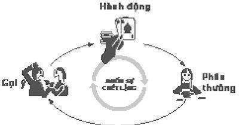
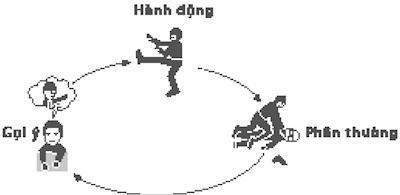
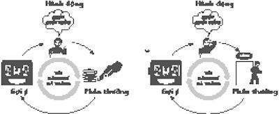

# 9. Thần kinh học về sự tự nguyện

### *Có phải chúng ta chịu trách nhiệm về thói quen của mình?*

1.

Buổi sáng rắc rối bắt đầu – nhiều năm trước khi cô nhận ra còn có cả rắc rối ngay lúc đầu – Angie Bachmann đang ngồi ở nhà, nhìn chằm chằm vào tivi, vì quá buồn chán nên cô suy nghĩ nghiêm túc về việc sắp xếp lại ngăn chứa dao nĩa.

Con gái nhỏ nhất của cô đã bắt đầu học mẫu giáo vài tuần trước và hai cô con gái lớn hơn thì đang học trung học cơ sở, cuộc sống của chúng tràn ngập bạn bè, hoạt động và những chuyện phiếm mà mẹ chúng không thể hiểu được. Chồng cô, một chuyên viên bản đồ địa chính, thường đi làm lúc 8 giờ và không bao giờ về nhà trước 6 giờ tối. Căn nhà trống trơn ngoại trừ Bachmann. Đó là lần đầu tiên trong gần 20 năm nay – kể từ lúc cô kết hôn năm 19 tuổi, có thai năm 20 tuổi và cuộc sống của cô trở nên bận rộn với việc chuẩn bị bữa ăn trưa đến trường, chơi trò công chúa và làm dịch vụ gia đình như một con thoi – cô cảm thấy thật sự cô độc. Ở trường trung học, bạn bè cô nói với cô rằng cô nên trở thành một người mẫu – cô có vẻ đẹp đó – nhưng khi cô bỏ học và rồi kết hôn với một anh chàng chơi ghi ta cuối cùng cũng có một công việc thật sự, cô ổn định cuộc sống với vai trò là một người mẹ. Giờ là 10h30’ sáng, ba cô con gái đều đi rồi và Bachmann đành phải – một lần nữa – phủ một mảnh giấy lên mặt cái đồng hồ bếp để ngăn mình nhìn vào nó cứ 30 phút một lần.

Cô chẳng biết mình nên làm gì tiếp theo.

Hôm đó, cô tự đưa ra một thỏa thuận với chính mình: Nếu cô có thể làm việc đó đến trưa mà không phát điên hay ăn bánh trong tủ lạnh, cô sẽ rời khỏi nhà và làm điều gì đó vui vẻ. Cô dành 90 phút tiếp theo cố gắng để tìm ra chính xác điều đó là gì. Khi đồng hồ điểm 12 giờ, cô trang điểm nhẹ, mặc một chiếc đầm đẹp và lái xe đến một sòng bạc trên một con thuyền sông cách nhà cô khoảng 20 phút. Dù là giữa trưa ngày thứ Năm, sòng bạc cũng đầy ắp người đang làm nhiều việc khác ngoài việc xem vở kịch nhiều kỳ và gấp quần áo. Có một ban nhạc đang chơi gần cổng chính. Một phụ nữ đang phát cốc-tai miễn phí. Bachmann ăn tôm ở bữa tiệc đứng. Toàn bộ trải nghiệm là cảm giác sang trọng, giống như đang trốn học đi chơi. Cô chuyển hướng đến một bàn chơi blackjack, người chia bài đang kiên nhẫn giải thích luật chơi. Khi 40 đô-la đặt cược của cô ra đi, cô liếc nhìn đồng hồ và thấy 2 tiếng đã trôi qua, cô cần về nhà nhanh chóng để đón đứa con gái út. Hôm đó lúc ăn tối, lần đầu tiên trong một tháng, cô có điều gì đó để trò chuyện ngoài việc đoán đối thủ trên** *Hãy chọn giá đúng.***

Cha của Angie Bachmann là một tài xế xe tải đã làm lại mình vào giữa cuộc đời, thành một nhạc sĩ có chút tiếng tăm. Anh của cô cũng trở thành một nhạc sĩ và đã giành được hai giải thưởng. Ngược lại, Bachmann thường được cha mẹ mình giới thiệu là “người chỉ có thể làm mẹ.”

“Tôi luôn cảm thấy mình là kẻ bất tài,” cô nói với tôi. “Tôi nghĩ tôi thông minh và tôi biết tôi là một người mẹ tốt. Nhưng tôi không có nhiều thứ để chỉ vào và nói, đó là lý do tại sao tôi đặc biệt.”

Sau chuyến đi đến sòng bạc lần đầu, Bachmann bắt đầu đến đó tuần một lần, vào chiều thứ Sáu. Đó là một phần thưởng để cô vượt qua những ngày trống trải, giữ cho nhà cửa sạch sẽ, đầu óc lành mạnh. Cô biết cờ bạc có thể dẫn đến rắc rối, nên cô đặt ra nhiều quy tắc nghiêm khắc cho chính mình. Không quá một tiếng đồng hồ ở bàn blackjack mỗi tuần và cô chỉ được đặt cược phần có trong ví. “Tôi xem nó giống như một công việc,” cô nói với tôi. “Tôi không bao giờ rời khỏi nhà trước bữa trưa và tôi luôn luôn ở nhà đúng giờ để đón con gái. Tôi rất có kỷ luật.”

Và cô làm tốt. Lúc đầu, cô khó có thể chơi chỉ trong một giờ. Tuy nhiên, trong 6 tháng, cô đã góp nhặt đủ bí quyết mà cô điều chỉnh những quy tắc của mình để có thể chơi 2 hay 3 giờ mà vẫn còn tiền trong túi khi cô dừng chơi. Một chiều nọ, cô ngồi xuống bàn blackjack với 80 đô-la trong ví cầm tay và thu được 530 đô-la – đủ để mua hàng tạp hóa, trả hóa đơn điện thoại và bỏ một ít vào quỹ phòng ngừa bất trắc. Kể từ đó, công ty sở hữu sòng bạc – Giải trí Harrah – gửi đến cho cô những phiếu thưởng cho bữa tiệc đứng miễn phí. Cô sẽ đãi gia đình ăn tối vào tối thứ Bảy.

Bang mà Bachmann đang chơi bạc, Iowa, đã hợp pháp hóa trò cờ bạc chỉ vài năm trước. Trước năm 1989, những người làm luật của bang lo lắng rằng sự cám dỗ của các lá bài và viên xúc xắc có thể làm cho nhiều công dân khó cưỡng lại được. Đó là một mối bận tâm cũng lâu đời như chính quốc gia vậy. Cờ bạc “là đứa con của lòng tham lam, anh em của tội lỗi và cha đẻ của những điều ác,” Tổng thống George Washington viết năm 1873. “Đó là một thói xấu có thể tạo ra mọi tai ương… Nói ngắn gọn, rất ít người thắng nhờ việc làm ghê tởm đó, trong khi hàng nghìn người bị tổn thương.” Bảo vệ mọi người khỏi những thói quen xấu của họ – thực tế, định nghĩa thói quen nào nên được xem là “xấu” trong lần đầu tiên – là điều một nhà làm luật có quyền đã nỗ lực nắm giữ. Mại dâm, cờ bạc, kinh doanh rượu trong Ngày Thánh, khiêu dâm, cho vay nặng lãi, quan hệ tình dục ngoài hôn nhân (hay, nếu vị giác của bạn không bình thường, trong hôn nhân), là toàn bộ những thói quen mà nhiều cơ quan lập pháp đã quy định, cấm, hay cố gắng ngăn chặn bằng luật pháp nghiêm khắc (và thường không hiệu quả).

Khi Iowa hợp pháp hóa sòng bài, các nhà làm luật quan tâm thích đáng rằng họ giới hạn hoạt động đó với các thuyền sông và quy định rằng không ai có thể đặt cược nhiều hơn 5 đô-la một lần đặt, với mức thua tối đa là 200 đô-la một người một lần chơi. Tuy nhiên, trong vài năm, sau khi nhiều sòng bài của bang chuyển đến Mississippi – nơi cho phép đánh bạc không giới hạn, cơ quan lập pháp Iowa gỡ bỏ những hạn chế đó. Năm 2010, kho bạc của bang tăng lên hơn 269 triệu đô-la từ thuế trên cờ bạc.

* * *

Năm 2000, cha mẹ của Angie Bachmann, đều là người hút thuốc thời gian dài, bắt đầu cho thấy dấu hiệu bệnh phổi. Cô bắt đầu bay đến Tennessee để thăm họ mỗi tuần, mua hàng tạp hóa và giúp nấu bữa tối. Khi cô trở về nhà bên chồng mình và các con, chừng như nỗi cô đơn trong cô kéo dài hơn bao giờ hết. Đôi khi, căn nhà trống trải cả ngày; như thể, lúc cô vắng nhà, bạn bè đã quên mời gọi cô và gia đình cô đã tìm ra cách để vượt qua bằng sức mình.

Bachmann lo lắng về cha mẹ mình, buồn phiền rằng chồng của cô có vẻ hứng thú với công việc nhiều hơn là nỗi lo lắng của cô và bực bội các con mình không nhận ra cô cần chúng ngay lúc này, sau tất cả những hy sinh cô đã làm khi chúng đang lớn lên. Nhưng mỗi khi cô đến sòng bạc, những căng thẳng đó sẽ bay mất. Cô bắt đầu đi vài lần trong một tuần khi cô không đến thăm cha mẹ mình và rồi đều đặn cứ thứ Hai, thứ Tư và thứ Sáu hàng tuần. Cô vẫn có quy tắc – nhưng cô đã chơi cờ bạc được nhiều năm rồi, và biết được sự thật hiển nhiên rằng những người chơi nghiêm túc đều sống. Cô không bao giờ đặt xuống ít hơn 25 đô-la một tay và luôn luôn chơi hai tay cùng lúc. “Anh có tỷ lệ cao hơn tại một bàn chơi giới hạn cao hơn là tại một bàn giới hạn thấp,” cô nói với tôi. “Anh phải được chơi qua những lúc khó khăn cho đến khi may mắn xuất hiện. Tôi đã thấy có người bước vào với 150 đô-la và thắng 10.000 đô-la. Tôi biết tôi có thể làm điều đó nếu tôi tuân theo nguyên tắc của mình. Tôi đang trong tầm kiểm soát.” Kể từ đó, cô không phải suy nghĩ về việc lấy một lá bài khác hay gấp đôi tiền cược – cô hành động tự nhiên, chỉ như Eugene Pauly, mắc chứng quên, cuối cùng đã học được cách luôn luôn lựa chọn tấm thẻ hình vuông bên phải.

Một ngày năm 2000, Bachmann trở về nhà từ sòng bạc với 6.000 đô-la – đủ để trả tiền thuê hai tháng và thổi bay các hóa đơn thẻ tín dụng đang chất đống ở cửa trước. Một lần khác, cô bước ra với 2.000 đô-la. Đôi lúc cô thua, nhưng đó là một phần của trò chơi. Những người đánh bạc thông minh biết mình phải bước lùi để tiến lên. Cuối cùng, sòng bạc Harrah đưa cho cô một giới hạn tín dụng nên cô sẽ không phải mang theo quá nhiều tiền mặt. Những người chơi khác tìm kiếm cô và ngồi ở bàn của cô vì cô biết mình đang làm gì. Tại bữa tiệc đứng, chủ tổ chức sẽ để cô đi đến phía đối diện hàng. “Tôi biết cách chơi,” cô nói với tôi. “Tôi biết điều này nghe giống như ai đó gặp vấn đề nhưng không nhận ra vấn đề của mình, nhưng lỗi lầm duy nhất tôi mắc phải là không từ bỏ. Không có điều gì sai với cách tôi chơi cả.”

Những quy tắc của Bachmann dần trở nên linh hoạt hơn như kích cỡ của lượng tiền thắng và thua của cô đang lớn lên. Một ngày nọ, cô thua 800 đô-la trong một giờ và sau đó kiếm được 1.200 đô-la trong 40 phút. Rồi may mắn của cô lại xuất hiện và cô dừng lại với 4.000 đô-la. Một lần khác, cô thua 3.500 đô-la trong buổi sáng, kiếm được 5.000 đô-la lúc 1 giờ trưa và thua 3.000 đô-la khác vào buổi chiều. Sòng bạc đã ghi lại việc cô có bao nhiêu và kiếm được bao nhiêu; cô đã ngừng theo dõi chính mình. Sau đó, một tháng, cô không có đủ tiền trong tài khoản ngân hàng cho hóa đơn điện. Cô hỏi vay cha mẹ mình một khoản nhỏ và rồi một khoản khác. Cô mượn 2.000 đô-la một tháng, 2.500 đô-la tháng tiếp theo. Đó không phải là một món tiền lớn, họ có tiền.

Bachmann không bao giờ gặp vấn đề với rượu chè, thuốc phiện hay ăn quá mức. Cô là một người mẹ bình thường, cũng thất thường như mọi người khác. Thế nên sự ép buộc tâm lý mà cô cảm thấy với cờ bạc – sức hút không thể cưỡng lại làm cô cảm thấy xao lãng hay cáu kỉnh vào những ngày cô không đến sòng bài, cách cô biết bản thân mình suy nghĩ về nó mọi lúc, sự gấp gáp cô cảm thấy trong một cuộc đua tốt – làm cô hoàn toàn mất tự vệ. Đó là một cảm nhận mới, quá bất ngờ nên cô gần như không biết đó là vấn đề cho đến khi nó chiếm lĩnh toàn bộ cuộc sống của cô. Từ lâu, có vẻ như không có ranh giới ngăn cách nào. Ngày hôm nay nó là trò vui nhưng ngày tiếp theo nó không thể kiểm soát.

Năm 2001, cô dự tính đến sòng bạc mỗi ngày. Cô đến đó mỗi khi cô tranh cãi với chồng hay cảm thấy không nhận được sự đánh giá cao từ các con mình. Tại nhiều bàn chơi, cô chết lặng và phấn khích cùng một lúc và mối lo lắng của cô phát triển quá mờ nhạt nên cô không thể nghe được chúng nữa. Tầm cao của sự chiến thắng đã rất gần trước mắt. Nỗi đau của việc thua cuộc trôi qua quá nhanh.

“Con muốn trở thành một nhân vật quan trọng,” mẹ cô nói với cô khi Bachmann gọi đến để mượn tiền. “Con cứ tiếp tục chơi bài vì con muốn có sự chú ý.”

Nhưng không phải vậy. “Tôi chỉ muốn cảm thấy giỏi trong việc gì đó,” cô nói với tôi. “Đó là điều duy nhất tôi đã từng làm mà có vẻ như tôi có kỹ năng.”

Mùa hè năm 2001, món nợ của Bachmann với sòng bạc Harrah đã lên đến mức 20.000 đô-la. Cô đã giữ kín việc thua cuộc với chồng mình, nhưng cuối cùng, khi mẹ cô cắt đứt nguồn viện trợ, cô suy sụp và thừa nhận chuyện này. Họ thuê một người được ủy quyền phá sản, cắt thẻ tín dụng của cô và ngồi tại bàn bếp để viết ra một kế hoạch cho một cuộc sống giản dị và có trách nhiệm hơn. Cô mang áo váy của mình đến một cửa hàng quần áo cũ và chịu đựng sự bẽ bàng của việc ăn mặc lỗi thời 19 năm bởi vì, cô nói rằng, chúng đã lỗi mốt rồi.

Cuối cùng, cô bắt đầu có cảm giác như điều tồi tệ nhất đã qua đi. Cô cũng nghĩ, sự ép buộc tâm lý đã qua đi.

Nhưng, dĩ nhiên, nó còn chưa đến gần được điểm cuối. Nhiều năm sau, sau khi cô đã mất đi mọi thứ và hủy hoại cuộc sống của mình và cả chồng, sau khi cô đã vứt bỏ hàng trăm nghìn đô-la và luật sư của cô đã tranh cãi trước tòa án tối cao của bang rằng Angie Bachmann chơi bạc không phải vì lựa chọn thế, mà chỉ vì thói quen, và vì thế không nên chịu tội vì mức thua của mình, sau khi cô đã trở thành một đối tượng để khinh miệt trên mạng, nơi mọi người so sánh cô với Jeffrey Dahmer và các bậc phụ huynh ngược đãi con mình, cô tự hỏi: Tôi thực sự phải chịu bao nhiêu phần trách nhiệm?

“Tôi thật sự tin rằng bất kỳ ai ở vị trí của tôi cũng sẽ làm điều tương tự như thế,” Bachmann nói với tôi.

Vào một buổi sáng tháng Bảy năm 2008, một người đàn ông tuyệt vọng đang đi bộ dọc bờ biển phía tây của Wales cầm điện thoại lên và gọi cho người trực tổng đài khẩn.

“Tôi nghĩ tôi đã giết vợ mình,” ông ta nói. “Ôi Chúa ơi. Tôi nghĩ ai đó đã đột nhập vào. Tôi đang đánh nhau với những kẻ đó nhưng đó lại là Christine. Chắc tôi phải đang nằm mơ hay gì đó. Tôi đã làm gì? Tôi đã làm gì?”

Mười phút sau, các nhân viên cảnh sát đến và tìm thấy Brian Thomas đang khóc cạnh chiếc xe hơi dã ngoại của mình. Đêm trước đó, ông giải thích, ông và vợ mình đang ngủ trong xe khi vài thanh niên trẻ đua xe vòng quanh khu đỗ xe làm họ thức giấc. Họ di chuyển chiếc xe của mình đến bìa ngoài khu đỗ xe và trở lại ngủ. Rồi, vài giờ sau đó, Thomas thức giấc, thấy một người đàn ông mặc quần jean và có mái tóc xù – một trong những kẻ đua xe, ông nghĩ – đang nằm phía trên vợ ông. Ông hét vào kẻ đó, nắm ngay cổ họng hắn và cố gắng đẩy hắn ra. Như thể ông đang phản ứng theo tự nhiên, ông nói với người cảnh sát. Kẻ đó càng cố gắng chống lại thì ông càng siết chặt hơn. Hắn cào cấu vào cánh tay Thomas và cố gắng chống trả, nhưng Thomas bóp cổ, càng lúc càng chặt hơn, và cuối cùng người đàn ông đó ngừng chuyển động. Sau đó, Thomas nhận ra trong tay ông không phải là người đàn ông nào cả, mà là vợ ông. Ông thả cơ thể vợ mình xuống và bắt đầu đẩy nhẹ vai bà, cố gắng đánh thức bà, hỏi thăm liệu bà có ổn không. Nhưng đã quá muộn.

“Tôi nghĩ ai đó đã đột nhập vào và tôi siết cổ bà ấy,” Thomas nói với viên cảnh sát, khóc nức nở. “Bà ấy là thế giới của tôi.”

Trong 10 tháng tiếp theo, khi Thomas ngồi trong tù chờ xử án, bức chân dung của kẻ sát nhân được hình thành. Khi là một đứa trẻ, Thomas đã bắt đầu có chứng mộng du, đôi khi nhiều lần trong một đêm. Ông sẽ ra khỏi giường, đi vòng quanh nhà và chơi đồ chơi hay tự sắp xếp gì đó để ăn và, sáng hôm sau, không nhớ gì về việc mình đã làm. Điều đó trở thành một trò cười trong gia đình. Một lần một tuần, có vẻ thế, ông sẽ đi lang thang trong sân hay vào phòng ai đó, trong khi tất cả đang ngủ. Đó là một thói quen, mẹ ông sẽ giải thích khi hàng xóm hỏi tại sao con trai bà bước băng qua bãi cỏ của họ, chân trần và mặc bộ đồ ngủ. Khi ông lớn hơn, ông sẽ thức dậy với những vết cắt ở chân và không có ký ức gì về nơi ông đã đến. Ông đã từng một lần bơi trong một con kênh mà không thức dậy. Sau khi ông kết hôn, vợ ông quan tâm nhiều hơn đến khả năng rằng ông có thể loạng choạng bước ra khỏi nhà và gặp tai nạn nên bà khóa cửa và đặt chìa khóa ở dưới gối của mình. Mỗi tối, cặp đôi sẽ lăn lê trên giường và “có một nụ hôn và âu yếm,” Thomas nói sau đó, và rồi ông sẽ lên phòng mình và ngủ trên giường của mình. Nếu không việc ông lăn qua lăn lại và trở mình liên tục, la hét, càu nhàu và thỉnh thoảng đi lang thang sẽ làm cho Christine thức cả đêm.

“Chứng mộng du là một cách nhắc nhở rằng thức và ngủ không phải là hai trạng thái loại trừ nhau,” Mark Mahowald, một giáo sư thần kinh học tại Đại học Minnesota, người tiên phong trong tìm hiểu các lề thói lúc ngủ, nói với tôi. “Phần của não bộ điều chỉnh lề thói của bạn đã ngủ, nhưng những phần có khả năng về các lề thói phức tạp vẫn còn thức. Vấn đề là không có gì dẫn dắt não bộ ngoại trừ những mô hình đơn giản, các thói quen căn bản nhất của bạn. Bạn làm theo những gì tồn tại trong đầu, vì bạn không có khả năng đưa ra một sự lựa chọn.”

Theo pháp luật, cảnh sát phải khởi tố Thomas vì tội giết người. Nhưng tất cả các bằng chứng đều có vẻ chỉ ra rằng ông và vợ mình có một cuộc hôn nhân hạnh phúc trước đêm ác mộng đó. Không có tiền sử nào về lạm dụng. Họ có hai cô con gái đã lớn và vừa đặt chỗ trên một chuyến tàu du lịch Mediteranean để mừng lễ kỷ niệm 40 năm ngày cưới của bố mẹ. Các công tố viên hỏi một chuyên gia về giấc ngủ – bác sĩ Chris Idzikowski làm ở trung tâm giấc ngủ Edinburgh – để kiểm chứng Thomas và đánh giá một giả thuyết: rằng ông đang trong trạng thái vô thức khi giết vợ mình. Trong hai cuộc họp riêng biệt, một lần trong phòng thí nghiệm của Idzikowski và lần còn lại trong nhà tù, các nhà nghiên cứu gắn thiết bị cảm biến khắp người Thomas và đo sóng não của ông, chuyển động mắt, co cằm và chân, luồng khí qua mũi, nỗ lực hô hấp và mức ô-xy trong khi ông ngủ.

Thomas không phải là người đầu tiên tranh cãi rằng ông đã phạm tội khi đang ngủ và vì thế, mở rộng ra, không buộc phải chịu trách nhiệm về hành vi của mình. Có một tiền sử dài về những người vi phạm cho rằng họ không có tội vì họ “hành động vô thức,” như chứng mộng du và những hành vi vô thức khác được biết đến. Và trong nhiều năm trước, khi hiểu biết của chúng ta về thần kinh học của thói quen và sự tự nguyện trở nên phức tạp hơn, những lời biện hộ đó trở nên ép buộc hơn. Xã hội, được thể hiện bằng tòa án và bồi thẩm đoàn, đồng ý rằng vài thói quen có tác động quá lớn nên chúng lấn át khả năng ra lựa chọn của chúng ta, và vì thế chúng ta không phải chịu trách nhiệm vì điều đã làm.

* * *

Chứng mộng du là một kết quả tự nhiên kỳ lạ từ một khía cạnh bình thường của cách não bộ hoạt động trong lúc chúng ta ngủ. Phần lớn thời gian, khi cơ thể chúng ta di chuyển vào và ra các giai đoạn khác nhau của giấc ngủ, cấu trúc thần kinh cổ xưa nhất của chúng ta – cuống não – làm tê liệt các chi và hệ thần kinh, cho phép não bộ trải qua những giấc mơ mà không cần cơ thể di chuyển. Thông thường, mọi người có thể có sự chuyển đổi vào và ra khỏi chứng liệt nhiều lần mỗi đêm mà không gặp vấn đề gì. Trong thần kinh học, nó được biết đến là “sự thay đổi đột ngột.”

Tuy vậy, não bộ của vài người trải qua lỗi sai khi thay đổi. Họ bước vào trạng thái liệt không hoàn toàn khi ngủ, và cơ thể của họ hoạt động khi họ mơ hay chuyển đổi giữa các giai đoạn giấc ngủ. Đó là nguồn gốc gây ra chứng mộng du và đối với số đông những người mắc bệnh, đó là một vấn đề phiền toái nhưng vô hại. Ví dụ, ai đó có thể mơ về việc ăn một cái bánh và sáng hôm sau tìm thấy một hộp bánh nướng đã bị phá ra trong nhà bếp. Ai đó sẽ mơ về việc vào phòng tắm và sau đó khám phá ra một vệt ướt trong phòng lớn. Chứng mộng du có thể hoạt động theo nhiều cách phức tạp – ví dụ, họ có thể mở mắt, nhìn, di chuyển quanh và lái xe hay nấu một bữa ăn – tất cả trong khi hoàn toàn vô thức, vì những phần của não bộ kết hợp với việc nhìn, đi, lái xe và nấu ăn có thể hoạt động trong khi họ đang ngủ mà không cần dữ liệu vào từ những phần tiến bộ hơn của não bộ, như vỏ não trước. Những người mộng du được biết đến với việc nấu nước sôi và pha trà. Một người điều khiển một chiếc xuồng máy. Một người khác thì khởi động một cái cưa điện và bắt đầu cắt từng mảnh gỗ trước khi quay lại ngủ. Nhưng nhìn chung, những người mộng du sẽ không làm những việc nguy hiểm cho họ hay người khác. Cho dù ngủ, vẫn có một bản năng để tránh nguy hiểm.

Tuy nhiên, khi các nhà khoa học kiểm tra não bộ của những người mộng du, họ tìm thấy một sự khác biệt giữa mộng du – trong đó mọi người có thể rời khỏi giường và bắt đầu hành động ngoài giấc mơ hay những sự thôi thúc nhẹ nhàng khác – và điều gì đó gọi là chứng ác mộng. Khi một chứng ác mộng xảy ra, hoạt động bên trong não bộ con người khác biệt rõ ràng với khi họ đang thức, nửa tỉnh táo hay thậm chí mộng du. Những người đang ở giữa cơn ác mộng có vẻ đang ở trong sự kìm kẹp của nhiều nỗi lo lắng khủng khiếp, nhưng đang không nằm mơ theo nhận thức thông thường của thế giới. Não bộ của họ dừng làm việc ngoại trừ những vùng thần kinh cổ xưa nhất, bao gồm cái được biết đến là “những mô hình khởi xướng trung tâm.” Những khu vực đó của não bộ là những cái tương tự được bác sĩ Larry Squire và các nhà khoa học của MIT nghiên cứu, những người tìm ra cơ cấu thần kinh của vòng lặp thói quen. Trên thực tế, với một nhà thần kinh học, một bộ não trải qua một cơn ác mộng rất giống một bộ não làm theo thói quen.

Những lề thói của mọi người giữa cơn ác mộng là những thói quen, mặc dù theo kiểu căn bản nhất. “Các mô hình khởi xướng trung tâm” tác động trong cơn ác mộng là nơi những mô hình lề thói như đi, thở, nao núng trước một âm thanh lớn hay chống lại một kẻ tấn công tìm đến. Chúng ta thường không nghĩ các lề thói đó như là những thói quen, nhưng đó là vậy: những lề thói tự động ăn quá sâu vào hệ thần kinh, các nghiên cứu cho thấy, đến nỗi chúng có thể xảy ra mà gần như không cần dữ liệu vào nào từ những phần cao hơn của não bộ.

Tuy nhiên, những thói quen đó, khi chúng xảy ra trong cơn ác mộng, khác biệt trong một khía cạnh quan trọng: bởi vì giấc ngủ làm vỏ não trước và những khu vực nhận thức cao hơn khác không hoạt động, khi một thói quen ác mộng được khởi động, không có khả năng nào cho sự can thiệp có ý thức. Nếu những thói quen phản ứng trong trường hợp nguy hiểm được gợi ý bằng một cơn ác mộng, không có cơ hội nào cho ai đó có thể vượt qua nó nhờ lập luận hay lý do nào khác.

“Những người có chứng ác mộng không nằm mơ theo nhận thức thông thường,” Mahowald, nhà thần kinh học nói. “Không có câu chuyện nào phức tạp như bạn và cái tôi nhớ từ một cơn ác mộng. Nếu tôi nhớ bất cứ điều gì sau đó, đó chỉ là một hình ảnh hay cảm xúc – tai họa sắp xảy ra, nỗi sợ hãi kinh hoàng, nhu cầu tự bảo vệ mình hay ai đó.

“Tuy vậy, những cảm giác đó có tác động thật sự lớn. Đó là một vài trong số những gợi ý đơn giản nhất cho mọi loại lề thói mà chúng ta học được trong suốt cuộc đời. Phản ứng lại một mối đe dọa bằng cách trốn chạy hay tự vệ là việc mà mọi người đã luyện tập kể từ khi họ còn là trẻ sơ sinh. Và khi những cảm xúc đó xảy đến, không có cơ hội nào cho não bộ cao hơn đưa mọi thứ vào bối cảnh, chúng ta phản ứng theo cách mà những thói quen sâu sắc nhất bảo chúng ta làm. Chúng ta bỏ chạy, chống lại hay làm theo bất cứ mô hình lề thói nào là cách dễ nhất cho não bộ hiểu được.”

Khi ai đó vào giữa cơn ác mộng bắt đầu cảm thấy bị đe dọa hay kích thích tình dục – hai trong số những trải nghiệm ác mộng phổ thông nhất – họ phản ứng bằng cách làm theo những thói quen kết hợp với những kích thích đó. Mọi người trải qua cơn ác mộng nhảy xuống từ mái nhà cao vì họ tin rằng mình đang chạy trốn khỏi kẻ thù. Họ đã giết chết chính con mình vì họ tin rằng, mình đang chống lại những động vật hoang dã. Họ đã cưỡng đoạt bạn đời của mình, cho dù nạn nhân có cầu xin họ dừng lại, vì một khi những kích thích của người đang ngủ đã bắt đầu, họ làm theo thói quen đã ăn sâu để thoả mãn ham muốn. Chứng mộng du có vẻ cho phép vài sự lựa chọn hơn, một vài sự tham gia từ phần não bộ cao hơn bảo với chúng ta rằng hãy tránh xa rìa mái nhà. Tuy nhiên, có người lúc đang giữa một cơn ác mộng chỉ đơn giản làm theo vòng lặp thói quen bất kể nó dẫn đến đâu.

Một số nhà khoa học nghi ngờ những người gặp ác mộng có thể do di truyền; những người khác cho rằng những bệnh như Parkinson có nhiều khả năng gây ra hơn. Các nguyên nhân chưa được hiểu rõ, nhưng đối với một số người, chứng ác mộng liên quan đến thúc đẩy bạo lực. “Bạo lực liên quan đến chứng ác mộng xuất hiện như sự phản ứng lại một hình ảnh rõ ràng, đáng sợ mà cá nhân có thể mô tả lại,” một nhóm các nhà nghiên cứu người Thụy Sĩ viết năm 2009. Trong số những người mắc một trong các chứng rối loạn giấc ngủ, “nỗ lực hành hung của người đang ngủ được báo cáo là xảy ra trong 64% các trường hợp, với tổn thương là 3%.”

Ở cả Mỹ và Anh, có lịch sử về những kẻ giết người tranh cãi rằng chứng ác mộng làm cho họ phạm tội mà họ không bao giờ thực hiện được khi có ý thức. Ví dụ, bốn năm trước khi Thomas bị bắt, một người đàn ông tên là Jules Lowe bị bắt quả tang phạm tội giết chết người cha 83 tuổi của mình sau khi khẳng định rằng vụ tấn công xảy ra trong một cơn ác mộng. Các công tố viên thì cho rằng điều đó nằm trong “giới hạn khó tin” để tin rằng Lowe đang ngủ trong khi anh ta đấm, đá, và đâm cha mình trong hơn 20 phút, bỏ mặc ông với hơn 90 vết thương lớn nhỏ. Bồi thẩm đoàn không đồng ý và trả tự do cho anh ta. Vào tháng 9 năm 2008, Donna Sheppard-Saunders 33 tuổi gần như làm mẹ mình ngạt thở vì giữ một cái gối trên mặt bà trong hơn 30 giây. Sau đó cô được trắng án khỏi tội cố ý giết người bằng lời tranh cãi rằng mình thực hiện trong lúc đang ngủ. Năm 2009, một binh lính người Anh thừa nhận hãm hiếp một thiếu nữ, nhưng nói rằng anh ta đang ngủ và không nhận thức trong khi anh ta tự cởi quần áo, kéo quần cô gái xuống và bắt đầu giao cấu. Khi anh ta tỉnh dậy, nửa hãm hiếp, anh xin lỗi và gọi cảnh sát. “Tôi đã phần nào phạm tội,” anh ta nói với người trực tổng đài khẩn. “Tôi thật sự không biết điều gì đã xảy ra. Tôi tỉnh dậy ở phía trên cô ấy.” Anh ta đã có một tiền sử về mắc chứng ác mộng và tuyên bố không phạm tội. Hơn 150 kẻ giết người và cưỡng dâm đã thoát khỏi hình phạt trong một thế kỷ qua đều sử dụng lời biện hộ hành động vô thức đó. Thẩm phán và bồi thẩm đoàn, hành động trên đại diện cho xã hội, cho rằng vì kẻ phạm tội không lựa chọn phạm tội – vì họ không tham gia vào bạo lực có ý thức – họ không phải chịu trách nhiệm.

Đối với Brian Thomas, đó cũng giống như một tình huống của chứng rối loạn giấc ngủ, hơn là một thúc đẩy giết người, là một tội lỗi. “Tôi sẽ không bao giờ tha thứ cho chính mình, không bao giờ,” anh nói với một công tố viên. “Tại sao tôi lại làm việc đó?”

* * *

Sau khi bác sĩ Idzikowski, chuyên gia giấc ngủ, quan sát Thomas trong phòng thí nghiệm của mình, ông đưa ra khám phá: Thomas đang ngủ trong khi anh giết vợ. Anh đã không phạm tội có ý thức.

Khi phiên xử bắt đầu, các công tố viên đưa ra bằng chứng cho bồi thẩm đoàn. Thomas đã phạm tội giết chết vợ mình, họ nói với bồi thẩm. Anh biết anh có tiền sử về chứng mộng du. Anh đã thất bại trong việc phòng ngừa, họ nói, và buộc anh phải chịu trách nhiệm vì tội đó.

Nhưng khi cuộc tranh luận tiếp diễn, rõ ràng các công tố viên đang chống lại trong một trận chiến khó khăn. Luật sư của Thomas tranh cãi rằng thân chủ của mình không có ý định giết chết vợ – trên thực tế, anh còn không kiểm soát được lề thói của chính bản thân vào tối đó. Thay vào đó, anh đang phản ứng tự động trước một mối đe dọa biết trước. Anh đang làm theo một thói quen gần như xưa cũ như chính giống loài mình: bản năng chống lại một kẻ tấn công và bảo vệ một người yêu quý. Khi những phần cổ xưa nhất của não bộ nhận ra một gợi ý – ai đó đang siết cổ vợ mình – thói quen của anh chiếm lĩnh và anh đánh trả lại, mà không có cơ hội nào cho nhận thức cao hơn của anh can thiệp vào. Thomas không phạm tội gì mà chỉ là một con người, luật sư tranh cãi, và phản ứng lại theo cách mà hệ thần kinh của anh – và những thói quen xưa cũ nhất – buộc anh phải hành động.

Thậm chí những bằng chứng của chính bên khởi tố có vẻ cũng bênh vực cho việc phản bác. Mặc dù Thomas đã biết anh có khả năng mắc chứng mộng du, các nhà tâm lý học của bên khởi tố nói, không có gì để chỉ ra với anh ta rằng chính vì thế mà anh ta có thể giết người. Trước đó anh chưa bao giờ tấn công bất kỳ ai trong giấc ngủ. Anh chưa từng làm hại vợ mình.

Khi nhà tâm lý học chính của bên khởi tố đứng lên, luật sư của Thomas bắt đầu chất vấn.

Có công bằng không khi Thomas bị xử tội vì một lề thói anh không thể biết nó sắp sửa xảy ra?

Theo ý kiến của mình, bác sĩ Caroline Jacob nói, Thomas có thể không nhận biết trước một cách hợp lý tội của mình. Và nếu anh bị buộc tội và xử đưa đến bệnh viện Broadmoor, nơi dành cho những tội phạm nguy hiểm nhất và có bệnh tâm thần của nước Anh, vâng, “anh không thuộc về nơi đó.”

Sáng hôm sau, tổng công tố viên trình bày trước bồi thẩm đoàn.

“Vào thời điểm của vụ giết người, bị cáo đang ngủ và tâm trí anh ta không kiểm soát được những việc cơ thể anh ta đang làm,” ông nói. “Chúng ta đi tới kết luận rằng lợi ích cộng đồng không còn được phụng sự bằng cách tiếp tục tìm kiếm một bản án đặc biệt nữa. Vì thế chúng ta đề nghị không tìm thêm bằng chứng nào nữa và mời các bạn trở lại con đường cho một bản án không có tội.” Bồi thẩm đoàn đã làm thế.

Trước khi Thomas được trả tự do, thẩm phán nói với anh, “Anh là một người đàn ông tử tế và một người chồng tận tụy. Tôi hết sức nghi ngờ rằng anh có thể có cảm nhận về việc phạm tội. Luật pháp nhìn nhận anh không phải chịu trách nhiệm gì. Anh đã được thả.”

Có vẻ như đó là một kết quả công bằng. Sau tất cả, Thomas rõ ràng bị hủy hoại vì tội của mình. Anh không biết được mình đang làm gì khi anh hành động – anh chỉ đơn giản làm theo một thói quen và khả năng của anh để ra quyết định, trên thực tế, nó là sự bất khả. Thomas là kẻ giết người đồng cảm nhất có thể nhận thức được, người quá gần gũi với nạn nhân nên khi phiên xử kết thúc, thẩm phán cố gắng an ủi anh.

Thế nên nhiều lời bào chữa tương tự như thế có thể đưa đến cho Angie Bachmann, người chơi bạc. Cô cũng bị hủy hoại vì chính lề thói của mình. Sau này cô sẽ nói rằng cô mang theo cảm giác tội lỗi sâu sắc. Và như thực tế, cô cũng làm theo những thói quen ăn sâu bám rễ khiến cho việc ra quyết định khó can thiệp vào hơn.

Nhưng trong cái nhìn của luật pháp, Bachmann phải chịu trách nhiệm về những thói quen đó còn Thomas thì không. Có đúng là Bachmann, một người chơi bạc, phạm tội nhiều hơn Thomas, một kẻ giết người? Điều đó cho chúng ta biết gì về đạo đức của thói quen và sự lựa chọn?

Ba năm sau khi Angie Bachmann tuyên bố phá sản, cha cô qua đời. Cô đã mất 5 năm trước đó để đi về giữa nhà mình và nhà cha mẹ, chăm sóc họ khi họ bắt đầu bệnh nặng hơn. Cái chết của ông là một cú xúc động mạnh. Rồi, hai tháng sau, mẹ cô cũng qua đời.

“Toàn bộ thế giới của tôi tan nát,” cô nói. “Tôi sẽ thức dậy mỗi sáng, trong giây lát quên đi rằng họ đã qua đời, rồi chuyện họ đã ra đi lại ập đến và tôi cảm thấy như ai đó đang chẹn trong ngực mình. Tôi không thể suy nghĩ về bất kỳ điều gì nữa. Tôi không biết phải làm gì khi ra khỏi giường.”

Khi di chúc của họ được đọc lên, Bachmann biết rằng cô được thừa kế gần một triệu đô-la.

Cô dùng 275.000 đô-la để mua một ngôi nhà mới ở Tennessee cho gia đình mình, gần nơi cha mẹ cô đã sống, và dành thêm một ít để chuyển hai cô con gái đã lớn đến gần đó để mọi người được gần nhau. Chơi bạc ở sòng bài không bất hợp pháp ở Tennessee, và “Tôi không muốn sa ngã vào những mô hình xấu một lần nữa,” cô nói với tôi. “Tôi muốn sống cách xa khỏi mọi thứ nhắc tôi về cảm giác sống ngoài tầm kiểm soát.” Cô đổi số điện thoại và không nói với những sòng bài địa chỉ mới của mình. Cô cảm thấy an toàn hơn theo cách đó.

Rồi một buổi tối nọ, khi đang lái xe qua thành phố cũ với chồng, mang theo đồ đạc còn lại từ ngôi nhà cũ, cô bắt đầu suy nghĩ về cha mẹ mình. Làm thế nào cô xoay xở được mà không có họ? Tại sao cô không làm một cô con gái tốt hơn? Cô bắt đầu thở gấp. Nó giống như lúc bắt đầu một cơn hoảng sợ. Đã nhiều năm qua rồi kể từ khi cô chơi bạc, nhưng trong khoảnh khắc đó, cô cảm thấy như cô cần tìm ra điều gì đó để đưa đầu óc mình tránh khỏi nỗi đau. Cô nhìn vào chồng mình. Cô tuyệt vọng. Nó là thứ đã từng xảy ra trước đó.

“Hãy đến sòng bài,” cô nói.

Khi họ bước vào, một trong các quản lý nhận ra cô từ khi cô là khách hàng thường xuyên và mời họ vào phòng dành cho người chơi. Anh ta hỏi cô đã sống thế nào và mọi thứ xảy đến rối bời: cha mẹ cô qua đời và điều đó ảnh hưởng đến cô khó khăn bao nhiêu, cô đã kiệt sức như thế nào, cô cảm thấy thế nào khi cô sắp sụp đổ. Người quản lý là một người lắng nghe tốt. Cô thấy tốt hơn khi cuối cùng nói ra được mọi thứ cô đã luôn suy nghĩ về và được bảo rằng cảm nhận như thế là bình thường.

Sau đó cô ngồi xuống một bàn chơi blackjack và chơi trong 3 giờ. Lần đầu tiên trong 3 tháng, nỗi lo lắng mờ nhạt đi trong khung cảnh ồn ào đó. Cô biết cách làm thế nào. Cô trắng tay. Cô thua mất vài nghìn đô-la.

Giải trí Harrah – công ty sở hữu sòng bạc – được biết đến trong ngành công nghiệp trò chơi với sự phức tạp của hệ thống theo dấu khách hàng. Trọng tâm của hệ thống đó là những chương trình giống như những cái mà Andrew Pole tạo ra ở Target, các thuật toán dự đoán để nghiên cứu những thói quen của người chơi bài và cố gắng tìm ra cách thuyết phục họ chi tiền nhiều hơn. Công ty ủy nhiệm cho người chơi một “giá trị dự đoán suốt đời,” và phần mềm xây dựng lịch để dự đoán họ sẽ đến thường xuyên thế nào và họ sẽ chi bao nhiêu tiền. Công ty theo dấu khách hàng thông qua những thẻ thành viên và gửi phiếu khuyến mãi cho bữa ăn miễn phí hay phiếu tiền mặt; những người bán hàng qua điện thoại gọi đến nhà mọi người để hỏi nơi họ đã đến. Các nhân viên sòng bạc được huấn luyện để khuyến khích khách thảo luận về cuộc sống của họ, với hy vọng họ có thể tiết lộ thông tin có thể sử dụng để dự đoán họ phải đặt cược bao nhiêu. Một nhà điều hành của Harrah gọi phương pháp đó là “tiếp thị Pavlovian.” Công ty tiến hành hàng nghìn bài kiểm tra để hoàn thiện các phương pháp. Khách hàng bị theo dấu đã làm tăng lợi nhuận của công ty hàng tỷ đô-la và nó tốt đến mức họ có thể theo dấu mức chi tiền của người chơi đến từng xu và phút.

Dĩ nhiên, Harrah cũng biết rằng Bachmann đã tuyên bố phá sản vài năm trước và đã bỏ đi với 20.000 đô-la trong khoản nợ cờ bạc. Nhưng không lâu sau cuộc trò chuyện với quản lý sòng bạc, cô bắt đầu nhận được nhiều cuộc điện thoại với lời đề nghị đi xe li-mô-sin miễn phí đưa cô đến các sòng bạc ở Mississippi. Họ đề nghị vé máy bay cho cô cùng chồng đến hồ Tahoe, ở trong một căn hộ và tham dự buổi hòa nhạc Eagles. “Tôi nói con gái tôi phải đến và nó muốn mang bạn theo,” Bachmann nói. Không vấn đề gì, công ty trả lời. Tiền vé máy bay và phòng cho mọi người đều miễn phí. Tại buổi hòa nhạc, cô ngồi ở hàng ghế đầu. Harrah đưa 10.000 đô-la cho cô chơi, gửi lời chúc mừng tới gia đình.

Những lời đề nghị tiếp tục đến. Mỗi tuần sòng bạc khác gọi đến, hỏi ý kiến liệu cô có muốn đi một chuyến bằng xe li-mô-sin, có cả vé máy bay, để tham gia các buổi diễn không. Bachmann lúc đầu từ chối những thứ đó, nhưng cuối cùng cô bắt đầu trả lời đồng ý mỗi khi có lời mời. Khi một người bạn thân nói rằng cô muốn kết hôn ở Las Vegas, Bachmann gọi một cuộc điện thoại và tuần sau họ đã ở khách sạn Palazzo. “Thậm chí không nhiều người biết được sự tồn tại của nó,” cô nói với tôi. “Tôi đã gọi đến, hỏi về việc đó và người điều hành nói đưa thông tin qua điện thoại là không đủ riêng tư. Căn phòng còn hơn cả trong phim ảnh. Có sáu phòng ngủ, một boong tàu và một bồn tắm nóng riêng cho mỗi phòng. Tôi có một người hầu.” Khi cô đến sòng bạc, những thói quen cờ bạc của cô chiếm lĩnh gần như ngay lúc cô bước vào. Cô thường sẽ chơi trong nhiều tiếng đồng hồ không nghỉ. Cô bắt đầu chơi rất ít, chỉ sử dụng tiền của sòng bạc. Rồi các con số lớn dần lên và cô sẽ làm đầy lại tiền của mình bằng tiền rút từ máy rút tiền tự động. Với cô, không có vẻ là đã có vấn đề xảy ra. Cuối cùng cô chơi từ 200 đô-la đến 300 đô-la trong mỗi tay, hai tay cùng một lúc, đôi lúc chơi liên tục hàng chục giờ liền. Một buổi tối nọ, cô thắng 60.000 đô-la. Hai lần cô bước ra với 40.000 đô-la. Một lần cô đến Vegas với 100.000 đô-la trong túi xách và trở về không còn gì cả. Điều đó thật sự không thay đổi cách sống của cô. Tài khoản ngân hàng của cô vẫn còn quá lớn nên cô không bao giờ phải suy nghĩ về tiền bạc. Đó là lý do tại sao cha mẹ cô để lại tài sản thừa kế cho cô: để cô có thể tận hưởng.

Cô sẽ cố gắng giảm chơi lại, nhưng sức lôi cuốn của sòng bài trở nên khó cưỡng hơn. “Một ông chủ nói với tôi rằng anh ta sẽ bị sa thải nếu tôi không đến vào cuối tuần đó,” cô nói. “Họ sẽ nói, ‘Chúng tôi mời bạn đến buổi hòa nhạc đó, chúng tôi đưa cho bạn căn phòng đẹp đẽ này và bạn không phải chơi bạc đến lúc muộn như thế nữa.’ Vâng, họ làm những thứ tốt đẹp đó cho tôi.”

Năm 2005, bà ngoại chồng cô qua đời và cả gia đình trở lại thị trấn cũ đã sống để dự tang lễ. Cô đến sòng bạc buổi tối trước ngày lễ để giũ sạch đầu óc và chuẩn bị tinh thần cho mọi công việc vào ngày hôm sau. Qua quãng thời gian dài 12 tiếng, cô thua 250.000 đô-la. Vào lúc đó, gần như mức độ thua không đăng ký được nữa. Khi cô nghĩ về việc này sau đó – một phần tư của một tỷ đô-la đã biến mất – nó có vẻ không thật lắm. Cô đã nói dối chính mình rất nhiều trước đó: rằng cuộc hôn nhân của cô rất hạnh phúc khi cô và chồng mình thỉnh thoảng đi nhiều ngày liền mà không nói chuyện với nhau thật sự; rằng bạn bè cô rất thân thiết khi cô biết họ xuất hiện cho chuyến đi Vegas và bỏ đi khi chuyến đi kết thúc; rằng cô là người mẹ tốt khi cô thấy các con gái mình mắc lại lỗi lầm tương tự như cô đã gặp phải, mang thai quá sớm; rằng cha mẹ cô chấp nhận khi nhìn thấy tiền của họ bị vứt đi theo cách đó. Giống như thể chỉ có hai lựa chọn: tiếp tục lừa dối bản thân mình hay thừa nhận rằng cô đã làm ô danh mọi thứ mẹ và cha cô đã làm việc chăm chỉ để kiếm được.

Một phần tư của một tỷ đô-la. Cô không nói với chồng mình. “Tôi tập trung vài thứ gì đó mới mỗi khi ký ức của đêm đó ùa vào tâm trí tôi,” cô nói.

Mặc dù vậy, không lâu sau, mức thua đã quá lớn để làm ngơ đi. Có vài buổi tối, sau khi chồng cô ngủ, cô sẽ bò ra khỏi giường, ngồi ở bàn bếp và viết nghệch ngoạc các con số, cố gắng đế biết được bao nhiêu tiền đã mất đi. Sự trầm cảm bắt đầu từ sau cái chết của cha mẹ cô có vẻ dần nặng hơn. Lúc nào cô cũng cảm thấy mệt mỏi.

Và Harrah thì gọi đến liên tục.

“Sự tuyệt vọng bắt đầu khi bạn nhận ra bạn đã thua bao nhiêu và rồi bạn cảm thấy như bạn không thể dừng lại vì bạn phải thắng lại số tiền đó,” cô nói. “Đôi khi tôi đã bắt đầu cảm thấy hốt hoảng, giống như tôi không thể suy nghĩ thẳng thắn được, và tôi biết rằng nếu tôi giả vờ tôi có thể có một chuyến đi khác không lâu sau, nó sẽ làm tôi bình tĩnh lại. Sau đó, họ sẽ gọi đến và tôi sẽ trả lời đồng ý vì để từ bỏ thì rất dễ dàng. Tôi thật sự tin rằng tôi có thể thắng lại số tiền đó. Tôi đã thắng trước đó rồi. Nếu tôi không thể thắng thì việc cờ bạc sẽ không hợp pháp, phải không nào?”

* * *

Năm 2010, một nhà khoa học thần kinh nhận thức tên là Reza Habib yêu cầu 22 người nằm bên trong một máy MRI và theo dõi một máy đánh bạc quay hết vòng này đến vòng khác. Nửa người tham gia là “những người chơi bạc không thể dừng lại” – người đã nói dối gia đình mình về việc chơi bạc của mình, trễ làm để chơi bạc hay đã từng bị trả lại séc ở sòng bạc – trong khi nửa còn lại là những người chơi bạc thông thường nhưng không có bất kỳ biểu hiện hành vi nào có vấn đề. Mọi người nằm ngửa bên trong một cái ống chật hẹp và được yêu cầu xem kỹ các bánh xe may mắn trong bảy giây, các quả táo và các thanh vàng quay vòng qua một màn hình video. Máy đánh bạc được lập trình để đưa ra ba kết quả: một thắng, một thua và một “gần trúng,” trong đó các khe gần như trùng khớp nhưng, vào khoảnh khắc cuối cùng, không thẳng hàng được. Không một ai trong số những người tham gia thắng hay thua một khoản tiền nào. Những gì họ phải làm là xem kỹ màn hình khi máy MRI ghi lại hoạt động thần kinh của họ.

“Chúng ta thường hứng thú với việc nhìn vào hệ thống não bộ liên quan đến những thói quen và chứng nghiện,” Habib nói với tôi. “Điều chúng tôi phát hiện ra là, nói theo thần kinh học, những người chơi bạc không thể dừng lại hứng thú với việc thắng nhiều hơn. Khi các biểu tượng thẳng hàng, cho dù họ không thực sự thắng một khoản tiền nào, các khu vực trong não bộ liên quan đến cảm xúc và phần thưởng hoạt động nhiều hơn so với những người chơi bạc bình thường.

“Nhưng điều thật sự thú vị là những lần gần trúng. Đối với những người chơi bạc không thể từ bỏ, những lần gần trúng cũng giống như lần thắng. Não bộ của họ phản ứng gần như giống thế. Nhưng với một người chơi bình thường, một lần gần trúng như một lần thua. Những người không gặp vấn đề về cờ bạc nhận ra tốt hơn rằng một lần gần trúng có nghĩa là bạn vẫn thua.”

Hai nhóm nhìn chính xác cùng một sự kiện, nhưng từ góc nhìn thần kinh, họ xem chúng khác nhau. Những người gặp vấn đề về cờ bạc có một mức thần kinh cao hơn từ những lần gần trúng – mà, Habib giả định, có thể đó là lý do tại sao họ chơi bạc trong thời gian dài hơn nhiều những người khác: vì lần gần trúng kích thích những thói quen thúc đẩy họ đặt cược lần nữa. Những người chơi bạc không thấy có vấn đề gì khi họ nhìn thấy một lần gần trúng. Nhận thức của họ thúc đẩy một thói quen khác, thói quen nói rằng tôi nên từ bỏ trước khi nó trở nên tệ hơn.

Chuyện não bộ của những người chơi bạc có vấn đề khác biệt vì họ được sinh ra như thế hay chuyện kinh nghiệm kéo dài với máy đánh bạc, chơi bài trực tuyến và sòng bạc có thể thay đổi cách não bộ hoạt động là điều không rõ ràng. Điều rõ ràng là những khác biệt thật sự về thần kinh tác động đến cách những người chơi bạc xử lý thông tin – điều này giúp giải thích tại sao Angie Bachmann mất kiểm soát mỗi lần cô bước vào một sòng bạc. Dĩ nhiên, các công ty trò chơi cũng nhận thức tốt về khuynh hướng đó, điều đó lý giải tại sao trong hàng chục năm qua, các máy đánh bạc được lập trình lại để đưa ra một số lần gần trúng nhất định hơn. Những người chơi bạc liên tục đặt cược sau những lần gần trúng là những người đem lại nhiều lợi nhuận cho các sòng bạc, trường đua ngựa và vé số bang. “Thêm một lần gần trúng vào một tờ vé giống như thêm dầu vào lửa,” một cố vấn vé số nói. “Nếu bạn muốn biết tại sao doanh thu bùng nổ? Mọi vé số cào khác được thiết kế để làm bạn cảm thấy như bạn sắp thắng.”

Các khu vực não bộ mà Habib nghiên cứu kỹ lưỡng trong thí nghiệm của mình – hạch nền và cuống não – là cùng những khu vực mà thói quen cư ngụ (cũng như nơi những lề thói liên quan đến cơn ác mộng bắt đầu). Trong 10 năm qua, khi nhiều loại thuốc mới ra đời nhắm đến khu vực đó – như thuốc chữa bệnh Parkinson – chúng ta học được rất nhiều về việc một vài thói quen có thể nhạy cảm thế nào với những kích thích bên ngoài. Các vụ kiện có nhiều nguyên đơn ở Mỹ, Úc và Canada được đưa ra chống lại các nhà sản xuất thuốc, tuyên bố rằng nhiều loại thuốc làm cho bệnh nhân có xu hướng bị ép buộc phải đặt cược, ăn, mua sắm và thủ dâm bằng cách nhắm đến khu vực trong phạm vi liên quan đến vòng lặp thói quen. Năm 2008, một bồi thẩm đoàn liên bang ở Minnesota trao thưởng cho một bệnh nhân 8,2 triệu đô-la trong vụ kiện chống lại một công ty thuốc sau khi người đàn ông đó khẳng định rằng thuốc của công ty đã khiến anh ta đánh bạc thua hơn 250.000 đô-la. Hàng trăm vụ tương tự đang treo án.

“Trong những vụ đó, chúng ta có thể nói rạch ròi rằng các bệnh nhân không kiểm soát được nỗi ám ảnh của mình, vì chúng ta có thể chỉ vào một loại thuốc ảnh hưởng đến thần kinh của họ về mặt hóa học,” Habib nói. “Nhưng khi chúng ta nhìn vào não bộ của những người bị ám ảnh cờ bạc, trông chúng rất giống nhau – ngoại từ việc chúng không thể đổ lỗi cho thuốc sử dụng. Họ nói với các nhà nghiên cứu rằng họ không muốn chơi bạc, nhưng họ không thể cưỡng lại sự thèm khát. Cho nên tại sao chúng ta nói rằng những người chơi cờ bạc đó đang kiểm soát lề thói của họ còn các bệnh nhân Parkinson thì không?”

* * *

Ngày 18 tháng Ba năm 2006, Angie Bachmann bay đến một sòng bạc theo lời mời của sòng bạc Harrah. Ngay lúc đó, tài khoản ngân hàng của cô gần như đã trống rỗng. Khi cô cố gắng tính toán xem mình đã thua mất bao nhiêu trong suốt cuộc đời, cô có con số khoảng 900.000 đô-la. Cô đã nói với Harrah rằng cô gần như phá sản rồi, nhưng người đàn ông trên điện thoại bảo cô cứ đến. Họ sẽ đưa cho cô một mức tín dụng, anh ta nói.

“Cảm giác tôi không thể từ chối được, như thể bất cứ lúc nào họ đánh vào sự cám dỗ nhỏ nhất trước mắt tôi, tôi không suy nghĩ được gì nữa. Tôi biết chuyện đó nghe như một lời biện hộ, nhưng họ luôn hứa hẹn lần này sẽ khác, và tôi biết dù tôi có chống lại nó thế nào chăng nữa, cuối cùng tôi cũng sẽ từ bỏ thôi.”

Cô mang theo số tiền cuối cùng của mình. Cùng lúc cô chơi hai tay, mỗi tay 400 đô-la. Nếu tỉnh táo một chút thôi, cô tự nhủ, chỉ 100.000 đô-la, cô có thể từ bỏ và có thứ gì đó để cho các con mình. Chồng cô tham gia cùng cô một lúc, nhưng đến nửa đêm anh đi ngủ. Khoảng 2 giờ sáng, cô đã hết sạch tiền. Một nhân viên của Harrah đưa cho cô giấy hẹn để ký trả tiền. Cô ký 6 lần để có thêm tiền, tổng số tiền là 125.000 đô-la.

Khoảng 6 giờ sáng, cô gặp vận may và các chồng tiền của cô bắt đầu tăng lên. Một đám đông tụ tập lại. Cô kiểm nhanh số tiền: chưa đủ để trả cho những giấy nợ cô đã ký, nhưng nếu cô tiếp tục chơi thông minh như thế, cô sẽ thắng nhiều hơn rồi sẽ từ bỏ vĩnh viễn. Cô thắng 5 lần trong một vòng. Cô chỉ cần thắng thêm 20.000 đô-la nữa để dẫn đầu. Rồi người chia bài đạt 21. Rồi anh ta lại đạt lần nữa. Vài lần tay sau, anh ta lại đạt lần thứ ba. Đến 10 giờ sáng, toàn bộ số tiền của cô đã mất hết. Cô hỏi vay thêm tiền, nhưng sòng bạc trả lời không được.

Bachmann choáng váng rời khỏi bàn và bước về phòng mình. Chừng như sàn nhà đang rung lắc. Cô kéo lê một tay dọc bức tường nên dù cô ngã xuống, cô cũng biết dựa vào đâu. Khi đến được phòng, chồng cô đang chờ đợi cô.

“Mất tất cả rồi,” cô nói với anh.

“Sao em không tắm và đi ngủ đi?” anh nói. “Ổn thôi mà. Em đã thua trước đây rồi.”

“Mất tất cả rồi,” cô nói.

“Ý em là gì?”

“Tiền mất hết rồi,” cô nói. “Toàn bộ.”

“Ít nhất chúng ta vẫn còn ngôi nhà,” anh nói.

Cô không nói với anh rằng cô đã vay tín dụng trên ngôi nhà nhiều tháng trước và đã chơi bạc thua rồi.

Brian Thomas giết chết vợ mình. Angie Bachmann hoang phí tài sản thừa kế của mình. Có sự khác biệt nào trong việc quy trách nhiệm của xã hội cho họ?

Luật sư của Thomas tranh cãi rằng thân chủ của mình không phải chịu trách nhiệm về cái chết của vợ vì anh hành động trong vô thức, tự động, phản ứng của anh được gợi ý bằng niềm tin rằng một kẻ xâm phạm đang tấn công. Anh không bao giờ lựa chọn việc giết người đó, luật sư nói, và vì thế anh không phải chịu trách nhiệm về cái chết của cô. Cũng cùng lập luận đó, Bachmann – như chúng ta biết từ nghiên cứu của Roza Habib về não bộ của những người chơi bạc có vấn đề - cũng bị dẫn dắt bởi nhiều sự thèm khát có tác động mạnh. Cô có thể có sự lựa chọn đó trong ngày đầu tiên khi cô thay quần áo và quyết định dành buổi chiều ở sòng bạc, và có thể còn dành cả tuần hay cả tháng sau đó. Nhưng nhiều năm sau, vào lúc cô thua 250.000 đô-la chỉ trong một đêm, sau khi quá tuyệt vọng trong việc chống lại sự thôi thúc khiến cô chuyển đến một bang khác không cấm cờ bạc, cô không ra được những quyết định có ý thức nữa. “Trước đây, trong khoa học thần kinh, chúng ta từng nói rằng những người có tổn thương về não mất đi ý chí,” Habib nói. “Nhưng nếu một người chơi bạc không thể dừng lại nhìn thấy một sòng bạc, dường như mọi thứ rất quen thuộc. Chừng như họ đang hành động mà không có sự lựa chọn nào.”

Luật sư của Thomas tranh cãi, theo cách mà mọi người đều tin, thân chủ của mình đã phạm một lỗi lầm nghiêm trọng và sẽ mang theo tội lỗi đó cả đời. Tuy nhiên, liệu Bachmann có cảm thấy thế không? “Tôi thấy có tội và xấu hổ với những việc đã làm,” cô nói với tôi. “Cảm giác như tôi đã làm mọi người thất vọng. Tôi biết tôi sẽ không bao giờ chuộc được lỗi lầm đó, dù tôi có làm gì đi nữa.”

Điều đó cho thấy, có sự khác biệt quan trọng giữa trường hợp của Thomas và Bachmann: Thomas giết chết một người vô tội. Tội của anh là tội nghiêm trọng nhất. Angie Bachmann làm mất tiền. Các nạn nhân duy nhất là bản thân cô, gia đình cô và một nhóm người 27 tỷ đô-la đã cho cô vay 125.000 đô-la.

Thomas được xã hội thả tự do. Bachmann phải chịu trách nhiệm về việc làm của mình.

10 tháng sau khi Bachmann mất đi mọi thứ, sòng bạc Harrah cố gắng thu lại tiền từ ngân hàng của cô. Các giấy hẹn trả tiền mà cô đã ký bị trả về cho cô vì không có tài khoản nào nữa, và vì thế Harrah kiện cô, yêu cầu Bachmann trả nợ và thêm một khoản tiền phạt 375.000 đô-la – trên thực tế, đó là một hình phạt dân sự vì phạm tội. Cô cũng kiện ngược lại, tuyên bố rằng bằng cách mở rộng tín dụng của cô, phòng ở miễn phí và tiệc rượu, Harrah đã lợi dụng những người mà họ biết rằng không thể kiểm soát thói quen của mình. Vụ án của cô tiến dần đến Tòa án tối cao. Luật sư của Bachmann – lặp lại những lời biện hộ rằng sự ủy quyền của Thomas được tạo ra nhân danh những kẻ giết người – nói rằng cô không buộc phải chịu trách nhiệm vì cô đã phản ứng lại một cách tự động trước những cám dỗ mà Harrah bày trước mắt cô. Khi những lời đề nghị bắt đầu đổ dồn đến, anh tranh cãi, khi cô bước vào sòng bạc, các thói quen của cô chiếm lĩnh và cô không thể kiểm soát lề thói của mình.

Sự công bằng, hành động nhân danh toàn xã hội, cho rằng Bachmann đã sai. “Không có trách nhiệm chung theo pháp luật nào bắt buộc một nhà điều hành sòng bạc kiềm chế việc nỗ lực lôi kéo hay liên lạc với những người chơi cờ bạc mà họ biết hay có thể biết là những người hứng thú cờ bạc,” bản án viết. Bang đã có một “chương trình ngăn chặn tự nguyện” trong đó bất cứ ai cũng có thể viết tên mình lên một danh sách để yêu cầu các sòng bạc cấm họ chơi, và “sự tồn tại của chương trình ngăn chặn tự nguyện đề nghị với cơ quan lập pháp dự kiến những người chơi bạc không thể ngừng lại phải chịu trách nhiệm cá nhân để ngăn chặn và bảo vệ chính họ chống lại hứng thú cờ bạc,” Justice Robert Rucker viết.

Có lẽ sự khác biệt trong kết quả giải quyết vụ của Thomas và Bachmann là công bằng. Nói cho cùng, đồng cảm với một người bị góa vợ đã gục ngã dễ dàng hơn với một người nội trợ vứt bỏ đi tất cả mọi thứ.

Nhưng tại sao lại dễ dàng hơn? Tại sao một người chồng bị mất đi người thân có vẻ là một nạn nhân hơn, trong khi một người chơi bạc bị phá sản chỉ nhận lấy sự thiếu thốn của mình? Tại sao vài thói quen có vẻ như dễ dàng kiểm soát hơn trong khi nhiều cái khác nằm ngoài tầm với?

Quan trọng hơn, có đúng hay không khi chúng ta tạo sự khác biệt ngay từ đầu?

“Vài nhà tư tưởng,” Aristotle viết trong cuốn Đạo đức Nicomachean, “vẫn cho rằng bản tính con người vốn dĩ đã tốt đẹp, một số khác lại cho rằng nhờ vào các thói quen và có người cho rằng nhờ vào sự hướng dẫn.” Với Aristotle, thói quen thống trị cao nhất. Những lề thói xảy ra không suy nghĩ là bằng chứng cho bản chất của chúng ta, ông nói. Thế nên “như một mảnh đất phải được chuẩn bị trước nếu nó dùng để nuôi dưỡng hạt giống, tâm tư của trẻ em cũng phải được chuẩn bị theo các thói quen để hứng thú với những điều đúng.”

Nhiều thói quen không đơn giản như chúng thể hiện. Như tôi đã cố gắng giải thích trong cuốn sách này, những thói quen – cho dù chúng đã từng ăn sâu vào tâm trí chúng ta – không phải là số phận. Chúng ta có thể lựa chọn thói quen của mình khi chúng ta biết cách. Mọi thứ chúng ta biết về các thói quen, từ các nhà thần kinh học nghiên cứu chứng quên và các chuyên gia tổ chức xây dựng lại công ty, rằng bất kỳ thói quen nào trong số đó cũng có thể thay đổi được, nếu bạn hiểu được cách chúng hoạt động.

Hàng trăm thói quen ảnh hưởng tới cuộc sống của chúng ta – chúng dẫn dắt cách chúng ta mặc quần áo vào buổi sáng, trò chuyện với con cái, và đi ngủ vào buổi tối; chúng tác động đến món chúng ta ăn vào bữa trưa, cách chúng ta làm việc và việc chúng ta tập thể thao hay uống một cốc bia sau giờ làm việc. Mỗi thói quen có một gợi ý khác nhau và đưa ra một phần thưởng riêng biệt. Một số thì đơn giản và số khác thì phức tạp, lôi cuốn nhờ vào những tác động cảm xúc và đưa ra các giải thưởng hóa học thần kinh tinh tế. Nhưng mọi thói quen, không kể sự phức tạp của nó, đều dễ uốn nắn. Những người nghiện rượu nặng nhất cũng có thể cai rượu được. Những công ty không bình thường nhất cũng có thể tự chuyển đổi được. Một học sinh bỏ học cấp ba cũng có thể trở thành nhà quản lý thành công.

Tuy nhiên, để điều chỉnh một thói quen, bạn phải quyết định thay đổi nó. Bạn phải chấp nhận có ý thức công việc khó khăn khi xác định những gợi ý và phần thưởng dẫn dắt các hành động theo thói quen và tìm khả năng thay thế. Bạn phải hiểu bạn có đủ sự kiểm soát và tự giác để sử dụng nó – và mọi chương trong cuốn sách này nhằm để minh họa một khía cạnh khác của lý do tại sao sức kiểm soát đó là thật.

Thế nên mặc dù cả Angie Bachmann và Brian Thomas đều đưa ra lời khẳng định giống nhau cho những hành động khác nhau – rằng họ hành động ngoài thói quen, rằng họ không có sức kiểm soát lề thói của mình vì những lề thói đó xảy ra một cách tự động – chuyện họ được đối xử khác nhau là công bằng. Angie Bachmann buộc phải chịu trách nhiệm và Brian Thomas nên được trả tự do vì Thomas không bao giờ biết được những mô hình dẫn dắt anh ta đến việc giết người ngay từ đầu – anh ta biết quá ít để có thể làm chủ tất cả. Ngược lại, Bachmann lại ý thức được các thói quen của mình. Một khi bạn biết được một thói quen tồn tại, bạn có trách nhiệm phải thay đổi nó. Nếu cô cố gắng thêm chút nữa, có lẽ cô có thể kiểm soát được chúng. Những người khác đã làm được, dù họ phải đối diện với những cám dỗ lớn hơn thế. Theo một số cách, đó chính là trọng tâm của cuốn sách này. Có lẽ một kẻ giết người mắc chứng mộng du có thể tranh cãi hợp lý rằng anh ta không nhận thức được thói quen của mình, và vì thế anh ta không phải chịu trách nhiệm về tội đó. Nhưng gần như toàn bộ những mô hình khác tồn tại trong cuộc sống mọi người – cách chúng ta ăn, ngủ và trò chuyện với con cái, cách chúng ta sử dụng thời gian, sự chú tâm và sử dụng tiền bạc không suy nghĩ – là những thói quen mà chúng ta biết có tồn tại. Và một khi bạn hiểu được rằng các thói quen có thể thay đổi, bạn được tự do – và có trách nhiệm – làm lại chúng. Một khi bạn hiểu được rằng những thói quen có thể được xây dựng lại, sức mạnh của thói quen trở nên dễ nắm giữ hơn và lựa chọn duy nhất còn lại là để chúng hoạt động.

* * *

“Trong một chừng mực nào đó, toàn bộ cuộc sống của chúng ta,” William Kames viết trong lời mở đầu, “có một hình thái nhất định, nhưng rất nhiều thói quen – thiết thực, theo cảm xúc và có trí tuệ - được tổ chức có hệ thống dù trong hoàn cảnh nào và hướng chúng ta đến định mệnh của mình một cách không cưỡng lại được, dù cho định mệnh có ra sao.”

James, mất năm 1910, đến từ một gia đình thành đạt. Cha ông là một nhà thần học giàu có và nổi tiếng. Anh trai ông, Henry, là một nhà văn thông minh và thành công mà nhiều tác phẩm vẫn còn được nghiên cứu đến hôm nay. William, trong những năm 30 tuổi, là người không thành đạt trong gia đình. Ông bệnh tật như một đứa trẻ. Ông muốn trở thành một họa sĩ và rồi đăng ký vào một trường y khoa, rồi bỏ học để tham gia một đoàn thám hiểm đến sông Amazon. Rồi ông cũng bỏ việc đó. Ông trừng phạt bản thân mình khi viết nhật ký vì không giỏi bất cứ việc gì. Hơn thế, ông còn không chắc chắn liệu mình có thể tốt hơn không. Ở trường Y, ông có đến thăm một bệnh viện cho người điên và đã nhìn thấy một người đàn ông tự lao vào tường. Bệnh nhân đó, bác sĩ giải thích, mắc bệnh ảo giác. James đã không nói rằng ông thường cảm thấy đồng cảm nhiều hơn với các bệnh nhân hơn là các bác sĩ trị liệu đồng nghiệp nói chung.

“Hiện giờ, tôi gần như chạm đến đáy và nhận ra rõ ràng rằng tôi phải mở to mắt đối diện với sự lựa chọn” James viết trong nhật ký năm 1870, khi ông 28 tuổi. “Tôi có nên vứt bỏ đạo đức kinh doanh như một thứ không phù hợp với khả năng bẩm sinh của tôi không?”

Nói cách khác, tự vẫn có phải là lựa chọn tốt hơn?

Hai tháng sau, James đưa ra quyết định. Trước khi làm việc gì vội vàng, ông sẽ tiến hành một thí nghiệm kéo dài cả năm. Ông sẽ dành 12 tháng để tin rằng ông có thể kiểm soát bản thân mình và cả số phận, rằng ông có thể trở nên tốt hơn, rằng ông có ý chí để thay đổi. Không có bằng chứng nào chứng minh điều đó là đúng. Nhưng ông sẽ để mình tự do tin tưởng rằng sự thay đổi là có thể. “Tôi nghĩ rằng ngày hôm qua là một cuộc khủng hoảng trong đời tôi,” ông viết trong nhật ký của mình. Đánh giá khả năng thay đổi của ông, “Tôi sẽ thừa nhận trong hiện tại – cho đến năm sau – rằng đó không phải là ảo tưởng. Hành động đầu tiên của ý chí tự do là tin tưởng vào ý chí tự do.”

Qua cả năm sau đó, ông luyện tập mỗi ngày. Trong nhật ký, ông viết như thể chẳng có gì đáng nghi ngờ về khả năng kiểm soát bản thân và đưa ra các lựa chọn. Ông kết hôn. Ông bắt đầu dạy ở Harvard. Ông bắt đầu dành thời gian cùng Oliver Wender Holmes, Jr., người sẽ sắp sửa trở thành một thẩm phán tòa án tối cao, và Charles Sanders Peirce, một người tiên phong trong nghiên cứu triệu chứng học, trong một nhóm thảo luận mà họ gọi là Câu lạc bộ Metaphysical. Hai năm sau khi viết nhật ký lần đầu, ông gửi một lá thư đến nhà triết học Charles Renouvier, người đã giải thích rất cụ thể về tự do ý chí. “Tôi không được đánh mất cơ hội để bày tỏ sự ngưỡng mộ và lòng kính trọng dành cho anh khi tôi đọc cuốn Essais của anh,” James viết. “Rất cảm ơn anh, ngay từ đầu tôi đã nắm được ý niệm dễ hiểu và hợp lý về sự tự do…. Tôi có thể nói rằng nhờ tư tưởng đó mà tôi đang bắt đầu trải nghiệm một sự tái sinh của cuộc sống đạo đức; và tôi có thể đảm bảo với anh rằng đó không phải là một việc nhỏ.”

Sau đó, ông viết rất hay rằng ý chí tin tưởng là thành phần quan trọng nhất trong việc tạo ra niềm tin để thay đổi. Và rằng một trong những phương pháp quan trọng nhất để tạo ra niềm tin là những thói quen. Những thói quen, ông ghi chú, là cái cho phép chúng ta “lần đầu làm việc gì đó sẽ rất khó khăn, nhưng chẳng mấy chốc mà làm nó càng dễ dàng hơn, và cuối cùng, khi luyện tập đã đủ, gần như tự động làm nó, hay không cần ý thức gì nữa.” Một khi lựa chọn mình là ai, người ta sẽ phát triển “theo cách họ được luyện tập, như kiểu một mảnh giấy hay một cái áo khoác, một khi bị làm nhàu hay gấp lại, sẽ có khuynh hướng đi theo nếp gấp đó mãi mãi về sau.”

Nếu bạn tin rằng mình có thể thay đổi – nếu bạn đưa nó thành một thói quen – bạn chắc chắn thay đổi. Đó là sức mạnh thật sự của thói quen: hiểu rằng thói quen là những gì bạn lựa chọn. Một khi sự lựa chọn đó xảy ra – và trở nên tự động – nó không chỉ có thật, mà nó bắt đầu có vẻ quan trọng, như James viết, dẫn dắt chúng ta hướng đến định mệnh của mình theo một cách không thể cưỡng lại được, dù cho định mệnh đó có ra sao.”

Cách chúng ta suy nghĩ theo thói quen về môi trường xung quanh và bản thân kiến tạo ra thế giới mà mỗi chúng ta sống. “Hai con cá nhỏ đó đang bơi cùng nhau và chúng tình cờ gặp một con cá lớn tuổi hơn đang bơi hướng ngược lại, gật đầu chào chúng và nói rằng ‘Chào buổi sáng, hai chàng trai trẻ. Nước hôm nay thế nào?’” nhà văn David Foster Wallace kể với các sinh viên tốt nghiệp năm 2005. “Và hai con cá đó bơi một lúc nữa, và sau đó cuối cùng một con nhìn vào con còn lại rồi nói ‘Nước là cái quái gì?’”

Nước chính là những thói quen, những lựa chọn không suy nghĩ và các quyết định vô hình bao quanh chúng ta mỗi ngày – và chỉ bằng cách nhìn vào nó, nó mới trở nên hữu hình lại được.

Suốt cuộc đời mình, William James viết về những thói quen và vai trò trung tâm của chúng trong việc tạo ra niềm vui và sự thành công. Cuối cùng ông dành riêng một chương trong kiệt tác** *Những nguyên tắc của tâm lý học*** cho chủ đề đó. Ông nói, nước là phép loại suy thích hợp nhất cho cách một thói quen hoạt động. Nước tự làm trũng cho một lòng sông, rồi nó sẽ phát triển rộng hơn và sâu hơn; và, sau khi không còn chảy nữa, theo giả định, khi nó chảy trở lại, con đường tự tìm lối chảy trước đó.”

Giờ đây, bạn đã biết cách để định hướng lại con đường đó. Giờ bạn có sức mạnh để bơi lội.
