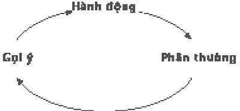
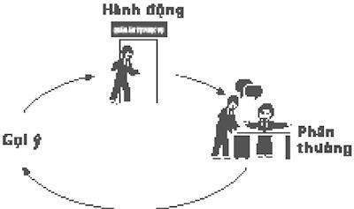
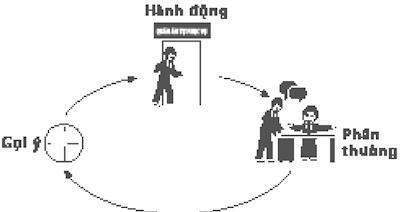
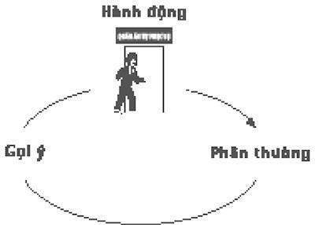

# Phụ lục

### *Hướng dẫn cách sử dụng những ý tưởng này*

Điều khó khăn trong nghiên cứu khoa học về thói quen là đa số mọi người, khi họ nghe về lĩnh vực nghiên cứu này, muốn biết công thức bí mật để nhanh chóng thay đổi bất cứ thói quen nào. Nếu các nhà khoa học khám phá được cách thức hoạt động của những mô hình đó, ắt hẳn họ phải tìm thấy công thức để thay đổi nhanh, phải vậy không?

Chỉ khi điều đó dễ dàng.

Không phải là các công thức đó không tồn tại. Vấn đề là không chỉ có một công thức để thay đổi thói quen. Có hàng nghìn công thức.

Tất cả các cá nhân và thói quen đều khác nhau, vì thế mỗi người, mỗi lề thói khác nhau lại có những chẩn đoán riêng và mô hình thay đổi khác nhau. Bỏ thuốc lá khác với kiềm chế việc ăn uống quá mức, kiềm chế việc ăn uống quá mức lại khác với việc thay đổi cách giao tiếp với bạn đời, giao tiếp với bạn đời lại khác với cách bạn ưu tiên công việc trong lúc làm việc. Hơn thế, thói quen của mỗi người được dẫn dắt bởi nhiều sự thèm khát khác nhau.

Kết quả là, cuốn sách này không chứa một đơn thuốc. Đúng hơn, tôi hy vọng đưa ra được điều gì khác: một cái khung để hiểu được cách những thói quen hoạt động và bản hướng dẫn để kiểm chứng cách thức thay đổi. Vài thói quen dễ dàng chịu thua trước sự phân tích và tác động. Một số khác thì phức tạp, dai dẳng hơn và đòi hỏi phải được nghiên cứu trong thời gian dài. Với một số khác, thay đổi là một quá trình không bao giờ kết luận đầy đủ được.

Nhưng điều đó không có nghĩa là không thể thay đổi. Mỗi chương trong cuốn sách này giải thích một khía cạnh khác nhau về lý do tồn tại của các thói quen và cách chúng hoạt động. Cơ cấu được mô tả trong phụ lục này là một nỗ lực để rút ra, theo một cách cực kỳ đơn giản, những thủ thuật các nhà nghiên cứu đã tìm ra để chẩn đoán và xây dựng các thói quen trong cuộc sống của chúng ta. Không có nghĩa là nó bao hàm tất cả. Nó chỉ là một hướng dẫn thực hành, một vị trí để bắt đầu. Và khi so sánh với những bài học sâu sắc hơn từ các chương khác của cuốn sách, nó là một cuốn sách hướng dẫn để tiếp tục bước đến nơi khác.

Sự thay đổi có thể không nhanh chóng và luôn luôn không dễ dàng. Nhưng với thời gian và nỗ lực, gần như bất cứ thói quen nào cũng có thể xây dựng lại được.

CƠ CẤU:

• Xác định hành động

• Kiểm nghiệm với các phần thưởng

• Cô lập gợi ý

• Có một kế hoạch

## BƯỚC MỘT: XÁC ĐỊNH HÀNH ĐỘNG

Các nhà nghiên cứu MIT ở chương 1 khám phá ra một vòng lặp thần kinh đơn giản tại trọng tâm của mỗi thói quen, một vòng lặp gồm có ba phần: một gợi ý, một hành động và một phần thưởng.

Để hiểu được các thói quen của mình, bạn cần phải xác định các thành phần của vòng lặp. Khi bạn đã chẩn đoán vòng lặp thói quen của một lề thói thông thường, bạn có thể tìm kiếm nhiều cách để thay thế những tật xấu cũ với những lề thói mới.

Lấy ví dụ, cho rằng bạn có một thói quen xấu, giống như việc tôi thường đến quán ăn tự phục vụ và mua một cái bánh quy có sô-cô-la vụn mỗi buổi chiều khi tôi bắt đầu nghiên cứu cuốn sách này. Thói quen đó đã làm bạn tăng vài ki-lô-gam. Trên thực tế, hãy nói rằng thói quen đó làm cho bạn tăng chính xác 3.6 kg và rằng vợ của bạn đã nói vài lời nhận xét sắc sảo. Bạn đã cố gắng để ép buộc mình dừng lại – bạn thậm chí đi càng nhanh càng tốt để đặt một mảnh giấy dính trên máy tính của mình, ghi rằng KHÔNG ĂN THÊM CÁI BÁNH QUY NÀO NỮA.

Nhưng mỗi buổi chiều, bạn xoay xở để phớt lờ mảnh giấy đó, đứng dậy, đi lang thang đến quán ăn tự phục vụ, mua một cái bánh quy, và, trong khi tán gẫu với đồng nghiệp quanh quầy tính tiền, ăn nó. Bạn thấy ổn, rồi lại cảm thấy tệ. Ngày mai, bạn tự hứa với chính mình, bạn sẽ tập trung nghị lực để cưỡng lại. Ngày mai sẽ khác.

Nhưng ngày mai thói quen đó lại chiếm lĩnh lần nữa.

Bạn bắt đầu chẩn đoán và sau đó thay đổi lề thói đó như thế nào? Bằng cách xác định vòng lặp thói quen. Và bước đầu tiên là xác định hành động. Trong hoàn cảnh bánh quy này – như với nhiều thói quen – hành động là khía cạnh rõ ràng nhất: Đó là lề thói bạn muốn thay đổi. Lề thói của bạn là bạn đứng dậy khỏi bàn làm việc vào buổi chiều, đi bộ đến quán ăn tự phục vụ, mua một cái bánh quy có sô-cô-la vụn và ăn nó trong khi trò chuyện với bạn bè. Thế nên đó là những gì bạn đưa vào vòng lặp.

Tiếp theo, một vài câu hỏi ít rõ ràng hơn: Gợi ý nào cho lề thói đó? Có đói không? Buồn chán không? Lượng đường trong máu thấp không? Rằng bạn cần nghỉ một lúc trước khi lao vào một công việc khác?

Và phần thưởng là gì? Chỉ cái bánh quy thôi? Thay đổi khung cảnh thôi? Làm xao lãng tạm thời thôi? Hòa nhập với đồng nghiệp thôi? Hay nguồn năng lượng dồi dào đến từ lượng đường đó?

Để tìm ra điều đó, bạn sẽ cần phải làm một ít thí nghiệm.

## BƯỚC HAI: THỬ NGHIỆM CÁC PHẦN THƯỞNG

Các phần thưởng có sức tác động quá lớn vì chúng đáp ứng những thèm khát đó. Nhưng chúng ta thường không nhận thức được những thèm khát dẫn dắt lề thói của chúng ta. Ví dụ, khi đội tiếp thị Febreze khám phá ra rằng khách hàng mong muốn một mùi mới mẻ vào lúc hoàn tất trình tự dọn dẹp, họ nhận ra một sự thèm khát mà thậm chí không ai biết được chúng tồn tại. Nó được che giấu trong cái nhìn đơn giản. Nhiều sự thèm khát giống thế này: khi hồi tưởng thì rõ ràng, nhưng khi đang chịu ảnh hưởng, ta khó lòng nhìn thấy được.

Để tìm ra sự thèm khát nào đang dẫn dắt những thói quen thông thường, sẽ có ích khi thử nghiệm với nhiều phần thưởng khác nhau. Việc đó có thể mất vài ngày, hay một tuần, hoặc lâu hơn. Trong khoảng thời gian đó, đừng tạo ra bất kỳ áp lực nào để tạo ra sự thay đổi thật sự - hãy nghĩ mình như một nhà khoa học đang trong giai đoạn thu thập dữ liệu.

Vào ngày thử nghiệm đầu tiên, khi bạn thấy một thôi thúc đi đến quầy ăn tự phục vụ và mua một cái bánh quy, hãy điều chỉnh lề thói của mình để đưa ra phần thưởng khác. Ví dụ như, thay vì đi bộ đến quán ăn tự phục vụ, hãy đi ra ngoài, đi bộ quanh khu nhà, và sau đó trở lại bàn làm việc mà không ăn gì cả. Ngày hôm sau, hãy đến quán ăn tự phục vụ và mua một cái bánh vòng chiên hay một thanh kẹo, và ăn ở bàn làm việc. Ngày hôm sau nữa, hãy đến quầy ăn tự phục vụ, mua một quả táo, và ăn nó trong khi trò chuyện với bạn bè. Sau đó, thử một tách cà phê. Sau đó, thay vì đi đến quầy ăn tự phục vụ, hãy ngang qua phòng của đồng nghiệp, tán gẫu trong vài phút và trở lại bàn làm việc.

Bạn đã nắm được ý tưởng. Bạn lựa chọn việc gì để làm thay vì mua một cái bánh quy không quan trọng. Mục đích là để kiểm tra nhiều lý thuyết khác nhau để xác định sự thèm khát nào đang dẫn dắt lề thói của bạn. Bạn đang thèm khát chỉ cái bánh quy hay nghỉ ngơi một lúc khỏi công việc? Nếu đó là vì cái bánh quy, có phải vì bạn đang đói? (Trong trường hợp đó, một quả táo cũng có hiệu quả tương tự.) Hay đó là vì bạn muốn nguồn năng lượng mà cái bánh quy mang lại? (Và tách cà phê cũng đáp ứng được.) Hay bạn đang lang thang lên quầy ăn tự phục vụ như một lời biện hộ để hòa nhập, và cái bánh quy chỉ là một lời biện hộ thuận tiện? (Nếu như thế, đi đến bàn của ai đó và tán gẫu trong vài phút có thể thỏa mãn sự thúc đẩy đó.)

Khi bạn kiểm tra 4 hay 5 phần thưởng khác nhau, bạn có thể sử dụng một mẹo cũ để tìm kiếm các mô hình: sau mỗi hoạt động, ghi chú nhanh trên một mảnh giấy 3 điều đầu tiên ập vào tâm trí khi bạn trở lại bàn làm việc. Có thể là cảm xúc, suy nghĩ ngẫu hứng nào đó hay chỉ 3 từ đầu tiên xuất hiện trong đầu bạn.

Sau đó, đặt chuông báo trên đồng hồ hay máy vi tính sau mỗi 15 phút. Khi nó đổ chuông, hãy tự hỏi bản thân mình: Bạn có còn cảm thấy sự thúc đẩy có được cái bánh quy đó?

Lý do tại sao quan trọng là phải viết ra 3 điều – cho dù chúng có là những từ ngữ vô nghĩa đi nữa – chính là sự nhân đôi. Đầu tiên, nó ép buộc một nhận thức tạm thời về điều bạn đang suy nghĩ hay cảm thấy. Như Mandy, người cắn móng tay trong chương 3, mang theo khắp nơi một mảnh ghi chú đầy những mục tiêu linh tinh để ép mình nhận thức về sự thúc đẩy theo thói quen, để viết ra 3 từ thúc đẩy khoảnh khắc chú ý. Hơn thế, các nghiên cứu cho thấy rằng viết ra một vài từ giúp bạn sau này gợi nhớ lại được những gì mình đang suy nghĩ trong thời gian đó. Vào cuối thí nghiệm, khi bạn xem lại ghi chú của mình, nhớ lại điều bạn đang suy nghĩ và cảm thấy vào chính lúc đó sẽ dễ dàng hơn, vì những từ ngữ nghệch ngoạc của bạn sẽ thúc đẩy một làn sóng hồi tưởng.

Và tại sao có chuông báo 15 phút một lần? Vì mục đích của những bài kiểm tra này là để xác định phần thưởng bạn đang thèm khát. Nếu, 15 phút sau khi ăn một cái bánh chiên, bạn vẫn cảm thấy bị thúc đẩy để đứng lên và đi đến quầy ăn tự phục vụ, thì thói quen của bạn không được thúc đẩy bằng sự thèm khát đường. Nếu, sau khi tán gẫu tại bàn làm việc của đồng nghiệp, bạn vẫn muốn một cái bánh quy, thì nhu cầu liên hệ với mọi người không phải là điều đang dẫn dắt lề thói của bạn.

Ngược lại, nếu 15 phút sau khi trò chuyện với một người bạn, bạn thấy dễ quay trở lại làm việc hơn thì bạn đã xác định được phần thưởng – sự xao lãng tạm thời và sự hòa đồng – mà thói quen của bạn đang tìm kiếm để được thỏa mãn.

Bằng cách thử nghiệm với nhiều phần thưởng khác nhau, bạn có thể tách biệt điều bạn đang thèm khát thực sự, điều sẽ cần thiết trong việc xây dựng lại thói quen.

Một khi bạn đã tìm ra hành động và phần thưởng, điều còn lại là xác định gợi ý.

## BƯỚC BA: CÔ LẬP GỢI Ý

Khoảng 10 năm trước, một nhà tâm lý học thuộc Đại học Tây Ontario cố gắng trả lời một câu hỏi mà đã làm cả cộng đồng khoa học hoang mang trong nhiều năm: Tại sao vài nhân chứng tội phạm nhớ sai điều họ thấy, trong khi người khác nhớ lại sự kiện một cách chính xác?

Dĩ nhiên, sự hồi tưởng của các nhân chứng là cực kỳ quan trọng. Và các nghiên cứu lại chỉ ra rằng các nhân chứng thường nhớ sai điều họ nhìn thấy. Ví dụ, họ khăng khăng rằng kẻ trộm là một người đàn ông, trong khi cô ta đang mặc váy; hay tội phạm xảy ra lúc chạng vạng, cho dù các báo cáo của cảnh sát nói rằng nó xảy ra lúc 2 giờ chiều. Ngược lại, các nhân chứng khác, có thể nhớ được tội phạm họ đã nhìn với trí nhớ gần như hoàn hảo.

Hàng chục nghiên cứu đã kiểm tra hiện tượng này, cố gắng để xác định tại sao một số người là nhân chứng tốt hơn những người khác. Các nhà nghiên cứu đặt ra giả thuyết rằng một số người chỉ đơn giản có trí nhớ tốt hơn, hay một tội phạm xảy ra ở một nơi quen thuộc dễ gợi nhớ hơn. Nhưng những giả thuyết đó không kiểm chứng được – người có trí nhớ tốt hay không tốt, nhiều hay ít thân quen với khung cảnh của tội phạm, chịu trách nhiệm pháp lý như nhau khi nhớ sai về những gì đã xảy ra.

Nhà tâm lý học tại Đại học Tây Ontario tiếp cận theo một phương pháp mới. Cô tự hỏi liệu các nhà nghiên cứu có đang mắc một lỗi sai vì tập trung vào những gì người chất vấn và nhân chứng đã nói, hơn là cách họ đang nói điều đó. Cô nghi ngờ có những gợi ý quan trọng đang ảnh hưởng đến quá trình chất vấn. Nhưng khi cô xem các đoạn băng ghi hình sau khi ghi lại các cuộc phỏng vấn nhân chứng, tìm kiếm những gợi ý đó, cô không thể nhìn thấy gì. Có quá nhiều hoạt động trong mỗi cuộc phỏng vấn – tất cả biểu hiện nét mặt, các cách khác nhau để đưa ra câu hỏi, sự thay đổi cảm xúc – mà cô không thể phát hiện ra bất cứ mô hình nào.

Thế nên cô đưa ra một ý kiến: Cô lập danh sách một vài yếu tố mà cô sẽ tập trung vào – ngữ điệu của người hỏi, biểu hiện nét mặt của nhân chứng và người hỏi ngồi cạnh nhau gần như thế nào. Sau đó cô loại bỏ bất cứ thông tin nào làm cô xao lãng khỏi những yếu tố đó. Cô giảm âm lượng trên ti vi nên thay vì nghe từ ngữ, tất cả những gì cô có thể phát hiện là ngữ điệu giọng nói người hỏi. Cô dán một mảnh giấy lên chỗ mặt người hỏi, nên tất cả những gì cô thấy là biểu hiện của nhân chứng. Cô dùng một dải giấy đo lên màn hình để đo khoảng cách giữa hai người.

Và khi cô bắt đầu nghiên cứu những yếu tố nhất định đó, các mô hình hiện ra. Cô nhận thấy rằng các nhân chứng nhớ sai thực tế thường được chất vấn bởi các cảnh sát sử dụng một giọng điệu nhẹ nhàng, thân thiện. Khi các nhân chứng cười nhiều hơn, hay ngồi gần hơn với người đang hỏi, họ có vẻ dễ nhớ sai hơn.

Nói cách khác, khi những gợi ý ngoại cảnh nói rằng “chúng ta là bạn” – một giọng điệu nhẹ nhàng, một khuôn mặt mỉm cười – các nhân chứng có vẻ dễ nhớ sai hơn những gì đã xảy ra. Có thể đó là vì, trong tiềm thức, những gợi ý thân thiện đó thúc đẩy một thói quen để làm vừa lòng người hỏi.

Nhưng tầm quan trọng của thí nghiệm này là những đoạn băng tương tự như thế đã được hàng chục nhà nghiên cứu khác xem. Rất nhiều người thông minh đã nhìn thấy các mô hình tương tự, nhưng không ai nhận ra chúng trước đây. Vì có quá nhiều thông tin trong mỗi cuộn băng để nhìn thấy một gợi ý quan trọng.

Tuy nhiên, khi nhà tâm lý học quyết định tập trung vào chỉ ba loại lề thói và loại bỏ thông tin không liên quan, các mô hình hiện ra.

Cuộc sống của chúng ta cũng theo cách như thế. Lý do tại sao rất khó để xác định các gợi ý thúc đẩy lề thói của chúng ta là vì có quá nhiều thông tin tấn công dồn dập chúng ta khi các lề thói lộ ra. Hãy tự hỏi chính mình, bạn ăn sáng vào một thời điểm nhất định mỗi ngày vì bạn đói bụng phải không? Hay vì đồng hồ điểm 7h30? Hay vì các con bạn đã bắt đầu ăn? Hay vì bạn đã thay quần áo và đó là lúc thói quen ăn sáng tìm đến?

Khi bạn tự động quay xe sang trái trong khi lái xe đi làm, cái gì thúc đẩy lề thói đó? Một biển báo hiệu? Một cái cây bình thường? Biết rằng trên thực tế, đó là lộ trình đúng? Tất cả các lý do trên? Khi bạn lái xe đưa con đến trường và bạn phát hiện ra rằng bạn đã bắt đầu đi trên con đường đến chỗ làm một cách đãng trí – hơn là đến trường học – cái gì gây ra lỗi sai đó? Cái gì là gợi ý làm cho thói quen “lái xe đi làm” xuất hiện, hơn là mô hình “lái xe đến trường”?

Để xác định một gợi ý giữa tiếng ồn, chúng ta có thể sử dụng cùng hệ thống như nhà tâm lý học: xác định các loại lề thói trước cần xem xét để có thể nhìn thấy các mô hình. May mắn thay, khoa học đưa ra vài giúp đỡ trên phương diện này. Các thí nghiệm đã cho thấy rằng gần như mọi gợi ý thuộc thói quen phù hợp với một trong năm loại sau:

Địa điểm

Thời gian

Trạng thái tình cảm

Những người khác

Hành động vừa xảy ra trước đó.

Thế nên nếu bạn đang cố gắng để tìm ra gợi ý cho thói quen “đi đến quầy ăn tự phục vụ và mua một cái bánh quy có vụn sô-cô-la”, bạn viết ra 5 thứ vào thời điểm sự thúc đẩy đó xuất hiện (những cái dưới đây là ghi chú thực tế của tôi từ lúc tôi cố gắng chẩn đoán thói quen của mình):

Bạn đang ở đâu? (ngồi tại bàn làm việc)

Lúc đó là mấy giờ? (3h36 chiều)

Trạng thái cảm xúc của bạn như thế nào? (buồn chán)

Có ai xung quanh không? (không có ai)

Lề thói nào vừa xảy ra trước sự thúc đẩy đó? (trả lời một thư điện tử)

Ngày hôm sau:

Bạn đang ở đâu? (đi bộ trở lại từ máy photo)

Lúc đó là mấy giờ? (3h18 chiều)

Trạng thái cảm xúc của bạn thế nào? (vui vẻ)

Có ai xung quanh không? (Jim ở báo Thể Thao)

Lề thói nào vừa xảy ra trước sự thúc đẩy đó? (làm một bản sao)

Ngày thứ ba:

Bạn đang ở đâu? (phòng họp)

Lúc đó là mấy giờ? (3h41 chiều)

Trạng thái cảm xúc của bạn thế nào? (mệt mỏi, phấn khích với dự án tôi tôi đang làm)

Có ai xung quanh không? (các biên tập viên đang đến cuộc họp)

Lề thói nào vừa xảy ra trước sự thúc đẩy đó? (tôi ngồi xuống vì cuộc họp sắp bắt đầu)

Ba ngày qua, rất rõ ràng gợi ý nào đang thúc đẩy thói quen ăn bánh quy của tôi – tôi cảm thấy một sự thúc đẩy để ăn nhẹ vào một thời điểm nhất định trong ngày. Tôi đã vừa tìm ra, trong bước hai, rằng không phải cái đói dẫn dắt lề thói của tôi. Phần thưởng tôi đang tìm kiếm là một sự xao lãng tạm thời – hình thức như tán gẫu với một người bạn. Và thói quen đó, giờ tôi biết được, thúc đẩy tôi từ lúc 3 đến 4 giờ.

## BƯỚC BỐN: CÓ MỘT KẾ HOẠCH

Khi bạn đã tìm ra vòng lặp thói quen của mình – bạn xác định phần thưởng dẫn dắt lề thói, gợi ý thúc đẩy nó và chính hành động đó – bạn có thể bắt đầu chuyển đổi lề thói. Bạn có thể thay đổi đến một lề thói tốt hơn bằng cách lập kế hoạch cho gợi ý và lựa chọn một lề thói đem lại phần thưởng mà bạn đang thèm khát. Điều bạn cần là một kế hoạch.

Trong phần mở đầu, bạn học được rằng một thói quen là sự lựa chọn mà chúng ta cố tình đưa ra tại một vài thời điểm, và rồi ngừng suy nghĩ về nó, nhưng tiếp tục thực hiện, thường xuyên mỗi ngày.

Nhìn theo cách khác, thói quen là một công thức mà não chúng ta tự động làm theo: Khi tôi nhìn thấy GỢI Ý, tôi sẽ thực hiện HÀNH ĐỘNG để có thể nhận được một PHẦN THƯỞNG.

Để xây dựng lại công thức đó, chúng ta cần bắt đầu đưa ra các lựa chọn lần nữa. Và cách dễ dàng nhất để làm điều đó, theo các nghiên cứu, là có một kế hoạch. Trong tâm lý học, những kế hoạch đó được gọi là “ý định thực hiện.”

Ví dụ, hãy xem thói quen bánh-quy-vào-buổi-chiều của tôi. Bằng cách sử dụng cơ cấu đó, tôi học được rằng gợi ý của tôi là khoảng 3h30 chiều. Tôi biết rằng hành động của tôi là đi đến quầy ăn tự phục vụ, mua một cái bánh quy, và trò chuyện với bạn bè. Và, thông qua thử nghiệm, tôi đã học được rằng đó thật sự không phải cái bánh quy tôi thèm khát – thực ra, đó là một khoảnh khắc của sự xao lãng và cơ hội để hòa đồng.

Thế nên tôi viết ra một kế hoạch:

Lúc 3h30, mỗi ngày, tôi sẽ đi đến

bàn làm việc của một người bạn

và nói chuyện khoảng 10 phút.

Để đảm bảo mình nhớ làm việc đó, tôi đặt chuông báo trên đồng hồ lúc 3h30.

Điều đó không có tác dụng ngay lập tức. Có vài ngày tôi quá bận rộn và bỏ qua tiếng chuông báo, và rồi thất bại việc đó. Những lần khác có vẻ như có quá nhiều công việc để có thể tìm ra một người bạn sẵn lòng trò chuyện cùng – mua một cái bánh quy sẽ dễ dàng hơn, nên tôi đầu hàng trước sự thúc đẩy đó. Nhưng vào những ngày tôi tuân theo kế hoạch của mình – khi đồng hồ đổ chuông, tôi ép buộc bản thân mình đi đến bàn làm việc của một người bạn và trò chuyện khoảng 10 phút – tôi nhận ra rằng tôi kết thúc ngày làm việc với cảm giác tốt hơn. Tôi đã không đi đến quầy ăn tự phục vụ, tôi đã không ăn một cái bánh quy nào và tôi cảm thấy ổn. Cuối cùng, việc đó trở thành tự động: khi chuông reo, tôi tìm một người bạn và kết thúc ngày làm việc với một cảm giác tuy nhỏ, nhưng thật sự, thành công. Và khi tôi không thể tìm ra ai đó để trò chuyện cùng, tôi đi đến quầy ăn tự phục vụ, mua trà và uống cùng bạn bè.

Tất cả việc đó xảy ra khoảng sáu tháng trước. Tôi không còn cái đồng hồ nào nữa – lúc nào đó tôi đánh mất nó. Nhưng lúc khoảng 3h30 mỗi ngày, tôi đứng dậy một cách đãng trí, nhìn quanh phòng biên tập tin tức để tìm ai đó nói chuyện, dành 10 phút tán gẫu về tin tức và sau đó trở lại bàn làm việc. Việc đó xảy ra gần như không cần suy nghĩ. Việc đó đã trở thành một thói quen.

Rõ ràng, thay đổi một vài thói quen có thể khó khăn hơn. Nhưng cơ cấu này là một nơi để bắt đầu. Đôi khi sự thay đổi mất một thời gian dài hơn. Đôi lúc nó đòi hỏi nhiều thử nghiệm và thất bại lặp lại. Nhưng khi bạn hiểu được cách một thói quen hoạt động – khi bạn chẩn đoán gợi ý, hoạt động và phần thưởng – bạn có được sức mạnh để vượt qua.
