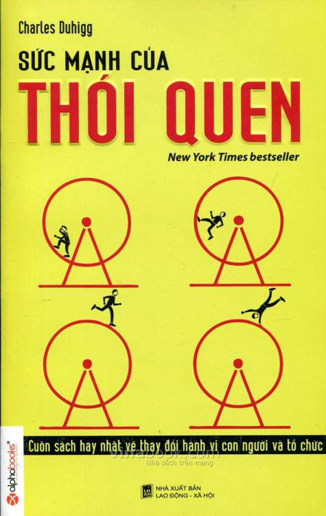

# Sức Mạnh Của Thói Quen (The Power of Habit)

**Tác giả:** Charles Duhigg  
**Định dạng:** Markdown (.md) chuyển đổi từ tài liệu PDF gốc kèm toàn bộ hình ảnh minh họa và định dạng gốc.



---

## 📚 Mục lục (Table of Contents)

1. [Phần mở đầu: Cải tạo thói quen](00_Phan_mo_dau.md)
2. **Phần I: Các thói quen cá nhân**
   - [Chương 1: Vòng lặp của thói quen - Cách thức thói quen hoạt động](01_Chuong_01.md)
   - [Chương 2: Não bộ của sự thèm muốn - Cách tạo ra thói quen mới](02_Chuong_02.md)
   - [Chương 3: Nguyên tắc vàng để thay đổi thói quen - Tại sao việc biến đổi xảy ra](03_Chuong_03.md)
3. **Phần II: Những thói quen của các tổ chức thành công**
   - [Chương 4: Thói quen quyết định hay bản tình ca của Paul O’Neill](04_Chuong_04.md)
   - [Chương 5: Starbucks và thói quen của sự thành công](05_Chuong_05.md)
   - [Chương 6: Sức mạnh của sự khủng hoảng](06_Chuong_06.md)
   - [Chương 7: Xác định mục tiêu bạn muốn thế nào trước khi bạn làm việc](07_Chuong_07.md)
4. **Phần III: Những thói quen của cộng đồng**
   - [Chương 8: Đại giáo đoàn và phong trào tẩy chay xe buýt ở Montgomery](08_Chuong_08.md)
   - [Chương 9: Thần kinh học về sự tự nguyện](09_Chuong_09.md)
5. [Phụ lục: Hướng dẫn cách sử dụng những ý tưởng này](10_Phu_luc.md)

---

## 📁 Cấu trúc thư mục

```
.
├── 00_Phan_mo_dau.md
├── 01_Chuong_01.md
├── 02_Chuong_02.md
├── 03_Chuong_03.md
├── 04_Chuong_04.md
├── 05_Chuong_05.md
├── 06_Chuong_06.md
├── 07_Chuong_07.md
├── 08_Chuong_08.md
├── 09_Chuong_09.md
├── 10_Phu_luc.md
├── images/
│   ├── img_p001_01.jpeg
│   ├── ...
└── raw/
    └── SucManhCuaThoiQuen.pdf
```
