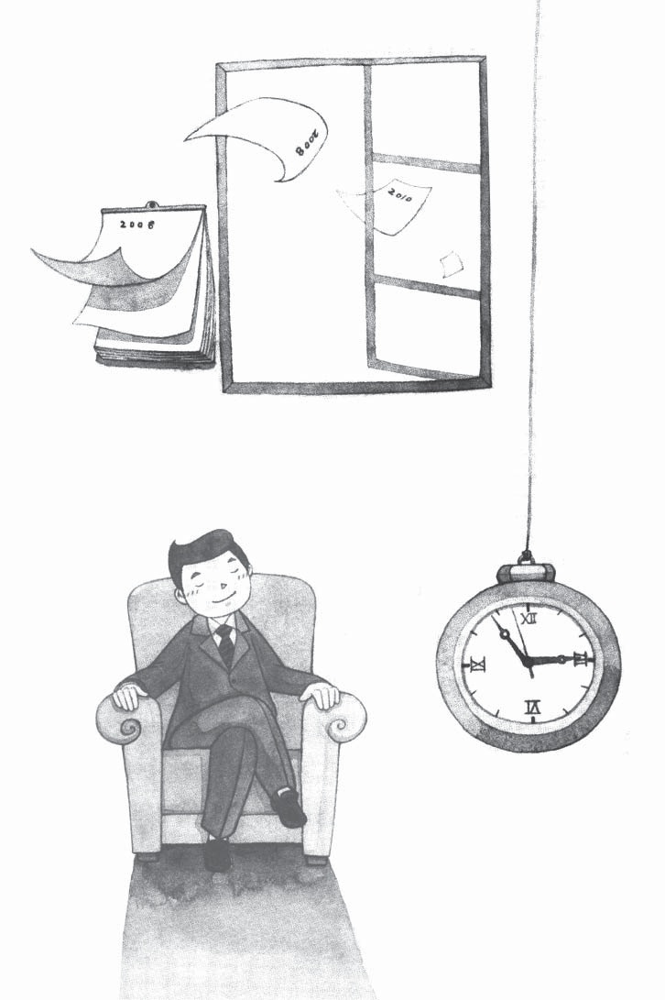
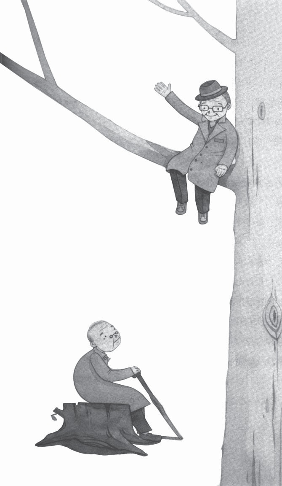
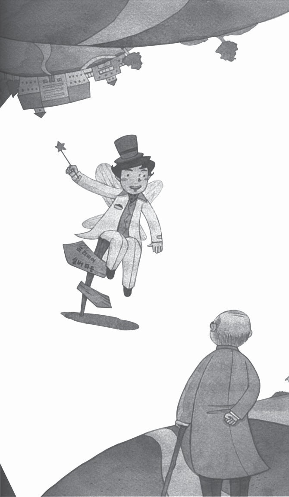
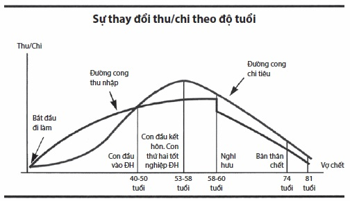
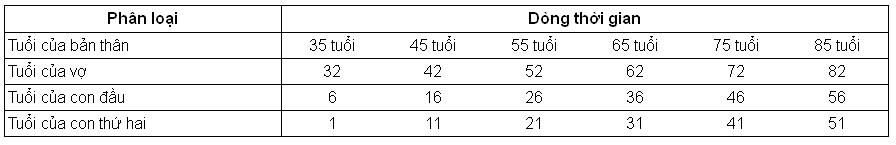
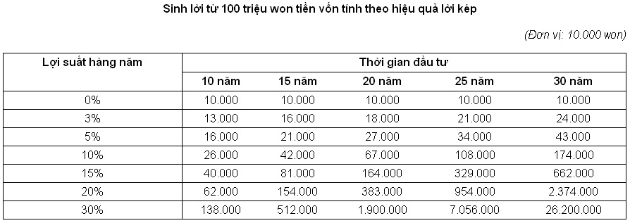

# Chương 1: Cuộc du hành 30 năm sau

## 30 năm sau, chuyện gì sẽ xảy ra?

Gần đây, anh Kim Min Seok (35 tuổi) khá lo lắng khi vợ anh sắp sinh đứa con thứ hai. So với các bạn cùng trang lứa, với chức vụ trưởng phòng của một công ty tầm cỡ như anh thì cuộc sống của anh có vẻ rất ổn. Tuy nhiên, môi trường công ty anh cực kỳ khắc nghiệt, nên chuyện về hưu non của một hay hai ông giám đốc bộ phận không còn xa lạ. Tuy hai vợ chồng đều đi làm kiếm tiền nhưng sau khi sinh đứa con đầu tiên, cuộc sống đối với vợ chồng anh đã khá chật vật. Giờ đây, khi sắp có đứa con thứ hai thì nỗi lo lắng đó càng đè nặng hơn. Anh là đối tượng ghen tị của những người xung quanh vì chức danh trưởng phòng. Thu nhập một năm của anh và vợ khoảng 80 triệu won(1).

Nếu nhìn bề ngoài, trưởng phòng Kim dường như sống mà không cần phải lo lắng gì nhiều về tiền bạc. Nhưng thực tế không phải như vậy. Vào ngày lĩnh lương hàng tháng, sau khi nộp tiền thuế, tiền trách nhiệm công dân… thì số tiền thực lĩnh của anh sẽ được chuyển vào sổ tiết kiệm. Tiếp đến, anh sẽ phải đóng tiền thẻ, tiền trả lãi khoản vay ngân hàng… Như thế, tiền lương của anh cứ bị chia năm sẻ bảy với đủ các khoản chi tiêu. Anh thường xuyên nghi ngờ tự hỏi: “Không hiểu khoản tiền lớn biến đi đâu mất rồi?”. Nhưng rồi suy nghĩ: “Biết làm thế nào đây!” cứ cuốn anh đi từng ngày từng ngày. Cuộc sống tất bật với số lượng công việc cao như núi khiến anh không còn chút thời gian để tĩnh tâm suy nghĩ về tương lai. Chỉ cần nghĩ đến đứa con sắp ra đời, các vấn đề từ quan hệ xã hội, rồi việc hoàn trả khoản vay mua nhà… đã làm anh bù đầu. Do đó, việc anh không chú tâm nhìn lại hiện trạng của mình cũng là điều dễ hiểu.

*(1) Won: là đơn vị tiền tệ của Hàn Quốc. Theo tỉ giá ngày 17/2/2012.*

Gần đây, anh được một người em họ gợi ý tham gia bảo hiểm niên kim. Cậu em đó từng làm việc tại công ty bảo hiểm có vốn đầu tư nước ngoài. Trong một dịp vô tình cậu em đó đã hỏi anh: “Anh đã chuẩn bị cho tuổi già và lập kế hoạch sau khi về hưu chưa?”. Rồi cậu ấy chân thành khuyên anh nên chuẩn bị cho tuổi già ngay từ bây giờ bằng bảo hiểm niên kim.

“Chuẩn bị tuổi già? Chuẩn bị về hưu? Dù không có những thứ đó thì thế hệ bố mẹ của chúng ta vẫn sống tốt đấy thôi!”

Khi đó, trong bụng anh nghĩ vậy, nên sau khi chia tay với cậu em, anh liền đi thẳng về nhà. Nhưng thật kỳ lạ, trên đường về nhà thì lời nói cậu em đó lại hiện lên trong đầu anh.

“Thời của bố mẹ chúng ta trong quá khứ khác xa với hiện tại anh ạ. Vì đó là thời kinh tế đang tăng trưởng cao nên mọi người không cần phải lo lắng về tuổi già. Hơn nữa, hiện nay việc con cái phụng dưỡng bố mẹ vẫn là việc hiển nhiên. Nhưng đối với thế hệ sau này thì sao? Liệu chúng còn giữ được điều đó?”

Hiện nay nền kinh tế tuy vẫn tăng trưởng nhưng không thể tránh khỏi khủng hoảng, suy thoái. Còn tuổi thọ trung bình? Số người sống thọ đến cả 100 tuổi không còn là điều hiếm hoi. Hơn nữa, anh có biết một trong những vấn đề mà anh sẽ gặp phải khi có tuổi là gì không? Đó chính là chi phí y tế. Sau 70 tuổi, chi phí y tế sẽ tương đối lớn. Hiện tại, anh đang còn trẻ nên anh chưa nhận thấy, nhưng khi anh có tuổi rồi thì vấn đề khiến anh lo lắng nhất chính là sức khỏe. Tuổi già ốm đau bệnh tật đã khổ, lại không có tiền nữa thì anh sẽ sống thế nào?”

Kim Min Seok lại tiếp tục nhớ đến cuộc nói chuyện với cậu em: “Số tiền anh kiếm được hàng tháng liệu có đảm bảo cuộc sống? Liệu anh có thể an hưởng tuổi già của mình bằng số tiền đó?”. Suy nghĩ của anh cứ bị ám ảnh bởi câu nói đó. Trở về nhà, khác với thường ngày, sau khi nhìn vợ với cái bụng vượt mặt sắp sinh và đứa con gái năm tuổi đang xem tivi, anh mệt mỏi đi vào trong phòng tắm. Anh cứ để nước ấm chảy lên khắp người. Mệt mỏi trên người dường như đã biến mất. Tự nhiên, anh nhắm mắt lại.

Anh lại nghe văng vẳng đâu đó giọng nói mạnh mẽ của cậu em.

“Anh à, anh hãy thử nghĩ đến bộ dạng của mình sau 35 năm nữa, khi anh 70 tuổi mà xem. Anh có đủ tự tin mình sẽ sống hạnh phúc mà không thiếu thốn gì không? Anh có đang chuẩn bị cho tương lai đó không?”

## Hình ảnh của tôi sau 35 năm nữa

Anh tỉnh giấc vì tiếng gõ cửa. Anh thấy đầu óc sảng khoái và nhẹ nhõm. Anh đứng dậy vươn vai và đi ra bồn rửa mặt để đánh răng, nhưng chuyện gì xảy ra thế này? Ngay trước mắt anh, hình ảnh trong gương phản chiếu không phải là anh mà là một ông lão với mái đầu đã điểm bạc. Anh quá đỗi ngạc nhiên đưa tay sờ vào gương. Nhưng kỳ lạ thay, không phải ông lão trong gương cũng đang làm hành động tương tự như anh sao? Mắt anh mở to đầy ngạc nhiên, anh đang đối diện với hình ảnh ông lão cũng đang nhìn chằm chằm vào mình.

Cùng với tiếng gõ cửa, anh nghe thấy tiếng gọi của vợ mình: “Ông ơi, ông ra ăn cơm”. Anh nhanh chóng mặc quần áo rồi đi ra khỏi phòng tắm. Nhưng liệu vợ anh có biến thành một bà lão với mái tóc bạc phơ hay không? Dường như vẫn chưa thể tin vào những điều đang xảy ra, anh hỏi vợ:

“Em à, chuyện này là thế nào? Tại sao chúng ta lại già đi chứ? Mà giờ là năm nào? Anh bao nhiêu tuổi?”

Sau khi liên tiếp đặt ra những câu hỏi cho vợ, anh bắt đầu nhìn ngó xung quanh. Anh cũng nhận ra nơi mình đang đứng không phải là ngôi nhà trước kia anh đã từng ở.

“Mà đây là đâu?”

Vợ anh đáp lại lạnh lùng như thể chị thấy anh có gì đó không bình thường:

“Ông này, sao lại ăn nói lung tung thế. Hôm nay là Chủ nhật ngày 25/03/2041. Ông giờ đã 70 tuổi rồi. Ăn nhanh đi rồi còn đi làm. Chúng ta muộn mất. Bắt đầu từ giờ, chúng ta sẽ sống ở đây nên ông phải giữ đúng giờ đấy”.

Bị vợ giục, anh đi về phía nhà ăn. Trong nhà ăn, có nhiều người già đầu tóc đã bạc cũng đang đứng đợi bữa ăn sáng. Chỉ nhẩm tính cũng có khoảng đến gần 100 người.

“Bà nói đây là đâu?”

Người vợ chỉ nhìn vào khay ăn mà không nói lời nào. Chị dường như đang bực mình. Anh bắt đầu ngó xung quanh vì anh nghĩ sẽ khó để nghe câu trả lời mà anh muốn từ vợ mình. Anh tập trung nhìn thực đơn treo trên tường. Phía trên của thực đơn có ghi dòng chữ “Trung tâm dưỡng lão quận Guro”. Đến lúc này, anh mới nhận ra nơi mình đang đứng là viện dưỡng lão. Anh nhìn tờ lịch treo trên tường và anh cũng lờ mờ nhận ra mình đã 70 tuổi, còn vợ anh đã 65 tuổi.

## Hơn một nửa nam giới trên 65 tuổi vẫn làm việc

Sau khi lấy đồ ăn và kết thúc bữa sáng, mọi người lần lượt trở về phòng mình thay quần áo. Từng người từng người một lần lượt lên xe buýt đứng đợi ngay trước cửa viện dưỡng lão. Kim Min Seok và vợ anh cũng lên chiếc xe buýt đó. Chiếc xe đi vào trung tâm thành phố, thả vợ chồng anh và một số người khác xuống. Đây là nơi làm việc của họ. Việc quản lý điện tử các hồ sơ khiếu nại các loại tại thị chính là việc mà Kim Min Seok đã từng làm. Trong số những người bạn già đồng hành, anh chú ý đến một gương mặt mà anh thấy khá quen. “À, đúng rồi! Đó chẳng phải là giám đốc Lee Jun sao! Nhưng mà sao ông ấy lại ở đây? Nếu mình tính nhẩm thì ông ấy hơn mình 10 tuổi, tức là năm nay đã 80 rồi.”

“Giám đốc Lee! Sao ông lại đến đây? Trông ông già đi nhiều quá!”

“Ông nhìn lại xem, ông cũng ở đây mà! Vào được đây chắc khó lắm? Ý tôi là cạnh tranh cao… Tôi cũng đã phải đợi nửa năm mới vào được đây đấy. Ở đây rất tốt. Họ còn tạo việc làm cho chúng ta…”

“Hình như đây là lần đầu tiên tôi gặp lại giám đốc kể từ khi ông về hưu. Thời gian qua, ông sống thế nào?”

Giám đốc Lee Jun cười nhạt rồi nói tiếp:

“Chuyện đó từ bao giờ nhỉ? Đã hơn 30 năm rồi còn gì! Nói gì thì nói, lúc đó tôi mới có 45 tuổi. Đó là thời kỳ tuyệt vời phải không. Hàng tháng được lĩnh lương, môi trường công ty cũng tốt…”

Giám đốc Lee Jun lấy một điếu thuốc ra rồi bắt đầu hút, hình như ông đang suy tưởng về ngày xưa nên chăm chú nhìn lên bầu trời, đôi mắt đỏ hoe.

“45 tuổi về hưu non xong, có quá nhiều biến cố xảy ra với tôi. Tôi đã từng là người chẳng biết gì ngoài công ty và gia đình. Thời đó, con cái vẫn còn phải học hành nên tôi không thể yên lòng được… Vậy là tôi cũng đã bắt đầu mở một cửa hàng bán bánh nhỏ. Khởi đầu cũng chẳng dễ dàng. Với số tiền hưu và số vốn vay ngân hàng, tôi cứ nghĩ rằng công việc kinh doanh ở quán bánh sẽ ổn. Nhưng do suy thoái kinh tế, rồi người làm cũng không được việc nên cuối cùng tôi rơi vào nợ nần. Trả nợ xong, tôi cũng mất luôn cả tiền vốn. Vậy là việc kinh doanh đầu tiên tan thành mây khói”.

“Thì ra là thế. Vậy sau khi không kinh doanh nữa, giám đốc làm gì?”

“Nói đi nói lại, thì cũng chỉ là làm việc cần làm thôi. Vì phải lo cho con cái ăn học nên tôi chẳng nề hà việc gì, giống như ngọn đèn sắp hết dầu ấy. Biết thế cứ lì ra ở công ty. Cậu không biết tôi đã hối hận như thế nào đâu. Sau tuổi 45, mọi việc cứ rối hết cả lên. Chắc thế bây giờ tôi mới ở đây? Thôi, ông kể chuyện của ông đi. Không phải là sau 35 tuổi, nhà ông phất lên và công việc cũng suôn sẻ à?”

Trong khi anh vẫn chưa thể chấp nhận sự thật mình đã 70 tuổi, vợ của anh nói chen vào:

“Lúc đó thôi, chứ chúng tôi cũng đâu tưởng tượng được rằng mình sẽ ra nông nỗi này. Có nhà cửa, lại còn nuôi dạy con cái chẳng kém ai, đến sau 40 tuổi, chúng tôi hạnh phúc lắm. Cả hai vợ chồng đều kiếm được tiền nên cuộc sống cũng dư dả. Nhưng 45 tuổi, tôi nghỉ việc, chỉ còn mình bố bọn trẻ kiếm tiền nên chỉ mỗi việc lo tiền học cho bọn trẻ đã khó khăn. Giá nhà cứ tưởng chỉ tăng lên, ai ngờ lại đột ngột giảm mạnh, rồi lãi suất cho vay tăng… Đối với chúng tôi thì chính suy thoái kinh tế là kẻ thù lớn nhất. Do cứ lẫn việc nhà với việc công, mà đến đầu 50 thì ông nhà tôi cũng bị cho về hưu non như giám đốc. Ông ấy không chịu được cảnh ăn lương hưu non nên vẫn đến công ty. Nhưng môi trường ở đó càng ngày càng vô tình ông ạ!”

Đang nói liên hồi, bỗng nhiên có giọt nước mắt rơi ra từ khóe mắt của chị. Kim Min Seok không rời mắt khỏi vợ, anh dường như cảm nhận rằng: “Thời gian đã biến đổi mọi thứ như thế này cơ đấy, cuối cùng thì khoảnh khắc mà mình từng lo lắng cũng đã tới”.

Đúng là tương lai không được chuẩn bị trước. Cuộc sống vốn lẽ là vậy!

“Ông ơi, nhanh lên. Chúng ta muộn mất. Hôm kia họ nói nếu muộn 10 phút sẽ bị trừ một tiếng tiền lương đấy.”

Anh đang chìm trong suy nghĩ thì bị vợ giục. Anh chào giám đốc Lee Jun, cầm tay vợ rồi hướng về phía phòng quản lý hồ sơ điện tử - một phòng riêng bên trong tòa thị chính Seoul. Ở phía trước thiết bị đầu cuối chỉnh lý hồ sơ điện tử, có nhiều người trạc tuổi anh đang ngồi. Tính nhẩm, anh thấy có khoảng 100 người, đang ngồi gõ chăm chú vào bàn phím máy tính phía trước thiết bị đầu cuối.

Đến lúc này, Kim Min Seok mới lờ mờ nhận thấy mình đang ở đâu, tại sao mình lại đến đây. Nhưng trong lòng anh đang rối như tơ vò, với hàng loạt câu hỏi vẫn chưa có lời giải đáp.

“Những đứa con mà mình cất công nuôi dạy, bây giờ chúng đang làm gì và ở đâu?”

“Sao không thấy tiền trợ cấp hưu trí quốc gia mà mình đã đóng khi còn đi làm?”

“Dù vậy, không phải mình vẫn còn lại căn nhà sao?”

## Về già, tiền là đạo hiếu

Ngay khi tiếng chuông báo giờ ăn trưa vang lên, những người già đang ở trong khu vực làm lần lượt mang cơm hộp ra và bắt đầu tập trung tại nhà ăn bên trong của tòa thị chính Seoul. Kim Min Seok và vợ cũng ra một góc ăn cơm. Dường như không thể kiềm chế được lòng hiếu kỳ của mình, anh lại bắt đầu hỏi vợ:

“Mình à, mà bọn trẻ không có nhà sao? Rốt cuộc thì tại sao vợ chồng mình lại phải đến viện dưỡng lão?”

“Trời đất, bây giờ là thời đại nào rồi mà ông còn nói thế? Dù thế nào thì hôm nay ông có vẻ hơi lạ đấy. Ông nghĩ là bọn trẻ sẽ sống cùng với mình à? Ông không biết là bọn trẻ bây giờ chỉ cần lo ăn, lo mặc đã khó khăn lắm rồi? Bọn trẻ, chỉ cần lo cuộc sống trước mắt của chúng đã đủ chóng mặt.”

“Bọn nó khi còn nhỏ đã từng bảo sẽ mua xe riêng và mua cả nhà cho tôi…”

“Lẽ ra mình cũng nên chuẩn bị trước ông ạ. Cứ đầu tư cho con cái học hành cho bằng bè bằng bạn nên mới không thể lo trước cho tuổi già của mình. Dù sao, bọn nó còn hàng tháng gửi tiền vào viện dưỡng lão rồi, ông hãy biết ơn đi.”

Đột nhiên, họ nghe thấy tiếng nói to ở xung quanh. Họ lắng nghe xem đang có chuyện gì. Nhiều người đang quát ầm lên khi xem tivi treo tường tại một góc của nhà ăn. Bản tin vang lên từ góc phòng kể về sự việc người con bỏ mặc mẹ già ở trên đảo cho đến chết. Họ nhìn hình ảnh người con trai đã bỏ mẹ chết trên đảo (giống như một tục trong tang lễ xưa kia: thường bỏ bố mẹ già yếu trong núi để thể hiện đạo hiếu) đang giàn giụa nước mắt, bị cảnh sát còng tay, vừa than thở về tình hình xã hội. Quay đầu lại và tiếp tục ăn, vợ anh ôn tồn nói chuyện với chồng:

“Ông cũng biết dạo này có nhiều sự việc tương tự đúng không? Thế nào thì chúng ta vẫn phải cảm ơn trời Phật. Vì bọn trẻ hàng tháng vẫn gửi tiền vào viện dưỡng lão cho mình. Chúng ta hãy cùng nhau sống với lòng biết ơn đó.”

Nhưng Kim Min Seok không tài nào hiểu được. Anh từng thấy rằng 30 năm trước đã có sự việc như thế xảy ra, nhưng anh nghĩ nó không liên quan gì đến mình. Giờ đây nó không còn là việc của người khác nữa. Anh cảm thấy trong lòng khó chịu. Sống mũi anh cay cay. 30 năm về trước, anh cũng có nhiều điều lo lắng, nhưng lúc đó, anh chỉ biết làm việc chăm chỉ và trông đợi vào con cái, nhưng anh đang thấy hối tiếc vì sự bất lực của chính bản thân mình lúc về già. Đột nhiên, câu nói “người chiến thắng cuối cùng mới là người chiến thắng thực sự” lại vang lên trong đầu anh và trí óc anh bất ngờ bị bao trùm bởi suy nghĩ rằng mình đã bước vào vị trí của kẻ thua cuộc.

Ăn xong, hai vợ chồng anh đi dạo trước thảm cỏ tại cổng chính của tòa thị chính Seoul. Lúc đó, một ông lão đang chụp ảnh với bọn trẻ trông như là cháu ruột bước đến, thận trọng hỏi anh:

“Có phải ông là Kim Min Seok…?”

Ngay sau khi anh nhìn vào người đàn ông lớn tuổi đó, ông lão liền đưa tay ra bắt với khuôn mặt phấn khởi.

“Đúng là Min Seok phải không? Trời đất, không biết bao lâu rồi? Tôi đây, Un Woo đây. Ông không nhận ra à?”

“Trời… ông là Jang Un Woo? Sao lại có chuyện này?”

Jang Un Woo vốn là bạn thân hồi cấp ba của anh, nhưng sau khi tốt nghiệp thì mỗi người lại đi con đường của riêng mình. Nhà của Jang Un Woo không được khá giả nên anh quyết tâm vào làm ở ngân hàng, còn Kim Min Seok đã vào một trường tư danh tiếng, sau đó làm việc ở một công ty lớn. Năng lực có đôi chút khác nhau, nhưng so với việc vào ngân hàng ở độ tuổi 30 và việc có vị trí trong một công ty lớn, thì cả hai, mỗi người đều tự bằng lòng về sự nghiệp của mình.

Nếu Kim Min Seok gặp Jang Un Woo ở thời điểm mới hơn 30 tuổi, anh sẽ luôn nói Un Woo là công dân gương mẫu. Jang Un Woo luôn coi triết học là đạo đức, anh có thói quen tiết kiệm và đầu tư phần lớn số tiền kiếm được. Ở các buổi họp lớp có tăng ca hai, ca ba thì bao giờ khi hết ca một anh cũng đi về nhà.

Vì Jang Un Woo là người thực tế, tiết kiệm luôn lo đầu tư nên đối với những người bạn thích uống rượu, anh bị coi là một người khá buồn tẻ.

“Con dâu và các cháu của tôi rủ tôi cùng đi chụp ảnh ở chùa Cheong Kye, lâu rồi tôi mới đến đây. Nhưng ông làm gì ở đây? Mà nhìn trang phục ông đang mặc, chắc là ông đang làm việc ở tòa thị chính…”

Ngay sau khi Jang Un Woo nói về bộ quần áo của anh, anh bắt đầu rụt rè nhìn bộ trang phục của mình. Lúc đó, chiếc áo của Jang Un Woo cũng được phản chiếu qua mắt kính. Jang Un Woo trông thật lịch lãm trong chiếc áo khoác ngoài gọn gàng và cặp kính mạ vàng đẹp tuyệt. Anh bị bất ngờ vì câu nói của Jang Un Woo, giọng anh bắt đầu trùng xuống.

“Tôi ra đây đi dạo với bà nhà tôi sau khi ăn xong…”

Không phải có ai nói gì, nhưng đột nhiên, anh cảm thấy mình bị suy sụp nên anh gói gọn câu chuyện:

“Ngày xưa nhà tôi cũng khá lắm. Còn bây giờ thì đúng là khác xa với ông. Đúng là khác nhau một trời một vực”.

## Những thứ cần nhất khi về già

“Tôi cũng có nghe một chút về ông từ hội đồng môn. Ông đừng làm khổ mình quá, hãy cố gắng lên. Hẹn gặp ông vào dịp họp lớp năm tới. Con dâu tôi đang đợi ngoài xe, tôi xin phép. Gặp ông sau!”

Jang Un Woo đưa tay vẫy chào Kim Min Seok, rồi dắt tay dẫn đứa cháu trai đi, hướng về phía chiếc xe sang trọng đang đỗ ở lề đường. Một người phụ trẻ, có lẽ là cô con dâu, bước từ trong xe ra, cẩn thận dìu Jang Un Woo vào xe rồi lái đi.

Kim Min Seok nhìn hình ảnh đầm ấm và vui vẻ của gia đình, con cái của Jang Un Woo đang hướng về ngôi nhà của họ, anh cảm thấy cay đắng khi nghĩ lại về sức mạnh của thời gian và sức mạnh của đồng tiền.

“Đúng là về già, có tiền thì con cái sẽ hiếu đạo thế đấy.”

im Min Seok ngồi trước máy vi tính và làm công việc chỉnh lý hồ sơ điện tử. Gần tới bữa tối, vợ chồng anh lại trở về viện dưỡng lão. Vai và đầu ngón tay của anh mỏi rã rời, anh cảm thấy chân mình không còn chút sức lực. Tự nhiên, có một suy nghĩ len lỏi vào trong đầu anh: “Hóa ra mình cũng đã già mất rồi”. Sau khi ăn tối ở viện dưỡng lão xong, nhìn những ông bà già tụ tập xem tivi trong phòng nghỉ, anh lẳng lặng quay về phòng. Những sự việc xảy ra hồi sáng lại hiện về trong tâm trí anh.

Khi mới hơn 30 tuổi, anh đã là người thành công nhất trong đám bạn với vị trí trưởng phòng của một công ty tầm cỡ. Kể cả mua xe anh cũng phải chơi loại xe lớn hơn, xịn hơn. Anh còn có sở thích thưởng thức các loại rượu cao cấp. So với thời đó, trông Jang Un Woo mà anh đã gặp hôm nay chắc hẳn đã có sự trù bị trước cho tuổi già.

“Hay cuộc đời mình vẫn chưa làm được gì?”

“Không hiểu sau 40 tuổi mình đã làm gì mà đến bây giờ lại ở nơi này?”

Anh suy nghĩ, nhưng càng nghĩ càng thấy câu trả lời ngày một mù mịt. Lúc đó, tiếng tivi từ bên ngoài vọng vào. Một, hai người già đã ngồi trước tivi, tự nhiên nhìn qua nhìn lại như có chuyện gì đó, còn phía hành lang đối diện phòng nghỉ có rất nhiều người tụ tập và đang nói chuyện ầm ĩ. Kim Min Seok tò mò ra ngoài xem có chuyện gì xảy ra.

“Thì ra ông Lee Jin Jeong ở phòng 104 bị đột quỵ… ông ấy cần mau chóng được chữa trị, nếu không thì nguy mất… Giờ có đến bệnh viện thì cũng không còn hi vọng…”

“Huyết áp ông ấy không bình thường nhưng ông ấy bảo không có tiền mua thuốc. Già cả, đau ốm, tiền lại không có đồng nào… Những người như chúng ta đừng có ai bị ốm đấy. Nếu không chúng ta sẽ chết sớm.”

“Già rồi không có tiền tiêu, rồi lại phải làm việc không nghỉ. Cứ như thế này thì thà chết đi còn sướng hơn trăm lần. Cuộc sống sao mà khó khăn thế…”

Mọi người thở dài nhìn theo chiếc xe cứu thương đang chở ông Lee Jin Jeong. Rồi mỗi người lại đưa ra một câu phù hợp với phân tích của cá nhân mình. Nhưng hình như việc này đã không còn là việc mới xảy ra lần đầu nên chẳng bao lâu sau, mọi người lại trở về vị trí cũ cứ như chưa hề có gì xảy ra. Không hiểu sao Kim Min Seok - có cảm giác chân mình không còn chút sức lực. Anh lưỡng lự rồi ngồi rũ xuống.

“Chỉ mới ngày hôm qua thôi mình còn trẻ trung phơi phới…”

Những việc anh trải qua hôm nay thật khó có thể chấp nhận được. Không chỉ vì việc ông Lee Jin Jeong - người hơn anh năm tuổi bị chở đi bằng chiếc xe cứu thương của bệnh viện, hay vì ánh mắt bi quan của mọi người xung quanh khi nhìn thấy cảnh tượng đó, mà tệ hơn, đó là cảm giác lạnh sống lưng như đang ở dưới địa ngục. Ngày hôm nay với anh quá bi thương, anh có cảm giác dài như thể chục năm.

Anh chợt nhớ lại y nguyên lời của cậu em họ làm việc ở công ty bảo hiểm đã từng nói với anh: “Khi về già, một trong những vấn đề lớn nhất là sức khỏe và chi phí y tế”. Và anh cũng chợt nhớ đến câu chuyện cổ tích “con kiến và con ve sầu”. “Liệu mình bây giờ có phải là con ve sầu vừa cười đểu con kiến chăm chỉ kiếm ăn cho mùa thu trong ngày mùa hè nóng nực, vừa ngồi gảy đàn trên cành cây không?”. Cảm giác bực bội và tự trách mình như những mũi kim đâm vào tim anh.

“Giả sử giờ mình bị ốm thì sao? Vợ mình ốm thì làm sao? Mình có khả năng đối phó không? Liệu mình có giống như ông Lee Jin Jeong không? Bây giờ mới bắt đầu chuẩn bị, chắc không muộn quá chứ? Hay mình sẽ trở thành thân tàn ma dại giống như con ve sầu khi mùa đông sang không?”

Anh bắt đầu nghĩ rằng không biết ngày mai mình có bị đau bụng, có bị ốm hay không, anh cảm thấy cơ thể mình quá yếu ớt và cũng cảm thấy rằng hiện thực quá đáng sợ. Đúng lúc đó, anh bị véo cho một cái.

“Ông à, ông có biết hôm nay là ngày gì không?”

Anh nhìn vợ với khuôn mặt ngẩn ra.

“Để tôi xem. Chắc là tôi không nhớ rồi.”

“Ông à, hôm nay là kỉ niệm 42 năm ngày cưới của tôi và ông. 25 tháng Ba chính là ngày hôm nay đấy”.

“Ha ha, nhanh thế cơ à?”

“Thời gian trôi đi nhanh thật. Chắc tại hôm nay ông gặp lại bạn cũ nên mới thế. Ông suy sụp lắm hả. Dù sao, ông cũng đừng lo nghĩ nhiều. Ít nhất, chúng ta vẫn còn dựa vào nhau mà sống. Tuy mình chẳng có gì để dành, chỉ hơi vất vả thôi.”

Anh rơi nước mắt trước câu nói của vợ. Hình như càng già thì nước mắt càng nhiều. Nhưng giọt nước mắt ấy cũng an ủi được vợ anh phần nào, anh cũng thấy biết ơn vợ nhiều hơn.

“Đúng rồi. Chỉ cần có mình là tôi sẽ có sức. Tôi cảm ơn mình quá. Nếu đến cả mình cũng rời bỏ tôi, thì tôi chắc còn khó khăn hơn. Tôi nhớ ngày trẻ, đã có ai đó nói với tôi câu này. Khi về già, có mấy thứ mà chúng ta cần, trong đó, thứ quan trọng nhất là người bạn đời… Trước khi có tuổi, còn đi làm việc thì còn có bạn bè đồng nghiệp, nhưng khi về già thì vợ là nhất, bây giờ tôi mới thấy điều ấy thật đúng.”

Lâu lắm rồi trên mặt anh mới nở nụ cười.

“Đương nhiên rồi. Đây là ngày kỉ niệm đám cưới đầu tiên kể từ khi tôi và ông vào đây mà. Sau này, tôi và ông hãy cùng dựa vào nhau mà sống cho tốt, ông nhé!”

Kim Min Seok và vợ anh tự chúc mừng ngày cưới bằng bánh kẹo còn lại trong bữa tráng miệng, hai người nói cười rôm rả. Đêm đã về khuya, Kim Min Seok nắm tay vợ mình và bảo vợ đi ngủ.

hoảng 4 giờ 30 phút sáng, Kim Min Seok bất ngờ tỉnh giấc.

Việc đầu tiên anh làm là đi vào nhà vệ sinh và nhìn lại lần nữa hình ảnh của mình trong gương. Nhưng trước gương vẫn là một ông lão 70 tuổi với mái tóc bạc và những nếp nhăn không thể xóa đi được.

“Đúng là mình đã già thật rồi!”

Anh vừa lẩm bẩm, vừa thay quần áo rồi ra ngoài đi dạo. Mặc dù mới 5 giờ sáng nhưng phía sau khu nhà dưỡng lão có rất nhiều người già đang đi tản bộ. Có người đi dạo một mình, có người lại dựa lưng vào gốc cây tập thể dục, mỗi người mỗi vẻ. Ngay cạnh đường tản bộ có một biển báo chỉ đến một nhà dưỡng lão khác ở bên kia dãy núi. Tên của nhà dưỡng lão đó là “Tòa tháp bạc lấp lánh”.

“Tòa tháp bạc lấp lánh ư? Ở đó thì có gì khác so với ở đây?”

Anh đi đến gần ông lão đang dựa lưng vào gốc cây với vẻ mặt đầy suy ngẫm và hỏi nhiều điều về tòa tháp bạc lấp lánh.

## Tòa tháp bạc lấp lánh

“Đó là khu nghỉ dưỡng lão tư nhân cao cấp. Cơ sở ở đấy cũng khác so với ở đây. Ở đây do nhà nước tài trợ, chỉ thu phí một chút tiền ăn, nên cơ sở vật chất rất sơ sài. Nếu so với ở đây thì khu tòa tháp bạc kia, ngay từ thời điểm đầu vào đã phải nộp một khoản tiền đảm bảo (tiền đặt cọc) khá lớn và hàng tháng cũng phải chi trả một khoản tiền không nhỏ khi sử dụng cơ sở hạ tầng. Rồi chi phí khi sử dụng các dịch vụ tiện ích sẽ tính riêng…”

Ông lão nhìn chằm chằm vào Kim Min Seok vẻ khó chịu rồi lại nói tiếp:

“Trung tâm có phòng khám chữa bệnh, bao gồm cả phòng vật lý trị liệu, rồi thiết bị thể dục các loại, phòng tập thể hình, bể bơi, sân gôn, phòng chiếu phim, phòng hát karaoke... Nếu người nào vào đó rồi sẽ chẳng mấy khi có việc phải ra ngoài. Vì trong đó đã đáp ứng hầu hết nhu cầu cần thiết. Tiền đảm bảo cũng không dễ dàng gì nên những ai đã chuẩn bị tốt cho tuổi già thường đến 60 tuổi sẽ bán nhà đang ở đi và nộp một phần làm tiền đặt cọc tại trung tâm, phần còn lại họ thường gửi vào quỹ tín dụng nào đó. Bạn bè tôi cũng có nhiều người đang sống ở đấy.”

“Vậy chắc là bác thường xuyên gặp họ chứ?”

“Lúc đầu thì do gần nên cũng thường xuyên qua lại… Nhưng mà… dạo gần đây thì không mấy khi.”

“Tại sao ạ? Hay là có khúc mắc gì?”

“Gặp gỡ bạn bè, nhiều khi chỉ là đi dạo cùng nhau, nhưng cũng nhiều khi rủ nhau đi ăn trưa, cùng chúc nhau chén rượu. Nhưng những người sống ở đó đều có kinh tế khá giả nên việc họ đãi bữa trưa thịnh soạn cũng chẳng phải một hay hai lần. Mà họ mời mình mấy lần thì ít ra mình cũng phải mời lại một lần mới phải… Nhưng tiền ăn trưa như thế bằng số tiền tiêu cả tháng của tôi. 15 năm trời tiêu tiền mà cứ phải để ý đến ánh mắt của con cái, thì làm sao dám mở miệng bảo con cho mình tiền để đãi bạn được nữa chứ”.

Ông lão nghẹn lại. Thì ra cũng chỉ vì sự chênh lệch về kinh tế nên mấy ông bạn già mới không thể thường xuyên hàn huyên. Kim Min Seok gật đầu đồng tình với ông lão. Anh trở lại câu chuyện.

“Bác làm gì trước khi nghỉ hưu?”

## Cuộc gặp gỡ với Tiên ông: 1 - Khi tôi 30 tuổi

“Tôi già rồi thì trông thế này thôi chứ lúc trẻ tôi đã từng là nhân viên của một công ty lớn đấy. Năm nay tôi 73 tuổi, việc đó cũng đã trôi qua 20 năm rồi… Tôi làm việc ở công ty đó đến năm 53 tuổi rồi được cho về hưu non. Giá mà khi đó tôi chuẩn bị cho tuổi già thì chắc giờ đã không phải thế này. Vốn đang làm ở công ty lớn nên khi ra ngoài xã hội tôi nghĩ mình phải làm ngay cái gì đó. Nếu tôi chuẩn bị kĩ lưỡng trước khi làm thì… Khi đó, tôi nghĩ rằng chỉ cần bắt đầu chắc chắn là sẽ thành công. Tôi cứ mộng tưởng như vậy nên cứ vay tiền mà không tính toán kĩ, cứ thế đầu tư vào lĩnh vực mà mình không có kinh nghiệm. Đã qua cái tuổi ngũ tuần mà lại gặp thất bại nên làm sao có cơ hội phục thù được.

Tôi nhớ có ai đã nói rằng người quản lý tài sản tốt nhất là người cả đời không để cho mình cháy túi. Tôi thì ngoài 50 tuổi đã để mất toàn bộ số tiền tích cóp được nên bây giờ mới khốn đốn như thế này đây. Giờ tôi chẳng có tham vọng gì nhiều, chỉ mong mỗi tháng kiếm được 300.000 - 400.000 won… tránh cái nhìn xét nét của con cái. Già rồi mới thấy những điều mình hối tiếc chẳng phải một hay hai. Cứ như cả đời mình vẫn chưa làm được gì vậy.”

Trong tiếng thở dài của ông lão dường như vẫn còn nỗi tiếc nuối vì quyết định sai lầm của mình ở cái tuổi ngoài ngũ tuần. Kim Min Seok chợt nghĩ đến mới khi nào mình còn kiếm được 300.000 - 400.000 won ngon ơ. Nhưng khi lắng nghe câu chuyện thất bại của người đàn ông đi trước, thì anh lại nghĩ khác. “Khi cần hãy kiếm càng nhiều càng tốt”, lúc này anh mới cảm nhận và thấm thía hơn ý nghĩa của câu nói đó.

“Nếu mình có thể giúp ông lão ngồi ngay trước mặt kiếm được 300.000 - 400.000 won một tháng, chắc là ông ấy vui biết chừng nào.”

Trong lòng Kim Min Seok bất ngờ như có cơn gió lạnh thoảng qua. Anh bỏ lại ông lão ở phía sau, rồi cứ thế tiến đến tòa tháp bạc. Quả nhiên, anh cảm thấy tò mò muốn xem tòa tháp đó trông thế nào.

Kim Min Seok nhìn theo hướng của tòa tháp bạc rồi leo lên núi. Từ ngọn núi đằng xa lóe lên ánh sáng mờ mờ. Màn đêm dần tàn đi, nhường chỗ cho ánh sáng của ban ngày. Ông lão khi nãy anh mới gặp đã nói rằng mình quá khổ sở vì mất đi toàn bộ số tiền tiết kiệm ở cái tuổi ngoài 50.

“Còn mình, mình đã làm sai điều gì mà bây giờ đến nông nỗi này?”

Đang chìm trong suy nghĩ, anh bỗng nhìn thấy một ông lão với trang phục rất chỉnh tề. Kim Min Seok lại gần ông lão và bắt chuyện:

“Chào cụ! Cho tôi hỏi đây có phải là đường đến tòa tháp bạc lấp lánh không?”

Ông lão nhìn chằm chằm vào Kim Min Seok, anh có thể cảm nhận được vầng hào quang lấp lánh phát ra từ khuôn mặt của ông lão. Anh có cảm giác giống như ông Bụt thường xuất hiện trong các câu chuyện cổ tích.

“Vâng, đường này chính là đường tới tòa tháp bạc. Anh là Kim Min Seok đúng không?”

Anh bàng hoàng khi ông lão lần đầu tiên mình gặp trong đời lại nói chính xác tên anh nên chỉ gật đầu đồng ý.

“Ta là Tiên ông, ta sẽ chỉ cho con thấy tương lai của mình. Lý do hình dáng hiện tại của con bây giờ là 70 tuổi cũng là do để con có thể gặp ta”.

Anh cảm thấy chân mình đứng không vững, miệng không thốt lên lời.”

“Con đừng sợ. Ta là Tiên ông của con cơ mà. Hình như con quá lo lắng về tương lai của mình, nên ta mới xuất hiện để chỉ cho con thấy.”

“Tiên ông đang nói là hình dáng 70 tuổi này của con chỉ là giả tưởng phải không ạ?”

Kim Min Seok phải lấy hết dũng khí mới thốt lên lời.

“Khi con 35 tuổi con chỉ biết lo lắng cho tương lai, nhưng lại không chuẩn bị cho tương lai đó, nên giờ đây con mới vậy. Nếu con biết chuẩn bị cho tuổi già của mình, thì chắc chắn vận mệnh của con đã có thể thay đổi”.

“Con ghét cay ghét đắng bộ dạng hiện tại của mình. Từng này tuổi rồi mà nhà cũng không có, con không thể chấp nhận được việc mình phải ở một nhà dưỡng lão mà không phải là tòa tháp bạc. Con không thể hiểu nổi. Con đã sống thế nào mà đến nông nỗi này thưa Tiên ông? Nếu ông là tương lai tuổi già của con thì Tiên ông có biết con đã sống như thế nào từ 35 tuổi cho đến khi 70 tuổi không ạ?”

Anh cố gắng kiềm chế sự sợ hãi của mình và khẩn khoản xin Tiên ông:

“Con muốn biết con đường mình đã đi? Được, ta sẽ chỉ cho con thấy.”

Ngay khi iên ông chỉ vào sườn đồi mà Kim Min Seok vừa leo lên thì hình ảnh cuộc sống của anh sau 35 tuổi hiện ra như một bức tranh toàn cảnh. Các sự kiện quan trọng lần lượt hiện ra trong không trung như màn hình tivi vậy.

“Đây là hình ảnh khi con là một người tài năng trong xã hội, có vị trí trong công ty lớn. Nhưng con lại không thể kiểm soát được chi tiêu nên đã gặp khó khăn về vấn đề tài chính. Con hãy nhìn hình ảnh của mình khi 37 tuổi. Để ăn mừng vì được thăng chức làm trưởng phòng cấp cao, suốt ngày con lê la tại các quán rượu, hết tăng ca hai lại đến ca ba. Khi có tiền thưởng con lại còn đổi xe mới ngay sau khi vừa trả hết tiền trả góp cho chiếc xe cũ mới mua chưa được một năm. Chắc là do thiếu tiền nên 20-30 % lương hàng tháng đều được chi vào trả góp mua xe và chi phí bảo dưỡng. Vợ con cũng thích mua sắm bằng thẻ tín dụng đúng không? Con nhìn mình năm 38 tuổi đi. Cứ khi nào có lương là con lại tất bật với các khoản chi tiêu nào tiền thẻ tín dụng, tiền phí sinh hoạt.”

“Dù thế nhưng căn nhà của con đã mua từ năm 35 tuổi đi đâu rồi ạ? Dù có tiêu tiền vung tay quá trán thì cũng phải còn lại căn nhà chứ ạ?”

“Trong số đám bạn cùng trang lứa, con là người mua nhà rất sớm đúng không? Nhưng con có nhớ mình đã được cho vay rất nhiều không? Thông thường chỉ được cho vay 30-40% giá trị của căn nhà và phải trả 30% thu nhập cho khoản vay này. Nhưng con được cho vay đến hơn 50% giá trị của ngôi nhà. Đương nhiên, thời điểm được cho vay thì lãi suất cơ bản tương đối thấp, giá nhà tăng nhiều hơn so với tiền lãi do vay vốn nên việc mua nhà từ tiền được cho vay nhiều cũng không phải là cách đầu tư tồi. Nhưng con hãy nhìn mình ở tuổi 39. Con có thấy hình ảnh mình đang quay cuồng và ngạc nhiên trước lãi suất tăng đến chóng mặt không? Vừa bước vào tuổi 40 việc phải chi trả cùng lúc nào là tiền vay thế chấp để mua nhà, tiền trả góp mua xe ô tô, phí thẻ tín dụng cũng khiến con túng quẫn. Con thấy rồi chứ? Cuối cùng, khi 42 tuổi, con cũng phải bán ngôi nhà đó đi”.

Kim Min Seok vừa nhìn vào cuộc hành trình đến năm 42 tuổi mà Tiên ông đã chỉ cho mình xem, vừa nghĩ rằng tương lai mà bản thân anh khi 35 tuổi thường lo lắng một cách mơ hồ chắc là đã diễn ra như vậy.

Ngay lúc đó, Tiên ông cầm tay anh và kéo lên trên. Họ bắt đầu từ từ đi vào hình ảnh cuộc sống khi anh 42 tuổi.

## Cuộc gặp gỡ với Tiên ông: 2 - Khi tôi 40 tuổi

Nhờ được Tiên ông kéo lên phía trên nên Kim Min Seok có thể quan sát rõ hơn về hình ảnh của mình khi 42 tuổi.

Anh đã bán căn nhà sau khi trả nợ toàn bộ số tiền vay thế chấp để mua nhà, số tiền còn lại anh dành để thuê một căn nhà khá rộng. Do giá nhà sụt giảm nhanh nên sau khi trả nợ, số tiền còn lại trong tay anh chỉ còn vẻn vẹn 200 triệu won. Không muốn xấu hổ trước những người xung quanh mình, rồi năm sau lại là năm con gái lớn bắt đầu vào trung học và con trai bắt đầu vào học cấp một nên anh đã chọn thuê một căn nhà ở khu Kangnam. Ở Kangnam không khí ganh đua học tập rất cao nên anh cũng phải chi rất nhiều cho việc học thêm của các con.

“Con cảm thấy gì từ hình ảnh đó? Bắt đầu từ tuổi 40, thu nhập của con tăng lên. Nhưng nó cũng đồng nghĩa với việc các khoản chi do đó mà nhiều hơn. Vì thông thường, tiền học cho con từ khi bắt đầu vào trường cấp hai, cấp ba cho đến khi tốt nghiệp đại học, tiền ăn ở… đã chiếm một số tiền không nhỏ, nên khoản chi từ năm 45 tuổi trở đi còn nhiều hơn cả thu nhập có được. Con có thể thấy được đặc điểm của thu nhập và chi tiêu qua đường cong sau”.

Kim Min Seok nhìn vào biểu đồ Tiên ông chỉ cho mình xem. Anh có cảm giác biểu đồ đó đang thể hiện những lo lắng của riêng anh. Người ta thường nói “ở tuổi 40, chỉ có việc tiêu đến tiền”, anh thấy quả không sai. Thu nhập tăng lên, nhưng các khoản chi còn nhiều hơn nên thời điểm tính toán lỗ lãi chuyển dần sang âm chính là giai đoạn trung tuần 40. Hơn nữa, ngoài 45 tuổi thì khả năng gián đoạn thu nhập cũng tăng lên vì có thể được “về vườn”. Ngoài ra, người vừa đi làm, vừa mở cơ sở làm ăn riêng nên cần nhiều khoản chi cho đầu tư khác nữa.

“42 tuổi, con đã làm việc chăm chỉ suốt 15 năm trời mà số tiền có trong tay chỉ vẻn vẹn có 200 triệu won? 200 triệu đó còn bao gồm cả 50 triệu tiền bố mẹ cho để đóng tiền thuê nhà cả năm và 50 triệu bố mẹ giúp đỡ khi mua nhà chung cư. Vậy thì 15 năm trời hai vợ chồng cặm cụi làm ăn cũng chỉ còn 100 triệu won. Khi con vay vốn ngân hàng để mua căn nhà 400 triệu won ở tuổi 35, con đã sống như là mình đã trở thành một kẻ giàu có… lúc đó con nghĩ giá nhà còn lâu mới tăng, tiết kiệm 700, 800 triệu won thì cũng chẳng khó khăn gì.”

“Tình hình kinh tế đâu có diễn ra như dự đoán. Nếu căn nhà 400 triệu mà cứ tăng giá thì tốt biết mấy, nhưng nó chỉ tăng lúc đầu, sau đó thì giảm giá mạnh nên nếu tính cả tiền lãi do vay vốn và giá nhà sụt giảm thì chẳng khác gì lãi mẹ đẻ lãi con. Mua nhà ở tuổi 30, 40 thì chúng ta cũng cần phải xem xét thận trọng. Có lẽ chúng ta nên mua nhà với mục đích ở hơn là mục đích đầu tư. Hơn nữa, cũng phải căn cứ vào gánh nặng kinh tế của bản hân. Như trường hợp của con, vay vốn quá nhiều rồi lại mua nhà mà không suy xét kĩ nên khi giá nhà rớt xuống, gánh nặng kinh tế lại chồng chất hơn. Sau 40 tuổi, đáng lẽ con cần tiết kiệm nhiều hơn các khoản chi tiêu, nhưng năm 30 tuổi con đã vay vốn mua nhà, góp tiền mua xe ô tô, nên đã tiêu hết số tiền vốn, do vậy, từ tuổi 45 trở đi, cuộc sống của con mới khó khăn”.

Giờ đây Kim Min Seok đã thấu hiểu tất cả những điều mà Tiên ông nói. Tự anh thấy hận chính mình vì đã không vạch ra kế hoạch tài chính cho cuộc đời mình, lại còn chỉ biết sống an nhàn với suy nghĩ “mặc kệ bay”.

“Con hãy nhìn mình đi. Con đang cãi nhau với vợ đấy. Vì chuyện học của con nên hai vợ chồng không thể tiếp tục cùng đi làm được, cuối cùng thì con cũng cảm nhận được sự khủng hoảng. Con thấy mình đang lo lắng không biết có nên cho con học ở học viện hay không vì tiền học thêm quá đắt chứ? Nhưng vì sợ không bằng người khác nên con cũng cho con học ở học viện rồi còn học gia sư ở nhà. Rốt cuộc thì con làm không có kế hoạch gì cả, mà chỉ là bắt chước theo người khác thôi. Ở tuổi 40 - cái tuổi đã bắt đầu phải chuẩn bị cho cuộc sống sau khi về hưu thì con lại đang tìm hiểu về việc vay vốn ngân hàng”.

Kim Min Seok vừa gãi đầu vừa gật đầu đồng tình trước lời nói của Tiên ông. Anh đã hiểu phần nào tại sao hình ảnh mình 70 tuổi lại như thế này.

“Nào! Đây là bảng thể hiện sự thay đổi độ tuổi của con, Kim Min Seok và các thành viên trong gia đình của con. Thời gian đầu sau khi kết hôn sẽ phát sinh chi phí mua nhà để sống cùng gia đình. Về sau tiền học sẽ liên tục phát sinh cho đến khi con trai út có thể sống độc lập tức là 26 tuổi. Sau đó, là tiền lo đám cưới cho con cái. Có nghĩa là, khi con đã 65 tuổi thì sẽ vẫn phát sinh các khoản lớn như: tiền mua nhà, tiền học cho con, tiền kết hôn của con cái… Đương nhiên, còn có chi phí để mở rộng nhà nữa chứ”.

“Ý của Tiên ông là con cần phải chuẩn bị trước vì đến khi con 65 tuổi thì vẫn phát sinh các khoản như: tiền mua nhà, tiền học cho con cái, tiền kết hôn của con cái và tiền mở rộng nhà phải không?”

“Đúng vậy. Khoản tiền này thường được gọi là ‘khoản tiền đầu tư có mục đích’”. Tiền đầu tư có mục đích ngoài các hạng mục trên, còn phải kể đến như: tiền về già, tiền dành cho các trường hợp khẩn cấp… Bận rộn với cuộc sống nhưng chúng ta vẫn có thể thiết kế cuộc đời mình một cách hợp lý nếu chúng ta biết được khoản tiền đầu tư có mục đích mà ta cần là bao nhiêu. Ngoài ra, nếu ta chi tiêu một cách có kế hoạch thì khoản tiền đó còn đóng vai trò dẫn dắt để ta có thể đạt được mục tiêu cuộc đời bằng cách tiết kiệm.”

“Nếu lên kế hoạch trước các khoản tiền đầu tư có mục đích cần thiết theo từng hạng mục thì chắc con đã không sống quá gấp gáp. Con cũng có thể phân bổ chi tiêu một cách hợp lý.”

Tiên ông ra hiệu “đúng rồi” và cười tươi.

“Đúng vậy. Nếu con biết lập kế hoạch như thế thì con sẽ không cần phải lo lắng hay cãi vã với gia đình về vấn đề chi tiêu. Vào tuổi 40 con có cảm giác mình đang bị cái gì đó bám đuổi chứ. Lẽ ra, con nên chọn một ngôi nhà vừa phải khi con ở tuổi 30 và cần phải tiết kiệm tiền vốn ban đầu sẽ làm tăng tài sản, nhưng con lại phải đón tuổi 40 với tình trạng tài chính suy kiệt do chi tiêu không giới hạn và vay vốn ngân hàng vô độ.”

Kim Min Seok vừa nhìn hình ảnh túng quẫn của mình vì những khoản tiền như: tiền phí thẻ tín dụng, tiền học phí cho con, phí sinh hoạt hàng tháng… vừa mất đi hi vọng.

“Nếu vậy, con không còn hi vọng nào sao? Ở tuổi 30, con không thể chuẩn bị gì được thì liệu 40 tuổi, con có thể lấy lại những gì đã mất?”

“Không phải vậy. Cơ hội lúc nào cũng có. Con không cần thiết từ bỏ khi thấy cuộc sống tuổi 40 quá khó khăn. Người ta chẳng nói là khi nhận ra đã muộn thì cũng là lúc sớm nhất còn gì. Sau khi nhìn thấy tình trạng tài chính thời kỳ đầu 40 tuổi đang suy kiệt thì con cần phải tái cơ cấu lại tài sản gia đình.”

“Điều chỉnh cơ cấu tài sản gia đình là sao ạ?”

“Đúng vậy. Do gánh nặng về lãi, tiền bảo dưỡng nên con đã bán căn nhà của mình, đó cũng là một phần của điều chỉnh cơ cấu tài sản gia đình. Sau khi bán nhà, con sẽ vẫn có thể sống tích cực với tài sản thuần hiện có là 200 triệu won và hàng tháng nhận một khoản tiền không nhỏ từ công ty.

Rốt cuộc, điều chỉnh cơ cấu tài sản gia đình là việc chúng ta có dũng khí để dám từ bỏ những gì cần từ bỏ và nghĩ tới các khoản tiền đầu tư có mục đích mà ta cần phải tiết kiệm cho tương lai hay không. Giả sử con cần phải quyết định xem liệu có nên tiếp tục sử dụng chiếc xe ô tô cao cấp mà mình đã mua bằng tiền trả góp hay không. Hoặc khi con cần phải quyết định xem mình có nên mua những thứ không cần thiết bằng thẻ tín dụng hay không. Hoặc con phải chắc chắn rằng đến khi nào mình sẽ phải trả toàn bộ số nợ do chi tiêu như: khoản trả góp thẻ tín dụng… Rồi việc học cho con cái, chúng ta không cần phải học đòi theo người khác, mà nên nhìn nhận và lập kế hoạch chi tiêu học phí phù hợp với hoàn cảnh tài chính của gia đình. Tất nhiên, ở đây, sẽ không có câu trả lời nào mang tính khách quan cả. Vì mỗi người sẽ có câu trả lời khác nhau.”

Tuy nhiên, mỗi người cần có khoản tiền đầu tư có mục đích nhất định. Để chuẩn bị cho khoản tiền này thì chúng ta phải dám từ bỏ những thứ phải từ bỏ trong số tài sản mà mình sở hữu hoặc trong những khoản chi tiêu hiện tại.

Trước lời khuyên nhủ đầy chân tình của Tiên ông, Kim Min Seok bắt đầu lấy lại thần sắc.

“Nếu vậy thì con đã lựa chọn cái gì ạ?”

“Có điều đáng tiếc là mặc dù con đã bán nhà, như những gì con vừa nhìn thấy nhưng do việc học của con cái và vì sự sĩ diện nên con đã lựa chọn thuê một căn nhà có diện tích rộng hơn, tại khu vực hết sức đắt đỏ. Con còn vẫn giữ lại chiếc xe sang trọng mà con đã mua cho đến gần 50 tuổi. Mặc dù con có tức giận vì sự tiêu sài vô độ và chi trả tín dụng nhưng cả con và vợ vẫn không hề sửa đổi cách chi tiêu của mình. Ngược lại, con còn nghĩ thế này: Mình là người được coi trọng ở công ty và mình có thể làm việc ở đây cho đến khi 55 tuổi! Thời gian trôi đi thì sao chứ. Chắc chắn là điều tốt lành sẽ đến!”

Trước lời nói liên tiếp của Tiên ông, Kim Min Seok gật đầu đồng ý. Cuộc sống của anh diễn ra như thế nào, đó hiển nhiên là hậu quả được báo trước.

## Thiết kế cuộc đời của người bạn Jang Un Woo

Tiên ông chỉ cho Kim Min Seok thấy hình ảnh của Jang Un Woo năm 30, 40 tuổi.

“Con hãy nhìn thử đi. Con hãy quan sát xem người bạn Jang Un Woo của con đã sống như thế nào.”

Jang Un Woo về nhà ngay sau khi kết thúc buổi họp lớp. Còn Kim Min Seok và hầu hết các bạn đều đi tăng ca hai, ca ba sau khi say bí tỉ. Jang Un Woo dứt khỏi sự dụ dỗ của đám bạn và về ngay nhà, anh đang làm gì đó rất chăm chỉ.

“Anh ấy đang làm gì vậy?”

Jang Un Woo đang ngồi lập dự toán đối với khoản lương mới nhận.

Sau khi đi làm, cứ đến ngày lĩnh lương là Jang Un Woo lại tự lập bảng dự toán chi tiêu cho từng tháng một cách chi tiết và cố gắng kiểm soát chi tiêu nằm trong dự toán. Tất nhiên, sự đầu tư chăm chỉ bao giờ cũng song hành với sự tiết kiệm đều đặn”.

“Vâng, đúng vậy. Bạn của con hình như luôn là người lúc nào cũng chuẩn bị trước mọi việc. Con cũng biết thời trẻ cậu ấy rất tiết kiệm, không sử dụng tiền vào việc không đâu bao giờ, nên mọi người còn trêu và gọi cậu ấy là “vĩ nhân” nữa.”

“Khi mới 30 tuổi, Jang Un Woo đã mua một căn nhà với diện tích phù hợp. Sau 35 tuổi cậu ấy cũng đã chuẩn bị trước 100 triệu won làm tiền học cho con cái và 100 triệu won làm tiền dưỡng già. Do đó, trước khi bước vào tuổi 40, cậu ấy đã mua được căn nhà và trù bị trước 200 triệu won. Thôi, nào! Chúng ta cùng nhau xem uy lực của tiền vốn nào!”

“Tiên ông nói là uy lực của tiền vốn ư?”

“Con xem cho kĩ. Bảng này sẽ cho ta thấy số tiền vốn 100 triệu won thì với lãi suất đầu tư và thời gian sẽ tăng lên bao nhiêu. Tiền vốn có thể tăng lên với hiệu quả của lãi kép. Hiệu quả lãi kép là hiệu quả lãi suất không chỉ tính trên khoản vay hoặc khoản tiền tiết kiệm mà còn tính trên lãi suất sinh ra từ khoản vay hoặc khoản tiết kiệm đó, hay nói cách khác là lãi trả trên lãi.

Giả sử tỉ lệ lợi tức đầu tư là 10%, thì 100 triệu won mà Jang Un Woo tiết kiệm từ những năm ngoài 35 tuổi sẽ trở thành 600, 700 triệu won cho đến khi anh ta ngoài 55 tuổi hay là thời điểm nghỉ hưu. Nếu tính theo tuổi con hiện tại là 70 thì có lẽ là hơn 30 năm, thì số tiền đó sẽ hơn 1,7 tỷ won đấy.”

“Thưa Tiên ông, không phải ông muốn nói rằng chỉ với lợi suất là 10% mà 100 triệu won có thể trở thành 1,7 tỷ won sau 30 năm?”

“Con số không bao giờ nói dối.”

Kim Min Seok thở dài đánh thượt một cái.

“Nếu thử áp dụng hiệu quả lãi kép của Jang Un Woo vào trường hợp của con thì sao?”

“Con không có tiền tiết kiệm, vẻn vẹn cũng chỉ có 200 triệu won thì làm sao có thể áp dụng công thức đó được chứ ạ?”

“200 triệu đó con không dùng hết vào việc thuê nhà mà chỉ dùng 100 triệu thôi. Nếu con đầu tư 100 triệu won còn lại thì dù có hơi mất thể diện một chút nhưng sau 30 năm con cũng sẽ có được khoản tiền lớn lên đến 1,7 tỷ won. Hơn nữa, nếu con tiết kiệm số tiền đã dùng vào việc mua xe ô tô hàng hiệu và mua các đồ dùng chi tiêu thì sao? Tiền học của các con và các chi phí khác ngày càng tăng thì con chỉ cần vay tiền ngân hàng là đủ. Con kiếm được rất nhiều tiền, nhưng lúc nào cũng băn khoăn tự hỏi: “Không hiểu số tiền đó biến đi đâu mất,” phải không? Đáp án của nó chính là ở đây”.

Trước những phân tích lạnh lùng và sắc bén của Tiên ông, Kim Min Seok dù cảm thấy đau nhói trong tim nhưng tâm trạng anh lại thoải mái. Nguyên nhân là do anh đã tìm thấy đáp án cho câu hỏi mà anh vẫn thường đắn đo, suy nghĩ: “Không hiểu ai đã lấy miếng pho mát của tôi?”.

“Con đã mua xe hơi đắt tiền và sống hết sức sung túc. Do vậy, không biết liệu con có hài lòng với mức chi tiêu hiện tại của mình với 100 triệu won hay không, nhưng dường như con đã bỏ lỡ cơ hội có 1,7 tỷ won sau 30 năm. Ngược lại, Jang Un Woo đã từ bỏ việc chi tiêu 100 triệu won vào việc mua sắm đắt tiền và xe hơi hàng hiệu để đầu tư cho tương lai sau này của mình.”

## Trước khi bước sang một nửa bên kia cuộc đời

Kim Min Seok sau khi nghe Tiên ông giải thích về việc 100 triệu ban đầu là 1,7 tỷ trong tương lai, mặt anh méo xệch đi. Vì có trong mơ, anh cũng không thể nghĩ rằng tương lai của 100 triệu của hiện tại sẽ gấp 17 lần trong tương lai.”

Kim Min Seok không thể rời mắt khỏi bảng tính toán hiệu quả lãi kép mà Tiên ông đã chỉ ra cho mình. So sánh thử với Jang Un Woo - người đã biến 100 triệu won ban đầu thành 1,7 tỷ won nhờ hiệu quả lãi kép và hiện trạng của bản thân - người đã làm tan biến cơ hội đó - khiến anh cảm thấy bất ngờ đến thảng thốt.

“Con nhớ là con đã dùng chiếc xe hàng hiệu Emaro với giá 30 triệu won ở tuổi 40…, nếu tính số tiền đó sau 30 năm sẽ là 520 triệu won cơ đấy! Bây giờ nghĩ lại mới thấy việc đó quá xa xỉ”.

“Vì có thu nhập nên con thường nói rằng 40 tuổi là thời kỳ hoàng kim của mình. Con đã từ bỏ 1,7 tỷ won và đã quá hài lòng với chi tiêu hiện tại”.

Kim Min Seok không thể kìm nén cảm xúc của mình, anh khóc. Nếu được quay trở lại ở tuổi 35, thì anh nghĩ mình sẽ không quá coi thường ngay cả số tiền 1.000 won. Hiện tại là mơ hay là thực, anh cũng không tài nào đoán được. Anh cứ thế đuổi theo Tiên ông, nhưng không hiểu từ khi nào Tiên ông đã biến mất giống như lúc mới xuất hiện.

Bên cạnh đường, có một biển báo được treo ở đó. Trên biển báo đó có vẽ một vòng tròn màu đỏ. Anh nhìn thấy rõ ràng con số 50 được viết trên đó.

Vừa nhìn vào biển báo, Kim Min Seok vừa thấy chân mình sụp xuống như đang bị đau ở đâu đó. Cảm giác ấy giống như một người bị ngã thật sâu xuống một cái bẫy đã được giăng sẵn.

Trong đầu anh bỗng nảy ra suy nghĩ: “Mình chết chắc rồi”. Nhưng mà sao lại thế, không phải là Tiên ông đã giúp anh nhấc cơ thể lên hay sao?

“Con tưởng là ta đã biến mất rồi đúng không? Ta là Tiên ông của con cơ mà. Lúc nào ta cũng ở bên con. Đây là nơi con có thể nhìn thấy quãng thời gian khi mình 50 tuổi. Nào, con hãy theo ta. Ngay khi bước vào tuổi 50, con đã gặp khó khăn. Ở nước ta, đối với một công ty tầm cỡ như công ty của con lại là thời kỳ khó khăn khi con tròn 50 tuổi. Con là một nhân viên có năng lực, nhưng để thoát khỏi tình trạng ảm đạm thì con cũng bị liệt vào danh sách để cải tổ cơ cấu.”

“Tiên ông chẳng nói rằng công ty của con là một công ty danh tiếng hay sao. Công ty của con làm sao có thể sụp đổ được chứ?”

“Kim Min Seok, con biết rằng nền kinh tế của đất nước ta bắt đầu đi lên từ những tàn lụi sau chiến tranh đúng không. Thế nhưng 100 doanh nghiệp tiêu biểu có doanh thu đứng đầu vào năm 1955, sau khi cạnh tranh trên thị trường thế giới thì chỉ còn lại bảy doanh nghiệp được lọt vào top 100. Không ai muốn tin nhưng đây là sự thật. Hiện tại là thời đại của sự cạnh tranh khốc liệt mang tính toàn cầu. Nếu theo tốc độ này, mỗi cá nhân ai cũng chỉ biết gắn vận mệnh của mình vào một tổ chức nào đó thì thực là một điều nguy hiểm. Dù làm việc cho bất kỳ tổ chức nào thì mỗi người đều phải nâng cao khả năng của bản thân để được mọi người công nhận là “chuyên gia” trong một lĩnh vực nào đó. Tất nhiên, để làm được điều này thì họ phải có kiến thức về lĩnh vực chuyên ngành của mình. Con cũng biết điều đó, nhưng việc tích lũy kiến thức chuyên ngành đâu phải là chuyện ngày một ngày hai. Việc này đòi hỏi thời gian lâu dài và sự khổ luyện của bản thân.”

“Con rất tò mò về mình khi 50 tuổi. Con cũng thấy sợ. Khi phải chứng kiến hình ảnh của mình những năm 40 tuổi, con đã cảm thấy thật đau đớn thì chắc ngoài 50 sẽ có nhiều chuyện tồi tệ hơn. Đó có phải là cảm giác như đang rơi xuống địa ngục không ạ?”

“Con hãy nhìn đi. Con được liệt vào danh sách cắt giảm nhân sự, khi rời khỏi công ty thì cũng là lúc thị trường lao động trong nước đang có những biến động nhất định, việc điều chỉnh nhân sự, sa thải trở thành chuyện thường ngày. Thực tế thì làm gì có cái chế độ gọi là về hưu non. Đây là toàn cảnh khi con đang bê hai thùng các tông và bước ra khỏi công ty mà mình đã từng làm việc suốt 25 năm, đi về nhà…”

“…”

“Thời điểm con bị cắt đi khoản thu nhập chính từ lương thì tuổi của các con chỉ là 21 và 16.”

“…”

“Kim Min Seok, con đừng tự đánh mất dũng khí. Con hãy nhìn vào hình ảnh kia đi. Khi con thất nghiệp thì vợ con cũng đã bắt đầu đi làm lại. Các con của con cũng đã mạnh mẽ hơn rất nhiều. Con có thấy hình ảnh các con mình đang làm thêm không? Người ta chẳng nói rằng dù trời có sập xuống thì vẫn có lỗ để chui lên còn gì. Dù có lúc ta cảm thấy quá khó khăn thì chỉ cần ta biết cách bắt đầu lại thì tự nhiên sẽ có niềm hi vọng mới. Cuộc đời vốn là vậy. Nhờ có việc con bị mất việc mà các thành viên trong gia đình trở nên mạnh mẽ hơn.”

Kim Min Seok thể hiện sự tiếc nuối khi thấy con trai út của mình đang phải cặm cụi làm thêm.

“Đi học đã vất vả rồi lại còn phải làm việc thế kia. Tấm lòng của người bố khi nhìn thấy thật đau đớn quá.”

“Cuộc đời là một cuộc hành trình dài. Vừa làm việc vất vả, vừa học tập cũng không phải là việc hoàn toàn vô ích. Tất nhiên, nếu xét về khía cạnh tài chính, con sẽ cảm thấy ân hận về thời kỳ con ở độ tuổi 30, 40. Nhưng nếu con chỉ biết than vãn về những gì đã qua thì chẳng còn gì ngốc nghếch hơn. Nếu con bây giờ 50 tuổi thì con sẽ phải sống chân thực và đường hoàng với tư cách là một người ở cái tuổi ngũ thập chứ.”

“50 tuổi thì có vấn đề tài chính gì ạ?”

“Mục tiêu tài chính quan trọng của tuổi 50 là lo tiền học và tiền cưới xin cho con cái và chuẩn bị tiền hưởng già từ sau 60 tuổi. Những người giàu có thì chuẩn bị di chúc thừa kế và các khoản đóng góp khác. Ở đây có một điều cần phải chú ý, đó chính là “tiền dưỡng già”. 50 tuổi, dù đã thôi việc nhưng con vẫn cần phải đóng tiền trợ cấp quốc gia. Mặc dù có nhiều ý kiến xung quanh cho rằng tiền trợ cấp hưu trí quốc gia là một thứ vô nghĩa nhưng cũng không thể phủ nhận rằng đó là khoản tiền cơ bản cho cuộc sống lúc về già.”

Kim Min Seok hơi xoay đầu, dường như trong anh vẫn còn hoài nghi.

“Con không biết liệu khi 60 tuổi con có thể nhận được tiền trợ cấp hưu trí của chính phủ hay không.”

“Ta biết thời trẻ con đã rất bất bình khi phải trả khoản tiền trợ cấp hưu trí quốc gia. Nhưng chế độ hỗ trợ hưu trí quốc gia là chế độ hỗ trợ tiền được tăng lên bằng với chỉ số lạm phát hàng năm nhằm đảm bảo mức sinh hoạt tối thiểu cho người dân khi họ gặp phải những sự cố mà bản thân mình không thể tự giải quyết được như: bị tai nạn hoặc khi về già. Nếu so với lợi tức từ các khoản tiền cá nhân thì chắc sẽ ưu việt hơn đúng không? Con cũng đã cảm nhận được 70 tuổi thì số tiền mấy trăm nghìn won chẳng phải là một khoản tiền quý giá biết nhường nào.”

“Thì ra là vậy. Hóa ra tiền trợ cấp hưu trí quốc gia là chiếc phao cứu sinh cuối cùng lúc về già. Nếu vậy ở tuổi 50 con cần phải trù bị điều gì?”

“Khi còn trẻ, chúng ta thường nghĩ rằng bước sang tuổi 50 thì dường như đang đi đến giai đoạn cuối của cuộc đời. Nhưng nếu tính tuổi thọ trung bình hiện tại là 100 thì đây chỉ là thời gian chúng ta đứng ở xuất phát điểm mới. Và quan trọng hơn, chúng ta sẽ phải chuẩn bị nền tảng để có thể làm việc suốt quãng thời gian còn lại đó.”

“Nền tảng làm việc suốt đời ạ?”

“Con hãy thử nghĩ xem. Những năm 30, 40 tuổi, con có tiền lương nên sống khá sung túc. Giả sử, nếu hàng tháng sau khi trừ đi tiền thuế phải nộp, con nhận được ba triệu won thì nó cũng có hiệu quả giống với việc con đã tham gia bảo hiểm niên kim(2) một tỷ won.”

“Ý của Tiên ông là tiền lương ba triệu won và dòng tiền phát sinh từ khoản tiền tiết kiệm dài hạn một tỷ won là giống nhau?”

“Ý của ta là trong trường hợp chỉ ăn tiền lãi mà không rút vốn đầu tư ban đầu từ khoản đầu tư dài hạn một tỷ won thì hàng tháng có thể nhận được thu nhập từ lãi khoảng ba triệu won”.

“Nếu vậy thì dường như con đã tìm thấy hi vọng rồi. Chỉ cần con luôn kiếm được tiền là được còn gì.”

“Đúng vậy. Đến 50 tuổi mà vẫn không có khoản tiền tiết kiệm nào thì cũng không phải đã mất hi vọng. Không chỉ 50 mà ngay cả 60, hay 70 tuổi cũng vậy. Nếu được thì có thể làm các công việc làm thêm để gia tăng thu nhập. Đây cũng là việc rất quan trọng. Hay nói cách khác, ở tuổi 50 điều mà chúng ta cần phải chuẩn bị là tinh thần, thể lực để có thể tiếp tục kiếm thêm thu nhập cho bản thân mình.”

“Con muốn xem xem sau khi thất nghiệp con đã làm gì. Thưa Tiên ông, xin ông hãy chỉ cho con thấy.”

“Con nhìn thấy mình ở chợ bán xe cũ chứ? Con đang bán chiếc xe yêu quý của mình sau khi bị thất nghiệp. Cuối cùng con cũng đã cảm thấy được sự khủng hoảng, dù có hơi muộn. Còn đây là hình ảnh con đã nỗ lực thế nào để tìm được một công việc mới. Con thấy mình đang chạy đôn chạy đáo đăng ký tìm việc rồi phỏng vấn đúng không? Điều đáng tiếc là con đã không biết cách quản lý bản thân và công việc của mình từ những năm mới 30, 40 tuổi. Nếu con biết cách lên kế hoạch và bổ sung các kiến thức chuyên môn thì cho dù ngoài 50 tuổi con có bị cho thôi việc thì chắc là con sẽ không cảm thấy hoang mang, lạc lối như thế.”

Kim Min Seok ngượng ngùng gãi đầu.

“Trong khi các bạn đồng nghiệp đi đến các trung tâm học tiếng Anh khi đã ngoài 35 tuổi thì con cũng đã nghĩ là hay mình cũng làm như vậy. Nhưng con đã chỉ biết nghĩ chứ không thực hiện được. Con cũng đã từ chối lời khuyên của một người bạn rằng hãy thi lấy một cái bằng chuyên môn. Cuộc sống trong công ty đã làm con quen dần với sự ì ạch giống như một con sóc cứ mải miết chạy trên bánh xe.”

“Kim Min Seok, khi con 40 tuổi, con đã có cơ hội chuyển đến một công ty tốt hơn. Nhưng do hạn chế về ngoại ngữ, nên con đã từ bỏ cơ hội đó. Con đã từng mong rằng mình sẽ gắn bó trọn đời với công ty. Nhưng mà, càng suy nghĩ vậy, con lại càng cảm thấy bất an. Chính vì vậy, sau khi nghỉ việc một năm, con mới bị rơi vào trạng thái hỗn loạn vì cứ chạy hết chỗ này sang chỗ kia để tìm việc.”

“Lẽ ra tự mình phải kiến tạo tương lai… nhưng mình lại là người bỏ đi quá nhiều cơ hội”.

Kim Min Seok tự lẩm nhẩm trong đầu. Anh nhận ra rằng anh đã đánh mất quá nhiều cơ hội sau khi trải nghiệm gián tiếp cuộc đời mình qua những thước phim.

“Thưa Tiên ông, con đã học được rất nhiều. Dường như con đã hiểu vì sao con lại ra nông nỗi này ở tuổi 70. Nếu con được quay trở lại thời gian mới 30 tuổi, con sẽ quyết tâm sống một cuộc đời hoàn toàn mới.”

“Kim Min Seok, như con thấy từ lúc đến giờ, ai trong cuộc đời cũng có những cơ hội. Cơ hội đối với mọi người đều như nhau, nhưng lại có người có thể cảm nhận được dư vị của nó, có người lại không. Hơn nữa, có người khi cơ hội đến lại không có sự chuẩn bị từ trước nên không thể nắm bắt được. Khi con 30 tuổi, con đã là nhân viên một công ty tầm cỡ, cả hai vợ chồng con đều đi làm nên số tiền vốn dành được không phải là ít. Tuy nhiên, thời gian hai vợ chồng có thể kiếm tiền không phải là mãi mãi và việc nhận lương ổn định từ công ty cũng không phải là suốt đời. Đến khi 40 tuổi, mặc dù đã có cơ hội để điều chỉnh cơ cấu chi tiêu trong gia đình, nhưng con lại nhân cơ hội này để tăng thêm các khoản chi tiêu xa xỉ không cần thiết. Điều đáng tiếc nhất là con đã không thể tận dụng được 10 phần cơ hội để có thể phát triển bản thân mình khi con còn trẻ.”

Kim Min Seok quên mất mình cần phải nói gì. Làm sao đây khi mọi việc đã rồi? Hơn nữa càng đến cuối cuộc đời, cơ hội càng ít đi.

## Xin hãy cho tôi trở về lúc 35 tuổi

Kim Min Seok bắt đầu nài nỉ Tiên ông. Dường như anh muốn phủ nhận tất cả sự thật mà mình vừa thấy.

“Thưa Tiên ông, con cầu mong đây không phải là sự thật. Xin hãy cho con về khoảng thời gian khi con 35 tuổi. Lần này, con có đủ tự tin mình sẽ làm tốt. Từ giờ con sẽ sống chăm chỉ. Cuộc sống lãng phí như thế này nói thật là con cảm thấy thật đáng tiếc.”

“Những gì đã qua thì không thể lấy lại được. Vẫn còn khoảng thời gian khi con 60 tuổi cơ mà. Con không muốn biết vì sao con lại ra nông nỗi này sao?”

“Cuộc sống 50 tuổi đã không còn hi vọng gì thì liệu 60 tuổi sẽ tốt hơn sao ạ?”

Kim Min Seok cảm thấy mệt mỏi, dường như anh không muốn xem những hình ảnh của mình khi 60 tuổi. Trong lòng anh lúc này chỉ còn mong ước được trở về thời gian khi anh mới 30 tuổi.

“Kim Min Seok, con đừng nên từ bỏ hi vọng dù ở trong bất kỳ thời điểm nào. Có mấy ai lại bắt đầu một cuộc đời mới khi đã 60 tuổi đâu. Đương nhiên, tuổi trẻ cơ hội bao giờ cũng nhiều hơn. Tuy vậy, 60 tuổi không có nghĩa mọi thứ đã kết thúc. Người ta vẫn nói là lúc trẻ thì nợ nần nhưng về già lại được kính trọng hay sao. Dù con có oán thán tuổi già thì cũng không có gì thay đổi cả.”

Trước lời động viên của Tiên ông, Kim Min Seok vẫn thở dài với khuôn mặt phiền muộn như thể anh đã đi hết cả cuộc đời.

“Cuộc sống của con chắc là không khá hơn. Thất bại ở tuổi ngũ tuần rồi thì 60 tuổi chắc cũng chỉ là màu của thất bại mà thôi. Có xem cũng chẳng có ích gì.”

“Thế giới này đâu phải ai muốn thế nào, nghĩ thế nào thì sẽ diễn ra như vậy đâu. Nếu con suy nghĩ tiêu cực như vậy thì cuộc sống của con khi 60 tuổi sẽ không tốt hơn được.”

Kim Min Seok chỉ biết gật đầu theo lời nói của Tiên ông, anh bịt tai lại như không còn nghe thấy gì nữa.

Ngay khi ánh sáng chói lòa phụt lên sau lưng của Kim Min Seok một màn hình hiện lên với hình ảnh của nhiều người già. Đó là khung cảnh Kim Min Soek đã ngoài 60 tuổi, đang ngồi tập trung cùng đám bạn ngày còn đi học.

“Này, ông là Min Seok đúng không? Dạo này ông sống thế nào?”

“Còn ông là Jin Soo. Ông cũng già đi nhiều quá. Có thở được không đấy?”

Kim Min Seok gặp người bạn thân nhất của mình hồi cấp ba, No Jin Soo.

“Ông đừng nói nữa. Tôi không có việc làm, lại già yếu nên vất vả lắm. Sống mà lúc nào cũng phải nhìn theo ý con mà làm… sống mà cũng chẳng ra sống.”

No Jin Soo là trưởng nam trong gia đình. Ngoài 50 tuổi, nguyên nhân tai họa giáng xuống đầu ông là do vay vốn quá tay để mua thiết bị in khi kinh doanh xưởng in.

“Còn ông cũng thế à? Tôi đang sống cùng với bà lão nhà tôi ở nhà con gái. Nhìn thấy cháu trai, cháu gái thì cũng thấy đáng yêu lắm, nhưng ngày lại ngày lúc nào cũng phải giáp mặt với con rể nên nhiều lúc bực mình chết đi được. Giờ tôi chỉ mong mình sẽ không trở thành gánh nặng cho con gái là được rồi.”

Năm 65 tuổi, Kim Min Seok cũng đã từng sống cùng con gái khi đó đã 36 tuổi trong căn nhà nhỏ. Hai vợ chồng Kim Min Seok đã dành một phần số tiền thuê nhà và phần lớn số tiền tiết kiệm được để lo đám cưới cho con gái lớn và con trai út nên khi 60 tuổi, cả hai trở nên trắng tay. Hơn nữa, vợ anh lại bị chuẩn đoán ung thư vú nên phải phẫu thuật, rồi tiền điều trị nên đến cả số tiền cho thuê nhà còn lại anh cũng dùng hết. Vậy là giờ đây anh trở thành người vô gia cư.

Và số tiền mà Kim Min Seok có thể tiêu bây giờ chỉ là 500 nghìn won từ tiền trợ cấp hưu trí quốc gia. Phần lớn số tiền này được dùng để mua thuốc cho vợ anh, và hàng tháng anh nhận được 200 nghìn tiền của con trai coi như là tiền tiêu vặt.

“Trời ơi, có phải Min Seok đến và Jin Soo không? Hóa ra các ông cũng ở đây à. Tôi xuống hơi muộn. Vì hôm nay có cuộc thi gôn nên…”

Jang Un Woo dù đã bước qua tuổi 60 nhưng cách ăn mặc sang trọng khiến vẻ mặt ông chỉ như người mới 50 tuổi.

“Un Woo… vui quá được gặp ông. Ông sống thế nào?”

“Đến giờ tôi mới thấy mình đang sống một cuộc sống mới. Tôi đang cố để sống vui vẻ… Hồi trẻ, lúc nào tôi cũng chỉ cặm cụi làm việc nhưng bây giờ mới là thời kỳ hoàng kim, sao lại không sống vui vẻ chứ?”

“Ông sướng thật. Kiếm tiền nhiều, lại còn dư dả…”

Trước lời nói của Jang Un Woo, mặt ông No Jin Soo hơi biến sắc.

“Nghe xong chuyện của mấy ông làm tôi chẳng có chút sinh khí nào như là vừa đi hết quãng đời của mình vậy. Chúng ta bây giờ mới có 65 tuổi. Chúng ta phải làm thế nào? Bây giờ mới chỉ là bắt đầu. Đến 60 tuổi, đó mới chỉ là bắt đầu cuộc chơi. Còn bây giờ mới bắt đầu cuộc chơi chính.”

Những lời nói của Jang Un Woo dường như đã tiếp thêm sức mạnh cho những người bạn của mình. Nó đã tìm lại nguồn sinh lực mới cho những người bạn của ông.

Tuy nhiên, Jang Un Woo coi thời gian giống như sự luân chuyển của các mùa trong năm: xuân, hạ, thu, đông và ông đã làm việc chăm chỉ giống như chú kiến nhỏ để có thể đối đầu với mùa đông giá lạnh. Khác với ông, Kim Min Seok và No Jin Su lại tựa như con ve sầu trước mùa đông giá lạnh. Nói cách khác, họ không có dũng khí trong cuộc sống.

Bỗng nhiên ánh sáng sau lưng anh vụt tắt. Bóng tối tựa như địa ngục bắt đầu bao trùm xung quanh Kim Min Seok. Chỉ còn lại một mình anh. Bên dưới anh Tiên ông cũng biến mất. Jang Un Woo, hay No Jin Su vừa còn ở đây cũng đã biến mất.

Bóng tối càng bao trùm thì anh càng thấy sợ. Trong khoảng một tiếng đồng hồ, xung quanh chỉ toàn là bóng tối và sự im lặng. Anh sợ đến mức nổi cả da gà.

“Tiên ông! Tiên ông! Ông đang ở đâu? Con xin lỗi. Vừa rồi con nóng giận quá nên mới phàn nàn. Xin hãy giúp con. Không có ai sao?”

“…”

“Không có ai ở đây? Xin hãy giúp tôi với!”

“Trời...”

Xung quanh chân anh, những con bọ nhỏ đang dần bò lên. Anh run bắn người cố gắng tránh khỏi lũ bọ đáng ghét. Nhìn kĩ hơn, anh mới phát hiện ra đó là những con ve sầu. Không hiểu do bị lạnh hay sao nhưng những con ve sầu đó cũng đang run rẩy, dò dẫm bò xung quanh chỗ của Kim Min Seok đang đứng. Anh sợ hãi. Trong một lúc, anh cảm thấy như chân mình đang chìm dần vào lòng đất.

“Không, đây không phải là đầm lầy chứ!”

“Không được…!”

“Cốc cốc cốc…”

“Mình ơi! Mở cửa ra đi. Tắm gì mà đến cả hai tiếng vậy? Anh mau ra ngoài đi!”
