# Chương 2: Liệu tôi có thực sự hạnh phúc khi về già?

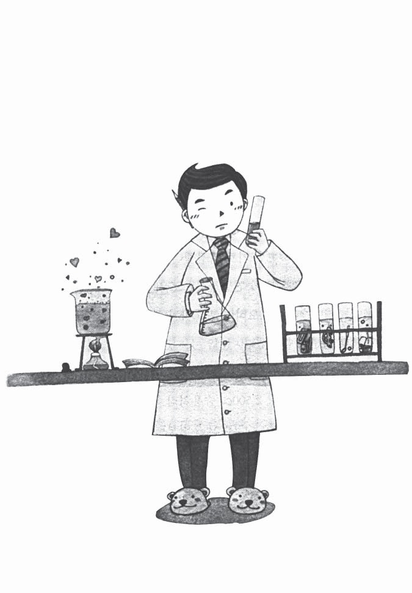

## Khi nào bạn cần phải chuẩn bị cho tuổi già của mình?

Tỉnh giấc, Kim Min Seok bắt đầu thở dốc. Anh thấy thật may mắn biết bao vì hình ảnh nhận phần cơm ở nhà dưỡng lão không phải là sự thật. Anh ngồi trước máy vi tính mà trong tai vẫn còn nghe đâu đó tiếng vợ anh hỏi sao anh lại tắm đến tận hai tiếng.

Ngay sau khi bật nút nguồn, một âm thanh nhỏ phát ra và máy bắt đầu khởi động. Tim anh vẫn còn đập thình thịch. Những hình ảnh trong giấc mơ vẫn còn hiển hiện rõ ràng trong đầu anh. Vẫn chưa hoàn toàn trở về với cảm giác thực tại, trong anh xen lẫn nhiều câu hỏi khác nhau.

“Nếu 10 năm sau mình bị mất việc thì sẽ thế nào? Liệu sau khi nghỉ việc rồi, mình có thể kiếm được tiền không?”

“Hiện tại, số tiền tiết kiệm hàng tháng chỉ có khoảng 600 nghìn won, nếu tiết kiệm sau 10 năm thì cũng chỉ là 72 triệu won, tính thêm cả tiền lãi là 86 triệu won… Nếu tiết kiệm 20 năm thì sẽ là 172 triệu, số tiền này có lẽ chưa đủ để lo cho tuổi già.”

“Không được. Bọn trẻ đang lớn dần, tiền học cũng tăng lên, vậy hàng tháng sẽ rất khó để có thể tiết kiệm được 600 nghìn won. Rồi mình lại phải sống chìm trong nợ nần do vay ngân hàng để bù trừ cho những khoản thâm hụt trong chi tiêu giống như Tiên ông đã chỉ ra cho mình.”

“Nhưng liệu giá nhà có giảm đến thế không?”

“Tiền trợ cấp hưu trí sẽ là bao nhiêu? Liệu số tiền đó có đảm bảo cuộc sống về già không?”

Ngay sau khi màn hình máy tính hiện lên, Kim Min Seok bắt đầu truy cập vào internet. Lúc đầu tuy hơi lưỡng lự chưa biết nên tìm kiếm thông tin gì, nhưng sau đó, anh quyết định sẽ tìm hiểu xem những người khác đã chuẩn bị tuổi già của họ như thế nào.

Sau khi đăng nhập vào trang chủ của Tổng cục Thống kê, anh hoàn toàn ngạc nhiên trước tài liệu mà mình nhìn thấy. Tài liệu của Tổng cục Thống kê cho thấy sự vô lo của người Hàn Quốc về vấn đề trù bị tuổi già so với người dân nước khác như thế nào.

**Trong số 10 người có 4 người không hề chuẩn bị trước cho tuổi già…** (Đơn vị: %)

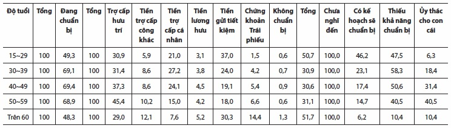

Nguồn: Công bố của Tổng cục thống kê, kết quả điều tra thống kê xã hội năm 2005 Nếu theo tài liệu của Tổng cục Thống kê Hàn Quốc năm 2005, cứ 10 người lại có 4 người không chuẩn bị gì cho tương lai về già của mình, trong số 6 người chuẩn bị cho tuổi già thì có 3 người phải phụ thuộc vào tiền trợ cấp lương hưu hoặc tiền nghỉ hưu. Kết quả là số người đang chuẩn bị cho tuổi già của mình mà không phụ thuộc vào tiền trợ cấp chỉ có 3 trên tổng số 10 người.

Trường hợp tuổi 50 là tuổi về hưu thì 3 trong số 10 người không chuẩn bị gì cho tuổi già của mình. Tệ hơn, dù số tiền trợ cấp hưu trí không nhiều do thời gian đóng ít, nhưng chỉ có 45% số người được hỏi coi tiền trợ cấp hưu trí quốc gia là cứu cánh của mình khi về già. Điều này khiến anh nghi ngờ liệu việc trù bị cho tuổi già có hiệu lực hay không?

Trường hợp tuổi về hưu trên 60 tuổi thì tình hình còn nghiêm trọng hơn, 5 trong số 10 người được điều tra đều không hề chuẩn bị gì cho tuổi già của mình, 30% trong số này nghĩ rằng con cái họ sẽ phụng dưỡng mình. Do vậy, đối với người già trên 60 tuổi thì họ gặp khó khăn về tài chính (45,6%) nhiều hơn so với các vấn đề về sức khỏe (27,1%).

Ngồi đọc các tài liệu, Kim Min Seok bắt đầu suy nghĩ một cách nghiêm túc.

“Vậy thì mình có đang chuẩn bị cho tuổi già của mình không?”

Anh thấy tim mình đập nhanh hơn với cảm giác sợ hãi đang lấn át. Anh luôn tự hào về căn nhà đẹp, chiếc xe hơi đắt tiền và cuộc sống hết sức sung túc, nhưng khi nào sẽ về hưu và sau khi về hưu thì anh cần bao nhiêu tiền để dưỡng già, anh chưa từng một lần suy nghĩ về điều đó. Hơn nữa, để có được số tiền đó thì hàng tháng anh cần phải tiết kiệm bao nhiêu và sử dụng số tiền đó như thế nào, anh cũng chưa từng nghĩ tới.

Anh không còn tâm trạng nào nữa. Mọi người không chuẩn bị cẩn thận cho tuổi già thì họ cũng không thể biết trước được tuổi già không có sự trù bị thì đáng sợ và bi thảm đến mức nào. Ngay cả chính bản thân anh, đến tận hôm qua vẫn còn nghĩ “không hiểu sẽ ra sao”.

“Liệu họ có biết không? Họ đang phạm tội coi thường tương lai của chính bản thân mình…”

Anh thử đọc các bài báo liên quan đến vấn đề tuổi già và tìm hiểu trang web tín dụng có nội dung tài chính cho tuổi già, anh thấy thật mông lung, không biết mình nên bắt đầu từ đâu.

Anh quyết định việc tính toán chi tiết sẽ làm sau, còn bây giờ anh sẽ tính xem mình sẽ sống thọ bao nhiêu tuổi.

Thử tìm kiếm tài liệu thống kế của Bộ Y tế cùng các bài báo có liên quan trên internet, anh thấy số liệu năm 2003 cho biết tuổi thọ trung bình của nam giới Hàn Quốc là 73,9, còn ở nữ giới là 80,8. Tuổi thọ này đã tăng lên ở nam là 1,8 tuổi, ở nữ là 1,3 tuổi so với ba năm trước đó. Nếu tốc độ lão hóa này tiếp tục xảy ra thì sau mấy chục năm, sẽ là thời đại mà chúng ta cần tính đến tuổi thọ trung bình là 100.

Tài liệu thống kê về y tế và phúc lợi do Bộ Y tế ban hành năm 2005 như sau:

**Bạn sẽ sống bao lâu?** (Đơn vị: Tuổi)

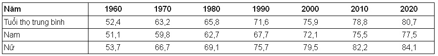

“Nếu xét theo xu hướng hiện tại thì sau 50 năm nữa ước tính tuổi thọ của nam khoảng 85, còn tuổi thọ của nữ là trên 90. Giả sử mình sống đến 85 tuổi thì sau này mình vẫn còn khoảng thời gian là 50 năm. Nhưng nữ giới thường có tuổi thọ cao hơn nam giới, vợ mình lại kém mình ba tuổi nên sau khi mình chết, vợ mình sẽ phải sống một mình. Nếu lập kế hoạch thì mình sẽ phải lưu tâm đến yếu tố này.”

“Nếu mình sống đến 85 tuổi thì vợ mình lúc đó sẽ 82 tuổi. Khi đó giả sử tuổi thọ trung bình của nữ giới cao hơn nam giới bảy tuổi thì vợ mình sẽ sống đến 92 tuổi. Nếu vậy, sau khi mình mất đi, vợ mình sẽ phải sống một mình 10 năm.”

Anh bắt đầu cảm thấy lo lắng với suy nghĩ rằng cuộc sống dài hơn so với những suy nghĩ thường ngày. Anh cũng chưa tưởng tượng được mình sẽ phải bỏ lại vợ mình sống một mình suốt 10 năm trời.

“Gần đây, tuổi nghỉ hưu của giám đốc các bộ phận thường vào khoảng từ 50 đến 55. Nếu mình nghỉ hưu lúc 55 tuổi thì sau này, mình sẽ làm việc thêm 20 năm nữa, sau đó hai vợ chồng mình sẽ sống thêm 30 tuổi và vợ mình sẽ sống thêm 10 năm một mình?”

Anh cảm thấy tim mình như nghẽn lại. 20 năm kiếm tiền và phải chuẩn bị cho 40 năm tuổi già, suy nghĩ ấy khiến anh cảm giác mình đang đứng trước một bức tường quá lớn. Ngay từ bây giờ, dù hàng tháng anh có tiết kiệm một triệu won thì trong 20 năm số tiền ấy cũng chỉ cho phép anh tiêu 600 nghìn won mỗi tháng khi về già. Hơn nữa, thực tế số tiền anh tiết kiệm hiện tại chỉ có 500 nghìn won mỗi tháng mà thôi. Nếu cộng cả hai số tiền đó lại thì cũng không phải là con số an toàn để anh có thể an hưởng tuổi già.

Anh nghĩ rằng mình phải lui thời gian nghỉ hưu lại. Vì vậy, sau khi nghỉ hưu tại công ty, anh sẽ phải kiếm một công việc khác và làm việc cho đến khi 60 tuổi, anh lấy con số 25 năm là thời gian làm việc còn lại của mình. Do đó, thời gian về già được giảm đi chỉ còn 35 năm (vợ chồng sống chung là 25 năm, vợ sống một mình 10 năm). Giả sử chi phí mà vợ anh sống một mình sau khi anh chết sẽ được giảm đi 50% và anh giả định lấy 30 năm là khoảng thời gian hai vợ chồng sống cùng nhau (25 năm + 10 năm x 25%) và quyết tâm lập ra kế hoạch tuổi già của mình.

Dường như anh sẽ phải chuẩn bị tài chính trong vòng 25 năm tới để sống cho 30 năm sau.

## Liệu tôi phải chuẩn bị bao nhiêu cho tuổi già của mình?

Anh bắt đầu lướt web tìm kiếm để tránh khỏi rơi vào lối suy nghĩ chán chường muốn bỏ những phiền muộn lại phía sau, nói chính xác hơn là tránh bị rơi vào cám dỗ của bản thân mình muốn che đi những vấn đề tuổi già mà anh không nhìn thấy đáp án. Anh băn khoăn không hiểu những người khác dự kiến khi nào họ về hưu, và họ chuẩn bị bao nhiêu cho tuổi già của mình.

Sau khi gõ từ “chuẩn bị tuổi già” vào mục tìm kiếm và nhấn chuột thì hàng loạt tài liệu liền hiện ra. Trong số các tài liệu này nếu theo một bài báo trên tờ Nhật báo Joson thì mọi người thường dự kiến tuổi về hưu là 60 tuổi và sẽ sống sau đó hơn 20 năm nữa. Ngoài ra, họ dự kiến trung bình khoảng 400 triệu won để chi phí cho tuổi già của mình.

“400 triệu won? Liệu với số tiền đó mình có thể sống an nhàn cùng vợ mình 30 năm tuổi già không?”

Kim Min Seok bắt đầu thử tính toán xem anh sẽ cần số tiền là bao nhiêu cho tuổi già của mình, sau khi giả định mình sẽ duy trì mức sống hiện tại.

“Nào… mình hãy thử tính các hạng mục lớn xem. Phí sinh hoạt của hai vợ chồng, nếu chỉ tính chi phí để sống một cách đơn thuần thì một triệu won một tháng là đủ chứ? Rồi tiền tiêu vặt của mỗi người, về già thì cũng không làm gì rồi nhưng nếu không làm gì khác thì cuộc sống chẳng có gì thú vị cả. Thỉnh thoảng vợ chồng cùng đi chơi gôn, rồi cùng bạn bè đi uống với nhau vài chén, còn phải cho cháu tiền tiêu vặt, tiền hiếu hỉ, tiền mua những đồ dùng cần thiết, một tháng ít ra cũng phải có 500 nghìn won chứ nhỉ? Vợ mình cũng cần khoảng 300 nghìn won.

À, còn tiền bảo dưỡng xe! Già rồi di chuyển khó khăn thì cũng cần xe chứ. Tiền xăng, tiền bảo hiểm… trung bình một tháng cũng cần khoảng 500 nghìn won. Còn gì nữa đây? Đúng rồi! Một năm ít ra cũng hai lần cùng vợ đi du lịch, rồi còn khám sức khỏe định kỳ ở bệnh viện nữa… Thế thì mình phải tính 500 nghìn won hàng tháng vào khoản chi phí khác mới được.

“Nếu vậy chi phí sinh hoạt cơ bản là một triệu won, tiền tiêu vặt của vợ chồng là 800 nghìn won, tiền bảo dưỡng xe 500 nghìn won, chi phí khác 500 nghìn won. Tính sơ sơ cũng thấy nếu muốn duy trì mức sống cơ bản thì mỗi tháng mình cần phải có 2,8 triệu won”.

Đương nhiên tuổi càng cao thì hoạt động cũng không như trước nữa, nên có thể giảm được các chi phí như tiền tiêu vặt hoặc tiền bảo dưỡng xe, nhưng đến lúc ấy lại phát sinh thêm tiền khám chữa bệnh và tiền trả cho y tá điều dưỡng nên anh đã thử tính chi phí cần hàng tháng là 2,8 triệu won mà không xét đến tuổi tác.

“Nếu mỗi tháng là 2,8 triệu won thì… một năm sẽ là 33,6 triệu won (2,8 triệu won x 12 tháng), nếu tính trong vòng 30 năm sẽ là 1,8 tỷ won (33,6 triệu won x 30 năm)?”

Anh trợn tròn mắt ngạc nhiên. Vì kết quả tính toán cho quỹ cần cho 30 năm tuổi già ra một con số quá lớn. Anh nghĩ chắc là ở đây có gì đó chưa đúng. Vì số tiền anh tính ra lại chênh lệch quá lớn so với 400 triệu won mà những người bình thường khác dự kiến. Anh thử tính đi tính lại mấy lần nữa trước kết quả mà chính bản thân anh cũng không thể tin được. Tuy nhiên, kết quả lại không có gì thay đổi.

1,8 tỷ won…, nếu muốn sống một tuổi già an nhàn như bản thân anh đã nghĩ thì anh sẽ cần tới 1,08 tỷ won từ thời điểm 60 tuổi khi anh sẽ nghỉ hưu.

Kim Min Seok bắt đầu thử tính xem chi phí cần thiết sẽ thay đổi như thế nào tùy thuộc vào sinh hoạt phí cần thiết từng tháng trong vòng 30 năm tuổi già.

**Căn cứ vào chi tiêu mỗi tháng tính toán ra khoản tiền cần**

**để duy trì cuộc sống khi về già:** (Đơn vị: 10.000 won)

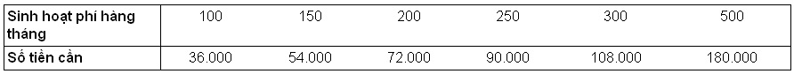

“Dù có giảm chi phí sinh hoạt khi già nhiều đến mức nào thì tối thiểu mỗi tháng chi phí sinh hoạt cũng cần là một triệu won, tiền tiêu vặt của vợ chồng là 400 nghìn won, chi phí bảo dưỡng xe là 300 nghìn won, chi phí khác là 300 nghìn won nữa. Nếu vậy thì một tháng cũng cần đến hai triệu won… Có giảm thế nào thì đến 60 tuổi mình cũng cần có khoảng 700 triệu won…”

Kim Min Seok bắt đầu cảm thấy khó chịu. 25 năm nữa là anh 60 tuổi, nói thật là anh không có đủ tự tin mình sẽ có được 720 triệu won. Nhưng anh cũng thử tính xem để có được khoản tiền 720 triệu won đó trong vòng 25 năm tới thì mỗi tháng anh cần phải tiết kiệm bao nhiêu.

Sau khi đăng nhập vào trang web lãi suất tiết kiệm của ngân hàng anh bắt đầu nhập dữ liệu vào các hạng mục cần thiết.

Số tiền mục tiêu: 720 triệu won, thời gian tiết kiệm: 25 năm, lãi suất hàng năm: 4%, phương pháp trả lãi: lãi đơn.

Sau khi kết thúc việc nhập dữ liệu thì trên màn hình bắt đầu hiện ra kết quả: 1.590.822,4 won. Số tiền gấp 2,5 lần so với số tiền mà hiện anh đang tiết kiệm. Nó cũng gần bằng một nửa số tiền lương mà anh nhận được sau khi đã trừ thuế.

Anh tự nhiên thở dài. Anh không thể ngờ rằng mình lại cần số tiền lớn như thế. Anh cũng tự cảm thấy quá thương hại cho bản thân mình.

Dù bạn có đóng tiền bảo hiểm xã hội đều đặn thì cũng đừng quá tin tưởng vào nó!

Như người mất hồn, Kim Min Seok bỗng nhiên nhớ tới khoản tiền bảo hiểm xã hội.

“Đúng rồi, mình vẫn còn khoản tiền bảo hiểm xã hội cơ mà. Mình đã đóng bảo hiểm xã hội kể từ khi bắt đầu đi làm, sau này mình sẽ tiếp tục đóng cho đến khi nghỉ hưu thì chắc chắn sẽ có khoản tiền lớn đây. Dù có nhiều người lo lắng rằng bảo hiểm xã hội sẽ bị cạn kiệt nhưng đấy là việc làm của chính phủ, không lẽ lại để xảy ra việc không thể trả nổi trợ cấp hưu trí cho người dân?”

Nếu nhận được tiền trợ cấp hưu trí sau khi về hưu thì số tiền cần thiết trù bị cho tuổi già sẽ giảm đáng kể. Nhưng anh ngạc nhiên trước thông tin rằng sau 65 tuổi mới được nhận trợ cấp hưu trí. Trước đó, lúc nào anh cũng nghĩ rằng đương nhiên anh sẽ nhận được trợ cấp hưu trí bắt đầu từ 60 tuổi. Nếu vậy bắt đầu từ năm 2013 thì cứ 5 năm, anh lại phải cộng thêm một tuổi, để đến sau năm 2033, sau khi anh 65 tuổi thì anh mới có thể nhận được tiền trợ cấp hưu trí(1).

Khi tính trên cơ sở tiền lương hiện tại, Kim Min Seok thấy rằng khoản tiền trợ cấp hưu trí dự kiến sẽ là 1,8 triệu won (tính theo giá trị hiện tại), tức là chỉ bằng 27% tiền lương trước thuế của anh. Dù không phải số tiền quá lớn so với mong đợi nhưng dù sao nó cũng là nguồn an ủi không nhỏ vì anh nghĩ với số tiền đó có thể cáng đáng được số tiền mà anh cần dùng hàng tháng khi về già. Tuy nhiên, nếu tiền trợ cấp hưu trí không được trả như mong đợi thì sao, anh bắt đầu cảm thấy bất an khi nghĩ về điều này.

Anh bắt đầu nhận ra sự thật rằng để bảo đảm cho cuộc sống về già cần có ba yếu tố: tiền trợ cấp hưu trí quốc gia, khoản trợ cấp tiền trợ cấp thất nghiệp, tiền tiết kiệm của cá nhân. Tiền trợ cấp hưu trí quốc gia có tính chất bảo đảm xã hội với mục đích đảm bảo sinh kế tối thiểu của tuổi già, tiền trợ cấp thất nghiệp của doanh nghiệp cần để đảm bảo đời sống tuổi già cơ bản, còn tiền tiết kiệm cá nhân là thứ cần thiết để đảm bảo một cuộc sống an nhàn, dư dả khi về già.

Đối với tương lai của tiền trợ cấp hưu trí quốc gia, phần lớn các bài báo đều chứa nội dung phủ định. Có bài báo nói rằng, nếu cứ giữ mức chi như hiện tại thì đến năm 2036 sẽ xảy ra hiện tượng thâm hụt công và đến năm 2047 các quỹ sẽ bị cạn kiệt. Vì vậy, nhiều bài báo có khuynh hướng nhấn mạnh rằng chúng ta đang đóng nhiều hơn nhưng sẽ nhận ít đi.

“Bài báo này có ý nói rằng thời điểm mình bắt đầu được hưởng trợ cấp hưu trí thì cũng là lúc xảy ra thâm hụt công. Nếu xảy ra thâm hụt công, thì chắc chắn sẽ không trả hết tiền trợ cấp? Có lẽ tỉ lệ chi trả sẽ giảm đi rất nhiều”.

Với tâm trạng khá cay đắng, anh băn khoăn mình sẽ nhận được bao nhiêu từ khoản trợ cấp hưu trí quốc gia, và anh bắt đầu lập kế hoạch trù bị cho tuổi già của mình với giả định chỉ nhận được 50% số tiền được hưởng dự kiến. Nếu chỉ biết trông đợi vào khoản trợ cấp hưu trí quốc gia, mà khi về già khoản trợ cấp thực tế khác so với dự kiến thì lúc đó làm thế nào. Đằng nào cũng lập kế hoạch thì hãy đảm bảo rằng kế hoạch đó sẽ an toàn.

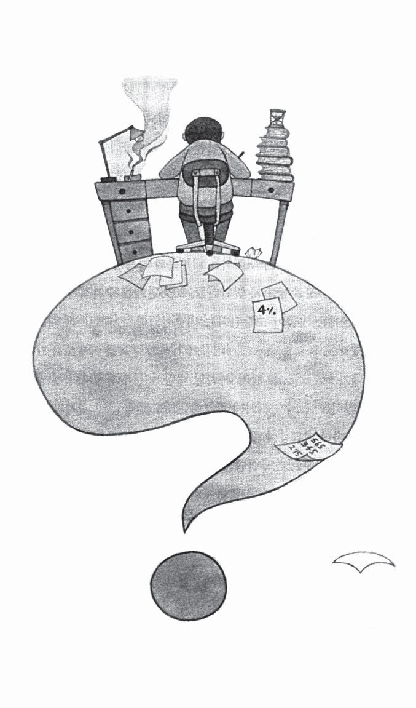

Nếu trừ khoản tiền 540 nghìn won - 50% số tiền sẽ được lĩnh dự kiến từ trợ cấp hưu trí quốc gia thì số tiền mà anh cần khi về già cho chi phí hàng tháng sẽ là 1,46 triệu won. Nếu anh giả sử mình cần khoảng 1,5 triệu won thì tổng số tiền 540 triệu won là khoản tiền anh cần cho tuổi già của mình. Mặc dù số tiền đó đã giảm so với khoản 720 triệu won, nhưng gánh nặng của hai khoản tiền này thì chẳng khác nhau là mấy. Hơn nữa, số tiền này chỉ là số tiền cho cuộc sống tuổi già tính một cách đơn giản, mà chưa xét tới các chi phí khác như tiền học, tiền cưới cho con cái.

**Nếu muốn vào trung tâm Tòa tháp bạc lấp lánh thì cần phải có bao nhiêu tiền?** Chìm vào suy nghĩ, anh lại nhớ đến khu dưỡng lão mà mình đã từng sống và Tòa tháp bạc lấp lánh trong giấc mơ của mình. Hình như anh đã từng đọc ở đâu đó bài báo nói rằng khu Tòa tháp bạc lấp lánh là trung tâm cư trú lý tưởng cho người già, ở đây có tất cả các dịch vụ tốt nhất như: ăn uống, vệ sinh, y tế và thể dục… Ngay sau khi gõ từ “Tòa tháp bạc lấp lánh” tại trang web tìm kiếm anh đã có thể tìm thấy mấy trang chủ có tên là Tòa tháp bạc lấp lánh. Số lượng địa chỉ hiện ra không nhiều so với kỳ vọng của anh, có lẽ do đây là mô hình mới. Dù sao thì bây giờ cũng có rất nhiều trung tâm như vậy đang được xây dựng hoặc đang được bán theo lô.

Anh bắt đầu thử tìm hiểu chi phí đăng ký trên trang chủ Tòa tháp bạc điển hình có vị trí tại Yong In, Bun Dang, Go Yang gần với Seoul trong số các trung tâm Tòa tháp bạc đang hoạt động trên toàn quốc. Nếu trường hợp thuê thì chi phí có chút khác biệt tùy theo điều kiện ngoại cảnh, nhưng vẫn phải đóng tiền đặt cọc từ 30 triệu đến 100 triệu won. Ngoài ra, tùy theo tiêu chuẩn thiết bị sẽ phải trả tiền thuê hàng tháng từ 500 nghìn won đến 5 triệu won, và sẽ trả lại tiền đặt cọc sau. Dù sao, nếu muốn vào ở tại một trung tâm Tòa tháp bạc ổn ổn với tiêu chuẩn hai người thì sẽ cần sinh hoạt phí là khoảng 2 triệu won/tháng cho số tiền đặt cọc 50 triệu đến 100 triệu won, và cần khoảng 1,2 triệu mỗi tháng cho số tiền đặt cọc từ 200-300 triệu.

**Chi phí vào ở tại trung tâm Tòa tháp bạc theo mô hình thuê**

**tại Su Do Kuan** (Đơn vị: 10.000 won)

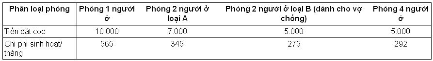

-Tiền đặt cọc sẽ không thay đổi trong thời gian cư trú và sẽ được hoàn trả lại khi rời đi.

-Chi phí sinh hoạt/ tháng đã bao gồm tiền ăn, tiền y tế, điều dưỡng viên, chi phí trị liệu và tiền dịch vụ các loại.

-Sinh hoạt phí/ tháng sẽ thay đổi tùy thuộc vào mức độ chăm sóc và lạm phát.

-Đồ dùng sinh hoạt cá nhân và chi phí điều trị (tiền khám, xét nghiệm, tiền thuốc) tính riêng.

Tiêu chuẩn trong bảng giá là dành cho một người, vậy nếu hai vợ chồng đều muốn sống ở đây thì tiền đặt cọc sẽ là 100 triệu won và tiền sinh hoạt phí hàng tháng sẽ là 5,5 triệu won. Trường hợp là trung tâm Tòa tháp bạc cao cấp thì về mặt ăn uống, cư trú, điều dưỡng và điều trị sẽ được phục vụ đầy đủ, chỉ cần trả thêm chi phí khác như tiền điều trị và xét nghiệm thì đây có thể coi là nơi sống hoàn hảo. Nhưng ngược lại, chi phí đókhông phải là tiêu chuẩn mà một người bình thường có thể đáp ứng được.

“Nếu chẳng may có mù quáng mà vào ở một trung tâm Tòa tháp bạc nào đó thì vẫn có thể xin ra ngoài được”.

Chi phí vào ở tại trung tâm Tòa tháp bạc quá nhiều so với những gì anh từng dự kiến. Nếu tính gộp cả tiền đặt cọc và tiền sinh hoạt phí thì nó không khác nhiều so với số tiền mà anh phải trù bị cho tuổi già của mình. Nhưng ngược lại, tại trung tâm Tòa tháp bạc có trang bị tất cả các loại dịch vụ và trang thiết bị đa dạng đáp ứng nhu cầu sinh hoạt và giải trí của người cao tuổi, bao gồm cả việc hỗ trợ về y tế. Nếu khi cả hai vợ chồng đều cao tuổi, đi lại khó khăn thì việc sống ở trung tâm như thế này sẽ rất tốt.

“Khi còn khỏe, vợ chồng mình sống tiết kiệm ở một căn hộ chung cư nhỏ, sau này, khi nào sức khỏe yếu thì chuyển đến sống tại trung tâm Tòa tháp bạc nào đó có vị trí thuận lợi. Điều này đỡ gánh nặng cho con cái mà mình cũng được sống thoải mái”.

Lúc này, anh nghe tiếng gõ cửa. “Bố ơi, con Ha-Ưn vào có được không ạ?”, anh nghe giọng con gái lớn vọng vào. Sau khi cánh cửa mở ra, là hình ảnh con gái anh hai tay đang cầm đĩa hoa quả với nụ cười rạng rỡ.

“Ha-Ưn của bố mang cái này vào cho bố cơ à? Cám ơn con. Bố sẽ ăn thật ngon. Mà cũng hơn 11 giờ rồi, con gái của bố vẫn chưa ngủ à?”

“Bố ru con ngủ đi.”

Cả hai vợ chồng đều đi làm kiếm tiền, về nhà thường rất muộn nên thời gian ngủ của con gái anh cũng thường là ngoài 11 giờ. Dù nghĩ rằng cần phải thay đổi thói quen đi ngủ của con gái, nhưng mỗi lần nhìn con mong mỏi có thời gian trò chuyện cùng bố mẹ thì anh lại không nỡ ép con.

Anh đọc hai cuốn truyện cổ tích cho con gái nghe rồi đi ra ngoài thì thấy vợ anh đã nằm ngủ trong khi đang nghe nhạc. Anh kéo chăn đắp cho vợ, anh bỗng nhận ra bụng vợ mình đã rất to. Chỉ sau ba tháng nữa thôi là đứa con thứ hai của anh sẽ ra đời.

“Con trai à, con hãy sinh ra thật khỏe mạnh nhé. Việc còn lại, bố sẽ lo hết”.

## Hãy kiểm tra các khoản tiền tiết kiệm có mục đích

Kim Min Seok lấy một lon bia và lạc từ trong tủ lạnh ra, ngồi vào bàn ăn. Những lúc căng thẳng và buồn bực thì không gì có thể sánh nổi với một cốc bia mát lạnh.

Sau khi hớp một ngụm bia thì anh chợt nghĩ tới thành phố Toronto của Canada mà anh đã đi về từ mùa hè năm ngoái. Vợ chồng anh ở Canada một tuần vừa đi du lịch, vừa để thăm người bác đã sang đây định cư được 15 năm. Nghe nói bác anh đang chăm sóc một vườn hoa lớn, dù đã ngoài 60 tuổi nhưng vẫn hai ngày một lần ra chợ hoa vào sáng sớm để mua bán hoa. Nếu vậy, những người dân Canada bình thường thì sao? Anh băn khoăn không biết những người Canada khác có làm việc chăm chỉ cho đến khi cao tuổi như ông bác của mình hay không.

“Ở Canada đa phần cả hai vợ chồng đều đi làm kiếm tiền, 30-40% tiền lương của họ được nộp vào thuế hoặc bảo hiểm. Như vậy, số tiền mà họ phải nộp khá nhiều. Thu nhập còn lại sau khi trừ thuế thì phần lớn được họ tiêu dùng. Dù hàng tháng họ có dành dụm bao nhiêu đi nữa thì họ cũng sẽ tiêu sạch vào các kỳ nghỉ hè hoặc nghỉ đông hàng năm. Ngay cả tôi, lúc đầu cũng không hiểu tại sao: “Những người này sao lại thế nhỉ?”, nhưng giờ tôi mới biết họ có lý do làm vậy. Sau khi nghỉ hưu, ngoài việc chính phủ sẽ chu cấp cho họ một khoản chi phí đủ dùng cho cuộc sống, họ còn được hưởng chính sách hỗ trợ toàn phần đối với dịch vụ y tế. Người dân Canada, khi còn trẻ họ phải đóng góp các khoản thuế, tiền bảo hiểm và chi phí bảo hiểm xã hội rất cao, nhưng bù lại họ được quyền sống một cách an nhàn khi về già”.

Kim Min Seok thấy hơi ghen tị với những người dân Canada. Rồi anh chợt nhận ra rằng, ngoài chi phí lo cho bản thân mình thì anh cần phải tính thêm các khoản tiền liên quan đến con cái nữa. Dường như anh quên mất khoản tiền tiết kiệm có mục đích mà Tiên ông từng nói với anh. Đến giờ anh mới chỉ tính số tiền tuổi già một cách đơn giản mà không xét tới các chi phí khác.

Uống hết lon bia, anh lại bắt đầu ngồi trước máy vi tính. Anh quyết định sẽ tính xem thu nhập và các khoản chi tiêu của anh trong vòng 25 năm tới. Anh không tính riêng vì anh đã giả định tỷ lệ tăng lương và lạm phát (giá cả tăng) là như nhau. Đương nhiên, dù vật giá có tăng thì các khoản chi tiêu không thay đổi (hoàn trả khoản vay, tiền bảo hiểm) nhưng cũng sẽ ảnh hưởng tới các khoản chi tiêu dự kiến phát sinh trong tương lai như tiền học phí cho con. Nhưng anh quyết định sẽ tạm thời tính đơn giản và bỏ qua các yếu tố đó.

Trước hết, sau khi dự kiến thu nhập trong vòng 25 năm tới, anh tính ra được một khoản tiền trị giá là 1 tỷ 190 triệu won. Vợ anh sau khi sinh con thứ hai sẽ đi làm thêm 5 năm và khi đứa con thứ hai vào học mẫu giáo chị cũng có ý định nghỉ ở nhà.

**Thu nhập của gia đình sẽ là bao nhiêu cho đến thời điểm**

**nghỉ hưu?** (Đơn vị: 10.000 won)

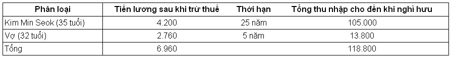

Thực ra, anh cũng không có đủ tự tin sẽ tiếp tục làm việc ở công ty cho đến khi 60 tuổi, nhưng dù sao, hãy thử tính tổng thu nhập sau khi giả thuyết rằng mình sẽ làm việc tới 60 tuổi theo mục tiêu ban đầu đề ra. Anh có thể tính đơn giản thu nhập của mình trong vòng 25 năm tới, nhưng việc dự kiến các khoản chi tiêu thì phức tạp hơn rất nhiều. Vì không có sổ ghi chi tiêu trong gia đình mà cũng không có giấy tờ gì khác nên anh bắt đầu tính số tiền cần chi sau khi nhớ lại những gì anh đã nói với vợ trước đó. Anh tính tiền nuôi con và tiền học riêng. Trước hết, anh thử tính riêng chi phí trong cuộc sống hàng ngày. Chi phí sinh hoạt cơ bản hàng tháng là 900 nghìn won, tiền tiêu vặt của hai vợ chồng là 500 nghìn won, tiền trả lãi vay thế chấp nhà là 600 nghìn won/tháng (thời gian còn lại là 18 năm), tiền bảo hiểm 200 nghìn won/tháng, tiền trả góp xe hàng tháng là 600 nghìn won (thời gian còn lại là 3 tháng), chi phí bảo dưỡng xe hàng tháng 400 nghìn won, chi phí khác 200 nghìn won/tháng… thì hàng tháng khoản tiền chi tiêu sẽ là 4,180 triệu won, tương ứng một năm là 50,160 triệu won. Đây là số tiền lớn hơn so với anh nghĩ khá nhiều. Thật may, thời hạn trả góp xe chỉ còn lại 3 tháng, nên sau đó, số tiền chi tiêu hàng năm sẽ giảm xuống còn 42,960 triệu won. Nếu tính như thế này thì tổng số tiền chi tiêu trong vòng 25 năm tới của anh sẽ lên đến 1 tỷ 75 triệu 800 nghìn won.

Ngoài ra, còn tiền nuôi con và tiền học, hàng tháng tiền học phí lớp mẫu giáo tiếng Anh cho con lớn là 500 nghìn won, tiền gửi trẻ con thứ hai là 500 nghìn won… vậy hàng tháng sẽ cần khoảng một triệu won. Chi phí nuôi dạy và đào tạo cần thiết cho đến khi con thứ hai của anh vào được đại học sẽ là 2 tỷ 792 triệu won.

**Tiền gửi trẻ và tiền học phí cho con mất bao nhiêu?** (Đơn vị: 10.000 won)

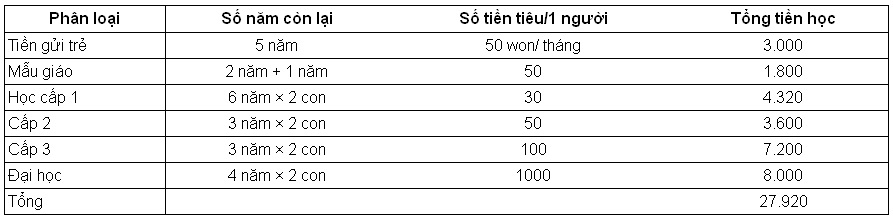

Anh không thể không giật mình ngạc nhiên khi tính đến khoản tiền sẽ chi ra trong tương lai. Tổng chi phí cần thiết trong vòng 25 năm tới sẽ là 1,355 tỷ won. Số tiền này nhiều hơn khoảng 167 triệu won so với thu nhập của gia đình anh trong vòng 25 năm tới. Hơn nữa, khoản tiền này còn chưa tính đến tiền đám cưới cho hai đứa con của anh. Giả sử tính như thời điểm hiện tại, nếu con cái kết hôn thì bố mẹ cũng phải lo cho con khoản tiền đặt cọc thuê nhà hàng năm, vậy sau 20 năm nữa có lẽ anh phải bán cả căn nhà đang ở để lo khoản tiền cho con mình.

Rốt cuộc, nếu tình trạng này kéo dài thì cũng sẽ có ngày anh lâm vào cảnh phải bán nhà, vay vốn ngân hàng để chi tiêu giống như những gì mà Tiên ông đã chỉ cho anh trong giấc mơ, và vợ chồng anh không còn cách nào khác phải trông cậy vào con cái. Và biết đâu vợ chồng anh cùng phải vào sống ở trung tâm dưỡng lão của Chính phủ giống như trong giấc mơ vậy.

Một lần nữa, Kim Min Seok lại hối hận vì mình đã sống không có kế hoạch trong thời gian qua. Trong số đám bạn cùng lứa, anh là người phất lên nhất, thăng tiến nhanh, mua nhà nhanh. Nhưng thực ra đến giờ anh mới thấm thía rằng mình ã sống không có bất cứ một hoạch định gì cho bản thân và gia đình mình.

Dù thời trẻ có vất vả và sống khó khăn, nhưng sau 60 tuổi có thể tận hưởng cuộc sống an nhàn như những người Canada thì việc thử tính toán cụ thể số tiền kiếm được và số tiền sẽ tiêu trong tương lai càng khiến cho trí não anh rối bời vì không biết nên chuẩn bị cho tuổi già như thế nào.

“Nếu vậy, bây giờ mình cần phải làm gì?”

Kim Min Seok cảm thấy toàn thân mình như không còn chút sức lực nào với tâm trạng nặng nề.

Đúng lúc này máy tính anh phát ra tiếng “Buzz”, góc phải màn hình nhấp nháy thông báo nickname “Lợn con” đang online. Đây là nickname trên mạng của một người bạn của anh.

Min Seok cũng online với nickname “Bố của Ha-ưn.”

Lợn con: Quá 12 giờ rồi mà sao chưa ngủ?

Bố của Ha-Ưn: Thế còn cậu?

Lợn con: Ngày mai có thời gian không?

Bố của Ha-Ưn: Ngày mai, bạn mình đang rủ đi leo núi Bắc Hàn.

Lợn con: Ai?

Bố của Ha-Ưn: Hai người bạn học đại học Lợn con: Hay đấy. Cùng đi hóng gió xem sao.

Bố của Ha-Ưn: Vậy mai 9 giờ có mặt ở cửa vào núi Bắc Hàn nhé. Ngủ ngon. Mai gặp lại.

Lợn con: Ok. Hãy mơ về mình nhé.

Bố của Ha-Ưn:

Kim Min Soek tắt máy tính rồi đi vào phòng ngủ. Khi nhìn vợ ngủ ngáy do quá mệt mỏi, bỗng nhiên anh có cảm giác có lỗi với vợ, anh nghĩ tại sao vợ mình lại không thể thoải mái hưởng thụ cuộc sống khi còn trẻ. Đột nhiên, hình ảnh khuôn mặt của người chủ hôn với câu nói: “Hai con hãy sống hạnh phúc đến đầu bạc răng long” lại hiện lên trong đầu anh.

“Mình muốn về già hai vợ chồng mình sẽ được sống vui vẻ…”

“Mình vất vả ở công ty cũng chỉ vì bản thân và gia đình của mình…”

Kim Min Seok nhẹ nhàng nằm cạnh vợ và ngủ thiếp đi.

## Năm giai đoạn của tuổi già

Một buổi sáng thứ Bảy thoải mái. Bỏ ngoài tai lời nói giận dỗi của vợ, Kim Min Seok lái chiếc xe hạng trung 2.500cc mà anh coi như báu vật của mình chạy đến núi Bắc Hàn.

Núi Bắc Hàn chìm trong ánh nắng ấm ấp của mùa xuân, những lộc non đang đâm ra tua tủa, và những bông hoa nở rộ đón mùa xuân mới khiến cho khung cảnh ở đây thật đẹp.

Tại lối vào, Joeng Soon Jin chào hỏi người đồng hành và bắt đầu chuyến leo núi. Joeng Soon Jin vượt lên trước trò chuyện vui vẻ với anh bạn Park đang làm PB (Private Bank) ở ngân hàng, bỏ lại Kim Min Seok ở phía sau.

“Tôi nghe nói anh làm PB ở ngân hàng?”

“Vâng. Anh có thể tạm hiểu là nhân viên quản lý tài sản tổng hợp của khách hàng VIP, có thể đó là công việc đơn giản nhất thì phải.”

“Nếu vậy, chắc anh cũng đã tư vấn cho khách hàng về việc trù bị cho tuổi già?”

“Đương nhiên rồi. Vì phần lớn khách hàng đều là khách VIP nên chủ yếu tôi tư vấn cho họ về chiến lược quản lý tài sản do họ sở hữu đủ tài chính để an hưởng tuổi già rồi, nhưng đôi khi cũng phải tư vấn cho họ về chiến lược, quy trình và kế hoạch chuẩn bị cho tuổi già nữa. Tại sao vậy, anh muốn tìm hiểu gì à?”

“Có lẽ tôi phải bắt đầu trù bị cho tuổi già của mình… Nhưng tôi chưa biết mình cần phải chuẩn bị bao nhiêu và cần làm gì để kiếm được số tiền đó. Số tiền tôi tiết kiệm hàng tháng thì không nhiều, trong khi đó số tiền cần cho tuổi già cũng không phải ít.”

“Nếu anh mặc nhiên suy nghĩ thì cái gọi là chuẩn bị cho tuổi già sẽ rất mơ hồ. Thực ra có rất nhiều điều tôi có thể nói với anh về cái gọi là chuẩn bị cho tuổi già. Hôm nay, tôi sẽ giải thích cho anh những bước cơ bản để chuẩn bị cho tuổi già, anh hãy thử làm theo một lần xem sao.”

Park vuốt nhẹ đầu đứa bé đi bên cạnh rồi nói tiếp:

“Trước hết, anh hãy kiểm kê chính xác tài sản ròng hiện tại. Các khách hàng VIP của tôi dù có rất nhiều tài sản nhưng họ vẫn muốn biết chính xác hiện trạng tài sản của mình. Đối với bản thân tôi, cứ sáu tháng tôi lại cập nhật bảng cân đối kế toán của cuộc đời mình, trong đó có ghi ra các tài sản ròng. Thực tế thì tài sản của tôi cũng không nhiều đến mức đó, nhưng cũng có lý do tại sao cứ sáu tháng một lần tôi lại lập bảng cân đối. Lý do hết sức đơn giản, đó là tôi muốn tự mình đánh giá và tự kích thích bản thân mình. Có như vậy, tôi mới biết cách chi tiêu sao cho tiết kiệm hơn và sẽ tích cực hơn trong việc gửi tiền có mục đích. Anh Min Seok đã thử lập bảng cân đối kế toán bao giờ chưa?”

“…”

Anh bàng hoàng trước câu hỏi của Park. Từ trước đến nay anh chỉ mường tượng trong đầu tài sản, khoản nợ của mình thôi, anh chưa bao giờ ghi chi tiết các khoản đó ra trên giấy.

Park lấy miếng sô-cô-la trong túi ra, bẻ làm bốn và chia cho mỗi người bạn đồng hành một miếng và tiếp tục câu chuyện.

“Bước tiếp theo, sau khi đã tính toán các khoản thu và chi hàng tháng, mọi người hãy thử tính xem quy mô tiết kiệm của mình có thể làm được hàng năm là bao nhiêu. Đa phần nhân viên văn phòng đều biết rất rõ khoản thu nhập từ tiền lương của mình, nhưng có nhiều trường hợp lại không biết được các khoản chi của mình là bao nhiêu. Thế nên khi nhận được hóa đơn thanh toán cho khoản tiền sử dụng bằng thẻ tín dụng, ai cũng hoảng hốt. Dường như số tiền mọi người tiêu rất ít, nhưng nếu gộp cả một tháng lại thì số tiền đó sẽ lớn hơn so với suy nghĩ của chúng ta.”

“Vâng, đúng vậy. Các khoản chi phí thanh toán bằng thẻ hầu như đều không phải là khoản nhỏ và cũng thường vượt quá con số dự kiến…”

Kim Min Seok nhớ mình đã từng kiểm tra lại các khoản trong kê khai thanh toán bằng thẻ tín dụng cùng với vợ do thấy khoản yêu cầu thanh toán quá nhiều so với suy nghĩ.

“Do đó, đa phần các khách VIP đều không tùy tiện dùng thẻ tín dụng. Do sử dụng thẻ tín dụng sẽ rất khó kiểm soát chi tiêu nên họ thường dùng tiền mặt để thanh toán trong những trường hợp cần thiết.

Park tiếp tục với câu chuyện đang dang dở:

“Khi kiểm tra lại số tiền mà chúng ta có khả năng tiết kiệm thì có hai điểm quan trọng. Thứ nhất là khả năng kiểm soát chi tiêu hợp lý. Thứ hai là phải cố gắng nâng cao thu nhập. Ngoài ra, khi tính toán khoản chi cần thiết trong tương lai, chúng ta không chỉ tính các khoản chi ngay hiện tại, mà còn tính các chi phí dự kiến đến khi nghỉ hưu sau này. Hàng tháng, chắc chắn ngoài chi phí sinh hoạt, còn phải dự tính tiền học cho con cái, tiền kết hôn cho con, chi phí y tế vì chúng ta cũng không biết được sẽ cần phải dùng khi nào.”

Kim Min Seok nhớ lại cảm giác tuyệt vọng của mình tối qua khi anh thử tính xem tổng thu nhập và tổng chi của mình 25 năm sau.

“Các bạn hãy coi gia đình là mô hình một doanh nghiệp thu nhỏ. Min Soek ạ, anh sẽ là giám đốc điều hành, còn vợ anh sẽ là giám đốc tài chính hoặc là giám đốc quản lý. Nếu công ty bị thua lỗ, ngày càng giảm sút thì sẽ gây ra hiện tượng mất tính thanh khoản. Gia đình cũng vậy. Trước hết, mọi người phải điều chỉnh cấu trúc tài chính của gia đình mình thì mới có thể nghĩ đến việc phát triển kinh tế gia đình. Các bạn phải kiểm tra lại tình hình tài chính gia đình và điều chỉnh lại cấu trúc này nếu cần. Hãy giảm bớt các khoản chi tiêu không cần thiết, dám bán đi các tài sản làm phát sinh chi phí, và chỉ giữ lại các tài sản mang lại lợi ích. Nếu tiền bỗng nhiên bị bay đi đâu mất giống như kiểu gió vào nhà trống thì dù thu nhập có cao đến mấy bạn cũng vẫn thấy thiếu tiền. Ngoài ra, việc điều chỉnh cấu trúc tài chính trong gia đình, đây là việc mà anh Min Seok không tự làm được, anh hãy thảo luận cùng với vợ mình về vấn đề này.”

Khi nghe đến việc nếu không điều chỉnh cơ cấu thì sẽ dẫn đến tình trạng vỡ nợ, anh lại chợt nghĩ đến cuộc khủng hoảng tài chính những năm 1997. Tác động của nó lan tới cả công ty lớn mà anh đang làm, nên họ đã thực hiện chính sách cắt giảm 20% nhân sự. Mới nghĩ thế thôi mà anh đã thấy lạnh hết cả sống lưng. Nhưng anh thấy hơi lạ với câu nói hãy nâng cao thu nhập hàng tháng của Park. Do là thời kỳ cạnh tranh về lương nên khoản lương anh nhận được là một khoản cố định, vậy thì ý của Park là gì? Hay anh ấy bảo mình cần phải làm “tay trái” nữa?”

Nhìn vẻ mặt hoài nghi của Min Soek, Park nói tiếp:

“Với những người làm công ăn lương như chúng ta thì phương pháp tăng thu nhập hàng tháng là ưu tiên hàng đầu. Để làm được điều này thì nỗ lực làm việc chăm chỉ, thành thật trong công ty thôi vẫn chưa đủ, mà cần phải cố gắng trong việc phát triển năng lực của bản thân. Nếu để ý, đôi khi anh sẽ thấy mình bị mất cơ hội thăng tiến hoặc bỏ đi cơ hội nhảy sang một vị trí khác tốt hơn chỉ vì khả năng tiếng Anh chưa đáp ứng được so với yêu cầu đúng không? Phải có năng lực thì mới có thể nâng cao tiền lương. Câu chuyện của những nhân viên có thu nhập hàng trăm triệu hoặc mấy trăm triệu không phải là việc của những người khác. Tuy nhiên, đó cũng là câu chuyện về những người xung quanh ta. Không phải lạ sao khi hầu hết mọi người đều mong muốn giàu có nhưng không phải là thông qua công việc mà qua các việc quản lý đầu tư?”

Kim Min Soek sau khi nghe xong những lời nói của Park nghĩ rằng “không hiểu từ trước đến giờ mình đã làm gì để phát triển năng lực bản thân”. Ở công ty, do được đánh giá cao nên anh thăng tiến nhanh hơn so với các bạn đồng khóa, nhưng trên thực tế công việc anh làm lại không phải là một lĩnh vực chuyên môn đặc biệt gì. Dù đã làm việc ở công ty được chín năm, nhưng trình độ tiếng Anh của anh chỉ ở mức giao tiếp cơ bản, chứ khả năng lãnh đạo, kiến thức về công việc, tất cả những khía cạnh đó bản thân anh vẫn chưa đáp ứng được.

Càng leo lên đến gần đỉnh núi thì dốc càng dựng đứng, Park nín thở rồi lại tiếp tục câu chuyện đang nói:

“Giai đoạn tiếp theo là anh hãy thử giả sử thâm niên làm việc của mình. Phải giả sử như vậy thì anh mới có thể biết được khoản tiền mà mình sẽ kiếm được cho đến khi về hưu phải không? Sau đó, anh hãy thử nghĩ rằng mình cần chuẩn bị bao nhiêu thì khi già mình mới có thể sống một cách an nhàn, vô lo vô nghĩ. Nếu muốn sống xa xỉ thì mỗi tháng 10 triệu won vẫn thiếu, nhưng nếu ta sống tiết kiệm, hợp lý thì mỗi tháng chỉ cần có một triệu won là đủ. Còn trong trường hợp của tôi, mỗi tháng chỉ cần khoảng ba triệu won là ổn rồi.”

Park nắm lấy cành cây ven đường, cẩn thận trèo lên phía trên mỏm đá dựng đứng, anh ngừng nói một lúc. Nhìn qua mỏm đá phía xa kia, trên đỉnh núi nhiều người đã tụ tập ở đó. Những bộ quần áo leo núi đầy màu sắc khiến cho cả dãy núi giống như một ngọn núi vào thu, ngập tràn lá phong.

“Giai đoạn cuối cùng và cũng là bước quan trọng nhất đó là việc chăm chỉ thực hiện đầu tư. Sau này khi anh kiểm tra cẩn thận thì anh sẽ nhận ra điều đó, nhưng đối với những người làm công ăn lương bình thường thì thật khó để lo tiền mua nhà, tiền cưới xin cho con, rồi tiền dưỡng già. Đặc biệt, trong thời đại lãi suất thấp mà chỉ cần tiết kiệm thôi sẽ thật khó để đuổi kịp với mức tăng của giá cả. Vì vậy, việc tìm kiếm một biện pháp đầu tư để có thể thu lợi thường xuyên lớn gấp hai lần tỉ lệ lãi suất của tiền gửi tiết kiệm dài hạn tối thiểu. Tất nhiên, những nhân viên PB như tôi đang giúp đỡ mọi người trong vấn đề này.”

Trên đường xuống núi, Kim Min Seok nghĩ lại các bước chuẩn bị cho tuổi già mà Park đã giải thích cho anh.

Tìm hiểu tài sản ròng hiện tại

Tìm hiểu chi tiêu hàng tháng Giả định thời gian mình làm việc

Lựa chọn tiêu chuẩn cuộc sống tuổi già mong muốn Tiến hành đầu tư thường xuyên để chuẩn bị cho tuổi già Những gì anh làm tối qua là một phần nhỏ so với lời giải thích của Park, nhưng anh quyết định sẽ kiểm tra lại cụ thể hơn theo những hướng dẫn này.

## Tài sản hiện tại tôi có là bao nhiêu?

Sau khi leo núi xong, cả bốn người cùng uống rượu gạo, ăn đậu phụ rồi tạt vào một nhà tắm hơi gần đó và ngủ một lát. Trên đường về nhà, Kim Min Seok bất chợt nhìn thấy những căn hộ cao cấp lần lượt hiện ra như hình ảnh trong một bộ phim nước ngoài, Kim Min Seok ước giá sau này mình được ở trong một căn nhà như thế.

Ngay khi lái xe về nhà Min Soek bắt tay ngay vào việc tìm hiểu tình hình tài sản và các khoản nợ hiện tại của mình. Tài sản hiện tại mà anh có là: ngôi nhà rộng 100 m mà anh mua được hai năm trước, một chiếc xe hơi mà anh tậu ba năm về trước, một sổ tiết kiệm 7,5 triệu won (hàng tháng anh gửi 500 nghìn won), và khoảng 2 triệu won mà anh gửi vào sổ tiết kiệm thông thường làm quỹ dự phòng. Đó là toàn bộ những gì anh có. Còn về phần nợ, anh vẫn còn nợ ngân hàng 200 triệu won do vay tiền khi mua căn nhà đang ở.

Anh tiếp tục vào trang web bất động sản để tìm hiểu xem căn nhà hiện tại của mình theo giá thị trường sẽ là bao nhiêu. Sau khi tìm hiểu mức giá hiện tại thì giá thấp nhất là 360 triệu won, còn giá cao nhất là 430 triệu won. Mức chênh lệch quá lớn.

Anh gọi điện trực tiếp đến trung tâm bất động sản trong khu vực để hỏi xem giá thị trường bây giờ là bao nhiêu.

“Hiện nay, một căn hộ chung cư rộng 100 m giá là bao nhiêu vậy?”

“Anh ở khu nào, nhà ở tầng mấy?”

“Phòng 107, tầng 5.”

“Dạo này không có khách nên bán cũng khó, nhưng tôi nghĩ là khoảng 380 triệu won là bán được, tôi sẽ thử tìm người mua.”

“Anh nói là 380 triệu? Hai năm trước, giá căn nhà đó là 400 triệu, tính cả tiền thuế trước bạ, tiền đăng ký, tiền hoa hồng cho người môi giới, tiền sửa chữa… gộp lại cũng lên đến 200 triệu won. Vậy mà bây giờ anh nói chỉ được có 380 triệu won ư?”

Kim Min Seok không thể tin được vào cái giá mà anh vừa nghe. Anh nghĩ rằng nếu mua nhà thì ít nhất cũng sẽ không bị hạ giá đến mức thê thảm như vậy. Thế nhưng mới ở được hai năm mà giá nhà đã giảm hơn 5%... dù chính sách do chính phủ ban hành có mạnh đến đâu thì căn hộ anh đang ở cũng không phải ở khu Kangnam, cũng không phải là căn hộ lớn nên anh không tài nào hiểu nổi sao giá nhà lại giảm mạnh đến thế.

Nếu như theo lời giải thích của chuyên gia môi giới bất động sản với chính sách bất động sản của chính phủ thì bắt đầu từ năm 2007 một hộ gia đình sở hữu hai căn nhà khi bán một căn đi thì sẽ phải trả mức thuế thu nhập chuyển nhượng rất cao đến 50%. Do đó, nếu không phải là bất động sản có điều kiện tốt thì sẽ không có mấy ai mua, mặt khác những ai có hai căn nhà trở lên lại có xu hướng ưu tiên bán bớt một căn tại vị trí không thuận lợi lắm.

“Nếu vậy, căn nhà của mình ở vị trí không thuận lợi à?”

Nếu bán căn nhà đang ở với giá 380 triệu thì sau khi trả khoản vay ngân hàng anh chỉ còn lại 180 triệu trong tay, nghĩ vậy, anh cảm thấy giá cả thật bèo bọt. Hai năm trước đây, lúc mua căn nhà này, dù không phải là khu Kangnam nhưng cứ nghĩ đến việc một người còn trẻ mà mua được căn hộ chung cư 100 m ở Seoul là sẽ phất lên nhanh lắm. Tiền đặt cọc hàng năm của căn hộ chung cư 100 m thuộc khu Kangnam của một người bạn đại học đã tổ chức ăn mừng tân gia hai tuần trước là 200 triệu won, nếu tính theo giá bây giờ thì căn nhà của anh còn không bằng tiền đặt cọc ở căn hộ chung cư Kangnam.

Kim Min Seok muốn biết xem giá của chiếc xe hạng trung mà anh đang lái giá bao nhiêu. Tâm trạng anh càng tồi tệ hơn khi anh ghé vào trang web mua bán xe cũ.

“Một chiếc xe lúc đầu mua 27 triệu won, dùng chưa đầy ba năm mà chỉ còn có 16 triệu won ư?”

Tự bản thân anh muốn biết xem liệu chiếc xe của mình có được khoảng 16 triệu won hay không, anh quyết định gọi điện cho một người môi giới xe cũ trên internet để hỏi giá. Đáp án là 17 triệu won… Mặc dù giá này đã đắt hơn một triệu won so với giá trên trang web, nhưng hình như giá của chiếc xe đã giảm mất 10 triệu won so với ban đầu. Rốt cuộc trong vòng hai năm, chín tháng thì mỗi tháng anh lại nộp vào quỹ không một số tiền là 300 nghìn won. Nếu theo giải thích của người mua bán xe cũ, giá xe sau khi được hai, ba năm sẽ bắt đầu rớt mạnh, đối với loại xe đã qua 5 năm thì giảm chỉ còn chưa đầy 50% giá trị ban đầu”.

**Hiện trạng tài sản và các khoản nợ của Kim Min Seok** (Đơn vị: 10.000 won)

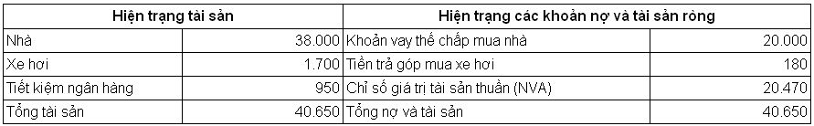

Là một người đam mê xe hơi, nhưng ngay cả khi mua xe anh cũng không thể nghĩ được rằng giá xe lại giảm mạnh như vậy. Khi anh đổi xe mới để kỉ niệm sự kiện được thăng chức làm trưởng phòng, bố anh đã từng nhắc anh mua xe không phải là đầu tư mà chỉ là một hình thức tiêu tiền nên chỉ cần mua loại xe cỡ nhỏ là được. Anh chợt nhớ ra câu nói ấy. Anh bắt đầu kiểm kê tài sản và các khoản nợ của mình.

Kết quả tổng hợp cho thấy tài sản thuần của anh hiện có là 204 triệu 700 nghìn won. Nếu không trừ đi số tiền bố mẹ anh hỗ trợ cho đám cưới bảy năm về trước là 50 triệu won tiền đặt cọc nhà, và 50 triệu nữa khi anh mua nhà chung cư, rồi tiền anh tích cóp khi đi làm được mấy năm là 20 triệu won, một triệu won tiền vợ anh tiết kiệm được, thì tài sản thuần mà anh tích cóp kể từ khi kết hôn đến giờ chỉ tăng thêm có 74,7 triệu won. 74,7 triệu won thì tính trong thời gian bảy năm sau khi kết hôn, mỗi tháng anh chỉ để dành ra được 880 nghìn won.

Đối mặt với kết quả đó, tâm trí anh bắt đầu bấn loạn. Dù số tiền tiết kiệm hàng tháng là 880 nghìn won không phải là nhỏ nhưng nếu xét tổng số tiền mà vợ chồng anh thu nhập được hàng tháng từ lương là 5,8 triệu won thì việc chỉ tiết kiệm được có 880 nghìn won khiến anh cảm thấy thực sự thất vọng về mình. Đương nhiên, thời kỳ đầu sau khi kết hôn, lương của hai vợ chồng anh còn ít, nhưng anh nhớ ít ra cả hai vợ chồng gộp lại cũng phải trên 4 triệu won, giờ mới thấy rằng số tiền vợ chồng anh dành dụm hầu như chẳng được mấy.

## Hãy cố gắng cắt giảm chi tiêu

Cẩn thận tìm hiểu nguyên nhân, anh mới phát hiện ra rằng, kể từ khi mình mua căn hộ chung cư thì khoản tiền tiết kiệm của vợ chồng anh bị giảm đi đáng kể. Mặc dù tiền lương cách đây hai năm của anh ít hơn so với hiện tại, nhưng mỗi tháng anh cũng để dành được trên hai triệu won. Nhưng sau khi mua nhà, rồi đổi xe hơi vì ăn mừng được thăng chức làm trưởng phòng, với khoản tiền vay ngân hàng (1 triệu 380 nghìn won) và tiền trả góp xe hàng tháng (600 nghìn won) khiến anh nhận ra rằng khả năng tiết kiệm của mình đã bị cạn kiệt.

Anh bắt đầu hối hận không biết có phải mình đã chi tiêu quá nhiều trong thời gian qua hay không. Đọc đi đọc lại các bài báo nói về việc quản lý đầu tư thì họ đều nói rằng “nhất định phải tiết kiệm 50% số tiền mà bạn kiếm được”, nhưng với khoản tiền tiết kiệm của anh hiện tại là 600 nghìn won thì chỉ đạt có 10%, nói gì tới 50%. Sau ba tháng nữa, khi anh trả đủ số tiền trả góp mua xe hơi thì số tiền tiết kiệm sẽ tăng lên chút ít, nhưng khi sinh đứa con thứ hai thì chi phí lại phát sinh thêm, việc tiết kiệm một triệu hàng tháng dường như cũng khó khăn.

Nếu theo tính toán lần trước thì 60 tuổi anh về hưu, sống cùng vợ 30 năm, mỗi tháng hai vợ chồng anh tiêu hai triệu won, với mức sống đó, thì tính cả tiền trợ cấp hưu trí quốc gia đến năm 60 tuổi, ít ra anh cũng phải tiết kiệm được 540 triệu won.

Anh nghĩ rằng dù thế nào mình cũng phải cắt giảm chi tiêu, anh đi ra phòng khách để bàn bạc với vợ.

“Em à, hình như trong thời gian qua vợ chồng mình không hề quan tâm gì đến việc trù bị cho tuổi già sau này cả. Dù bây giờ mình còn trẻ, nhưng sau này quãng thời gian về già còn dài hơn so với quãng thời gian mình làm việc ở công ty, lẽ ra mình đã phải chuẩn bị từ lâu rồi mới phải…”

“Tính đến giờ thì vợ chồng mình có vẻ cũng mua sắm nhiều thứ, nhưng mình đã có nhà, còn tiết kiệm hàng tháng nữa…, mình đâu có tiêu pha quá tay, có phải anh nhạy cảm quá không?”

“Anh cũng đã nghĩ như thế, nhưng tính đi tính lại thì anh thấy hối hận vì mình đã không làm như vậy ngay từ đầu.”

“Nếu vậy, sau này vợ chồng mình phải làm sao? Anh có cách nào hay không?”

“Có, sau này hàng tháng mình sẽ lập sổ chi tiêu được không em?”

Từ trước đến nay, tiền bạc trong nhà đều do một mình Kim Min Seok trực tiếp quản lý. Vợ anh không thích những con số rắc rối, nhưng Kim Min Seok thì khác. Công việc của anh ở công ty cũng là quản lý tài chính, nên làm việc với các con số anh thấy rất đơn giản. Nhưng anh lại chỉ quan tâm đến những khoản tiền lớn như: tiền vay ngân hàng, tiền thuế môn bài mua nhà… chứ anh không lập sổ chi tiêu hàng tháng riêng. Tất nhiên, thời gian đầu sau khi kết hôn vợ chồng anh cũng đã ghi chép sổ chi tiêu hàng tháng. Nhưng chỉ sau vài tháng, các hạng mục cứ như tự nhiên sinh ra vậy. Nào tiền ăn, tiền quần áo, tiền bảo dưỡng xe, tiền tiêu vặt của anh và vợ, tiền biếu bố mẹ…

Vậy là anh thấy không cần thiết phải lập sổ chi tiêu. Vì vậy, bất cứ lúc nào vợ anh nói cần tiền là anh lại đi rút tiền đưa cho vợ, bản thân anh khi nào cần, cũng cứ thế rút rồi tiêu. Sau khi chi tiêu hàng tháng, số tiền còn lại sẽ tiết kiệm. Có tháng anh cũng tiết kiệm được hơn một triệu won, nhưng có lúc anh lại rút cả tiền đã để dành từ tháng trước trong sổ tiết kiệm ra tiêu.

“Tính toán sơ sơ thì chúng ta dường như chi tiêu quá nhiều so với thu nhập. Nếu so sánh thu nhập hàng tháng của hai vợ chồng mình thì hình như mình tiêu hơi nhiều em ạ. Sau này, mình còn phải nuôi dạy con cái, rồi xây dựng gia đình cho các con, nếu muốn thảnh thơi lúc về già thì chỉ còn cách là chúng ta sẽ phải cắt giảm chi tiêu và tăng số tiền tiết kiệm em ạ!”

“Thì tiết kiệm nhiều cũng có gì xấu đâu anh.”

“Chúng mình vẫn còn trẻ, nhưng nếu cứ tiêu như thế này thì đến già mình sẽ phải hối hận. Mình không có hi vọng sẽ được bố mẹ cho cái gì cả, với lại tuổi già của mình thì mình phải tự lo chứ? Mình hãy viết sổ chi tiêu ngay từ ngày hôm nay em nhé!”

Vợ anh hơi ngạc nhiên trước sự thay đổi của chồng, nhưng chị cũng ý thức được rằng sau này mình sẽ phải tiết kiệm và sống hợp lý hơn. Chị cũng nghĩ rằng trong thời gian qua, mình đã chi tiêu quá nhiều.

## Hãy lập sổ chi tiêu

Quay trở lại phòng, Kim Min Seok bắt đầu lướt web để tìm phương pháp sử dụng sổ chi tiêu hợp lý nhất. Để tránh lặp lại sai lầm như trước đây là chỉ lập sổ chi tiêu trong vòng vài ngày rồi lại bỏ dở, anh quyết định sẽ tìm hiểu cặn kẽ. Theo những người đã có kinh nghiệm, nếu sử dụng sổ chi tiêu thì hàng tháng bạn có thể dễ dàng phát hiện được sự thay đổi trong thu (tiền lương) và chi, nhờ đó có thể chi tiêu hợp lý hơn, tránh trường hợp dùng thẻ tín dụng bừa bãi, và hình thành thói quen chi tiêu tiết kiệm. Ngoài ra, họ còn nói ưu điểm của sổ chi tiêu là sẽ tạo ra một tầm nhìn trù bị cho tương lai. Sau khi tìm kiếm thông tin trên trang web, Min Seok bắt đầu chỉnh lý từng phương pháp một để có thể sử dụng hiệu quả sổ chi tiêu.

**Đừng cố ghi quá hoàn hảo** Việc hay bỏ dở ghi chép sổ chi tiêu đó là vấn đề “hoàn hảo”. Về cơ bản, sổ chi tiêu cần phải chính xác, nhưng điều quan trọng hơn là phải tạo ra được cái nhìn bao quát. Việc ghi tất cả mọi thứ quá hoàn hảo, tính đến từng đồng một sẽ khiến người ta có cảm giác mệt mỏi và chán ngắt.

**Bạn đừng thấy căng thẳng vì sổ chi tiêu** Nếu bạn sử dụng sổ chi tiêu thì cũng sẽ có những lúc bạn không nhớ được số tiền mình đã dùng ngày hôm đó cũng như mục đích là gì. Trong trường hợp này bạn không cần lo lắng vì số tiền còn lại trong sổ chi tiêu và trong túi tiền của bạn không khớp nhau. Nếu số tiền chênh lệch đó không lớn, thì đừng cố gắng làm đau đầu bạn, hãy gọi nó là hạng mục còn thiếu hoặc “tiền dư”, sau đó, hãy bỏ qua hạng mục này.

**Không phải tất cả mọi thứ bạn đều cần ghi chép vào sổ chi tiêu** Việc viết sổ chi tiêu hàng ngày là một thói quen tốt, nhưng thỉnh thoảng cũng nảy sinh trường hợp bạn gộp mấy ngày lại và ghi vào sổ chi tiêu. Trong trường hợp này, bạn nên để lại các ghi nhớ hoặc ghi vào ví của mình. Khi bạn quá bận rộn hoặc bạn không cầm sổ chi tiêu thì bạn có thể ghi lại vào giấy nhớ và khi có thời gian, bạn chỉ cần chỉnh lý lại là được. Tuy nhiên, bạn đừng ỉ lại vào các tờ giấy nhớ mà quên bẵng đi sổ chi tiêu trong thời gian quá dài.

**Hãy sử dụng linh hoạt chương trình sổ tay chi tiêu hơn là dùng sổ tay chi tiêu bằng giấy** Sổ tay chi tiêu bằng giấy có ưu điểm là có thể đính kèm hóa đơn, hoặc dán các giấy nhớ vào bên trong, nhưng ngược lại, lúc nào bạn cũng phải cần có máy tính tay bên cạnh, và khi bạn quyết toán thu chi trong thời gian hoặc phân tích các khoản thu chi này thì bạn lại phải tính riêng. Việc này thực sự rắc rối. Nếu bạn sử dụng các chương trình sổ tay chi tiêu thì bạn sẽ không cần máy tính tay riêng, bạn có thể kiểm tra chính xác theo từng hạng mục về sự thay đổi trong chi tiêu, hay các tài liệu thống kê, phân tích. Ngoài ra, loại sổ tay này còn có ưu điểm là dễ dàng tìm hiểu các tài liệu theo từng mốc giờ dù đã qua một khoảng thời gian dài.

**Hãy lập trước dự toán** Để sử dụng hiệu quả sổ tay chi tiêu, bạn phải có tiêu chuẩn so sánh. Hàng tháng bạn hãy lập dự toán chi tiêu và hãy so sánh dự toán này với chi tiêu thực tế. Tuy nhiên, trong dự toán phải đảm bảo phản ánh được các mục tiêu cần tiết kiệm và tính khả thi. Nếu dự toán mà không có mục tiêu tiết kiệm hoặc không thể đạt được trong thực tế thì chẳng có ý nghĩa gì.

**Hãy thể hiện các khoản chi tiêu mang tính lựa chọn** Chi tiêu có hai loại. Đó là khoản chi tiêu cần thiết, nhất định phải dùng đến, thứ hai là khoản chi tiêu lựa chọn có thể không dùng cũng được. Phần chi tiêu mà chúng ta có thể tiết kiệm được đó chính là khoản chi lựa chọn. Nếu bạn biểu thị riêng khoản chi tiêu lựa chọn này thì bạn sẽ kiểm tra được tình hình chi tiêu của bản thân mình. Nếu bạn thử gộp lại các khoản chi tiêu lựa chọn của mình trong vòng một tháng thì bạn sẽ dễ dàng nhận ra số tiền mà mình tiết kiệm được tối đa là bao nhiêu.

**Hãy lập sổ tay chi tiêu cùng với các thành viên trong gia đình** Hãy công khai toàn bộ các hạng mục tiết kiệm của gia đình đối với các thành viên. Hành động tiết kiệm không dựa trên nền tảng hiểu biết lẫn nhau có thể sẽ nảy sinh bất mãn và hiểu lầm. Hãy lập ra mục tiêu tiết kiệm của toàn bộ thành viên trong gia đình và có thể tổ chức một cuộc thi trao giải cho ai sẽ là người có khả năng thành công cao nhất.

Sau khi tìm hiểu những bí quyết trong việc sử dụng sổ tay chi tiêu, Min Seok vào internet và bắt đầu tìm kiếm các chương trình. Có rất nhiều chương trình sổ tay chi tiêu hay. Trong số các chương trình này, có những chương trình chạy online, nhưng cũng có những chương trình chỉ cần tải về máy là có thể sử dụng được. Anh chọn một chương trình cài đặt và bắt đầu tải về máy tính của mình.

Trước khi viết sổ tay chi tiêu anh bắt đầu tìm hiểu sơ qua về cấu trúc chi tiêu và quyết định lập dự toán. Suy nghĩ một lúc, anh bắt đầu tìm kiếm sổ tiết kiệm tiền lương, sổ tiết kiệm ngân hàng điện tử, giấy đòi nợ thanh toán thẻ tín dụng tháng trước, và hóa đơn tiền internet… Sau đó, anh lấy ra toàn bộ các loại hóa đơn và giấy yêu cầu thanh toán mà vợ anh thường giữ lại. Anh bắt đầu nhập từng hạng mục trong phần thu - chi theo từng ngày vào trong chương trình sổ tay chi tiêu.

## Hãy tìm ra cách chi tiêu bằng sổ tay chi tiêu

Dù mất hàng tiếng đồng hồ để nhập các khoản thu, chi trong tháng trước vào sổ tay chi tiêu, nhưng sau khi nhập xong toàn bộ các hạng mục, anh cảm thấy rất hồ hởi, anh cũng có hi vọng rằng cuộc đời mình chắc chắn sẽ có những bước biến chuyển rõ rệt.

Trước tiên, anh thử tính khoản chi tiêu trong tháng trước. Ở một vài hạng mục, anh nhìn thấy ngay mình đã tiêu hơi nhiều, nên khoản chi này khá cao. Ngược lại, có những hạng mục thì anh lại không mua gì, cũng như không tiêu gì đặc biệt, nhưng khoản chi của anh vẫn rất cao. Tò mò muốn tìm hiểu nguyên nhân, Kim Min Seok rà soát lại một lần nữa các khoản chi tiêu mà mình đã nhập.

Tại sao các hạng mục chi tiêu lại luôn có giá trị thực tế lớn hơn so với những gì anh dự kiến? Lúc này, anh mới cảm nhận hết được câu nói “mưa phùn làm ướt áo”. Mỗi khi thanh toán các khoản 10 nghìn, 20 nghìn won anh đều nghĩ “chỉ có từng ấy thôi mà” và cứ thế chi ra, nhưng nếu gộp nhiều lần đó lại sẽ thành một khoản tiền lớn hơn nhiều so với dự toán.

Nhìn toàn bộ các hạng mục chi tiêu, so với các gia đình khác thì nhà anh không có khoản nào chi tiêu quá nhiều, nhưng ở ba hạng mục thì lại cao hơn rất nhiều so với các gia đình khác.

Trước tiên, tiền học gấp hai lần so với chi phí trung bình trong thu nhập, và đạt mức gần gấp bốn lần trong các hạng mục chi phí bắt buộc. Nguyên nhân là do chi phí học tiếng Anh cho con gái lớn của anh là 500 nghìn won/tháng và 500 nghìn won tiền gửi cho nhà vợ trong việc trông nom cháu.

**Những người khác chi tiêu như thế nào? Còn tôi?** (Đơn vị: won)

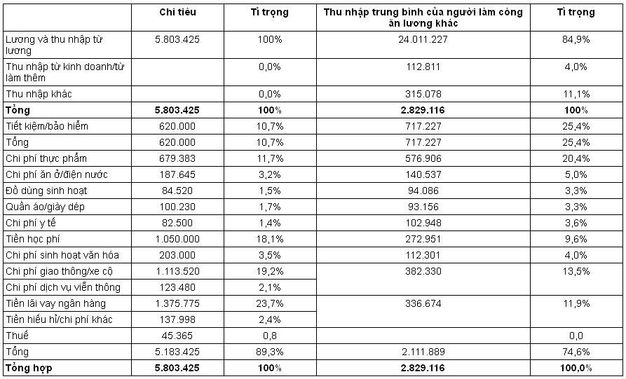

Hạng mục thứ hai là chi phí xe cộ. Ba năm trước, anh mua xe bằng phương thức trả góp trong vòng 36 tháng, tiền trả góp mỗi tháng là khoảng 600 nghìn won nên tỉ lệ chi phí xe cộ không thể không cao được. Tuy nhiên, ngoài tiền trả góp thì các khoản chi phí phát sinh bắt buộc khác cũng không phải là ít.

Thứ ba là chi phí trả lãi cho khoản vay thế chấp ngân hàng để mua nhà hai năm trước. Khi nhận được khoản vay thế chấp, anh nghĩ rằng đây chỉ là khoản chi phí không đáng kể vì giá nhà lúc đó đang cao, nên anh nghĩ nếu khó quá thì bán nhà đi cũng không sao.

Dù gia đình anh không chi tiêu khoản gì quá đáng, nhưng nếu bây giờ anh không điều chỉnh lại việc chi tiêu thì dù gia đình anh kiếm tiền nhiều gấp hai lần so với mức trung bình của các gia đình khác, thì anh cũng không thể trù bị đủ cho tương lai của mình bằng các gia đình khác.

Kim Min Seok in bảng so sánh với thu nhập trung bình của các gia đình khác rồi cầm ra phòng khách. Ngay cả vợ anh, khi mới nhìn vào bảng so sánh cũng bất ngờ. Dù chị nghĩ rằng số tiền tiết kiệm của gia đình hàng tháng không quá ít, nhưng chị cũng tự an ủi rằng chỉ cần sau ba tháng nữa, khi đã trả hết số tiền trả góp mua xe thì khoản tiền tiết kiệm hàng tháng của anh chị sẽ tăng lên hai lần. Song sau khi nhìn vào bảng so sánh thì chị nghĩ rằng vấn đề ở đây không phải tăng tiền tiết kiệm mà nằm ở thói quen chi tiêu hàng ngày.

Kim Min Seok và vợ quyết định sẽ giảm việc chi tiêu bằng thẻ tín dụng. Hiện tại, kể cả thẻ bách hóa thì tổng số thẻ tín dụng mà Kim Min Soek có là bảy chiếc, còn vợ anh hiện đang có năm thẻ. Cả hai quyết định sẽ bỏ tất cả các thẻ tín dụng, trừ thẻ mua hàng ở bách hóa, các loại thẻ tín dụng có nhiều ưu đãi và thẻ thanh toán chi phí giao thông.

Cả hai cũng quyết tâm rằng trước khi sử dụng bất kỳ thẻ tín dụng nào cũng phải suy nghĩ xem đó có phải là chi phí cần thiết hay không.

Sau đó, anh băn khoăn về việc có nên tiếp tục sử dụng chiếc xe hơi 2.500cc mà mình đang lái hay không. Xe 2.500cc đương nhiên là máy khỏe rồi, lại còn có ghế sô-fa bằng da ở bên trong. Nhưng quan trọng hơn là ánh mắt ghen tị của người đi đường mỗi khi anh lái chiếc xe này. Tuy nhiên, anh cũng đã nghĩ về việc giá xe giảm và thực tế là chi phí bảo dưỡng cho nó quá nhiều.

Sau khi bàn bạc với vợ, Kim Min Seok quyết định bán chiếc xe hiện có và mua một chiếc xe cũ hạng 1.500 cc. Tính theo giá hiện tại, chiếc xe của anh là 17 triệu won, còn chiếc xe cũ động cơ 1.500cc chỉ có bảy triệu won, như vậy anh có thêm 10 triệu tiền mặt và hàng tháng sẽ tiết kiệm khoảng 100 nghìn won tiền xăng nữa.

Cuối cùng là vấn đề có nên tiếp tục chi 500 nghìn won hàng tháng để trả tiền lớp học tiếng Anh cho con hay không. Đương nhiên, tầm quan trọng của tiếng Anh như thế nào thì không cần phải nói, nhưng với một đứa trẻ chưa nói sõi tiếng mẹ đẻ thì việc học tiếng Anh có mang lại hiệu quả tối ưu hay không. Sau hơn một tiếng đồng hồ bàn bạc cùng vợ, cuối cùng anh quyết định sẽ bật băng tiếng Anh cho con nghe và sẽ giao tiếp với con các hội thoại cơ bản ở nhà thay vì chuyển con đến trường mẫu giáo bình thường.

Kim Min Seok quyết định sẽ cùng vợ viết sổ tay chi tiêu ngay từ ngày hôm nay và cùng nhau lên dự toán các chi phí cho tháng tới. Sau hơn một tiếng đồng hồ thảo luận, hai vợ chồng đã lập ra dự toán như sau.

Hàng tháng, nếu gia đình anh chi tiêu các chi phí sinh hoạt nằm trong ngân sách dự toán thì mỗi tháng anh có thể tiết kiệm được 1,79 triệu won. Tức là anh cũng sẽ tiết kiệm được thêm 1,17 triệu won so với hiện tại. Như vậy, tỉ lệ tiết kiệm của gia đình anh sẽ là 30,8%, cao hơn hẳn so với tỉ lệ bình quân của các gia đình khác. Sau khi lên dự toán như vậy, hàng tháng với số tiền 1,79 triệu won, mức lãi suất là 4% thì anh tò mò không biết sau 25 năm nữa, khi mình 60 tuổi thì số tiền đó sẽ là bao nhiêu. Và số tiền mà anh tính được 806,4 triệu won.

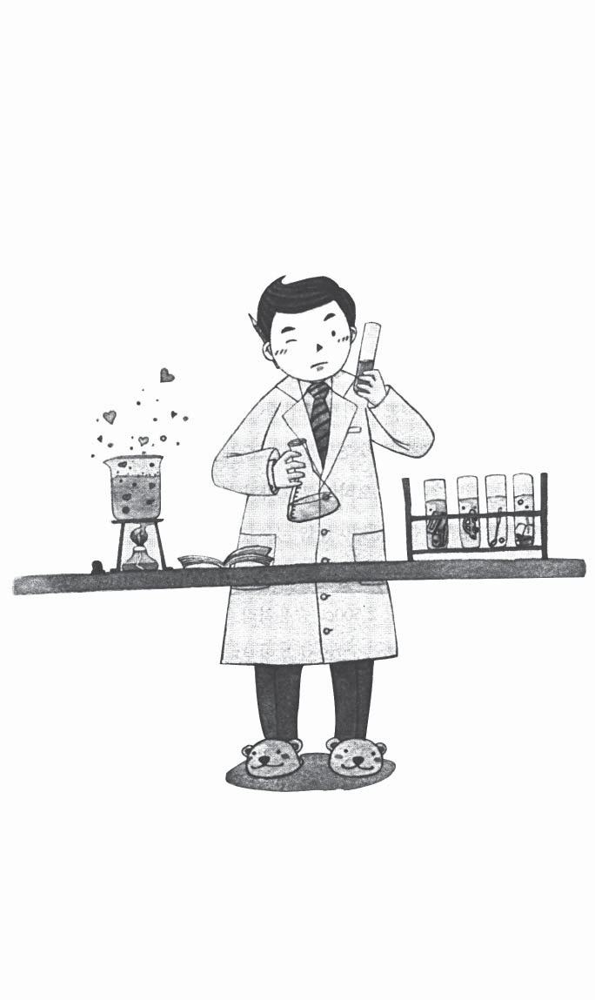

Nhìn vào con số vừa tính toán, anh có phần phấn chấn hơn. Vì số tiền tính ra nhiều hơn so với dự kiến ban đầu của anh. Nếu bắt đầu từ bây giờ, hàng tháng anh tiết kiệm được 1,79 triệu won trong vòng 25 năm có thể anh sẽ không cần phải quá lo lắng cho tuổi già của mình. Tuy nhiên, chúng ta khó có thể đi đúng theo những gì mà chúng ta tính toán. Sau 5 năm nữa, khi đứa con thứ hai bắt đầu vào học mẫu giáo thì vợ anh sẽ nghỉ việc, nên sẽ thật khó để gia đình anh có thể tiết kiệm được 1,79 triệu won hàng tháng.

Kim Min Seok bắt đầu thử tính xem sau khi vợ anh nghỉ thì nhà anh có thể tiết kiệm được khoảng bao nhiêu. Tính khoản nọ khoản kia, chi tiêu tiết kiệm hết mức thì cũng khó để vượt qua con số 400 nghìn - 500 nghìn won/tháng. Cộng cả số tiền trong 5 năm, mỗi tháng tiết kiệm được 1,79 triệu won và số tiền tiết kiệm được trong 20 năm sau đó, mỗi tháng là 500 nghìn won thì số tiền anh có được sau 25 năm chỉ còn có 286 triệu 520 nghìn won. Để an hưởng tuổi già mà bản thân anh mong muốn thì đến năm 60 tuổi, ít nhất anh cũng phải cần có 540 triệu won, tức là anh vẫn còn thiếu hơn 250 triệu won nữa. Hơn nữa, số tiền này là kết quả tính toàn bộ các thu nhập của gia đình anh, chứ anh vẫn chưa tính đến các khoản chi phí khác như: tiền học, tiền đám cưới cho các con, tiền mở rộng nhà… nếu tính cả chi phí đó thì anh sẽ còn thiếu khoảng hơn 400 triệu won nữa.

Tiết kiệm có thể đảm bảo phần nào cuộc sống về già, nhưng anh nghĩ rằng mình cần có đối sách khác nữa.

## Tiền học cho con cái và tiền lo cho tuổi già - cuộc giằng co không cân sức

Trong khi đang chơi đùa cùng con gái sau giờ ăn tối, Kim Min Seok chú ý vào bản tin trên tivi. Bản tin đưa tin về người đàn ông sống một mình trong căn hộ chung cư, sau khi đã gửi vợ và con sang Mĩ du học. Ông ta chết đã mấy ngày rồi, nhưng không ai phát hiện ra. Anh thấy tim mình đau nhói. Từ khi trở thành bố anh nhận ra rằng những bản tin hoặc bài báo liên quan đến giáo dục không còn là vấn đề hay câu chuyện của riêng ai.

Kim Min Seok cũng nghe giám đốc bộ phận Moo nói rằng hàng tháng khoản tiền ở trường và tiền học thêm mà ông phải chi cho hai con là bốn triệu won, tính ra mỗi đứa là hai triệu won. Trong đó, chi phí học thêm đắt đỏ, dù có hạ đến mấy thì mỗi môn học cũng là 500 nghìn won, tính ra một đứa học thêm ba, bốn môn thì chi phí này đã lên tới hơn hai triệu won rồi.

Tuy nhiên, năng lực của những nhân viên mới vào công ty thì lại không vượt hơn so với thời anh mới vào làm. Mặc dù, những nhân viên này đều du học ở nước ngoài về nên tiếng Anh khá tốt, nhưng các kĩ năng khác thì anh lại có cảm giác họ kém hơn so với lúc đầu anh về đây làm việc. Anh bắt đầu nghĩ rằng, thời nay, các bạn trẻ tiêu nhiều hơn, cao lớn hơn, nhưng không có nhiều phát triển trong năng lực.

“Rốt cuộc thì không phải trong giáo dục cũng có bong bóng sao?”

“Không phải vì những điều này nên mới có chuyện những người cha gà trống sao?”

Anh bắt đầu có những hoài nghi.

Các chương trình thời sự trên tivi bắt đầu tập trung vào vấn đề các ông bố cô đơn, và đề cập từng vấn đề trong hiện tượng gửi con đi du học dự bị.

Theo tài liệu thống kê của ngân hàng Hàn uốc thì vào năm 2004, Hàn Quốc có 160 nghìn sinh viên đại học và gần 20 nghìn học sinh tiểu, trung, phổ thông trung học đi du học ở nước ngoài. Số tiền được chuyển ra nước ngoài với mục đích du học hoặc học ngoại ngữ lên tới 2.500 tỷ won. Nếu tính một cách đơn giản các chi phí khác như: tiền vé máy bay, tiền sinh hoạt của vợ/chồng trong gia đình… thì số tiền này sẽ lên tới gần bảy nghìn tỷ won. Hơn nữa, chi phí du học nước ngoài này tăng lên hàng năm, do vậy, các khoản chi tiêu không chính thức cũng lên tới 10 nghìn tỉ won.

Số tiền gửi mà các cha “gà trống” phải gửi là bốn triệu, năm triệu won/tháng. Số tiền gửi này chiếm hơn 90% thu nhập/ tháng của các ông bố, vậy là với số tiền ít ỏi còn lại họ sống một mình trong cô đơn, không chăm sóc được bản thân, ăn uống thất thường, cuộc sống của họ chẳng khác gì ép mình trong những câu chuyện cổ tích xưa kia.

“Không phải họ nói rằng đây là thời đại mà các ông bố, bà mẹ sẽ làm tất cả, hi sinh hết thảy vì con cái sao?”

Kim Min Seok chợt nảy ra suy nghĩ như vậy. Anh cũng nghĩ xã hội cần có những lí lẽ, dẫn luận về đề tài giáo dục con cái vì ai cũng lo lắng không biết nên nuôi dạy con cái như thế nào. Trong đầu anh lại hiện lên hình ảnh mà Tiên ông đã chỉ ra trong mơ khi anh về già, sống trong nhà con gái đầu, thấy mình là gánh nặng của con cái.

“Vì con cái mà phải hi sinh tất cả mọi thứ, rồi đến khi về già lại phải sống vất vưởng nhờ con? Liệu đó có phải là vì con cái hay không? Con cái chúng nó có muốn như vậy không?”

Trước đây, anh còn suy nghĩ rằng việc bố mẹ giáo dục con cái, con cái phụng dưỡng bố mẹ khi về già là điều đương nhiên, nhưng giờ đây anh nghĩ rằng sau này con cái sẽ sống theo cách của chúng, bố mẹ cũng vậy. Sau khi kết hôn con cái lại có một gia đình mới. Lúc này, con cái và bố mẹ xét về cả khía cạnh tài chính lẫn tinh thần, đều sống ở hai thế hệ tách biệt nhau.

Đột nhiên, anh nhớ đến câu nói của ông bác ở bên Canada.

“Ở Canada, sau khi con cái tốt nghiệp phổ thông trung học thì hầu như không có chuyện bố mẹ cung cấp tiền cho con. Con họ tự kiếm tiền sinh hoạt bằng việc làm thêm, dùng các khoản vay khuyến học để trả tiền học phí. Sau khi tốt nghiệp và xin việc làm họ có thời gian là 5 năm để trả tiền đã vay từ các quỹ đó. Nhờ vậy, bố mẹ không can thiệp quá sâu vào đời sống của con cái, đồng thời sự phụ thuộc của con cái vào bố mẹ cũng không quá nhiều.”

“Còn ở Hàn Quốc thì sao?”

Đối với cha mẹ ở Hàn Quốc thì việc học của con cái là điều đương nhiên, bố mẹ còn lo cho con cả tiền cưới xin, tiền mua nhà, cũng có trường hợp bố mẹ còn cho tiền sau khi đã kết hôn. Nhưng ngược lại, bố mẹ cũng yêu cầu rất nhiều điều ở con cái. Khi kết hôn, quyền quyết định đối tượng thuộc về bố mẹ. Và nhiều trường hợp, con cái phải lo lắng cho bố mẹ khi về già. So với thời trước, bố mẹ ngày nay đã thay đổi khá nhiều, song con cái lại thay đổi nhanh hơn.

Vậy thì việc hi sinh tất cả cho con cái, lo lắng trọn đời cho con, liệu có phải là tốt nhất? Việc chuẩn bị tiền cưới xin cho con đối với nhà khá giả thì chẳng có gì là xấu, nhưng đối với nhà không có năng lực thì tại sao không nuôi con để chúng có đủ khả năng tự lập?

Quay lại chủ đề đang nghiên cứu và tìm kiếm trên internet, Kim Min Seok đọc nhiều bài đề cập đến mức độ phụ thuộc vào tài chính của bố mẹ ở thế hệ thanh niên 20 tuổi do tình trạng thất nghiệp kéo dài sau khi khủng hoảng kinh tế. Trong năm 1999 (quý III), trong số thu nhập trung bình/tháng của dân số lao động thành thị tuổi 20 thì tỉ lệ giá trị được chuyển nhượng như: tiền hỗ trợ sinh hoạt, tiền tiêu vặt… được nhận từ bố mẹ chiếm 4,5%. Con số này các năm sau đều tăng dần lên như: năm 2000 là 5,8%, năm 2002 là 8,7%, năm 2003 là 11,1%, năm 2004 là 12,1%. Theo đó, bố mẹ càng ngày càng phải lo lắng nhiều hơn cho con cái của mình.

Sau khi đọc rất nhiều bài báo, anh nhận ra rằng thay vì lo tất cả các chi phí liên quan đến việc học của con ở hiện tại thì việc đảm bảo tài chính cho tuổi già của mình sẽ giảm bớt gánh nặng cho con cái. Anh quyết định sau này mình sẽ cố gắng hết mình trong việc nuôi dạy và hỗ trợ con, nhưng cũng sẽ trù bị tài chính độc lập cho mình khi về già. Anh nhận thấy để làm được việc này, anh cần xây dựng tính độc lập và lòng tự trọng cho con cái để sau này chúng chủ động trong cuộc sống.

## Hãy thử nâng cao thu nhập: I- Đầu tư vào công việc

Đôi khi Kim Min Seok lại tự hỏi mình: “Hạnh phúc là gì nhỉ?”. Không hiểu sao dạo này bản tin về những người già neo đơn lang thang trên đường phố cứ văng vẳng bên tai anh, hay anh cảm thấy tim mình đau nhói khi đọc các bài báo về những đứa trẻ bị bỏ rơi sau khi bố mẹ ly hôn. Kinh tế ngày càng tăng trưởng, mức sống của người dân ngày càng cao, song dường như thế giới càng ngày càng trở nên vô tình hơn. Tại sao lại thế? Trước đây, chỉ cần người đàn ông kiếm tiền thì cũng mua được nhà và sống thoải mái, không gặp vấn đề gì về kinh tế, nhưng không hiểu bắt đầu từ khi nào mà nếu cả hai vợ chồng không cùng nhau kiếm tiền thì thật khó để trang trải hết các chi phí sinh hoạt đang ngày càng tăng lên. Cuộc sống sao lại khó khăn đến thế?

Hơn nữa, trước kia việc một nhân viên thăng tiến thành giám đốc bộ phận hoặc giám đốc điều hành cũng không quá khó. Ngoài ra, giám đốc bộ phận hoặc giám đốc điều hành lâu năm, sau khi nghỉ hưu vẫn có thể được chuyển đến các công ty con (chi nhánh) và làm thêm từ bốn, năm năm nữa. Giờ mới thấy đời thay đổi đến mức nào. Do cải tổ cơ cấu nên số lượng các công ty con cũng bị cắt giảm, đồng thời các công ty con cũng cạnh tranh độc lập với nhau nên mọi người ít có khả năng chuyển tới các công ty con này. Song tình hình không chỉ có vậy. Do chính sách cải tổ cơ cấu mạnh nên số lượng nhân viên cũng bị tinh chế, khối lượng công việc thì tăng lên gấp mấy lần so với trước. Khái niệm tuổi về hưu cũng dần mất đi, thay vào đó, cũng chẳng khó gì khi thấy có nhiều người phải nghỉ việc ở công ty khi chỉ mới ngoài 40 tuổi.

Nếu anh tính toán mình sẽ làm việc cho đến khi nghỉ hưu lúc 60 tuổi thì số tiền tiết kiệm của anh vẫn có thể cáng đáng được và có thể làm chi phí cơ bản cho tuổi già, nhưng nếu anh phải nghỉ hưu ở 45 tuổi thì sao? Đáp án ở ngay trước mặt. Một là anh sẽ phải làm việc thật lâu ở công ty hoặc sẽ phải tìm hay mở một việc kinh doanh nào đó.

Trở về nhà vào buổi chiều, Kim Min Seok gọi điện cho Park dựa vào danh thiếp nhận được hôm qua. Anh cảm thấy hơi ái ngại vì hôm nay là Chủ nhật, nhưng sự tò mò đã chiếm trọn tâm trí anh. Tất nhiên kể cả là Park thì cũng không phải là đáp án đặc biệt, nhưng anh tò mò không hiểu những khách hàng của ngân hàng đã giải quyết vấn đề này như thế nào và họ đang giải quyết ra sao.

Ngay sau khi máy được nối, Park bắt chuyện với Kim Min Seok với giọng nói vui vẻ. Sau khi chào hỏi đơn giản, Kim Min Seok hỏi về việc nhân viên văn phòng trong số khách hàng của PB làm gì để nâng cao thu nhập trù bị cho tuổi già của mình.

“Anh nói là khách hàng của PB hả?”

Sau khi nghe câu hỏi, Park bắt đầu giải thích về một vài điểm chung đặc trưng ở những khách hàng của PB là những người làm công ăn lương.

“Khách hàng của PB rất đa dạng, có người trẻ, người già nhưng họ đều có đặc trưng là quan niệm nhân sinh rất rõ ràng. Họ thích ứng khá nhanh với những thay đổi của thời cuộc, và là những người nhiệt thành làm việc chăm chỉ tại công sở. Dường như lúc nào họ cũng phát triển bản thân mình để vượt lên trên người khác. Cách đây không lâu, có một khách hàng từng làm việc tại tập đoàn S đã ngoài 45 tuổi. Anh ta nhận được khoản tiền lương cao ngất và được tuyển dụng làm cố vấn cho một công ty nước ngoài. Không biết có phải anh ta đã có kế hoạch chuyển sang công ty nước ngoài hay không mà anh ta nói đã học tiếng Anh từ 5 năm trước đó. Còn có một khách hàng khác của PB rất quan tâm đến nấu ăn. Năm ngoái vị khách hàng đó do quá say mê vào món bít tết chay kẹp rau nên đã cùng bạn mình mở một cửa hàng ăn. Dĩ nhiên, do vị khách này vẫn còn làm việc tại công ty nên anh chỉ góp vốn vào việc mở cửa hàng. Sau khi tan sở hoặc vào ngày cuối tuần, anh lại đến giúp việc tại cửa hàng và cùng chia lợi nhuận với bạn mình.”

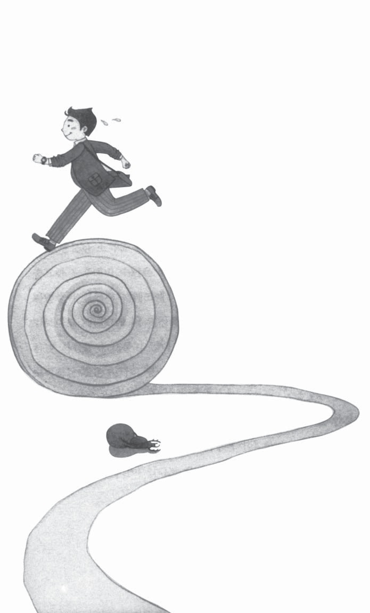

Sau khi đưa ra hai ví dụ, Park tiếp tục câu chuyện:

“Thực tế đối với nhân viên làm công ăn lương thì chỉ có hai phương pháp nâng cao thu nhập của bản thân, trừ thu nhập tín dụng hoặc thu nhập cho vay/cho thuê phát sinh từ tài sản. Một là nhận được mức lương cao hơn ở công ty hoặc kéo dài thời gian làm việc. Hai là làm thêm. Hiện nay đang có xu hướng làm một lúc hai việc đúng không?”

“Vâng, tôi cũng thường thấy từ đó xuất hiện trên tivi hoặc báo chí.”

“Trước hết, để nâng cao mức lương thì bản thân cần đầu tư nhiều hơn cho chính mình. Đầu tiên là nâng cao khả năng giao tiếp tiếng Anh, nâng cao khả năng xử lý công việc, phải biết cách quản lý hệ thống nhân sự… Và quan trọng nhất là phải đầu tư cho sức khỏe.”

“Điều này hôm qua anh cũng đã nói rồi.”

“Ngoài ra, anh hãy thử nghĩ một lần về vấn đề kéo dài thời gian làm việc. Việc kéo dài thời gian làm việc là vấn đề quan trọng, nhưng có nhiều người thường bỏ qua tầm quan trọng của nó. Giả sử một nhân viên có mức lương ba triệu won/tháng sẽ gần giống với thu nhập của một người gửi tiết kiệm dài hạn tài sản tín dụng một tỉ won. Thông thường, mọi người nghĩ rằng thu nhập ở công ty là việc đương nhiên, song anh hãy thử nghĩ khi khoản thu nhập này bị mất đi thì sao. Nếu vậy, anh sẽ biết được việc trụ lại lâu ở công ty là một khoản đầu tư có lợi đến thế nào. Sự thật mọi người có thể tránh được việc về hưu non, nó tùy thuộc vào sự nỗ lực của bản thân trong công việc. Nếu là một người cần thiết cho doanh nghiệp, thì anh có xin thôi việc, cấp trên cũng sẽ muốn giữ anh lại.

Hơn nữa, ở nước ta mọi người có cách nghĩ khác so với người dân ở các nước tiên tiến. Ở nước ngoài, mọi người không còn lạ gì việc nhảy việc để nâng cao giá trị của bản thân. Còn ở nước ta, nghỉ việc được hiểu là có vấn đề gì đó, hoặc họ nghĩ rằng công ty mà mình đang làm không phải là nơi họ có thể gắn bó cả đời. Việc thay đổi một, hai công ty và quản lý năng lực của bản thân mình chẳng phải tốt hơn so với việc gắn bó lâu dài chỉ với một công ty hay sao?’ Lời nói của Park không khác là mấy so với lời của Tiên ông mà anh Kim Min Seok đã từng gặp.

“Làm việc lâu dài cũng là một sự đầu tư cực kỳ hiệu quả cơ đấy…”

## Hãy thử nâng cao thu nhập: II- Làm thêm và làm ăn riêng

Giả sử bạn là người không tự tin nơi công sở hoặc không muốn gắn bó lâu dài với công ty thì có thể bạn sẽ cần làm thêm hoặc làm ăn riêng. Không lâu trước đây trên trang web linkjob (kết nối nghề nghiệp) đã có cuộc khảo sát với đối tượng là nhân viên văn phòng về việc làm thêm. Theo tôi nhớ thì có 15% trong số những người tham gia khảo sát trả lời đang làm thêm và khoảng 79% trong số đó nói rằng đang có kế hoạch sẽ làm thêm một công việc nào đó.

Nếu tìm một công việc làm thêm sau khi nghỉ hưu thì chúng ta cũng không cần một công việc quá lớn, thu nhập quá cao. Vì nếu ngoài 55 tuổi bạn nghỉ hưu thì lúc này bạn cũng đã dành dụm được một khoản tiền nào đó, tiền học cho con cái cũng gần như không cần thiết nữa. Đặc biệt, điều quan trọng là việc làm thêm này không được ảnh hưởng tới công việc chính. Giả sử vì thất bại trong việc làm thêm mà chúng ta mất cả công việc chính thì chẳng phải là mất cả chì lẫn chài sao?”

Sau khi kết thúc cuộc nói chuyện với Park, Kim Min Seok bắt đầu tò mò về việc làm thêm và việc làm ăn riêng. Đặc biệt, anh thực sự bất ngờ khi biết rằng phần lớn mọi người đều trả lời là đang làm hoặc chuẩn bị sẽ làm một công việc phụ nào đó.

“Bây giờ công việc công ty bận thế này thì làm thế nào mình chuẩn bị làm thêm hoặc làm ăn riêng được chứ?”

Sau khi nhập hai cụm từ “nghề tay trái” và “lập nghiệp” vào trang tìm kiếm thông tin thì anh thấy rất nhiều thông tin khác nhau. Nếu tóm tắt nội dung một số bài báo thì những người được phỏng vấn đều ít nhiều quan tâm đến việc làm thêm với nhiều loại hình như giúp việc gia đình, làm thêm online, loại hình làm thêm liên quan đến kinh doanh, loại hình làm thêm bằng cách thăm hỏi, cho vay… Nhiều trường hợp bắt đầu làm với vai trò là việc làm thêm, sau đó chuyển sang lập nghiệp khi việc làm thêm đó đi vào ổn định.

Lĩnh vực làm thêm mà mọi người quan tâm chủ yếu là: cho mượn máy bán hàng tự động (nếu bán sản phẩm của công ty sản xuất ra sản phẩm được bán tại máy bán hàng này), dạy gia sư, chụp ảnh khi đi công tác, bán hàng online, nội thất phòng tắm… Đọc xong các bài báo có liên quan, Kim Min Seok bắt đầu suy nghĩ lại về công việc.

Không lâu trước đây, khi nghe đến từ “nghề tay trái”, anh chỉ nghĩ đó là phương sách cuối cùng của một người bị vỡ nợ tín dụng cần phải trả nợ trong thời gian ngắn. Hơn nữa, anh còn nghĩ “mình học đại học ra thì sao phải làm nghề tay trái?”. Dường như nó cũng là điều mà anh không cần bận tâm.

Kim Min Seok xem xét lại một cách thận trọng từng quy trình chuẩn bị cho tuổi già sau ba ngày kể từ khi anh bắt gặp Tiên ông. Dường như đây là lần đầu tiên anh suy xét một cách cẩn thận đến vậy. Quan trọng hơn cả là anh nhận ra mình đã sống không có trù bị trước cho tương lai như thế nào trước khi mọi việc trở nên quá muộn.

Kim Min Seok nhìn lại những gì đã tìm hiểu trong ba ngày qua. Anh kiểm tra lại hiện trạng tài sản và các khoản nợ của bản thân, đồng thời quyết định bán đi chiếc xe hơi do một lần vung tay quá trán. Ngoài ra, anh cùng vợ kiểm tra lại các khoản chi tiêu trong gia đình và quyết định sẽ giảm các khoản chi không cần thiết, cả hai cũng đồng ý sẽ viết sổ chi tiêu và dần dần cải tiến các hạng mục chưa hợp lý. Và anh cũng đã thử tính toán khoản tiền cần thiết để lo cho tuổi già của mình và vợ.

Nhưng đáp án quan trọng nhất thì anh vẫn chưa có được. Dù tiết kiệm thế nào thì anh vẫn còn thiếu 300 triệu won, và anh vẫn chưa tìm ra phương pháp để lấp đầy số tiền còn thiếu đó. Phương pháp mà anh nghĩ ra là hoặc cắt giảm chi tiêu khi về già, hoặc làm thêm nhưng dù phương pháp nào đi chăng nữa thì anh vẫn không thể thực hiện ngay được.

Miên man trong suy nghĩ, anh nằm lên giường, trở mình liên tục và nghĩ giá mình được gặp lại Tiên ông trong mơ, rồi chìm vào giấc ngủ. Trong khi đang lơ mơ ngủ, anh cũng suy nghĩ xem mình còn thiếu điều gì trong ba ngày vừa qua. Dù không biết chính xác đó là cái gì, nhưng anh mơ hồ nhận thấy hình như mình đã bỏ sót một cái gì đó rất quan trọng.

“Đó là gì nhỉ?”
