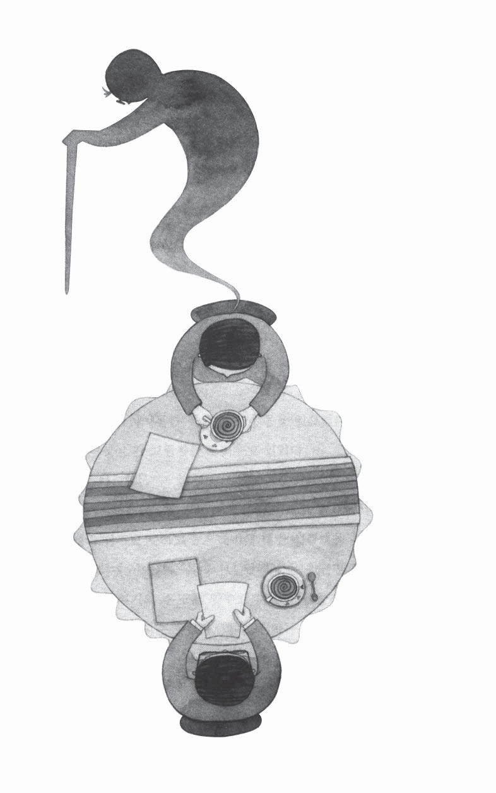
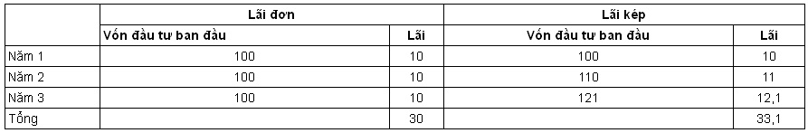
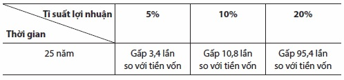
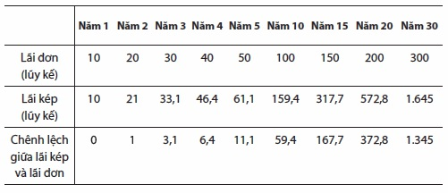
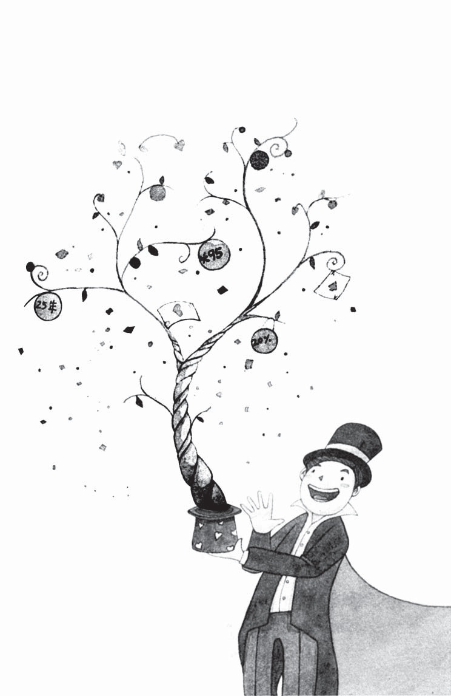
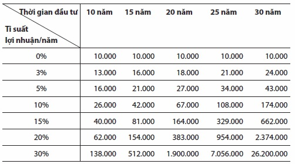
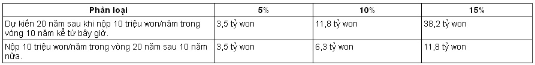
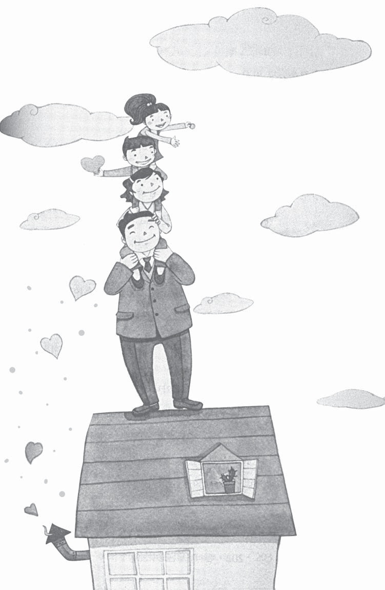

# Chương 3: Vì 30 năm tuổi già thịnh vượng

## Nếu nâng cao tỉ lệ lợi nhuận, bạn sẽ thấy đáp án cho tuổi già

Mình ơi…, mình. Mình dậy đi, đã 7 giờ rồi.”

“Ừ… đã 7 giờ rồi à?”

“Mình mau dậy rồi rửa mặt đi. Bữa sáng em đã chuẩn bị xong rồi.”

“Được rồi… Anh dậy ngay đây!”

Không còn cách nào khác, Kim Min Seok phải bước ra khỏi giường. Ánh nắng mùa xuân đã in dài trên nền tường trong phòng thông qua cánh cửa sổ.

“Hai…a!”

Sau khi vươn vai, anh kéo chăn ra và bắt đầu bước xuống dưới. Ngày cuối tuần không được nghỉ vì tìm kiếm thông tin trên mạng liên quan đến đối sách trù bị cho tuổi già nên giờ người anh uể oải và nặng nề. Điều chỉnh nhiệt độ bình nóng lạnh cho phù hợp và đứng dưới làn nước ấm, anh có cảm giác mệt mỏi dường như tan biến. Anh ăn qua loa rồi mặc quần áo và đi xuống bãi đỗ xe, cho chìa khóa vào ổ và anh đột nhiên nghĩ “không hiểu chiếc xe này có phải là quái vật ăn tiền không nhỉ?”

“Tiền trả góp hàng tháng tính ra chỉ 600 nghìn won… nhưng còn tiền xăng hàng tháng ít ra cũng 300 nghìn, tiền bảo hiểm, tiền bảo dưỡng rồi tiền thuế, tổng cộng cả tháng cũng hết gần 4,5 triệu won… thể nào cũng phải “chào tạm biệt” với mày thôi.”

“Vâng, tôi là Kim Min Seok, trưởng phòng kế hoạch và tài chính đây.”

“Min Seok à, tớ là Un Woo đây. Lâu rồi bọn mình không gặp nhau. Tối nay hai đứa làm chén chứ?”

“Được chứ. Cậu không rủ thì tớ cũng đang thèm rượu đây.”

Sau khi ăn cơm trưa xong, rồi lại vùi đầu vào mạng, Kim Min Seok không thể không vui mừng trước cuộc gọi điện của Jang Un Woo. Nhìn bộ dạng của mình trong giấc mơ mà Tiên ông đã chỉ cho, anh lại càng ghen tị hơn với cuộc sống của Jang Un Woo khi đó, anh cũng mơ ước rằng mình sẽ có cuộc sống như thế. Hiện tại, Jang Un Woo đang làm việc với vai trò tư vấn tại trung tâm PB của ngân hàng nên cứ khi nào gặp là Jang Un Woo lại bàn bạc sôi nổi nào là về ký quỹ, bất động sản hoặc gửi tiền tiết kiệm. Bình thường, Kim Min Seok luôn cảm thấy bất mãn bởi chỉ vì Jang Un Woo mà làm mất không khí của tiệc rượu, nhưng lần này thì hoàn toàn khác.

Đến hơi muộn một chút, ngay từ ngoài cửa, Kim Min Seok đã nhận ra Chei Kyoeng Won - người đang ngồi trong bàn ăn, vừa nướng thịt vừa nâng chén rượu. Đó đúng là người bạn cấp ba của anh, hiện đang làm việc tại một công ty bảo hiểm.

Sau khi nói với nhau về hiện trạng của mình, chén đi chén lại, Kim Min Seok bắt đầu thổ lộ những băn khoăn của mình.

“Này, các cậu đang chuẩn bị thế nào cho tuổi già của mình?”

Jang Un Woo và Chei Kyoeng Won đều trợn tròn mắt ngạc nhiên trước câu hỏi khác hẳn tính cách của Kim Min Seok thường ngày. Hai người ngạc nhiên như thể ngày mai mặt trời sẽ mọc ở đằng tây, còn Kim Min Seok chẳng có biểu hiện gì cả, mà chỉ dốc chén lên uống tiếp. Jang Un Woo bắt đầu hỏi trước:

“Nếu là Kyoeng Won và mình thì đương nhiên việc trù bị cho tuổi già đã được bắt đầu từ lâu rồi. Ngay sau khi vào ngân hàng, ngoài khoản tiền tiết kiệm, mình còn tham gia vào một sản phẩm bảo hiểm niên kim, cũng được khoảng gần 10 năm rồi. Cách đây không lâu, mình tăng thời gian bảo hiểm lên 20 năm và còn tiết kiệm một khoảng riêng vào quỹ tiết kiệm… Kyoeng Won à, cậu cũng làm vậy đúng không?”

“Ừ. Trước khi vào làm tại công ty bảo hiểm mình cũng đã tham gia vào bảo hiểm niên kim. Rồi sau khi vào làm tại công ty, mình cũng tham gia vào bảo hiểm niên kim và bảo hiểm niên kim khả biến(1). Min Seok thì sao? Cậu cũng làm như mình chứ?”

“Thì ra là vậy… Các cậu đều có chuẩn bị trước cả rồi. Nhưng sao lại chỉ có mình thế nhỉ. Mình không hề suy nghĩ gì về vấn đề này cả cho đến bây giờ…”

Kim Min Seok định kể cho Jang Un Woo nghe câu chuyện của Tiên ông và tương lai mà mình được nhìn thấy, nhưng anh lại thôi.

“Mình cũng thử tìm cách này cách nọ, nhưng chưa có đáp án.”

Nhìn xuống chén rượu, Kim Min Seok tiếp tục câu chuyện:

“Hiện giờ thu nhập của mình và vợ mỗi tháng khoảng 5,8 triệu won, nếu trừ các khoản như: chi phí sinh hoạt, lãi suất trả vay mua nhà, tiền trả góp mua xe, rồi các chi phí khác… thì để dành được khoảng 620 nghìn won… Có nghĩa là hai vợ chồng mình tiêu gần hết số tiền kiếm được. Vì vậy, cuối tuần vừa rồi mình và vợ ngồi bàn bạc với nhau sẽ điều chỉnh lại chi tiêu. Nếu làm vậy thì hàng tháng nhà mình sẽ tiết kiệm được khoảng 1,79 triệu won. Nếu nhà mình cứ duy trì được mức tiết kiệm này thì chắc là không có vấn đề gì lớn… Vấn đề ở đây là sau 5 năm nữa, vợ mình sẽ phải nghỉ việc. Rồi chuyện học phí của con cái, và khi vợ mình nghỉ làm, thì số tiền tiết kiệm lúc này chỉ còn được 500 nghìn won. Nếu cứ tiếp tục tiết kiệm với mức đó thì đáp án cho tuổi già chẳng có gì khá khẩm hơn. Nhà cũng phải mở rộng hơn, tiền học cho con đầu, rồi đứa thứ hai sắp ra đời nữa, lại còn phải tiết kiệm cho cuộc sống về già sau này, rồi còn trù bị tiền vốn để tiết kiệm hoặc đầu tư… Nếu thử chia 150 nghìn won thì một năm sẽ là 1,8 triệu won, 10 năm sau tính cả tiền lãi tiết kiệm cũng chỉ được 20 triệu won đúng không? Với 20 triệu won thì không thể mơ đến việc chuyển nhà được… phải tiết kiệm 20 triệu won trong 10 năm thì tiền học của con cái hàng tháng mấy trăm nghìn won cũng còn chưa đủ nữa…Vấn đề quan trọng nhất là mỗi tháng mình phải để ra được 150 nghìn won thì sau 25 năm nữa cũng chỉ được 68 triệu won mà thôi. Tuổi già của mình có vẻ mờ mịt quá. Mình cố vắt óc nghĩ thế nào cũng không thấy đáp án. Chẳng có đáp án gì cả!”

“Ha ha ha… hình như cậu cũng bắt đầu trưởng thành rồi đấy. Khi mình nói với cậu là hãy chuẩn bị đi thì lẽ ra là đại gia như cậu phải làm theo chứ…”

Jang Un Woo nói nửa đùa nửa thật, rồi rót rượu vào chén của Kim Min Seok và tiếp tục câu chuyện:

“Min Seok à, cậu không cần phải quá lo lắng đâu. Vẫn chưa quá muộn thì chắc chắn vẫn có cách mà. Nhưng nếu như hôm nay đàn anh này tư vấn cho cậu miễn phí thì cậu sẽ mời rượu chứ?”

“Được thôi. Nếu cậu giải quyết mọi vướng mắc của mình thì chút rượu này có là gì?”

“Được! Trước hết là vấn đề cậu đang băn khoăn là khả năng tiết kiệm… Có mấy cách để tăng thêm khoản tiền tiết kiệm. Trước hết là tăng thêm thu nhập, hoặc giảm bớt chi tiêu, cậu có thể nghĩ đến cách đó để tạo ra khả năng tiết kiệm.”

“Mình biết… Vì vậy mình đang cố gắng để giảm bớt các khoản chi tiêu.”

“Nhưng cậu vẫn nói là không có đáp án? Min Seok à, mình cũng đã từng suy nghĩ giống cậu, nhưng việc tăng thêm thu nhập hoặc giảm bớt chi tiêu để tăng thêm số tiền tiết kiệm cũng chỉ có giới hạn. Đại đa số các gia đình là vậy. Hơn nữa, thời gian làm việc ngày càng ngắn đi còn thời gian tuổi già lại ngày càng dài hơn nên việc nâng cao khả năng tiết kiệm đơn thuần sẽ có hạn chế nhất định. Nói một cách đơn giản, chúng ta kiếm tiền trong 25 năm và phải trải qua 30 năm tuổi già, nên ta sẽ phải tiết kiệm trên 50% thu nhập hiện tại thì mới có thể trải qua tuổi già của mình bằng với mức sống hiện tại, điều này về mặt thực tế là không thể.”

“Nếu vậy, mình phải làm gì?”

“Đáp án nằm ở tỉ lệ lợi nhuận.”

“Tỉ lệ lợi nhuận?”

“Đúng vậy. Đó chính là tỉ lệ lợi nhuận. Nếu cậu sử dụng linh hoạt tỉ lệ lợi nhuận thì sẽ giải quyết được hết những vấn đề của mình.”

Kim Min Seok nuốt nước bọt trước lời nói của Jang Un Woo rằng vấn đề của anh sẽ được giải quyết và đợi Jang Un Woo tiếp tục câu chuyện. Ngồi yên lặng từ đầu đến giờ, lúc này Chei Kyeong Won khẽ mỉm cười như thể đã khá hiểu câu chuyện và gật đầu tán thành. Jang Un Woo đưa chén không cho Kim Min Seok rót rượu và tiếp tục nói.

“Min Seok à, cậu đã nghe nói về lãi kép chưa?”

Lãi kép… Kim Min Seok đã nghe rất nhiều lần về lãi kép và Tiên ông cũng đã một lần sử dụng từ “lãi kép”, nhưng anh không có ý niệm rõ ràng về ý nghĩa của từ đó.

“Lãi kép? Cậu nói lãi kép hả?”

## Ma thuật lãi kép: I- Hãy tin vào sức mạnh của lãi kép

Min Seok à, nếu cậu đã quyết tâm trù bị cho tuổi già thì bắt đầu từ bây giờ có một thứ cậu phải biết được đó là “lãi kép”. Trong nghề của mình, người ta không gọi là “lãi kép” mà gọi là “ma thuật lãi kép”.

“Ma thuật lãi kép?”

Không nói gì trước câu hỏi của Kim Min Seok, Jang Un Woo quay người lấy ra chiếc máy tính tay đặt lên bàn.

“Cậu biết thứ có sức mạnh nhất trên thế giới này là gì không? Nhà khoa học thiên tài Albert Einstein đã từng nói rằng sức mạnh to lớn nhất trong vũ trụ này chính là lãi kép.”

“Còn nữa. Nhà khoa học này cũng nói rằng phát kiến vĩ đại nhất của thế kỉ 20 chính là lãi kép.”

Sau khi Chei Kyoeng Won giúp anh đặt miếng thịt lên trên lá xà lách và chấm nước tương, Jang Un Woo tiếp tục câu chuyện.

“Đa phần mọi người đều nghĩ lãi kép chẳng có gì quan trọng. Tuy nhiên, trên thực tế nó lại có sức mạnh ghê gớm. Do hầu hết mọi người không hiểu rõ lãi kép và cũng không biết cách sử dụng nó hiệu quả nên mới suy nghĩ thiển cận về lãi kép. Mình hỏi cậu một câu. Nếu cậu tham gia vào một sản phẩm với mức lợi suất là 10% thì sau 25 năm, tỉ suất lợi nhuận lũy kế sẽ là bao nhiêu?”

“10%, 25 năm à… sẽ là 250%”.

“Đáp án chính xác. Được, nếu cậu tiếp tục đầu tư vào một sản phẩm tín dụng 10% và cậu không lấy lãi hàng năm thì sau 25 năm tỉ suất lợi nhuận lũy kế sẽ là bao nhiêu?”

“Cậu nói vậy là sao? Không phải cũng là 250% à?”

Ngồi nghe từ lúc đến giờ, Chei Kyoeng Won giờ mới tiếp chuyện.

“Ha ha ha… Hóa ra cậu không hiểu Un Woo nói gì rồi. Cái mà cậu trả lời lúc đầu đó chính là lãi đơn. Lãi đơn chính là số tiền có tính lãi suất từ số vốn ban đầu. Còn câu hỏi thứ hai mà Un Woo hỏi cậu là về lãi kép. Lãi kép là số tiền được tính lại từ số tiền lãi phát sinh từ tiền vốn cộng với số tiền lãi từ số tiền ban đầu tính thêm tiền lãi từ số vốn đó. Cậu hãy nhìn kĩ biểu đồ tớ vẽ này.”

Chei Kyoeng Won bắt đầu vẽ lên mảnh giấy mà anh vừa dùng.

**Sự khác biệt giữa lãi đơn và lãi kép**

*(Đơn vị: 10.000 won)*

“Ví dụ, khi cậu tiết kiệm một triệu won với mức lãi suất là 10%/ năm thì vào năm đầu tiên, tiền lãi ứng với một triệu won đó dù là lãi đơn hay lãi kép sẽ giống nhau. Nhưng bắt đầu từ năm thứ hai trở đi, cậu sẽ thấy khác. Lãi đơn thì mức lãi suất vẫn chỉ ứng với một triệu won, nhưng lãi kép thì sẽ là số tiền phát sinh ừ mức lãi suất 10%/ năm ứng với 1,1 triệu won do gộp tiền vốn một triệu ban đầu với 100 nghìn tiền lãi. Hay nói cách khác, tiền lãi đơn ở năm thứ hai vẫn chỉ là 100 nghìn won, còn lãi kép sẽ là 110 nghìn won. Nếu tiếp tục tính như vậy trong vòng ba năm thì số tiền lãi đơn sẽ là 300 nghìn won còn lãi kép sẽ là 330 nghìn won, chênh nhau 33 nghìn won.”

Sau khi nghe lời giải thích của Chei Kyoeng Won, anh đã hiểu hơn về lãi kép.

“Ừ… Nhìn vào biểu đồ sẽ thấy thời gian càng lâu thì sự chênh lệch càng lớn. Nếu vậy tính 25 năm thì sẽ có khoảng cách xa giữa lãi đơn và lãi kép… Xem nào, lãi kép sẽ gấp khoảng ba, bốn lần so với lãi đơn nhỉ?”

Kim Min Seok gật đầu, rồi nhìn Jang Un Woo, anh không nói gì mà lấy máy tính ra tính thử.

Kim Min Seok nghi ngờ chính mình về con số đang hiện ra trên máy tính.

10,8347.

Dù anh có thử tính toán trực tiếp trên máy tính thì kết quả vẫn y nguyên.

“Mức lãi suất 10%/ năm, nếu tính lãi kép sau 25 năm sẽ gấp 11 lần so với số vốn ban đầu ư?”

Jang Un Woo không nói gì, mỉm cười và nhìn thẳng vào Kim Min Seok.

Ngồi cạnh anh, Chei Kyoeng Won cũng lấy máy tính ra, vừa gõ gõ, vừa thêm vị vào câu chuyện.

“Nếu mức lãi suất là 20%/ năm, sau 25 năm tính theo lãi kép thì… xem nào… sẽ gấp khoảng 95 lần đấy. Nhỏ hơn mình nghĩ à?”

Sau khi nói vậy, anh và Jang Un Woo cùng nhau cạn ly.

Đầu óc Kim Min Seok như đang có hàng nghìn ngôi sao bao quanh. Anh cảm thấy máu mình sôi sục. Đó là cảm giác mơ hồ mà tối hôm qua khi anh nghĩ mình đã bỏ sót một cái gì dường như đã được lấp đầy.

“95 lần trong vòng 25 năm? Nếu mình tiết kiệm một triệu won với mức lãi suất 20%/ năm trong vòng 25 năm thì mình sẽ có 950 triệu won còn gì? Nếu mức lãi suất là 20% thì không còn lo gì cho tuổi già nữa rồi?”

“Này, hôm nay để mình trả. Mình đã tìm được đáp án cho câu hỏi tuổi già rồi. Ha ha ha!”

Tiếng cười bất ngờ của Kim Min Seok khiến những vị khách ở bàn bên cạnh đều quay sang nhìn về phía anh. Hai người bạn của anh cũng ngạc nhiên không kém.

Chei Kyoeng Won nhìn sang Jang Un Woo rồi nói một cách lo lắng:

“Này, hình như bọn mình làm cho mọi người chú ý rồi. Mấy người ngồi đằng kia đang nháo nhào thì phải?”

“Min Seok à… cậu tỉnh lại đi! Mọi người đang nhìn chúng ta kìa!”

“Cảm ơn các bạn. Mình sống rồi. Nhờ các bạn đấy… hahaha”

Hai người bạn nhìn nhau rồi cũng phá lên cười.

Trước tiếng cười của hai người bạn, Kim Min Seok bàng hoàng:

“Này, các sư phụ. Sao vậy? Đệ tử hiểu quá nhanh nên các sư phụ ngạc nhiên à?”

“Cái thằng này. Vẫn còn mấy ngọn núi nữa cậu phải vượt qua đấy, vậy mà cậu cứ la lên như kiểu mình đã leo lên đến đỉnh núi vậy.”

“Sao? Cậu bảo là còn mấy ngọn núi phải vượt qua nữa à?

Không phải là mọi việc đã được giải quyết bằng lãi kép sao?”

## Ma thuật lãi kép: II- Sức mạnh của lãi kép đến từ đâu?

“Min Seok à, không lẽ cậu đủ tự tin để nâng tỉ suất lợi nhuận và đầu tư với mức lãi 20%/ năm trong suốt 25 năm à?”

“Ừ…”

Kim Min Seok quên mất những gì mình định nói, anh lại trở nên ủ rũ.

in Seok à, thực ra việc có nâng được mức lãi suất lên 20% hay không không quan trọng. Trước tiên, nếu cậu đã tin vào sức mạnh của lãi kép thì cậu phải hiểu được sức mạnh của lãi kép xuất phát từ đâu. Có như vậy cậu mới ứng dụng được hiệu quả sức mạnh đó đúng không?”

Ba người cùng cụm ly rồi uống hết một hơi. Bộ dạng của Kim Min Seok vẫn như cây cỏ héo.

“Sức mạnh của lãi kép ẩn chứa từ hai nguồn. Đó chính là “tỉ suất lợi nhuận” và “thời gian”. Hẳn là cậu đã hiểu về sự khác biệt giữa kết quả lãi suất 10% và 20% mà lúc trước mình và Kyoeng Won đã nói. Sự chênh lệch về tỉ suất lợi nhuận giữa 10% và 20%/ năm chỉ là hai lần thôi, nhưng sức mạnh của lãi kép đã khiến cho tỉ suất lợi nhuận sau 25 năm là 11 lần và 95 lần. Tỉ suất lợi nhuận với lãi suất là 20%/ năm sẽ lớn hơn gấp khoảng 8,8 lần so với mức lãi suất 10%/ năm. Nếu cậu so sánh chênh lệch giữa mức lãi suất 5%/ năm và 10%/ năm cũng ra kết quả tương tự. Nếu với tỉ suất lợi nhuận 5%/ năm thì trong vòng 25 năm, số lãi chỉ gấp ba, bốn lần số vốn ban đầu, nhưng khi tính với mức tỉ suất lợi nhuận là 10% thì sẽ gấp 10,8 lần so với số vốn ban đầu đó.”

**Hiệu quả của lãi kép theo mức tỉ suất lợi nhuận**

*(Đơn vị: 10.000 won)*

“Tóm lại, nếu tỉ suất lợi nhuận càng cao thì hiệu quả của lãi kép sẽ càng tăng. Cậu hiểu ý mình rồi chứ? Tỉ suất lợi nhuận trong vòng 25 năm tới là 10%/ năm hay 20% lãi kép không mang lại khác biệt gì mỗi năm, chúng ta không thể nói một cách chính xác nhưng có một điểm cần lưu ý rằng tỉ suất lợi nhuận càng cao thì tốc độ gia tăng tài sản càng cao. Tốc độ này cũng sẽ tăng lên một cách đáng sợ. Với một người đầu tư với mức tỉ suất lợi nhuận là 5%/ năm và một người đầu tư với mức tỉ suất lợi nhuận là 10%/ năm thì ban đầu sẽ không có gì khác biệt, nhưng cậu phải nhớ rằng sau 25 năm thì sự chênh lệch đó sẽ không thể tưởng tượng được. Đây cũng là điều hết sức quan trọng. Nếu cậu không biết điều này thì sau có hối hận cũng không kịp. Trước hết, cậu phải nhớ kĩ rằng sức mạnh của lãi kép nằm ở tỉ suất lợi nhuận.”

Tâm trạng của Kim Min Seok như vừa từ trên trời rơi xuống đất, bây giờ mới tìm thấy điểm hạ cánh. Sau khi lật vài miếng thịt trên chảo nướng, Chei Kyoeng Won tiếp lời:

“Nhân tố thứ hai là thời gian, mình sẽ giải thích cho cậu hiểu. Để tận dụng được tối đa hiệu quả của lãi kép thì cần có đủ thời gian. Thời gian càng dài càng tốt. Có nhiều người nói rằng lãi kép không mang lại khác biệt gì. Nhưng nếu điều tra mới biết thời gian họ đầu tư với hình thức lãi kép này chỉ là hai, ba năm mà thôi. Người nào dài nhất cũng chưa đầy 5 năm. Nếu họ đầu tư như vậy thì thật khó để sử dụng hiệu quả nguồn vốn với hình thức lãi kép. Chờ một chút. Mình có mang theo tài liệu mà mình chuẩn bị giải trình cho khách hàng…”

Kim Min Seok lấy ra một tờ giấy có vẽ biểu đồ.

**Hiệu quả lãi kép theo thời gian**

*(Đơn vị: %)*

“Cậu nhìn vào bảng này đi. Khi đầu tư với tỉ suất lợi nhuận là 10%/ năm, thì cậu sẽ thấy thời gian càng dài thì càng thấy rõ hơn sự chênh lệch giữa lãi đơn và lãi kép. Chênh lệch này đến năm thứ năm chỉ là 11%, nhưng đến năm thứ 10 là 59% và năm thứ 20 là 373%, và đến năm 30 là 1.345%, hay nói cách khác là gấp 13 lần đúng không? Dù là 5 năm giống nhau thì thời gian càng lâu thì sự chênh lệch này cũng sẽ tăng lên nhanh chóng như những quả cầu tuyết, cậu nhìn thấy chứ?”

Thời gian với lãi kép giống như một cái cây đang trưởng thành sau khi hút được chất dinh dưỡng trong đất. Lúc đầu, tốc độ này rất chậm nên có lúc ta cảm thấy khó chịu, nhưng tốc độ sẽ bắt đầu nhanh lên từ khi nào. Thời gian càng dài thì tốc độ này càng tăng. Đầu tư hai, ba năm rồi trông đợi vào hiệu quả của lãi kép thì chẳng khác gì một người trồng cây hái toàn bộ quả xanh. Tức là chúng ta phải đợi đến khi quả chín. Thật ngốc khi hái quả xanh ăn rồi lại kêu là sao quả chát thế. Nếu muốn vận dụng hiệu quả lãi kép thì phải biết chờ đợi. Về điểm này thì việc tiết kiệm 20, 30 năm trù bị cho tuổi già cũng là thời gian để tạo ra hiệu quả lãi kép tối đa.”

## Bạn nên chuẩn bị cho tuổi già càng sớm càng tốt

Kim Min Seok gật đầu trước lời giải thích của hai bạn. Anh chợt nhớ ra mình đã từng coi thường hiệu quả của lãi kép sau khi đưa ra kết luận rằng lãi kép không có lợi ích gì so với kỳ vọng.

“Hiệu quả lãi kép. Tỉ suất lợi nhuận và thời gian…”

Đây đúng là điểm đầu xuất phát đầu tiên của việc chuẩn bị cho tuổi già.

in Seok à, cậu cần nhớ một điều quan trọng nữa.”

Lời nói của Chei Kyoeng Won làm Kim Min Seok thoát khỏi suy nghĩ của mình.

“Cái gì?”

“Min Seok, cậu nghĩ là cậu phải chuẩn bị cho tuổi già của mình bắt đầu từ khi nào?”

“Xem nào… Mình thì nghĩ là ngoài 40 tuổi. Nhưng mà vừa nhẩm tính thì mình nghĩ là việc tiết kiệm tiền vào thời điểm này không dễ dàng gì.”

“Đó là sự thật. Trong việc chuẩn bị cho tuổi già, tuy không quy định riêng về độ tuổi, nhưng sớm ngày nào hay ngày đó. Câu trả lời chính xác là nên bắt đầu càng sớm càng tốt.”

Chei Kyoeng Won lấy ra một bảng biểu khác cho anh.

Nhìn vào biểu đồ, Kim Min Seok giật mình. Vì biểu đồ này chính là biểu đồ mà Tiên ông đã chỉ ra cho anh. Anh nhìn chằm chằm vào Chei Kyoeng Won và nghĩ rằng: “Không lẽ cậu ấy lại là Tiên ông của mình à?” Chei Kyoeng Won lại bắt đầu giải thích:

“Min Seok à, bảng biểu này sẽ cho cậu thấy số tiền sẽ thay đổi theo từng thời kỳ trù bị như thế nào khi cậu đầu tư 100 triệu won với nhiều loại tỉ suất lợi nhuận. Ở đây, thời gian đầu tư được hiểu là thời gian mà một người bắt đầu chuẩn bị cho tuổi già cho đến khi nghỉ hưu. Giả sử cậu…”

**Kết hợp giữa tỉ suất lợi nhuận và thời gian**

*(Đơn vị: 10.000 won)*

“Mình hiểu rồi. Mình đã từng nhìn thấy biểu đồ này trước đây.”

Kim Min Seok chợt nhớ lại nội dung nói chuyện với Tiên ông.

“Được rồi. Dù cậu biết rồi thì hãy nghe thêm lần nữa. Hãy giả định mình và cậu mỗi người có 100 triệu won để chuẩn bị cho tuổi già. Mình đầu tư với mức tỉ suất lợi nhuận là 10% trong vòng 30 năm (5 năm trước cho đến 25 năm sau), còn cậu đầu tư trong 25 năm bắt đầu từ giờ với tỉ suất lợi nhuận là 10%..., số tiền mà mình có sau 30 năm nữa sẽ là 1 tỷ 740 triệu won, trong khi đó số tiền mà cậu có sau 25 năm nữa sẽ là 1 tỷ 80 triệu won. Số tiền chênh lệch trong 5 năm là 620 triệu, quá nhiều đúng không. Nếu cậu chuẩn bị 100 triệu won cho tuổi già thì đừng nên chần chừ mà hãy đầu tư ngay từ bây giờ sẽ có lợi hơn. Thế mới nói chuẩn bị sớm dù chỉ một ngày thôi sẽ tốt hơn rất nhiều.”

Kim Min Seok không khỏi ngạc nhiên vì số tiền 620 triệu won chỉ trong thời gian 5 năm.

“Tớ sẽ đặt thêm một câu hỏi nữa. Giả sử cho đến khi cậu nghỉ hưu vẫn còn 30 năm nữa… trường hợp 10 năm đầu tiên, mỗi năm cậu phải thanh toán 10 triệu won, 20 năm sau cậu sẽ chỉ đầu tư được số tiền mà không cần phải thanh toán thêm khoản tiền nào nữa và trường hợp cậu không phải chi trả gì trong 10 năm đầu tiên và từ 10 năm đó trong vòng 20 năm, năm nào cậu cũng phải trả 10 triệu won thì trong trường hợp nào cậu sẽ có nhiều tiền hơn sau 30 năm? Giả sử mức lãi suất là 10%?”

“Ý cậu là so sánh giữa việc tiết kiệm 100 triệu won từ 10 triệu won mỗi năm trong vòng 10 năm và tiết kiệm 200 triệu won với 10 triệu won trong vòng 20 năm phải không?”

Kim Min Seok rót rượu vào chén của Chei Kyong Won và suy nghĩ cẩn thận. Trường hợp đầu sẽ mang lại kết quả tốt hơn, nhưng dù sao việc phải tiết kiệm gấp hai lần số tiền ở phương án hai cũng không có gì tốt.

Thấy Kim Min Seok không trả lời, Chei Kyeong Won vừa cười vừa nói:

“Đáp án chính là phương án đầu tiên theo như cậu đoán. Thử tính nhé!”

Chei Kyeong Won vẽ ra biểu đồ như sau:

**Tại sao lại phải chuẩn bị sớm cho tuổi già?**

Kim Min Seok nuốt nước bọt “ực” một cái sau khi nhìn vào bảng biểu mà Chei Kyeong Won vẽ ra. Trên bảng hiện ra sự chênh lệch quá lớn mà anh không thể tưởng tượng được.

“Ngạc nhiên chứ? Nếu cậu đầu tư với mức lãi là 5% thì hai kết quả

## Giá cả - kẻ thù đáng sợ khi chuẩn bị cho tuổi già

này sẽ gần giống nhau. Đương nhiên là không thể bỏ qua số tiền vốn của phương án đầu chỉ bằng một nửa so với số tiền vốn bỏ ra ở phương án hai. Nếu đầu tư với mức 10% thì số tiền vốn đầu tư chỉ bằng một nửa nhưng kết quả lại ra mức chênh lệch gấp hai lần, nếu đầu tư với mức 15% thì mức chênh lệch sẽ hơn ba lần. Vì vậy, dù tổng số tiền tiết kiệm chỉ bằng một nửa nhưng nếu bắt đầu sớm hơn 10 năm thì rõ ràng có lợi hơn rất nhiều đúng không.”

“Rốt cuộc ý cậu là để đuổi kịp được các cậu - người đã bắt đầu chuẩn bị cho tuổi già trước mình 10 năm thì mình sẽ phải tiết kiệm hơn các cậu gấp mấy lần chứ gì.”

Kim Min Seok kéo dài giọng ra. Anh đã nhận ra sự thật. Jang Un Woo - người trù bị cho tuổi già sớm hơn anh 10 năm đã vượt hơn anh rất nhiều mà anh không thể đem ra so sánh được.

ắp những miếng thịt đã nướng chín trên vỉ ra, Jang Un Woo nói tiếp:

“Min Seok, cậu nghĩ đâu là kẻ thù đáng sợ khi chuẩn bị cho tuổi già?”

“Kẻ thù khi chuẩn bị cho tuổi già? Xem nào… Mình không hiểu ý cậu?”

“Kẻ thù lớn nhất khi chuẩn bị cho tuổi già chính là giá cả. Đa phần mọi người đều nghĩ đến việc chuẩn bị cho tuổi già, nhưng lại thường rơi vào sai lầm khi không xem xét đến vấn đề giá cả. Do vậy, họ có thể rơi vào tình trạng nguy kịch mà không thể quay đầu lại được.”

“Ừ…”

“Giá cả đúng là đáng sợ. Đây là việc mà người bình thường không hay nghĩ tới. Hiệu quả lãi kép mà lúc nãy mình nói cũng chịu chi phối bởi yếu tố giá cả. Giả sử cậu tham gia tiết kiệm dài hạn với mức lãi là 4,5%/ năm, thì tỉ suất lợi nhuận sau thuế sẽ còn khoảng 3,8% đúng không? Nếu vậy, 25 năm sau, tài sản cậu có được sẽ gấp khoảng 2,5 lần. Tuy nhiên, giả sử lạm phát hàng năm tăng lên là 3%(2) thì sau 25 năm nữa sẽ khoảng 2,1 lần so với giá cả hiện tại. Kết cục trong vòng 25 năm với mức lãi suất là 4,5%/ năm, nếu tính cả giá cả thì tài sản sẽ tăng lên chẳng đáng là bao đúng không.”

“Thì ra vậy…”

“Mọi người thường nghĩ khi phát sinh lãi suất và số tiền đầu tư tăng thì số tài sản cũng tăng lên, nhưng thực tế lại hoàn toàn khác so với ảo tưởng đó. Dù số tiền đầu tư có tăng lên nhưng cùng với đó giá cả cũng tăng lên, mà sức mua không có gì thay đổi nên chỉ bảo lưu giá trị tài sản mà thôi, chứ không phải là tài sản được tăng lên.”

“Hiểu rồi. Đây là điều mà tớ chưa từng nghĩ bao giờ…”

Kim Min Seok nghĩ rằng mình thật là người thiếu hiểu biết.

“Mình có cần nói một cách nghiêm trọng hơn không? Vừa nãy mình nói rằng giá cả sau 25 năm tăng lên khoảng 2,1 lần thì số tiền tiết kiệm dài hạn sẽ tăng lên 2,5 lần, nhưng ở đây lại ẩn chứa thêm một điểm gây ảo tưởng nữa.”

“Sao? Cậu nói gì?”

“Min Soek à, giả sử số tiền cậu cần để đảm bảo cuộc sống về già, giả sử sau 25 năm nữa tính theo giá hiện tại là 500 triệu won đi. Trường hợp bảo lưu 500 triệu won này tại thời điểm hiện tại và trường hợp sau này sẽ dùng 500 triệu won làm tiền tiết kiệm hàng tháng sẽ hoàn toàn khác nhau. Nếu bây giờ chúng ta giữ 500 triệu won này thì giống như lúc trước mình nói số tiền lãi sẽ bù lỗ cho phần tăng giá nên việc trù bị cho tuổi già có thể thực hiện được. Tuy nhiên, nếu cậu bắt đầu tiết kiệm từ bây giờ và định dành dụm trong vòng 25 năm thì cậu sẽ phải tiết kiệm khoảng 1 tỷ 50 triệu won chứ không phải là 500 triệu won hiện tại.”

“Cậu nói gì? Mình chẳng hiểu gì?”

“Mình đã nói là giá cả sẽ tăng lên 2,1 lần trong vòng 25 năm đúng không? Nếu hiện tại tính ra cậu cần 500 triệu won cho tuổi già thì sau 25 năm nữa, cậu sẽ phải cần tới 1 tỷ 50 triệu won (2,1 lần của 500 triệu won). Vì khi đó, cậu sẽ phải áp dụng giá cả mới. Nếu giờ cậu có 500 triệu won thì với mức lãi 2,5 lần sẽ bù lỗ cho khoản giá cả leo thang, nhưng nếu không thì chỉ còn lại hậu quả do giá cả tăng thêm 2,1 lần mà thôi.”

“Trời đất ơi. Chờ chút đã… Cuối tuần vừa rồi mình cũng đã thử tính mà. Nếu theo giá cả hiện tại thì mình cần tối thiểu là hai triệu won/tháng cho tuổi già, giả sử số tiền mình nhận được từ hưu trí quốc gia là 500 nghìn won thì số tiền về già theo mình nhớ là cần 540 triệu won. Nhưng… nếu ở đây là 2,1 lần thì… nếu vậy, số tiền mình cần tiết kiệm được trong 25 năm tới lên tới 1 tỷ 134 triệu won? Vậy mỗi tháng mình phải tiết kiệm bao nhiêu?”

Kim Min Seok nghĩ rằng chỉ cần tiết kiệm là đã giải quyết được một nửa vấn đề, nhưng anh cảm thấy vấn đề tuổi già còn nghiêm trọng hơn và bắt đầu hỏi lại:

“Nếu tiết kiệm trong vòng 25 năm bằng hình thức tiết kiệm dài hạn mà không tính đến hiệu quả lãi kép, với tỉ suất lợi nhuận sau thuế 4%/ năm thì mỗi tháng chúng ta sẽ được khoảng 2 triệu 520 nghìn won.”

“Cái gì? Điều đó thật vô lý?! Cậu nói xem có bao nhiêu người có thể tiết kiệm được 2 triệu 520 nghìn won/tháng để chuẩn bị cho tuổi già? Làm sao có việc vô lý đến vậy? Đời thật mù mịt…”

“Min Seok, cậu đừng quá khích như thế. Mình vẫn chưa nói xong mà. Khi nghĩ đến việc trù bị cho tuổi già mà chúng ta chỉ tính đến các yếu tố như: tỉ suất lợi nhuận, thời gian và giá cả thôi thì chưa đủ. Cậu còn có các khoản hỗ trợ như: hỗ trợ hưu trí quốc gia, hỗ trợ hưu trí cho công nhân viên chức, các tài sản hiện có hoặc kể cả những tài sản tiết kiệm đến khi tuổi già cũng có thể giúp ích lớn đấy, rồi khi về hưu cậu vẫn có thể kiếm thêm thu nhập bằng cách đi làm phải không? Nếu xem xét tới tất cả các yếu tố này thì sẽ giảm thiểu phần nào áp lực về tài chính chuẩn bị cho tuổi già. Chỉ là thay vì nhìn sự việc quá lạc quan thì chúng ta nên tính toán một cách chắc chắn.”

## Thay đổi cách tư duy: Chuyển đổi từ thời đại tiết kiệm sang thời đại đầu tư

“Un Woo, nhưng mà… sau 25 năm nữa nếu mình có 1 tỷ 134 triệu won thì không phải mình sẽ có tiền lãi phát sinh nữa sao? Nếu tính thêm cả số tiền lãi này thì không phải sẽ chỉ cần tiết kiệm ít đi không được à?”

“Đây là một lời phản biện rất hay. Nếu hệ số lãi suất phát sinh từ khoản tiền 1,1 tỷ mà cậu chuẩn bị sau 25 năm nữa cao hơn hệ số lạm phát thì số tiền chuẩn bị sẽ được giảm đi như lời cậu nói. Nhưng hiện tại đang là thời đại lãi suất thấp nên hầu như không có chênh lệch giữa hệ số lạm phát và hệ số lãi suất sau thuế, thậm chí lãi suất thực tế còn âm, nhưng sau 25 năm nữa thì sao? Vấn đề hiện nay là tỉ lệ sinh thấp và giảm sút tiềm năng tăng trưởng, và sau này xã hội của chúng ta sẽ trở thành xã hội có dân số già. Nếu vậy, tỉ trọng dân số già sẽ cao, khả năng hoạt động kinh tế giảm và tỉ lệ tăng trưởng sẽ thấp đi đúng không? Tỉ lệ lãi suất thường cao hơn so với tỉ lệ tăng giá (tỉ lệ lạm phát), nhưng khi thời đại lãi suất thấp, tăng trưởng thấp trở thành sự thực thì sự chênh lệch giữa tỉ lệ lãi suất và lạm phát sẽ có khuynh hướng giảm mạnh. Nếu bây giờ chúng ta dựa vào sự chênh lệch đó mà chuẩn bị cho tuổi già chẳng phải sẽ khôn ngoan hơn hay sao?”

Bắt đầu từ bây giờ anh phải tiết kiệm 2 triệu 520 nghìn won/tháng thì sau 25 năm nữa anh mới có thể chi tiêu với mức sinh hoạt phí là 2 triệu won/tháng với giá trị hiện tại…, đây là điều khiến cho Kim Min Seok ngạc nhiên.

hei Kyeong Won an ủi người bạn Kim Min Seok đang ủ rũ và chán nản.

“Min Seok, hôm nay cậu sao chẳng giống cậu tẹo nào? Cậu đã quên rồi hả? Mình nói rằng câu trả lời nằm trong tỉ suất lợi nhuận ấy. Rồi còn hiệu quả lãi kép. Số tiền tiết kiệm cơ bản mà Un Woo vừa tính không hề có hiệu quả lãi kép. Cậu phải tính xem với lãi kép thì sao chứ? Xem nào… hàng tháng đầu tư vào một sản phẩm với tỉ suất lợi nhuận 10%/ năm…, sau 25 năm nếu muốn có được số tiền 1 tỷ 134 triệu won thì mỗi tháng sẽ cần khoảng 870 nghìn won?”

“Sao lại chênh lệch nhiều thế? Trời ơi. Dù sao thì 870 nghìn won đâu phải là tên con chó con của nhà cậu?”

Kim Min Seok trong lòng rối bời, anh rót đầy chén rượu rồi uống liền một hơi.

“Min Seok à, uống từ từ thôi. Cậu say mất. Vấn đề tuổi già chỉ cần uống say là giải quyết được hả? Ngược lại, cậu phải thật tỉnh táo. Phải thế thì mới không bị hổ ăn thịt được… Chúng ta xem nào, mỗi tháng tiết kiệm 500 nghìn won mà muốn có được số tiền 1 tỷ 134 triệu won thì cần tỉ suất lợi nhuận là bao nhiêu phần trăm đây. Nếu tiết kiệm 500 nghìn won mỗi tháng trong vòng 25 năm với mức lợi nhuận 13,4%/ năm thì chúng ta sẽ có 1 tỷ 134 triệu won đúng không? Ngoài ra, không chỉ có giá cả tăng lên. Nếu cậu tiếp tục làm ở công ty thì lương của cậu cũng tăng theo. Nếu vậy khả năng tiết kiệm của cậu cũng sẽ lớn hơn ngần ấy.”

Đột nhiên Kim Min Seok thấy bố mẹ mình thật đáng nể phục. Cả hai ông bà đều bắt đầu sự nghiệp bằng hai bàn tay trắng, vậy mà đã lo cho con cái được ăn học đại học đàng hoàng và hiện tại vẫn sống an nhàn mà không quá lo lắng về vấn đề tài chính.

“Mình nghĩ bố mẹ mình thật đáng nể khi bắt đầu với hai bàn tay trắng mà vẫn lo cho ba con ăn học đàng hoàng, rồi còn chuẩn bị chu đáo cho cuộc sống về già nữa.”

Chei Kyeong Won chỉ đợi có vậy mới bắt lời:

“Thời bố mẹ mình sống không có gì trong tay nên rất khó khăn, nếu nhìn ở khía cạnh lãi suất thì đây có thể gọi là thời kỳ cực kỳ tuyệt vời. Các tổ chức tín dụng đưa ra mức lãi suất cao hơn 20%/ năm, và chỉ mới 5 năm trước đây thôi, chúng ta vẫn có thể được hưởng mức lãi suất cao hơn 10%/ năm. Thời kỳ này huy động vốn rất khó khăn. Nhưng khi đã huy động được vốn rồi thì việc thu hút dòng vốn này lại được hình thành một cách tự nhiên. Do đó, việc duy trì liên tục lãi suất cao là do xã hội thiếu khả năng cung ứng tiền.

## Mạo hiểm là công cụ để đạt được lợi ích

Tuy nhiên, trước và sau khi xảy ra khủng hoảng kinh tế thì văn hóa tín dụng này đã dần dần thay đổi và gần đây đã trở thành xu hướng hoàn toàn trái ngược. Ý mình là việc lượng tiền quá dồi dào và việc dùng nguồn tiền đó cho vay với mục đích nào đi nữa cũng đều gây ra vấn đề bất hợp lý. Đặc biệt, đối với các doanh nghiệp lớn ổn định thì thay vì dùng số tiền vốn dư thừa để chi trả cho những khoản vay họ lại trở thành những khách hàng gửi tiền chính của các ngân hàng. Do đó, hiện tại, các ngân hàng lại phải cạnh tranh nhau để tìm ra các khách hàng cho vay vốn. Min Seok à, có phải cậu cũng được miễn lệ phí đăng ký thế chấp và được ngân hàng cho vay tiền mua nhà đúng không? Lượng cung tiền dồi dào như vậy sẽ làm giảm giá trị của đồng tiền và kéo theo đó là lãi suất sẽ bị hạ xuống. Kết quả là hình thành nên thời kỳ lãi suất thấp như chúng ta thấy hiện nay. Hay nói cách khác, bây giờ không phải là thời kỳ thừa nhu cầu về tiền mà là thời đại thừa khả năng cung ứng tiền.”

Kim Min Seok vội vàng nâng chén cùng Chei Kyoeng Won, một lúc sau Chei Kyeong Won lại tiếp tục câu chuyện:

“Nhưng đối với chúng ta thời đại không chỉ mang lại những thay đổi phiền toái. Nếu xét theo khía cạnh thu nhập cá nhân thì mức thu nhập đã nâng cao đáng kể, mức sống của mọi người cũng được cải thiện trông thấy. Nếu chúng ta quyết tâm và có tinh thần tiết kiệm như bố mẹ mình thì việc tích góp số tiền 10, 20 triệu won không có gì khó cả. Nói cách khác, nếu việc tiết kiệm tiền ở thời kỳ trước còn được gọi là vấn đề sống còn thì thời nay việc tích cóp không quá khó, nhưng làm thế nào để có thể sử dụng linh hoạt số tiền đó mới là quan trọng. Sau này, việc làm thế nào để có thể sử dụng hiệu quả, tăng thêm giá trị đồng tiền sẽ trở thành vấn đề được toàn xã hội quan tâm hơn là việc làm thế nào để tích cóp được số tiền đó. Lúc đó, chúng ta sẽ chuyển từ thời đại tiết kiệm sang thời đại đầu tư. Vấn đề nằm ở chỗ dù xã hội đang thay đổi theo chiều hướng đó, nhưng số lượng người còn giữ tư duy tiết kiệm như trước đây vẫn còn quá nhiều.”

hông phải là thời đại tiết kiệm mà là thời kỳ dậy sóng “đầu tư…”“ Kim Min Seok gật gù trước câu nói của Chei Kyeong Won.

“Nào, nếu vậy thì mình nói về chuyện mạo hiểm nhé. Theo mình nghĩ, điểm hấp dẫn của tín dụng nằm ở hai yếu tố “lãi kép” và “mạo hiểm”. Nếu chúng ta mua trái phiếu chính phủ hoặc gửi tiền tiết kiệm ở ngân hàng thì chúng ta sẽ nhận được lãi suất một cách ổn định. Nhưng nếu có một sản phẩm đưa ra mức lãi suất giống với sản phẩm đảm bảo tiền gốc và có nguy cơ gây tổn thất đối với số tiền gốc thì liệu người ta có mua không? Nếu lãi suất như nhau thì sẽ chẳng có ai mua loại sản phẩm có nguy cơ gây thất thoát số vốn ban đầu. Vì vậy, các sản phẩm có nguy cơ gây thất thoát vốn thường có lãi suất cao hơn so với loại hình đảm bảo số vốn này. Trong thuật ngữ tín dụng gọi đây là “phần bù rủi ro”. Cuối cùng thì sản phẩm có rủi ro càng lớn thì lãi suất lại càng cao.”

“Un Woo à, mình hiểu lời cậu nói… thu được lợi ích là điều quan trọng nhưng còn việc giữ nguồn vốn ban đầu chẳng phải cũng rất quan trọng sao? Chúng ta đâu cần phải nhất định tìm hiểu rủi ro và làm mất hết số tiền mà chúng ta quý như máu đó…”

“Đúng vậy, nhiều người sẽ nghĩ như cậu nói. Nhưng cậu nghĩ lại những gì mình vừa nói đi. Với mức lãi suất là 4,5% thì o trượt giá nên chỉ đảm bảo giá trị tài sản của cậu thôi chứ không làm giá trị đó tăng lên. Chúng ta không giàu có gì, đều phải tiết kiệm để chuẩn bị cho tuổi già. Nếu chúng ta chỉ giữ tài sản hiện tại thì không còn ý nghĩa gì nữa…”

“Nói là vậy… nhưng nếu không thể giữ được tiền vốn mình tích cóp mà lại còn bị thất thoát số vốn đó thì số vốn ban đầu sẽ bị giảm đi còn gì… Này, mới chỉ nghĩ đến thế mình đã thấy lạnh sống lưng rồi.”

Jang Un Woo vừa gọi thêm thịt ba chỉ và rượu soju, vừa lắc đầu trước câu nói của Kim Min Soek:

“Cậu nghĩ như vậy cũng là điều đương nhiên. Tuy nhiên, cậu cần thay đổi cách nghĩ về rủi ro. Min Seok à, nhà cậu có dùng dao đúng không? Khi cậu gọt bút chì, gọt hoa quả, hay khi bà xã nhà cậu nấu ăn đều phải dùng dao. Nhưng dao cũng nguy hiểm đúng không nào? Tuy dao nguy hiểm nhưng sử dụng lại thuận tiện (lợi ích), ngoài ra vì một lý do nữa là nguy hiểm mà dao gây ra là thứ chúng ta có thể kiểm soát được, đúng không?

Rủi ro tín dụng cũng tương tự như vậy. Rủi ro giống một con dao làm thức ăn mà chúng ta gọi là lợi ích. Hay nói cách khác nó là công cụ để tạo ra lợi ích. Vì sợ nguy hiểm mà từ bỏ cơ hội mang lại lợi ích thì cũng giống như một người sợ dao nên không dám dùng nó. Nếu không có rủi ro thì không có cơ hội tận hưởng lợi ích cao. Rủi ro, cũng giống như những lợi ích mà con dao mang lại, sẽ mang lại cơ hội lợi ích cho chúng ta, đó là điều mà chúng ta cần phải cảm ơn.”

“Tuy vậy, không phải sợ nguy hiểm là bản năng của con người sao? Không phải ai cũng muốn tránh những nguy hiểm, rủi ro sẽ đến với mình sao?”

Nếu mọi người đều sợ thất bại và không chịu đầu tư thì công ty sẽ không thể tiếp tục tăng trưởng và kết cục là hoạt động bị tê liệt và sẽ phải rút lui khỏi thị trường.

Trường hợp rủi ro có cả hai yếu tố lợi ích và thiệt hại thì việc trốn tránh không phải là giải pháp hay. Chúng ta phải có sự lựa chọn tùy theo từng trường hợp. Nếu chúng ta học cách kiểm soát nguy hiểm giống như khi ta học cách sử dụng dao từ bố mẹ mình thì ngược lại, chúng ta có thể thưởng thức hương vị của lợi ích mà mạo hiểm mang lại. Hơn nữa, trong thời đại lãi suất thấp như hiện nay thì việc dám mạo hiểm không còn là sự lựa chọn mà mang tính bắt buộc. Nếu bây giờ chúng ta không dám mạo hiểm thì sau này khi về già, chúng ta sẽ phải đương đầu với những mạo hiểm lớn hơn…”

Jang Un Woo buông dài câu nói, dường như anh đang thể hiện một sự tiếc nuối nào đó.

## Khi cần phải quan tâm tới việc ký quỹ

Un Woo à, theo như lời cậu nói thì dù có mạo hiểm một chút, nhưng nên đầu tư vào các sản phẩm có tỉ suất lợi nhuận cao… nhưng có sản phẩm tín dụng nào mà lãi suất lên đến 10%/ năm không? Theo mình biết thì không có. Ngay cả lãi suất gửi tiền dài hạn cũng chỉ là 4% mà thôi…”

“Cậu cũng biết rồi còn gì, trong tiết kiệm dài hạn hoặc định kỳ không hề có chút mạo hiểm nào thì lấy đâu ra sản phẩm nào có tỉ suất lợi nhuận cao. Ngược lại, trong vòng một năm trở lại đây cậu lại không khó khăn gì có thể tìm thấy những sản phẩm tín dụng có tỉ suất lợi nhuận hàng năm gấp 10 lần so với lãi suất gửi tiền định kỳ. Thậm chí, trong số các sản phẩm tín dụng mà ngân hàng của mình đang cung cấp, có loại có tỉ suất lợi nhuận gấp gần 20 lần so với lãi suất tiền gửi định kỳ đấy.”

“Đó là sản phẩm nào vậy?”

“Đó đa phần là các loại quỹ dạng cổ phần trong nước hoặc các loại quỹ nước ngoài.”

“Quỹ ư? Mình cũng nghe nói nhiều rồi… vậy thực ra quỹ là cái gì?”

“Quỹ là một dạng sản phẩm do các cơ quan tín dụng chuyên môn sử dụng nguồn vốn được góp từ các khách hàng, sau khi trừ khoản tiền hoa hồng (chi phí dịch vụ), phần còn lại sẽ được trả lại cho khách hàng. Thông thường, người ta thường chia ra làm bốn loại là quỹ đầu tư trái phiếu, quỹ đầu tư hỗn hợp trái phiếu, quỹ đầu tư chứng khoán, quỹ đầu tư chứng khoán hỗn hợp, nhưng nếu cậu nghĩ sự phân loại này là do tỉ lệ chứng khoán thì sai nhé. Dù sự biến động về giá của chứng khoán cao hơn so với trái phiếu nhưng càng là quỹ đầu tư có tỉ lệ chứng khoán lớn thì lại là quỹ đầu tư tương đối rủi ro. Tuy nhiên, đây lại là loại quỹ đầu tư có lợi tức cao. Đó gọi là rủi ro càng cao thì lợi tức càng cao!”

“Nếu cậu nói các quỹ chỉ ăn tiền hoa hồng, vậy thì tại sao lại cần đầu tư vào các quỹ này làm gì? Không phải cứ đầu tư trực tiếp vào chứng khoán thì sẽ tốt hơn sao?”

“Nếu cậu có kinh nghiệm còn hơn cả những chuyên gia quản lý quỹ đầu tư thì có thể là vậy. Tuy nhiên, đa phần chúng ta lại không sở hữu những kiến thức đó. Mà giả sử có đi chăng nữa thì cũng khó để đưa ra tỉ suất lợi nhuận cao hơn so với quỹ đầu tư. Lý do lớn nhất là nếu đầu tư trực tiếp, thì do đó là số tiền của mình nên người đầu tư thường bị chi phối bởi cảm tính cá nhân. Điều cần kiêng kỵ nhất khi đầu tư vào chứng khoán là lòng tham và sự công kích, nhưng phần lớn trong chúng ta lại không thể chiến thắng được những cám dỗ đó. Hơn nữa, vì lẽ đó nên cũng khó để tuân thủ các nguyên tắc đầu tư. Trên thực tế, bất cứ ai nếu là người dù chỉ có một chút quan tâm đến chứng khoán cũng biết được nguyên tắc cơ bản trong đầu tư chứng khoán là gì. Ý mình là ngay cả những người đã thất bại trong việc đầu tư này. Lý do mà họ biết nhưng vẫn không thể tuân thủ theo quy tắc là “đó là tiền của tôi”, nên họ bị chi phối bởi cảm tính và lý tính.”

“Cậu nói có vẻ đúng…”

“Ngoài những điểm đó ra thì quỹ đầu tư có rất nhiều ưu điểm. Ưu điểm lớn nhất là người đầu tư sẽ không phải bận tâm quá nhiều so với việc trực tiếp đầu tư vào chứng khoán. Nếu cậu trực tiếp đầu tư vào chứng khoán thì cậu phải quan tâm đến mọi thông tin liên quan đến công ty đó như: tình hình kinh tế, phương hướng hoạt động, sự thay đổi trong kết quả hoạt động đầu tư, và phải quan tâm tới cả thông tin của các công ty cạnh tranh với công ty đó. Nhưng nếu cậu đầu tư vào các quỹ đầu tư thì tất cả mọi việc sẽ do công ty điều hành các quỹ đầu tư này đảm nhiệm nên cậu không cần lo lắng gì mà vẫn có thể tập trung vào công việc chính của mình tại công ty. Tức là cậu vừa không bị sao nhãng trong công việc, vừa có thể đầu tư với lợi tức cao.”

Bất ngờ Kim Min Seok nhớ lại anh bạn cùng học cấp hai lao vào đầu tư chứng khoán nên sao nhãng công việc, bị cho thôi việc nhưng anh lại thất bại trong việc đầu tư dù đã trở thành một nhà đầu tư chính thức. Hiện anh ta đang phải sống ẩn náu, cắt đứt liên lạc với mọi người.

“Ừ, thời gian gần đây mình cũng thấy đồng nghiệp cùng công ty rất hứng thú với các quỹ đầu tư chứng khoán. Nhưng mình cũng gặp quá nhiều người khuynh gia bại sản vì chứng khoán ở xung quanh rồi… Vợ mình cũng không thích mạo hiểm nên chắc cũng không hào hứng gì với các quỹ đầu tư đâu mà còn lo lắng vì có thể bị lỗ đến số tiền vốn ban đầu nữa.”

“Giờ này mà cậu vẫn nghĩ thế à?”

“Không… Hôm nay nghe các cậu giải thích nên mình nghĩ bắt đầu từ bây giờ mình sẽ thử mạo hiểm và sẽ học cách để có thể quản lý rủi ro. Nhưng, nói thật là mình không có tự tin…”

Dù Kim Min Seok đã nghe rõ ràng mình phải dám mạo hiểm, nhưng anh lại thấy thương hại bản thân vì mình không dám làm điều ấy.

“Min Seok à, lúc nãy mình cũng nói rồi, việc mạo hiểm không còn là sự lựa chọn mà là điều bắt buộc. Chúng ta cần tiết kiệm 25 năm để sống 25 năm tuổi già, nếu tính đến giá cả (lạm phát) thì dù có tiết kiệm hơn 50% thu nhập hiện tại chúng ta vẫn không đủ tiền sống khi về già. Rốt cục thì trong cuộc sống của chúng ta vẫn có một khoảng thời gian nào đó chúng ta sẽ phải nâng cao thu nhập của mình bằng việc dám mạo hiểm. Mạo hiểm là việc chúng ta cần làm khi còn trẻ hay khi chúng ta có thu nhập ổn định. Khi có thu nhập, dù có bị lỗ do tỉ suất lợi nhuận thì chúng ta vẫn đợi được cho đến khi phát sinh lợi nhuận và bằng cách cắt giảm chi tiêu, tiết kiệm thì chúng ta cũng giảm bớt phần nào khoản lỗ phát sinh. Tuy nhiên, khi đã có tuổi và thu nhập không còn nữa thì số tiền mà chúng ta có, gắn liền với kế sinh nhai hàng ngày nên dù chỉ thất bại một lần thì cũng sẽ khiến ta lâm vào cảnh sống dở chết dở. Nếu bây giờ chúng ta không dám mạo hiểm thì sau này khi có tuổi rồi, chúng ta sẽ phải lao đao, cậu hãy nhớ lấy điều đó.”

“Gần đây, giá cổ phiếu lên quá cao, vậy bây giờ tham gia vào các quỹ đầu tư không phải nguy hiểm hay sao?”

Jang Un Woo suy nghĩ một lát rồi đưa ra câu trả lời:

“Cũng không biết được… Có thể là vậy, mà cũng có thể là không. Mình thì không nghĩ rằng tiêu chí chứng khoán hiện tại là quan trọng. Vì dù sao giá trị chứng khoán tương lai là thứ mà không ai có thể dự đoán chính xác được. Tuy nhiên, có một điều mà mình có thể chắc chắn đó là đầu tư dài hạn tuân theo nguyên tắc quản lý rủi ro và nguyên tắc đầu tư sẽ là phương pháp dẫn đến thành công hơn là việc đầu tư với hình thức “market timing”(3). Đó là điều mình rút ra từ kinh nghiệm đầu tư trong thời gian qua.”

Vừa trở về bàn ăn sau khi nói chuyện với khách hàng, Chei Kyeong Won đặt điện thoại lên bàn rồi tiếp lời của Jang Un:

“Cậu ấy nói đúng đấy. Chỉ nhìn vào những việc thời gian gần đây, mình cũng thấy thế. Mỗi khi giá cổ phiếu lên là mọi người lại nói đó là thời điểm phải bán ngay, nhưng khi giá cổ phiếu tăng gấp 1.000 lần rồi 1.400 lần, rồi lập kỉ lục mới, nếu vậy thì lúc nào cũng phải cập nhật thông tin còn gì? Và cuối cùng thì những người không bán cổ phiếu ngang chừng và giữ cổ phiếu này trong thời gian dài lại là những người được hưởng lợi cao nhất. Thực tế nếu nhìn xung quanh, cậu sẽ thấy những người liên tục giữ cổ phiếu trong thời gian dài thì dù giá cổ phiếu có tăng hay giảm họ cũng là người có lợi nhiều hơn so với những người cứ mua đi bán lại hoặc mua bán lại các quỹ.”

## Nguyên tắc thành công trong đầu tư quỹ đầu tư

Kim Min Seok bắt đầu có thiện cảm với các quỹ đầu tư.

“Un Woo à, theo cậu thì nguyên tắc đầu tư vào các quỹ này là gì?”

“Trước khi trả lời, mình gọi món đi đã. Không phải là bọn mình còn phải ăn tối sao?”

Sau khi gọi cơm và món canh kim chi cho ba người ăn, Jang Un Woo bắt đầu nói:

“Nguyên tắc thành công trong đầu tư quỹ theo mình nghĩ có khoảng năm nguyên tắc. Trong đó có ba nguyên tắc trọng tâm và hai nguyên tắc bổ trợ. Ba nguyên tắc trọng tâm đó là: thứ nhất, phải chọn lựa quỹ đầu tư phù hợp, thứ hai, phải đầu tư phân tán, thứ ba phải đầu tư lâu dài, còn hai nguyên tắc bổ trợ là đầu tư phải phù hợp với khuynh hướng cá nhân, và hãy tận dụng hiệu quả các chuyên gia.”

“Mình cũng hiểu đại khái những gì cậu nói, nhưng cậu có thể giải thích cụ thể hơn được không?”

“Nguyên tắc đầu tiên, đó là phải chọn được quỹ đầu tư tốt. Đây là điều đương nhiên đúng không? Nó cũng giống như khi gieo hạt vừng vào bãi đất tốt, chúng ta có thể mong chờ ngày hạt vừng ra hoa kết trái ấy. Nếu muốn có trái ngon thì ngoài việc chăm sóc cẩn thận, trước hết phải lựa chọn được hạt giống tốt. Để chọn được hạt giống tốt chúng ta không chỉ chăm chăm vào thị trường trong nước, mà còn phải tìm cả thị trường ở nước ngoài. Ngoài ra, đối tượng mà chúng ta hướng đến không chỉ là chứng khoán, mà cần lựa chọn đa dạng các đối tượng khác như: trái phiếu, bất động sản, các sản phẩm tài chính khác…”

“Nếu vậy có bí quyết riêng gì khi lựa chọn hạt giống tốt hay không?”

“Điều này lại liên quan đến hai nguyên tắc bổ trợ. Trước hết, để lựa chọn được quỹ đầu tư tốt tức là quỹ phù hợp với bản thân mình. Hay nói cách khác, nó phải phù hợp với xu hướng đầu tư của mình. Thị trường chứng khoán chỉ cần có biến động nhỏ cũng có thể gây thiệt hại đối với số vốn ban đầu nên với những người luôn bất an thì làm sao họ có thể ngồi yên ngày qua ngày khi tham gia vào quỹ đầu tư có rủi ro cao được? Nếu đi theo những nguyên tắc đầu tư thì chắc chắn trong lòng sẽ cảm thấy thoải mái. Do vậy, quỹ đầu tư phù hợp với xu hướng đầu tư của bản thân đó chính là quỹ đầu tư tốt. Đây chính là điều kiện đầu tiên của việc lựa chọn quỹ đầu tư. Nhưng đối với người đầu tiên tham gia đầu tư quỹ thì dù có là loại quỹ đầu tư nào cũng khiến họ cảm thấy bất an, điều này là do họ chưa có kinh nghiệm. Dần dần họ sẽ tự khắc phục được nỗi bất an này. Còn khi cậu không biết được xu hướng đầu tư của bản thân là gì thì cũng có thể lựa chọn quỹ đầu tư theo mức độ rủi ro mà bản thân có thể chịu được, hay nói cách khác là theo tiêu chuẩn thất thoát nguồn vốn ban đầu.”

“Thì ra là quỹ đầu tư đem lại cảm giác thoải mái…”

Kim Min Seok gật đầu trước lời nói của Jang Un Woo.

“Ngoài ra, để chọn được quỹ đầu tư tốt thì việc tận dụng các chuyên gia là điều bắt buộc. Tương tự, trong hình thức quỹ đầu tư chứng khoán có rất nhiều loại và mỗi loại lại có đặc trưng riêng. Loại quỹ đầu tư thông thường, quỹ chỉ đầu tư vào cổ tức (thưởng cổ tức bằng cổ phiếu), quỹ chỉ đầu tư vào cổ phiếu đại diện cho ngành, quỹ chỉ đầu tư vào hệ thống thương mại…Việc cá nhân tự phán đoán và bình giá thông qua phân tích trực tiếp hàng nghìn loại quỹ đang được bán trên thị trường quả là điều không tưởng. Vì vậy, chúng ta cần có chuyên gia và phải tận dụng tối đa ý kiến của những chuyên gia này. Đồng thời, chúng ta cũng phải tin tưởng họ. Phương pháp đánh giá quỹ để chọn lựa quỹ đầu tư tốt của mỗi chuyên gia có thể có sự khác biệt. Phương pháp nào là xuất sắc thì chính kết quả thực tế sẽ chứng minh phải không? Tuy vậy, dù nhỏ nhưng kết quả mang lại còn tốt hơn rất nhiều so với việc cá nhân không hề có kinh nghiệm chọn lựa quỹ đầu tư.”“ Jang Un Woo rót nước uống, nói tiếp:

“Nguyên tắc thứ hai là phải đầu tư phân tán. Nếu muốn đầu tư phân tán thì ở đây có rất nhiều thuật ngữ chuyên ngành phức tạp nào là tính biến động hay hệ số tương quan, nhưng mình hãy tiếp cận ở góc độ đơn giản. Mình gọi việc đầu tư phân tán là “đầu tư khiêm tốn”. Đầu tư phân tán xuất phát từ việc chúng ta không phải là thần nên không thể dự đoán chính xác tất cả mọi việc. Nếu chúng ta có thể dự đoán chính xác tương lai thì việc đầu tư phân tán không còn ý nghĩa gì. Tuy nhiên, dù chúng ta có khả năng dự cảm nhưng không ai biết chính xác tương lai sẽ ra sao cả. Chúng ta có thể hi vọng, nhưng hi vọng đó cũng có thể sai, đó là điều mà chúng ta phải thừa nhận. Chúng ta có thể dự đoán xem cổ phiếu của công ty nào, của ngành nào hoặc của quốc gia nào sẽ tăng, nhưng dự đoán ấy cũng có thể sai và tại thời điểm thực tế khác với những gì chúng ta kì vọng (có thể nhanh hơn hoặc chậm hơn), hoặc chúng ta có thể hiện thực hóa những kì vọng với trình tự khác với kì vọng của chúng ta. Và những kì vọng sai lầm cũng có thể sẽ kéo theo sự thiệt hại về vốn mà chúng ta khó có thể lấy lại được. Do đó, nếu chúng ta thừa nhận rằng phán đoán và kì vọng của bản thân mình có thể không đúng nên để giảm bớt được rủi ro và nâng cao khả năng thành công thì chúng ta phải đầu tư phân tán.

Nguyên tắc đầu tư phân tán này cũng được áp dụng giống như khi chúng ta đầu tư quỹ. Ví dụ, bạn chỉ đầu tư vào quỹ đầu tư của Mỹ trong hai quỹ của Mỹ và Nhật Bản, và giá cổ phiếu của Nhật Bản thì tăng còn giá cổ phiếu của Mỹ có thể giảm đúng không?”

Jang Un Woo đỡ chén rượu do Chei Kyeong Won rót cho, anh tạm dừng một lát để uống rồi lại nói tiếp:

“Trước khi giải thích về nguyên tắc thứ ba - đầu tư dài hơi…, Min Seok à, cậu nghĩ tại sao lại có những thần tài luôn thành công trong đầu tư bất động sản?”

“Cái đó có phải vì giá bất động sản luôn luôn tăng phải không?”

“Đó không phải là lý do chính. Thành công trong bất động sản theo mình nghĩ là do niềm tin vào sự thành công và quyết tâm đầu tư lâu dài. Tất cả mọi người khi mua bất động sản thì giá đều tăng? Không phải trường hợp nào cũng vậy. Cũng có trường hợp sau khi mua bất động sản thì giá lại giảm xuống. Nhưng người ta không cần quá lo lắng về vấn đề này. Nếu lúc nào họ cũng có niềm tin rằng giá sẽ lên, nhưng nếu giá không lên thì họ chỉ cần không bán ngay tại thời điểm đó là được. Nhìn chung, tuy có bị thiệt hại một chút, nhưng họ chỉ cần đợi cho đến khi giá tăng và bán đi là được. Đầu tư quỹ cũng tương tự như thế. Nếu cậu chọn được quỹ đầu tư tốt, lúc nào cũng cậu tin rằng giá sẽ lên và dù có bị lỗ đôi chút nhưng cậu vẫn quyết tâm không bán thì khả năng trở thành thần tài trong đầu tư quỹ là điều hoàn toàn có khả năng.”

“Thần tài đầu tư quỹ ư… nghe thú vị ghê?”

“Thực tế, nếu đầu tư quỹ đầu tư tốt trong thời gian dài thì có thể phát sinh lợi ích mà không liên quan tới chỉ số giá chứng khoán. Trong thời kỳ thịnh vượng nếu quỹ đầu tư tăng nhiều hơn so với giá chứng khoán và giảm ít hơn so với chứng khoán trong thời kỳ thoái trào thì nó vẫn có ưu điểm là tích lũy được tỉ suất lợi nhuận. Vì vậy, nếu đầu tư trong thời gian ngắn thì tỉ suất lợi nhuận của quỹ đầu tư sẽ khó thoát khỏi ảnh hưởng của giá chứng khoán, nhưng nếu đầu tư lâu dài kể cả khi giá chứng khoán giảm thì ngược lại quỹ đầu tư vẫn phát sinh lợi nhuận. Thực tế, vào tháng 1/2000 sau khi tham gia chứng khoán ở mức đỉnh điểm là 1059 điểm, nhưng ba năm sau tháng 1/2003 mua bán lại ở mức 635 điểm thì nhiều quỹ đầu tư tốt vẫn có lợi nhuận lớn mặc dù giá chứng khoản đã giảm gần 40%.”

“Cậu nói là giá chứng khoán giảm 40% vậy mà quỹ đầu tư vẫn sinh lãi đúng không?”

“Đúng vậy. Còn vì sao lại phải đầu tư lâu dài là bởi nó có hiệu quả làm giảm các nguy cơ rủi ro phát sinh. Nếu cậu đầu tư lâu dài thì còn có hiệu quả làm giảm các yếu tố gây biến động tới tỉ suất lợi nhuận. Nói một cách đơn giản là nếu giá chứng khoán hạ liên tục trong vòng một ngày thì trong thời gian là một năm điều đó sẽ chẳng có ý nghĩa gì cả. Nói để cậu tham khảo luôn, đây là nguyên tắc quan trọng nhất trong số ba nguyên tắc đấy.”

Kim Min Seok lúc đầu có vẻ lạ lẫm với khái niệm thần tài đầu tư quỹ, nhưng không hiểu sao anh lại cảm thấy thích thú và bắt đầu có cảm giác tự tin với quỹ đầu tư.

## Sản phẩm tín dụng nào đảm bảo tài chính khi về già?

Un Woo à, mình còn một điểm băn khoăn. Cậu khuyên mình nên tham gia sản phẩm tín dụng có rủi ro cao và tỉ suất lợi nhuận cao, nhưng hầu hết các tài liệu mà mình tìm được thì các chuyên gia đều đưa ra lời khuyên mọi người nên tham gia các sản phẩm tín dụng an toàn để trù bị cho tuổi già của mình?”

Kim Min Seok vừa đưa một thìa canh kim chi lên miệng, vừa hỏi:

“Ừ, hầu hết các chuyên gia đầu tư đều nói nên chuẩn bị tuổi già của mình với các sản phẩm tín dụng an toàn. Nhưng mình nghĩ câu nói của họ mới hàm chứa 50% nội dung. Thông thường, sản phẩm tín dụng an toàn có nghĩa là sản phẩm được đảm bảo khả năng thu hồi vốn và không có biến động lớn về lãi suất (cũng như lợi nhuận) nên được đảm bảo mức lãi suất ổn định phải không? Tóm lại, cậu có thể hiểu đó là sản phẩm không có biến động lớn hoặc được đảm bảo về lãi suất chi trả, và tiền gốc với vai trò là sản phẩm được ban hành hoặc bán bởi các cơ quan tín dụng hoặc quốc gia có nền kinh tế ổn định và không có nguy cơ phá sản. Nhưng, đối với việc chuẩn bị cho tuổi già cần tiết kiệm dài kỳ khoảng 20, 30 năm thì tiêu chuẩn của sản phẩm tín dụng an toàn có được áp dụng đồng nhất hay không? Chắc chắn là không, nếu nhìn từ quan điểm lâu dài thì ý nghĩa của sản phẩm tín dụng an toàn sẽ hoàn toàn khác. Hơn nữa, đây không phải là đầu tư mà với mục đích trù bị cho tuổi già, gắn sát sườn với sinh kế sau này thì lại càng khác.

Mình lấy ví dụ nếu cậu tham gia vào gói tiết kiệm dài hạn có kì hạn 25 năm với lãi suất là 4,5% (còn 3,8% sau khi khấu trừ thuế) thì sao? Trong 25 năm đó, cậu sẽ được nhận lãi suất một cách an toàn, nhưng cậu không thể nói mình đã đầu tư an toàn. Lúc trước mình cũng đã nói, cậu hãy thử nghĩ về lạm phát xem. Nếu tỉ lệ lạm phát hàng năm vượt quá 3,8% thì sao? Hiệu quả gia tăng tài sản từ lãi suất đã được bù lỗ cho khoản trượt giá, do đó, ngược lại sẽ làm giảm khả năng mua của tài sản. Ví dụ lạm phát tăng 5%/ năm thì trong vòng 25 năm, lạm phát sẽ tăng gấp 3,4 lần, trong khi đó mức tăng của tài sản chỉ là 2,5 lần (tính lãi kép) nên dù tài sản (tiền) có tăng thì khả năng mua thực tế lại bị giảm đi 25%. Gửi tiết kiệm trong vòng 20 năm mà giá trị tài sản không những không tăng mà lại còn bị lỗ 21% tiền vốn ban đầu. Nếu vậy, cậu đâu thể nói mình đã đầu tư an toàn. Đối với việc trù bị cho tuổi già thì việc đảm bảo tiền vốn hoặc lãi suất cố định mà không xét đến lạm phát sẽ chẳng có ý nghĩa gì cả.”

“Nghe cậu nói xong, mình thấy hình như lời cậu nói là đúng.”

“Ngoài việc đảm bảo nguồn vốn chúng ta phải quan tâm tới vấn đề khác nếu xem xét ở khía cạnh lãi suất cố định. Giả sử 25 năm là khoảng thời gian mà lãi suất của nước ta tăng dần và quay trở lại lãi suất cao khoảng 10% như những năm 1990 thì việc gửi tiền với lãi suất cố định là 4,5% có thể gọi là đầu tư đúng đắn đúng không? Giống như việc trù bị cho tuổi già trong trường hợp tiết kiệm thời gian dài thì mức biến động lãi suất hợp lý sẽ phải được đảm bảo. Và lãi suất các sản phẩm tín dụng cũng tăng theo xu hướng tăng lãi suất của thị trường là điều đáng mong đợi còn gì.”

“Vậy thì ý cậu là việc chuẩn bị cho tuổi già mà phải tiết kiệm trong thời gian dài trên 20 năm, chúng ta tuyệt đối không thể đánh giá lãi suất cố định hoặc đảm bảo hoàn vốn bằng tiêu chuẩn phán đoán độ an toàn đúng không?”

“Ừ. Thời gian 20 năm đó là khoảng thời gian mà núi cao cũng phải dịch chuyển hai lần đấy. Không được dùng suy nghĩ đầu tư ngắn hạn để quyết định các sản phẩm tín dụng dùng cho việc trù bị tuổi già. Nhất định cậu phải tính tới yếu tố giá cả thị trường (lạm phát), phương pháp tối ưu là cậu hãy đầu tư dài hạn vào các quỹ đầu tư hoặc tận dụng tối đa các sản phẩm tín dụng được liên kết với lãi suất thị trường hơn là các lãi suất cố định để được bảo hộ các giá trị của bản thân mình. Như lúc trước mình nói rằng ngay cả đối với loại quỹ đầu tư chứng khoán có biến động lớn thì đầu tư dài hạn sẽ mang lại hiệu quả giảm bớt các rủi ro.”

## Kế hoạch cho một gia đình hạnh phúc

Ba người rời khỏi quán thịt ba chỉ nướng, Kim Min Seok đề nghị cùng đi uống bia để giải rượu, nhưng Jang Un Woo và Chei Kyeong Won đều có hẹn với khách hàng vào sáng mai nên họ quyết định về nhà.

Kim Min Seok đưa tay ra vẫy định bắt chiếc xe taxi đang đi từ xa tới thì Chei Kyeong Won ngăn lại.

“Min Seok à, vẫn còn sớm mà, cậu cứ đi tàu điện ngầm về nhà đi. Hai chân của mình còn vững tại sao lại phải tốn tiền làm gì chứ?”

Kim Min Seok đi hướng về phía ga tàu điện ngầm, vừa nhớ lại câu nói của bạn phải giảm các chi tiêu không cần thiết và tăng khả năng tiết kiệm.

“Được rồi, không phải bạn mình bảo phải giảm chi tiêu không cần thiết và điều chỉnh lại sổ tay chi tiêu còn gì.”

Hình như anh đã hiểu được lý do vì sao Jang Un Woo và Chei Kyeong Won lại trù bị cẩn trọng cho tuổi già đến vậy.

Tại ga tàu điện ngầm, trước khi đi về ga khác, Jang Un Woo nói với Kim Min Seok:

“Min Seok à, trong cuộc sống có hai mối nguy hiểm lớn mà chúng ta cần phải chuẩn bị trước. Thứ nhất là mối nguy hiểm vì bị chết sớm, thứ hai là phải sống lâu. Câu chuyện hôm nay bọn mình nói với cậu chính là về mối nguy hiểm sống lâu đấy. Trên đường về nhà, cậu hãy nghe Kyeong Won nói về câu chuyện này xem sao.”

Sau khi lên tàu điện ngầm, Kim Min Seok tự hỏi mình.

“Điều Un Woo nói về mối nguy hiểm vì phải chết sớm có phải là bảo hiểm nhân thọ không nhỉ? Mình cũng đã tham gia bảo hiểm này rồi. Ngay sau khi sinh đứa con đầu mình đã đóng bảo hiểm này, đến giờ cũng được sáu năm.”

“Cũng phải, trong một gia đình việc phát triển kinh tế trong nhà là nhiệm vụ cơ bản. Hơn nữa, nhiệm vụ này không có nghĩa là chỉ sống cho cuộc đời của riêng mình mà còn phải tiếp tục đảm bảo cuộc sống cho các thành viên khác kể cả sau khi mình mất đi. Người chồng, người cha - trụ cột của gia đình nếu bất ngờ phải đối mặt với cái chết thì chắc chắn mọi thành viên khác sẽ bị cú sốc về tâm lý. Nhưng đối với những gia đình bị rơi vào hoàn cảnh này, nếu họ không có điều kiện ổn định về kinh tế thì họ sẽ rơi vào cảm giác sợ hãi và lo lắng tột cùng về tương lai, thậm chí gia đình đó còn rơi vào nguy cơ không thể lấy lại được hoàn cảnh như ban đầu do tuyệt vọng về hiện thực. Do đó, nhất định phải có sự trù bị trước nếu những người trụ cột của gia đình chẳng may bị tai nạn hoặc bị bệnh nào đó mất sớm thì cuộc sống gia đình vẫn giữ được ổn định.”

“Lúc đầu khi mới kết hôn, mình cũng chưa nhận thức được điều đó. Nhưng kể từ khi sinh đứa con đầu, mình đã cảm thấy được trách nhiệm đè nặng lên hai vai. Vì vậy, mình đã nhanh chóng tham gia bảo hiểm này.”

“À, còn nữa, cậu cũng phải xem xét về lạm phát mà Un Woo đã giải thích. Khoảng ba hoặc 5 năm cậu sẽ phải kiểm tra lại xem số tiền bảo hiểm mà mình nhận được từ bảo hiểm nhân thọ có đáp ứng đủ nhu cầu sinh hoạt hay không. Nếu khoản tiền này không đảm bảo được sinh hoạt của gia đình cậu do lạm phát thì cậu sẽ phải tăng số tiền đóng bảo hiểm đúng không? Nhưng nếu bảo hiểm nhân thọ cậu đóng có áp dụng trong điều kiện bệnh tật hay không? Cậu có tham gia bảo hiểm bệnh tật nào khác hay không?”

## Nào, bây giờ hãy bắt đầu!

“Không… tại sao?”

“Thực tế nếu nhìn theo khía cạnh kinh tế thì điều nguy hiểm nhất đối với mọi người trong gia đình không phải là việc người trụ cột của gia đình ra đi sớm. Ở đây chính là trường hợp người trụ cột này bị mất khả năng về kinh tế do mắc bệnh hoặc bị tai nạn nào đó, khi ấy sẽ cần có một khoản chi phí điều trị rất lớn. Và như vậy thu nhập của gia đình sẽ bị giảm, hơn nữa bản thân người đó và toàn bộ gia đình sẽ bị ảnh hưởng. Trường hợp này nếu nghiêm trọng hơn có người còn bị phá sản hoặc bị vỡ nợ tín dụng do phải chi trả các chi phí điều trị. Vì vậy, nếu cậu thực sự nghĩ cho gia đình của mình thì cậu không những phải trù bị cho việc có khả năng bị mất sớm, mà còn phải trù bị trước trong trường hợp chẳng may bị bệnh hoặc tai nạn nào đó.

“Hóa ra là vậy. Mình đã quên béng mất điều quan trọng đó.”

Kim Min Seok cảm thấy lạnh sống lưng khi tưởng tượng ra cảnh anh phải nhập viện vì bệnh nặng, để lại vợ con xoay sở với cuộc sống khó khăn.

“Chúng ta không chỉ sống vì cuộc đời của mình mà cần phải có trách nhiệm đối với thế hệ sau, chúng ta phải dành tình yêu thương đó và trở thành niềm tin, trụ cột cho gia đình của mình.”

Anh bước ra khỏi tàu điện ngầm, bất chợt một cơn gió mát lạnh thổi qua. Trong quán rượu vỉa hè phía trước ga tàu điện ngầm, mọi người đang vui vẻ chúc nhau. Phía trước cửa hàng bán kem cạnh ga, nhiều người đang xếp hàng dài chờ mua kem vì không còn ghế trống. Kim Min Seok cũng xếp phía sau hàng chờ đó. Đúng lúc đó, điện thoại của anh đổ chuông, đó là giọng của bé Ha-Ưn đáng yêu.

“Bố ơi, khi nào bố về ạ?”

“Ừ, bố sắp về rồi. Bố mua kem rồi về ngay con nhé.”

Nghe thấy từ kem, con anh liền cầm lấy điện thoại và hét lên vui sướng.

Thoát khỏi đại lộ, rẽ vào ngõ nhỏ dẫn đến khu chung cư anh thấy một bà cụ vẫn đang bày các loại rau ra bán. Có vẻ như bà vẫn chưa bán được nhiều, bà liên tục lấy tay đuổi mấy con côn trùng đang bay trước ánh đèn đường. Nhìn nét mặt khắc khổ của bà, anh cảm thấy cuộc sống của bà rất khó khăn. Bất giác anh thấy kinh ngạc khi bà cụ quay mặt về phía anh thì anh lại thấy nét mặt của vợ mình trên khuôn mặt của bà cụ.

Trên đường dẫn vào khu chung cư anh thấy có rất nhiều người vừa đi dạo, vừa tận hưởng không khí của đêm xuân. Trong số đó, anh thấy hình ảnh hai ông bà lão đã cao tuổi cùng nhau đi dạo thật đẹp. Trên khuôn mặt họ, anh thấy toát lên vẻ an nhàn, tự tại, không hề có sự lo âu hay phiền muộn. Anh khẽ mỉm cười chào họ và trong khoảnh khắc ấy anh nhìn thấy một hình ảnh khác của mình và vợ mình trong nét cười của ông bà lão.

Anh tự giơ nắm đấm ra lúc nào không hay.

“Được rồi, bây giờ mình sẽ bắt đầu lại!”
