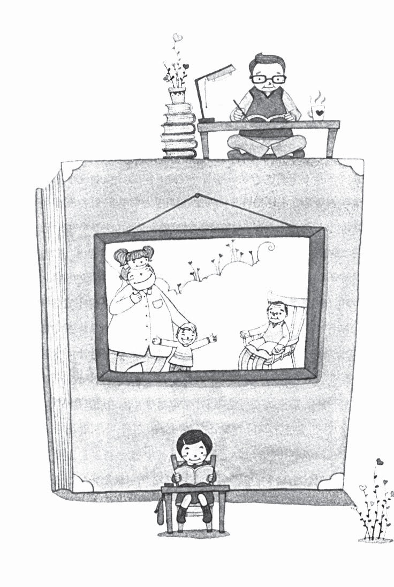
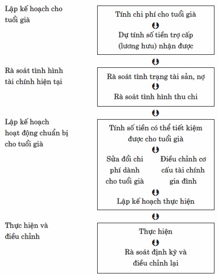
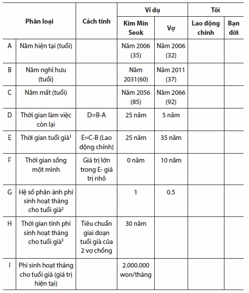
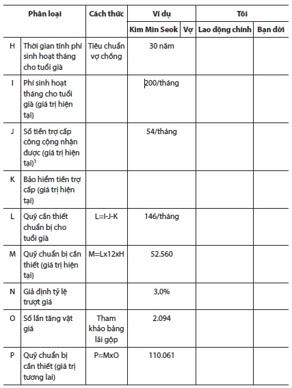
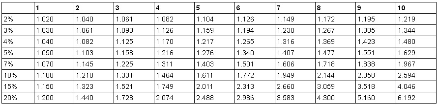
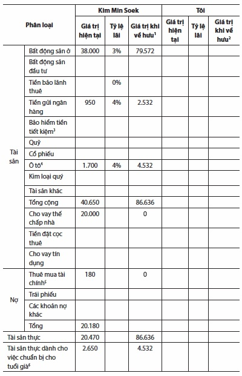
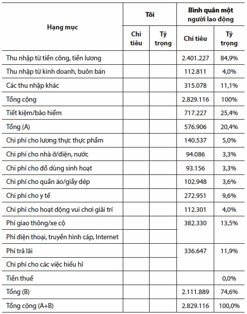
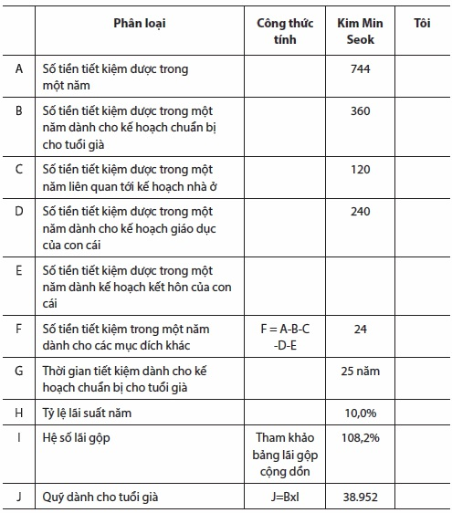
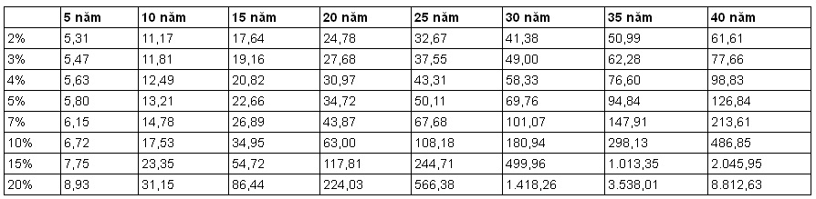
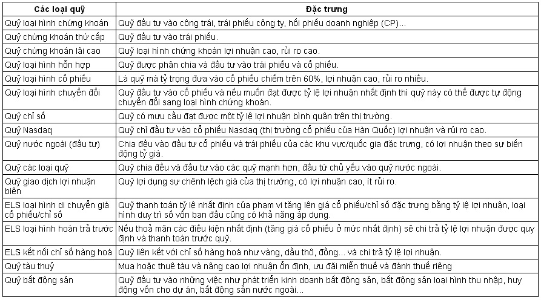

# Chương 4: Lập kế hoạch hành động theo từng độ tuổi

## Quyết tâm hành động!

Qua câu chuyện của Kim Min Seok chúng ta thấy tầm quan trọng của việc chuẩn bị cho tuổi già, từ đó chúng ta phải tìm hiểu và phải chuẩn bị như thế nào cho tuổi già. Bây giờ các bạn tạm quên đi câu chuyện của anh ấy và hãy đi vào câu chuyện của chính bản thân mình.

Kim Min Seok đã nhận thức được tầm quan trọng của việc chuẩn bị cho tuổi già và đã đi tìm câu trả lời cho mình từ rất sớm, còn bản thân bạn thì sao? Nếu bây giờ bạn là người chưa có bất kỳ suy nghĩ nào về tuổi già của mình thì chúng tôi hi vọng cuốn sách này sẽ giúp bạn suy nghĩ về việc chuẩn bị cho tuổi già của bạn, còn nếu bạn là người đã bắt đầu có sự chuẩn bị ở một mức độ nào đó thì chúng tôi hi vọng cuốn sách sẽ giúp bạn chuẩn bị cho tuổi già cụ thể và chi tiết hơn.

Câu chuyện của Kim Min Seok không phải là một trường hợp đặc biệt. Đây là câu chuyện chung của những người đang ở độ tuổi 30, 40 mà bạn có thể gặp trong đời sống hàng ngày. Những người không chuẩn bị cho tuổi già như Kim Min Seok chỉ có thể có một tương lai đen tối và ảm đạm. Khoản quỹ dành cho tuổi già như một sự chăm sóc cho tương lai có tầm quan trọng đặc biệt.

Để chuẩn bị cho tuổi già chiếm 1/3 cuộc đời bạn, bạn phải xây dựng những mục tiêu rõ ràng, có khả năng đạt được. Việc bạn rà soát tài sản và các khoản nợ, tình hình thu nhập chi tiêu và nhận thức một cách chính xác hoàn cảnh bản thân mình đang phải đối mặt là một việc rất quan trọng. Tùy vào tình hình thực tế đó bạn có thể giảm bớt hoặc điều chỉnh cơ cấu tài chính gia đình để ngăn chặn các khoản tiền thất thoát do việc chi tiêu, hoặc tìm cách nâng cao thu nhập.

Tuy nhiên, có một sự thật là đại bộ phận chúng ta khi lên kế hoạch cho tuổi già, điều mà chúng ta nghĩ đến nhiều nhất là tiết kiệm và hạn mức cho việc chuẩn bị cho tuổi già. Hơn nữa, tuổi thọ trung bình và tuổi nghỉ hưu ngày càng tăng, nên theo thời gian việc chuẩn bị cho tuổi già ngày càng khó khăn. Để giải quyết vấn đề này bạn cần biết việc bắt đầu chuẩn bị cho tuổi già sớm là việc vô cùng quan trọng. Giả sử bạn phán đoán rằng việc chuẩn bị cho tuổi già của mình đã muộn thì việc nâng cao mức thu nhập và tăng mức quỹ cho tuổi già một cách hiệu quả là một việc rất quan trọng. Trong giai đoạn này bạn sẽ phải chịu nhiều rủi ro nhưng bạn không được e ngại. Vì khi bạn có thu nhập và khi bạn trẻ hơn cho dù là một tuổi thì việc chịu một số rủi ro đó cũng là một việc có ích.

Cuối cùng, điều tôi muốn nhấn mạnh là “hành động”. Các bạn cảm thấy bất an về tuổi già thế nào, hay hôm nay cứ thế sống một cách chăm chỉ đã đúng chưa và trong thâm tâm hãy tin tưởng rằng bạn sẽ không mắc phải những điều ngớ ngẩn.

Bạn đã quyết tâm trong mọi việc chưa?

Vậy ngay bây giờ hãy cùng bắt đầu quyết tâm.

## Kế hoạch cho tuổi già

Cách dễ nhất trong việc lên kế hoach cho tuổi già và kiểm soát nó là sử dụng những hướng dẫn trên trang web của một cơ quan tài chính hoặc trang web chuyên ngành về phát triển tài sản. Nếu bạn nhìn vào mục kỹ thuật phát triển tài sản của trang web tương ứng bạn có thể thấy một danh mục thiết kế những kế hoạch dự phòng cho tuổi già thông thường được chuẩn bị sẵn. Chỉ cần nhập dữ liệu là có thể có một kế hoạch cho tuổi già một cách khái quát hoặc trạng thái chuẩn bị hiện tại.

Tuy nhiên, bạn cũng có thể tự tính toán, lập kế hoạch dựa trên những gợi ý từ các trang web. Hơn nữa, việc tự lên kế hoạch cho bản thân cũng có những ưu điểm nhất định như việc mình có thể liên tục tự sửa đổi và có khả năng quản lý nó.

Vậy từ bây giờ chúng ta hãy cùng nhau lên kế hoạch cho tuổi già. Để hiểu rõ hơn chúng ta cùng lấy trường hợp của Kim Min Seok làm ví dụ.

Với việc lập nên bảng biểu tính toán theo từng giai đoạn, chúng ta có thể nhập các con số vào bảng theo từng giai đoạn của từng người, sử dụng máy tính rồi hãy trực tiếp lên phương án cho tuổi già của mình. Các bước lên phương án cho tuổi già như sau:

### Bước 1: Lập kế hoạch cho tuổi già - Tính toán chi phí dự phòng cho tuổi già

Ở bước một chúng ta tính thời gian dành cho tuổi già thông qua tuổi hiện tại của bạn, thời kỳ nghỉ hưu dự kiến, tuổi thọ dự kiến (bao gồm cả người bạn đời) rồi dự tính phí sinh hoạt hàng tháng cần thiết cho tuổi già và tính khoản quỹ dành cho tuổi già cần thiết sau khi nghỉ hưu.

**Phí sinh hoạt cho tuổi già của tôi là bao nhiêu?**

1 Tiêu chuẩn giai đoạn tuổi già của vợ anh Kim Min Seok là bằng “năm 2066 - năm 2031 (thời điểm nghỉ hưu của Kim Min Seok)”.

2 Là tỷ lệ phí sinh hoạt trong thời gian sống một mình khi ta tính khoảng thời gian vợ chồng Kim Min Seok sống cùng nhau là 1.

3 (Thời gian vợ chồng sống cùng nhau x 1) + (Thời gian sống một mình x 0,5).

Giả sử Kim Min Seok sống đến 85 tuổi tức là sau 50 năm nữa và hiện tại tuổi thọ trung bình của phụ nữ Hàn Quốc cao hơn nam giới bảy tuổi, do đó chúng ta giả định vợ anh ấy sống đến 92 tuổi. Vậy thời gian tuổi già của vợ chồng anh Kim Min Seok là 25 năm (từ năm 2032 đến năm 2056) khoảng thời gian hai vợ chồng cùng sinh sống cộng với thời gian 10 năm (từ năm 2057 đến năm 2066) khoảng thời gian vợ anh ấy sống một mình và tổng cộng là 35 năm.

Khi vợ Kim Min Seok sống một mình sau khi anh ấy qua đời, chúng ta dự kiến chi phí sinh hoạt của cô ấy bằng 50% khi hai vợ chồng anh sinh sống cùng nhau và lấy thời gian chuẩn bị quỹ tuổi già (tiêu chuẩn sống hai vợ chồng) là 30 năm (25 năm x 1 + 10 năm x 0,5).

### Bước 2: Lên kế hoạch cho tuổi già - Dự kiến khoản trợ cấp

Hiện nay, hầu như mọi người đi làm đều tham gia bảo hiểm xã hội.

Tuy nhiên, như nhiều người lo lắng, trong tương lai do sự thiếu hụt trong quỹ trợ cấp công cộng nên tỷ lệ chi trả trợ cấp sẽ dần dần giảm. Để đặt ra được kế hoạch cuộc sống sau khi về hưu có mức độ an toàn cao hơn nữa, tốt nhất chúng ta chỉ nên coi phần trợ cấp lương hưu là thu nhập trong tương lai của mình, tuy không có một mức độ rõ ràng nào cả, nhưng có thể lấy 10 năm làm một đơn vị, cứ mỗi 10 năm lại lấy tốc độ giảm 10% để tính toán. Ví dụ người nhận được tiền trợ cấp từ sau 10 năm sẽ phản ánh 90% số tiền trợ cấp nhận được dự kiến hiện tại và người nhận được tiền trợ cấp từ sau 30 năm sẽ chỉ phản ánh được 70% số tiền trợ cấp nhận được dự kiến hiện tại.

Kim Min Seok dự kiến sẽ nhận được khoản tiền trợ cấp hàng tháng là 1.080.000 won vào năm 2036 lúc anh 65 tuổi, nhưng anh chỉ tính 540 nghìn won (bằng 50% khoản tiền dự kiến nhận được) vào quỹ chuẩn bị cho tuổi già.

**Tôi phải chuẩn bị bao nhiêu quỹ cho tuổi già?**

*(Đơn vị: 10.000 won)*

1 Kim Min Seok chỉ tính 50% số tiền trợ cấp dự kiến nhận được.

Bảng lãi gộp

-Số tiền bớt đi 1 từ giá trị xuất hiện trong bảng lãi gộp là phần tăng thực. Ví dụ giá trị 2.144 khi đã áp dụng trong 8 năm bằng 10% có nghĩa là tiền gốc (1) + lợi nhuận (1.144).

-Khi tính giá trị lãi gộp của khoảng thời gian trên 10 năm chỉ cần cộng tỷ lệ lợi nhuận lãi gộp của khoảng thời gian còn lại sau khi đã cộng tỷ lệ lợi nhuận lãi gộp với đơn vị 10 năm.

(Ví dụ: 3%, lãi gộp 25 năm = 3%, lãi gộp 10 năm x 3%, lãi gộp 5 năm = 1.344 x 1.344 x 1.159 = 2.094).

Vậy bây giờ tính tiền trợ cấp tích lũy rồi thử tính quỹ cần thiết để chuẩn bị cho tuổi già là bao nhiêu.

Sinh hoạt phí cho tuổi già mà Kim Min Seok chuẩn bị là 2 triệu won, nếu trừ đi 540 nghìn won giá trị hiện tại trong số khoản tiền trợ cấp dự kiến nhận được thì hàng tháng anh chỉ cần chuẩn bị 1 triệu 46 nghìn won. Quy mô quỹ cần thiết trong thời gian tuổi già là 525,6 triệu won tính trên giá trị hiện tại. Nếu tỷ lệ trượt giá là 3% thì giá trị hiện tại sau 25 năm là 1,1 tỷ won. Có nghĩa là vào lúc 60 tuổi Kim Min Seok phải có khoảng 1,1 tỷ won thì anh mới thể hưởng thụ cuộc sống tuổi già theo mong muốn.

Khi thời gian tuổi già càng dài, mức sinh hoạt phí hàng tháng giữ nguyên thì khoản quỹ cần thiết cho tuổi gia tăng lên nhanh chóng. Nếu khoản quỹ cần thiết cho tuổi già mà bạn tính toán là mức hầu như không thể đạt được thì cũng có thể giảm mức sinh hoạt xuống một chút. Việc điều chỉnh mức sinh hoạt cho tuổi già sẽ được thực hiện lại sau khi hoàn thành việc rà soát tình hình tài chính hiện tại. Dù khoản quỹ dành cho tuổi già có nhiều hơn suy nghĩ của bạn thì số tiền bạn có thể chuẩn bị sẽ khác nhau rất nhiều, tùy theo những yếu tố như mức tài sản hiện tại bạn đang sở hữu, mức tiết kiệm hàng tháng hay tuổi của bạn.

### Bước 3: Rà soát tình hình tài chính hiện tại, tình trạng tài sản và nợ

Sau khi tính quỹ cần thiết dành cho tuổi già bạn sẽ lần lượt rà soát tài sản, nợ và tài sản thực. Chúng tôi hi vọng bạn đã rà soát tài sản thực của bạn theo bảng có ở trang sau.

Khi phân loại tài sản có một vài điểm bạn cần lưu ý. Trong số các tài sản bạn đang sở hữu sẽ có những tài sản giá trị của nó sẽ tự nhiên biến mất theo thời gian. Ví dụ ô tô, vật dụng gia đình, đồ gỗ một lúc nào đó sẽ hỏng và mất đi. Với những tài sản mang tính tự phá huỷ bạn cần mạnh dạn loại trừ chúng ra khi đánh giá tài sản. Nhưng nếu là kế hoạch có chủ định đối với các tài sản có tính hao mòn như Kim Min Seok đã bán chiếc ô tô của mình thì có thể tính giá trị hiện tại của chúng vào tài sản.

Chúng ta cũng cần tính đến các khoản nợ. Hiện tại tiền đi ra từ túi của bạn và nếu là khoản nợ bạn phải trả bất kỳ lúc nào thì phải tính vào.

**Tình hình tài chính hiện tại của tôi như thế nào?**

*(Đơn vị: 10.000 won)*

1, 2 Giá trị tương lai của thời điểm nghỉ hưu. Áp dụng hệ số lãi gộp của bảng lãi gộp cho giá trị hiện tại (ví dụ: 38.000 x 2,094 = 79.572).

3 Trong số các loại bảo hiểm, bảo hiểm mang tính đảm bảo thực không phân loại theo tài sản mà chỉ tính phần bảo hiểm có thể được nhận lại vào thời điểm mãn hạn.

4 Ô tô dự định sẽ bán chứ không phải ô tô tôi đang sử dụng.

5 Trường hợp của Kim Min Soek đã tính 1,8 triệu won số tiền còn lại của khoản thuê mua ô tô.

6 Tài sản thực dùng để chuẩn bị cho tuổi già là tài sản phân loại riêng để dự phòng cho tuổi già một cách thực sự trong số tài sản hiện tại. Kim Min Seok đã chia tiền gửi ngân hàng và khoản tiền thu được từ việc bán ô tô vào quỹ chuẩn bị cho tuổi già và không tính đến khoản bất động sản cư trú.

-Tỷ lệ lãi có nghĩa chỉ mức lãi tăng lên của giá trị tài sản thực. Trong trường hợp lợi nhuận phát sinh từ tài sản (tiền cho thuê, lãi…) được phản ánh trên “thu nhập” thì sẽ không được tính vào mức lãi tài sản.

-Trường hợp tài sản không có lãi gộp thì sẽ tính giá trị tương lai bằng lãi đơn (tỷ lệ lãi x số năm).

Trường hợp của Kim Min Soek khi đánh giá tài sản và giá trị tương lai của các khoản nợ, giá trị tài sản liên tục tăng còn giá trị khoản nợ chỉ là 0. Điều này có nghĩa các khoản vay cầm cố nhà ở và khoản thuê mua tài chính sau 25 năm sẽ được trả hết nên số dư sẽ là 0. Khoản quỹ cần thiết cho việc hoàn trả những khoản nợ này được phản ánh bằng việc năng lực tiết kiệm giảm từ việc rà soát các khoản thu chi.

Nếu giá trị tài sản tăng lên và các khoản nợ được giảm đi thì quy mô tài sản thực sẽ tăng nhanh chóng, nhưng điều này mới chỉ là giá trị trên phương diện số học mà vẫn chưa được hiện thực hóa. Hơn nữa, vì tất cả các tài sản không thể được sử dụng cho quỹ dành cho tuổi già nên việc phân loại rõ ràng các loại tài sản sẽ dành cho quỹ tuổi già là một điều cần thiết. Các tài sản đã được phân loại dùng cho tuổi già bạn không được dùng vào các mục đích khác (như việc học hành của con cái, việc kết hôn của con cái, việc mở rộng khu nhà ở…). Giá trị tương lai của các tài sản này chỉ có thể được phản ánh vào quỹ dự phòng cho tuổi già.

Những con số có ý nghĩa trong bảng trên đều là “giá trị hiện tại của tài sản thực” có thể đánh giá xem thời gian vừa qua bạn đã tích cực tiết kiệm như thế nào, đã thực hiện kỹ năng quản lý tài chính thành công đến mức nào, giá trị tương lai của tài sản thực dành cho tuổi già đã được chuẩn bị dành cho quỹ dự phòng tuổi già. Thông qua tỷ lệ lãi ở bảng trên, bạn cũng thấy được mình đã sử dụng tài sản hiệu quả chưa.

### Bước 4: Rà soát tình hình tài chính hiện tại - Rà soát thực trạng tổng thu và tổng chi

Bạn cảm thấy thế nào sau khi thử rà soát lại tình trạng tài sản thực của bạn? Giá trị tài sản thực hiện tại càng nhiều càng tốt; nhưng bạn cũng không nên thất vọng nếu giá trị đó ít và cũng không nên quá vui sướng khi giá trị đó nhiều. Vì cho dù giá trị tài sản thực có ít nhưng nếu bạn có sự chuẩn bị vững vàng từ bây giờ thì sau 10 năm, 20 năm bạn vẫn có thể có một tuổi già ấm áp, và cho dù hiện tại tài sản thực của bạn nhiều nhưng sau này bạn không biết quản lý tài sản đó hiệu quả, tiêu xài lãng phí hoặc sử dụng kỹ năng quản lý tài chính sai lệch thì sau này bạn cũng có thể sẽ có một tuổi già khó khăn, nghèo khổ.

Nếu bạn đã tính giá trị tài sản thực hiện tại thì hãy cùng rà soát lại tình trạng thu và chi để có thể tính toán ra số tiền mà bạn có thể tiết kiệm được đến lúc bạn nghỉ hưu. Ở đây để đơn giản hóa các bước chúng ta không dùng cách phân tích tổng thu nhập và tổng chi tiêu trong tương lai mà Kim Min Seok đã dùng, mà chúng ta cùng tập trung tiếp cận theo cách tính số tiền hàng tháng chúng ta có khả năng tiết kiệm được.

Tìm hiểu tình hình thu nhập Trước tiên, nếu gia đình bạn có nhiều người cùng làm việc để kiếm sống thì bạn hãy tìm hiểu chi tiết thu nhập của từng người. Việc tính toán bằng khoản lương sau thuế đã được chuyển vào tài khoản ngân hàng sẽ tiện hơn cách tính lương trước thuế. Nếu có các thu nhập khác ngoài tiền công, tiền lương như thu nhập từ việc cho thuê, thu nhập từ kinh doanh và các khoản thu nhập khác thì bạn hãy tính riêng, trường hợp thu nhập năm của những người kinh doanh tự do không chính thức hay không rõ ràng thì cho dù có thu nhập khoản tiền được dự kiến khi điều hành doanh nghiệp với mức tính bình quân cũng sẽ không có ý nghĩa lớn.

Giờ bạn hãy thử rà soát các chi phí hàng tháng. Nếu gặp khó khăn trong bước tìm hiểu tình hình chi tiêu thì phải xem xét lại một cách thận trọng. Do bạn chưa có thói quen chi tiêu tiết kiệm, khi sử dụng tiền bạn cũng không biết dùng số tiền đó vào việc gì. Nếu bạn có sổ chi tiêu gia đình thì bạn có thể tính toán chính xác những chi phí dự trù. Nhưng hiện tại nếu bạn là người chưa viết sổ chi tiêu gia đình thì nhân đây tôi mong bạn hãy thử rà soát một cách chi tiết các hạng mục chi tiêu trong gia đình và số tiền dự tính cho các khoản đó.

Khi dự tính các khoản chi phí, việc bạn có thể phân ra các chi phí cố định và chi phí biến động sẽ là một việc làm tốt. Chi phí cố định là chi phí bạn không thể tùy ý điều chỉnh như tiền thuê nhà, tiền thuê mua ô tô, phí bảo hiểm, học phí, tiền thuế. Trái lại chi phí biến động là các chi phí có thể điều chỉnh và có thể chi tiêu tiết kiệm theo sự lựa chọn của bạn như tiền ăn, tiền học thêm, tiền tiêu vặt, tiền điện thoại, phí sinh hoạt các hoạt động vui chơi giải trí, chi phí cho quần áo.

Bạn hãy trực tiếp thử các bước phân tích chi phí một cách chi tiết và tôi hi vọng bạn hãy thử rà soát xem liệu bạn có thể giảm bớt các chi phí đó xuống mức bao nhiêu.

**Hiện tại tôi kiếm được bao nhiêu tiền và sử dụng hết bao**

**nhiêu?**

*(Đơn vị: won)*

Khi bạn so sánh chi phí của bản thân mình với chi phí bình quân của một người lao động trong bảng sau, chúng ta có thể thấy tỷ trọng chi tiêu theo từng hạng mục quan trọng hơn giá trị tuyệt đối. Và nếu bạn thử so sánh nó với bình quân của một gia đình người bạn thì bạn có thể dễ dàng phát hiện ra phần chi tiêu nhiều hơn trong các khoản chi phí của bản thân mình. Đặc biệt nếu tỷ lệ tiết kiệm nhỏ hơn giá trị bình quân thì nhất định bạn phải tìm ra nguyên nhân gây nên điều đó.

### Bước 5: Rà soát tình hình tài chính hiện tại - Rà soát năng lực tiết kiệm

Khi lên kế hoạch chuẩn bị cho tuổi già, yếu tố quan trọng nhất đó là năng lực tiết kiệm của bạn. Ở những phần trước chúng ta đã rà soát tình trạng thu chi đồng thời cũng đã dự tính số tiền có khả năng tiết kiệm được. Giả sử Kim Min Seok có thể tiết kiệm 1 triệu won trong một năm, ngoài ra anh có thể nhận được tỷ lệ lãi suất là 10%/năm thì sau 25 năm anh sẽ có số tiền 108,2 triệu won (1 triệu won x 108,2(1)). Và giả sử một năm bạn có thể tiết kiệm 3 triệu won thì số tiền bạn có được sẽ gấp ba lần con số 108,2 triệu won. Và bạn phải lưu ý không được tính năng lực tiết kiệm dùng cho toàn bộ số tiền có khả năng dự phòng cho tuổi già. Ngoài kế hoạch chuẩn bị cho tuổi già mục đích tiết kiệm có thể rất đa dạng như việc dành cho quỹ mua nhà (hoặc quỹ mở rộng khu nhà ở), quỹ dành để cho con cái học hành, quỹ dành cho việc kết hôn của con cái, quỹ đầu tư, hay như số tiền dự phòng cho những trường hợp khẩn cấp.

Khoản tiết kiệm dành chuẩn bị cho tuổi già cần được phân loại và quản lý rõ ràng với các khoản tiền dành cho mục đích khác. Để làm được điều này bạn nên mở một tài khoản riêng. Một điều nữa là do giá trị tương lai của khoản quỹ dành cho tuổi già sẽ rất khác nhau tùy thuộc vào sự giả định mức lãi suất năm, nên việc giả định một mức lãi suất có khả năng thực hiện được trong khoảng thời gian dài cũng là một việc vô cùng quan trọng. Vậy hàng năm bạn có thể tiết kiệm thêm được bao nhiêu?

**Một năm tôi có thể tiết kiệm được bao nhiêu?**

*(Đơn vị: 10.000 won)*

Trường hợp của Kim Min Seok đã áp dụng số tiền tiết kiệm hiện tại trên khoản lợi ích dự kiến làm số tiền có khả năng tiết kiệm được trong một năm.

**Bảng lãi gộp cộng dồn (lãi gộp theo đơn vị năm)**

*(Đơn vị: 10.000 won)*

-Sau một thời gian tích lũy bạn có khoản tiền bằng tổng số lãi theo tỷ lệ lãi suất và tổng số tiền gốc tiết kiệm được.

-Những con số trong bảng lãi gộp thể hiện số tiền bạn có được, trong đó có cả số tiền gốc, sau một khoảng thời gian tiết kiệm. (Ví dụ: giả sử hàng năm bạn tiết kiệm 1 triệu won với tỷ lệ lãi suất 10%/năm trong 20 năm thì con số trên bảng lãi gộp là 63,0 điều này có nghĩa là tổng số tiền đến mãn hạn 20 năm là 63 triệu won, bao gồm cả 20 triệu won tiền gốc).

### Bước 6: Rà soát số tiền mà bạn có khả năng dành được cho tuổi già

Bạn đã thử thực hiện những việc như rà soát quỹ tuổi già cần thiết, số tiền trợ cấp kỳ vọng nhận được, tài sản, nợ, thu, chi và năng lực tiết kiệm. Vậy giờ hãy tập hợp tất cả các con số đó rồi cùng đánh giá tình trạng chuẩn bị cho tuổi già và tính khả thi để đạt được mục tiêu đề ra.

Với trường hợp của Kim Min Soek thì quỹ dành cho tuổi già thiếu khoảng 660 triệu won. Điều này có nghĩa Kim Min Soek phải chuẩn bị thêm và trích ra cho quỹ này hoặc phải giảm mức sinh hoạt kỳ vọng trong tuổi già. Tuy nhiên giá trị tương lai của quỹ tiết kiệm cho tuổi già là số tiền được chuẩn bị tại thời điểm nghỉ hưu (trường hợp của anh Kim Min Soek là 60 tuổi). Thu nhập bạn có thể nhận được thông qua việc vận dụng khoản quỹ đã được chuẩn bị từ thời điểm nghỉ hưu đến khi qua đời cũng sẽ không được xét đến chứ? Nhưng với phần này tôi mong các bạn không nên đưa vào kế hoạch chuẩn bị cho tuổi già. Trước tiên nếu bạn nhiều tuổi bạn sẽ phải sử dụng tài sản tập trung vào tính an toàn hơn là tính lợi nhuận. Vì kinh tế càng phát triển thì tỷ lệ lãi suất thực tế có khuynh hướng càng tiến gần tới giá trị bằng 0 nên thu nhập từ khoản lãi thực tế (thu nhập danh nghĩa - tiền thuế - biến động vật giá) phát sinh từ quỹ tuổi già không lớn. Do đó mong các bạn chỉ tính một phần nhỏ cho kế hoạch chuẩn bị cho tuổi già. Và bây giờ việc định ra phương hướng và nỗ lực để đạt được mục tiêu đề ra quan trọng hơn việc dự đoán.

**Tình trạng chuẩn bị cho tuổi già và tính khả thi của việc đạt**

**được mục tiêu đề ra của tôi như thế nào?**

*(Đơn vị: 10.000 won)*

### Bước 7: Lập kế hoạch chuẩn bị cho tuổi già

Bạn đã tích lũy trước một khoản cần thiết cho tuổi già hoặc nếu bạn làm việc chăm chỉ và có thể tích lũy được khoản quỹ cần thiết cho tuổi già thì cuộc sống về già của bạn sẽ thoải mái hơn.

Nhưng nếu khoản tiền đó thiếu thì để củng cố khoản quỹ cho tuổi già bạn cần lên kế hoạch cụ thể ngay từ bây giờ rồi thực hiện và điều chỉnh lại kế hoạch đó một cách đều đặn.

Bạn có thể củng cố cho khoản tiền thiếu hụt kia qua ba cách.

Thứ nhất nâng cao năng lực tiết kiệm. Là việc hiện tại bạn cần giảm chi tiêu hay làm tăng thêm thu nhập rồi nâng cao năng lực tiết kiệm. Giả sử các tài sản làm phát sinh chi phí trước đây quá nhiều hoặc mức chi tiêu quá cao thì tôi mong rằng bạn nên mạnh dạn điều chỉnh lại cơ cấu tài chính của gia đình mình. Hàng tháng bạn chỉ đang chi tiêu các chi phí tối thiểu cho sinh hoạt nhưng bạn không tích lũy được một khoản quỹ dành cho tuổi già (mà dành tiền làm những việc khác) thì bạn hãy tính tới khả năng có thể nâng cao thu nhập tháng bằng cách tăng thời gian lao động. Do việc kéo dài thời gian lao động liên quan tới việc làm giảm khoảng thời gian tuổi già nên có thể rút ngắn quy mô của

## Kế hoạch dự phòng cho tuổi già khi bạn 20 tuổi

khoản quỹ dành cho tuổi già cần thiết.

Cách thứ hai là thanh lý các tài sản không có lợi nhuận, tài sản làm phát sinh chi phí (tiêu sản) rồi gia tăng các tài sản đem lại lợi nhuận. Ví dụ bạn hãy bán đi chiếc xe ô tô cao cấp và mua chiếc xe nhỏ hơn rồi đầu tư hiệu quả số tiền còn dư đó.

Cuối cùng bạn nên áp dụng các phương pháp nâng cao tỷ lệ lợi nhuận. Bằng việc đầu tư vào các sản phẩm mang lại lợi nhuận cao như vậy bạn sẽ làm tăng giá trị trong tương lai của số tiền tiết kiệm. Nhưng giả sử đến nay bạn vẫn chưa thể thành công với quản lý tài chính thì bạn cần nhờ đến sự giúp đỡ của các chuyên gia trong việc nâng cao giá trị lợi nhuận. Đây không phải là việc nhặt nhạnh lợi ích mà là việc giành lấy khoản lợi ích lớn. Việc bạn không có kiến thức và kinh nghiệm trong việc quản lý rủi ro và chỉ có mưu cầu về lợi nhuận cũng giống như việc “há miệng chờ sung rụng”. Lúc này bạn cần đến sự giúp đỡ của các chuyên gia.

### Bước 8: Thực hiện và tổ chức lại theo chu kỳ

Thông qua quá trình lên kế hoạch chuẩn bị cho tuổi già bạn phải kiểm tra tính khả thi của kế hoạch mà mình đã lập. Giả sử mọi việc được tiến hành theo đúng kế hoạch thì việc chúng ta sống trên đời này sẽ cực kỳ đơn giản, nhưng chúng ta cũng không biết rõ liệu mọi việc có được như thế không? Nếu kế hoạch chúng ta lập ra không phù hợp với quá trình thực hiện nó thì chúng ta phải tìm hiểu nguyên nhân, giải quyết vấn đề và phải thực hiện công việc điều chỉnh lại kế hoạch đó. Vậy bây giờ chúng ta sẽ xây dựng bản phác thảo của kế hoạch dành cho tuổi già. Sau đó sẽ xem xét chiến lược dự phòng cho tuổi già theo từng lứa tuổi. Tôi hi vọng chúng ta sẽ lập được chiến lược dự phòng cho tuổi già một cách hợp lý với độ tuổi và hoàn cảnh từng người đồng thời điều chỉnh được kế hoạch đó khi cần thiết.

Lứa tuổi 20 có thể gọi là lứa tuổi có nhiều cơ hội cho việc chuẩn bị cho tuổi già. Nếu bạn xem tuổi già trên quan điểm mang tính tài chính một cách đơn thuần thì lứa tuổi có thể nuôi dưỡng cây tài chính (money tree) bằng những hạt giống nhỏ nhất chính là những năm ở độ tuổi 20. Tuy đây là thời kỳ chúng ta mới bắt đầu đi làm và số tiền chúng ta kiếm được chưa phải là nhiều nhưng nếu bạn có ý thức, có mục tiêu rõ ràng để chuẩn bị cho tuổi già và có sự chuẩn bị từ bây giờ thì bạn có thể mong đợi một cây tài chính vô cùng lớn trong tương lai. Bạn cần tích lũy để có một khoản tiền đầu tư và cần tập trung vào những điểm sau đây:

- **Cẩn thận với đồng tiền!** Điều bạn phải nhớ trước hết ở tuổi 20 là việc có thể gặp những cái bẫy đáng sợ tùy thuộc vào việc bạn sử dụng đồng tiền của mình. Nếu một vài điều đi lệch hướng thì cuộc sống của bạn có thể sẽ rơi xuống địa ngục ngay từ khi bạn bắt đầu đi làm. Giả sử bạn bỏ quên năng lực của bản thân và chi tiêu mù quáng bạn có thể trở thành con nợ. Đặc biệt nếu bạn có thiên hướng chi tiêu quá độ thì bạn phải thiết lập các vấn đề quan trọng nhất để giải quyết trước. Tỷ lệ nợ người tiêu dùng như khoản nợ do việc sử dụng thẻ tín dụng thông thường chỉ được coi là phù hợp khi nó nằm trong phạm vi 20% thu nhập thực sau khi đã khấu trừ đi các khoản thuế. Giả sử lương của bạn trong phạm vi 2 triệu won sau thuế, thì số tiền sử dụng thẻ tín dụng trong tháng và số tiền trả vay nợ tín dụng phải được lên kế hoạch tài chính làm sao không vượt quá 400 nghìn won.

- **Nhớ rằng tiền là hạt giống tạo nên cây tài chính** Bất kỳ lứa tuổi nào cũng đều giống nhau, cần kiếm tiền và tích lũy tiền nhưng việc kiếm tiền không phải là việc dễ. Và việc có thể kiếm được tiền ở thời kỳ còn trẻ là niềm hạnh phúc vô cùng lớn. Một triệu won tiền lương bạn nhận được ở những năm đầu của tuổi 20 sẽ tương đương với số tiền lương ba triệu won bạn nhận được ở những năm đầu tuổi 40, và tương đương 15 triệu won bạn nhận được hàng tháng ở những năm đầu tuổi 60 (giả sử lãi gộp là 7%/năm). Không hề ngạc nhiên phải không? Tiền lương một triệu won lại tương đương với số tiền tiền trợ cấp 15 triệu won bạn nhận được hàng tháng ở những năm đầu của tuổi 60! Chính đồng lương bạn nhận được ở tuổi 20 là hạt giống của niềm hạnh phúc này. Nó có giá trị vô cùng lớn. Hạt giống đó đang dần dần lớn lên trong sự nuôi dưỡng của chúng ta và sau này nó sẽ trở thành cây tài chính mang lại cho chúng ta cuộc sống thoải mái, sung túc. Bạn sẽ từ bỏ 15 triệu won tiền trợ cấp trong tương lai để thoả mãn nhu cầu hiện tại (sản phẩm giá trị, ô tô, v.v...) sao? Tất nhiên đây là vấn đề bạn có thể lựa chọn và là vấn đề mang tính cá nhân. Nhưng nếu bạn cần một gợi ý thì tôi khuyên ở tuổi 20 bạn nên tiết kiệm (hoặc đầu tư) trên một nửa số lương bạn nhận được.

- **Tuổi 20 là độ tuổi tập trung phát triển bản thân vì sự thành công trong tương lai** Bạn cần mạnh dạn đầu tư cho sự phát triển bản thân ở tuổi 20. Nếu bạn bỏ lỡ cơ hội học hỏi thì sau này ở tuổi 30 bạn sẽ bắt đầu cảm thấy hối hận. Cũng giống như doanh nghiệp, nếu cá nhân không có sự đầu tư dài hạn thì việc tăng trưởng đều đặn sẽ rất khó. Ở tuổi 20 bạn phải định ra thứ tự ưu tiên của những công việc quan trọng vì tương lai của bản thân hơn là các công việc mang tính trước mắt và phải đầu tư cả thời gian, tiền bạc. Vì thu nhập của tuổi 30 và 40 sẽ phụ thuộc vào việc bạn chuẩn bị được bao nhiêu ở tuổi 20. Thế kỷ 21 là thời đại của thông tin tri thức. Bạn có khả năng tạo ra thu nhập bao nhiêu bằng chính trí tuệ và năng lực của bản thân phụ thuộc vào bạn. Bạn không muốn nắm bắt lấy khả năng đó sao? Nếu muốn làm được điều đó bạn hãy ưu tiên đầu tư cho bản thân mình trước.

- **Đây là thời kỳ quyết định những sự kiện trọng đại của cuộc đời, nên hãy lắng nghe lời khuyên của mọi người** Là thời kỳ quyết định nhiều sự kiện trọng đại của cuộc đời như việc lựa chọn công việc, việc kết hôn… nên tuổi 20 cần nhiều sự phán đoán mang tính chủ quan và tính cá nhân. Điều này có thể ảnh hưởng tới cả cuộc đời của một con người và việc tiếp thu lời khuyên của những người có kinh nghiệm ở xung quanh chúng ta là việc đáng được khích lệ hơn việc chỉ dựa vào phán đoán của riêng bản thân mình.

Ngoài ra, đây cũng là thời điểm bước những bước chân đầu đời trong cuộc sống xã hội, tuổi 20 là thời kỳ rất quan trọng chuẩn bị cho khoảng thời gian 30 năm làm việc trước mắt như tuổi 30, tuổi 40, tuổi 50. Và trên phương diện tài chính tuổi 20 cũng có ý nghĩa như vậy. Thói quen chi tiêu, kinh nghiệm đầu tư được hình thành ở tuổi 20 có ảnh rất lớn tới cuộc sống sau này của bạn.

- **Mối quan tâm tài chính của tuổi 20 là việc chuẩn bị chi phí kết hôn và tiền đặt cọc thuê nhà** Một trong những mối quan tâm tài chính ở tuổi 20 là việc chuẩn bị chi phí dành cho việc kết hôn và tiền đặt cọc thuê nhà (hoặc khoản quỹ nhà ở). Nó có thể là vấn đề mà bản thân bạn phải tự giải quyết, nhưng nó cũng có thể là phần mà bạn nhận được từ sự giúp đỡ của các thành viên trong gia đình. Trong cuộc đời những vấn đề thường không phát sinh một cách tuần tự. Và bạn phải áp dụng quy tắc giống như trong việc tiết kiệm. Tại một thời điểm bạn không chỉ tiết kiệm cho một mục đích. Việc tiết kiệm ở tuổi 20 không phải chỉ có chuẩn bị chi phí cho việc kết hôn mà còn tiết kiệm cho các mục đích như tham gia bảo hiểm nhân thọ, bảo hiểm bệnh tật và chi phí cho tuổi già trong tương lai. Hơn bao giờ hết việc chuẩn bị trước mọi thứ vô cùng quan trọng. Do đó bạn phải có sự am hiểu để có thể lựa chọn những sản phẩm tài chính phù hợp cho hoàn cảnh của mình.

Sau khi bạn suy nghĩ về quy mô quỹ cần thiết, bạn phải lựa chọn được những sản phẩm tài chính phù hợp với quy mô đó và bạn phải bắt đầu với phương hướng nâng cao tỷ suất lợi nhuận một cách ổn định trên cơ sở những mục đích dài hạn. Có nghĩa là việc bạn kết hợp sở hữu những sản phẩm mang lại lợi nhuận cao và những sản phẩm có tính chất bảo tồn duy trì số vốn gốc theo tỷ lệ phù hợp rồi hình thành nên danh mục đầu tư và lựa chọn những sản phẩm tài chính có thể đem lại lợi nhuận cao là việc làm tốt. Ở tuổi 20 thông thường có nhiều trường hợp bắt đầu bằng việc làm công ăn lương và tỷ lệ những người liên tục duy trì công việc này đến lứa tuổi 50 là tương đối nhiều. Như vậy trong khi bạn phải trả thuế cả đời thì bạn nên chia đều số tiền hiện có đầu tư vào nhiều hạng mục để giảm bớt tính rủi ro. Ở tuổi 20 bạn có thể thử xem xét việc gia nhập một số sản phẩm tài chính cơ bản sau:

**Các sản phẩm tài chính cần xem xét ở tuổi 20**

## Kế hoạch dự phòng cho tuổi già khi bạn 30 tuổi

Mối quan tâm chủ yếu mang tính kinh tế ở độ tuổi 30 nói gì đi nữa thì đó cũng là “sự chăm lo cho gia đình” như việc mua nhà và việc giáo dục con cái. Sự kiện kinh tế xuất hiện chủ yếu trong thời kỳ này là việc chuẩn bị nhà ở, sử dụng việc thế chấp cầm cố, mua ô tô mới, giáo dục con cái và các chi phí cho việc chăm sóc con. Ở tuổi 30 này việc điều chỉnh một cách hợp lý phần mâu thuẫn giữa sự thoả mãn hiện tại (tiêu dùng) và dự phòng cho tương lai (tiết kiệm) là vô cùng quan trọng.

- **Nếu bạn đang bắt đầu lên kế hoạch tài chính cho tương lai thì hãy tìm hiểu từ tình trạng tài chính hiện tại** Nếu ở tuổi 30 bạn đọc cuốn sách này và bây giờ bắt đầu lên kế hoạch tài chính thì việc đầu tiên bạn phải làm là hãy thử rà soát một cách triệt để tình trạng tài sản và nợ của bản thân mình. Liệu bạn có những tài sản đang làm tiêu hao tiền bạc của mình không? Bạn đang chi tiêu các chi phí có tỷ lệ lãi suất quá cao không...? Mặc dù bây giờ bạn kiếm được nhiều tiền nhưng “bạn không biết số tiền đó đã đi câu cả” và có những người tự suy nghĩ, phân tích xem trong một tháng bản thân mình đang dùng tiền vào việc gì, đồng thời thử lập nên một bảng cân đối giữa tài sản và nợ của bản thân mình ra sao. Nhưng cũng có những người ghét cảm giác phải làm những công việc vụn vặt này và không tìm hiểu đánh giá tình trạng tài chính của mình. Nhưng nếu không muốn trở nên khổ sở trong tương lai thì việc cảm nhận chính xác công việc vụn vặt kia ngay từ bây giờ là điều rất quan trọng.

Khi tìm hiểu đánh giá tình trạng tài chính không nên quá phóng khoáng với bản thân. Sau khi đánh giá tình trạng tài chính của mình, bạn cần mạnh dạn loại bỏ các tài sản không cần thiết hoặc các tài sản tiêu tốn quá nhiều tiền so với lợi ích mà nó mang lại và phải bắt tay vào quá trình trả nợ bằng chính khoản tiền bạn thanh lý các tài sản đó.

- **Đừng tính toán quy mô tài sản mà hãy luôn kiểm soát các tài sản thực (tài sản - nợ)** Một trong những vấn đề phải làm ở tuổi 30 là chuẩn bị nhà ở. Nhiều người coi ngôi nhà là phương tiện để kiếm lời. Nhưng với việc tỷ lệ sinh đang giảm đi và việc già hoá dân số đang diễn ra thì ngôi nhà sẽ được chuyển từ tài sản đầu tư sang tài sản sử dụng. Và việc mang một khoản nợ kếch sù để nhận lấy một ngôi nhà quá lớn vượt quá khả năng tài chính của bạn là việc không được mong đợi.

Kim Min Seok đã mua được nhà từ rất sớm. Tại công ty anh là người có năng lực và vừa được thăng chức. Nếu chỉ nhìn bề ngoài thì Min Soek sẽ có một tương lai tươi sáng. Nhưng anh đã vay một khoản nợ quá lớn để mua nhà và mua xe sang trọng. Trên thực tế anh đã không thể tích lũy được tiền ở thời kỳ mà đáng lẽ ra anh có kể tiết kiệm được nhiều nhất với khoản giá trị đó. Đó chỉ là sự hào nhoáng bên ngoài chứ không có giá trị thực. Đằng sau bề ngoài hoành tráng (nhà to, thể diện xã hội, xe lớn) là một giá trị nghèo nàn. Thu nhập phải được dự phòng ngang với quy mô của nó. Tỷ lệ nợ liên quan tới vấn đề chỗ ở được cho là phù hợp khi nó nằm trong giới hạn 30% tổng nhu nhập của bản thân và phải nằm trong phạm vi nhất định của năng lực mà bạn có thể trả nợ hơn là tỷ lệ nhất định của quy mô nhà ở.

- **Hãy cẩn thận với việc đầu tư sử dụng vốn vay ở tuổi 30** Vấn đề cần xem xét ở đây là việc quản lý nợ ở tuổi 30. Nếu bạn sử dụng các khoản nợ này một cách thông minh thì nó sẽ đóng vai trò như phép số nhân (đòn bẩy), nhưng trong trường hợp bạn sử dụng sai lầm thì nó sẽ tạo ra một vấn đề lớn (phá sản tài chính gia đình, con nợ tín dụng...) mà bạn không thể xoay chuyển được ở tuổi 30. Bạn có thể mua nhà, thuê nhà dài hạn, mua hàng hoá tiêu dùng, mua tài sản đầu tư, đầu tư cổ phiếu... nhưng ở đây chúng ta phản đối việc vay nợ và đầu tư khi nó không phải là trường hợp đặc biệt. Có nghĩa là việc vay nợ để tạo ra lợi nhuận mang tính rủi ro nhưng không cung cấp những lợi ích từ nơi ở đó như việc vay mượn liên quan tới ngôi nhà tôi đang ở, vay mượn thế chấp đối với những đồ vật làm phát sinh lãi hay việc làm phát sinh dòng tài sản tiền mặt,… phần lớn có thể sẽ trở thành kẻ thù cản trở kế hoạch chuẩn bị cho tuổi già của bạn. Hãy cân nhắc! Thông thường để làm tăng lợi nhuận đầu tư lớn hơn lãi suất vay thì bạn phải chấp nhận mức rủi ro lớn hơn.

- **Hãy chuẩn bị cho tuổi già vì chính mình và gia đình của mình** Chuẩn bị cho tuổi già mà chúng ta đang nói là vì sự ổn định và hạnh phúc của cả bản thân mình và gia đình mình. Chúng ta đã thử suy nghĩ về vấn đề này chưa? Gia đình tôi có được an toàn không khi tai nạn xảy ra với tôi? Chúng ta đã có sự chuẩn bị dự phòng cho những đứa con xinh đẹp và người bạn đời yêu quý của mình chưa? Và đối với tôi yếu tố rủi ro mang tính số mệnh là gì? Tôi đã có dự phòng đối với bệnh tật, tai nạn hay sự ra đi đột ngột chưa? Đây là một trong những chủ đề quan trọng khi ta 30 tuổi. Tuổi 30 là thời điểm tôi phải rà soát lại phạm vi được chi trả của loại hình bảo hiểm nhân thọ mà tôi đã tham gia ở tuổi 20 và kiểm tra lại việc tăng lên của số tiền bảo hiểm đồng thời mở rộng phạm vi được chi trả. Chúng ta nên biết tuổi càng nhiều thì việc tham gia bảo hiểm càng trở nên khó khăn (phí bảo hiểm đắt hơn, và sẽ có một số điều khoản trong việc tham gia bảo hiểm bị hạn chế do vấn đề về sức khoẻ). Cũng giống như tuổi 20, sau khi suy nghĩ về quy mô tiền quỹ cần thiết ta phải ưu tiên lựa chọn những sản phẩm tài chính phù hợp với quy mô đó, phải có mục tiêu cụ thể (chi phí giáo dục cho con cái, quỹ dành cho tuổi già, trả nợ nhà ở, bảo hiểm) và phải xây dụng một danh mục đầu tư tài chính. Sản phẩm tài chính của tuổi 30 nên xem xét như tình hình tài chính của bản thân và mức độ rủi ro cho phép, thời kỳ sử dụng của nguồn vốn, phân loại mang tính ngắn hạn, dài hạn rồi tiếp cận nó. Quỹ dành cho tuổi già và quỹ dành cho giáo dục sẽ phải tiếp cận theo hướng trung và dài hạn chứ việc đầu tư ngắn hạn sẽ không mang lại kết quả đầu tư đáng thoả mãn và đừng phạm những sai lầm để liên tục phải sửa đổi lại chiến lược đầu tư. Khi đầu tư dài hạn chúng ta cần lựa chọn rồi đầu tư những sản phẩm có thể giảm thiểu sự rủi ro.

**Sản phẩm tài chính cần xem xét ở tuổi 30**

## Kế hoạch dự phòng cho tuổi già khi bạn 40 tuổi

Ở tuổi 40 quan trọng nhất đó là “hình thành tài sản”. Những sự việc phát sinh ở thời kì này chủ yếu là thay đổi nhà ở, chuẩn bị tiền học cho con cái, chuẩn bị tiền hưu trí. Ngoài ra, bạn cũng cần suy nghĩ về những vấn đề liên quan đến sự nghiệp của bản thân như chuyển công ty hoặc tìm công việc làm thêm.

Kim Min Seok bước vào tuổi 40 với nỗi lo tài chính ngày càng lớn.

Nếu khi chúng ta 40 tuổi giống với Min Seok thì chúng ta rất cần có bảng cân đối chi tiêu trong gia đình.

- **Hãy bắt đầu hình thành thói quen cân đối thu chi trong gia đình** Nếu ở độ tuổi 30 mà bạn chưa chuẩn bị đầy đủ cho tuổi già giống như anh Kim Min Seok thì bạn cần tạo cân đối thu chi trong gia đình.

Tài sản mà bạn có năm bạn 40 tuổi có thể là tài sản đầu tư, trợ cấp thôi việc, bất động sản như nhà ở và đất đai, cũng có thể là các khoản khi bạn nghỉ việc như tiền hưu trí, các khoản nợ bảo đảm bằng đất đai, trả góp mua xe, nợ tín dụng, các khoản có thể trả bằng thẻ tín dụng. Đến tuổi 40, bạn cần hình thành kết cấu tài sản gia đình cho mình.

- **Cân đối chi tiêu gia đình bắt đầu từ việc xử lý các khoản nợ** Bạn cũng đã biết việc tăng hay giữ gìn khoản tiền tích góp được cho tuổi già không hề dễ dàng. Nhiều người sau bao nhiêu năm tích góp đã giật mình tự hỏi: “Có phải do trượt giá nên giờ mình mới có bằng này tiền hay không?”. Chính vì thế việc cân đối thu chi gia đình rất cần thiết. Bạn nên ưu tiên việc tập hợp các khoản nợ và khoản chi tiêu. Hãy đối diện với thực tại. Hãy thận trọng cân đối lại bảng chi tiêu của bản thân. Và cũng nên tính thử xem tài sản thực có của bạn là bao nhiêu, xem tài sản của bạn tính theo giá trị thực tại là bao nhiêu? Có thể nói bạn hãy thử bắt đầu chỉnh lý từ những khoản nợ có lãi suất cao. Cũng nên giảm bớt số lượng thẻ tín dụng của mình.

- **Điều chỉnh cân đối chi tiêu** Những tài sản bao gồm phí phát sinh cũng giống như những khoản nợ. Hãy điều chỉnh tài sản có phí phát sinh với tâm lý như là bạn đang đi trả nợ. Thêm vào đó hãy sắp xếp và bỏ đi những tài sản không cần thiết, vật phẩm đã quá hạn sử dụng, những tài sản không quan trọng. Chiếc xe mà tôi đang đi liệu có quan trọng hơn tuổi già của tôi? Những tài sản thuộc quyền sở hữu của tôi có thể giúp gì cho việc tăng doanh thu của tôi hay không? Mỗi khi bạn nghĩ về một đồ vật hay tài sản của bản thân, trước hết phải đặt câu hỏi: “Đồ vật này có thể giúp ích gì cho tôi, có thể làm cho tôi trở nên hạnh phúc hay không?”. Việc tiết kiệm cũng chính là hi sinh những khoản chi tiêu hiện tại để chuẩn bị cho tương lai. Nếu khoản tiết kiệm của bạn vẫn thiếu thì bạn phải kiểm tra lại các chi tiêu trong hiện tại.

- **Tăng thu giảm chi** Tuy đây chỉ là một câu chuyện đơn giản nhưng nó có thể cho chúng ta biết tầm quan trọng của lời nói khi bạn đã 60 tuổi. Càng nhiều tuổi bạn càng khó làm việc dù có muốn hay không. Hiện nay, trong xã hội chúng ta những người 40 tuổi khó có thể làm các việc nặng nhọc, nhưng bạn đừng lo, hãy dũng cảm và nghĩ rằng mình vẫn còn trẻ. Thực tế bây giờ bạn không thể làm gì? Nếu bạn xem xét và sắp xếp tất cả những hạng mục trên thì bạn sẽ thấy mình vẫn còn rất nhiều sức lực và hi vọng. Trong những khoản chi của bạn, có lẽ khoản chi nhiều nhất chính là tiền chi cho việc học tập của con cái. Cách tiếp cận và giá trị liên quan đến việc giáo dục con cái từ phía gia đình và cá nhân có thể sẽ khác nhau. Hãy đứng ở phía lập trường của những ông bố bà mẹ luôn thận trọng và suy nghĩ kĩ lưỡng trước bất cứ lựa chọn nào liên quan đến tương lai của con cái mà suy nghĩ thử xem. Đúng là việc học của con cái thật sự quan trọng hơn những trù bị về già của bạn, nhưng mong bạn hãy suy nghĩ thật thận trọng xem lựa chọn nào mới thật sự là vì con cái.

- **Suy nghĩ thận trọng về tiền vốn (tiền hạt giống)** Tuổi 40 chính là thời kì bắt đầu gom góp tiền (bình thường tuổi 40 là tuổi đỉnh cao của thu nhập). Thế nhưng cũng có trường hợp đầu tư liều lĩnh khoản tiền vốn đã gom góp như thế vào những khoản tiền không mong đợi. Có người đầu tư bất động sản cho dù không nhạy bén về thông tin nhà đất, có người mua cổ phiếu trong khi không biết rõ về nó, chỉ nổi lòng tham khi nghe tin là cổ phiếu đó sẽ tăng giá. Đến năm 40 tuổi mà bạn còn đánh mất số tiền quý giá tích cóp được theo cách đó thì sau 40 tuổi bạn sẽ khó lòng lấy lại được số tiền đó. Ở tuổi 40, việc hạn chế lòng tham và sự đố kỵ cũng rất quan trọng.

- **Dựa vào người cố vấn tài chính** 40 tuổi là thời điểm quan trọng nhất trong việc tích lũy tài sản. Tuổi 40 là tuổi có nhiều nguồn thu nhất trong cuộc đời và việc chi tiêu cũng ở đỉnh điểm nên một vài quyết định về tài chính có thể ảnh hưởng lớn đến bản thân bạn. Theo đó người cố vấn tài chính có thể giúp ích cho bạn trong những quyết định này. Người cố vấn tài chính của bạn không nhất thiết phải là nhân viên của công ty tài chính mà chỉ đơn giản là người có chuyên môn về tài chính mà bạn tin tưởng. Trước kia, lãi suất cao nên bạn chỉ cần tích góp trong thời gian nhất định là có thể đảm bảo tài chính khi về già, nhưng thời thế thay đổi thì bạn cần có một người cố vấn về tài chính đứng ở đằng sau để đảm bảo an toàn cho tài sản của bạn cũng thay đổi theo xu thế của thời đại.

- **Lựa chọn sản phẩm tài chính tuổi 40** Từ tuổi 40 trở đi tài sản dùng cho tuổi già mà nền móng của chúng là tiền vốn dành dụm trong suốt thời gian trước đó sẽ được sinh sôi. Để điều hòa lợi nhuận và tính an toàn, đòi hỏi người đầu tư phải linh hoạt. Những sản phẩm tài chính của tuổi 40 cũng cho thấy sự khác biệt lớn so với những gì đã chuẩn bị của bản thân từ năm 30 tuổi. Khi đã có tài sản dành dụm thì từ nửa sau tuổi 40, bạn sẽ chuyển trung tâm tập trung từ “gia tăng” sang “giữ gìn”, nhưng nếu tài sản dành dụm vẫn chưa đủ thì bạn vẫn phải lấy trọng tâm là việc “gia tăng”.

Bạn cần phải chuẩn bị trên 70% số tiền cho tuổi già khi bạn 40 tuổi. Vì ở tuổi 50 bạn có thể phải đối diện với những vấn đề phát sinh, mối nguy hiểm không thể dự đoán trước (như là nghỉ việc sớm) và những việc chưa được xác định rõ ràng.

Tuổi 40 là thời điểm cần đến những kĩ năng tài chính nhất trong cuộc đời. Phần lớn là ở tuổi 30, chậm lắm là những năm đầu 40 hầu hết mọi người đã chuẩn bị được nhà cửa, đất đai và đã tương đối ổn định về tài chính nhưng cũng có thể xuất hiện những trường hợp khác cần đến kĩ năng tài chính. Ở tuổi 40, mỗi tháng ngoài tiền tiết kiệm thì việc quan trọng là bạn phải sử dụng linh hoạt khoản tiền cố định. Bạn nên duy trì những sản phẩm tài chính “dài kì” mà bạn có năm 20, 30 tuổi và cũng phải quan tâm đến những sản phẩm mới. Chúng ta cùng xem xét về quỹ tiền vào tuổi 40.

**Sản phẩm tài chính cần xem xét ở tuổi 40**

## Kế hoạch dự phòng cho tuổi già khi bạn 50 tuổi

Tuổi 50 là khi gia đình đã yên ấm, là thời điểm chuẩn bị nghỉ hưu. Ở tuổi 50 so với việc kiếm tiền thì việc chi tiền có lẽ là nhiều hơn. Theo đó so với tuổi 40 thì bạn cần phải tiết chế các hoạt động chi tiêu nhiều hơn nữa, là thời điểm yêu cầu bạn phải kiểm tra nghiêm túc về số tiền đã chuẩn bị cho tuổi già của mình. Ở tuổi 50, chúng ta cần chú ý vào những điểm như sau và cần phải cố gắng chuẩn bị tài chính cho tuổi già.

- **Dần dần chuẩn bị cho tuổi già** Đây chính là lúc bạn phải tự chuẩn bị và chịu trách nhiệm với tuổi già của mình. Tuy sẽ có nhiều khoản chi tiêu phải dùng đến như việc kết hôn và học tập của con cái nhưng bạn nên biết rằng việc chuẩn bị cho tuổi già của bạn cũng quan trọng không kém. Ở độ tuổi này, bạn cần phải có trong tay 90% số tiền mà bạn cần có cho tuổi già sau những năm bạn 60 tuổi.

- **Cẩn thận khi đầu tư vào những lĩnh vực có độ rủi ro cao** Ở độ tuổi 20, 30 dù bạn có chịu tổn hại khi đầu tư tài sản vào những nơi có độ rủi ro cao thì việc đó cũng vẫn có thể coi là một cơ hội nhưng khi bạn đã 50 tuổi thì không còn là như vậy nữa. Ở tuổi 50 nếu bạn tổn thất lớn về tiền bạc thì bạn sẽ gặp phải vấn đề lớn trong thu chi gia đình và việc chuẩn bị cho tuổi già của bạn. Vì thế khi 50 tuổi, bạn cần phải đầu tư thích hợp vào nơi có tính ổn định, độ rủi ro thấp hơn là đầu tư vào nơi có lợi nhuận cũng như độ rủi ro cao, đến bây giờ thì những tài sản có tính nguy hiểm cao trong tài sản của bạn phải được giảm dần cho đến hết và cần làm tăng độ ổn định và tính minh bạch trong tài chính của bạn. Thêm vào đó, bạn cần phải đầu tư đa dạng và tránh đầu tư tài sản tập trung.

- **Cần có những nền móng bất động sản như nhà ở, đất đai** Bất động sản là một phần quan trọng trong cấu trúc tài chính của bạn ở tuổi 50. Cho đến bây giờ, việc tăng giá bất động sản vẫn là điều hiển nhiên nên mọi người vẫn ưu tiên đầu tư cho nhà ở và các loại bất động sản khác. Thế nhưng sau này sẽ như thế nào? Nếu giảm tỷ lệ sinh và dân số già thì khi nhìn vào thị trường bất động sản chúng ta sẽ không có nhiều hi vọng như trong quá khứ nữa. Điều đó sẽ giúp ích cho quyết định của bạn trong việc sở hữu bất động sản hay bán chúng đi.

Thứ nhất, khi giảm tỷ lệ sinh thì nhu cầu về bất động sản sẽ giảm, hơn nữa dân số già đi thì sau 10 năm nữa sẽ có nhiều người chuẩn bị cho tuổi về hưu, điều đó có nghĩa là sẽ bắt đầu giảm thiểu quy mô hoặc giao dịch bất động sản. Do đó việc cung cấp nhà ở lâu dài sẽ xuất hiện xu hướng vượt quá nhu cầu, xu hướng biến đổi đó có thể ảnh hưởng lớn đến tuổi già của chúng ta. Dù giá đất đai bất động sản tăng hay giảm, thì lợi nhuận trông đợi của bất động sản so với quá khứ chắc chắn sẽ thấp hơn.

Thứ hai, mạng internet ngày càng phát triển nên các loại hình kinh doanh trực tuyến cũng ngày càng gia tăng, vì thế nhu cầu tại các trung tâm bán lẻ sẽ giảm xuống.

Thứ ba, bạn sẽ gặp khó khăn nếu bạn vay tiền, đầu tư vào bất động sản, bởi gánh nặng tiền lãi. Đặc biệt, thời kì khi bạn 50 tuổi là khi thu nhập có thể bị đình trệ hay giảm thiểu nên sẽ rất khó khăn từ gánh nặng chi phí cao khi sở hữu quá nhiều bất động sản.

Thứ tư, để ngăn chặn sự gia tăng giá cả bất động sản thì chính phủ sẽ có chính sách cho bất động sản, bạn cần biết sự thật rằng không phải nhà đầu tư nào cũng bảo đảm sự ổn định và lãi suất cao cho bất động sản. Do các loại thuế có giá trị cao về việc chuyển giao lợi nhuận và gánh nặng thuế sở hữu bất động sản, nên nếu bạn mua một căn hộ rồi lấy đó làm nền tảng chuẩn bị cho tuổi già thì bạn có thể gặp một lỗi lớn.

Những điều trên cho thấy bạn cần phải xem xét một số vấn đề như giảm quy mô bất động sản khi bạn đã ở tuổi 50 hoặc là chuyển chỗ ở qua khu ngoại ô. Bạn cần phải tỉnh táo sử dụng linh hoạt các loại bất động sản thuộc sở hữu cá nhân để chuẩn bị khi về già.

- **Chuẩn bị cho cuộc sống sau khi về hưu** Vì dân số xã hội đang già đi nên cơ hội cho những người đã về hưu có thể làm việc rất rộng mở. Do đó sau khi về hưu bạn cần lên kế hoạch cho những việc có thể làm được và chuẩn bị cho chúng. Dù bạn làm việc có phải vì lí do tiền bạc hay không thì thực tế là bạn có việc để làm, có nơi để đi, như thế cũng làm cho tuổi già của bạn có ý nghĩa hơn và điều đó cũng cho thấy bạn chưa hề già. Khi bạn 50 tuổi là thời kì quan trọng để lập kế hoạch chuẩn bị cho cuộc sống tái sinh lần thứ hai của bạn.

- **Lựa chọn sản phẩm tài chính tuổi 50** Độ tuổi 50 là thời điểm cuối cùng để chuẩn bị cho tuổi già. Vì thế, bạn phải giữ được tài sản ổn định và phải áp dụng khái niệm “giữ gìn” hơn là “làm tăng”. Dĩ nhiên điều này không có nghĩa tất cả các khoản áp dụng đều là tài sản an toàn (tiền lương, khoản nợ..). Ở đây, bạn cần sử dụng linh hoạt các loại quỹ đa dạng để có thể đạt được các lợi nhuận an toàn của khoản tiền lương. Sau tuổi 50, điều quan trọng nhất là bạn phải tuân thủ nguyên tắc đầu tư an toàn. Lúc này bạn cũng cần phải trả hết những khoản vay mượn, kể cả đó là vay mượn mua nhà. Xác định mức lương hưu mình sẽ nhận được từ nhà nước, nếu phát hiện thấy mức lương còn chưa đạt đến “mức sống thấp nhất” thì cần phải thông qua việc tham gia bảo hiểm dưỡng lão dạng trọn đời để đảm bảo thu nhập sau này sẽ đạt mức trên “mức sống thấp nhất” đó. Giả sử những năm tuổi già bị mất toàn bộ tài sản hoặc thu nhập thì chúng ta vẫn có thể thông qua những thu nhập nói trên để duy trì cuộc sống.
