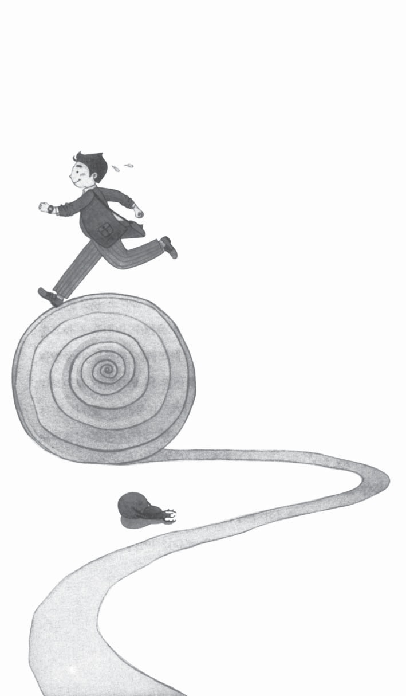
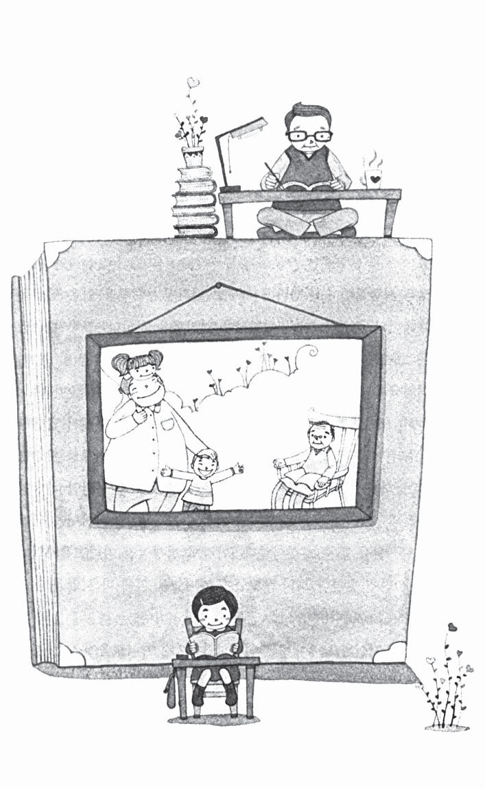

# Phụ lục: 9 Nguyên tắc trù bị cho tuổi già

## Nguyên tắc 1: Thành công trong công việc

Dù gì bạn làm công việc gì thì bạn đều phải cố gắng làm tốt, đây là yếu tố quan trọng để bạn đạt được thành công trong công việc. Thành công trong công việc sẽ giúp bạn tiến gần hơn đến con đường giàu có. Gần đây rất nhiều người học các chiến lược làm giàu. Thế nhưng dù là chiến lược đầu tư hay chiến lược làm giàu nào thì chiến lược cũng cần được hình thành từ nền tảng thu nhập ổn định và an toàn. Dù bạn có tài sản lên đến 10 tỷ won thì bạn vẫn phải theo nguyên tắc này. Người có thu nhập ổn định có sự khác biệt lớn với người không có nguồn thu nhập ổn định. Nếu trong tay có 10 tỷ won mà không có nguồn thu nhập ổn định thì phí sinh hoạt sẽ phải bao gồm trong những khoản lợi nhuận từ việc đầu tư nên tài sản sẽ không an toàn. Nếu không có các khoản thu nhập cố định thì bạn phải dùng số tiền lãi 500 nghìn won vào phí sinh hoạt mỗi năm thì sau 10 năm tài sản của bạn vẫn sẽ là 10 tỷ won. Thay vào đó nếu có khoản thu nhập cố định thì việc sử dụng tiền lãi đầu tư là không cần thiết, nếu hiệu quả hơn nữa, mỗi năm bạn có thể thu về 10% tiền lãi thì sau 10 năm số tài sản của bạn sẽ là 26 tỷ won.

Với những người không có tài sản 10 tỷ won trong tay thì cũng không nên phàn nàn về công việc của mình. Làm việc trước hết là để tạo nên ý nghĩa trong cuộc sống của bạn. Hãy nhớ điều này. Sự thật đó chính là công việc của bạn (công ty của bạn) là nơi làm bàn cân cho cuộc sống của bạn, tuổi già và chiến lược đầu tư cũng như tương lai của gia đình bạn, những thu nhập phát sinh từ công việc bạn đang làm có thể giúp bạn thực hiện được giấc mơ nên bạn hãy cố gắng gắn bó lâu dài với công việc và tăng nguồn thu nhập lên cao hơn. Trong quá trình làm việc bạn nên làm tất cả mọi việc. Nếu bạn không có khoản thu nhập cố định thì những kế hoạch về cuộc sống của bạn sẽ phải điều chỉnh và tương lai của bạn sẽ thật mờ mịt.

## Nguyên tắc 2: Hãy nhớ “1/3 cuộc đời của bạn là tuổi già”

Theo tiêu chuẩn năm 2003 thì tuổi thọ bình quân của Hàn Quốc là nam 73,9 tuổi, nữ 80,8 tuổi. Năm 1960, 42 năm trước đó, tuổi thọ trung bình của nam là 51,1 tuổi, nữ là 53,7 tuổi, như vậy chỉ sau có 42 năm mà tuổi thọ trung bình tăng ở mỗi giới tính là 44,6% và 40,5%.

Vậy tuổi đi làm và tuổi nghỉ hưu thế nào? Hiện tại ở Hàn Quốc tuổi bắt đầu xin việc trung bình là 28,5 tuổi, tuổi về hưu bình quân là 57,4 tuổi (có thể kéo dài thời gian làm việc thêm 10 năm). Thời gian giáo dục được kéo dài trong vòng 29 năm và thời gian làm việc cũng là 29 năm. Tuổi kết hôn trung bình của nam giới là 30,6 tuổi, ở nữ giới là 27,5 tuổi, trong gia đình vợ thường trẻ hơn chồng 3,1 tuổi và vợ chồng cho đến khi qua đời thì có thời gian bên nhau khoảng 26,5 năm (80,8 tuổi - 57,4 tuổi - 3,1 tuổi). Như vậy, chúng ta sẽ có 29 năm ở bên gia đình và đi học, 29 năm đi làm, 27 năm nghỉ hưu, mỗi phần chiếm thời gian giống nhau bằng 1/3 thời gian cuộc đời. Gần đây cùng với phương thức “sử dụng lao động cao tuổi” và kéo dài thời gian đi làm thì thời gian đi làm sẽ nhiều hơn và ngược lại thời gian về hưu sẽ ít hơn và tuổi thọ trung bình cũng sẽ thay đổi. Thời đại mà thời gian về hưu dài hơn thời gian đi làm đã đến.

Hiện tại tuổi về hưu không phải là tuổi “ăn bám” và nhìn nhận một cách tích cực đó chính là cuộc sống hồi sinh lần thứ hai. Do đó kể cả khi bạn về hưu thì ý nghĩa và mục đích sống vẫn cần đặt ra. Bạn cần lưu tâm khi ở phần một của cuộc sống (ở cùng gia đình và đi học), phần hai (đi làm) và tiếp đến phần ba (lúc về già) nếu như chưa đủ cơ hội thì đến phần hai bạn sẽ chuẩn bị theo tiêu chuẩn khác nhau và đến phần ba chính là lúc thiết lập phần lớn những giá trị của cuộc sống.

27 năm không phải là khoảng thời gian ngắn. Nếu từ giờ đến 27 năm tiếp theo ngày nào bạn cũng lo lắng về cuộc sống con đã ăn cơm chưa, mình có tiền hay không... thì bạn đã sống 27 năm trong góc tủ dù bạn có đi đâu chăng nữa.

1/3 cuộc đời của bạn, cứ làm theo những gì bạn đã chuẩn bị. Và cuối cùng người chiến thắng là người có cuộc sống đầy ắp tiếng cười. Bạn trở thành người chiến thắng hay thất bại trong cuộc sống của mình là tùy theo quyết tâm của bạn ngày hôm nay.

## Nguyên tắc 3: “Lạm phát” thấp nhất khi về hưu

Việc cần phải chú ý nhất sau khi về hưu đó chính là việc tăng giá cả của cải vật chất (lạm phát). Tăng giá cả vật chất cũng sẽ dẫn đến hậu quả của việc giảm giá trị đồng tiền. Bạn hãy thử suy nghĩ về giá trị của đồng 1000 won tại thời điểm hiện tại và thời điểm 10 năm, 20 năm về trước. Bạn cũng thử suy nghĩ và so sánh về giá cả đồ ăn như mì ăn liền xem sao. Khi giá cả vật chất tăng lên tức là sức mua bằng đồng tiền bị giảm đi. Khi dự tính kế hoạch cho 20, 30 năm sau, nếu không tính toán đến việc trượt giá đồng tiền do lạm phát thì có thể nói bạn sẽ thất bại.

Chúng ta hãy cùng nhìn nhận một cách đơn giản về việc lạm phát. Nếu không kể đến lạm phát thì những người 30 tuổi nỗ lực lao động trong vào 25 năm có thể có được số tiền 5 tỷ won, sau đó 25 năm về hưu sẽ sống cuộc sống với mức sinh hoạt phí hàng tháng là khoảng 139 nghìn won. Thế nhưng với mức lạm phát hàng năm khoảng 3% thì trong 25 năm lao động chúng ta mang về số tiền 5 tỷ won thì sau này sẽ sống ra sao? Tỷ lệ lạm phát mỗi năm 3% tức là sau 25 năm giá trị vật chất sẽ tăng lên 2,1 lần và số tiền tích cóp 5 tỷ won trong 25 năm đó nếu đổi ra giá trị hiện tại thì chỉ còn có 2 tỷ 3.338 won mà thôi. Người đó nếu không có thêm thu nhập ngoài, thì 25 năm sau sẽ phải sống với số tiền sinh hoạt phí hàng tháng là khoảng 66 vạn won. Bạn đã mất đi một nửa số tiền do lạm phát.

Giá trị của đồng tiền hiển nhiên sẽ thay đổi. Để tránh các tình huống xảy ra do lạm phát bạn hãy lưu ý hai bước sau:

Trước hết, bạn phải cố gắng thu thập thông tin về lợi nhuận sau thuế và tỷ lệ lạm phát trong kinh doanh. Nếu lợi nhuận sau thuế thấp hơn tỷ lệ lạm phát thì dù số tiền của bạn tăng bao nhiêu nhưng xét về mặt nào đó, giá trị (sức mua) cũng vẫn bị giảm. Bạn hài lòng khi thấy tài khoản cá nhân tăng, nhưng thực tế là tiền cá nhân đang dần dần bị giảm.

Tiếp đến, bạn cần phải kiểm tra, so sánh liên tục số tiền dùng khi về hưu và số tiền cần thiết đến khi về hưu. Trong kế hoạch dự trù cho tuổi già của bạn, bạn phải tính toán tới tỷ lệ lạm phát hàng năm và phải tìm cách tăng số tiền dự phòng để bù lại tỷ lệ lạm phát đó.

## Nguyên tắc 4: Càng trì hoãn, càng thêm gánh nặng

Để có thể nhanh chóng thực hiện kế hoạch sau khi về hưu tốt nhất bạn nên dùng cách gọi là “luật của người cao nhất”. Càng nhanh chóng đỡ lấy gánh nặng của việc nghỉ hưu thì gánh nặng đó càng được giảm bớt. Nếu bắt đầu chuẩn bị cho tuổi già từ những năm bạn 20 tuổi thì gánh nặng tuổi già không có gì đáng kể, ngược lại nếu bắt đầu vào những năm bạn 40 tuổi thì đó lại là một gánh nặng lớn. Theo đó để chuẩn bị cho việc về hưu cách tốt nhất là bắt đầu tiết kiệm từ sớm.

Các chiến lược khi về hưu không được chờ đến khi tuổi về hưu mới bắt đầu mà cần phải bắt đầu trước khi tuổi đó đến. Có rất nhiều người đã hối hận vì bắt đầu những việc chuẩn bị cho việc về hưu khi đã 40 tuổi. Nếu làm như thế có phải là rất ngớ ngẩn không?

## Nguyên tắc 5: Chuẩn bị cho tuổi già phải được ưu tiên lên vị trí hàng đầu

Rất nhiều người đang trì hoãn việc chuẩn bị cho tuổi già nhưng khi đọc cuốn sách này bạn sẽ cảm nhận được tầm quan trọng của nó.

Bạn đã có đủ khả năng để tiết kiệm cho tuổi già chưa? Tiền cần dùng cho rất nhiều việc như việc gia đình, nuôi dưỡng, giáo dục và kết hôn của con cái. Vậy tiền dành cho tuổi già của bạn ra sao?

Khi bạn đang thực hiện các chiến lược cho tuổi già thì vấn đề trở ngại lớn nhất chính lại là “giáo dục con cái”. Ở Hàn Quốc, phí giáo dục tư rất cao và ai cũng muốn làm mọi điều vì con. Vì thế trong vòng 20 năm dốc lòng nuôi con ăn học, các ông bố bà mẹ không thể làm điều gì khác.

Thế nhưng nếu hi sinh các chiến lược tuổi già của bản thân, bỏ đi tất cả vì việc giáo dục con cái thì điều đó có thật sự là vì con cái hay không? Nếu trong trường hợp các khoản chi cho việc giáo dục con cái và tiết kiệm cho tuổi già không thể cùng có song song thì bạn cần phải quyết định điều gì được ưu tiên trong hai điều đó. Bạn cần phải quyết định các vấn đề hoặc là bây giờ hi sinh tất cả vì việc giáo dục con cái, đổi lại sẽ được con cái phụng dưỡng về già hay là bây giờ hi sinh một phần vì con cái và sau khi về hưu sẽ không phải đặt gánh nặng phụng dưỡng lên vai chúng nữa? Câu trả lời có thể dễ dàng được giải đáp. Bạn có thể trực tiếp hỏi con của bạn xem chúng có suy nghĩ sẽ phụng dưỡng bố mẹ sau này hay không? Hoặc nếu như con của bạn còn nhỏ, bạn cần phải đứng ở phía lập trường của chúng để suy nghĩ. Nếu con bạn có ý định phụng dưỡng bạn thì trong 29 năm về hưu đó sẽ có 26 năm bạn được phụng dưỡng. Thế nhưng những người con mà bạn yêu thương, những đứa con mà bạn mong muốn chúng thành công sẽ khó có thể thành công theo ý bạn mong muốn. Cuối cùng thì việc dành tất cả mọi thứ cho việc giáo dục con cái không phải tất cả là vì con cái.

Chuẩn bị cho tuổi già không chỉ vì lợi ích của vợ chồng bạn mà còn vì tương lai của con cái nữa. Chính vì thế chuẩn bị cho tuổi già cần được ưu tiên hơn cả việc giáo dục cho con cái, phải được ưu tiên hơn cả những việc có mục đích đầu tư khác như mua xe ô tô hay nhà ở.

## Nguyên tắc 6: Những sản phẩm an toàn cũng không thể đảm bảo cho một tương lai an toàn

Không có giải đáp chính xác về phương pháp chuẩn bị tiền tiết kiệm cho tuổi già. Nhiệm vụ của bạn là phải có được những khoản tiền dành riêng cho mình dù có lạm phát hay không.

Những người ở độ tuổi 35 khi chuẩn bị khoản tiền về hưu có giá trị 5 tỷ won sẽ giành ra được khoản tiền hàng tháng khác nhau với tỷ suất lợi nhuận khác nhau. Tỷ suất lợi nhuận mỗi năm là 15% thì một tháng số tiền là 64 vạn won, tỷ suất lợi nhuận mỗi năm là 10% thì mỗi tháng là 120 vạn won (1,9 lần), tỷ suất lợi nhuận mỗi năm là 5% tức là mỗi tháng cần 217 vạn won (3,4 lần). Thêm nữa nếu áp dụng phần trăm lợi nhuận sau thuế là 3,8% của đầu tư dài kì mỗi năm 4,5% thì sẽ dẫn tới khoản để ra mỗi tháng là 249 vạn won (3,9 lần). Nếu bạn không thể để ra mỗi tháng 249 vạn won thì tương lai của bạn thật khó đảm bảo.

## Nguyên tắc 7: Luôn luôn sẵn sàng cho mọi sự thay đổi

Tại Hàn Quốc sau khi thành lập chế độ lương hưu cá nhân vào năm 1994 thì đến bây giờ xu hướng bỏ qua các tỷ suất lợi nhuận có liên quan đến việc làm giảm thu nhập cá nhân và việc chưa qua thuế của tiền lương hưu đang mạnh. Mỗi năm với tỷ suất lợi nhuận khoảng 3% thì không thể đảm bảo được quãng thời gian hưu trí của mọi người một cách an toàn. Hàn Quốc thường xuyên thay đổi chính sách hỗ trợ hưu trí. Nếu chế độ tài chính không thể theo kịp sự thay đổi của thời đại thì chúng ta nên tự mình thay đổi trước. Tôi tin bạn có thể tìm được phương thức tốt nhất chuẩn bị cho tuổi già của mình.

Tốc độ thay đổi của thế giới hiện đại và tốc độ phát triển của khoa học kỹ thuật đang diễn ra như vũ bão, kéo theo đó là sự thay đổi về nền kinh tế, tài chính toàn cầu. Trước kia lợi nhuận cao lên đến 10%, thì hiện tại lợi nhuận rất thấp chỉ khoảng 4%, nên ngày nay nếu chỉ tiết kiệm thôi khó có thể giàu được. Thực tế nguồn tiết kiệm của cá nhân chỉ có thể tăng giá trị ở các thị trường như bất động sản hay cổ phần mà thôi. Chúng ta có thể có được những cơ hội nào từ thay đổi đó. Trong khoảng vài năm gần đây, những sự kiện xảy ra liên tiếp như giá trái phiếu biến động trong tỷ giá ngoại tệ, sự giảm sút của cổ phiếu và giá bất động sản, sự đổ vỡ của các dự án tổ hợp chung cư cao tầng, sự tăng vọt của các quỹ tiết kiệm, tái xây dựng, tái phát triển cũng gây sự chú ý và mở ra hàng loạt cơ hội phát triển.

Bạn cần cập nhật thông tin thường xuyên để nắm bắt cơ hội cho mình. Những biến động này cũng ảnh hưởng quan trọng tới việc trù bị cho tuổi già. Thời gian dự trù cho tuổi già ít thì cũng 10 năm, mà nhiều thì là 40 năm. Bạn có thể chuẩn bị tài chính cho tuổi già liên tục trong vòng 40 năm nhưng phần lớn sẽ cần đến sự thay đổi hoặc thêm bớt.

Bạn cũng cần chú ý tới sự thay đổi của bản thân mình. Giấc mơ về dự trù tương lai của bạn bây giờ với 10 năm sau có thể sẽ rất khác nhau. Vì thế dự trù tuổi già của bạn cũng phải khác đi.

Biến động thời đại mang đến cho chúng ta cơ hội. Nếu không có những biến động này thì chúng ta có thể sẽ cứ mãi mãi lặp lại cuộc sống giống hệt nhau.

Thêm vào đó nếu không có những biến động thì người giàu sẽ mãi mãi sống cuộc sống của người giàu và người nghèo mãi mãi sống cuộc sống của người nghèo. Cuộc sống có thể trở nên thú vị hơn với những thay đổi. Thay vì từ chối sự thay đổi và trốn tránh chúng thì bạn cần phải xem xét chúng, để có những quyết định phù hợp.

## Nguyên tắc 8: Hãy lập bảng cân đối thu chi mỗi năm một lần, thực hiện sổ ghi chép chi tiêu gia đình

Mỗi năm một lần bạn cần phải lập ra bảng cân đối thu chi và kiểm tra các thu chi về tài chính cũng như mục lục các tài sản cá nhân. Kể cả những người không sử dụng bảng thu chi gia đình thì cũng nên mỗi năm một lần lập ra bảng tổng quát về tài chính của bản thân. Bạn có thể dành ra một ngày để lập bảng cân đối thu chi một năm, cũng có thể chỉ mất vài tiếng, công việc đơn giản nhưng lại có ý nghĩa lớn lao. Qua quá trình phân tích, đánh giá tài sản cá nhân và số nợ bạn đang mắc phải, bạn có thể tự mình nhận thức phần nào về khả năng kinh tế của mình để đưa ra các kế hoạch tỉ mỉ, có hệ thống chứ không phải làm việc theo cảm tính. Thêm vào đó quá trình lập bảng cân đối chi tiêu có thể tăng sự quyết tâm cho những người kinh tế chưa vững chắc và sự tự tin cho những người có nền tảng kinh tế tốt.

Những người có nền tảng kinh tế chưa tốt cần phải hiện thực hoá sổ ghi chép chi tiêu gia đình. Chính vì chưa có sổ ghi chép chi tiêu gia đình nên việc thu chi của bản thân mới không cân đối như vậy. Bạn có thể sử dụng một chương trình quản lý chi tiêu gia đình trên máy tính, nó sẽ giúp bạn tiết kiệm được rất nhiều thời gian.

Với những người có nền tảng tài chính chưa vững chắc thì ghi chép chi tiêu gia đình càng có tầm quan trọng. Phần lớn nguyên nhân của việc tài chính cá nhân chưa tốt là do “chi tiêu quá tay”. Khi bạn sử dụng ghi chép chi tiêu cá nhân thì bạn dễ dàng biết được quy mô tiêu dùng từng hạng mục mua sắm của bản thân. Nếu so sánh với mức mua sắm trung bình của mọi người thì bạn không khó phát hiện ra vấn đề của bản thân là gì.

Nếu trước bạn chưa có ý tưởng về trù bị cho tuổi già mà giờ đây bạn muốn chuẩn bị cho tương lai thì hãy bắt đầu từ việc lập bảng biểu chi tiêu cá nhân. Lập bảng biểu thu chi cá nhân, sau đó hãy lập ngay kế hoạch trù bị cho tuổi già.

## Nguyên tắc 9: Trước tiên cần sống khỏe và sống vui

Tuy ai cũng biết tầm quan trọng của việc dự trù cho tuổi già nhưng phần lớn mọi người lại không thực hiện chúng. Bất kỳ ai nếu hiện tại không mắc phải vấn đề gì về sức khỏe thì đều có suy nghĩ rằng: “Có thể tôi sẽ…”. Thế nhưng trong số những người có vấn đề nghiêm trọng về mặt sức khỏe khi về hưu thì phần lớn họ đều là những người sống rất khỏe khi trẻ. Những người còn trẻ mà sức khỏe không tốt thì luôn luôn có ý thức quan tâm đến sức khỏe của bản thân, ngược lại, những người có sức khỏe tốt thường tự mãn và coi đó không phải là vấn đề phải đối mặt trong hiện tại nên coi thường sức khỏe, vì thế về già lại thường sống không khỏe mạnh.

Dù sao thì khi về già sức khỏe vẫn quan trọng hơn tiền bạc. Bạn nên bắt đầu luyện tập thể dục từ khi còn trẻ để có thể có sức khỏe tốt.

Bạn nên tìm cách để tạo ra nhiều niềm vui trong cuộc sống của mình. Bạn hãy quan tâm tới mọi thứ xung quanh mình, hãy quan tâm, chia sẻ với những người thân yêu. Cuộc sống càng ý nghĩa, bạn sẽ càng có nhiều năng lượng. Đó cũng chính là cách bạn chuẩn bị cho tuổi già của mình trong tương lai để bạn có một tuổi già sống vui - sống khỏe - sống hữu ích.

Mời các bạn tìm đọc các cuốn sách về thịnh vượng tài chính của Thái Hà Books:

1. 21 nguyên tắc tự do tài chính, Brian Tracy 2. Cây tiền, Lý Tiễn 3. Năm nhân tố vàng cho người thành đạt, Lý Tiễn 4. Bộ sách Kinh hánh để thành công của Napoleon Hill gồm: -Think and row ich - 13 nguyên tắc nghĩ giàu, làm giàu -Grow Rich! With Peace of Mind - Làm giàu -Positive ction lan - Kế hoạch làm giàu 365 ngày -Chiến thắng con quỷ trong bạn 5. Những nguyên tắc thành công, Jack Canfield 6. Người nam châm, Jack Canfield 7. Trở thành triệu phú tuổi Teen, Kimberly S. Burleson - Robyn Collins 8. Bí mật của vua Solomon, Bruce Fleet - Alton Gansky 9. The Top Secret, Som Sujeera 10. Tác nhân thu hút, Joe Vitale
